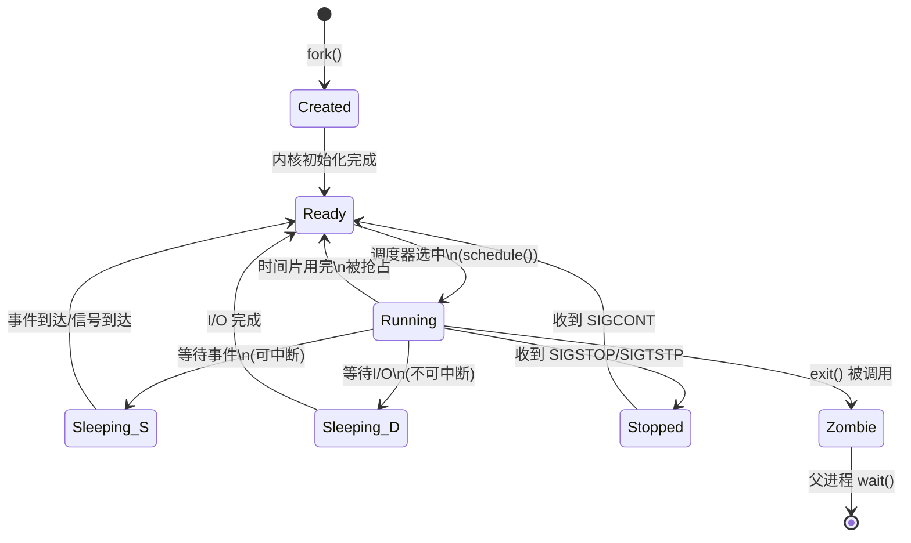
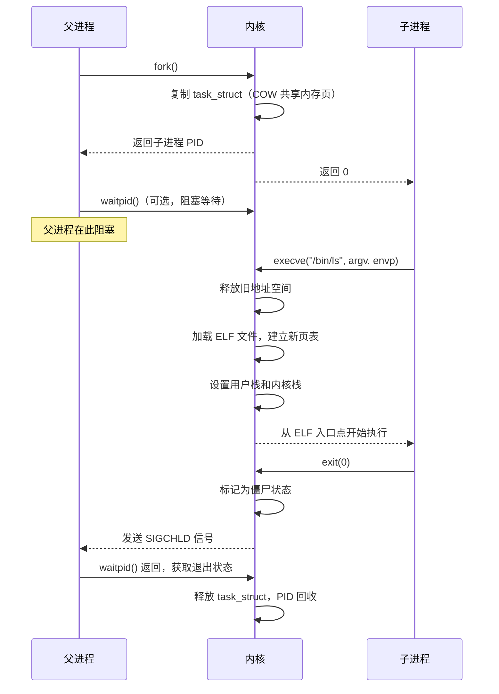

## 六、进程管理

进程是操作系统资源分配和调度的基本单位。理解进程管理是掌握 Linux 系统运维、性能调优和安全攻防的基础。攻击者通过进程注入、提权、隐藏进程等手段实现持久化；防御者通过进程监控、资源限制、权限管控构建安全防线。本章从内核原理到用户态工具，系统讲解 Linux 进程管理的完整知识体系。

### 6.1 进程基本概念

#### 6.1.1 进程与程序的区别

程序是存储在磁盘上的静态二进制文件（ELF 格式），进程是程序被加载到内存后的动态执行实例。一个程序可以对应多个进程——例如 `/usr/sbin/sshd` 是一个程序文件，但系统中可能存在多个 sshd 进程分别服务不同的 SSH 连接。

| 维度 | 程序（Program） | 进程（Process） |
|------|-----------------|-----------------|
| 存在形式 | 磁盘上的静态文件 | 内存中的动态实体 |
| 生命周期 | 永久存储 | 创建→运行→终止 |
| 资源占用 | 仅占用磁盘空间 | 占用 CPU、内存、文件描述符等 |
| 数据结构 | ELF 文件头、段表 | 进程控制块（PCB） |
| 实例关系 | 一对多 | 一个进程对应一个程序 |

#### 6.1.2 进程控制块（PCB）

Linux 内核使用 `task_struct` 结构体（定义在 `include/linux/sched.h`）来描述一个进程，这是进程在内核中的唯一身份标识。每个 `task_struct` 包含以下关键信息：

- **标识信息**：PID（进程 ID）、TGID（线程组 ID）、UID/GID（所属用户和组）、会话 ID、进程组 ID
- **调度信息**：进程状态、优先级（nice 值 -20 到 19）、调度策略（SCHED_OTHER/SCHED_FIFO/SCHED_RR）、时间片统计
- **内存信息**：指向 `mm_struct` 的指针，描述进程的虚拟地址空间布局（代码段、数据段、堆、栈、mmap 区域）
- **文件信息**：指向 `files_struct` 的指针，包含打开的文件描述符表
- **信号信息**：信号掩码、待处理信号队列、信号处理函数表
- **父子关系**：指向父进程 `task_struct` 的指针、子进程链表、兄弟链表

```c
// 内核源码 include/linux/sched.h（简化版）
struct task_struct {
    volatile long           state;          // 进程状态
    int                     on_cpu;         // 是否在 CPU 上运行
    int                     prio;           // 动态优先级
    int                     static_prio;    // 静态优先级（由 nice 计算）
    const struct sched_class *sched_class;  // 调度类
    struct mm_struct        *mm;            // 内存描述符
    struct files_struct     *files;         // 打开的文件表
    pid_t                   pid;            // 进程 ID
    pid_t                   tgid;           // 线程组 ID
    struct task_struct      *real_parent;   // 真实父进程
    struct task_struct      *parent;        // 养父进程（用于 ptrace）
    struct list_head        children;       // 子进程链表
    struct signal_struct    *signal;        // 信号共享结构
    struct sighand_struct   *sighand;       // 信号处理函数
    // ... 数百个其他字段
};
```

#### 6.1.3 进程的内存布局

每个进程拥有独立的虚拟地址空间（32 位系统 4GB，64 位系统 128TB 用户空间），由内核通过页表映射到物理内存。典型布局从低地址到高地址：

| 区域 | 内容 | 特点 |
|------|------|------|
| 代码段（.text） | 可执行指令 | 只读、可共享 |
| 数据段（.data） | 已初始化全局变量 | 可读写 |
| BSS 段（.bss） | 未初始化全局变量 | 加载时清零 |
| 堆（Heap） | 动态分配内存（malloc/new） | 向高地址增长 |
| 内存映射区（mmap） | 共享库、文件映射、匿名映射 | 位于堆和栈之间 |
| 栈（Stack） | 局部变量、函数调用帧、返回地址 | 向低地址增长，LIFO 结构 |
| 内核空间 | 内核代码和数据 | 用户态不可访问 |

```bash
# 查看进程内存布局
cat /proc/self/maps
# 或使用 pmap 工具
pmap -x $(pidof bash)
```

示例输出：

```text
Address           Kbytes     RSS   Dirty Mode  Mapping
0000555555554000     192     108       0 r--   /usr/bin/bash
0000555555583000     840     624       0 r-x   /usr/bin/bash
0000555555665000     316     200       0 r--   /usr/bin/bash
00005555556b4000      16      16      16 rw-   /usr/bin/bash
00005555556b8000      40      32      32 rw-   [anon]
00007ffff7dc3000    1868    1024       0 r-x   /usr/lib/libc.so.6
...
7ffffffde000       132      16      16 rw-   [stack]
```

#### 6.1.4 进程与线程

在 Linux 内核中，进程和线程本质上都是 `task_struct`，区别在于资源共享程度：

| 维度 | 进程（Process） | 线程（Thread） |
|------|-----------------|----------------|
| 地址空间 | 独立的 mm_struct | 共享父进程的 mm_struct |
| 文件描述符 | 独立的 files_struct | 共享父进程的 files_struct |
| 信号处理 | 独立的信号表 | 共享信号处理函数（但有独立信号掩码） |
| 创建方式 | fork() + exec() | clone() 带 CLONE_VM 标志 |
| 通信方式 | IPC（管道、共享内存、socket 等） | 直接读写共享变量 |
| 切换开销 | 需要切换页表（TLB 刷新） | 不切换页表，开销小 |
| 隔离性 | 强隔离，一个崩溃不影响另一个 | 弱隔离，一个崩溃可能影响所有 |

Linux 不区分 `fork()` 和 `clone()` 的底层实现——它们都调用 `kernel_clone()`，只是传入的标志不同。`pthread_create()` 底层就是调用 `clone(CLONE_VM | CLONE_FS | CLONE_FILES | CLONE_SIGHAND | CLONE_THREAD | ...)`。

### 6.2 进程生命周期与状态

#### 6.2.1 进程状态机

Linux 进程在生命周期中经历以下状态转换：



每个状态的详细说明：

| 状态 | ps 标记 | 内核常量 | 含义 | 典型场景 |
|------|---------|----------|------|----------|
| 运行/就绪 | R | TASK_RUNNING | 正在 CPU 上运行或在运行队列中等待 | 任何正在执行的进程 |
| 可中断睡眠 | S | TASK_INTERRUPTIBLE | 等待某个事件（信号量、I/O、定时器），可被信号唤醒 | 读写文件、等待网络数据 |
| 不可中断睡眠 | D | TASK_UNINTERRUPTIBLE | 等待硬件 I/O 完成，不响应信号 | 磁盘 I/O、某些内核锁 |
| 停止 | T | TASK_STOPPED | 被信号暂停 | Ctrl+Z、调试器 attach |
| 僵尸 | Z | EXIT_ZOMBIE | 已调用 exit() 但父进程未 wait() 回收 | 子进程先于父进程退出 |
| 已终止 | X | EXIT_DEAD | 最终状态，资源已完全回收 | 内核内部状态 |

#### 6.2.2 僵尸进程详解

僵尸进程是最常见的进程管理问题之一。当子进程调用 `exit()` 终止后，内核会保留其退出状态和资源统计信息（占用 PID 表项和 task_struct 的一小部分内存），等待父进程通过 `wait()` 或 `waitpid()` 读取。如果父进程始终不调用 wait，子进程就停留在 Z 状态。

僵尸进程的危害：
- **PID 耗尽**：每个僵尸进程占用一个 PID，Linux 默认 PID 最大值为 32768（可通过 `/proc/sys/kernel/pid_max` 调整）。大量僵尸进程会导致系统无法创建新进程
- **task_struct 泄漏**：每个僵尸进程的 `task_struct` 约占 6-10KB 内存
- **不消耗 CPU 和内存**：与"失控进程"不同，僵尸进程不会消耗 CPU 或用户态内存

僵尸进程的产生原因：
1. 父进程编写不当，没有注册 SIGCHLD 信号处理函数，也没有调用 wait()
2. 父进程陷入死循环或长时间阻塞，未及时回收子进程
3. 父进程的信号处理函数中 wait() 调用丢失（信号合并问题）

处理僵尸进程的方法：

```bash
# 方法1：向父进程发送 SIGCHLD 信号，提醒它回收子进程
kill -SIGCHLD <父进程PID>

# 方法2：如果方法1无效，杀死父进程（僵尸进程会被 init/systemd 收养并回收）
kill -9 <父进程PID>

# 方法3：查找僵尸进程及其父进程
ps aux | awk '$8=="Z" {print}'
# 或
ps -eo pid,ppid,stat,cmd | grep -w Z
```

预防僵尸进程的编程方法：

```c
// 方法1：注册 SIGCHLD 信号处理函数（推荐）
#include <signal.h>
#include <sys/wait.h>

void sigchld_handler(int sig) {
    // 使用 while 循环处理所有已终止的子进程（信号合并问题）
    while (waitpid(-1, NULL, WNOHANG) > 0) {
        // 回收成功
    }
}

int main() {
    struct sigaction sa;
    sa.sa_handler = sigchld_handler;
    sigemptyset(&sa.sa_mask);
    sa.sa_flags = SA_RESTART | SA_NOCLDSTOP;
    sigaction(SIGCHLD, &sa, NULL);
    // ... 创建子进程的代码
}

// 方法2：使用 signal(SIGCHLD, SIG_IGN)（简单但有兼容性问题）
// Linux 上 SIG_IGN SIGCHLD 会自动回收子进程，不产生僵尸
signal(SIGCHLD, SIG_IGN);

// 方法3：双 fork 技巧（用于 daemon 场景）
// 父进程创建子进程后立即退出，子进程由 init 收养
// 孙进程再执行实际任务，其退出由 init 回收
```

#### 6.2.3 孤儿进程

当父进程先于子进程退出时，子进程成为孤儿进程，会被 PID 1 的 init 进程（现代 Linux 上是 systemd）收养。孤儿进程本身不是问题——init 进程会负责回收它们。双 fork 技巧正是利用了这个机制来避免僵尸进程。

```bash
# 查看被 systemd 收养的进程（PPID 为 1）
ps -eo pid,ppid,stat,cmd | awk '$2==1' | head -20
```

### 6.3 进程创建与执行

#### 6.3.1 fork() 系统调用

`fork()` 是 Unix 系统创建进程的唯一方式（Linux 还有 `clone()` 和 `vfork()`）。`fork()` 调用一次，返回两次：

- 父进程中返回子进程的 PID（> 0）
- 子进程中返回 0
- 出错返回 -1

`fork()` 使用写时复制（Copy-on-Write, COW）技术：子进程创建时与父进程共享相同的物理内存页，只有在某一方尝试写入时才真正复制该页。这使得 `fork()` 即使在大地址空间上也非常高效。

```c
#include <stdio.h>
#include <unistd.h>
#include <sys/wait.h>

int main() {
    pid_t pid = fork();

    if (pid < 0) {
        perror("fork failed");
        return 1;
    } else if (pid == 0) {
        // 子进程代码
        printf("子进程 PID=%d, PPID=%d\n", getpid(), getppid());
        _exit(0);  // 使用 _exit() 而非 exit()，避免刷新 stdio 缓冲区
    } else {
        // 父进程代码
        printf("父进程 PID=%d, 子进程 PID=%d\n", getpid(), pid);
        int status;
        waitpid(pid, &status, 0);
        if (WIFEXITED(status)) {
            printf("子进程正常退出，状态码=%d\n", WEXITSTATUS(status));
        }
    }
    return 0;
}
```

#### 6.3.2 exec() 系统调用族

`exec()` 用新程序替换当前进程的地址空间（代码段、数据段、堆、栈），但保留 PID、打开的文件描述符（除非设置了 close-on-exec 标志）、信号处理等。

`exec()` 是一组函数，以不同方式指定程序和参数：

| 函数 | 程序指定方式 | 参数传递方式 | 环境变量 |
|------|-------------|-------------|----------|
| `execl(path, arg0, ..., NULL)` | 完整路径 | 可变参数列表 | 继承当前 |
| `execlp(file, arg0, ..., NULL)` | 文件名（搜索 PATH） | 可变参数列表 | 继承当前 |
| `execle(path, arg0, ..., NULL, envp[])` | 完整路径 | 可变参数列表 | 自定义数组 |
| `execv(path, argv[])` | 完整路径 | 字符串数组 | 继承当前 |
| `execvp(file, argv[])` | 文件名（搜索 PATH） | 字符串数组 | 继承当前 |
| `execve(path, argv[], envp[])` | 完整路径 | 字符串数组 | 自定义数组 |

```c
// 典型的 fork + exec 模式
pid_t pid = fork();
if (pid == 0) {
    // 子进程：执行新程序
    char *args[] = {"ls", "-la", "/tmp", NULL};
    execvp("ls", args);
    perror("execvp failed");  // 只有 exec 失败才会执行到这里
    _exit(127);
}
```

#### 6.3.3 fork + exec 的完整流程



#### 6.3.4 vfork() 与 posix_spawn()

- **vfork()**：父进程阻塞直到子进程调用 exec() 或 exit()，子进程直接共享父进程的地址空间（不 COW）。性能略高于 fork()，但非常危险——子进程的任何内存写入都会影响父进程。现代 glibc 在内部已很少使用
- **posix_spawn()**：POSIX 标准函数，语义等价于 fork + exec，但允许底层实现做更多优化（如在内核态直接创建新进程映像，避免复制父进程地址空间）。glibc 的 posix_spawn() 在 Linux 上通常直接调用 clone + execve，跳过 COW

### 6.4 进程调度

#### 6.4.1 CFS 调度器

Linux 默认使用完全公平调度器（Completely Fair Scheduler, CFS）。CFS 的核心思想是理想 CPU 模型：在 N 个进程竞争 CPU 时，每个进程获得 1/N 的 CPU 时间。CFS 使用红黑树按虚拟运行时间（vruntime）组织所有就绪进程，vruntime 最小的进程位于树的最左侧，优先被调度。

CFS 的关键参数：

| 参数 | 说明 | 默认值 |
|------|------|--------|
| `sched_latency` | 调度延迟，所有进程至少运行一次的时间窗口 | 6ms（`/proc/sys/kernel/sched_latency_ns`） |
| `sched_min_granularity` | 每个进程的最小运行时间片 | 0.75ms |
| `sched_nr_latency` | 一个延迟周期内可调度的最多进程数 | latency / min_granularity = 8 |
| `sched_wakeup_granularity` | 唤醒抢占阈值 | 1ms |

当进程数超过 `sched_nr_latency` 时，时间片 = `latency / 进程数`，但不低于 `min_granularity`。

#### 6.4.2 Nice 值与优先级

Nice 值（-20 到 19）影响进程获得 CPU 时间的比例。Nice 值越低，优先级越高。Nice 值不是绝对优先级，而是 CFS 权重——nice 值每差 1，CPU 时间约差 10%。

```bash
# 查看进程 nice 值
ps -eo pid,ni,comm | head -20

# 启动进程时设置 nice 值（值越低优先级越高）
nice -n 10 ./cpu_heavy_task      # 以较低优先级运行
nice -n -5 ./critical_task       # 以较高优先级运行（需要 root）

# 修改运行中进程的 nice 值
renice -n 15 -p 1234             # 降低 PID 1234 的优先级
renice -n -5 -p 1234             # 提高优先级（需要 root）
renice -n 10 -u nginx            # 修改 nginx 用户所有进程的优先级
```

#### 6.4.3 实时调度策略

对于延迟敏感的应用，Linux 支持两种实时调度策略：

| 策略 | 内核常量 | 调度方式 | 优先级范围 |
|------|----------|----------|-----------|
| FIFO | SCHED_FIFO | 先来先服务，不被同优先级抢占 | 1-99 |
| Round-Robin | SCHED_RR | 时间片轮转，同优先级轮流执行 | 1-99 |
| OTHER | SCHED_OTHER | CFS 默认调度 | 只用 nice 值 |

```bash
# 查看进程调度策略
chrt -p 1234

# 设置实时调度策略
chrt -f 50 ./realtime_task      # FIFO 策略，优先级 50
chrt -r 30 ./realtime_task      # Round-Robin 策略，优先级 30

# 查看所有实时进程
ps -eo pid,cls,rtprio,comm | grep -E "FF|RR"
```

> **安全警告**：实时进程可以饿死普通进程。SCHED_FIFO 且优先级大于 0 的进程如果不主动让出 CPU，系统将完全无响应。内核参数 `sched_rt_runtime_us`（默认 950000，即 0.95 秒/每秒）限制实时进程在 `sched_rt_period_us`（默认 1 秒）内的最大 CPU 使用量，超过后会被强制暂停。可设置为 -1 取消限制（危险）。

### 6.5 信号机制

#### 6.5.1 信号的本质

信号是内核向进程发送的异步通知，用于告知进程发生了某个事件。信号可以在任意时刻中断进程的正常执行流。进程对信号有三种处理方式：

1. **捕获（Catch）**：注册信号处理函数，信号到达时执行自定义逻辑
2. **忽略（Ignore）**：明确表示不处理该信号（SIGKILL 和 SIGSTOP 无法忽略）
3. **默认行为（Default）**：执行内核预设的动作（终止、忽略、停止、继续、产生 core dump）

#### 6.5.2 完整信号列表

| 信号 | 编号 | 默认行为 | 说明 | 常见用途 |
|------|------|----------|------|----------|
| SIGHUP | 1 | 终止 | 终端挂起或控制进程死亡 | 守护进程重新加载配置文件 |
| SIGINT | 2 | 终止 | 键盘中断 | Ctrl+C |
| SIGQUIT | 3 | core dump | 键盘退出 | Ctrl+\ |
| SIGILL | 4 | core dump | 非法指令 | 程序错误 |
| SIGTRAP | 5 | core dump | 断点/跟踪陷阱 | 调试器断点 |
| SIGABRT | 6 | core dump | 进程主动中止 | abort() 函数 |
| SIGBUS | 7 | core dump | 总线错误 | 内存对齐问题 |
| SIGFPE | 8 | core dump | 浮点异常 | 除零错误 |
| SIGKILL | 9 | 终止 | **强制终止（不可捕获/忽略）** | `kill -9` |
| SIGUSR1 | 10 | 终止 | 用户自定义信号 1 | 应用特定功能（如 nginx 日志轮转） |
| SIGSEGV | 11 | core dump | 段错误 | 非法内存访问 |
| SIGUSR2 | 12 | 终止 | 用户自定义信号 2 | 应用特定功能 |
| SIGPIPE | 13 | 终止 | 管道破裂 | 向已关闭的管道/socket 写入 |
| SIGALRM | 14 | 终止 | 定时器超时 | alarm() 函数 |
| SIGTERM | 15 | 终止 | **正常终止请求** | `kill`（默认信号） |
| SIGSTKFLT | 16 | 终止 | 栈溢出（已废弃） | — |
| SIGCHLD | 17 | 忽略 | 子进程状态变化 | 父进程回收子进程 |
| SIGCONT | 18 | 继续 | 继续执行 | 从停止状态恢复 |
| SIGSTOP | 19 | 停止 | **暂停执行（不可捕获/忽略）** | 调试器暂停 |
| SIGTSTP | 20 | 停止 | 终端暂停 | Ctrl+Z |
| SIGTTIN | 21 | 停止 | 后台进程读终端 | 后台进程尝试读 stdin |
| SIGTTOU | 22 | 停止 | 后台进程写终端 | 后台进程尝试写 stdout |
| SIGURG | 23 | 忽略 | socket 有紧急数据 | 带外数据 |
| SIGXCPU | 24 | core dump | 超过 CPU 时间限制 | ulimit -t 超限 |
| SIGXFSZ | 25 | core dump | 超过文件大小限制 | ulimit -f 超限 |
| SIGVTALRM | 26 | 终止 | 虚拟定时器超时 | setitimer(ITIMER_VIRTUAL) |
| SIGPROF | 27 | 终止 | 性能分析定时器超时 | setitimer(ITIMER_PROF) |
| SIGWINCH | 28 | 忽略 | 终端窗口大小变化 | 终端程序重绘 |
| SIGIO | 29 | 终止 | I/O 就绪 | 异步 I/O |
| SIGPWR | 30 | 终止 | 电源故障 | UPS 通知低电量 |
| SIGSYS | 31 | core dump | 非法系统调用 | 沙箱违规 |

#### 6.5.3 信号处理编程

```c
#include <signal.h>
#include <stdio.h>
#include <unistd.h>
#include <stdlib.h>

// 推荐使用 sigaction() 而非 signal()——sigaction 行为更明确、可移植性更好
volatile sig_atomic_t got_signal = 0;

void handler(int sig) {
    got_signal = sig;
    // 信号处理函数中只能调用异步信号安全（async-signal-safe）函数
    // write() 是安全的，printf/malloc/free 不安全
    const char msg[] = "Signal caught\n";
    write(STDOUT_FILENO, msg, sizeof(msg) - 1);
}

int main() {
    struct sigaction sa;
    sa.sa_handler = handler;
    sigemptyset(&sa.sa_mask);        // 处理信号时额外屏蔽的信号集
    sa.sa_flags = SA_RESTART;        // 被信号中断的系统调用自动重启

    sigaction(SIGTERM, &sa, NULL);   // 捕获 SIGTERM
    sigaction(SIGINT, &sa, NULL);    // 捕获 SIGINT (Ctrl+C)

    while (!got_signal) {
        pause();  // 挂起等待信号
    }
    printf("Caught signal %d, exiting gracefully\n", got_signal);
    return 0;
}
```

#### 6.5.4 信号在安全攻防中的应用

```bash
# 攻击者常用信号技巧
kill -0 <PID>                 # 检测进程是否存在（不发送任何信号）
kill -USR1 $(pidof nginx)     # 让 nginx 重新打开日志文件（日志轮转）
kill -HUP $(pidof sshd)       # 让 sshd 重新加载配置（不断开连接）
kill -WINCH $(pidof tmux)     # 通知终端大小变化

# 防御者监控信号
# strace 跟踪进程收到的信号
strace -e signal -p 1234

# 查看进程的信号掩码和待处理信号
cat /proc/1234/status | grep -E "^(Sig|Shd)"
# SigPnd: 待处理信号（线程级）
# SigBlk: 被阻塞的信号
# SigCgt: 已捕获的信号
# ShdPnd: 共享待处理信号（进程级）
```

### 6.6 进程间通信（IPC）

#### 6.6.1 管道（Pipe）

管道是最古老的 IPC 机制，分为匿名管道和命名管道：

```bash
# 匿名管道：仅用于父子进程之间，shell 中的 | 操作符
ls -la /etc | grep ".conf" | wc -l
# 内核实现：shell 为每个 | 创建一个管道，ls 的 stdout 连接到管道写端
# grep 的 stdin 连接到管道读端

# 命名管道（FIFO）：可用于任意不相关进程
mkfifo /tmp/myfifo
# 进程 A
echo "hello" > /tmp/myfifo
# 进程 B
cat /tmp/myfifo

# 管道特性
# - 单向数据流（半双工）
# - 内核缓冲区默认 64KB（可通过 /proc/sys/fs/pipe-max-size 调整，最大 1MB）
# - 写端关闭后，读端读到 EOF
# - 读端关闭后，写端收到 SIGPIPE
# - 数据是字节流，没有消息边界
```

#### 6.6.2 共享内存

共享内存是最快的 IPC 方式——多个进程映射同一块物理内存，无需内核中转数据：

```c
// POSIX 共享内存示例
#include <sys/mman.h>
#include <fcntl.h>
#include <unistd.h>
#include <string.h>

// 写端
int fd = shm_open("/myshm", O_CREAT | O_RDWR, 0666);
ftruncate(fd, 4096);
void *ptr = mmap(NULL, 4096, PROT_READ | PROT_WRITE, MAP_SHARED, fd, 0);
strcpy(ptr, "Hello from writer");
munmap(ptr, 4096);
close(fd);

// 读端
int fd = shm_open("/myshm", O_RDONLY, 0);
void *ptr = mmap(NULL, 4096, PROT_READ, MAP_SHARED, fd, 0);
printf("Read: %s\n", (char *)ptr);
munmap(ptr, 4096);
close(fd);
shm_unlink("/myshm");  // 清理
```

```bash
# 管理共享内存
ipcs -m                      # 查看所有共享内存段
ipcrm -m <shmid>             # 删除共享内存段

# 查看系统共享内存限制
ipcs -l
# max number of segments = 4096
# max seg size (kbytes) = 18014398509465599
# max total shared memory (kbytes) = 18014398442373116
# min seg size (bytes) = 1
```

#### 6.6.3 消息队列

消息队列提供有消息边界的通信，每条消息有类型和优先级：

```bash
# 查看消息队列
ipcs -q

# POSIX 消息队列（推荐）
# 编程接口：mq_open, mq_send, mq_receive, mq_close
# 命名方式：/name（以斜杠开头）
# 持久性：内核持续存在直到 mq_unlink
```

#### 6.6.4 Unix Domain Socket

Unix Domain Socket 是同一台机器上最灵活的 IPC 方式，支持双向通信、传递文件描述符和进程凭证：

```bash
# 系统服务广泛使用 Unix Socket
# Docker daemon
ls -la /var/run/docker.sock
# systemd journal
ls -la /run/systemd/journal/stdout
# X11 显示服务器
ls -la /tmp/.X11-unix/

# 使用 socat 测试 Unix Socket
socat UNIX-CONNECT:/var/run/docker.sock -
# 发送 HTTP 请求
echo -e "GET /version HTTP/1.0\r\n\r\n" | socat UNIX-CONNECT:/var/run/docker.sock -
```

#### 6.6.5 IPC 方式对比

| 方式 | 速度 | 方向 | 消息边界 | 跨机器 | 传递fd | 复杂度 |
|------|------|------|----------|--------|--------|--------|
| 匿名管道 | 快 | 单向 | 无 | 否 | 否 | 低 |
| 命名管道 | 快 | 单向 | 无 | 否 | 否 | 低 |
| 共享内存 | 最快 | 双向 | 无 | 否 | 否 | 高（需同步） |
| 消息队列 | 中等 | 双向 | 有 | 否 | 否 | 中等 |
| Unix Socket | 快 | 双向 | 有 | 否 | 是 | 中等 |
| TCP Socket | 中等 | 双向 | 有 | 是 | 否 | 中等 |

### 6.7 进程监控与管理工具

#### 6.7.1 ps 命令详解

`ps`（Process Snapshot）是最基本的进程查看工具。Linux 上有两种语法风格：BSD 风格（无 `-`）和 Unix 风格（有 `-`）。

```bash
# 常用组合：显示所有进程的完整信息
ps aux
# USER  PID %CPU %MEM  VSZ   RSS TTY STAT START TIME COMMAND

# 只看特定用户
ps -u nginx

# 按 CPU 使用率排序
ps aux --sort=-%cpu | head -20

# 按内存使用率排序
ps aux --sort=-%mem | head -20

# 自定义输出格式
ps -eo pid,ppid,uid,gid,ni,vsz,rss,stat,start,time,comm

# 查看进程树
ps auxf                # BSD 风格
ps -ejH                # Unix 风格
pstree -p              # 更直观的树形显示

# 查看特定进程的线程
ps -T -p 1234          # 显示 PID 1234 的所有线程
ps -eLf                # 显示所有进程的所有线程（LWP 列）

# STAT 列含义速查
# R - 运行中    S - 可中断睡眠    D - 不可中断睡眠
# T - 已停止    Z - 僵尸          X - 已终止
# s - 会话领导者 l - 多线程        + - 前台进程组
# < - 高优先级  N - 低优先级      L - 锁定页面
```

#### 6.7.2 top 与 htop

```bash
# top 交互命令
# 1     - 显示每个 CPU 核心的使用率
# M     - 按内存排序
# P     - 按 CPU 排序
# k     - 杀死进程
# r     - renice 进程
# c     - 显示完整命令行
# H     - 显示线程
# f     - 选择显示字段
# W     - 保存当前配置
# q     - 退出

# top 批处理模式（用于脚本）
top -bn1 | head -20           # 获取一次快照
top -bn1 -o %CPU | head -20   # 按 CPU 排序的一次快照

# htop 更友好的交互式查看器
htop
# F1 帮助  F2 配置  F3 搜索  F4 过滤  F5 树形
# F6 排序  F7/8 nice  F9 杀死  F10 退出
```

#### 6.7.3 /proc 文件系统

`/proc` 是内核暴露进程信息的虚拟文件系统，每个进程在 `/proc/<PID>/` 下有对应目录：

```bash
# 进程命令行
cat /proc/1234/cmdline | tr '\0' ' '

# 进程环境变量
cat /proc/1234/environ | tr '\0' '\n'

# 进程内存映射
cat /proc/1234/maps

# 进程打开的文件描述符
ls -la /proc/1234/fd/

# 进程状态详细信息
cat /proc/1234/status
# Name:   bash
# State:  S (sleeping)
# Tgid:   1234
# Pid:    1234
# PPid:   1000
# Threads: 1
# FDSize: 256
# VmPeak/VmSize/VmRSS/VmData  内存使用统计

# 进程的网络连接
cat /proc/1234/net/tcp
# 或更方便的方式
ss -tlnp | grep 1234

# 进程的 CPU 和内存统计
cat /proc/1234/stat        # 单行统计（脚本友好）
cat /proc/1234/statm       # 内存统计（页为单位）
cat /proc/1234/io          # I/O 统计

# 系统级 /proc 信息
cat /proc/loadavg          # 负载平均值
cat /proc/meminfo          # 内存信息
cat /proc/cpuinfo          # CPU 信息
cat /proc/sys/kernel/pid_max  # 最大 PID 值
```

#### 6.7.4 进程查找

```bash
# pidof：根据程序名查找 PID
pidof sshd
pidof -s sshd              # 只返回一个（最新的）
pidof -x script.sh         # 包含脚本进程

# pgrep：更灵活的进程查找
pgrep -a sshd              # 显示 PID 和完整命令行
pgrep -u root sshd         # 只查找 root 用户的 sshd
pgrep -c sshd              # 计数
pgrep -f "python app.py"   # 匹配完整命令行（不只是程序名）
pgrep -P 1234              # 查找 PID 1234 的子进程

# lsof：查找进程打开的文件/连接
lsof -p 1234               # 查看 PID 1234 打开的所有文件
lsof -i :80                # 查看谁在使用 80 端口
lsof -u nginx              # 查看 nginx 用户打开的所有文件
lsof +D /var/log           # 查看 /var/log 下被哪些进程打开
```

#### 6.7.5 strace 系统调用追踪

`strace` 是进程调试和安全分析的利器，可以追踪进程的所有系统调用：

```bash
# 追踪新启动的进程
strace ls -la /tmp

# 追踪已运行的进程
strace -p 1234

# 只追踪特定系统调用
strace -e trace=open,read,write -p 1234
strace -e trace=network -p 1234    # 网络相关
strace -e trace=file -p 1234       # 文件相关
strace -e trace=process -p 1234    # 进程相关（fork/exec/wait）
strace -e trace=signal -p 1234     # 信号相关

# 记录到文件（减少终端输出干扰）
strace -o /tmp/strace.log -p 1234

# 显示时间戳
strace -t -p 1234               # 秒级
strace -tt -p 1234              # 微秒级
strace -T -p 1234               # 每个调用的耗时

# 统计每个系统调用的次数和耗时
strace -c -p 1234               # Ctrl+C 后显示统计

# 跟踪子进程
strace -f -p 1234               # follow forks

# 安全分析：追踪进程的文件访问
strace -e trace=openat,connect -p 1234 2>&1 | grep -v ENOENT
```

### 6.8 守护进程与 systemd

#### 6.8.1 传统守护进程的特征

守护进程（Daemon）是长期运行在后台的系统服务进程。传统守护进程的创建步骤（daemon() 函数的实现原理）：

1. **fork()**：父进程退出，子进程继续（脱离终端控制）
2. **setsid()**：创建新会话，成为会话领导者，脱离控制终端
3. **再次 fork()**（可选）：确保进程不是会话领导者，防止重新获得控制终端
4. **chdir("/")**：切换工作目录到根目录，避免阻塞文件系统卸载
5. **umask(0)**：重置文件创建掩码
6. **关闭文件描述符**：关闭 stdin/stdout/stderr，重定向到 /dev/null

```c
// 传统方式创建守护进程（现已不推荐，应使用 systemd）
#include <unistd.h>
#include <sys/stat.h>

void daemonize() {
    if (fork() > 0) _exit(0);       // 父进程退出
    setsid();                         // 创建新会话
    if (fork() > 0) _exit(0);        // 再次 fork
    chdir("/");                       // 切换到根目录
    umask(0);                         // 重置 umask
    close(STDIN_FILENO);              // 关闭标准输入
    close(STDOUT_FILENO);             // 关闭标准输出
    close(STDERR_FILENO);             // 关闭标准错误
    open("/dev/null", O_RDONLY);      // stdin -> /dev/null
    open("/dev/null", O_WRONLY);      // stdout -> /dev/null
    open("/dev/null", O_WRONLY);      // stderr -> /dev/null
}
```

#### 6.8.2 systemd 服务管理

现代 Linux 使用 systemd（PID 1）作为 init 系统和服务管理器。systemd 通过 unit 文件定义服务配置。

```bash
# 服务生命周期管理
systemctl start nginx          # 启动服务
systemctl stop nginx           # 停止服务
systemctl restart nginx        # 重启服务
systemctl reload nginx         # 重新加载配置（不中断服务）
systemctl try-restart nginx    # 仅在运行中时重启

# 状态查询
systemctl status nginx         # 详细状态（含最近日志）
systemctl is-active nginx      # 是否活跃
systemctl is-enabled nginx     # 是否开机自启
systemctl is-failed nginx      # 是否失败

# 开机自启
systemctl enable nginx         # 启用开机自启
systemctl disable nginx        # 禁用开机自启
systemctl enable --now nginx   # 启用自启并立即启动

# 查看所有服务
systemctl list-units --type=service           # 活跃的
systemctl list-units --type=service --all     # 所有（含不活跃）
systemctl list-unit-files --type=service      # 所有 unit 文件

# 重新加载 systemd 配置（修改 unit 文件后必须执行）
systemctl daemon-reload
```

#### 6.8.3 编写 systemd Unit 文件

```ini
# /etc/systemd/system/myapp.service
[Unit]
Description=My Application Service
Documentation=https://example.com/docs
After=network.target mysql.service
Requires=mysql.service
Wants=redis.service

[Service]
Type=simple                          # simple|forking|oneshot|notify|idle
User=myapp
Group=myapp
WorkingDirectory=/opt/myapp
Environment=NODE_ENV=production
EnvironmentFile=/opt/myapp/.env
ExecStartPre=/opt/myapp/pre-start.sh
ExecStart=/usr/bin/node /opt/myapp/server.js
ExecReload=/bin/kill -HUP $MAINPID
ExecStop=/bin/kill -TERM $MAINPID

# 重启策略
Restart=on-failure
RestartSec=5
StartLimitBurst=3
StartLimitIntervalSec=60

# 安全加固
NoNewPrivileges=yes
ProtectSystem=strict
ProtectHome=yes
ReadWritePaths=/opt/myapp/data
PrivateTmp=yes
ProtectKernelTunables=yes
ProtectKernelModules=yes
ProtectControlGroups=yes
RestrictSUIDSGID=yes
RestrictNamespaces=yes

# 资源限制
LimitNOFILE=65535
LimitNPROC=4096
MemoryMax=2G
CPUQuota=200%

# 日志
StandardOutput=journal
StandardError=journal
SyslogIdentifier=myapp

[Install]
WantedBy=multi-user.target
```

```bash
# 部署自定义服务
sudo vim /etc/systemd/system/myapp.service
sudo systemctl daemon-reload
sudo systemctl enable --now myapp
sudo journalctl -u myapp -f          # 实时查看服务日志
```

#### 6.8.4 systemd 定时器（替代 cron）

```ini
# /etc/systemd/system/backup.timer
[Unit]
Description=Daily Backup Timer

[Timer]
OnCalendar=*-*-* 02:00:00            # 每天凌晨 2 点
RandomizedDelaySec=900                # 随机延迟最多 15 分钟
Persistent=true                       # 错过的执行在启动后补上

[Install]
WantedBy=timers.target

# /etc/systemd/system/backup.service
[Unit]
Description=Daily Backup

[Service]
Type=oneshot
ExecStart=/opt/scripts/backup.sh
User=root
```

```bash
systemctl enable --now backup.timer
systemctl list-timers                  # 查看所有定时器
```

### 6.9 资源限制与控制

#### 6.9.1 ulimit 传统限制

```bash
# 查看当前限制
ulimit -a                   # 显示所有限制
ulimit -n                   # 最大打开文件数
ulimit -u                   # 最大进程数
ulimit -v                   # 最大虚拟内存（KB）
ulimit -s                   # 栈大小（KB）

# 设置限制（当前 shell 会话）
ulimit -n 65535             # 增加最大文件描述符
ulimit -u 4096              # 增加最大进程数

# 永久设置：/etc/security/limits.conf
# <domain>  <type>  <item>  <value>
# *         soft    nofile  65535
# *         hard    nofile  65535
# nginx     soft    nproc   4096
# nginx     hard    nproc   8192
# @developers soft  memlock unlimited
```

#### 6.9.2 cgroups v2 资源控制

cgroups（Control Groups）是 Linux 内核提供的资源限制、统计和隔离机制。cgroups v2 是当前推荐版本。

```bash
# 查看 cgroups v2 挂载点
mount | grep cgroup2

# 查看进程所属的 cgroup
cat /proc/1234/cgroup

# systemd 服务的资源限制（在 unit 文件中配置）
# 已在 6.8.3 中展示 MemoryMax、CPUQuota 等配置

# 手动创建 cgroup（不推荐，推荐通过 systemd）
mkdir /sys/fs/cgroup/mygroup
echo "+cpu +memory +io" > /sys/fs/cgroup/mygroup/cgroup.subtree_control

# 限制内存
echo 512M > /sys/fs/cgroup/mygroup/memory.max
echo 256M > /sys/fs/cgroup/mygroup/memory.high  # 软限制，触发回收

# 限制 CPU
echo "50000 100000" > /sys/fs/cgroup/mygroup/cpu.max  # 50% CPU

# 添加进程到 cgroup
echo 1234 > /sys/fs/cgroup/mygroup/cgroup.procs

# 查看资源使用统计
cat /sys/fs/cgroup/mygroup/memory.current
cat /sys/fs/cgroup/mygroup/cpu.stat
```

### 6.10 进程安全与攻击面

#### 6.10.1 进程权限与 Capabilities

Linux Capabilities 将传统的 root 全能权限拆分为细粒度的能力单元：

```bash
# 查看进程的 capabilities
getpcaps 1234
# 或
cat /proc/1234/status | grep Cap

# 常用 capabilities
# CAP_NET_BIND_SERVICE  绑定 1024 以下端口
# CAP_NET_RAW           使用原始套接字（ping、抓包）
# CAP_SYS_PTRACE        跟踪其他进程（strace、gdb）
# CAP_DAC_OVERRIDE      绕过文件权限检查
# CAP_SYS_ADMIN         大量系统管理操作（最危险）
# CAP_SETUID/GID        改变进程 UID/GID

# 给程序赋予 capabilities
setcap cap_net_bind_service=ep /usr/sbin/nginx
# 使 nginx 可以绑定 80 端口而无需以 root 运行

# 删除 capabilities
setcap -r /usr/sbin/nginx
```

#### 6.10.2 进程注入与隐藏

攻击者常用的进程操作技术：

```bash
# LD_PRELOAD 劫持：注入自定义共享库
# 在 .bashrc 或服务环境中设置，使恶意库在所有程序启动时加载
LD_PRELOAD=/path/to/malicious.so ls  # ls 的行为被篡改

# 检测 LD_PRELOAD 注入
cat /proc/<PID>/maps | grep -i preload
ldd /proc/<PID>/exe

# /proc 隐藏：mount --bind 覆盖
mount --bind /empty/dir /proc/<PID>   # 隐藏进程

# 检测隐藏进程
ls /proc | grep -E '^[0-9]+$' | sort -n > /tmp/proc_pids.txt
ps -eo pid | tail -n+2 | sort -n > /tmp/ps_pids.txt
diff /tmp/proc_pids.txt /tmp/ps_pids.txt

# ptrace 注入：附加到运行中的进程，修改其内存
# 攻击者可以注入 shellcode 到目标进程
ptrace(PTRACE_ATTACH, target_pid, ...);
ptrace(PTRACE_POKETEXT, target_pid, addr, data);  // 写入代码

# 防御：禁用 ptrace
echo 2 > /proc/sys/kernel/yama/ptrace_scope
# 0: 任何进程可以 ptrace 任何同 UID 进程
# 1: 只有父进程可以 ptrace 子进程（默认）
# 2: 只有特权进程可以 ptrace
# 3: 完全禁用 ptrace
```

#### 6.10.3 安全审计与监控

```bash
# auditd 进程审计
# 监控特定程序的执行
auditctl -a always,exit -F arch=b64 -S execve -F exe=/usr/bin/curl

# 监控特定用户的进程操作
auditctl -a always,exit -F arch=b64 -S kill -F uid=1000

# 查看审计日志
ausearch -m EXECVE -ts recent
ausearch -ua 1000 -ts today

# 进程行为基线
# 记录正常运行时的进程列表
ps -eo pid,ppid,uid,cmd > /var/log/process_baseline.txt

# 定期对比检查异常进程
diff <(ps -eo pid,cmd | sort) <(sort /var/log/process_baseline.txt)

# 实时进程监控工具
# atop：系统资源监控（CPU、内存、磁盘、网络），支持回放
# glances：跨平台系统监控
# sysdig：系统活动捕获和分析（类似 strace + tcpdump）
```

### 6.11 进程管理实战场景

#### 6.11.1 CPU 飙高排查流程

```bash
# 第一步：确认系统负载
uptime
# load average: 8.50, 7.20, 5.30  （负载超过 CPU 核心数即为过载）

# 第二步：找出 CPU 占用最高的进程
top -bn1 -o %CPU | head -20
# 或
ps aux --sort=-%cpu | head -10

# 第三步：深入分析可疑进程
# 查看线程级 CPU 使用
top -H -p 1234

# 查看进程在做什么
strace -c -p 1234           # 统计系统调用
perf top -p 1234            # 性能热点分析
perf record -g -p 1234      # 采样记录
perf report                  # 分析报告

# 第四步：检查是否为异常进程
ls -la /proc/1234/exe       # 可执行文件位置
cat /proc/1234/cmdline      # 启动命令
cat /proc/1234/environ      # 环境变量（检查是否被篡改）
cat /proc/1234/maps         # 内存映射（检查是否有可疑库）

# 第五步：临时缓解
renice +19 -p 1234          # 降低优先级（温和）
kill -STOP 1234             # 暂停进程（中等）
kill -TERM 1234             # 优雅终止
kill -9 1234                # 强制终止（最后手段）
```

#### 6.11.2 内存泄漏排查

```bash
# 监控进程内存增长
watch -n 5 'ps -p 1234 -o pid,rss,vsz,comm'

# 使用 valgrind 检测内存泄漏（开发环境）
valgrind --leak-check=full ./myprogram

# 使用 /proc 统计内存增长
while true; do
    echo "$(date): $(awk '/VmRSS/{print $2}' /proc/1234/status) kB"
    sleep 10
done

# 使用 smaps 获取详细内存统计
cat /proc/1234/smaps_rollup
# Rss:     实际物理内存
# Pss:     按共享比例分摊的物理内存
# Shared:  共享内存
# Private: 私有内存（泄漏的主要部分）

# pmap 图形化内存布局
pmap -XX 1234
```

#### 6.11.3 进程启动失败排查

```bash
# 检查 systemd 服务启动失败原因
systemctl status myapp
journalctl -u myapp -n 50 --no-pager
journalctl -u myapp --since "10 minutes ago"

# 常见失败原因
# 1. 权限不足
ls -la /opt/myapp/server          # 检查可执行权限
id myapp                          # 检查用户是否存在

# 2. 端口被占用
ss -tlnp | grep :8080             # 检查端口占用

# 3. 依赖库缺失
ldd /opt/myapp/server             # 检查动态库依赖
ldconfig -p | grep libssl         # 检查库是否存在

# 4. 文件描述符限制
cat /proc/<PID>/limits            # 检查进程限制
ulimit -n                         # 当前 shell 的文件描述符限制

# 5. SELinux/AppArmor 阻止
getenforce                        # 检查 SELinux 状态
ausearch -m AVC -ts recent        # SELinux 拒绝日志
aa-status                         # AppArmor 状态
```

### 6.12 本章小结

| 知识领域 | 核心概念 | 关键命令 |
|----------|----------|----------|
| 进程基础 | PCB、虚拟地址空间、COW | `cat /proc/<PID>/status` |
| 生命周期 | 状态机、僵尸进程、孤儿进程 | `ps aux`, `pstree` |
| 创建执行 | fork/exec/wait、ELF 加载 | `strace -e process` |
| 调度 | CFS、nice、实时策略 | `nice`, `renice`, `chrt` |
| 信号 | 信号表、sigaction、异步信号安全 | `kill`, `strace -e signal` |
| IPC | 管道、共享内存、socket | `ipcs`, `ss`, `mkfifo` |
| 监控 | ps/top/htop、/proc、strace | `top`, `htop`, `lsof` |
| 服务管理 | systemd unit、timer | `systemctl`, `journalctl` |
| 资源控制 | ulimit、cgroups v2 | `ulimit`, cgroup 文件接口 |
| 安全 | Capabilities、ptrace、audit | `getpcaps`, `auditctl` |
