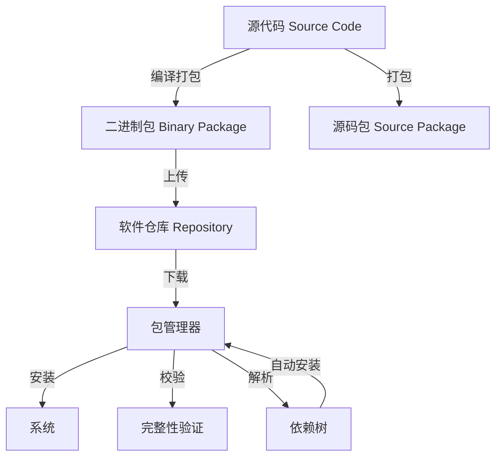
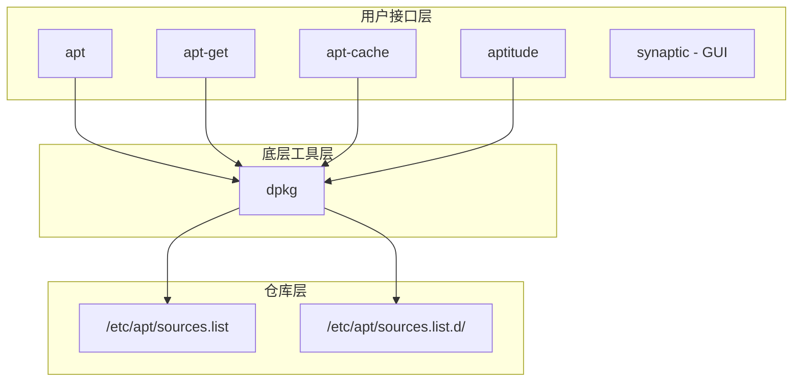

## 七、包管理系统

软件包管理系统（Package Management System）是 Linux 生态的基础设施之一。它负责软件的安装、升级、卸载、依赖解析和版本管理，是操作系统与应用软件之间的桥梁。理解包管理系统的原理和使用方式，是系统管理和安全运维的基本功。

### 7.1 包管理系统的架构与原理

#### 7.1.1 什么是软件包

在 Linux 中，软件包（Package）是将程序文件、配置文件、元数据、安装/卸载脚本打包在一起的归档文件。一个典型的软件包包含以下内容：

| 组成部分 | 说明 | 示例 |
|---------|------|------|
| 程序文件 | 二进制可执行文件、库文件 | `/usr/bin/nginx`、`/usr/lib/libssl.so` |
| 配置文件 | 默认配置，安装后可修改 | `/etc/nginx/nginx.conf` |
| 元数据 | 包名、版本、依赖、描述、维护者 | `Package: nginx, Version: 1.24.0` |
| 安装脚本 | 安装前/后执行的脚本（preinst/postinst） | 创建用户、设置权限 |
| 卸载脚本 | 卸载前/后执行的脚本（prerm/postrm） | 停止服务、清理文件 |
| 校验和 | 文件完整性校验值 | SHA256 哈希 |

包的本质是一个归档文件加上元数据。不同发行版使用不同的归档格式：

- **DEB 格式**：基于 `ar` 归档，用于 Debian、Ubuntu、Kali、Linux Mint 等
- **RPM 格式**：基于 `cpio` 归档，用于 RHEL、CentOS、Fedora、Rocky Linux、AlmaLinux 等
- **PKG 格式**：用于 Arch Linux、Alpine Linux（各自的实现不同）



#### 7.1.2 包管理器的三层架构

现代包管理系统通常分为三层：

**第一层：底层工具（Low-level Tool）**

直接操作包文件，不处理依赖关系。典型代表是 `dpkg` 和 `rpm`。它们的功能包括：

- 安装单个包文件（不自动解决依赖）
- 查询已安装包的信息
- 验证包的完整性
- 提取包中的文件

```bash
# dpkg 示例：安装单个 deb 包（不自动解决依赖）
sudo dpkg -i package.deb

# rpm 示例：安装单个 rpm 包
sudo rpm -ivh package.rpm
```

底层工具的问题在于：如果包 A 依赖包 B 和包 C，而 B 又依赖 D，你必须手动按正确顺序安装所有依赖。这在复杂系统中几乎不可行。

**第二层：高层工具（High-level Tool）**

在底层工具之上封装了依赖解析、仓库管理、自动升级等功能。典型代表是 `apt`（APT 系）和 `dnf`/`yum`（RPM 系）。高层工具的核心能力：

- 自动解析并安装依赖链
- 从远程仓库搜索、下载包
- 批量升级系统中所有已安装的包
- 处理包冲突和替代关系

**第三层：仓库（Repository）**

软件仓库是存储软件包及其元数据的服务器。仓库通过索引文件（`Packages.gz`、`repodata/` 等）提供包的搜索和下载。一个完整的仓库管理流程：

1. 维护者编译软件并打包
2. 将包上传到仓库服务器
3. 重新生成仓库索引（元数据）
4. 用户配置仓库地址（sources.list / repo 文件）
5. 用户运行更新命令，下载最新索引
6. 用户搜索或安装包，管理器从仓库下载并安装

#### 7.1.3 依赖解析机制

依赖解析是包管理器最核心的功能。每个包声明自己依赖哪些其他包（以及版本约束），包管理器据此构建依赖图（DAG，有向无环图）并计算出完整的安装序列。

常见的依赖类型：

| 依赖类型 | 含义 | 示例 |
|---------|------|------|
| Depends | 硬依赖，缺少则无法运行 | nginx 依赖 libpcre3 |
| Recommends | 推荐安装，不强制 | apt 推荐安装建议的插件 |
| Suggests | 建议安装，可忽略 | 可选的文档或工具 |
| Conflicts | 冲突，不能同时存在 | apache2 和 nginx 默认冲突 |
| Replaces | 替代关系 | 新包取代旧包的功能 |
| Provides | 虚拟包，多个包提供同一功能 | mail-transport-agent 由多个 MTA 提供 |

依赖地狱（Dependency Hell）是早期 Linux 包管理的噩梦：A 依赖 B v1.x，C 依赖 B v2.x，两者无法共存。现代包管理器通过以下机制解决这个问题：

- **严格的版本约束**：声明最低版本、最高版本或精确版本
- **ABI 兼容性保证**：同一发行版同版本的库保持 ABI 稳定
- **虚拟包机制**：多个包可以提供相同的功能接口
- **沙箱隔离**：Snap/Flatpak 将依赖打包在应用内部，与系统隔离

### 7.2 DEB 包管理系统（Debian/Ubuntu 系）

DEB 是历史最悠久、使用最广泛的包格式之一。其生态系统包含多个层次的工具：

#### 7.2.1 工具层次关系



**apt vs apt-get 的区别**：`apt` 是 Debian 8 引入的现代命令行接口，整合了 `apt-get` 和 `apt-cache` 的常用功能，输出更友好（进度条、颜色）。`apt-get` 则是面向脚本的稳定接口，输出格式不会随版本变化。日常交互使用 `apt`，脚本中使用 `apt-get`。

#### 7.2.2 APT 完整操作手册

**仓库配置**

```bash
# 主配置文件
cat /etc/apt/sources.list

# 典型内容（Ubuntu 24.04）：
# deb http://archive.ubuntu.com/ubuntu/ noble main restricted universe multiverse
# deb http://archive.ubuntu.com/ubuntu/ noble-updates main restricted universe multiverse
# deb http://security.ubuntu.com/ubuntu/ noble-security main restricted universe multiverse

# 格式说明：
# 类型  URL  发行版代号  组件1 组件2 ...
# 类型：deb（二进制包）、deb-src（源码包）
# 组件：main（官方支持）、restricted（受限驱动）、universe（社区）、multiverse（非自由）

# 添加第三方仓库（推荐方式）
# 1. 添加 GPG 密钥
curl -fsSL https://example.com/repo.gpg | sudo gpg --dearmor -o /usr/share/keyrings/example.gpg

# 2. 添加仓库条目（使用 signed-by 指定密钥）
echo "deb [signed-by=/usr/share/keyrings/example.gpg] https://example.com/repo stable main" | \
  sudo tee /etc/apt/sources.list.d/example.list

# 3. 更新索引
sudo apt update
```

**包的搜索与查询**

```bash
# 搜索包（搜索包名和描述）
apt search nginx

# 查看包的详细信息
apt show nginx

# 查看包的所有可用版本
apt-cache policy nginx

# 查看包的依赖关系
apt-cache depends nginx

# 查看哪些包依赖此包（反向依赖）
apt-cache rdepends nginx

# 查看已安装的包
dpkg -l | grep nginx

# 查看某个包安装了哪些文件
dpkg -L nginx

# 查看某个文件属于哪个包
dpkg -S /usr/bin/nginx

# 列出所有可升级的包
apt list --upgradable
```

**安装与卸载**

```bash
# 安装包
sudo apt install nginx

# 安装特定版本
sudo apt install nginx=1.24.0-1ubuntu4

# 安装本地 deb 文件（自动解决依赖）
sudo apt install ./package.deb

# 仅下载包不安装
apt download nginx

# 卸载包（保留配置文件）
sudo apt remove nginx

# 卸载包并删除配置文件
sudo apt purge nginx

# 自动卸载不再需要的依赖包
sudo apt autoremove

# 完全清理：卸载+删除配置+清理缓存
sudo apt purge nginx && sudo apt autoremove && sudo apt clean
```

**系统升级**

```bash
# 更新包索引（必须先执行）
sudo apt update

# 升级已安装的包（保守策略，不会删除已安装的包）
sudo apt upgrade

# 完整升级（可能删除冲突的包来完成升级）
sudo apt full-upgrade

# 发行版升级（如 22.04 → 24.04）
sudo do-release-upgrade

# 模拟升级（不实际执行，用于检查）
apt upgrade --dry-run
```

**包锁定与固定版本**

```bash
# 阻止包被自动升级（hold 状态）
sudo apt-mark hold nginx

# 取消 hold
sudo apt-mark unhold nginx

# 查看所有 hold 状态的包
apt-mark showhold

# 使用 apt preferences 精细控制版本优先级
cat << 'EOF' | sudo tee /etc/apt/preferences.d/nginx
Package: nginx
Pin: version 1.24.0*
Pin-Priority: 1001
EOF
```

**缓存管理**

```bash
# 查看 apt 缓存占用空间
du -sh /var/cache/apt/archives/

# 清理本地缓存的 .deb 文件
sudo apt clean

# 清理过期的缓存（保留当前已安装版本的缓存）
sudo apt autoclean
```

#### 7.2.3 dpkg 底层操作

```bash
# 查询包信息
dpkg -s nginx              # 查看包状态
dpkg -l                    # 列出所有已安装包
dpkg -l 'nginx*'           # 通配符匹配
dpkg -L nginx              # 列出包安装的文件
dpkg -S /usr/bin/nginx     # 反向查询文件属于哪个包

# 强制安装（忽略依赖警告，危险操作）
sudo dpkg --force-depends -i package.deb
sudo dpkg --force-overwrite -i package.deb  # 覆盖冲突文件

# 修复损坏的安装状态
sudo dpkg --configure -a
sudo apt --fix-broken install

# 重新配置已安装的包
sudo dpkg-reconfigure tzdata
sudo dpkg-reconfigure locales

# 提取 deb 包内容（不解压安装）
dpkg-deb -x package.deb /tmp/extracted/
dpkg-deb -c package.deb   # 查看包内文件列表
dpkg-deb -I package.deb   # 查看包元数据
```

#### 7.2.4 APT 钩子与自动化

```bash
# 自动升级配置（unattended-upgrades）
sudo apt install unattended-upgrades
sudo dpkg-reconfigure -plow unattended-upgrades

# 配置文件：/etc/apt/apt.conf.d/50unattended-upgrades
# 控制哪些来源的包自动升级、发送邮件通知等

# APT 钩子：在安装前后执行自定义脚本
# /etc/apt/apt.conf.d/ 目录下的配置文件
# DPkg::Pre-Invoke { "echo '开始安装...';" };
# DPkg::Post-Invoke { "echo '安装完成';" };
```

#### 7.2.5 常见问题排查

```bash
# 问题：有未满足的依赖
# 解决：修复依赖关系
sudo apt --fix-broken install

# 问题：dpkg 被中断
# 解决：重新配置所有未完成的包
sudo dpkg --configure -a

# 问题：锁定文件冲突（另一个进程正在使用 apt）
# 解决：等待或删除锁文件
sudo rm /var/lib/dpkg/lock-frontend
sudo rm /var/lib/apt/lists/lock
sudo dpkg --configure -a

# 问题：NO_PUBKEY 错误（缺少 GPG 密钥）
# 解决：添加缺失的密钥
sudo apt-key adv --keyserver keyserver.ubuntu.com --recv-keys <KEY_ID>
# 或者更安全的方式：
curl -fsSL https://keyserver.ubuntu.com/pks/lookup?op=get&search=0x<KEY_ID> | \
  sudo gpg --dearmor -o /usr/share/keyrings/<name>.gpg

# 问题：仓库签名过期
# 解决：更新密钥或临时跳过验证（不推荐长期使用）
sudo apt update --allow-insecure-repositories
```

### 7.3 RPM 包管理系统（RHEL/Fedora 系）

#### 7.3.1 工具层次关系

RPM 系经历了从 yum 到 dnf 的演进。DNF（Dandified YUM）是 YUM 的下一代替代品，使用 `libsolv` 库进行依赖解析，速度更快、内存占用更少。从 RHEL 8 / Fedora 22 开始，`dnf` 成为默认包管理器。

| 工具 | 定位 | 使用场景 |
|------|------|---------|
| rpm | 底层工具，直接操作 .rpm 文件 | 查询、验证、单包安装 |
| yum | 高层工具（CentOS 7 及之前） | 已逐步被 dnf 替代 |
| dnf | 高层工具（CentOS 8+、Fedora 22+） | 推荐使用 |
| dnf5 | dnf 的 C++ 重写版本（Fedora 39+） | 更快，未来方向 |

#### 7.3.2 DNF/YUM 完整操作手册

**仓库配置**

```bash
# 仓库配置目录
ls /etc/yum.repos.d/

# 查看已启用的仓库
dnf repolist

# 查看所有仓库（包括禁用的）
dnf repolist all

# 启用/禁用仓库
sudo dnf config-manager --set-enabled crb
sudo dnf config-manager --set-disabled epel

# 添加第三方仓库（以 EPEL 为例）
sudo dnf install epel-release

# 手动创建仓库文件
cat << 'EOF' | sudo tee /etc/yum.repos.d/custom.repo
[custom]
name=Custom Repository
baseurl=https://example.com/repo/$releasever/$basearch/
gpgcheck=1
gpgkey=https://example.com/repo/RPM-GPG-KEY-custom
enabled=1
module_hotfixes=1
EOF
```

**包的搜索与查询**

```bash
# 搜索包
dnf search nginx

# 查看包信息
dnf info nginx

# 查看包的依赖
dnf deplist nginx

# 查看哪些包提供指定文件
dnf provides /usr/bin/nginx
dnf provides "*/nginx.conf"

# 查看已安装的包
dnf list installed
dnf list installed | grep nginx

# 查看可升级的包
dnf check-update

# 查看包的历史记录
dnf history

# 查看特定事务的详情
dnf history info 42
```

**安装与卸载**

```bash
# 安装包
sudo dnf install nginx

# 安装特定版本
sudo dnf install nginx-1.24.0

# 安装本地 rpm 文件（自动解决依赖）
sudo dnf install ./package.rpm

# 重新安装（修复损坏的安装）
sudo dnf reinstall nginx

# 卸载包
sudo dnf remove nginx

# 自动清理无用的依赖
sudo dnf autoremove

# 安装软件包组
sudo dnf groupinstall "Development Tools"
dnf group list
dnf group info "Development Tools"
```

**系统升级**

```bash
# 更新所有包
sudo dnf update

# 更新指定包
sudo dnf update nginx

# 模拟更新（dry run）
sudo dnf update --assumeno

# 查看更新安全信息
sudo dnf updateinfo info
sudo dnf updateinfo list --security
```

**包锁定与版本管理**

```bash
# 安装版本锁定插件
sudo dnf install python3-dnf-plugin-versionlock

# 锁定版本
sudo dnf versionlock add nginx

# 查看锁定列表
dnf versionlock list

# 解除锁定
sudo dnf versionlock delete nginx
sudo dnf versionlock clear
```

**模块化包管理（Modular DNF）**

RHEL 8 引入了模块化（Modularity）概念，允许同一包提供多个版本流（Stream）。典型场景：同时提供 Node.js 18 和 20，PHP 8.1 和 8.2。

```bash
# 查看可用模块
dnf module list

# 查看模块详细信息
dnf module info nodejs

# 启用特定模块流
sudo dnf module enable nodejs:20

# 安装模块
sudo dnf module install nodejs:20/common

# 切换模块流
sudo dnf module reset nodejs
sudo dnf module enable nodejs:18
sudo dnf install nodejs
```

#### 7.3.3 RPM 底层操作

```bash
# 安装 rpm 包
sudo rpm -ivh package.rpm       # i=install, v=verbose, h=hash progress
sudo rpm -Uvh package.rpm       # U=upgrade（不存在则安装）
sudo rpm -Fvh package.rpm       # F=freshen（仅升级已存在的包）

# 查询
rpm -qa                         # 列出所有已安装包
rpm -qa | grep nginx            # 过滤
rpm -qi nginx                   # 查看包信息
rpm -ql nginx                   # 列出包内文件
rpm -qf /usr/bin/nginx          # 查询文件属于哪个包
rpm -qc nginx                   # 仅列出配置文件
rpm -qd nginx                   # 仅列出文档文件
rpm -q --changelog nginx        # 查看变更日志
rpm -q --requires nginx         # 查看依赖
rpm -q --provides nginx         # 查看提供的功能

# 验证包完整性
rpm -V nginx                    # 验证已安装包的文件是否被篡改
rpm -Vp package.rpm             # 验证 rpm 文件本身
rpm --import RPM-GPG-KEY-CentOS-Official  # 导入 GPG 签名密钥

# 卸载
sudo rpm -e nginx               # 卸载
sudo rpm -e --nodeps nginx      # 强制卸载，忽略依赖（危险）

# 重建 rpm 数据库（损坏时使用）
sudo rpm --rebuilddb
```

#### 7.3.4 RPM 验证输出解读

`rpm -V` 的输出每行由 9 个字符组成，分别表示不同维度的校验结果：

```text
S.5....T.  c  /etc/nginx/nginx.conf
```

| 字符位 | 含义 | 说明 |
|-------|------|------|
| S | Size | 文件大小变化 |
| M | Mode | 文件权限/类型变化 |
| 5 | MD5 | 文件内容 MD5 变化 |
| D | Device | 设备号变化 |
| L | Link | 符号链接路径变化 |
| U | User | 属主变化 |
| G | Group | 属组变化 |
| T | mTime | 修改时间变化 |
| P | Capabilities | 能力变化 |
| `.` | 未变化 | 该项未变 |
| `c` | 配置文件 | 文件类型标记（c=配置，d=文档，g=ghost） |

### 7.4 Arch Linux 包管理（pacman）

Arch Linux 使用 pacman 作为包管理器，采用滚动更新模式，始终提供最新版本的软件。pacman 以简洁高效著称，同时操作二进制包和源码包（通过 AUR）。

```bash
# 同步仓库并更新系统（Arch 的核心操作）
sudo pacman -Syu

# 仅同步仓库数据库
sudo pacman -Sy

# 安装包
sudo pacman -S nginx

# 安装多个包
sudo pacman -S nginx php python

# 搜索包
pacman -Ss nginx

# 查看已安装的包
pacman -Qs nginx

# 查看包信息
pacman -Qi nginx          # 已安装的包
pacman -Si nginx          # 仓库中的包

# 列出包安装的文件
pacman -Ql nginx

# 查询文件属于哪个包
pacman -Qo /usr/bin/nginx

# 卸载包及其不再需要的依赖
sudo pacman -Rns nginx

# 清理包缓存（保留最近 3 个版本）
sudo paccache -r

# 查看孤立包（没有被任何包依赖的已安装包）
pacman -Qdt

# 安装本地包文件
sudo pacman -U package.pkg.tar.zst
```

**AUR（Arch User Repository）**

AUR 是社区驱动的包仓库，包含用户提交的 PKGBUILD 构建脚本。AUR 不提供预编译二进制包，需要在本地构建。推荐使用 AUR 辅助工具（如 `yay` 或 `paru`）：

```bash
# 安装 yay（AUR 辅助工具）
git clone https://aur.archlinux.org/yay.git
cd yay
makepkg -si

# 使用 yay 搜索和安装（同时搜索官方仓库和 AUR）
yay -Ss package_name
yay -S package_name

# 更新系统（包括 AUR 包）
yay -Syu
```

### 7.5 Alpine Linux 包管理（apk）

Alpine Linux 以极简和安全著称，广泛用于 Docker 容器的基础镜像。其包管理器 apk 极其轻量和快速。

```bash
# 更新仓库索引
apk update

# 升级所有包
apk upgrade

# 安装包
apk add nginx

# 安装多个包（常见于 Dockerfile）
apk add --no-cache curl wget bash

# 搜索包
apk search nginx

# 查看包信息
apk info nginx

# 查看包安装的文件
apk info -L nginx

# 卸载包及其依赖
apk del nginx

# 查看已安装的包
apk list --installed

# 从本地文件安装
apk add --allow-untrusted package.apk
```

Alpine 在 Docker 中的典型用法：

```dockerfile
FROM alpine:3.20
RUN apk add --no-cache \
    python3 \
    py3-pip \
    curl \
    && rm -rf /var/cache/apk/*
```

`--no-cache` 参数跳过本地索引缓存，直接从远程获取，避免在容器中留下缓存数据，减小镜像体积。

### 7.6 通用包格式：Snap、Flatpak 与 AppImage

传统包管理器的局限在于：一个包只能在特定发行版上使用。跨发行版通用包格式试图解决这个问题——将应用及其所有依赖打包在一起，一次打包到处运行。

#### 7.6.1 Snap

由 Canonical（Ubuntu 背后的公司）开发。Snap 应用运行在沙箱中，通过接口（interface）声明对系统资源的访问权限。

```bash
# 查找 snap 包
snap find nginx

# 安装
sudo snap install nginx

# 查看已安装的 snap
snap list

# 刷新（更新）所有 snap
sudo snap refresh

# 刷新指定 snap
sudo snap refresh nginx

# 切换频道（stable/candidate/beta/edge）
sudo snap switch --channel=beta nginx

# 回滚到上一个版本
sudo snap revert nginx

# 卸载
sudo snap remove nginx

# 查看 snap 的接口连接
snap connections nginx

# 连接接口
sudo snap connect nginx:removable-media
```

**Snap 的争议**：

- 启动速度较慢（首次启动需要挂载 squashfs）
- 占用更多磁盘空间（每个应用自带依赖）
- 后端商店（snapcraft.io）由 Canonical 控制，不开源
- Ubuntu 在某些场景下强制使用 Snap（如 Firefox 被替换为 Snap 版本）

#### 7.6.2 Flatpak

由 Red Hat 社区主导开发，设计上更注重去中心化，任何人都可以搭建 Flatpak 仓库（remote）。

```bash
# 添加 Flathub 仓库（最大的 Flatpak 仓库）
flatpak remote-add --if-not-exists flathub https://dl.flathub.org/repo/flathub.flatpakrepo

# 搜索包
flatpak search gimp

# 安装
flatpak install flathub org.gimp.GIMP

# 运行
flatpak run org.gimp.GIMP

# 查看已安装的 Flatpak
flatpak list

# 更新所有
flatpak update

# 卸载
flatpak uninstall org.gimp.GIMP

# 清理无用的运行时
flatpak uninstall --unused
```

#### 7.6.3 AppImage

AppImage 是最简单的通用格式——单个可执行文件，无需安装，下载后直接运行。

```bash
# 给予执行权限
chmod +x SomeApp.AppImage

# 直接运行
./SomeApp.AppImage

# AppImage 支持的环境变量
APPIMAGE_EXTRACT_AND_RUN=1 ./SomeApp.AppImage  # 先解压再运行（不挂载 FUSE）
```

#### 7.6.4 三种通用格式对比

| 特性 | Snap | Flatpak | AppImage |
|------|------|---------|----------|
| 开发者 | Canonical | 社区（Red Hat 主导） | 社区 |
| 沙箱 | 严格（AppArmor） | Bubblewrap | 无 |
| 系统集成 | 后台服务 snapd | 无常驻服务 | 无需安装 |
| 自动更新 | 支持（默认） | 支持（需手动触发） | 不支持（手动下载） |
| 磁盘占用 | 较大（自带运行时） | 中等（共享运行时） | 较大（自带所有依赖） |
| 首次启动 | 慢（挂载 squashfs） | 快 | 快 |
| 适用场景 | 服务器/桌面/IoT | 桌面应用 | 便携工具 |
| 发行版支持 | 主要 Ubuntu 系 | 主要 GNOME 系 | 通用 |

### 7.7 包管理安全机制

#### 7.7.1 GPG 签名验证

所有主流包管理器都使用 GPG 签名确保包的真实性和完整性。仓库维护者用私钥对包或仓库索引签名，用户系统的公钥用于验证。

```bash
# APT：管理 GPG 密钥
sudo apt-key list                          # 列出已导入的密钥（旧方式）
ls /usr/share/keyrings/                    # 查看 keyrings 目录（新方式）
sudo gpg --list-keys                       # 列出 GPG 密钥环中的密钥

# RPM：管理 GPG 密钥
rpm --import /etc/pki/rpm-gpg/RPM-GPG-KEY-CentOS-Official
rpm -q gpg-pubkey --qf '%{NAME}-%{VERSION}-%{RELEASE}\t%{SUMMARY}\n'
```

#### 7.7.2 仓库安全最佳实践

- **始终启用 GPG 验证**：`gpgcheck=1`（RPM）或使用 `signed-by`（APT）
- **使用 HTTPS 仓库地址**：防止中间人篡改传输中的包
- **限制仓库来源**：只添加信任的仓库，不要为了装一个包添加整个第三方仓库
- **定期更新 GPG 密钥**：密钥过期前更新，防止验证失败
- **验证下载包的哈希**：`sha256sum package.deb` 与官方提供的哈希对比

#### 7.7.3 包的完整性审计

```bash
# dpkg：验证已安装包的文件是否被篡改
sudo dpkg --verify

# debsums：更全面的校验工具
sudo apt install debsums
sudo debsums --all                   # 检查所有包
sudo debsums nginx                   # 检查指定包
sudo debsums --changed               # 仅列出被修改的文件

# RPM：验证所有已安装包
rpm -Va
# 输出中的 ??5 表示 MD5 不匹配（文件内容被修改）
```

### 7.8 跨发行版对比速查表

| 操作 | APT (Debian/Ubuntu) | DNF (RHEL/Fedora) | Pacman (Arch) | APK (Alpine) |
|------|---------------------|--------------------|---------------|---------------|
| 更新索引 | `apt update` | `dnf check-update` | `pacman -Sy` | `apk update` |
| 安装包 | `apt install X` | `dnf install X` | `pacman -S X` | `apk add X` |
| 卸载包 | `apt remove X` | `dnf remove X` | `pacman -Rns X` | `apk del X` |
| 搜索包 | `apt search X` | `dnf search X` | `pacman -Ss X` | `apk search X` |
| 升级所有 | `apt upgrade` | `dnf update` | `pacman -Syu` | `apk upgrade` |
| 查看信息 | `apt show X` | `dnf info X` | `pacman -Qi X` | `apk info X` |
| 列出文件 | `dpkg -L X` | `rpm -ql X` | `pacman -Ql X` | `apk info -L X` |
| 查找文件所属 | `dpkg -S /path` | `rpm -qf /path` | `pacman -Qo /path` | `apk info --who-owns /path` |
| 清理缓存 | `apt clean` | `dnf clean all` | `paccache -r` | `apk cache clean` |
| 锁定版本 | `apt-mark hold X` | `dnf versionlock add X` | `IgnorePkg in pacman.conf` | `apk add X=version` |
| 自动去依赖 | `apt autoremove` | `dnf autoremove` | `pacman -Rns`（自动） | `apk del`（自动） |

### 7.9 源码编译安装

当包管理器中没有所需软件、或需要特定编译选项时，需要从源码编译安装。

```bash
# 通用编译流程（Autotools 项目）
./configure --prefix=/usr/local
make
sudo make install

# CMake 项目
mkdir build && cd build
cmake .. -DCMAKE_INSTALL_PREFIX=/usr/local
make
sudo make install

# 系统跟踪编译安装的软件（checkinstall）
# 用 checkinstall 替代 make install，自动生成 deb/rpm 包
sudo apt install checkinstall
sudo checkinstall --pkgname=myapp --pkgversion=1.0
```

**源码安装的注意事项**：

- 安装到 `/usr/local/` 下，与系统包隔离，避免冲突
- 使用 `checkinstall` 替代 `make install`，可以生成包文件纳入包管理器跟踪
- 源码安装的软件不会被自动更新，需要手动管理升级
- 编译需要安装开发工具链：`build-essential`（Debian）或 `Development Tools`（RHEL）
- 卸载时需要回到源码目录执行 `sudo make uninstall`（如果支持）

### 7.10 高级话题

#### 7.10.1 本地镜像仓库搭建

在内网环境中，搭建本地镜像可以节省带宽并加速部署。

```bash
# APT 本地镜像（使用 apt-mirror）
sudo apt install apt-mirror
# 编辑 /etc/apt/mirror.list 配置镜像源
sudo apt-mirror

# DNF 本地镜像（使用 reposync）
sudo reposync --repoid=baseos --download-path=/var/www/html/repos/
# 或使用 dnf reposync
sudo dnf reposync --repoid=baseos --download-path=/var/www/html/repos/

# 使用 createrepo 为本地目录创建仓库元数据
sudo dnf install createrepo_c
sudo createrepo /var/www/html/repos/custom/
```

#### 7.10.2 自动化部署中的包管理

```bash
# Ansible 中的包管理
- name: Install packages on Debian
  apt:
    name:
      - nginx
      - php-fpm
      - redis-server
    state: present
    update_cache: yes

- name: Install packages on RHEL
  dnf:
    name:
      - nginx
      - php-fpm
      - redis
    state: present

# Dockerfile 中的最佳实践
# 合并 RUN 指令减少镜像层数
# 清理缓存减小镜像体积
RUN apt-get update && apt-get install -y --no-install-recommends \
    nginx \
    && rm -rf /var/lib/apt/lists/*
```

#### 7.10.3 包管理器的性能优化

```bash
# APT 并行下载
# /etc/apt/apt.conf.d/99parallel
Acquire::QueueMode "access";
Acquire::Languages "none";  # 跳过翻译文件下载

# DNF 并行下载和元数据缓存
# /etc/dnf/dnf.conf
# [main]
# max_parallel_downloads=10
# metadata_expire=6h
# fastestmirror=True
```

### 7.11 包管理哲学与选型建议

不同包管理哲学代表了不同的权衡：

| 哲学 | 代表 | 优势 | 劣势 |
|------|------|------|------|
| 稳定优先 | Debian Stable、RHEL | 充分测试，极少回退 | 软件版本较旧 |
| 滚动更新 | Arch、Gentoo | 始终最新版本 | 可能遇到回归 bug |
| 原子更新 | Fedora Silverblue、NixOS | 可回滚，声明式配置 | 学习曲线陡峭 |
| 通用包 | Snap、Flatpak | 跨发行版兼容 | 体积大，集成度低 |
| 函数式 | Nix、Guix | 可复现构建，多版本共存 | 概念独特，生态较小 |

**选型建议**：

- 生产服务器优先选择 RHEL 或 Debian Stable——稳定、长期支持、安全补丁及时
- 开发环境可选择 Fedora 或 Ubuntu——软件版本较新，开发工具齐全
- 容器镜像优先选择 Alpine——极小体积，安全精简
- 桌面个人使用可选择 Arch 或 Fedora——滚动更新体验好
- 需要可复现构建时考虑 NixOS——声明式系统配置是最大优势

包管理系统是 Linux 生态的粘合剂。理解其工作原理、掌握常用命令、了解安全机制，是每一位 Linux 用户和系统管理员的必备技能。从日常的软件安装到大规模自动化部署，包管理器都是最常用的工具之一。
