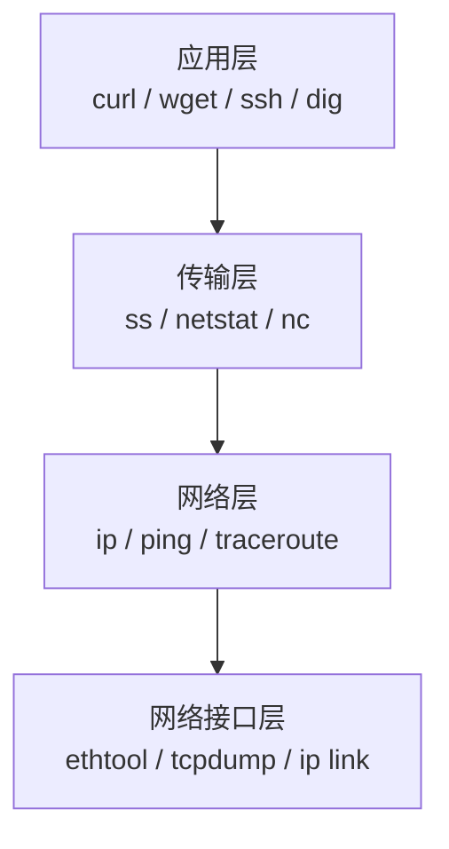
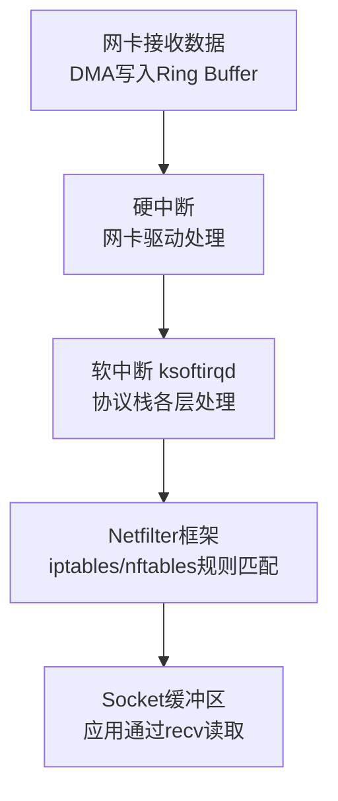
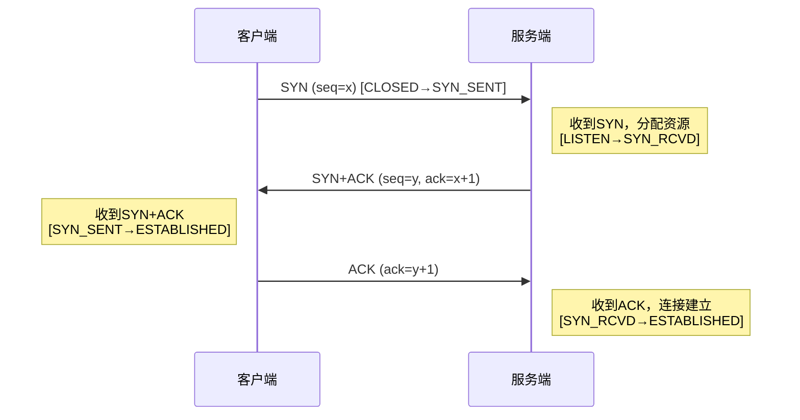
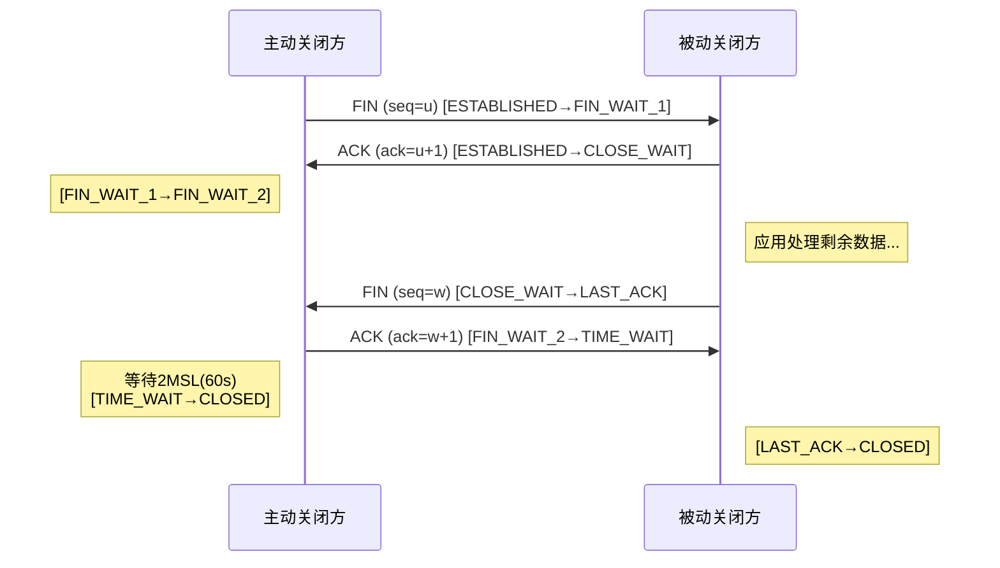
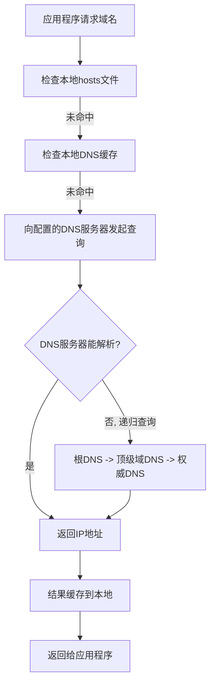
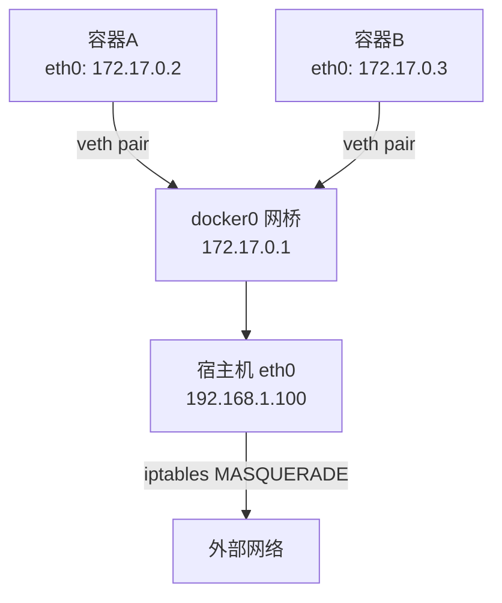

## 九、网络管理

网络是Linux系统与外界通信的命脉。无论是服务器运维、安全攻防还是日常开发，扎实的网络管理能力都是必备技能。本章从网络模型基础讲起，逐步覆盖TCP协议核心机制、接口配置、路由管理、DNS、防火墙、SSH安全、网络诊断、性能调优、容器网络和高级话题，构建从入门到精通的完整Linux网络知识体系。

### 9.1 网络基础模型

理解网络管理之前，必须先理解数据在网络中如何流动。

#### 9.1.1 OSI七层模型与TCP/IP四层模型

OSI模型是ISO于1984年发布的理论框架，将网络通信分为七层；TCP/IP模型是ARPANET的实际实现，分为四层。理解两者的对应关系，是所有网络工作的基础。

| OSI层 | 功能 | TCP/IP层 | 典型协议/技术 | Linux工具 |
|-------|------|----------|--------------|----------|
| 应用层 | 用户接口，应用数据 | 应用层 | HTTP, HTTPS, SSH, DNS, FTP, SMTP, DHCP | curl, wget, ssh, dig |
| 表示层 | 数据编码、加密、压缩 | 应用层 | SSL/TLS, JPEG, ASCII, GZIP | openssl |
| 会话层 | 建立/管理/终止会话 | 应用层 | NetBIOS, RPC | rpcinfo |
| 传输层 | 端到端可靠传输 | 传输层 | TCP, UDP, SCTP | ss, netstat, nc |
| 网络层 | 路由、寻址 | 网络层 | IP, ICMP, ARP, OSPF, BGP | ip, ping, traceroute |
| 数据链路层 | 帧传输、MAC寻址 | 网络接口层 | Ethernet, Wi-Fi, PPP, VLAN | ethtool, tcpdump, ip link |
| 物理层 | 比特流传输 | 网络接口层 | 光纤、双绞线、无线电波 | ethtool |

在Linux中，每一层都有对应的工具和配置方式：



**为什么必须理解分层模型？** 因为网络故障排查必须按层定位。ping不通是L3问题，端口不通是L4问题，HTTP 500是L7问题。不理解分层，排查就是盲人摸象。

#### 9.1.2 数据封装与解封装

数据从应用层向下传递时，每层都会添加自己的头部信息（封装）；接收端反向剥离头部（解封装）：

```text
发送端（封装）：
  应用数据 → [TCP头|应用数据] → [IP头|TCP头|应用数据] → [以太网头|IP头|TCP头|应用数据|FCS]

接收端（解封装）：
  [以太网头|IP头|TCP头|应用数据|FCS] → 剥离以太网头 → 剥离IP头 → 剥离TCP头 → 应用数据
```

各层头部的关键字段：

| 层 | 头部大小 | 关键字段 | 作用 |
|----|---------|---------|------|
| 以太网头 | 14字节 | 源MAC、目的MAC、类型 | 二层寻址 |
| IP头 | 20字节 | 源IP、目的IP、TTL、协议号 | 三层路由 |
| TCP头 | 20字节 | 源端口、目的端口、序列号、标志位 | 四层传输控制 |
| FCS | 4字节 | CRC校验 | 帧完整性校验 |

理解封装过程对网络故障排查至关重要——问题可能出在任何一层。例如MTU问题导致的分片，就发生在IP层封装阶段。

#### 9.1.3 Linux网络协议栈

Linux内核实现了完整的网络协议栈，基于BSD Socket接口。数据包在内核中的流转路径：



详细流程：

1. **网卡接收数据** → 通过DMA（Direct Memory Access）写入内核环形缓冲区（Ring Buffer），无需CPU参与
2. **触发硬中断（IRQ）** → 网卡驱动将数据包送入softirq队列，注册NAPI（New API）轮询
3. **软中断处理（ksoftirqd）** → 内核线程依次执行：网卡驱动poll → 协议栈处理（ip_rcv → tcp_v4_rcv）→ Netfilter钩子 → socket队列
4. **传递到socket缓冲区** → 应用程序通过`recv()`/`read()`系统调用读取数据

关键内核参数：

```bash
# 查看网络协议栈统计
cat /proc/net/snmp          # SNMP计数器（TCP/UDP/IP/ICMP统计）
cat /proc/net/netstat       # 扩展统计（含重传、丢弃等详细计数）
cat /proc/sys/net/ipv4/     # IPv4内核参数目录

# 查看网络缓冲区大小
sysctl net.core.rmem_max            # 接收缓冲区最大值
sysctl net.core.wmem_max            # 发送缓冲区最大值
sysctl net.ipv4.tcp_rmem            # TCP接收缓冲区(min/default/max)
sysctl net.ipv4.tcp_wmem            # TCP发送缓冲区(min/default/max)

# 查看Ring Buffer大小（网卡硬件缓冲区）
ethtool -g eth0
```

### 9.2 TCP协议核心机制

TCP是Linux网络中最核心的传输层协议。理解TCP的连接建立、数据传输和连接终止过程，是网络排查和性能调优的基础。

#### 9.2.1 TCP三次握手

TCP建立连接需要三次握手（Three-Way Handshake），确保双方都能发送和接收数据：



**为什么是三次而不是两次？** 核心原因是防止历史重复连接的初始化。如果只有两次握手，服务端无法确认客户端收到了SYN+ACK，可能导致服务端单方面建立连接并分配资源，造成资源浪费（SYN Flood攻击的根源之一）。

用tcpdump观察三次握手：

```bash
sudo tcpdump -i eth0 -nn 'tcp port 80 and (tcp[tcpflags] & (tcp-syn|tcp-fin|tcp-rst) != 0)'

# 输出示例：
# 10.0.0.1.45678 > 10.0.0.2.80: Flags [S], seq 1000, win 65535
# 10.0.0.2.80 > 10.0.0.1.45678: Flags [S.], seq 2000, ack 1001, win 65535
# 10.0.0.1.45678 > 10.0.0.2.80: Flags [.], ack 2001, win 65535
```

#### 9.2.2 TCP四次挥手

TCP断开连接需要四次挥手（Four-Way Handshake），因为TCP是全双工的，每个方向需要单独关闭：



**TIME_WAIT状态的意义：** 主动关闭方等待2MSL（Maximum Segment Lifetime，通常60秒），目的是：
1. 确保最后一个ACK能到达对方（如果丢失，对方会重发FIN）
2. 让网络中残余的旧数据包自然过期，防止新连接收到旧数据

#### 9.2.3 TCP状态机

TCP连接在其生命周期中经历多种状态。理解状态机是排查连接问题的关键：

| 状态 | 含义 | 常见场景 |
|------|------|---------|
| `LISTEN` | 服务端等待连接 | Web服务器监听80端口 |
| `SYN_SENT` | 客户端已发SYN，等待回复 | 发起连接但服务端无响应 |
| `SYN_RCVD` | 服务端收到SYN，已回复 | 收到大量SYN_RCVD = SYN Flood |
| `ESTABLISHED` | 连接已建立 | 正常通信中 |
| `FIN_WAIT_1` | 主动关闭方发FIN | 应用调用close() |
| `FIN_WAIT_2` | 主动关闭方收到ACK | 等待对方关闭 |
| `CLOSE_WAIT` | 被动关闭方收到FIN | 大量CLOSE_WAIT = 应用未调用close() |
| `TIME_WAIT` | 主动关闭方等待2MSL | 大量TIME_WAIT = 短连接过多 |
| `LAST_ACK` | 被动关闭方发FIN后等待ACK | 正常关闭流程 |
| `CLOSED` | 连接已完全关闭 | - |

```bash
# 查看各状态连接数
ss -tan | awk 'NR>1 {print $1}' | sort | uniq -c | sort -rn

# 典型输出：
#   150 ESTAB
#    45 TIME-WAIT
#     3 CLOSE-WAIT
#     2 FIN-WAIT-2
#     1 LISTEN
```

**状态异常诊断：**

- **大量SYN_RCVD** → 可能遭遇SYN Flood攻击。检查`sysctl net.ipv4.tcp_max_syn_backlog`和是否启用了SYN Cookie（`net.ipv4.tcp_syncookies = 1`）
- **大量CLOSE_WAIT** → 应用程序bug，收到FIN后未调用close()。检查对应进程的代码
- **大量TIME_WAIT** → 短连接过多。启用`tcp_tw_reuse`或改用连接池
- **大量FIN_WAIT_2** → 对端不发FIN。检查服务端进程是否卡死

#### 9.2.4 TCP可靠传输机制

TCP通过以下机制保证数据可靠传输：

**序列号与确认号：** 每个字节都有唯一序列号，接收方通过ACK确认已收到的数据。

**滑动窗口：** 接收方通过窗口大小告知发送方还能接收多少数据，实现流量控制。

**拥塞控制：** Linux内核实现了多种拥塞控制算法：

```bash
# 查看当前拥塞控制算法
sysctl net.ipv4.tcp_congestion_control
# 默认: cubic（适合高带宽高延迟网络）

# 可用算法
sysctl net.ipv4.tcp_available_congestion_control
# cubic reno bbr（如果内核4.9+）

# 切换到BBR（Google开发，适合高延迟网络）
echo "net.core.default_qdisc = fq" >> /etc/sysctl.d/99-bbr.conf
echo "net.ipv4.tcp_congestion_control = bbr" >> /etc/sysctl.d/99-bbr.conf
sysctl -p /etc/sysctl.d/99-bbr.conf
```

**重传机制：**
- **超时重传（RTO）**：发送数据后启动定时器，超时未收到ACK则重传。RTO根据RTT（往返时间）动态计算
- **快速重传**：连续收到3个重复ACK，立即重传丢失的段，不等超时
- **SACK（选择性确认）**：接收方告知发送方具体收到了哪些段，只重传缺失的部分

```bash
# 查看重传统计
cat /proc/net/snmp | grep -i tcp
# 关注: RetransSegs（重传段数）

# 查看SACK是否启用
sysctl net.ipv4.tcp_sack
# 1 = 启用（默认）
```

#### 9.2.5 TCP连接队列

Linux内核维护两个队列处理入站TCP连接：


- **SYN队列（半连接队列）**：存储收到SYN但三次握手未完成的连接。大小由`tcp_max_syn_backlog`控制
- **Accept队列（全连接队列）**：存储三次握手完成但应用尚未accept的连接。大小由`somaxconn`和应用`listen(backlog)`的较小值决定

```bash
# 查看队列溢出统计
cat /proc/net/netstat | grep -i listen
# ListenOverflows = Accept队列溢出次数
# ListenDrops = 因队列满被丢弃的连接数

# 查看SYN队列溢出
netstat -s | grep -i "SYNs to LISTEN"
# 或
nstat -az | grep TcpExtListenOverflows

# 调整队列大小
sysctl -w net.core.somaxconn=65535
sysctl -w net.ipv4.tcp_max_syn_backlog=65535
sysctl -w net.ipv4.tcp_syncookies=1    # 队列满时启用SYN Cookie（不分配资源）
```

### 9.3 网络接口管理

网络接口是系统与网络之间的桥梁。Linux支持多种类型的网络接口：物理接口（eth0、ens33）、虚拟接口（veth、bridge、tun/tap）、回环接口（lo）等。

#### 9.3.1 查看网络接口信息

```bash
# ===== ip 命令（推荐，iproute2套件） =====

# 查看所有接口及IP地址
ip addr show
ip a                    # 缩写

# 查看特定接口
ip addr show dev eth0

# 查看接口统计信息（收发包数、错误、丢包）
ip -s link show
ip -s -s link show eth0     # 更详细的统计

# 查看接口状态（UP/DOWN）
ip link show

# 查看接口驱动信息
ethtool -i eth0              # 驱动名称、版本
ethtool eth0                 # 速率、双工、自协商

# ===== 已弃用但仍常见的 ifconfig =====
ifconfig                    # 查看所有活跃接口
ifconfig -a                 # 包括未激活的接口
ifconfig eth0               # 查看特定接口
```

`ip addr show`输出解读：

```text
2: eth0: <BROADCAST,MULTICAST,UP,LOWER_UP> mtu 1500 qdisc fq_codel state UP group default qlen 1000
    link/ether 52:54:00:12:34:56 brd ff:ff:ff:ff:ff:ff
    inet 192.168.1.100/24 brd 192.168.1.255 scope global eth0
    inet6 fe80::5054:ff:fe12:3456/64 scope link
```

- `BROADCAST`：支持广播
- `MULTICAST`：支持组播
- `UP`：接口已启用（软件层面）
- `LOWER_UP`：物理链路已连接（硬件层面——如果缺少这个标志，说明网线断了或对端设备关闭）
- `mtu 1500`：最大传输单元（字节）
- `qdisc fq_codel`：队列调度算法（Fair Queuing Controlled Delay）
- `state UP`：接口状态正常
- `inet 192.168.1.100/24`：IPv4地址及CIDR子网掩码（/24 = 255.255.255.0）
- `brd 192.168.1.255`：广播地址
- `link/ether`：MAC地址
- `scope global`：全局有效（可在网络中路由）
- `scope link`：仅链路本地有效

#### 9.3.2 配置IP地址

```bash
# ===== 临时配置（重启失效） =====

# 添加IP地址
ip addr add 192.168.1.100/24 dev eth0

# 添加辅助IP（同一接口多个IP，别名接口）
ip addr add 192.168.1.101/24 dev eth0

# 删除IP地址
ip addr del 192.168.1.100/24 dev eth0

# 启用/禁用接口
ip link set eth0 up
ip link set eth0 down

# 设置MTU
ip link set eth0 mtu 9000      # Jumbo Frame（需交换机支持）

# 设置MAC地址
ip link set eth0 address 00:11:22:33:44:55

# ===== 已弃用的 ifconfig =====
ifconfig eth0 192.168.1.100 netmask 255.255.255.0 up
ifconfig eth0:0 192.168.1.101 netmask 255.255.255.0   # 辅助IP
```

#### 9.3.3 持久化网络配置

不同发行版使用不同的网络管理方案：

**Ubuntu 18.04+（Netplan）：**

```yaml
# /etc/netplan/01-netcfg.yaml
network:
  version: 2
  renderer: networkd            # 或 NetworkManager（桌面版）
  ethernets:
    eth0:
      dhcp4: false
      addresses:
        - 192.168.1.100/24
        - 192.168.1.101/24      # 辅助地址
      routes:
        - to: default
          via: 192.168.1.1
      nameservers:
        addresses:
          - 8.8.8.8
          - 8.8.4.4
        search:
          - example.com
```

```bash
# 应用Netplan配置
sudo netplan apply
sudo netplan try               # 临时应用，120秒后自动回滚（安全测试）

# 调试模式
sudo netplan --debug apply
```

**CentOS/RHEL 7+（NetworkManager + ifcfg）：**

```bash
# /etc/sysconfig/network-scripts/ifcfg-eth0
TYPE=Ethernet
BOOTPROTO=static
NAME=eth0
DEVICE=eth0
ONBOOT=yes
IPADDR=192.168.1.100
NETMASK=255.255.255.0
GATEWAY=192.168.1.1
DNS1=8.8.8.8
DNS2=8.8.4.4
```

```bash
# 重启网络服务
sudo systemctl restart NetworkManager
# 或
sudo nmcli connection reload
sudo nmcli connection up eth0
```

**CentOS/RHEL 9+（NetworkManager + keyfile）：**

```bash
# RHEL 9 默认使用 keyfile 格式替代 ifcfg
# /etc/NetworkManager/system-connections/eth0.nmconnection
[connection]
id=eth0
type=ethernet
interface-name=eth0

[ipv4]
method=manual
address1=192.168.1.100/24,192.168.1.1
dns=8.8.8.8;8.8.4.4;
```

**nmcli 命令行配置（通用推荐）：**

```bash
# 查看连接
nmcli connection show
nmcli device status

# 创建静态IP连接
nmcli connection add type ethernet con-name static-eth0 ifname eth0 \
  ipv4.addresses 192.168.1.100/24 \
  ipv4.gateway 192.168.1.1 \
  ipv4.dns "8.8.8.8 8.8.4.4" \
  ipv4.method manual

# 修改现有连接
nmcli connection modify eth0 ipv4.addresses 192.168.1.200/24
nmcli connection modify eth0 +ipv4.dns 114.114.114.114

# 激活连接
nmcli connection up static-eth0
```

#### 9.3.4 网络接口类型

Linux支持多种虚拟网络接口，每种用途不同：

| 接口类型 | 用途 | 典型场景 | 创建命令 |
|---------|------|---------|---------|
| `lo` | 回环接口 | 本地服务通信（127.0.0.1） | 自动创建 |
| `eth0/ens33` | 物理以太网 | 主机网络连接 | 自动识别 |
| `br0` | 网桥 | 虚拟机/容器网络 | `ip link add br0 type bridge` |
| `veth` | 虚拟以太网对 | 容器互联（Docker、K8s） | `ip link add veth0 type veth peer name veth1` |
| `tun` | 三层隧道 | VPN（OpenVPN、WireGuard） | 应用程序创建 |
| `tap` | 二层隧道 | 虚拟机桥接网络 | 应用程序创建 |
| `vlan` | VLAN子接口 | 多租户网络隔离 | `ip link add link eth0 name eth0.100 type vlan id 100` |
| `bond` | 链路聚合 | 高可用/高带宽 | `ip link add bond0 type bond mode 802.3ad` |
| `macvlan` | MAC虚拟化 | 容器独立MAC | `ip link add mac0 link eth0 type macvlan mode bridge` |
| `vxlan` | 覆盖网络 | 跨主机容器通信 | `ip link add vxlan0 type vxlan id 100 dstport 4789` |
| `dummy` | 虚拟设备 | 绑定额外IP | `ip link add dummy0 type dummy` |
| `gre/ipip` | IP隧道 | 跨网络隧道 | `ip link add gre1 type gre remote 1.2.3.4` |

```bash
# 创建网桥
ip link add br0 type bridge
ip link set eth0 master br0
ip link set veth0 master br0
ip link set br0 up

# 创建VLAN
ip link add link eth0 name eth0.100 type vlan id 100
ip addr add 10.0.100.1/24 dev eth0.100
ip link set eth0.100 up

# 创建Bond（链路聚合）
ip link add bond0 type bond mode 802.3ad
ip link set eth0 master bond0
ip link set eth1 master bond0
ip link set bond0 up

# 创建macvlan（容器独立IP场景）
ip link add mac0 link eth0 type macvlan mode bridge
ip addr add 192.168.1.200/24 dev mac0
ip link set mac0 up
```

### 9.4 路由管理

路由决定数据包从源到目的地的路径。Linux系统既可以是终端主机（只需默认路由），也可以是路由器（需要多条路由规则）。

#### 9.4.1 查看路由表

```bash
# 查看路由表
ip route show
ip r                        # 缩写

# 查看特定目的地的路由
ip route get 8.8.8.8

# 查看所有路由表（策略路由）
ip rule show
ip route show table all
```

路由表输出解读：

```text
default via 192.168.1.1 dev eth0 proto dhcp metric 100
192.168.1.0/24 dev eth0 proto kernel scope link src 192.168.1.100 metric 100
10.0.0.0/8 via 192.168.1.254 dev eth0
172.16.0.0/16 dev docker0 proto kernel scope link src 172.17.0.1
```

- `default via 192.168.1.1`：默认网关，所有非直连流量走此路由
- `proto dhcp`：路由来源（dhcp=DHCP分配 / kernel=内核自动生成 / static=手动配置）
- `scope link`：直连网络（同子网，无需网关转发）
- `metric 100`：路由度量值（越小优先级越高，多条相同路由时用于选择）
- `src 192.168.1.100`：从此接口发出的数据包使用的源地址

#### 9.4.2 管理路由

```bash
# 添加默认路由
ip route add default via 192.168.1.1

# 添加静态路由
ip route add 10.0.0.0/8 via 192.168.1.254

# 添加主机路由（精确到单个主机）
ip route add 10.0.0.100/32 via 192.168.1.254

# 添加直连路由（无需网关，直接通过接口发出）
ip route add 10.0.1.0/24 dev eth1

# 删除路由
ip route del 10.0.0.0/8

# 替换路由（存在则更新，不存在则添加）
ip route replace 10.0.0.0/8 via 192.168.1.1

# 设置路由度量值（用于多路径选择）
ip route add 10.0.0.0/8 via 192.168.1.254 metric 200

# 持久化路由（不同发行版方式不同）：
# Ubuntu Netplan: 在 routes: 块中配置
# CentOS: /etc/sysconfig/network-scripts/route-eth0
#   10.0.0.0/8 via 192.168.1.254
```

#### 9.4.3 策略路由

策略路由根据源地址、协议等条件选择不同的路由表，常用于多线接入、多网卡分流场景：

```bash
# 创建自定义路由表（ID和名称映射）
echo "100 isp1" >> /etc/iproute2/rt_tables
echo "200 isp2" >> /etc/iproute2/rt_tables

# 在自定义表中添加路由
ip route add default via 10.0.1.1 table isp1
ip route add default via 10.0.2.1 table isp2

# 添加直连路由到自定义表（必须，否则同子网通信会失败）
ip route add 10.0.1.0/24 dev eth1 table isp1
ip route add 10.0.2.0/24 dev eth2 table isp2

# 添加策略规则
ip rule add from 10.0.1.0/24 table isp1 priority 100
ip rule add from 10.0.2.0/24 table isp2 priority 200

# 基于目标端口的策略路由（例如所有HTTP走ISP1）
ip rule add dport 80 table isp1 priority 300

# 验证
ip rule show
ip route show table isp1
ip route get 8.8.8.8 from 10.0.1.10
```

**实际应用场景：** 双线服务器（电信+联通），通过策略路由实现电信流量走电信出口、联通流量走联通出口，避免跨网访问延迟。

#### 9.4.4 IP转发

当Linux作为路由器或网关时，需要开启IP转发：

```bash
# 临时开启IP转发
echo 1 > /proc/sys/net/ipv4/ip_forward

# 持久化
echo "net.ipv4.ip_forward = 1" >> /etc/sysctl.d/99-routing.conf
sysctl -p /etc/sysctl.d/99-routing.conf

# 验证
sysctl net.ipv4.ip_forward
# 或
cat /proc/sys/net/ipv4/ip_forward
```

**注意：** Docker安装时会自动开启IP转发。如果你发现`ip_forward=1`但没有手动设置，很可能是Docker设置的。

### 9.5 DNS配置与管理

DNS（Domain Name System）将域名解析为IP地址，是网络通信的基础服务。一次DNS查询失败，可能导致整个应用不可用。

#### 9.5.1 DNS解析流程



Linux DNS解析的优先级由`/etc/nsswitch.conf`控制：

```yaml
hosts: files dns myhostname
```

- `files` = `/etc/hosts`（最高优先级）
- `dns` = `/etc/resolv.conf`中配置的DNS服务器
- `myhostname` = 本地主机名解析（systemd提供）

#### 9.5.2 DNS配置文件

```bash
# /etc/resolv.conf - DNS服务器配置
nameserver 8.8.8.8         # Google DNS
nameserver 8.8.4.4         # Google DNS 备用
nameserver 114.114.114.114 # 国内DNS（适合中国用户）
search example.com         # 搜索域（短域名自动补全，如 ping webserver → ping webserver.example.com）
options timeout:2 attempts:3 rotate   # 超时2秒，重试3次，轮询多个nameserver
```

> **注意**：`/etc/resolv.conf`在使用NetworkManager或systemd-resolved时会被自动管理。直接编辑可能被覆盖。正确的做法是通过Netplan/nmcli配置DNS，让管理工具自动更新resolv.conf。

```bash
# /etc/hosts - 本地DNS解析（优先级最高，常用于内网域名映射）
127.0.0.1   localhost
192.168.1.10 webserver.local webserver
192.168.1.20 dbserver.local dbserver

# /etc/nsswitch.conf - 解析顺序控制
# hosts: files dns myhostname
# files = /etc/hosts 优先
# dns = /etc/resolv.conf 中的DNS服务器
# myhostname = 本地主机名解析
```

#### 9.5.3 systemd-resolved（现代Linux）

Ubuntu 18.04+ 和 Fedora 默认使用 `systemd-resolved` 进行DNS解析，它提供了本地DNS缓存、DNSSEC验证和Per-Interface DNS配置：

```bash
# 查看DNS解析状态
resolvectl status

# 查看DNS缓存统计（命中率、缓存条目数）
resolvectl statistics

# 查询DNS记录
resolvectl query example.com

# 清除DNS缓存
resolvectl flush-caches

# 配置DNS（通过Netplan）
# /etc/netplan/01-netcfg.yaml
# nameservers:
#   addresses: [8.8.8.8, 8.8.4.4]
```

**systemd-resolved的坑：** 默认会通过`/run/systemd/resolve/stub-resolv.conf`提供`127.0.0.53`作为nameserver。如果某些程序直接读取`/etc/resolv.conf`而不经过NSS，可能解析失败。解决方案：`ln -sf /run/systemd/resolve/resolv.conf /etc/resolv.conf`（绕过本地缓存，直接使用上游DNS）。

#### 9.5.4 DNS查询工具

```bash
# ===== nslookup（简单查询，适合快速测试） =====
nslookup example.com
nslookup -type=MX example.com        # 查询邮件记录
nslookup example.com 8.8.8.8         # 指定DNS服务器

# ===== dig（功能最强大，推荐，专业排查首选） =====
dig example.com                      # 基本查询
dig example.com +short               # 只显示IP（脚本中使用）
dig example.com MX                   # 查询MX记录
dig example.com ANY                  # 查询所有记录
dig @8.8.8.8 example.com            # 指定DNS服务器
dig -x 8.8.8.8                      # 反向解析（IP→域名）
dig +trace example.com               # 追踪完整解析路径（从根DNS开始）
dig example.com +noall +answer       # 只显示答案段
dig example.com +noall +authority    # 显示权威DNS服务器
dig example.com +stats               # 显示查询统计（耗时等）

# ===== host（简洁输出，适合脚本） =====
host example.com
host -t MX example.com
host 8.8.8.8                         # 反向解析
```

dig输出详解：

```text
;; ANSWER SECTION:
example.com.    86400   IN  A   93.184.216.34
;; 字段含义：
;; 域名  TTL(秒)  类别(IN=Internet)  记录类型  记录值
;; TTL = 86400 表示缓存24小时后过期
```

#### 9.5.5 常见DNS记录类型

| 记录类型 | 含义 | 用途 | 查询命令 |
|---------|------|------|---------|
| A | 域名→IPv4地址 | 基础域名解析 | `dig example.com A` |
| AAAA | 域名→IPv6地址 | IPv6域名解析 | `dig example.com AAAA` |
| CNAME | 域名别名 | www.example.com → example.com | `dig www.example.com CNAME` |
| MX | 邮件交换服务器 | 邮件路由 | `dig example.com MX` |
| NS | 域名服务器 | 指定权威DNS | `dig example.com NS` |
| TXT | 文本记录 | SPF/DKIM/域名验证 | `dig example.com TXT` |
| SRV | 服务记录 | 服务发现（LDAP、SIP等） | `dig _ldap._tcp.example.com SRV` |
| SOA | 权威起始记录 | 域名管理信息（主DNS、刷新间隔等） | `dig example.com SOA` |
| PTR | IP→域名 | 反向DNS解析（邮件服务器验证等） | `dig -x 8.8.8.8 PTR` |
| CAA | CA授权 | 指定允许签发证书的CA | `dig example.com CAA` |

### 9.6 防火墙管理

防火墙是网络安全的第一道防线，控制进出系统的网络流量。Linux提供了三种防火墙方案：iptables（经典）、nftables（现代替代）、firewalld（区域化管理）。

#### 9.6.1 iptables（经典防火墙）

iptables是Linux内核netfilter框架的用户空间工具，工作在网络层和传输层。

**四表五链概念：**

| 表名 | 作用 | 常用链 | 优先级 |
|------|------|--------|--------|
| `raw` | 连接跟踪豁免 | PREROUTING, OUTPUT | 最高 |
| `mangle` | 修改数据包头部（TTL、TOS等） | 全部五条链 | 次高 |
| `nat` | 网络地址转换 | PREROUTING, POSTROUTING, OUTPUT | 次低 |
| `filter` | 过滤数据包（默认表） | INPUT, FORWARD, OUTPUT | 最低 |

```text
数据包流经链的顺序：

入站数据包：PREROUTING(raw→mangle→nat) → 路由判断 → INPUT(mangle→filter)
转发数据包：PREROUTING(raw→mangle→nat) → 路由判断 → FORWARD(mangle→filter) → POSTROUTING(mangle→nat)
出站数据包：OUTPUT(raw→mangle→nat→filter) → 路由判断 → POSTROUTING(mangle→nat)
```

**基本操作：**

```bash
# 查看规则
sudo iptables -L -n -v              # 详细模式（-n不解析域名，-v显示包计数）
sudo iptables -L -n --line-numbers  # 显示行号（用于精确删除）
sudo iptables -t nat -L -n          # 查看NAT表

# 清空规则
sudo iptables -F                     # 清空filter表所有链
sudo iptables -t nat -F              # 清空NAT表
sudo iptables -X                     # 删除自定义链

# ===== 规则管理 =====

# 允许已建立的连接（必须有这条，否则回包会被拒绝）
sudo iptables -A INPUT -m conntrack --ctstate ESTABLISHED,RELATED -j ACCEPT

# 允许回环接口
sudo iptables -A INPUT -i lo -j ACCEPT

# 允许SSH
sudo iptables -A INPUT -p tcp --dport 22 -j ACCEPT

# 允许HTTP和HTTPS
sudo iptables -A INPUT -p tcp -m multiport --dports 80,443 -j ACCEPT

# 允许ICMP（ping）
sudo iptables -A INPUT -p icmp --icmp-type echo-request -j ACCEPT

# 允许特定IP段访问
sudo iptables -A INPUT -s 192.168.1.0/24 -j ACCEPT

# 拒绝特定IP（静默丢弃，不返回任何信息）
sudo iptables -A INPUT -s 10.0.0.5 -j DROP

# 拒绝特定IP（返回ICMP不可达，会暴露防火墙存在）
sudo iptables -A INPUT -s 10.0.0.5 -j REJECT

# 限制连接速率（防暴力破解）
sudo iptables -A INPUT -p tcp --dport 22 -m connlimit --connlimit-above 3 -j DROP
sudo iptables -A INPUT -p tcp --dport 22 -m recent --set --name SSH
sudo iptables -A INPUT -p tcp --dport 22 -m recent --update --seconds 60 --hitcount 4 --name SSH -j DROP

# 限制ICMP速率（防Ping Flood）
sudo iptables -A INPUT -p icmp --icmp-type echo-request -m limit --limit 1/s --limit-burst 4 -j ACCEPT
sudo iptables -A INPUT -p icmp --icmp-type echo-request -j DROP

# 默认策略：拒绝所有入站，允许所有出站
sudo iptables -P INPUT DROP
sudo iptables -P FORWARD DROP
sudo iptables -P OUTPUT ACCEPT

# 插入规则到指定位置（第1条）
sudo iptables -I INPUT 1 -p tcp --dport 8080 -j ACCEPT

# 删除规则（按行号）
sudo iptables -D INPUT 3

# 记录被丢弃的包（用于排查）
sudo iptables -A INPUT -j LOG --log-prefix "IPT-DROP: " --log-level 4

# ===== NAT配置 =====

# SNAT（源地址转换 - 内网出公网）
sudo iptables -t nat -A POSTROUTING -s 192.168.1.0/24 -o eth0 -j MASQUERADE

# DNAT（目的地址转换 - 端口转发）
sudo iptables -t nat -A PREROUTING -p tcp --dport 8080 -j DNAT --to-destination 192.168.1.100:80
```

**持久化iptables规则：**

```bash
# Debian/Ubuntu
sudo apt install iptables-persistent
sudo netfilter-persistent save
sudo netfilter-persistent reload

# CentOS/RHEL
sudo service iptables save
# 或
sudo iptables-save > /etc/sysconfig/iptables
sudo iptables-restore < /etc/sysconfig/iptables
```

#### 9.6.2 nftables（iptables的继任者）

nftables是iptables/ip6tables/arptables/ebtables的统一替代品，从Linux内核3.13开始引入，语法更简洁，性能更好（规则集编译为字节码），支持原子规则集替换：

```bash
# 查看规则集
sudo nft list ruleset

# 创建表和链
sudo nft add table inet myfilter
sudo nft add chain inet myfilter input { type filter hook input priority 0 \; policy drop \; }
sudo nft add chain inet myfilter output { type filter hook output priority 0 \; policy accept \; }

# 添加规则
sudo nft add rule inet myfilter input ct state established,related accept
sudo nft add rule inet myfilter input iif lo accept
sudo nft add rule inet myfilter input tcp dport { 22, 80, 443 } accept
sudo nft add rule inet myfilter input ip saddr 192.168.1.0/24 accept
sudo nft add rule inet myfilter input icmp type echo-request accept
```

**推荐使用配置文件方式管理：**

```bash
#!/usr/sbin/nft -f
flush ruleset

table inet filter {
    chain input {
        type filter hook input priority 0; policy drop;
        ct state established,related accept
        iif lo accept
        tcp dport { 22, 80, 443 } accept
        ip saddr 192.168.1.0/24 accept
        icmp type echo-request accept
        counter drop     # 计数被丢弃的包（便于排查）
    }

    chain forward {
        type filter hook forward priority 0; policy drop;
    }

    chain output {
        type filter hook output priority 0; policy accept;
    }
}
```

```bash
# 加载配置
sudo nft -f /etc/nftables.conf

# 启用服务（开机自动加载）
sudo systemctl enable nftables
sudo systemctl start nftables

# 验证
sudo nft list ruleset
```

**nftables vs iptables对比：**

| 特性 | iptables | nftables |
|------|----------|----------|
| 内核支持 | 2.4+ | 3.13+ |
| 语法 | 分散的命令 | 统一的配置语言 |
| 性能 | 线性匹配规则 | 字节码编译，更高效 |
| 原子更新 | 不支持（逐条添加） | 支持（`nft -f`整体替换） |
| IPv4/IPv6 | 需分别配置 | `inet`统一配置 |
| 集合（set） | 需要ipset | 内置支持 |
| 调试 | 有限 | 内置`counter`和`log` |

#### 9.6.3 firewalld（区域化防火墙）

firewalld是CentOS/RHEL/Fedora默认的防火墙管理工具，基于nftables/iptables后端，以"区域"（zone）为核心概念：

```bash
# 查看防火墙状态
sudo firewall-cmd --state
sudo firewall-cmd --list-all

# 查看所有区域
sudo firewall-cmd --get-zones
sudo firewall-cmd --get-active-zones

# 查看区域详情
sudo firewall-cmd --zone=public --list-all

# 添加永久规则
sudo firewall-cmd --zone=public --add-service=http --permanent
sudo firewall-cmd --zone=public --add-service=https --permanent
sudo firewall-cmd --zone=public --add-port=8080/tcp --permanent

# 添加端口范围
sudo firewall-cmd --zone=public --add-port=5000-5100/tcp --permanent

# 移除规则
sudo firewall-cmd --zone=public --remove-service=http --permanent

# 端口转发
sudo firewall-cmd --zone=public --add-forward-port=port=8080:proto=tcp:toport=80 --permanent

# 富规则（精细控制）
sudo firewall-cmd --zone=public --add-rich-rule='
  rule family="ipv4"
  source address="192.168.1.0/24"
  port protocol="tcp" port="3306"
  accept' --permanent

# 日志记录（富规则）
sudo firewall-cmd --zone=public --add-rich-rule='
  rule family="ipv4"
  source address="10.0.0.0/8"
  port protocol="tcp" port="22"
  log prefix="FW-SSH-BLOCK: " level="info"
  drop' --permanent

# 重新加载（使永久规则生效）
sudo firewall-cmd --reload

# 应急模式（拒绝所有连接，用于紧急情况）
sudo firewall-cmd --panic-on
sudo firewall-cmd --panic-off

# 将接口分配到区域
sudo firewall-cmd --zone=internal --change-interface=eth1 --permanent
```

常用区域说明：

| 区域 | 默认行为 | 适用场景 |
|------|---------|---------|
| `drop` | 丢弃所有入站 | 最严格，不回应（对外部完全静默） |
| `block` | 拒绝所有入站 | 拒绝并返回ICMP错误 |
| `public` | 只允许选定服务 | 公网服务器（默认区域） |
| `external` | NAT伪装 | 外部网络出口 |
| `dmz` | 允许部分服务 | DMZ区域（对外提供有限服务） |
| `work` | 允许大部分服务 | 工作网络 |
| `home` | 允许大部分服务 | 家庭网络 |
| `internal` | 信任大部分 | 内部网络 |
| `trusted` | 允许所有 | 完全信任（慎用） |

#### 9.6.4 防火墙安全加固实战

以下是一套经过验证的生产环境防火墙规则模板：

```bash
#!/bin/bash
# 安全加固防火墙脚本 - 适用于公网服务器

# 清空现有规则
iptables -F
iptables -X
iptables -t nat -F

# 默认策略：拒绝一切
iptables -P INPUT DROP
iptables -P FORWARD DROP
iptables -P OUTPUT ACCEPT    # 允许所有出站（可根据需要改为DROP）

# 允许回环
iptables -A INPUT -i lo -j ACCEPT

# 允许已建立的连接
iptables -A INPUT -m conntrack --ctstate ESTABLISHED,RELATED -j ACCEPT

# 允许SSH（限速率：每IP最多3个并发连接，60秒内最多4次新连接）
iptables -A INPUT -p tcp --dport 22 -m connlimit --connlimit-above 3 -j DROP
iptables -A INPUT -p tcp --dport 22 -m recent --set --name SSH
iptables -A INPUT -p tcp --dport 22 -m recent --update --seconds 60 --hitcount 4 --name SSH -j DROP
iptables -A INPUT -p tcp --dport 22 -j ACCEPT

# 允许HTTP/HTTPS
iptables -A INPUT -p tcp -m multiport --dports 80,443 -j ACCEPT

# 允许ICMP（限速率，防Ping Flood）
iptables -A INPUT -p icmp --icmp-type echo-request -m limit --limit 1/s --limit-burst 4 -j ACCEPT

# 防SYN Flood
iptables -A INPUT -p tcp --syn -m limit --limit 50/s --limit-burst 100 -j ACCEPT
iptables -A INPUT -p tcp --syn -j DROP

# 记录并丢弃其余所有
iptables -A INPUT -j LOG --log-prefix "FW-DROP: " --log-level 4 -m limit --limit 5/min
iptables -A INPUT -j DROP

# 保存
netfilter-persistent save
```

### 9.7 SSH安全配置

SSH（Secure Shell）是Linux远程管理的核心协议，也是攻击者首要目标。正确配置SSH是系统安全的基本要求。

#### 9.7.1 SSH密钥认证

密码认证容易被暴力破解，密钥认证是更安全的选择：

```bash
# 生成密钥对（推荐Ed25519算法——最安全且最短的密钥）
ssh-keygen -t ed25519 -C "your_email@example.com"
# 生成位置：~/.ssh/id_ed25519（私钥）和 ~/.ssh/id_ed25519.pub（公钥）

# RSA密钥（兼容旧系统，最低4096位）
ssh-keygen -t rsa -b 4096 -C "your_email@example.com"

# 复制公钥到远程服务器
ssh-copy-id user@remote-server
# 等效于：
# cat ~/.ssh/id_ed25519.pub | ssh user@remote-server "mkdir -p ~/.ssh && chmod 700 ~/.ssh && cat >> ~/.ssh/authorized_keys && chmod 600 ~/.ssh/authorized_keys"

# 手动设置权限（必须正确，否则SSH拒绝使用密钥）
chmod 700 ~/.ssh
chmod 600 ~/.ssh/authorized_keys
chmod 600 ~/.ssh/id_ed25519
chmod 644 ~/.ssh/id_ed25519.pub
```

**密钥算法选择指南：**

| 算法 | 密钥长度 | 安全性 | 性能 | 兼容性 | 推荐场景 |
|------|---------|--------|------|--------|---------|
| Ed25519 | 256位 | 最高 | 最快 | OpenSSH 6.5+ | 首选，所有现代系统 |
| RSA | 4096位 | 高 | 慢 | 所有版本 | 兼容旧系统 |
| ECDSA | 256/384/521位 | 高 | 快 | OpenSSH 5.7+ | 不推荐（NIST曲线有争议） |

#### 9.7.2 SSH服务端安全配置

```bash
# /etc/ssh/sshd_config 推荐配置

# ===== 基础安全 =====
Port 2222                           # 修改默认端口（减少自动化扫描噪音90%以上）
ListenAddress 0.0.0.0               # 监听地址（可限制为内网IP）
Protocol 2                          # 只使用SSH2协议（SSH1有已知漏洞）

# ===== 认证安全 =====
PermitRootLogin no                  # 禁止root直接登录（必须使用普通用户+sudo）
PasswordAuthentication no           # 禁用密码认证（只允许密钥）
PubkeyAuthentication yes            # 启用公钥认证
ChallengeResponseAuthentication no  # 禁用挑战响应
UsePAM yes                          # 使用PAM（配合其他安全模块）

# ===== 访问控制 =====
MaxAuthTries 3                      # 最大认证尝试次数
MaxSessions 5                       # 单连接最大会话数
LoginGraceTime 30                   # 认证超时时间（秒，减少资源占用）
AllowUsers alice bob                # 只允许特定用户（白名单）
# AllowGroups ssh-users             # 或按组控制
# DenyUsers root admin              # 黑名单（不推荐，白名单更好）

# ===== 会话安全 =====
ClientAliveInterval 300             # 5分钟无活动发送心跳
ClientAliveCountMax 2               # 2次无响应断开连接
# 等效于：300*2=600秒无活动断开

# ===== 禁用危险功能 =====
X11Forwarding no                    # 禁用X11转发（除非需要GUI远程）
AllowTcpForwarding no               # 禁用TCP转发（除非需要隧道）
PermitTunnel no                     # 禁用隧道
AllowAgentForwarding no             # 禁用Agent转发（防止跳板机横向移动）

# ===== 日志 =====
LogLevel VERBOSE                    # 详细日志（记录密钥指纹等，便于审计）
```

```bash
# 验证配置文件语法（修改后必做！）
sudo sshd -t

# 重启SSH服务（确保有备用连接方式——控制台/IPMI/另一个SSH会话）
sudo systemctl restart sshd

# 查看SSH日志
sudo journalctl -u sshd -f

# 查看SSH登录记录
sudo journalctl -u sshd | grep -i "accepted"
sudo last -i                        # 登录历史
```

#### 9.7.3 SSH客户端配置

```bash
# ~/.ssh/config - 客户端配置
Host production
    HostName 203.0.113.10
    Port 2222
    User deploy
    IdentityFile ~/.ssh/id_ed25519_prod
    ServerAliveInterval 60
    ServerAliveCountMax 3
    StrictHostKeyChecking ask

Host internal-*                     # 通配符匹配
    ProxyJump bastion               # 通过跳板机连接（ProxyJump替代了ProxyCommand）
    User admin

Host bastion
    HostName 203.0.113.1
    User admin
    IdentityFile ~/.ssh/id_ed25519

# 全局默认值（放在文件末尾）
Host *
    ServerAliveInterval 60
    ServerAliveCountMax 3
    AddKeysToAgent yes              # 自动将密钥添加到ssh-agent
    IdentitiesOnly yes              # 只使用指定的密钥
```

使用方式：

```bash
ssh production                    # 等同于 ssh -p 2222 deploy@203.0.113.10
ssh internal-db                   # 通过bastion跳转
scp file.txt production:/tmp/     # 文件传输
rsync -avz -e ssh ./dir/ production:/backup/  # 目录同步
```

#### 9.7.4 SSH隧道与端口转发

SSH隧道是安全穿越防火墙的重要手段，常用于访问内网服务：

```bash
# 本地端口转发（Local Forward）—— 最常用
# 场景：通过跳板机访问内网数据库
# 将本地8080映射到远程的80端口
ssh -L 8080:localhost:80 user@remote-server
# 访问 localhost:8080 → 通过SSH隧道 → remote-server:80

# 本地端口转发（访问远程内网的其他主机）
ssh -L 8080:internal-web:80 user@bastion
# 访问 localhost:8080 → bastion → internal-web:80

# 远程端口转发（Remote Forward）—— 暴露本地服务到公网
# 将远程的9090映射到本地的3000端口
ssh -R 9090:localhost:3000 user@remote-server
# 远程用户访问 remote-server:9090 → 通过SSH隧道 → localhost:3000

# 动态端口转发（SOCKS5代理）—— 翻墙/安全浏览
ssh -D 1080 user@remote-server
# 配置浏览器使用 SOCKS5 代理 localhost:1080
# 所有流量通过SSH隧道加密传输

# 后台运行隧道（生产环境推荐）
ssh -f -N -L 8080:localhost:80 user@remote-server
# -f: 后台运行  -N: 不执行远程命令

# 使用autossh自动重连（长时间运行的隧道）
autossh -M 0 -f -N -L 8080:localhost:80 user@remote-server
# -M 0: 禁用autossh自带监控，依赖ServerAlive机制
```

**SSH隧道安全注意事项：**
- 远程转发默认只监听127.0.0.1，如需外部访问需设置`GatewayPorts yes`
- SOCKS5代理不加密代理到目标服务器之间的最后一段
- 隧道断开后不会自动重连，生产环境使用autossh或systemd管理

#### 9.7.5 SSH安全加固清单

```text
[ ] 禁用密码认证，只允许密钥认证
[ ] 禁止root直接SSH登录
[ ] 修改默认22端口
[ ] 设置MaxAuthTries <= 3
[ ] 使用fail2ban或类似工具封禁暴力破解IP
[ ] 定期轮换SSH密钥（建议90天）
[ ] 限制可登录用户（AllowUsers/AllowGroups）
[ ] 禁用不需要的转发功能（X11/TCP/Agent）
[ ] 使用SSH证书替代密钥（企业环境，集中管理）
[ ] 监控SSH日志中的异常登录
[ ] 设置正确的文件权限（700/.ssh, 600/authorized_keys）
[ ] 使用ssh-agent管理密钥，不在磁盘上存储解密的私钥
```

### 9.8 时间同步（NTP/Chrony）

时间同步是网络服务的基础。证书验证、日志关联、分布式系统协调都依赖准确的时间。时间偏差超过几分钟就可能导致TLS握手失败、Kerberos认证失败、日志无法关联。

#### 9.8.1 Chrony（推荐）

Chrony是现代Linux发行版的默认NTP实现，比传统ntpd更快收敛、更准确：

```bash
# 安装
sudo apt install chrony          # Debian/Ubuntu
sudo yum install chrony          # CentOS/RHEL

# 查看同步状态
chronyc tracking                 # 当前时间源和偏差
chronyc sources -v               # 所有时间源及其状态
chronyc sourcestats              # 时间源统计

# 强制立即同步
sudo chronyc makestep

# 添加时间服务器
# 编辑 /etc/chrony/chrony.conf（Debian/Ubuntu）或 /etc/chrony.conf（CentOS）
# 添加：
# server ntp.aliyun.com iburst     # 国内推荐
# server ntp.tencent.com iburst
# server time.google.com iburst    # 国际推荐

# 启用服务
sudo systemctl enable chronyd
sudo systemctl restart chronyd
```

chronyc sources输出解读：

```text
MS Name/IP address         Stratum  Poll  Reach  LastRx  Last sample
===============================================================================
^* time.google.com              2     10    377     167    +12us[  +45us] +/-  15ms
^+ ntp.aliyun.com               2     10    377     167   -156us[ -123us] +/-  25ms
```

- `*` = 当前使用的时间源
- `+` = 候选时间源
- `-` = 不合格的时间源
- `?` = 无法到达的时间源

#### 9.8.2 timedatectl

```bash
# 查看时间状态
timedatectl

# 设置时区
sudo timedatectl set-timezone Asia/Shanghai

# 启用NTP同步
sudo timedatectl set-ntp true

# 查看可用时区
timedatectl list-timezones | grep Asia
```

### 9.9 网络诊断工具

网络问题排查是运维和安全工程师的核心技能。掌握正确的工具组合，可以快速定位问题所在层。

#### 9.9.1 连通性测试

```bash
# ===== ping - 基础连通性测试 =====
ping -c 4 8.8.8.8                    # 发送4个包
ping -c 4 -i 0.2 8.8.8.8            # 0.2秒间隔（快速ping）
ping -c 4 -s 1472 8.8.8.8           # 指定包大小（MTU探测）
ping -c 4 -W 3 8.8.8.8              # 3秒超时

# MTU路径发现（确定最大不丢包的包大小）
# 1472 + 8(ICMP头) + 20(IP头) = 1500(标准MTU)
ping -M do -s 1472 -c 4 target      # do=禁止分片

# ===== traceroute - 路由追踪 =====
traceroute 8.8.8.8
traceroute -n 8.8.8.8               # 不解析域名（更快）
traceroute -T -p 80 8.8.8.8         # 使用TCP（穿越防火墙，最实用）
traceroute -I 8.8.8.8               # 使用ICMP

# mtr - 实时路由诊断（ping + traceroute的结合体，推荐）
mtr 8.8.8.8
mtr --report -c 100 8.8.8.8         # 批量测试100次后生成报告
mtr -n --report 8.8.8.8             # 不解析域名

# ===== telnet/nc - 端口连通性测试 =====
telnet 8.8.8.8 80                    # 测试TCP端口（交互式）
# 或
nc -zv 8.8.8.8 80                    # 更推荐（非交互式）
nc -zv 8.8.8.8 80 443               # 测试多个端口
nc -zv -w 3 8.8.8.8 80              # 3秒超时

# curl - HTTP层连通性测试
curl -v http://target/               # 详细HTTP交互
curl -o /dev/null -s -w "%{http_code} %{time_total}s\n" http://target/  # 状态码和耗时
```

#### 9.9.2 网络连接分析

```bash
# ===== ss - 查看socket状态（推荐，比netstat快10倍） =====
ss -tunlp                            # 监听端口（t=TCP u=UDP n=数字 l=监听 p=进程）
ss -tunp                             # 所有TCP/UDP连接
ss -s                                # 连接统计摘要
ss -tn state established             # 已建立的TCP连接
ss -tn state time-wait | wc -l       # TIME_WAIT连接数
ss -tn dst :80                       # 到达80端口的连接
ss -tn src :22                       # 源端口22的连接

# ss 过滤表达式（强大但语法复杂）
ss -tn '( dport = :80 or dport = :443 )'
ss -tn state established '( dst 192.168.1.0/24 )'
ss -tn state established '( dst 192.168.1.0/24 )' | wc -l  # 统计到内网的连接数

# ===== lsof - 按进程查看网络连接 =====
lsof -i                              # 所有网络连接
lsof -i :80                          # 端口80的连接
lsof -i tcp                          # 只看TCP
lsof -i @192.168.1.100               # 到特定IP的连接
lsof -p 1234                         # 特定进程的网络连接
lsof -i -nP | awk '$5=="ESTABLISHED"' | wc -l  # 已建立连接数
```

#### 9.9.3 抓包分析

```bash
# ===== tcpdump - 命令行抓包 =====

# 基本抓包
sudo tcpdump -i eth0                 # 指定接口
sudo tcpdump -i any                  # 所有接口

# 过滤表达式（BPF语法）
sudo tcpdump -i eth0 host 192.168.1.100          # 特定主机
sudo tcpdump -i eth0 port 80                     # 特定端口
sudo tcpdump -i eth0 src 192.168.1.100           # 源地址
sudo tcpdump -i eth0 dst port 443                # 目的端口
sudo tcpdump -i eth0 tcp                         # 只抓TCP
sudo tcpdump -i eth0 'tcp port 80 and host 192.168.1.100'  # 组合条件

# 输出控制
sudo tcpdump -i eth0 -c 100 port 80              # 抓100个包就停
sudo tcpdump -i eth0 -nn port 80                 # 不解析域名和端口名（推荐）
sudo tcpdump -i eth0 -v port 80                  # 详细输出
sudo tcpdump -i eth0 -X port 80                  # 显示十六进制和ASCII（查看HTTP内容）
sudo tcpdump -i eth0 -e port 80                  # 显示MAC地址

# 保存到文件（可用Wireshark分析）
sudo tcpdump -i eth0 -w capture.pcap port 80
sudo tcpdump -r capture.pcap                     # 读取pcap文件
sudo tcpdump -r capture.pcap -nn | head -50      # 只看前50行

# 抓TCP握手和挥手
sudo tcpdump -i eth0 'tcp[tcpflags] & (tcp-syn|tcp-fin|tcp-rst) != 0'

# 抓HTTP请求头
sudo tcpdump -i eth0 -A -s 0 'tcp port 80 and (((ip[2:2] - ((ip[0]&0xf)<<2)) - ((tcp[12]&0xf0)>>2)) != 0)'

# 抓DNS查询
sudo tcpdump -i eth0 port 53 -nn
```

#### 9.9.4 带宽与性能测试

```bash
# ===== iperf3 - 网络带宽测试（最准确） =====

# 服务端
iperf3 -s                            # 启动iperf3服务端（默认端口5201）

# 客户端
iperf3 -c server-ip                  # TCP带宽测试
iperf3 -c server-ip -u -b 100M      # UDP测试，带宽100Mbps
iperf3 -c server-ip -P 4            # 4个并发流（测试多连接吞吐量）
iperf3 -c server-ip -t 60           # 测试60秒（默认10秒）
iperf3 -c server-ip -R              # 反向测试（服务端→客户端）
iperf3 -c server-ip --bidir         # 双向同时测试

# ===== curl - HTTP下载速度测试 =====
curl -o /dev/null -w "Speed: %{speed_download} bytes/sec\nTime: %{time_total}s\n" \
  http://test.tele2.net/10MB.zip

# ===== nethogs - 按进程查看带宽（谁在吃带宽？） =====
sudo nethogs eth0                    # 实时查看每个进程的带宽占用

# ===== iftop - 按连接查看带宽 =====
sudo iftop -i eth0                   # 实时查看每条连接的带宽

# ===== dstat - 综合系统监控（含网络） =====
dstat -tn                            # 网络+CPU+内存综合监控
```

### 9.10 IPv6基础

IPv4地址枯竭是IPv6普及的根本原因。现代Linux默认启用IPv6，理解IPv6配置和排查方法是必备技能。

#### 9.10.1 IPv6地址类型

| 类型 | 前缀 | 用途 | 示例 |
|------|------|------|------|
| 链路本地（Link-Local） | `fe80::/10` | 同链路通信（自动配置） | `fe80::1` |
| 全局单播（Global Unicast） | `2000::/3` | 公网可路由地址 | `2001:db8::1` |
| 唯一本地（Unique Local） | `fc00::/7` | 内网地址（类似IPv4私有） | `fd00::1` |
| 多播（Multicast） | `ff00::8` | 一对多通信 | `ff02::1`（所有节点） |
| 回环 | `::1` | 本机回环 | `::1` |

#### 9.10.2 IPv6配置与查看

```bash
# 查看IPv6地址
ip -6 addr show
ip -6 addr show dev eth0

# 查看IPv6路由
ip -6 route show

# IPv6连通性测试
ping6 ::1                            # 回环测试
ping6 2001:4860:4860::8888          # Google IPv6 DNS

# IPv6 DNS查询
dig AAAA example.com
dig -6 example.com @2001:4860:4860::8888

# 临时禁用IPv6（排查问题时）
sudo sysctl -w net.ipv6.conf.all.disable_ipv6=1
sudo sysctl -w net.ipv6.conf.default.disable_ipv6=1

# 持久化禁用IPv6
echo "net.ipv6.conf.all.disable_ipv6 = 1" >> /etc/sysctl.d/99-disable-ipv6.conf
echo "net.ipv6.conf.default.disable_ipv6 = 1" >> /etc/sysctl.d/99-disable-ipv6.conf
sysctl -p /etc/sysctl.d/99-disable-ipv6.conf
```

**注意：** 不建议在生产环境禁用IPv6。许多现代服务（如Docker、systemd）依赖IPv6，禁用可能导致意想不到的问题。

### 9.11 网络性能调优

高并发场景下，Linux默认网络参数往往不够用，需要针对性调优。以下参数适用于Web服务器、API网关、负载均衡等高并发场景。

#### 9.11.1 内核网络参数调优

```bash
# /etc/sysctl.d/99-network-tuning.conf

# ===== TCP连接优化 =====
net.ipv4.tcp_tw_reuse = 1                  # 允许复用TIME_WAIT连接（出站连接）
net.ipv4.tcp_fin_timeout = 30              # FIN_WAIT2超时时间（默认60）
net.ipv4.tcp_keepalive_time = 600          # Keepalive探测间隔（默认7200秒太长）
net.ipv4.tcp_keepalive_intvl = 30          # 探测间隔
net.ipv4.tcp_keepalive_probes = 3          # 探测次数
net.ipv4.tcp_max_tw_buckets = 5000         # TIME_WAIT最大数量（超出直接关闭）

# ===== 连接队列（关键！） =====
net.core.somaxconn = 65535                 # listen() backlog最大值
net.ipv4.tcp_max_syn_backlog = 65535       # SYN队列大小
net.core.netdev_max_backlog = 65535        # 网卡接收队列（softirq处理不过来时的缓冲）

# ===== 缓冲区（影响吞吐量） =====
net.core.rmem_max = 16777216               # 接收缓冲区最大值（16MB）
net.core.wmem_max = 16777216               # 发送缓冲区最大值
net.ipv4.tcp_rmem = 4096 87380 16777216    # TCP接收缓冲区(min/default/max)
net.ipv4.tcp_wmem = 4096 65536 16777216    # TCP发送缓冲区(min/default/max)
net.ipv4.tcp_mem = 786432 1048576 1572864  # TCP内存页(min/pressure/max)

# ===== 端口范围 =====
net.ipv4.ip_local_port_range = 1024 65535  # 临时端口范围（默认32768-60999太小）

# ===== SYN Cookie（防SYN Flood） =====
net.ipv4.tcp_syncookies = 1               # 队列满时启用SYN Cookie

# ===== 文件描述符 =====
fs.file-max = 1000000                      # 系统最大文件描述符数

# ===== 安全相关 =====
net.ipv4.icmp_echo_ignore_broadcasts = 1   # 忽略广播ping（Smurf攻击防护）
net.ipv4.conf.all.rp_filter = 1            # 反向路径过滤（防IP欺骗）
net.ipv4.conf.all.accept_redirects = 0     # 不接受ICMP重定向（防中间人）
net.ipv4.conf.all.send_redirects = 0       # 不发送ICMP重定向
net.ipv4.conf.all.accept_source_route = 0  # 不接受源路由（安全隐患）
```

```bash
# 应用配置
sudo sysctl -p /etc/sysctl.d/99-network-tuning.conf

# 查看当前值
sysctl net.ipv4.tcp_tw_reuse
sysctl -a | grep tcp
```

#### 9.11.2 网卡调优

```bash
# 查看网卡驱动和设置
ethtool eth0

# 查看Ring Buffer（环形缓冲区）大小
ethtool -g eth0

# 设置Ring Buffer（如果网卡支持，增大可减少高流量时的丢包）
sudo ethtool -G eth0 rx 4096 tx 4096

# 查看和启用网卡offload功能（将CPU工作卸载到网卡硬件）
ethtool -k eth0                          # 查看所有offload状态
sudo ethtool -K eth0 tso on              # TCP Segmentation Offload（分段卸载）
sudo ethtool -K eth0 gro on              # Generic Receive Offload（合并接收）
sudo ethtool -K eth0 gso on              # Generic Segmentation Offload
sudo ethtool -K eth0 lro on              # Large Receive Offload

# 查看网卡队列数
ethtool -l eth0

# 设置多队列（多核CPU并行处理网络包，显著提升吞吐量）
sudo ethtool -L eth0 combined 4          # 4个队列

# 查看网卡中断亲和性（确保网络中断均匀分布到多个CPU核心）
cat /proc/interrupts | grep eth0
# 手动绑定中断到CPU核心
echo 1 > /proc/irq/32/smp_affinity       # 绑定到CPU 0
echo 2 > /proc/irq/33/smp_affinity       # 绑定到CPU 1
```

#### 9.11.3 网络监控

```bash
# 实时查看网络流量
watch -n 1 'ip -s link show eth0'

# 网络统计
cat /proc/net/dev                        # 接口收发统计（最底层）
netstat -s                               # 协议栈统计
ss -s                                    # socket统计摘要

# 连接状态分布（排查连接泄漏）
ss -tan | awk '{print $1}' | sort | uniq -c | sort -rn

# 查看丢包统计
ip -s link show eth0 | grep -A1 "RX\|TX"
# RX errors / dropped / missed = 接收问题
# TX errors / dropped / carrier = 发送问题

# 内核网络丢包排查
cat /proc/net/softnet_stat               # softirq统计
# 第二列非零 = 队列满导致的丢包
# 第三列非零 = 时间限制导致的丢包

# 使用sar查看历史网络统计
sar -n DEV 1 5                           # 每秒采集一次，共5次
sar -n TCP 1 5                           # TCP统计
```

### 9.12 容器网络

Docker和Kubernetes的网络模型基于Linux网络虚拟化技术。理解容器网络是现代运维和安全工程师的必备技能。

#### 9.12.1 Docker网络模式

| 网络模式 | 说明 | 隔离性 | 性能 | 典型场景 |
|---------|------|--------|------|---------|
| `bridge` | 容器通过veth pair连接到docker0网桥 | 高 | 中 | 默认模式，单机多容器 |
| `host` | 容器直接使用宿主机网络栈 | 无 | 最高 | 高性能网络应用 |
| `none` | 无网络 | 完全 | 无 | 安全隔离场景 |
| `overlay` | 跨主机覆盖网络（VXLAN） | 高 | 中 | Docker Swarm/K8s集群 |
| `macvlan` | 容器有独立MAC地址 | 高 | 高 | 需要独立IP的场景 |

```bash
# 查看Docker网络
docker network ls
docker network inspect bridge

# 创建自定义网络（推荐，自动DNS解析）
docker network create --driver bridge my-network
docker run -d --network my-network --name web nginx
docker run -d --network my-network --name app my-app
# web和app可以通过容器名互相访问（DNS解析）

# 使用host网络模式
docker run -d --network host nginx

# 查看容器网络信息
docker inspect --format='{{range .NetworkSettings.Networks}}{{.IPAddress}}{{end}}' container-name
```

#### 9.12.2 Docker网络实现原理



Docker默认bridge网络的工作原理：

1. 宿主机创建`docker0`网桥（虚拟交换机）
2. 每个容器创建一对veth pair（虚拟网线），一端在容器内（eth0），一端连接到docker0
3. 容器通过NAT（iptables MASQUERADE）访问外部网络
4. 端口映射（-p 8080:80）通过iptables DNAT实现

```bash
# 查看Docker相关的iptables规则
sudo iptables -L -n -v | grep -i docker
sudo iptables -t nat -L -n -v | grep -i docker

# 查看veth pair对应关系
# 容器内的eth0对应宿主机上的vethXXX
brctl show docker0                     # 查看网桥上的接口
# 或
ip link show type veth
```

#### 9.12.3 Kubernetes网络基础

Kubernetes网络模型的核心原则：
1. 每个Pod有独立IP
2. 所有Pod可以不经过NAT直接互相通信
3. 节点上的Agent可以与该节点上所有Pod通信

```bash
# 查看Pod IP
kubectl get pods -o wide

# 查看Service（集群内部负载均衡）
kubectl get svc

# 查看网络策略（NetworkPolicy，类似防火墙）
kubectl get networkpolicies

# 排查Pod网络问题
kubectl exec -it pod-name -- ping other-pod-ip
kubectl exec -it pod-name -- nslookup kubernetes.default
kubectl logs pod-name | grep -i connection

# 查看CNI插件（Calico/Flannel/Weave）
ls /etc/cni/net.d/
```

### 9.13 高级网络管理

#### 9.13.1 网络命名空间

网络命名空间是容器技术的基础，每个命名空间有独立的网络栈（接口、路由表、iptables规则）：

```bash
# 创建命名空间
sudo ip netns add test-ns

# 列出命名空间
ip netns list

# 在命名空间中执行命令
sudo ip netns exec test-ns ip addr show
sudo ip netns exec test-ns ping 8.8.8.8

# 创建veth pair连接两个命名空间
sudo ip link add veth0 type veth peer name veth1
sudo ip link set veth1 netns test-ns

# 配置IP
sudo ip addr add 10.0.0.1/24 dev veth0
sudo ip link set veth0 up
sudo ip netns exec test-ns ip addr add 10.0.0.2/24 dev veth1
sudo ip netns exec test-ns ip link set veth1 up
sudo ip netns exec test-ns ip link set lo up

# 测试连通性
ping -c 3 10.0.0.2

# 为命名空间设置默认路由和DNS
sudo ip netns exec test-ns ip route add default via 10.0.0.1
sudo mkdir -p /etc/netns/test-ns
echo "nameserver 8.8.8.8" | sudo tee /etc/netns/test-ns/resolv.conf

# 删除命名空间
sudo ip netns delete test-ns
```

#### 9.13.2 WireGuard VPN

WireGuard是现代、简洁、高效的VPN解决方案，已合入Linux内核主线（5.6+）。代码量仅约4000行（OpenVPN约10万行），攻击面极小：

```bash
# 安装
sudo apt install wireguard    # Debian/Ubuntu
sudo yum install wireguard-tools  # CentOS/RHEL

# 生成密钥对
wg genkey | tee privatekey | wg pubkey > publickey

# 服务端配置 /etc/wireguard/wg0.conf
[Interface]
PrivateKey = <server-private-key>
Address = 10.0.0.1/24
ListenPort = 51820
PostUp = iptables -A FORWARD -i wg0 -j ACCEPT; iptables -t nat -A POSTROUTING -o eth0 -j MASQUERADE
PostDown = iptables -D FORWARD -i wg0 -j ACCEPT; iptables -t nat -D POSTROUTING -o eth0 -j MASQUERADE

[Peer]
PublicKey = <client-public-key>
AllowedIPs = 10.0.0.2/32

# 客户端配置 /etc/wireguard/wg0.conf
[Interface]
PrivateKey = <client-private-key>
Address = 10.0.0.2/24
DNS = 8.8.8.8

[Peer]
PublicKey = <server-public-key>
Endpoint = 203.0.113.1:51820
AllowedIPs = 0.0.0.0/0          # 全部流量走VPN
PersistentKeepalive = 25         # NAT穿透保活
```

```bash
# 启动WireGuard
sudo wg-quick up wg0
sudo systemctl enable wg-quick@wg0

# 查看状态
sudo wg show

# 停止
sudo wg-quick down wg0
```

#### 9.13.3 网络调试进阶

```bash
# ===== strace - 跟踪系统调用 =====
# 排查程序网络连接问题（为什么connect失败？）
strace -e trace=network -f -p 1234    # 跟踪进程的网络系统调用
strace -e trace=connect,sendto,recvfrom curl http://example.com

# ===== bpftrace - eBPF网络追踪（性能分析利器） =====
# 追踪TCP连接建立
sudo bpftrace -e 'kprobe:tcp_connect { printf("%s %d\n", comm, pid); }'

# 追踪DNS查询
sudo bpftrace -e 'kprobe:udp_sendmsg /arg2/ { printf("%s\n", comm); }'

# 统计TCP重传
sudo bpftrace -e 'kprobe:tcp_retransmit_skb { @retrans[comm] = count(); }'

# ===== /proc/net/ 详细信息 =====
cat /proc/net/tcp                      # TCP连接表（内核视角，16进制）
cat /proc/net/udp                      # UDP连接表
cat /proc/net/arp                      # ARP缓存
cat /proc/net/route                    # 路由表
cat /proc/net/unix                     # Unix域socket

# ===== conntrack - 连接跟踪 =====
sudo conntrack -L                      # 查看所有跟踪的连接
sudo conntrack -C                      # 连接跟踪表大小
sudo conntrack -E                      # 实时监控连接事件
# 调整连接跟踪表大小（高并发场景必须调大）
sysctl net.netfilter.nf_conntrack_max
sysctl -w net.netfilter.nf_conntrack_max=262144
```

### 9.14 网络安全加固清单

除了SSH和防火墙之外，还有以下安全措施需要关注：

#### 9.14.1 内核网络安全参数

```bash
# /etc/sysctl.d/99-network-security.conf

# 防IP欺骗
net.ipv4.conf.all.rp_filter = 1
net.ipv4.conf.default.rp_filter = 1

# 禁止ICMP重定向（防中间人攻击）
net.ipv4.conf.all.accept_redirects = 0
net.ipv4.conf.all.send_redirects = 0
net.ipv6.conf.all.accept_redirects = 0

# 禁止源路由（安全隐患）
net.ipv4.conf.all.accept_source_route = 0
net.ipv6.conf.all.accept_source_route = 0

# 忽略广播ping（防Smurf攻击）
net.ipv4.icmp_echo_ignore_broadcasts = 1

# 记录异常数据包
net.ipv4.conf.all.log_martians = 1
net.ipv4.conf.default.log_martians = 1

# SYN Cookie（防SYN Flood）
net.ipv4.tcp_syncookies = 1

# 禁止IP转发（除非需要路由器功能）
net.ipv4.ip_forward = 0
```

#### 9.14.2 ARP安全

ARP欺骗是局域网中最常见的中间人攻击手段：

```bash
# 查看ARP表
arp -a
ip neigh show

# 检测ARP欺骗（同一MAC对应多个IP，或同一IP对应多个MAC）
arp -a | awk '{print $4}' | sort | uniq -c | sort -rn

# 静态ARP绑定（防ARP欺骗）
sudo arp -s 192.168.1.1 00:11:22:33:44:55

# 使用arpwatch监控ARP变化
sudo apt install arpwatch
sudo systemctl start arpwatch
```

#### 9.14.3 fail2ban（自动封禁暴力破解）

```bash
# 安装
sudo apt install fail2ban

# 配置 /etc/fail2ban/jail.local
[DEFAULT]
bantime = 3600         # 封禁1小时
findtime = 600         # 10分钟内
maxretry = 5           # 最多5次失败

[sshd]
enabled = true
port = 2222
logpath = /var/log/auth.log
maxretry = 3
bantime = 86400        # SSH封禁24小时

[nginx-http-auth]
enabled = true
port = http,https
logpath = /var/log/nginx/error.log
maxretry = 3

# 启用
sudo systemctl enable fail2ban
sudo systemctl start fail2ban

# 查看状态
sudo fail2ban-client status
sudo fail2ban-client status sshd

# 手动封禁/解封
sudo fail2ban-client set sshd banip 10.0.0.5
sudo fail2ban-client set sshd unbanip 10.0.0.5
```

### 9.15 常见网络问题排查

#### 9.15.1 系统化排查方法

网络问题排查应遵循OSI模型自下而上逐层排查，这是最高效的方法论：

```bash
# 第1层（物理层）：链路是否正常
ip link show eth0                        # 检查LOWER_UP标志
ethtool eth0                             # Link detected: yes?
dmesg | grep eth0                        # 网卡硬件错误、链路状态变化

# 第2层（数据链路层）：MAC地址、ARP
ip neigh show                            # ARP表
arp -a                                   # ARP表（旧命令）
tcpdump -i eth0 arp                      # 抓ARP包（是否有ARP响应）

# 第3层（网络层）：IP连通性
ip addr show                             # IP地址是否正确
ip route show                            # 路由是否正确
ping -c 3 gateway-ip                     # 能否到达网关
ping -c 3 8.8.8.8                        # 能否到达外网（排除DNS问题）

# 第4层（传输层）：端口可达性
nc -zv target-ip 80                      # 目标端口是否开放
ss -tunlp | grep :80                     # 本地是否在监听
iptables -L -n | grep 80                 # 防火墙是否放行

# 第7层（应用层）：服务是否正常
curl -v http://target-ip/                # HTTP服务是否响应
dig example.com                          # DNS解析是否正常
```

#### 9.15.2 常见问题速查表

| 现象 | 可能原因 | 排查命令 |
|------|---------|---------|
| ping不通网关 | IP配置错误、网线断开 | `ip addr`、`ip link`、`ethtool` |
| ping不通外网 | 路由缺失、DNS故障 | `ip route`、`ping 8.8.8.8` |
| 域名无法解析 | DNS配置错误 | `dig`、`cat /etc/resolv.conf`、`resolvectl status` |
| 端口无法访问 | 防火墙拦截、服务未启动 | `ss -tunlp`、`iptables -L`、`firewall-cmd --list-all` |
| SSH连接超时 | 防火墙、端口错误、服务未运行 | `nc -zv ip 22`、`systemctl status sshd` |
| 连接被拒绝 | 服务未监听、Accept队列满 | `ss -tlnp`、`dmesg`、`ss -tn state listen \| wc -l` |
| TIME_WAIT过多 | 短连接过多、超时太长 | `ss -tan \| grep TIME-WAIT`、调整`tcp_tw_reuse` |
| CLOSE_WAIT过多 | 应用未调用close() | `ss -tn state close-wait`、检查对应进程 |
| 网速慢 | 带宽限制、丢包、MTU问题 | `iperf3`、`mtr`、`ping -M do -s 1472` |
| ARP欺骗 | 中间人攻击 | `arp -a`、静态ARP绑定 |
| DNS缓存过期 | TTL太长、缓存未刷新 | `resolvectl flush-caches` |
| MTU问题 | 路径中有更小MTU的设备 | `ping -M do -s 1472`、`tracepath` |

#### 9.15.3 实战案例：排查"能ping通但HTTP访问不了"

```bash
# 步骤1：确认TCP端口是否可达
nc -zv target-ip 80
# → Connection refused → 服务未监听或被防火墙拦截
# → Connection timed out → 防火墙丢包或路由问题
# → Connected → 端口可达，问题在应用层

# 步骤2：检查远端是否在监听
# （在远端执行）
ss -tlnp | grep :80
# → 无输出 → Web服务未启动
# → 有输出但 127.0.0.1:80 → 只监听了回环地址（配置错误，应改为0.0.0.0:80）
# → 有输出且 0.0.0.0:80 → 监听正常

# 步骤3：检查防火墙
sudo iptables -L -n | grep 80
sudo firewall-cmd --list-all | grep 80
# → 无80端口规则 → 添加防火墙规则

# 步骤4：检查本地到远端的路由
traceroute -T -p 80 target-ip
# → 中间有 * * * → 可能有中间设备拦截

# 步骤5：检查TCP握手和HTTP交互
tcpdump -i eth0 'tcp port 80 and host target-ip'
# → 只有SYN没有SYN-ACK → 服务端问题（防火墙或服务未响应）
# → 有SYN-ACK但马上RST → 本地有安全软件拦截
# → 有SYN-ACK+ACK+HTTP请求但无响应 → 应用层问题
```

#### 9.15.4 实战案例：排查"间歇性网络不通"

```bash
# 步骤1：长时间ping，统计丢包率
ping -c 1000 target-ip
# 或使用mtr持续监控
mtr -n --report -c 100 target-ip

# 步骤2：检查网络接口错误
ip -s link show eth0
# RX errors / dropped / missed 增加 → 网卡Ring Buffer满或驱动问题
# TX errors / dropped / carrier 增加 → 发送问题

# 步骤3：检查ARP是否稳定
watch -n 1 'ip neigh show | grep target-ip'
# MAC地址频繁变化 → ARP欺骗

# 步骤4：检查内核丢包
cat /proc/net/softnet_stat
# 第二列（time_squeeze）非零 → CPU处理不过来
# 检查网卡中断是否均匀分布到各CPU核心
cat /proc/interrupts | grep eth0

# 步骤5：检查DNS（如果是域名访问）
dig example.com +stats
# Query time > 100ms → DNS响应慢
# 尝试更换DNS服务器
```

### 9.16 本章小结

网络管理是Linux系统管理中最复杂也最实用的技能之一。本章构建了从理论到实战的完整知识体系：

**道（理论基础）：**
- OSI/TCP-IP分层模型是所有网络工作的认知框架
- TCP三次握手/四次挥手/状态机是连接管理的核心机制
- 理解封装过程才能精准定位故障层级

**法（方法论）：**
- 网络排查遵循OSI模型自下而上逐层排查
- 安全加固遵循最小权限原则（默认拒绝，显式允许）
- 性能调优先测后调（基线→瓶颈→优化→验证）

**术（具体技能）：**
- `ip`替代`ifconfig`，`ss`替代`netstat`，`nftables`逐步替代`iptables`
- SSH禁用密码认证、修改默认端口、限制用户白名单
- 防火墙默认拒绝、连接跟踪放行已建立连接、限速率防暴力破解
- 高并发必须调整内核参数：连接队列、缓冲区、端口范围、TIME_WAIT复用

**器（工具链）：**
- 连通性：ping → traceroute/mtr → nc/curl
- 连接分析：ss → lsof → conntrack
- 抓包分析：tcpdump → Wireshark
- 带宽测试：iperf3 → nethogs/iftop
- 调试进阶：strace → bpftrace → /proc/net/
- 时间同步：chrony（推荐）/ ntpd / timedatectl

**持续学习：** nftables、eBPF/XDP、WireGuard、Cilium等新技术正在深刻改变Linux网络管理的方式。从理解netfilter钩子到掌握eBPF程序编写，是网络工程师进阶的必经之路。

> **安全提醒**：网络管理操作直接影响系统可达性。修改防火墙规则前，确保有带外访问方式（如物理控制台、IPMI、备用SSH连接），避免因配置错误导致无法远程登录。在生产环境修改网络配置时，始终先在测试环境验证。
