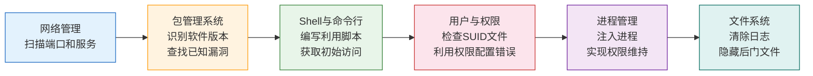
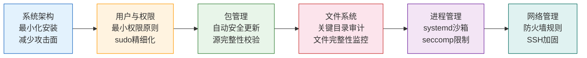
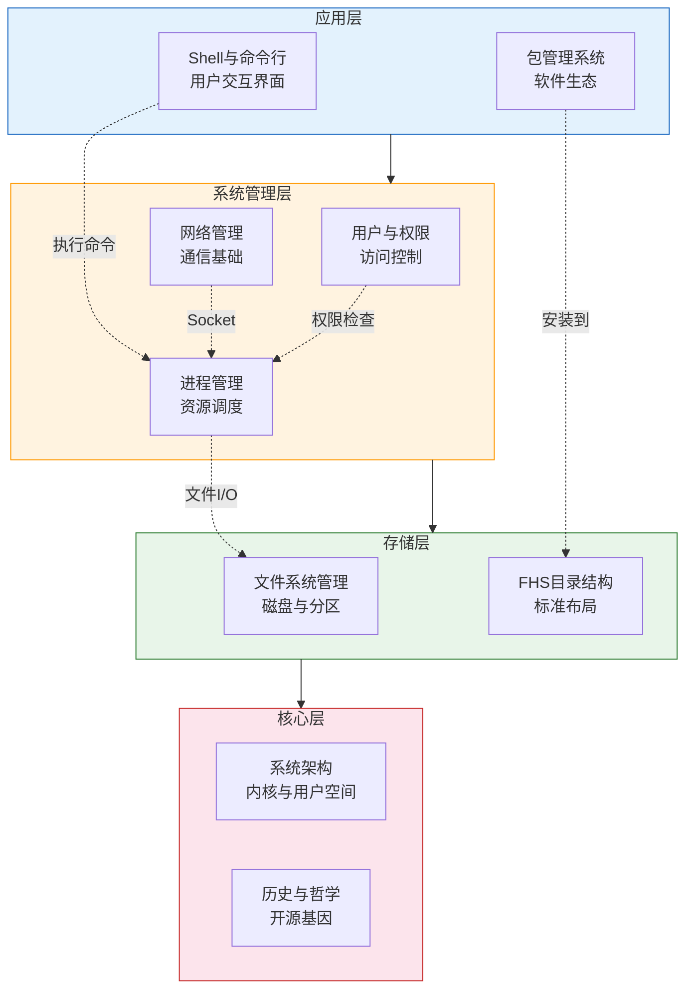

## 本节小结

本节从历史到架构、从文件系统到网络管理，系统性地构建了 Linux 操作系统的理论知识框架。作为后续学习 Linux 安全攻防的基石，这些知识不是孤立的概念罗列，而是一个有机整体——理解它们之间的关联，才能在真实的渗透测试和防御场景中灵活运用。下面从知识体系回顾、安全视角串联、能力自测和后续学习路径四个维度进行总结。

### 10.1 九大知识模块回顾

本节共涵盖九个核心模块，每个模块在操作系统中的定位和安全意义各不相同：

| 模块 | 核心内容 | 安全关键词 | 对应章节 |
|------|---------|-----------|---------|
| Linux 历史与哲学 | 开源运动、GNU/Linux、发行版生态 | 源码审计、透明性、社区信任 | 第一节 |
| 系统架构 | 内核/用户空间分层、系统调用、安全模块 | 攻击面、提权、内核漏洞 | 第二节 |
| FHS 目录结构 | 目录用途、安全关键路径、文件类型 | 信息收集、敏感文件、路径遍历 | 第三节 |
| 用户与权限模型 | UID/GID、rwx、SUID/SGID/Sticky、ACL | 提权、权限维持、越权访问 | 第四节 |
| Shell 与命令行 | Bash/Zsh、通配符、重定向、脚本 | 命令注入、反弹 Shell、脚本武器化 | 第五节 |
| 进程管理 | 进程状态、信号、守护进程、systemd | 进程注入、僵尸进程、服务劫持 | 第六节 |
| 包管理系统 | apt、yum/dnf、软件源 | 供应链攻击、恶意包、版本漏洞 | 第七节 |
| 文件系统管理 | 磁盘分区、挂载、find/locate | 数据恢复、隐藏文件、取证分析 | 第八节 |
| 网络管理 | IP/路由/DNS、防火墙、SSH 配置 | 端口扫描、横向移动、隧道 | 第九节 |

### 10.2 安全视角的知识串联

单独掌握每个模块的知识是不够的。在真实的攻防场景中，攻击者和防御者都需要将多个模块的知识串联起来。以下是几条典型的知识链路：

#### 攻击链路示例：从信息收集到权限提升



**具体场景**：假设你需要对一台 Linux 服务器进行渗透测试——

1. **网络管理**（第九节）：使用 `ss -tunlp` 发现目标开放了 SSH（22）、HTTP（80）、MySQL（3306）三个端口
2. **包管理系统**（第七节）：通过 HTTP 服务的错误页面或 `/etc/os-release` 识别出 Ubuntu 20.04，查询对应版本的 OpenSSH 和 Apache 已知漏洞
3. **Shell 与命令行**（第五节）：利用 Apache 的文件上传漏洞写入 Web Shell，或通过 SSH 弱口令获取 Shell 访问
4. **用户与权限**（第四节）：执行 `find / -perm -4000 -type f 2>/dev/null` 查找 SUID 文件，发现一个自定义的 SUID 程序存在缓冲区溢出
5. **进程管理**（第六节）：利用 SUID 漏洞提权到 root，通过 `systemctl` 创建伪装的守护进程实现持久化
6. **文件系统**（第八节）：使用 `find /var/log -name "*access*" -exec rm {} \;` 清除访问日志，在 `/dev/shm` 中隐藏恶意文件

#### 防御链路示例：从加固到监控



### 10.3 核心知识点速查

以下按安全场景分类，汇总本节最关键的实操知识点：

#### 信息收集相关

```bash
# 系统信息
cat /etc/os-release          # 发行版版本
uname -a                     # 内核版本
cat /proc/version            # 内核编译信息

# 用户枚举
cat /etc/passwd | grep -v nologin   # 可登录用户
cat /etc/shadow 2>/dev/null         # 需要root权限
whoami && id                         # 当前用户和权限

# 网络信息
ip addr show                  # 网络接口和IP
ss -tunlp                     # 监听端口
cat /etc/resolv.conf          # DNS配置

# 已安装软件
dpkg -l                       # Debian系
rpm -qa                       # RHEL系
```

#### 权限与提权相关

```bash
# 查找SUID文件（提权突破口）
find / -perm -4000 -type f 2>/dev/null

# 查找世界可写文件
find / -perm -o+w -type f 2>/dev/null

# 查找无属主文件（可能来自已删除用户）
find / -nouser -o -nogroup 2>/dev/null

# 查找最近修改的文件（追踪攻击者活动）
find /etc -mtime -1 -type f
find /tmp -type f -executable

# 查看sudo权限
sudo -l
```

#### 进程与服务相关

```bash
# 查看所有进程
ps auxf                       # 树形显示
ps -eo pid,ppid,user,comm,%mem,%cpu --sort=-%cpu | head

# 查看服务状态
systemctl list-units --type=service --state=running
systemctl status <service_name>

# 查看进程打开的文件
lsof -p <PID>
ls -la /proc/<PID>/fd/
```

#### 日志与取证相关

```bash
# 认证日志
tail -100 /var/log/auth.log      # Debian系
tail -100 /var/log/secure         # RHEL系

# 查找失败的登录尝试
grep "Failed password" /var/log/auth.log

# 查看定时任务（持久化手段）
crontab -l
cat /etc/crontab
ls -la /etc/cron.*
```

### 10.4 安全领域关键概念对照表

本节涉及的概念在后续安全学习中会反复出现。以下表格将理论概念与安全实践对应起来，建立关联记忆：

| 理论概念 | 安全含义 | 典型攻击手法 | 典型防御措施 |
|---------|---------|-------------|-------------|
| root（UID=0） | 最高权限目标 | 提权攻击的最终目标 | 禁止SSH直接root登录 |
| SUID 位 | 以文件所有者权限执行 | SUID程序漏洞利用 | 定期审计SUID文件，移除不必要的 |
| /etc/passwd | 用户信息明文存储 | 用户枚举 | 使用 nsswitch 控制查询源 |
| /etc/shadow | 密码哈希存储 | 离线暴力破解 | 强密码策略 + SHA-512/bcrypt |
| /tmp 目录 | 全局可写，sticky bit | 恭喜竞争条件攻击 | mount时加 noexec,nosuid |
| /proc 虚拟文件系统 | 内核和进程信息暴露 | 信息泄露、/proc/self/mem | hidepid=2 挂载选项 |
| 系统调用（syscall） | 用户态与内核态的唯一桥梁 | 系统调用劫持、返回导向编程 | seccomp限制可用syscall |
| systemd | 服务管理器 | 恶意service文件持久化 | 审查unit文件，启用服务沙箱 |
| 包管理器 | 软件安装源 | 供应链投毒 | 仅使用官方源，校验GPG签名 |
| 防火墙（iptables/nftables） | 网络流量过滤 | 绕过防火墙规则 | 默认拒绝策略，白名单放行 |
| SSH | 远程管理通道 | 暴力破解、中间人攻击 | 密钥认证 + fail2ban |
| Shell | 命令执行环境 | 命令注入、反弹Shell | 输入验证、最小化Shell权限 |

### 10.5 常见认知误区

在学习 Linux 基础理论时，初学者容易陷入以下误区。提前识别并纠正这些认知偏差，可以避免在后续安全学习中走弯路：

**误区一："隐藏式安全"——不公开配置就安全了**

有些人认为把 SSH 端口从 22 改成高位端口就是"安全加固"。实际上，端口扫描工具（如 Nmap）可以在几秒内发现任何端口上运行的服务。隐藏不等于安全，真正的安全来自于正确的配置——禁用密码认证、使用密钥登录、启用 fail2ban。

**误区二：root 用户无所不能所以不需要关注权限细节**

root 确实绕过大部分权限检查，但并非完全没有限制。内核级安全模块（SELinux/AppArmor）可以限制 root 进程的行为，seccomp 可以限制 root 进程能调用的系统调用。在容器环境中，root 用户的权限更是被大幅削减。理解权限模型的完整层次，才能在安全评估中不遗漏攻击面。

**误区三："我只用 Ubuntu/Kali，不需要了解其他发行版"**

渗透测试中你会遇到各种发行版——CentOS、Debian、Alpine（容器常用）、甚至嵌入式 Linux。不同发行版的包管理、日志路径、服务管理方式都不同。例如认证日志在 Debian 系是 `/var/log/auth.log`，在 RHEL 系是 `/var/log/secure`；Alpine 使用 `apk` 包管理器和 `busybox` 工具集。了解共性（内核、POSIX 标准）和差异（发行版特有配置），才能适应任何目标环境。

**误区四：chmod 777 能解决权限问题**

将文件权限设为 777（所有人可读写执行）是最危险的"解决方案"。它不仅让所有用户都能修改该文件，还为恶意代码执行打开了大门。正确的做法是遵循最小权限原则：先确定哪些用户需要什么权限，然后精确设置。例如 Web 服务器的文件通常只需要 `644`（所有者读写，其他人只读），目录需要 `755`。

**误区五：防火墙配好了就不用管网络了**

防火墙只是网络安全的一层。它无法防御应用层攻击（如 SQL 注入、XSS），也无法阻止通过合法端口（如 80/443）传输的恶意数据。纵深防御的理念要求在每一层都部署安全措施：防火墙（网络层）、WAF（应用层）、IDS/IPS（检测层）、日志监控（响应层）。

### 10.6 知识体系全景图

将本节九个模块放在操作系统的层次结构中，形成一张完整的知识地图：



### 10.7 自测清单

完成本节学习后，用以下问题检验自己的掌握程度。如果不能对每个问题给出清晰的回答，建议回顾对应章节：

**基础概念（必须掌握）**

- [ ] Linux 内核的主要子系统有哪些？各自负责什么？
- [ ] 用户空间和内核空间是如何隔离的？系统调用起了什么作用？
- [ ] FHS 标准中 `/etc`、`/var`、`/proc`、`/dev` 各自存放什么？
- [ ] rwx 权限如何用数字表示？755、644、700 分别代表什么含义？
- [ ] SUID、SGID、Sticky Bit 各自的作用和安全影响是什么？
- [ ] 进程的五种基本状态分别是什么？什么时候会出现僵尸进程？
- [ ] apt 和 yum/dnf 的基本操作命令有哪些？

**安全关联（重点掌握）**

- [ ] 为什么 SUID 文件是渗透测试的重点检查项？
- [ ] `/proc/[PID]/environ` 和 `/proc/[PID]/cmdline` 能泄露什么敏感信息？
- [ ] 如何通过 SSH 配置文件加固远程访问？
- [ ] 为什么 `/tmp` 目录要设置 Sticky Bit？
- [ ] find 命令如何查找系统中所有世界可写的文件？
- [ ] 信号机制中 SIGKILL 和 SIGTERM 有什么区别？为什么安全工具更关注 SIGKILL？

**进阶理解（加分项）**

- [ ] SELinux/AppArmor 如何在 root 权限之上再加一层限制？
- [ ] seccomp 如何减少进程的攻击面？
- [ ] systemd 的 sandbox 能力有哪些？如何限制服务的文件系统访问？
- [ ] 为什么说"一切皆文件"的设计哲学既是优势也是安全风险？

### 10.8 后续学习路径

理论基础已经建立，接下来需要将这些知识转化为实际能力。建议的学习路径：

1. **Linux 实操**（下一节）：在虚拟机或容器中动手操作本节学到的所有命令，亲手搭建一个 Linux 环境并进行基本配置
2. **Linux 安全加固**：学习如何将本节的理论知识应用到安全加固中——最小化安装、权限配置、服务加固、日志审计
3. **渗透测试基础**：以攻击者视角重新审视这些知识——如何利用 FHS 进行信息收集、如何利用权限模型进行提权、如何利用进程机制实现持久化
4. **CTF 实战**：通过 CTF 题目（尤其是 Pwn 和 Misc 类）将理论知识应用到真实的攻防场景中

> **学习建议**：不要跳过理论直接上手工具。Kali Linux 中预装的 600 多个安全工具，每一个都建立在本节所讲的基础概念之上。理解原理的人用 `cat /etc/passwd` 就能发现问题，不理解原理的人开着 Metasploit 也未必知道在找什么。理论和实操并重，才能成为真正有能力的安全研究者。
