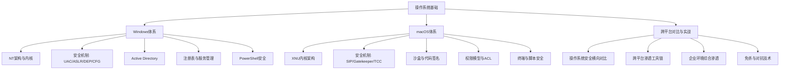
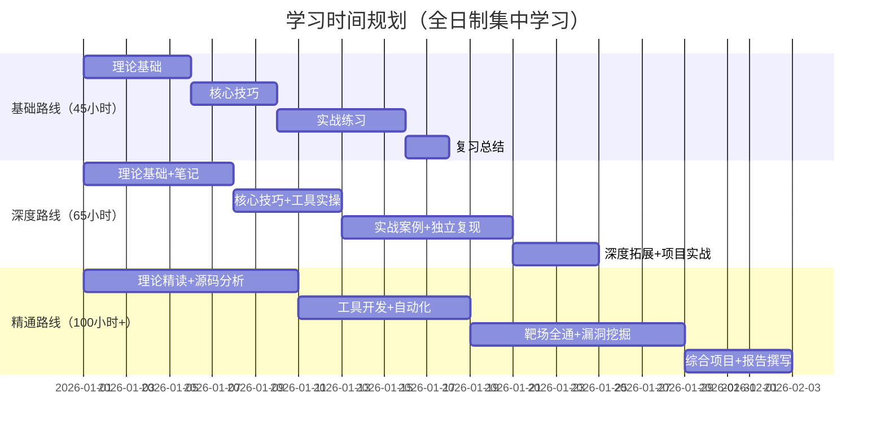

# 第07章 操作系统基础——Windows与macOS

## 为什么需要学习本章

在企业IT环境中，Windows占据了约72%的桌面操作系统市场份额，macOS在创意产业和开发者群体中占比超过25%。几乎所有渗透测试、红队评估和安全审计的目标环境都以这两种操作系统为主。对安全从业者而言，不理解Windows和macOS的底层架构与安全机制，就如同外科医生不了解人体解剖结构——表面上能操作，但无法应对复杂场景。

本章从操作系统内核架构出发，逐层拆解安全机制的设计原理与实现细节，再通过真实攻防案例展示如何利用或防御这些机制。无论你是刚入门的安全工程师，还是经验丰富的红队成员，都能在本章中找到对应深度的内容。

## 章节定位

本章在全书中的位置承上启下：

- **前置依赖**：第06章《操作系统基础——Linux》提供了操作系统通用概念（进程、内存、文件系统、权限模型），本章在此基础上聚焦Windows和macOS的特有架构
- **后续延伸**：第08章《操作系统基础——移动系统》将讨论Android和iOS，本章的macOS安全机制（沙盒、代码签名、TCC）与iOS有大量共通之处
- **横向关联**：本章内容与第09章《常见漏洞类型》、第10章《漏洞利用基础》、第12章《后渗透技术》紧密关联，是理解漏洞原理和利用技术的必要基础

## 知识体系总览

本章围绕"攻防一体"的理念构建知识体系，涵盖从底层架构到上层应用的完整链路：

## 内容结构

本章按照"理论→技巧→实战→反思→练习"的递进逻辑，分为以下模块：

### 理论基础（理论基础/目录）

构建操作系统安全的底层认知框架。本模块包含7个子章节，从系统架构到安全机制，从单一平台到跨平台对比，建立完整的理论知识体系。

| 序号 | 文件 | 核心内容 | 关键知识点 |
|------|------|----------|------------|
| 01 | Windows系统架构 | NT架构、内核/用户模式、安全子系统 | 双模式架构、LSASS、SAM、安全描述符、SID |
| 02 | macOS系统架构 | XNU内核、Mach微内核、BSD层、I/O Kit | 混合内核设计、Mach端口、进程凭证 |
| 03 | Windows安全机制深度解析 | UAC、ASLR、DEP、CFG、SEHOP、ETW | 防御机制原理与已知绕过思路 |
| 04 | Active Directory安全 | AD架构、Kerberos、GPO、信任关系 | 域渗透攻击面、AD安全加固基线 |
| 05 | macOS安全机制深度解析 | SIP、Gatekeeper、AMFI、XProtect、MRT | Apple安全生态的分层防御设计 |
| 06 | 操作系统安全对比 | Windows vs macOS vs Linux安全架构对比 | 各平台优势与薄弱环节分析 |
| 07 | 学习资源 | 推荐书籍、工具、靶场、社区 | 持续学习路径规划 |

### 核心技巧（核心技巧/目录）

将理论转化为可操作的安全技能。从日常使用的安全工具到高级检测技术，覆盖蓝队防御和红队攻击两个维度。

| 序号 | 文件 | 核心内容 | 适用角色 |
|------|------|----------|----------|
| 01 | Windows安全核心技巧 | PowerShell安全、组策略、日志分析、凭证管理 | 红队 + 蓝队 |
| 02 | macOS安全核心技巧 | 安全策略管理、终端命令、权限提升技术 | 红队 + 蓝队 |
| 03 | 跨平台安全工具 | Nmap、Metasploit、BloodHound、Impacket等 | 红队 + 蓝队 |
| 04 | 安全监控与检测 | Sysmon配置、EDR原理、SIEM集成、威胁狩猎 | 蓝队为主 |
| 05 | 高级技巧 | 内核调试、驱动分析、内存取证、固件安全 | 高级研究 |

### 实战案例（实战案例/目录）

通过真实场景模拟，将理论和技巧应用到攻防实践中。每个案例都包含完整的攻击链还原和防御建议。

| 序号 | 文件 | 核心内容 | 难度 |
|------|------|----------|------|
| 01 | Windows域环境渗透实战 | 完整的内网渗透攻击链 | ⭐⭐⭐⭐ |
| 02 | macOS权限提升实战 | macOS本地提权技术与防御 | ⭐⭐⭐ |
| 03 | Windows免杀与对抗实战 | AV/EDR绕过技术与检测对策 | ⭐⭐⭐⭐ |
| 04 | macOS免杀与对抗实战 | Gatekeeper/SIP绕过与防御 | ⭐⭐⭐⭐ |
| 05 | 综合案例：企业环境渗透 | 跨平台企业环境完整渗透 | ⭐⭐⭐⭐⭐ |

### 常见误区（04-常见误区.md）

安全从业者在学习操作系统安全时最常犯的12类错误认知，包括：

- "管理员权限等于完全控制"——忽略内核保护机制
- "macOS不会中毒"——忽视macOS特有的攻击面
- "关闭UAC可以提高效率"——安全退化的代价
- "域管理员密码复杂就安全"——横向移动不需要密码
- "杀毒软件能防住所有攻击"——理解EDR的局限性

### 练习方法（05-练习方法.md）

提供从零基础到高级的分阶段学习路径：

- **入门阶段**（1-2周）：搭建实验环境，熟悉基本操作
- **进阶阶段**（3-4周）：掌握核心攻防工具，完成基础靶场
- **高级阶段**（5-8周）：独立完成企业级渗透项目
- **专家阶段**（持续）：参与CTF竞赛、漏洞挖掘、安全研究

### 本章小结（06-本章小结.md）

汇总本章全部核心知识点，形成可快速查阅的知识索引。包括关键概念速查表、技术要点清单、以及与其他章节的关联映射。

### 深度拓展（07-深度拓展.md）

为高级读者准备的深度内容，包括：

- Windows内核漏洞挖掘方法论
- macOS内核扩展（kext）安全分析
- 高级持久化技术与检测
- 操作系统虚拟化安全（VBS、Hypervisor Framework）
- 供应链攻击与操作系统安全

## 学习目标

完成本章学习后，你将具备以下能力：

**理论层面**：
1. 能够画出Windows NT架构的核心组件关系图，解释每个组件的安全职责
2. 能够区分macOS的Mach层、BSD层和I/O Kit层的功能边界
3. 能够说明UAC、ASLR、DEP、CFG、SIP、Gatekeeper、TCC等安全机制的工作原理
4. 能够分析Active Directory的认证流程和信任模型

**实操层面**：
1. 能够使用PowerShell和终端命令完成安全基线检查
2. 能够配置Sysmon、部署SIEM规则实现Windows安全监控
3. 能够使用BloodHound、Impacket等工具进行域环境侦察
4. 能够在靶场环境中完成完整的Windows/macOS渗透测试

**思维层面**：
1. 能够根据目标操作系统制定针对性的安全测试方案
2. 能够从攻击者视角分析系统的薄弱环节
3. 能够在攻防两端之间切换思维，既理解攻击手法也掌握防御策略
4. 能够跨平台迁移安全知识，将Linux经验转化为Windows/macOS能力

## 前置知识

学习本章前，你需要具备以下基础：

| 知识领域 | 最低要求 | 建议水平 | 对应章节 |
|----------|----------|----------|----------|
| 计算机基础 | 能操作文件系统、理解进程概念 | 了解虚拟内存、中断等底层概念 | 第01章 |
| 操作系统概念 | 知道内核态与用户态的区别 | 理解系统调用、上下文切换 | 第06章 |
| 命令行操作 | 能在终端执行基本命令 | 熟悉bash/PowerShell脚本编写 | 第06章 |
| 网络基础 | 理解IP/TCP/UDP协议 | 了解域控制器、LDAP、Kerberos基础 | 第03章 |
| 编程基础 | 能读懂C/Python代码 | 能编写简单的安全工具脚本 | 第04章 |

如果上述某些领域尚有欠缺，建议先回顾对应章节，或者在学习本章过程中同步补充。不要跳过基础直接进入高级内容——操作系统安全的知识环环相扣，基础不牢会导致后续理解困难。

## 学习时间建议

根据不同的学习深度，建议安排如下：

| 学习路线 | 理论学习 | 实践练习 | 综合项目 | 总计 |
|----------|----------|----------|----------|------|
| 基础路线 | 15小时 | 20小时 | 10小时 | 45小时（约2周） |
| 深度路线 | 20小时 | 30小时 | 15小时 | 65小时（约3周） |
| 精通路线 | 30小时 | 45小时 | 25小时 | 100小时+（约5周） |

**时间分配建议**：理论和实践的比例保持在 4:6 左右。操作系统安全是一门实践性极强的学科，只看书不动手等于没学。

## 核心重点提示

学习本章时，请特别关注以下四个核心主题：

**1. Windows安全架构——企业安全的基石**

全球超过80%的企业终端运行Windows。Active Directory作为企业身份管理的核心，一旦被攻破，整个域环境将全面失守。2020年SolarWinds供应链攻击中，攻击者通过AD横向移动控制了数千个组织的内网。理解Windows安全架构不是可选项，而是安全从业者的必修课。

**2. Active Directory——企业网络的命脉**

AD管理着企业中所有的用户身份、设备认证和资源授权。一个配置不当的AD环境可以让攻击者在几小时内从普通域用户提升到域管理员。BloodHound等工具已经将AD攻击路径分析自动化，这意味着攻击门槛在降低，而防御的紧迫性在增加。

**3. macOS安全机制——快速崛起的攻击面**

随着Apple Silicon的普及和企业Mac使用率的上升（2025年企业Mac占比已达28%），macOS正成为红队必须掌握的平台。Apple的安全机制（SIP、AMFI、TCC）设计精良但并非不可绕过——每年Black Hat和DEF CON都有新的macOS攻击技术被披露。

**4. 跨平台安全思维——应对复杂IT环境**

现代企业的IT环境是混合的：员工用Mac办公，服务器运行Windows Server，开发环境用Linux。安全从业者必须具备跨平台思维，能够在不同操作系统之间快速切换攻防策略。本章的跨平台对比和综合实战就是为了训练这种能力。

## 章节与其他安全领域的关联

本章内容不是孤立的，它直接支撑以下安全工作场景：

| 安全领域 | 本章关联内容 | 典型应用场景 |
|----------|-------------|-------------|
| **渗透测试** | Windows/macOS系统漏洞利用与权限提升 | 对目标系统进行安全评估 |
| **红队攻防** | 域环境横向移动、持久化后门、免杀技术 | 模拟APT攻击检验企业防御能力 |
| **蓝队防御** | 终端安全监控、日志分析、事件响应 | 检测和响应安全事件 |
| **安全运营** | 系统安全基线配置、合规检查、补丁管理 | 维护企业终端安全状态 |
| **漏洞研究** | 操作系统内核与应用层漏洞挖掘 | 发现和报告安全漏洞 |
| **威胁情报** | 攻击手法分析、IOC提取、APT组织TTP | 分析和追踪高级威胁 |
| **安全开发** | 安全编码实践、权限最小化、沙盒设计 | 开发安全的系统和应用 |

## 安全警告与免责声明

> ⚠️ **重要提示**
>
> 本章内容仅供**合法的安全测试与教育目的**使用。所有技术、工具和方法的讨论均旨在帮助安全从业者在**获得明确授权**的前提下进行防御性安全研究。
>
> - 🚫 **未经授权**对任何系统、网络或应用进行安全测试是**违法行为**，可能面临刑事处罚
> - ✅ 所有实践活动应在**隔离的实验环境**中进行（虚拟机、Docker容器、CTF平台）
> - ✅ 遵守所在国家和地区的**网络安全法律法规**（中国：《网络安全法》《数据安全法》《个人信息保护法》）
> - ✅ 遵循**负责任的漏洞披露**原则（先报告厂商，等待修复后再公开）
> - ✅ 在企业环境中进行渗透测试前，必须获得**书面授权**（渗透测试授权书）
>
> 作者不对因滥用本章内容造成的任何后果承担责任。技术本身是中立的，关键在于使用者的意图和行为是否合法合规。
