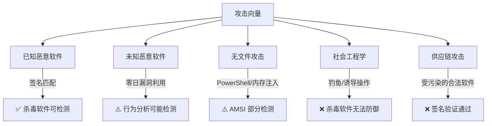
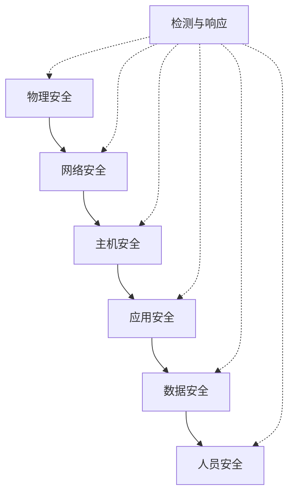

# 04 常见误区

> **导读**：本章汇总 Windows 与 macOS 操作系统中最常见的认知偏差和技术误解。每个误区都从攻击者视角和防御者视角双向分析，帮助你建立准确的安全心智模型。内容按"操作系统架构→安全机制→实践操作→技术实现"四层递进组织。

---

## 一、Windows 系统架构误区

### 1.1 注册表相关误区

#### 误区一：删除注册表键值就能彻底清除恶意软件

**错误认知**：发现恶意软件在注册表中写入了自启动项，直接删除该键值就能清除威胁。

**技术现实**：

Windows 注册表的自启动项分布在数十个位置，远不止 `Run` 和 `RunOnce`：

```text
HKCU\Software\Microsoft\Windows\CurrentVersion\Run
HKLM\Software\Microsoft\Windows\CurrentVersion\Run
HKLM\Software\Microsoft\Windows\CurrentVersion\RunOnce
HKCU\Software\Microsoft\Windows\CurrentVersion\Explorer\Shell Folders
HKLM\SYSTEM\CurrentControlSet\Services          # 服务型持久化
HKLM\SOFTWARE\Microsoft\Windows NT\CurrentVersion\Winlogon\Shell
HKLM\SOFTWARE\Microsoft\Windows NT\CurrentVersion\Image File Execution Options  # IFEO 劫持
HKLM\SOFTWARE\Microsoft\Windows NT\CurrentVersion\SilentProcessExit              # 静默进程退出监控
HKCU\Software\Classes\exefile\shell\open\command  # 文件关联劫持
```

恶意软件的典型持久化策略是多点驻留——注册表只是其中一个锚点，真正的 payload 可能：
- 以 DLL 形式注入到合法进程（如 `explorer.exe`、`svchost.exe`）
- 使用 WMI 事件订阅实现无文件持久化
- 利用计划任务（`schtasks`）或 COM 对象劫持
- 隐藏在 `C:\ProgramData` 或用户 AppData 等非标准路径

**正确做法**：

1. 使用 `Autoruns`（Sysinternals）全面扫描所有持久化位置
2. 使用 `procmon`（Process Monitor）监控进程创建和文件访问链
3. 通过 PowerShell 获取 WMI 事件订阅：
   ```powershell
   Get-WMIObject -Namespace root\Subscription -Class __EventFilter
   Get-WMIObject -Namespace root\Subscription -Class CommandLineEventConsumer
   Get-WMIObject -Namespace root\Subscription -Class __FilterToConsumerBinding
   ```
4. 使用 `schtasks /query /fo LIST /v` 检查计划任务
5. 对比干净系统的注册表快照（可使用 `regshot` 工具）

#### 误区二：注册表是 Windows 的"配置文件"，改坏了重装就行

**错误认知**：注册表只是一个大号配置文件，出了问题重装系统就能解决。

**技术现实**：

注册表是 Windows 内核和用户空间的核心状态存储引擎，远不止"配置"：

| 注册表根键 | 存储内容 | 影响范围 |
|:---|:---|:---|
| `HKEY_LOCAL_MACHINE (HKLM)` | 硬件配置、驱动、系统服务、安全策略 | 全局 |
| `HKEY_CURRENT_USER (HKCU)` | 当前用户配置、环境变量、软件偏好 | 单用户 |
| `HKEY_CLASSES_ROOT (HKCR)` | 文件关联、COM 对象注册 | 全局 |
| `HKEY_CURRENT_CONFIG (HKDC)` | 当前硬件配置文件 | 运行时 |
| `HKEY_USERS (HKU)` | 所有用户配置文件的根 | 全局 |

注册表损坏不一定是重装能解决的——`HKLM\SAM` 和 `HKLM\SECURITY` 存储了本地账户数据库和安全策略，损坏可能导致无法登录。`SYSTEM` 注册表文件损坏可能导致蓝屏（BSOD）。

注册表文件（hive files）存储在 `%SystemRoot%\System32\config\` 和用户目录中：
```text
C:\Windows\System32\config\SAM        # 安全账户管理器
C:\Windows\System32\config\SECURITY   # 安全策略
C:\Windows\System32\config\SOFTWARE   # 已安装软件
C:\Windows\System32\config\SYSTEM     # 系统配置
C:\Windows\System32\config\DEFAULT    # 默认用户配置
C:\Users\<user>\NTUSER.DAT            # 用户个人配置
C:\Users\<user>\AppData\Local\Microsoft\Windows\UsrClass.dat  # 用户类注册表
```

**渗透测试视角**：从离线系统中提取这些 hive 文件可以直接获取 SAM 数据库中的密码哈希，这是经典的离线密码破解手法。

```bash
# 使用 secretsdump 提取哈希（Impacket 工具包）
secretsdump.py -sam SAM -security SECURITY -system SYSTEM LOCAL
```

### 1.2 文件系统误区

#### 误区三：NTFS 和 FAT32 只是格式不同，安全特性差不多

**错误认知**：文件系统只是存储数据的方式，NTFS 和 FAT32 的差异仅在于容量限制和碎片化。

**技术现实**：

NTFS 的安全特性是 Windows 安全模型的基础支柱：

| 特性 | NTFS | FAT32 | exFAT |
|:---|:---|:---|:---|
| ACL（访问控制列表） | ✅ 完整支持 | ❌ 不支持 | ❌ 不支持 |
| 文件加密（EFS） | ✅ 支持 | ❌ 不支持 | ❌ 不支持 |
| 审计日志 | ✅ 支持 | ❌ 不支持 | ❌ 不支持 |
| 硬链接/符号链接 | ✅ 支持 | ❌ 不支持 | ❌ 不支持 |
| 交替数据流（ADS） | ✅ 支持 | ❌ 不支持 | ❌ 不支持 |
| 卷影复制 | ✅ 支持 | ❌ 不支持 | ❌ 不支持 |
| 磁盘配额 | ✅ 支持 | ❌ 不支持 | ❌ 不支持 |
| 最大单文件 | 16 EB | 4 GB | 16 EB |

**交替数据流（ADS）** 是一个常被忽视的安全议题。攻击者可以将恶意数据隐藏在 NTFS 交替数据流中：

```powershell
# 写入 ADS
echo "malicious payload" > C:\test.txt:hidden.txt

# 读取 ADS
more < C:\test.txt:hidden.txt

# 从 ADS 直接执行程序
type C:\evil.exe > C:\Windows\Temp\notes.txt:evil.exe
wmic process call create "C:\Windows\Temp\notes.txt:evil.exe"

# 检测 ADS
Get-Item -Path C:\test.txt -Stream *
dir /r C:\test.txt
```

ADS 不显示在文件资源管理器中，不显示在 `dir` 常规输出中，是攻击者隐藏数据的经典手法。

**正确理解**：
- 如果把 U 盘格式化为 FAT32，在该分区上所有文件的 ACL 都将失效
- EFS（加密文件系统）只在 NTFS 上工作，FAT32/exFAT 分区上文件无法加密
- 企业环境中使用 FAT32 分区等于放弃了 Windows 的文件级访问控制

#### 误区四：C 盘和 D 盘是物理上独立的硬盘

**错误认知**：每个盘符对应一块物理硬盘。

**技术现实**：

盘符只是 Windows 对卷（Volume）的逻辑映射。一个物理硬盘可以划分多个分区（多个盘符），多个物理硬盘也可以组合成一个卷（动态磁盘、存储空间）：

```powershell
# 查看物理磁盘和分区映射
Get-PhysicalDisk | Format-Table DeviceId, FriendlyName, MediaType, Size
Get-Partition | Format-Table DiskNumber, PartitionNumber, DriveLetter, Size, Type
Get-Volume | Format-Table DriveLetter, FileSystem, SizeRemaining, Size

# 查看存储空间（Storage Spaces）
Get-StoragePool
Get-VirtualDisk
```

**安全意义**：攻击者在横向移动时，不应假设不同盘符有独立的安全上下文。同一物理磁盘上的不同分区共享相同的 NTFS ACL 体系。而跨物理磁盘时，如果使用了存储池（Storage Spaces），数据可能实际分布在多块磁盘上。

### 1.3 进程与内存误区

#### 误区五：任务管理器能看到所有运行的进程

**错误认知**：打开任务管理器就能看到系统中所有正在运行的程序。

**技术现实**：

任务管理器的进程列表远远不是完整的进程快照。以下类型的进程不会在默认视图中显示：

1. **受保护进程（Protected Processes）**：Windows 内核保护的进程，如 `csrss.exe`、`smss.exe`，即使以管理员权限运行的任务管理器也无法终止它们
2. **以其他用户身份运行的进程**：在非提升模式下，看不到 SYSTEM、NETWORK SERVICE 等账户的进程
3. **进程注入**：恶意代码可以注入到合法进程的地址空间中，不会出现新的进程条目
4. **内核模式驱动**：在 Ring 0 运行的驱动程序不作为"进程"显示
5. **隐藏进程技术**：DKOM（Direct Kernel Object Manipulation）可以从内核链表中摘除进程对象

```powershell
# 使用 PowerShell 获取更全面的进程信息
Get-Process | Select-Object Id, ProcessName, Path, StartTime, CPU

# 使用 WMIC 查看进程命令行参数
wmic process get ProcessId,Name,CommandLine /FORMAT:LIST

# 使用 Sysinternals 的 Process Explorer 查看所有进程（包括子进程树）
# 下载地址：https://learn.microsoft.com/en-us/sysinternals/downloads/process-explorer

# 使用 handle.exe 查看进程打开的句柄
handle.exe -p <PID>
```

**对比不同工具的进程可见性**：

| 工具 | 进程列表 | DLL 列表 | 句柄列表 | 网络连接 | 内核模块 |
|:---|:---|:---|:---|:---|:---|
| 任务管理器 | 部分 | ❌ | ❌ | 基础 | ❌ |
| Process Explorer | 完整 | ✅ | ✅ | ✅ | ❌ |
| Process Hacker | 完整 | ✅ | ✅ | ✅ | ✅ |
| `tasklist /m` | 完整 | ✅ | ❌ | ❌ | ❌ |
| `netstat -ano` | ❌ | ❌ | ❌ | 完整 | ❌ |

#### 误区六：32 位程序在 64 位系统上性能损失很大

**错误认知**：32 位程序在 64 位 Windows 上运行会慢一半。

**技术现实**：

Windows 64 位系统通过 WoW64（Windows on Windows 64）子系统运行 32 位程序。WoW64 是一个非常轻量的兼容层，性能开销通常在 2% 以内，某些操作甚至更快（64 位系统有更多寄存器可供 WoW64 使用）。

真正的性能差异来自：
- 32 位进程最多只能使用 4 GB 虚拟地址空间（实际可用约 2 GB）
- 32 位进程无法使用超过 4 GB 物理内存
- 32 位指令集缺少部分 SIMD 扩展

**安全视角**：WoW64 引入了额外的安全风险。32 位 DLL 可以在 64 位进程中通过 `SysWOW64` 重定向机制被加载，攻击者利用这种机制来绕过安全检查。例如，32 位进程访问 `C:\Windows\System32` 时，WoW64 会自动重定向到 `C:\Windows\SysWOW64`，这可能被利用来隐藏恶意 DLL。

---

## 二、Windows 安全机制误区

### 2.1 UAC 与权限模型

#### 误区七：UAC 等于完整的安全防护

**错误认知**：UAC 弹窗就是安全的保证，只要点击"否"就能阻止恶意软件。

**技术现实**：

UAC（User Account Control）是 Windows Vista 引入的权限分离机制，但它的设计目标是**减少意外操作**，而非阻止恶意攻击。关键机制如下：

Windows 管理员账户登录时会生成两个访问令牌：
- **受限令牌（Filtered Token）**：默认使用，移除了管理员权限
- **完全令牌（Full Token）**：在 UAC 提升后使用

```text
管理员登录 → 受限令牌（默认） → 执行需提升操作 → UAC 弹窗确认 → 切换到完全令牌
标准用户登录 → 标准令牌 → 执行需提升操作 → UAC 弹窗输入管理员密码 → 获取完全令牌
```

**UAC 绕过的已知技术**：

| 绕过技术 | 原理 | Windows 版本 | 是否已修复 |
|:---|:---|:---|:---|
| `eventvwr.exe` 劫持 | 检查注册表路径时可被劫持 | Win 7-10 1511 | ✅ 已修复 |
| `fodhelper.exe` 劫持 | 检查 `ms-settings` 协议处理程序 | Win 10 1703+ | ⚠️ 部分修复 |
| `ComputerDefaults.exe` | 类似 fodhelper 的注册表检查缺陷 | Win 10+ | ⚠️ 部分修复 |
| DLL 搜索顺序劫持 | 白名单系统 DLL 的加载路径可被利用 | 多版本 | ⚠️ 依赖具体场景 |
| 自动提升白名单 | `sysprep.exe`、`slui.exe` 等自动提升进程 | Win 7-8.1 | ✅ 已修复 |
| IFileOperation COM 接口 | 利用 `cmstp.exe` 等自动提升进程复制文件 | Win 10 早期 | ✅ 已修复 |

这些绕过技术的共同特征是：利用了被标记为"自动提升"的 Windows 自带程序，这些程序不需要 UAC 弹窗就能以管理员权限运行。

**正确理解**：

- 标准用户 + `runas` 比管理员账户 + UAC 更安全
- 将 UAC 滑块调到"始终通知"并不能防御所有绕过（但能减少攻击面）
- 企业环境应启用 Credential Guard 和 LSA Protection
- UAC 是纵深防御的一层，不是唯一防线

```powershell
# 检查当前 UAC 设置
Get-ItemProperty HKLM:\SOFTWARE\Microsoft\Windows\CurrentVersion\Policies\System |
  Select-Object EnableLUA, ConsentPromptBehaviorAdmin, PromptOnSecureDesktop

# 企业环境中启用 Credential Guard
# 需要 Hyper-V 支持和 TPM 2.0
Set-CimInstance -Namespace root\Microsoft\Windows\CI -ClassName MSFT_CIVolume -Property @{Enabled=$true}
```

#### 误区八：管理员账户等于最高权限

**错误认知**：以管理员身份运行程序就能访问系统中的所有资源。

**技术现实**：

Windows 中存在多个权限层级，管理员只是其中之一：

```text
权限层级（从低到高）：
┌─────────────────────────┐
│  TrustedInstaller       │  ← Windows 模块安装服务，拥有系统文件的最高权限
├─────────────────────────┤
│  SYSTEM (LocalSystem)   │  ← 内核和系统服务，权限高于管理员
├─────────────────────────┤
│  Administrator           │  ← 本地管理员
├─────────────────────────┤
│  Standard User           │  ← 标准用户
├─────────────────────────┤
│  Guest                   │  ← 来宾账户
└─────────────────────────┘
```

- **TrustedInstaller** 拥有 `%SystemRoot%` 下大部分文件的所有权，管理员无法直接修改这些文件，必须先取得所有权
- **SYSTEM** 账户可以访问 LSASS 进程内存、注册表 SAM 数据库等管理员无法直接访问的资源
- **内核模式驱动**（Ring 0）的权限远超任何用户态账户

```powershell
# 查看文件的所有者
Get-Acl C:\Windows\System32\config\SAM | Format-List Owner

# 获取文件所有权（需要管理员权限）
$acl = Get-Acl C:\target_file
$acl.SetOwner([System.Security.Principal.NTAccount]"Administrators")
Set-Acl -Path C:\target_file -AclObject $acl

# 以 SYSTEM 权限执行命令（使用 PsExec）
psexec -s -i cmd.exe
# 验证
whoami  # 应显示 nt authority\system
```

### 2.2 Windows Defender 误区

#### 误区九：Windows Defender 不够安全，必须安装第三方杀毒

**错误认知**：Windows Defender 是"免费的、不够专业"的方案。

**技术现实**：

Windows Defender（现在叫 Microsoft Defender Antivirus）已经从一个基础的反间谍软件发展为企业级端点防护平台：

| 能力 | Defender 免费版 | Defender for Endpoint (企业版) |
|:---|:---|:---|
| 签名检测 | ✅ | ✅ |
| 云实时保护（MAPS） | ✅ | ✅ |
| 行为分析（BDA） | ✅ | ✅ |
| 攻击面减少（ASR）规则 | 部分 | ✅ 完整 |
| 网络保护 | ❌ | ✅ |
| 自动调查和修复 | ❌ | ✅ |
| 威胁和漏洞管理 | ❌ | ✅ |
| EDR 功能 | ❌ | ✅ |
| AMSI 集成 | ✅ | ✅ |

AMSI（Antimalware Scan Interface）是 Windows 10 引入的关键安全接口，允许 Defender 扫描 PowerShell、VBScript、JavaScript 等脚本引擎的运行时内容。这意味着即使攻击者使用混淆或编码的 PowerShell payload，AMSI 仍然可以在脚本引擎执行前拦截并扫描。

```powershell
# 启用和配置 Defender 高级功能
# 启用云保护
Set-MpPreference -MAPSReporting Advanced

# 启用行为监控
Set-MpPreference -DisableBehaviorMonitoring $false

# 启用网络保护
Set-MpPreference -EnableNetworkProtection Enabled

# 查看当前配置
Get-MpPreference | Select-Object MAPSReporting, DisableBehaviorMonitoring, 
  EnableNetworkProtection, SubmitSamplesConsent
```

**正确做法**：
- 对于个人用户和中小企业，Defender 配合 Windows 内置安全功能已足够强大
- 企业环境升级到 Defender for Endpoint 获得完整 EDR 能力
- 保持签名更新、云保护和行为监控全部启用
- 配合 AMSI、ASR 规则、Credential Guard 形成纵深防御

#### 误区十：杀毒软件能阻止所有攻击

**错误认知**：安装了杀毒软件就万事大吉。

**技术现实**：

杀毒软件的检测机制存在系统性盲区：



**高级攻击者的典型绕过手法**：

1. **进程注入**：将恶意代码注入合法进程的内存空间，杀毒软件看到的是 `explorer.exe` 或 `svchost.exe` 在运行
2. **系统调用直接调用（Direct Syscalls）**：绕过用户态 API hook，直接触发内核系统调用
3. **内存加密 payload**：运行时才解密 payload，静态扫描无法检测
4. **Living-off-the-Land（LOLBins）**：使用系统自带的合法工具（`certutil`、`mshta`、`regsvr32`）执行恶意操作
5. **进程镂空（Process Hollowing）**：创建挂起的合法进程，替换其内存内容后恢复执行

**正确做法**：
- 杀毒软件是纵深防御的一环，不是全部
- 配合 EDR（端点检测与响应）和 SIEM（安全信息与事件管理）
- 定期进行安全培训和钓鱼模拟
- 实施最小权限原则和应用白名单

### 2.3 Windows 更新误区

#### 误区十一：自动更新会影响工作，应该禁用

**错误认知**：Windows 更新会导致系统不稳定，应该关闭。

**技术现实**：

每一个被公开的漏洞都意味着一个已知的攻击入口。以几个重大漏洞为例：

| CVE | 漏洞类型 | 影响 | 修复方式 |
|:---|:---|:---|:---|
| CVE-2017-0144 (EternalBlue) | SMB 远程代码执行 | WannaCry 勒索攻击 | MS17-010 补丁 |
| CVE-2021-34527 (PrintNightmare) | 打印服务远程代码执行 | 域控制器沦陷 | KB5004945 |
| CVE-2023-23397 | Outlook 权限提升 | NTLM 哈希窃取 | KB5023696 |
| CVE-2024-21412 | Internet Shortcut 绕过 | SmartScreen 绕过 | KB5034763 |

这些漏洞都在补丁发布后的数天到数周内被大规模利用。禁用更新等于主动放弃防护。

**正确做法**：

```powershell
# 配置活动时间（避免在工作时间重启）
# 设置 → 更新和安全 → 更改活动时间
# 或通过组策略：
Set-ItemProperty -Path "HKLM:\SOFTWARE\Microsoft\WindowsUpdate\UX\Settings" `
  -Name "ActiveHoursStart" -Value 8    # 上午 8 点开始
Set-ItemProperty -Path "HKLM:\SOFTWARE\Microsoft\WindowsUpdate\UX\Settings" `
  -Name "ActiveHoursEnd" -Value 20      # 晚上 8 点结束

# 设置更新延迟（企业环境可用）
# 延迟功能更新最多 365 天
Set-ItemProperty -Path "HKLM:\SOFTWARE\Microsoft\WindowsUpdate\UX\Settings" `
  -Name "DeferFeatureUpdatesPeriodInDays" -Value 90
# 延迟质量更新最多 30 天
Set-ItemProperty -Path "HKLM:\SOFTWARE\Microsoft\WindowsUpdate\UX\Settings" `
  -Name "DeferQualityUpdatesPeriodInDays" -Value 14

# 使用 WSUS（Windows Server Update Services）管理企业更新
# 使用 SCCM/Intune 进行集中更新管理
```

#### 误区十二：旧版本 Windows 更稳定，不需要升级

**错误认知**：Windows 7 甚至 XP 更稳定、更熟悉，没必要升级。

**技术现实**：

- Windows 7 已于 2020 年 1 月终止扩展支持，不再接收安全更新
- Windows XP 已于 2014 年 4 月终止支持
- 这些系统不支持现代安全特性：

| 安全特性 | XP | 7 | 10/11 |
|:---|:---|:---|:---|
| ASLR（地址空间布局随机化） | ❌ | ✅ | ✅ |
| CFG（控制流防护） | ❌ | ❌ | ✅ |
| HVCI（虚拟化安全） | ❌ | ❌ | ✅ |
| VBS（基于虚拟化的安全） | ❌ | ❌ | ✅ |
| Credential Guard | ❌ | ❌ | ✅ |
| AMSI | ❌ | ❌ | ✅ |
| WDEG（Windows Defender Exploit Guard） | ❌ | ❌ | ✅ |
| TPM 2.0 集成 | ❌ | ❌ | ✅ |

**安全视角**：对于渗透测试人员来说，旧版本 Windows 系统是极好的目标——已知漏洞多、安全机制弱、打补丁概率低。对于防御者来说，运行旧系统等于敞开了所有已知漏洞的大门。

### 2.4 PowerShell 误区

#### 误区十三：PowerShell 是安全威胁，应该全面禁用

**错误认知**：PowerShell 被广泛用于攻击，禁用它就能解决问题。

**技术现实**：

PowerShell 5.0+ 拥有企业级安全功能：

```powershell
# 启用脚本块日志记录（记录所有脚本执行内容）
# 组策略路径：计算机配置 → 管理模板 → Windows 组件 → Windows PowerShell
Set-ItemProperty -Path "HKLM:\SOFTWARE\Policies\Microsoft\Windows\PowerShell\ScriptBlockLogging" `
  -Name "EnableScriptBlockLogging" -Value 1

# 启用模块日志记录
Set-ItemProperty -Path "HKLM:\SOFTWARE\Policies\Microsoft\Windows\PowerShell\ModuleLogging" `
  -Name "EnableModuleLogging" -Value 1

# 启用转录（记录完整的输入输出）
Set-ItemProperty -Path "HKLM:\SOFTWARE\Policies\Microsoft\Windows\PowerShell\Transcription" `
  -Name "EnableTranscripting" -Value 1
Set-ItemProperty -Path "HKLM:\SOFTWARE\Policies\Microsoft\Windows\PowerShell\Transcription" `
  -Name "OutputDirectory" -Value "C:\PSTranscripts"

# 使用约束语言模式（Constrained Language Mode）
# 限制 PowerShell 只能使用核心功能，阻止调用 .NET 反射等高级操作
$ExecutionContext.SessionState.LanguageMode = "ConstrainedLanguage"

# 查看当前语言模式
$ExecutionContext.SessionState.LanguageMode
```

禁用 PowerShell 后，攻击者不会停止攻击——他们会转向 `cmd.exe`、`VBScript`、`JavaScript`、`.NET` 直接编译的可执行文件，甚至 `mshta.exe`、`certutil.exe` 等 LOLBin 工具。这些替代方案的日志记录能力远不如 PowerShell。

**正确做法**：
- 保持 PowerShell 启用，但启用完整的日志记录
- 使用约束语言模式限制脚本能力
- 使用 AppLocker 或 WDAC（Windows Defender Application Control）控制脚本执行
- 集中收集 PowerShell 日志到 SIEM 进行分析

---

## 三、macOS 系统架构误区

### 3.1 安全模型误区

#### 误区十四：macOS 不会感染病毒和恶意软件

**错误认知**：macOS 基于 Unix，天生免疫病毒。

**技术现实**：

macOS 恶意软件数量近年呈爆发趋势。仅 2023-2025 年间，就有多个重大 macOS 恶意软件家族被发现：

| 恶意软件 | 类型 | 影响范围 | 传播方式 |
|:---|:---|:---|:---|
| XCSSET | 木马 | 开发者 | 注入 Xcode 项目 |
| Silver Sparrow | 间谍软件 | 约 30,000 台 | 破解软件捆绑 |
| OSX.Pirrit | 广告软件 | 大规模 | 伪装安装器 |
| MacStealer | 信息窃取 | 全球 | 钓鱼网站 |
| RustBucket | 后门 | 企业 | 社会工程学 |
| Atomic Stealer (AMOS) | 信息窃取 | 大规模 | 伪装应用 |

macOS 的安全机制确实比早期 Windows 强，但远非万能：

- **Gatekeeper** 只验证开发者签名，不分析恶意行为
- **XProtect** 基于签名检测，更新频率低于商业杀毒软件
- **MRT（Malware Removal Tool）** 只能移除已知恶意软件
- **SIP** 保护系统文件，但不保护用户数据
- **TCC** 管理隐私权限，但可以被权限提升漏洞绕过

```bash
# 检查 XProtect 签名数据库更新日期
system_profiler SPInstallHistoryDataType | grep -A5 "XProtect"

# 检查 Gatekeeper 状态
spctl --status

# 检查 SIP 状态
csrutil status

# 查看已安装的配置描述文件（可能包含恶意配置）
profiles list -all
```

#### 误区十五：SIP（系统完整性保护）是绝对安全的

**错误认知**：SIP 启用后，系统文件就不会被篡改。

**技术现实**：

SIP 的保护范围是有限的：

| 受 SIP 保护 | 不受 SIP 保护 |
|:---|:---|
| `/System` 目录 | `/usr/local` 目录 |
| `/usr` 目录（`/usr/local` 除外） | `/Applications` 目录 |
| `/bin` 和 `/sbin` | `/Users` 目录（用户数据） |
| 预装应用 | 第三方内核扩展（已通过批准） |
| 内核扩展签名验证 | `/tmp` 和 `/var` |

**已知的 SIP 绕过漏洞**：

- **CVE-2021-30892**（Shrootless）：利用 macOS 安装器的 postinstall 脚本绕过 SIP
- **CVE-2022-22583**（Migrator）：利用系统迁移工具绕过 SIP
- **CVE-2023-32369**（Migrator 第二个绕过）：类似机制再次被利用
- **CVE-2024-27866**：利用特定系统组件绕过 SIP 文件保护
- **CVE-2024-44243**：2024 年底发现的内核驱动级 SIP 绕过

这些绕过技术的共同特征是：利用被 SIP 信任的系统组件来执行不受 SIP 限制的操作。

```bash
# 在恢复模式下禁用 SIP（不推荐，仅用于测试）
# 重启 → 按住 Command+R → 打开终端
csrutil disable

# 检查 SIP 保护的具体配置
csrutil status
# 输出示例：
# System Integrity Protection status: enabled.
# Configuration:
#   Apple Internal: enabled
#   Kext Signing: enabled
#   Filesystem Protections: enabled
#   Debugging Restrictions: enabled
#   DTrace Restrictions: enabled
#   NVRAM Protections: enabled
```

### 3.2 权限管理误区

#### 误区十六：macOS 的 Unix 权限已经足够安全

**错误认知**：macOS 基于 Unix，传统的 `chmod` 和 `chown` 权限模型就够了。

**技术现实**：

macOS 的权限模型远比传统 Unix 复杂，包含至少五层权限控制：

```text
macOS 权限模型层次：
┌─────────────────────────────────────┐
│  第1层：Unix 传统权限               │  rwxr-xr-x (owner/group/other)
├─────────────────────────────────────┤
│  第2层：ACL（访问控制列表）          │  细粒度权限，优先于传统权限
├─────────────────────────────────────┤
│  第3层：SIP（系统完整性保护）        │  保护系统文件不受任何用户修改
├─────────────────────────────────────┤
│  第4层：TCC（透明度、同意和控制）    │  管理摄像头、麦克风、文件夹等隐私权限
├─────────────────────────────────────┤
│  第5层：沙盒（Sandbox）             │  App Store 应用的强制隔离
└─────────────────────────────────────┘
```

TCC 是 macOS 独有的权限系统，管理以下隐私数据的访问：

```bash
# TCC 数据库位置
# 用户级别：
~/Library/Application Support/com.apple.TCC/TCC.db
# 系统级别（受 SIP 保护）：
/Library/Application Support/com.apple.TCC/TCC.db

# 查看 TCC 权限（需要完全磁盘访问权限）
sqlite3 ~/Library/Application\ Support/com.apple.TCC/TCC.db \
  "SELECT client,service,auth_value FROM access;"
```

**安全意义**：
- 仅使用 `chmod` 无法控制应用对摄像头和麦克风的访问
- TCC 数据库本身受 SIP 保护，普通用户无法直接修改
- 但已知多个 TCC 绕过漏洞（如 CVE-2020-9771、CVE-2021-30713）

#### 误区十七：sudo 密码设了就安全

**错误认知**：有了 sudo 密码，系统就有足够的保护。

**技术现实**：

sudo 本身存在多个安全风险：

1. **sudo 会话缓存**：默认情况下，sudo 认证后在 5 分钟内不需要再次输入密码。攻击者如果获取了一个 shell，可以在缓存期内执行 sudo 命令

```bash
# 查看 sudo 超时设置
sudo sudo -V | grep "Authentication timestamp timeout"

# 配置 sudo 不缓存（每次都需要密码）
# 编辑 /etc/sudoers：
sudo visudo
# 添加：Defaults timestamp_timeout=0

# 限制 sudo 日志
Defaults logfile="/var/log/sudo.log"
Defaults log_input, log_output
```

2. **已知的 sudo 漏洞**：
   - **CVE-2021-3156（Baron Samedit）**：堆溢出漏洞，允许无权限用户获取 root。影响 sudo 1.8.2 到 1.9.5p1
   - **CVE-2021-3156** 的 PoC 在公开后数小时内就被武器化
   - **CVE-2023-22809**：sudoedit 中的漏洞，允许编辑任意文件

3. **sudoers 配置错误**：
   ```bash
   # 危险配置示例 - 允许以 root 身份执行任何命令且不需要密码
   # /etc/sudoers 中：
   # username ALL=(ALL) NOPASSWD: ALL  ← 绝对不要这样做
   
   # 更安全的做法：限制可执行的命令
   username ALL=(ALL) NOPASSWD: /usr/bin/systemctl restart nginx
   ```

---

## 四、macOS 安全实践误区

### 4.1 Gatekeeper 与应用安全

#### 误区十八：Gatekeeper 能阻止所有恶意软件

**错误认知**：Gatekeeper 启用后，下载的应用就安全了。

**技术现实**：

Gatekeeper 只验证应用的开发者签名和公证（Notarization）状态，不进行行为分析：

```text
Gatekeeper 检查流程：
用户下载应用 → 检查扩展属性（com.apple.quarantine）
  → 是否有有效的开发者签名？
    → 是：签名是否被 Apple 公证（Notarization）？
      → 是：允许运行 ✅
      → 否：警告但允许手动打开 ⚠️
    → 否：阻止运行 ❌
```

**已知的 Gatekeeper 绕过方法**：

1. **合法开发者证书签名**：攻击者注册 Apple 开发者账号，签名恶意软件并提交公证
2. **Zshenv 绕过**：利用 macOS 在应用启动时加载 `~/.zshenv` 的特性（已修复部分场景）
3. **符号链接绕过**：利用符号链接指向不受 Gatekeeper 检查的位置（已修复部分场景）
4. **挂载镜像绕过**：通过特定方式挂载 DMG 文件绕过检查（多个 CVE）
5. **TCC 数据库操纵**：通过备份恢复等机制操纵 TCC 权限

```bash
# 移除隔离属性（绕过 Gatekeeper 的简单方法）
xattr -d com.apple.quarantine /Applications/SuspiciousApp.app

# 检查应用签名
codesign -dv --verbose=4 /Applications/SomeApp.app

# 检查应用是否被公证
spctl -a -v /Applications/SomeApp.app

# 使用 `stapler` 检查公证票据
stapler validate /Applications/SomeApp.app
```

### 4.2 网络安全误区

#### 误区十九：macOS 防火墙默认已开启且足够安全

**错误认知**：macOS 自带防火墙，默认配置就能保护网络安全。

**技术现实**：

macOS 实际上有**三层**独立的防火墙机制，且默认配置并不完善：

| 防火墙类型 | 默认状态 | 管理方式 | 功能 |
|:---|:---|:---|:---|
| 应用防火墙 | ❌ 默认未启用 | 系统偏好设置 | 控制应用的入站连接 |
| PF（Packet Filter） | ✅ 默认启用但无规则 | 命令行 | 低层包过滤 |
| ALF（Application Layer Firewall） | 继承应用防火墙状态 | plist 配置 | 应用层过滤 |

```bash
# 检查应用防火墙状态
sudo /usr/libexec/ApplicationFirewall/socketfilterfw --getglobalstate

# 启用应用防火墙
sudo /usr/libexec/ApplicationFirewall/socketfilterfw --setglobalstate on

# 阻止所有入站连接
sudo /usr/libexec/ApplicationFirewall/socketfilterfw --setblockall on

# 启用隐身模式（不响应 ping 和端口扫描）
sudo /usr/libexec/ApplicationFirewall/socketfilterfw --setstealthmode on

# 查看 PF 防火墙状态
sudo pfctl -s info

# 查看 PF 规则
sudo pfctl -s rules

# 加载自定义 PF 规则
sudo pfctl -f /etc/pf.conf
```

**正确做法**：
- 手动启用应用防火墙并配置隐身模式
- 对于高级需求，配置 PF 防火墙规则
- 使用 `Little Snitch` 或 `LuLu` 等工具监控出站连接
- 定期检查防火墙规则和已批准的应用列表

### 4.3 系统维护误区

#### 误区二十：macOS 不需要磁盘维护和安全扫描

**错误认知**：macOS "就是不会变慢"、"不需要清理"、"不需要安全扫描"。

**技术现实**：

macOS 的 APFS 文件系统确实比传统 HFS+ 更健壮，但仍存在以下问题：

1. **Time Machine 快照消耗空间**：APFS 快照会占用可观的磁盘空间
2. **系统日志膨胀**：`/var/log/` 和 `~/Library/Logs/` 可能增长到数十 GB
3. **缓存积累**：浏览器缓存、应用缓存、DNS 缓存等
4. **XProtect 和 MRT 更新滞后**：相比商业安全软件，签名更新频率较低

```bash
# 查看磁盘使用情况
df -h

# 查看 APFS 快照
tmutil listlocalsnapshots /

# 删除本地 Time Machine 快照
tmutil deletelocalsnapshots <日期>

# 清理系统日志（需要谨慎）
sudo rm -rf /var/log/asl/*.asl
sudo rm -rf /Library/Logs/DiagnosticReports/*

# 清理 DNS 缓存
sudo dscacheutil -flushcache
sudo killall -HUP mDNSResponder

# 检查是否有异常的启动项
ls -la /Library/LaunchDaemons/
ls -la /Library/LaunchAgents/
ls -la ~/Library/LaunchAgents/

# 检查已加载的内核扩展
kextstat | grep -v com.apple

# 检查系统完整性
diskutil verifyVolume /
```

---

## 五、跨平台安全实践误区

### 5.1 密码管理误区

#### 误区二十一：复杂密码比长密码更安全

**错误认知**：`P@$$w0rd!#` 比 `correct-horse-battery-staple` 更安全。

**技术现实**：

密码熵（信息量）取决于长度和字符集大小，计算公式为：

```text
熵 = 长度 × log₂(字符集大小)
```

| 密码 | 字符集大小 | 长度 | 熵值 | 暴力破解时间（10亿次/秒） |
|:---|:---|:---|:---|:---|
| `P@$$w0rd!#` | 95（可打印字符） | 10 | ~66 bits | 数小时 |
| `correct-horse-battery-staple` | 26+1（小写+连字符） | 28 | ~103 bits | 数万亿年 |
| `Tr0ub4dor&3` | 95 | 11 | ~72 bits | 数天 |
| `我爱吃红烧肉` | ~3500（常用汉字） | 6 | ~69 bits | 数天 |

**关键结论**：密码长度对安全性的贡献远大于复杂性。一个 20 位以上的密码短语比 8-12 位的"复杂"密码安全得多。

#### 误区二十二：定期强制更改密码更安全

**错误认知**：每 90 天强制更改密码可以防止密码泄露被利用。

**技术现实**：

NIST SP 800-63B（2017年修订版）明确不再推荐强制定期更改密码，原因如下：

1. **密码疲劳**：用户被迫频繁更改密码时，倾向于选择更弱的密码
2. **可预测模式**：`Password1` → `Password2` → `Password3` → ...
3. **记录在不安全位置**：用户会将频繁更改的密码写在便签纸上
4. **如果密码未泄露，更改没有实际安全价值**

**正确做法**：
- 只在密码确认泄露时才强制更改
- 使用密码管理器为每个账户生成唯一密码
- 启用多因素认证（MFA）作为主要防线
- 使用 Have I Been Pwned 等服务监控密码泄露

### 5.2 备份与恢复误区

#### 误区二十三：有了备份就等于安全

**错误认知**：定期备份数据就万事大吉。

**技术现实**：

备份解决的是**可用性**问题，不是**保密性**和**完整性**问题：

| 安全属性 | 备份能解决？ | 说明 |
|:---|:---|:---|
| 可用性（Availability） | ✅ | 数据丢失后可以恢复 |
| 保密性（Confidentiality） | ❌ | 备份不防止数据泄露 |
| 完整性（Integrity） | ⚠️ | 如果备份包含被篡改的数据，恢复的也是被篡改的数据 |

**备份本身的安全风险**：
1. 备份介质可能被窃取或未加密
2. 备份可能包含恶意软件（恢复后重新感染）
3. 勒索软件会专门加密备份文件和网络共享
4. 云备份的加密密钥可能由服务商管理（服务商可以访问数据）

**正确做法**：

采用 3-2-1 备份策略：

```text
3 份数据副本：
  ├── 1 份：生产环境本地数据
  ├── 1 份：本地备份（外置硬盘/NAS）
  └── 1 份：异地备份（云存储/远程服务器）

2 种存储介质：
  ├── 本地 SSD/HDD
  └── 云存储/磁带

1 份异地存储：
  └── 物理隔离的存储位置
```

- 对备份数据进行客户端加密（密钥由自己管理）
- 定期测试恢复过程（备份不测试等于没备份）
- 使用不可变备份（Immutable Backup），防止勒索软件加密备份
- 保持至少一份离线备份（Air-gapped Backup）

### 5.3 VPN 与网络安全误区

#### 误区二十四：使用 VPN 就绝对安全

**错误认知**：连接 VPN 后，所有网络活动都是匿名和安全的。

**技术现实**：

VPN 只解决网络传输层的加密问题，不提供全面的安全保护：

```text
VPN 的保护范围：
  ✅ 加密传输数据（防止中间人窃听）
  ✅ 隐藏真实 IP 地址（针对目标服务器）
  ✅ 绕过网络限制/审查

VPN 无法保护：
  ❌ 浏览器指纹追踪
  ❌ Cookie 和登录状态泄露
  ❌ DNS 泄露（如果 VPN 配置不当）
  ❌ WebRTC 泄露（浏览器真实 IP）
  ❌ VPN 提供商自身的日志记录
  ❌ 端点设备上的恶意软件
  ❌ 你主动提交给网站的信息
```

```bash
# 检查 DNS 泄露（连接 VPN 后）
nslookup myip.opendns.com resolver1.opendns.com

# 检查 WebRTC 泄露
# 在浏览器中访问 https://browserleaks.com/webrtc

# 使用 kill switch 确保 VPN 断开时流量不泄露
# 大多数 VPN 客户端提供此功能
```

### 5.4 多因素认证误区

#### 误区二十五：MFA 是万能的，启用后账户绝对安全

**错误认知**：启用了多因素认证，黑客就无法入侵。

**技术现实**：

不同 MFA 方法的安全性差异巨大：

| MFA 方法 | 安全等级 | 可被绕过？ | 绕过方式 |
|:---|:---|:---|:---|
| SMS 验证码 | 低 | ✅ | SIM 卡交换、SS7 攻击、SIM hijacking |
| 邮箱验证码 | 低 | ✅ | 邮箱被入侵 |
| TOTP（Google Authenticator 等） | 中 | ⚠️ | 钓鱼代理（Evilginx2）、实时钓鱼 |
| 推送通知 | 中 | ⚠️ | MFA 疲劳攻击（反复推送直到用户点确认） |
| FIDO2/WebAuthn 硬件密钥 | 高 | 极难 | 物理窃取（有 PIN 保护） |
| Windows Hello 生物识别 | 高 | 极难 | 需要物理接近设备 |

**典型的 MFA 绕过攻击**：

1. **Evilginx2**：搭建钓鱼代理站点，实时转发登录请求，同时拦截 MFA token
2. **MFA 疲劳攻击**：2022 年 Uber 入侵事件中，攻击者反复发送 MFA 推送通知，直到员工不耐烦点了"允许"
3. **SIM 卡交换攻击**：攻击者冒充受害者联系运营商，将手机号转移到自己的 SIM 卡上
4. **会话令牌窃取**：如果已经获取了有效会话令牌，根本不需要 MFA

**正确做法**：
- 优先使用 FIDO2/WebAuthn 硬件密钥（如 YubiKey）
- 禁用 SMS 作为 MFA 方法（如果可能）
- 实施条件访问策略（从异常位置登录时要求更强的 MFA）
- 使用防钓鱼的 MFA 方案

### 5.5 加密误区

#### 误区二十六：加密数据是绝对安全的

**错误认知**：只要数据经过加密，就无法被破解。

**技术现实**：

加密的有效性取决于实现方式和密钥管理，而不是算法本身：

```text
加密数据的攻击面：

加密算法本身（如 AES-256）  → 理论上不可破解 ✅
  ↓ 但是
密钥管理                  → 密钥泄露 = 加密失效 ❌
  ↓ 例如
  ├── 密钥存储在明文文件中
  ├── 密钥硬编码在源代码中
  ├── 弱密钥派生（如 MD5 hash）
  └── 密钥备份被泄露

实现漏洞                  → 侧信道攻击 ❌
  ├── 时序攻击
  ├── 电磁泄漏
  ├── 功耗分析
  └── 缓存侧信道

量子计算威胁              → RSA/ECC 未来可破解 ⚠️
```

#### 误区二十七：HTTPS 网站就是安全的

**错误认知**：浏览器显示绿色锁头就意味着网站安全。

**技术现实**：

HTTPS 只保证**传输层加密**，不保证**内容安全**：

- 恶意网站同样可以获得免费的 Let's Encrypt SSL 证书
- 钓鱼网站 `https://paypa1.com` 也有合法的 HTTPS 证书
- HTTPS 不防止 XSS（跨站脚本）、CSRF、SQL 注入等应用层攻击
- 中间人攻击在特定条件下仍然可能（如恶意 CA、企业证书注入）

```bash
# 检查网站证书详情
openssl s_client -connect example.com:443 -servername example.com < /dev/null 2>/dev/null | \
  openssl x509 -noout -subject -issuer -dates

# 验证证书链
openssl verify -CAfile /etc/ssl/certs/ca-certificates.crt cert.pem

# 检查 HSTS（HTTP Strict Transport Security）是否启用
curl -sI https://example.com | grep -i strict-transport
```

---

## 六、渗透测试者常见误区

> 本节面向安全从业者和渗透测试人员，汇总在实战中最常犯的认知错误。

### 6.1 信息收集阶段

#### 误区二十八：只关注线上资产，忽视物理和人员安全

**错误认知**：渗透测试就是扫描漏洞和利用漏洞。

**现实**：

在真实的红队评估中，最有效的攻击向量往往不是技术漏洞：

```text
攻击向量有效性排序（基于 Mandiant 2024 报告）：
1. 钓鱼邮件        （~35% 的初始入侵）
2. 漏洞利用        （~25%）
3. 凭据泄露/暴力破解（~20%）
4. 供应链攻击      （~10%）
5. 物理入侵        （~5%）
6. 内部威胁        （~5%）
```

**正确做法**：
- 信息收集阶段应覆盖：技术资产、人员信息、物理安全、社交媒体暴露面
- 使用 OSINT 工具（如 `theHarvester`、`Maltego`、`Shodan`）全面收集
- 关注员工的社交媒体泄露（GitHub 上的凭据、LinkedIn 上的组织架构）

### 6.2 权限提升阶段

#### 误区二十九：只使用自动化工具，不理解底层机制

**错误认知**：运行 `LinPEAS` 或 `WinPEAS` 就能找到所有提权路径。

**现实**：

自动化工具基于已知的检查列表，会遗漏以下场景：

1. **自定义服务的错误配置**：不在标准检查列表中的自定义服务
2. **业务逻辑漏洞**：只有理解业务流程才能发现
3. **组合漏洞**：单个漏洞不构成提权条件，但组合起来可以
4. **环境特定配置**：自动化工具无法理解特定环境的上下文

```powershell
# Windows 手动检查示例：查找可写的系统服务
# 1. 列出所有非标准服务
wmic service where "not PathName like '%System32%'" get Name,PathName,StartMode

# 2. 检查服务二进制文件的 ACL
# 获取服务的可执行文件路径
sc qc <ServiceName>
# 检查文件权限
icacls <PathToExecutable>
# 查看是否有当前用户可写的权限

# 3. 检查服务的 DLL 搜索顺序劫持
# 如果服务从非安全路径加载 DLL，可以放置恶意 DLL
accesschk.exe -wvu "C:\Program Files\Custom Service\"
```

### 6.3 横向移动阶段

#### 误区三十：内网中所有机器都是平等的

**错误认知**：在内网中获得域管理员权限后，可以直接访问所有机器。

**现实**：

现代企业网络通常有分段隔离：

```text
典型的企业网络分段：
┌─────────────────────────────────────────┐
│  DMZ 区域                                │  ← Web 服务器、邮件网关
├─────────────────────────────────────────┤
│  办公区域                                │  ← 员工工作站
├─────────────────────────────────────────┤
│  服务器区域                              │  ← 文件服务器、应用服务器
├─────────────────────────────────────────┤
│  核心区域                                │  ← 域控制器、数据库
├─────────────────────────────────────────┤
│  工控区域（OT）                          │  ← SCADA、PLC
└─────────────────────────────────────────┘

即使拥有域管理员权限：
- 无法直接访问工控网络（需要跨越网络分段）
- 特权工作站（PAWs）可能不在域内
- 部分服务器可能有额外的身份验证要求（如 Smart Card）
```

---

## 七、建立正确的安全认知框架

### 7.1 纵深防御原则

没有任何单一安全措施是万能的。正确的做法是构建多层防御：



### 7.2 安全认知检查清单

以下是针对本文所有误区的快速检查清单：

| # | 误区 | 正确认知 | 紧急程度 |
|:---|:---|:---|:---|
| 1 | 删注册表能清除恶意软件 | 使用 Autoruns + ProcMon 全面检查 | 高 |
| 2 | 注册表坏了重装就行 | 注册表 hive 文件影响登录和安全 | 中 |
| 3 | NTFS 和 FAT32 差不多 | NTFS 有 ACL/EFS/ADS，FAT32 没有 | 高 |
| 4 | 盘符=物理硬盘 | 盘符是逻辑卷映射 | 中 |
| 5 | 任务管理器能看到所有进程 | 使用 Process Explorer/ProcMon | 中 |
| 6 | 32 位程序在 64 位上很慢 | WoW64 开销 <2%，但有安全影响 | 低 |
| 7 | UAC=安全防护 | UAC 有多种绕过方法 | 高 |
| 8 | 管理员=最高权限 | TrustedInstaller > SYSTEM > 管理员 | 高 |
| 9 | Defender 不够安全 | Defender 企业版是完整 EDR | 中 |
| 10 | 杀毒软件能防所有攻击 | 进程注入/无文件攻击可绕过 | 高 |
| 11 | 关闭自动更新 | 每个已知漏洞都是攻击入口 | 高 |
| 12 | 旧版本更稳定 | 旧版本缺少所有现代安全特性 | 高 |
| 13 | 禁用 PowerShell 更安全 | 启用日志+约束语言模式更有效 | 高 |
| 14 | macOS 不会感染 | macOS 恶意软件逐年增加 | 高 |
| 15 | SIP 是绝对的 | 多个 CVE 已证明 SIP 可被绕过 | 中 |
| 16 | Unix 权限够了 | macOS 有 5 层权限模型 | 高 |
| 17 | sudo 密码设了就安全 | sudo 有缓存/漏洞/配置风险 | 中 |
| 18 | Gatekeeper 防恶意软件 | 只验证签名，不分析行为 | 高 |
| 19 | macOS 防火墙默认安全 | 应用防火墙默认未启用 | 中 |
| 20 | macOS 不需要维护 | 需要检查启动项/日志/快照 | 低 |
| 21 | 复杂密码比长密码安全 | 长度比复杂性更重要 | 高 |
| 22 | 定期改密码更安全 | NIST 已不推荐强制更改 | 中 |
| 23 | 备份=安全 | 备份不防泄露和篡改 | 高 |
| 24 | VPN=绝对安全 | 不防指纹、DNS 泄露、端点攻击 | 中 |
| 25 | MFA=万能 | SMS 可被劫持，推送可被疲劳攻击 | 高 |
| 26 | 加密=绝对安全 | 密钥管理是最大挑战 | 中 |
| 27 | HTTPS=安全网站 | 恶意网站也有 HTTPS | 中 |

### 7.3 持续学习路径

安全认知的建立不是一蹴而就的，需要持续学习和实践：

1. **关注安全动态**
   - 订阅：Krebs on Security、The Hacker News、BleepingComputer
   - CVE 数据库：https://cve.mitre.org/
   - 供应商安全公告：Microsoft MSRC、Apple Security Updates

2. **实践验证**
   - 搭建家庭实验室（使用 VirtualBox/VMware）
   - 使用 TryHackMe、HackTheBox 等平台练习
   - 对自己的系统进行安全评估

3. **建立安全思维方式**
   - 对每个安全声明保持质疑："这个结论的前提条件是什么？"
   - 理解安全是一个持续过程，不是一次性购买产品
   - 人、流程、技术三者缺一不可

---

> **本节核心要点**：安全领域的"常识"往往经不起技术细节的检验。每个安全机制都有其设计边界和已知弱点——理解这些边界比盲目信任任何单一机制更重要。攻击者的优势在于只找一层防线的弱点；防御者必须确保每一层都经得起考验。
