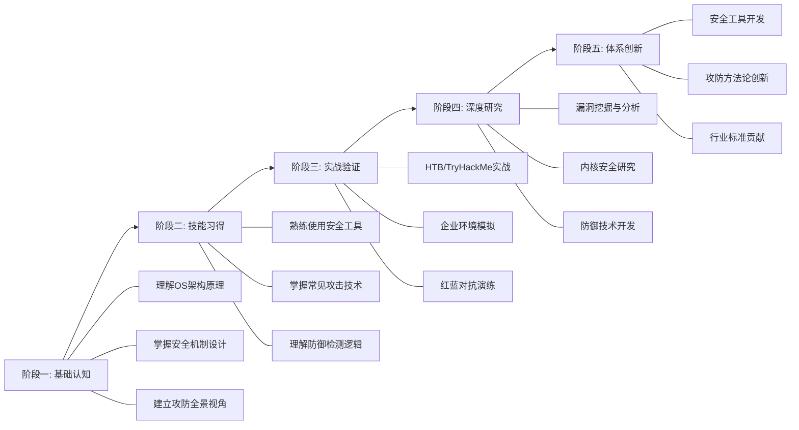

# 第07章 操作系统基础——Windows与macOS

# 06 本章小结

本章从系统架构底层原理出发，完整覆盖了Windows与macOS两大操作系统的核心安全机制、攻防技术和实战方法。作为全章的收束，本节不再重复具体技术细节，而是从更高视角建立知识框架、梳理关键认知、提炼可迁移的安全思维模型。

## 一、核心知识框架

### 1.1 两大操作系统的设计哲学对比

Windows和macOS的安全模型根植于截然不同的设计哲学，理解这种差异是跨平台安全思维的基础：

| 维度 | Windows | macOS |
|------|---------|-------|
| **设计目标** | 企业级兼容性，最大生态覆盖 | 端到端封闭安全，硬件-软件一体化 |
| **安全模型** | 基于对象的安全（安全描述符/DACL/SACL） | 基于能力的沙盒 + 强制代码签名 |
| **权限控制** | UAC（便利性特性，非安全边界） | SIP（真正的内核级安全边界） |
| **内核架构** | 单内核（NT内核），驱动运行在内核空间 | 混合内核（XNU = Mach + BSD），I/O Kit 驱动框架 |
| **认证体系** | NTLM → Kerberos（域环境） | 本地密钥链 + Apple ID 生态 |
| **应用管理** | 开放生态，用户自行决策 | Gatekeeper + 公证机制，App Store 审核 |
| **加密保护** | BitLocker（需要TPM + Pro/Enterprise） | FileVault（所有版本内置） |
| **攻击面** | 极大（向后兼容、庞大的遗留API） | 较小但日益增长（特别是供应链攻击） |

**关键认知**：Windows的安全挑战源于其"向后兼容"的设计优先级——为了不破坏现有应用，大量不安全的遗留机制（如NTLM、DCOM、WMI）被保留。macOS的安全优势来自其封闭生态，但这也意味着一旦突破核心防线（如SIP绕过），系统内部的纵深防御相对有限。

### 1.2 知识体系结构图

```mermaid
graph TD
    A[操作系统安全] --> B[Windows安全]
    A --> C[macOS安全]
    
    B --> B1[架构层]
    B --> B2[机制层]
    B --> B3[攻击面]
    B --> B4[防御体系]
    
    B1 --> B1a[NT内核架构]
    B1 --> B1b[用户模式/内核模式]
    B1 --> B1c[安全子系统 LSASS/SAM]
    
    B2 --> B2a[访问控制 DAC/SACL]
    B2 --> B2b[认证协议 NTLM/Kerberos]
    B2 --> B2c[保护技术 ASLR/DEP/CFG]
    
    B3 --> B3a[Active Directory]
    B3 --> B3b[服务漏洞]
    B3 --> B3c[凭据窃取]
    
    B4 --> B4a[AMSI/ETW/WDEG]
    B4 --> B4b[EDR/Defender]
    B4 --> B4c[组策略/审计]
    
    C --> C1[架构层]
    C --> C2[机制层]
    C --> C3[攻击面]
    C --> C4[防御体系]
    
    C1 --> C1a[XNU内核 Mach+BSD]
    C1 --> C1b[I/O Kit驱动框架]
    C1 --> C1c[launchd进程管理]
    
    C2 --> C2a[SIP系统完整性]
    C2 --> C2b[Gatekeeper公证]
    C2 --> C2c[TCC隐私控制]
    
    C3 --> C3a[应用漏洞]
    C3 --> C3b[内核利用]
    C3 --> C3c[权限提升sudo/SUID]
    
    C4 --> C4a[XProtect/MRT]
    C4 --> C4b[Endpoint Security]
    C4 --> C4c[Secure Boot链]
```



### 1.3 攻击链路全景映射

将MITRE ATT&CK框架映射到两大操作系统的具体技术，建立从理论到实操的桥梁：

| 攻击阶段 | Windows 核心技术 | macOS 核心技术 | 本章对应章节 |
|----------|-----------------|---------------|-------------|
| **侦察** | BloodHound 攻击路径分析、PowerView AD枚举 | system_profiler、dscl目录服务查询 | 核心技巧/Windows安全核心技巧 |
| **初始访问** | 钓鱼+Office宏、供应链投毒 | 伪装应用绕过Gatekeeper、恶意配置描述文件 | 实战案例/Windows域环境渗透 |
| **执行** | PowerShell AMSI绕过、进程注入、WMI远程执行 | osascript、Automator工作流、Launch Agent | 核心技巧/高级技巧 |
| **权限提升** | UAC绕过（eventvwr/fodhelper）、Token模拟、服务配置错误 | sudo配置错误、SUID滥用、内核漏洞（如CVE-2021-3156） | 实战案例/macOS权限提升实战 |
| **凭据访问** | Mimikatz LSASS转储、Kerberoasting、DCSync | Keychain提取、Keychain.dmp分析 | 实战案例/Windows免杀与对抗 |
| **横向移动** | Pass-the-Hash、Pass-the-Ticket、PsExec/WMI | SSH密钥复用、共享凭据利用 | 实战案例/企业环境渗透 |
| **持久化** | 注册表Run键、计划任务、WMI事件订阅、COM劫持 | Launch Daemon/Agent、Login Items、Cron Jobs | 实战案例/综合案例 |
| **防御规避** | 反射式DLL注入、AMSI Patch、ETW修补 | Gatekeeper绕过、XProtect白名单利用 | 实战案例/免杀与对抗实战 |

## 二、关键认知提炼

### 2.1 Windows安全的五大核心认知

**认知一：安全边界 ≠ 便利性特性**

UAC是本章最容易被误解的概念之一。微软官方明确表示UAC不是安全边界（security boundary），而是便利性特性（convenience feature）。这意味着：
- 发现UAC绕过不算安全漏洞，微软不会为此发布补丁
- 企业环境不应依赖UAC作为权限控制手段
- 真正的安全边界是内核模式/用户模式的隔离、进程间的隔离（如AppContainer）

**认知二：Active Directory是企业安全的核心战场**

AD不仅是目录服务，更是整个企业身份基础设施的基石。理解以下因果链至关重要：
1. AD域控制器存储所有域凭据的哈希 → 攻击DC等于攻击整个域
2. Kerberos票据机制被设计为安全的，但实现细节（如RC4加密降级）创造了攻击面
3. 信任关系（Domain Trust）将攻击面从单域扩展到整个森林
4. 组策略（GPO）既能用于安全加固，也能被攻击者用于横向分发恶意负载

**认知三：凭据保护是Windows安全的阿喀琉斯之踵**

LSASS进程存储了几乎所有类型的Windows凭据（NTLM哈希、Kerberos票据、明文密码、DPAPI密钥）。这解释了为什么：
- Mimikatz是Windows渗透的核心工具，而非辅助工具
- Credential Guard（基于VSM的凭据隔离）是企业环境的必备配置
- LSA Protection（RunAsPPL）是最基本的防护措施
- 进程保护不足的环境下，任何获得管理员权限的攻击者都能在数秒内接管整个域

**认知四：防御技术在持续进化**

Windows Defender从杀毒软件演变为完整的EDR平台：
- AMSI（反恶意软件扫描接口）：让防御软件能检查PowerShell、VBScript等解释型代码的运行时行为
- ETW（事件跟踪）：为检测系统提供内核级的可观测性
- WDEG（Windows Defender漏洞防护）：利用硬件虚拟化隔离关键进程
- 敌人不是静止的——攻击者也在持续研究如何绕过这些机制（如AMSI内存补丁、ETW修补）

**认知五：遗留技术是最大的安全债务**

Windows生态系统中大量技术被保留用于向后兼容，但它们已成为攻击者的利器：
- NTLM：哈希可直接用于认证（Pass-the-Hash），NTLMv1甚至可逆向还原密码
- WMI：无文件攻击的理想载体，事件订阅可实现持久化
- DCOM：远程代码执行的合法通道
- PowerShell v2：不支持AMSI，被攻击者用于规避检测
- 每一个遗留技术都是安全团队需要额外监控和限制的攻击面

### 2.2 macOS安全的五大核心认知

**认知一：SIP是macOS安全模型的基石**

系统完整性保护（SIP）不仅仅是一个开关——它是一套完整的安全框架：
- 保护`/System`、`/usr`、`/bin`、`/sbin`目录不被修改（即使root权限也无法修改）
- 限制内核扩展加载（kext → 系统扩展的迁移）
- 限制DTrace、task_for_pid等调试接口
- SIP的设计理念：即使是系统管理员，也不应该能破坏操作系统本身

**认知二：TCC是隐私保护的创新设计**

透明、同意和控制（TCC）框架代表了操作系统隐私保护的范式转变：
- 不仅保护文件访问，还保护摄像头、麦克风、屏幕录制、位置等敏感资源
- TCC数据库存储在受SIP保护的目录中
- 但TCC存在设计缺陷：用户级别的TCC保护可以被同一用户的其他进程绕过（除非启用用户目录保护）
- MDM（移动设备管理）可以预授权TCC权限，这是企业环境的双刃剑

**认知三：代码签名不仅是验证，更是访问控制的前置条件**

macOS的代码签名已超越简单的"验证开发者身份"：
- 沙盒（Sandbox）强制要求签名
- Hardened Runtime是获取系统权限（如摄像头访问）的前提
- 公证（Notarization）是Gatekeeper允许运行的条件
- 签名中的entitlements定义了应用可以访问的系统资源
- 未签名应用在现代macOS上几乎无法正常运行

**认知四：macOS的攻击面正在快速增长**

随着macOS市场份额上升和Apple Silicon的推广，macOS面临的安全威胁显著增加：
- 供应链攻击：合法macOS应用被植入恶意代码（如HandBrake、Transmission事件）
- 内核漏洞：XNU内核的Mach/BSD交互层存在复杂的竞态条件
- 配置描述文件（.mobileconfig）：可以静默安装证书、VPN、代理等配置
- 浏览器沙盒逃逸：Safari和WebKit的安全研究正在快速增长

**认知五：Apple Silicon改变了安全游戏规则**

M系列芯片引入了硬件级安全增强：
- 指针认证（PAC）：硬件级ROP/JOP防护
- 安全飞地（Secure Enclave）：独立的硬件安全模块
- 完整性保护（KTRR/iommu）：防止内核代码被修改
- 但Apple Silicon也带来了新挑战：DFU模式和恢复OS的安全边界需要持续研究

### 2.3 跨平台安全思维模型

建立统一的安全思维框架，而非分别记忆两套系统的技术：

```text
┌──────────────────────────────────────────────────────────────────┐
│                    安全分析三步法（通用）                          │
├──────────────────────────────────────────────────────────────────┤
│                                                                  │
│  第一步：理解目标系统的信任边界                                    │
│  ├── 谁信任谁？（认证模型）                                       │
│  ├── 什么保护什么？（权限模型）                                    │
│  └── 什么验证什么？（完整性模型）                                  │
│                                                                  │
│  第二步：识别信任边界的薄弱环节                                    │
│  ├── 认证协议的已知弱点（NTLM vs Kerberos）                       │
│  ├── 权限检查的实现缺陷（UAC绕过 vs TCC绕过）                     │
│  ├── 完整性验证的覆盖盲区（驱动加载 vs kext加载）                  │
│  └── 遗留兼容性引入的降级路径                                      │
│                                                                  │
│  第三步：针对薄弱环节制定攻击/防御策略                             │
│  ├── 利用薄弱环节获取更高权限                                      │
│  ├── 在新权限层级重新执行三步法                                    │
│  └── 持续监控信任边界的异常变化                                    │
│                                                                  │
└──────────────────────────────────────────────────────────────────┘
```

## 三、技术能力评估矩阵

通过以下矩阵自评当前能力水平，识别需要重点加强的领域：

### 3.1 Windows安全能力评估

| 能力层级 | 初级（知道是什么） | 中级（知道怎么做） | 高级（知道为什么） | 专家级（能发现新问题） |
|----------|-------------------|-------------------|-------------------|---------------------|
| **架构理解** | 能区分用户模式和内核模式 | 能解释系统调用的完整路径 | 能分析驱动漏洞的影响范围 | 能设计新的安全隔离机制 |
| **认证安全** | 知道NTLM和Kerberos的区别 | 能执行Kerberoasting攻击 | 能分析PAC验证的弱点 | 能发现新的认证协议漏洞 |
| **权限提升** | 知道UAC的基本作用 | 能使用已知技术绕过UAC | 能分析新的UAC绕过条件 | 能发现未公开的提权路径 |
| **域安全** | 知道AD的基本概念 | 能使用BloodHound分析攻击路径 | 能设计AD安全加固方案 | 能发现AD逻辑漏洞 |
| **防御绕过** | 知道AMSI的存在 | 能使用已有工具绕过AMSI | 能分析ETW修补的技术原理 | 能开发新的绕过技术 |

### 3.2 macOS安全能力评估

| 能力层级 | 初级 | 中级 | 高级 | 专家级 |
|----------|------|------|------|--------|
| **架构理解** | 知道XNU内核的组成 | 能解释Mach消息传递机制 | 能分析I/O Kit驱动安全 | 能挖掘XNU内核漏洞 |
| **安全机制** | 知道SIP的作用 | 能在受限环境中操作 | 能分析SIP绕过的原理 | 能发现新的SIP绕过 |
| **应用安全** | 知道代码签名的概念 | 能分析应用的entitlements | 能评估沙盒逃逸路径 | 能发现新的沙盒绕过 |
| **隐私保护** | 知道TCC的基本功能 | 能查询TCC数据库 | 能分析TCC绕过技术 | 能发现新的TCC缺陷 |
| **持久化** | 知道Launch Agent的作用 | 能创建基本持久化 | 能绕过安全机制实现持久化 | 能设计隐蔽持久化方案 |

## 四、知识关联图谱

### 4.1 本章与全书的知识关联

本章内容并非孤立存在，它与全书其他章节形成有机的知识网络：

**向上关联——理论支撑**：
- 操作系统架构知识 → 理解漏洞产生的根本原因（为什么缓冲区溢出能执行代码？为什么UAC绕过可行？）
- 内存保护机制（ASLR/DEP/CFG）→ 为后续漏洞利用章节提供理论基础
- 认证协议原理 → 理解Pass-the-Hash/Pass-the-Ticket等凭据攻击的本质

**向下关联——技术落地**：
- 域渗透技术 → 为红队实战提供完整的攻击链路
- 防御绕过技术 → 为免杀和持久化提供方法论
- 安全工具使用 → 为日常安全评估提供可操作的手段

**横向关联——跨领域延伸**：
- Web安全：浏览器沙盒逃逸与操作系统安全机制紧密相关
- 移动安全：iOS/macOS共享XNU内核和大量安全框架
- 云安全：Windows域控制器是混合云环境的核心组件
- IoT安全：嵌入式Windows和macOS内核的研究方法可以迁移

### 4.2 技术迁移矩阵

将本章学到的核心概念迁移到其他安全领域：

| 本章概念 | 可迁移领域 | 迁移方式 |
|----------|-----------|---------|
| Windows安全描述符 | 数据库权限设计 | DACL的白名单模式 → 最小权限原则 |
| Kerberos票据机制 | OAuth2.0/JWT分析 | 票据生命周期管理 → Token安全设计 |
| macOS沙盒模型 | 容器安全（Docker/K8s） | 能力限制 → seccomp/AppArmor配置 |
| ASLR/DEP/CFG | 浏览器安全 | 内存保护技术 → V8/SpiderMonkey隔离 |
| TCC隐私框架 | 移动应用权限管理 | 细粒度授权 → Android/iOS权限模型 |
| SIP完整性保护 | 固件安全 | 系统级完整性 → Secure Boot链验证 |

## 五、实战知识速查

### 5.1 高频使用的命令和工具

以下清单整理了本章涉及的最高频命令和工具，建议打印或保存为速查卡：

**Windows 核心命令速查**：

```powershell
# 域环境信息收集
Get-DomainController                          # 获取域控信息
Get-DomainUser -Identity <user>               # 查询用户属性
Get-DomainComputer -OperatingSystem "*Server*" # 查找服务器
Find-InterestingDomainAcl -ResolveGUIDs       # 发现异常ACL

# 凭据相关
sekurlsa::logonpasswords                      # Mimikatz: 转储登录凭据
sekurlsa::tickets /export                     # 导出Kerberos票据
lsadump::dcsync /user:krbtgt                  # DCSync获取krbtgt哈希

# 防御绕过
[System.Reflection.Assembly]::Load()          # 反射式加载.NET程序集
powershell -ep bypass -nop                    # 绕过执行策略
```

**macOS 核心命令速查**：

```bash
# 系统安全状态检查
csrutil status                                # 检查SIP状态
spctl --assess -vv <app>                      # 检查应用Gatekeeper状态
codesign -dv --verbose=4 <app>                # 查看代码签名详情
security find-generic-password -ga <service>  # 查询钥匙串项目

# 持久化检查
ls -la ~/Library/LaunchAgents/                # 用户级Launch Agent
ls -la /Library/LaunchAgents/                 # 系统级Launch Agent
ls -la /Library/LaunchDaemons/                # 系统级Launch Daemon
launchctl list                                # 列出已加载的服务
crontab -l                                    # 查看计划任务

# TCC数据库查询
sqlite3 ~/Library/Application\ Support/com.apple.TCC/TCC.db \
  "SELECT client,service,auth_value FROM access"
```

### 5.2 关键配置检查清单

**Windows安全加固检查**：
- [ ] LSA Protection（RunAsPPL）已启用
- [ ] Credential Guard 已部署（企业环境）
- [ ] PowerShell Constrained Language Mode 已启用
- [ ] PowerShell v2 已禁用
- [ ] LLMNR/NBT-NS 已禁用
- [ ] SMBv1 已禁用
- [ ] 审计策略已配置（特别是Kerberos TGT请求、特权登录、策略变更）
- [ ] Sysmon 已部署且配置了检测规则
- [ ] 本地管理员密码已通过LAPS随机化
- [ ] 域管理员账户已配置受保护用户组（Protected Users）

**macOS安全加固检查**：
- [ ] SIP 已启用（csrutil status）
- [ ] FileVault 全盘加密已启用
- [ ] Gatekeeper 已启用（spctl --status）
- [ ] 防火墙已启用（系统偏好设置 → 安全性与防火墙）
- [ ] 隐私权限已审计（TCC数据库中的授权项）
- [ ] Launch Agent/Daemon 已审计（非必要的已移除）
- [ ] 自动登录已禁用
- [ ] 远程登录（SSH）已禁用或限制访问
- [ ] XProtect 和 MRT 保持自动更新
- [ ] 固件密码已设置（Intel Mac）/ 启动安全性已配置（Apple Silicon）

## 六、学习路径建议

### 6.1 按阶段的能力构建路径



### 6.2 推荐学习资源

**入门阶段**：
- Windows Internals（第7版）——Mark Russinovich 等著，Windows系统原理的权威参考
- macOS Internals（Jonathan Levin 著）——macOS内核分析的深入参考
- MITRE ATT&CK 矩阵——将攻击技术标准化的框架，用于建立技术全景

**进阶阶段**：
- OSEP/OSEP 认证课程——侧重Windows域渗透和防御绕过
- Objective-See 博客（Patrick Wardle）——macOS安全研究的顶级资源
- SpecterOps 博客——Active Directory安全研究的前沿阵地

**高级阶段**：
- Windows 内核安全研究——关注 MSRC 安全公告和补丁分析
- XNU 内核源码分析——Apple 开源的 XNU 内核代码
- 安全会议演讲——Black Hat、DEF CON、POC 等会议的 Windows/macOS 安全议题

### 6.3 认证路径建议

| 认证名称 | 难度 | 侧重方向 | 建议时机 |
|----------|------|----------|---------|
| CompTIA Security+ | 入门 | 安全基础概念 | 初学阶段 |
| eJPT | 入门 | 渗透测试基础 | 完成基础学习后 |
| OSCP | 中级 | 渗透测试实操 | 有6个月实践经验后 |
| CRTO | 中级 | 红队技术（Windows域） | 掌握Windows安全后 |
| OSEP | 中高级 | 高级渗透与防御绕过 | OSCP通过后 |
| GXPN | 高级 | 漏洞挖掘与利用 | 有内核研究经验后 |

## 七、本章关键收获

完成本章学习后，应建立以下核心认知：

1. **操作系统安全不是独立的技术问题，而是系统设计哲学的体现**。Windows的兼容性优先和macOS的安全性优先导致了截然不同的攻击面和防御模型。

2. **安全边界是最关键的概念**。区分真正的安全边界（内核/用户模式隔离、SIP）和便利性特性（UAC）是安全分析的第一步。

3. **凭据是Windows域安全的命脉**。LSASS、Kerberos票据、NTLM哈希的保护质量直接决定了整个域环境的安全等级。

4. **macOS的封闭性既是优势也是盲区**。SIP/Gatekeeper/TCC提供了强保护，但一旦突破，系统内部的纵深防御相对有限。

5. **技术在持续演进，思维模型才是根本**。具体的工具和漏洞会过时，但理解信任边界、权限模型、完整性保护的思维方式是长期有效的。

6. **安全研究需要合法边界**。本章涉及的所有技术仅应用于授权的安全测试和研究。未经授权的渗透测试是违法行为。

掌握本章内容后，读者应具备在Windows和macOS环境下进行安全评估的基础能力，并能够理解更高级的安全研究方向。下一章将进入更深入的操作系统安全主题，包括内核安全、驱动安全和高级漏洞利用技术。
