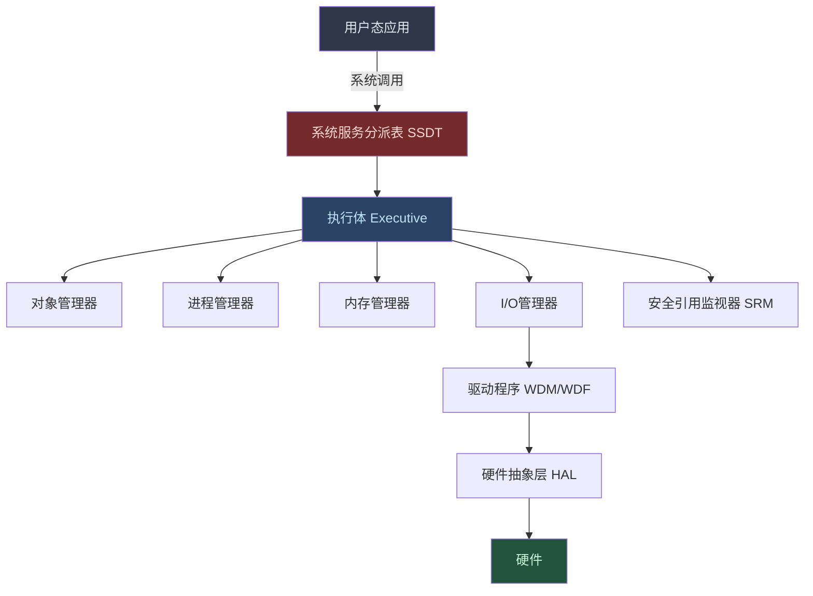
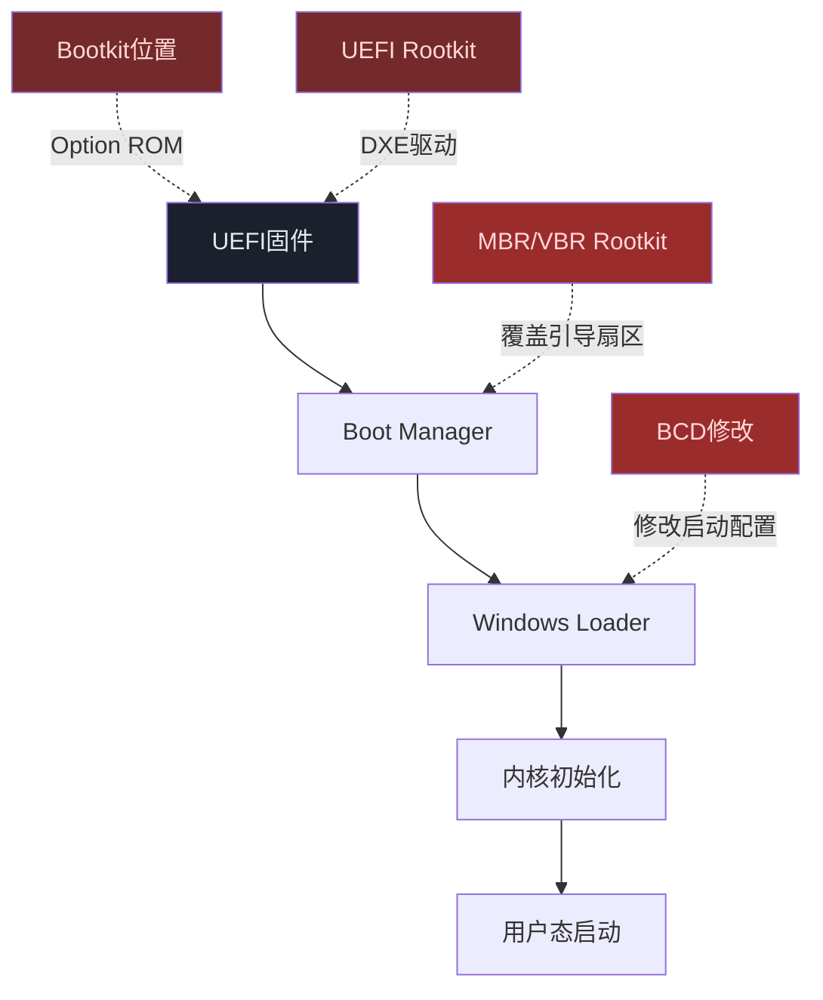
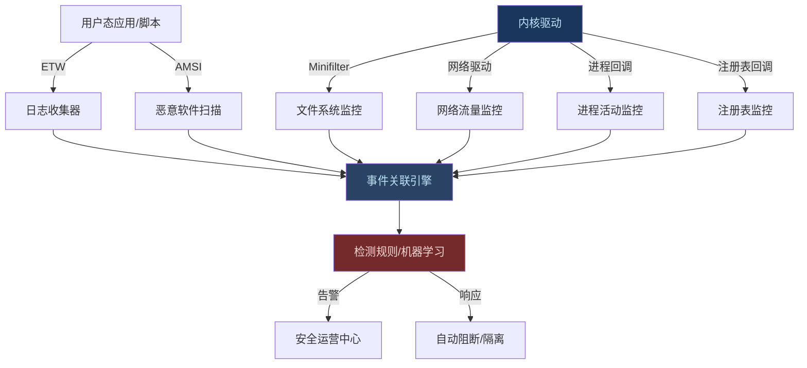
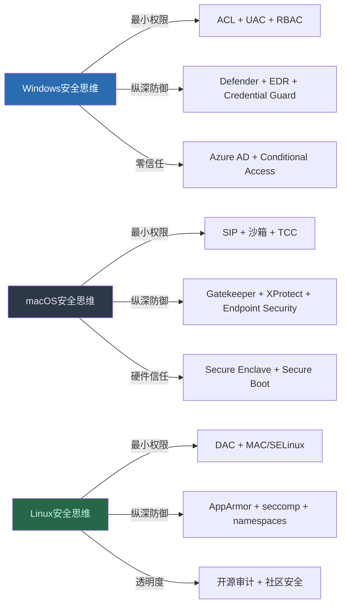
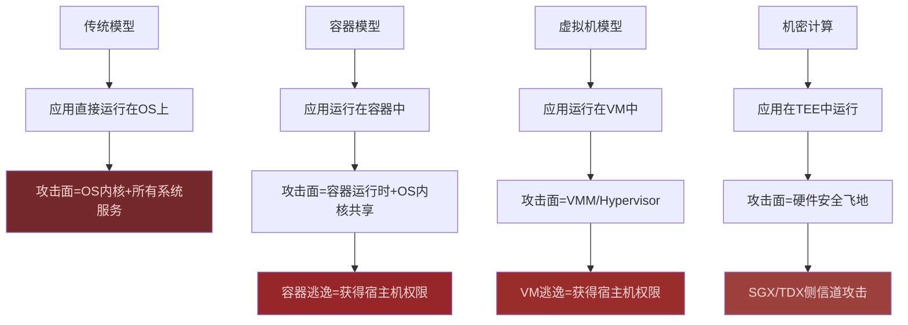
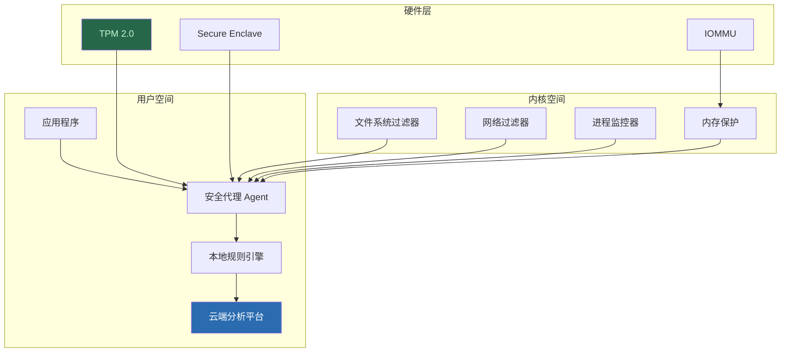
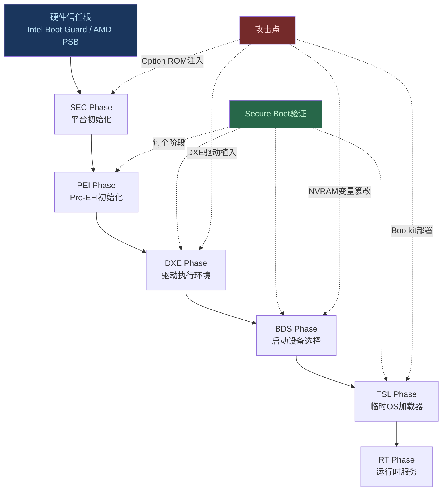
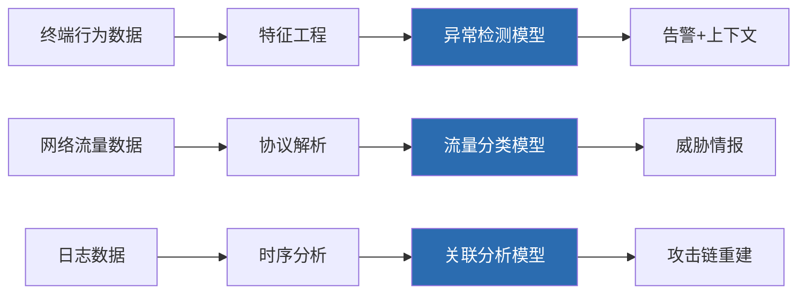

# 第07章 操作系统基础-Windows-macOS - 深度拓展

> 本章在前六节的基础上进行纵深拓展。理论基础、核心技巧和实战案例已覆盖的内容不再重复，而是聚焦于：内核级攻防、高级持久化、现代防御绕过、固件安全、云时代操作系统安全等前沿领域。每一节都附带可执行的代码或操作流程，确保读者能将知识转化为实践能力。

---

## 一、Windows内核级安全攻防

### 1.1 内核攻击面全景

Windows内核（ntoskrnl.exe）是整个系统的信任基础。一旦内核被攻破，所有用户态防御机制（包括EDR、AMSI、Credential Guard）都形同虚设。



**内核攻击面分类：**

| 攻击面 | 具体目标 | 典型漏洞 | 影响范围 |
|--------|---------|---------|---------|
| 驱动程序 | 第三方驱动（.sys） | 缓冲区溢出、IOCTL处理不当 | 提权至Ring 0 |
| 系统调用 | SSDT/Nt*函数 | 参数验证不足 | 提权至Ring 0 |
| 内核对象 | 进程/线程/令牌 | 竞态条件、UAF | 提权至Ring 0 |
| 网络协议栈 | TCP/IP驱动（tcpip.sys） | 远程代码执行 | 远程内核RCE |
| 图形子系统 | Win32k.sys | 类型混淆、堆溢出 | 提权至Ring 0 |
| 文件系统 | NTFS驱动 | 畸形MFT解析 | 拒绝服务/提权 |

### 1.2 Windows驱动安全审计

驱动程序是Windows内核最大的攻击面。安全审计驱动需要关注以下关键点：

**1.2.1 IOCTL处理审计**

驱动通过DeviceIoControl暴露功能给用户态。IOCTL码定义了操作类型：

```c
// IOCTL码结构
// Bits 31-30: 访问类型 (METHOD_BUFFERED/METHOD_IN_DIRECT/METHOD_OUT_DIRECT/METHOD_NEITHER)
// Bits 29-28: 自定义标志
// Bits 27-16: 设备类型 (FILE_DEVICE_*)
// Bits 15-2:  控制码
// Bits 1-0:   传输方式

// 危险的传输方式
#define METHOD_NEITHER  3  // 直接传递用户态指针，无内核拷贝
// METHOD_NEITHER要求驱动自行验证指针，否则可被用于任意内核读写
```

**IOCTL Fuzzing流程：**

```powershell
# 步骤1：枚举设备对象及其ACL
Get-CimInstance Win32_PnPEntity | Where-Object {
    $_.Status -eq "OK"
} | Select-Object Name, DeviceID

# 步骤2：使用OSR Device Tree查看驱动设备树
# 下载：https://www.osronline.com/article.cfm%5Earticle=97.htm

# 步骤3：IOCTL Fuzzer示例（使用Python + ctypes）
```

```python
import ctypes
import struct
from ctypes import wintypes

kernel32 = ctypes.WinDLL('kernel32.dll')

# 打开目标设备
device = kernel32.CreateFileW(
    r"\\.\TargetDevice",
    0xC0000000,  # GENERIC_READ | GENERIC_WRITE
    0, None,
    3,  # OPEN_EXISTING
    0, None
)

# Fuzzing不同IOCTL码
def fuzz_ioctl(device_handle, ioctl_code, input_data, output_size=512):
    """发送IOCTL请求并检测异常"""
    output_buffer = ctypes.create_string_buffer(output_size)
    bytes_returned = wintypes.DWORD(0)
    
    result = kernel32.DeviceIoControl(
        device_handle,
        ioctl_code,
        input_data,
        len(input_data),
        output_buffer,
        output_size,
        ctypes.byref(bytes_returned),
        None
    )
    return result, output_buffer.raw[:bytes_returned.value]

# 常见危险IOCTL模式
DANGEROUS_PATTERNS = [
    0x220000,  # FILE_DEVICE_UNKNOWN + METHOD_BUFFERED
    0x220004,  # FILE_DEVICE_UNKNOWN + METHOD_NEITHER
    0x222000,  # 自定义功能码
]
```

**1.2.2 常见驱动漏洞模式**

| 漏洞类型 | 特征 | 检测方法 | 经典案例 |
|---------|------|---------|---------|
| IOCTL缓冲区溢出 | RtlCopyMemory无长度检查 | IDA Pro + BinDiff | Capcom.sys |
| 方法类型混淆 | METHOD_NEITHER未验证指针 | IOCTL Fuzzing | MSI Afterburner |
| 竞态条件 | 共享资源无锁保护 | 并发IOCTL测试 | Win32k菜单对象 |
| 空指针解引用 | 未检查分配返回值 | 模拟低内存环境 | 各类第三方驱动 |
| 整数溢出 | 乘法运算无溢出检查 | 输入边界值测试 | TrueType字体解析 |

**实战：手动驱动漏洞挖掘（以IOCTL处理为例）**

```powershell
# 使用WinDbg内核调试分析驱动
# 步骤1：加载符号
.sympath srv*c:\symbols*https://msdl.microsoft.com/download/symbols
.reload

# 步骤2：定位驱动入口
lm m target_driver
!drvobj \Driver\TargetDriver 2

# 步骤3：反汇编IRP_MJ_DEVICE_CONTROL处理函数
u target_driver+0x1234

# 步骤4：追踪用户态输入的使用
# 查找 ProbeForRead/ProbeForWrite 调用（METHOD_NEITHER验证）
# 查找 RtlCopyMemory/ExAllocatePool 的大小参数来源
```

### 1.3 内核漏洞利用技术

**1.3.1 内核栈溢出利用**

当驱动在处理IOCTL时使用栈缓冲区但未正确验证长度：

```python
# 内核栈溢出的基本思路
# 1. 覆盖返回地址为shellcode地址
# 2. 但现代Windows有栈Cookie（/GS编译选项）

# 绕过栈Cookie的方法：
# 方法A：不覆盖到Cookie的位置（如覆盖SEH链）
# 方法B：利用内核池溢出替代栈溢出
# 方法C：利用任意写原语修改Cookie存储位置
```

**1.3.2 内核池溢出（Pool Overflow）**

Windows内核使用NonPagedPool和PagedPool管理动态内存。池溢出比栈溢出更常见：

```python
# 内核池布局
# | POOL_HEADER (0x10 bytes) | OBJECT_HEADER | 实际数据 |
# 溢出可覆盖相邻对象的POOL_HEADER或对象内容

# 利用思路：
# 1. 分喷射（Pool Spray）创建大量目标大小的对象
# 2. 触发溢出覆盖相邻对象的关键字段
# 3. 被覆盖的对象用于实现任意读/写
# 4. 通过任意写修改Token.Privileges或Token.PrivilegesEnabled
```

**1.3.3 任意内核读写原语**

现代内核漏洞利用的核心是获得任意读写能力：

```c
// 典型的任意读写原语来源
// 1. 类型混淆：将对象A当作对象B来解析
// 2. 空指针映射：在用户态映射NULL页面
// 3. WNF（Windows Notification Facility）状态数据操作
// 4. DataOnlyAttack：不覆盖函数指针，只修改数据字段

// Token提权（最经典的任意写目标）
// 将Token.Privileges字段修改为全部启用
// 位置偏移因Windows版本而异，可通过以下方法确定：
// dt nt!_TOKEN -b
```

**1.3.4 绕过内核ASLR（KASLR）**

```powershell
# 方法1：利用NtQuerySystemInformation泄露内核地址
# SystemModuleInformation (11) 返回所有加载模块的基址
# Windows 10 RS2+限制了标准用户调用，但仍有绕过

# 方法2：利用物理内存读写原语
# 通过 \\.\PhysicalMemory 设备（已限制）或
# 利用已有驱动的物理地址映射功能

# 方法3：利用已知模块偏移
# 同一版本的ntoskrnl.exe基址相对固定（除非KASLR启用）
# Ntoskrnl基址通常对齐到0x1000000（16MB边界）
```

### 1.4 高级持久化技术

**1.4.1 内核级持久化**

传统的用户态持久化（注册表Run键、计划任务等）容易被EDR检测。内核级持久化更隐蔽：

| 技术 | 原理 | 检测难度 | 实现复杂度 |
|------|------|---------|-----------|
| 内核回调注册 | PsSetCreateProcessNotifyRoutine | 中等 | 低 |
| 过滤驱动 | Minifilter驱动挂载 | 高 | 中 |
| WFP调用注册 | 网络过滤层回调 | 高 | 中 |
| 计时器对象 | 内核定时器回调 | 极高 | 高 |
| SSDT Hook | 修改系统服务分派表 | 极高（PatchGuard保护） | 高 |

```cpp
// 示例：注册进程创建回调
#include <ntddk.h>

// 全局变量存储回调注册状态
PVOID g_CallbackRegistration = NULL;

// 进程创建回调函数
VOID ProcessCreateCallback(
    PEPROCESS Process,
    HANDLE ProcessId,
    PPS_CREATE_NOTIFY_INFO CreateInfo
) {
    if (CreateInfo != NULL) {
        // 新进程创建
        UNICODE_STRING processName = *CreateInfo->ImageFileName;
        // 检查是否为目标进程，执行后门逻辑
        DbgPrint("Process created: %wZ\n", &processName);
    }
}

// 驱动入口
NTSTATUS DriverEntry(PDRIVER_OBJECT DriverObject, PUNICODE_STRING RegistryPath) {
    NTSTATUS status;
    
    status = PsSetCreateProcessNotifyRoutineEx(
        ProcessCreateCallback,
        FALSE  // 注册
    );
    
    // 保存注册句柄用于卸载时移除
    g_CallbackRegistration = (PVOID)ProcessCreateCallback;
    
    return status;
}
```

**1.4.2 Bootkit与固件持久化**

最高级的持久化在操作系统加载之前执行：



**UEFI安全启动绕过案例分析：**

2023年BlackLotus恶意软件是首个成功绕过UEFI Secure Boot的bootkit：

1. 利用CVE-2022-21894（Baton Drop）漏洞禁用Secure Boot
2. 部署恶意的Windows Boot Manager
3. 在内核加载前执行恶意代码
4. 部署内核驱动禁用BitLocker、EDR和HVCI

**防御检测方法：**

```powershell
# 检查UEFI启动完整性
# 方法1：检查Secure Boot状态
Confirm-SecureBootUEFI

# 方法2：检查BCD配置
bcdedit /enum all | Select-String "path|device|description"

# 方法3：使用Chipsec检查固件完整性
# pip install chipsec
# chipsec_main -m common.spi.fd

# 方法4：使用EfiGuard检测UEFI恶意软件
# https://github.com/Mattiwatti/EfiGuard
```

### 1.5 Windows防御机制深度绕过

**1.5.1 AMSI（反恶意软件扫描接口）绕过**

AMSI将PowerShell/VBScript/JavaScript的执行内容发送给AV扫描。绕过是红队的基本功：

```powershell
# AMSI架构理解：
# 1. 应用程序调用 AmsiOpenSession / AmsiScanBuffer / AmsiCloseSession
# 2. amsi.dll将内容传递给注册的AV引擎
# 3. AV返回结果：AMSI_RESULT_CLEAN / AMSI_RESULT_DETECTED 等

# 方法1：内存补丁（最常见）
# 将AmsiScanBuffer的返回值修改为始终返回AMSI_RESULT_CLEAN
# 需要在PowerShell进程内执行

# 方法2：利用COM对象劫持
# 加载自定义的amsi.dll替代系统版本

# 方法3：利用ETW（Event Tracing for Windows）绕过
# ETW记录PowerShell执行日志，也需要绕过
# 修改EtwEventWrite的返回值
```

**检测与防御：**

```powershell
# 蓝队检测思路：
# 1. 监控amsi.dll是否被修改（内存完整性检查）
# 2. 监控PowerShell进程的内存保护属性变更（VirtualProtect）
# 3. 启用Script Block Logging（PowerShell 5.0+）
# 4. 使用Sysmon监控进程注入行为

# Script Block Logging注册表配置
Set-ItemProperty -Path "HKLM:\SOFTWARE\Policies\Microsoft\Windows\PowerShell\ScriptBlockLogging" -Name "EnableScriptBlockLogging" -Value 1
```

**1.5.2 ETW绕过**

ETW（Event Tracing for Windows）是Windows最重要的遥测机制：

```powershell
# ETW Provider关键列表
# Microsoft-Windows-PowerShell    - PowerShell执行日志
# Microsoft-Windows-Threat-Intelligence - AMSI/Defender遥测
# Microsoft-Windows-Kernel-Process - 进程创建/终止
# Microsoft-Windows-Security-Auditing - 安全审计日志

# 绕过方法1：修改ETW Provider的EnableLevel
# 绕过方法2：Patch EtwEventWrite函数入口
# 绕过方法3：修改注册表禁用特定Provider
```

**1.5.3 Credential Guard绕过研究**

Credential Guard使用VBS（Virtualization-Based Security）保护LSASS中的凭据：

```powershell
# Credential Guard原理：
# 1. 使用Hyper-V隔离内核运行安全内核
# 2. NTLM哈希和Kerberos票据存储在隔离的LSA中
# 3. 传统Mimikatz无法读取（无法访问VTL 1内存）

# 研究性绕过思路（非通用，仅限学术讨论）：
# 1. 利用SSP（Security Support Provider）插件拦截明文密码
#    - Credential Guard保护哈希，但SSP在认证过程中仍可接触明文
# 2. 利用Kerberos委派绕过
#    - 如果域配置允许不受约束的委派，可通过委派获取凭据
# 3. 利用NTLM中继攻击
#    - Credential Guard不能防止网络层的NTLM中继
```

---

## 二、macOS高级攻防技术

### 2.1 XNU内核漏洞利用

**2.1.1 Mach消息攻击面**

Mach消息是XNU内核最独特的攻击面：

```c
// Mach消息结构
typedef struct {
    mach_msg_header_t       header;
    mach_msg_body_t         body;
    // 可变长度的描述符
    mach_msg_ool_descriptor_t ool_descriptor;  // Out-of-Line数据
    mach_msg_port_descriptor_t port_descriptor; // 端口发送权
} mach_msg_t;

// 关键攻击点：
// 1. OOL（Out-of-Line）描述符：大数据通过指针传递
//    - 内核分配内存拷贝用户态数据
//    - 竞态条件：在拷贝期间修改用户态数据
// 2. 端口描述符：传递Mach端口发送权
//    - 端口权限提升
//    - 伪造端口
```

**2.1.2 XNU内核利用实例分析**

以CVE-2021-30883（IOMobileFrameBuffer漏洞）为例：

```c
// 漏洞类型：整数溢出导致堆溢出
// 影响：iOS 15.0.2之前所有版本，以及macOS

// 利用链：
// 1. IOMobileFrameBuffer::set_gamma_table 中的长度计算溢出
// 2. 通过精心构造的gamma表触发堆溢出
// 3. 覆盖相邻内核对象
// 4. 实现任意读写
// 5. 修改进程凭证提权

// XNU内核对象利用的核心技术：
// - kalloc zones的堆风水（Heap Feng Shui）
// - 利用ipc_port对象实现任意读写
// - 通过task port修改目标进程的vm_map
```

**2.1.3 kalloc堆利用**

```c
// XNU的kalloc分配器按大小分桶
// kalloc.16, kalloc.48, kalloc.96, kalloc.256, ...
// 同一zone中的对象紧密排列

// 堆风水步骤：
// 1. 确定目标对象的kalloc zone大小
// 2. 大量分配同一zone的"垫片"对象
// 3. 释放一个垫片，让目标对象分配到该位置
// 4. 溢出目标对象覆盖相邻对象
// 5. 被覆盖的对象用于任意读写

// 常用的"有趣"内核对象：
// - ipc_port：包含io_bits、ip_receiver、ip_kobject字段
// - OSString：包含数据指针和长度
// - OSMalloc：内核堆分配元数据
```

### 2.2 macOS高级持久化

**2.2.1 Launch Daemon/Agent注入**

```xml
<!-- /Library/LaunchDaemons/com.backdoor.plist -->
<!-- 系统级守护进程，以root权限运行 -->
<?xml version="1.0" encoding="UTF-8"?>
<!DOCTYPE plist PUBLIC "-//Apple//DTD PLIST 1.0//EN"
  "http://www.apple.com/DTDs/PropertyList-1.0.dtd">
<plist version="1.0">
<dict>
    <key>Label</key>
    <string>com.backdoor.service</string>
    <key>ProgramArguments</key>
    <array>
        <string>/usr/local/bin/backdoor</string>
        <string>--stealth</string>
    </array>
    <key>RunAtLoad</key>
    <true/>
    <key>KeepAlive</key>
    <true/>
    <key>StandardOutPath</key>
    <string>/dev/null</string>
    <key>StandardErrorPath</key>
    <string>/dev/null</string>
</dict>
</plist>
```

**检测方法：**

```bash
# Objective-See的KnockKnock工具是最佳检测手段
# 但手动检测也很重要

# 1. 检查所有Launch Daemon/Agent
ls -la /Library/LaunchDaemons/
ls -la /Library/LaunchAgents/
ls -la ~/Library/LaunchAgents/

# 2. 检查plist的签名状态
codesign -dv --verbose=4 /Library/LaunchDaemons/suspicious.plist

# 3. 检查可执行文件的哈希
shasum -a 256 /path/to/executable
# 与VirusTotal或已知良好哈希比对

# 4. 使用sfltool检查已批准的扩展
sfltool dumpbtm | grep -A5 "com.suspicious"
```

**2.2.2 Login Items与SMAppService**

macOS Ventura引入了新的登录项管理机制：

```swift
// SMAppService API（macOS 13+）
import ServiceManagement

// 注册为登录项
try SMAppService.mainApp.register()

// 检查状态
let status = SMAppService.mainApp.status
// .notRegistered, .enabled, .requiresApproval, .notFound

// 现代持久化检测重点：
// 1. SMAppService注册的服务
// 2. 旧式Login Items（已弃用但仍可用）
// 3. Emond（Event Monitor Daemon）规则
// 4. Authorization Plugin
// 5. Periodic Scripts (/etc/periodic/)
```

**2.2.3 内核扩展（kext）与系统扩展**

macOS从Catalina开始限制内核扩展，转向系统扩展：

```bash
# 查看已加载的内核扩展
kextstat | grep -v com.apple

# 系统扩展（System Extension）类型：
# 1. Network Extension（网络过滤/VPN）
# 2. Endpoint Security Extension（终端安全）
# 3. Driver Extension（驱动程序）

# Endpoint Security API是现代macOS安全监控的核心
# 它运行在内核层面，可以监控：
# - 文件操作（创建/读/写/删除/重命名）
# - 进程操作（exec/exit/fork/signal）
# - 网络事件
# - 授权事件
# - 挂载事件
```

### 2.3 TCC框架深度绕过

TCC是macOS最核心的隐私保护框架，也是攻击者重点突破的目标：

**2.3.1 TCC数据库结构分析**

```sql
-- TCC.db是SQLite数据库
-- 位置：~/Library/Application Support/com.apple.TCC/TCC.db（用户级）
-- 位置：/Library/Application Support/com.apple.TCC/TCC.db（系统级，需要SIP关闭）

-- 关键表
SELECT * FROM access;
-- 字段：service, client, client_type, auth_value, auth_reason, auth_version
-- auth_value: 0=拒绝, 1=允许, 2=未决定

-- 常见service值
-- kTCCServiceCamera, kTCCServiceMicrophone, kTCCServiceScreenCapture
-- kTCCServiceAccessibility, kTCCServiceSystemPolicyAllFiles
-- kTCCServicePostEvent（自动化权限）
```

**2.3.2 已知TCC绕过方法**

| 方法 | 原理 | 要求 | 防御 |
|------|------|------|------|
| 已授权应用劫持 | 利用已有TCC权限的应用加载恶意代码 | 目标应用有文件访问权限 | 应用签名完整性验证 |
| 父目录符号链接 | 创建指向受保护目录的符号链接 | 可写目录 + 应用使用路径遍历 | SIP保护 |
| Time Machine绕过 | 利用TMBACKUP权限访问受保护文件 | Time Machine已配置 | 更新macOS |
| XPC服务滥用 | 通过已授权的XPC服务间接访问 | 可达的XPC服务端点 | XPC访问控制 |
| automator/AppleScript | 利用自动化权限通过其他应用操作 | PostEvent权限 | 最小权限授予 |

**实战：利用authorized应用进行文件访问**

```bash
# 原理：如果用户授权了Terminal.app的"完全磁盘访问"
# 那么通过Terminal运行的任何脚本都可以访问受保护文件

# 检查哪些应用被授予了完全磁盘访问
sqlite3 ~/Library/Application\ Support/com.apple.TCC/TCC.db \
  "SELECT client FROM access WHERE service='kTCCServiceSystemPolicyAllFiles';"

# 利用方案：如果目标机器上有某个已授权应用
# 该应用存在DYLD_INSERT_LIBRARIES或plugin加载机制
# 可以注入代码在该应用上下文中执行
```

**2.3.3 macOS取证深度分析**

```bash
# 统一日志系统（Unified Logging）深度使用
# macOS 10.12+使用全新的日志系统，取代了传统syslog

# 查询TCC相关日志
log show --predicate 'subsystem == "com.apple.TCC"' --last 1h

# 查询安全相关事件
log show --predicate 'category == "security"' --last 24h

# 查询进程执行记录
log show --predicate 'eventMessage contains "exec"' --style json --last 1h

# 导出日志用于离线分析
log collect --last 24h --output ~/Desktop/system.logarchive

# APFS取证
# APFS支持快照，可以用于时间点取证
tmutil listlocalsnapshots /
# 挂载特定快照
mount_apfs -s com.apple.TimeMachine.2024-01-01-120000 / /tmp/snapshot

# 使用mac_apt进行磁盘取证
# https://github.com/ydkhatri/mac_apt
python3 mac_apt.py -i /dev/rdisk1 -o /tmp/output all
```

---

## 三、跨平台对抗技术

### 3.1 现代EDR架构与绕过

**3.1.1 EDR工作原理**

现代EDR（Endpoint Detection and Response）在操作系统内核层面部署多个监控点：



**3.1.2 EDR绕过技术分类**

| 层次 | 技术 | 原理 | 检测风险 |
|------|------|------|---------|
| 用户态 | 内存补丁 | 修改ETW/AMSI函数入口 | 高（内存完整性检查） |
| 用户态 | 进程注入 | APC注入/线程劫持 | 中（行为检测） |
| 内核态 | 驱动回调移除 | 删除EDR注册的回调 | 高（EDR自保机制） |
| 内核态 | Minifilter断开 | 断开文件系统过滤驱动 | 高（EDR自保机制） |
| 硬件层 | DMA攻击 | 通过Thunderbolt/PCIe直接内存访问 | 极低（无软件痕迹） |
| 固件层 | UEFI Rootkit | 在OS加载前执行 | 极低（传统工具无法检测） |

**3.1.3 反检测技术：进程注入**

```cpp
// 经典的DLL注入已经很难绕过EDR
// 现代方法：Module Stomping（也叫DLL Hollowing）

// 步骤：
// 1. 创建目标进程的挂起实例
// 2. 在目标进程中加载一个合法DLL
// 3. 清空该DLL的内存区域
// 4. 将恶意代码写入该区域
// 5. 修改执行入口指向恶意代码

// Module Stomping的优势：
// - 磁盘上的DLL是合法签名的
// - 内存中的DLL路径指向合法位置
// - EDR的模块加载回调看到的是合法DLL

// 另一种技术：进程镂空（Process Hollowing）
// 1. 以挂起状态创建合法进程
// 2. 取消映射原始可执行文件
// 3. 写入恶意PE文件
// 4. 修复内存布局和入口点
// 5. 恢复执行
```

**3.1.4 内核回调移除（需要内核代码执行权限）**

```cpp
// Windows内核注册回调的链表
// PsSetCreateProcessNotifyRoutine -> PspCreateProcessNotifyRoutine
// PsSetCreateThreadNotifyRoutine  -> PspCreateThreadNotifyRoutine
// PsSetLoadImageNotifyRoutine     -> PspLoadImageNotifyRoutine

// 这些是数组指针，存储了所有注册的回调地址
// 可以遍历并移除特定EDR的回调

// 风险：
// 1. PatchGuard (KPP) 监控这些链表的完整性
// 2. 需要禁用或绕过PatchGuard
// 3. EDR的自保护驱动可能监控这些修改
// 4. 现代Windows版本（Win11 22H2+）进一步加强了保护
```

### 3.2 操作系统防御演进对比

**3.2.1 三操作系统安全模型深度对比**

| 维度 | Windows | macOS | Linux |
|------|---------|-------|-------|
| **内核保护** | PatchGuard (KPP) | KTRR + AMCC | 无等效机制 |
| **代码完整性** | HVCI (VBS) | SIP + SSV | dm-verity（Android） |
| **应用隔离** | AppContainer | App Sandbox | Flatpak/Snap沙箱 |
| **安全引导** | UEFI Secure Boot | Apple Secure Boot Chain | UEFI Secure Boot（可选） |
| **内存安全** | CFG + ACG + CET | PAC（ARM64） | 部分CFI（Android） |
| **凭据保护** | Credential Guard | Keychain + Secure Enclave | 内核密钥环 |
| **遥测能力** | ETW + Defender ATP | Endpoint Security API | auditd + eBPF |
| **更新频率** | 月度补丁周二 | 不定期安全更新 | 持续滚动更新 |

**3.2.2 安全思维模型对比**



### 3.3 云时代操作系统安全

**3.3.1 容器与虚拟化对OS安全的影响**



**容器逃逸关键攻击路径：**

| 攻击路径 | 具体方法 | 影响的OS | 缓解措施 |
|---------|---------|---------|---------|
| 内核漏洞 | 利用共享内核的漏洞 | Linux | gVisor/Kata Containers |
| 特权容器 | --privileged标志 | Linux | 最小权限Pod Security |
| 挂载逃逸 | 挂载宿主机文件系统 | Linux/Windows | 只读rootfs + AppArmor |
| 运行时漏洞 | containerd/CRI-O漏洞 | 跨平台 | 及时更新运行时 |
| 侧信道 | 共享CPU缓存 | 跨平台 | 机密计算/独立节点 |

**3.3.2 现代终端安全架构**



---

## 四、固件与硬件安全

### 4.1 UEFI安全

**4.1.1 UEFI安全启动链**



**4.1.2 UEFI漏洞挖掘工具**

```bash
# UEFITool - UEFI固件分析和修改
# https://github.com/LongSoft/UEFITool
# 解压固件映像，浏览DXE驱动、PEI模块等

# EfiSecTool - Secure Boot配置分析
# 分析db、dbx、KEK、PK证书数据库

# CHIPSEC - 硬件安全评估框架
# https://github.com/chipsec/chipsec
pip install chipsec

# 检查Secure Boot配置
sudo chipsec_main -m common.uefi.secureboot

# 检查SPI闪存保护
sudo chipsec_main -m common.spi.fd

# 检查BIOS Write Protection
sudo chipsec_main -m common.bios_wp

# 检查SMRAM保护
sudo chipsec_main -m common.smm
```

### 4.2 TPM安全

**4.2.1 TPM 2.0攻击面**

```bash
# TPM（Trusted Platform Module）是现代操作系统安全的硬件根基
# Windows 11强制要求TPM 2.0

# TPM核心功能：
# 1. 安全密钥存储（密钥封装）
# 2. 平台完整性度量（PCR寄存器）
# 3. 远程证明（Attestation）
# 4. 随机数生成

# TPM攻击研究方向：
# - 物理攻击：对TPM芯片的侧信道分析
# - 固件攻击：TPM固件漏洞
# - fTPM攻击：固件TPM（如AMD fTPM）的软件漏洞
# - 暴力攻击：弱授权值（PIN/密码）
# - 中间人攻击：LPC/SPI总线嗅探

# 使用TPM工具
# tpm2-tools（Linux）
tpm2_pcrread sha256  # 读取PCR寄存器
tpm2_createprimary -C o -c primary.ctx  # 创建主密钥
tpm2_evictcontrol -C o -c primary.ctx 0x81000001  # 持久化密钥
```

### 4.3 DMA攻击与Thunderbolt安全

```bash
# DMA（Direct Memory Access）攻击通过Thunderbolt/PCIe/1394接口
# 直接读写系统内存，绕过所有软件级安全机制

# 攻击工具：PCILeech
# https://github.com/ufrisk/pcileech
# 使用FPGA设备（如Screamer Squirrel）模拟PCIe设备

# 攻击能力：
# 1. 读取物理内存（包括LSASS中的凭据）
# 2. 注入内核代码
# 3. 绕过BitLocker（如果TPM+PIN未配置）
# 4. 加载自定义内核模块

# 防御措施：
# Windows: 启用Kernel DMA Protection（需要Thunderbolt 3+）
# macOS: 启用Secure Boot + 不使用Thunderbolt设备
# Linux: 启用IOMMU（intel_iommu=on内核参数）

# 检查IOMMU状态
dmesg | grep -i iommu
# Windows
Get-CimInstance -ClassName Win32_PnPEntity | Where-Object {$_.PNPClass -eq "System"}
```

---

## 五、实战演练与实验环境

### 5.1 Windows内核漏洞利用实验

**实验环境搭建：**

```powershell
# 必需工具
# 1. WinDbg Preview（内核调试）
# 2. IDA Pro / Ghidra（逆向分析）
# 3. VMware Workstation（双机调试环境）
# 4. 自编译驱动（使用WDK）

# 双机调试配置
# VM1（目标机）：Windows 10/11
# VM2（调试机）：WinDbg

# 步骤1：目标机启用内核调试
bcdedit /debug on
bcdedit /dbgsettings serial debugport:1 baudrate:115200

# 步骤2：VMware配置串口
# 添加串口设备 -> 输出到命名管道 -> \\.\pipe\com_1

# 步骤3：调试机连接
# WinDbg -> File -> Attach to Kernel -> COM端口

# 练习1：分析CVE-2021-1732（Win32k提权漏洞）
# 下载漏洞PoC：https://github.com/KaLendsi/CVE-2021-1732-Exploit
# 在内核调试器中跟踪win32kfull!xxxCreateWindowEx的执行流程
# 观察内核对象的内存布局变化
```

### 5.2 macOS安全分析实验

```bash
# 实验1：使用Objective-See工具链分析系统安全

# 安装工具
brew install --cask knockknock    # 持久化检测
brew install --cask ransomwhere   # 勒索软件检测
brew install --cask blockblock    # 实时持久化监控
brew install --cask oversight     # 摄像头/麦克风监控
brew install --caskrei            # 内核扩展分析

# 运行全面扫描
knockknock -deep                  # 扫描所有持久化项
blockblock                        # 启动实时监控

# 实验2：使用osquery进行macOS安全监控
brew install osquery

# 查询运行中的进程
osqueryd --line "SELECT pid, name, path, cmdline FROM processes;"

# 查询网络连接
osqueryd --line "SELECT pid, name, remote_address, remote_port FROM process_open_sockets WHERE remote_address != '';"

# 查询登录项
osqueryd --line "SELECT name, path, type FROM startup_items;"

# 查询内核扩展
osqueryd --line "SELECT name, version, bundle_id FROM kernel_extensions;"

# 实验3：内存取证
# 使用osxpmem获取macOS内存镜像
# https://github.com/google/rekall
rekall -f /path/to/memory.dmp --plugin_dirs /path/to/plugins
```

### 5.3 跨平台应急响应脚本

**Windows应急响应PowerShell脚本：**

```powershell
# incident-response.ps1
# Windows安全事件快速评估

$OutputDir = "$env:TEMP\IR-$(Get-Date -Format 'yyyyMMdd-HHmmss')"
New-Item -Path $OutputDir -ItemType Directory -Force | Out-Null

# 1. 系统基本信息
systeminfo | Out-File "$OutputDir\systeminfo.txt"

# 2. 网络连接
Get-NetTCPConnection -State Established | 
    Select-Object LocalAddress, LocalPort, RemoteAddress, RemotePort, OwningProcess, 
    @{N='ProcessName';E={(Get-Process -Id $_.OwningProcess).ProcessName}} |
    Export-Csv "$OutputDir\network_connections.csv" -NoTypeInformation

# 3. 异常进程
Get-Process | Where-Object {$_.CPU -gt 100 -or $_.WorkingSet -gt 500MB} |
    Select-Object ProcessName, Id, CPU, WorkingSet, Path |
    Export-Csv "$OutputDir\suspicious_processes.csv" -NoTypeInformation

# 4. 启动项
Get-CimInstance Win32_StartupCommand | 
    Select-Object Name, Command, Location |
    Export-Csv "$OutputDir\startup_items.csv" -NoTypeInformation

# 5. 计划任务
Get-ScheduledTask | Where-Object {$_.State -ne 'Disabled'} |
    Select-Object TaskName, TaskPath, State, @{N='Actions';E={$_.Actions.Execute}} |
    Export-Csv "$OutputDir\scheduled_tasks.csv" -NoTypeInformation

# 6. 最近修改的文件（Windows目录下）
Get-ChildItem "$env:SystemRoot\System32" -File |
    Where-Object {$_.LastWriteTime -gt (Get-Date).AddDays(-7)} |
    Select-Object Name, FullName, LastWriteTime, Length |
    Export-Csv "$OutputDir\recent_system_files.csv" -NoTypeInformation

# 7. WMI事件订阅（常见持久化点）
Get-WMIObject -Namespace root\Subscription -Class __EventFilter |
    Out-File "$OutputDir\wmi_event_filters.txt"
Get-WMIObject -Namespace root\Subscription -Class __EventConsumer |
    Out-File "$OutputDir\wmi_event_consumers.txt"

Write-Host "[+] 取证数据已保存到 $OutputDir" -ForegroundColor Green
```

**macOS应急响应Bash脚本：**

```bash
#!/bin/bash
# mac-incident-response.sh
# macOS安全事件快速评估

OUTPUT_DIR="/tmp/ir-$(date +%Y%m%d-%H%M%S)"
mkdir -p "$OUTPUT_DIR"

echo "[*] 收集系统信息..."
system_profiler SPSoftwareDataType > "$OUTPUT_DIR/system_info.txt" 2>&1

echo "[*] 检查网络连接..."
lsof -i -P -n > "$OUTPUT_DIR/network_connections.txt" 2>&1
netstat -an > "$OUTPUT_DIR/netstat.txt" 2>&1

echo "[*] 检查进程列表..."
ps aux > "$OUTPUT_DIR/processes.txt" 2>&1

echo "[*] 检查持久化项目..."
ls -la /Library/LaunchDaemons/ > "$OUTPUT_DIR/launch_daemons.txt" 2>&1
ls -la /Library/LaunchAgents/ >> "$OUTPUT_DIR/launch_agents.txt" 2>&1
ls -la ~/Library/LaunchAgents/ >> "$OUTPUT_DIR/launch_agents.txt" 2>&1
ls -la /Library/StartupItems/ > "$OUTPUT_DIR/startup_items.txt" 2>&1

echo "[*] 检查登录项..."
osascript -e 'tell application "System Events" to get the name of every login item' > "$OUTPUT_DIR/login_items.txt" 2>&1

echo "[*] 检查内核扩展..."
kextstat > "$OUTPUT_DIR/kexts.txt" 2>&1

echo "[*] 检查最近修改的系统文件..."
find /usr/bin /usr/sbin /usr/local/bin -mtime -7 -type f > "$OUTPUT_DIR/recent_binaries.txt" 2>&1

echo "[*] 检查SUID文件..."
find / -perm -4000 -type f 2>/dev/null > "$OUTPUT_DIR/suid_files.txt"

echo "[*] 检查crontab..."
crontab -l > "$OUTPUT_DIR/crontab_user.txt" 2>&1
sudo crontab -l > "$OUTPUT_DIR/crontab_root.txt" 2>&1
ls -la /etc/cron.* > "$OUTPUT_DIR/cron_dirs.txt" 2>&1

echo "[*] 检查authorized_keys..."
find / -name "authorized_keys" 2>/dev/null > "$OUTPUT_DIR/ssh_authorized_keys.txt"

echo "[+] 取证数据已保存到 $OUTPUT_DIR"
tar -czf "$OUTPUT_DIR.tar.gz" "$OUTPUT_DIR"
echo "[+] 压缩包: $OUTPUT_DIR.tar.gz"
```

### 5.4 AD攻防实战实验

```powershell
# 实验环境：使用DetectionLab搭建
# https://github.com/clong/DetectionLab
# 包含DC + WEF + Win10 + Logger四台虚拟机

# 实验1：BloodHound攻击路径分析
# 安装
# Neo4j + BloodHound
# SharpHound数据收集器

# 收集域数据（在域用户上下文中）
Import-Module .\SharpHound.ps1
Invoke-BloodHound -CollectionMethod All -OutputDirectory C:\temp

# 分析最短攻击路径
# 在BloodHound界面中运行预置查询：
# - Find all Domain Admins
# - Find Shortest Path to Domain Admins
# - Find Principals with DCSync Rights

# 实验2：检测Kerberoasting
# 攻击端
Import-Module .\Invoke-Kerberoast.ps1
Invoke-Kerberoast -OutputFormat Hashcat | Out-File hashes.txt

# 防御端 - 监控Event ID 4769（Kerberos服务票证请求）
Get-WinEvent -FilterHashtable @{
    LogName='Security'
    Id=4769
} | Where-Object {$_.Properties[5].Value -match '0x17'}  # RC4加密类型

# 实验3：检测DCSync攻击
# 监控Event ID 4662（目录服务访问）
Get-WinEvent -FilterHashtable @{
    LogName='Security'
    Id=4662
} | Where-Object {$_.Properties[4].Value -match '1131f6aa-9c07-11d1-f79f-00c04fc2dcd2'}
# 该GUID对应DS-Replication-Get-Changes-All权限
```

---

## 六、前沿研究方向

### 6.1 AI驱动的安全攻防

**6.1.1 AI在攻击中的应用**

| 应用场景 | 技术 | 工具/框架 | 风险等级 |
|---------|------|---------|---------|
| 恶意代码生成 | LLM辅助编码 | ChatGPT/Copilot（越狱后） | 高 |
| 钓鱼内容生成 | NLP/文本生成 | 大语言模型 | 高 |
| 漏洞挖掘 | 模糊测试 + ML | AFL++ + ML模型 | 中 |
| 社会工程 | 语音克隆 + 对话 | VALL-E + ChatGPT | 高 |
| 自动化渗透 | 自主Agent | LLM Agent框架 | 中 |

**6.1.2 AI在防御中的应用**



### 6.2 RISC-V与新型ISA安全

```bash
# RISC-V是开源指令集架构，正在挑战x86和ARM的主导地位
# 安全研究方向：
# 1. RISC-V硬件安全模块设计
# 2. RISC-V侧信道攻击研究
# 3. RISC-V Trusted Execution Environment
# 4. 基于RISC-V的安全监控器（Security Monitor）

# 当前状态：
# - Google正在将RISC-V用于Titan安全芯片
# - 多个TEE方案基于RISC-V开发
# - 固件安全验证使用RISC-V的PMP（Physical Memory Protection）
```

### 6.3 量子安全与操作系统

```text
量子计算对操作系统安全的影响：
1. 现有加密算法（RSA/ECC）将被量子计算机破解
2. 操作系统的密钥交换、签名验证需要迁移到后量子算法
3. NIST已标准化：CRYSTALS-Kyber（密钥封装）、CRYSTALS-Dilithium（签名）
4. Windows/Linux/macOS正在集成后量子密码学支持

时间线预估：
- 2025-2027：操作系统开始支持后量子算法（已有实验性支持）
- 2028-2030：后量子算法成为默认
- 2030+：量子计算机可能破解现有加密
```

---

## 七、推荐学习资源

### 7.1 深度技术书籍

| 书名 | 作者 | 主题深度 | 适合读者 |
|------|------|---------|---------|
| *Windows Internals, Part 1* (7th Ed) | Pavel Yosifovich 等 | NT架构、进程、内存、I/O | 中级→高级 |
| *Windows Internals, Part 2* | 同上 | 安全机制、存储、网络 | 中级→高级 |
| *The Art of Memory Forensics* | Michael Hale Ligh 等 | 内存取证全技术栈 | 高级 |
| *Windows Kernel Programming* | Pavel Yosifovich | 驱动开发与内核编程 | 高级 |
| *The Art of Mac Malware* | Patrick Wardle | macOS恶意软件分析 | 中级→高级 |
| *macOS and iOS Internals* | Jonathan Levin | XNU内核深度剖析 | 高级 |
| *Active Directory Security* | Sean Metcalf | AD安全全面指南 | 中级→高级 |
| *Practical Binary Analysis* | Dennis Andriesse | 二进制分析技术 | 高级 |
| *Hacking the Xbox* | Andrew Huang | 硬件安全思维入门 | 中级 |
| *Rootkits and Bootkits* | Matrosov, Rodionov 等 | 固件级恶意软件 | 高级 |

### 7.2 在线学习平台与资源

**官方文档：**
- Microsoft Security Documentation: https://learn.microsoft.com/en-us/security/
- Apple Platform Security Guide: https://support.apple.com/guide/security/
- MITRE ATT&CK (Windows): https://attack.mitre.org/matrices/enterprise/windows/
- MITRE ATT&CK (macOS): https://attack.mitre.org/matrices/enterprise/macos/

**研究博客：**
- SpecterOps Blog (AD安全与红队): https://posts.specterops.io/
- Project Zero Blog (0day研究): https://googleprojectzero.blogspot.com/
- Objective-See Blog (macOS安全): https://objective-see.org/blog.html
- Windows Kernel Internals (Alex Ionescu): https://www.alex-ionescu.com/
- Microsoft Security Response Center: https://msrc.microsoft.com/blog/

**靶场与练习平台：**
- HackTheBox (综合渗透测试): https://www.hackthebox.com/
- DetectionLab (AD攻防环境): https://github.com/clong/DetectionLab
- DVCP (漏洞练习): https://github.com/packt-workshops/
- VulnHub (各类漏洞靶机): https://www.vulnhub.com/
- TryHackMe (引导式学习): https://tryhackme.com/

### 7.3 核心工具速查

**Windows安全工具链：**

| 工具 | 用途 | 来源 |
|------|------|------|
| Mimikatz | 凭据提取/令牌操作 | https://github.com/gentilkiwi/mimikatz |
| BloodHound | AD攻击路径分析 | https://github.com/BloodHoundAD/BloodHound |
| Sysinternals Suite | 系统诊断与监控 | https://learn.microsoft.com/en-us/sysinternals/ |
| Process Monitor | 实时系统活动监控 | Sysinternals |
| ProcDump | 进程内存转储 | Sysinternals |
| Rubeus | Kerberos攻击工具包 | https://github.com/GhostPack/Rubeus |
| Impacket | Python网络协议工具 | https://github.com/fortra/impacket |
| PCILeech | DMA攻击框架 | https://github.com/ufrisk/pcileech |
| WinDbg | 内核调试器 | Microsoft Store |
| Ghidra | 逆向工程框架 | https://ghidra-sre.org/ |

**macOS安全工具链：**

| 工具 | 用途 | 来源 |
|------|------|------|
| KnockKnock | 持久化项扫描 | https://objective-see.org/products/knockknock.html |
| BlockBlock | 实时持久化监控 | https://objective-see.org/products/blockblock.html |
| RansomWhere? | 勒索软件检测 | https://objective-see.org/products/ransomwhere.html |
| Oversight | 摄像头/麦克风监控 | https://objective-see.org/products/oversight.html |
| Santa | 应用执行控制 | https://github.com/northpolesec/santa |
| osquery | 系统监控SQL引擎 | https://osquery.io/ |
| mac_apt | APFS磁盘取证 | https://github.com/ydkhatri/mac_apt |
| The Sleuth Kit | 磁盘取证工具 | https://www.sleuthkit.org/ |
| Hopper Disassembler | macOS原生逆向工具 | https://www.hopperapp.com/ |

---

## 八、思考题

### 深度思考题

1. **PatchGuard vs SIP**：Windows的PatchGuard（KPP）和macOS的SIP都旨在保护系统完整性。比较它们的设计理念、保护范围、绕过难度。为什么macOS选择在文件系统层面保护而Windows选择在内核内存层面保护？

2. **内核漏洞利用的演变**：从早期的栈溢出到现代的Data-Only攻击，Windows内核漏洞利用技术经历了哪些关键演变？PatchGuard和VBS/HVCI如何改变了攻击者的技术选择？

3. **TCC vs UAC**：macOS的TCC框架和Windows的UAC都处理权限提升和用户同意。分析两者的设计差异、安全边界强度和已知绕过方法。哪个模型更适合现代威胁环境？

4. **企业AD安全**：在一个拥有5000+终端的Windows域环境中，你会如何设计防御体系来对抗Pass-the-Hash、Kerberoasting和DCSync攻击？列出关键检测点和响应流程。

5. **固件安全的未来**：随着UEFI Rootkit（如BlackLotus）和TPM攻击的出现，传统的操作系统安全边界正在被突破。你认为未来的操作系统应如何设计硬件信任根？

---

> **本章寄语**：操作系统安全是网络安全的根基。从内核漏洞利用到固件持久化，从EDR绕过到AI驱动攻防，这个领域的技术演变从未停止。真正的安全从业者不仅要掌握当前的技术，更要理解技术演变的脉络，才能在攻防对抗中保持前瞻性。没有银弹，只有持续学习和实践。
