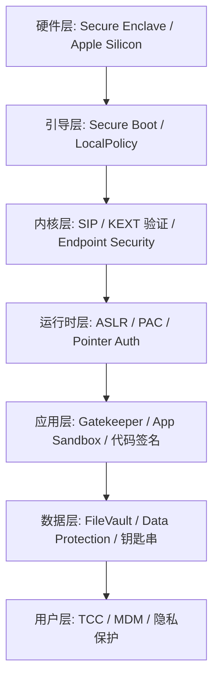
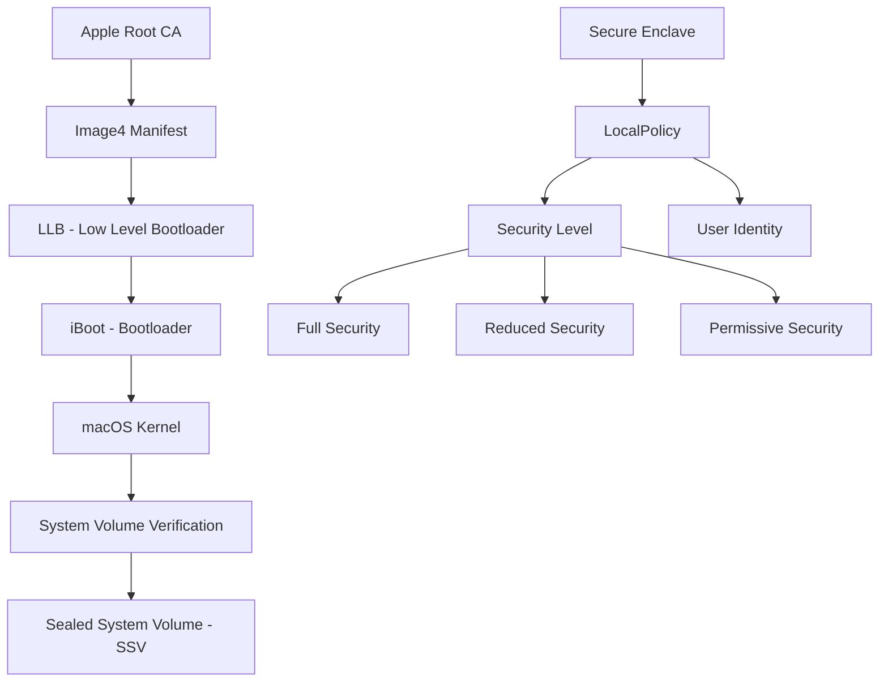

## 二、macOS安全核心技巧

macOS 以 Unix 为根基，叠加了 Apple 自研的多层安全架构——从硬件级 Secure Enclave 到内核级 SIP，再到用户态的 Gatekeeper 与 TCC，形成了业界最严密的桌面操作系统防护体系。本章从安全架构原理出发，逐层拆解每一层的运作机制、攻防博弈和实操技巧，帮助读者建立完整的 macOS 安全知识图谱。

### 2.1 macOS 安全架构全景

#### 2.1.1 纵深防御模型

macOS 的安全设计遵循纵深防御（Defense in Depth）原则，共包含 **7 个核心防护层**：



| 防护层 | 核心机制 | 防御目标 |
|--------|----------|----------|
| 硬件层 | Secure Enclave (T2/M系芯片) | 密钥存储、生物识别、安全启动根信任 |
| 引导层 | Secure Boot / LocalPolicy | 防止未签名 OS 加载 |
| 内核层 | SIP / Kernel Integrity | 防止内核和系统文件被篡改 |
| 运行时层 | ASLR / PAC / W^X | 防止内存破坏利用 |
| 应用层 | Gatekeeper / Sandbox | 防止恶意软件执行 |
| 数据层 | FileVault / Keychain | 保护静态数据 |
| 用户层 | TCC / MDM | 控制应用权限访问 |

#### 2.1.2 macOS 安全演进历程

| 版本 | 年份 | 关键安全特性 |
|------|------|-------------|
| 10.8 Mountain Lion | 2012 | Gatekeeper 引入，限制未签名应用 |
| 10.10 Yosemite | 2014 | 系统完整性保护 (SIP) 引入 |
| 10.12 Sierra | 2016 | 首次引入 TCC 隐私数据库 |
| 10.14 Mojave | 2018 | TCC 扩展到文件系统访问控制 |
| 10.15 Catalina | 2019 | 只读系统卷 (Sealed System Volume)，Endpoint Security Framework |
| 11 Big Sur | 2020 | Apple Silicon 支持，Signed System Volume (SSV)，KEXT → 系统扩展迁移 |
| 12 Monterey | 2021 | 扩展防护 (Extended Attributes)，Lockdown Mode 前身 |
| 13 Ventura | 2022 | Lockdown Mode，Passkeys 支持 |
| 14 Sonoma | 2023 | 增强的隐私保护，浏览器安全加固 |
| 15 Sequoia | 2024 | 本地网络权限细化，Apple Intelligence 安全框架 |

理解版本演进至关重要——许多攻防技巧的有效性直接取决于目标系统版本。例如 SIP 的部分禁用（`csrutil enable --without fs`）在 Big Sur 之后已不可用，因为系统卷变成了签名验证的 APFS 快照。

### 2.2 终端安全命令与系统侦察

#### 2.2.1 系统信息收集

安全评估的第一步是全面了解目标环境。macOS 提供了丰富的命令行工具用于系统侦察。

**系统基本信息**：

```bash
# 操作系统版本（精确到 build 号）
sw_vers
# 输出示例:
# ProductName:        macOS
# ProductVersion:     14.5
# BuildVersion:       23F79

# 完整软件信息（包含内核版本、启动模式等）
system_profiler SPSoftwareDataType

# 硬件信息（型号、序列号、芯片类型）
system_profiler SPHardwareDataType

# 判断是否为 Apple Silicon
sysctl -n machdep.cpu.brand_string
# Apple Silicon 输出 "Apple M1/M2/M3..."，Intel 输出具体型号
uname -m
# arm64 = Apple Silicon，x86_64 = Intel
```

**网络信息收集**：

```bash
# 网络接口配置
ifconfig
# 简化查看活跃接口
ifconfig | grep -E "^[a-z]|inet "

# 网络连接状态
netstat -an
# 仅查看 ESTABLISHED 连接
netstat -an | grep ESTABLISHED

# 列出所有网络硬件端口
networksetup -listallhardwareports

# 查看 Wi-Fi 信息（SSID、BSSID、信号强度等）
/System/Library/PrivateFrameworks/Apple80211.framework/Versions/Current/Resources/airport -I

# DNS 配置
scutil --dns

# 路由表
netstat -rn
```

**用户与权限信息**：

```bash
# 列出所有本地用户
dscl . list /Users | grep -v "^_"

# 当前用户信息
id
whoami

# 查看当前用户所属的所有组
id -Gn

# 查看管理员组成员
dscl . read /Groups/admin GroupMembership

# 查看 sudo 权限配置
sudo cat /etc/sudoers 2>/dev/null || sudo visudo -c
```

#### 2.2.2 安全状态快速评估

在进行任何安全操作前，先评估系统当前的防护状态：

```bash
#!/bin/bash
# macOS 安全状态一键检查脚本

echo "=== macOS 安全状态评估 ==="
echo ""

# 1. SIP（系统完整性保护）
echo "[1] SIP 状态:"
csrutil status

# 2. Gatekeeper
echo "[2] Gatekeeper:"
spctl --status 2>&1

# 3. FileVault（全盘加密）
echo "[3] FileVault:"
fdesetup status

# 4. 防火墙
echo "[4] 应用防火墙:"
sudo /usr/libexec/ApplicationFirewall/socketfilterfw --getglobalstate 2>&1

# 5. 隐蔽模式
echo "[5] 隐蔽模式:"
sudo /usr/libexec/ApplicationFirewall/socketfilterfw --getstealthmode 2>&1

# 6. 自动登录
echo "[6] 自动登录:"
defaults read /Library/Preferences/com.apple.loginwindow autoLoginUser 2>&1 || echo "已禁用"

# 7. 远程登录（SSH）
echo "[7] 远程登录:"
sudo systemsetup -getremotelogin 2>&1

# 8. 屏幕共享
echo "[8] 屏幕共享:"
launchctl list | grep -i screensharing 2>&1 || echo "未运行"

# 9. XProtect 版本
echo "[9] XProtect:"
system_profiler SPInstallHistoryDataType 2>/dev/null | grep -A2 "XProtect" | tail -2

# 10. 系统完整性
echo "[10] 系统卷签名验证:"
csrutil authenticated-root status 2>&1 || echo "不支持（非 Big Sur+）"
```

将此脚本保存为 `macos_security_audit.sh`，每次安全评估时运行，可以快速建立目标系统的安全基线。

#### 2.2.3 进程和服务管理

macOS 使用 `launchd` 作为 PID 1 进程和统一的服务管理框架，取代了传统的 init/VSystem/xinetd。

**进程查看与分析**：

```bash
# 查看所有进程（BSD 风格）
ps aux

# 查看所有进程（System V 风格，显示父进程关系）
ps -ef

# 实时进程监控（单次快照）
top -l 1 -n 20  # 显示前 20 个进程

# 按 CPU 排序
top -o cpu -n 10

# 按内存排序
top -o mem -n 10

# 查找特定进程
pgrep -f "process_name"
ps aux | grep -i "process_name"

# 查看进程的完整命令行
ps -p PID -o command=

# 查看进程的打开文件
lsof -p PID

# 查看进程的网络连接
lsof -p PID -i

# 查看进程的动态库加载
otool -L $(which process_name)
```

**launchd 服务管理**：

launchd 是 macOS 的核心服务管理器，它统一管理了系统守护进程（daemon）和用户代理（agent）。理解其运作机制是 macOS 安全管理的基础。

```bash
# launchd 配置文件的两个核心目录:
# /Library/LaunchDaemons/    — 系统级守护进程（root 权限，开机自启）
# /Library/LaunchAgents/     — 用户级代理（登录时启动，用户权限）
# ~/Library/LaunchAgents/    — 当前用户的代理

# 查看所有已加载的服务
sudo launchctl list          # 系统级
launchctl list               # 当前用户级

# 查看特定服务的详细信息
launchctl list | grep "com.apple"

# 查找可疑的第三方 LaunchDaemon
ls -la /Library/LaunchDaemons/ | grep -v "com.apple"
ls -la /Library/LaunchAgents/ | grep -v "com.apple"

# 查看服务的 plist 内容
plutil -p /Library/LaunchDaemons/com.example.service.plist

# 加载服务（旧语法，已弃用但仍然可用）
sudo launchctl load /Library/LaunchDaemons/com.example.service.plist

# 卸载服务
sudo launchctl unload /Library/LaunchDaemons/com.example.service.plist

# 新语法（macOS 10.10+）
sudo launchctl bootstrap system /Library/LaunchDaemons/com.example.service.plist
sudo launchctl bootout system /Library/LaunchDaemons/com.example.service.plist
```

**关键提示**：恶意软件经常利用 LaunchDaemons 和 LaunchAgents 实现持久化。在安全评估中，重点检查这两个目录下非 Apple 签名的 plist 文件是发现后门的关键手段。

```bash
# 快速找出所有非 Apple 的 LaunchDaemon/Agent
find /Library/LaunchDaemons /Library/LaunchAgents ~/Library/LaunchAgents \
  -name "*.plist" -exec sh -c '
    sig=$(codesign -dv "{}" 2>&1 | grep "Authority")
    if ! echo "$sig" | grep -q "Apple"; then
      echo "⚠️  非 Apple 签名: {}"
      echo "   签名: $sig"
    fi
  ' \;
```

#### 2.2.4 文件系统操作与取证搜索

macOS 的文件系统搜索工具各有特点，在安全取证中需要灵活组合使用。

**find 命令——精确匹配**：

```bash
# 搜索最近 7 天修改的 plist 文件
find /Users -name "*.plist" -mtime -7 2>/dev/null

# 搜索 SUID/SGID 文件（提权检查）
find / -perm -4000 -type f 2>/dev/null
find / -perm -2000 -type f 2>/dev/null

# 搜索 world-writable 文件
find / -perm -002 -type f 2>/dev/null

# 搜索隐藏文件（恶意软件常用隐藏技术）
find /Users -name ".*" -not -name ".DS_Store" -type f 2>/dev/null

# 搜索特定大小范围的可执行文件（可能的恶意载荷）
find / -type f -perm +111 -size +100k -size -10M 2>/dev/null
```

**mdfind——Spotlight 全文索引搜索**：

mdfind 利用 macOS 的 Spotlight 索引，搜索速度远超 find，特别适合大范围内容搜索：

```bash
# 搜索包含 "password" 的文件内容
mdfind "kMDItemTextContent == 'password'"

# 搜索所有钥匙串文件
mdfind -name "*.keychain"

# 搜索最近 24 小时内创建的可执行文件
mdfind "kMDItemContentType == 'public.executable' && kMDItemDateAdded > \$time.today(-1)"

# 搜索特定应用的所有相关文件
mdfind "kMDItemCFBundleIdentifier == 'com.apple.Safari'"

# 搜索加密的 PDF 文件
mdfind "kMDItemContentType == 'com.adobe.pdf' && kMDItemEncryption == 1"

# 限制搜索范围到特定目录
mdfind -onlyin /Users/username "kMDItemTextContent == 'private_key'"
```

**locate——数据库快速查找**：

```bash
# 首次使用需要生成数据库
sudo launchctl load -w /System/Library/LaunchDaemons/com.apple.locate.plist
# 或手动更新
sudo /usr/libexec/locate.updatedb

# 使用 locate 快速查找
locate "*.conf"
locate "keychain"
```

**文件权限与 ACL**：

macOS 在传统 Unix 权限之上，支持更精细的 ACL（访问控制列表）：

```bash
# 查看文件权限（含 ACL）
ls -le
# 输出示例:
# -rw-r--r--+ 1 user  staff  1234 Jun 25 10:00 file.txt
#  0: user:otheruser allow read,write
# 注意末尾的 "+" 表示存在 ACL

# 修改传统权限
chmod 755 file
chmod +x script.sh

# 添加 ACL 规则
chmod +a "user:username allow read,write" file
chmod +a "group:staff deny delete" file

# 删除 ACL 规则
chmod -a "user:username allow read,write" file

# 清除所有 ACL
chmod -N file

# 使用 ACL 实现精细的目录访问控制
# 允许 user1 完全控制，user2 只读，其他用户无权限
chmod +a "user:user1 allow list,add_file,search,add_subdirectory,delete_child,readattr,writeattr,readextattr,writeextattr,readsecurity,writesecurity,chown,file_inherit,directory_inherit" /secure_dir
chmod +a "user:user2 allow list,search,readattr,readextattr,readsecurity,file_inherit,directory_inherit" /secure_dir
chmod +a "everyone deny list,search" /secure_dir
```

### 2.3 系统完整性保护 (SIP)

#### 2.3.1 SIP 架构原理

SIP（System Integrity Protection，又称 Rootless）是 macOS 10.11 El Capitan 引入的核心安全机制，其设计目标是**即使 root 用户也无法修改受保护的系统文件**。这是安全领域的重大范式转变——将安全信任根从用户态提升到了内核态。

SIP 的保护范围包括：

| 保护对象 | 路径 | 说明 |
|----------|------|------|
| 系统目录 | `/System`, `/usr`, `/bin`, `/sbin` | 系统二进制文件和库 |
| 预装应用 | `/Applications` (Apple 预装部分) | Safari、Mail 等系统应用 |
| 内核扩展 | 受限区域的 kext | 防止未签名内核扩展加载 |
| NVRAM | 部分 NVRAM 变量 | 防止启动参数被恶意篡改 |
| 进程注入 | 动态库注入 | 阻止 DYLD_INSERT_LIBRARIES 等注入手段 |

SIP 的实现依赖 Apple 的 LocalPolicy 签名机制：在 Apple Silicon Mac 上，系统卷的哈希值存储在 Secure Enclave 的 LocalPolicy 中，启动时由 iBoot 验证。这意味着即使物理接触设备，也无法在不通过 Apple 服务器认证的情况下修改系统卷。

#### 2.3.2 SIP 管理实操

**查看 SIP 状态**：

```bash
csrutil status
# 输出示例:
# System Integrity Protection status: enabled.
#
# Configuration:
#   Apple Internal: enabled
#   Kext Signing: enabled
#   Filesystem Protections: enabled
#   Debugging Restrictions: enabled
#   DTrace Restrictions: enabled
#   NVRAM Protections: enabled
#   BaseSystem Verification: enabled
#   Boot-arg Restrictions: enabled
#   Kernel Integrity Protections: enabled
#   Authenticated Root Requirement: enabled
```

每个子项代表 SIP 的一个保护维度：
- **Apple Internal**：Apple 内部调试功能
- **Kext Signing**：内核扩展签名验证
- **Filesystem Protections**：文件系统写保护
- **Debugging Restrictions**：调试权限限制
- **DTrace Restrictions**：DTrace 追踪限制
- **NVRAM Protections**：NVRAM 写保护
- **Boot-arg Restrictions**：启动参数限制
- **Authenticated Root Requirement**：系统卷签名验证（Big Sur+）

**禁用/启用 SIP**：

```bash
# ⚠️ 警告：禁用 SIP 会显著降低系统安全性
# 仅在以下场景合理使用：
# - 安全研究和渗透测试
# - 安装需要修改系统区域的合法软件
# - 故障排除

# 操作步骤（所有 Mac 均适用）：
# 1. 关机
# 2. 进入恢复模式：
#    - Intel Mac: 开机时按住 Command+R
#    - Apple Silicon: 长按电源键 → 选项 → 恢复
# 3. 在恢复模式中打开终端（菜单栏 → 实用工具 → 终端）
# 4. 执行命令

# 完全禁用
csrutil disable

# 部分禁用（仅禁用特定子系统，macOS 10.11-10.15 支持）
csrutil enable --without fs          # 仅禁用文件系统保护
csrutil enable --without debug       # 仅禁用调试限制
csrutil enable --without dtrace      # 仅禁用 DTrace 限制
csrutil enable --without nvram       # 仅禁用 NVRAM 保护

# 重新启用
csrutil enable

# 验证状态
csrutil status
```

**重要注意事项**：
- 在 macOS Big Sur 及以上版本中，`--without` 选项已不可用，只能完全禁用或完全启用
- 禁用 SIP 后，系统卷从只读变为可挂载（`mount -uw /` 在旧版本中有效）
- Apple Silicon Mac 禁用 SIP 需要降低安全策略（Reduced Security），这会通过 Apple 服务器记录
- 某些企业 MDM 策略可以阻止 SIP 禁用

### 2.4 Gatekeeper 与代码签名

#### 2.4.1 代码签名机制

macOS 的代码签名（Code Signing）是 Gatekeeper 的基础。每个 macOS 应用都可以包含由 Apple 或开发者证书签发的数字签名，系统通过验证签名来确认应用的来源和完整性。

代码签名的核心组件：

```bash
# 查看应用的签名信息
codesign -dv --verbose=4 /Applications/Safari.app

# 输出包含：
# Authority=Apple Root CA           — 签名根证书
# Authority=Apple Worldwide...      — 中间证书
# Authority=Apple OS X...           — 叶子证书
# TeamIdentifier=APPLE...           — 开发者团队 ID
# Identifier=com.apple.Safari       — 应用标识符
# Seal (Code Directory)             — 代码目录哈希
# CMS (RFC3814)                     — CMS 签名数据

# 验证签名完整性
codesign --verify --verbose /Applications/Safari.app
# 正常输出: valid on disk
# 异常输出: a sealed resource is missing or invalid

# 深度验证（递归验证所有内嵌的代码）
codesign --verify --deep --strict --verbose /Applications/MyApp.app
```

签名验证的层级：

| 验证级别 | 说明 | 命令 |
|----------|------|------|
| 基本验证 | 检查签名是否存在且有效 | `codesign --verify app` |
| 深度验证 | 递归验证所有内嵌代码 | `codesign --verify --deep app` |
| 严格验证 | 检查所有资源文件完整性 | `codesign --verify --strict app` |
| 团队验证 | 验证是否属于特定开发团队 | `codesign -v --teamid TEAMID app` |

#### 2.4.2 Gatekeeper 工作机制

Gatekeeper 是 macOS 的应用执行门控机制，基于代码签名决定是否允许应用运行。

Gatekeeper 的检查流程：

```mermaid
flowchart TD
    A[用户打开应用] --> B{是否 Apple 签名?}
    B -->|是| C[允许执行]
    B -->|否| D{是否 App Store 应用?}
    D -->|是| C
    D -->|否| E{是否公证 (Notarized)?}
    E -->|是| C
    E -->|否| F{Gatekeeper 策略?}
    F -->|App Store + 认证开发者| G[弹窗警告: 未验证开发者]
    F -->|App Store 仅| H[阻止执行]
    F -->|任何来源| I[允许执行]
    G --> J{用户是否点击打开?}
    J -->|是| C
    J -->|否| K[阻止执行]
```

**Gatekeeper 管理命令**：

```bash
# 查看 Gatekeeper 状态
spctl --status
# assessments enabled = 开启
# assessments disabled = 关闭

# 启用 Gatekeeper
sudo spctl --master-enable

# 禁用 Gatekeeper（不推荐，但渗透测试中常用）
sudo spctl --master-disable

# 对特定应用添加白名单（绕过 Gatekeeper 警告）
spctl --add --label "Approved" /Applications/MyApp.app

# 移除白名单
spctl --remove --label "Approved" /Applications/MyApp.app

# 评估特定应用的 Gatekeeper 状态
spctl --assess --verbose /Applications/MyApp.app
# 输出: accepted / rejected / unknown

# 查看应用的评估规则
spctl --list --label "Approved"
```

**应用公证（Notarization）**：macOS 10.15 Catalina 起，所有非 App Store 应用必须经过 Apple 公证才能通过 Gatekeeper。公证流程是开发者将应用上传到 Apple 服务器进行恶意软件扫描，通过后获得公证票据（stapled ticket）。

```bash
# 验证应用是否已公证
spctl --assess --type execute --verbose --context context:primary-signature /Applications/MyApp.app

# 查看公证票据
stapler validate /Applications/MyApp.app
```

### 2.5 macOS 防火墙配置

macOS 提供两套防火墙系统：应用防火墙（Application Firewall）和包过滤防火墙（pf）。两者定位不同，通常需要配合使用。

#### 2.5.1 应用防火墙

应用防火墙工作在应用层，按进程粒度控制入站连接，配置简单但功能有限：

```bash
# === 基本管理 ===

# 查看防火墙状态
sudo /usr/libexec/ApplicationFirewall/socketfilterfw --getglobalstate

# 启用防火墙
sudo /usr/libexec/ApplicationFirewall/socketfilterfw --setglobalstate on

# 禁用防火墙
sudo /usr/libexec/ApplicationFirewall/socketfilterfw --setglobalstate off

# === 高级设置 ===

# 启用隐蔽模式（不响应 ping 和端口扫描）
sudo /usr/libexec/ApplicationFirewall/socketfilterfw --setstealthmode on

# 启用日志记录
sudo /usr/libexec/ApplicationFirewall/socketfilterfw --setloggingmode on

# 允许已签名的已下载软件自动接收传入连接
sudo /usr/libexec/ApplicationFirewall/socketfilterfw --setallowsigned on

# 允许已签名的应用自动接收传入连接
sudo /usr/libexec/ApplicationFirewall/socketfilterfw --setallowsignedapp on

# 阻止所有传入连接（最严格模式，但会破坏部分功能）
sudo /usr/libexec/ApplicationFirewall/socketfilterfw --setblockall on

# === 应用规则管理 ===

# 列出所有已配置规则的应用
sudo /usr/libexec/ApplicationFirewall/socketfilterfw --listapps

# 添加应用并阻止其入站连接
sudo /usr/libexec/ApplicationFirewall/socketfilterfw --add /Applications/MyApp.app
sudo /usr/libexec/ApplicationFirewall/socketfilterfw --block /Applications/MyApp.app

# 允许应用入站连接
sudo /usr/libexec/ApplicationFirewall/socketfilterfw --unblock /Applications/MyApp.app

# 删除应用规则
sudo /usr/libexec/ApplicationFirewall/socketfilterfw --remove /Applications/MyApp.app
```

#### 2.5.2 pf 包过滤防火墙

pf（Packet Filter）是 BSD 系统的内核级包过滤防火墙，功能强大，支持基于 IP、端口、协议的细粒度控制：

```bash
# === 基本管理 ===

# 查看 pf 状态
sudo pfctl -s info

# 启用 pf
sudo pfctl -e

# 禁用 pf
sudo pfctl -d

# 加载规则文件
sudo pfctl -f /etc/pf.conf

# 查看当前规则
sudo pfctl -s rules

# === 编写 pf 规则 ===

# 创建自定义规则文件 /etc/pf.anchors/custom
cat > /tmp/pf_custom.conf << 'EOF'
# 阻止所有入站，仅允许特定端口
block in all
pass out all keep state

# 允许 SSH
pass in proto tcp from any to any port 22

# 允许 HTTP/HTTPS
pass in proto tcp from any to any port { 80, 443 }

# 允许来自特定 IP 的所有流量
pass in from 192.168.1.0/24 to any

# 阻止特定 IP
block in quick from 10.0.0.100

# 速率限制（防暴力破解）
pass in proto tcp from any to any port 22 max-src-conn-rate 3/60
EOF

# 测试规则语法
sudo pfctl -n -f /tmp/pf_custom.conf

# 应用规则
sudo pfctl -f /tmp/pf_custom.conf

# === 监控与日志 ===

# 查看 pf 统计信息
sudo pfctl -s info

# 查看状态表（当前连接跟踪）
sudo pfctl -ss

# 启用日志
sudo pfctl -e -f /etc/pf.conf
# 日志写入 pflog0 接口

# 实时查看 pf 日志
sudo tcpdump -i pflog0 -n -e -ttt
```

**pf 规则持久化**：pf 规则默认不持久化，重启后失效。要持久化，需要修改 `/etc/pf.conf` 或创建一个 LaunchDaemon：

```xml
<!-- /Library/LaunchDaemons/com.custom.pf.plist -->
<?xml version="1.0" encoding="UTF-8"?>
<!DOCTYPE plist PUBLIC "-//Apple//DTD PLIST 1.0//EN" "http://www.apple.com/DTDs/PropertyList-1.0.dtd">
<plist version="1.0">
<dict>
    <key>Label</key>
    <string>com.custom.pf</string>
    <key>ProgramArguments</key>
    <array>
        <string>/sbin/pfctl</string>
        <string>-f</string>
        <string>/etc/pf.custom.conf</string>
    </array>
    <key>RunAtLoad</key>
    <true/>
</dict>
</plist>
```

#### 2.5.3 防火墙策略建议

| 场景 | 推荐方案 | 说明 |
|------|----------|------|
| 个人用户 | 应用防火墙 + 隐蔽模式 | 简单有效，GUI 可管理 |
| 开发工作站 | 应用防火墙 + pf（开放开发端口） | 精确控制服务暴露 |
| 服务器 | pf 为主 + 应用防火墙辅助 | 需要细粒度网络策略 |
| 渗透测试 | 防火墙全部禁用 | 避免干扰测试流量 |

### 2.6 macOS 钥匙串安全

#### 2.6.1 钥匙串架构

钥匙串（Keychain）是 macOS 的统一凭据存储系统，类似于 Windows 的凭据管理器。它使用 AES-256-GCM 加密存储密码、证书、密钥和安全笔记。

钥匙串的类型和层级：

| 钥匙串类型 | 路径 | 用途 | 访问权限 |
|------------|------|------|----------|
| login.keychain-db | `~/Library/Keychains/` | 用户登录凭据、Wi-Fi 密码 | 当前用户 |
| System.keychain | `/Library/Keychains/` | 系统级凭据、网络凭据 | root / 系统 |
| iCloud.keychain-db | `~/Library/Keychains/` | iCloud 同步的钥匙串 | 当前用户 + iCloud |
| SystemRootCertificates.keychain | `/Library/Keychains/` | 根 CA 证书 | 只读 |
| SmartCard证书 | `/var/db/TokenCache/` | 智能卡认证 | 特定用户 |

```bash
# 列出所有钥匙串
security list-keychains

# 查看默认钥匙串
security default-keychain

# 创建新的钥匙串
security create-keychain -p "mypass" ~/Library/Keychains/my.keychain-db

# 设置钥匙串锁定时间
security set-keychain-settings -t 300 ~/Library/Keychains/login.keychain-db
# -t 300 = 5 分钟无活动后锁定
```

#### 2.6.2 钥匙串数据操作

**查询凭据**：

```bash
# 列出所有通用密码项
security dump-keychain -a ~/Library/Keychains/login.keychain-db

# 查找特定服务的密码（需要用户授权或在安全上下文中执行）
security find-generic-password -s "service_name" -w  # -w 仅输出密码
security find-generic-password -s "service_name" -g  # -g 显示所有属性

# 查找互联网密码
security find-internet-password -s "server.com" -w
security find-internet-password -s "server.com" -a "username" -g

# 查找证书
security find-certificate -a -p /Library/Keychains/System.keychain
security find-certificate -c "Certificate Name" -p

# 导出证书
security export -k ~/Library/Keychains/login.keychain-db -t certs -f pemseq -o exported_certs.pem
```

**证书管理**：

```bash
# 添加受信任的根证书
sudo security add-trusted-cert -d -r trustRoot \
  -k /Library/Keychains/System.keychain certificate.pem

# 添加证书到特定钥匙串
sudo security add-certificates -k /Library/Keychains/System.keychain certificate.pem

# 删除证书
sudo security delete-certificate -c "Certificate Name" /Library/Keychains/System.keychain

# 验证证书链
security verify-cert -c certificate.pem -r root_ca.pem
```

#### 2.6.3 钥匙串攻击技术

钥匙串攻击是 macOS 渗透测试中的关键技术，需要理解其保护机制和弱点。

**攻击面分析**：

钥匙串文件本身使用 AES-256-GCM 加密，密钥由用户登录密码派生。这意味着直接暴力破解钥匙串文件的难度极高。但存在以下攻击路径：

| 攻击方法 | 前提条件 | 难度 | 说明 |
|----------|----------|------|------|
| 用户密码登录提取 | 已知用户密码 | 低 | 登录后 `security` 命令直接读取 |
| 内存 dump | 有 root 权限 | 中 | 从运行进程内存中提取明文密码 |
| 钥匙串文件离线破解 | 拥有 keychain 文件 | 高 | 需要暴力破解主密码 |
| KeySteal 类攻击 | SIP 禁用或特定漏洞 | 中 | 利用钥匙串访问控制弱点 |
| 云同步攻击 | 获取 iCloud 凭据 | 中 | 通过 iCloud 钥匙串同步获取 |

**工具与方法**：

```bash
# 1. 使用 security 命令提取密码（需要用户授权或 root + SIP disabled）
security find-generic-password -s "Wi-Fi" -w

# 2. 使用 chainbreaker（Python 工具，离线破解钥匙串）
# 安装
pip3 install chainbreaker
# 使用（需要钥匙串文件和字典）
chainbreaker --keychain ~/Library/Keychains/login.keychain-db --dictionary passwords.txt

# 3. 使用 John the Ripper
# 提取哈希
python2 chainbreaker.py ~/Library/Keychains/login.keychain-db > keychain.hash
# 破解
john --wordlist=passwords.txt keychain.hash

# 4. 使用 hashcat（模式 23100 for keychain）
hashcat -m 23100 keychain.hash passwords.txt

# 5. 内存 dump 提取（需要 root）
# macOS 的 securityd 进程在内存中维护解密后的钥匙串数据
# 使用 lldb 附加到 securityd
sudo lldb -p $(pgrep securityd) -o "memory read --force --binary --outfile /tmp/memdump.bin 0x0 0xFFFFFFFFFFFFFFFF" -o "quit"

# 6. 使用 Keychain-Dumper（需要 SIP 禁用）
# 从 GitHub 下载并运行
chmod +x keychain_dumper
./keychain_dumper -a  # 列出所有项
```

### 2.7 TCC 隐私保护机制

#### 2.7.1 TCC 架构原理

TCC（Transparency, Consent, and Control）是 macOS 的隐私保护框架，控制应用对摄像头、麦克风、位置、文件系统等敏感资源的访问权限。从 macOS 10.14 Mojave 开始，TCC 的保护范围大幅扩展。

TCC 管理的权限类型：

| 权限类别 | 受保护资源 | 数据库字段 |
|----------|------------|------------|
| kTCCServiceCamera | 摄像头 | kTCCServiceCamera |
| kTCCServiceMicrophone | 麦克风 | kTCCServiceMicrophone |
| kTCCServiceScreenCapture | 屏幕录制 | kTCCServiceScreenCapture |
| kTCCServiceLocation | 位置服务 | kTCCServiceLocation |
| kTCCServiceAddressBook | 通讯录 | kTCCServiceAddressBook |
| kTCCServiceCalendar | 日历 | kTCCServiceCalendar |
| kTCCServiceReminders | 提醒事项 | kTCCServiceReminders |
| kTCCServicePhotos | 照片 | kTCCServicePhotos |
| kTCCServiceAccessibility | 辅助功能（键盘/鼠标控制） | kTCCServiceAccessibility |
| kTCCServicePostEvent | 发送键盘/鼠标事件 | kTCCServicePostEvent |
| kTCCServiceSystemPolicyAllFiles | 完全磁盘访问 | kTCCServiceSystemPolicyAllFiles |
| kTCCServiceSystemPolicyDocumentsFolder | 文稿文件夹 | kTCCServiceSystemPolicyDocumentsFolder |
| kTCCServiceSystemPolicyDesktopFolder | 桌面文件夹 | kTCCServiceSystemPolicyDesktopFolder |
| kTCCServiceSystemPolicyDownloadsFolder | 下载文件夹 | kTCCServiceSystemPolicyDownloadsFolder |
| kTCCServiceAppleEvents | AppleEvents/AppleScript | kTCCServiceAppleEvents |
| kTCCServiceBluetoothAlways | 蓝牙 | kTCCServiceBluetoothAlways |
| kTCCServiceLiverpool | 位置服务 (系统) | kTCCServiceLiverpool |

#### 2.7.2 TCC 数据库操作

TCC 数据库是 SQLite 格式，分为用户级和系统级两个：

```bash
# 用户 TCC 数据库（存储用户对应用的授权）
sqlite3 ~/Library/Application\ Support/com.apple.TCC/TCC.db

# 系统 TCC 数据库（存储 MDM 和系统级授权）
# ⚠️ 需要 SIP 禁用或 root 权限
sudo sqlite3 /Library/Application\ Support/com.apple.TCC/TCC.db
```

**查询 TCC 权限**：

```sql
-- 查看所有已授权的权限
SELECT client, service, auth_value, auth_reason, auth_version
FROM access
ORDER BY client;

-- auth_value 含义:
-- 0 = denied
-- 1 = unknown (未决定)
-- 2 = allowed
-- 3 = limited (部分允许)

-- 查看特定应用的所有权限
SELECT client, service, auth_value
FROM access
WHERE client LIKE '%Safari%';

-- 查看具有完全磁盘访问权限的应用
SELECT client, auth_value
FROM access
WHERE service = 'kTCCServiceSystemPolicyAllFiles';

-- 查看所有被拒绝的权限
SELECT client, service
FROM access
WHERE auth_value = 0;
```

**TCC 权限管理**：

```bash
# 重置特定应用的所有 TCC 权限
tccutil reset All com.example.app

# 重置特定类型的权限（对所有应用）
tccutil reset Camera        # 重置摄像头权限
tccutil reset Microphone    # 重置麦克风权限
tccutil reset ScreenCapture # 重置屏幕录制权限
tccutil reset Accessibility # 重置辅助功能权限

# 重置所有权限（所有应用、所有类型）
tccutil reset All

# 通过 MDM 预授权（企业部署）
# 使用 profiles 命令安装包含 TCC 预授权的配置描述文件
sudo profiles install -path /path/to/tcc_profile.mobileconfig
```

#### 2.7.3 TCC 绕过技术

TCC 绕过是 macOS 安全研究的热点领域，历史上多次出现影响重大的绕过漏洞：

**已知绕过方法类别**：

1. **目录符号链接攻击**：利用受信任应用可以访问特定目录的特性，通过符号链接将敏感文件链接到该目录。Apple 通过 RealPath 验证缓解了部分此类攻击。

2. **进程注入绕过**：将代码注入到已有 TCC 权限的进程中，继承其权限。SIP 可以阻止大部分注入手段。

3. **环境变量滥用**：通过 `TMPDIR` 等环境变量影响路径解析。macOS 已加固此路径。

4. **AppleEvents 滥用**：通过 AppleScript/AppleEvents 控制已有权限的应用执行操作。

5. **Binary 代理绕过**：利用受信任二进制文件（如 `sshd`、`tmux`）作为代理执行敏感操作。

```bash
# 示例：通过 AppleEvents 绕过 TCC 的思路（仅作安全研究参考）
# 如果应用 A 有摄像头权限，攻击者可以通过 AppleEvents 要求 A 调用摄像头
# Apple 在 macOS Monterey+ 中加强了 AppleEvents 的 TCC 检查

# 监控 TCC 相关的系统日志
log show --predicate 'subsystem == "com.apple.TCC"' --info --last 1h

# 监控隐私相关的拒绝事件
log show --predicate 'eventMessage contains "TCC" && eventMessage contains "deny"' --last 1h
```

### 2.8 网络监控与流量分析

#### 2.8.1 网络连接监控

网络连接监控是安全分析的核心技能，macOS 提供了多个层次的监控工具：

**连接状态查看**：

```bash
# 活动网络连接
netstat -an
# 仅 TCP 连接
netstat -an -p tcp
# 仅 UDP
netstat -an -p udp
# 显示进程名和 PID
sudo lsof -i -P

# 特定端口的连接
lsof -i :80
lsof -i :443
lsof -i :22

# 特定进程的网络连接
lsof -p PID -i

# 显示路由表
netstat -rn

# 实时网络连接监控（类似 Linux 的 watch）
nettop -m tcp  # TCP 模式
nettop -p PID  # 特定进程
nettop -s 1    # 每秒刷新
```

**网络流量捕获**：

```bash
# 使用 tcpdump 抓包
# 捕获特定接口的所有流量
sudo tcpdump -i en0 -w /tmp/capture.pcap

# 捕获特定端口
sudo tcpdump -i en0 port 80

# 捕获特定主机
sudo tcpdump -i en0 host 192.168.1.100

# 捕获 DNS 查询
sudo tcpdump -i en0 port 53

# 使用表达式过滤
sudo tcpdump -i en0 "tcp port 443 and host 192.168.1.100"

# 限制捕获大小
sudo tcpdump -i en0 -c 1000 -w /tmp/capture.pcap
# -c 1000 = 最多 1000 个包
```

**高级网络分析工具**：

```bash
# 使用 NetworkQuality 测试网络质量（macOS 12+）
networkQuality -v  # 详细输出

# 使用 nettop 监控每个进程的带宽使用
nettop -m tcp -d -L 100  # 显示 100 行，按数据量排序

# 使用 route 监控路由变化
sudo route -n monitor
```

#### 2.8.2 DNS 安全

DNS 是网络安全中最容易被忽视但攻击面最大的协议之一。macOS 使用 `mDNSResponder` 作为系统 DNS 解析器：

```bash
# === DNS 缓存管理 ===

# 查看 DNS 缓存统计
sudo killall -INFO mDNSResponder
# 输出写入系统日志
log show --predicate 'process == "mDNSResponder"' --last 1m | grep "Cache"

# 清除 DNS 缓存（DNS 投毒后恢复的常用操作）
sudo killall -HUP mDNSResponder
# macOS 12+ 使用新语法
sudo dscacheutil -flushcache
sudo killall -HUP mDNSResponder

# === DNS 配置查看 ===

# 查看完整 DNS 配置
scutil --dns

# 查看特定接口的 DNS 设置
networksetup -getdnsservers "Wi-Fi"

# 设置 DNS 服务器
sudo networksetup -setdnsservers "Wi-Fi" 1.1.1.1 8.8.8.8
# 还原为 DHCP 获取的 DNS
sudo networksetup -setdnsservers "Wi-Fi" "Empty"

# === DNS 安全验证 ===

# 使用 dig 验证 DNSSEC
dig +dnssec example.com

# 使用 dig 追踪完整解析链
dig +trace example.com

# 检测 DNS 劫持（比较不同 DNS 服务器的返回结果）
dig @1.1.1.1 example.com A
dig @8.8.8.8 example.com A
dig @114.114.114.114 example.com A

# 使用 DoH (DNS over HTTPS)
# macOS 原生不支持 DoH，但可以通过配置描述文件实现
# 或者使用第三方工具如 dnscrypt-proxy
```

#### 2.8.3 网络取证

网络取证的目标是在不修改目标系统的情况下，记录和分析网络活动：

```bash
# 持续记录 DNS 查询（用于发现 C2 通信和数据外泄）
sudo tcpdump -i any port 53 -n -l | tee /tmp/dns_log.txt

# 分析 HTTP 明文流量
sudo tcpdump -i en0 -A port 80 | grep -E "^(GET|POST|Host:|Cookie:)"

# 监控新建立的连接（配合 watch 命令）
watch -n 1 'lsof -i -P -n | grep ESTABLISHED'

# 检测 ARP 欺骗
arp -a
# 比较网关的 MAC 地址是否一致
arp -n | grep gateway

# 检测 DNS 劫持的脚本
#!/bin/bash
KNOWN_DNS="192.168.1.1"  # 已知的合法 DNS
ACTUAL_DNS=$(scutil --dns | grep "nameserver\[0\]" | awk '{print $3}')
if [ "$KNOWN_DNS" != "$ACTUAL_DNS" ]; then
    echo "⚠️  DNS 配置异常: 预期 $KNOWN_DNS, 实际 $ACTUAL_DNS"
fi
```

### 2.9 Apple Silicon 安全特性

Apple Silicon (M1/M2/M3/M4 系列) 引入了多项硬件级安全增强，与 Intel Mac 的安全模型有本质区别。

#### 2.9.1 Secure Enclave

Secure Enclave 是 Apple Silicon 中的独立安全子系统，拥有自己的启动 ROM、内存和加密引擎，与主处理器硬件隔离。

Secure Enclave 管理的敏感数据：
- Touch ID / Face ID 生物识别数据
- FileVault 全盘加密密钥
- 钥匙串中的加密密钥
- Apple Pay 支付凭据
- 设备唯一密钥 (UID)

```bash
# 查看 Secure Enclave 信息
system_profiler SPiBridgeDataType 2>/dev/null || echo "无 Touch Bar/iBridge 信息"

# 查看 Secure Enclave 支持的密钥类型
security list-smartcards
```

#### 2.9.2 Secure Boot 与 LocalPolicy

Apple Silicon Mac 使用 LocalPolicy 机制实现安全启动链：



安全级别说明：
- **Full Security**：默认级别，每次启动验证 Apple 签名，防止回滚攻击
- **Reduced Security**：允许运行非最新版本的 macOS，禁用 SIP 的前提
- **Permissive Security**：允许运行未签名的内核扩展，最不安全

```bash
# 查看当前安全启动策略（需要在恢复模式中执行）
# Apple Silicon: 长按电源键 → 选项 → 启动安全工具

# 检查系统卷是否完整
csrutil authenticated-root status

# 验证系统卷的签名
diskutil apfs list | grep "Sealed"
# Sealed: Yes 表示系统卷完整
```

#### 2.9.3 Pointer Authentication (PAC)

Apple Silicon 引入了 Pointer Authentication Code (PAC)，通过在指针中嵌入加密签名来防止 ROP/JOP 攻击：

```bash
# 检查二进制文件是否启用 PAC
otool -arch arm64e -l /usr/bin/ssh | grep -A4 "LC_BUILD_VERSION"

# arm64e 架构支持 PAC
# arm64 架构不支持 PAC
```

PAC 的保护效果：
- 函数返回地址被 PAC 签名，篡改会导致崩溃
- 间接调用目标被 PAC 保护
- 类型信息通过 ISA 指针中的 PAC 保护
- 显著增加了利用内存破坏漏洞的难度

### 2.10 macOS 安全加固最佳实践

#### 2.10.1 系统级加固

```bash
# 1. 确保 SIP 启用
csrutil status  # 应显示 enabled

# 2. 启用 FileVault 全盘加密
sudo fdesetup enable
fdesetup status  # 验证

# 3. 启用防火墙 + 隐蔽模式
sudo /usr/libexec/ApplicationFirewall/socketfilterfw --setglobalstate on
sudo /usr/libexec/ApplicationFirewall/socketfilterfw --setstealthmode on
sudo /usr/libexec/ApplicationFirewall/socketfilterfw --setblockall off

# 4. 禁用不必要的服务
# 禁用远程登录 (SSH)
sudo systemsetup -setremotelogin off
# 禁用远程 Apple Events
sudo systemsetup -setremoteappleevents off
# 禁用文件共享
sudo launchctl unload -w /System/Library/LaunchDaemons/com.apple.smbd.plist 2>/dev/null

# 5. 禁用自动登录
sudo defaults delete /Library/Preferences/com.apple.loginwindow autoLoginUser 2>/dev/null

# 6. 启用屏幕锁定后的立即密码要求
defaults write com.apple.screensaver askForPassword -int 1
defaults write com.apple.screensaver askForPasswordDelay -int 0

# 7. 检查并移除不需要的 LaunchDaemon/Agent
# 重点检查非 Apple 签名的服务
```

#### 2.10.2 应用级加固

```bash
# 1. 确保 Gatekeeper 启用
spctl --status  # 应显示 assessments enabled

# 2. 限制 TCC 权限
# 审查并撤销不必要的权限
# 系统偏好设置 → 隐私与安全性 → 逐项检查

# 3. 限制 App Store 应用来源
# 系统偏好设置 → 隐私与安全性 → 允许从以下位置下载的应用
# 选择 "App Store"（最严格）或 "App Store 和被认可的开发者"

# 4. 定期审查应用权限
# 列出所有有完全磁盘访问权限的应用
sqlite3 ~/Library/Application\ Support/com.apple.TCC/TCC.db \
  "SELECT client FROM access WHERE service='kTCCServiceSystemPolicyAllFiles' AND auth_value=2;"
```

#### 2.10.3 网络级加固

```bash
# 1. 使用加密 DNS
sudo networksetup -setdnsservers "Wi-Fi" 1.1.1.1 8.8.8.8

# 2. 配置 pf 防火墙规则
# 参见 2.5.2 节的 pf 配置示例

# 3. 启用 VPN（企业环境）
# 使用内置 VPN 或第三方 VPN 客户端

# 4. 监控异常网络活动
# 定期检查网络连接
netstat -an | grep -v "127.0.0.1" | grep ESTABLISHED
```

### 2.11 常见误区与纠正

| 误区 | 事实 | 后果 |
|------|------|------|
| "macOS 不需要杀毒软件" | macOS 恶意软件数量逐年增长，XProtect 不是万能的 | 忽视 Mac 恶意软件威胁 |
| "禁用 SIP 无所谓" | SIP 是 macOS 安全的基石，禁用后 rootkit 更容易植入 | 大幅降低系统安全性 |
| "Gatekeeper 关了方便装软件" | Gatekeeper 是抵御恶意软件的第一道防线 | 增加恶意软件执行风险 |
| "FileVault 影响性能太大" | Apple Silicon 上 FileVault 性能开销几乎为零 | 数据泄露风险 |
| "pf 和应用防火墙二选一" | 两者互补，应用防火墙控制应用，pf 控制网络层 | 防护不完整 |
| "钥匙串密码太复杂记不住就设简单点" | 钥匙串安全性直接取决于用户登录密码强度 | 凭据泄露 |
| "TCC 权限弹窗直接点允许" | 过度授权是隐私泄露的主要原因 | 敏感数据暴露 |
| "更新 macOS 会导致兼容性问题就不更新" | 不更新 = 不修补已知漏洞 | 被已知漏洞利用 |

### 2.12 安全研究工具推荐

| 工具 | 用途 | 安装方式 |
|------|------|----------|
| **osquery** | SQL 查询系统状态（进程、内核模块、网络等） | `brew install osquery` |
| **Santa** | Google 出品的 macOS 应用白名单/黑名单系统 | GitHub 下载 |
| **KnockKnock** | 扫描 macOS 持久化项目 | Objective-See 出品 |
| **BlockBlock** | 实时监控持久化安装 | Objective-See 出品 |
| **RansomWhere?** | 检测勒索软件行为 | Objective-See 凇品 |
| **OverSight** | 监控摄像头和麦克风访问 | Objective-See 出品 |
| **taskExplorer** | 分析进程加载的所有模块 | Objective-See 出品 |
| **ReiKey** | 检测键盘记录器 | Objective-See 出品 |
| **Lulu** | 免费开源的应用防火墙 | Objective-See 出品 |
| **dnsmon** | DNS 查询监控 | brew 安装 |
| **netiquette** | 网络连接监控 | Objective-See 出品 |

**Objective-See 工具套件**（https://objective-see.org/）是 macOS 安全研究的标杆，由 Patrick Wardle 维护，所有工具均免费开源，强烈推荐安全研究人员安装全套工具。

---

本章从 macOS 的纵深防御架构出发，逐层拆解了从硬件安全到用户态隐私保护的完整知识体系。掌握这些技巧不仅有助于安全评估和渗透测试，更能帮助用户构建真正安全的 macOS 使用环境。下一章将进入 Windows 安全核心技巧的分析。
