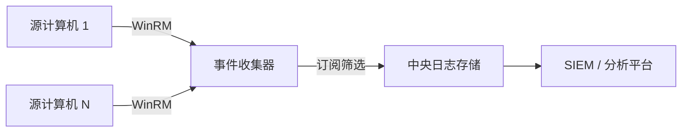
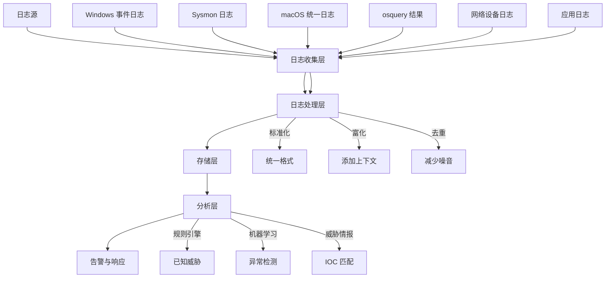
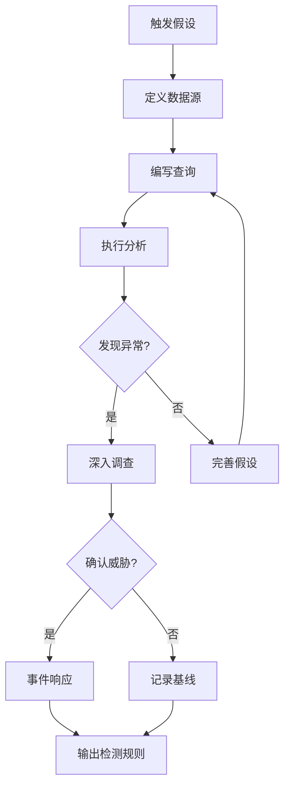
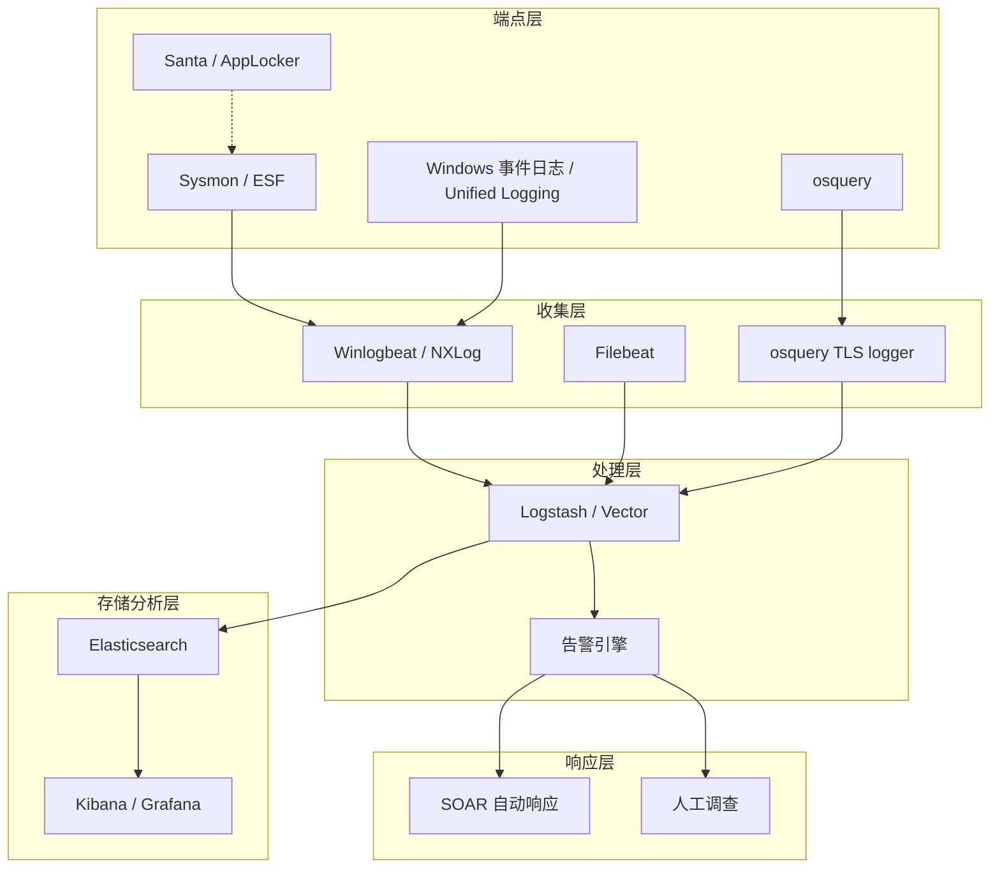

## 四、安全监控与检测

安全监控是防御体系的核心支柱。攻击者可能绕过所有预防性控制（防火墙、杀毒软件、访问控制），但几乎不可能在不产生任何日志痕迹的情况下完成攻击链。安全监控的本质是**缩短攻击驻留时间（Dwell Time）**——从攻击者入侵到被发现的时间窗口。根据 Mandiant 2024 年报告，全球中位驻留时间为 10 天，而在缺乏监控能力的环境中，这一数字可长达数月。

本章从 Windows 和 macOS 两个平台出发，系统讲解安全监控的核心组件、配置方法和实战技巧，并在最后介绍跨平台 SIEM 架构和威胁狩猎方法论。

---

### 4.1 Windows 安全监控体系

Windows 提供了多层次的监控能力，从内核级事件捕获到应用层日志记录，构成了业界最成熟的安全监控生态之一。

#### 4.1.1 Sysmon：系统监控的瑞士军刀

Sysmon（System Monitor）是微软 Sysinternals 套件中的免费工具，以内核驱动形式运行，能够捕获操作系统级别的活动并写入 Windows 事件日志。与 Windows 原生日志相比，Sysmon 提供了更细粒度的上下文信息，是威胁检测的基石工具。

**为什么 Sysmon 不可替代？**

Windows 原生日志存在关键盲区：进程创建日志（Event ID 4688）默认不记录命令行参数，网络连接需要开启高级审计，文件创建操作几乎没有原生记录。Sysmon 一次性填补了所有这些空白，并且以结构化 XML 格式输出，非常适合自动化分析。

**安装与部署**：

```cmd
:: 下载 Sysmon（从 Sysinternals 官网）
:: https://learn.microsoft.com/en-us/sysinternals/downloads/sysmon

:: 安装（使用配置文件）
sysmon64.exe -accepteula -i sysmonconfig.xml

:: 更新配置（无需重启服务）
sysmon64.exe -c sysmonconfig.xml

:: 卸载
sysmon64.exe -u
```

**Sysmon 核心事件类型详解**：

| Event ID | 事件类型 | 检测场景 | 关键字段 |
|----------|---------|---------|---------|
| 1 | 进程创建 | 恶意进程启动、LOLBAS 利用、可疑父子进程关系 | Image, CommandLine, ParentImage, Hashes, User |
| 2 | 文件创建时间修改 | 攻击者篡改时间戳隐藏痕迹 | TargetFilename, CreationUtcTime, PreviousCreationUtcTime |
| 3 | 网络连接 | C2 通信、数据外泄、横向移动 | DestinationIp, DestinationPort, Image, Initiated |
| 5 | 进程终止 | 进程被杀（可能是防御规避） | Image, ProcessId |
| 6 | 驱动加载 | 内核级 rootkit、BYOVD 攻击 | ImageLoaded, Hashes, Signed |
| 7 | DLL 加载 | DLL 注入、侧加载、Search Order Hijacking | ImageLoaded, Image, Signed |
| 8 | 远程线程创建 | DLL 注入的经典手法 | SourceImage, TargetImage, StartAddress |
| 9 | RawAccessRead | 直接磁盘访问（绕过文件系统） | Image, Device |
| 10 | 进程访问 | LSASS 访问（凭证窃取）、进程注入目标 | SourceImage, TargetImage, GrantedAccess |
| 11 | 文件创建 | 恶意文件落地、勒索软件加密输出 | TargetFilename, Image |
| 12-14 | 注册表事件 | 持久化机制、配置篡改、Run 键添加 | TargetObject, Details, Image |
| 15 | 文件流创建 | ADS 隐藏数据（Alternate Data Streams） | TargetFilename, Hash |
| 17/18 | 命名管道 | 进程间通信（横向移动、C2） | PipeName, Image |
| 19/20/21 | WMI 事件 | WMI 持久化、远程执行 | EventType, Consumer, Destination |
| 22 | DNS 查询 | 域名解析（DGA 域名、C2 域名检测） | QueryName, QueryResults, Image |
| 23 | 文件删除归档 | 恶意文件自我删除、勒索软件删除原文件 | TargetFilename, Image |
| 25 | 进程篡改 | 进程空心化（Process Hollowing） | Image, ProcessId |
| 26 | 文件删除日志 | 文件被删除的记录 | TargetFilename, Image |

**生产级 Sysmon 配置文件**：

直接使用默认配置会产生海量噪音。推荐使用 SwiftOnSecurity 维护的开源配置作为基线，然后根据环境定制：

```xml
<!-- sysmonconfig.xml 精简示例 -->
<Sysmon schemaversion="4.90">
  <HashAlgorithms>SHA256,IMPHASH</HashAlgorithms>
  <EventFiltering>
    <!-- 进程创建：排除系统噪音，保留关键进程 -->
    <ProcessCreate onmatch="exclude">
      <!-- 排除 Windows 自身更新进程 -->
      <Image condition="is">C:\Windows\System32\wuauclt.exe</Image>
      <!-- 排除 Sysmon 自身 -->
      <Image condition="is">C:\Windows\Sysmon64.exe</Image>
    </ProcessCreate>

    <!-- 网络连接：只关注非标准端口和非系统进程 -->
    <NetworkConnect onmatch="include">
      <DestinationPort condition="is">443</DestinationPort>
      <DestinationPort condition="is">80</DestinationPort>
      <DestinationPort condition="is">445</DestinationPort>
      <DestinationPort condition="is">3389</DestinationPort>
      <DestinationPort condition="is">5985</DestinationPort>
      <DestinationPort condition="is">5986</DestinationPort>
    </NetworkConnect>

    <!-- 进程访问：重点监控 LSASS 访问 -->
    <ProcessAccess onmatch="include">
      <TargetImage condition="is">C:\Windows\System32\lsass.exe</TargetImage>
    </ProcessAccess>

    <!-- DNS 查询：记录所有 DNS -->
    <DnsQuery onmatch="exclude" />

    <!-- 注册表：关注自启动相关 -->
    <RegistryEvent onmatch="include">
      <TargetObject condition="contains">CurrentVersion\Run</TargetObject>
      <TargetObject condition="contains">CurrentVersion\RunOnce</TargetObject>
      <TargetObject condition="contains">ControlSet\Services</TargetObject>
    </RegistryEvent>
  </EventFiltering>
</Sysmon>
```

**关键检测规则示例**：

```powershell
# 检测可疑父子进程关系（如 Word 启动 cmd/powershell）
# 攻击者常通过钓鱼文档执行恶意代码
$ParentChildAnomalies = @(
    @{ Parent = "WINWORD.EXE"; Child = "cmd.exe" },
    @{ Parent = "WINWORD.EXE"; Child = "powershell.exe" },
    @{ Parent = "EXCEL.EXE";  Child = "cmd.exe" },
    @{ Parent = "OUTLOOK.EXE"; Child = "powershell.exe" },
    @{ Parent = "explorer.exe"; Child = "msbuild.exe" },
    @{ Parent = "svchost.exe"; Child = "cmd.exe" }
)

# 使用 PowerShell 查询 Sysmon 日志
Get-WinEvent -FilterHashtable @{
    LogName = 'Microsoft-Windows-Sysmon/Operational'
    Id = 1  # 进程创建
} | Where-Object {
    $xml = [xml]$_.ToXml()
    $parent = ($xml.Event.EventData.Data | Where-Object {$_.Name -eq 'ParentImage'}).'#text'
    $image  = ($xml.Event.EventData.Data | Where-Object {$_.Name -eq 'Image'}).'#text'
    $ParentChildAnomalies | Where-Object {
        $parent -match $_.Parent -and $image -match $_.Child
    }
} | Select-Object TimeCreated, @{
    N='Parent';E={ ([xml]$_.ToXml()).Event.EventData.Data | Where-Object {$_.Name -eq 'ParentImage'} | ForEach-Object '#text' }
}, @{
    N='Child';E={ ([xml]$_.ToXml()).Event.EventData.Data | Where-Object {$_.Name -eq 'Image'} | ForEach-Object '#text' }
}, @{
    N='CommandLine';E={ ([xml]$_.ToXml()).Event.EventData.Data | Where-Object {$_.Name -eq 'CommandLine'} | ForEach-Object '#text' }
}
```

```powershell
# 检测 LSASS 访问（凭证窃取）
Get-WinEvent -FilterHashtable @{
    LogName = 'Microsoft-Windows-Sysmon/Operational'
    Id = 10
} | Where-Object {
    $xml = [xml]$_.ToXml()
    $target = ($xml.Event.EventData.Data | Where-Object {$_.Name -eq 'TargetImage'}).'#text'
    $target -match 'lsass.exe'
} | Select-Object TimeCreated, @{
    N='SourceProcess';E={ ([xml]$_.ToXml()).Event.EventData.Data | Where-Object {$_.Name -eq 'SourceImage'} | ForEach-Object '#text' }
}, @{
    N='GrantedAccess';E={ ([xml]$_.ToXml()).Event.EventData.Data | Where-Object {$_.Name -eq 'GrantedAccess'} | ForEach-Object '#text' }
}
```

#### 4.1.2 Windows 事件日志深度解析

Windows 事件日志是操作系统内置的审计机制，通过组策略启用高级审计后，可以捕获大量安全相关事件。

**安全日志核心事件 ID**：

| Event ID | 描述 | 检测用途 |
|----------|------|---------|
| 4624 | 登录成功 | 异常时间登录、异常来源 IP、异常登录类型 |
| 4625 | 登录失败 | 暴力破解检测（短时间内大量失败） |
| 4634 | 注销 | 会话时长分析 |
| 4648 | 显式凭据登录 | Pass-the-Hash、RunAs 使用 |
| 4672 | 特权登录 | 特权账户活动监控 |
| 4688 | 进程创建 | 恶意进程检测（需启用命令行记录） |
| 4689 | 进程终止 | 进程生命周期分析 |
| 4697 | 服务安装 | 持久化检测 |
| 4698/4699/4700/4701 | 计划任务操作 | 持久化检测 |
| 4720 | 账户创建 | 后门账户检测 |
| 4722/4725/4726/4728/4732/4756 | 账户/组变更 | 权限篡改检测 |
| 4768/4769/4771 | Kerberos 票据操作 | Kerberoasting、Golden Ticket 检测 |
| 4776 | NTLM 认证 | Pass-the-Hash 检测 |
| 5140 | 网络共享访问 | 横向移动检测 |
| 5156 | Windows Filtering Platform 连接 | 网络连接审计 |
| 7045 | 服务安装 | 恶意服务持久化 |

**启用高级审计策略**：

```cmd
:: 启用进程创建审计
auditpol /set /subcategory:"Process Creation" /success:enable /failure:enable

:: 启用命令行参数记录（关键！）
reg add "HKLM\SOFTWARE\Microsoft\Windows\CurrentVersion\Policies\System\Audit" /v ProcessCreationIncludeCmdLine_Enabled /t REG_DWORD /d 1 /f

:: 启用 PowerShell 脚本块日志
reg add "HKLM\SOFTWARE\Policies\Microsoft\Windows\PowerShell\ScriptBlockLogging" /v EnableScriptBlockLogging /t REG_DWORD /d 1 /f

:: 启用 PowerShell 模块日志
reg add "HKLM\SOFTWARE\Policies\Microsoft\Windows\PowerShell\ModuleLogging" /v EnableModuleLogging /t REG_DWORD /d 1 /f

:: 启用 PowerShell 转录日志
reg add "HKLM\SOFTWARE\Policies\Microsoft\Windows\PowerShell\Transcription" /v EnableTranscripting /t REG_DWORD /d 1 /f
reg add "HKLM\SOFTWARE\Policies\Microsoft\Windows\PowerShell\Transcription" /v OutputDirectory /t REG_SZ /d "C:\PSTranscripts" /f

:: 查看当前审计策略
auditpol /get /category:*
```

**PowerShell 日志三剑客**：

PowerShell 是攻击者最常滥用的工具之一（PowerShell Empire、Cobalt Strike 的 PowerShell payload 等），因此其日志记录至关重要：

| 日志类型 | 事件 ID | 日志通道 | 记录内容 |
|---------|---------|---------|---------|
| 模块日志 | 4103 | Microsoft-Windows-PowerShell/Operational | 每次调用的模块和 cmdlet |
| 脚本块日志 | 4104 | Microsoft-Windows-PowerShell/Operational | 实际执行的代码（即使经过混淆也会记录反混淆后的代码） |
| 转录日志 | — | 指定目录下的文本文件 | 完整的输入输出会话记录 |

脚本块日志是检测 PowerShell 攻击的利器——即使攻击者使用 Base64 编码、字符串拼接、`Invoke-Expression` 等混淆手段，系统也会在执行前记录反混淆后的完整代码。

#### 4.1.3 Windows Defender 与 AMSI

**AMSI（Antimalware Scan Interface）** 是 Windows 10/11 和 Server 2016+ 内置的反恶意软件扫描接口，允许安全产品在脚本和内存内容执行前进行扫描。

AMSI 的检测范围包括：
- PowerShell 脚本和命令
- JScript/VBScript 执行
- .NET 动态加载的程序集
- WMI 操作
- 宏执行（通过 Office VBA）

```powershell
# 查看 AMSI 相关事件
Get-WinEvent -FilterHashtable @{
    LogName = 'Microsoft-Windows-Windows Defender/Operational'
} | Where-Object { $_.Id -eq 1116 -or $_.Id -eq 1117 }

# Event 1116：检测到恶意软件
# Event 1117：执行了关键操作（如隔离、删除）
```

**AMSI 的局限与绕过**：

需要了解的是，攻击者已经发展出多种 AMSI 绕过技术（如内存补丁 `AmsiScanBuffer`、反射加载等），因此 AMSI 不应作为唯一的检测手段，而应与 Sysmon、事件日志、EDR 形成多层检测。

#### 4.1.4 Windows 事件转发（WEF）

Windows 事件转发（Windows Event Forwarding）是 Windows 内置的集中日志收集机制，无需部署第三方代理即可将多台机器的事件日志汇集到中央事件收集器。

**架构原理**：



**配置步骤**：

**第一步：在事件收集器上启用 WinRM 服务**：

```cmd
:: 在收集器上执行
winrm quickconfig
wecutil qc
```

**第二步：在源计算机上配置 WinRM 客户端**：

```cmd
:: 在每台源计算机上执行
winrm quickconfig

:: 设置收集器地址（通过组策略推送更高效）
winrm set winrm/config/client @{TrustedCollectors="CollectorServer.domain.local"}
```

**第三步：创建订阅**：

```cmd
:: 创建订阅（源计算机启动模式）
wecutil cs MySubscription.xml

:: XML 订阅文件示例内容
:: <Subscription>
::   <SubscriptionId>SecurityEvents</SubscriptionId>
::   <SubscriptionType>SourceInitiated</SubscriptionType>
::   <Enabled>true</Enabled>
::   <Uri>http://schemas.microsoft.com/wbem/wsman/1/windows/EventLog</Uri>
::   <Query>
::     <![CDATA[
::       <QueryList>
::         <Query Id="0">
::           <Select Path="Security">*[System[(EventID=4624 or EventID=4625 or EventID=4688 or EventID=4720)]]</Select>
::         </Query>
::       </QueryList>
::     ]]>
::   </Query>
:: </Subscription>

:: 验证订阅状态
wecutil gs MySubscription
```

**WEF 的优势与局限**：

| 优势 | 局限 |
|------|------|
| 无需额外许可证（Windows 内置） | 仅支持 Windows 平台 |
| 支持事件筛选（减少带宽消耗） | 配置复杂度较高 |
| 支持推送和拉取两种模式 | 大规模部署需要考虑收集器性能 |
| 与组策略深度集成 | 不支持自定义日志源（如 Sysmon）的富上下文 |

> **实战建议**：对于 Sysmon 日志的集中收集，推荐使用 NXLog 或 Winlogbeat 作为轻量级转发器，将日志发送到 Elasticsearch 或 Splunk。WEF 更适合收集 Windows 原生安全事件。

---

### 4.2 macOS 安全监控体系

macOS 的安全监控生态与 Windows 有显著差异。Apple 对系统内核访问的严格限制使得第三方监控工具的开发门槛更高，但也催生了更安全的原生框架。

#### 4.2.1 Endpoint Security Framework（ESF）

ESF 是 Apple 在 macOS 10.15（Catalina）引入的内核级安全监控框架，取代了已废弃的 Kernel Authorization（Kauth）和 `OpenBSM` 的部分功能。ESF 是 macOS 上最底层的合法监控接口。

**ESF 的监控能力**：

| 事件类别 | 具体事件 | 检测用途 |
|---------|---------|---------|
| 进程事件 | exec, fork, exit, signal | 恶意进程执行、进程注入 |
| 文件事件 | create, rename, unlink, open, close, write | 恶意文件落地、勒索软件 |
| 网络事件 | connect, listen, bind | C2 通信、数据外泄 |
| 内核事件 | kextload, kextunload | 内核扩展加载（rootkit） |
| 认证事件 | login, logout, su, sudo | 异常认证行为 |
| 内存事件 | mmap, mprotect | 内存注入、shellcode 执行 |
| 事件日志 | authentication | TCC 绕过检测 |

**ESF 客户端开发示例**（Swift）：

```swift
import EndpointSecurity

// 创建 ESF 客户端
let client = try ESClient { client, message in
    switch message.event {
    case .exec(let event):
        let path = event.target.executable?.path ?? "unknown"
        let args = event.target.argv ?? []
        print("[EXEC] \(path) \(args.joined(separator: " "))")
    case .create(let event):
        let path = event.destination?.path ?? "unknown"
        print("[FILE CREATE] \(path)")
    case .connect(let event):
        let addr = event.remoteAddress
        print("[NET CONNECT] \(addr)")
    default:
        break
    }
}

// 订阅事件
try client.subscribe(events: [.exec, .create, .connect, .unlink])
```

**ESF 的限制**：
- 必须以 System Extension 形式分发
- 需要用户在"安全性与隐私"中手动批准
- 在沙盒中运行，文件访问受 TCC 控制
- 需要 Apple 签名的开发者证书
- 无法监控 Apple 自身进程的活动

#### 4.2.2 Unified Logging System（统一日志系统）

macOS 10.12+ 使用统一日志系统取代了传统的 ASL（Apple System Log）和 syslog。统一日志系统采用二进制格式存储，性能远优于文本日志，但查询方式也完全不同。

**日志查询工具：log 命令**：

```bash
# 实时流式查看所有日志
log stream

# 实时流式查看安全相关日志（带过滤）
log stream --predicate 'subsystem == "com.apple.securityd"' --level debug

# 查询过去 1 小时内的认证事件
log show --last 1h --predicate 'eventMessage contains "authentication"' --style syslog

# 查询特定进程的日志
log show --last 1h --predicate 'process == "sudo"' --info --debug

# 查询 Gatekeeper 检查事件
log show --last 1h --predicate 'subsystem == "com.apple.syspolicy.exec"' --style syslog

# 导出日志到文件
log collect --last 1h --output ~/logs/system.logarchive

# 从归档文件分析
log show ~/logs/system.logarchive --predicate 'eventMessage contains "failed"'
```

**关键安全子系统**：

| 子系统 | 用途 | 过滤示例 |
|--------|------|---------|
| com.apple.securityd | 安全守护进程（密钥链、证书） | `subsystem == "com.apple.securityd"` |
| com.apple.Authorization | 授权服务 | `subsystem == "com.apple.Authorization"` |
| com.apple.syspolicy | Gatekeeper 策略 | `subsystem == "com.apple.syspolicy"` |
| com.apple.TCC | 隐私控制（TCC） | `subsystem == "com.apple.TCC"` |
| com.apple.endpointsecurity | ESF 事件 | `subsystem == "com.apple.endpointsecurity"` |
| com.apple.xpc.launchd | 服务管理 | `subsystem == "com.apple.xpc.launchd"` |
| com.apple.opendirectoryd | 目录服务（认证） | `subsystem == "com.apple.opendirectoryd"` |

#### 4.2.3 osquery：跨平台系统查询引擎

osquery 由 Facebook（Meta）开源，将操作系统抽象为关系型数据库，允许使用标准 SQL 查询系统状态。它是安全监控和合规审计的强大工具，支持 Windows、macOS 和 Linux。

**安装**：

```bash
# macOS（Homebrew）
brew install osquery

# 或下载官方 PKG
# https://github.com/osquery/osquery/releases

# Linux（Debian/Ubuntu）
curl -L https://pkg.osquery.io/deb/gpg.key | sudo apt-key add -
echo "deb [arch=amd64] https://pkg.osquery.io/deb deb main" | sudo tee /etc/apt/sources.list.d/osquery.list
sudo apt update && sudo apt install osquery
```

**交互式查询（osqueryi）**：

```bash
# 启动交互式 shell
osqueryi

# 查看所有可用表
.tables

# 查看某个表的结构
.schema processes
```

**实战安全查询集**：

```sql
-- ============================================================
-- 1. 进程分析
-- ============================================================

-- 查找所有非标准路径下的进程
SELECT pid, name, path, cmdline, uid, start_time
FROM processes
WHERE path NOT LIKE '/usr/bin/%'
  AND path NOT LIKE '/usr/sbin/%'
  AND path NOT LIKE '/usr/local/bin/%'
  AND path NOT LIKE '/System/%'
  AND path NOT LIKE '/Applications/%'
  AND path NOT LIKE '/Library/Apple/%'
ORDER BY start_time DESC;

-- 查找以隐藏参数运行的进程
SELECT pid, name, cmdline
FROM processes
WHERE cmdline LIKE '% -hidden%'
   OR cmdline LIKE '%--nologo%'
   OR cmdline LIKE '%-nop%'
   OR cmdline LIKE '%-ep bypass%'
   OR cmdline LIKE '%-enc%'
   OR cmdline LIKE '%base64%';

-- 查找父子进程关系异常
-- （如 Word/Excel 启动了 shell 进程）
SELECT
    p.pid AS parent_pid,
    p.name AS parent_name,
    p.path AS parent_path,
    c.pid AS child_pid,
    c.name AS child_name,
    c.path AS child_path,
    c.cmdline AS child_cmdline
FROM processes p
JOIN processes c ON c.parent = p.pid
WHERE p.name IN ('Microsoft Word', 'Microsoft Excel', 'Microsoft Outlook')
  AND c.name IN ('bash', 'sh', 'zsh', 'python', 'osascript', 'curl', 'wget');

-- ============================================================
-- 2. 网络连接分析
-- ============================================================

-- 查找所有外部网络连接
SELECT
    p.name AS process_name,
    p.path AS process_path,
    pos.local_address,
    pos.local_port,
    pos.remote_address,
    pos.remote_port,
    pos.state
FROM process_open_sockets pos
JOIN processes p ON pos.pid = p.pid
WHERE pos.remote_address != ''
  AND pos.remote_address NOT LIKE '127.0.0.1%'
  AND pos.remote_address NOT LIKE '::1%'
  AND pos.remote_address NOT LIKE 'fe80:%'
ORDER BY p.name;

-- 查找监听端口
SELECT
    p.name AS process_name,
    p.path AS process_path,
    pos.local_address,
    pos.local_port,
    pos.socket
FROM process_open_sockets pos
JOIN processes p ON pos.pid = p.pid
WHERE pos.state = 'LISTEN'
ORDER BY pos.local_port;

-- ============================================================
-- 3. 持久化检测
-- ============================================================

-- macOS Launch Agents/Daemons
SELECT
    la.label,
    la.program,
    la.run_at_load,
    la.disabled,
    la.username,
    la.path
FROM launchd la
WHERE la.path LIKE '%LaunchAgents%'
   OR la.path LIKE '%LaunchDaemons%'
ORDER BY la.path;

-- 登录项
SELECT * FROM login_items;

-- 浏览器扩展（Chrome）
SELECT
    name,
    identifier,
    version,
    description,
    path
FROM chrome_extensions
WHERE name NOT IN (
    'Google Docs Offline',
    'Chrome PDF Viewer'
);

-- 浏览器扩展（Safari）
SELECT * FROM safari_extensions;

-- ============================================================
-- 4. 用户与认证分析
-- ============================================================

-- 查找非系统用户
SELECT uid, username, description, directory, shell, uuid
FROM users
WHERE uid >= 500
  AND username NOT LIKE '_%'
ORDER BY uid;

-- 查找 sudo 权限用户
SELECT * FROM sudoers;

-- 最近登录事件
SELECT * FROM last
ORDER BY time DESC
LIMIT 20;

-- ============================================================
-- 5. 文件系统分析
-- ============================================================

-- 查找最近修改的可执行文件
SELECT path, mtime, size, uid, gid, permissions
FROM file
WHERE directory = '/usr/local/bin'
ORDER BY mtime DESC;

-- 查找 setuid/setgid 文件（权限提升风险）
SELECT path, uid, gid, permissions
FROM suid_bin;

-- ============================================================
-- 6. macOS 特有查询
-- ============================================================

-- TCC 数据库（隐私权限授予）
SELECT
    service,
    client,
    auth_value,
    last_modified
FROM tcc_access;

-- 内核扩展
SELECT * FROM kernel_extensions;

-- 系统完整性保护状态
SELECT * FROM sip_config;
```

**osquery 守护进程模式（osqueryd）**：

osquery 不仅可以交互式查询，还能以守护进程模式运行，定期执行预定义查询并将结果写入日志或发送到远程服务器。

```bash
# 配置文件 /etc/osquery/osquery.conf
{
  "options": {
    "config_plugin": "filesystem",
    "logger_plugin": "filesystem",
    "logger_path": "/var/log/osquery",
    "schedule_splay_percent": 10
  },
  "schedule": {
    "suspicious_processes": {
      "query": "SELECT * FROM processes WHERE path NOT IN ('/usr/bin/*', '/usr/sbin/*')",
      "interval": 300,
      "description": "Non-standard path processes"
    },
    "network_connections": {
      "query": "SELECT p.name, pos.* FROM process_open_sockets pos JOIN processes p ON pos.pid = p.pid WHERE pos.remote_address != ''",
      "interval": 60,
      "description": "Active network connections"
    },
    "login_events": {
      "query": "SELECT * FROM last ORDER BY time DESC LIMIT 20",
      "interval": 900,
      "description": "Recent login events"
    }
  },
  "packs": {
    "incident-response": "/usr/share/osquery/packs/incident-response.conf",
    "hardware-monitoring": "/usr/share/osquery/packs/hardware-monitoring.conf"
  }
}

# 启动守护进程
sudo osqueryctl start

# 检查状态
sudo osqueryctl status
```

#### 4.2.4 Santa：应用白名单控制

Santa 是 Google 开源的 macOS 端点安全工具，专注于**二进制白名单/黑名单**控制。它可以精确控制哪些程序允许在系统上执行，是防止未授权软件运行的有效手段。

**Santa 的工作模式**：

| 模式 | 说明 |
|------|------|
| Monitor 模式 | 记录所有执行但不阻止（观察期） |
| Lockdown 模式 | 只允许白名单中的程序执行 |

**安装与基本使用**：

```bash
# 安装 Santa
# https://github.com/northpolesec/santa/releases
# 或通过 MDM 推送

# 查看 Santa 状态
santactl status

# 查看规则
santactl rule --list

# 添加白名单规则（基于 SHA-256）
sudo santactl rule --whitelist --sha256 <hash> --path /Applications/SomeApp.app

# 添加黑名单规则
sudo santactl rule --blacklist --sha256 <hash>

# 查看程序是否被允许
santactl fileinfo /path/to/binary
```

**Santa 与 EDR 的配合**：

Santa 适合做执行控制的"最后一道防线"——即使恶意文件落地，如果没有通过白名单验证也无法执行。但 Santa 不提供行为监控，需要与 ESF 或商业 EDR 产品配合使用。

---

### 4.3 跨平台 SIEM 架构

SIEM（Security Information and Event Management，安全信息与事件管理）是安全监控的中枢系统，负责日志收集、关联分析、告警生成和事件响应。

#### 4.3.1 SIEM 核心能力



#### 4.3.2 ELK Stack 快速部署

Elasticsearch + Logstash + Kibana（ELK）是最流行的开源 SIEM 方案。以下是一个生产可用的快速部署方案：

```yaml
# docker-compose.yml - ELK + Filebeat
version: '3.8'
services:
  elasticsearch:
    image: docker.elastic.co/elasticsearch/elasticsearch:8.12.0
    environment:
      - discovery.type=single-node
      - xpack.security.enabled=true
      - ELASTIC_PASSWORD=ChangeMe!
    ports:
      - "9200:9200"
    volumes:
      - es_data:/usr/share/elasticsearch/data

  kibana:
    image: docker.elastic.co/kibana/kibana:8.12.0
    environment:
      - ELASTICSEARCH_HOSTS=http://elasticsearch:9200
      - ELASTICSEARCH_USERNAME=kibana_system
      - ELASTICSEARCH_PASSWORD=ChangeMe!
    ports:
      - "5601:5601"
    depends_on:
      - elasticsearch

  logstash:
    image: docker.elastic.co/logstash/logstash:8.12.0
    volumes:
      - ./logstash.conf:/usr/share/logstash/pipeline/logstash.conf
    depends_on:
      - elasticsearch

volumes:
  es_data:
```

**Filebeat 配置（Windows 端）**：

```yaml
# filebeat.yml - Windows 上安装 Filebeat 收集事件日志
filebeat.inputs:
  - type: winlog
    name: Security
    event_id: 4624, 4625, 4688, 4697, 4720, 4776
    fields:
      source: windows-security
  - type: winlog
    name: Microsoft-Windows-Sysmon/Operational
    fields:
      source: sysmon
  - type: winlog
    name: Microsoft-Windows-PowerShell/Operational
    fields:
      source: powershell

output.logstash:
  hosts: ["siem-server:5044"]

processors:
  - add_host_metadata: ~
  - add_cloud_metadata: ~
```

**Filebeat 配置（macOS 端）**：

```yaml
# filebeat.yml - macOS 上收集 osquery 日志
filebeat.inputs:
  - type: filestream
    paths:
      - /var/log/osquery/osqueryd.results.log
    parsers:
      - ndjson:
          target: "osquery"
    fields:
      source: osquery

output.logstash:
  hosts: ["siem-server:5044"]
```

#### 4.3.3 告警规则设计原则

有效的告警规则需要平衡**检出率（True Positive Rate）**和**误报率（False Positive Rate）**。过于敏感会导致告警疲劳，过于宽松则会遗漏真实威胁。

**基于 MITRE ATT&CK 的规则映射**：

| ATT&CK 技术 | 检测规则 | 数据源 | 严重度 |
|-------------|---------|--------|--------|
| T1059.001 PowerShell | 检测 `-enc`、`bypass`、`IEX` 等关键词 | Sysmon E1 + PS 日志 4104 | 高 |
| T1003.001 LSASS 内存 | 检测对 lsass.exe 的非授权访问（Sysmon E10） | Sysmon E10 | 严重 |
| T1053.005 计划任务 | 检测新计划任务创建 | 事件 ID 4698 | 高 |
| T1547.001 注册表 Run 键 | 检测 Run/RunOnce 键值新增 | Sysmon E13 | 高 |
| T1021.002 SMB/Windows 管理共享 | 检测非正常时间的 445 连接 | 事件 ID 5140 + Sysmon E3 | 中 |
| T1078 有效账户 | 检测异常时间/来源的登录 | 事件 ID 4624 | 中 |
| T1055 进程注入 | 检测远程线程创建（Sysmon E8） | Sysmon E8 | 严重 |
| T1562.001 禁用安全工具 | 检测安全服务停止/禁用 | 事件 ID 7036 + Sysmon | 严重 |

**告警分级标准**：

| 级别 | 响应时间 | 示例 |
|------|---------|------|
| P0 - 严重 | 15 分钟内 | LSASS 凭证窃取、勒索软件行为、域控制器异常 |
| P1 - 高危 | 1 小时内 | 可疑 PowerShell 执行、异常横向移动、后门账户 |
| P2 - 中危 | 4 小时内 | 异常登录时间、未知程序执行、异常 DNS 查询 |
| P3 - 低危 | 下一工作日 | 配置变更、软件安装、非标准路径程序 |

---

### 4.4 威胁狩猎（Threat Hunting）

威胁狩猎是主动搜索隐藏威胁的过程，不依赖告警触发，而是基于假设驱动的调查。它是安全监控的进阶形态——从被动等告警到主动找威胁。

#### 4.4.1 狩猎方法论

**假设驱动的狩猎流程**：



#### 4.4.2 实战狩猎案例

**狩猎场景一：检测隐藏的持久化机制**

假设：攻击者可能通过非标准的 Launch Agent/Daemon 实现持久化。

```bash
# macOS - 查找非 Apple 签名的 Launch Agent/Daemon
find /Library/LaunchDaemons /Library/LaunchAgents ~/Library/LaunchAgents \
  -name "*.plist" -exec sh -c '
    for f; do
      prog=$(defaults read "$f" Program 2>/dev/null || defaults read "$f" ProgramArguments 2>/dev/null | head -1)
      if [ -n "$prog" ] && [ -f "$prog" ]; then
        sig=$(codesign -dv "$prog" 2>&1 | grep "Authority")
        if echo "$sig" | grep -qv "Apple"; then
          echo "SUSPICIOUS: $f -> $prog"
          echo "  Signature: $sig"
          cat "$f"
        fi
      fi
    done
  ' sh {} + 2>/dev/null
```

**狩猎场景二：检测 PowerShell 攻击载荷**

```powershell
# 在 SIEM 中搜索可疑 PowerShell 脚本块
# 关键词：AMSI 绕过、下载执行、混淆技术

# 常见恶意关键词列表
$suspiciousPatterns = @(
    'AmsiScanBuffer',           # AMSI 绕过
    'Set-MpPreference',         # 禁用 Defender
    'Add-MpPreference -ExclusionPath',  # 添加排除路径
    'DownloadString',           # 远程下载
    'DownloadFile',             # 远程下载
    'Net.WebClient',            # HTTP 下载
    'Invoke-Expression',        # 动态执行
    'IEX',                      # Invoke-Expression 别名
    'Invoke-WebRequest',        # HTTP 请求
    '-EncodedCommand',          # Base64 编码命令
    'FromBase64String',         # Base64 解码
    '[Convert]',                # 类型转换（常用于解码）
    'Reflection.Assembly',      # 反射加载 .NET 程序集
    'LoadWithPartialName',      # 程序集加载
    'Get-WmiObject',            # WMI 查询（横向移动）
    'Invoke-WmiMethod',         # WMI 方法调用
    'New-Object System.Net.Sockets.TCPClient',  # 反向 Shell
    'Start-Process',            # 启动进程
    'Out-File',                 # 写文件
    'Invoke-Command',           # 远程执行
    'Enter-PSSession'           # 远程 PowerShell 会话
)
```

**狩猎场景三：异常 DNS 查询分析**

```sql
-- osquery：查找高熵域名（可能是 DGA 生成的 C2 域名）
-- 以下查询查找长域名且包含大量子域名的 DNS 记录
SELECT name, COUNT(*) as query_count
FROM dns_response
WHERE name NOT LIKE '%.microsoft.com'
  AND name NOT LIKE '%.apple.com'
  AND name NOT LIKE '%.google.com'
  AND name NOT LIKE '%.windows.com'
  AND LENGTH(name) > 30
GROUP BY name
ORDER BY query_count DESC;
```

```python
# Python 脚本：计算域名熵值（用于 DGA 检测）
import math
from collections import Counter

def domain_entropy(domain):
    """计算域名的香农熵。高熵值（>3.5）可能是 DGA 域名"""
    clean = domain.split('.')[0]  # 只分析主域名部分
    if not clean:
        return 0
    freq = Counter(clean)
    length = len(clean)
    entropy = -sum(
        (count / length) * math.log2(count / length)
        for count in freq.values()
    )
    return round(entropy, 3)

# 示例
domains = [
    'google.com',              # 正常域名
    'microsoft.com',           # 正常域名
    'kq3jfa8x1z9vb2.com',     # 可疑 DGA 域名
    'xf7k2m9p4qw1n3r5.net',   # 可疑 DGA 域名
    'github.com',              # 正常域名
]

for d in domains:
    e = domain_entropy(d)
    flag = ' *** SUSPICIOUS' if e > 3.5 else ''
    print(f'{d:35s} entropy={e:.3f}{flag}')
```

---

### 4.5 监控体系部署最佳实践

#### 4.5.1 分层监控架构



#### 4.5.2 常见部署误区

| 误区 | 正确做法 |
|------|---------|
| 开启所有日志，不做筛选 | 根据威胁模型选择高价值事件，逐步扩展 |
| 只收集不分析 | 建立定期审查机制，自动化告警规则 |
| 告警阈值设得过低 | 逐步调优，先观察基线再设阈值 |
| 所有日志集中到一个队列 | 按源类型和优先级分区，避免关键日志被淹没 |
| 监控只覆盖服务器 | 端点（笔记本、工作站）是攻击者的主要入口 |
| 忽略 macOS 设备 | macOS 在企业中的比例持续增长，且常被高管使用 |
| 只关注已知威胁 | 结合异常检测和威胁狩猎发现未知威胁 |
| 安全团队独自负责监控 | 与 IT 运维、网络团队协作，共享上下文 |

#### 4.5.3 性能优化建议

**Sysmon 性能优化**：
- 使用 `exclude` 过滤器优先排除噪音（比 `include` 性能更好）
- 将 `HashAlgorithms` 限制为 `SHA256`（不要同时计算多个哈希）
- 对高频事件（如 Event 3 网络连接）使用激进的排除规则
- 将事件日志大小设置为至少 1GB（避免日志被覆盖）

```cmd
:: 设置安全日志大小为 2GB
wevtutil sl Security /ms:2147483648

:: 设置 Sysmon 日志大小为 1GB
wevtutil sl "Microsoft-Windows-Sysmon/Operational" /ms:1073741824
```

**osquery 性能优化**：
- 将高频查询（如进程列表）的间隔设置为 300 秒以上
- 使用 `splay` 参数分散查询执行时间，避免 CPU 尖峰
- 避免查询 `file` 表的深层目录递归
- 使用 `snapshot` 模式对比差异，而非每次都全量获取

---

### 4.6 监控能力自检清单

完成部署后，使用以下清单验证监控体系的完整性：

| 检查项 | 验证方法 | 预期结果 |
|--------|---------|---------|
| Sysmon 正在运行 | `sc query sysmon64` | 状态为 RUNNING |
| Sysmon 配置生效 | `sysmon64.exe -c` 查看当前配置 | 配置与预期一致 |
| 命令行审计已启用 | 检查注册表 `ProcessCreationIncludeCmdLine_Enabled` | 值为 1 |
| PowerShell 日志已启用 | 运行 `Get-ExecutionPolicy`，检查事件 4104 | 脚本块被记录 |
| 事件日志大小合理 | `wevtutil gl Security` | MaxSize >= 1GB |
| 日志转发正常工作 | 在源计算机生成测试事件，在收集器搜索 | 事件能在 5 分钟内到达 |
| osquery 守护进程运行 | `sudo osqueryctl status` | 进程活跃 |
| SIEM 告警规则生效 | 触发测试告警（如执行 `whoami`） | 告警在预期时间内生成 |
| macOS ESF 扩展已批准 | `systemextensionsctl list` | 状态为 activated |
| 统一日志可查询 | `log show --last 1m --predicate 'eventMessage contains "test"'` | 返回结果 |

---

通过构建覆盖 Windows 和 macOS 的多层次安全监控体系，安全团队能够从被动响应转变为主动防御。关键不是部署多少工具，而是确保**每个检测层都能产生可操作的情报**，并在告警和威胁狩猎之间形成闭环。记住：没有被分析的日志只是存储成本，没有被验证的告警只是噪音。

***
