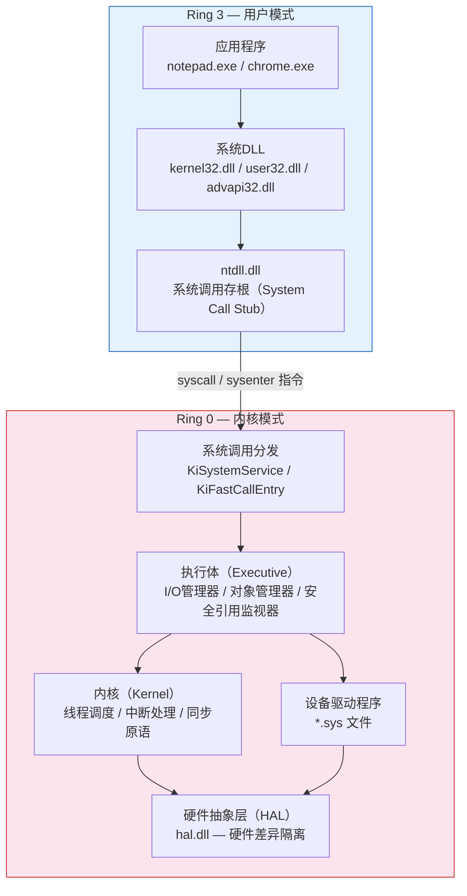
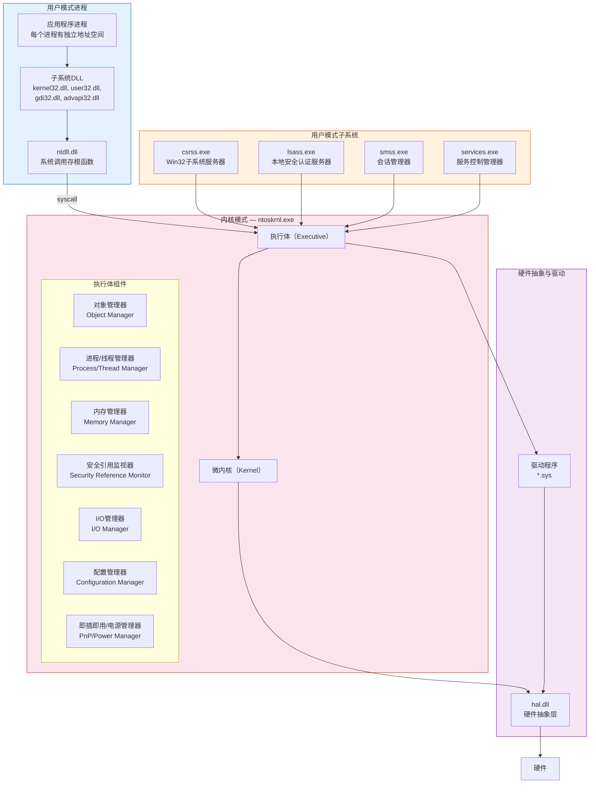
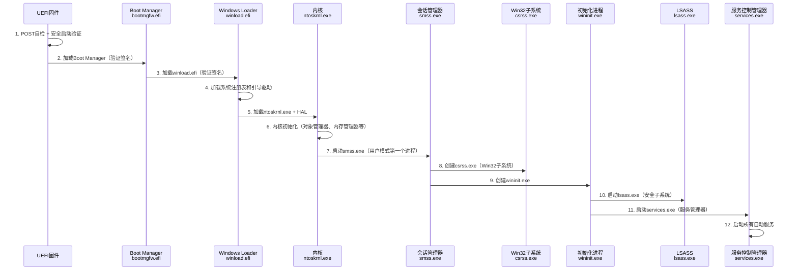
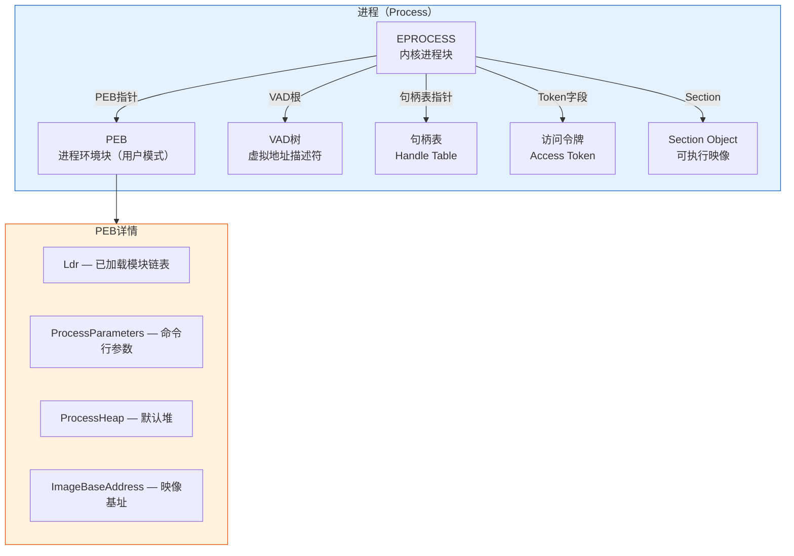
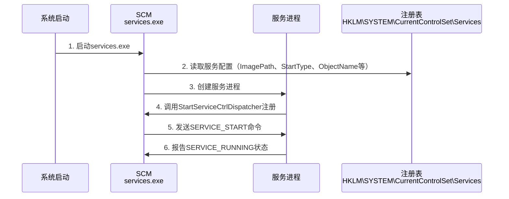
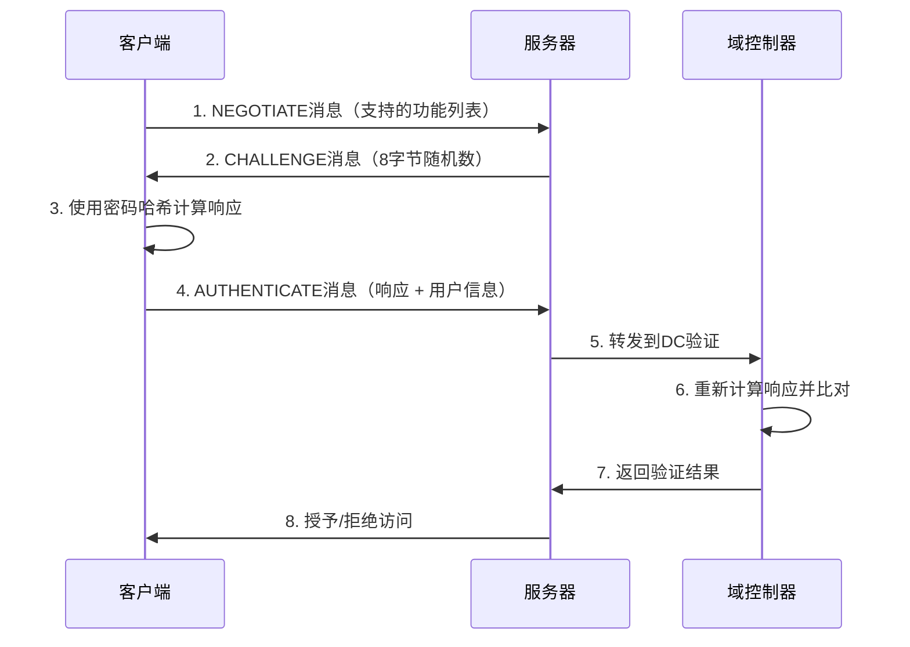
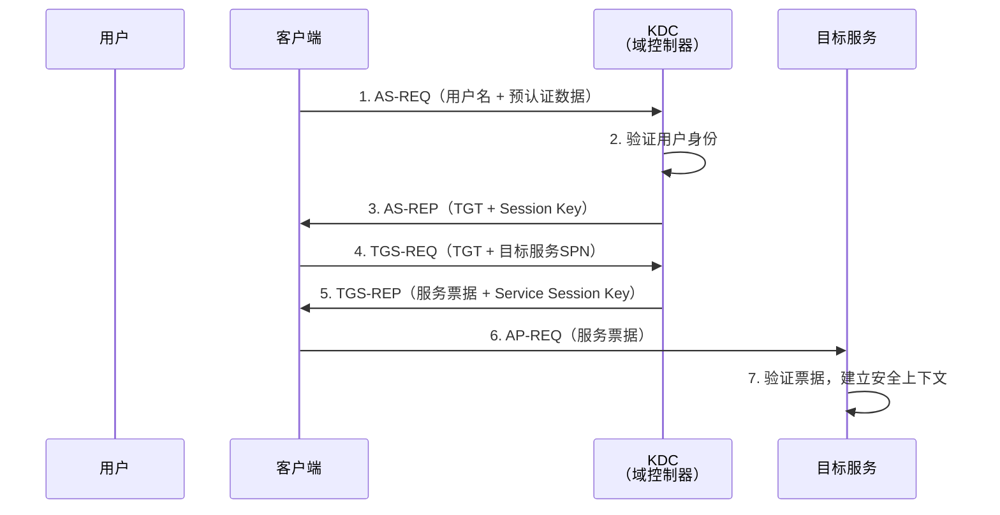
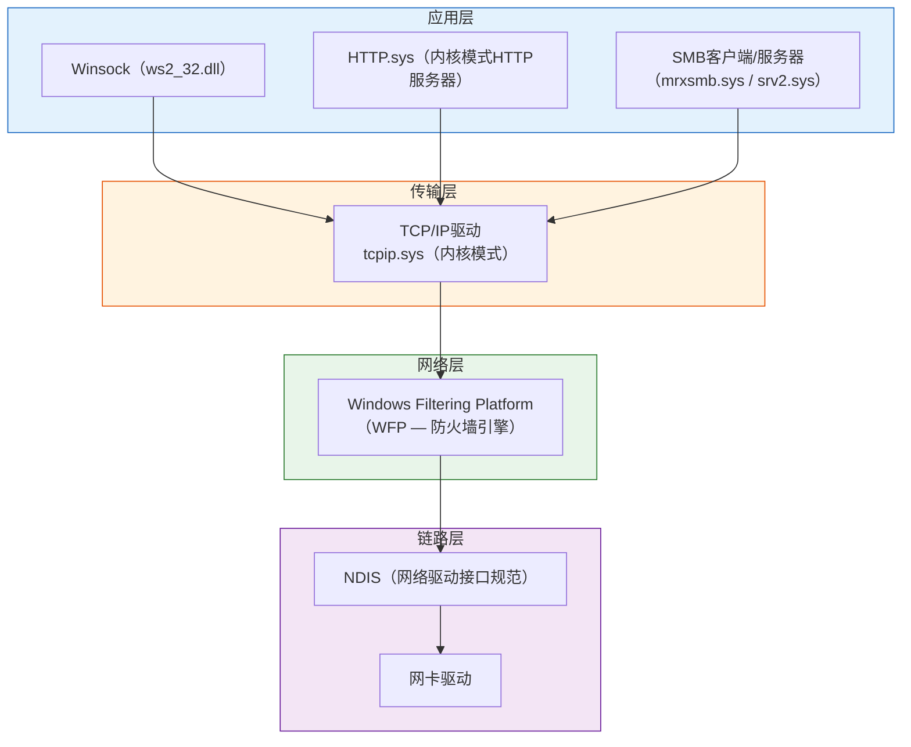
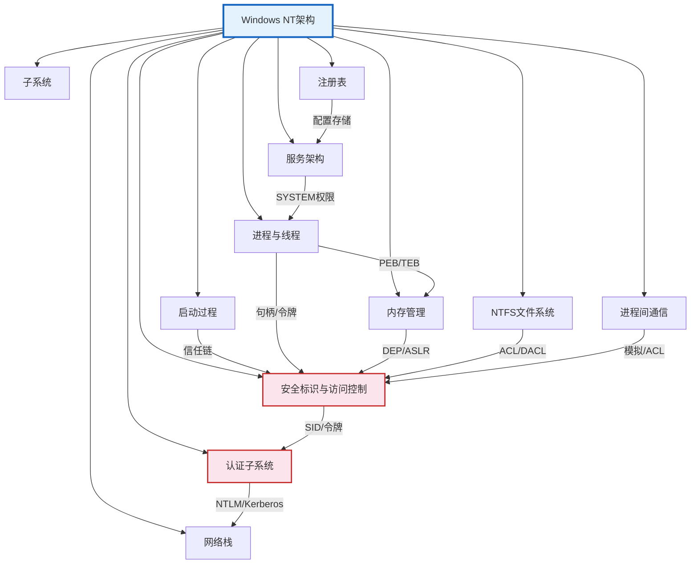

## 一、Windows系统架构

Windows操作系统是全球企业环境中占据主导地位的桌面操作系统，其底层架构的复杂程度远超大多数从业者的认知。本章从最底层的硬件抽象层开始，逐层向上拆解Windows NT架构的每一个核心组件，帮助你建立对Windows系统运行机制的完整认知。这种认知是后续理解Windows安全机制、进行渗透测试和安全防御的根基——不理解系统架构，任何安全分析都只能停留在表面。

### 1.1 Windows NT架构总览

#### 1.1.1 NT架构的历史演进

Windows NT架构由Dave Cutler团队于1989年在微软设计开发，目标是创建一个全新的、可移植的、支持多处理器的操作系统内核。Dave Cutler此前是DEC VMS操作系统的核心开发者，NT架构深受VMS设计哲学的影响——这一点在NT的内存管理、I/O系统和安全模型中都有明显体现。

| 版本 | 年份 | 内核版本 | 关键架构变化 |
|------|------|----------|-------------|
| Windows NT 3.1 | 1993 | 3.1 | 首个NT内核，引入HAL、NTFS、Win32子系统 |
| Windows NT 4.0 | 1996 | 4.0 | 将Win32k.sys移入内核以提升图形性能 |
| Windows 2000 | 2000 | 5.0 | 引入Active Directory、即插即用 |
| Windows XP | 2001 | 5.1 | 消费级与企业级统一，ClearType |
| Windows Vista | 2006 | 6.0 | 引入UAC、WDDM、强制完整性控制 |
| Windows 7 | 2009 | 6.1 | 改进UAC、DirectX 11、VHD原生支持 |
| Windows 8 | 2012 | 6.2 | UEFI安全启动、Metro UI、Hyper-V客户端 |
| Windows 10 | 2015 | 10.0 | 统一平台、WSL、Credential Guard |
| Windows 11 | 2021 | 10.0 | 强制TPM 2.0、VBS默认启用、Pluton安全处理器 |

从攻击者视角看，NT架构的每次重大变化都引入了新的安全边界，同时也带来了新的攻击面。例如Vista引入的UAC创造了新的权限提升路径，Windows 8的UEFI安全启动改变了bootkit的攻击策略，Windows 10的Credential Guard迫使攻击者从内存中提取NTLM哈希转向Kerberos攻击。

#### 1.1.2 双模式架构设计

Windows采用经典的双模式（Dual-Mode）架构，将CPU执行模式划分为用户模式和内核模式。这种设计的本质是**硬件支持的权限隔离**——利用x86/x64处理器的Ring 0（最高权限）和Ring 3（最低权限）机制，在硬件层面强制执行权限边界。



**用户模式（Ring 3）的特征：**
- 每个进程拥有独立的虚拟地址空间，进程间内存天然隔离
- 不能直接执行特权指令（如修改页表基址寄存器CR3、操作I/O端口）
- 所有对硬件和内核资源的访问必须通过系统调用（System Call）中转
- 应用程序崩溃（Access Violation）只会终止自身进程，不会影响其他进程或系统
- 用户模式代码的执行受到页表权限位的硬件级保护

**内核模式（Ring 0）的特征：**
- 内核模式代码可以访问整个虚拟地址空间，包括用户模式的页面
- 可以执行所有CPU特权指令
- 可以直接操作硬件（通过内存映射I/O或端口I/O）
- 驱动程序和内核组件共享同一地址空间——一个驱动的错误可能导致整个系统崩溃（BSOD）
- 内核模式的代码没有用户模式的那些保护机制，这既是性能优势也是安全风险

**从安全角度看双模式架构的意义：**
用户模式到内核模式的边界是Windows系统中最重要的安全边界。攻击者获取内核模式权限意味着：
1. 可以绕过所有用户模式的安全软件（包括杀毒软件和EDR的用户态组件）
2. 可以修改内核数据结构来隐藏进程、文件、注册表项
3. 可以直接读写物理内存，获取所有进程的敏感数据
4. 可以禁用PatchGuard、DSE等内核保护机制
5. 可以植入内核级rootkit实现深度持久化

因此，**从用户模式突破到内核模式**（权限提升到Ring 0）一直是高级攻击的核心目标，也是安全防御的重点领域。

#### 1.1.3 核心组件架构图

Windows NT架构由多个层次的组件协同工作。以下是从高层到底层的完整组件映射：



**各核心组件详解：**

**硬件抽象层（HAL）— hal.dll**

HAL是NT架构最底层的软件组件，其核心职责是将硬件平台的差异封装起来，使上层的内核和驱动程序无需关心具体的硬件实现。例如，不同主板的中断控制器（APIC vs 8259）、DMA控制器、定时器等硬件细节，都由HAL统一抽象。

HAL的文件名是`hal.dll`，在系统启动时由引导加载程序加载。不同的硬件平台使用不同的HAL——例如ACPI HAL、APIC HAL等。从安全角度看，HAL是极其敏感的组件：替换或hook HAL可以拦截所有硬件中断，但Windows的PatchGuard和DSE（驱动签名强制）机制保护了HAL不被轻易修改。

**内核（Kernel）— ntoskrnl.exe**

内核是操作系统的核心调度引擎，负责以下底层功能：
- **线程调度**：基于优先级的抢占式调度算法，管理32个优先级级别（0-31），实时线程优先级16-31，普通线程1-15
- **中断分发**：通过中断描述符表（IDT）将硬件中断分发到对应的处理函数
- **异常处理**：处理CPU异常（如页面错误、除零错误、调试断点）
- **同步原语**：提供自旋锁（Spin Lock）、互斥体（Mutex）、信号量（Semaphore）等同步机制
- **处理器管理**：在多处理器系统中管理处理器间的通信和负载均衡

内核与执行体虽然编译在同一个ntoskrnl.exe文件中，但逻辑上是分离的。内核提供的服务更加底层和基础，执行体的服务建立在内核服务之上。

**执行体（Executive）— ntoskrnl.exe中的上半部分**

执行体提供操作系统的主要功能模块，每个模块都是一个"管理器"：

| 管理器 | 核心职责 | 安全意义 |
|--------|----------|----------|
| 对象管理器（OB） | 管理所有内核对象的创建、命名、查找、删除 | 对象命名空间是攻击面（符号链接攻击） |
| 进程/线程管理器（PS） | 创建和管理进程、线程 | 进程注入、令牌操作的底层实现 |
| 内存管理器（MM） | 虚拟内存分配、页面调度、段对象 | 内存保护机制（DEP/ASLR）的实现层 |
| 安全引用监视器（SRM） | 实施访问控制检查 | Windows安全模型的核心执行者 |
| I/O管理器（IO） | 统一的I/O请求分发框架 | IRP（I/O请求包）是驱动交互的核心 |
| 配置管理器（CM） | 注册表的底层实现 | 注册表的物理存储和访问控制 |
| 缓存管理器 | 文件系统缓存管理 | 缓存侧信道攻击的潜在目标 |
| PnP管理器 | 即插即用设备枚举和驱动加载 | 驱动加载安全（DSE） |
| 电源管理器 | 系统电源状态转换 | 休眠文件中的内存残留 |

### 1.2 Windows启动过程

理解Windows启动过程对安全分析至关重要——这是操作系统从固件到用户空间逐步建立信任链的过程，也是bootkit和固件攻击的目标领域。

#### 1.2.1 UEFI安全启动流程

现代Windows系统（Windows 8+）要求支持UEFI安全启动（Secure Boot），这从根本上改变了传统的启动攻击策略。



**每个阶段的安全含义：**

**阶段1-3：固件与引导加载程序**

UEFI固件首先执行POST（加电自检），然后进入安全启动验证流程。安全启动的核心是信任链（Chain of Trust）：
- UEFI固件内置微软的UEFI CA公钥（PK/KEK/db）
- Boot Manager（bootmgfw.efi）必须由微软签名才能加载
- winload.efi同样需要有效的微软签名
- 如果签名验证失败，启动过程将被中断

这意味着传统的bootkit（将恶意代码注入MBR或引导扇区）在启用安全启动的系统上无法直接工作。攻击者需要：要么利用UEFI固件漏洞禁用安全启动，要么获取微软的签名（如通过泄露的签名密钥或利用签名服务漏洞），要么攻击物理存在（Physical Presence）机制。

**阶段4-6：内核加载与初始化**

winload.efi负责加载ntoskrnl.exe、HAL和引导启动类（boot-start）驱动程序。这一阶段的安全关键点：
- 引导驱动程序也需要通过签名验证（DSE——驱动签名强制）
- 内核和HAL的完整性通过安全启动的信任链保证
- 如果启用了VBS（基于虚拟化的安全），Hypervisor在此阶段加载

**阶段7-12：用户模式初始化**

内核初始化完成后，创建第一个用户模式进程smss.exe（Session Manager Subsystem）。smss.exe是所有用户模式进程的"祖先"——它创建csrss.exe和wininit.exe（在Session 0）以及后续登录会话中的csrss.exe和winlogon.exe。

值得注意的是，smss.exe是系统中唯一一个通过NtCreateProcess直接由内核创建的用户模式进程。所有其他进程都是由已有进程派生（fork）而来。

#### 1.2.2 启动过程中的安全边界

| 启动阶段 | 安全机制 | 已知攻击方式 |
|----------|----------|-------------|
| 固件阶段 | UEFI安全启动、TPM测量 | UEFI漏洞（如LogoFAIL）、BIOS刷新攻击 |
| 引导加载阶段 | Boot Manager签名验证 | BootHole（CVE-2020-10713）、撤销列表绕过 |
| 内核加载阶段 | DSE（驱动签名强制） | 利用合法但有漏洞的驱动（BYOVD攻击） |
| 用户模式初始化 | 完整性级别、会话隔离 | 进程替换、DLL搜索顺序劫持 |

### 1.3 进程与线程架构

进程和线程是Windows执行计算的基本单位。深入理解其内部结构对于掌握进程注入、令牌操作、内存取证等安全技术至关重要。

#### 1.3.1 进程内部结构

Windows进程不仅仅是"运行中的程序"，而是一个由多个核心数据结构组成的复杂实体。



**EPROCESS结构（内核模式）**

EPROCESS是内核中代表进程的核心数据结构，包含了进程的所有内核态信息。虽然EPROCESS的完整定义未公开（属于微软私有API），但通过内核调试器（WinDbg）和逆向工程，可以解析出其关键字段：

| 字段 | 类型 | 说明 |
|------|------|------|
| Pcb | KPROCESS | 内核进程块，包含调度信息（优先级、亲和性、时间片） |
| UniqueProcessId | HANDLE | 进程ID（PID） |
| ActiveProcessLinks | LIST_ENTRY | 活动进程双向链表（攻击者常用断链隐藏进程） |
| Token | EX_FAST_REF | 进程的访问令牌 |
| ImageFileName | CHAR[16] | 可执行文件名（截断为15字符） |
| DirectoryTableBase | ULONG_PTR | 页表基址（CR3寄存器的值） |
| VadRoot | RTL_AVL_TREE | 虚拟地址描述符树根 |
| ObjectTable | HANDLE_TABLE* | 句柄表指针 |
| Peb | PEB* | 用户模式PEB指针 |
| PriorityClass | UCHAR | 进程优先级类别 |
| CreateTime | LARGE_INTEGER | 进程创建时间 |

**安全关键点——ActiveProcessLinks攻击**：Windows通过双向链表维护所有活动进程的列表。Task Manager、Process Explorer等工具都遍历这个链表来枚举进程。攻击者可以通过修改链表指针将目标进程从链表中"摘除"，使其对用户模式工具不可见。不过，这种技术可以通过遍历句柄表或比较PsActiveProcessHead与实际链表来检测。

**PEB结构（用户模式）**

PEB（Process Environment Block）是用户模式中最重要的进程数据结构，存储了进程的环境信息。每个进程在用户模式地址空间中都有一个PEB，通过TEB（线程环境块）访问。

PEB的关键字段：

| 字段 | 说明 | 安全意义 |
|------|------|----------|
| Ldr (PPEB_LDR_DATA) | 已加载模块的链表（InLoadOrder、InMemoryOrder、InInitializationOrder） | 模块枚举、DLL注入检测 |
| ProcessParameters | 命令行参数、当前目录、环境变量 | 敏感信息泄露（密码可能出现在命令行中） |
| ImageBaseAddress | 主模块加载基址 | ASLR随机化的目标 |
| ProcessHeap | 默认堆句柄 | 堆喷射（Heap Spray）的目标 |
| BeingDebugged | 调试标志 | 反调试检测 |
| SessionId | 会话ID | 会话隔离 |
| CriticalSectionTimeout | 临界区超时 | 可被修改用于拒绝服务 |

**TEB结构（线程环境块）**

每个线程都有一个TEB（Thread Environment Block），存储线程的本地信息：

```c
// TEB关键字段（简化表示）
typedef struct _TEB {
    NT_TIB NtTib;                // 异常处理链表头
    PVOID  EnvironmentPointer;
    CLIENT_ID ClientId;          // 进程ID + 线程ID
    PVOID  ActiveRpcHandle;
    PVOID  ThreadLocalStoragePointer;
    PPEB   ProcessEnvironmentBlock; // 指向PEB的指针
    ULONG  LastErrorValue;
    // ... 更多字段
} TEB;
```

TEB在x86系统中通过FS段寄存器访问（`FS:[0x18]`），在x64系统中通过GS段寄存器访问（`GS:[0x30]`）。许多shellcode利用TEB/PEB遍历来定位API地址，这是恶意代码分析中必须了解的基础知识。

#### 1.3.2 线程调度

Windows采用基于优先级的抢占式调度算法。理解调度机制有助于理解竞态条件攻击和时序攻击的原理。

**优先级模型：**
- 32个优先级级别（0-31），数字越大优先级越高
- 级别0：零页面线程（系统保留）
- 级别1-15：动态优先级（普通线程，可被调度器动态调整）
- 级别16-31：实时优先级（需要`SeIncreaseBasePriorityPrivilege`权限）

**线程状态转换：**

| 状态 | 含义 |
|------|------|
| Ready（就绪） | 等待CPU时间片 |
| Running（运行） | 正在CPU上执行 |
| Waiting（等待） | 等待某个事件（I/O完成、锁释放等） |
| Terminated（终止） | 线程已结束 |
| Standby（待命） | 下一个获得CPU的线程 |
| Initialized（初始化） | 线程正在创建中 |

**调度安全意义**：攻击者可以通过设置高优先级实时线程来抢占系统资源（拒绝服务），或者通过精确控制线程时序来利用竞态条件（TOCTOU攻击）。

#### 1.3.3 句柄与对象

Windows使用统一的对象模型来管理内核资源。进程不直接访问内核对象，而是通过句柄（Handle）间接访问。

**句柄表的工作原理：**
1. 进程请求创建或打开一个内核对象（如文件、注册表键、进程）
2. 对象管理器创建或查找对象，然后在进程的句柄表中分配一个句柄
3. 进程通过句柄值引用该对象
4. 内核通过句柄在句柄表中查找实际的对象指针
5. 在查找过程中执行访问检查（SRM介入）

**句柄表的层级结构：**
- 句柄表是三级页表结构（类似虚拟内存页表）
- 每个句柄表项包含对象头指针和授予的访问掩码
- 句柄值实际上是句柄表索引乘以4（忽略低位标志）

**句柄操作的安全影响：**
- `DuplicateHandle`可以在进程间复制句柄——恶意进程可以尝试复制高权限进程的句柄
- 句柄继承：子进程可以继承父进程的句柄（需要设置`bInheritHandle`标志）
- 句柄保护：Windows 8+支持`PROTECT_HANDLE`标志，防止句柄被关闭或复制

### 1.4 内存管理

Windows的内存管理子系统是操作系统中最复杂的组件之一，也是安全攻防的核心战场。缓冲区溢出、堆喷射、返回导向编程（ROP）等攻击技术都建立在对内存管理机制的深入理解之上。

#### 1.4.1 虚拟地址空间布局

**32位系统（x86）地址空间布局：**

| 地址范围 | 大小 | 用途 |
|----------|------|------|
| 0x00000000 - 0x0000FFFF | 64KB | 空指针保护区（NULL页） |
| 0x00010000 - 0x7FFEFFFF | ~2GB | 用户模式空间（堆、栈、DLL、映像） |
| 0x7FFD0000 - 0x7FFFFFFF | 192KB | 用户模式共享数据（KUSER_SHARED_DATA） |
| 0x80000000 - 0xFFFFFFFF | 2GB | 内核模式空间 |

**64位系统（x64）地址空间布局：**

| 地址范围 | 大小 | 用途 |
|----------|------|------|
| 0x0000000000000000 - 0x00007FFFFFFFFFFF | 128TB | 用户模式空间 |
| 0xFFFF080000000000 - 0xFFFF800000000000 | 内核空间 | HyperSpace、系统缓存 |
| 0xFFFF800000000000 - 0xFFFFFFFFFFFFFFFF | 内核空间 | 内核代码、HAL、驱动、PFN数据库 |

64位系统的用户模式地址空间为128TB（Windows 8+为128TB，此前为8TB），这极大地增加了ASLR的熵——攻击者需要猜测的地址范围大幅增加，使得传统的堆喷射+ROP攻击变得更加困难。

**KUSER_SHARED_DATA**（地址0x7FFE0000）是用户模式和内核模式共享的只读数据页，包含系统时间、时区、中断统计等信息。安全从业者应了解这个区域，因为它在某些攻击中可以被利用（如通过时间侧信道推断系统状态）。

#### 1.4.2 页面保护与安全机制

**DEP（数据执行保护）**

DEP通过设置页面的NX（No-Execute）位来阻止在数据页面中执行代码。硬件DEP利用CPU的NX/XD位实现，软件DEP通过页表项的附加位实现。

DEP的工作原理：
1. 可执行代码段的页面标记为"可执行"
2. 数据段（堆、栈）的页面标记为"不可执行"
3. 如果CPU试图在标记为"不可执行"的页面上执行指令，触发页面错误异常
4. 异常处理程序终止违规进程

DEP的绕过方式：
- ROP（Return-Oriented Programming）：利用已有的可执行代码片段拼接攻击代码
- JIT喷射：利用JIT编译器生成的可执行内存区域
- 信息泄露+ROP：先获取内存布局信息，再构造精确的ROP链

**ASLR（地址空间布局随机化）**

ASLR在每次进程启动时随机化以下内存区域的加载地址：
- 可执行文件主模块
- DLL文件
- 堆基址
- 栈基址
- PEB/TEB地址

ASLR的有效性取决于：
- 熵（随机化的地址范围越大，猜测越困难）
- 所有模块是否都启用了ASLR（一个没有ASLR的模块就可能成为跳板）
- 是否存在信息泄露漏洞（可以获取基址，使ASLR失效）

64位系统上ASLR的熵远高于32位系统。Windows 10进一步引入了强制ASLR（Force ASLR）和高熵ASLR，使得绕过难度显著增加。

**CFG（控制流保护）— Control Flow Guard**

CFG是Windows 10引入的编译器辅助的安全机制：
1. 编译器在每个间接调用（indirect call）前插入CFG检查代码
2. 运行时维护一张合法调用目标的位图
3. 间接调用前先检查目标地址是否在合法目标表中
4. 如果目标不合法，立即终止进程

CFG主要防护ROP/COOP等间接调用攻击。但CFG存在已知弱点：
- 位图粒度为8字节，可能存在碰撞
- 非间接调用的控制流转移（如返回指令）不受CFG保护
- 可以通过信息泄露获取CFG位图，从而构造合法的调用目标

#### 1.4.3 堆管理

Windows进程默认拥有一个或多个堆（Heap）。堆管理器负责在堆上分配和释放内存块。

**堆的安全演进：**

| Windows版本 | 堆安全特性 |
|-------------|-----------|
| Windows XP | 基本堆管理，安全unlinking |
| Windows Vista | 低碎片堆（LFH）默认启用，堆头随机化 |
| Windows 7 | LFH增强，堆段随机化 |
| Windows 8 | 堆元数据编码，终止空闲块检查 |
| Windows 10 | Segment堆（Segment Heap）引入，进一步加固 |

**LFH（低碎片堆）的安全特性：**
- 分配相同大小的对象时，LFH采用桶（Bucket）策略，从预分配的段中分配
- 同一桶中的对象地址不完全可预测
- LFH不使用传统的空闲链表，使得基于空闲链表的堆溢出利用（如unlink攻击）失效
- 但LFH对象之间的布局相对固定，仍可被堆喷射利用

### 1.5 NTFS文件系统架构

NTFS（New Technology File System）是Windows的主文件系统，其设计深刻影响了Windows的安全模型和攻击面。

#### 1.5.1 核心数据结构

**MFT（主文件表）**

MFT是NTFS的核心，它是一个数据库，存储了卷上所有文件和目录的元数据。每个文件/目录在MFT中至少有一个MFT记录（默认1KB）。

MFT记录的结构：

```text
MFT记录（1024字节）
├── MFT头（标准信息属性）
│   ├── 创建时间、修改时间、访问时间
│   ├── 文件属性标志（只读、隐藏、系统等）
│   └── 安全描述符ID
├── $FILE_NAME 属性
│   ├── 文件名（Unicode）
│   ├── 父目录MFT号
│   └── 文件名命名空间（POSIX/Win32/DOS）
├── $DATA 属性
│   ├── 常驻数据（小文件直接存储在MFT中）
│   └── 非常驻数据（大文件通过数据运行列表定位）
└── $SECURITY_DESCRIPTOR 属性
    ├── DACL（自主访问控制列表）
    └── SACL（系统访问控制列表）
```

**安全关键点——MFT攻击面：**
- MFT记录中存储的时间戳可以被篡改（timestomping），用于隐藏文件的真实创建/修改时间
- MFT的元数据完整性没有内置保护，需要外部工具（如文件完整性监控）来检测篡改
- NTFS的低级别API（如NtFsControlFile、FSCTL_SET_SPARSE）可以绕过部分用户模式文件监控

#### 1.5.2 NTFS安全特性

**ACL与权限模型**

NTFS为每个文件和目录维护独立的ACL（访问控制列表）。ACL的粒度远超Linux的rwx模型：

| 权限 | 说明 |
|------|------|
| 完全控制（Full Control） | 所有权限 |
| 修改（Modify） | 读取、写入、删除 |
| 读取和执行（Read & Execute） | 读取内容和执行程序 |
| 列出文件夹内容（List Folder Contents） | 仅列出目录内容 |
| 读取（Read） | 读取文件属性和内容 |
| 写入（Write） | 写入文件和创建新文件 |
| 特殊权限（Special Permissions） | 细粒度控制（如读取属性、更改权限等） |

**EFS（加密文件系统）**

EFS提供文件级别的透明加密：
- 使用对称加密（AES-256或3DES）加密文件内容
- 使用用户证书的公钥加密对称密钥
- 加密密钥存储在用户配置文件中
- 数据恢复代理（DRA）可以解密文件（企业环境中的安全后门）

EFS的安全隐患：
- 加密密钥在用户登录时可访问——获取用户凭据即可解密所有EFS文件
- EFS不会加密文件名，仅加密文件内容
- 临时文件、页面文件中的明文数据未被保护
- 删除的加密文件可以通过取证恢复密钥

**ADS（备用数据流）**

ADS是NTFS的一个功能特性，允许在一个文件中存储多个数据流。默认数据流（$DATA）是文件内容本身，而额外的数据流对普通用户不可见。

ADS的安全影响：
- 攻击者可以在ADS中隐藏恶意代码或数据
- 大多数杀毒软件和文件管理工具不检查ADS
- ADS可以用来绕过文件白名单（在合法文件的ADS中执行代码）

检测ADS的方法：
```powershell
# 使用dir /r查看所有数据流
dir /r C:\path\to\file.txt

# 使用PowerShell获取ADS
Get-Item C:\path\to\file.txt -Stream *

# 使用streams工具（Sysinternals）
streams.exe C:\path\to\file.txt
```

### 1.6 Windows服务架构

Windows服务是在系统启动时自动运行的后台程序，通常以SYSTEM或高权限账户运行。服务架构是权限提升和持久化的核心攻击面。

#### 1.6.1 服务控制管理器（SCM）

SCM（Service Control Manager，services.exe进程）是Windows服务的核心管理组件：



**服务启动类型：**

| 类型 | 值 | 说明 |
|------|---|------|
| Boot | 0 | 由引导加载程序启动（内核驱动） |
| System | 1 | 由内核初始化阶段启动 |
| Automatic | 2 | 系统启动时由SCM自动启动 |
| Manual | 3 | 按需手动启动 |
| Disabled | 4 | 已禁用 |

**服务权限模型：**

服务在注册表中的`HKLM\SYSTEM\CurrentControlSet\Services\<ServiceName>`键上关联了安全描述符（DACL），控制谁可以查询、启动、停止、修改该服务配置。

#### 1.6.2 服务安全攻击面

服务是Windows权限提升的首要目标之一，主要原因：
1. 许多服务以SYSTEM权限运行
2. 服务二进制文件路径可能被低权限用户修改（弱文件权限）
3. 服务配置（ImagePath、ObjectName等）可能被低权限用户修改（弱注册表权限）
4. 服务可能加载DLL时存在DLL劫持机会
5. 未引用的服务路径（Unquoted Service Path）可能被利用

**典型的服务权限提升路径：**
- **弱文件权限**：服务二进制文件对Authenticated Users可写，替换为恶意程序
- **弱注册表权限**：服务的ImagePath注册表值可被修改
- **DLL劫持**：服务加载DLL时搜索路径不安全，可放置恶意DLL
- **未引用路径**：`C:\Program Files\My Service\service.exe`如果路径未加引号，可能被`C:\Program.exe`劫持
- **服务权限滥用**：服务权限允许修改其他服务配置或创建新服务

### 1.7 子系统架构

Windows支持多个环境子系统，使不同来源的程序能够在同一系统上运行。

#### 1.7.1 Win32子系统

Win32子系统是Windows的核心子系统，负责管理窗口、图形设备接口（GDI）和用户输入。

关键进程：
- **csrss.exe**（Client/Server Runtime Subsystem）：Win32子系统的核心进程，负责管理控制台窗口、线程创建/销毁、进程退出等。csrss.exe运行在SYSTEM权限下，是系统中最重要的进程之一。
- **win32k.sys**：Win32子系统的内核模式组件（NT 4.0从用户模式移入内核），负责窗口管理、GDI和DirectX。win32k.sys是Windows内核中攻击面最大的组件之一——大量的内核提权漏洞（如CVE-2023-36874、CVE-2023-36802等）都出现在win32k.sys中。

#### 1.7.2 WoW64（Windows-on-Windows 64）

WoW64允许32位应用程序在64位Windows上运行。其工作原理：

1. 系统将WoW64层（wow64.dll、wow64win.dll、wow64cpu.dll）加载到32位进程的地址空间
2. WoW64层拦截32位程序的系统调用，将参数从32位格式转换为64位格式
3. 然后将转换后的调用转发到原生的64位内核
4. 返回结果再从64位格式转换回32位格式

**WoW64的安全意义：**
- 32位进程和64位进程使用不同的ntdll.dll版本（32位ntdll.dll在SysWOW64目录，64位在System32目录）
- WoW64进程的用户模式地址空间限制为4GB
- 一些安全工具可能仅检查原生64位进程，而忽略WoW64进程
- SysWOW64和System32目录名的反直觉命名（System32是64位，SysWOW64是32位）是常见的配置错误来源

#### 1.7.3 WSL（Windows Subsystem for Linux）

WSL是Windows 10引入的Linux兼容层，允许直接在Windows上运行Linux ELF二进制文件。WSL经历了从WSL 1（翻译层）到WSL 2（完整Linux内核虚拟机）的架构演变。

**WSL安全影响：**
- WSL 2运行完整的Linux内核，引入了新的攻击面（Linux内核漏洞）
- WSL文件系统通过Plan 9文件系统协议（9P）与Windows交互
- WSL中的root权限不等同于Windows的管理员权限，但可以通过WSL与Windows的互操作机制提权
- WSL的安装和配置可以被用于绕过某些Windows特定的安全控制

### 1.8 注册表架构

注册表是Windows系统的核心配置数据库，存储了从硬件驱动到用户偏好设置的所有系统配置信息。

#### 1.8.1 注册表的物理存储

注册表的逻辑结构是树状的键值存储，但其物理存储由配置管理器（Configuration Manager）管理，分布在多个hive文件中：

| Hive文件 | 对应的根键 | 存储内容 |
|----------|-----------|----------|
| %SystemRoot%\System32\config\SAM | HKLM\SAM | 本地用户账户和组信息 |
| %SystemRoot%\System32\config\SECURITY | HKLM\SECURITY | 安全策略和权限配置 |
| %SystemRoot%\System32\config\SYSTEM | HKLM\SYSTEM | 系统配置（服务、驱动、启动项） |
| %SystemRoot%\System32\config\SOFTWARE | HKLM\SOFTWARE | 已安装软件的配置 |
| %SystemRoot%\System32\config\DEFAULT | HKLM\U\.DEFAULT | 默认用户配置 |
| %UserProfile%\NTUSER.DAT | HKCU（HKU\<SID>） | 当前用户配置 |
| %LocalAppData%\Microsoft\Windows\UsrClass.dat | HKCR | 用户的文件类型关联和COM注册 |

**安全关键点：**
- SAM和SECURITY hive默认只有SYSTEM账户可以访问，但备份文件（如在卷影副本中）可能被低权限用户读取
- NTUSER.DAT中存储了用户级的自启动配置、MRU（最近使用）记录等敏感信息
- Hive文件内部使用简单的B+树结构，没有内置的完整性保护（没有校验和或签名）

#### 1.8.2 注册表安全攻击面

注册表是Windows持久化和横向移动的核心目标：

**自启动项（持久化）：**
```text
HKLM\SOFTWARE\Microsoft\Windows\CurrentVersion\Run           # 所有用户
HKLM\SOFTWARE\Microsoft\Windows\CurrentVersion\RunOnce       # 仅运行一次
HKCU\Software\Microsoft\Windows\CurrentVersion\Run           # 当前用户
HKLM\SOFTWARE\Microsoft\Windows\CurrentVersion\Explorer\Shell Folders  # Shell文件夹
HKLM\SYSTEM\CurrentControlSet\Services                        # 服务配置
HKLM\SOFTWARE\Microsoft\Windows NT\CurrentVersion\Winlogon   # 登录相关
HKLM\SOFTWARE\Microsoft\Windows NT\CurrentVersion\Image File Execution Options  # 映像劫持
```

**COM劫持：**
- COM对象的注册信息存储在`HKLM\SOFTWARE\Classes\CLSID`和`HKCU\Software\Classes\CLSID`
- 如果在HKCU（当前用户）中注册与系统COM对象相同的CLSID，用户级注册会覆盖系统级注册
- 攻击者可以注册恶意DLL作为合法COM对象的代理，实现无文件持久化

**影子副本访问：**
Windows的卷影副本（Volume Shadow Copy）可能包含注册表hive的备份。攻击者可以从卷影副本中读取SAM和SECURITY hive，提取本地用户密码哈希：
```cmd
# 创建卷影副本
vssadmin create shadow /for=C:

# 从卷影副本中复制SAM和SYSTEM
copy \\?\GLOBALROOT\Device\HarddiskVolumeShadowCopy1\Windows\System32\config\SAM C:\temp\SAM
copy \\?\GLOBALROOT\Device\HarddiskVolumeShadowCopy1\Windows\System32\config\SYSTEM C:\temp\SYSTEM

# 使用secretsdump.py提取哈希
secretsdump.py -sam SAM -system SYSTEM LOCAL
```

### 1.9 安全标识符与访问控制

Windows的安全模型以安全标识符（SID）和访问令牌（Access Token）为核心，通过安全引用监视器（SRM）实施访问控制。理解这一模型是掌握Windows权限机制的基础。

#### 1.9.1 安全标识符（SID）

SID是Windows中标识安全主体（用户、组、计算机）的唯一标识符。一旦创建，SID永远不会被重用。

**SID的结构解析：**
```text
S-1-5-21-3623811015-3361044348-30300820-1013
│ │ │         │                           │
│ │ │         └─ 域/机器标识符            └─ RID（相对标识符）
│ │ └─ 标识符颁发机构（NT Authority = 5）
│ └─ 修订级别（始终为1）
└─ 版本号（始终为S）
```

**重要的内置SID：**

| SID | 名称 | 说明 |
|-----|------|------|
| S-1-5-18 | SYSTEM | 本地系统账户，拥有最高权限 |
| S-1-5-19 | LOCAL SERVICE | 本地服务账户，有限的网络访问 |
| S-1-5-20 | NETWORK SERVICE | 网络服务账户，具有计算机的网络凭据 |
| S-1-5-32-544 | Administrators | 本地管理员组 |
| S-1-5-32-545 | Users | 标准用户组 |
| S-1-5-32-546 | Guests | 来宾组 |
| S-1-1-0 | Everyone | 所有用户（包括匿名用户） |
| S-1-5-11 | Authenticated Users | 已认证的用户 |
| S-1-5-7 | Anonymous | 匿名登录 |

**Well-Known SID的规律：**
- RID为500的账户是默认管理员账户（Administrator）
- RID为501的账户是默认来宾账户（Guest）
- RID从1000开始是用户创建的普通账户
- 域控制器上的RID分配与本地不同，域管理员RID为512

#### 1.9.2 访问令牌（Access Token）

访问令牌是进程的"安全身份证"，描述了进程代表哪个用户运行以及拥有什么权限。

**令牌类型：**
- **主令牌（Primary Token）**：与进程关联，在进程创建时分配
- **模拟令牌（Impersonation Token）**：线程在模拟客户端身份时使用

**令牌的关键组成：**

| 组件 | 说明 |
|------|------|
| 用户SID | 进程所属用户的SID |
| 组SID列表 | 用户所属的所有安全组 |
| 默认DACL | 进程创建对象时使用的默认权限 |
| 权限列表 | 持有的特权（如SeDebugPrivilege、SeBackupPrivilege等） |
| 完整性级别 | Mandatory Integrity Level（Low/Medium/High/System） |
| 会话ID | 终端服务会话标识 |
| 类型 | Primary或Impersonation |
| 模拟级别 | Anonymous/Identification/Impersonation/Delegation |

**完整性级别（Mandatory Integrity Control）：**

Windows Vista引入了强制完整性控制（MIC），将安全主体和安全对象都标记了完整性级别：

| 完整性级别 | RID | 典型场景 |
|-----------|-----|----------|
| Untrusted | 0x0000 | 匿名进程 |
| Low | 0x1000 | 受保护模式IE、AppContainer应用 |
| Medium | 0x2000 | 标准用户进程 |
| High | 0x3000 | 管理员进程（UAC提升后） |
| System | 0x4000 | SYSTEM进程 |
| Installer | 0x5000 | Windows Installer（特殊） |

完整性检查的规则：低完整性级别的主体不能写入高完整性级别的对象（即使DACL允许）。这是UAC实现"标准用户令牌默认不具有管理员写入权限"的底层机制。

#### 1.9.3 安全描述符与访问检查

每个安全对象（文件、注册表键、进程、服务等）都关联一个安全描述符（Security Descriptor），包含：
- **Owner SID**：对象的所有者
- **Group SID**：对象的组（主要在POSIX子系统中使用）
- **DACL**：定义谁可以对该对象执行什么操作
- **SACL**：定义对该对象的访问审计规则

**访问检查的完整流程：**

1. 线程尝试以特定访问掩码打开一个对象
2. 对象管理器将请求转发给安全引用监视器（SRM）
3. SRM获取线程的有效令牌（主令牌或模拟令牌）
4. SRM检查对象的DACL中每一条ACE（访问控制项）
5. ACE匹配的依据是令牌中的SID列表与ACE中的SID
6. 匹配到Allow ACE时，将授予的访问权限累积
7. 匹配到Deny ACE时，立即拒绝访问
8. 遍历完所有ACE后，比较累积的访问权限与请求的访问掩码
9. 如果累积权限覆盖了请求的掩码，授予访问；否则拒绝

**常见的ACE类型：**

| ACE类型 | 说明 |
|---------|------|
| ACCESS_ALLOWED_ACE | 允许特定SID的访问 |
| ACCESS_DENIED_ACE | 拒绝特定SID的访问 |
| ACCESS_ALLOWED_OBJECT_ACE | 允许对特定对象属性的访问（AD使用） |
| SYSTEM_MANDATORY_LABEL_ACE | 强制完整性级别检查 |

### 1.10 认证子系统

Windows的认证子系统负责验证用户身份并建立安全上下文。这是攻击者在初始访问阶段的首要目标。

#### 1.10.1 LSASS详解

LSASS（Local Security Authority Subsystem Service，lsass.exe）是Windows安全架构中最核心的进程。它运行在SYSTEM权限下，负责：

- **用户认证**：处理交互式登录、网络认证、服务登录
- **凭据管理**：缓存用户的密码哈希、Kerberos票据、明文凭据（在某些配置下）
- **安全策略实施**：实施密码策略、账户锁定策略、审计策略
- **令牌创建**：为成功认证的用户创建访问令牌
- **审计日志**：将安全事件写入Windows安全事件日志

**LSASS中的凭据存储：**

LSASS进程中缓存了多种类型的凭据，这些凭据是攻击者的主要目标：

| 凭据类型 | 存储位置 | 提取工具 |
|----------|----------|----------|
| NTLM哈希 | LSASS进程内存 | Mimikatz、sekurlsa::logonpasswords |
| Kerberos TGT | LSASS进程内存（Ticket Granting Tickets） | Mimikatz、sekurlsa::tickets |
| WDigest明文密码 | LSASS进程内存（WDigest默认缓存） | Mimikatz（需启用WDigest） |
| DPAPI主密钥 | 用户配置文件 | Mimikatz、dpapi::masterkey |
| 明文密码 | LSASS内存（SSP/SSAP插件注入） | Mimikatz（需要特殊配置） |

**Credential Guard**（Windows 10 Enterprise/Server 2016+）通过基于虚拟化的安全（VBS）将LSASS中的凭据存储在隔离的虚拟机中，使得即使拥有SYSTEM权限也无法直接从LSASS内存中提取NTLM哈希和Kerberos票据。这是微软对抗Pass-the-Hash和Kerberos票据盗窃的核心防御措施。

#### 1.10.2 NTLM认证协议

NTLM（NT LAN Manager）是Windows的旧式认证协议，至今仍在Active Directory环境中广泛使用（尤其是不支持Kerberos的场景）。

**NTLM质询-响应流程：**



**NTLM的已知安全问题：**
- **Pass-the-Hash（PtH）**：攻击者获取NTLM哈希后无需破解密码，直接使用哈希进行认证
- **NTLM Relay**：将认证请求转发到另一台服务器，冒充客户端身份
- **NTLMv1弱点**：DES加密，密钥空间小（2^56），可在数小时内暴力破解
- **NTLMv2改进**：使用HMAC-MD5和时间戳，但仍无法防止PtH和Relay攻击

#### 1.10.3 Kerberos认证协议

Kerberos是Windows域环境的默认认证协议，基于票据（Ticket）机制，相比NTLM提供了更安全的认证方式。

**Kerberos认证流程（简化）：**



**Kerberos的攻击面：**
- **Kerberoasting**：请求服务票据（TGS），离线破解服务账户的NTLM哈希
- **AS-REP Roasting**：针对未启用预认证的账户，获取可离线破解的AS-REP
- **Golden Ticket**：伪造TGT（需要krbtgt账户的NTLM哈希）
- **Silver Ticket**：伪造TGS（需要服务账户的NTLM哈希）
- **Pass-the-Ticket**：使用窃取的Kerberos票据进行认证
- **Kerberos委派滥用**：利用不安全的委派配置获取特权访问

### 1.11 Windows网络栈架构

Windows的网络栈从上到下遵循OSI模型的层次结构，每一层都是潜在的攻击面。

#### 1.11.1 网络栈层次



**安全关键组件：**

**HTTP.sys**：Windows内核模式的HTTP服务器组件（IIS、WinRM等依赖）。由于运行在内核模式，HTTP.sys的漏洞（如CVE-2021-31166）可以导致远程内核代码执行，无需身份认证。

**SMB（Server Message Block）**：Windows文件共享协议的核心。SMB漏洞（如EternalBlue/MS17-010）一直是大规模蠕虫攻击的主要载体。Windows 10+默认禁用SMBv1，但SMBv2/v3仍保持活跃。

**WFP（Windows Filtering Platform）**：Windows Vista引入的网络过滤框架，替代了旧的TDI过滤层。WFP允许在多个网络层（L2-L7）进行数据包过滤和检查，是Windows防火墙和许多安全产品的底层实现。

**NDIS（Network Driver Interface Specification）**：网卡驱动的抽象层，支持协议驱动、中间驱动和微型端口驱动三种驱动类型。NDIS层面的攻击（如数据包注入）需要内核模式权限。

### 1.12 进程间通信（IPC）机制

Windows提供了多种IPC机制，每种都有不同的安全模型和攻击面。

| IPC机制 | 实现方式 | 安全特征 |
|---------|----------|----------|
| 命名管道（Named Pipe） | `\\.\pipe\<name>` | 支持ACL控制，支持模拟客户端身份 |
| 匿名管道（Anonymous Pipe） | CreatePipe API | 无ACL，仅限父子进程间 |
| 邮槽（Mailslot） | `\\.\mailslot\<name>` | 单向通信，支持网络广播 |
| ALPC（高级本地过程调用） | 内核ALPC端口对象 | 高性能，替代旧的LPC，广泛用于RPC |
| 共享内存（Shared Memory） | Section对象 | 通过ACL保护，支持跨进程 |
| 剪贴板（Clipboard） | USER32 API | 按会话隔离，支持ACL |
| COM/DCOM | RPC/ALPC | 支持细粒度的访问控制和模拟 |
| Windows消息 | SendMessage/PostMessage | UI相关，部分消息可跨进程（如WM_SETTEXT） |

**从安全角度看IPC：**
- **命名管道模拟（Impersonation）**：服务器可以通过`ImpersonateNamedPipeClient`获取客户端的安全上下文。恶意命名管道可以用来窃取SYSTEM账户的模拟令牌——这是"Potato"系列提权攻击的原理。
- **ALPC端口**：Windows内部服务间通信大量使用ALPC。ALPC端口对象的安全描述符控制谁可以连接。攻击者可以通过Fuzzing ALPC接口发现本地提权漏洞。
- **COM安全**：COM对象的访问通过DACL控制（`DCOMCNFG`配置），COM激活权限和访问权限是常见的攻击面。

### 1.13 安全工具与命令速查

以下命令和工具可用于探索和分析Windows系统架构：

```powershell
# 进程信息
Get-Process | Format-Table Id, ProcessName, Path, CPU  # 列出进程
tasklist /m                                              # 列出进程加载的DLL
handle.exe -a -p <PID>                                   # Sysinternals: 查看进程句柄

# 服务信息
Get-Service | Where-Object {$_.Status -eq 'Running'}    # 运行中的服务
sc qc <ServiceName>                                      # 查看服务配置
accesschk.exe -uwcqv "Authenticated Users" * -s          # Sysinternals: 检查服务权限

# 注册表
reg query HKLM\SOFTWARE\Microsoft\Windows\CurrentVersion\Run  # 自启动项
reg query HKLM\SYSTEM\CurrentControlSet\Services              # 服务列表

# 安全信息
whoami /all                                                # 当前用户完整安全信息
whoami /priv                                               # 当前用户权限列表
Get-LocalUser                                              # 本地用户列表
Get-LocalGroupMember -Group "Administrators"               # 管理员组成员

# 文件系统安全
icacls C:\path\to\file                                     # 查看文件权限
Get-Acl C:\path\to\file | Format-List                      # PowerShell查看ACL

# 网络信息
netstat -anob                                               # 网络连接和关联进程
Get-NetTCPConnection                                       # PowerShell网络连接

# 内存信息
!process 0 0                                               # WinDbg: 列出所有进程
!object \                                                  # WinDbg: 查看对象管理器命名空间
dt nt!_EPROCESS <address>                                  # WinDbg: 查看EPROCESS结构
```

### 1.14 常见误区与纠正

| 误区 | 纠正 |
|------|------|
| "SYSTEM权限就是最高权限" | SYSTEM仍运行在用户模式（Ring 0），受完整性级别和内核保护机制约束。真正的"最高"是内核模式（Ring 0） |
| "管理员账户可以做任何事" | 管理员的默认令牌是标准用户级别（Medium完整性），需要UAC提升才获得高完整性级别。且某些操作需要TrustedInstaller权限 |
| "64位系统比32位更安全" | 64位系统确实有更大的ASLR熵和WoW64隔离，但安全性取决于整体安全配置而非单纯的架构宽度 |
| "注册表SAM存储明文密码" | 现代Windows（Vista+）在SAM中存储NTLM哈希，不存储明文密码。但WDigest等SSP可能在LSASS内存中缓存明文 |
| "禁用服务就能消除攻击面" | 服务二进制文件仍然存在于磁盘上，且可能有残留的注册表配置。正确做法是卸载不需要的功能组件 |
| "文件权限设为只读就够了" | NTFS的安全由DACL控制，文件属性中的"只读"标志不等同于DACL中的写入拒绝 |

### 1.15 本节知识图谱



> **学习提示**：本节建立的知识框架是后续所有Windows安全技术的基础。建议对照本节内容，在虚拟机中使用WinDbg逐步探索内核结构（EPROCESS、KTHREAD等），使用Process Explorer/Process Monitor观察进程行为，使用AccessChk检查服务权限。理论必须与实操结合，才能真正内化这些知识。
