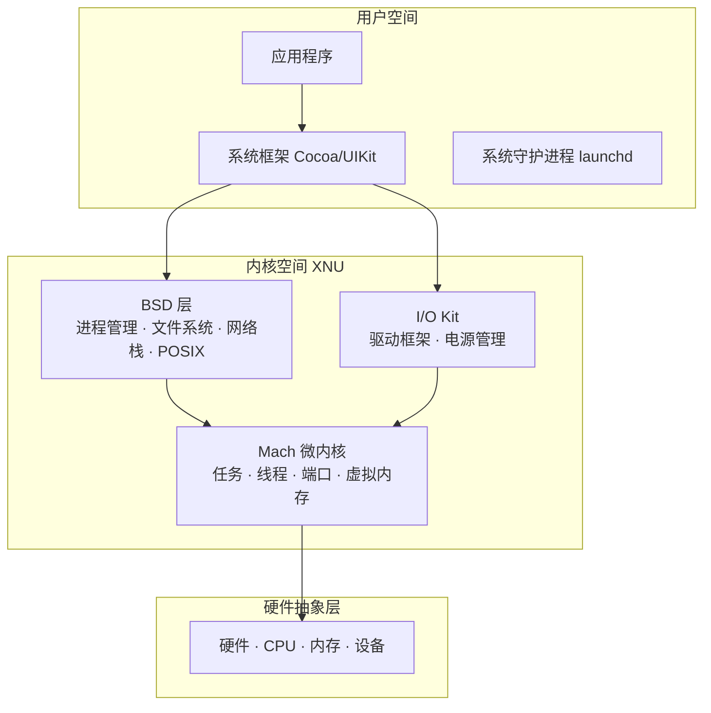
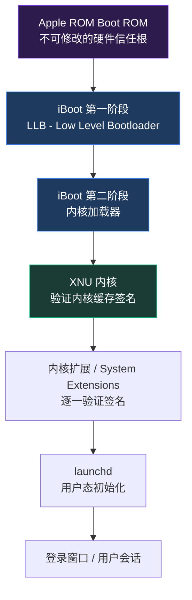
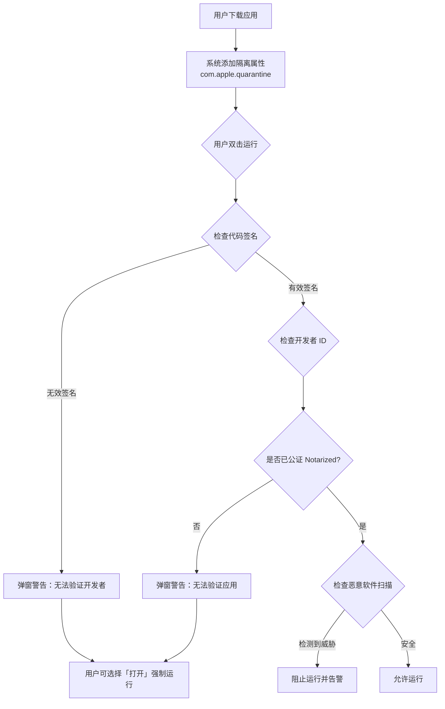
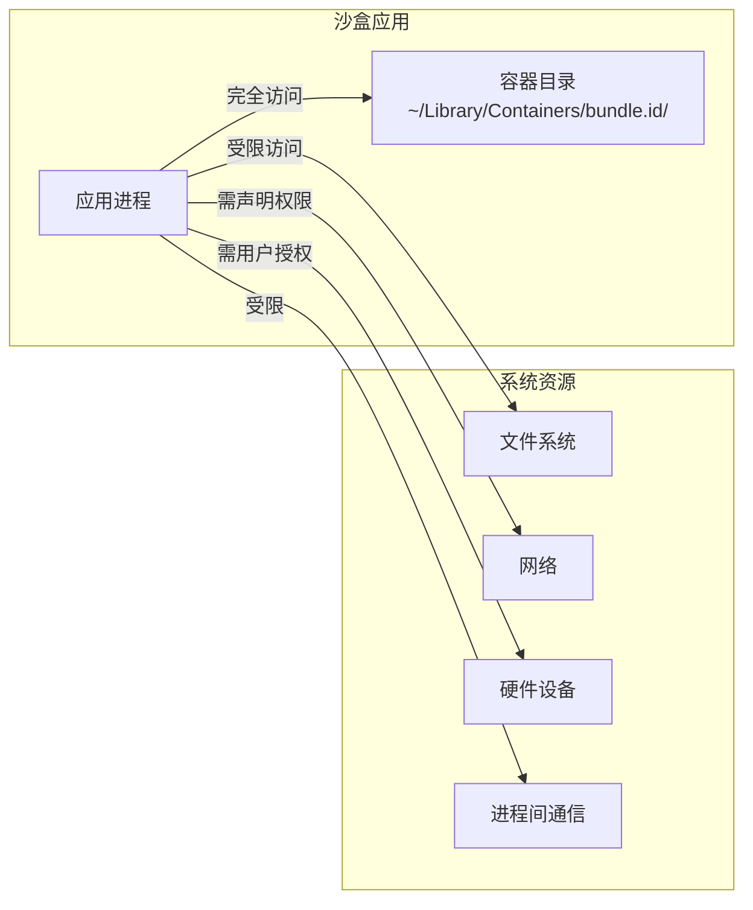
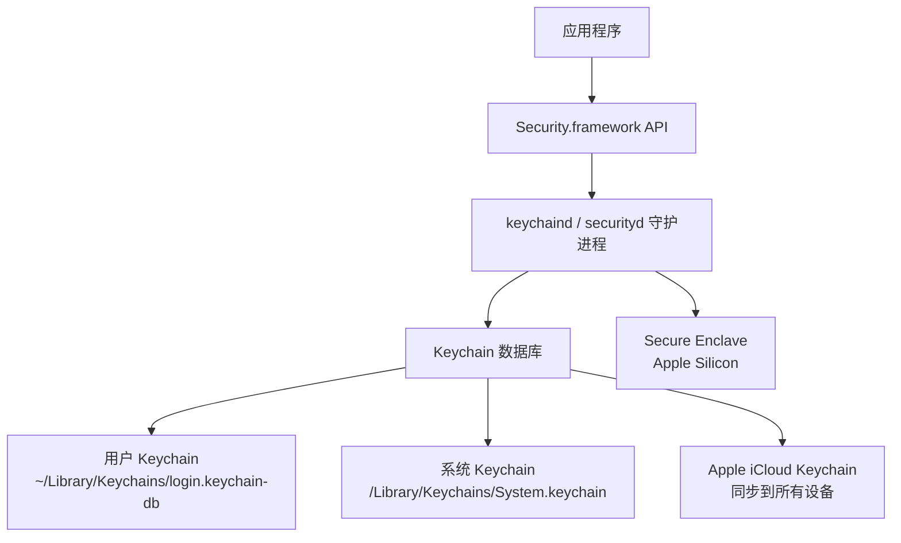
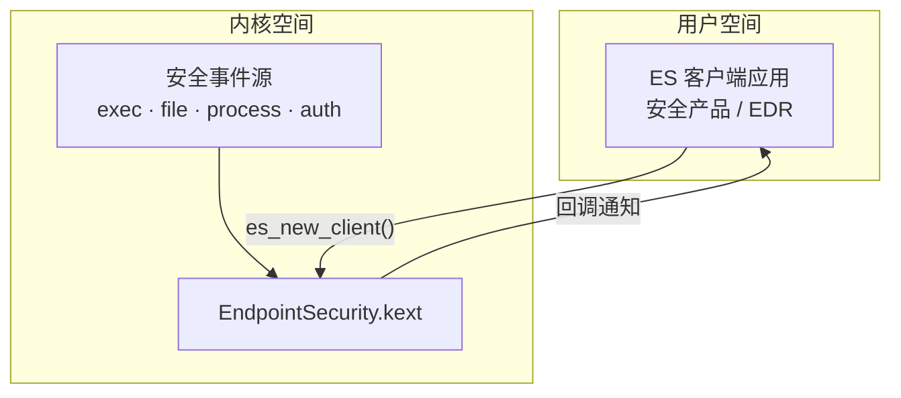

## 二、macOS系统架构

macOS 是一个融合了 Mach 微内核思想与 BSD Unix 传统的混合操作系统，同时叠加了 Apple 自主研发的多层安全机制。理解 macOS 的系统架构，是从安全视角进行渗透测试、漏洞挖掘和防御加固的基础。本章从内核层到应用层逐层剖析，覆盖每个关键组件的设计原理、安全特性和已知攻击面。

### 2.1 Darwin 与 XNU 内核架构

macOS 的底层是 Darwin——一个开源的 POSIX 兼容操作系统内核。Darwin 的核心是 XNU（X is Not Unix）内核，它不是一个纯粹的微内核，也不是传统的宏内核，而是一个精心设计的**混合内核（Hybrid Kernel）**，将 Mach 微内核的进程/内存管理能力与 BSD 层的文件系统、网络栈和 POSIX 接口合为一体。



这种混合架构的**安全含义**在于：攻击者可以分别从 BSD 层（利用 POSIX 接口的漏洞）和 Mach 层（利用端口/消息机制的漏洞）两条路径进入内核。

#### 2.1.1 Mach 微内核

Mach 是 XNU 中最底层的抽象，负责硬件之上的核心资源管理。理解 Mach 的原语（Primitives）是理解 macOS IPC 和权限模型的前提。

**核心原语详解**：

| 原语 | 英文 | 说明 | 安全含义 |
|------|------|------|----------|
| 任务 | Task | 进程的资源容器，持有地址空间和端口集合 | 任务间的端口隔离是 Mach 安全模型的基础 |
| 线程 | Thread | 任务内的执行单元，共享任务地址空间 | 线程劫持可绕过进程级权限检查 |
| 端口 | Port | 单向通信通道，每个端口有一个权限集 | 端口权限（send/receive/rights）是 macOS 权限控制的核心 |
| 消息 | Message | 通过端口传输的结构化数据 | 消息中的 OOL（Out-of-Line）数据可传递内存映射，是攻击面之一 |
| 主机端口 | Host Port | 用于系统级操作（重启、时钟等）的特权端口 | 获取 host_priv 端口等价于获取内核级特权 |
| 时钟 | Clock | 系统时钟服务 | 篡改时钟可影响安全策略的超时机制 |

**Mach 安全模型的核心机制**：

Mach 的安全控制基于端口命名空间（Port Namespace）。每个任务拥有一组端口权限（Port Rights），只有持有相应权限才能与端口通信：

```bash
# 查看进程的 Mach 端口信息（需要 task_for_pid 权限）
# 使用 lldb 调试器查看
lldb -n Finder
(lldb) image list                    # 加载的模块
(lldb) proc info                     # 进程信息
```

端口权限类型包括：

- **Send Right**：可以向端口发送消息
- **Receive Right**：可以从端口接收消息（每个端口只有一个接收者）
- **Send Once Right**：一次性发送权限，使用后自动销毁
- **Port Set Right**：将多个端口组合为端口集，统一接收
- **Dead Name**：端口已销毁后的残留引用

**从安全角度看 Mach**：

Mach 端口权限的管理存在已知的攻击面。2021 年由 Google Project Zero 披露的多个 XNU 漏洞（如 CVE-2021-30883）就涉及 Mach 消息处理中的内存损坏。攻击者通过构造特殊的 Mach 消息，可以实现内核代码执行。

```bash
# 检查 Mach 端口相关安全配置
# SIP 状态影响 mach_register / host_get_special_port 等调用
csrutil status

# 查看当前任务的特殊端口（如 bootstrap port、host port）
# 需要注入进程或使用调试器
```

#### 2.1.2 BSD 层

BSD 层运行在 Mach 之上，提供 Unix 兼容接口。它不是独立的内核，而是作为 Mach 的一个"客户"存在，共享同一个地址空间。

**BSD 层的核心职责**：

- **进程管理**：`fork()`、`exec()`、`wait()` 等 POSIX 进程接口
- **文件系统**：VFS（Virtual File System）抽象层，支持 HFS+、APFS、SMBFS 等
- **网络协议栈**：基于 BSD 的完整 TCP/IP 栈，包含 Socket API
- **POSIX 兼容**：信号、管道、共享内存等 IPC 机制

**BSD 安全特性**：

1. **Unix 权限模型**：标准的 UID/GID 权限体系，每个文件/目录拥有所有者、组和其他人的读/写/执行权限
2. **进程凭证（Process Credentials）**：每个进程持有 `kauth_cred` 结构，包含 UID、GID、组列表和 MAC 标签
3. **强制访问控制框架（MAC Framework）**：TrustedBSD 项目引入的灵活 MAC 框架，Apple 在此基础上实现了沙盒（Sandbox）和 AMFI（Apple Mobile File Integrity）

```bash
# 查看进程凭证
ps -eo pid,uid,gid,user,comm | head -20

# 查看进程的 MAC 标签（沙盒标签）
# 需要 root 权限
ps -eo pid,label,comm | head -20

# 沙盒标签示例：com.apple.Safari.xxx 表示 Safari 的沙盒域
```

**MAC Framework 的安全意义**：

MAC Framework 是 macOS 安全架构的基石。它在内核的关键决策点（文件访问、网络连接、进程创建等）插入钩子函数，允许安全策略模块拦截和拒绝操作。macOS 中三个主要的 MAC 策略模块：

- **Sandbox.kext**：实现 App Sandbox，限制应用的系统资源访问
- **AMFI.kext**：Apple Mobile File Integrity，强制执行代码签名和 entitlements
- **Quarantine.kext**：实现文件隔离（下载文件的来源追踪）

#### 2.1.3 I/O Kit 驱动框架

I/O Kit 是 macOS 独有的设备驱动框架，使用受限 C++（Embedded C++）编写，面向对象设计。

**I/O Kit 架构**：

| 层级 | 说明 | 示例 |
|------|------|------|
| 用户态客户端 | 应用通过 IOKit.framework 与驱动通信 | `IOServiceGetMatchingService()` |
| 用户态驱动（DriverKit） | macOS 10.15+ 引入的用户态驱动 | USB、串口、网络设备驱动 |
| 内核态驱动（kext） | 传统内核扩展，运行在内核空间 | 旧版第三方驱动 |
| Nub 层 | 设备树中的连接点 | PCI Nub、USB Nub |
| 硬件抽象层 | 直接操作硬件寄存器 | IORegistry 中的底层节点 |

**安全演变——从 kext 到 System Extension**：

macOS 从 10.15 Catalina 开始逐步弃用内核扩展（kext），将驱动迁移到用户态：

| 技术 | 运行空间 | macOS 版本 | 安全影响 |
|------|----------|------------|----------|
| kext（内核扩展） | 内核空间 | ≤ 10.15 | 内核级权限，漏洞影响极大 |
| System Extension | 用户空间 | 10.15+ | 受 SIP 保护，签名要求更严 |
| DriverKit | 用户空间 | 10.15+ | 驱动在用户态运行，崩溃不影响内核 |

```bash
# 查看已加载的内核扩展
kextstat | grep -v com.apple

# 查看已安装的 System Extensions
systemextensionsctl list

# macOS 12+ 也可以用
system_profiler SPExtensionsDataType
```

**I/O Registry 信息收集**：

I/O Registry 是 I/O Kit 的设备树数据库，安全研究者可以从中获取硬件和驱动信息：

```bash
# 查看完整的 I/O Registry 树
ioreg -l | head -100

# 查找特定设备
ioreg -l | grep -i "battery"

# 导出为 XML 格式分析
ioreg -a -l > /tmp/ioreg_dump.xml

# 查看特定驱动实例
ioreg -c IOBlockStorageDevice -w 0
```

### 2.2 启动安全链（Secure Boot Chain）

macOS 的安全始于开机时刻。从 Apple Silicon Mac（M1/M2/M3/M4）到 Intel Mac，启动安全链的实现有显著差异。

#### 2.2.1 Apple Silicon 启动流程



**启动安全策略（Startup Security Policy）**：

Apple Silicon Mac 有三种安全级别：

| 安全级别 | 说明 | 影响 |
|----------|------|------|
| Full Security | 默认，验证每个启动组件的签名 | 无法加载未签名内核扩展 |
| Reduced Security | 允许第三方 kext，降低安全级别 | 允许加载已批准的未签名 kext |
| Permissive Security | 最低安全级别，仅限开发用 | 允许任意代码，需在恢复模式设置 |

```bash
# 查看当前启动安全策略（Apple Silicon Mac）
bputil -d

# 查看安全启动状态
csrutil status

# 查看 SIP 详细配置
csrutil authenticated-root status
```

#### 2.2.2 Intel Mac 启动安全

Intel Mac 使用 T2 安全芯片（2018-2020 型号）或传统 EFI：

- **T2 芯片**：独立的安全处理器，管理 Secure Boot、加密存储（FileVault）、Touch ID 密钥
- **Secure Boot**：验证 EFI → Bootloader → Kernel 的每一步签名
- **External Boot**：可配置是否允许从外部介质启动

```bash
# Intel Mac: 检查 T2 安全启动配置
# 需要在恢复模式下操作
# 重启时按住 Cmd+R → 启动安全工具

# 检查是否支持 Secure Boot
system_profiler SPiBridgeDataType  # T2 芯片信息
```

### 2.3 系统完整性保护（SIP）

SIP（System Integrity Protection），也称为"rootless"，是 macOS 自 El Capitan（10.11）引入的强制访问控制机制。它的核心理念是：**即使是 root 用户，也不能修改操作系统的核心组件**。

#### 2.3.1 SIP 保护范围

| 受保护路径 | 保护内容 | 例外 |
|------------|----------|------|
| `/System` | 系统框架、核心库 | 无 |
| `/usr` | 系统工具、库文件 | `/usr/local`（留给 Homebrew 等） |
| `/sbin` | 系统管理命令 | 无 |
| `/bin` | 基础命令 | 无 |
| `/Applications`（预装） | Safari、Mail 等系统应用 | 第三方应用不受影响 |
| 内核扩展 | 未签名的 kext 不允许加载 | Apple 签名的 kext 正常加载 |

SIP 不仅保护文件路径，还施加以下运行时限制：

1. **禁止动态库注入**：即使 root 也无法使用 `DYLD_INSERT_LIBRARIES` 向受保护进程注入动态库
2. **限制 `task_for_pid`**：普通进程无法附加到受保护进程（调试器除外）
3. **禁止 DTrace 对系统进程的操作**：DTrace 无法追踪 Apple 签名的系统进程
4. **保护进程内存**：`mach_vm_write` 对受保护进程无效

#### 2.3.2 SIP 状态查看与管理

```bash
# 查看 SIP 状态
csrutil status
# 输出示例：System Integrity Protection status: enabled.

# 查看 SIP 的详细配置标志
# 需要编译 Apple 的 csrutil 源码或使用第三方工具
# 常见标志：
# CSR_ALLOW_UNTRUSTED_KEXTS      - 允许未签名内核扩展
# CSR_ALLOW_UNRESTRICTED_FS      - 允许不受限制的文件系统写入
# CSR_ALLOW_TASK_FOR_PID         - 允许 task_for_pid
# CSR_ALLOW_APPLE_INTERNAL       - 允许 Apple 内部工具
# CSR_ALLOW_UNRESTRICTED_NVRAM   - 允许不受限制的 NVRAM 访问
# CSR_ALLOW_UNAUTHENTICATED_ROOT - 允许未认证的根文件系统
```

#### 2.3.3 SIP 绕过技术

从安全研究角度，SIP 绕过是 macOS 权限提升的关键路径：

| 绕过方法 | 前提条件 | 风险等级 | 持久性 |
|----------|----------|----------|--------|
| 恢复模式禁用 | 物理访问 | 低（需物理接触） | 重启后生效 |
| 内核漏洞利用 | 远程代码执行 | 高（内核级） | 持久 |
| Apple 签名二进制滥用 | 发现可被利用的 Apple 签名工具 | 中 | 非持久 |
| Time Machine / ASR 利用 | 发现备份恢复流程漏洞 | 中 | 可持久 |
| `com.apple.rootless` 绕过 | 发现 SIP 标记处理缺陷 | 中 | 非持久 |

```bash
# 恢复模式禁用 SIP（物理访问场景）
# 1. 重启 Mac，按住 Cmd+R 进入恢复模式
# 2. 打开终端（菜单 → 实用工具 → 终端）
# 3. 执行：
csrutil disable
# 4. 重启

# 重新启用 SIP
csrutil enable

# 部分禁用（需要 authenticated root 的场景）
# Apple Silicon: 在启动安全工具中选择 Reduced Security
```

**真实案例——CVE-2021-30883 绕过 SIP**：

该漏洞存在于 IOKit 的 `IOHIDFamily` 中，攻击者通过构造特殊的 HID（人机接口设备）描述符触发内核内存损坏，获得内核读写能力后修改 SIP 保护的文件。Google Project Zero 的研究员 Ian Beer 利用此漏洞实现了从用户态到完全 SIP 绕过的完整链。

### 2.4 Gatekeeper 应用验证体系

Gatekeeper 是 macOS 的应用执行控制机制，确保用户不会运行未验证的恶意软件。

#### 2.4.1 完整验证流程



#### 2.4.2 公证（Notarization）机制

从 macOS 10.15 Catalina 开始，所有在 App Store 外分发的应用都必须经过 Apple 公证：

1. 开发者将应用提交到 Apple 的公证服务（`altool` 或 `notarytool`）
2. Apple 服务器对应用进行自动化恶意软件扫描
3. 扫描通过后，Apple 给应用附加公证票据（Notarization Ticket）
4. 应用首次运行时，系统通过 Stapling（装订）机制验证公证状态

```bash
# 检查应用的公证状态
spctl --assess --verbose --type execute /Applications/SomeApp.app
# 输出示例：
# /Applications/SomeApp.app: accepted
# source=Notarized Developer ID

# 查看隔离属性
xattr -l /Applications/SomeApp.app
# com.apple.quarantine: 0081;60a1b2c3;Chrome;xxxx-xxxx-xxxx

# 移除隔离属性（需要确认用户意图）
xattr -d com.apple.quarantine /Applications/SomeApp.app

# 查看应用签名详情
codesign -dvvv /Applications/SomeApp.app

# 验证签名是否完整
codesign --verify --deep --strict /Applications/SomeApp.app
```

#### 2.4.3 Gatekeeper 安全级别

```bash
# 查看当前 Gatekeeper 设置
spctl --status
# assessments enabled    → 正常模式
# assessments disabled   → Gatekeeper 已禁用

# 禁用 Gatekeeper（macOS 10.12+）
sudo spctl --master-disable
# 此时「系统偏好设置 → 安全性」中会出现「任何来源」选项

# 重新启用
sudo spctl --master-enable

# macOS Sequoia (15)+ 中，Apple 进一步收紧了 Gatekeeper
# 右键「打开」不再绕过，必须通过系统设置手动批准
```

#### 2.4.4 Gatekeeper 绕过技术

| 技术 | 原理 | macOS 版本影响 |
|------|------|----------------|
| 移除隔离属性 | `xattr -d` 移除 com.apple.quarantine | 所有版本（需要 root 或文件所有者权限） |
| 利用已签名加载器 | 使用合法签名的二进制加载未签名代码 | 需要找到可利用的已签名二进制 |
| 重打包签名应用 | 将恶意载荷注入已签名应用包 | AMFI 会检查 bundle 完整性 |
| 利用合法开发者证书 | 用被盗证书签名恶意软件 | 公证机制可检测已知恶意软件 |
| dylib 侧加载 | 向已签名应用注入 dylib | 受 SIP 和 AMFI 保护 |

### 2.5 代码签名与 AMFI

#### 2.5.1 代码签名体系

macOS 要求所有可执行代码必须经过签名，这是整个安全体系的基石。

**签名类型对比**：

| 签名类型 | 用途 | 证书来源 | 限制 |
|----------|------|----------|------|
| Ad-hoc 签名 | 本地开发测试 | 无需证书 | 不能在其他机器运行 |
| Apple Development | 开发阶段 | Apple Developer 账号 | 仅限开发设备 |
| Developer ID Application | App Store 外分发 | Apple Developer 账号 | 需要公证 |
| Mac App Store | App Store 分发 | Apple 自动签名 | 严格审核 |
| Apple 签名 | 系统组件 | Apple 根证书 | 最高信任级别 |

```bash
# 查看二进制签名信息
codesign -dvvv /usr/bin/ls
# 输出包含：
# Authority=Apple Root CA          ← 证书链根
# Authority=Apple Code Signing...  ← 中间证书
# Authority=Apple OS X...          ← 签名证书
# Identifier=com.apple.ls          ← 标识符
# TeamIdentifier=Apple             ← 团队标识
# Seal length=...                  ← 签名密封长度

# 查看签名中的 entitlements
codesign -d --entitlements - /Applications/Safari.app
# 输出 XML 格式的权限声明

# 验证签名完整性
codesign --verify --deep --strict --verbose=2 /Applications/Safari.app

# 查看系统签名策略
security default-keychain
```

#### 2.5.2 AMFI（Apple Mobile File Integrity）

AMFI 是 macOS 的代码完整性强制执行模块，它是一个 MAC Framework 策略模块，在以下场景进行拦截：

1. **`exec()` 调用时**：验证目标二进制的签名是否有效
2. **动态库加载时**：检查 dylib 的签名和加载权限
3. **Entitlements 验证**：确认进程的权限声明合法
4. **绕过检测**：监控越狱标志和可疑行为

**AMFI 与 Entitlements**：

Entitlements 是嵌入在签名中的 XML 属性列表，声明应用需要的权限：

```xml
<!-- 常见 Entitlements 示例 -->
<?xml version="1.0" encoding="UTF-8"?>
<!DOCTYPE plist PUBLIC "-//Apple//DTD PLIST 1.0//EN" "...">
<plist version="1.0">
<dict>
    <!-- 网络客户端权限 -->
    <key>com.apple.security.network.client</key>
    <true/>
    <!-- 文件读取权限（用户选择的文件） -->
    <key>com.apple.security.files.user-selected.read-only</key>
    <true/>
    <!-- 禁止沙盒（仅限系统应用） -->
    <key>com.apple.security.app-sandbox</key>
    <false/>
</dict>
</plist>
```

```bash
# 查看应用的 entitlements
codesign -d --entitlements - /Applications/Telegram.app

# 使用 ldid 或 jtool2 查看 entitlements（安全研究工具）
# pip install jtool2  或从 GitHub 获取

# 查看进程运行时的 entitlements
codesign -d --entitlements - --pid $(pgrep Finder)
```

#### 2.5.3 代码签名绕过研究

```bash
# 1. 重签名攻击（对第三方应用）
# 创建新的 ad-hoc 签名替换原有签名
codesign --force --sign - /path/to/Target.app

# 2. 查找可滥用的已签名二进制
# 搜索具有特殊 entitlements 的 Apple 签名二进制
find /usr/bin /usr/sbin /usr/libexec -perm +111 -type f | while read f; do
    codesign -d --entitlements - "$f" 2>/dev/null | grep -q "task_for_pid" && echo "$f"
done

# 3. 检查 dylib 搜索顺序劫持
# 如果应用的 @rpath 或 LC_LOAD_DYLIB 指向可写路径
otool -L /path/to/target.app/Contents/MacOS/target

# 4. 检查 Hardened Runtime 状态
codesign -d --entitlements - /path/to/app.app | grep "runtime"
# 存在 com.apple.security.cs.allow-unsigned-executable-memory
# 表示允许未签名可执行内存（JIT 等场景）
```

### 2.6 沙盒机制（App Sandbox）

#### 2.6.1 App Sandbox 架构

App Sandbox 是 macOS 的应用隔离机制，基于 TrustedBSD MAC Framework 的 Sandbox 策略模块实现。



**容器目录结构**：

```text
~/Library/Containers/com.example.app/
├── Data/
│   ├── Documents/     ← 用户可见的文档
│   ├── Library/       ← 应用私有数据
│   ├── Containers/    ← 子容器（如果有）
│   └── tmp/           ← 临时文件
└── .com.example.app.plist  ← 沙盒元数据
```

#### 2.6.2 沙盒配置文件详解

沙盒策略使用 Scheme 语言编写（基于 Apple 的 Apple Sandbox Profile Language）：

```scheme
;; 完整沙盒配置示例
(version 1)
(deny default)  ;; 默认拒绝所有操作

;; === 文件系统访问 ===
;; 允许读取应用容器
(allow file-read*
    (subpath (param "_HOME"))
    (subpath "/System/Library/Frameworks")
    (subpath "/usr/lib"))

;; 允许写入容器目录
(allow file-write*
    (subpath (param "_HOME/Library/Containers/com.example.app")))

;; === 网络访问 ===
;; 允许出站连接（HTTP/HTTPS）
(allow network-outbound
    (remote tcp "*:80")
    (remote tcp "*:443"))

;; 禁止监听端口（除非声明网络服务器权限）
(deny network-inbound)

;; === 进程执行 ===
;; 允许执行系统工具
(allow process-exec
    (literal "/usr/bin/defaults")
    (regex "^/usr/bin/"))

;; === Mach 服务 ===
;; 允许访问特定系统 Mach 服务
(allow mach-lookup
    (global-name "com.apple.cfprefsd.daemon")
    (global-name "com.apple.dock.server"))

;; === 系统调用过滤 ===
;; 禁止 ptrace（调试）
(deny process-info*)
```

**常见沙盒逃逸技术**：

| 技术 | 原理 | 可行性 |
|------|------|--------|
| XPC 消息劫持 | 利用有特权的 XPC 服务 | 高（如果目标服务未正确验证来源） |
| 文件引用描述符 | 利用 `NSFilePresenter` 获取额外文件访问 | 中 |
| 符号链接穿越 | 利用 TOCTOU（检查/使用时间差） | 中（现代版本已加固） |
| 沙盒配置弱点 | 利用过于宽松的沙盒规则 | 高（开发者常见错误） |
| `com.apple.security.temporary-exception` | 开发者声明的临时例外 | 低（Apple 审核会限制） |

#### 2.6.3 XPC 服务安全

XPC（跨进程通信）是 macOS 上最主要的 IPC 机制，替代了传统的 Mach 端口直接通信：

```bash
# 列出系统 XPC 服务
ls /System/Library/XPCServices/
ls /Applications/Safari.app/Contents/XPCServices/

# 使用 launchctl 查看 XPC 服务
launchctl list | grep -i xpc

# 使用 Objective-C 运行时查看 XPC 接口
# 安全研究中常用 class-dump 工具
# brew install class-dump
class-dump /Applications/SomeApp.app/Contents/MacOS/SomeApp
```

**XPC 安全检查清单**：

1. XPC 服务是否验证连接者身份（`xpc_connection_get_audit_token`）
2. XPC 服务是否验证连接者的代码签名（`SecCodeCheckValidity`）
3. XPC 消息类型是否经过严格验证（`xpc_dictionary_get_type` 检查）
4. XPC 服务是否有沙盒限制

### 2.7 TCC（透明、同意和控制）

TCC 是 macOS 的隐私保护框架，管理应用对敏感资源的访问。它是 macOS 安全中最常被用户感知的部分。

#### 2.7.1 TCC 保护的资源完整列表

| 资源类型 | TCC 键名 | 数据库位置 | 授权粒度 |
|----------|----------|------------|----------|
| 摄像头 | kTCCServiceCamera | TCC.db | 每应用 |
| 麦克风 | kTCCServiceMicrophone | TCC.db | 每应用 |
| 位置服务 | kTCCServiceLocation | TCC.db | 每应用/每次使用 |
| 通讯录 | kTCCServiceAddressBook | TCC.db | 每应用 |
| 日历 | kTCCServiceCalendar | TCC.db | 每应用 |
| 提醒事项 | kTCCServiceReminders | TCC.db | 每应用 |
| 照片库 | kTCCServicePhotos | TCC.db | 每应用 |
| 辅助功能 | kTCCServiceAccessibility | TCC.db | 每应用 |
| 自动化 | kTCCServiceAppleEvents | TCC.db | 每应用对 |
| 完全磁盘访问 | kTCCServiceSystemPolicyAllFiles | TCC.db | 每应用 |
| 输入监听 | kTCCServiceListenEvent | TCC.db | 每应用 |
| 屏幕录制 | kTCCServiceScreenCapture | TCC.db | 每应用 |
| 运动与健身 | kTCCServiceMotion | TCC.db | 每应用 |
| 焦点 | kTCCServiceFocusStatus | TCC.db | 每应用 |
| 用户通知 | kTCCServiceUserNotification | TCC.db | 每应用 |

#### 2.7.2 TCC 数据库结构

```bash
# TCC 数据库位置（每个用户独立）
ls ~/Library/Application\ Support/com.apple.TCC/TCC.db

# 系统级 TCC 数据库（需要 root + SIP 关闭或 Full Disk Access）
ls /Library/Application\ Support/com.apple.TCC/TCC.db

# 查询 TCC 数据库
sqlite3 ~/Library/Application\ Support/com.apple.TCC/TCC.db \
    "SELECT client, auth_value, auth_reason FROM access WHERE service='kTCCServiceCamera';"
# auth_value: 0=未决定, 1=拒绝, 2=允许
# auth_reason: 1=用户明确操作, 2=系统默认, 3=管理员
```

#### 2.7.3 TCC 绕过技术

TCC 绕过是 macOS 攻击中最受关注的领域之一：

**1. 目录服务攻击**：

macOS 的 TCC 数据库使用应用的 bundle identifier 作为标识。如果攻击者能控制一个 bundle identifier 相同的应用（如通过替换应用），就能继承原有的 TCC 权限。

**2. `com.apple.TCC.db` 的 `allow` 条目伪造**：

```bash
# macOS 11+ 中，TCC 数据库使用系统完整性保护
# 但通过以下方式仍可能修改：
# 1. 获得 Full Disk Access 的进程可以修改 TCC.db
# 2. MDM 配置文件可以远程授予 TCC 权限
# 3. 恢复模式下可以修改

# 使用 tccutil 命令行工具（仅限重置）
tccutil reset Camera           # 重置所有应用的摄像头权限
tccutil reset All com.app.id   # 重置特定应用的所有权限
```

**3. 利用有 TCC 权限的应用**：

```bash
# 查找拥有 Full Disk Access 的应用
sqlite3 /Library/Application\ Support/com.apple.TCC/TCC.db \
    "SELECT client FROM access WHERE service='kTCCServiceSystemPolicyAllFiles' AND auth_value=2;"

# 查找拥有辅助功能权限的应用
sqlite3 ~/Library/Application\ Support/com.apple.TCC/TCC.db \
    "SELECT client FROM access WHERE service='kTCCServiceAccessibility' AND auth_value=2;"
```

**真实案例——CVE-2020-9934（TCC 绕过）**：

该漏洞利用了 macOS 的符号链接处理缺陷。攻击者在受保护目录（如 `~/Documents`）创建一个符号链接指向 TCC 数据库，然后利用有文档访问权限的应用通过该链接修改 TCC 记录，绕过隐私保护。

### 2.8 FileVault 与数据保护

#### 2.8.1 FileVault 2 全盘加密

FileVault 2 使用 XTS-AES-128 加密方案对整个启动卷进行加密：

| 组件 | 说明 |
|------|------|
| 加密算法 | XTS-AES-128（密钥长度 256 位） |
| 主密钥（Volume Master Key） | 随机生成，存储在卷头中，被 KEK 保护 |
| 密钥加密密钥（KEK） | 从用户密码派生，使用 PBKDF2 |
| iCloud 恢复密钥 | 可选，存储在 Apple 服务器 |
| 个人恢复密钥（PRK） | 48 位数字密钥，用于密码丢失时恢复 |

```bash
# 查看 FileVault 状态
fdesetup status
# FileVault is On.    → 已启用
# FileVault is Off.   → 未启用

# 查看加密进度
diskutil apfs list | grep -A5 "Encryption"

# 查看 FileVault 授权用户
fdesetup list

# 通过 MDM 或命令行启用 FileVault
sudo fdesetup enable -user username
# 输出包含恢复密钥，务必记录

# 添加恢复密钥到系统密钥链（企业场景）
sudo fdesetup changerecovery -personal
```

#### 2.8.2 APFS 加密特性

Apple File System（APFS）是 macOS 10.13+ 的默认文件系统，支持以下加密模式：

- **无加密**：不加密
- **单密钥加密**：整个卷使用同一密钥
- **多密钥加密**：每个文件使用独立密钥（Class Keys）

```bash
# 查看 APFS 容器信息
diskutil apfs list

# 查看卷的加密状态
diskutil apfs list | grep -A20 "Encryption"
```

### 2.9 Keychain 密钥链系统

#### 2.9.1 Keychain 架构

Keychain 是 macOS 的安全存储系统，管理密码、证书、密钥等敏感数据。



**Keychain 访问控制**：

每个 Keychain 条目都有独立的访问控制列表（ACL），指定哪些应用可以访问：

```bash
# 查看 Keychain 内容（不显示密码）
security find-generic-password -s "example.com"
security find-internet-password -s "example.com"

# 查看所有 Keychain 文件
security list-keychains

# 查看默认 Keychain
security default-keychain

# 导出证书（不含私钥）
security export -k ~/Library/Keychains/login.keychain-db -t certs -f pkcs12 -o certs.p12

# 查看 Keychain 中的密码（需要授权）
security find-generic-password -ws "service_name" "account_name"
# 只在 Keychain Access UI 授权后返回明文
```

#### 2.9.2 Keychain 安全特性

| 特性 | 说明 |
|------|------|
| PBKDF2 密钥派生 | 从用户密码派生加密密钥，迭代次数足够大 |
| 三重密钥加密 | 数据加密密钥（DEK）+ 密钥加密密钥（KEK）+ 主密钥 |
| ACL 访问控制 | 每条记录可配置允许哪些应用访问 |
| Secure Enclave 集成 | Apple Silicon Mac 上，密钥操作在安全隔区完成 |
| iCloud Keychain 同步 | 端到端加密同步到所有 Apple 设备 |

#### 2.9.3 Keychain 攻击面

```bash
# 1. 内存中提取密钥
# 运行时密钥可能在进程内存中，使用 lldb 附加调试
lldb -p $(pgrep Safari)
(lldb) memory search --string "password"

# 2. 提取 Keychain 数据库文件
# login.keychain-db 是 SQLite 格式，但数据部分加密
cp ~/Library/Keychains/login.keychain-db /tmp/kc_backup.db

# 3. 使用 keychaindump 工具（需要 root）
# 从内存中提取 Keychain 主密钥
# GitHub: https://github.com/juuso/keychaindump

# 4. 分析 Keychain 访问控制
security dump-keychain -a ~/Library/Keychains/login.keychain-db
# 显示每条记录的 ACL 和允许访问的应用列表
```

### 2.10 进程管理与 launchd

#### 2.10.1 launchd 体系

launchd 是 macOS 的 PID 1 进程（init 替代品），负责系统初始化和进程管理。

| 类型 | 配置路径 | 运行身份 | 用途 |
|------|----------|----------|------|
| LaunchDaemon | `/Library/LaunchDaemons/` | root | 系统级服务 |
| LaunchAgent (System) | `/Library/LaunchAgents/` | 当前用户 | 系统级用户代理 |
| LaunchAgent (User) | `~/Library/LaunchAgents/` | 当前用户 | 用户级代理 |

```bash
# 查看所有已加载的 launchd 服务
launchctl list

# 查看特定服务状态
launchctl list | grep com.apple

# 查看服务的详细信息
launchctl print system/com.apple.some.service

# 加载/卸载服务
launchctl load /Library/LaunchDaemons/com.example.daemon.plist
launchctl unload /Library/LaunchDaemons/com.example.daemon.plist

# macOS 11+ 推荐使用 bootout/bootstrap
launchctl bootout system/com.example.daemon
launchctl bootstrap system /Library/LaunchDaemons/com.example.daemon.plist
```

**LaunchDaemon plist 安全属性**：

```xml
<?xml version="1.0" encoding="UTF-8"?>
<!DOCTYPE plist PUBLIC "-//Apple//DTD PLIST 1.0//EN" "...">
<plist version="1.0">
<dict>
    <key>Label</key>
    <string>com.example.daemon</string>
    <key>ProgramArguments</key>
    <array>
        <string>/usr/local/bin/my-daemon</string>
        <string>--config</string>
        <string>/etc/my-daemon.conf</string>
    </array>
    <key>RunAtLoad</key>
    <true/>
    <key>KeepAlive</key>
    <true/>
    <!-- 安全相关属性 -->
    <key>UserName</key>
    <string>nobody</string>          <!-- 非 root 运行 -->
    <key>SandboxProfile</key>
    <string>my-sandbox.sb</string>   <!-- 沙盒限制 -->
    <key>EnvironmentVariables</key>
    <dict>
        <key>PATH</key>
        <string>/usr/bin:/bin</string> <!-- 限制 PATH 防止劫持 -->
    </dict>
</dict>
</plist>
```

#### 2.10.2 launchd 持久化攻击

LaunchDaemon/LaunchAgent 是 macOS 上最常见的持久化机制：

```bash
# 攻击者常用位置检查
# 1. 系统级 LaunchDaemon（需要 root）
ls -la /Library/LaunchDaemons/

# 2. 用户级 LaunchAgent
ls -la ~/Library/LaunchAgents/

# 3. 系统级 LaunchAgent
ls -la /Library/LaunchAgents/

# 4. 检查 plist 指向的二进制是否有效签名
for plist in /Library/LaunchDaemons/*.plist; do
    bin=$(/usr/libexec/PlistBuddy -c "Print ProgramArguments:0" "$plist" 2>/dev/null)
    [ -n "$bin" ] && codesign --verify "$bin" 2>&1 | grep -v "valid on disk" && echo "SUSPICIOUS: $plist -> $bin"
done

# 5. 使用 Emond（Event Monitor Daemon）持久化
# emond 是 macOS 的事件监控守护进程，可配置触发规则
ls -la /private/var/db/emondClients/
```

### 2.11 网络安全机制

#### 2.11.1 应用防火墙

macOS 的应用防火墙（Application Firewall）工作在应用层，基于应用路径控制入站连接：

```bash
# 查看防火墙全局状态
sudo /usr/libexec/ApplicationFirewall/socketfilterfw --getglobalstate

# 启用防火墙
sudo /usr/libexec/ApplicationFirewall/socketfilterfw --setglobalstate on

# 查看隐身模式状态
sudo /usr/libexec/ApplicationFirewall/socketfilterfw --getstealthmode

# 启用隐身模式（不响应 ping 和端口扫描）
sudo /usr/libexec/ApplicationFirewall/socketfilterfw --setstealthmode on

# 列出防火墙规则
sudo /usr/libexec/ApplicationFirewall/socketfilterfw --listapps

# 添加应用到防火墙
sudo /usr/libexec/ApplicationFirewall/socketfilterfw --add /Applications/SomeApp.app

# 阻止应用入站连接
sudo /usr/libexec/ApplicationFirewall/socketfilterfw --block /Applications/SomeApp.app

# 允许签名应用自动接收连接
sudo /usr/libexec/ApplicationFirewall/socketfilterfw --setallowsigned on

# 允许已下载签名应用自动接收连接
sudo /usr/libexec/ApplicationFirewall/socketfilterfw --setallowsignedapp on
```

#### 2.11.2 pf 包过滤防火墙

macOS 继承了 BSD 的 pf（Packet Filter）防火墙，提供内核级的包过滤能力：

```bash
# 查看 pf 状态
sudo pfctl -s info

# 加载 pf 规则
sudo pfctl -f /etc/pf.conf

# 启用/禁用 pf
sudo pfctl -e    # 启用
sudo pfctl -d    # 禁用

# 查看当前规则
sudo pfctl -s rules

# 查看 pf 状态表（活跃连接）
sudo pfctl -s state

# 统计信息
sudo pfctl -s info -v
```

**pf 规则编写示例**：

```bash
# /etc/pf.conf 示例配置

# 宏定义
ext_if = "en0"
allowed_tcp = "{ 22, 80, 443 }"

# 选项
set block-policy drop
set skip on lo0

# 规则
block in all                                    # 默认阻止所有入站
pass out all keep state                         # 允许所有出站并跟踪状态
pass in on $ext_if proto tcp to port $allowed_tcp  # 允许指定端口入站
block in quick from no-route to any             # 阻止无效路由的包
block in quick from any to 255.255.255.255      # 阻止广播

# 反欺骗规则
block in quick on $ext_if from 10.0.0.0/8 to any
block in quick on $ext_if from 172.16.0.0/12 to any
block in quick on $ext_if from 192.168.0.0/16 to any
```

### 2.12 Endpoint Security Framework

Endpoint Security（ES）是 macOS 10.15+ 引入的系统安全监控框架，取代了已弃用的 Kernel Authorization（Kauth）接口。

#### 2.12.1 ES 架构



**ES 监控的事件类型**：

| 类别 | 关键事件 | 用途 |
|------|----------|------|
| 认证事件 | `ES_EVENT_TYPE_AUTH_EXEC` | 拦截进程创建 |
| 认证事件 | `ES_EVENT_TYPE_AUTH_OPEN` | 拦截文件打开 |
| 通知事件 | `ES_EVENT_TYPE_NOTIFY_EXEC` | 监控进程创建 |
| 通知事件 | `ES_EVENT_TYPE_NOTIFY_FORK` | 监控进程派生 |
| 通知事件 | `ES_EVENT_TYPE_NOTIFY_EXIT` | 监控进程退出 |
| 文件事件 | `ES_EVENT_TYPE_NOTIFY_CREATE` | 监控文件创建 |
| 文件事件 | `ES_EVENT_TYPE_NOTIFY_RENAME` | 监控文件重命名 |
| 文件事件 | `ES_EVENT_TYPE_NOTIFY_UNLINK` | 监控文件删除 |
| 网络事件 | `ES_EVENT_TYPE_NOTIFY_CONNECT` | 监控出站连接 |

```bash
# 检查系统中注册的 ES 客户端
# 需要 root 权限
esctl --list-clients

# 查看 ES 事件统计
esctl --stats
```

#### 2.12.2 安全研究中的 ES 绕过

ES 客户端运行在用户空间，但拥有强大的内核级信息获取能力。绕过 ES 的常见思路：

1. **杀死 ES 客户端进程**：如果 ES 客户端没有自我保护，直接终止其进程
2. **卸载 ES 客户端**：使用 `systemextensionsctl` 卸载
3. **利用 ES 的认证超时**：ES 认证事件有超时机制，超时后默认允许
4. **内核漏洞**：直接修改内核中的 ES 钩子

### 2.13 macOS 安全全景总览

将所有安全机制按层级整合：

| 层级 | 安全机制 | 防护目标 | 绕过难度 |
|------|----------|----------|----------|
| 硬件层 | Secure Enclave、T2/M系列芯片 | 密钥存储、安全启动 | 极高 |
| 引导层 | Secure Boot、iBoot | 启动链完整性 | 高 |
| 内核层 | SIP、MAC Framework、AMFI | 内核完整性、代码签名 | 高 |
| 驱动层 | kext 签名、System Extension | 驱动安全 | 中 |
| 进程层 | Sandbox、Entitlements | 进程隔离 | 中 |
| 用户层 | TCC、Gatekeeper | 隐私保护、应用验证 | 中 |
| 数据层 | FileVault、Keychain | 数据加密、密钥管理 | 高 |
| 网络层 | 应用防火墙、pf、TLS | 网络通信安全 | 中 |
| 监控层 | Endpoint Security、XProtect | 威胁检测 | 中 |

### 2.14 macOS 安全审计实战

#### 2.14.1 系统安全基线检查脚本

```bash
#!/bin/bash
# macOS 安全审计脚本（安全研究用）

echo "=== macOS Security Audit ==="
echo "Date: $(date)"
echo "Hostname: $(hostname)"
echo "macOS Version: $(sw_vers -productVersion)"
echo "Build: $(sw_vers -buildVersion)"
echo ""

echo "=== SIP Status ==="
csrutil status
echo ""

echo "=== Gatekeeper Status ==="
spctl --status 2>/dev/null
echo ""

echo "=== FileVault Status ==="
fdesetup status
echo ""

echo "=== Firewall Status ==="
sudo /usr/libexec/ApplicationFirewall/socketfilterfw --getglobalstate 2>/dev/null
echo ""

echo "=== Loaded Kernel Extensions ==="
kextstat | grep -v com.apple | tail -n +2
echo ""

echo "=== System Extensions ==="
systemextensionsctl list 2>/dev/null
echo ""

echo "=== LaunchDaemons (non-Apple) ==="
for plist in /Library/LaunchDaemons/*.plist; do
    label=$(/usr/libexec/PlistBuddy -c "Print Label" "$plist" 2>/dev/null)
    echo "$label" | grep -qv "com.apple" && echo "  $plist -> $label"
done
echo ""

echo "=== LaunchAgents (non-Apple) ==="
for plist in /Library/LaunchAgents/*.plist ~/Library/LaunchAgents/*.plist; do
    [ -f "$plist" ] || continue
    label=$(/usr/libexec/PlistBuddy -c "Print Label" "$plist" 2>/dev/null)
    echo "$label" | grep -qv "com.apple" && echo "  $plist -> $label"
done
echo ""

echo "=== Network Connections ==="
lsof -i -n -P | grep ESTABLISHED | head -20
echo ""

echo "=== Listening Ports ==="
lsof -i -n -P | grep LISTEN
echo ""

echo "=== TCC Database Entries (User) ==="
sqlite3 ~/Library/Application\ Support/com.apple.TCC/TCC.db \
    "SELECT service, client, auth_value FROM access WHERE auth_value=2;" 2>/dev/null
echo ""

echo "=== Audit Complete ==="
```

#### 2.14.2 安全研究常用工具

| 工具 | 用途 | 安装方式 |
|------|------|----------|
| Hopper Disassembler | 反汇编和逆向工程 | 商业软件 |
| Ghidra | 开源逆向工程框架 | `brew install ghidra` |
| class-dump | 导出 Objective-C 头文件 | `brew install class-dump` |
| MachOView | Mach-O 二进制查看器 | GitHub 下载 |
| Frida | 动态插桩框架 | `pip install frida-tools` |
| LLDB | 内置调试器 | 系统自带 |
| DTrace | 动态追踪 | 系统自带（受限于 SIP） |
| dnSpy/.NET Reflector | .NET 程序分析 | Windows 工具，可分析 .NET for Mac |

### 2.15 macOS 版本安全特性演变

| 版本 | 代号 | 关键安全特性 |
|------|------|-------------|
| 10.11 | El Capitan | SIP（系统完整性保护）引入 |
| 10.12 | Sierra | Siri 引入，Gatekeeper 增强 |
| 10.13 | High Sierra | APFS 默认，Secure Kernel Extension Loading |
| 10.14 | Mojave | TCC 加强，相机/麦克风需授权，全屏截屏需授权 |
| 10.15 | Catalina | System Extension 取代 kext，Endpoint Security 引入，只读系统卷 |
| 11 | Big Sur | Apple Silicon 支持，Signed System Volume（SSV） |
| 12 | Monterey | 快捷指令安全增强，Passkeys 引入 |
| 13 | Ventura | Passkeys 默认，Lockdown Mode |
| 14 | Sonoma | Safari 隐私增强，密码共享 |
| 15 | Sequoia | Apple Intelligence，iPhone Mirroring，Gatekeeper 进一步收紧 |

### 2.16 常见误区与纠正

| 误区 | 纠正 |
|------|------|
| "macOS 不需要杀毒软件" | macOS 有 XProtect 但不等于免疫，macOS 恶意软件持续增长（Silver Sparrow、Shlayer 等） |
| "关闭 SIP 不影响安全" | SIP 是多层防御的关键一环，禁用后 root 可任意修改系统文件 |
| "应用商店应用绝对安全" | App Store 审核不完美，已有多起恶意应用通过审核的案例 |
| "FileVault 启用后数据绝对安全" | 运行中的系统已解密数据可被访问，冷启动攻击也需要考虑 |
| "防火墙阻止所有入站就安全了" | 应用防火墙不控制出站流量，恶意软件可以正常外联 |
| "Gatekeeper 公证可以检测所有恶意软件" | 公证是自动化扫描，高级恶意软件可以绕过 |

### 2.17 总结

macOS 的安全架构是一个多层次的纵深防御体系，从硬件信任根（Secure Enclave）到应用层隐私控制（TCC），每一层都承担不同的安全职责。对于安全研究者来说：

- **攻击面最大的区域**：XPC 服务、TCC 权限、Sandbox 配置、launchd 持久化
- **最难突破的层**：Secure Boot Chain、SIP 内核保护、FileVault 加密
- **持续演进的方向**：kext → System Extension、Kauth → Endpoint Security、越来越多的操作需要用户明确授权
- **核心方法论**：理解每一层的边界和交互，寻找层与层之间的逻辑漏洞，而非单纯的技术绕过

在实际的安全评估中，建议从信息收集开始（本章的命令和脚本），逐步建立对目标系统安全态势的全面理解，再有针对性地进行深入测试。
