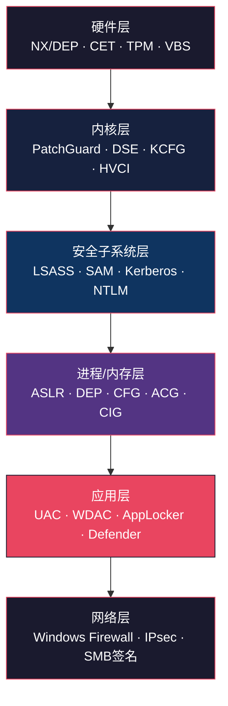
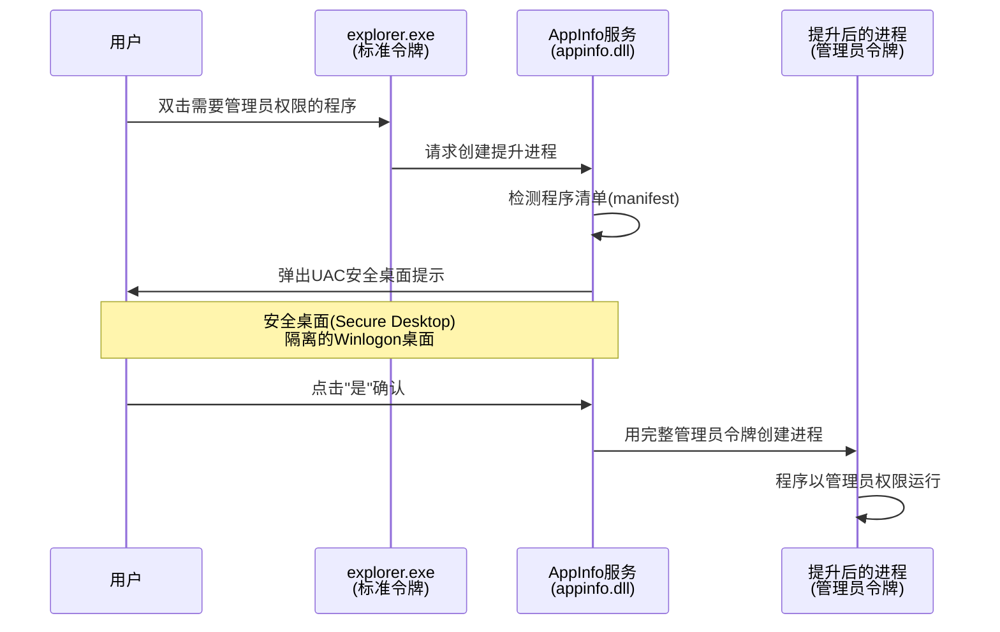
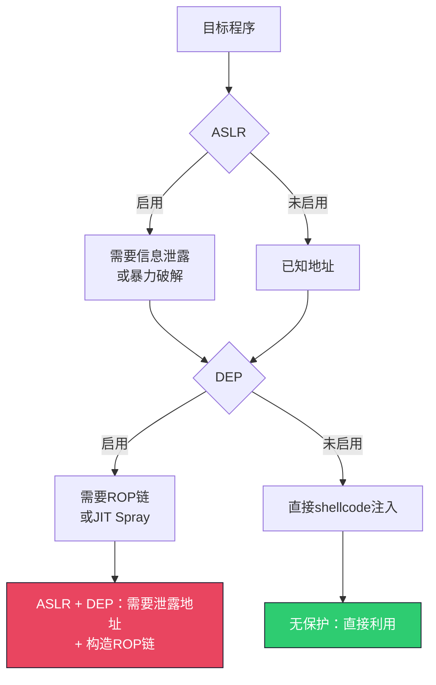
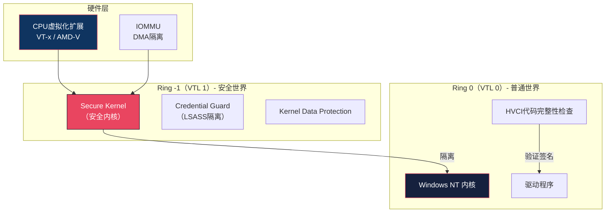
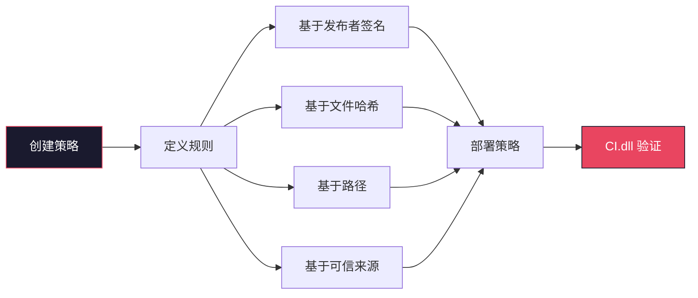
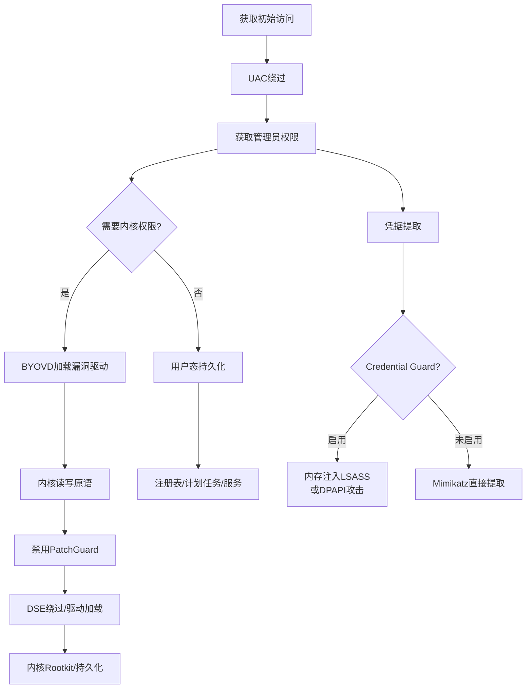

## 三、Windows安全机制深度解析

Windows安全机制是一套分层防御体系，从硬件层的NX位到内核层的PatchGuard，再到用户层的UAC和Defender，形成了纵深防御（Defense in Depth）架构。理解这些机制的工作原理、相互关系和已知弱点，是攻防研究的基础功。

### 3.1 Windows安全架构总览

在深入具体机制之前，先建立整体认知框架。

#### 3.1.1 安全分层模型

Windows安全体系可以抽象为六层防线，每层针对不同攻击阶段：



#### 3.1.2 安全机制演进时间线

| Windows版本 | 引入的关键安全机制 |
|---|---|
| Windows XP SP2 | DEP（硬件NX支持）、Windows防火墙默认启用 |
| Windows Vista | UAC、ASLR（系统级）、完整性级别、服务加固 |
| Windows 7 | 强制ASLR（/DYNAMICBASE）、AppLocker |
| Windows 8 | High Entropy ASLR（64位）、ELAM（早期启动反恶意软件） |
| Windows 8.1 | WDEG（漏洞防护）增强、自定义ASLR |
| Windows 10 | CFG、Device Guard（WDAC+HVCI）、Credential Guard、ACG |
| Windows 10 1709 | ACG强制模式、CIG、Exploit Guard |
| Windows 11 | 硬件强制栈保护（CET Shadow Stack）、内核CET、Smart App Control |

#### 3.1.3 安全标识符（SID）与访问令牌

Windows的所有安全决策都基于两个核心抽象：SID标识"谁"，访问令牌（Access Token）携带"身份+权限"。

**SID结构**：

SID是一个变长的二进制值，格式为 `S-R-X-Y1-Y2-...-YN`：

| 字段 | 含义 | 示例 |
|---|---|---|
| S | 固定前缀 | S |
| R | 版本号（始终为1） | 1 |
| X | 权威机构标识（NT Authority = 5） | 5 |
| Y1-YN | 子权威机构列表 | 21-... |

示例：`S-1-5-21-3623811015-3361044348-30300820-1013`

其中 `-1013` 是RID（Relative Identifier），内置账户有固定RID：Administrator=500、Guest=501。

**访问令牌结构**：

```text
┌─────────────────────────────────────────┐
│           Access Token                  │
├─────────────────────────────────────────┤
│ 用户SID           │ 组SID列表           │
│ 特权列表(Privileges)│ 默认DACL          │
│ 完整性级别(Integrity Level)             │
│ 会话ID            │ 来源类型            │
│ 模拟级别(Impersonation Level)          │
│ 受限SID           │ 能力(Capabilities)  │
└─────────────────────────────────────────┘
```

**完整性级别（Integrity Levels）** 是Vista引入的重要概念，决定了进程可以修改哪些对象：

| 级别 | SID后缀 | 典型进程 | 说明 |
|---|---|---|---|
| System | -16384 | csrss.exe, wininit.exe | 内核/系统服务 |
| High | -12288 | 管理员权限的cmd.exe | 提升后的管理员进程 |
| Medium | -8192 | 普通用户进程、资源管理器 | 标准用户默认级别 |
| Low | -4096 | IE/Edge沙箱进程 | 浏览器、不信任内容 |
| Untrusted | -0 | AppContainer进程 | UWP应用、最低权限 |

完整性级别检查规则：低完整性进程不能写入高完整性对象的SACL（即使DACL允许）。这在安全对象的安全描述符（Security Descriptor）中的Mandatory Policy字段控制。

### 3.2 用户账户控制（UAC）

UAC（User Account Control）是Windows Vista引入的里程碑式安全机制，改变了Windows延续十余年的"默认管理员"使用范式。

#### 3.2.1 UAC设计原理

**Vista之前的困境**：在XP时代，绝大多数用户以Administrator登录，任何程序都拥有完全控制权。恶意软件一旦运行，无需额外提权就能安装驱动、修改注册表、关闭安全软件。

**UAC的核心思想**：管理员用户登录后，创建两个访问令牌——一个受限的标准用户令牌（默认用于所有进程）和一个完整的管理员令牌（仅在用户明确同意后使用）。

**工作机制（四步流程）**：



**令牌拆分机制的技术细节**：

登录时，LSASS（Local Security Authority Subsystem Service）为管理员账户创建两个令牌：

1. **受限令牌（Restricted Token）**：通过 `CreateRestrictedToken()` API 创建，移除了Administrators组SID，添加了拒绝ACE和受限SID。
2. **完整令牌（Full Token）**：保留所有权限，由AppInfo服务在用户确认后传递给提升的进程。

进程可以通过 `OpenProcessToken()` + `GetTokenInformation()` 查看自己持有的令牌类型。

#### 3.2.2 UAC安全级别与配置

**四个滑块级别**：

| 级别 | 通知范围 | 安全桌面 | 注册表值 |
|---|---|---|---|
| 始终通知 | 所有提权请求+Windows设置变更 | 是 | ConsentPromptBehaviorAdmin=2, PromptOnSecureDesktop=1 |
| 默认设置 | 非Windows程序的提权请求 | 是 | ConsentPromptBehaviorAdmin=5, PromptOnSecureDesktop=1 |
| 仅应用通知（无安全桌面） | 非Windows程序的提权请求 | 否 | ConsentPromptBehaviorAdmin=5, PromptOnSecureDesktop=0 |
| 从不通知 | 不提示（UAC仍然运行，但静默拒绝或允许） | N/A | ConsentPromptBehaviorAdmin=0, EnableLUA=1 |

**关键注册表路径**：`HKLM\SOFTWARE\Microsoft\Windows\CurrentVersion\Policies\System`

| 注册表值 | 类型 | 说明 |
|---|---|---|
| EnableLUA | DWORD | 0=禁用UAC（不推荐，部分UWP将不可用） |
| ConsentPromptBehaviorAdmin | DWORD | 管理员提权提示行为 |
| ConsentPromptBehaviorUser | DWORD | 标准用户提权行为（0=凭据提示，1=安全桌面凭据提示，3=凭据+非安全桌面） |
| PromptOnSecureDesktop | DWORD | 1=安全桌面，0=普通桌面 |
| FilterAdministratorToken | DWORD | 1=对内置Administrator也应用UAC（Windows 10默认开启） |

**安全桌面的技术实现**：安全桌面实际上是一个独立的Winlogon桌面（Winlogon桌面与默认桌面分离），使用 `SwitchDesktop()` API切换。恶意软件无法截取安全桌面上的提示框，因为Win32k的桌面隔离机制阻止跨桌面窗口操作。

**特别注意 - 内置Administrator账户**：Windows 10中，内置Administrator账户默认启用了 `FilterAdministratorToken`（即"Admin Approval Mode"），意味着即使是RID 500的内置Administrator也会受到UAC限制。但某些Windows版本（如Server）默认不启用此设置，此时内置Administrator的所有进程直接获得完整管理员令牌。

#### 3.2.3 UAC绕过技术深度分析

UAC绕过（UAC Bypass）是一类特殊攻击，不是真正的权限提升（privilege escalation），因为攻击者已经有了管理员组成员的Medium完整性进程，绕过UAC只是让进程获得High完整性令牌。如果当前进程已经是Medium完整性且不在管理员组，UAC绕过无法使用，需要真正的内核漏洞或配置错误进行提权。

**技术一：自动提升（Auto-Elevation）白名单利用**

Windows允许满足以下条件的程序自动提升，无需用户确认：
- 由Windows签名（Microsoft Windows签名证书）
- 位于受信任目录（`%SystemRoot%\System32\` 或 `%ProgramFiles%\`）
- 包含 `<autoElevate>true</autoElevate>` 的manifest

攻击思路：利用这些白名单程序执行任意操作。常见被利用的二进制文件：

| 二进制文件 | 利用方式 | Windows版本 |
|---|---|---|
| eventvwr.exe | 注册表键值劫持（HKCU\mscfile） | Win 7-10 1511 |
| sdclt.exe | 注册表键值劫持（HKCU\Folder\shell\open\command） | Win 10 |
| fodhelper.exe | 注册表键值劫持（HKCU\ms-settings\shell\open\command） | Win 10 1607+ |
| computerdefaults.exe | 类似fodhelper | Win 10 |
| sdclt.exe /kickoffelev | HKCU注册表覆盖 | Win 10 |
| eventvwr.msc | MSC文件路径覆盖 | Win 7-8.1 |

以fodhelper.exe为例的技术流程：

```powershell
# fodhelper.exe自动提升时会检查HKCU下的注册表键
# 攻击者在HKCU写入恶意命令，fodhelper以高完整性执行

# 步骤1：创建注册表项
New-Item -Path "HKCU:\Software\Classes\ms-settings\Shell\Open\command" -Force
Set-ItemProperty -Path "HKCU:\Software\Classes\ms-settings\Shell\Open\command" `
    -Name "(Default)" -Value "cmd.exe /c start cmd.exe" -Force
New-ItemProperty -Path "HKCU:\Software\Classes\ms-settings\Shell\Open\command" `
    -Name "DelegateExecute" -Value "" -Force

# 步骤2：触发fodhelper.exe（自动提升）
Start-Process "C:\Windows\System32\fodhelper.exe"

# 步骤3：清理注册表
Remove-Item "HKCU:\Software\Classes\ms-settings" -Recurse -Force
```

为什么HKCU可以劫持HKLM？Windows注册表有HKCU和HKLM两个根键。当程序在HKLM查找注册表项时，如果HKCU存在相同路径，某些API（如RegOpenKeyEx不带特定标志时）会优先查询HKCU。这是一个设计上的信任边界问题——自动提升的程序信任HKLM下的配置，但没有强制检查是从哪个根键加载的。

**技术二：DLL搜索顺序劫持（DLL Search Order Hijacking）**

自动提升的程序在执行时可能加载不在受保护路径中的DLL。攻击者将恶意DLL放在程序的搜索路径中（如当前目录、用户目录），使其被优先加载。

常见利用点：

```text
程序DLL搜索顺序（安全搜索开启时）：
1. 应用程序目录
2. System32
3. System
4. Windows
5. 当前目录（如果SafeDllSearchMode禁用）
6. PATH环境变量中的目录
```

防护建议：开启 `SafeDllSearchMode`（默认启用），使用KnownDLLs注册表项保护关键系统DLL。

**技术三：COM对象劫持**

COM（Component Object Model）在注册表中注册CLSID到DLL路径的映射。Windows在查找COM对象时，先查HKCU再查HKLM。攻击者在HKCU注册恶意COM对象，当自动提升的程序实例化该COM对象时，恶意代码以高完整性执行。

```text
攻击流程：
1. 自动提升程序调用 CoCreateInstance(CLSID_XXX)
2. COM运行时先查 HKCU\CLSID\{XXX}，找到攻击者注册的DLL
3. 加载攻击者的DLL（在自动提升的程序进程中）
4. 恶意代码以管理员权限执行
```

**技术四：Token模拟与进程注入**

某些特权进程允许较低权限的进程通过命名管道、ALPC（Advanced Local Procedure Call）或其他IPC机制进行模拟（Impersonation）。攻击者可以：

1. 找到一个以SYSTEM或管理员权限运行的服务
2. 利用该服务的命名管道漏洞或DLL劫持，使其执行代码
3. 通过 `ImpersonateLoggedOnUser()` 获取高级别令牌

#### 3.2.4 UAC防御加固

```powershell
# 1. 设置UAC为最高级别
Set-ItemProperty -Path "HKLM:\SOFTWARE\Microsoft\Windows\CurrentVersion\Policies\System" `
    -Name "ConsentPromptBehaviorAdmin" -Value 2 -Force
Set-ItemProperty -Path "HKLM:\SOFTWARE\Microsoft\Windows\CurrentVersion\Policies\System" `
    -Name "PromptOnSecureDesktop" -Value 1 -Force

# 2. 启用内置Administrator的UAC过滤
Set-ItemProperty -Path "HKLM:\SOFTWARE\Microsoft\Windows\CurrentVersion\Policies\System" `
    -Name "FilterAdministratorToken" -Value 1 -Force

# 3. 监控HKCU注册表的可疑写入
# 使用Sysmon Event ID 12/13监控 ms-settings、mscfile等路径
```

### 3.3 地址空间布局随机化（ASLR）

ASLR（Address Space Layout Randomization）通过随机化进程的内存布局，使攻击者无法预测关键数据和代码的地址，从而阻碍利用漏洞的攻击。

#### 3.3.1 ASLR工作原理

**随机化的内存区域**：

| 区域 | 随机化方式 | 熵（64位） |
|---|---|---|
| 可执行文件基址 | ImageBase + 随机偏移 | 256种（低熵）/ ~8位 |
| 堆基址 | 每次分配随机化 | ~17位 |
| 栈基址 | 线程栈随机基址 | ~17位 |
| PEB/TEB | 进程创建时随机化 | ~17位 |
| 系统DLL基址 | 启动时随机化，所有进程相同 | ~8位（低熵） |
| 高熵区域（64位HE-ASLR） | 堆/VirtualAlloc基址 | ~24位 |

**实现机制**：


**三级ASLR**：

| 级别 | 条件 | 效果 |
|---|---|---|
| 系统ASLR | Vista+默认启用 | 系统DLL基址随机化 |
| 强制ASLR（/DYNAMICBASE） | PE头设置此标志 | 可执行文件基址随机化 |
| High Entropy ASLR | Win8+ 64位 + /HIGHENTROPYVA | 64位地址空间高熵随机化 |

**编译器支持**：

```bash
# MSVC：默认启用/DYNAMICBASE
cl /DYNAMICBASE /HIGHENTROPYVA program.c

# GCC/MinGW
gcc -Wl,--dynamicbase,--high-entropy-va program.c

# 检查PE文件是否启用ASLR
# 使用dumpbin（Visual Studio工具）
dumpbin /headers program.exe | findstr "Dynamic base"
# 或使用python pefile
python -c "import pefile; pe=pefile.PE('program.exe'); print(pe.OPTIONAL_HEADER.DllCharacteristics & 0x0040)"
```

#### 3.3.2 ASLR强度与局限性

**熵的含义**：随机化的强度取决于熵值（entropy）。N位熵意味着有2^N种可能的地址，暴力破解平均需要2^(N-1)次尝试。

**各区域的实际熵分析**：

- **32位系统**：地址空间仅4GB，ASLR熵非常有限。堆栈约8位（256种可能），DLL约8位。对于fork型服务（如Apache httpd），所有子进程共享相同的随机化基址，暴力破解完全可行。
- **64位系统**：地址空间巨大（2^47用户态），High Entropy ASLR提供约24位堆熵，理论上需要1600万次尝试。但对于32位兼容进程（WoW64），即使运行在64位系统上，地址空间仍受32位限制。

**ASLR不保护的情况**：

1. 未设置 `/DYNAMICBASE` 的旧程序（特别是第三方遗留软件）
2. 已知基址的模块（如某些驱动程序固定加载地址）
3. 共享同一随机化基址的fork服务
4. 信息泄露漏洞可以一次性暴露所有地址

#### 3.3.3 ASLR绕过技术深度分析

**技术一：信息泄露（Information Leak）**

这是绕过ASLR最通用的方法。一旦泄露任意地址，就能推算出所有内存布局。

常见泄露渠道：

| 泄露渠道 | 原理 | 典型场景 |
|---|---|---|
| 格式化字符串漏洞 | `%x`/`%p` 读取栈上的地址值 | C/C++程序中的printf(user_input) |
| 堆溢出读 | 溢出后读取相邻堆块中的指针 | Off-by-one、堆元数据泄露 |
| JavaScript堆喷射 | 浏览器JS引擎中大量分配包含已知值的对象 | 浏览器漏洞利用 |
| 异常处理信息 | Windows异常处理可能泄露栈帧地址 | SEH链泄露 |
| 使用后释放（UAF） | 重用已释放对象中的残留指针 | 浏览器/内核UAF |

**技术二：部分地址覆盖（Partial Overwrite）**

不需要知道完整地址，只需覆盖地址的低字节：

```text
原始返回地址：0x00007ff6`a1b2c3d4
目标函数地址：0x00007ff6`a1b2f000

策略：仅覆盖低16位为 0xf000
成功率：假设同一页内有目标函数，概率约1/16（低12位固定）
```

这种方法的约束是目标必须与被覆盖地址在同一页（4KB对齐）或同一64KB区域。

**技术三：非ASLR模块利用**

有些模块（特别是旧的第三方DLL）未设置 `/DYNAMICBASE` 标志，加载地址固定。攻击者可以：
1. 使用 `dumpbin /headers` 或 Process Explorer 扫描进程中的非ASLR模块
2. 在这些模块中寻找ROP gadget
3. 用固定地址的gadget构造ROP链

PowerShell扫描脚本：

```powershell
# 扫描进程中的非ASLR模块
Get-Process | ForEach-Object {
    $proc = $_
    try {
        $_.Modules | Where-Object {
            $base = $_.BaseAddress
            # 检查是否为固定基址（非ASLR）
            # 简单方法：对比两次启动的基址是否相同
        }
    } catch {}
}

# 更简单的方法：使用Process Explorer
# View → Lower Pane View → DLLs → 添加"ASLR"列
```

**技术四：Brute Force暴力破解**

在32位系统上，某些区域的熵极低（8-17位），暴力破解在可达范围内：

| 偏移范围 | 熵 | 平均尝试次数 | 可行性 |
|---|---|---|---|
| 256 (2^8) | 8位 | 128 | 完全可行 |
| 65536 (2^16) | 16位 | 32768 | 可行（如果目标服务可fork） |
| 2^24 | 24位 | 800万 | 仅对fork服务可行 |

对于fork服务（如Apache），主进程创建子进程时，子进程继承父进程的内存布局。攻击者可以反复利用漏洞，每次尝试不同的地址，直到命中目标。

#### 3.3.4 ASLR增强策略

```powershell
# 1. 强制所有程序启用ASLR（系统级强制）
Set-ItemProperty -Path "HKLM:\SYSTEM\CurrentControlSet\Control\Session Manager\Memory Management" `
    -Name "MoveImages" -Value 0xFFFFFFFF -Force

# 2. 启用强制ASLR（即使PE头没有/DYNAMICBASE）
# 通过EMET或Exploit Protection设置
Set-ProcessMitigation -System -Enable ForceRelocateImages

# 3. 启用High Entropy ASLR
Set-ProcessMitigation -System -Enable HighEntropy

# 4. 检查程序ASLR状态
Get-ProcessMitigation -Name "target.exe"
```

### 3.4 数据执行保护（DEP）

DEP（Data Execution Prevention）将内存页标记为不可执行，阻止在数据区域（如堆、栈）中执行代码，从根本上阻止shellcode注入类攻击。

#### 3.4.1 DEP的硬件基础与实现

**硬件支持**：现代CPU（Intel XD bit、AMD NX bit）支持在页表项（PTE）中设置NX（No-Execute）标志，标记该页不可执行。当CPU试图从NX页取指令时，触发硬件异常（#PF，Page Fault）。

**软件DEP（SafeSEH等）**：即使CPU不支持硬件NX，Windows也通过软件检查（编译时插入的安全SEH验证等）提供部分保护。

**DEP策略（通过boot.ini或bcdedit配置）**：

| 策略 | 行为 | bcdedit命令 |
|---|---|---|
| OptIn（默认） | 仅对系统程序启用DEP | `bcdedit /set nx OptIn` |
| OptOut | 对所有程序启用，排除列表除外 | `bcdedit /set nx OptOut` |
| AlwaysOn | 强制对所有程序启用 | `bcdedit /set nx AlwaysOn` |
| AlwaysOff | 完全禁用DEP | `bcdedit /set nx AlwaysOff` |

**页表中的NX标志**：

```text
x86-64 页表项 (PTE) 结构：
┌──────────────────────────────────────────────┐
│ 63    │ NX (No-Execute) 位                    │
│ 62-52 │ 可用（软件自定义）                     │
│ 51-M  │ 物理页帧号 (PFN)                      │
│ 11-0  │ 标志位：P/RW/U/S/A/D/PAT/G/...       │
└──────────────────────────────────────────────┘

NX=0：页可执行
NX=1：页不可执行（取指令触发 #PF 异常）
```

**Windows内存保护属性**：

| 保护属性 | 值 | 可读 | 可写 | 可执行 | 说明 |
|---|---|---|---|---|---|
| PAGE_EXECUTE | 0x10 | ✓ | ✗ | ✓ | 可执行代码页 |
| PAGE_EXECUTE_READ | 0x20 | ✓ | ✗ | ✓ | 典型的代码段 |
| PAGE_EXECUTE_READWRITE | 0x40 | ✓ | ✓ | ✓ | 危险！RWX，应避免 |
| PAGE_READWRITE | 0x04 | ✓ | ✓ | ✗ | 典型的数据段/堆 |
| PAGE_READONLY | 0x02 | ✓ | ✗ | ✗ | 只读数据 |

#### 3.4.2 DEP绕过技术深度分析

**技术一：ROP（Return-Oriented Programming）**

ROP是绕过DEP最经典的技术。核心思想：不注入新代码，而是复用已有代码中的"小片段"（gadget），每个gadget以 `ret` 指令结尾，通过控制栈上的返回地址链，将这些gadget串联起来执行任意操作。


**ROP链的典型目标**：

1. 调用 `VirtualProtect()` 将shellcode所在内存页改为可执行
2. 调用 `VirtualAlloc()` 分配新的可执行内存，复制shellcode过去
3. 调用 `WriteProcessMemory()` 写入可执行内存
4. 调用 `NtSetInformationProcess()` 禁用当前进程的DEP

**ROP Gadget搜索工具**：

```bash
# ROPgadget（Python工具）
ROPgadget --binary target.exe --ropchain

# rp++
rp-win.exe -f target.exe -r 5

# mona.py（Immunity Debugger插件）
!mona rop -m "msvcrt,kernel32"
!mona rop -m "ntdll" -cpb "\x00"  # 排除null字节
```

**技术二：JIT喷射（JIT Spraying）**

JIT（Just-In-Time）编译器（如JavaScript引擎、.NET CLR、Java JVM）在运行时生成可执行代码。攻击者构造特殊的JS/Java代码，使JIT编译器生成包含特定字节序列的机器码，这些字节序列恰好是攻击者想要的指令（如NOP sled + shellcode）。

```javascript
// JavaScript JIT Spray 示例
// 构造大量包含0x0c0c0c0c（x86 'or al, 0x0c'）的立即数
var x = 0x0c0c0c0c ^ 0x0c0c0c0c ^ 0x0c0c0c0c ^ ...;
// JIT编译后，0x0c0c0c0c作为机器码字节排列在可执行内存中
// 攻击者将EIP/控制流指向0x0c0c0c0c
```

现代浏览器已经通过多种措施缓解JIT Spray：随机化JIT代码页基址、在JIT输出中插入随机指令等。

**技术三：NtSetInformationProcess禁用DEP**

对于OptIn/OptOut策略，进程可以调用 `NtSetInformationProcess(ProcessExecuteFlags)` 在运行时修改自身的DEP策略。AlwaysOn策略下此调用会被拒绝。

```c
// 禁用当前进程DEP的代码（仅OptIn/OptOut策略有效）
ULONG ExecuteFlags = MEM_EXECUTE_OPTION_ENABLE;
NtSetInformationProcess(
    GetCurrentProcess(),
    ProcessExecuteFlags,  // 0x22
    &ExecuteFlags,
    sizeof(ExecuteFlags)
);
```

**技术四：利用.NET/JIT的可执行内存**

.NET的CLR和Java的JVM JIT编译器会分配 `PAGE_EXECUTE_READWRITE` 内存来存放JIT生成的代码。攻击者可以：
1. 触发大量JIT编译，使可执行内存中充满可控内容
2. 修改JIT代码缓冲区中的内容（如果存在内存写原语）
3. 跳转到JIT缓冲区中的特定偏移

#### 3.4.3 DEP与ASLR的协同

单独的DEP和ASLR都存在绕过方法，但两者组合大幅提高攻击难度：



实际攻击中，面对ASLR+DEP的组合，攻击者通常需要：
1. 一个信息泄露漏洞（绕过ASLR）+ 一个内存写/控制流劫持漏洞（利用ROP绕过DEP）
2. 或者一个能同时泄露信息和控制执行流的漏洞

### 3.5 控制流保护（CFG）

CFG（Control-flow Guard）是Windows 10引入的前向控制流完整性（Forward-edge CFI）保护，目标是阻止间接调用被劫持到任意地址。

#### 3.5.1 CFG工作原理

**间接调用的威胁**：函数指针、虚函数表（vtable）等间接调用是控制流劫持的主要目标。攻击者通过溢出或UAF覆盖函数指针，将控制流劫持到任意地址。

**CFG的保护机制**：

```mermaid
sequenceDiagram
    participant Code as 正常代码
    participant CFG as CFG检查
    participant Bitmap as 有效目标位图
    participant Target as 目标函数

    Code->>CFG: call [rax]（间接调用）
    CFG->>Bitmap: 查表：目标地址是否合法？
    alt 目标合法
        Bitmap-->>CFG: ✓ 合法
        CFG->>Target: 执行调用
    else 目标非法
        Bitmap-->>✗ 非法
        CFG->>CFG: 触发 __guard_dispatch_icall_fptr
        Note over CFG: 终止进程或报告违规
    end
```

**编译器插入的检查代码**：

```asm
; 编译器在每个间接调用前插入的CFG检查（伪代码）
; 原始代码：call [rax]
; CFG保护后：

    mov r11, rax                        ; 保存目标地址
    call __guard_check_icall_fptr       ; 调用CFG检查函数
    ; __guard_check_icall_fptr 内部：
    ;   mov ecx, r11
    ;   shr ecx, 3                      ; 地址除以8（位图每个bit对应8字节）
    ;   bt [__guard_dispatch_icall_fptr_bitmap], ecx  ; 测试位图中的bit
    ;   jc .valid                       ; 如果bit为1，目标合法
    ;   int 3                           ; 否则触发中断
    .valid:
    jmp r11                             ; 跳转到目标
```

**有效目标位图（LdrpGuardCFDispatchFunctionCallBitmap）**：

- 位图中的每个bit对应用户态地址空间中每8字节对齐的一个位置
- 如果某个函数地址是合法的间接调用目标，对应bit设为1
- 位图在进程初始化时由ntdll!LdrpDispatchUserCallTarget建立
- 大小约 2GB/8 = 256MB（32位）或根据地址范围动态分配（64位）

**CFG的保护范围**：

| 受保护 | 不受保护 |
|---|---|
| 通过函数指针的间接调用 | 直接调用（编译时已知目标） |
| C++虚函数调用（vtable分派） | 通过`jmp`的间接跳转（在早期CFG中） |
| 回调函数调用 | 返回地址（ret指令，需要CET/Shadow Stack） |

#### 3.5.2 CFG的局限性与绕过

**局限一：粗糙的粒度**

CFG只检查目标地址是否是一个合法函数的入口，不检查调用上下文。例如：

```text
合法场景：void ProcessData(Callback* cb) { cb(data); }
攻击场景：cb 被覆盖为另一个合法但"不应该在此上下文被调用"的函数
```

攻击者只需要找到一个合法的、有用的函数地址作为跳转目标即可，不需要跳转到任意地址。

**局限二：位图可被修改**

位图存储在进程可写的内存中。如果攻击者有任意内存写原语，可以修改位图，将任意地址标记为合法目标。

```python
# 伪代码：修改CFG位图（需要任意写原语）
# 将目标地址对应的bit设为1
bitmap_offset = target_address >> 3  # 除以8
byte_offset = bitmap_offset >> 3     # 再除以8得到字节偏移
bit_offset = bitmap_offset & 7       # bit在字节内的位置
bitmap[byte_offset] |= (1 << bit_offset)  # 设置bit
```

**局限三：不覆盖间接跳转**

早期CFG（Windows 10 TH1/TH2）不保护 `jmp [rax]` 形式的间接跳转，只保护 `call [rax]`。攻击者可以通过覆盖跳转表绕过。后来的XFG（eXtended Flow Guard）尝试解决这个问题，通过在目标函数入口嵌入哈希值来实现更精确的检查。

**局限四：非CFG模块**

未启用CFG编译的模块不包含CFG检查代码。如果劫持点发生在非CFG模块的间接调用中，CFG无法保护。但CFG位图仍然记录了所有模块的合法目标，所以攻击者跳转到CFG保护的模块时仍然会触发检查。

#### 3.5.3 CFG增强版本：XFG

XFG（eXtended Flow Guard）是微软设计的CFG增强版，增加了：

1. **类型签名检查**：在函数入口嵌入64位哈希签名，间接调用前验证目标签名匹配
2. **间接跳转保护**：覆盖 `jmp` 和 `call` 两种间接控制流
3. **更精确的上下文检查**：减少合法但不应在此上下文调用的函数被利用

XFG通过在函数序言中嵌入 `__funcentry_check` 条件检查实现：

```asm
; XFG目标函数入口
target_function:
    cmp r10, <expected_hash>     ; 检查调用者传递的哈希
    jne .hash_mismatch           ; 不匹配则终止
    ; 正常函数体
    ...
.hash_mismatch:
    int 3
```

### 3.6 内核级安全机制

用户态的安全机制可以被内核级攻击绕过。Windows在内核层引入了多层保护。

#### 3.6.1 PatchGuard（Kernel Patch Protection）

PatchGuard（正式名称Kernel Patch Protection，KPP）是x64 Windows的内核保护机制，防止第三方代码修改关键内核数据结构。

**保护对象**：

| 保护目标 | 说明 |
|---|---|
| SSDT（System Service Descriptor Table） | 系统服务分派表，防止hook系统调用 |
| IDT（Interrupt Descriptor Table） | 中断描述符表 |
| GDT（Global Descriptor Table） | 全局描述符表 |
| 内核模块的代码段 | 防止inline hook |
| 关键内核结构体 | EPROCESS、ETHREAD、KPCR等 |
| MSR寄存器 | SYSENTER_EIP等关键MSR |
| 内核对象类型 | ObTypeIndexTable等 |

**检测周期**：PatchGuard以定时器方式运行（约5-10分钟检测一次），检测到修改时触发BSOD（蓝屏），错误码通常为 `0x109 CRITICAL_STRUCTURE_CORRUPTION`。

**绕过PatchGuard的历史方法**：

| 方法 | 原理 | 状态 |
|---|---|---|
| 禁用定时器 | 找到并删除PatchGuard的定时器回调 | 已被修补 |
| HyperVisor隐藏 | 在hypervisor层拦截内存访问 | 部分可行 |
| Boot-start驱动 | 在PatchGuard初始化之前加载 | 受DSE限制 |
| HyperHide | 利用VT-x/EPT隐藏修改 | 高级方法 |

#### 3.6.2 DSE（Driver Signature Enforcement）

DSE要求所有内核驱动必须经过Microsoft签名才能加载。

**签名要求**：

- Windows 10 1607+：驱动必须通过Microsoft硬件开发者中心签名（需要EV代码签名证书 + 硬件仪表板账户）
- Windows Server 2016+：同上
- 测试签名：仅在启用测试签名模式时可用（`bcdedit /set testsigning on`）

**绕过DSE的方法**：

1. **利用已签名的漏洞驱动**：加载具有合法Microsoft签名的驱动，利用其漏洞执行任意内核代码。常见被利用的驱动：

   | 驱动 | 来源 | 漏洞类型 |
   |---|---|---|
   | gdrv.sys | Gigabyte | 内存读写 |
   | RTCore64.sys | MSI Afterburner | 内存读写 |
   | Capcom.sys | Capcom游戏 | 任意代码执行 |
   | DBUtil_2_3.sys | Dell | 内存读写 |
   | npcap.sys | Npcap | 特权提升 |

2. **利用BYOVD（Bring Your Own Vulnerable Driver）**：攻击者携带已签名的漏洞驱动到目标系统，加载后利用其漏洞。

3. **禁用DSE**：通过高级启动选项禁用（需要物理访问或已控制启动过程）。

#### 3.6.3 VBS/HVCI（Virtualization-Based Security）

VBS（Virtualization-Based Security）利用硬件虚拟化（VT-x/AMD-V）创建隔离的安全环境。HVCI（Hypervisor-enforced Code Integrity）是VBS的核心组件，强制内核代码完整性。



**HVCI的作用**：在hypervisor层面验证内核代码页面的完整性。即使攻击者获得了内核权限，也无法修改已加载的代码页面（hypervisor拒绝写入受保护的页面）。这阻止了内核inline hook、SSDT hook等传统内核攻击技术。

**Credential Guard**：将LSASS进程（存储凭据的关键进程）运行在VTL 1中，VTL 0的内核和驱动无法访问LSASS的内存。这有效阻止了Mimikatz等凭据提取工具。

### 3.7 应用控制与代码完整性

#### 3.7.1 WDAC（Windows Defender Application Control）

WDAC（前身Device Guard）是Windows的企业级应用白名单解决方案，只允许已签名和已批准的应用运行。

**WDAC策略层**：



**WDAC规则类型**：

| 规则类型 | 说明 | 粒度 |
|---|---|---|
| 发布者规则 | 验证PE文件的Authenticode签名 | 高（可到产品名/文件名级别） |
| 文件哈希规则 | 基于SHA256哈希允许/拒绝 | 最高（精确到单个文件） |
| 路径规则 | 基于文件系统路径 | 低（可被绕过） |
| 可信来源 | 打包应用的AppX签名 | UWP专用 |
| 智能屏幕信誉 | 基于云信誉 | 智能屏幕集成 |

#### 3.7.2 ACG与CIG

**ACG（Arbitrary Code Guard）**：阻止动态生成新的可执行代码。即使攻击者有任意写原语，也无法将数据页改为可执行。浏览器（Edge/Chrome）对渲染进程启用了ACG。

```text
ACG保护效果：
- VirtualAlloc(PAGE_EXECUTE_*) 失败
- VirtualProtect(→PAGE_EXECUTE_*) 失败
- 阻止非签名代码页变为可执行
- 配合CIG阻止加载未签名DLL
```

**CIG（Code Integrity Guard）**：只允许加载Microsoft签名的DLL。Edge的渲染进程同时启用ACG+CIG，使得即使RCE漏洞被利用，攻击者也很难执行恶意代码。

```powershell
# 查看进程的安全缓解措施
Get-ProcessMitigation -Name "msedge.exe"

# 输出示例：
# DEP:    Enable = ON
# ASLR:   ForceRelocate = ON, BottomUp = 0x10000
# CFG:    Enable = ON
# ACG:    Enable = ON
# CIG:    Enable = ON (Microsoft签名DLL)
# CET:    Enable = ON (Shadow Stack)
```

### 3.8 Windows Defender与EDR体系

#### 3.8.1 Windows Defender杀毒引擎

**检测技术栈**：

| 技术 | 说明 | 绕过难度 |
|---|---|---|
| 签名检测 | 基于已知恶意软件特征（哈希/字节序列） | 低（变形/加壳可绕过） |
| 启发式检测 | 基于行为模式（API调用序列、文件属性） | 中 |
| 云检测 | 将文件元数据/哈希发送到云端查询 | 中 |
| 行为监控 | 运行时监控进程行为（AMSI、ETW） | 高 |
| 机器学习 | 基于特征向量的ML分类 | 高 |

**AMSI（Antimalware Scan Interface）**：

AMSI是Windows 10引入的开放接口，允许反恶意软件产品扫描脚本和动态内容。它拦截PowerShell、VBScript、JScript、Office宏等脚本引擎的执行内容。

```powershell
# AMSI的扫描点
# 1. PowerShell脚本执行（ScriptBlock Logging）
# 2. VBScript/JScript执行（wscript/cscript）
# 3. Office宏执行
# 4. .NET程序集加载
# 5. WMI操作

# AMSI绕过示例（仅用于研究目的）：
# 修改AMSI初始化标志（已被签名检测）
# 进程注入绕过
# 反射式加载避免触发扫描
```

**ETW（Event Tracing for Windows）**：

ETW是Windows的内核级事件追踪框架，EDR产品大量依赖ETW获取系统活动信息：

| ETW Provider | 监控内容 |
|---|---|
| Microsoft-Windows-Threat-Intelligence | 恶意软件行为检测 |
| Microsoft-Windows-PowerShell | PowerShell操作日志 |
| Microsoft-Windows-Kernel-Process | 进程创建/退出 |
| Microsoft-Windows-Kernel-Network | 网络连接 |
| Microsoft-Windows-Security-Auditing | 安全审计事件 |

### 3.9 Windows安全机制全景对比

| 安全机制 | 保护层级 | 防御目标 | 默认状态 | 绕过难度 |
|---|---|---|---|---|
| UAC | 用户态 | 权限分离 | 启用 | 低-中 |
| DEP | 硬件+OS | 非执行内存 | OptIn | 中（ROP绕过） |
| ASLR | OS | 内存布局随机化 | 启用 | 中（信息泄露绕过） |
| CFG | 编译器+OS | 间接调用 | 需编译支持 | 中-高 |
| CET | 硬件 | 返回地址保护 | Win11+需硬件支持 | 高 |
| ACG/CIG | OS | 代码完整性 | 浏览器进程 | 高 |
| PatchGuard | 内核 | 内核完整性 | x64自动启用 | 高 |
| DSE | 内核 | 驱动签名 | x64自动启用 | 中（BYOVD） |
| HVCI | Hypervisor | 代码页完整性 | 需手动启用 | 极高 |
| Credential Guard | Hypervisor | 凭据保护 | 需手动启用 | 极高 |
| WDAC | OS | 应用白名单 | 需部署策略 | 极高 |
| AMSI | 用户态 | 脚本检测 | Win10+自动启用 | 中-高 |
| Defender ATP | 全栈 | EDR | Win10+自动启用 | 高 |

### 3.10 综合攻防视角

#### 3.10.1 攻击者视角：绕过多层防御的思路

面对现代Windows系统的多层防御，攻击者需要制定系统性的绕过策略：



#### 3.10.2 防御者视角：纵深防御部署清单

| 优先级 | 措施 | 说明 |
|---|---|---|
| P0 | 启用DEP AlwaysOn | bcdedit /set nx AlwaysOn |
| P0 | 启用强制ASLR | 系统级MoveImages |
| P0 | UAC设为最高级别 | 始终通知+安全桌面 |
| P1 | 启用HVCI | 需要兼容硬件 |
| P1 | 启用Credential Guard | 防止凭据提取 |
| P1 | 部署WDAC策略 | 应用白名单 |
| P1 | 启用Attack Surface Reduction规则 | Exploit Guard |
| P2 | 监控ETW/AMSI事件 | EDR集成 |
| P2 | 阻止已知漏洞驱动 | WDAC驱动黑名单 |
| P2 | 启用CET（硬件支持时） | Shadow Stack保护 |

### 3.11 常见误区

**误区一："开启UAC就安全了"**

UAC不是安全边界（security boundary）。微软官方声明UAC是便利性功能，不是安全屏障。大量UAC绕过技术存在，不应将UAC作为安全防御的核心依赖。

**误区二："ASLR让所有漏洞利用都不可行"**

ASLR增加利用难度，但不消除漏洞本身。信息泄露漏洞可以完全绕过ASLR，且在32位系统上ASLR熵极低。ASLR是缓解措施（mitigation），不是修复（fix）。

**误区三："64位系统比32位安全很多"**

64位确实提供了更高的ASLR熵和更大的地址空间，但32位程序在WoW64环境下仍然受32位地址空间限制。而且很多企业环境仍有大量32位应用。

**误区四："PatchGuard保护了整个内核"**

PatchGuard只保护特定的内核结构，不是全面的内核完整性保护。很多内核数据结构不在保护范围内。而且PatchGuard有检测周期，不是实时保护。

**误区五："启用HVCI后内核攻击不可能"**

HVCI大幅提高了难度，但不意味着不可能。利用内存损坏漏洞修改数据（而非代码）仍然可能，HVCI保护的是代码页完整性，不保护数据。
