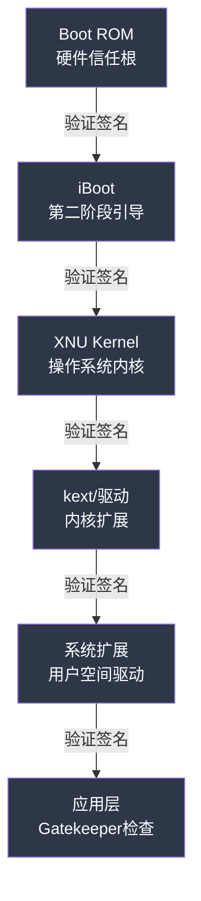
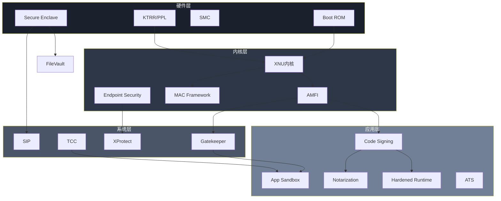

## 五、macOS安全机制深度解析

macOS的安全架构采用"纵深防御"策略，从硬件信任根到应用沙箱，构建了多层安全屏障。与Windows依赖第三方安全软件不同，macOS将安全机制深度集成到操作系统内核和硬件中，形成了从芯片到应用的完整信任链。理解这些机制的原理和交互关系，是掌握macOS安全攻防的基础。

### 5.1 硬件安全基础

#### 5.1.1 Secure Enclave

Secure Enclave是Apple设计的独立安全协处理器，集成在Apple Silicon芯片（M1/M2/M3/M4系列）和部分A系列芯片中，拥有独立的启动ROM、内存和加密引擎，主处理器无法直接访问其存储的数据。

**核心功能**：

| 功能 | 说明 | 安全意义 |
|------|------|----------|
| 密钥管理 | 生成、存储和管理加密密钥 | 密钥永不离开Secure Enclave |
| 生物识别 | 处理Touch ID/Face ID数据 | 生物数据不暴露给主系统 |
| 数据保护 | 管理FileVault加密密钥 | 即使磁盘被拆下也无法解密 |
| 安全启动 | 验证启动链完整性 | 硬件级信任根 |
| 防重放 | 单调计数器 | 防止固件回滚攻击 |

**密钥层次结构**：

```text
硬件UID密钥 (Secure Enclave内部，不可读取)
├── 设备密钥 (Device Key)
│   └── 由UID密钥和设备唯一数据派生
├── 用户密钥 (User Key)
│   └── 由用户密码 + Secure Enclave派生
└── 类密钥 (Class Key)
    └── 保护不同敏感级别的数据
```

**安全特性**：
- **硬件UID**：每颗芯片唯一，Apple也不记录，无法从外部读取
- **防暴力破解**：内置暴力攻击防护，连续失败后指数级延迟
- **安全隔离**：通过AES引擎进行加密操作，密钥材料不暴露给主CPU
- **单调计数器**：防止降级攻击，每次启动递增

#### 5.1.2 KTRR与硬件内存保护

**KTRR（Kernel Text Readonly Region）** 是Apple Silicon设备的硬件级内核代码保护机制：

- 在硬件层面将内核代码段标记为只读，即使拥有内核权限也无法修改
- 配合**AMCC（Apple Memory Controller Configuration）** 控制内存访问权限
- 阻止经典的内核代码注入和patch攻击

**PPL（Page Protection Layer）**：
- 进一步保护内核数据页，即使是内核代码也不能随意修改受保护的页面
- 关键数据结构（如进程凭证、代码签名状态）由PPL保护
- 攻击者即使获得内核执行权限，也难以篡改安全关键数据

#### 5.1.3 系统管理控制器（SMC）

SMC管理硬件级安全功能：

- **固件密码保护**：防止未授权的启动盘更改和恢复模式访问
- **启动安全性策略**：控制允许启动的操作系统版本
- **安全启动链**：从Boot ROM开始的逐级签名验证

### 5.2 启动安全

#### 5.2.1 安全启动链

macOS的启动过程形成一条完整的信任链，每个阶段验证下一阶段的数字签名：



**各阶段详解**：

| 阶段 | 组件 | 验证内容 | 失败后果 |
|------|------|----------|----------|
| Stage 0 | Boot ROM | iBoot签名和完整性 | 设备变砖，进入DFU模式 |
| Stage 1 | iBoot | 内核签名、设备树 | 回退到恢复模式 |
| Stage 2 | Kernel | kext签名、系统扩展 | 拒绝加载未签名驱动 |
| Stage 3 | 系统 | 应用签名、notarization | Gatekeeper阻止运行 |

**安全启动链的信任根**：
- Boot ROM固化在芯片中，不可修改
- Apple根证书嵌入Boot ROM
- 撤销列表（Secure SEP Firmware Revocation）定期更新
- 即使攻击者物理访问设备，也无法篡改Boot ROM

#### 5.2.2 启动安全性策略

macOS提供三级启动安全策略，用户可在恢复模式中配置：

**Full Security（完整安全性）**：
- 只允许Apple签名的最新macOS版本
- 防止降级攻击（安装旧版本已知漏洞的系统）
- 默认设置，适合绝大多数用户

**Reduced Security（降低安全性）**：
- 允许安装旧版本但仍需Apple签名的macOS
- 需要管理员密码确认
- 适用于需要兼容旧版软件的场景

**No Security（无安全性）**：
- 允许启动任意操作系统（包括Linux）
- 主要用于开发和测试
- 会禁用部分安全特性

**Permissive Security（宽松安全）**：
- macOS Monterey引入，介于Reduced和No Security之间
- 允许加载第三方内核扩展
- 保留基本的签名验证

### 5.3 系统完整性保护（SIP）

SIP是macOS El Capitan（10.11）引入的核心安全机制，旨在防止即使是root用户也无法修改受保护的系统文件和目录。

#### 5.3.1 保护范围

**受保护的目录**：
- `/System`：系统核心文件
- `/usr`（`/usr/local`除外）：系统工具和库
- `/bin`、`/sbin`：系统命令
- `/Applications`中的预装应用（Safari、Mail等）

**受保护的行为**：
- 加载未签名的内核扩展（kext）
- 注入代码到系统进程
- 修改NVRAM中的安全相关变量
- 关闭SIP本身（需要恢复模式）

**配置标志（csr-active-config）**：

| 标志位 | 含义 | 关闭后风险 |
|--------|------|------------|
| CSR_ALLOW_UNTRUSTED_KEXTS | 允许未签名kext | 内核级恶意软件 |
| CSR_ALLOW_UNRESTRICTED_FS | 无限制文件系统访问 | 系统文件被篡改 |
| CSR_ALLOW_TASK_FOR_PID | 允许调试系统进程 | 进程注入攻击 |
| CSR_ALLOW_UNRESTRICTED_NVRAM | 无限制NVRAM访问 | 启动参数篡改 |
| CSR_ALLOW_UNAPPROVED_KEXTS | 允许未批准的kext | 第三方恶意驱动 |

#### 5.3.2 SIP状态检查与管理

```bash
# 查看SIP状态
csrutil status

# 输出示例：
# System Integrity Protection status: enabled.
# Configuration:
#   Apple Internal: disabled
#   Kext Signing: enabled
#   Filesystem Protections: enabled
#   Debugging Restrictions: enabled
#   DTrace Restrictions: enabled
#   NVRAM Protections: enabled

# 恢复模式下禁用SIP（需重启进入恢复模式）
# 重启时按住 Command+R
# 打开终端执行：
csrutil disable

# 重新启用SIP
csrutil enable

# 部分禁用（仅限特定标志）
csrutil enable --without fs    # 仅禁用文件系统保护
```

#### 5.3.3 SIP绕过技术

尽管SIP是强大的安全机制，历史上仍存在绕过案例：

1. **环境变量注入**：利用`DYLD_INSERT_LIBRARIES`在SIP保护进程加载前注入代码（已在El Capitan修复）
2. **符号链接攻击**：利用受保护目录中的可写符号链接（CVE-2015-5882）
3. **系统更新窗口**：在系统更新过程中短暂的验证间隙
4. **内核漏洞**：通过内核漏洞直接修改受保护内存（配合KTRR/PPL已大幅减少）
5. **Time Machine漏洞**：利用备份恢复机制绕过SIP保护（CVE-2021-30784）

### 5.4 代码签名与公证

#### 5.4.1 代码签名体系

macOS要求所有应用都必须经过代码签名，这是整个安全架构的基础：

**签名层次**：
- **Apple签名**：操作系统和预装应用
- **Developer ID签名**：第三方开发者发布的应用
- **Ad Hoc签名**：本地开发签名，不可分发
- **无签名**：被Gatekeeper默认阻止

**签名验证流程**：
```text
应用启动请求
    ↓
检查签名是否有效
    ↓
验证证书链到Apple根证书
    ↓
检查证书是否被撤销
    ↓
验证代码完整性（哈希匹配）
    ↓
检查是否经过公证（notarization）
    ↓
允许/拒绝运行
```

#### 5.4.2 公证（Notarization）

macOS Catalina（10.15）开始，所有从网上下载的应用必须经过Apple公证：

**公证流程**：
1. 开发者将应用提交到Apple公证服务
2. Apple自动扫描恶意软件和安全问题
3. 通过后获得公证票据（ticket）
4. 票据附加到应用的代码签名中
5. 用户首次打开时，系统验证公证票据

**公证要求**：
- 必须使用Developer ID证书签名
- 必须启用Hardened Runtime
- 不能包含已知恶意代码特征
- 必须遵守App Sandbox规则（推荐）

#### 5.4.3 Hardened Runtime

Hardened Runtime是macOS Mojave引入的安全特性，限制应用的运行时行为：

**主要限制**：
- 禁用动态库注入（`DYLD_INSERT_LIBRARIES`）
- 禁用JIT编译（除非明确声明）
- 限制对用户隐私数据的访问
- 禁用不受信任的内存页执行

**启用方式**：
```xml
<!-- Info.plist -->
<key>CSFlags</key>
<string>runtime</string>

<!-- 或在Xcode中勾选"Hardened Runtime"选项 -->
```

### 5.5 Gatekeeper与XProtect

#### 5.5.1 Gatekeeper

Gatekeeper是macOS的应用执行控制机制，基于代码签名和公证状态决定是否允许应用运行：

**验证策略**：
| 来源 | 验证要求 | 用户体验 |
|------|----------|----------|
| Mac App Store | Apple审核 + 沙箱 | 直接运行 |
| 公证的Developer ID | 公证 + 签名 | 首次提示，之后直接运行 |
| 未公证的Developer ID | 仅签名 | 右键打开，警告提示 |
| 无签名应用 | 无 | 系统偏好设置中允许 |

**Gatekeeper检查内容**：
- 代码签名有效性
- 公证状态
- 应用是否包含恶意代码特征
- 扩展属性中的隔离标记（com.apple.quarantine）

**管理Gatekeeper**：
```bash
# 查看Gatekeeper状态
spctl --status
# 输出：assessments enabled

# 禁用Gatekeeper（不推荐）
sudo spctl --master-disable

# 启用Gatekeeper
sudo spctl --master-enable

# 评估特定应用
spctl --assess --verbose /Applications/Safari.app

# 移除隔离标记（绕过Gatekeeper检查）
xattr -d com.apple.quarantine /path/to/app.app
```

#### 5.5.2 XProtect

XProtect是macOS内置的反恶意软件系统，通过签名数据库检测已知威胁：

**工作机制**：
- 后台自动更新签名数据库（不依赖系统更新）
- 在应用执行前扫描文件
- 检测已知恶意软件家族
- 自动隔离或阻止恶意文件

**XProtect检测内容**：
- 已知恶意软件签名
- 可疑的代码模式
- 未签名的内核扩展
- 恶意配置描述文件

**XProtect数据库位置**：
```bash
# XProtect签名数据库
/System/Library/CoreServices/XProtect.bundle/

# XProtect Remediator（自动修复组件）
/System/Library/CoreServices/XProtect Remediator.bundle/

# 查看XProtect日志
log show --predicate 'subsystem == "com.apple.xprotect"' --last 1h
```

**XProtect Remediator**（macOS Ventura引入）：
- 不仅检测，还能主动清除已知恶意软件
- 自动运行，无需用户干预
- 定期扫描系统，清除潜伏威胁

### 5.6 App Sandbox与权限控制

#### 5.6.1 App Sandbox

App Sandbox是macOS的应用隔离机制，限制应用只能访问其明确声明需要的资源：

**沙箱限制**：
- 文件系统：只能访问应用容器和用户明确授权的文件
- 网络：需要声明网络访问权限
- 硬件：摄像头、麦克风等需要用户授权
- 系统资源：限制CPU和内存使用

**沙箱容器结构**：
```text
~/Library/Containers/<AppBundleID>/
├── Data/          # 应用数据目录
├── Documents/     # 用户文档（需要权限）
└── tmp/           # 临时文件
```

**权限声明（Entitlements）**：
```xml
<!-- 应用的entitlements.plist -->
<key>com.apple.security.app-sandbox</key>
<true/>
<key>com.apple.security.network.client</key>
<true/>
<key>com.apple.security.files.user-selected.read-only</key>
<true/>
<key>com.apple.security.device.camera</key>
<true/>
```

#### 5.6.2 TCC（Transparency, Consent, and Control）

TCC是macOS的隐私保护框架，控制应用对敏感数据和硬件的访问：

**TCC保护的资源**：

| 权限类别 | 访问内容 | 首次访问行为 |
|----------|----------|--------------|
| 位置服务 | 用户地理位置 | 弹窗请求授权 |
| 通讯录 | 联系人信息 | 弹窗请求授权 |
| 日历 | 日程安排 | 弹窗请求授权 |
| 提醒事项 | 提醒事项 | 弹窗请求授权 |
| 照片 | 照片库 | 弹窗请求授权 |
| 相机 | 摄像头 | 弹窗请求授权 |
| 麦克风 | 麦克风录音 | 弹窗请求授权 |
| 辅助功能 | 模拟键盘鼠标 | 系统偏好设置授权 |
| 完全磁盘访问 | 所有文件 | 系统偏好设置授权 |
| 自动化 | 控制其他应用 | 弹窗请求授权 |
| 输入监听 | 键盘输入 | 弹窗请求授权 |

**TCC数据库位置**：
```bash
# 系统级TCC数据库
/Library/Application Support/com.apple.TCC/TCC.db

# 用户级TCC数据库
~/Library/Application Support/com.apple.TCC/TCC.db

# 查询TCC权限（需要完全磁盘访问）
sqlite3 ~/Library/Application Support/com.apple.TCC/TCC.db \
  "SELECT client, service, auth_value FROM access"
```

**TCC绕过技术**：
1. **符号链接攻击**：利用受信任应用读取TCC保护的文件
2. **环境变量利用**：通过`DYLD_INSERT_LIBRARIES`注入到受信任进程
3. **进程注入**：注入到已有TCC权限的进程
4. **时间窗口攻击**：在TCC数据库写入前的验证间隙
5. **备份恢复**：通过iTunes备份恢复恶意TCC条目（iOS相关）

### 5.7 网络安全机制

#### 5.7.1 App Transport Security（ATS）

ATS强制应用使用安全的网络连接：

**默认要求**：
- 必须使用HTTPS（TLS 1.2+）
- 禁用SSLv3、TLS 1.0、TLS 1.1
- 必须使用前向保密（PFS）密码套件
- 证书必须符合证书透明度要求

**配置示例**：
```xml
<key>NSAppTransportSecurity</key>
<dict>
    <!-- 全局禁用ATS（不推荐） -->
    <key>NSAllowsArbitraryLoads</key>
    <false/>

    <!-- 特定域名例外 -->
    <key>NSExceptionDomains</key>
    <dict>
        <key>example.com</key>
        <dict>
            <key>NSExceptionAllowsInsecureHTTPLoads</key>
            <false/>
            <key>NSIncludesSubdomains</key>
            <true/>
            <key>NSExceptionRequiresForwardSecrecy</key>
            <true/>
            <key>NSExceptionMinimumTLSVersion</key>
            <string>TLSv1.2</string>
        </dict>
    </dict>
</dict>
```

#### 5.7.2 钥匙串（Keychain）安全

钥匙串是macOS的密码和证书存储系统：

**钥匙串类型**：
- **系统钥匙串**（`/Library/Keychains/System.keychain`）：存储系统级证书和密码
- **登录钥匙串**（`~/Library/Keychains/login.keychain-db`）：存储用户密码和证书
- **iCloud钥匙串**：跨设备同步的密码存储

**安全特性**：
- 钥匙串文件本身使用用户密码加密
- 自动锁定：闲置后自动加密
- 访问控制：可以为每个条目设置独立的访问策略
- Secure Enclave集成：敏感密钥可以绑定到Secure Enclave

**钥匙串操作**：
```bash
# 列出所有钥匙串
security list-keychains

# 查看钥匙串内容（需要密码）
security find-generic-password -s "service_name" -w

# 钥匙串诊断
security dump-keychain -d login.keychain-db

# 创建新的钥匙串
security create-keychain -p "password" new.keychain

# 设置钥匙串锁定时间
security set-keychain-settings -t 7200 login.keychain-db  # 2小时后锁定
```

#### 5.7.3 防火墙与网络过滤

**应用程序防火墙**：
- 基于应用的入站连接控制
- 可以阻止特定应用的网络访问
- 支持隐身模式（不响应ping和端口扫描）

**pf防火墙**：
- BSD级包过滤防火墙
- 支持复杂的规则语法
- 用于企业级网络控制

```bash
# 查看应用防火墙状态
sudo /usr/libexec/ApplicationFirewall/socketfilterfw --getglobalstate

# 启用应用防火墙
sudo /usr/libexec/ApplicationFirewall/socketfilterfw --setglobalstate on

# 启用隐身模式
sudo /usr/libexec/ApplicationFirewall/socketfilterfw --setstealthmode on

# 查看pf防火墙规则
sudo pfctl -sr
```

### 5.8 Endpoint Security框架

Endpoint Security是macOS Mojave引入的内核级安全监控框架，允许安全软件监控系统事件：

#### 5.8.1 架构与功能

**监控的事件类型**：
- 进程创建和终止
- 文件系统操作（创建、修改、删除）
- 网络连接
- 内核扩展加载
- 挂载操作
- 登录和授权事件

**安全代理要求**：
- 必须使用Apple签名的系统扩展
- 需要用户明确授权
- 必须运行在独立的沙箱中
- Apple审核批准

#### 5.8.2 安全监控实践

```bash
# 查看已授权的Endpoint Security客户端
systemextensionsctl list

# Endpoint Security日志
log show --predicate 'subsystem == "com.apple.endpointsecurity"' --last 1h
```

**常见Endpoint Security产品**：
- CrowdStrike Falcon
- Carbon Black
- SentinelOne
- macOS内置的XProtect Remediator

### 5.9 内核扩展与系统扩展

#### 5.9.1 从kext到System Extension的演变

macOS逐步淘汰了传统的内核扩展（kext），转向更安全的用户空间系统扩展：

| 特性 | kext（传统） | System Extension（现代） |
|------|-------------|------------------------|
| 运行空间 | 内核空间 | 用户空间 |
| 崩溃影响 | 可能导致内核崩溃 | 仅扩展崩溃 |
| 安全性 | 可以访问所有内核内存 | 沙箱限制 |
| 审核要求 | 较少 | Apple严格审核 |
| 部署方式 | 直接加载 | 需要系统扩展批准 |

**系统扩展类型**：
- **网络扩展**：VPN、DNS代理、内容过滤
- **端点安全扩展**：恶意软件检测、行为监控
- **文件提供者扩展**：云存储集成

#### 5.9.2 AMFI（Apple Mobile File Integrity）

AMFI是macOS的代码完整性验证机制，负责：
- 验证代码签名的有效性
- 强制执行代码签名要求
- 配合Gatekeeper控制应用执行
- 管理entitlements（权限声明）

**AMFI检查点**：
- 应用启动时
- 动态库加载时
- 内核扩展加载时
- 进程间通信时

### 5.10 数据保护

#### 5.10.1 FileVault全盘加密

FileVault 2使用XTS-AES-128加密整个启动卷：

**加密机制**：
- 每个文件使用独立的文件密钥（per-file key）
- 文件密钥由类密钥（class key）保护
- 类密钥由用户密码派生的密钥保护
- 最终保护密钥存储在Secure Enclave中

**密钥层次**：
```text
用户密码
    ↓ PBKDF2
用户密钥卷主密钥（User Key Volume Master Key）
    ↓
类密钥（Class Key）
    ↓
文件密钥（Per-File Key）
    ↓
文件数据加密
```

**FileVault管理**：
```bash
# 查看FileVault状态
fdesetup status

# 启用FileVault
sudo fdesetup enable

# 查看加密进度
diskutil apfs list | grep -A 5 "FileVault"

# 添加恢复密钥
sudo fdesetup add -usertoadd username

# 生成个人恢复密钥（PRK）
sudo fdesetup changerecovery -personal
```

#### 5.10.2 数据保护类

macOS定义了四个数据保护级别，类似于iOS：

| 保护级别 | 密钥何时可用 | 典型用途 |
|----------|-------------|----------|
| Complete Protection | 仅应用使用时 | 高敏感数据 |
| Protected Unless Open | 文件关闭后锁定 | 临时敏感数据 |
| Protected Until First Auth | 首次解锁后 | 大多数应用数据 |
| No Protection | 始终可用 | 非敏感数据 |

**实现机制**：
- 每个文件独立的加密密钥
- 类密钥（Class Key）控制保护级别
- Secure Enclave管理密钥生命周期
- 锁屏时丢弃Complete Protection级别的密钥

### 5.11 高级安全特性

#### 5.11.1 Lockdown Mode

Lockdown Mode是iOS 16/macOS Ventura引入的极端安全模式，面向可能遭受国家级攻击的用户：

**限制内容**：
- 禁用消息中的附件预览
- 阻止复杂的Web技术（JIT JavaScript编译）
- 禁用FaceTime来电（非联系人）
- 阻止有线连接（设备锁定时）
- 禁用配置描述文件安装
- 阻止加入MDM管理

**启用方式**：
```bash
# 系统偏好设置 → 隐私与安全性 → 锁定模式
# 或通过命令行（需要SIP禁用）
defaults write com.apple.security.lockdown-mode -bool true
```

#### 5.11.2 Rapid Security Response

macOS Ventura引入的快速安全响应机制：

**特点**：
- 无需完整系统更新即可修复安全漏洞
- 更新包体积小，安装快速
- 可以自动安装（用户可配置）
- 支持回滚（如果更新导致问题）

**更新内容**：
- Safari安全更新
- WebKit漏洞修复
- 系统守护进程安全修复
- XProtect签名更新

#### 5.11.3 安全启动与恢复

**macOS恢复模式**：
- **标准恢复**（Command+R）：从内置恢复分区启动
- **互联网恢复**（Option+Command+R）：从Apple服务器下载恢复系统
- **DFU模式**：设备固件更新模式，用于恢复变砖设备

**恢复模式安全功能**：
- 启动安全性策略配置
- SIP管理
- 固件密码设置
- 磁盘工具（FileVault管理）
- 终端访问（有限权限）

### 5.12 macOS安全机制全景图



### 5.13 安全机制对比：Intel vs Apple Silicon

| 安全特性 | Intel Mac | Apple Silicon |
|----------|-----------|---------------|
| 信任根 | T2芯片（部分机型） | Secure Enclave（集成） |
| 内核保护 | KTRR（部分） | KTRR + PPL（全部） |
| 安全启动 | 可选 | 默认强制 |
| 磁盘加密 | FileVault（软件） | FileVault（硬件加速） |
| Touch ID | 需要T2 | 集成 |
| 内存保护 | 标准ASLR | 增强ASLR + PAN |
| 系统恢复 | 互联网恢复 | DFU模式 |

### 5.14 安全审计与日志

macOS提供丰富的安全日志用于事件调查：

**统一日志系统**：
```bash
# 查看安全相关日志
log show --predicate 'category == "security"' --last 1h

# Gatekeeper日志
log show --predicate 'subsystem == "com.apple.syspolicy"' --last 1h

# XProtect日志
log show --predicate 'subsystem == "com.apple.xprotect"' --last 1h

# 代码签名验证日志
log show --predicate 'subsystem == "com.apple.amfi"' --last 1h

# TCC权限变更日志
log show --predicate 'subsystem == "com.apple.TCC"' --last 1h

# 登录事件
log show --predicate 'eventMessage contains "login"' --last 24h
```

**安全审计工具**：
```bash
# 检查系统完整性
sudo /usr/libexec/repair_packages --verify --standard-pkg /

# 检查已安装的配置描述文件
profiles list -all

# 检查已批准的内核扩展
systemextensionsctl list

# 检查启动项
launchctl list

# 检查登录项
osascript -e 'tell application "System Events" to get the name of every login item'
```

### 5.15 常见误区与纠正

**误区一："macOS不会感染恶意软件"**
- 现实：macOS恶意软件数量持续增长，包括Silver Sparrow、XCSSET、MacStealer等
- 纠正：macOS的安全机制降低了风险，但不能完全消除威胁

**误区二："禁用SIP可以解决所有兼容性问题"**
- 现实：禁用SIP会移除核心安全屏障，使系统暴露于多种攻击
- 纠正：优先寻找兼容SIP的替代方案，仅在必要时临时禁用

**误区三："Gatekeeper可以被简单绕过所以没用"**
- 现实：Gatekeeper阻止了大量自动化攻击和脚本小子
- 纠正：Gatekeeper是纵深防御的一层，不是唯一防线

**误区四："FileVault加密后数据绝对安全"**
- 现实：FileVault在设备启动、用户登录后密钥在内存中，冷启动攻击仍有可能
- 纠正：结合固件密码和Secure Enclave提供更强保护

**误区五："关闭所有网络就绝对安全"**
- 现实：物理访问、Thunderbolt/DMA攻击、恶意USB设备仍构成威胁
- 纠正：Lockdown Mode限制有线连接，但仍需物理安全措施
