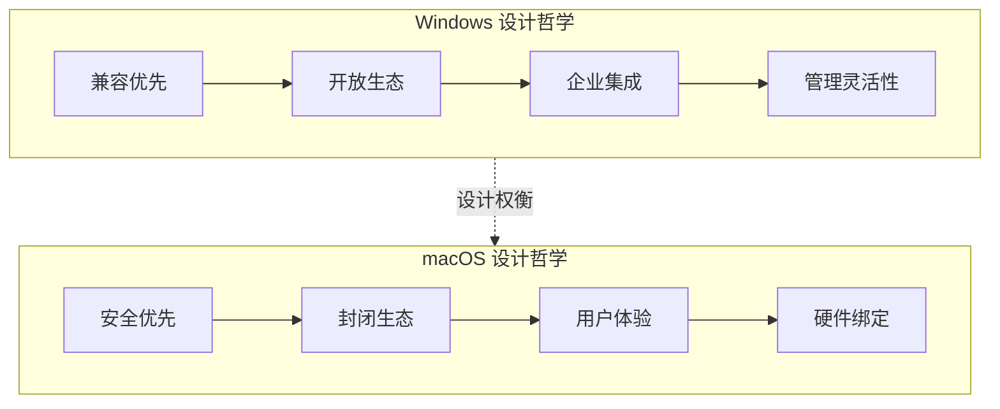
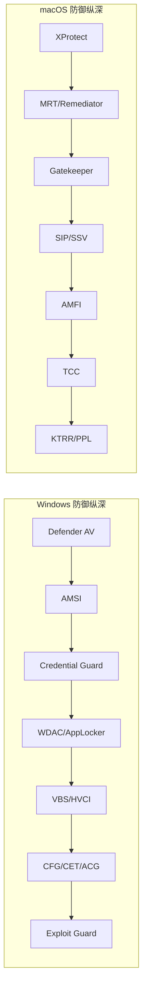

## 六、操作系统安全对比

Windows 与 macOS 在安全架构上的差异并非"哪个更安全"的简单二选一，而是两种截然不同的设计哲学在安全性、可用性和生态开放性之间的权衡。理解这些差异对于渗透测试人员和安全工程师至关重要——在不同平台上，攻击面、利用路径和防御机制完全不同，需要建立两套并行的思维模型。

### 6.1 安全设计哲学对比

Windows 和 macOS 的安全差异根源在于设计哲学的不同。Windows 诞生于企业办公场景，强调向后兼容性和生态开放性；macOS 脱胎于 Unix 传统并被 Apple 严格控制，强调最小权限和封闭生态。这种哲学差异渗透到了内核架构、权限模型、应用分发等每一个层面。



| 维度 | Windows | macOS |
|------|---------|-------|
| 核心理念 | 兼容性与灵活性优先，安全逐步加固 | 安全性与体验优先，兼容性让步 |
| 生态策略 | 开放平台，第三方驱动/软件自由安装 | 封闭生态，Gatekeeper + 公证 + SIP 层层把关 |
| 企业支持 | AD/GPO/SCCM 成熟的企业管理方案 | MDM + Jamf 等 MDM 方案，近年增强 |
| 更新策略 | 月度补丁星期二 + 紧急补丁 | 季度大更新 + 安全响应更新 |
| 硬件耦合 | 运行在任意 x86/x64 硬件上 | 深度绑定 Apple Silicon + T2/Secure Enclave |

### 6.2 内核架构与信任根对比

内核是操作系统安全的地基。Windows 采用 NT 混合内核，macOS 采用 XNU 混合内核——两者都是混合内核，但设计理念和安全边界划分差异巨大。

#### 6.2.1 内核架构对比

| 维度 | Windows NT 内核 | macOS XNU 内核 |
|------|-----------------|----------------|
| 微内核组件 | 无（宏内核风格） | Mach 微内核提供进程/内存管理 |
| BSD 层 | 无 | 整合 FreeBSD 的 POSIX 子系统 |
| 驱动模型 | WDM/WDF，运行在内核空间 | IOKit（C++ 面向对象驱动框架） |
| 内核扩展 | 传统驱动 + KMDF/UMDF | 旧：kext；新：System Extensions（用户空间） |
| 安全边界 | Ring 0/1/2/3 | Ring 0（内核）/ Ring 3（用户） |
| 混合加载 | 第三方驱动可加载到内核 | Apple Silicon 上逐步限制 kext |

**Windows NT 内核安全特征：**

- **对象管理器**：所有资源（文件、进程、注册表键）统一为安全对象，通过安全描述符（Security Descriptor）控制访问。
- **安全引用监视器（SRM）**：在每次访问时检查 ACL，是 Windows 访问控制的核心引擎。
- **IO 管理器**：通过 IRP（I/O Request Packet）机制传递请求，IRP 可被过滤驱动拦截。
- **对象类型多样**：进程、线程、文件、注册表键、信号量、互斥体、管道、端口——每种类型都有独立的安全属性。

**macOS XNU 内核安全特征：**

- **Mach 层**：提供 task、thread、port、memory region 等抽象，基于 Mach 端口的 IPC 是 macOS 特有的攻击面。
- **BSD 层**：实现 POSIX 进程模型、文件系统、网络协议栈，Unix 权限模型在此层生效。
- **IOKit**：C++ 编写的驱动框架，支持动态加载，但 Apple Silicon 上已逐步迁移到 System Extensions。
- **AMFI（Apple Mobile File Integrity）**：强制执行代码签名和 entitlement 检查，是 macOS/iOS 代码信任链的关键组件。

#### 6.2.2 信任根与安全启动

**Windows 信任根（基于 UEFI + TPM）：**

```text
硬件 TPM 2.0
    └── UEFI Secure Boot（验证引导加载程序签名）
        └── Windows Boot Manager（验证 winload.exe）
            └── Windows 内核（验证驱动签名）
                └── 用户空间（Code Integrity / HVCI）
```

- **Secure Boot**：验证 UEFI 引导加载程序的数字签名，防止 Bootkit。
- **Measured Boot**：将启动各阶段的度量值记录到 TPM PCR 寄存器中，可用于远程证明。
- **Virtualization-Based Security（VBS）**：使用 Hyper-V 隔离安全内核（Secure Kernel），将 Credential Guard 和 HVCI 放在独立的虚拟化分区中。
- **DRTM（Dynamic Root of Trust）**：通过硬件指令（如 Intel TXT/AMD SKINIT）建立动态信任根。

**macOS 信任根（基于 Apple Silicon 硬件）：**

```text
Apple ROM（不可变 Boot ROM，硬件信任根）
    └── LLB（Low-Level Bootloader，验证 iBoot 签名）
        └── iBoot（验证 macOS 内核签名）
            └── XNU 内核（验证 kext / System Extension 签名）
                └── 用户空间（AMFI 验证代码签名 + entitlement）
```

- **Boot ROM**：Apple Silicon 上固化在芯片中，不可修改，是最底层信任根。
- **Secure Enclave**：独立的硬件安全处理器，管理 Touch ID/Face ID 数据、FileVault 密钥、Apple Pay 令牌等。
- **KTRR / KRRR**：硬件级别的内核代码只读保护，即使内核被攻破也无法修改已映射的内核代码页。
- **LocalPolicy**：定义启动安全性策略（Full Security / Reduced Security / Permissive Security），存储在 Secure Enclave 中。

### 6.3 权限与访问控制对比

权限模型是操作系统安全的核心。Windows 的 ACL 体系极其灵活但也极其复杂；macOS 在 Unix 权限基础上叠加了 SIP、TCC、Entitlement 等多层防护。

#### 6.3.1 权限模型全景对比

| 维度 | Windows | macOS |
|------|---------|-------|
| 基础模型 | ACL（访问控制列表） | Unix rwx 权限 + POSIX ACL |
| 特权分离 | UAC（管理员/标准用户双令牌） | sudo + Authorization Services |
| 强制访问控制 | 无系统级 MAC（AppLocker/WDAC 为应用控制） | SIP + AMFI + Sandbox |
| 最小权限 | Admin Approval Mode | 非 root 默认无特权操作 |
| 权限提升 | UAC 绕过是常见攻击面 | sudo 配置错误 / XPC 提权 |
| 特权账户 | Administrator（默认启用） | root（默认禁用） |

#### 6.3.2 Windows 权限体系深度分析

**安全标识符（SID）：**

Windows 使用 SID 而非用户名标识身份。SID 是全局唯一的，即使用户名相同，不同机器上的 SID 也不同。

```text
S-1-5-21-<域标识>-<相对标识符>
示例：S-1-5-21-3623811015-3361044348-30300820-1013
```

关键内置 SID：
- `S-1-5-18`：SYSTEM 账户，最高权限
- `S-1-5-32-544`：Administrators 组
- `S-1-5-113`：本地账户（标准用户，非管理员）
- `S-1-5-114`：本地管理员账户（以标准用户身份运行）

**访问令牌（Access Token）：**

每个进程都携带一个访问令牌，记录身份、组成员关系、特权和完整性级别。

```text
访问令牌组成：
├── 用户 SID（身份标识）
├── 组 SID 列表（组成员关系）
├── 特权列表（SeDebugPrivilege, SeBackupPrivilege 等）
├── 完整性级别（Low / Medium / High / System）
├── UAC 虚拟化标志
└── AppContainer SID（UWP 应用隔离）
```

UAC 的核心机制是令牌分裂（Token Splitting）：管理员用户登录时获得两个令牌——标准令牌（默认使用）和完整管理员令牌（UAC 提升后使用）。

**完整性级别（Integrity Levels）：**

| 级别 | 典型场景 | 写入权限 |
|------|----------|----------|
| Untrusted | 匿名/不可信进程 | 几乎无 |
| Low | 浏览器沙盒（Chrome/Edge）、AppContainer | 仅 Low 标记的对象 |
| Medium | 标准用户进程 | Medium 及以下 |
| High | 经 UAC 提升的管理员进程 | High 及以下 |
| System | 系统服务（lsass.exe, services.exe） | 几乎所有 |
| Installer | Windows Installer 服务 | 所有（含 Low） |

**Windows 特权（Privileges）：**

Windows 有 36 种细粒度特权，与 Unix 的"root 全能"模型完全不同。高价值特权包括：

| 特权 | 功能 | 渗透价值 |
|------|------|----------|
| SeDebugPrivilege | 调试任意进程 | 读取 lsass.exe 内存获取凭据 |
| SeBackupPrivilege | 备份文件/目录 | 绕过 DACL 读取敏感文件 |
| SeRestorePrivilege | 恢复文件/目录 | 绕过 DACL 写入任意文件 |
| SeTakeOwnershipPrivilege | 获取对象所有权 | 接管任意文件/注册表键 |
| SeAssignPrimaryTokenPrivilege | 替换进程令牌 | 以 SYSTEM 身份执行 |
| SeLoadDriverPrivilege | 加载内核驱动 | 加载恶意驱动获取 Ring 0 |
| SeImpersonatePrivilege | 模拟客户端令牌 | Potato 系列提权的核心 |
| SeCreateTokenPrivilege | 创建令牌 | 构造任意身份令牌 |

**UAC 绕过的典型路径：**

1. **自动提升白名单（AutoElevation）**：部分 Windows 自带的可执行文件（如 `eventvwr.exe`、`sdclt.exe`、`fodhelper.exe`）配置了自动提升标志，无需用户确认即可获得管理员权限。攻击者利用这些二进制文件加载恶意 DLL 或修改注册表键值来执行任意代码。

2. **COM 对象劫持**：自动提升的进程会加载特定的 COM 对象，攻击者在注册表中劫持这些 COM 对象的 InprocServer32 键值，指向恶意 DLL。

3. **Token 模拟**：利用 `SeImpersonatePrivilege`，通过命名管道或 ALPC 端口诱使 SYSTEM 进程连接，然后模拟其令牌。Potato 系列提权工具（JuicyPotato、PrintSpoofer、GodPotato）都基于此原理。

4. **环境变量劫持**：部分自动提升进程会从用户可控的位置（如 `%PATH%`）加载 DLL，攻击者放置同名恶意 DLL 即可劫持。

#### 6.3.3 macOS 权限体系深度分析

**SIP（System Integrity Protection）：**

SIP 是 macOS 最核心的安全防线之一，即使 root 用户也无法修改受保护的系统文件。

受保护路径：
```regex
/System/
/usr/（/usr/local 除外）
/bin/
/sbin/
/System/Library/Extensions/
预装应用（/Applications 中的 Apple 应用）
```

SIP 限制的操作：
- 修改受保护目录中的文件（即使是 root）
- 注入代码到受保护进程（如 Finder、Safari）
- 修改 NVRAM 中的安全相关变量
- 加载未签名的内核扩展（macOS 11+）

**TCC（Transparency, Consent, and Control）：**

TCC 是 macOS 的隐私保护框架，控制应用对敏感资源的访问。

| 权限类别 | 保护资源 | 绕过难度 |
|----------|----------|----------|
| 全磁盘访问 | 所有文件（含其他用户目录） | 需要 root 或 SIP 绕过 |
| 辅助功能 | 键盘/鼠标控制、屏幕录制 | 需要用户手动授权 |
| 摄像头/麦克风 | 硬件设备访问 | 系统级弹窗 + 菜单栏指示灯 |
| 定位服务 | GPS/网络定位 | 系统级弹窗 |
| 日历/通讯录 | 个人信息 | 需要用户授权 |
| 文件和文件夹 | 下载/文档/桌面等目录 | 部分可通过脚本桥绕过 |

TCC 数据库位置：
```text
~/Library/Application Support/com.apple.TCC/TCC.db   # 用户级
/Library/Application Support/com.apple.TCC/TCC.db      # 系统级
```

**Entitlement（权限声明）：**

macOS 应用的权限通过 entitlement 声明，嵌入在代码签名中。

```xml
<!-- com.apple.security.app-sandbox -->
<key>com.apple.security.app-sandbox</key>
<true/>
<key>com.apple.security.files.user-selected.read-write</key>
<true/>
<key>com.apple.security.network.client</key>
<true/>
```

Entitlement 攻击面：
- 提取合法应用的 entitlement 复制给恶意应用（在 SIP 禁用的情况下）
- 利用有过多 entitlement 的合法应用进行攻击
- XPC 服务的 entitlement 验证缺陷

**XPC 服务安全：**

XPC 是 macOS 进程间通信的核心机制，也是常见的提权攻击面。

```text
XPC 服务验证流程：
客户端发起连接 → launchd 查找目标服务 → 服务验证客户端
    ├── 检查客户端的 code signing identity
    ├── 检查客户端的 entitlement
    ├── 检查客户端的 audit token（PID、UID）
    └── 决定是否接受连接
```

常见的 XPC 漏洞模式：
1. **缺乏客户端验证**：服务端不检查连接方的身份，任意进程可以调用特权操作
2. **TOCTOU 竞争条件**：先验证身份再执行操作，但中间窗口被利用
3. **不安全的反序列化**：XPC 消息使用 NSXPCConnection，反序列化恶意对象可执行任意代码

### 6.4 应用安全与沙盒对比

| 维度 | Windows | macOS |
|------|---------|-------|
| 沙盒机制 | AppContainer（UWP/WinRT） | App Sandbox + System Extension 沙盒 |
| 代码签名 | 可选（Microsoft Store 强制） | 强制（Gatekeeper 拒绝未签名应用） |
| 公证（Notarization） | 无等效机制 | macOS 10.15+ 要求 Apple 公证 |
| 应用分发 | 任意来源 + Microsoft Store | App Store + 公证的 DMG/PKG |
| 恶意软件检测 | SmartScreen（信誉检查） | Gatekeeper + XProtect + MRT |
| 运行时保护 | CFG + CET + ACG | 进程代码签名验证 + SIP |

#### 6.4.1 Windows 应用安全

**AppContainer 沙盒：**

AppContainer 是 Windows 8 引入的沙盒机制，UWP 应用和部分 Win32 应用（通过 MSIX 打包）使用。

```text
AppContainer 隔离机制：
├── 低完整性级别（Low IL）
├── 每个应用独立的 SID
├── Capability 声明（网络、摄像头等）
├── 文件系统虚拟化
├── 注册表虚拟化
└── 网络隔离（回环访问默认拒绝）
```

绕过思路：
- 利用 AppContainer 内允许的 broker 进程（如 RuntimeBroker.exe）
- 通过共享对象（命名管道、剪贴板）与其他进程交互
- 利用有更高权限的 COM 对象

**Windows Defender 应用控制（WDAC）：**

WDAC 是企业级的应用控制策略，基于代码签名和哈希值决定是否允许执行。

```text
WDAC 策略规则：
├── 发布者规则（基于代码签名证书）
├── 路径规则（基于文件路径）
├── 哈希规则（基于文件哈希）
├── 智能屏信誉（基于云端信誉）
└── 证书吊销检查
```

**AMSI（Antimalware Scan Interface）：**

AMSI 是 Windows 10 引入的反恶意软件扫描接口，允许安全产品检查脚本和动态代码的执行内容。

```text
AMSI 扫描流程：
PowerShell/VBA/JScript 执行代码
    → 调用 AMSI API（AmsiScanBuffer）
    → 注册的安全产品扫描内容
    → 返回结果（Clean / Detected / Blocked）
    → 决定是否继续执行
```

AMSI 覆盖的入口点：
- PowerShell（所有脚本执行）
- Windows Script Host（VBScript、JScript）
- Office VBA 宏
- .NET Assembly.Load
- WMI 事件订阅

AMSI 绕过思路（防御者应了解以加强检测）：
- 补丁 AmsiScanBuffer 函数开头使其立即返回
- 利用 AmsiInitFailed 标志阻止 AMSI 初始化
- 通过反射加载绕过 AMSI 扫描窗口
- 利用 .NET Profiler 注入

#### 6.4.2 macOS 应用安全

**Gatekeeper 工作流程：**

```text
用户双击应用
    → Gatekeeper 检查扩展属性（com.apple.quarantine）
    → 验证代码签名
    → 检查公证状态（Notarization ticket）
    → 检查是否来自已知恶意软件
    → 通过 → 允许执行
    → 未通过 → 弹窗警告/直接拒绝
```

Gatekeeper 绕过思路：
- 利用合法的已公证应用加载未签名的动态库
- dylib 注入（通过 DYLD_INSERT_LIBRARIES 环境变量，受 SIP 限制）
- 利用受信任的辅助工具（如 Installer、Xcode 命令行工具）
- Archive Utility 自动解压绕过（历史漏洞 CVE-2022-26706）
- 利用 `com.apple.macl` 扩展属性绑定绕过 TCC

**XProtect 与 MRT：**

| 组件 | 功能 | 更新方式 | 检测范围 |
|------|------|----------|----------|
| XProtect | 基于签名的恶意软件检测 | 静默更新（无需用户干预） | 已知恶意软件签名、YARA 规则 |
| MRT | 恶意软件删除 | 静默更新 | 已感染系统中的已知恶意软件 |
| XProtect Remediator | macOS 13+ 恶意软件修复 | 静默更新 | 更广泛的恶意软件家族 |

XProtect 规则存储位置：
```regex
/System/Library/CoreServices/XProtect.bundle/
    Contents/Resources/XProtect.plist          # 旧版签名
    Contents/Resources/XProtect.yara           # YARA 规则
```

### 6.5 认证与凭据安全对比

| 维度 | Windows | macOS |
|------|---------|-------|
| 本地凭据存储 | SAM 数据库（NTLM 哈希） | /var/db/dslocal/（ShadowHashData） |
| 域认证 | NTLM + Kerberos + CredSSP | Kerberos + Open Directory |
| 凭据保护 | Credential Guard（VBS 隔离） | Keychain + Secure Enclave |
| 生物识别 | Windows Hello（PIN + 生物识别） | Touch ID / Face ID（Secure Enclave） |
| 凭据缓存 | LSASS 进程内存 | Kerberos ticket cache + Keychain |
| 凭据攻击面 | LSASS 内存提取、Kerberoasting | Keychain 访问、Kerberos ticket 提取 |

#### 6.5.1 Windows 凭据攻击面

**LSASS（Local Security Authority Subsystem Service）：**

LSASS 是 Windows 认证的核心进程，内存中存储着大量敏感凭据：

```text
LSASS 内存中的凭据类型：
├── NTLM 哈希（本地和域账户）
├── Kerberos TGT（域认证票据）
├── 明文密码（部分场景，如 WDigest）
├── DPAPI 主密钥（用于解密浏览器密码等）
├── 证书私钥
└── SSP（Security Support Provider）凭据缓存
```

凭据提取工具与技术：
| 工具 | 原理 | 检测方法 |
|------|------|----------|
| Mimikatz | 直接读取 LSASS 进程内存 | Credential Guard / EDR 行为检测 |
| ProcDump | 转储 LSASS 进程内存（合法工具） | 监控 lsass.exe 的进程转储行为 |
| nanodump | 无声 LSASS 转储 | 内存访问监控 |
| Internal Monologue | 本地 NTLM 质询劫持 | 监控 NTLM 认证行为 |

**Credential Guard 防护：**

Credential Guard 使用基于虚拟化的安全（VBS）将 LSASS 中的凭据存储在独立的虚拟化分区中，即使内核被攻破也无法直接访问。

```text
传统模式：    进程 → LSASS → 凭据在内核空间
Credential Guard：进程 → LSASS → VSM → 凭据在隔离分区（Hyper-V 保护）
```

**Kerberos 攻击面：**

| 攻击类型 | 原理 | 影响 |
|----------|------|------|
| Kerberoasting | 请求服务票据并离线破解 | 获取服务账户密码 |
| AS-REP Roasting | 攻击不需要预认证的账户 | 获取账户哈希 |
| Golden Ticket | 使用 KRBTGT 哈希伪造 TGT | 永久域管权限 |
| Silver Ticket | 使用服务账户哈希伪造 TGS | 特定服务的访问权限 |
| Pass-the-Hash | 直接使用 NTLM 哈希认证 | 无需知道明文密码 |
| Pass-the-Ticket | 重用 Kerberos 票据 | 跨系统横向移动 |

#### 6.5.2 macOS 凭据攻击面

**Keychain 安全：**

macOS 的 Keychain 是系统级的凭据存储，但其安全设计优于 Windows 的 LSASS 模型。

```text
Keychain 层次结构：
├── System Keychain（/Library/Keychains/System.keychain）
│   ├── 系统级证书
│   ├── Wi-Fi 密码
│   └── 需要管理员权限修改
├── Login Keychain（~/Library/Keychains/login.keychain-db）
│   ├── 用户密码
│   ├── 应用密码
│   ├── 网站凭据
│   └── 自动解锁（登录时用用户密码解密）
└── iCloud Keychain（同步到所有设备）
    ├── Safari 密码
    ├── 信用卡信息
    └── Wi-Fi 密码
```

Keychain 攻击面：
- 钓取 Keychain 密码（用户授权的 UI 劫持）
- 利用 Keychain Access 控制缺陷
- Secure Enclave 保护的数据（硬件绑定，极难提取）
- `security` 命令行工具的操作

**Kerberos 在 macOS 上的实现：**

macOS 内置 Kerberos 支持，但实现细节与 Windows 不同：

```bash
# macOS Kerberos 工具
kinit username@REALM           # 获取 TGT
klist                          # 列出缓存的票据
kdestroy                       # 销毁票据缓存

# 配置文件
/etc/krb5.conf                 # Kerberos 配置
/Library/Preferences/edu.mit.Kerberos  # 系统级配置
```

macOS Kerberos 的攻击面相对较小，因为：
- 没有 NTLM 降级风险
- Secure Enclave 保护的密钥无法被内存转储提取
- TCC 限制了对系统凭据的访问

### 6.6 网络安全对比

| 维度 | Windows | macOS |
|------|---------|-------|
| 防火墙 | Windows Defender Firewall + WFP | 应用防火墙 + PF（BSD Packet Filter） |
| 入侵检测 | 无内置 IDS | 无内置 IDS（但有 XProtect 网络保护） |
| VPN | 内置 IKEv2/L2TP/PPTP | 内置 IKEv2/L2TP/Cisco/IPSec |
| DNS 安全 | DNS over HTTPS（Windows 11） | DNS over HTTPS / DNS over TLS |
| 网络隔离 | AppContainer 网络隔离 | 沙盒网络 entitlement 控制 |
| 无线安全 | 企业级 Wi-Fi 管理 | 企业级 Wi-Fi + 证书管理 |

#### 6.6.1 Windows 网络安全

**Windows 防火墙（WFP）：**

Windows Filtering Platform 是内核级的网络过滤框架，功能远超简单的端口过滤。

```text
WFP 过滤层次：
├── ALE（Application Layer Enforcement）：应用层过滤
│   ├── 按进程过滤
│   ├── 按用户过滤
│   └── 按应用容器过滤
├── Transport Layer：传输层过滤
│   ├── TCP/UDP 端口过滤
│   └── ICMP 过滤
├── Network Layer：网络层过滤
│   ├── IP 地址过滤
│   └── 协议过滤
└── MAC Layer：MAC 层过滤
    └── 以太网帧过滤
```

**SMB 安全：**

SMB（Server Message Block）是 Windows 网络文件共享的核心协议，也是 Windows 网络中最大的攻击面之一。

| SMB 版本 | 安全特性 | 已知风险 |
|----------|----------|----------|
| SMBv1 | 几乎无安全特性 | EternalBlue（MS17-010）、WannaCry |
| SMBv2 | 签名、加密（3.0+） | 中间人攻击（未签名时） |
| SMBv3 | AES-128-CCM 加密、压缩 | 相对安全，但仍有攻击面 |
| SMB over QUIC | TLS 1.3 加密 | Windows 11 / Server 2022+ |

**NTLM 攻击面：**

NTLM 虽然设计老旧，但仍在 Windows 环境中广泛使用：

```text
NTLM 认证流程：
客户端 → NTLM 质询/响应 → 服务器 → 转发到 DC 验证
     ↑                                    ↑
   可被降级                          可被中继（NTLM Relay）
```

NTLM 主要风险：
- **NTLM Relay**：将 NTLM 认证请求中继到另一台服务器
- **NTLM 哈希提取**：从 LSASS 或网络流量中提取
- **NTLMv1 弱加密**：可被快速破解
- **NTLM 降级攻击**：强制使用较弱的认证版本

#### 6.6.2 macOS 网络安全

**应用防火墙：**

macOS 的应用防火墙基于进程（而非端口），每个应用独立控制网络访问。

```bash
# 查看防火墙状态
sudo /usr/libexec/ApplicationFirewall/socketfilterfw --getglobalstate

# 启用防火墙
sudo /usr/libexec/ApplicationFirewall/socketfilterfw --setglobalstate on

# 添加应用规则
sudo /usr/libexec/ApplicationFirewall/socketfilterfw --add /Applications/Safari.app
sudo /usr/libexec/ApplicationFirewall(socketfilterfw --blockapp /Applications/Safari.app
```

macOS 还提供 PF（Packet Filter），继承自 OpenBSD：

```bash
# PF 配置文件
/etc/pf.conf

# 示例规则：阻止入站 SSH
block in proto tcp from any to any port 22

# 加载规则
sudo pfctl -f /etc/pf.conf
sudo pfctl -e  # 启用 PF
```

**ATS（App Transport Security）：**

ATS 是 macOS/iOS 的网络安全策略，强制应用使用安全的网络连接。

```text
ATS 默认要求：
├── 必须使用 HTTPS（不允许 HTTP）
├── TLS 版本 >= 1.2
├── 必须使用前向保密（Forward Secrecy）密码套件
├── 证书必须由受信任的 CA 签发
└── 证书必须满足最低密钥长度要求
```

应用可以在 Info.plist 中声明例外，但 Apple 对 App Store 审核越来越严格。

### 6.7 数据保护对比

| 维度 | Windows | macOS |
|------|---------|-------|
| 全盘加密 | BitLocker（TPM 绑定） | FileVault 2（Secure Enclave 绑定） |
| 加密算法 | AES-128/256-XTS | AES-128-XTS |
| 密钥保护 | TPM + 恢复密钥 | Secure Enclave + 恢复密钥 + iCloud 恢复 |
| 文件级加密 | EFS（加密文件系统） | Data Protection（per-file keys） |
| 安全擦除 | Cipher /w（三次覆写） | Secure Erase（基于 TRIM/加密密钥销毁） |
| 移动存储 | BitLocker To Go | 加密 DMG |

#### 6.7.1 BitLocker vs FileVault

| 维度 | BitLocker | FileVault 2 |
|------|-----------|-------------|
| 引入版本 | Windows Vista | macOS Lion（10.7） |
| 算法 | AES-128/256-XTS | AES-128-XTS |
| 密钥存储 | TPM（PCR 绑定） | Secure Enclave |
| 恢复机制 | 恢复密钥（48 位数字） | 恢复密钥 + iCloud 恢复 |
| 多用户 | 支持（每个用户独立密钥包装器） | 支持（每个用户独立密钥包装器） |
| 性能影响 | 有硬件加速（AES-NI） | 有硬件加速（AES-NI + Apple Neural Engine） |
| 启动前认证 | 支持（PIN/USB 密钥） | 不支持（但有固件密码） |
| 漏洞攻击 | 冷启动攻击、TPM 绕过 | 冷启动攻击、Secure Enclave 固件漏洞 |

**BitLocker 冷启动攻击防护不足时的风险：**

冷启动攻击利用 DRAM 数据在断电后短时间内残留的特性，通过物理访问获取 BitLocker 加密密钥。防护措施包括：
- 启用 TPM + PIN 的多因素认证
- 配置 BIOS 设置在挂起时清除内存
- 使用 DDR4 的 TSME/Intel TME 内存加密

**FileVault 密钥保护：**

Apple Silicon Mac 上，FileVault 密钥由 Secure Enclave 管理：
```text
用户密码 → PBKDF2 → 密钥包装密钥
    → Secure Enclave 解密卷密钥
    → 硬件 AES 引擎解密数据
```

Secure Enclave 有暴力破解防护（硬件级延迟和锁定），使得离线密码破解极其困难。

### 6.8 攻击面与漏洞利用对比

#### 6.8.1 Windows 攻击面

Windows 因其庞大的代码库、向后兼容性和企业集成，拥有所有桌面操作系统中最大的攻击面。

| 攻击面 | 描述 | 高危场景 |
|--------|------|----------|
| Active Directory | 域控制器、组策略、LDAP | 域渗透的首选目标 |
| SMB 协议 | 文件共享、IPC$、命名管道 | EternalBlue、SMBGhost |
| RPC/ALPC | 进程间通信 | RPC 远程代码执行 |
| COM/DCOM | 组件对象模型 | COM 劫持、DCOM 横向移动 |
| WinRM/WS-Man | 远程管理 | 远程代码执行、横向移动 |
| 注册表 | 配置存储 | 持久化、提权 |
| PowerShell | 脚本引擎 | 无文件攻击、混淆 |
| 服务管理 | Windows 服务 | 服务权限配置错误、DLL 搜索顺序劫持 |
| 计划任务 | 任务调度 | 持久化、提权 |
| WMI | 管理基础设施 | 远程执行、持久化、信息收集 |
| 打印服务 | Print Spooler | PrintNightmare（CVE-2021-34527） |
| 协议处理 | URL Handler、文件关联 | 协议处理器漏洞 |

**Windows 漏洞利用技术栈：**

```text
漏洞利用技术栈：
├── 内存破坏
│   ├── 堆溢出 / 栈溢出
│   ├── Use-After-Free
│   ├── Type Confusion
│   └── 整数溢出
├── 保护绕过
│   ├── ASLR → 信息泄露 / 熵猜测
│   ├── DEP → ROP / JIT Spray
│   ├── CFG → 合法目标滥用
│   ├── CET → 间接分支追踪绕过
│   └── ACG → JIT 禁用策略绕过
├── 特权提升
│   ├── 服务配置错误 → 服务提权
│   ├── DLL 劫持 → 进程注入
│   ├── 内核漏洞 → Ring 0 提权
│   └── Token 操纵 → Potato 系列
└── 横向移动
    ├── Pass-the-Hash / Pass-the-Ticket
    ├── WMI / WinRM 远程执行
    ├── DCOM 远程实例化
    └── PsExec / 服务创建
```

#### 6.8.2 macOS 攻击面

macOS 的攻击面相对较小，但 Apple Silicon 的引入和 SIP 的不断强化使得传统的攻击路径被封堵，新的攻击面也在出现。

| 攻击面 | 描述 | 高危场景 |
|--------|------|----------|
| Mach IPC | Mach 端口通信 | Mach 消息注入、端口劫持 |
| XPC 服务 | 进程间通信 | XPC 服务提权、服务劫持 |
| 内核扩展 | IOKit 驱动 | 内核漏洞（已逐步减少） |
| System Extension | 网络/端点安全扩展 | 扩展提权、沙盒逃逸 |
| TCC 绕过 | 隐私权限 | 绕过摄像头/麦克风/文件访问限制 |
| AppleScript | 脚本自动化 | 通过 osascript 执行命令 |
| dylib 注入 | 动态库加载 | 利用合法进程加载恶意 dylib |
| Launch Daemon | 系统级服务 | 持久化、提权 |
| Login Items | 用户级自启动 | 持久化 |
| Finder 扩展 | 文件管理器扩展 | 扩展提权 |
| 快捷指令 | macOS Monterey+ 自动化 | 利用快捷指令执行恶意操作 |

**macOS 漏洞利用的特殊挑战：**

1. **SIP 限制**：即使获取 root 权限，也无法修改系统文件或注入系统进程。
2. **AMFI 限制**：所有可执行代码必须有有效签名，否则被 AMFI 拒绝。
3. **Secure Enclave**：硬件级别的密钥保护，无法通过软件攻击提取。
4. **KTRR/KRRR**：内核代码段硬件只读保护，即使内核漏洞被利用也无法修改内核代码。
5. **PPL（Page Protection Layer）**：macOS 11+ 引入，保护关键内核数据结构。
6. **签名系统卷（SSV）**：macOS 11+ 的系统卷使用 cryptographically sealed snapshot，任何修改都会被检测。

### 6.9 防御机制对比总览



| 防御层 | Windows 实现 | macOS 实现 | 评价 |
|--------|-------------|------------|------|
| 恶意软件检测 | Windows Defender + AMSI | XProtect + MRT + Remediator | Windows 功能更强，macOS 更新更隐蔽 |
| 应用控制 | WDAC / AppLocker | Gatekeeper + 公证 + 签名 | macOS 默认更严格 |
| 系统保护 | VBS + HVCI | SIP + SSV + KTRR | macOS 在硬件级别更强 |
| 凭据保护 | Credential Guard + LSA 保护 | Secure Enclave + Keychain | 各有千秋，硬件绑定更安全 |
| 网络保护 | WFP + 防火墙 | 应用防火墙 + PF + ATS | Windows 更灵活，macOS 更严格 |
| 内核保护 | VBS + DSE | SIP + KTRR + PPL + SSV | macOS 在 Apple Silicon 上更完善 |
| 完整性验证 | Measured Boot + TPM | 安全启动链 + Secure Enclave | 均为硬件信任根 |

### 6.10 企业环境安全对比

在企业环境中，Windows 和 macOS 的安全管理方式有显著差异。

| 维度 | Windows | macOS |
|------|---------|-------|
| 域管理 | Active Directory + GPO | Open Directory / 绑定 AD |
| 配置管理 | SCCM / Intune / GPO | Jamf Pro / MDM / Munki |
| 补丁管理 | WSUS / SCCM / Intune | Apple SUS / Jamf / MDM |
| 端点检测 | Windows Defender ATP / EDR | CrowdStrike / Jamf Protect |
| 资产管理 | SCCM / Intune | Jamf / Mosyle |
| 合规管理 | Intune 合规策略 | MDM 配置描述文件 |

**混合环境安全挑战：**

当企业同时使用 Windows 和 macOS 时，需要面对额外的安全挑战：
- 跨平台凭据管理（Kerberos realm 统一）
- 策略一致性（同一安全标准在两个平台的实现差异）
- 漏洞管理（补丁周期和可用性差异）
- 用户体验（安全措施不应过度影响跨平台用户的工作流）

### 6.11 常见误区

**误区一："macOS 不需要杀毒软件"**

事实：macOS 确实比 Windows 更难被感染，但并非免疫。近年来针对 macOS 的恶意软件持续增长，包括 Silver Sparrow（2021 年感染超过 30,000 台 Mac）、XCSSET（针对开发者）、MacStealer（窃取 Keychain 数据）等。XProtect 的签名库远小于商业杀毒软件，且不提供实时行为监控。企业环境应部署 EDR。

**误区二："SIP 可以被安全地禁用以获得灵活性"**

事实：SIP 是 macOS 安全架构的基石。禁用 SIP 后，攻击者可以修改系统文件、注入系统进程、绕过 Gatekeeper。在 Apple Silicon Mac 上，禁用 SIP 需要降低启动安全性策略到 Permissive Security，这会破坏整个安全启动链的信任模型。即使开发需要，也应仅在专用的开发机上临时禁用。

**误区三："Windows 的 UAC 就是 macOS 的 sudo"**

事实：两者设计目标完全不同。UAC 是在标准用户和管理员之间增加一道确认层，管理员用户默认以标准权限运行，需要时才提升。sudo 是临时获取 root 权限的命令，普通用户默认没有 sudo 权限。UAC 的"同意"模式（管理员点"是"即可）安全强度远低于 macOS 的 sudo（需要输入密码）。

**误区四："BitLocker 和 FileVault 安全性等价"**

事实：两者在加密强度上相似，但密钥保护机制不同。BitLocker 依赖 TPM 和可选的 PIN，TPM 可以被固件漏洞或冷启动攻击绕过。FileVault 2 在 Apple Silicon Mac 上依赖 Secure Enclave，硬件级别的暴力破解防护使其更难被离线攻击。但 BitLocker 的启动前认证（PIN + USB 密钥）提供了 FileVault 不具备的预启动保护。

**误区五："Windows Defender 不如第三方杀毒软件"**

事实：自 Windows 10 以来，Windows Defender 的检测率已接近甚至超过多数商业产品。在 AV-TEST 和 AV-Comparatives 的独立测试中，Windows Defender 经常获得满分或接近满分。对于大多数用户，Windows Defender 加上 SmartScreen 和 AMSI 已经提供了足够的保护。企业环境应考虑 Defender for Endpoint（ATP）。

### 6.12 实战：跨平台安全评估检查清单

在对混合 Windows/macOS 环境进行安全评估时，应使用以下检查清单确保覆盖两个平台的关键安全控制。

#### 6.12.1 Windows 安全评估要点

```powershell
# 1. 检查 UAC 配置
Get-ItemProperty "HKLM:\SOFTWARE\Microsoft\Windows\CurrentVersion\Policies\System" | 
    Select-Object EnableLUA, ConsentPromptBehaviorAdmin, PromptOnSecureDesktop

# 2. 检查 BitLocker 状态
manage-bde -status C:

# 3. 检查 Credential Guard 状态
Get-CimInstance -ClassName Win32_DeviceGuard -Namespace root\Microsoft\Windows\DeviceGuard

# 4. 检查 WDAC 策略
Get-CimInstance -Namespace root\Microsoft\Windows\CI -ClassName MSFT_WDACSIPolicy

# 5. 检查 SMBv1 是否启用
Get-SmbServerConfiguration | Select-Object EnableSMB1Protocol

# 6. 检查 Windows Defender 状态
Get-MpComputerStatus | Select-Object AntivirusEnabled, RealTimeProtectionEnabled, 
    AntivirusSignatureLastUpdated

# 7. 检查 RDP 是否启用
Get-ItemProperty "HKLM:\SYSTEM\CurrentControlSet\Control\Terminal Server" -Name fDenyTSConnections

# 8. 检查本地管理员账户
net localgroup Administrators

# 9. 检查服务权限配置（查找弱权限服务）
accesschk.exe /accepteula -uwcqv "Authenticated Users" * 2>$null | 
    findstr "SERVICE_ALL_ACCESS SERVICE_CHANGE_CONFIG"
```

#### 6.12.2 macOS 安全评估要点

```bash
# 1. 检查 SIP 状态
csrutil status

# 2. 检查 FileVault 状态
fdesetup status

# 3. 检查 Gatekeeper 状态
spctl --status

# 4. 检查防火墙状态
sudo /usr/libexec/ApplicationFirewall/socketfilterfw --getglobalstate

# 5. 检查安全启动策略（Apple Silicon）
sudo bputil -d  # 显示当前启动安全性策略

# 6. 检查 XProtect 版本
system_profiler SPInstallHistoryDataType | grep -A5 "XProtect"

# 7. 检查固件密码（Intel Mac）
sudo firmwarepasswd -check

# 8. 检查自动登录
sudo defaults read /Library/Preferences/com.apple.loginwindow autoLoginUser 2>/dev/null || echo "自动登录未启用"

# 9. 检查已安装的配置描述文件
sudo profiles show -type configuration

# 10. 检查 Launch Daemons 和 Login Items
ls -la /Library/LaunchDaemons/
ls -la /Library/LaunchAgents/
ls -la ~/Library/LaunchAgents/

# 11. 检查远程登录（SSH）
sudo systemsetup -getremotelogin

# 12. 检查共享服务
sudo launchctl list | grep -E "(smb|ftp|vnc|ssh)"
```

### 6.13 未来趋势

**Windows 安全趋势：**

1. **VBS 全面普及**：Virtualization-Based Security 将从企业版扩展到家庭版，成为默认安全特性。
2. **Pluton 安全处理器**：Microsoft 的 Pluton 芯片将 TPM 功能集成到 CPU 中，消除 TPM 绕过攻击面。
3. **Rust 重写关键组件**：Microsoft 已开始用 Rust 重写 Windows 内核组件（如字体解析器），减少内存安全漏洞。
4. **Windows 验证器**：基于 VBS 的内核数据完整性验证，防止内核级 Rootkit。
5. **Passwordless 推进**：Windows Hello + FIDO2 密钥逐步替代密码。

**macOS 安全趋势：**

1. **kext 完全淘汰**：System Extension 将完全替代内核扩展，将第三方代码移出内核空间。
2. **SSV 强化**：签名系统卷将更加严格，提供更强的防篡改能力。
3. **Secure Enclave 扩展**：更多安全功能（如密码管理、密钥存储）将由 Secure Enclave 管理。
4. **Private Access Tokens**：替代 CAPTCHA 的隐私保护验证令牌，基于 Apple 的 attestation 服务。
5. **Passkey**：基于 FIDO2 的无密码认证，iCloud Keychain 同步到所有设备。

### 6.14 小结

Windows 和 macOS 的安全对比不是简单的优劣之分，而是不同设计哲学下的权衡：

- **Windows** 的优势在于灵活的企业管理生态、丰富的安全工具链和大规模部署能力，但其向后兼容性和开放生态带来了更大的攻击面。
- **macOS** 的优势在于硬件绑定的安全信任根、严格的代码签名强制和系统完整性保护，但其封闭生态和较弱的企业管理工具限制了大规模部署场景。

对于安全从业者来说，理解两个平台的安全差异是基础能力。在实际工作中，混合环境是常态，需要同时掌握两套安全模型和攻击防御技术。选择"更安全"的平台不如理解每个平台的安全边界和盲区——真正的安全不在于平台选择，而在于对威胁模型的深刻理解和防御策略的正确实施。

***
