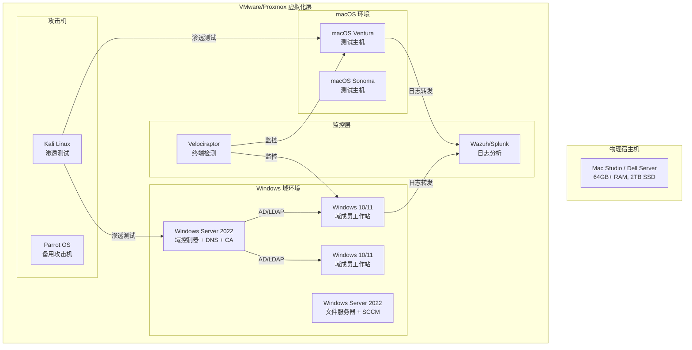
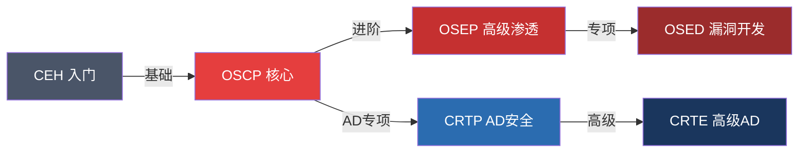

## 七、学习资源

掌握 Windows 和 macOS 底层机制是一场持久战，需要系统化的学习路径、高质量的参考资料和充足的实践环境。本节按**书籍 → 在线资源 → 实践环境 → 学习路径 → 社区与认证**五大维度梳理资源体系，帮助不同阶段的安全从业者找到最适合自己的成长路线。

### 7.1 推荐书籍

#### 7.1.1 Windows 体系

| 书名 | 作者 | 难度 | 核心内容 | 推荐理由 |
|------|------|------|----------|----------|
| **Windows Internals, Part 1**（第7版） | Pavel Yosifovich 等 | ★★★★☆ | 进程/线程、内存管理、I/O 系统、安全模型 | Windows 内核机制的"圣经"，安全研究者的案头必备 |
| **Windows Internals, Part 2**（第7版） | 同上 | ★★★★☆ | 存储、文件系统、启动与关机、崩溃转储分析 | Part 1 的延续，覆盖存储栈和故障排查 |
| **Windows Security Internals** | James Forshaw | ★★★★★ | 访问控制模型、安全描述符、令牌机制、UAC | Google Project Zero 研究员的力作，从安全视角深入 Windows 内核 |
| **Practical Reverse Engineering** | Bruce Dang 等 | ★★★★☆ | x86/x64 逆向、内核调试、漏洞分析 | 以 Windows 为靶标的逆向工程实战指南 |
| **The Art of Memory Forensics** | Michael Hale Ligh 等 | ★★★★☆ | 内存取证、Volatility 框架、恶意软件检测 | 数字取证领域的权威著作，大量 Windows 内存分析案例 |
| **Windows Kernel Programming** | Pavel Yosifovich | ★★★★★ | 驱动开发、内核对象、过滤驱动、回调机制 | 想写内核驱动或理解 rootkit 的读者必读 |
| **Attacking Network Protocols** | James Forshaw | ★★★☆☆ | 协议逆向、Windows 网络协议栈漏洞 | 结合 Windows 网络栈讲解协议安全 |

**阅读建议**：初学者从 *Windows Internals Part 1* 入手，重点理解进程、线程、内存管理三章；中级读者补充 *Windows Security Internals* 理解安全模型；高级研究者阅读 *Windows Kernel Programming* 进入内核驱动层面。

#### 7.1.2 macOS / Apple 体系

| 书名 | 作者 | 难度 | 核心内容 | 推荐理由 |
|------|------|------|----------|----------|
| **\*OS Internals**（Volume I/II/III） | Jonathan Levin | ★★★★★ | 用户态/内核态/安全机制，三卷本 | macOS/iOS 内部机制最全面的参考，没有之一 |
| **The Art of Mac Malware Analysis** | Patrick Wardle | ★★★★☆ | 恶意软件分析方法论、工具链、实战案例 | Objective-See 创始人的著作，macOS 安全研究标杆 |
| **Mac Security Bible** | Rich Trouton | ★★★☆☆ | 企业 macOS 安全管理、MDM、合规配置 | 适合企业安全管理岗位 |
| **Apple Platform Security Guide** | Apple 官方 | ★★★☆☆ | 硬件安全、Secure Boot、系统完整性 | Apple 官方安全白皮书，理解 Apple 安全架构的第一手资料 |
| **Hacking and Securing iOS Applications** | Jonathan Zdziarski | ★★★★☆ | iOS/macOS 共享安全机制、代码签名、沙箱 | 虽以 iOS 为主，但底层机制与 macOS 高度重叠 |

**阅读建议**：先通读 Apple Platform Security Guide 建立全局认知，再用 *\*OS Internals* 三卷本逐层深入。恶意软件分析方向必读 Patrick Wardle 的著作。

#### 7.1.3 跨平台安全与通用基础

| 书名 | 难度 | 适用场景 |
|------|------|----------|
| **Practical Malware Analysis** | ★★★★☆ | 恶意软件分析方法论，Windows 为主但方法通用 |
| **The Shellcoder's Handbook** | ★★★★☆ | 漏洞利用技术，覆盖 Windows/Linux |
| **Reversing: Secrets of Reverse Engineering** | ★★★☆☆ | 逆向工程基础思维，平台无关 |
| **Cryptography Engineering** | ★★★☆☆ | 密码学工程实践，理解各平台加密机制的基础 |
| **Threat Modeling: Designing for Security** | ★★★☆☆ | 安全设计思维，适用于任何操作系统 |

### 7.2 在线资源

#### 7.2.1 官方文档

| 资源 | URL | 说明 |
|------|-----|------|
| Microsoft Learn（Windows） | learn.microsoft.com | Windows API、安全、部署的官方文档库，包含大量示例代码 |
| Microsoft Security Blog | microsoft.com/security/blog | 微软安全团队的技术分析和威胁情报 |
| Apple Developer Documentation | developer.apple.com/documentation | macOS API、框架、安全机制的官方参考 |
| Apple Platform Security | support.apple.com/guide/security | Apple 安全架构白皮书，每年更新 |
| Apple Security Updates | support.apple.com/en-us/100100 | 安全更新公告，含 CVE 详情和修复说明 |
| Windows Dev Center | developer.microsoft.com/windows | 驱动开发、UWP 应用、系统编程资源 |

#### 7.2.2 安全研究博客

| 博客 | 作者/团队 | 专注方向 | 必读指数 |
|------|-----------|----------|----------|
| **Google Project Zero** | Project Zero 团队 | 零日漏洞研究、漏洞利用技术分析 | ★★★★★ |
| **Objective-See** | Patrick Wardle | macOS 恶意软件分析、安全工具 | ★★★★★ |
| **Microsoft MSRC Blog** | 微软安全响应中心 | 漏洞修复分析、安全更新技术细节 | ★★★★☆ |
| **Tiranagallu's Blog** | Alex Matrosov | UEFI 安全、固件攻击、硬件安全 | ★★★★☆ |
| **Hexacorn** | Adam | Windows 持久化技术、恶意软件行为分析 | ★★★★☆ |
| **harmj0y** | Will Schroeder | Active Directory 安全、红队工具 | ★★★★★ |
| **SpecterOps Blog** | SpecterOps 团队 | 攻击路径分析、内网渗透 | ★★★★★ |
| **Theori Blog** | Theori 团队 | 浏览器漏洞、系统漏洞利用 | ★★★★☆ |
| **Synacktiv** | Synacktiv 团队 | macOS/iOS 越狱、内核漏洞 | ★★★★☆ |

#### 7.2.3 渗透测试与安全百科

| 资源 | 说明 | 适用阶段 |
|------|------|----------|
| **HackTricks** (book.hacktricks.xyz) | 渗透测试技巧百科全书，覆盖 Windows/AD/macOS 各技术栈 | 中级 |
| **The Hacker Recipes** (www.thehacker.recipes) | 攻击技术结构化文档，AD 攻击链尤为出色 | 中级 |
| **PayloadsAllTheThings** (GitHub) | 攻击载荷合集，包含 Windows/macOS 特定 payload | 中-高级 |
| **LOLBAS Project** (lolbas-project.github.io) | Living Off The Land 二进制文件/脚本清单 | 中级 |
| **GTFOBins** (gtfobins.github.io) | Unix/macOS 提权二进制清单 | 中级 |
| **LOLAPPS / LOLDRIVERS** | 可被滥用的合法应用和驱动程序清单 | 高级 |
| **ATT&CK Matrix** (attack.mitre.org) | MITRE 攻击知识库，Windows/macOS/Cloud 矩阵完整 | 所有阶段 |
| **CIS Benchmarks** | 安全配置基线，含 Windows Server/macOS 各版本 | 中级 |

#### 7.2.4 在线课程与培训

| 平台 | 课程 | 费用 | 适合人群 |
|------|------|------|----------|
| **SANS** | SEC560（渗透测试）、FOR610（逆向恶意软件） | 付费（$7,000+） | 企业安全从业者 |
| **Offensive Security** | OSEP（高级渗透）、OSED（漏洞开发） | 付费（$1,500+） | 红队/漏洞研究员 |
| **INE/eLearnSecurity** | eCPTX（高级渗透） | 付费（$1,000+） | 中级渗透测试 |
| **Pentester Academy** | Active Directory 攻防系列 | 付费（$249/年） | AD 安全方向 |
| **CyberDefenders** | 蓝队实战平台 | 免费/付费 | 蓝队/取证分析 |
| **TryHackMe** | Windows/AD 攻击路径房间 | 免费/付费 | 入门-中级 |
| **Hack The Box** | Pro Labs（RastaLab、Offshore） | 付费（$14/月起） | 中-高级 |
| **Udemy** | Windows 内核开发、macOS 安全基础 | 付费（$10-50） | 入门 |
| **YouTube - LiveOverflow** | 二进制安全、CTF 解题 | 免费 | 入门-中级 |
| **YouTube - John Hammond** | 恶意软件分析、CTF 解题 | 免费 | 入门-中级 |

### 7.3 实践环境搭建

#### 7.3.1 Windows 实验环境

**基础环境：Windows 评估和部署工具包（ADK）**

ADK 提供了 Windows PE、部署工具、Windows Assessment Toolkit 等组件，是构建 Windows 实验环境的基础。

```powershell
# 下载 ADK（需要 Windows 环境）
# URL: https://learn.microsoft.com/en-us/windows-hardware/get-started/adk-install

# 安装后可用的工具
# - Windows PE 工具：构建自定义启动环境
# - 部署工具：DISM、Windows SIM
# - 性能工具：Windows Assessment Toolkit

# 使用 DISM 挂载和分析 Windows 镜像
dism /Mount-Wim /WimFile:install.wim /Index:1 /MountDir:C:\mount
dism /Image:C:\mount /Get-Packages
dism /Unmount-Wim /MountDir:C:\mount /Discard
```

**调试工具：WinDbg**

WinDbg 是 Windows 内核调试的核心工具，支持用户态和内核态调试。

```powershell
# 安装 WinDbg（Windows 11 自带新版 WinDbg）
# 旧版 WinDbg 随 Windows SDK 安装

# 内核调试配置（VMware 虚拟机）
# 1. 虚拟机内启用调试模式
bcdedit /debug on
bcdedit /dbgsettings serial debugport:1 baudrate:115200

# 2. WinDbg 连接内核调试
# File > Attach to Kernel > COM 端口配置

# 常用 WinDbg 命令
!process 0 0          # 列出所有进程
!object \             # 查看对象目录树
dt nt!_EPROCESS       # 查看进程结构体
!handle               # 查看句柄表
!token                # 查看安全令牌
```

**域环境搭建**

```powershell
# Windows Server 域控制器搭建
Install-WindowsFeature AD-Domain-Services -IncludeManagementTools
Install-ADDSForest -DomainName "lab.local" -DomainNetbiosName "LAB" `
    -ForestMode "WinThreshold" -DomainMode "WinThreshold" `
    -InstallDNS:$true -Force:$true

# 加入域的客户端（PowerShell）
Add-Computer -DomainName "lab.local" -Credential LAB\Administrator -Restart

# 创建测试用户和组
New-ADUser -Name "testuser" -AccountPassword (ConvertTo-SecureString "your_password!" -AsPlainText -Force) -Enabled $true
New-ADGroup -Name "TestGroup" -GroupScope Global -GroupCategory Security
Add-ADGroupMember -Identity "TestGroup" -Members "testuser"
```

**漏洞靶场**

| 靶场 | 说明 | 部署方式 |
|------|------|----------|
| **GOAD** (github.com/Orange-Cyberdefense/GOAD) | Game of Active Directory，含多 DC/多域的完整 AD 攻击链靶场 | Vagrant + VirtualBox/VMware |
| **DetectionLab** (github.com/clong/DetectionLab) | 包含 DC/Win10/WEF/Splunk 的检测实验室 | Vagrant + Packer |
| **VulnAD** | 轻量级 AD 漏洞靶场 | Docker/Vagrant |
| **CRTP Lab** | Altered Security 的 CRTP 认证练习环境 | 付费订阅 |

#### 7.3.2 macOS 实验环境

**虚拟机方案**

```bash
# macOS 在 VMware 中的安装（需要 unlocker 补丁）
# 1. 下载 VMware Unlocker（github.com/DrDonk/unlocker）
# 2. 运行 unlocker 补丁 VMware 对 macOS 的支持
# 3. 创建虚拟机时选择 Apple Mac OS X > macOS 13/14

# VirtualBox 安装 macOS（需要额外配置）
# VBoxManage modifyvm "macOS" --cpuidset 00000001 000106e5 00100800 0098e3fd bfebfbff
# VBoxManage setextradata "macOS" "VBoxInternal/Devices/efi/0/Config/DmiSystemProduct" "iMac19,1"
# VBoxManage setextradata "macOS" "VBoxInternal/Devices/smc/0/Config/DeviceKey" "ourhardworkbythesewordsguardedpleasedontsteal(c)AppleComputerInc"

# 注意：Apple EULA 要求 macOS 只能在 Apple 硬件上运行
# 生产环境中应使用 Apple Mac Mini/Mac Studio 作为实验机
```

**macOS 安全工具链**

```bash
# Objective-See 工具套件（免费）
# BlockBlock    - 持久化监控
# KnockKnock    - 持久化项目扫描
# RansomWhere?  - 勒索软件检测
# TaskExplorer  - 进程分析
# OverSight     - 摄像头/麦克风监控
# KextViewr     - 内核扩展查看
# 下载地址: https://objective-see.com/products.html

# macOS 原生安全工具
codesign -dv --verbose=4 /Applications/Safari.app   # 查看代码签名
spctl --assess --verbose /Applications/Safari.app    # Gatekeeper 评估
csrutil status                                        # SIP 状态
profiles list                                         # 配置描述符
log show --predicate 'subsystem == "com.apple.securityd"' --last 1h  # 安全日志

# 内核调试（需要关闭 SIP）
# 1. 重启进入恢复模式（Cmd+R）
# 2. 终端执行: csrutil disable
# 3. 重启后使用 lldb 进行内核调试
lldb -o "kdp-remote <host_ip>"
```

#### 7.3.3 跨平台实验架构

以下是一个完整的安全实验环境架构建议：



**硬件配置建议**

| 配置项 | 入门方案 | 进阶方案 | 专业方案 |
|--------|----------|----------|----------|
| CPU | 8核16线程 | 16核32线程 | 32核64线程 |
| 内存 | 32GB | 64GB | 128GB+ |
| 存储 | 1TB SSD | 2TB NVMe SSD | 4TB NVMe RAID |
| 网络 | 单网卡 | 双网卡（隔离网段） | 三网卡+管理网 |
| 参考价格 | ¥5,000-8,000 | ¥12,000-20,000 | ¥30,000+ |
| 能运行的虚拟机 | 3-4台 | 8-10台 | 15+台 |

### 7.4 学习路径规划

#### 7.4.1 入门阶段（0-6个月）

**目标**：建立操作系统底层认知，掌握基本的安全分析工具。

```text
第1-2月: 操作系统基础
├── 学习计算机组成原理（CPU、内存、I/O）
├── 理解进程/线程/虚拟内存概念
├── 学习 C 语言基础（能读懂系统级代码）
└── 阅读: 《Windows Internals》Part 1 前3章

第3-4月: 安全基础
├── 学习 MITRE ATT&CK 框架
├── 掌握 Wireshark、Process Monitor、Procmon 基本用法
├── 学习基本的 PowerShell/Bash 脚本
└── 完成 TryHackMe 的 Windows 基础房间

第5-6月: 初步实战
├── 搭建基础 Windows 实验环境
├── 学习 Active Directory 基础概念
├── 完成 Hack The Box 的 Easy 难度 Windows 靶机
└── 开始阅读《Practical Malware Analysis》
```

#### 7.4.2 中级阶段（6-18个月）

**目标**：深入理解安全机制，能独立进行渗透测试和恶意软件分析。

```text
第7-9月: Windows 安全深入
├── 精读《Windows Security Internals》
├── 学习 Windows 访问控制模型（ACL/ACE/DACL/SACL）
├── 掌握 Mimikatz、BloodHound、Rubeus 等工具
├── 理解 Kerberos 认证流程和常见攻击
└── 搭建 GOAD 靶场，完成所有攻击路径

第10-12月: macOS 安全入门
├── 阅读 Apple Platform Security Guide
├── 学习 macOS 安全机制（SIP/Gatekeeper/XProtect）
├── 安装并使用 Objective-See 工具套件
├── 分析 2-3 个公开的 macOS 恶意软件样本
└── 阅读《The Art of Mac Malware Analysis》前半部分

第13-18月: 专项突破
├── 选择方向: 红队渗透 / 蓝队防御 / 恶意软件分析 / 漏洞研究
├── 红队: 学习 BOF、C2 框架、免杀技术
├── 蓝队: 学习 SIEM 部署、日志分析、威胁狩猎
├── 恶意软件: 逆向分析实战，IDA/Ghidra 深入使用
├── 漏洞研究: 学习 Fuzzing、堆溢出、类型混淆
└── 参加 CRTP/CRTE/OSEP 等认证培训
```

#### 7.4.3 高级阶段（18个月+）

**目标**：具备原创漏洞发现能力，能在安全社区输出高质量内容。

```text
深入研究方向:
├── 内核安全: 驱动开发、内核漏洞利用、PatchGuard 绕过
├── 固件安全: UEFI 安全、Secure Boot 绕过、硬件信任根
├── 虚拟化安全: VM 逃逸、Hyper-V 攻击面
├── 供应链安全: 代码签名绕过、包管理器攻击
└── 前沿研究: AI 辅助漏洞发现、自动化模糊测试

输出要求:
├── 定期在安全会议发表演讲（Black Hat / DEF CON / HITB）
├── 维护技术博客，每月至少1篇深度分析
├── 为开源安全工具贡献代码
├── 参与 CVE 编号申请和漏洞披露流程
└── 指导初中级安全从业者
```

### 7.5 安全社区与会议

#### 7.5.1 国际安全会议

| 会议 | 地点 | 时间 | 侧重方向 | 参会建议 |
|------|------|------|----------|----------|
| **Black Hat USA** | 拉斯维加斯 | 每年8月 | 全栈安全研究 | 安全从业者的"奥斯卡"，必去至少一次 |
| **DEF CON** | 拉斯维加斯 | 每年8月（Black Hat 后） | 黑客文化、实战技术 | 更自由开放，Village 分论坛极具价值 |
| **HITB** | 阿姆斯特丹/吉隆坡 | 春/秋季 | 深度技术研究 | 亚洲区性价比最高 |
| **POC** | 首尔 | 每年秋季 | 亚洲安全研究 | 韩国及亚洲安全社区的核心活动 |
| **Zer0con** | 首尔 | 每年春季 | 漏洞研究深度分享 | 小规模高质量，适合高级研究者 |
| **Objective by the Sea** | 摩纳哥 | 每年秋季 | Apple 平台安全 | 唯一的 macOS/iOS 安全专题会议 |
| **BlueHat** | 以色列/中国 | 不定期 | 微软安全生态 | 微软主办，聚焦 Windows 安全 |
| **CanSecWest** | 温哥华 | 每年春季 | 底层安全研究 | Pwn2Own 的举办地 |

#### 7.5.2 中文安全社区

| 社区 | 平台 | 特点 |
|------|------|------|
| **先知社区** | xianzhisecurity.com | 阿里旗下，高质量漏洞分析文章 |
| **安全客** | anquanke.com | 综合安全资讯和技术文章 |
| **看雪论坛** | kxanbbs.com | 逆向工程和二进制安全的老牌社区 |
| **FreeBuf** | freebuf.com | 安全资讯和技术分享 |
| **T00ls** | t00ls.net | 渗透测试技术交流 |
| **吾爱破解** | 52pojie.cn | 逆向工程和软件安全 |
| **安全牛** | aqniu.com | 企业安全和行业分析 |

#### 7.5.3 技术交流渠道

| 渠道 | 说明 |
|------|------|
| **Twitter/X** | 安全研究者的第一手信息源，关注 @tavaborle、@patrickwardle、@haborj0y、@0gtweet 等 |
| **Discord** | 多个安全社区的 Discord 服务器（HackTheBox、Red Team Ops 等） |
| **Reddit** | r/netsec（综合安全）、r/malware（恶意软件）、r/ReverseEngineering（逆向） |
| **Mastodon** | infosec.exchange 实例上的安全社区 |
| **GitHub** | 关注 Orange-Cyberdefense、SpecterOps、WithSecureLabs 等组织 |

### 7.6 安全认证路径

#### 7.6.1 红队/渗透方向



| 认证 | 颁发机构 | 费用 | 难度 | 含金量 |
|------|----------|------|------|--------|
| **CEH** | EC-Council | $1,199 | ★★☆☆☆ | 入门敲门砖，实操性弱 |
| **OSCP** | OffSec | $1,599 | ★★★★☆ | 渗透测试行业标杆，必考 |
| **OSEP** | OffSec | $1,599 | ★★★★★ | 高级渗透和免杀技术 |
| **OSED** | OffSec | $1,599 | ★★★★★ | Windows 漏洞开发 |
| **CRTP** | Altered Security | $249 | ★★★☆☆ | AD 攻击的性价比之选 |
| **CRTE** | Altered Security | $499 | ★★★★☆ | 高级 AD 攻击和防御 |
| **GPEN** | SANS/GIAC | $2,499+ | ★★★☆☆ | 企业认可度高 |
| **GXPN** | SANS/GIAC | $2,499+ | ★★★★★ | 高级漏洞利用和逆向 |

#### 7.6.2 蓝队/防御方向

| 认证 | 颁发机构 | 费用 | 难度 | 含金量 |
|------|----------|------|------|--------|
| **BTL1** | Security Blue Team | $499 | ★★★☆☆ | 蓝队入门性价比之选 |
| **BTL2** | Security Blue Team | $999 | ★★★★☆ | 高级蓝队操作 |
| **GCIA** | SANS/GIAC | $2,499+ | ★★★★☆ | 网络流量分析 |
| **GCIH** | SANS/GIAC | $2,499+ | ★★★☆☆ | 事件处理和响应 |
| **GCFA** | SANS/GIAC | $2,499+ | ★★★★☆ | 取证分析 |
| **SC-200** | Microsoft | $165 | ★★★☆☆ | Microsoft 安全运营分析师 |

#### 7.6.3 macOS/Apple 专项

目前 Apple 平台安全没有专门的国际认证，但以下路径可以证明专业能力：

- **Jamf Certified Technician** — macOS 企业管理和安全配置
- **CompTIA Security+** — 通用安全基础（入门）
- **Objective by the Sea 演讲** — 在 Apple 安全会议上发表研究
- **CVE 致谢** — 在 Apple 安全更新中获得致谢是最好的能力证明

### 7.7 工具与软件清单

#### 7.7.1 逆向分析工具

| 工具 | 平台 | 用途 | 费用 |
|------|------|------|------|
| **IDA Pro** | 跨平台 | 行业标准反汇编器 | 付费（$1,800+）/ 免费版可用 |
| **Ghidra** | 跨平台 | NSA 开源逆向框架，支持多种架构 | 免费 |
| **Binary Ninja** | 跨平台 | 现代反汇编器，API 友好 | 付费（$299+）/ 云版免费 |
| **x64dbg** | Windows | Windows 用户态调试器 | 免费 |
| **WinDbg** | Windows | 内核/用户态调试器 | 免费（随 SDK） |
| **lldb** | macOS/Linux | 内核调试（macOS 原生支持） | 免费 |
| **Hopper** | macOS/Linux | macOS 友好的反汇编器 | 付费（$99） |
| **radare2/rizin** | 跨平台 | 命令行逆向框架 | 免费 |

#### 7.7.2 渗透测试工具

| 工具 | 用途 | 关联章节 |
|------|------|----------|
| **Cobalt Strike / Sliver / Havoc** | C2 框架 | 核心技巧 |
| **BloodHound** | AD 攻击路径可视化 | Active Directory 安全 |
| **Mimikatz** | Windows 凭据提取 | Windows 安全机制 |
| **Impacket** | Windows 协议工具库 | 跨平台安全 |
| **CrackMapExec / NetExec** | AD 网络攻击瑞士军刀 | Active Directory 安全 |
| **Rubeus** | Kerberos 攻击工具 | Windows 安全机制 |
| **Seatbelt** | 主机安全审计 | 安全监控 |
| **SharpHound** | AD 数据收集 | Active Directory 安全 |

#### 7.7.3 macOS 专用安全工具

| 工具 | 开发者 | 用途 |
|------|--------|------|
| **BlockBlock** | Objective-See | 持久化监控（实时告警新增持久化项目） |
| **KnockKnock** | Objective-See | 扫描已安装的持久化软件 |
| **RansomWhere?** | Objective-See | 勒索软件行为检测 |
| **TaskExplorer** | Objective-See | 详细的进程分析（加载的 dylib、签名信息） |
| **OverSight** | Objective-See | 监控摄像头/麦克风访问 |
| **Santa** | Google | macOS 应用白名单/黑名单控制 |
| **osquery** | Facebook/Linux Foundation | 跨平台终端查询（类 SQL 查询系统状态） |
| **Falcon for macOS** | CrowdStrike | 商业 EDR（macOS 版本） |

#### 7.7.4 日志分析与取证

| 工具 | 用途 | 支持平台 |
|------|------|----------|
| **Volatility 3** | 内存取证框架 | Windows/macOS/Linux |
| **Velociraptor** | 终端监控和取证 | Windows/macOS/Linux |
| **KAPE** | Windows 取证数据快速收集 | Windows |
| **Plaso/log2timeline** | 统一时间线生成 | 跨平台 |
| **Chainsaw** | Windows 事件日志快速搜索 | Windows |
| **Wazuh** | 开源 SIEM/EDR | 跨平台 |
| **Elastic Security** | 日志分析和威胁检测 | 跨平台 |

### 7.8 研究论文与技术报告

#### 7.8.1 必读论文

| 论文/报告 | 作者 | 主题 | 重要性 |
|-----------|------|------|--------|
| **"Machiavelli: Apple M1"** | Asuna et al. | Apple M1 芯片安全架构分析 | ★★★★★ |
| **"A Systematic Study of the macOS Attack Surface"** | Patrick Wardle | macOS 攻击面系统分析 | ★★★★★ |
| **"Subverting Trust in Windows"** | Matt Graeber | Windows 信任机制绕过 | ★★★★☆ |
| **"Kerberos Golden Tickets"** | Alva Duckwall & Benjamin Delpy | Kerberos 金票攻击 | ★★★★☆ |
| **"Sandbox Escapes"** | Various (Black Hat archive) | 沙箱逃逸技术汇编 | ★★★★☆ |
| **"UEFI Bootkit Research"** | ESET Research | UEFI 启动套件分析 | ★★★★☆ |

#### 7.8.2 威胁情报来源

| 来源 | 说明 |
|------|------|
| **MITRE ATT&CK** | 攻击技术知识库，每季度更新 |
| **CISA Advisories** | 美国网络安全和基础设施安全局公告 |
| **Microsoft Security Response Center** | 微软安全公告和漏洞修复信息 |
| **Apple Security Updates** | Apple 安全更新公告 |
| **VirusTotal** | 恶意软件样本库和分析平台 |
| **MalwareBazaar** | 恶意样本共享平台 |
| **Any.Run** | 在线交互式沙箱分析 |

### 7.9 常见学习误区

| 误区 | 正确做法 |
|------|----------|
| 只看书不动手 | 每读完一章必须在实验环境验证，理论和实操比例至少 3:7 |
| 工具依赖症 | 理解工具背后的原理比会用工具更重要，尝试自己实现简化版 |
| 忽视防御侧 | 红队技术必须结合蓝队视角，否则无法理解真实攻击场景 |
| 追新弃旧 | 基础机制（内存管理、访问控制）几十年未变，经典知识永不过时 |
| 孤立学习 | 加入社区，参与 CTF，读别人的技术博客，交流产生灵感 |
| 跳过文档 | 遇到问题先查官方文档，再搜社区，最后问 AI — 培养独立排查能力 |
| 不写笔记 | 用 Obsidian/Notion 建立个人知识库，写博客是最好的学习方式 |

### 7.10 持续学习策略

安全领域技术迭代极快，保持学习的节奏比任何单一知识点都重要。以下是经过验证的持续学习框架：

1. **每日**：花 30 分钟浏览 Twitter/X 上的安全研究者动态，关注 CVE 更新
2. **每周**：完成 1-2 台 Hack The Box / TryHackMe 靶机，保持手感
3. **每月**：精读 1-2 篇高质量技术博客或研究论文，输出读书笔记
4. **每季度**：学习一个新技术领域或工具，扩展知识面
5. **每年**：参加至少 1 个安全会议（线上或线下），考取 1 个认证

> **核心理念**：安全研究不是一朝一夕的事。操作系统底层知识需要反复咀嚼，每次重读 *Windows Internals* 或 *\*OS Internals* 都会有新的理解。保持好奇心，持续实践，在社区中分享和交流 — 这是从入门到精通的唯一路径。

通过系统化的学习和持续的实践，安全从业者能够深入理解 Windows 和 macOS 的底层机制，准确识别攻击面，制定有效的防御策略。这些底层知识是所有高级安全技术的根基，值得投入时间和精力去扎实掌握。
