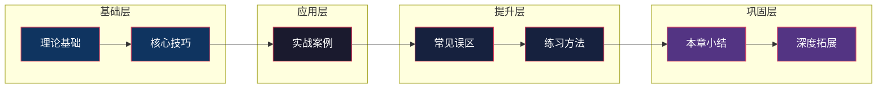

# 第08章 编程语言——Python

## 一、为什么安全工程师必须掌握 Python

在网络安全领域，Python 不是"可选项"，而是"必备技能"。这不是一句空洞的口号——我们可以从具体数据和行业实践中验证这一点。

### 1.1 行业数据支撑

根据 2024-2025 年的安全行业调研数据：

| 指标 | 数据 | 说明 |
|------|------|------|
| 渗透测试工具中 Python 占比 | 约 70% | GitHub 上标星的安全工具项目 |
| 安全岗位 JD 要求 Python 的比例 | 85%+ | 拉勾、Boss直聘等平台统计 |
| CTF 竞赛中使用最多的语言 | Python (60%+) | 各大 CTF 平台解题统计 |
| CVE PoC 以 Python 发布的比例 | 约 40% | Exploit-DB 历史数据 |
| 安全框架原生支持 Python | 近乎 100% | Metasploit、Burp Suite、Nmap 等 |

### 1.2 Python 相较于其他安全语言的定位

安全工程师日常会接触多种编程语言，每种语言都有其最佳应用场景。理解 Python 在其中的定位，才能在正确的场景使用正确的工具：

| 语言 | 安全领域定位 | 优势场景 | 劣势场景 |
|------|-------------|----------|----------|
| **Python** | 安全工具开发、自动化脚本、PoC 编写 | 快速原型、库生态丰富、易读易维护 | 运行速度慢、二进制分发不便 |
| **Go** | 高性能安全工具、云原生安全 | 编译为单文件、并发原生、跨平台编译 | 编写效率不如 Python、库生态稍弱 |
| **Rust** | 底层安全工具、免杀 Payload | 内存安全、极小二进制、难以逆向 | 学习曲线陡峭、开发周期长 |
| **C/C++** | 漏洞利用、内核安全、逆向工程 | 直接操作内存、系统级编程 | 开发效率低、容易引入安全漏洞 |
| **JavaScript** | Web 安全、浏览器安全、前端攻击 | 浏览器原生语言、Node.js 生态 | 不适合系统级安全任务 |
| **PowerShell** | Windows 环境渗透、后渗透 | Windows 原生、AD 操作强大 | 仅限 Windows、日志痕迹明显 |
| **Bash/Shell** | Linux 系统管理、简单自动化 | 系统原生、轻量快速 | 复杂逻辑处理能力弱 |

**核心结论**：Python 是安全工程师的"瑞士军刀"——不是每个场景都最优，但几乎每个场景都能胜任，且开发效率最高。掌握 Python 后，再根据具体需求学习 Go（高性能工具）或 Rust（免杀/底层工具）作为补充。

### 1.3 Python 在安全工作流中的角色

```mermaid
graph TD
    A[安全测试工作流] --> B[信息收集阶段]
    A --> C[漏洞发现阶段]
    A --> D[漏洞利用阶段]
    A --> E[后渗透阶段]
    A --> F[报告输出阶段]

    B --> B1[Python: 子域名枚举脚本]
    B --> B2[Python: 端口扫描工具]
    B --> B3[Python: 指纹识别脚本]
    B --> B4[Python: 目录爆破工具]

    C --> C1[Python: PoC 验证脚本]
    C --> C2[Python: 漏洞扫描器]
    C --> C3[Python: Fuzzing 框架]

    D --> D1[Python: Payload 生成器]
    D --> D2[Python: 利用脚本编写]
    D --> D3[Python: 反弹 Shell 处理]

    E --> E1[Python: 权限提升检查]
    E --> E2[Python: 横向移动工具]
    E --> E3[Python: 凭据提取脚本]

    F --> F1[Python: 报告自动生成]
    F --> F2[Python: 数据可视化]
    F --> F3[Python: 日志分析]

    style A fill:#1a1a2e,stroke:#e94560,color:#fff
    style B fill:#16213e,stroke:#0f3460,color:#fff
    style C fill:#16213e,stroke:#0f3460,color:#fff
    style D fill:#16213e,stroke:#0f3460,color:#fff
    style E fill:#16213e,stroke:#0f3460,color:#fff
    style F fill:#16213e,stroke:#0f3460,color:#fff
```



## 二、学习目标

通过本章学习，读者将建立完整的 Python 安全编程知识体系。以下目标按能力层级递进排列——每一层都是下一层的基础。

### 2.1 基础能力层（入门 → 入行）

| 目标 | 具体能力 | 验证标准 |
|------|----------|----------|
| 掌握 Python 安全编程基础 | 理解 Python 在安全领域的独特优势；熟练使用核心语法编写安全相关代码；掌握标准库中与安全相关的模块（socket、hashlib、ssl、subprocess 等） | 能独立编写 50 行以上的安全脚本且无语法错误 |
| 理解安全相关数据结构 | 能用字典存储扫描结果、用列表管理目标、用集合去重端口；理解 bytes 与 str 的区别及在安全场景中的应用 | 能正确处理网络数据的编解码 |

### 2.2 工具开发层（入行 → 胜任）

| 目标 | 具体能力 | 验证标准 |
|------|----------|----------|
| 开发渗透测试工具 | 能够编写端口扫描器（TCP 全连接/SYN 半开）、目录爆破器、密码字典生成器等实用工具 | 工具能正确运行且效率不低于同类开源工具的 50% |
| 实现网络协议编程 | 掌握 socket 编程（TCP/UDP）、HTTP 请求构造（GET/POST/PUT/DELETE 及自定义 Header）、DNS 解析与协议实现、原始套接字操作 | 能用 raw socket 实现自定义协议通信 |
| 进行安全自动化 | 使用 Python 实现安全测试流程自动化、漏洞批量验证、测试报告自动生成（HTML/PDF/JSON 格式） | 能将手动 2 小时的工作压缩到 10 分钟内自动完成 |

### 2.3 高级应用层（胜任 → 精通）

| 目标 | 具体能力 | 验证标准 |
|------|----------|----------|
| 集成现有安全框架 | 学会与 Metasploit RPC（msfrpc）、Burp Suite API、Nmap Python 库（python-nmap）等工具集成；掌握 HTTP API 调用和消息队列通信 | 能编写自动调用 Metasploit 模块进行批量利用的脚本 |
| 开发高级安全工具 | 理解 C2 框架架构、Web 漏洞扫描器设计、流量分析工具开发 | 能独立设计并实现一个功能完整的安全工具（1000+ 行代码） |
| 掌握安全编码实践 | 理解输入验证、命令注入防御（从攻击者和防御者双重视角）、安全的密码处理方式 | 能审计 Python 代码中的安全漏洞并修复 |

## 三、内容结构

本章按照"理论→技巧→实战→纠错→练习→总结→拓展"七层递进结构组织，每个模块都有明确的定位和学习价值。

### 3.1 章节结构总览



### 3.2 各模块详细说明

#### 第一部分：理论基础（理论基础/ 目录）

**定位**：建立知识地基，回答"是什么"和"为什么"。

| 文件 | 核心内容 | 解决的问题 |
|------|----------|-----------|
| 01-一Python在安全领域的优势 | Python 语言特性、生态系统、跨平台能力；与 C/Go/Rust 的对比分析 | 为什么选 Python 而不是其他语言 |
| 02-二Python语言基础 | 数据类型、控制结构、函数、面向对象、异常处理；安全场景代码示例 | Python 语法不过关怎么办 |
| 03-三网络编程基础 | socket 编程（TCP/UDP/原始套接字）、HTTP 协议实现、DNS 操作、异步网络编程 | 如何用 Python 操作网络协议 |
| 04-四安全库详解 | requests、scapy、cryptography、pwntools、paramiko 等核心安全库的深度使用 | 安全开发有哪些现成的轮子 |
| 05-五Python安全编码实践 | 输入验证、SQL 注入防御、命令注入防御、安全的密码处理、日志安全 | 如何写出安全的 Python 代码 |
| 06-六Python版本与环境 | Python 2 vs 3 差异、虚拟环境管理、依赖管理、跨平台兼容、容器化部署 | 环境配置踩坑怎么避 |

#### 第二部分：核心技巧（核心技巧/ 目录）

**定位**：掌握实战技术，回答"怎么做"和"怎么做得好"。

| 文件 | 核心内容 | 解决的问题 |
|------|----------|-----------|
| 01-1网络编程核心技巧 | socket 高级用法、连接池管理、代理设置、SSL/TLS 处理、超时与重试策略 | 网络编程的坑怎么避开 |
| 02-2多线程与异步编程 | threading、multiprocessing、asyncio、concurrent.futures；GIL 的影响与规避 | 扫描速度慢怎么提速 |
| 03-3加密与编码技巧 | 对称/非对称加密、哈希算法、Base64/Hex 编码、JWT 处理、证书操作 | 数据加密和编码怎么实现 |
| 04-4Web安全核心技巧 | HTTP 请求高级技巧、Session 管理、Cookie 操作、CSRF Token 处理、API 测试 | Web 安全测试怎么做 |
| 05-5数据处理技巧 | JSON/XML/CSV 解析、正则表达式、日志解析、数据清洗与分析 | 海量数据怎么高效处理 |
| 06-6与安全工具集成 | Nmap、Metasploit、Burp Suite、SQLMap 等工具的 Python 集成方案 | 怎么用 Python 操控安全工具 |
| 07-7反弹Shell与C2通信 | 反弹 Shell 实现（TCP/UDP/HTTP/ICMP）、C2 命令控制、通信加密、流量伪装 | 后渗透通信怎么实现 |
| 08-8关键技巧总结 | 速查手册、常用代码片段、性能优化清单 | 快速查阅常用技巧 |

#### 第三部分：实战案例（实战案例/ 目录）

**定位**：通过完整项目巩固技能，回答"真实项目长什么样"。

| 文件 | 核心内容 | 学到的综合能力 |
|------|----------|---------------|
| 01-案例一多线程端口扫描器 | 完整的 TCP 端口扫描器：多线程 + SYN 扫描 + 服务指纹识别 + 结果导出 | socket 编程 + 多线程 + 服务识别 |
| 02-案例二Web漏洞扫描器 | Web 漏洞自动检测器：SQL 注入 + XSS + 目录遍历 + 信息泄露检测 | HTTP 编程 + 漏洞检测逻辑 + 报告生成 |
| 03-案例三密码破解工具 | 多协议密码爆破工具：SSH + FTP + HTTP Basic Auth + 字典管理 | 并发编程 + 协议交互 + 字典处理 |
| 04-案例四自动化信息收集脚本 | 信息收集集成工具：子域名 + 端口 + Whois + DNS + HTTP 指纹 | API 调用 + 数据聚合 + 报告输出 |
| 05-案例总结 | 案例对比分析、设计模式提炼、代码质量标准 | 从案例中抽象通用方法论 |

#### 第四部分：常见误区（04-常见误区.md）

**定位**：识别并纠正常见错误，防止"学了但用错"。

涵盖但不限于：
- 认为 Python 慢所以不能做安全工具（实际情况与优化方案）
- 混淆 bytes 和 str 导致网络编程错误
- 忽视异常处理导致工具在关键时刻崩溃
- 使用 eval/exec 处理不受信任的输入
- 硬编码凭据和敏感信息
- 不处理超时导致工具挂死
- 滥用全局变量在多线程场景中的数据竞争

#### 第五部分：练习方法（05-练习方法.md）

**定位**：提供系统化的学习路径，从"看懂"到"会做"。

包含三个阶段的练习设计：
1. **基础巩固期**（2 周）：语法练习 + 标准库使用 + 小脚本编写
2. **技能提升期**（3 周）：安全工具复现 + 开源项目阅读 + 功能模块开发
3. **综合实战期**（2 周）：独立完成完整安全工具 + 代码审计 + 性能优化

#### 第六部分：本章小结（06-本章小结.md）

**定位**：回顾全章核心知识点，形成知识图谱。

#### 第七部分：深度拓展（07-深度拓展.md）

**定位**：面向高级读者，探索前沿主题和深度技术。

包含：Python 安全开发的高级模式、二进制分析中的 Python 应用、Python 与 Rust/Go 的混合编程、安全 AI/ML 工具开发等。

## 四、前置知识

学习本章前，读者需要具备以下基础知识。不具备也不必担心——可以先学习对应章节补充基础后再回来。

### 4.1 必须具备

| 知识领域 | 具体要求 | 补充学习 |
|----------|----------|----------|
| 基本编程概念 | 理解变量、数据类型、循环、条件判断、函数等基本概念。不要求有 Python 经验，但需要有任意一门编程语言的基础 | 如果完全零基础，建议先学习第 05 章《计算机网络基础》前先自学 Python 基础语法（推荐《Python Crash Course》前 5 章） |
| 计算机网络基础 | 理解 TCP/IP 协议栈、HTTP 请求/响应模型、DNS 解析流程、端口与服务的概念 | 第 05 章《计算机网络基础》 |
| Linux 命令行基础 | 能在终端中执行命令、管理文件、使用管道和重定向。安全测试环境以 Linux 为主 | 第 06 章《操作系统基础——Linux》 |

### 4.2 建议具备（可同步学习）

| 知识领域 | 作用 | 补充学习 |
|----------|------|----------|
| Web 基础（HTML/HTTP） | 理解 Web 安全测试中的请求构造和响应分析 | 第 05 章相关内容 |
| 数据结构基础 | 理解列表、字典、集合等数据结构的底层原理和时间复杂度 | 任何算法入门教程 |
| 基本的密码学概念 | 理解加密、哈希、编码的区别 | 本章理论基础部分会涉及 |

## 五、学习路线建议

不同基础的读者可以选择不同的学习路线。以下是三种典型场景的推荐路径：

### 5.1 零编程基础的安全爱好者

```text
理论基础/02（语言基础，先补语法）
    → 理论基础/01（了解安全领域应用）
    → 核心技巧/01（从网络编程开始练手）
    → 实战案例/01（端口扫描器，第一个完整项目）
    → 理论基础/03-06（补充理论深度）
    → 核心技巧/02-08（按需学习各技巧）
    → 实战案例/02-04（更多项目实战）
    → 常见误区 + 练习方法（查漏补缺）
    → 深度拓展（进阶方向）
```

**预计时间**：80-100 小时（4-5 周全日制）

### 5.2 有 Python 基础的安全从业者

```text
理论基础/01（快速了解安全领域定位）
    → 理论基础/04-05（安全库 + 安全编码，重点）
    → 核心技巧（全部，按需调整顺序）
    → 实战案例（全部，重点关注高级案例）
    → 常见误区（避坑）
    → 深度拓展（提升）
```

**预计时间**：50-65 小时（2-3 周全日制）

### 5.3 经验丰富的安全工程师（查漏补缺）

```text
直接跳转到感兴趣的模块
    → 常见误区（看看有没有踩过的坑）
    → 深度拓展（高级主题）
    → 核心技巧/06-07（工具集成 + C2 通信）
    → 实战案例/05（案例总结与方法论）
```

**预计时间**：20-30 小时（按需学习）

### 5.4 学习时间分配建议

| 学习阶段 | 理论学习 | 实践练习 | 综合项目 | 小计 |
|----------|----------|----------|----------|------|
| 理论基础 | 15-18 小时 | 5-7 小时 | — | 20-25 小时 |
| 核心技巧 | 8-10 小时 | 15-20 小时 | — | 23-30 小时 |
| 实战案例 | 3-5 小时 | 5-8 小时 | 10-12 小时 | 18-25 小时 |
| 常见误区 + 练习 + 小结 | 3-4 小时 | 5-8 小时 | 5-8 小时 | 13-20 小时 |
| 深度拓展 | 5-8 小时 | 5-8 小时 | — | 10-16 小时 |
| **总计** | **34-45 小时** | **35-51 小时** | **15-20 小时** | **84-116 小时** |

> **提示**：以上时间为"扎实学习"的估计。如果你已有 Python 基础，理论学习时间可压缩 50%+；如果目标是快速上手做工具，可优先学习核心技巧和实战案例，理论部分作为参考查阅。

## 六、核心重点

以下是本章的五大核心主题，它们贯穿全章始终——无论你学到哪个模块，都应时刻思考该知识点与这些核心主题的关联。

### 6.1 Python 是安全工程师的第一语言

这不是偏好问题，而是效率问题。安全工作强调快速迭代：发现漏洞 → 编写 PoC → 验证利用 → 输出报告，整个流程需要在数小时内完成。Python 的动态类型、简洁语法和 REPL 交互式编程模式，使得从"想法"到"可运行代码"的路径最短。与其他语言相比：

- 同样的端口扫描器，Python 约 30 行代码，Java 需要 100+ 行
- 同样的 HTTP 请求脚本，Python 用 requests 库 5 行搞定，C 语言需要处理 socket + HTTP 协议解析 200+ 行
- Python 的 IPython/Jupyter 交互环境让安全研究者可以边探索边编码，实时看到结果

### 6.2 网络编程能力是 Python 安全应用的基础

安全工作的核心对象是网络——无论是 Web 应用、内网渗透还是流量分析，都需要深入理解网络协议并通过代码操控网络通信。本章中的 socket 编程、HTTP 协议操作、DNS 解析等内容是后续所有安全工具开发的地基。如果网络编程不扎实，后面的漏洞利用、C2 通信、流量分析全部无从谈起。

### 6.3 库的使用能力决定工具开发效率

Python 的强大不在于语言本身，而在于其庞大的第三方库生态。一个安全工程师的 Python 水平，很大程度上体现在对安全相关库的掌握程度上。本章将系统讲解 `requests`（HTTP 操作）、`scapy`（网络包构造）、`cryptography`（加解密）、`pwntools`（二进制利用）、`paramiko`（SSH 操作）等核心库的使用方法和最佳实践。

### 6.4 代码质量直接影响安全工具的可靠性

安全工具与普通脚本有一个本质区别：**安全工具在对抗环境中运行**。目标系统可能有 WAF、IDS、速率限制等防御措施；工具自身的 Bug 可能导致漏报（安全风险）或误报（效率浪费）。因此，安全工具的代码质量要求比普通脚本更高——需要健壮的异常处理、准确的结果校验、清晰的日志记录和可维护的代码结构。

### 6.5 与现有工具集成是实际工作的常态

在实际安全工作中，很少从零开始写所有工具。更多时候是用 Python 作为"胶水语言"，将各种安全工具串联起来形成自动化流程。例如：用 python-nmap 调用 Nmap 扫描端口 → 解析结果 → 用 requests 对开放端口进行 Web 指纹识别 → 自动生成漏洞报告。这种集成能力是区分"会写脚本"和"能做安全工程"的关键分水岭。

## 七、章节价值

本章内容不是孤立的知识点，而是与安全工程师日常工作的五大核心领域直接关联。学完本章后，你将在以下领域获得可量化的技能提升：

### 7.1 渗透测试

| 应用场景 | Python 能做什么 | 对应章节 |
|----------|----------------|----------|
| 信息收集 | 编写子域名枚举器、端口扫描器、目录扫描器、指纹识别工具 | 理论基础/03 + 实战案例/01、04 |
| 漏洞验证 | 为新发现的 CVE 快速编写 PoC 脚本，验证漏洞是否存在 | 核心技巧/04 + 实战案例/02 |
| 自动化测试 | 将重复性的渗透测试流程自动化，提升 10 倍效率 | 核心技巧/06 + 实战案例/05 |

### 7.2 安全研究

| 应用场景 | Python 能做什么 | 对应章节 |
|----------|----------------|----------|
| PoC 编写 | 为漏洞编写概念验证代码，展示漏洞利用过程 | 核心技巧/01-04 |
| 漏洞分析 | 使用 pwntools 进行二进制漏洞分析和利用开发 | 理论基础/04 |
| Fuzzing | 基于 Python 构建协议 Fuzzer，发现未知漏洞 | 深度拓展 |

### 7.3 红队攻防

| 应用场景 | Python 能做什么 | 对应章节 |
|----------|----------------|----------|
| C2 开发 | 实现命令控制框架的核心通信模块 | 核心技巧/07 |
| 免杀工具 | 编写 Payload 编码器和混淆器 | 深度拓展 |
| 横向移动 | 自动化网络内的凭据收集和横向渗透 | 实战案例/03 |

### 7.4 蓝队防御

| 应用场景 | Python 能做什么 | 对应章节 |
|----------|----------------|----------|
| 安全监控 | 编写网络流量分析脚本、异常检测工具 | 核心技巧/05 |
| 日志分析 | 解析海量日志数据，提取安全事件和攻击模式 | 核心技巧/05 |
| 威胁检测 | 基于 IOC（威胁指标）编写自动化检测脚本 | 实战案例/04 |

### 7.5 安全运营

| 应用场景 | Python 能做什么 | 对应章节 |
|----------|----------------|----------|
| 自动化运维 | 批量漏洞扫描、补丁状态检查、资产清点 | 实战案例/04 |
| 报告生成 | 自动生成 HTML/PDF 格式的安全评估报告 | 核心技巧/05 |
| 数据处理 | 清洗和分析安全数据，生成统计图表 | 核心技巧/05 |

## 八、安全开发环境搭建

在正式学习前，建议搭建一个安全的、隔离的 Python 安全开发环境。以下是推荐的环境配置方案：

### 8.1 Python 版本选择

**强烈建议使用 Python 3.10+**。Python 2 已于 2020 年 1 月 1 日正式停止维护，不再接收安全更新。本章所有代码示例均基于 Python 3.10+ 语法编写。

| 版本 | 状态 | 建议 |
|------|------|------|
| Python 2.7 | 已停止维护（EOL） | 仅在维护遗留工具时使用 |
| Python 3.8-3.9 | 安全维护阶段 | 可用但建议升级 |
| Python 3.10-3.12 | 当前稳定版 | **推荐版本** |
| Python 3.13+ | 最新版 | 关注但生产环境慎用 |

### 8.2 虚拟环境配置

安全开发中使用虚拟环境是**必须的**，原因有二：
1. 不同安全工具可能依赖同一个库的不同版本（如 scapy 的不同版本接口差异较大）
2. 防止安全工具的依赖污染系统 Python 环境

```bash
# 创建安全工具专用虚拟环境
python3 -m venv ~/security-venv
source ~/security-venv/bin/activate

# 安装核心安全库
pip install requests scapy cryptography pwntools paramiko python-nmap beautifulsoup4

# 冻结依赖（便于复现环境）
pip freeze > requirements.txt

# 退出虚拟环境
deactivate
```

### 8.3 推荐的开发环境组合

| 组件 | 推荐方案 | 说明 |
|------|----------|------|
| 操作系统 | Kali Linux / Parrot OS | 预装大量安全工具，Python 环境就绪 |
| Python 管理 | pyenv + venv | pyenv 管理多版本，venv 管理项目依赖 |
| 编辑器/IDE | VS Code + Python 扩展 / PyCharm | 代码补全、调试、Linting 一体化 |
| 交互环境 | IPython / Jupyter Notebook | 安全研究中的交互式探索利器 |
| 版本控制 | Git | 所有安全工具代码必须纳入版本管理 |

### 8.4 实验环境建议

安全工具的开发和测试**必须在隔离环境中进行**：

- **虚拟机**：VirtualBox/VMware 运行 Kali Linux + 目标靶机（Metasploitable、DVWA、VulnHub）
- **Docker**：使用 docker-compose 编排攻击机 + 靶机环境
- **云实验室**：利用云服务器搭建临时测试环境，用完即销毁
- **CTF 平台**：HackTheBox、TryHackMe、攻防世界等在线靶场

## 九、学习时间建议

根据目标不同，以下是三种学习深度的时间规划：

| 学习目标 | 理论学习 | 实践练习 | 综合项目 | 总计 | 预期成果 |
|----------|----------|----------|----------|------|----------|
| **快速入门**（能用 Python 做基本安全操作） | 10-15 小时 | 15-20 小时 | 5-8 小时 | 30-43 小时（约 2 周） | 能编写简单的扫描脚本和自动化工具 |
| **系统学习**（具备独立开发安全工具的能力） | 20-25 小时 | 30-40 小时 | 15-20 小时 | 65-85 小时（约 3-4 周） | 能独立开发中等复杂度的安全工具 |
| **深度掌握**（达到专业安全开发水平） | 30-40 小时 | 50-60 小时 | 25-35 小时 | 105-135 小时（约 6-8 周） | 能设计架构级安全工具并指导他人开发 |

---

> ⚠️ **安全警告与免责声明**
>
> 本章内容仅供**合法的安全测试与教育目的**使用。所有技术、工具和方法的讨论均旨在帮助安全从业者在**获得明确授权**的前提下进行防御性安全研究。
>
> - 🚫 **未经授权**对任何系统、网络或应用进行安全测试是**违法行为**
> - ✅ 所有实践活动应在**隔离的实验环境**中进行（如虚拟机、CTF 平台）
> - ✅ 遵守所在国家和地区的**网络安全法律法规**（《中华人民共和国网络安全法》等）
> - ✅ 遵循**负责任的漏洞披露**原则
>
> 作者不对因滥用本章内容造成的任何后果承担责任。
