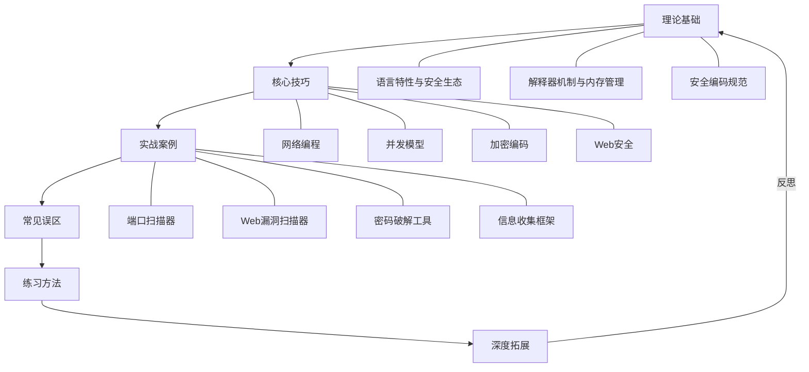
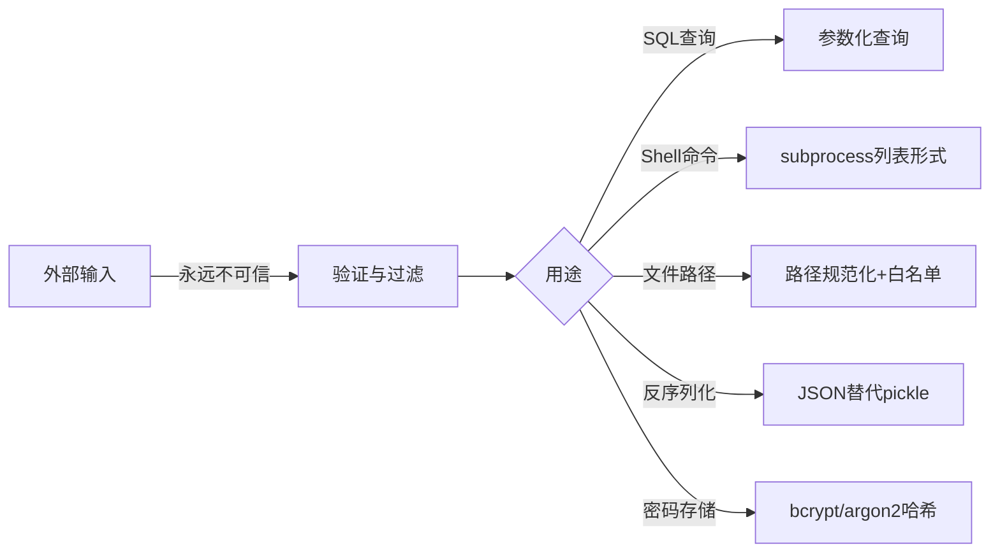
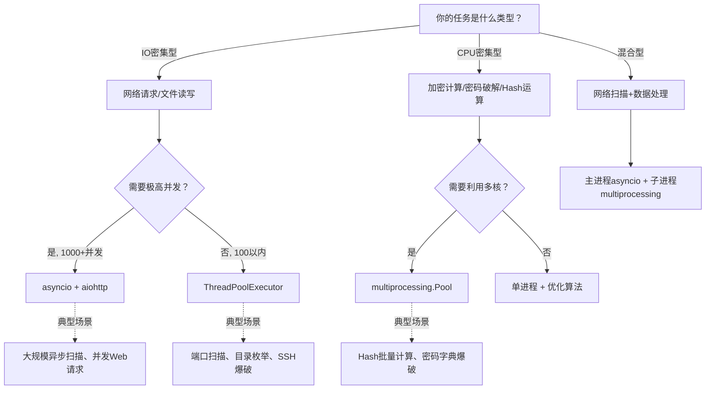
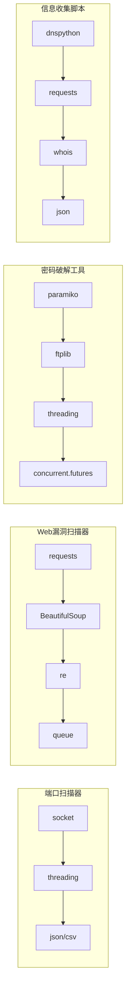
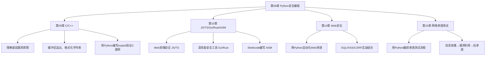

# 第08章 本章小结

本章从理论到实践，系统构建了Python安全编程的完整知识体系。本小结不是简单的要点罗列，而是对全章内容的**结构化复盘**——帮助你将零散的知识点串联成网，发现尚未掌握的薄弱环节，并为下一阶段的学习提供清晰路线图。

## 一、知识体系全景回顾

本章六大模块构成了一个**递进式学习闭环**：



| 模块 | 定位 | 核心产出 |
|------|------|---------|
| 理论基础 | **道**——为什么这样写 | Python安全编程的底层认知：解释器工作原理、内存管理机制、安全编码原则 |
| 核心技巧 | **法**——怎么写 | 8大技术领域的关键手法：网络、并发、加密、Web、数据处理、工具集成、反弹Shell |
| 实战案例 | **术**——写什么 | 4个完整项目的从零实现：端口扫描器、Web漏洞扫描器、密码破解器、信息收集框架 |
| 常见误区 | **警**——不能写什么 | 10个典型陷阱的识别与规避：性能误解、异常处理、线程安全、密钥管理、法律边界 |
| 练习方法 | **练**——怎么练 | 4阶段渐进式训练路径，从Python基础到C2框架开发 |
| 深度拓展 | **器**——用什么 | 安全库生态全景、AI安全前沿、供应链安全、性能优化策略 |

> **学习闭环的关键**：理论基础告诉你"为什么"，核心技巧教给你"怎么做"，实战案例让你"真正做"，常见误区帮你"不犯错"，练习方法保证"持续练"，深度拓展引导"向前看"。六个模块缺一不可。

## 二、理论基础核心回顾

### 2.1 Python成为安全第一语言的深层原因

Python在安全领域的统治地位不是偶然的，而是**语言设计哲学**与**安全工作特性**的高度契合：

| 语言特性 | 安全场景需求 | 契合度 |
|---------|------------|--------|
| 动态类型 + 简洁语法 | 快速编写PoC和Exploit | ★★★★★ |
| 丰富的标准库（socket/re/os/subprocess） | 网络操作、系统交互、文件处理无需额外依赖 | ★★★★★ |
| 强大的第三方生态（scapy/requests/pwntools） | 覆盖从包构造到协议交互的全场景 | ★★★★★ |
| 跨平台兼容 | 在Kali/Windows/macOS上均可运行 | ★★★★☆ |
| C扩展支持 | 性能敏感模块可调用C实现 | ★★★★☆ |
| 自动化能力 | 批量扫描、数据处理、报告生成 | ★★★★★ |

**关键认知**：安全工程师选择Python不是因为它"最快"，而是因为**从想法到可运行工具的开发周期最短**。在渗透测试中，快速迭代远比绝对性能重要——你用2小时用Python写的扫描器，比花2天用C写的扫描器更早产生价值。

### 2.2 解释器机制与安全的关联

CPython的执行流程（源码 → 字节码 → 虚拟机执行）直接关联以下安全实践：

- **字节码反编译**：`.pyc`文件可以被`uncompyle6`/`decompyle3`还原为源码，因此Python工具的源码保护是天然困难的。这对你的安全工具有两个启示：(1) 别指望Python代码能"保密"；(2) 如果你需要分析恶意Python脚本，字节码反编译是标准手段。
- **动态执行**：`eval()`、`exec()`、`__import__()`等函数让Python具备极强的动态能力，同时也是**代码注入攻击的入口**。安全编码的第一条铁律就是：绝不将不可信输入传入这些函数。
- **GIL的限制与机遇**：全局解释器锁（GIL）让Python的多线程在CPU密集型任务上无法真正并行，但在IO密集型任务（网络请求、文件读写）中，线程切换的开销远小于IO等待时间，因此多线程依然是安全工具并发的首选方案之一。

### 2.3 安全编码实践的三条铁律



1. **输入验证**：所有来自外部的数据（用户输入、网络响应、文件内容、命令行参数）都必须经过验证。即使是安全工具自身，也不应该信任任何未验证的输入——你的工具也可能被反向利用。
2. **输出编码**：根据输出目标（HTML、SQL、Shell、URL）选择正确的编码方式，防止注入攻击。
3. **最小权限**：安全工具不需要root权限时就不要用root运行，不需要网络访问时就不要开放端口。

## 三、核心技巧精要

### 3.1 八大技巧领域的知识图谱

| 技巧领域 | 关键技术 | 核心库 | 典型应用 | 掌握标志 |
|---------|---------|--------|---------|---------|
| 网络编程 | TCP/UDP Socket、HTTP请求、DNS查询 | socket、requests、dnspython | 端口扫描、Web请求、域名枚举 | 能用纯socket手动构造HTTP请求 |
| 并发编程 | 线程池、asyncio协程、进程池 | threading、asyncio、concurrent.futures | 高速扫描、批量请求、异步爬虫 | 能根据任务类型选择正确的并发模型 |
| 加密编码 | 哈希（MD5/SHA256）、AES对称加密、RSA非对称加密、Base64编码 | hashlib、cryptography、pycryptodome | 密码破解、通信加密、数据混淆 | 能实现AES-GCM加密通信 |
| Web安全 | SQL注入检测、XSS检测、目录枚举、CSRF检测 | requests、BeautifulSoup、re | 漏洞扫描器、自动化测试 | 能编写误报率<5%的SQLi检测器 |
| 数据处理 | 日志解析、PCAP分析、正则提取、报告生成 | re、scapy、pandas、json | 安全监控、取证分析、合规审计 | 能解析Apache/Nginx日志并生成统计报告 |
| 工具集成 | Nmap封装、Burp API、Metasploit RPC | python-nmap、requests | 自动化渗透测试工作流 | 能用Python编排多个工具的执行流程 |
| 反弹Shell | 正向连接、反向连接、加密Shell、C2通信 | socket、subprocess、ssl | 后渗透、持久化、远程控制 | 能编写加密的反向Shell |
| 协议分析 | 包构造、嗅探、协议解析 | scapy、dpkt | 中间人攻击、协议Fuzzing | 能用Scapy构造并发送自定义TCP包 |

### 3.2 并发模型选择决策树

这是安全工具开发中最常遇到的技术决策之一。选错并发模型会导致工具性能低下或资源浪费：



**关键数据**：在典型的端口扫描场景中（目标1000个端口，超时1秒），串行扫描需要约1000秒，使用`ThreadPoolExecutor(max_workers=100)`只需约10秒，使用`asyncio`可进一步降低到约5秒（减少线程切换开销）。

### 3.3 安全工具中加密技术的实际应用

| 应用场景 | 加密方案 | Python实现 | 代码示例要点 |
|---------|---------|-----------|------------|
| 密码存储 | bcrypt/argon2哈希 | `bcrypt.hashpw()` / `argon2.PasswordHasher().hash()` | 永远不要用MD5/SHA256直接存储密码 |
| 数据传输加密 | AES-256-GCM | `AES.new(key, AES.MODE_GCM)` | 使用PBKDF2派生密钥，迭代10万次以上 |
| 通信完整性 | HMAC-SHA256 | `hmac.new(key, msg, hashlib.sha256)` | 防止C2通信被篡改 |
| 密码破解 | 字典攻击 + 规则变换 | `itertools.product()` + 自定义规则 | 先用常见密码字典，再用规则变换扩大覆盖 |
| 流量混淆 | Base64/自定义编码 | `base64.b64encode()` + 自定义变换 | 避免IDS直接匹配明文特征 |

## 四、实战项目能力矩阵

通过本章四个完整案例的实战，读者应具备以下能力。每一项能力后面标注了对应的案例来源和难度等级：

### 4.1 端口扫描器（案例一）

**核心能力**：Socket编程、多线程编程、服务指纹识别

| 能力点 | 具体要求 | 难度 |
|-------|---------|------|
| TCP Connect扫描 | 使用`socket.connect_ex()`判断端口状态 | ★★☆ |
| 多线程并发 | 使用`ThreadPoolExecutor`控制并发数 | ★★★ |
| 服务指纹识别 | 通过Banner抓取识别服务类型和版本 | ★★★ |
| 超时与异常处理 | 合理设置超时时间，处理各种网络异常 | ★★★ |
| 结果输出 | 支持JSON/CSV/表格多种输出格式 | ★★☆ |
| 端口范围解析 | 支持"1-1024"、"22,80,443"等灵活格式 | ★★☆ |

**关键代码模式**：
```python
# 端口扫描器的核心模式
def scan_port(host: str, port: int, timeout: float = 1.0) -> dict:
    """单端口扫描，返回结构化结果"""
    result = {"port": port, "status": "closed", "service": "unknown", "banner": ""}
    try:
        with socket.socket(socket.AF_INET, socket.SOCK_STREAM) as sock:
            sock.settimeout(timeout)
            if sock.connect_ex((host, port)) == 0:
                result["status"] = "open"
                try:
                    sock.send(b"HEAD / HTTP/1.0\r\n\r\n")
                    banner = sock.recv(1024).decode(errors="ignore").strip()
                    result["banner"] = banner[:200]
                    result["service"] = identify_service(port, banner)
                except socket.timeout:
                    result["service"] = identify_service(port, "")
    except (socket.timeout, OSError):
        pass
    return result
```

### 4.2 Web漏洞扫描器（案例二）

**核心能力**：HTTP请求、正则匹配、爬虫、误报过滤

| 能力点 | 具体要求 | 难度 |
|-------|---------|------|
| HTTP请求构造 | 自定义Header、Cookie、代理 | ★★★ |
| SQL注入检测 | Error-based、Boolean-based、Time-based三种检测方式 | ★★★★ |
| XSS检测 | 反射型XSS的Payload注入和响应分析 | ★★★ |
| 目录枚举 | 字典驱动、递归扫描、404/403过滤 | ★★★ |
| 爬虫模块 | 自动发现URL、表单、参数 | ★★★★ |
| 误报过滤 | 通过响应长度/内容变化/时间延迟确认漏洞 | ★★★★ |

**SQLi检测的三种模式对比**：

| 检测模式 | 原理 | 优点 | 缺点 |
|---------|------|------|------|
| Error-based | 注入触发数据库报错 | 直观、快速 | 依赖错误信息回显 |
| Boolean-based | 注入条件为真/假，比较响应差异 | 不依赖错误信息 | 需要两次请求对比 |
| Time-based | 注入`SLEEP(5)`，检测响应延迟 | 最隐蔽 | 速度慢、可能误报 |

### 4.3 密码破解工具（案例三）

**核心能力**：多协议认证、暴力破解策略、线程安全

| 能力点 | 具体要求 | 难度 |
|-------|---------|------|
| SSH认证 | 使用Paramiko库实现SSH登录 | ★★★ |
| FTP认证 | 使用ftplib实现FTP登录 | ★★☆ |
| HTTP认证 | Basic/Digest/Form三种HTTP认证方式 | ★★★ |
| 字典管理 | 加载、生成、变换密码字典 | ★★★ |
| 线程安全 | 共享计数器和结果列表的锁保护 | ★★★ |
| 失败处理 | 限制重试次数、处理账户锁定 | ★★★ |

### 4.4 自动化信息收集脚本（案例四）

**核心能力**：DNS枚举、Whois查询、HTTP指纹、子域名发现

| 能力点 | 具体要求 | 难度 |
|-------|---------|------|
| DNS记录查询 | A/MX/NS/TXT/SOA/CNAME全类型查询 | ★★★ |
| 子域名发现 | 字典爆破 + 搜索引擎枚举 + 证书透明度日志 | ★★★★ |
| Whois查询 | 域名注册信息提取 | ★★☆ |
| HTTP指纹 | 通过响应头/HTML内容识别Web服务器和框架 | ★★★ |
| IP归属地 | 通过公开API查询IP地理位置和ASN信息 | ★★☆ |
| 报告生成 | 汇总所有信息，生成结构化报告 | ★★★ |

### 4.5 四个案例的技术栈对比



## 五、十大误区的系统性教训

本章第四节详细分析了10个常见误区。这里将它们按**严重程度**重新排序，并提炼出每个误区背后的一条核心原则：

| 严重等级 | 误区 | 核心原则 | 后果（如果不纠正） |
|---------|------|---------|------------------|
| 🔴 致命 | 不考虑法律边界 | **只在授权环境中测试** | 面临刑事责任 |
| 🔴 致命 | 硬编码敏感信息 | **秘密不入代码** | API密钥/密码泄露 |
| 🔴 致命 | 忽略SSL验证 | **知道何时关闭、何时开启** | 中间人攻击、数据泄露 |
| 🟠 严重 | 忽略异常处理 | **永远假设网络操作会失败** | 程序崩溃、数据丢失 |
| 🟠 严重 | 不注意线程安全 | **共享数据必须加锁** | 竞态条件、数据不一致 |
| 🟠 严重 | 不做输入验证 | **安全工具也需要自我保护** | 工具本身被利用 |
| 🟡 中等 | 不使用虚拟环境 | **隔离依赖、隔离风险** | 依赖冲突、环境污染 |
| 🟡 中等 | 过度依赖第三方库 | **核心功能用标准库兜底** | 受限环境无法部署 |
| 🟢 轻微 | 代码不加注释 | **紧急时刻可读性 > 优雅性** | 维护困难、协作低效 |
| 🟢 轻微 | 认为Python太慢 | **IO密集型任务瓶颈不在CPU** | 错误的技术选型 |

**最常见的一条记忆口诀**：**"验输入、锁线程、管密钥、记异常、问授权"**——五个词涵盖了安全工具开发中80%的常见错误。

## 六、能力自检清单

学习完本章后，用以下清单自测。每一项能力分为"知道"和"做到"两个层级——**只有"做到"才算真正掌握**。

### 6.1 基础能力（必须全部达标）

- [ ] 能用Socket编写TCP/UDP网络程序，理解`connect_ex()`与`connect()`的区别
- [ ] 能使用Requests库进行Web请求，掌握Session、代理、自定义Header的用法
- [ ] 能实现多线程并发程序，理解`ThreadPoolExecutor`的`max_workers`对性能的影响
- [ ] 能正确处理所有网络异常（`timeout`、`ConnectionRefusedError`、`OSError`）
- [ ] 能使用环境变量和`.env`文件管理敏感配置，不硬编码密钥

### 6.2 工具开发能力（至少完成3项）

- [ ] 能独立编写端口扫描器（支持多线程、服务识别、结果导出）
- [ ] 能独立编写Web目录枚举工具（支持字典加载、递归扫描、404过滤）
- [ ] 能实现基础的SQL注入检测（至少Error-based和Boolean-based）
- [ ] 能实现XSS检测（至少反射型）
- [ ] 能使用Pwntools编写基础exploit
- [ ] 能实现密码破解工具（至少支持SSH和HTTP Form认证）

### 6.3 高级能力（进阶目标）

- [ ] 能编写自动化信息收集脚本（DNS/Whois/HTTP指纹/子域名发现）
- [ ] 能使用Scapy构造和发送自定义网络包
- [ ] 能实现加密的反弹Shell（AES加密通信）
- [ ] 能编写异步网络程序（asyncio + aiohttp）
- [ ] 能与Nmap/Metasploit等工具进行Python集成

### 6.4 安全素养（贯穿始终）

- [ ] 理解并能解释CPython解释器的工作原理
- [ ] 能指出代码中的安全漏洞并给出修复方案
- [ ] 理解`eval()`/`exec()`/`pickle.loads()`的安全风险
- [ ] 能为安全工具编写清晰的文档和注释
- [ ] 理解合法渗透测试与非法入侵的法律边界

## 七、常见问题答疑

以下是学习本章过程中最容易产生困惑的问题，逐一解答：

**Q1：Python写的工具太容易被逆向，怎么办？**

A：这是Python的固有特性——字节码可以被反编译。实际应对策略有三种：(1) 将核心逻辑用C/Cython实现，Python只做胶水层；(2) 使用`PyInstaller`打包为单文件可执行程序，增加逆向门槛（不是真正的保护，但能挡住脚本小子）；(3) 将核心功能放到远程服务器上，Python客户端只负责通信——这本质上是C2架构的思路。

**Q2：多线程和asyncio到底选哪个？**

A：简单规则——如果你的代码大量使用`requests`等同步库，用`ThreadPoolExecutor`最省事；如果你从零开始写高性能网络工具，用`asyncio + aiohttp`性能更好。不要在已有同步代码上硬改asyncio，改造成本远大于收益。实际项目中，大多数安全工具使用线程池就足够了。

**Q3：写安全工具时，`verify=False`到底该不该用？**

A：分场景。在**授权的渗透测试**中，很多目标确实使用自签名证书，关闭验证是必要的——但要同时关闭警告并记录你关闭了验证。在**你自己的工具的对外通信**中（如C2回连、API调用），永远不要关闭验证，否则你自己的通信就暴露给了中间人。

**Q4：标准库和第三方库怎么平衡？**

A：**核心逻辑优先用标准库**。你的端口扫描器的扫描引擎用`socket`（标准库），报告生成用`json`（标准库），只有在标准库无法优雅实现的功能上才引入第三方库——比如HTTP请求用`requests`（标准库的`http.client`太原始）、DNS查询用`dnspython`。这样做的好处是：你的工具在任何Python环境（包括受限的目标服务器）都能运行。

**Q5：如何判断自己的Python安全编程水平？**

A：用**三个里程碑**衡量：
- **入门**：能用Python完成课本上的所有案例，能看懂知名安全工具的源码
- **进阶**：能独立从零开发一个有实际使用价值的安全工具，有完善的错误处理和文档
- **精通**：能设计安全工具的架构，能对工具做性能优化，能发现并修补工具自身的安全漏洞

## 八、工具速查表

### 8.1 安全核心库

| 库 | 安装命令 | 核心用途 | 使用场景 |
|---|---------|---------|---------|
| pwntools | `pip install pwntools` | 二进制安全、exploit开发 | CTF PWN题、漏洞利用PoC编写 |
| scapy | `pip install scapy` | 网络包构造与嗅探 | 自定义协议扫描、ARP欺骗、流量分析 |
| requests | `pip install requests` | HTTP请求 | Web漏洞扫描、API交互、爬虫 |
| paramiko | `pip install paramiko` | SSH客户端 | SSH爆破、远程命令执行、文件传输 |
| beautifulsoup4 | `pip install beautifulsoup4` | HTML解析 | Web页面数据提取、爬虫 |
| impacket | `pip install impacket` | Windows协议套件 | SMB/NTLM/Kerberos攻击、Pass-the-Hash |
| python-nmap | `pip install python-nmap` | Nmap封装 | 自动化端口扫描和服务发现 |
| dnspython | `pip install dnspython` | DNS查询 | 子域名枚举、DNS区域传送测试 |
| cryptography | `pip install cryptography` | 加密原语 | AES/RSA加密、证书操作、密钥派生 |
| yara-python | `pip install yara-python` | YARA规则匹配 | 恶意软件检测、威胁狩猎 |

### 8.2 标准库常用模块

| 模块 | 用途 | 安全场景 |
|------|------|---------|
| socket | 底层网络通信 | 端口扫描、自定义协议、反弹Shell |
| subprocess | 子进程管理 | 调用系统命令、集成外部工具 |
| re | 正则表达式 | 日志解析、漏洞特征匹配、数据提取 |
| threading | 多线程 | 并发扫描、批量请求 |
| asyncio | 异步IO | 高并发网络操作 |
| hashlib | 哈希计算 | 密码哈希、文件校验、数据指纹 |
| ssl | SSL/TLS | 加密通信、证书验证 |
| struct | 二进制数据打包 | 网络协议构造、exploit编写 |
| ctypes | 调用C函数 | 系统API调用、内存操作 |
| logging | 日志记录 | 工具运行日志、调试信息 |

### 8.3 开发环境工具

| 工具 | 用途 | 安装/配置 |
|------|------|---------|
| venv / uv | 虚拟环境管理 | `python3 -m venv ~/secenv` |
| pip-audit | 依赖漏洞检查 | `pip install pip-audit && pip-audit` |
| mypy | 类型检查 | `pip install mypy` |
| ruff | 代码风格与质量 | `pip install ruff` |
| pyinstaller | 打包为可执行文件 | `pip install pyinstaller` |
| Docker | 隔离运行环境 | `docker run -it python:3.11-slim bash` |

## 九、与后续章节的衔接

本章建立了Python安全编程的基础，这些能力将直接服务于后续章节的学习：



**衔接要点**：
- **第09章 C/C++**：你在本章学到的Socket编程和pwn知识将直接应用。Python的pwntools就是为C/C++漏洞利用设计的——你写C漏洞的PoC时，会用Python作为"遥控器"。
- **第10章 多语言**：你学到的网络编程思想是通用的，只是换了语法。Go/Rust适合写需要编译为单文件的安全工具。
- **第14章 Web安全**：本章的Web漏洞扫描器案例是入门，第14章会深入每种漏洞的原理和高级利用技术。
- **第15章 网络渗透**：本章的信息收集脚本和端口扫描器只是模块，第15章会教你将它们编排成完整的渗透测试工作流。

## 十、学习建议与心态

### 10.1 从"看懂"到"做到"的鸿沟

本章最大的陷阱是**"看懂了就以为会了"**。安全编程是实操技能，看10遍代码不如自己写1遍。每一个案例，请你：

1. **先不看答案**，尝试独立实现
2. **卡住时**只看关键思路，不看完整代码
3. **完成后再对比**，学习更优的实现方式
4. **给自己的代码挑毛病**——能找到3个以上改进点，才算真正理解

### 10.2 代码量的参考基准

| 阶段 | 累计代码量 | 能力标志 |
|------|----------|---------|
| 入门期 | 2,000-5,000行 | 能复现本章4个案例 |
| 成长期 | 5,000-20,000行 | 能独立开发新工具，有自己的代码风格 |
| 熟练期 | 20,000-50,000行 | 能设计工具架构，代码质量和文档达到团队标准 |
| 精通期 | 50,000行以上 | 能发现知名工具的bug，能为开源项目贡献代码 |

### 10.3 持续精进的四条路径

1. **CTF实战**：CTFHub、BUUCTF、HackTheBox、picoCTF——在比赛中倒逼自己学新知识
2. **开源阅读**：读Impacket、Scapy、Requests等知名安全库的源码，学习优秀的架构设计
3. **Bug Bounty**：在HackerOne、Bugcrowd等平台上用Python写自动化工具挖掘真实漏洞
4. **工具造轮子**：用Python重写Nmap/Metasploit的某个功能——不是为了替代它们，而是为了深入理解原理

> **最后一句话**：当你的GitHub上有5个以上的安全工具项目，每个都有完善的文档、测试和错误处理时，你就已经是一个合格的Python安全开发者了。在此之前，保持每天至少写200行有效代码的习惯——质量比数量重要，但没有数量就没有质量。
