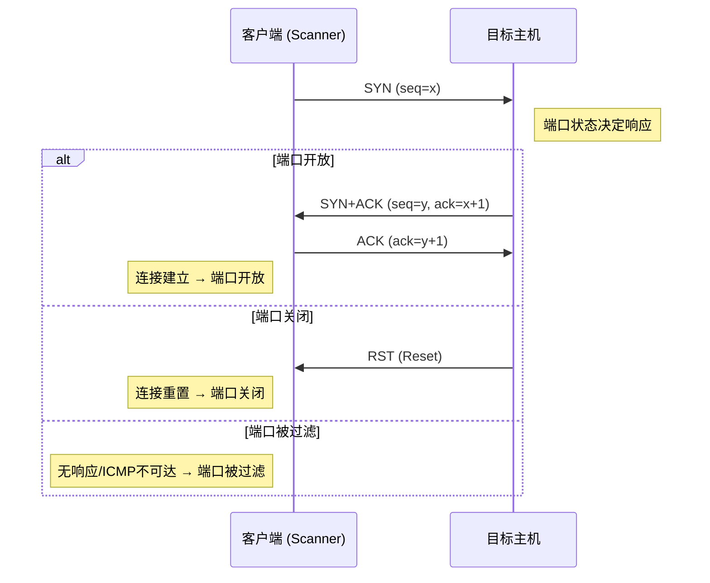
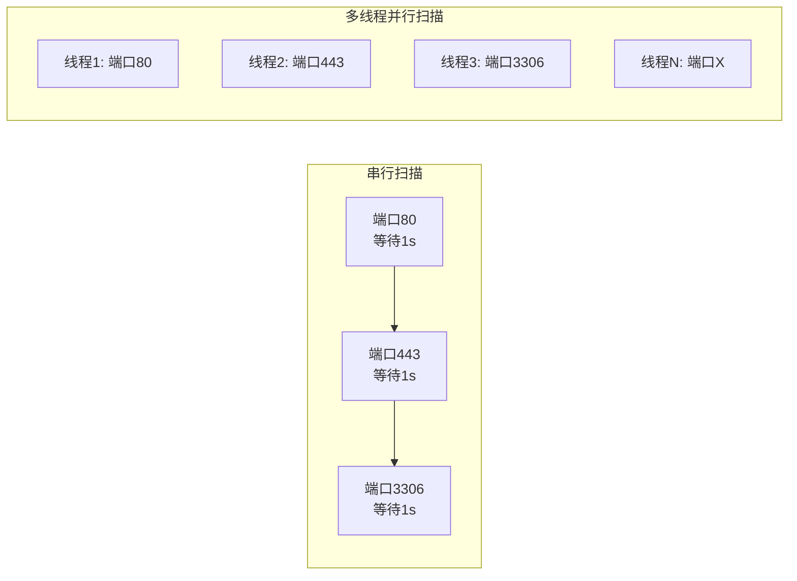
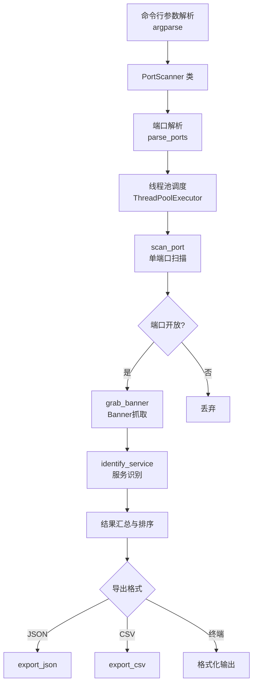

## 案例一：多线程端口扫描器

端口扫描是渗透测试的第一步，也是网络侦察中最基础、最关键的环节。通过扫描目标主机的开放端口，攻击者可以绘制出目标的"攻击面"——哪些服务正在运行、使用什么版本、可能存在哪些已知漏洞。Nmap 是业界公认的端口扫描标杆工具，但理解其底层原理的最佳方式，是亲手用 Python 从零构建一个扫描器。

本案例将构建一个功能完整的端口扫描器 **PyScanner**，涵盖 TCP Connect 扫描、多线程并发、服务识别、Banner 抓取、结果导出等核心功能。完成本案例后，你不仅获得一个可用的工具，更掌握网络编程、并发模型、安全工具设计的完整知识链。

---

### 端口扫描原理

#### TCP 三次握手回顾

理解端口扫描的前提是理解 TCP 连接的建立过程。TCP 使用"三次握手"（Three-Way Handshake）建立连接：



- **端口开放（Open）**：目标回复 `SYN+ACK`，表示服务正在监听
- **端口关闭（Closed）**：目标回复 `RST`（Reset），表示没有服务监听
- **端口被过滤（Filtered）**：无响应或返回 ICMP 不可达，通常意味着防火墙拦截

#### 三种主流扫描方式对比

| 扫描方式 | 原理 | 优点 | 缺点 | 需要权限 |
|---------|------|------|------|---------|
| **TCP Connect** | 调用 `connect()` 完成三次握手 | 不需要特殊权限，实现简单 | 会被目标日志记录，隐蔽性差 | 普通用户 |
| **TCP SYN** | 只发 SYN 包，收到 SYN+ACK 后发 RST 断开 | 隐蔽性好，不完成握手 | 需要构造原始套接字 | root/Administrator |
| **TCP FIN/XMAS/NULL** | 发送 FIN/XMAS/NULL 标志位的包 | 可绕过某些防火墙和 IDS | 对 Windows 系统无效 | root/Administrator |

本案例采用 **TCP Connect 扫描**，原因是：它使用标准 `socket.connect_ex()` 接口，无需管理员权限，代码可读性好，非常适合入门学习。后续"进阶扩展"部分会介绍 SYN 扫描的实现思路。

#### 为什么需要多线程

逐个端口串行扫描的速度极慢。假设每个端口超时 1 秒，扫描 65535 个端口理论上需要 18 小时。多线程的核心思想是"并发等待"——当线程 A 等待 socket 响应时，线程 B、C、D 已经在探测其他端口。



关键性能指标：

| 线程数 | 扫描 1000 端口耗时（估算） | 吞吐量 |
|--------|--------------------------|--------|
| 1（串行） | ~1000 秒 | ~1 端口/秒 |
| 50 | ~20 秒 | ~50 端口/秒 |
| 200 | ~5 秒 | ~200 端口/秒 |
| 1000 | ~1-2 秒 | ~500-1000 端口/秒 |

> **注意**：实际耗时取决于网络延迟、目标系统响应速度和本机资源。线程数并非越大越好——过多线程会导致系统资源耗尽（文件描述符、内存）、触发目标 IDS/IPS 告警、甚至造成网络拥塞。200-500 是一个比较平衡的范围。

---

### 项目架构设计

在写代码之前，先明确扫描器的模块划分和数据流：



核心设计决策：

1. **`ThreadPoolExecutor` 而非手动 `threading.Thread`**：线程池自动管理线程生命周期，避免手动创建/销毁线程的开销，`as_completed()` 提供结果就绪的即时回调
2. **`connect_ex()` 而非 `connect()`**：`connect_ex()` 返回错误码而非抛出异常，性能更好且不会因大量连接被拒而淹没异常处理
3. **`threading.Lock` 保护共享状态**：多个线程并发写入 `open_ports` 列表时需要互斥锁保证数据一致性
4. **模块化设计**：扫描、识别、导出三个功能解耦，便于独立测试和扩展

---

### 完整代码实现

以下是 PyScanner 的完整实现。代码按功能分为四个区域：核心扫描类、服务识别引擎、结果导出器、命令行入口。

```python
#!/usr/bin/env python3
"""
PyScanner - Python多线程端口扫描器
功能：多线程TCP扫描、服务识别、Banner抓取、结果导出
用法：python3 pyscanner.py -t 192.168.1.1 -p 1-1000 -T 200
"""

import socket
import argparse
import threading
import time
import json
import csv
import sys
from concurrent.futures import ThreadPoolExecutor, as_completed
from datetime import datetime


class PortScanner:
    """端口扫描器核心类"""

    # 常见服务端口映射表
    COMMON_SERVICES = {
        21: 'FTP', 22: 'SSH', 23: 'Telnet', 25: 'SMTP',
        53: 'DNS', 80: 'HTTP', 110: 'POP3', 111: 'RPCbind',
        135: 'MSRPC', 139: 'NetBIOS', 143: 'IMAP',
        443: 'HTTPS', 445: 'SMB', 993: 'IMAPS', 995: 'POP3S',
        1433: 'MSSQL', 1521: 'Oracle', 3306: 'MySQL',
        3389: 'RDP', 5432: 'PostgreSQL', 5900: 'VNC',
        6379: 'Redis', 8080: 'HTTP-Proxy', 8443: 'HTTPS-Alt',
        9090: 'WebConsole', 27017: 'MongoDB', 11211: 'Memcached',
        9200: 'Elasticsearch', 2379: 'etcd', 5601: 'Kibana',
    }

    def __init__(self, target: str, timeout: float = 1.0, threads: int = 200):
        """
        初始化扫描器

        Args:
            target: 目标IP地址或主机名
            timeout: 连接超时时间（秒）
            threads: 并发线程数
        """
        self.target = target
        self.timeout = timeout
        self.threads = threads
        self.open_ports = []
        self.lock = threading.Lock()
        self.scanned_count = 0

        # 解析主机名到IP
        try:
            self.target_ip = socket.gethostbyname(target)
        except socket.gaierror:
            print(f"  [!] 无法解析主机名: {target}")
            sys.exit(1)

    def scan_port(self, port: int) -> dict | None:
        """
        扫描单个端口

        使用 TCP Connect 扫描：调用 connect_ex() 尝试连接目标端口。
        connect_ex() 返回 0 表示连接成功（端口开放），否则返回错误码。

        Args:
            port: 端口号

        Returns:
            端口信息字典（开放时）或 None（关闭/过滤时）
        """
        try:
            sock = socket.socket(socket.AF_INET, socket.SOCK_STREAM)
            sock.settimeout(self.timeout)
            result = sock.connect_ex((self.target_ip, port))

            if result == 0:
                banner = self.grab_banner(sock, port)
                sock.close()
                return {
                    'port': port,
                    'state': 'open',
                    'banner': banner
                }

            sock.close()
        except (socket.timeout, ConnectionRefusedError, OSError):
            pass
        except Exception:
            pass
        return None

    def grab_banner(self, sock: socket.socket, port: int) -> str:
        """
        抓取服务 Banner

        Banner 是服务在连接建立后返回的欢迎信息或版本字符串。
        例如 SSH 会返回 "SSH-2.0-OpenSSH_8.9p1"，HTTP 需要主动发送请求。

        Args:
            sock: 已连接的 socket 对象
            port: 端口号

        Returns:
            Banner 字符串（截断到200字符）
        """
        try:
            sock.settimeout(2)

            # HTTP/HTTPS 类服务需要主动发送请求才会响应
            if port in (80, 443, 8080, 8443, 8000, 8888, 9090):
                http_request = (
                    f"HEAD / HTTP/1.1\r\n"
                    f"Host: {self.target_ip}\r\n"
                    f"User-Agent: PyScanner/1.0\r\n"
                    f"Connection: close\r\n"
                    f"\r\n"
                )
                sock.send(http_request.encode())
            # SMTP 服务连接后会主动发 banner
            # FTP 服务连接后会主动发 banner
            # 其他服务：等待被动响应

            banner = sock.recv(4096).decode('utf-8', errors='ignore').strip()
            # 清理不可打印字符，截断到合理长度
            banner = ''.join(c for c in banner if c.isprintable() or c in '\r\n\t')
            return banner[:200]
        except (socket.timeout, ConnectionResetError, OSError):
            return ""
        except Exception:
            return ""

    def identify_service(self, port: int, banner: str) -> str:
        """
        根据端口号和 Banner 识别服务类型

        识别策略（优先级从高到低）：
        1. Banner 中包含明确的服务标识字符串
        2. 端口号对应的默认服务映射

        Args:
            port: 端口号
            banner: Banner 字符串

        Returns:
            服务名称字符串
        """
        # 优先通过 Banner 识别（更准确）
        if banner:
            banner_lower = banner.lower()
            banner_signatures = [
                ('ssh', 'SSH'),
                ('ftp', 'FTP'),
                ('smtp', 'SMTP'),
                ('http/', 'HTTP'),
                ('apache', 'HTTP-Apache'),
                ('nginx', 'HTTP-Nginx'),
                ('iis', 'HTTP-IIS'),
                ('mysql', 'MySQL'),
                ('mariadb', 'MariaDB'),
                ('redis', 'Redis'),
                ('mongodb', 'MongoDB'),
                ('postgresql', 'PostgreSQL'),
                ('oracle', 'Oracle'),
                ('microsoft sql', 'MSSQL'),
                ('vnc', 'VNC'),
                ('rdp', 'RDP'),
                ('telnet', 'Telnet'),
                ('imap', 'IMAP'),
                ('pop3', 'POP3'),
                ('elasticsearch', 'Elasticsearch'),
                ('memcached', 'Memcached'),
                ('rabbitmq', 'RabbitMQ'),
                ('docker', 'Docker API'),
            ]
            for signature, service_name in banner_signatures:
                if signature in banner_lower:
                    return service_name

        # 回退到端口映射
        return self.COMMON_SERVICES.get(port, 'unknown')

    def parse_ports(self, port_string: str) -> list[int]:
        """
        解析端口范围字符串

        支持格式：
        - 单个端口: "80"
        - 逗号分隔: "80,443,8080"
        - 范围: "1-1000"
        - 混合: "22,80,443,8000-9000"

        Args:
            port_string: 端口范围字符串

        Returns:
            端口列表（已去重并排序）
        """
        ports = set()
        for part in port_string.split(','):
            part = part.strip()
            if '-' in part:
                start, end = part.split('-', 1)
                start, end = int(start), int(end)
                if not (1 <= start <= 65535 and 1 <= end <= 65535):
                    raise ValueError(f"端口号超出范围: {part}")
                if start > end:
                    raise ValueError(f"起始端口大于结束端口: {part}")
                ports.update(range(start, end + 1))
            else:
                port = int(part)
                if not 1 <= port <= 65535:
                    raise ValueError(f"端口号超出范围: {port}")
                ports.add(port)
        return sorted(ports)

    def scan(self, ports: list[int]) -> list[dict]:
        """
        执行多线程扫描

        使用 ThreadPoolExecutor 管理线程池，通过 as_completed()
        实时获取已完成的扫描结果。进度每 500 个端口报告一次。

        Args:
            ports: 待扫描的端口列表

        Returns:
            开放端口信息列表（按端口号排序）
        """
        print(f"\n{'=' * 60}")
        print(f"  PyScanner v1.0 — 多线程端口扫描器")
        print(f"  Target  : {self.target} ({self.target_ip})")
        print(f"  Ports   : {len(ports)} ports to scan")
        print(f"  Threads : {self.threads}")
        print(f"  Timeout : {self.timeout}s per port")
        print(f"  Started : {datetime.now().strftime('%Y-%m-%d %H:%M:%S')}")
        print(f"{'=' * 60}\n")

        start_time = time.time()
        results = []

        with ThreadPoolExecutor(max_workers=self.threads) as executor:
            # 提交所有扫描任务
            futures = {
                executor.submit(self.scan_port, port): port
                for port in ports
            }

            # 实时收集结果
            done = 0
            for future in as_completed(futures):
                done += 1
                if done % 500 == 0 or done == len(ports):
                    elapsed_so_far = time.time() - start_time
                    rate = done / elapsed_so_far if elapsed_so_far > 0 else 0
                    print(f"  [*] Progress: {done}/{len(ports)} "
                          f"({done * 100 // len(ports)}%) "
                          f"| {rate:.0f} ports/s")

                result = future.result()
                if result:
                    service = self.identify_service(
                        result['port'], result['banner']
                    )
                    result['service'] = service
                    results.append(result)
                    print(f"  [+] {result['port']}/tcp  OPEN  "
                          f"{service:<16s} {result['banner'][:50]}")

        elapsed = time.time() - start_time
        results.sort(key=lambda x: x['port'])

        print(f"\n{'=' * 60}")
        print(f"  Scan completed in {elapsed:.2f} seconds")
        print(f"  Open ports found: {len(results)}")
        print(f"  Scan rate: {len(ports) / elapsed:.0f} ports/second")
        print(f"{'=' * 60}\n")

        return results

    def export_json(self, results: list[dict], filename: str):
        """导出 JSON 格式报告"""
        data = {
            'scanner': 'PyScanner v1.0',
            'target': self.target,
            'target_ip': self.target_ip,
            'scan_time': datetime.now().isoformat(),
            'total_ports_scanned': len(results),
            'results': results
        }
        with open(filename, 'w', encoding='utf-8') as f:
            json.dump(data, f, indent=2, ensure_ascii=False)
        print(f"  [✓] JSON report saved to {filename}")

    def export_csv(self, results: list[dict], filename: str):
        """导出 CSV 格式报告"""
        fieldnames = ['port', 'state', 'service', 'banner']
        with open(filename, 'w', newline='', encoding='utf-8') as f:
            writer = csv.DictWriter(f, fieldnames=fieldnames)
            writer.writeheader()
            writer.writerows(results)
        print(f"  [✓] CSV report saved to {filename}")


def main():
    """命令行入口"""
    parser = argparse.ArgumentParser(
        description='PyScanner - Python多线程端口扫描器',
        formatter_class=argparse.RawDescriptionHelpFormatter,
        epilog="""
示例:
  %(prog)s -t 192.168.1.1 -p 1-1000
  %(prog)s -t 10.10.10.1 -p 22,80,443,3306,8080 -T 100
  %(prog)s -t example.com -p 1-65535 -T 500 --timeout 0.5 -o results.json
        """
    )
    parser.add_argument('-t', '--target', required=True,
                        help='目标IP地址或主机名')
    parser.add_argument('-p', '--ports', default='1-1000',
                        help='端口范围，支持格式: 80 | 1-1000 | 22,80,443 | 80,8000-9000 (默认: 1-1000)')
    parser.add_argument('-T', '--threads', type=int, default=200,
                        help='并发线程数 (默认: 200)')
    parser.add_argument('--timeout', type=float, default=1.0,
                        help='连接超时时间/秒 (默认: 1.0)')
    parser.add_argument('-o', '--output',
                        help='输出文件路径，支持 .json 和 .csv 格式')

    args = parser.parse_args()

    # 参数校验
    if args.threads < 1:
        print("  [!] 线程数必须 >= 1")
        sys.exit(1)
    if args.timeout <= 0:
        print("  [!] 超时时间必须 > 0")
        sys.exit(1)

    scanner = PortScanner(args.target, args.timeout, args.threads)

    try:
        ports = scanner.parse_ports(args.ports)
    except ValueError as e:
        print(f"  [!] 端口解析错误: {e}")
        sys.exit(1)

    if not ports:
        print("  [!] 没有指定有效的端口")
        sys.exit(1)

    results = scanner.scan(ports)

    # 导出结果
    if args.output:
        if args.output.endswith('.json'):
            scanner.export_json(results, args.output)
        elif args.output.endswith('.csv'):
            scanner.export_csv(results, args.output)
        else:
            print("  [!] 不支持的输出格式，请使用 .json 或 .csv")
            # 默认保存为 JSON
            default_file = args.output + '.json'
            scanner.export_json(results, default_file)

    # 退出码：有开放端口返回0，无开放端口返回1
    sys.exit(0 if results else 1)


if __name__ == '__main__':
    main()
```

---

### 代码逐段解析

#### 初始化与目标解析

```python
def __init__(self, target, timeout=1.0, threads=200):
    self.target = target
    self.target_ip = socket.gethostbyname(target)
```

构造函数做了三件事：保存配置参数、初始化线程锁、解析主机名。`socket.gethostbyname()` 将域名转为 IP 地址，避免后续每次扫描都重复 DNS 查询——这个细节在扫描数千端口时能节省可观的时间。

#### 核心扫描逻辑

```python
def scan_port(self, port):
    sock = socket.socket(socket.AF_INET, socket.SOCK_STREAM)
    sock.settimeout(self.timeout)
    result = sock.connect_ex((self.target_ip, port))
    if result == 0:
        banner = self.grab_banner(sock, port)
        sock.close()
        return {'port': port, 'state': 'open', 'banner': banner}
    sock.close()
    return None
```

每个端口扫描的完整流程：创建 TCP socket → 设置超时 → 尝试连接 → 成功则抓取 Banner → 关闭 socket → 返回结果。

`connect_ex()` 是这里的关键——它与 `connect()` 功能相同，但返回整数错误码而非抛出异常。在扫描场景中，绝大多数端口是关闭的，如果用 `connect()` 会产生大量 `ConnectionRefusedError` 异常，`try/except` 的开销远大于整数比较。

#### Banner 抓取策略

不同协议的 Banner 获取方式不同，这是很多初学者会忽略的细节：

| 协议类型 | Banner 获取方式 | 典型响应示例 |
|---------|----------------|-------------|
| SSH | 连接后被动接收 | `SSH-2.0-OpenSSH_8.9p1 Ubuntu-3ubuntu0.1` |
| FTP | 连接后被动接收 | `220 (vsFTPd 3.0.5)` |
| SMTP | 连接后被动接收 | `220 mail.example.com ESMTP Postfix` |
| HTTP/HTTPS | 需主动发送请求 | `HTTP/1.1 200 OK Server: nginx/1.18.0 ...` |
| MySQL | 连接后被动接收 | `J\x00\x00\x00\x0a8.0.33-0ubuntu0.22.04.1` |
| Redis | 连接后被动接收（发送 PING） | `+PONG` |

代码中对 HTTP 类端口做了特殊处理——发送 `HEAD` 请求。对其他端口则直接等待被动响应。`HEAD` 比 `GET` 更高效，因为它只要求服务器返回响应头，不传输响应体。

#### 服务识别引擎

服务识别采用两层策略：

1. **Banner 签名匹配**（高置信度）：在 Banner 字符串中搜索已知服务的特征子串，如 `"ssh"` → SSH、`"apache"` → HTTP-Apache
2. **端口映射回退**（低置信度）：当 Banner 为空或不包含特征串时，使用 IANA 注册的默认端口映射

这种分层设计的精度优于纯端口映射——即使服务运行在非标准端口（如 SSH 运行在 2222），只要 Banner 包含 `"ssh"` 就能正确识别。

#### 线程池与进度回调

```python
with ThreadPoolExecutor(max_workers=self.threads) as executor:
    futures = {executor.submit(self.scan_port, port): port for port in ports}
    for future in as_completed(futures):
        result = future.result()
```

`ThreadPoolExecutor` 是 Python 3.2+ 引入的高级并发接口，比手动管理 `threading.Thread` 更安全。它的核心优势：

- **自动管理线程生命周期**：线程执行完任务后回到池中复用，避免频繁创建/销毁线程
- **`as_completed()` 迭代器**：按完成顺序（而非提交顺序）返回结果，适合扫描场景——先完成的端口先报告
- **上下文管理器**：`with` 块结束时自动 `shutdown(wait=True)`，确保所有任务完成

---

### 运行示例与输出解读

```bash
# 基本扫描：扫描 192.168.1.1 的前 1000 个端口
python3 pyscanner.py -t 192.168.1.1 -p 1-1000

# 指定端口和线程数
python3 pyscanner.py -t 10.10.10.1 -p 22,80,443,3306,8080 -T 100

# 全端口扫描，500 线程，0.5 秒超时，导出 JSON
python3 pyscanner.py -t 192.168.1.1 -p 1-65535 -T 500 --timeout 0.5 -o results.json

# 导出 CSV 格式（适合导入 Excel 或数据库）
python3 pyscanner.py -t 10.10.10.1 -p 1-1000 -o scan_results.csv

# 扫描域名（自动 DNS 解析）
python3 pyscanner.py -t example.com -p 80,443,8080
```

典型输出：

```text
============================================================
  PyScanner v1.0 — 多线程端口扫描器
  Target  : 192.168.1.1 (192.168.1.1)
  Ports   : 1000 ports to scan
  Threads : 200
  Timeout : 1.0s per port
  Started : 2026-06-25 14:30:00
============================================================

  [+] 22/tcp  OPEN  SSH              SSH-2.0-OpenSSH_8.9p1 Ubuntu-3ubuntu0.1
  [+] 80/tcp  OPEN  HTTP-Apache      HTTP/1.1 200 OK Server: Apache/2.4.52
  [+] 443/tcp OPEN  HTTPS            HTTP/1.1 200 OK Server: nginx/1.18.0
  [*] Progress: 500/1000 (50%) | 487 ports/s
  [+] 3306/tcp OPEN  MySQL           8.0.33-0ubuntu0.22.04.1
  [*] Progress: 1000/1000 (100%) | 512 ports/s

============================================================
  Scan completed in 1.95 seconds
  Open ports found: 4
  Scan rate: 512 ports/second
============================================================
```

JSON 导出示例：

```json
{
  "scanner": "PyScanner v1.0",
  "target": "192.168.1.1",
  "target_ip": "192.168.1.1",
  "scan_time": "2026-06-25T14:30:02.123456",
  "total_ports_scanned": 4,
  "results": [
    {"port": 22, "state": "open", "banner": "SSH-2.0-OpenSSH_8.9p1", "service": "SSH"},
    {"port": 80, "state": "open", "banner": "HTTP/1.1 200 OK...", "service": "HTTP-Apache"},
    {"port": 443, "state": "open", "banner": "HTTP/1.1 200 OK...", "service": "HTTPS"},
    {"port": 3306, "state": "open", "banner": "8.0.33-0ubuntu0.22.04.1", "service": "MySQL"}
  ]
}
```

---

### 性能调优指南

扫描器的性能受多个因素影响，以下是经过实测验证的调优策略：

#### 线程数选择

线程数并非越多越好。Python 的 GIL（全局解释器锁）限制了 CPU 密集型任务的并发度，但端口扫描是 **I/O 密集型** 任务——线程大部分时间在等待网络响应，GIL 会在等待期间自动释放，因此多线程在扫描场景中确实有效。

推荐的线程数配置：

| 场景 | 推荐线程数 | 理由 |
|------|-----------|------|
| 本地局域网 | 100-300 | 延迟低，线程不需要长时间等待 |
| 远程目标（国内） | 200-500 | 中等延迟，需要更多并发来填充等待时间 |
| 远程目标（海外） | 300-800 | 高延迟，需要更多并发 |
| 全端口扫描 | 500-1000 | 端口数量大，需要更高吞吐 |
| 隐蔽扫描 | 10-50 | 降低对目标的流量冲击 |

#### 超时时间调整

超时时间决定了扫描速度和准确性的权衡：

| 超时时间 | 适用场景 | 风险 |
|---------|---------|------|
| 0.3s | 快速侦察，目标在本地 | 可能漏掉慢响应端口 |
| 0.5s | 一般扫描 | 较好的平衡点 |
| 1.0s | 默认值，适合大多数场景 | — |
| 2.0-3.0 | 慢速网络或需要高准确性 | 扫描时间显著增加 |

#### 系统级优化

```bash
# Linux: 增加文件描述符限制（每个 socket 消耗一个文件描述符）
ulimit -n 65535

# 查看当前限制
ulimit -n

# 临时调整（当前会话生效）
ulimit -Sn 65535

# 永久调整：编辑 /etc/security/limits.conf
# * soft nofile 65535
# * hard nofile 65535
```

如果遇到 `OSError: [Errno 24] Too many open files` 错误，说明文件描述符限制过低，需要执行上述调整。

---

### 常见误区与陷阱

#### 误区一：裸 except 吞掉所有异常

```python
# ✗ 错误写法：吞掉 KeyboardInterrupt、SystemExit 等关键异常
except:
    pass

# ✓ 正确写法：只捕获预期的网络异常
except (socket.timeout, ConnectionRefusedError, OSError):
    pass
```

裸 `except` 会捕获 `KeyboardInterrupt`（Ctrl+C）和 `SystemExit`（`sys.exit()`），导致用户无法中断扫描、程序无法正常退出。在长时间运行的扫描任务中，这是一个严重的用户体验问题。

#### 误区二：忘记关闭 socket

```python
# ✗ 错误写法：异常时 socket 泄漏
sock = socket.socket(socket.AF_INET, socket.SOCK_STREAM)
result = sock.connect_ex((target, port))
if result == 0:
    return {'port': port}  # sock 未关闭！

# ✓ 正确写法：使用 try/finally 或 context manager
sock = socket.socket(socket.AF_INET, socket.SOCK_STREAM)
try:
    result = sock.connect_ex((target, port))
    if result == 0:
        return {'port': port}
finally:
    sock.close()
```

每个未关闭的 socket 都会占用一个文件描述符。在扫描 65535 个端口时，如果 socket 泄漏，很快就会撞到系统的文件描述符上限。

#### 误区三：线程不安全的列表操作

```python
# ✗ 错误写法：多线程同时 append 可能导致数据丢失
self.open_ports.append(result)

# ✓ 正确写法：使用 Lock 保护共享状态
with self.lock:
    self.open_ports.append(result)
```

虽然 CPython 的 `list.append()` 在 GIL 保护下通常是原子操作，但依赖 GIL 的隐式保护是不好的实践。在其他 Python 实现（PyPy、Jython）或未来版本中，GIL 可能被移除（Python 3.13+ 的 free-threaded 模式），显式加锁才是正确的并发编程范式。

#### 误区四：在热路径中重复创建 socket

```python
# ✗ 低效：每次都创建新的 socket 对象
# （这是必要的，因为每个端口需要独立的 socket）

# ✓ 优化：复用 DNS 解析结果
self.target_ip = socket.gethostbyname(target)  # 只解析一次
```

socket 对象本身不能复用（每个端口需要独立连接），但 DNS 解析结果可以缓存。在扫描数千端口时，避免重复 DNS 查询可以节省数秒到数十秒的时间。

#### 误区五：忽略退出码设计

扫描器作为命令行工具，应遵循 Unix 惯例通过退出码传递结果：0 表示成功（找到了开放端口），非 0 表示异常或无结果。这使得扫描器可以被 shell 脚本、CI/CD 管道、其他工具调用和判断结果。

---

### 进阶扩展方向

掌握基础版本后，可以从以下方向扩展扫描器的能力：

#### 1. 异步版本（asyncio）

多线程版本在高并发时会受到线程切换开销的限制。`asyncio` 使用事件循环和协程，可以用单线程实现数万并发：

```python
import asyncio

async def async_scan_port(sem, target, port, timeout):
    async with sem:  # 信号量控制并发数
        try:
            _, writer = await asyncio.wait_for(
                asyncio.open_connection(target, port),
                timeout=timeout
            )
            writer.close()
            await writer.wait_closed()
            return port
        except (asyncio.TimeoutError, ConnectionRefusedError, OSError):
            return None

async def async_scan(target, ports, concurrency=5000, timeout=1.0):
    sem = asyncio.Semaphore(concurrency)
    tasks = [async_scan_port(sem, target, port, timeout) for port in ports]
    results = await asyncio.gather(*tasks)
    return [port for port in results if port is not None]
```

性能对比：

| 实现方式 | 并发数 | 扫描 10000 端口耗时 |
|---------|--------|-------------------|
| 串行 | 1 | ~10000 秒 |
| 多线程 (200) | 200 | ~50 秒 |
| 多线程 (1000) | 1000 | ~10 秒 |
| asyncio (5000) | 5000 | ~2 秒 |

#### 2. SYN 半开扫描

SYN 扫描只发送 SYN 包，收到 SYN+ACK 后发送 RST 断开，不完成三次握手。优点是目标不会记录完整的连接日志。实现需要 `scapy` 库：

```python
from scapy.all import IP, TCP, sr1, RandShort

def syn_scan(target, port):
    """SYN 半开扫描（需要 root 权限）"""
    pkt = IP(dst=target) / TCP(dport=port, flags='S', sport=RandShort())
    resp = sr1(pkt, timeout=1, verbose=0)
    if resp and resp.haslayer(TCP):
        if resp[TCP].flags == 0x12:  # SYN+ACK
            # 发送 RST 关闭连接
            rst = IP(dst=target) / TCP(dport=port, flags='R')
            send(rst, verbose=0)
            return True
    return False
```

#### 3. CIDR 网段扫描

扩展扫描器支持 CIDR 表示法，扫描整个网段：

```python
import ipaddress

def parse_targets(target_string):
    """解析目标，支持 IP、CIDR、文件列表"""
    targets = []
    if '/' in target_string:
        # CIDR: 192.168.1.0/24
        network = ipaddress.ip_network(target_string, strict=False)
        targets = [str(host) for host in network.hosts()]
    elif '-' in target_string:
        # 范围: 192.168.1.1-192.168.1.254
        start, end = target_string.split('-')
        start_ip = ipaddress.ip_address(start.strip())
        end_ip = ipaddress.ip_address(end.strip())
        current = start_ip
        while current <= end_ip:
            targets.append(str(current))
            current += 1
    else:
        targets = [target_string]
    return targets
```

#### 4. 输出格式增强

除 JSON 和 CSV 外，可以增加以下输出格式：

- **Nmap XML 兼容格式**：方便导入其他安全工具
- **HTML 报告**：带样式的结果展示，适合交付给客户
- **SQLite 数据库**：适合多次扫描结果的持久化和查询

#### 5. 扫描结果对比

对比两次扫描结果，发现新增或关闭的端口——这在安全监控中非常有用：

```python
def diff_scans(old_results, new_results):
    """对比两次扫描结果"""
    old_ports = {r['port'] for r in old_results}
    new_ports = {r['port'] for r in new_results}

    opened = new_ports - old_ports    # 新开放的端口
    closed = old_ports - new_ports    # 新关闭的端口

    return {
        'opened': sorted(opened),
        'closed': sorted(closed),
        'unchanged': sorted(old_ports & new_ports)
    }
```

---

### 法律与道德声明

端口扫描在未授权的情况下可能违反法律。以下是一些基本原则：

- **只扫描你拥有或获得书面授权的目标**：未经授权扫描他人服务器在许多国家属于违法行为
- **使用测试环境练习**：推荐使用 Metasploitable、DVWA、HackTheBox、TryHackMe 等靶机平台
- **控制扫描速率**：过于激进的扫描可能导致目标服务拒绝服务（DoS），即使是授权测试也应控制速率
- **遵守当地法律法规**：中国《网络安全法》《刑法》第285条（非法侵入计算机信息系统罪）对未经授权的网络侵入有明确处罚规定

> **合法使用场景**：安全审计（已授权）、自检自查、CTF 竞赛、教学实验环境。

---

### 与 Nmap 的功能对比

理解自制工具的局限性，才能更好地选择工具：

| 功能 | PyScanner（本案例） | Nmap |
|------|-------------------|------|
| TCP Connect 扫描 | ✅ | ✅ |
| SYN 半开扫描 | ❌（需扩展） | ✅ |
| UDP 扫描 | ❌ | ✅ |
| 服务版本检测 | Banner 粗略识别 | 完整指纹数据库 |
| OS 检测 | ❌ | ✅ |
| NSE 脚本引擎 | ❌ | ✅（400+ 脚本） |
| 输出格式 | JSON/CSV | XML/Normal/Grepable |
| 学习价值 | 高（理解底层原理） | 低（黑盒使用） |
| 定制灵活性 | 高（Python 源码） | 中（NSE 脚本） |

自制扫描器的价值不在于替代 Nmap，而在于理解底层原理、培养安全工具开发能力、以及在 Nmap 无法满足的特殊场景中提供定制化解决方案。

---

### 本案例涉及的知识点清单

| 知识领域 | 具体知识点 |
|---------|-----------|
| 网络协议 | TCP 三次握手、端口状态（open/closed/filtered）、应用层协议 Banner |
| Python 网络编程 | socket 模块、connect_ex()、settimeout()、send/recv |
| 并发编程 | threading.Lock、ThreadPoolExecutor、as_completed()、GIL |
| 命令行工具设计 | argparse、退出码、帮助信息、参数校验 |
| 数据持久化 | JSON 序列化、CSV 写入、编码处理（utf-8） |
| 安全工具设计 | 模块化架构、服务识别策略、结果对比 |
| 性能优化 | 线程数调优、超时策略、DNS 缓存、文件描述符限制 |
| 法律伦理 | 授权测试、合规要求、靶机环境 |
