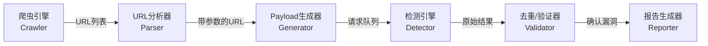
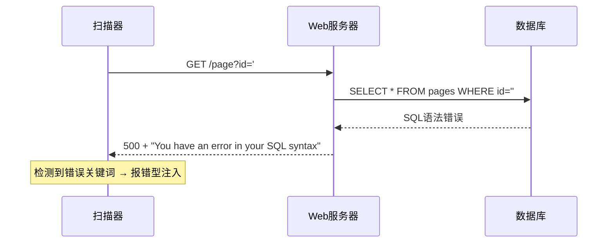
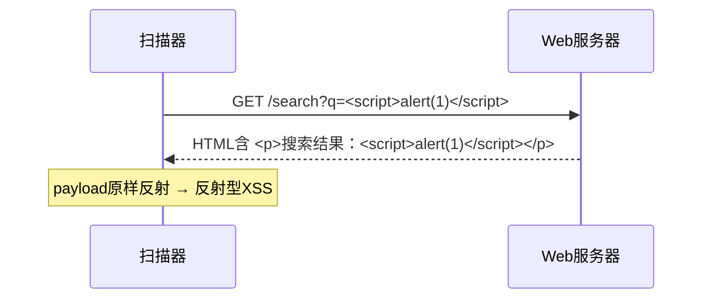

## 案例二：Web漏洞扫描器

### 项目背景

Web应用是互联网服务的主要载体，也是攻击者最频繁瞄准的目标。根据OWASP Top 10（2021），注入类漏洞（SQL注入、XSS等）连续多年位列高危榜单。手动测试每个参数、每个页面既耗时又容易遗漏，自动化扫描器由此成为渗透测试工程师的核心工具。

本案例从零构建一个功能完整的Web漏洞扫描器，覆盖以下能力：

| 模块 | 功能 | 对标工具 |
|------|------|----------|
| 爬虫引擎 | 自动发现目标站点的URL和表单 | Burp Spider |
| SQL注入检测 | 基于报错/布尔/时间三种检测策略 | sqlmap |
| XSS检测 | 反射型XSS payload注入与检测 | XSStrike |
| 目录枚举 | 常见路径与敏感文件发现 | dirsearch, gobuster |
| 报告输出 | 结构化漏洞报告 | Nuclei |

通过这个案例，你将掌握Web安全扫描的核心原理：**如何用Python自动化"发请求→分析响应→判断漏洞"这一循环**。

---

### 架构设计

一个成熟的Web扫描器通常采用**流水线架构**，各阶段职责单一、可独立替换：



本案例的代码结构对应如下：

| 类/方法 | 职责 | 设计考量 |
|---------|------|----------|
| `WebScanner.__init__` | 初始化会话、配置 | 统一Session复用TCP连接，减少握手开销 |
| `WebScanner.crawl` | BFS爬取站内链接 | 广度优先确保覆盖范围，`max_pages`防止无限爬取 |
| `WebScanner.test_sqli` | SQL注入检测 | 三策略并行：报错型+布尔型+时间型 |
| `WebScanner.test_xss` | XSS检测 | 检查payload是否原样反射 |
| `WebScanner.directory_scan` | 目录爆破 | 多线程并发请求，过滤404/403/500 |
| `WebScanner.scan_all` | 编排全流程 | 阶段化执行，便于调试和扩展 |

---

### 核心知识：Web漏洞检测原理

在进入代码之前，先理解三种核心检测技术的原理。

#### SQL注入检测策略

SQL注入的本质是**用户输入被拼接进SQL语句，改变了原有查询逻辑**。扫描器无法直接看到后端SQL，只能通过HTTP响应间接推断。以下是三种经典策略：

**策略一：基于报错（Error-based）**

向参数注入特殊字符（如单引号`'`），如果响应中出现数据库错误信息（如`You have an error in your SQL syntax`），说明输入被直接拼入了SQL语句。



适用场景：开发环境、未做错误屏蔽的生产环境。局限：生产环境通常会隐藏错误详情。

**策略二：基于布尔（Boolean-based）**

发送两条逻辑相反的请求（如`id=1 AND 1=1` vs `id=1 AND 1=2`），如果响应内容长度差异显著，说明后端执行了不同的SQL分支。

| 请求 | 期望行为 | 判断逻辑 |
|------|----------|----------|
| `?id=1 AND 1=1` | 返回正常内容 | 条件为真，SQL正常执行 |
| `?id=1 AND 1=2` | 返回空或异常 | 条件为假，SQL返回不同结果 |
| 两者长度差异 > 阈值 | — | 确认为布尔型注入 |

适用场景：页面有动态内容输出。局限：静态页面差异不明显时误判率高。

**策略三：基于时间（Time-based）**

发送`?id=1 AND SLEEP(3)`，如果响应时间显著增加（>2.5秒），说明后端执行了延时函数，输入被注入。

适用场景：页面无回显、无报错的盲注场景。局限：受网络延迟影响，需设置合理阈值，扫描速度慢。

#### XSS检测策略

XSS（跨站脚本攻击）的核心是**用户输入被原样输出到HTML中，未做转义**。反射型XSS的检测逻辑：

1. 向参数注入payload（如`<script>alert(1)</script>`）
2. 检查响应HTML中是否包含未经转义的原始payload
3. 如果`<script>`标签原样出现在响应中，说明存在反射型XSS



注意：现代框架（React、Vue）默认做HTML转义，传统服务端渲染（PHP、JSP、Django模板）更容易出现XSS。

#### 目录枚举策略

目录枚举的核心逻辑很简单：**用常见路径字典逐一请求，根据HTTP状态码判断是否存在**。

| 状态码 | 含义 | 处理策略 |
|--------|------|----------|
| 200 | 资源存在 | 记录发现 |
| 301/302 | 重定向 | 记录，可能是目录（末尾加`/`后跳转） |
| 403 | 存在但被禁止访问 | 仍然有价值，说明路径确实存在 |
| 404 | 不存在 | 过滤，不记录 |
| 500 | 服务器错误 | 可能是存在但有代码错误，记录 |

关键细节：很多Web服务器（如Nginx自定义404页面）返回200状态码但内容是"页面不存在"。更健壮的做法是**对比响应长度的基线**，而非仅看状态码。

---

### 完整实现

以下是经过完善的Web漏洞扫描器实现。相比基础版本，增加了输入验证、错误处理、POST请求支持、结果去重等功能。

```python
#!/usr/bin/env python3
"""
WebVulnScanner v2.0 - Web漏洞扫描器
功能：爬虫引擎、SQL注入检测（报错/布尔/时间）、XSS检测、目录枚举
用法：python3 web_scanner.py -t http://example.com
依赖：pip install requests beautifulsoup4
"""

import requests
import re
import argparse
import time
import json
import sys
from urllib.parse import urljoin, urlparse, parse_qs, urlencode, urlunparse
from concurrent.futures import ThreadPoolExecutor, as_completed
from dataclasses import dataclass, field, asdict
from typing import List, Dict, Set, Optional, Tuple
from bs4 import BeautifulSoup
import warnings

warnings.filterwarnings('ignore')

# ============================================================
# 数据模型：用 dataclass 统一漏洞发现的数据结构
# ============================================================

@dataclass
class Finding:
    """漏洞发现记录"""
    vuln_type: str          # 漏洞类型：SQLi / XSS / Directory
    severity: str           # 严重等级：Critical / High / Medium / Low / Info
    url: str                # 漏洞所在URL
    param: str = ""         # 参数名（目录枚举时为空）
    payload: str = ""       # 测试载荷
    evidence: str = ""      # 证据说明
    method: str = "GET"     # 请求方法
    confidence: str = "Medium"  # 置信度：High / Medium / Low

    def __str__(self):
        return (f"[{self.severity}] {self.vuln_type} @ {self.url}"
                f" (param={self.param}, confidence={self.confidence})")


# ============================================================
# 核心扫描器类
# ============================================================

class WebScanner:
    """
    Web漏洞扫描器主类

    属性:
        target: 目标URL（自动补全协议头）
        threads: 并发线程数
        timeout: 单次请求超时（秒）
        max_depth: 爬虫最大深度
        delay: 请求间隔（秒），防止触发WAF
    """

    # 数据库报错特征 —— 覆盖主流数据库引擎
    SQL_ERROR_PATTERNS = [
        # MySQL
        'you have an error in your sql syntax',
        'mysql_fetch', 'mysql_num_rows', 'mysql_query',
        'warning: mysql', 'unclosed quotation mark',
        # PostgreSQL
        'postgresql', 'pg_query', 'pg_exec',
        'unterminated quoted string at or near',
        # SQL Server
        'microsoft ole db provider for sql server',
        'unclosed quotation mark after the character string',
        'microsoft sql native client error',
        # Oracle
        'ora-01756', 'ora-00933', 'ora-00921',
        'quoted string not properly terminated',
        # SQLite
        'sqlite3.operationalerror', 'sqlite3.warning',
        'sql error or missing database',
        # 通用
        'sql syntax', 'syntax error', 'unexpected end of sql',
        'sqlcommand', 'odbc drivers error',
    ]

    # SQL注入测试载荷 —— 按检测策略分组
    SQLI_PAYLOADS = {
        'error': [
            "'", "\"", "'--", "\"--",
            "' OR '1'='1", "\" OR \"1\"=\"1",
            "1'", "1\"",
        ],
        'boolean': [
            ("' AND '1'='1", "' AND '1'='2"),
            ("\" AND \"1\"=\"1", "\" AND \"1\"=\"2"),
            ("1 AND 1=1", "1 AND 1=2"),
            ("1' AND '1'='1'--", "1' AND '1'='2'--"),
        ],
        'time': [
            "' AND SLEEP({delay})--",
            "\" AND SLEEP({delay})--",
            "1; WAITFOR DELAY '0:0:{delay}'--",
            "' OR pg_sleep({delay})--",
        ],
    }

    # XSS测试载荷 —— 覆盖常见绕过姿势
    XSS_PAYLOADS = [
        '<script>alert("XSS")</script>',
        '">',
        "'-alert(1)-'",
        '<svg onload=alert(1)>',
        'javascript:alert(1)',
        '',
        '{{7*7}}',                       # SSTI模板注入探测
        '${7*7}',                        # 表达式注入探测
    ]

    def __init__(
        self,
        target: str,
        threads: int = 10,
        timeout: int = 10,
        delay: float = 0,
        max_depth: int = 3,
        user_agent: str = None,
    ):
        # 协议补全
        if not target.startswith(('http://', 'https://')):
            target = f'http://{target}'
        self.target = target.rstrip('/')
        self.threads = threads
        self.timeout = timeout
        self.delay = delay
        self.max_depth = max_depth

        # 统一Session：复用TCP连接和Cookie
        self.session = requests.Session()
        self.session.verify = False
        self.session.headers.update({
            'User-Agent': user_agent or (
                'Mozilla/5.0 (Windows NT 10.0; Win64; x64) '
                'AppleWebKit/537.36 (KHTML, like Gecko) '
                'Chrome/120.0.0.0 Safari/537.36'
            ),
            'Accept': 'text/html,application/xhtml+xml,*/*',
            'Accept-Language': 'en-US,en;q=0.9,zh-CN;q=0.8',
        })

        # 结果收集（用集合去重）
        self.findings: List[Finding] = []
        self.discovered_urls: Set[str] = set()
        self._seen_finding_keys: Set[str] = set()

    # ----------------------------------------------------------
    # 爬虫引擎：BFS广度优先，按深度逐层扩展
    # ----------------------------------------------------------

    def crawl(self, max_pages: int = 100) -> List[str]:
        """
        BFS爬取目标站点的内部链接

        返回: 发现的URL列表（去重、已排序）
        """
        from collections import deque

        visited: Set[str] = set()
        queue: deque = deque([(self.target, 0)])  # (url, depth)

        print(f"  [CRAWL] 开始爬取: {self.target} (max_pages={max_pages})")

        while queue and len(visited) < max_pages:
            url, depth = queue.popleft()

            # URL标准化：去掉fragment
            url = url.split('#')[0]
            if url in visited:
                continue

            try:
                resp = self.session.get(url, timeout=self.timeout)
                visited.add(url)
                self.discovered_urls.add(url)

                if depth >= self.max_depth:
                    continue

                # 解析页面链接
                soup = BeautifulSoup(resp.text, 'html.parser')

                # 提取 <a href="...">
                for tag in soup.find_all('a', href=True):
                    href = urljoin(url, tag['href']).split('#')[0]
                    if self._is_same_origin(href) and href not in visited:
                        queue.append((href, depth + 1))

                # 提取 <form action="..."> —— 用于POST型注入测试
                for form in soup.find_all('form'):
                    action = form.get('action', '')
                    if action:
                        form_url = urljoin(url, action)
                        if self._is_same_origin(form_url):
                            self.discovered_urls.add(form_url)

                if len(visited) % 10 == 0:
                    print(f"  [CRAWL] 已爬取 {len(visited)} 个页面...")

            except requests.RequestException:
                continue
            finally:
                if self.delay > 0:
                    time.sleep(self.delay)

        print(f"  [CRAWL] 完成，共发现 {len(visited)} 个页面")
        return sorted(visited)

    def _is_same_origin(self, url: str) -> bool:
        """检查URL是否属于目标站点（同源）"""
        try:
            target_parsed = urlparse(self.target)
            url_parsed = urlparse(url)
            return (url_parsed.netloc == target_parsed.netloc
                    or url_parsed.netloc == '')
        except Exception:
            return False

    # ----------------------------------------------------------
    # SQL注入检测：三策略并行
    # ----------------------------------------------------------

    def test_sqli(self, url: str) -> List[Finding]:
        """
        对单个URL进行SQL注入检测

        检测策略:
        1. Error-based: 注入特殊字符，检查响应是否包含数据库报错
        2. Boolean-based: 发送逻辑相反的payload，对比响应差异
        3. Time-based: 发送延时payload，检测响应时间是否异常

        返回: 发现的漏洞列表
        """
        findings = []
        parsed = urlparse(url)
        params = parse_qs(parsed.query)

        if not params:
            return findings

        base_url = f"{parsed.scheme}://{parsed.netloc}{parsed.path}"

        # 获取正常响应作为基准
        try:
            normal_resp = self.session.get(url, timeout=self.timeout)
            normal_len = len(normal_resp.text)
            normal_time = normal_resp.elapsed.total_seconds()
        except requests.RequestException:
            return findings

        for param_name in params:
            # === 策略一：Error-based ===
            for payload in self.SQLI_PAYLOADS['error']:
                test_params = {k: v[0] for k, v in params.items()}
                test_params[param_name] = payload

                try:
                    resp = self.session.get(
                        base_url, params=test_params, timeout=self.timeout
                    )

                    resp_lower = resp.text.lower()
                    for pattern in self.SQL_ERROR_PATTERNS:
                        if pattern in resp_lower:
                            findings.append(Finding(
                                vuln_type='SQL Injection (Error-based)',
                                severity='Critical',
                                url=url,
                                param=param_name,
                                payload=payload,
                                evidence=f'数据库报错特征: "{pattern}"',
                                confidence='High',
                            ))
                            break  # 同参数只需命中一次
                except requests.RequestException:
                    continue

                if self.delay > 0:
                    time.sleep(self.delay)

            # === 策略二：Boolean-based ===
            for true_payload, false_payload in self.SQLI_PAYLOADS['boolean']:
                true_params = {k: v[0] for k, v in params.items()}
                true_params[param_name] = true_payload

                false_params = {k: v[0] for k, v in params.items()}
                false_params[param_name] = false_payload

                try:
                    true_resp = self.session.get(
                        base_url, params=true_params, timeout=self.timeout
                    )
                    false_resp = self.session.get(
                        base_url, params=false_params, timeout=self.timeout
                    )

                    diff = abs(len(true_resp.text) - len(false_resp.text))
                    # 阈值500字节：太小容易误报，太大会漏报
                    if diff > 500:
                        findings.append(Finding(
                            vuln_type='SQL Injection (Boolean-based)',
                            severity='Critical',
                            url=url,
                            param=param_name,
                            payload=f"TRUE: {true_payload} | FALSE: {false_payload}",
                            evidence=f'响应长度差异: {diff} 字节',
                            confidence='Medium',
                        ))
                except requests.RequestException:
                    continue

                if self.delay > 0:
                    time.sleep(self.delay)

            # === 策略三：Time-based ===
            for template in self.SQLI_PAYLOADS['time']:
                payload = template.format(delay=3)
                test_params = {k: v[0] for k, v in params.items()}
                test_params[param_name] = payload

                try:
                    start = time.time()
                    resp = self.session.get(
                        base_url, params=test_params,
                        timeout=max(self.timeout, 5)
                    )
                    elapsed = time.time() - start

                    # 阈值 2.5 秒：SLEEP(3) 预期 ~3秒，留0.5秒网络余量
                    if elapsed > 2.5:
                        findings.append(Finding(
                            vuln_type='SQL Injection (Time-based)',
                            severity='Critical',
                            url=url,
                            param=param_name,
                            payload=payload,
                            evidence=f'响应耗时: {elapsed:.2f}s (基线: {normal_time:.2f}s)',
                            confidence='High',
                        ))
                except requests.RequestException:
                    continue

                if self.delay > 0:
                    time.sleep(self.delay)

        return self._deduplicate_findings(findings)

    # ----------------------------------------------------------
    # XSS检测：检查payload是否原样反射
    # ----------------------------------------------------------

    def test_xss(self, url: str) -> List[Finding]:
        """
        反射型XSS检测

        原理：向参数注入payload，检查响应HTML中是否包含未转义的原始payload
        """
        findings = []
        parsed = urlparse(url)
        params = parse_qs(parsed.query)

        if not params:
            return findings

        base_url = f"{parsed.scheme}://{parsed.netloc}{parsed.path}"

        for param_name in params:
            for payload in self.XSS_PAYLOADS:
                test_params = {k: v[0] for k, v in params.items()}
                test_params[param_name] = payload

                try:
                    resp = self.session.get(
                        base_url, params=test_params, timeout=self.timeout
                    )

                    # 检查payload是否原样出现在响应中
                    if payload in resp.text:
                        # 进一步确认：检查是否被HTML转义
                        import html
                        escaped = html.escape(payload)
                        if escaped in resp.text and payload not in resp.text:
                            continue  # 已被转义，不是漏洞

                        findings.append(Finding(
                            vuln_type='XSS (Reflected)',
                            severity='High',
                            url=url,
                            param=param_name,
                            payload=payload,
                            evidence='Payload在响应中原样反射（未转义）',
                            confidence='High' if '<script' in payload else 'Medium',
                        ))
                        break  # 同参数只需命中一次
                except requests.RequestException:
                    continue

                if self.delay > 0:
                    time.sleep(self.delay)

        return self._deduplicate_findings(findings)

    # ----------------------------------------------------------
    # 目录枚举：多线程爆破
    # ----------------------------------------------------------

    def directory_scan(
        self,
        wordlist: List[str] = None,
    ) -> List[Finding]:
        """
        目录与敏感文件枚举

        通过多线程并发请求常见路径，根据HTTP状态码判断资源是否存在
        """
        if wordlist is None:
            wordlist = self._default_wordlist()

        found: List[Finding] = []

        def check_path(word: str) -> Optional[Finding]:
            url = f"{self.target}/{word.lstrip('/')}"
            try:
                resp = self.session.get(
                    url, timeout=self.timeout, allow_redirects=False
                )

                status = resp.status_code
                size = len(resp.content)

                # 200 = 明确存在
                if status == 200:
                    severity = self._classify_path_severity(word)
                    return Finding(
                        vuln_type='Directory/File Found',
                        severity=severity,
                        url=url,
                        param='',
                        payload='',
                        evidence=f'HTTP {status}, 大小: {size} 字节',
                        confidence='High',
                    )

                # 301/302 = 重定向（可能是目录）
                if status in (301, 302):
                    location = resp.headers.get('Location', '')
                    return Finding(
                        vuln_type='Directory (Redirect)',
                        severity='Low',
                        url=url,
                        param='',
                        payload='',
                        evidence=f'HTTP {status} → {location}',
                        confidence='Medium',
                    )

                # 403 = 存在但被禁止
                if status == 403:
                    return Finding(
                        vuln_type='Forbidden Resource',
                        severity='Low',
                        url=url,
                        param='',
                        payload='',
                        evidence=f'HTTP {status} — 资源存在但被访问控制阻止',
                        confidence='High',
                    )

            except requests.RequestException:
                pass
            return None

        print(f"  [DIR] 开始目录枚举 (字典大小: {len(wordlist)})")

        with ThreadPoolExecutor(max_workers=self.threads) as executor:
            futures = {
                executor.submit(check_path, word): word
                for word in wordlist
            }
            for future in as_completed(futures):
                result = future.result()
                if result:
                    found.append(result)
                    print(f"  [DIR] {result.evidence} → {result.url}")

        print(f"  [DIR] 完成，发现 {len(found)} 个资源")
        return found

    def _classify_path_severity(self, path: str) -> str:
        """根据路径名判断严重等级"""
        critical_patterns = [
            '.env', '.git', 'wp-config', '.htpasswd',
            'id_rsa', 'shadow', 'passwd', 'credentials',
            'database', '.bak', '.sql', '.dump',
        ]
        high_patterns = [
            'admin', 'phpmyadmin', 'adminer', 'manager',
            'console', 'debug', 'trace', 'actuator',
        ]
        medium_patterns = [
            'backup', 'config', 'test', 'dev', 'staging',
            'swagger', 'api-docs', '.DS_Store', 'web.config',
        ]

        path_lower = path.lower()
        for p in critical_patterns:
            if p in path_lower:
                return 'Critical'
        for p in high_patterns:
            if p in path_lower:
                return 'High'
        for p in medium_patterns:
            if p in path_lower:
                return 'Medium'
        return 'Info'

    @staticmethod
    def _default_wordlist() -> List[str]:
        """内置默认字典 —— 覆盖常见的敏感路径"""
        return [
            # 后台管理
            'admin', 'admin/login', 'administrator', 'wp-admin',
            'wp-login.php', 'manager', 'backend', 'console',
            # 配置与环境文件
            '.env', '.env.bak', '.env.local', '.env.production',
            'config.php', 'config.yml', 'config.json', 'web.config',
            '.htaccess', '.htpasswd',
            # 版本控制
            '.git', '.git/config', '.gitignore', '.svn', '.svn/entries',
            '.hg',
            # 备份文件
            'backup', 'backup.sql', 'backup.tar.gz', 'db.sql',
            'database.sql', 'dump.sql', 'site.tar.gz',
            # 信息泄露
            'phpinfo.php', 'info.php', 'test.php', 'debug.php',
            'server-status', 'server-info', 'status',
            'robots.txt', 'sitemap.xml', 'crossdomain.xml',
            '.DS_Store', 'README.md', 'CHANGELOG.md',
            # 开发与调试
            'test', 'dev', 'staging', 'api', 'v1', 'v2',
            'swagger', 'swagger-ui', 'api-docs', 'graphql',
            'actuator', 'actuator/env', 'actuator/health',
            # 常见应用路径
            'wp-config.php.bak', 'wp-content', 'wp-includes',
            'phpmyadmin', 'adminer.php', 'pma',
            'cgi-bin', 'cgi-bin/test.cgi',
            # 上传目录
            'uploads', 'upload', 'files', 'media', 'attachments',
            # Shell后门（测试环境常见）
            'shell.php', 'cmd.php', 'c99.php', 'r57.php',
            'webshell.php', '1.php', 'test.php',
        ]

    # ----------------------------------------------------------
    # 工具方法
    # ----------------------------------------------------------

    def _deduplicate_findings(self, findings: List[Finding]) -> List[Finding]:
        """去重：相同 URL + 参数 + 漏洞类型 只保留第一个"""
        unique = []
        for f in findings:
            key = f"{f.vuln_type}|{f.url}|{f.param}"
            if key not in self._seen_finding_keys:
                self._seen_finding_keys.add(key)
                unique.append(f)
        return unique

    # ----------------------------------------------------------
    # 主流程编排
    # ----------------------------------------------------------

    def scan(self) -> List[Finding]:
        """
        执行完整扫描流程

        阶段:
        1. 爬取站点，发现URL
        2. 目录枚举，发现敏感资源
        3. 对每个带参数的URL进行漏洞检测
        4. 输出结构化报告
        """
        print(f"\n{'='*60}")
        print(f"  WebVulnScanner v2.0")
        print(f"  目标: {self.target}")
        print(f"  线程: {self.threads} | 超时: {self.timeout}s | 延时: {self.delay}s")
        print(f"{'='*60}\n")

        # 阶段1：爬取
        print("[*] 阶段1: 站点爬取")
        urls = self.crawl(max_pages=50)
        print()

        # 阶段2：目录枚举
        print("[*] 阶段2: 目录枚举")
        dir_findings = self.directory_scan()
        self.findings.extend(dir_findings)
        print()

        # 阶段3：漏洞检测
        print("[*] 阶段3: 漏洞扫描")
        scanned = 0
        for url in urls:
            parsed = urlparse(url)
            if parse_qs(parsed.query):  # 只扫描有参数的URL
                sqli = self.test_sqli(url)
                xss = self.test_xss(url)
                self.findings.extend(sqli)
                self.findings.extend(xss)
                scanned += 1

                if scanned % 5 == 0:
                    print(f"  [SCAN] 已扫描 {scanned} 个带参数URL...")

        print(f"  [SCAN] 完成，扫描了 {scanned} 个带参数URL")

        # 阶段4：报告
        self._print_report()
        return self.findings

    def _print_report(self):
        """打印结构化扫描报告"""
        print(f"\n{'='*60}")
        print(f"  扫描报告")
        print(f"{'='*60}")

        if not self.findings:
            print("\n  ✓ 未发现漏洞。")
            print(f"\n{'='*60}")
            return

        # 按严重等级排序
        severity_order = {'Critical': 0, 'High': 1, 'Medium': 2, 'Low': 3, 'Info': 4}
        sorted_findings = sorted(
            self.findings, key=lambda f: severity_order.get(f.severity, 99)
        )

        # 统计摘要
        severity_counts = {}
        for f in self.findings:
            severity_counts[f.severity] = severity_counts.get(f.severity, 0) + 1

        print(f"\n  发现 {len(self.findings)} 个问题:")
        for sev in ['Critical', 'High', 'Medium', 'Low', 'Info']:
            count = severity_counts.get(sev, 0)
            if count > 0:
                print(f"    [{sev}] {count}")

        # 详细列表
        print(f"\n  {'-'*56}")
        for i, finding in enumerate(sorted_findings, 1):
            print(f"\n  #{i}")
            print(f"    类型: {finding.vuln_type}")
            print(f"    等级: {finding.severity}")
            print(f"    URL:  {finding.url}")
            if finding.param:
                print(f"    参数: {finding.param}")
            if finding.payload:
                print(f"    载荷: {finding.payload}")
            print(f"    证据: {finding.evidence}")
            print(f"    置信: {finding.confidence}")

        print(f"\n{'='*60}")

    def export_json(self, filepath: str):
        """导出JSON报告"""
        report = {
            'target': self.target,
            'scan_time': time.strftime('%Y-%m-%d %H:%M:%S'),
            'total_findings': len(self.findings),
            'findings': [asdict(f) for f in self.findings],
        }
        with open(filepath, 'w', encoding='utf-8') as fp:
            json.dump(report, fp, indent=2, ensure_ascii=False)
        print(f"  [REPORT] JSON报告已保存: {filepath}")


# ============================================================
# 命令行入口
# ============================================================

def main():
    parser = argparse.ArgumentParser(
        description='WebVulnScanner - Web漏洞扫描器',
        formatter_class=argparse.RawDescriptionHelpFormatter,
        epilog="""
示例:
  %(prog)s -t http://testphp.vulnweb.com
  %(prog)s -t http://192.168.1.100:8080 -T 20 --delay 0.5
  %(prog)s -t https://example.com --output report.json
        """,
    )
    parser.add_argument('-t', '--target', required=True, help='目标URL')
    parser.add_argument('-T', '--threads', type=int, default=10,
                        help='并发线程数（默认: 10）')
    parser.add_argument('--timeout', type=int, default=10,
                        help='请求超时秒数（默认: 10）')
    parser.add_argument('--delay', type=float, default=0,
                        help='请求间隔秒数，防WAF（默认: 0）')
    parser.add_argument('--max-depth', type=int, default=3,
                        help='爬虫最大深度（默认: 3）')
    parser.add_argument('-o', '--output', help='JSON报告输出路径')

    args = parser.parse_args()

    scanner = WebScanner(
        target=args.target,
        threads=args.threads,
        timeout=args.timeout,
        delay=args.delay,
        max_depth=args.max_depth,
    )
    findings = scanner.scan()

    if args.output:
        scanner.export_json(args.output)

    # 退出码：有Critical/High发现时返回1
    high_severity = [f for f in findings if f.severity in ('Critical', 'High')]
    sys.exit(1 if high_severity else 0)


if __name__ == '__main__':
    main()
```

---

### 使用方法

#### 环境准备

```bash
# 安装依赖
pip install requests beautifulsoup4

# 禁用 SSL 警告（扫描器默认 verify=False）
export PYTHONWARNINGS="ignore:Unverified HTTPS request"
```

#### 基本用法

```bash
# 对目标站点执行完整扫描
python3 web_scanner.py -t http://testphp.vulnweb.com

# 指定线程数和请求延时（避免触发WAF）
python3 web_scanner.py -t http://192.168.1.100 -T 20 --delay 0.5

# 导出JSON报告
python3 web_scanner.py -t http://example.com -o scan_report.json

# 调整爬虫深度和超时
python3 web_scanner.py -t http://example.com --max-depth 5 --timeout 15
```

#### 输出示例

```text
============================================================
  WebVulnScanner v2.0
  目标: http://testphp.vulnweb.com
  线程: 10 | 超时: 10s | 延时: 0s
============================================================

[*] 阶段1: 站点爬取
  [CRAWL] 开始爬取: http://testphp.vulnweb.com (max_pages=50)
  [CRAWL] 已爬取 10 个页面...
  [CRAWL] 完成，共发现 23 个页面

[*] 阶段2: 目录枚举
  [DIR] 开始目录枚举 (字典大小: 86)
  [DIR] HTTP 200, 大小: 1523 字节 → http://testphp.vulnweb.com/robots.txt
  [DIR] HTTP 403 → http://testphp.vulnweb.com/admin
  [DIR] 完成，发现 2 个资源

[*] 阶段3: 漏洞扫描
  [SCAN] 已扫描 5 个带参数URL...
  [SCAN] 完成，扫描了 8 个带参数URL

============================================================
  扫描报告
============================================================

  发现 3 个问题:
    [Critical] 1
    [High] 1
    [Info] 1

  --------------------------------------------------------

  #1
    类型: SQL Injection (Error-based)
    等级: Critical
    URL:  http://testphp.vulnweb.com/listproducts.php?cat=1
    参数: cat
    载荷: '
    证据: 数据库报错特征: "you have an error in your sql syntax"
    置信: High

  #2
    类型: XSS (Reflected)
    等级: High
    URL:  http://testphp.vulnweb.com/search.php?q=test
    参数: q
    载荷: <script>alert("XSS")</script>
    证据: Payload在响应中原样反射（未转义）
    置信: High

  #3
    类型: Directory/File Found
    等级: Info
    URL:  http://testphp.vulnweb.com/robots.txt
    证据: HTTP 200, 大小: 264 字节
    置信: High

============================================================
```

---

### 误报处理与置信度

自动化扫描不可避免地产生误报。理解误报来源并学会过滤，是使用扫描器的关键技能。

#### 常见误报场景

| 误报类型 | 原因 | 解决方案 |
|----------|------|----------|
| Error-based误报 | 页面本身就包含"error"等关键词 | 精确匹配数据库报错模式，而非简单字符串搜索 |
| Boolean-based误报 | 页面内容动态变化（广告、时间戳） | 多次采样取平均值，提高差异阈值 |
| Time-based误报 | 网络延迟导致响应时间波动 | 先测3次基线时间，取中位数作为参考 |
| XSS误报 | payload被转义但仍在HTML属性中 | 检查`html.escape()`后的转义形式 |
| 目录误报 | 服务器自定义404页面返回200 | 对比"不存在"路径的响应长度基线 |

#### 提升置信度的方法

```python
# 方法1：多次验证 —— 同一payload发送3次，至少2次命中才确认
def verify_finding(self, url, param, payload, check_fn, attempts=3):
    hits = 0
    for _ in range(attempts):
        if check_fn(url, param, payload):
            hits += 1
    return hits >= 2

# 方法2：基线校准 —— 先测多个不存在的参数值，建立响应长度基线
def calibrate_baseline(self, url, param, samples=5):
    lengths = []
    for i in range(samples):
        resp = self.session.get(url, params={param: f'randomvalue{i}'})
        lengths.append(len(resp.text))
    avg = sum(lengths) / len(lengths)
    std = (sum((l - avg) ** 2 for l in lengths) / len(lengths)) ** 0.5
    return avg, std  # 差异超过 avg ± 2*std 才视为异常
```

---

### 与专业工具对比

本案例是一个教学级扫描器，理解它与专业工具的差距有助于明确进阶方向：

| 能力维度 | 本案例 | sqlmap | Nuclei | Burp Suite |
|----------|--------|--------|--------|------------|
| SQL注入检测 | 3种基本策略 | 6种+，支持堆叠查询、OOB | 模板驱动 | 主动+被动扫描 |
| XSS检测 | 简单反射检测 | 不支持 | 模板驱动 | DOM XSS分析 |
| 认证支持 | 无 | Cookie/Header/NTLM | 模板配置 | 完整认证链 |
| WAF绕过 | 无 | tamper脚本 | 模板内置 | 插件扩展 |
| 盲注深度 | 基础 | 联合查询、堆叠、OOB | 模板自定义 | Collaborator |
| 报告 | 终端+JSON | HTML/CSV/JSON | 多格式 | 专业报告 |
| 扩展性 | 代码级 | 插件 | YAML模板 | BApp商店 |

**进阶方向**：

1. **学习sqlmap的tamper机制** —— 理解如何绕过WAF（如大小写混淆、编码、注释插入）
2. **学习Nuclei的模板语法** —— 用YAML定义检测规则，比硬编码灵活得多
3. **学习Burp的Intruder** —— 理解专业工具如何处理认证、会话、CSRF Token
4. **研究OOB（Out-of-Band）检测** —— 无回显场景下通过DNS/HTTP外带数据

---

### 安全加固：如何防御这些漏洞

知道如何攻击，也要知道如何防御。以下是每类漏洞的核心防御措施：

#### SQL注入防御

```python
# 错误做法：字符串拼接
query = f"SELECT * FROM users WHERE id = {user_input}"  # 极度危险

# 正确做法：参数化查询（Prepared Statement）
cursor.execute("SELECT * FROM users WHERE id = %s", (user_input,))

# 正确做法：ORM（SQLAlchemy示例）
user = session.query(User).filter(User.id == user_input).first()
```

核心原则：**永远不要将用户输入直接拼入SQL语句**。参数化查询让数据库引擎将用户数据视为纯文本，而非SQL代码。

#### XSS防御

```python
# 错误做法：直接输出用户输入
html = f"<p>搜索结果: {user_input}</p>"  # 危险

# 正确做法1：HTML转义
import html
safe = html.escape(user_input)
html = f"<p>搜索结果: {safe}</p>"

# 正确做法2：使用模板引擎的自动转义（Jinja2默认开启）
# {{ user_input }}  自动转义
# {{ user_input | safe }}  手动标记为安全（谨慎使用）

# 正确做法3：设置CSP响应头
# Content-Security-Policy: default-src 'self'; script-src 'self'
```

核心原则：**所有用户输入在输出到HTML时必须转义**。使用现代框架的自动转义功能，避免手动拼接HTML。

---

### 扩展思路

本案例提供了基础框架，以下是几个有价值的扩展方向：

#### 1. POST请求支持

当前扫描器只测试GET参数。扩展form表单的POST测试：

```python
def test_form_sqli(self, url: str) -> List[Finding]:
    """对页面中的<form>进行POST型SQL注入测试"""
    resp = self.session.get(url)
    soup = BeautifulSoup(resp.text, 'html.parser')
    findings = []

    for form in soup.find_all('form'):
        action = form.get('action', url)
        method = form.get('method', 'GET').upper()
        inputs = {}

        # 提取表单字段
        for inp in form.find_all(['input', 'textarea']):
            name = inp.get('name')
            if name:
                inputs[name] = inp.get('value', 'test')

        if method == 'POST' and inputs:
            # 对每个字段注入payload
            for field_name in inputs:
                for payload in self.SQLI_PAYLOADS['error']:
                    test_data = inputs.copy()
                    test_data[field_name] = payload
                    resp = self.session.post(
                        urljoin(url, action),
                        data=test_data,
                        timeout=self.timeout,
                    )
                    # 检测逻辑同GET...
```

#### 2. 自定义字典加载

从文件加载目录枚举字典，支持常见工具格式：

```python
def load_wordlist(self, filepath: str) -> List[str]:
    """加载字典文件，支持一行一个路径"""
    with open(filepath, 'r', encoding='utf-8', errors='ignore') as f:
        return [line.strip() for line in f if line.strip() and not line.startswith('#')]
```

#### 3. 代理支持

通过代理转发请求，配合Burp Suite进行手动验证：

```python
# 在 __init__ 中添加代理配置
self.session.proxies = {
    'http': 'http://127.0.0.1:8080',
    'https': 'http://127.0.0.1:8080',
}
```

#### 4. 异步改造

用`aiohttp`替代`requests`，大幅提升并发性能：

```python
import aiohttp
import asyncio

async def async_check_path(self, session, url):
    async with session.get(url, timeout=self.timeout) as resp:
        status = resp.status
        # ...
```

---

### 常见误区

| 误区 | 正确做法 |
|------|----------|
| 在未授权的目标上运行扫描器 | 只对你拥有授权的目标进行扫描，否则可能触犯法律 |
| 线程数越高越好 | 过高线程会导致目标服务器拒绝服务或触发WAF封禁IP |
| 扫到就报告，不做验证 | 至少做二次验证（重新发送payload确认结果一致） |
| 只看状态码判断目录是否存在 | 结合响应内容长度、标题等多维度判断 |
| payload越长越有效 | 短小精悍的payload更难被WAF规则匹配 |
| 忽略HTTPS证书错误 | `verify=False`仅用于测试环境，生产环境应正确配置证书 |

---

### 法律与伦理

**在未获得授权的系统上运行漏洞扫描器属于违法行为。** 以下几点必须牢记：

1. **获取书面授权** —— 对任何非自有系统进行测试前，必须获得系统所有者的书面许可
2. **遵守测试范围** —— 只在约定范围内测试，不越界访问其他系统
3. **控制扫描强度** —— 避免因扫描导致目标系统宕机（DoS）
4. **妥善保管结果** —— 扫描报告包含敏感漏洞信息，按保密协议处理
5. **负责任披露** —— 发现漏洞后通过正规渠道通知厂商，不公开利用细节

推荐的合法练习靶场：

| 靶场 | 地址 | 特点 |
|------|------|------|
| DVWA | http://www.dvwa.co.uk | 经典Web漏洞练习，支持难度调节 |
| SQLi-labs | github.com/Audi-1/sqli-labs | 专注SQL注入，75个关卡 |
| vulhub | github.com/vulhub/vulhub | Docker一键搭建真实CVE环境 |
| HackTheBox | hackthebox.com | 在线渗透测试平台 |
| PortSwigger Web Security Academy | portswigger.net/web-security | Burp官方免费Web安全课程 |

---

### 本节小结

本案例从架构设计到完整实现，展示了一个Web漏洞扫描器的核心要素：

- **爬虫引擎**：BFS广度优先爬取，自动发现站内链接和表单
- **SQL注入检测**：基于报错、布尔差异、时间延迟三种策略互补
- **XSS检测**：检查payload是否原样反射，区分转义与未转义
- **目录枚举**：多线程并发爆破，按资源类型分级评估严重性
- **报告输出**：按严重等级排序，支持终端和JSON两种格式

关键认知：扫描器是辅助工具，不是万能钥匙。它能高效发现已知模式的漏洞，但无法替代安全工程师对业务逻辑的理解和创造性思维。将自动化扫描与手动渗透测试结合，才是完整的安全测试方法论。
