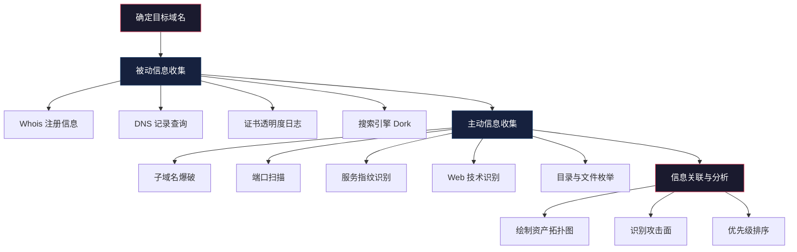
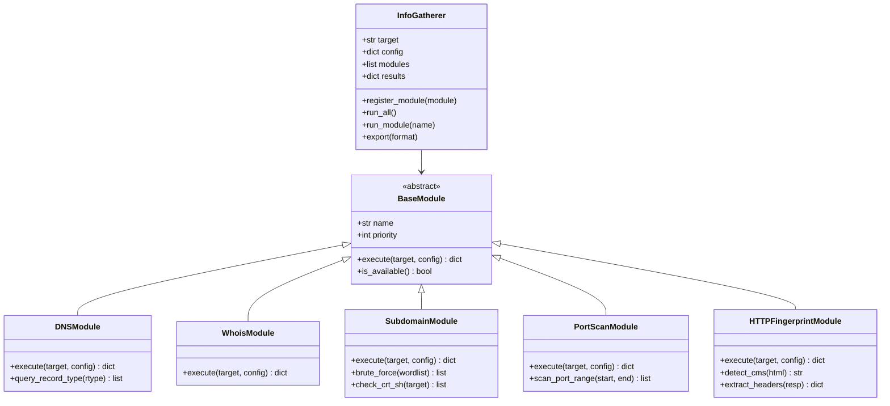
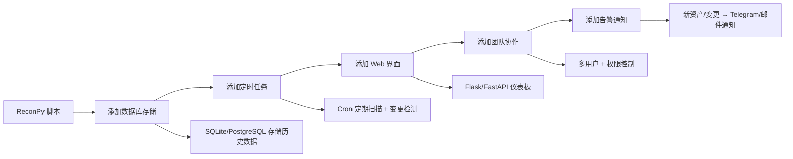

## 案例四：自动化信息收集脚本

信息收集（Reconnaissance）是渗透测试的第一阶段，也是决定后续攻击面广度的关键环节。本案例将前几章学到的网络编程、多线程异步、HTTP 操作、数据处理等技能综合运用，构建一个名为 **ReconPy** 的自动化信息收集框架。不同于前面三个案例各自聚焦单一功能，本案例是一个"集大成者"——它将 DNS 枚举、Whois 查询、子域名发现、端口探测、Web 指纹识别等模块整合为一个可扩展的工具链。

### 1. 信息收集的方法论框架

在写代码之前，必须先理解信息收集的理论模型。业界通用的分类如下：

| 阶段 | 英文 | 描述 | 典型技术 |
|------|------|------|----------|
| 被动收集 | Passive Recon | 不直接与目标交互，通过公开数据源获取信息 | Whois、搜索引擎、证书透明度日志、Shodan |
| 主动收集 | Active Recon | 直接与目标系统交互，会在目标日志中留下痕迹 | 端口扫描、DNS 枚举、目录爆破、Banner 抓取 |
| 社会工程 | Social Engineering | 利用人的弱点获取信息 | 钓鱼、信息拼接（不属于本案例范围） |



**关键原则：先被动后主动。** 被动收集不会在目标留下任何痕迹，适合前期摸底；主动收集会触发目标的 IDS/WAF 日志，需要在评估授权范围内执行。

### 2. 架构设计：模块化与可扩展性

一个好的信息收集工具不是把所有功能堆到一个函数里，而是采用**插件化架构**——每个收集模块独立实现，通过统一接口注册和调用。



设计要点：

- **BaseModule 抽象基类**：定义统一的 `execute()` 接口和 `is_available()` 检测（如缺少依赖库时优雅降级）
- **优先级排序**：被动模块（DNS/Whois）优先执行，主动模块（端口扫描）后执行
- **结果聚合**：所有模块输出标准化为字典，最终合并为统一的 JSON 报告
- **并发控制**：主动模块内部使用线程池加速，模块之间可并行执行

### 3. 完整实现

#### 3.1 基础框架与依赖管理

```python
#!/usr/bin/env python3
"""
ReconPy - 自动化信息收集工具
综合信息收集框架：DNS枚举、子域名发现、端口扫描、Web指纹识别、Whois查询
仅用于授权安全测试，使用者需遵守当地法律法规。
"""

import socket
import json
import argparse
import logging
import sys
import time
import ssl
import concurrent.futures
from abc import ABC, abstractmethod
from datetime import datetime
from typing import Dict, List, Any, Optional
from dataclasses import dataclass, field, asdict

# ── 依赖库检测 ──────────────────────────────────────────────
# 不同模块依赖不同第三方库，用标志变量实现优雅降级
try:
    import dns.resolver
    import dns.exception
    HAS_DNSPYTHON = True
except ImportError:
    HAS_DNSPYTHON = False

try:
    import requests
    HAS_REQUESTS = True
except ImportError:
    HAS_REQUESTS = False

try:
    import whois as python_whois
    HAS_WHOIS = True
except ImportError:
    HAS_WHOIS = False

# ── 日志配置 ──────────────────────────────────────────────
logging.basicConfig(
    level=logging.INFO,
    format="%(asctime)s [%(levelname)s] %(name)s: %(message)s",
    datefmt="%H:%M:%S"
)
logger = logging.getLogger("ReconPy")


# ── 数据结构 ──────────────────────────────────────────────
@dataclass
class ReconResult:
    """标准化的收集结果"""
    module: str
    success: bool
    data: Dict[str, Any] = field(default_factory=dict)
    errors: List[str] = field(default_factory=list)
    duration: float = 0.0
    timestamp: str = ""

    def __post_init__(self):
        if not self.timestamp:
            self.timestamp = datetime.now().isoformat()
```

**为什么用 `dataclass` 而不是普通字典？** 因为 `dataclass` 提供类型注解、自动生成 `__init__` 和 `__repr__`，在后续代码补全和调试时效率远高于字典的魔术字符串键。`asdict()` 可以一键序列化为 JSON。

#### 3.2 抽象基类与模块注册

```python
# ── 抽象基类 ──────────────────────────────────────────────
class BaseModule(ABC):
    """所有收集模块的基类，定义统一接口"""

    @property
    @abstractmethod
    def name(self) -> str:
        """模块名称标识"""
        ...

    @property
    def priority(self) -> int:
        """执行优先级，数字越小越先执行（被动收集优先）"""
        return 50

    @abstractmethod
    def is_available(self) -> bool:
        """检测依赖是否就绪"""
        ...

    @abstractmethod
    def execute(self, target: str, config: Dict) -> ReconResult:
        """执行收集逻辑，返回标准化结果"""
        ...

    def _timed_execute(self, target: str, config: Dict) -> ReconResult:
        """包装执行，自动计时和异常捕获"""
        start = time.monotonic()
        try:
            result = self.execute(target, config)
            result.duration = time.monotonic() - start
            return result
        except Exception as e:
            logger.error(f"Module '{self.name}' failed: {e}")
            return ReconResult(
                module=self.name,
                success=False,
                errors=[str(e)],
                duration=time.monotonic() - start
            )
```

**`_timed_execute` 的作用：** 将计时和异常捕获逻辑从每个模块中抽离出来，避免重复代码。模块开发者只需关注 `execute()` 的核心逻辑，框架层保证异常不会崩溃整个工具。

#### 3.3 DNS 枚举模块

DNS 查询是信息收集的基石。一个域名的 DNS 记录能泄露大量信息：邮件服务器（MX）、域名服务器（NS）、文本记录（TXT，常含 SPF/DKIM/DMARC 配置）、别名（CNAME）等。

```python
class DNSModule(BaseModule):
    """DNS 记录枚举模块"""

    RECORD_TYPES = ['A', 'AAAA', 'MX', 'NS', 'TXT', 'CNAME', 'SOA', 'SRV', 'CAA']

    @property
    def name(self) -> str:
        return "dns"

    @property
    def priority(self) -> int:
        return 10  # 被动收集，最高优先级

    def is_available(self) -> bool:
        return HAS_DNSPYTHON

    def execute(self, target: str, config: Dict) -> ReconResult:
        if not self.is_available():
            return ReconResult(
                module=self.name, success=False,
                errors=["dnspython not installed: pip install dnspython"]
            )

        records = {}
        errors = []
        types_to_query = config.get("dns_types", self.RECORD_TYPES)

        for rtype in types_to_query:
            try:
                answers = dns.resolver.resolve(target, rtype, lifetime=5)
                records[rtype] = [str(r) for r in answers]
                logger.info(f"  DNS {rtype}: {len(records[rtype])} record(s)")
            except dns.resolver.NoAnswer:
                # 该记录类型不存在，不是错误
                pass
            except dns.resolver.NXDOMAIN:
                errors.append(f"Domain {target} does not exist (NXDOMAIN)")
                break
            except dns.exception.Timeout:
                errors.append(f"DNS query for {rtype} timed out")
            except Exception as e:
                errors.append(f"DNS {rtype}: {e}")

        # 提取 IP 地址用于后续模块
        ips = records.get('A', []) + records.get('AAAA', [])

        return ReconResult(
            module=self.name,
            success=len(records) > 0,
            data={"records": records, "resolved_ips": ips},
            errors=errors
        )
```

**细节说明：**
- `lifetime=5` 设置单次查询超时为 5 秒，避免一个卡死的 DNS 查询阻塞整个流程
- `NoAnswer` 不是错误——某些域名确实没有 AAAA 或 SRV 记录
- `NXDOMAIN` 表示域名不存在，此时应中断查询而非继续浪费请求
- 将解析到的 IP 地址提取出来，供后续端口扫描模块直接使用

#### 3.4 Whois 查询模块

Whois 协议查询域名的注册信息，包括注册商、注册日期、过期日期、注册人联系方式等。这些信息在社会工程和目标画像中价值极高。

```python
class WhoisModule(BaseModule):
    """Whois 注册信息查询模块"""

    @property
    def name(self) -> str:
        return "whois"

    @property
    def priority(self) -> int:
        return 10

    def is_available(self) -> bool:
        return HAS_WHOIS

    def execute(self, target: str, config: Dict) -> ReconResult:
        if not self.is_available():
            return ReconResult(
                module=self.name, success=False,
                errors=["python-whois not installed: pip install python-whois"]
            )

        try:
            w = python_whois.whois(target)

            # 处理日期字段可能是列表的情况
            creation = w.creation_date
            expiration = w.expiration_date
            if isinstance(creation, list):
                creation = creation[0] if creation else None
            if isinstance(expiration, list):
                expiration = expiration[0] if expiration else None

            data = {
                "domain_name": getattr(w, 'domain_name', target),
                "registrar": getattr(w, 'registrar', 'Unknown'),
                "creation_date": str(creation) if creation else 'Unknown',
                "expiration_date": str(expiration) if expiration else 'Unknown',
                "name_servers": list(w.name_servers) if w.name_servers else [],
                "emails": list(w.emails) if w.emails else [],
                "org": getattr(w, 'org', 'Unknown'),
                "country": getattr(w, 'country', 'Unknown'),
                "dnssec": getattr(w, 'dnssec', 'Unknown'),
            }

            # 域名过期预警
            if expiration:
                days_left = (expiration - datetime.now()).days
                data["days_until_expiry"] = days_left
                if days_left < 30:
                    logger.warning(f"  Domain expires in {days_left} days!")

            return ReconResult(module=self.name, success=True, data=data)

        except Exception as e:
            return ReconResult(
                module=self.name, success=False, errors=[str(e)]
            )
```

**常见坑点：** `python-whois` 返回的日期字段类型不一致——有时是 `datetime` 对象，有时是 `datetime` 列表，有时是字符串，有时是 `None`。不加类型检查直接调用 `.strftime()` 会崩溃。

#### 3.5 子域名发现模块

子域名枚举是扩大攻击面的核心技术。一个公司往往拥有数百个子域名（dev.xxx.com、staging.xxx.com、api-v2.xxx.com），其中不乏暴露在公网的测试环境和管理后台。

```python
class SubdomainModule(BaseModule):
    """子域名发现模块：字典爆破 + crt.sh 证书透明度查询"""

    # 精选子域名字典（完整版应有 10000+ 条目）
    DEFAULT_WORDLIST = [
        'www', 'mail', 'ftp', 'smtp', 'pop', 'imap', 'webmail',
        'admin', 'administrator', 'manage', 'dashboard', 'portal',
        'api', 'api-v2', 'api-dev', 'graphql', 'gateway', 'auth',
        'dev', 'development', 'test', 'testing', 'staging', 'stage',
        'qa', 'uat', 'sandbox', 'demo', 'preview', 'beta', 'canary',
        'cdn', 'static', 'assets', 'media', 'img', 'images', 'upload',
        'blog', 'docs', 'wiki', 'help', 'support', 'status', 'monitor',
        'shop', 'store', 'pay', 'payment', 'billing', 'crm', 'erp',
        'vpn', 'remote', 'ssh', 'rdp', 'bastion', 'jump', 'proxy',
        'git', 'gitlab', 'jenkins', 'ci', 'cd', 'jira', 'confluence',
        'db', 'database', 'mysql', 'postgres', 'mongo', 'redis', 'elastic',
        'log', 'logs', 'kibana', 'grafana', 'prometheus', 'alert',
        'backup', 'bak', 'old', 'archive', 'temp', 'tmp', 'legacy',
        'mobile', 'm', 'app', 'wap', 'h5', 'mini', 'wx',
        'oa', 'hr', 'erp', 'finance', 'crm', 'sso', 'ldap',
    ]

    @property
    def name(self) -> str:
        return "subdomains"

    @property
    def priority(self) -> int:
        return 20

    def is_available(self) -> bool:
        return True  # socket 是标准库，始终可用

    def _brute_force(self, target: str, wordlist: List[str],
                     threads: int = 50) -> List[Dict]:
        """字典爆破子域名"""
        found = []

        def check_subdomain(word: str) -> Optional[Dict]:
            hostname = f"{word}.{target}"
            try:
                # 先做 DNS A 记录查询
                ip = socket.gethostbyname(hostname)
                return {"subdomain": hostname, "ip": ip, "method": "bruteforce"}
            except socket.gaierror:
                return None

        with concurrent.futures.ThreadPoolExecutor(max_workers=threads) as pool:
            futures = {pool.submit(check_subdomain, w): w
                       for w in wordlist}
            for future in concurrent.futures.as_completed(futures):
                result = future.result()
                if result:
                    found.append(result)
                    logger.info(f"  [+] {result['subdomain']} -> {result['ip']}")

        return found

    def _query_crt_sh(self, target: str) -> List[Dict]:
        """通过 crt.sh 证书透明度日志查询子域名（被动方式）"""
        if not HAS_REQUESTS:
            return []

        found = []
        try:
            url = f"https://crt.sh/?q=%.{target}&output=json"
            resp = requests.get(url, timeout=15)
            if resp.status_code == 200:
                entries = resp.json()
                seen = set()
                for entry in entries:
                    name = entry.get('name_value', '')
                    for subdomain in name.split('\n'):
                        subdomain = subdomain.strip().lower()
                        # 过滤泛域名和重复项
                        if (subdomain and '*.' not in subdomain
                                and subdomain not in seen
                                and subdomain.endswith(target)):
                            seen.add(subdomain)
                            found.append({
                                "subdomain": subdomain,
                                "ip": "",
                                "method": "crt.sh"
                            })
                logger.info(f"  crt.sh found {len(found)} subdomains")
        except Exception as e:
            logger.warning(f"  crt.sh query failed: {e}")

        return found

    def execute(self, target: str, config: Dict) -> ReconResult:
        wordlist = config.get("subdomain_wordlist", self.DEFAULT_WORDLIST)
        threads = config.get("subdomain_threads", 50)
        errors = []

        # 被动方式：crt.sh 证书透明度查询
        logger.info("  Querying crt.sh (passive)...")
        crt_results = self._query_crt_sh(target)

        # 主动方式：字典爆破
        logger.info(f"  Brute-forcing with {len(wordlist)} words...")
        brute_results = self._brute_force(target, wordlist, threads)

        # 合并去重
        seen = set()
        all_subs = []
        for item in crt_results + brute_results:
            if item['subdomain'] not in seen:
                seen.add(item['subdomain'])
                all_subs.append(item)

        return ReconResult(
            module=self.name,
            success=True,
            data={"subdomains": all_subs, "total": len(all_subs)},
            errors=errors
        )
```

**为什么同时用两种方法？**
- `crt.sh` 是被动查询，利用公开的证书透明度日志，不会触碰目标服务器，能发现字典中没有的子域名
- 字典爆破是主动查询，能发现没有申请过 SSL 证书的内部子域名
- 两者互补，合并去重后覆盖面最大化

#### 3.6 端口扫描模块

```python
class PortScanModule(BaseModule):
    """TCP 端口扫描模块"""

    # Top 100 常见端口（精简版，完整版应覆盖 top 1000）
    COMMON_PORTS = [
        21, 22, 23, 25, 53, 80, 110, 111, 135, 139, 143, 443, 445,
        993, 995, 1433, 1521, 2049, 3306, 3389, 5432, 5900, 6379,
        8080, 8443, 8888, 9090, 9200, 9300, 11211, 27017
    ]

    # 端口-服务名映射
    SERVICE_MAP = {
        21: "FTP", 22: "SSH", 23: "Telnet", 25: "SMTP", 53: "DNS",
        80: "HTTP", 110: "POP3", 111: "RPC", 135: "MSRPC", 139: "NetBIOS",
        143: "IMAP", 443: "HTTPS", 445: "SMB", 993: "IMAPS", 995: "POP3S",
        1433: "MSSQL", 1521: "Oracle", 2049: "NFS", 3306: "MySQL",
        3389: "RDP", 5432: "PostgreSQL", 5900: "VNC", 6379: "Redis",
        8080: "HTTP-Alt", 8443: "HTTPS-Alt", 8888: "HTTP-Alt2",
        9090: "WebConsole", 9200: "Elasticsearch", 9300: "ES-Transport",
        11211: "Memcached", 27017: "MongoDB"
    }

    @property
    def name(self) -> str:
        return "portscan"

    @property
    def priority(self) -> int:
        return 30  # 主动收集，低于被动模块

    def is_available(self) -> bool:
        return True

    def _grab_banner(self, host: str, port: int, timeout: float = 2.0) -> str:
        """尝试抓取端口 Banner 信息"""
        try:
            sock = socket.socket(socket.AF_INET, socket.SOCK_STREAM)
            sock.settimeout(timeout)
            sock.connect((host, port))

            # 对 HTTP 端口发送 HTTP 请求
            if port in (80, 8080, 8443, 8888, 9090):
                sock.send(b"HEAD / HTTP/1.1\r\nHost: " +
                          host.encode() + b"\r\n\r\n")
            # 对 SMTP 端口等待 Banner
            # 其他端口直接读取欢迎消息

            banner = sock.recv(1024).decode('utf-8', errors='ignore').strip()
            sock.close()
            return banner[:200]  # 截断过长的 Banner
        except Exception:
            return ""

    def _scan_port(self, host: str, port: int, timeout: float) -> Optional[Dict]:
        """扫描单个端口"""
        try:
            sock = socket.socket(socket.AF_INET, socket.SOCK_STREAM)
            sock.settimeout(timeout)
            result = sock.connect_ex((host, port))
            sock.close()
            if result == 0:
                service = self.SERVICE_MAP.get(port, "Unknown")
                banner = self._grab_banner(host, port)
                return {
                    "port": port,
                    "state": "open",
                    "service": service,
                    "banner": banner
                }
        except Exception:
            pass
        return None

    def execute(self, target: str, config: Dict) -> ReconResult:
        ports = config.get("ports", self.COMMON_PORTS)
        threads = config.get("port_threads", 100)
        timeout = config.get("port_timeout", 1.5)

        # 解析域名到 IP
        try:
            ip = socket.gethostbyname(target)
        except socket.gaierror as e:
            return ReconResult(
                module=self.name, success=False,
                errors=[f"Cannot resolve {target}: {e}"]
            )

        logger.info(f"  Scanning {len(ports)} ports on {ip} "
                     f"(threads={threads}, timeout={timeout}s)...")

        open_ports = []
        with concurrent.futures.ThreadPoolExecutor(max_workers=threads) as pool:
            futures = {
                pool.submit(self._scan_port, ip, port, timeout): port
                for port in ports
            }
            for future in concurrent.futures.as_completed(futures):
                result = future.result()
                if result:
                    open_ports.append(result)
                    logger.info(f"  [+] Port {result['port']}: "
                               f"{result['service']} {result['banner'][:50]}")

        # 按端口号排序
        open_ports.sort(key=lambda x: x['port'])

        return ReconResult(
            module=self.name,
            success=True,
            data={"ip": ip, "open_ports": open_ports,
                  "total_open": len(open_ports),
                  "total_scanned": len(ports)},
        )
```

**Banner 抓取的价值：** 仅仅知道端口开放是不够的。通过 Banner 可以判断服务的具体版本（如 `SSH-2.0-OpenSSH_7.4`），这对后续漏洞匹配至关重要。

#### 3.7 HTTP 指纹识别模块

```python
class HTTPFingerprintModule(BaseModule):
    """HTTP 指纹识别：服务器类型、CMS 检测、安全头分析"""

    # CMS 特征指纹
    CMS_FINGERPRINTS = {
        "WordPress": [
            'wp-content', 'wp-includes', 'wp-json', 'xmlrpc.php'
        ],
        "Drupal": [
            'Drupal.settings', 'sites/default/files', 'misc/drupal.js'
        ],
        "Joomla": [
            '/media/jui/', 'Joomla!', '/components/com_'
        ],
        "Laravel": [
            'laravel_session', 'XSRF-TOKEN', 'laravel'
        ],
        "Django": [
            'csrfmiddlewaretoken', '__admin_media_prefix__'
        ],
        "Spring": [
            'Whitelabel Error Page', 'spring', 'X-Application-Context'
        ],
        "Express": [
            'X-Powered-By: Express'
        ],
        "Next.js": [
            '__NEXT_DATA__', '_next/static', '__next'
        ],
    }

    # 安全响应头检查清单
    SECURITY_HEADERS = {
        "Strict-Transport-Security": {
            "description": "强制 HTTPS",
            "risk": "缺失则可能遭受 SSL 剥离攻击"
        },
        "Content-Security-Policy": {
            "description": "内容安全策略",
            "risk": "缺失则无法防御 XSS 和数据注入"
        },
        "X-Content-Type-Options": {
            "description": "MIME 类型嗅探防护",
            "risk": "缺失则浏览器可能错误解析文件类型"
        },
        "X-Frame-Options": {
            "description": "Clickjacking 防护",
            "risk": "缺失则页面可被嵌入 iframe 进行点击劫持"
        },
        "X-XSS-Protection": {
            "description": "XSS 过滤器",
            "risk": "缺失则浏览器内置 XSS 防护不生效"
        },
        "Referrer-Policy": {
            "description": "Referer 头控制",
            "risk": "缺失则可能泄露敏感 URL 参数"
        },
        "Permissions-Policy": {
            "description": "浏览器功能权限控制",
            "risk": "缺失则页面可任意调用摄像头/麦克风等"
        },
    }

    @property
    def name(self) -> str:
        return "http_fingerprint"

    @property
    def priority(self) -> int:
        return 25

    def is_available(self) -> bool:
        return HAS_REQUESTS

    def _detect_cms(self, html: str, headers: Dict) -> Optional[str]:
        """基于 HTML 内容和响应头检测 CMS"""
        for cms, patterns in self.CMS_FINGERPRINTS.items():
            for pattern in patterns:
                if pattern.lower() in html.lower():
                    return cms
                # 也检查响应头
                for header_val in headers.values():
                    if pattern.lower() in str(header_val).lower():
                        return cms
        return None

    def _check_security_headers(self, headers: Dict) -> Dict:
        """检查安全响应头"""
        results = {}
        for header, info in self.SECURITY_HEADERS.items():
            value = headers.get(header)
            results[header] = {
                "present": value is not None,
                "value": value or "",
                "description": info["description"],
                "risk": info["risk"]
            }
        return results

    def _check_https(self, target: str) -> Dict:
        """检查 HTTPS 配置"""
        result = {"https_available": False, "cert_info": {}}
        try:
            import ssl as ssl_module
            ctx = ssl_module.create_default_context()
            with ctx.wrap_socket(socket.socket(), server_hostname=target) as s:
                s.settimeout(5)
                s.connect((target, 443))
                cert = s.getpeercert()
                result["https_available"] = True
                result["cert_info"] = {
                    "subject": dict(x[0] for x in cert.get('subject', [])),
                    "issuer": dict(x[0] for x in cert.get('issuer', [])),
                    "notBefore": cert.get('notBefore', ''),
                    "notAfter": cert.get('notAfter', ''),
                    "serialNumber": cert.get('serialNumber', ''),
                    "san": [entry[1] for entry in cert.get('subjectAltName', [])]
                }
        except Exception as e:
            result["error"] = str(e)
        return result

    def execute(self, target: str, config: Dict) -> ReconResult:
        errors = []
        data = {}

        # HTTP 请求
        for scheme in ['https', 'http']:
            url = f"{scheme}://{target}"
            try:
                resp = requests.get(
                    url, timeout=10, verify=False,
                    allow_redirects=True,
                    headers={'User-Agent': 'Mozilla/5.0 (compatible; ReconPy/1.0)'}
                )
                headers = dict(resp.headers)

                data["url"] = url
                data["status_code"] = resp.status_code
                data["server"] = headers.get('Server', 'Unknown')
                data["powered_by"] = headers.get('X-Powered-By', 'Unknown')
                data["content_type"] = headers.get('Content-Type', '')
                data["redirect_chain"] = [r.url for r in resp.history]
                data["final_url"] = resp.url

                # CMS 检测
                cms = self._detect_cms(resp.text, headers)
                data["detected_cms"] = cms or "Unknown"
                if cms:
                    logger.info(f"  CMS Detected: {cms}")

                # 安全头分析
                data["security_headers"] = self._check_security_headers(headers)
                missing = [h for h, v in data["security_headers"].items()
                           if not v["present"]]
                if missing:
                    logger.warning(f"  Missing security headers: "
                                  f"{', '.join(missing)}")

                break  # 成功就不再尝试另一个 scheme
            except requests.exceptions.SSLError:
                errors.append(f"{scheme}:// SSL error")
            except requests.exceptions.ConnectionError:
                errors.append(f"{scheme}:// connection refused")
            except Exception as e:
                errors.append(f"{scheme}:// {e}")

        # HTTPS 证书信息
        data["https"] = self._check_https(target)

        # 技术栈识别（从 Server 和 X-Powered-By 推断）
        tech_stack = []
        server = data.get("server", "")
        powered = data.get("powered_by", "")
        if "nginx" in server.lower(): tech_stack.append("Nginx")
        if "apache" in server.lower(): tech_stack.append("Apache")
        if "cloudflare" in server.lower(): tech_stack.append("Cloudflare (CDN/WAF)")
        if "php" in powered.lower(): tech_stack.append("PHP")
        if "asp.net" in powered.lower(): tech_stack.append("ASP.NET")
        if "express" in powered.lower(): tech_stack.append("Node.js/Express")
        data["tech_stack"] = tech_stack

        return ReconResult(
            module=self.name,
            success=bool(data.get("url")),
            data=data,
            errors=errors
        )
```

**安全头分析的意义：** 看似只是"检查几个 HTTP 头"，实际上是在评估目标 Web 应用的安全成熟度。一个缺少 CSP 头的网站，XSS 漏洞的利用难度会大幅降低。

#### 3.8 主控类与报告生成

```python
class InfoGatherer:
    """信息收集主控类：管理模块、调度执行、生成报告"""

    def __init__(self, target: str, config: Dict = None):
        # 清理目标（去掉协议前缀和路径）
        self.target = target.replace('http://', '').replace('https://', '')
        self.target = self.target.split('/')[0].split(':')[0]
        self.config = config or {}
        self.modules: List[BaseModule] = []
        self.results: Dict[str, ReconResult] = {}
        self.start_time = None

    def register_module(self, module: BaseModule):
        """注册收集模块"""
        self.modules.append(module)
        self.modules.sort(key=lambda m: m.priority)

    def register_default_modules(self):
        """注册所有内置模块"""
        self.register_module(DNSModule())
        self.register_module(WhoisModule())
        self.register_module(SubdomainModule())
        self.register_module(PortScanModule())
        self.register_module(HTTPFingerprintModule())

    def run_all(self) -> Dict[str, ReconResult]:
        """按优先级依次执行所有模块"""
        self.start_time = time.monotonic()

        self._print_banner()

        available = [m for m in self.modules if m.is_available()]
        unavailable = [m for m in self.modules if not m.is_available()]

        if unavailable:
            logger.warning(
                f"Skipped {len(unavailable)} module(s) due to missing deps: "
                f"{', '.join(m.name for m in unavailable)}"
            )

        for module in available:
            logger.info(f"Running module: {module.name}")
            result = module._timed_execute(self.target, self.config)
            self.results[module.name] = result

        self._print_summary()
        return self.results

    def _print_banner(self):
        """打印启动横幅"""
        print(f"\n{'=' * 64}")
        print(f"  ReconPy - Automated Information Gathering")
        print(f"  Target : {self.target}")
        print(f"  Time   : {datetime.now().strftime('%Y-%m-%d %H:%M:%S')}")
        print(f"  Modules: {len(self.modules)}")
        print(f"{'=' * 64}\n")

    def _print_summary(self):
        """打印执行摘要"""
        total_time = time.monotonic() - self.start_time
        print(f"\n{'=' * 64}")
        print(f"  RECON SUMMARY")
        print(f"{'=' * 64}")

        for name, result in self.results.items():
            status = "✓" if result.success else "✗"
            duration = f"{result.duration:.2f}s"
            print(f"  {status} {name:<20} ({duration})")
            if result.errors:
                for err in result.errors:
                    print(f"    ⚠ {err}")

        print(f"\n  Total time: {total_time:.2f}s")
        print(f"{'=' * 64}\n")

    def export_json(self, filepath: str):
        """导出 JSON 报告"""
        report = {
            "meta": {
                "target": self.target,
                "timestamp": datetime.now().isoformat(),
                "tool": "ReconPy",
                "version": "1.0"
            },
            "modules": {}
        }
        for name, result in self.results.items():
            report["modules"][name] = asdict(result)

        with open(filepath, 'w', encoding='utf-8') as f:
            json.dump(report, f, indent=2, ensure_ascii=False, default=str)
        logger.info(f"Report saved to {filepath}")

    def export_markdown(self, filepath: str):
        """导出 Markdown 报告"""
        lines = [
            f"# ReconPy Report - {self.target}",
            f"Generated: {datetime.now().strftime('%Y-%m-%d %H:%M:%S')}",
            ""
        ]

        if "dns" in self.results and self.results["dns"].success:
            dns_data = self.results["dns"].data.get("records", {})
            lines.append("## DNS Records")
            for rtype, records in dns_data.items():
                lines.append(f"\n### {rtype}")
                for r in records:
                    lines.append(f"- `{r}`")
            lines.append("")

        if "whois" in self.results and self.results["whois"].success:
            w = self.results["whois"].data
            lines.append("## Whois Information")
            lines.append(f"- **Registrar:** {w.get('registrar', 'N/A')}")
            lines.append(f"- **Created:** {w.get('creation_date', 'N/A')}")
            lines.append(f"- **Expires:** {w.get('expiration_date', 'N/A')}")
            lines.append(f"- **Name Servers:** {', '.join(w.get('name_servers', []))}")
            lines.append("")

        if "subdomains" in self.results and self.results["subdomains"].success:
            subs = self.results["subdomains"].data.get("subdomains", [])
            lines.append(f"## Subdomains ({len(subs)} found)")
            lines.append("| Subdomain | IP | Method |")
            lines.append("|-----------|-----|--------|")
            for s in subs:
                lines.append(f"| {s['subdomain']} | {s['ip']} | {s['method']} |")
            lines.append("")

        if "portscan" in self.results and self.results["portscan"].success:
            ports = self.results["portscan"].data.get("open_ports", [])
            lines.append(f"## Open Ports ({len(ports)} found)")
            lines.append("| Port | Service | Banner |")
            lines.append("|------|---------|--------|")
            for p in ports:
                banner = p['banner'][:60] if p['banner'] else '-'
                lines.append(f"| {p['port']} | {p['service']} | {banner} |")
            lines.append("")

        if "http_fingerprint" in self.results:
            http = self.results["http_fingerprint"]
            if http.success:
                lines.append("## HTTP Fingerprint")
                lines.append(f"- **Server:** {http.data.get('server', 'N/A')}")
                lines.append(f"- **CMS:** {http.data.get('detected_cms', 'N/A')}")
                lines.append(f"- **Tech Stack:** "
                            f"{', '.join(http.data.get('tech_stack', []))}")
                lines.append("")

                sec = http.data.get("security_headers", {})
                missing = [h for h, v in sec.items() if not v["present"]]
                if missing:
                    lines.append("### Missing Security Headers")
                    for h in missing:
                        lines.append(f"- **{h}**: {sec[h]['risk']}")
                    lines.append("")

        with open(filepath, 'w', encoding='utf-8') as f:
            f.write('\n'.join(lines))
        logger.info(f"Markdown report saved to {filepath}")
```

#### 3.9 CLI 入口

```python
def main():
    parser = argparse.ArgumentParser(
        description='ReconPy - Automated Information Gathering Tool',
        formatter_class=argparse.RawDescriptionHelpFormatter,
        epilog="""
Examples:
  %(prog)s -t example.com
  %(prog)s -t example.com -o report.json --format json
  %(prog)s -t example.com -o report.md --format markdown
  %(prog)s -t example.com --ports 80,443,8080,8443
  %(prog)s -t example.com --skip portscan
        """
    )
    parser.add_argument('-t', '--target', required=True,
                        help='Target domain or IP')
    parser.add_argument('-o', '--output', help='Output report file')
    parser.add_argument('--format', choices=['json', 'markdown'],
                        default='json', help='Report format (default: json)')
    parser.add_argument('--ports', help='Custom ports (comma-separated, '
                                        'e.g. 80,443,8080)')
    parser.add_argument('--threads', type=int, default=100,
                        help='Max threads for scanning (default: 100)')
    parser.add_argument('--skip', help='Modules to skip (comma-separated)')
    parser.add_argument('--only', help='Only run these modules '
                                        '(comma-separated)')
    parser.add_argument('--dns-types', help='DNS record types to query '
                                            '(comma-separated)')
    parser.add_argument('-v', '--verbose', action='store_true',
                        help='Verbose output')

    args = parser.parse_args()

    if args.verbose:
        logging.getLogger().setLevel(logging.DEBUG)

    # 构建配置字典
    config = {"port_threads": args.threads}
    if args.ports:
        config["ports"] = [int(p.strip()) for p in args.ports.split(',')]
    if args.dns_types:
        config["dns_types"] = [t.strip().upper()
                               for t in args.dns_types.split(',')]

    # 初始化收集器
    gatherer = InfoGatherer(args.target, config)
    gatherer.register_default_modules()

    # 模块过滤
    skip_set = set(args.skip.split(',')) if args.skip else set()
    only_set = set(args.only.split(',')) if args.only else set()

    if skip_set:
        gatherer.modules = [m for m in gatherer.modules
                            if m.name not in skip_set]
    if only_set:
        gatherer.modules = [m for m in gatherer.modules
                            if m.name in only_set]

    # 执行
    results = gatherer.run_all()

    # 导出报告
    if args.output:
        if args.format == 'markdown':
            gatherer.export_markdown(args.output)
        else:
            gatherer.export_json(args.output)


if __name__ == '__main__':
    main()
```

### 4. 安装与运行

#### 4.1 安装依赖

```bash
# 核心依赖（必装）
pip install dnspython requests python-whois

# 一行安装
pip install dnspython requests python-whois
```

如果只需要部分功能，可以只安装对应的库——缺少某个库时，对应模块会自动跳过并在日志中提示。

#### 4.2 使用示例

```bash
# 基础扫描（全部模块）
python reconpy.py -t example.com

# 输出 JSON 报告
python reconpy.py -t example.com -o report.json

# 输出 Markdown 报告
python reconpy.py -t example.com -o report.md --format markdown

# 只扫描特定端口
python reconpy.py -t example.com --ports 80,443,8080,8443,3306

# 跳过端口扫描（纯被动收集）
python reconpy.py -t example.com --skip portscan

# 只运行 DNS 和 Whois
python reconpy.py -t example.com --only dns,whois

# 详细模式
python reconpy.py -t example.com -v
```

#### 4.3 输出示例

```cpp
================================================================
  ReconPy - Automated Information Gathering
  Target : example.com
  Time   : 2026-06-25 14:30:00
  Modules: 5
================================================================

14:30:00 [INFO] Running module: dns
14:30:00 [INFO]   DNS A: 1 record(s)
14:30:00 [INFO]   DNS MX: 2 record(s)
14:30:00 [INFO]   DNS NS: 2 record(s)
14:30:01 [INFO] Running module: whois
14:30:02 [INFO] Running module: subdomains
14:30:02 [INFO]   Querying crt.sh (passive)...
14:30:05 [INFO]   crt.sh found 12 subdomains
14:30:05 [INFO]   Brute-forcing with 80 words...
14:30:08 [INFO]   [+] www.example.com -> 93.184.216.34
14:30:09 [INFO]   [+] mail.example.com -> 93.184.216.35
14:30:10 [INFO] Running module: portscan
14:30:10 [INFO]   Scanning 31 ports on 93.184.216.34 (threads=100)...
14:30:12 [INFO]   [+] Port 80: HTTP Apache/2.4.41
14:30:12 [INFO]   [+] Port 443: HTTPS nginx/1.18.0
14:30:12 [INFO] Running module: http_fingerprint
14:30:13 [INFO]   CMS Detected: WordPress
14:30:13 [WARNING]   Missing security headers: Content-Security-Policy, X-Frame-Options

================================================================
  RECON SUMMARY
================================================================
  ✓ dns                  (0.42s)
  ✓ whois                (0.87s)
  ✓ subdomains           (5.21s)
  ✓ portscan             (2.15s)
  ✓ http_fingerprint     (1.03s)

  Total time: 9.68s
================================================================
```

### 5. 实战注意事项

#### 5.1 法律与授权

| 事项 | 说明 |
|------|------|
| **授权** | 对非自有目标进行信息收集前，必须获得书面授权 |
| **范围** | 严格限制在授权范围内，不得扫描无关域名 |
| **日志** | 保留扫描日志作为合规证据 |
| **被动收集** | Whois、crt.sh 等被动方式在大多数司法管辖区合法 |
| **主动扫描** | 端口扫描在某些国家可能被视为违法行为 |

#### 5.2 反检测与隐蔽性

在授权渗透测试中，信息收集的隐蔽性直接影响后续阶段的空间：

- **控制扫描速率：** 使用 `time.sleep()` 或令牌桶算法限制请求频率，避免触发 WAF/IDS 的速率阈值
- **随机化 User-Agent：** 轮换不同的 UA 字符串，降低被指纹识别的风险
- **使用代理池：** 通过 SOCKS5 代理或 Tor 网络分散请求来源
- **分时段执行：** 在目标业务低峰期执行主动扫描，减少被发现的概率
- **DNS 请求节流：** 子域名爆破的 DNS 请求频率应控制在 50-100 QPS 以内

#### 5.3 常见错误与排查

| 错误现象 | 原因分析 | 解决方案 |
|----------|----------|----------|
| 所有模块返回空结果 | 域名无法解析 | 检查 DNS 设置，尝试 `--dns-types A` 单独测试 |
| crt.sh 返回超时 | crt.sh 服务不稳定 | 增加超时时间，或跳过该被动源 |
| 端口扫描全部超时 | 目标有防火墙 | 降低并发数，增大超时，使用 SYN 扫描（需 root） |
| Whois 查询返回空 | 某些 TLD 不支持 Whois | 检查 TLD 是否在 python-whois 支持列表中 |
| `requests` 报 SSL 错误 | 目标证书无效 | 代码中已设置 `verify=False`，确认不是其他 SSL 问题 |
| 内存占用过高 | 子域名字典过大 | 减小字典规模或增加过滤条件 |

#### 5.4 性能优化策略

| 优化方向 | 具体手段 | 预期效果 |
|----------|----------|----------|
| DNS 缓存 | 使用 `functools.lru_cache` 缓存 DNS 查询结果 | 避免同一域名重复查询 |
| 异步 I/O | 用 `asyncio` + `aiohttp` 替代 `requests` | 并发能力提升 5-10 倍 |
| 连接复用 | 使用 `requests.Session()` 复用 TCP 连接 | 减少三次握手开销 |
| 增量扫描 | 对比上次结果，只扫描新增目标 | 重复扫描时节省 90% 时间 |
| 分布式执行 | 将任务切分到多台机器并行执行 | 大规模目标的扫描时间线性缩短 |

### 6. 进阶扩展

#### 6.1 接入更多数据源

当前版本的子域名发现只使用了 crt.sh 和字典爆破。实战中应接入更多被动数据源：

| 数据源 | 接口方式 | 获取内容 |
|--------|----------|----------|
| VirusTotal | REST API（需 API Key） | 子域名、URL 样本、恶意标签 |
| SecurityTrails | REST API（有免费额度） | 历史 DNS 记录、子域名 |
| Shodan | REST API | 开放端口、Banner、漏洞标签 |
| Censys | REST API | 证书信息、主机资产 |
| Wayback Machine | REST API（无需认证） | 历史页面快照、已下线的子域名 |
| AlienVault OTX | REST API（免费） | IOC、子域名、URL 情报 |
| Fofa | REST API | 资产搜索（中国场景常用） |
| Hunter.how | REST API | 资产搜索（中国场景常用） |

```python
# 示例：接入 VirusTotal 子域名查询
def _query_virustotal(self, target: str, api_key: str) -> List[Dict]:
    """通过 VirusTotal API 查询子域名"""
    url = f"https://www.virustotal.com/api/v3/domains/{target}/subdomains"
    headers = {"x-apikey": api_key}
    try:
        resp = requests.get(url, headers=headers, timeout=15)
        if resp.status_code == 200:
            data = resp.json()
            return [
                {"subdomain": item["id"], "ip": "", "method": "virustotal"}
                for item in data.get("data", [])
            ]
    except Exception as e:
        logger.warning(f"VirusTotal query failed: {e}")
    return []
```

#### 6.2 添加 OSINT 模块

信息收集不仅限于技术层面，还包括公开情报（OSINT）：

- **GitHub 代码搜索：** 搜索目标域名在公开代码仓库中的泄露（API Key、数据库密码、内部域名）
- **邮箱搜集：** 通过 Hunter.io 或公开数据源搜集目标关联的邮箱地址
- **Google Dork：** 自动化执行 `site:target.com filetype:pdf` 等搜索语法
- **社交网络：** 从 LinkedIn 等平台搜集员工信息（需注意隐私合规）

#### 6.3 从脚本到平台

当 ReconPy 从一次性脚本演变为长期使用的信息收集平台时，需要考虑：



### 7. 本案例涉及的知识点回顾

本案例综合运用了本章前面学到的核心技术：

| 知识点 | 在本案例中的应用 |
|--------|------------------|
| 网络编程（Socket） | 端口扫描、Banner 抓取、DNS 解析 |
| HTTP 编程（requests） | Web 指纹识别、crt.sh 查询、安全头分析 |
| 多线程并发 | 子域名爆破、端口扫描的并行执行 |
| 数据结构（dataclass） | 标准化结果存储 |
| 抽象基类（ABC） | 模块化架构的统一接口 |
| 命令行参数（argparse） | 丰富的 CLI 参数支持 |
| 异常处理 | 优雅降级、依赖检测、超时控制 |
| JSON 序列化 | 报告导出 |
| SSL/TLS | HTTPS 证书信息提取 |
| 类型注解 | 提高代码可维护性 |

这正是安全工具开发的典型模式——**将多个基础技能组合为一个有实际价值的工具**。掌握这种"组合式工程"能力，比单独学习某个库的 API 更重要。

***
