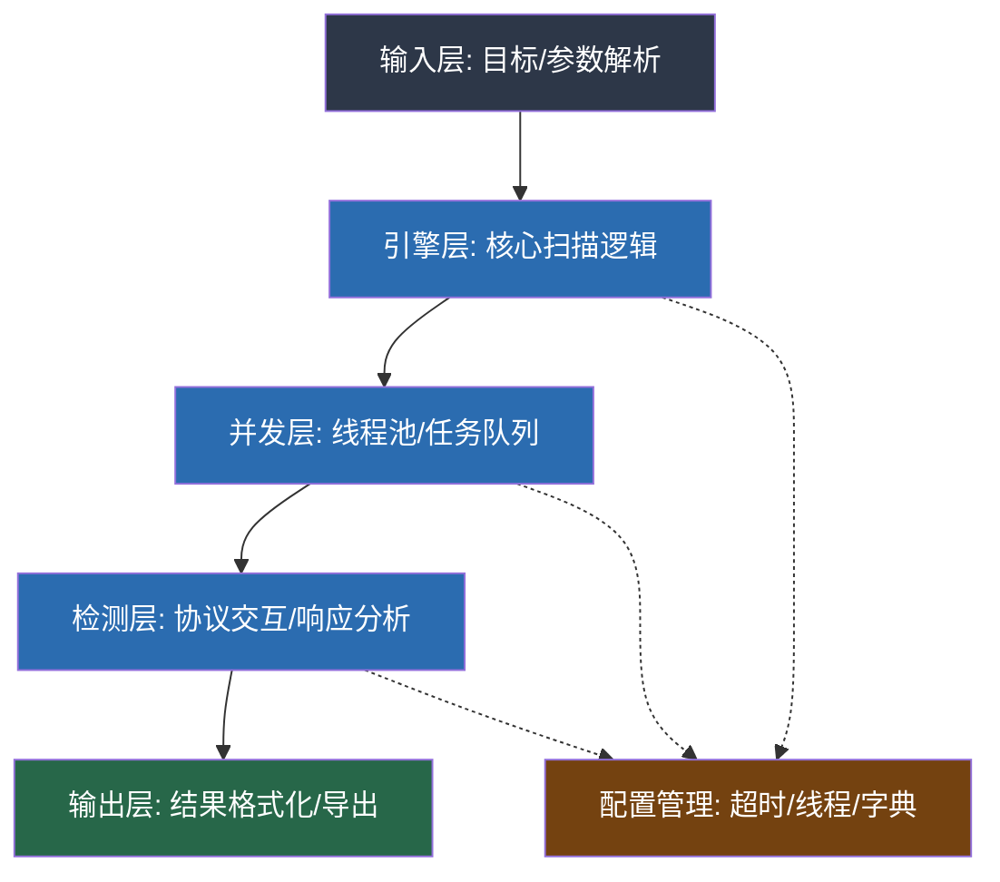
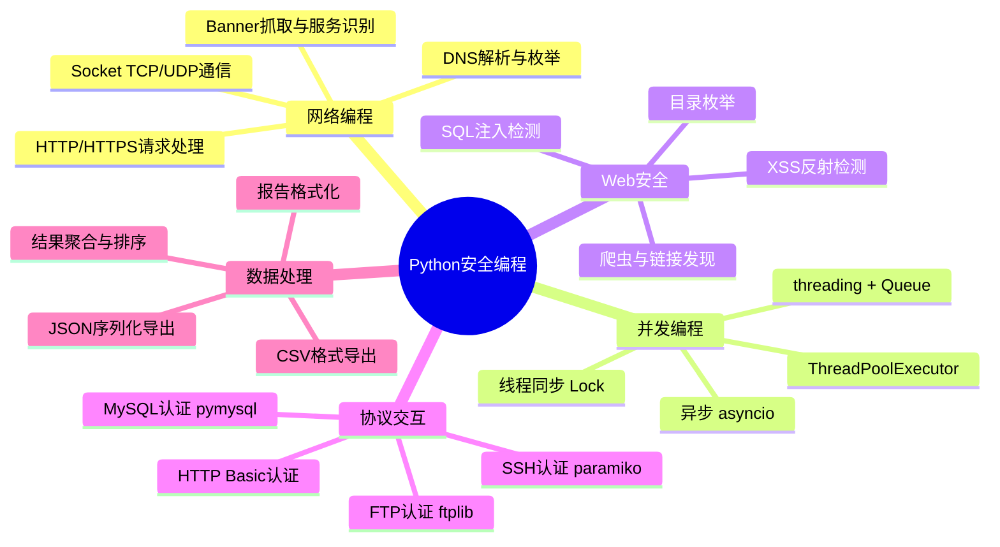
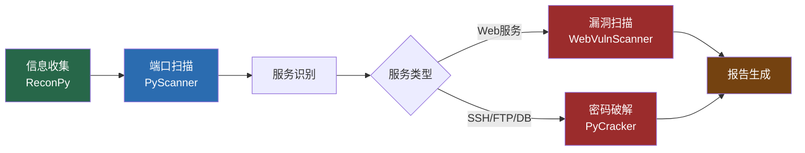

## 案例总结

本节对前面四个实战案例进行全面复盘，从技术架构、核心模式、共性规律三个维度进行深度剖析，并给出工具链整合方案、性能优化策略、代码质量提升路径和进阶扩展方向。这不是简单的内容回顾，而是一次从"会写脚本"到"能造工具链"的认知跃迁。

### 四个案例全景对照

| 维度 | 案例一：端口扫描器 | 案例二：Web漏洞扫描器 | 案例三：密码破解工具 | 案例四：信息收集脚本 |
|------|-------------------|---------------------|--------------------|--------------------|
| **核心协议** | TCP Socket | HTTP/HTTPS | SSH/FTP/HTTP/MySQL | DNS/Whois/HTTP |
| **并发模型** | ThreadPoolExecutor | ThreadPoolExecutor | threading + Queue | 顺序执行为主 |
| **检测逻辑** | connect_ex 返回值 | Payload注入+响应分析 | 认证成功/失败判定 | DNS解析+HTTP指纹 |
| **输出格式** | JSON/CSV | 终端输出 | 终端输出 | JSON |
| **依赖库** | 标准库为主 | requests, BeautifulSoup | paramiko, pymysql | dnspython, python-whois |
| **代码量** | ~200行 | ~300行 | ~190行 | ~145行 |
| **难度等级** | ★★★ | ★★★★ | ★★★ | ★★☆ |
| **实战价值** | 入门必备 | 中级核心 | 中级核心 | 入门必备 |

四个案例覆盖了渗透测试的完整前期流程：**信息收集→端口扫描→服务识别→漏洞检测→凭据爆破**。它们之间不是孤立的，而是可以串联成一条自动化流水线。

### 技术架构深度剖析

#### 共性架构模式

四个案例虽然功能各异，但遵循着相同的架构范式。识别这些共性模式，是从"写单个脚本"到"设计工具框架"的关键一步。



所有案例共享的五层架构：

**第一层：输入层（Input Layer）**。使用 `argparse` 解析命令行参数，统一处理目标地址、端口范围、线程数、超时时间、输出文件等配置项。这一层的关键设计是参数校验——在进入核心逻辑之前拦截非法输入，避免运行中途崩溃。

**第二层：引擎层（Engine Layer）**。封装核心扫描逻辑为类方法，对外暴露简洁的 `scan()` / `crack()` / `gather_all()` 接口。引擎层负责任务拆分——将一个大目标分解为多个可独立执行的子任务。

**第三层：并发层（Concurrency Layer）**。使用 `ThreadPoolExecutor` 或手动管理的 `threading.Thread` + `Queue` 组合，将子任务分发到多个工作线程并行执行。线程间通过 `threading.Lock` 保护共享状态。

**第四层：检测层（Detection Layer）**。实际的协议交互发生在这里：TCP连接探测、HTTP请求发送、SSH认证尝试、DNS查询等。每个检测函数接收单个目标参数，返回检测结果或 `None`。

**第五层：输出层（Output Layer）**。将检测结果格式化为人类可读的终端输出或机器可解析的文件格式（JSON、CSV）。统一的输出格式是后续工具链整合的基础。

#### 并发模型对比分析

四个案例采用了两种并发策略，各有适用场景：

| 特性 | ThreadPoolExecutor（案例1/2） | Thread + Queue（案例3） |
|------|------------------------------|------------------------|
| **任务分配** | 自动调度，由线程池管理 | 手动从Queue取任务 |
| **提前终止** | 需遍历future取消 | 通过标志位自然退出 |
| **进度追踪** | 需手动计数 | 天然支持（Queue.qsize） |
| **内存效率** | 预提交所有任务到池中 | 按需取出，内存更省 |
| **适用场景** | 任务数量已知且有限 | 任务量大，需中途停止 |
| **复杂度** | 低 | 中等 |

密码破解工具选择 Thread + Queue 模式是有深层原因的：密码字典可能包含数十万条组合，如果全部提交到线程池会占用大量内存；而 Queue 模式支持按需消费，找到密码后通过标志位让所有线程优雅退出，避免无意义的计算浪费。

端口扫描器选择 ThreadPoolExecutor 则因为端口数量固定（最多65535个），任务提交的内存开销可控，且 `as_completed` 提供了天然的进度追踪机制。

#### 检测逻辑设计模式

四个案例中出现了三种经典的检测设计模式，理解这些模式是编写任何安全检测工具的基础：

**模式一：阈值判定（Threshold Detection）**。端口扫描器中 `connect_ex() == 0` 就是典型的阈值判定——返回值等于0表示端口开放。密码破解工具中认证成功/失败也是二元阈值判定。这种模式简单直接，适用于结果非黑即白的场景。

**模式二：差异对比（Differential Detection）**。Web漏洞扫描器中SQL注入的布尔型检测使用了这种模式：先获取正常响应的长度作为基准值，再用注入Payload获取异常响应长度，比较两者差异。如果差异超过阈值（500字节），则判定存在漏洞。时间型注入检测（SLEEP响应时间 > 2.5秒）本质上也是差异对比——比较的是时间维度的差异。

**模式三：模式匹配（Pattern Matching）**。Web漏洞扫描器的错误型SQL注入检测使用正则/字符串匹配在响应中搜索数据库错误关键字（`sql syntax`、`ORA-`、`PostgreSQL` 等）。信息收集脚本中的HTTP指纹识别也属于这种模式——在响应头中匹配 `Server`、`X-Powered-By` 等字段。模式匹配的关键是维护一个高质量的特征库，特征越精确，误报率越低。

### 核心技术能力图谱

通过四个案例的实践，读者应该已经掌握以下核心能力。下面按技术领域进行系统梳理，并指出每个能力在实际工作中的应用场景。



#### 能力一：Socket网络编程

端口扫描器和信息收集脚本都大量使用了 `socket` 模块。核心API只有三个：`socket()` 创建套接字、`connect_ex()` 尝试连接（返回错误码而非抛异常）、`recv()` 接收数据。但围绕这三个API的工程化处理却有很多细节：

```python
# 工程化的Socket使用模式
import socket

def safe_connect(host, port, timeout=1):
    """
    工程化的TCP连接探测
    
    关键细节：
    1. connect_ex 而非 connect —— 避免异常处理的开销
    2. 必须设置 timeout —— 否则无响应目标会阻塞线程
    3. 必须 close —— 不关闭会导致文件描述符泄漏
    4. 捕获所有异常 —— 网络操作随时可能出错
    """
    sock = None
    try:
        sock = socket.socket(socket.AF_INET, socket.SOCK_STREAM)
        sock.settimeout(timeout)
        result = sock.connect_ex((host, port))
        return result == 0
    except (socket.error, OSError):
        return False
    finally:
        if sock:
            sock.close()

# 使用 context manager 更优雅
def safe_connect_v2(host, port, timeout=1):
    try:
        with socket.socket(socket.AF_INET, socket.SOCK_STREAM) as sock:
            sock.settimeout(timeout)
            return sock.connect_ex((host, port)) == 0
    except (socket.error, OSError):
        return False
```

原始案例中使用了裸 `except:` 来捕获所有异常，这在生产代码中是不推荐的。应该至少捕获 `socket.error` 和 `OSError`，避免掩盖 `KeyboardInterrupt` 等不应被静默吞掉的异常。

#### 能力二：HTTP请求与响应分析

Web漏洞扫描器展示了HTTP请求的完整生命周期：构造请求头、发送Payload、分析响应。其中 `requests.Session` 的使用是一个重要的工程细节——Session会自动管理Cookie和连接池，对于需要多次请求同一目标的场景，比每次创建新连接高效得多。

```python
import requests
from requests.adapters import HTTPAdapter
from urllib3.util.retry import Retry

def create_session(retries=3, backoff_factor=0.3):
    """
    创建带重试机制的HTTP Session
    
    重试策略适用于网络不稳定的场景：
    - 遇到 429(Too Many Requests) 自动等待重试
    - 遇到 500/502/503/504 自动重试
    - 每次重试间隔指数递增（backoff）
    """
    session = requests.Session()
    retry_strategy = Retry(
        total=retries,
        backoff_factor=backoff_factor,
        status_forcelist=[429, 500, 502, 503, 504],
    )
    adapter = HTTPAdapter(max_retries=retry_strategy)
    session.mount("http://", adapter)
    session.mount("https://", adapter)
    
    # 设置通用请求头
    session.headers.update({
        'User-Agent': 'Mozilla/5.0 (Windows NT 10.0; Win64; x64) '
                       'AppleWebKit/537.36 Chrome/120.0.0.0',
        'Accept': 'text/html,application/xhtml+xml,application/xml;q=0.9',
        'Accept-Language': 'zh-CN,zh;q=0.9,en;q=0.8',
    })
    session.verify = False  # 跳过SSL证书验证（仅限安全测试）
    
    return session
```

#### 能力三：多线程同步与状态管理

四个案例中出现了两种线程同步模式：

**共享结果列表保护**（端口扫描器）：多个线程同时向 `open_ports` 列表追加结果，使用 `Lock` 保护写操作。Python的GIL虽然保证了单条字节码的原子性，但 `list.append()` 的"检查容量→分配空间→写入数据"三步操作并非原子的，在高并发下可能出问题。

**提前终止协调**（密码破解工具）：一个线程找到密码后，需要通知其他线程停止。通过共享的 `self.found` 标志位配合 `Lock` 实现。关键在于检查标志位的频率——太高影响性能，太低浪费计算。原始实现在每次尝试前检查，这是合理的。

```python
import threading
from concurrent.futures import ThreadPoolExecutor, as_completed

class ThreadSafeResults:
    """
    线程安全的结果收集器
    
    封装了锁操作，避免在每个扫描函数中重复写锁逻辑
    """
    def __init__(self):
        self._results = []
        self._lock = threading.Lock()
        self._stop_event = threading.Event()
    
    def add(self, result):
        with self._lock:
            self._results.append(result)
    
    def should_stop(self):
        return self._stop_event.is_set()
    
    def stop(self):
        self._stop_event.set()
    
    def get_all(self):
        with self._lock:
            return list(self._results)
    
    def __len__(self):
        with self._lock:
            return len(self._results)
```

#### 能力四：协议认证交互

密码破解工具封装了四种协议的认证尝试，每种协议的库和异常处理方式都不同：

| 协议 | 库 | 认证方式 | 成功判定 | 关键异常 |
|------|-----|---------|---------|---------|
| SSH | paramiko | 用户名+密码 | 连接成功无异常 | `AuthenticationException` |
| FTP | ftplib | 用户名+密码 | `login()` 无异常 | `ftplib.error_perm` |
| HTTP Basic | requests | `auth=(user, pwd)` | `status_code == 200` | `ConnectionError` |
| MySQL | pymysql | 用户名+密码 | 连接成功无异常 | `pymysql.err.OperationalError` |

一个重要的工程改进是使用策略模式（Strategy Pattern）替代原始实现中的字典映射：

```python
from abc import ABC, abstractmethod

class AuthTester(ABC):
    """认证测试器抽象基类"""
    
    @abstractmethod
    def try_auth(self, host, port, username, password) -> bool:
        """尝试认证，返回是否成功"""
        pass
    
    @abstractmethod
    def default_port(self) -> int:
        """该协议的默认端口"""
        pass

class SSHAuthTester(AuthTester):
    def try_auth(self, host, port, username, password) -> bool:
        import paramiko
        try:
            client = paramiko.SSHClient()
            client.set_missing_host_key_policy(paramiko.AutoAddPolicy())
            client.connect(host, port=port,
                          username=username, password=password,
                          timeout=5)
            client.close()
            return True
        except paramiko.AuthenticationException:
            return False
        except (paramiko.SSHException, OSError):
            return False
    
    def default_port(self) -> int:
        return 22

class FTPAuthTester(AuthTester):
    def try_auth(self, host, port, username, password) -> bool:
        import ftplib
        try:
            ftp = ftplib.FTP()
            ftp.connect(host, port, timeout=5)
            ftp.login(username, password)
            ftp.quit()
            return True
        except (ftplib.error_perm, ftplib.all_errors, OSError):
            return False
    
    def default_port(self) -> int:
        return 21

# 注册表 —— 新增协议只需添加一行
AUTH_TESTERS = {
    'ssh': SSHAuthTester,
    'ftp': FTPAuthTester,
    # 'http': HTTPAuthTester,
    # 'mysql': MySQLAuthTester,
}
```

策略模式的优势在于扩展性：新增协议（如RDP、SMB、LDAP）时，只需实现一个新的 `AuthTester` 子类并注册到 `AUTH_TESTERS` 字典中，无需修改破解引擎的核心逻辑。

### 工具链整合方案

四个案例的真正威力在于组合使用。在实际渗透测试中，典型的工作流是：



下面是一个将四个工具整合为统一框架的架构设计：

```python
#!/usr/bin/env python3
"""
PyToolkit - Python安全工具链
整合：信息收集、端口扫描、漏洞检测、密码破解
"""

import argparse
import json
from datetime import datetime
from dataclasses import dataclass, field, asdict
from typing import List, Dict, Optional
from enum import Enum


class Severity(Enum):
    INFO = "info"
    LOW = "low"
    MEDIUM = "medium"
    HIGH = "high"
    CRITICAL = "critical"


@dataclass
class Finding:
    """统一的发现结果格式"""
    tool: str                    # 来源工具名
    category: str                # 分类：port/vuln/credential/info
    target: str                  # 目标地址
    detail: str                  # 详细描述
    severity: Severity = Severity.INFO
    evidence: str = ""           # 证据
    timestamp: str = field(
        default_factory=lambda: datetime.now().isoformat()
    )


@dataclass
class ScanReport:
    """扫描报告"""
    target: str
    start_time: str
    findings: List[Finding] = field(default_factory=list)
    
    def add(self, finding: Finding):
        self.findings.append(finding)
    
    def summary(self) -> Dict[str, int]:
        """按严重级别统计"""
        counts = {s.value: 0 for s in Severity}
        for f in self.findings:
            counts[f.severity.value] += 1
        return counts
    
    def export_json(self, filename: str):
        with open(filename, 'w', encoding='utf-8') as f:
            json.dump(asdict(self), f, indent=2, ensure_ascii=False)
    
    def export_markdown(self, filename: str):
        """导出Markdown格式报告"""
        lines = [
            f"# 安全扫描报告",
            f"",
            f"**目标**: {self.target}",
            f"**时间**: {self.start_time}",
            f"",
            f"## 发现统计",
            f"",
            f"| 级别 | 数量 |",
            f"|------|------|",
        ]
        for level, count in self.summary().items():
            lines.append(f"| {level} | {count} |")
        
        lines.extend(["", "## 详细发现", ""])
        for i, finding in enumerate(self.findings, 1):
            lines.append(f"### {i}. [{finding.severity.value.upper()}] "
                        f"{finding.category}")
            lines.append(f"- **工具**: {finding.tool}")
            lines.append(f"- **目标**: {finding.target}")
            lines.append(f"- **详情**: {finding.detail}")
            if finding.evidence:
                lines.append(f"- **证据**: {finding.evidence}")
            lines.append("")
        
        with open(filename, 'w', encoding='utf-8') as f:
            f.write('\n'.join(lines))


class Toolkit:
    """统一工具链控制器"""
    
    def __init__(self, target: str, threads: int = 50, timeout: int = 3):
        self.target = target
        self.threads = threads
        self.timeout = timeout
        self.report = ScanReport(
            target=target,
            start_time=datetime.now().isoformat()
        )
    
    def run_recon(self):
        """阶段一：信息收集"""
        print("[*] Phase 1: Reconnaissance")
        # 调用 ReconPy 的逻辑
        # dns_lookup, whois, subdomain_enum, http_fingerprint
        # 将结果封装为 Finding 对象添加到 report
    
    def run_port_scan(self, ports: str = "1-1000"):
        """阶段二：端口扫描"""
        print("[*] Phase 2: Port Scanning")
        # 调用 PyScanner 的逻辑
        # 对发现的端口生成 Finding 对象
        # 返回开放端口列表供后续阶段使用
    
    def run_vuln_scan(self, urls: list = None):
        """阶段三：漏洞扫描"""
        print("[*] Phase 3: Vulnerability Scanning")
        # 调用 WebVulnScanner 的逻辑
        # 对发现的漏洞生成 Finding 对象（severity=HIGH/CRITICAL）
    
    def run_credential_test(self, ports: dict = None):
        """阶段四：凭据测试"""
        print("[*] Phase 4: Credential Testing")
        # 根据端口扫描结果选择协议
        # 调用 PyCracker 的逻辑
        # 对成功的凭据生成 Finding 对象（severity=CRITICAL）
    
    def execute(self):
        """执行完整扫描流程"""
        self.run_recon()
        open_ports = self.run_port_scan()
        self.run_vuln_scan()
        self.run_credential_test()
        
        # 输出报告
        self.report.export_json(f"report_{self.target}.json")
        self.report.export_markdown(f"report_{self.target}.md")
        
        summary = self.report.summary()
        print(f"\n[+] Scan complete: {sum(summary.values())} findings")
        for level, count in summary.items():
            if count > 0:
                print(f"    {level}: {count}")
```

整合框架的设计要点：

1. **统一的 Finding 数据结构**：所有工具的输出都归一化为 `Finding` 对象，包含工具来源、分类、目标、详情、严重级别、证据和时间戳。这使得后续的报告生成、过滤、排序都可以用统一的逻辑处理。

2. **阶段化执行流程**：四个工具按信息收集→端口扫描→漏洞检测→凭据测试的顺序串行执行，后一阶段的输入依赖前一阶段的输出（例如端口扫描发现的Web端口传给漏洞扫描器）。

3. **多格式报告导出**：同时支持JSON（供程序消费）和Markdown（供人类阅读）两种输出格式。在实际项目中还可以扩展为HTML、PDF等格式。

### 代码质量改进指南

原始案例作为教学示例已经足够清晰，但在走向生产环境之前，有若干质量问题需要改进。

#### 问题一：裸异常捕获

四个案例中普遍存在 `except:` 或 `except Exception:` 的裸捕获：

```python
# ❌ 原始写法 —— 吞掉所有异常，包括 KeyboardInterrupt
try:
    sock.connect_ex((host, port))
except:
    pass

# ✅ 改进写法 —— 精确捕获，保留调试信息
try:
    sock.connect_ex((host, port))
except (socket.timeout, ConnectionRefusedError, OSError) as e:
    logging.debug(f"Connection to {host}:{port} failed: {e}")
except KeyboardInterrupt:
    raise  # 不要吞掉 Ctrl+C
```

裸异常捕获的三个危害：第一，掩盖程序中的真实Bug，让调试变得极其困难；第二，吞掉 `KeyboardInterrupt` 导致用户无法用 Ctrl+C 终止程序；第三，吞掉 `SystemExit` 导致 `sys.exit()` 无法正常退出。

#### 问题二：资源泄漏

端口扫描器的 `scan_port` 方法中，如果在 `connect_ex` 和 `close` 之间发生异常，Socket不会被关闭，导致文件描述符泄漏。在高并发扫描中（200线程×65535端口），文件描述符泄漏会迅速耗尽系统限制（通常默认1024），导致后续所有网络操作全部失败。

```python
# ❌ 原始写法 —— 异常时 socket 不会被关闭
def scan_port(self, port):
    sock = socket.socket(socket.AF_INET, socket.SOCK_STREAM)
    sock.settimeout(self.timeout)
    result = sock.connect_ex((self.target, port))  # 可能抛异常
    sock.close()  # 异常时不会执行
    return result == 0

# ✅ 改进写法 —— 使用 context manager 确保资源释放
def scan_port(self, port):
    try:
        with socket.socket(socket.AF_INET, socket.SOCK_STREAM) as sock:
            sock.settimeout(self.timeout)
            result = sock.connect_ex((self.target, port))
            if result == 0:
                banner = self.grab_banner(sock, port)
                return {'port': port, 'state': 'open', 'banner': banner}
    except (socket.error, OSError):
        pass
    return None
```

Python的 `with` 语句会确保在 `with` 块结束时（无论正常结束还是异常退出）自动调用对象的 `__exit__` 方法。Socket对象的 `__exit__` 会调用 `close()`，从而保证资源被正确释放。

#### 问题三：硬编码配置

Web漏洞扫描器中的SQL注入Payload、目录枚举字典、XSS Payload都是硬编码在代码中的。这导致两个问题：修改Payload需要改代码，不同目标需要不同的Payload集。

```python
# ✅ 改进方案 —— 外部化配置

# payloads/sqli.txt —— 每行一个Payload
# ' OR '1'='1
# ' UNION SELECT NULL--
# ' AND SLEEP(3)--
# 1' ORDER BY 1--

# payloads/directories.txt —— 目录字典
# admin
# login
# wp-admin
# .env
# .git

def load_payloads(filepath: str) -> list:
    """从文件加载Payload列表，跳过注释和空行"""
    payloads = []
    try:
        with open(filepath, 'r', encoding='utf-8') as f:
            for line in f:
                line = line.strip()
                if line and not line.startswith('#'):
                    payloads.append(line)
    except FileNotFoundError:
        logging.warning(f"Payload file not found: {filepath}")
    return payloads
```

#### 问题四：缺少日志系统

原始案例使用 `print()` 输出信息，这在教学场景下足够，但在生产环境中有明显缺陷：无法控制输出级别、无法写入文件、无法与其他模块的日志统一管理。

```python
import logging

def setup_logging(level=logging.INFO, logfile=None):
    """统一日志配置"""
    fmt = '%(asctime)s [%(levelname)s] %(name)s: %(message)s'
    handlers = [logging.StreamHandler()]
    if logfile:
        handlers.append(logging.FileHandler(logfile, encoding='utf-8'))
    
    logging.basicConfig(
        level=level,
        format=fmt,
        handlers=handlers
    )

# 使用
logger = logging.getLogger('pyscanner')

def scan_port(self, port):
    try:
        with socket.socket(...) as sock:
            result = sock.connect_ex((self.target, port))
            if result == 0:
                logger.info(f"Port {port}/tcp OPEN")
                return {'port': port, 'state': 'open'}
    except socket.timeout:
        logger.debug(f"Port {port}/tcp TIMEOUT")
    except OSError as e:
        logger.debug(f"Port {port}/tcp ERROR: {e}")
    return None
```

日志级别使用规范：
- `DEBUG`：每个端口的连接结果、每次HTTP请求的详细信息
- `INFO`：发现开放端口、发现漏洞、找到凭据
- `WARNING`：Payload文件缺失、DNS解析失败、SSL证书错误
- `ERROR`：目标不可达、认证模块加载失败、输出文件写入失败

### 性能优化策略

安全工具的性能直接影响渗透测试的效率。以下是经过实战验证的优化策略。

#### 优化一：自适应线程数

固定线程数（如200线程）在不同网络环境下表现差异巨大。局域网扫描可以用500+线程，而互联网目标可能50线程就会触发目标的防扫描机制。

```python
import os
import socket

def estimate_optimal_threads(target: str, is_local: bool = False) -> int:
    """
    根据网络环境和系统资源估算最优线程数
    
    考虑因素：
    1. 系统文件描述符限制（ulimit -n）
    2. 目标是本地还是远程
    3. 操作系统类型（Windows线程开销更大）
    """
    # 获取系统文件描述符限制
    try:
        import resource
        soft_limit = resource.getrlimit(resource.RLIMIT_NOFILE)[0]
    except (ImportError, AttributeError):
        # Windows 没有 resource 模块
        soft_limit = 512
    
    # 保留一部分给系统使用
    max_threads = soft_limit // 2
    
    if is_local:
        # 局域网可以更激进
        recommended = min(max_threads, 500)
    else:
        # 互联网目标需要克制
        recommended = min(max_threads, 100)
    
    # 上下限保护
    return max(10, min(recommended, 1000))
```

#### 优化二：端口扫描分批策略

一次性提交65535个端口到线程池会导致两个问题：创建65535个future对象占用大量内存；进度报告只能按完成数量触发，不够平滑。

```python
def scan_batched(self, ports, batch_size=1000):
    """
    分批扫描，控制内存使用和进度报告频率
    
    每批 batch_size 个端口，批次内并发执行，
    批次间顺序执行。每批完成后输出进度。
    """
    results = []
    total = len(ports)
    
    for i in range(0, total, batch_size):
        batch = ports[i:i + batch_size]
        
        with ThreadPoolExecutor(max_workers=self.threads) as executor:
            futures = {executor.submit(self.scan_port, p): p 
                      for p in batch}
            for future in as_completed(futures):
                result = future.result()
                if result:
                    results.append(result)
        
        done = min(i + batch_size, total)
        print(f"  Progress: {done}/{total} ({done*100//total}%)")
    
    return results
```

#### 优化三：连接超时自适应

对不同类型的端口使用不同的超时时间。已知的快速服务（HTTP、SSH）用短超时，不常见的端口用长超时：

```python
# 常见服务的推荐超时值（秒）
SERVICE_TIMEOUTS = {
    80: 3,     # HTTP
    443: 3,    # HTTPS
    22: 5,     # SSH（密钥交换需要时间）
    21: 5,     # FTP
    3306: 3,   # MySQL
    6379: 2,   # Redis
}

def get_timeout(self, port):
    """根据端口返回合适的超时时间"""
    return SERVICE_TIMEOUTS.get(port, self.default_timeout)
```

### 进阶扩展方向

四个案例覆盖了安全工具开发的基础能力，但在真实的安全工作中，还需要以下进阶能力。

#### 扩展一：代理池支持

在对互联网目标进行扫描时，直接从本机IP发起大量请求容易被WAF/IDS/IPS封禁。集成代理池是规避这个问题的标准做法。

```python
import random
from itertools import cycle

class ProxyPool:
    """
    代理池管理器
    
    支持从文件加载代理列表，提供随机和轮询两种选取策略，
    自动移除失效代理。
    """
    
    def __init__(self, proxy_file=None, proxies=None):
        self._proxies = []
        if proxy_file:
            with open(proxy_file) as f:
                self._proxies = [
                    line.strip() for line in f 
                    if line.strip() and not line.startswith('#')
                ]
        elif proxies:
            self._proxies = list(proxies)
        self._cycle = cycle(self._proxies) if self._proxies else None
    
    def get_random(self) -> dict:
        """随机获取一个代理"""
        if not self._proxies:
            return {}
        proxy = random.choice(self._proxies)
        return {'http': proxy, 'https': proxy}
    
    def remove(self, proxy: str):
        """移除失效代理"""
        if proxy in self._proxies:
            self._proxies.remove(proxy)
            self._cycle = cycle(self._proxies) if self._proxies else None
    
    def __len__(self):
        return len(self._proxies)
```

#### 扩展二：结果持久化与数据库存储

对于大规模扫描任务，JSON/CSV文件不足以支撑复杂的查询和分析需求。SQLite是一个零依赖的轻量级数据库，非常适合存储扫描结果：

```python
import sqlite3
from contextlib import contextmanager

@contextmanager
def get_db(db_path: str):
    """数据库连接上下文管理器"""
    conn = sqlite3.connect(db_path)
    conn.row_factory = sqlite3.Row
    try:
        yield conn
        conn.commit()
    except Exception:
        conn.rollback()
        raise
    finally:
        conn.close()

def init_db(db_path: str):
    """初始化扫描结果数据库"""
    with get_db(db_path) as conn:
        conn.executescript("""
            CREATE TABLE IF NOT EXISTS scans (
                id INTEGER PRIMARY KEY AUTOINCREMENT,
                target TEXT NOT NULL,
                scan_type TEXT NOT NULL,
                start_time TEXT NOT NULL,
                end_time TEXT,
                status TEXT DEFAULT 'running'
            );
            
            CREATE TABLE IF NOT EXISTS findings (
                id INTEGER PRIMARY KEY AUTOINCREMENT,
                scan_id INTEGER REFERENCES scans(id),
                tool TEXT NOT NULL,
                category TEXT NOT NULL,
                target TEXT NOT NULL,
                port INTEGER,
                detail TEXT NOT NULL,
                severity TEXT DEFAULT 'info',
                evidence TEXT,
                timestamp TEXT NOT NULL
            );
            
            CREATE INDEX IF NOT EXISTS idx_findings_scan 
                ON findings(scan_id);
            CREATE INDEX IF NOT EXISTS idx_findings_severity 
                ON findings(severity);
        """)

def query_high_risk(db_path: str) -> list:
    """查询所有高危发现"""
    with get_db(db_path) as conn:
        cursor = conn.execute(
            "SELECT * FROM findings WHERE severity IN ('high', 'critical') "
            "ORDER BY timestamp DESC"
        )
        return [dict(row) for row in cursor.fetchall()]
```

#### 扩展三：插件化架构

随着工具功能的增加，将所有检测逻辑放在一个文件中会导致代码臃肿。插件化架构可以让每个检测模块独立开发、独立测试、按需加载：

```python
import importlib
import os
from abc import ABC, abstractmethod

class ScanPlugin(ABC):
    """扫描插件基类"""
    
    @property
    @abstractmethod
    def name(self) -> str:
        """插件名称"""
        pass
    
    @property
    @abstractmethod
    def description(self) -> str:
        """插件描述"""
        pass
    
    @abstractmethod
    def run(self, target: str, config: dict) -> list:
        """
        执行扫描，返回 Finding 列表
        
        Args:
            target: 扫描目标
            config: 配置参数（超时、线程数等）
        
        Returns:
            Finding 对象列表
        """
        pass

class PluginManager:
    """
    插件管理器
    
    扫描 plugins/ 目录，自动加载所有实现了 ScanPlugin 接口的类。
    """
    
    def __init__(self, plugin_dir: str = 'plugins'):
        self.plugins: dict[str, ScanPlugin] = {}
        self._load_plugins(plugin_dir)
    
    def _load_plugins(self, plugin_dir: str):
        if not os.path.isdir(plugin_dir):
            return
        
        for filename in os.listdir(plugin_dir):
            if filename.endswith('_plugin.py'):
                module_name = filename[:-3]
                try:
                    module = importlib.import_module(
                        f"plugins.{module_name}"
                    )
                    for attr_name in dir(module):
                        attr = getattr(module, attr_name)
                        if (isinstance(attr, type) 
                            and issubclass(attr, ScanPlugin) 
                            and attr is not ScanPlugin):
                            plugin = attr()
                            self.plugins[plugin.name] = plugin
                except Exception as e:
                    logging.error(f"Failed to load plugin {filename}: {e}")
    
    def run_all(self, target: str, config: dict) -> list:
        """运行所有已加载的插件"""
        all_findings = []
        for name, plugin in self.plugins.items():
            logging.info(f"Running plugin: {name}")
            try:
                findings = plugin.run(target, config)
                all_findings.extend(findings)
            except Exception as e:
                logging.error(f"Plugin {name} failed: {e}")
        return all_findings
```

#### 扩展四：异步IO改造

当扫描目标是互联网上的高延迟主机时，线程模型的效率受限于线程创建和切换的开销。`asyncio` + `aiohttp` 的异步模型可以用单线程管理数千个并发连接，效率远超多线程方案。

```python
import asyncio
import aiohttp

async def async_scan_port(host: str, port: int, 
                          semaphore: asyncio.Semaphore,
                          timeout: float = 1.0) -> dict | None:
    """
    异步端口扫描
    
    semaphore 控制并发数，避免一次性创建过多连接。
    单个协程的开销远小于单个线程（~KB vs ~MB）。
    """
    async with semaphore:
        try:
            _, writer = await asyncio.wait_for(
                asyncio.open_connection(host, port),
                timeout=timeout
            )
            writer.close()
            await writer.wait_closed()
            return {'port': port, 'state': 'open'}
        except (asyncio.TimeoutError, OSError):
            return None

async def async_scan(host: str, ports: list, 
                     concurrency: int = 1000) -> list:
    """异步批量扫描"""
    semaphore = asyncio.Semaphore(concurrency)
    tasks = [
        async_scan_port(host, port, semaphore) 
        for port in ports
    ]
    results = await asyncio.gather(*tasks)
    return [r for r in results if r is not None]

# 运行
# results = asyncio.run(async_scan('192.168.1.1', range(1, 10001)))
```

异步模型的性能对比：

| 指标 | ThreadPoolExecutor (200线程) | asyncio (1000协程) |
|------|------------------------------|---------------------|
| 内存占用 | ~200MB（每线程~1MB栈空间） | ~10MB（每协程~几KB） |
| 最大并发 | 受文件描述符和线程数限制 | 轻松支持10000+ |
| 上下文切换开销 | 高（内核态切换） | 极低（用户态切换） |
| 适用场景 | CPU密集型检测逻辑 | IO密集型网络探测 |
| 代码复杂度 | 低 | 中（需要async/await） |

### 常见错误与纠正

在使用和扩展这四个案例时，初学者常犯以下错误：

**错误一：忘记设置Socket超时**。不设置超时的Socket连接会一直阻塞，直到操作系统层面的TCP超时（通常75-180秒）。在多线程扫描中，大量阻塞的线程会耗尽线程池，导致扫描完全停滞。

```python
# ❌ 不设超时 —— 可能阻塞3分钟
sock = socket.socket(socket.AF_INET, socket.SOCK_STREAM)
sock.connect_ex((host, port))

# ✅ 设置超时 —— 最多等1秒
sock = socket.socket(socket.AF_INET, socket.SOCK_STREAM)
sock.settimeout(1)
sock.connect_ex((host, port))
```

**错误二：在循环中创建Session**。Web漏洞扫描器需要对同一目标发送大量请求，如果每次请求都创建新的 `requests.Session()`（甚至 `requests.get()`），会反复经历TCP三次握手和TLS协商，性能损失巨大。

```python
# ❌ 每次请求都建立新连接
for url in urls:
    requests.get(url)  # 每次都重新连接

# ✅ 复用Session（连接池）
session = requests.Session()
for url in urls:
    session.get(url)  # 复用已有连接
```

**错误三：线程不安全的列表操作**。虽然CPython的GIL让 `list.append()` 在大多数情况下是安全的，但这不是一个可以依赖的保证。在其他Python实现（PyPy、Jython）或未来版本中，GIL可能被移除（Python 3.13的free-threaded模式已经在实验性地移除GIL）。

```python
# ❌ 依赖 GIL 的隐式安全
results = []
def scan(port):
    result = do_scan(port)
    results.append(result)  # 依赖 GIL

# ✅ 显式加锁
results = []
lock = threading.Lock()
def scan(port):
    result = do_scan(port)
    with lock:
        results.append(result)
```

**错误四：忽略编码问题**。Banner抓取、HTTP响应解析中经常遇到非UTF-8编码的内容。如果不处理编码异常，程序会直接崩溃。

```python
# ❌ 不处理编码
banner = sock.recv(1024).decode('utf-8')  # 非UTF-8内容会抛 UnicodeDecodeError

# ✅ 忽略无法解码的字节
banner = sock.recv(1024).decode('utf-8', errors='ignore')

# ✅ 或者尝试多种编码
def safe_decode(data: bytes) -> str:
    for encoding in ('utf-8', 'latin-1', 'gbk', 'ascii'):
        try:
            return data.decode(encoding)
        except (UnicodeDecodeError, LookupError):
            continue
    return data.decode('utf-8', errors='replace')
```

**错误五：硬编码绝对路径和平台特定代码**。跨平台是Python的核心优势之一，但路径分隔符、换行符、文件权限等细节需要特殊处理。

```python
import platform
import os

# ✅ 跨平台兼容
def get_wordlist_path():
    base_dir = os.path.dirname(os.path.abspath(__file__))
    return os.path.join(base_dir, 'wordlists', 'common.txt')

# ✅ 根据平台选择行为
def get_timeout():
    if platform.system() == 'Windows':
        return 2  # Windows 网络栈通常更慢
    return 1
```

### 从案例到工具链：学习路径建议

完成四个案例后，建议按以下路径继续深入：

**阶段一：巩固基础（1-2周）**。为每个案例添加日志系统、异常处理改进、配置外部化。这看似是"小修小补"，实际上是培养工程化思维的关键步骤。安全工具如果频繁崩溃或输出不可读，就无法在真实的渗透测试中使用。

**阶段二：整合工具链（1-2周）**。按照本节给出的统一框架设计，将四个工具整合为一个带报告输出的工具链。重点练习数据结构设计（Finding、ScanReport）和模块间通信。

**阶段三：添加进阶功能（2-3周）**。依次实现代理池支持、SQLite持久化、插件化架构。每实现一个功能，都用实际的扫描任务测试，确保不会引入新的Bug。

**阶段四：异步改造（1-2周）**。将核心的端口扫描和HTTP请求模块改造为asyncio版本，对比多线程和异步两种方案的性能差异。

**阶段五：对标开源项目（持续）**。阅读并分析优秀的开源安全工具的源码，学习它们的架构设计和工程实践。推荐项目：
- **sqlmap**：SQL注入检测工具，Python安全工具的标杆
- **dirsearch**：目录扫描器，优秀的插件化架构
- **impacket**：网络协议库，代码质量极高
- **pwntools**：CTF/漏洞利用工具集，API设计堪称教科书

### 小结

本节从技术架构、检测模式、并发策略三个维度对四个实战案例进行了深度复盘。核心收获如下：

1. **架构模式**：所有安全工具都遵循"输入→引擎→并发→检测→输出"的五层架构，理解这个模式后，开发任何新的安全工具都能快速搭建骨架。

2. **检测逻辑**：阈值判定、差异对比、模式匹配是三种基本检测模式，几乎所有安全检测都可以归类为这三种之一或其组合。

3. **并发策略**：ThreadPoolExecutor适合任务量固定且有限的场景，Thread+Queue适合任务量大且需要中途停止的场景。

4. **工程化**：精确异常处理、资源自动释放（context manager）、日志系统、配置外部化是从"脚本"升级为"工具"的四个关键改造点。

5. **扩展路径**：代理池、数据库存储、插件化架构、异步IO是工具从"能用"到"好用"的四个进阶方向。

掌握这些模式和策略后，读者将具备独立设计和开发完整安全工具链的能力。下一步是将这些知识应用到实际的安全项目中，在实战中不断迭代和优化。

***
