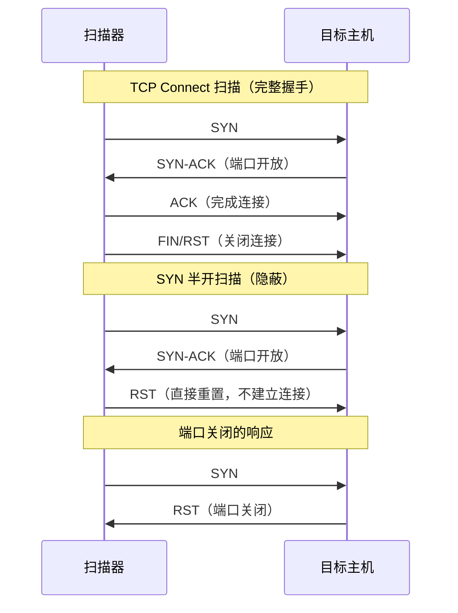

## 1. 网络编程核心技巧

网络编程是安全工具开发的基石。无论是端口扫描器、Web漏洞探测器、流量分析器还是自动化渗透框架，底层都依赖对网络协议的精确操控。本节从协议原理出发，逐步深入Socket编程、HTTP交互、DNS探测、异步高并发网络操作，最终构建可直接用于实战的安全工具集。

### 1.1 网络协议基础——理解你操控的底层

在编写任何网络工具之前，必须理解TCP/IP协议栈的分层模型。每一层对应不同的Python操控方式和安全应用场景：

| 层级 | 协议示例 | Python操控方式 | 安全应用 |
|------|---------|---------------|---------|
| 应用层 | HTTP, DNS, SMTP, FTP | `requests`, `dns.resolver`, `smtplib` | Web漏洞扫描、DNS枚举、邮件钓鱼 |
| 传输层 | TCP, UDP | `socket`, `asyncio` | 端口扫描、服务识别、流量劫持 |
| 网络层 | IP, ICMP | `scapy`, raw socket | SYN扫描、Traceroute、ARP欺骗 |
| 数据链路层 | Ethernet, ARP | `scapy`（需root） | ARP毒化、ARP扫描、数据包嗅探 |

**三次握手与安全工具的关系：**

理解TCP三次握手是编写端口扫描器的前提。TCP Connect扫描完成完整握手（SYN→SYN-ACK→ACK），而SYN扫描只发送SYN包根据响应判断端口状态，不完成握手因此更隐蔽。下图展示了这两种扫描方式在协议层面的区别：



### 1.2 Socket编程——一切网络工具的基础

Socket（套接字）是操作系统提供的网络通信接口。Python的`socket`模块封装了BSD Socket API，是所有网络工具的底层基础。

#### 1.2.1 Socket类型与选择

```python
import socket

# TCP Socket —— 可靠传输，用于端口扫描、服务交互
tcp_sock = socket.socket(socket.AF_INET, socket.SOCK_STREAM)

# UDP Socket —— 无连接，用于DNS查询、服务发现
udp_sock = socket.socket(socket.AF_INET, socket.SOCK_DGRAM)

# Raw Socket —— 直接操作IP层，需要root权限
raw_sock = socket.socket(socket.AF_INET, socket.SOCK_RAW, socket.IPPROTO_ICMP)
```

| Socket类型 | 可靠性 | 连接方式 | 典型用途 | 权限要求 |
|-----------|--------|---------|---------|---------|
| `SOCK_STREAM` (TCP) | 可靠，有序 | 面向连接 | 端口扫描、Web交互、SSH | 无特殊要求 |
| `SOCK_DGRAM` (UDP) | 不可靠，无序 | 无连接 | DNS查询、服务广播探测 | 无特殊要求 |
| `SOCK_RAW` (IP/ICMP) | 直接操控 | 无连接 | SYN扫描、Traceroute、Ping | 需要root |

#### 1.2.2 TCP端口扫描器

TCP Connect扫描是最基础的扫描方式，通过尝试建立完整TCP连接判断端口状态：

```python
import socket
import concurrent.futures
import time
from dataclasses import dataclass
from typing import List, Optional

@dataclass
class PortResult:
    """端口扫描结果"""
    port: int
    state: str          # open / closed / filtered
    service: Optional[str] = None
    banner: Optional[str] = None
    response_time: float = 0.0

# 常见端口与服务映射
COMMON_SERVICES = {
    21: 'ftp', 22: 'ssh', 23: 'telnet', 25: 'smtp',
    53: 'dns', 80: 'http', 110: 'pop3', 135: 'msrpc',
    139: 'netbios-ssn', 143: 'imap', 443: 'https',
    445: 'microsoft-ds', 993: 'imaps', 995: 'pop3s',
    1433: 'mssql', 1521: 'oracle', 3306: 'mysql',
    3389: 'rdp', 5432: 'postgresql', 5900: 'vnc',
    6379: 'redis', 8080: 'http-proxy', 8443: 'https-alt',
    9200: 'elasticsearch', 27017: 'mongodb',
}

def tcp_connect_scan(host: str, port: int, timeout: float = 1.0) -> PortResult:
    """
    TCP Connect 扫描：完成完整三次握手。
    优点：不需要root权限，结果可靠。
    缺点：会在目标日志中留下连接记录。
    """
    start = time.monotonic()
    try:
        sock = socket.socket(socket.AF_INET, socket.SOCK_STREAM)
        sock.settimeout(timeout)
        result = sock.connect_ex((host, port))
        elapsed = time.monotonic() - start

        if result == 0:
            # 端口开放，尝试抓取banner
            banner = grab_banner(sock, timeout=2)
            sock.close()
            return PortResult(
                port=port, state='open',
                service=COMMON_SERVICES.get(port),
                banner=banner, response_time=elapsed
            )
        else:
            sock.close()
            return PortResult(port=port, state='closed', response_time=elapsed)
    except socket.timeout:
        return PortResult(port=port, state='filtered', response_time=timeout)
    except OSError as e:
        return PortResult(port=port, state='closed', response_time=0)

def grab_banner(sock: socket.socket, timeout: float = 2.0) -> Optional[str]:
    """
    Banner抓取：连接建立后读取服务端发送的欢迎信息。
    许多服务（FTP、SSH、SMTP）会在连接时主动发送banner，
    暴露软件名称和版本号，这是服务指纹识别的重要信息源。
    """
    try:
        sock.settimeout(timeout)
        banner = sock.recv(1024)
        return banner.decode('utf-8', errors='replace').strip()
    except (socket.timeout, OSError):
        return None

def parallel_scan(host: str, ports: List[int], max_workers: int = 200,
                  timeout: float = 1.0) -> List[PortResult]:
    """
    并发端口扫描：使用线程池加速。
    max_workers 控制并发连接数——过大会被目标IDS检测或导致自身资源耗尽，
    过小则扫描速度慢。200是一个经验值，适合大多数局域网场景。
    """
    results = []
    with concurrent.futures.ThreadPoolExecutor(max_workers=max_workers) as executor:
        future_to_port = {
            executor.submit(tcp_connect_scan, host, port, timeout): port
            for port in ports
        }
        for future in concurrent.futures.as_completed(future_to_port):
            result = future.result()
            if result.state == 'open':
                results.append(result)
                print(f"  [+] {result.port}/tcp  {result.state}"
                      f"  {result.service or 'unknown'}"
                      f"{f'  ({result.banner})' if result.banner else ''}")
    return sorted(results, key=lambda r: r.port)

# 使用示例
if __name__ == '__main__':
    target = '192.168.1.1'
    port_range = list(range(1, 1025))  # 扫描前1024个端口

    print(f"[*] 扫描 {target} 的 {len(port_range)} 个端口...")
    start = time.monotonic()
    open_ports = parallel_scan(target, port_range, max_workers=200)
    elapsed = time.monotonic() - start

    print(f"\n[*] 扫描完成，耗时 {elapsed:.1f}s，发现 {len(open_ports)} 个开放端口")
```

#### 1.2.3 SYN半开扫描（需要root权限）

SYN扫描不完成三次握手，只发送SYN包后根据响应判断端口状态。由于不建立完整连接，目标应用层日志通常不会记录扫描行为：

```python
def syn_scan(host: str, port: int, timeout: float = 1.0) -> PortResult:
    """
    SYN半开扫描：需要root权限（使用raw packet构造能力）。
    
    响应判断逻辑：
    - SYN-ACK (flags=0x12)：端口开放，发送RST断开
    - RST (flags=0x04)：端口关闭
    - 无响应或ICMP不可达：端口被过滤（防火墙）
    """
    from scapy.all import IP, TCP, sr1, send, conf
    conf.verb = 0  # 关闭Scapy的详细输出

    # 构造SYN包
    pkt = IP(dst=host) / TCP(dport=port, flags='S')
    resp = sr1(pkt, timeout=timeout, verbose=0)

    if resp is None:
        return PortResult(port=port, state='filtered')

    if resp.haslayer(TCP):
        tcp_flags = resp[TCP].flags
        if tcp_flags == 0x12:   # SYN-ACK：端口开放
            # 发送RST重置连接，避免留下完整连接日志
            rst = IP(dst=host) / TCP(
                dport=port, flags='R',
                seq=resp[TCP].ack
            )
            send(rst, verbose=0)
            return PortResult(port=port, state='open',
                              service=COMMON_SERVICES.get(port))
        elif tcp_flags == 0x14:  # RST-ACK：端口关闭
            return PortResult(port=port, state='closed')

    # ICMP不可达通常意味着端口被防火墙过滤
    if resp.haslayer('ICMP'):
        return PortResult(port=port, state='filtered')

    return PortResult(port=port, state='filtered')
```

**扫描方式对比：**

| 特性 | TCP Connect | SYN半开扫描 | FIN扫描 |
|------|------------|------------|---------|
| 权限要求 | 无 | root | root |
| 隐蔽性 | 低（完整连接日志） | 中（无应用层日志） | 高（绕过简单防火墙） |
| 速度 | 中 | 快 | 快 |
| 准确性 | 高 | 高 | 中（部分系统不响应） |
| 被IDS检测概率 | 高 | 中 | 低 |
| 适用场景 | 内网扫描、授权测试 | 外网渗透测试 | 绕过状态检测防火墙 |

### 1.3 异步网络编程——高并发扫描的正确姿势

多线程扫描在端口数量大时（如全端口65535个）效率有限——每个线程占用约8MB栈空间，200个线程就是1.6GB内存。`asyncio`使用事件循环和协程，在单线程内管理数万个并发连接，内存开销极低：

```python
import asyncio
import time
from typing import List, Tuple

async def async_tcp_scan(host: str, port: int, timeout: float = 1.0) -> Tuple[int, str]:
    """
    异步TCP扫描：单线程内并发数千个连接。
    比多线程方案内存占用低10-100倍。
    """
    try:
        # asyncio.open_connection 内部使用非阻塞socket + 事件循环
        reader, writer = await asyncio.wait_for(
            asyncio.open_connection(host, port),
            timeout=timeout
        )
        # 连接成功，端口开放
        writer.close()
        await writer.wait_closed()
        return (port, 'open')
    except asyncio.TimeoutError:
        return (port, 'filtered')
    except (ConnectionRefusedError, OSError):
        return (port, 'closed')

async def async_banner_grab(host: str, port: int, timeout: float = 3.0) -> Tuple[int, str]:
    """异步Banner抓取"""
    try:
        reader, writer = await asyncio.wait_for(
            asyncio.open_connection(host, port),
            timeout=timeout
        )
        # 发送空字节触发某些服务的banner响应
        # 对HTTP服务发送请求获取Server头
        if port in (80, 8080, 8000, 8888):
            writer.write(b'HEAD / HTTP/1.1\r\nHost: ' +
                         host.encode() + b'\r\n\r\n')
            await writer.drain()

        data = await asyncio.wait_for(reader.read(1024), timeout=timeout)
        writer.close()
        await writer.wait_closed()
        banner = data.decode('utf-8', errors='replace').strip()
        return (port, banner[:200])  # 截断过长的banner
    except Exception:
        return (port, '')

async def async_parallel_scan(host: str, ports: List[int],
                               concurrency: int = 5000,
                               timeout: float = 1.0) -> List[Tuple[int, str]]:
    """
    异步并发扫描控制器。
    
    concurrency=5000 意味着同时发起5000个连接尝试。
    实际能跑多少取决于系统ulimit和目标网络状况。
    建议先用小值测试，再逐步增大。
    
    操作系统限制调整：
    - ulimit -n 65535  （提高文件描述符上限）
    - sysctl net.ipv4.tcp_tw_reuse=1  （复用TIME_WAIT连接）
    """
    semaphore = asyncio.Semaphore(concurrency)
    results = []

    async def scan_with_limit(port: int):
        async with semaphore:
            return await async_tcp_scan(host, port, timeout)

    tasks = [scan_with_limit(port) for port in ports]
    # return_when=ALL_COMPLETED 等所有任务完成
    # 对于超大端口范围，可以用 as_completed 逐个处理
    completed = await asyncio.gather(*tasks, return_exceptions=True)

    for result in completed:
        if isinstance(result, tuple) and result[1] == 'open':
            results.append(result)
    return sorted(results, key=lambda x: x[0])

# 运行异步扫描
async def main():
    target = '192.168.1.1'
    ports = list(range(1, 10001))  # 扫描前10000个端口

    print(f"[*] 异步扫描 {target}，共 {len(ports)} 个端口，并发数 5000")
    start = time.monotonic()
    open_ports = await async_parallel_scan(target, ports, concurrency=5000)
    elapsed = time.monotonic() - start

    print(f"\n[*] 耗时 {elapsed:.1f}s，发现 {len(open_ports)} 个开放端口")
    for port, state in open_ports:
        print(f"  {port}/tcp  {state}")

# asyncio.run(main())
```

**多线程 vs 异步扫描性能对比：**

| 维度 | 多线程（ThreadPoolExecutor） | 异步（asyncio） |
|------|---------------------------|----------------|
| 并发模型 | 每连接一个OS线程 | 事件循环 + 协程 |
| 10000并发内存 | ~80GB（8MB/线程） | ~50MB（协程极轻量） |
| 切换开销 | OS级上下文切换（~1μs） | 用户态切换（~0.1μs） |
| 编程复杂度 | 简单直观 | 需要async/await思维 |
| 调试难度 | 高（竞态条件） | 中（异常栈不直观） |
| 推荐场景 | <500并发 | 500+并发 |

### 1.4 HTTP请求——Web安全的核心

Web安全工具的80%工作是构造和分析HTTP请求。`requests`库是最常用的HTTP客户端，但渗透测试场景需要更多控制能力——自定义Header、代理链、SSL绕过、Session管理等。

#### 1.4.1 构建渗透测试专用Session

```python
import requests
from requests.adapters import HTTPAdapter
from urllib3.util.retry import Retry
import random
import ssl
import urllib3

# 禁用SSL警告（渗透测试中经常遇到自签名证书）
urllib3.disable_warnings(urllib3.exceptions.InsecureRequestWarning)

# User-Agent池——轮换UA降低被WAF识别为扫描器的概率
USER_AGENTS = [
    'Mozilla/5.0 (Windows NT 10.0; Win64; x64) AppleWebKit/537.36 (KHTML, like Gecko) Chrome/120.0.0.0 Safari/537.36',
    'Mozilla/5.0 (Macintosh; Intel Mac OS X 10_15_7) AppleWebKit/605.1.15 (KHTML, like Gecko) Version/17.0 Safari/605.1.15',
    'Mozilla/5.0 (X11; Linux x86_64; rv:121.0) Gecko/20100101 Firefox/121.0',
    'Mozilla/5.0 (Windows NT 10.0; Win64; x64) AppleWebKit/537.36 (KHTML, like Gecko) Chrome/120.0.0.0 Safari/537.36 Edg/120.0.0.0',
    'Mozilla/5.0 (iPhone; CPU iPhone OS 17_0 like Mac OS X) AppleWebKit/605.1.15 (KHTML, like Gecko) Version/17.0 Mobile/15E148 Safari/604.1',
]

def create_pentest_session(proxy: str = None, verify_ssl: bool = False,
                           timeout: int = 10) -> requests.Session:
    """
    创建渗透测试专用HTTP Session。
    
    配置要点：
    1. 重试策略：遇到5xx自动重试3次，指数退避
    2. 代理支持：兼容HTTP/SOCKS5代理，支持Burp Suite拦截
    3. SSL处理：默认关闭证书验证（目标常有自签名证书）
    4. UA轮换：每次请求随机选择User-Agent
    5. 连接池：复用TCP连接，减少握手开销
    """
    session = requests.Session()

    # 重试策略：5xx错误自动重试，指数退避（0.5s, 1s, 2s）
    retry_strategy = Retry(
        total=3,
        backoff_factor=0.5,
        status_forcelist=[500, 502, 503, 504],
        allowed_methods=['GET', 'POST', 'HEAD', 'OPTIONS'],
    )
    adapter = HTTPAdapter(
        max_retries=retry_strategy,
        pool_connections=20,   # 连接池大小
        pool_maxsize=50,       # 最大连接数
    )
    session.mount('http://', adapter)
    session.mount('https://', adapter)

    # 代理配置
    if proxy:
        session.proxies = {
            'http': proxy,
            'https': proxy,
        }
        # 常见代理格式：
        # HTTP:   http://127.0.0.1:8080  （Burp Suite默认）
        # SOCKS5: socks5://127.0.0.1:1080

    # SSL配置
    session.verify = verify_ssl
    if not verify_ssl:
        # 额外设置：允许不安全的重协商
        urllib3.util.ssl_.DEFAULT_CIPHERS += ':HIGH:!DH:!aNULL'

    # 随机UA
    session.headers.update({
        'User-Agent': random.choice(USER_AGENTS),
        'Accept': 'text/html,application/xhtml+xml,application/xml;q=0.9,*/*;q=0.8',
        'Accept-Language': 'zh-CN,zh;q=0.9,en;q=0.8',
        'Accept-Encoding': 'gzip, deflate',
        'Connection': 'keep-alive',
    })

    # 设置默认超时（通过钩子实现，因为requests本身没有全局timeout）
    session.request = _wrap_with_timeout(session.request, timeout)

    return session

def _wrap_with_timeout(request_func, timeout):
    """为session.request添加默认超时"""
    import functools
    @functools.wraps(request_func)
    def wrapper(*args, **kwargs):
        if 'timeout' not in kwargs:
            kwargs['timeout'] = timeout
        return request_func(*args, **kwargs)
    return wrapper
```

#### 1.4.2 Web目录枚举

目录枚举是信息收集的核心步骤，通过字典爆破发现隐藏的管理后台、备份文件、配置文件等：

```python
import requests
from concurrent.futures import ThreadPoolExecutor, as_completed
from typing import List, Dict

def directory_enum(base_url: str, wordlist: List[str],
                   session: requests.Session = None,
                   threads: int = 30,
                   extensions: List[str] = None,
                   exclude_status: List[int] = None) -> List[Dict]:
    """
    Web目录与文件枚举。
    
    参数说明：
    - base_url: 目标URL，如 http://example.com
    - wordlist: 路径字典列表
    - extensions: 文件扩展名列表，如 ['', '.php', '.html', '.bak']
      空字符串表示不加扩展名。每个词会与每个扩展名组合。
    - exclude_status: 排除的HTTP状态码，默认排除404
    """
    if session is None:
        session = create_pentest_session()
    if extensions is None:
        extensions = ['']  # 只测原路径
    if exclude_status is None:
        exclude_status = [404]

    base_url = base_url.rstrip('/')
    found = []
    # 用于去重：(url, status_code) 相同的结果只记录一次
    seen = set()

    def check_path(word: str, ext: str) -> Dict:
        url = f"{base_url}/{word.strip()}{ext}"
        try:
            resp = session.get(url, timeout=5, allow_redirects=False)
            return {
                'url': url,
                'status': resp.status_code,
                'size': len(resp.content),
                'redirect': resp.headers.get('Location', ''),
                'server': resp.headers.get('Server', ''),
            }
        except requests.RequestException:
            return None

    # 生成所有组合
    tasks = [(word, ext) for word in wordlist for ext in extensions]

    with ThreadPoolExecutor(max_workers=threads) as executor:
        futures = {executor.submit(check_path, w, e): (w, e) for w, e in tasks}
        for future in as_completed(futures):
            result = future.result()
            if result is None:
                continue
            status = result['status']
            if status in exclude_status:
                continue
            key = (result['url'], status)
            if key in seen:
                continue
            seen.add(key)
            found.append(result)
            # 实时输出发现结果
            tag = _status_tag(status)
            print(f"  {tag} {status}  {result['url']}"
                  f"  [Size: {result['size']}]"
                  f"{f'  -> {result[\"redirect\"]}' if result['redirect'] else ''}")

    return sorted(found, key=lambda x: x['url'])

def _status_tag(status: int) -> str:
    """状态码标记：便于视觉区分"""
    if status == 200:   return '[✓]'
    if status == 301:   return '[→]'
    if status == 302:   return '[→]'
    if status == 403:   return '[✗]'
    if status == 500:   return '[!]'
    return '[?]'

# 使用示例
# session = create_pentest_session(proxy='http://127.0.0.1:8080')
# results = directory_enum(
#     'http://target.com',
#     wordlist=open('/usr/share/wordlists/dirb/common.txt').readlines(),
#     session=session,
#     extensions=['', '.php', '.html', '.bak', '.old', '.txt'],
#     exclude_status=[404, 403],
# )
```

#### 1.4.3 HTTP请求走私检测

HTTP请求走私（Request Smuggling）是一种利用前后端服务器对HTTP请求边界解析差异的攻击技术：

```python
def detect_cl_te(host: str, port: int = 80, path: str = '/',
                 use_ssl: bool = False) -> dict:
    """
    检测 CL-TE（Content-Length vs Transfer-Encoding）请求走私。
    
    原理：
    前端代理使用Content-Length确定请求边界，
    后端服务器使用Transfer-Encoding: chunked。
    通过构造冲突的请求体，可以让后端将第二个请求的一部分
    误解为新的请求。
    """
    import socket
    import ssl as ssl_module

    # 构造恶意请求：CL和TE声明不同的边界
    malicious_body = (
        b"0\r\n"           # chunked传输的结束标记
        b"\r\n"
        b"GET /admin HTTP/1.1\r\n"  # 走私的第二个请求
        b"Host: " + host.encode() + b"\r\n"
        b"\r\n"
    )

    request = (
        f"POST {path} HTTP/1.1\r\n"
        f"Host: {host}\r\n"
        f"Content-Length: {len(malicious_body) + 3}\r\n"  # CL比实际大3字节
        f"Transfer-Encoding: chunked\r\n"
        f"Connection: keep-alive\r\n"
        f"\r\n"
    ).encode() + malicious_body

    sock = socket.socket(socket.AF_INET, socket.SOCK_STREAM)
    sock.settimeout(5)

    if use_ssl:
        ctx = ssl_module.create_default_context()
        ctx.check_hostname = False
        ctx.verify_mode = ssl_module.CERT_NONE
        sock = ctx.wrap_socket(sock, server_hostname=host)

    try:
        sock.connect((host, port))
        sock.send(request)
        response = sock.recv(4096).decode('utf-8', errors='replace')
        return {
            'vulnerable': '200' in response and 'admin' in response.lower(),
            'response': response[:500],
            'technique': 'CL-TE',
        }
    except Exception as e:
        return {'vulnerable': False, 'error': str(e), 'technique': 'CL-TE'}
    finally:
        sock.close()
```

### 1.5 DNS解析与枚举——信息收集第一步

DNS是信息收集的金矿。通过DNS查询可以获取目标的IP地址、邮件服务器、子域名、文本记录（常含SPF/DKIM配置、第三方服务信息）等。

#### 1.5.1 基础DNS枚举

```python
import socket
import dns.resolver
import dns.rdatatype
from typing import Dict, List
from concurrent.futures import ThreadPoolExecutor

# 配置DNS解析器（可以指定使用特定DNS服务器）
def create_resolver(nameservers: List[str] = None, timeout: float = 3.0) -> dns.resolver.Resolver:
    """创建自定义DNS解析器"""
    resolver = dns.resolver.Resolver()
    if nameservers:
        resolver.nameservers = nameservers
    resolver.timeout = timeout
    resolver.lifetime = timeout * 2  # 总超时（含重试）
    return resolver

def dns_full_enum(domain: str, resolver: dns.resolver.Resolver = None) -> Dict[str, List[str]]:
    """
    完整DNS枚举：查询所有常见记录类型。
    
    返回结果解读：
    - A/AAAA：目标IP地址（IPv4/IPv6）
    - MX：邮件服务器（可判断目标使用的邮件服务）
    - NS：域名服务器（可判断DNS托管商）
    - TXT：文本记录（SPF、DKIM、域名验证、第三方服务配置）
    - SOA：起始授权（主DNS服务器、管理员邮箱、序列号）
    - CNAME：别名记录（可发现CDN、第三方服务）
    - SRV：服务记录（可发现内部服务如LDAP、SIP）
    """
    if resolver is None:
        resolver = create_resolver()

    record_types = ['A', 'AAAA', 'MX', 'NS', 'TXT', 'SOA', 'CNAME', 'SRV']
    results = {}

    for rtype in record_types:
        try:
            answers = resolver.resolve(domain, rtype)
            records = []
            for rdata in answers:
                records.append(str(rdata))
            if records:
                results[rtype] = records
        except dns.resolver.NoAnswer:
            pass  # 该类型无记录，正常
        except dns.resolver.NXDOMAIN:
            print(f"  [!] 域名 {domain} 不存在（NXDOMAIN）")
            break
        except dns.resolver.NoNameservers:
            print(f"  [!] 查询 {rtype} 时无可用名称服务器")
        except dns.exception.Timeout:
            print(f"  [!] 查询 {rtype} 超时")
        except Exception as e:
            print(f"  [!] 查询 {rtype} 失败: {e}")

    return results

# 使用示例
# results = dns_full_enum('example.com', create_resolver(['8.8.8.8', '1.1.1.1']))
# for rtype, records in results.items():
#     print(f"\n{rtype} 记录:")
#     for r in records:
#         print(f"  {r}")
```

#### 1.5.2 子域名爆破

子域名爆破是攻击面扩展的关键步骤。很多组织的主站防护严密，但子域名（如`dev.example.com`、`staging.example.com`）往往配置薄弱：

```python
def subdomain_bruteforce(domain: str, wordlist: List[str],
                          resolver: dns.resolver.Resolver = None,
                          threads: int = 50) -> List[Dict]:
    """
    子域名暴力枚举。
    
    提高效率的技巧：
    1. 先检查通配符DNS——如果存在通配符记录，所有不存在的子域名都会解析
    2. 使用多线程加速（DNS查询是I/O密集型）
    3. 使用公共DNS（8.8.8.8/1.1.1.1）避免被本地DNS缓存影响
    """
    if resolver is None:
        resolver = create_resolver(['8.8.8.8', '1.1.1.1', '223.5.5.5'])

    # 检查通配符DNS
    wildcard_ip = _check_wildcard(domain, resolver)
    if wildcard_ip:
        print(f"  [!] 检测到通配符DNS，所有子域名均解析到 {wildcard_ip}")
        print(f"  [!] 将过滤通配符IP结果")

    found = []

    def check_subdomain(word: str) -> Dict:
        subdomain = f"{word.strip()}.{domain}"
        try:
            answers = resolver.resolve(subdomain, 'A')
            ips = [str(r) for r in answers]
            # 过滤通配符IP
            if wildcard_ip and wildcard_ip in ips:
                return None
            return {'subdomain': subdomain, 'ips': ips}
        except (dns.resolver.NXDOMAIN, dns.resolver.NoAnswer,
                dns.exception.Timeout):
            return None

    with ThreadPoolExecutor(max_workers=threads) as executor:
        futures = {executor.submit(check_subdomain, w): w for w in wordlist}
        for future in futures:
            result = future.result()
            if result:
                found.append(result)
                print(f"  [+] {result['subdomain']} -> {', '.join(result['ips'])}")

    return found

def _check_wildcard(domain: str, resolver: dns.resolver.Resolver) -> str:
    """检测通配符DNS：查询一个随机子域名，如果能解析则存在通配符"""
    import uuid
    random_sub = f"{uuid.uuid4().hex[:16]}.{domain}"
    try:
        answers = resolver.resolve(random_sub, 'A')
        return str(answers[0])  # 返回通配符解析到的IP
    except Exception:
        return None  # 无通配符
```

#### 1.5.3 DNS区域传送尝试

DNS区域传送（Zone Transfer）如果配置不当，会泄露整个域名的所有记录——这是信息收集的终极目标：

```python
def try_zone_transfer(domain: str) -> Dict:
    """
    尝试DNS区域传送。
    
    区域传送（AXFR）是DNS主从服务器同步数据的机制。
    如果从服务器未限制允许传送的IP，任何人可以获取完整的域名记录。
    这是最严重的DNS配置错误之一。
    """
    import dns.zone
    import dns.query

    # 先获取NS记录
    ns_records = []
    try:
        answers = dns.resolver.resolve(domain, 'NS')
        ns_records = [str(rdata).rstrip('.') for rdata in answers]
    except Exception as e:
        return {'success': False, 'error': f'获取NS记录失败: {e}'}

    results = {'nameservers': ns_records, 'zones': {}}

    for ns in ns_records:
        try:
            # 获取NS服务器的IP
            ns_ip = socket.gethostbyname(ns)
            # 尝试区域传送
            zone = dns.zone.from_xfr(dns.query.xfr(ns_ip, domain, timeout=10))

            records = []
            for name, node in zone.nodes.items():
                for rdataset in node.rdatasets:
                    for rdata in rdataset:
                        records.append(f"{name}.{domain}  {rdataset.ttl}  "
                                      f"{dns.rdatatype.to_text(rdataset.rdtype)}  {rdata}")

            results['zones'][ns] = records
            results['success'] = True
            print(f"  [!] 区域传送成功！{ns} ({ns_ip}) 泄露了 {len(records)} 条记录")
            for r in records[:20]:  # 只显示前20条
                print(f"      {r}")
            if len(records) > 20:
                print(f"      ... 还有 {len(records) - 20} 条记录")

        except Exception as e:
            print(f"  [+] {ns}: 区域传送被拒绝 ({e})")

    if not results['zones']:
        results['success'] = False

    return results
```

### 1.6 原始套接字与数据包构造

原始套接字（Raw Socket）允许你直接构造网络层数据包，实现操作系统网络栈不提供的底层操作。这是SYN扫描、Traceroute、自定义协议探测的基础。

#### 1.6.1 手工构造IP/TCP包

```python
import socket
import struct

def build_ip_header(src_ip: str, dst_ip: str, ttl: int = 64) -> bytes:
    """
    手工构造IP头部。
    
    IP头部结构（20字节，无选项）：
    +--------+--------+----------------+
    | 版本(4)| 头长(4)|    TOS(8)      |
    +--------+--------+----------------+
    |       总长度(16)                  |
    +------------------+----------------+
    |       标识(16)    | 标志+片偏移(16)|
    +--------+--------+----------------+
    | TTL(8) | 协议(8)|   校验和(16)   |
    +--------+--------+----------------+
    |          源IP(32)                 |
    +-----------------------------------+
    |          目的IP(32)               |
    +-----------------------------------+
    """
    version_ihl = (4 << 4) + 5       # IPv4, 头长20字节（5个32位字）
    tos = 0                           # 服务类型
    total_length = 40                 # IP头20 + TCP头20
    identification = 54321            # 标识
    flags_offset = 0                  # 不分片
    protocol = socket.IPPROTO_TCP     # TCP协议
    checksum = 0                      # 先填0，后面计算
    src = socket.inet_aton(src_ip)
    dst = socket.inet_aton(dst_ip)

    header = struct.pack('!BBHHHBBH4s4s',
                         version_ihl, tos, total_length,
                         identification, flags_offset,
                         ttl, protocol, checksum, src, dst)

    # 计算IP校验和
    checksum = _ip_checksum(header)
    header = struct.pack('!BBHHHBBH4s4s',
                         version_ihl, tos, total_length,
                         identification, flags_offset,
                         ttl, protocol, checksum, src, dst)
    return header

def _ip_checksum(data: bytes) -> int:
    """IP校验和计算：对数据每16位求和，取反码"""
    if len(data) % 2:
        data += b'\x00'
    s = sum(struct.unpack('!%dH' % (len(data) // 2), data))
    while s >> 16:
        s = (s & 0xFFFF) + (s >> 16)
    return ~s & 0xFFFF
```

#### 1.6.2 ICMP Ping实现

```python
def raw_ping(target: str, count: int = 4, timeout: float = 2.0) -> dict:
    """
    使用原始套接字实现ICMP Ping。
    需要root权限。
    
    比系统ping的优势：
    - 可以自定义包大小、TTL、TOS等参数
    - 可以精确测量往返时间
    - 可以集成到自动化工具中
    """
    import time

    results = {'target': target, 'sent': 0, 'received': 0, 'times': []}

    try:
        sock = socket.socket(socket.AF_INET, socket.SOCK_RAW, socket.IPPROTO_ICMP)
        sock.settimeout(timeout)
    except PermissionError:
        return {'error': '需要root权限'}

    for i in range(count):
        # 构造ICMP Echo Request
        icmp_type = 8   # Echo Request
        icmp_code = 0
        icmp_checksum = 0
        icmp_id = 12345
        icmp_seq = i + 1

        # ICMP头部（8字节）+ 数据（时间戳）
        header = struct.pack('!BBHHH', icmp_type, icmp_code,
                            icmp_checksum, icmp_id, icmp_seq)
        data = struct.pack('!d', time.time())  # 用发送时间作为数据

        # 计算校验和
        icmp_checksum = _ip_checksum(header + data)
        header = struct.pack('!BBHHH', icmp_type, icmp_code,
                            icmp_checksum, icmp_id, icmp_seq)

        packet = header + data
        results['sent'] += 1

        try:
            sock.sendto(packet, (target, 0))
            send_time = time.time()

            response, addr = sock.recvfrom(1024)
            recv_time = time.time()

            # 解析响应（跳过IP头部20字节）
            icmp_response = response[20:]
            resp_type, resp_code = struct.unpack('!BB', icmp_response[:2])

            if resp_type == 0 and resp_code == 0:  # Echo Reply
                rtt = (recv_time - send_time) * 1000  # 毫秒
                results['received'] += 1
                results['times'].append(rtt)
                print(f"  来自 {addr[0]} 的回复: 字节={len(data)} "
                      f"时间={rtt:.1f}ms TTL={response[8]}")
            elif resp_type == 3:  # Destination Unreachable
                codes = {0: '网络不可达', 1: '主机不可达', 3: '端口不可达',
                         13: '通信被过滤'}
                print(f"  目标不可达: {codes.get(resp_code, f'代码{resp_code}')}")

        except socket.timeout:
            print(f"  请求超时")

        time.sleep(0.5)  # 间隔500ms

    sock.close()

    if results['times']:
        results['min_rtt'] = min(results['times'])
        results['avg_rtt'] = sum(results['times']) / len(results['times'])
        results['max_rtt'] = max(results['times'])
        results['loss_rate'] = 1 - results['received'] / results['sent']

    return results
```

### 1.7 服务指纹识别

端口扫描只告诉你"端口开放"，但你需要知道端口上跑的是什么服务、什么版本，才能找到对应的漏洞。服务指纹识别通过分析Banner、协议特征和响应行为来判断：

```python
import socket
import re
from typing import Dict, Optional

# 服务指纹数据库（精简版，实际工具如nmap有数千条规则）
SERVICE_SIGNATURES = {
    'ssh': {
        'pattern': r'^SSH-([\d.]+)-(.+)',
        'default_port': 22,
        'description': 'SSH远程登录',
    },
    'ftp': {
        'pattern': r'^220[\s-](.+)',
        'default_port': 21,
        'description': 'FTP文件传输',
    },
    'smtp': {
        'pattern': r'^220[\s-](.+)',
        'default_port': 25,
        'description': 'SMTP邮件服务',
    },
    'http': {
        'pattern': r'^HTTP/[\d.]+\s+(\d+)',
        'default_port': 80,
        'description': 'HTTP Web服务',
    },
    'mysql': {
        'pattern': None,  # MySQL用二进制协议，需要特殊解析
        'default_port': 3306,
        'description': 'MySQL数据库',
    },
}

def service_fingerprint(host: str, port: int, timeout: float = 3.0) -> Dict:
    """
    单端口服务指纹识别。
    
    识别方法（按优先级）：
    1. 被动Banner抓取：连接后等待服务端主动发送banner
    2. 主动探测：发送特定协议请求分析响应
    3. 端口推测：根据端口号猜测常见服务（最不可靠）
    """
    result = {
        'host': host, 'port': port,
        'service': 'unknown', 'version': 'unknown', 'banner': '',
    }

    try:
        sock = socket.socket(socket.AF_INET, socket.SOCK_STREAM)
        sock.settimeout(timeout)
        sock.connect((host, port))

        # 方法1：被动banner抓取
        try:
            banner = sock.recv(4096).decode('utf-8', errors='replace').strip()
            result['banner'] = banner[:500]
        except socket.timeout:
            banner = ''

        # 方法2：如果被动抓取没拿到，尝试主动探测
        if not banner:
            banner = _active_probe(sock, port)
            result['banner'] = banner[:500] if banner else ''

        # 匹配指纹
        if banner:
            for service_name, sig in SERVICE_SIGNATURES.items():
                if sig['pattern']:
                    match = re.search(sig['pattern'], banner, re.IGNORECASE)
                    if match:
                        result['service'] = service_name
                        result['version'] = match.group(0)[:200]
                        break

        # 方法3：端口推测（兜底）
        if result['service'] == 'unknown':
            result['service'] = COMMON_SERVICES.get(port, 'unknown')
            result['version'] = '(端口推测，未经验证)'

        sock.close()

    except (socket.timeout, ConnectionRefusedError, OSError) as e:
        result['service'] = 'unreachable'
        result['error'] = str(e)

    return result

def _active_probe(sock: socket.socket, port: int) -> str:
    """主动探测：发送协议特定请求触发响应"""
    probes = {
        80:   b'HEAD / HTTP/1.1\r\nHost: localhost\r\n\r\n',
        443:  b'HEAD / HTTP/1.1\r\nHost: localhost\r\n\r\n',
        8080: b'HEAD / HTTP/1.1\r\nHost: localhost\r\n\r\n',
        25:   b'EHLO test\r\n',
        110:  b'QUIT\r\n',
        143:  b'A001 CAPABILITY\r\n',
        21:   b'HELP\r\n',
    }

    probe = probes.get(port)
    if probe:
        try:
            sock.send(probe)
            response = sock.recv(4096).decode('utf-8', errors='replace').strip()
            return response
        except Exception:
            pass
    return ''
```

### 1.8 网络编程常见陷阱与最佳实践

#### 1.8.1 资源泄漏问题

```python
# 错误示例：异常时socket不会被关闭
def bad_scan(host, port):
    sock = socket.socket(socket.AF_INET, socket.SOCK_STREAM)
    sock.connect((host, port))  # 如果这里异常，sock不会关闭
    data = sock.recv(1024)
    sock.close()
    return data

# 正确做法1：使用with语句（Python 3.6+ socket支持context manager）
def good_scan(host, port):
    with socket.socket(socket.AF_INET, socket.SOCK_STREAM) as sock:
        sock.settimeout(3)
        sock.connect((host, port))
        return sock.recv(1024)

# 正确做法2：try/finally确保清理
def also_good_scan(host, port):
    sock = socket.socket(socket.AF_INET, socket.SOCK_STREAM)
    try:
        sock.settimeout(3)
        sock.connect((host, port))
        return sock.recv(1024)
    finally:
        sock.close()
```

#### 1.8.2 超时设置

网络操作必须设置超时——没有超时的socket操作可能永久阻塞，导致程序挂起：

```python
# 常见错误：不设置超时，程序可能永久卡住
sock = socket.socket()
sock.connect(('unreachable.host', 80))  # 可能永远不返回

# 正确做法：连接超时 + 读超时分别设置
sock = socket.socket()
sock.settimeout(5)            # 所有操作的默认超时
sock.setblocking(False)       # 非阻塞模式（需配合select/poll）
sock.connect_ex(('host', 80)) # connect_ex不会抛异常，返回错误码

# requests库的超时设置
requests.get('http://example.com', timeout=(3.05, 10))
# timeout=(连接超时, 读取超时)：3.05秒内建立连接，10秒内读完响应
```

#### 1.8.3 编码与解码陷阱

网络数据是字节流，不是字符串。错误的编码处理是网络工具最常见的bug来源：

```python
# 错误：假设所有数据都是UTF-8
data = sock.recv(4096)
text = data.decode('utf-8')  # 遇到二进制数据就崩溃

# 正确：使用errors参数处理非法字节
text = data.decode('utf-8', errors='replace')   # 替换为
text = data.decode('utf-8', errors='ignore')    # 跳过
text = data.decode('latin-1')                   # 永远不会失败（1:1映射）

# 正确：HTTP响应应根据Content-Type选择编码
import chardet
detected = chardet.detect(data)
text = data.decode(detected['encoding'] or 'utf-8', errors='replace')
```

#### 1.8.4 并发控制

不加控制地创建大量线程/协程会导致资源耗尽：

```python
import asyncio

# 错误：无限制并发——可能同时打开几万个连接
async def bad_parallel(tasks):
    await asyncio.gather(*[scan(port) for port in range(1, 65536)])

# 正确：使用信号量限制并发数
async def good_parallel(tasks, max_concurrent=1000):
    semaphore = asyncio.Semaphore(max_concurrent)
    async def limited(task):
        async with semaphore:
            return await task
    await asyncio.gather(*[limited(t) for t in tasks])

# 正确：线程池方案
from concurrent.futures import ThreadPoolExecutor
with ThreadPoolExecutor(max_workers=200) as pool:
    results = list(pool.map(tcp_scan, ports))
```

### 1.9 综合实战：自动化信息收集框架

将前面的所有组件整合为一个完整的自动化信息收集工具：

```python
import asyncio
import json
import time
from pathlib import Path
from typing import Dict, List
from dataclasses import dataclass, asdict, field

@dataclass
class ReconResult:
    """信息收集结果"""
    target: str
    scan_time: str = ''
    dns_records: Dict = field(default_factory=dict)
    subdomains: List[Dict] = field(default_factory=list)
    open_ports: List[Dict] = field(default_factory=list)
    services: List[Dict] = field(default_factory=list)
    web_dirs: List[Dict] = field(default_factory=list)
    zone_transfer: Dict = field(default_factory=dict)

async def full_recon(target: str, output_file: str = None) -> ReconResult:
    """
    完整信息收集流程：
    1. DNS枚举（获取基础信息）
    2. 子域名爆破（扩展攻击面）
    3. 端口扫描（发现服务）
    4. 服务指纹识别（确定版本）
    5. Web目录枚举（发现隐藏路径）
    """
    result = ReconResult(target=target, scan_time=time.strftime('%Y-%m-%d %H:%M:%S'))
    resolver = create_resolver(['8.8.8.8', '1.1.1.1'])

    # 阶段1：DNS枚举
    print(f"\n{'='*60}")
    print(f"[*] 阶段1：DNS枚举 - {target}")
    print(f"{'='*60}")
    result.dns_records = dns_full_enum(target, resolver)

    # 阶段2：区域传送尝试
    print(f"\n[*] 阶段2：DNS区域传送尝试")
    result.zone_transfer = try_zone_transfer(target)

    # 阶段3：子域名爆破（使用精简字典演示）
    print(f"\n[*] 阶段3：子域名爆破")
    common_subs = ['www', 'mail', 'ftp', 'admin', 'test', 'dev', 'staging',
                   'api', 'app', 'blog', 'shop', 'cdn', 'vpn', 'portal',
                   'git', 'jenkins', 'jira', 'confluence', 'grafana']
    result.subdomains = subdomain_bruteforce(target, common_subs, resolver)

    # 阶段4：端口扫描（对发现的IP进行）
    ips = set()
    if 'A' in result.dns_records:
        ips.update(result.dns_records['A'])
    for sub in result.subdomains:
        ips.update(sub.get('ips', []))

    if ips:
        print(f"\n[*] 阶段4：端口扫描（目标IP: {', '.join(ips)}）")
        ports = [21, 22, 23, 25, 53, 80, 110, 135, 139, 143, 443, 445,
                 993, 995, 1433, 1521, 3306, 3389, 5432, 5900, 6379,
                 8080, 8443, 9200, 27017]
        for ip in list(ips)[:3]:  # 限制扫描IP数量
            print(f"\n  扫描 {ip}...")
            open_ports = await async_parallel_scan(ip, ports, concurrency=500)
            for port, state in open_ports:
                result.open_ports.append({'ip': ip, 'port': port, 'state': state})

    # 输出结果
    if output_file:
        with open(output_file, 'w', encoding='utf-8') as f:
            json.dump(asdict(result), f, ensure_ascii=False, indent=2)
        print(f"\n[*] 结果已保存到 {output_file}")

    return result

# 运行示例：
# result = asyncio.run(full_recon('example.com', 'recon_result.json'))
```

### 1.10 本节要点回顾

本节从协议原理到实战工具，系统覆盖了Python网络安全编程的核心技术栈：

- **Socket编程**：TCP/UDP/Raw Socket三种类型，Connect扫描、SYN扫描、Banner抓取的完整实现
- **异步高并发**：asyncio方案解决多线程在大规模扫描时的内存瓶颈，单线程管理数万并发连接
- **HTTP交互**：渗透测试专用Session构建、目录枚举、请求走私检测
- **DNS信息收集**：全类型记录枚举、子域名爆破（含通配符检测）、区域传送尝试
- **原始套接字**：手工构造IP/ICMP包，实现自定义Ping和底层协议操控
- **服务指纹**：被动Banner + 主动探测 + 端口推测三重识别策略
- **工程规范**：资源泄漏防护、超时设置、编码处理、并发控制等生产级实践

下一步学习建议：掌握Scapy库的高级用法（ARP欺骗、流量嗅探、协议分析），以及如何将上述工具封装为可复用的安全测试框架。
