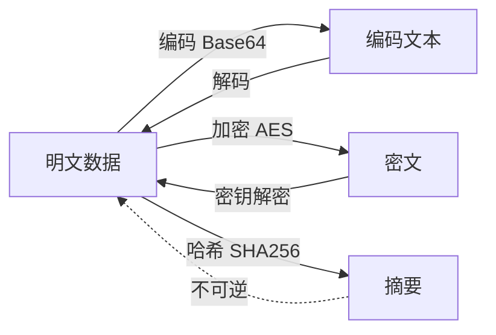
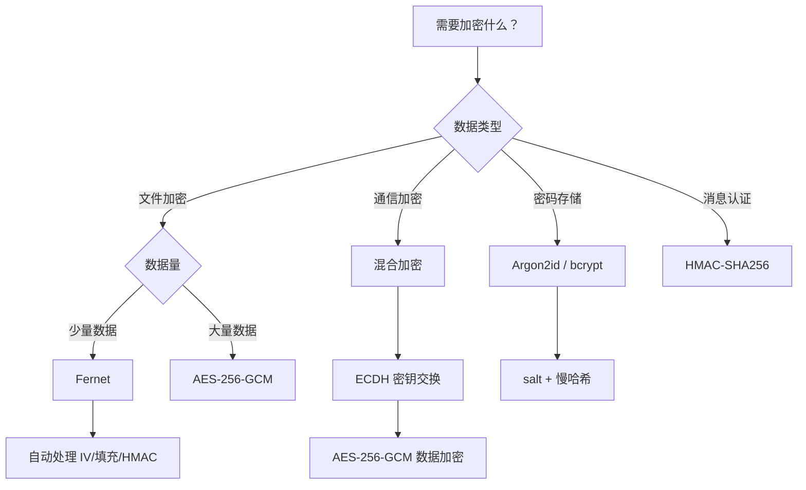

## 3. 加密与编码技巧

编码与加密是安全工程师的底层基本功。编码解决的是"数据怎么表示"的问题——把二进制变成可打印字符、把特殊字符转义为安全格式；加密解决的是"数据怎么保护"的问题——让未授权方即使拿到密文也无法还原明文。两者在安全工具开发中无处不在：构造 Payload 需要编码绕过过滤，传输凭据需要加密防止窃取，验证完整性需要哈希摘要，破解密码需要理解哈希算法的弱点。

本章从编码基础讲起，逐步深入哈希、对称加密、非对称加密、安全应用场景和常见陷阱，每个知识点都配可直接运行的代码和真实安全场景说明。

### 3.1 编码与加密的本质区别

初学者最容易混淆编码和加密。两者看似都是"把 A 变成 B"，但本质完全不同：

| 维度 | 编码（Encoding） | 加密（Encryption） | 哈希（Hashing） |
|------|-----------------|-------------------|----------------|
| 目的 | 数据格式转换，适配传输/存储 | 保护数据机密性 | 验证数据完整性 |
| 是否可逆 | 可逆（有解码算法） | 可逆（有密钥即可解密） | 不可逆（单向函数） |
| 是否需要密钥 | 不需要 | 需要 | 不需要 |
| 安全性 | 无安全性，任何人可解码 | 安全性取决于算法和密钥 | 抗碰撞则安全 |
| 典型用途 | URL 传输、邮件附件、数据序列化 | 通信加密、文件加密、密钥交换 | 密码存储、文件校验、数字签名 |



安全工程师的直觉应该是：看到一串 `=` 结尾的字符串，先尝试 Base64 解码；看到固定长度的十六进制串，先猜哈希值；看到看起来完全随机的二进制数据，考虑加密。

### 3.2 常用编码方案

#### 3.2.1 Base64 编码

Base64 是最常用的二进制到文本编码方案，将每 3 字节二进制数据编码为 4 个可打印 ASCII 字符。在安全领域，Base64 出现在 JWT Token、HTTP Basic 认证、邮件附件、Shellcode 传输等场景中。

**编码原理**：把 3 个字节（24 bit）拆成 4 组（每组 6 bit），每组映射到字符表 `A-Z a-z 0-9 + /` 中的一个字符。不足 3 字节的尾部用 `=` 填充。

```python
import base64

# === 基础编解码 ===
data = "Hello, Hacker!"
b64 = base64.b64encode(data.encode()).decode()
print(f"Base64:  {b64}")        # SGVsbG8sIEFja2VyIQ==
print(f"解码:    {base64.b64decode(b64).decode()}")

# === Base64 URL 安全变体 ===
# 标准 Base64 中的 + 和 / 在 URL 中有特殊含义
# urlsafe 用 - 替换 +，用 _ 替换 /
url_safe = base64.urlsafe_b64encode(data.encode()).decode()
print(f"URL安全: {url_safe}")
# JWT Token 就是用 URL-safe Base64 编码的

# === 无填充变体 ===
# 有些系统（JWT、URL参数）去掉尾部的 =
no_pad = base64.b64encode(data.encode()).decode().rstrip('=')
print(f"无填充:  {no_pad}")
# 解码时需要补回 =
padded = no_pad + '=' * (4 - len(no_pad) % 4) if len(no_pad) % 4 else no_pad
print(f"补回填充: {base64.b64decode(padded).decode()}")
```

**安全场景：解码可疑字符串**

在分析恶意样本、CTF 题目或日志中的可疑数据时，识别和解码 Base64 是基本技能：

```python
import base64
import re

def try_decode_b64(text):
    """尝试 Base64 解码，处理常见变体"""
    # 补齐填充
    padded = text + '=' * (4 - len(text) % 4) if len(text) % 4 else text
    for decoder in [base64.b64decode, base64.urlsafe_b64decode]:
        try:
            result = decoder(padded)
            # 检查结果是否为可打印文本
            try:
                decoded_text = result.decode('utf-8')
                if decoded_text.isprintable():
                    return decoded_text
            except UnicodeDecodeError:
                pass
            return result  # 返回原始字节
        except Exception:
            continue
    return None

# 自动检测并解码嵌套的 Base64
def recursive_decode(text, max_depth=5):
    """递归解码嵌套编码"""
    current = text
    for depth in range(max_depth):
        decoded = try_decode_b64(current)
        if decoded and isinstance(decoded, str) and decoded != current:
            print(f"  第{depth+1}层: {current[:50]}... -> {decoded[:50]}...")
            current = decoded
        else:
            break
    return current

# 示例：多层嵌套的 Base64
original = "secret payload"
layer1 = base64.b64encode(original.encode()).decode()
layer2 = base64.b64encode(layer1.encode()).decode()
layer3 = base64.b64encode(layer2.encode()).decode()
print(f"三层嵌套: {layer3}")
print(f"递归解码结果: {recursive_decode(layer3)}")
```

**注意**：Base64 不是加密！它只是编码。任何人拿到 Base64 字符串都能解码。不要用 Base64 "保护"敏感信息。

#### 3.2.2 Hex 编码

十六进制编码把每个字节表示为两个十六进制字符，在内存取证、网络协议分析、哈希值展示中大量使用。

```python
data = "password123"

# 字符串 → Hex
hex_str = data.encode().hex()
print(f"Hex: {hex_str}")              # 70617373776f7264313233

# Hex → 字符串
decoded = bytes.fromhex(hex_str).decode()
print(f"解码: {decoded}")

# 带分隔符的 Hex（Wireshark、tcpdump 常见格式）
def hex_dump(data, sep=' '):
    """生成带分隔符的十六进制转储"""
    return sep.join(f'{b:02x}' for b in data)

raw = b'\x89PNG\r\n\x1a\n'
print(f"Hex dump: {hex_dump(raw)}")

# 解析带各种分隔符的 Hex 输入
def parse_hex(hex_input):
    """解析各种格式的 Hex 字符串"""
    # 移除常见分隔符和前缀
    cleaned = hex_input.strip()
    for prefix in ['0x', '0X', '\\x', '\\X']:
        cleaned = cleaned.replace(prefix, '')
    for sep in [' ', ':', '-', ',', '.']:
        cleaned = cleaned.replace(sep, '')
    return bytes.fromhex(cleaned)

# 测试各种格式
formats = [
    "48:65:6c:6c:6f",           # 冒号分隔（MAC地址风格）
    "48 65 6c 6c 6f",           # 空格分隔
    "\\x48\\x65\\x6c\\x6c\\x6f", # C 语言转义风格
    "0x48656c6c6f",             # 前缀风格
]
for fmt in formats:
    print(f"  {fmt:30s} -> {parse_hex(fmt)}")
```

#### 3.2.3 URL 编码

URL 编码（百分号编码）将不安全字符转换为 `%XX` 形式。在 Web 安全中，理解 URL 编码是绕过 WAF 和输入过滤的基础。

```python
from urllib.parse import quote, unquote, urlencode

# 基础 URL 编码
data = "SELECT * FROM users WHERE name='admin'"
encoded = quote(data)
print(f"URL编码: {encoded}")
# SELECT%20%2A%20FROM%20users%20WHERE%20name%3D%27admin%27

# 安全字符保留（默认不编码 / : @ 等）
# safe 参数控制哪些字符不被编码
print(f"保留斜杠: {quote('/path/to/file', safe='/')}")

# 编码非 ASCII 字符（中文等）
print(f"中文编码: {quote('你好世界')}")

# 构造查询参数
params = {'q': 'python hacking', 'page': 1, 'lang': 'zh'}
print(f"查询参数: {urlencode(params)}")

# === 安全场景：WAF 绕过中的编码技巧 ===
payloads = {
    '原始':    '<script>alert(1)</script>',
    '单层编码': quote('<script>alert(1)</script>'),
    '双重编码': quote(quote('<script>alert(1)</script>')),
    'Unicode':  '<script>alert\\u00281\\u0029</script>',
    'HTML实体': '&lt;script&gt;alert&#40;1&#41;&lt;/script&gt;',
}

for name, payload in payloads.items():
    print(f"  {name:8s}: {payload}")
```

#### 3.2.4 其他常见编码

```python
import codecs
import struct

# ROT13 —— 字母轮转 13 位，CTF 中常见
text = "uryyb jbeyq"  # hello world
print(f"ROT13解码: {codecs.decode(text, 'rot_13')}")

# ROT47 —— 可见 ASCII 字符轮转 47 位
def rot47(s):
    result = []
    for c in s:
        n = ord(c)
        if 33 <= n <= 126:
            result.append(chr(33 + ((n + 14) % 94)))
        else:
            result.append(c)
    return ''.join(result)

encoded = rot47("Hello World")
print(f"ROT47编码: {encoded}")
print(f"ROT47解码: {rot47(encoded)}")

# Unicode 转义序列
text = "\\u0048\\u0065\\u006c\\u006c\\u006f"
print(f"Unicode解码: {codecs.decode(text, 'unicode_escape')}")

# HTML 实体解码
import html
encoded_html = "&lt;script&gt;alert(&quot;XSS&quot;)&lt;/script&gt;"
print(f"HTML解码: {html.unescape(encoded_html)}")

# Base32 —— 用于 OTP（Google Authenticator）、DNS TXT 记录
import base32  # 标准库无 base32，使用内置的 base64 模块
data = "secret key for totp"
b32 = base64.b32encode(data.encode()).decode()
print(f"Base32:  {b32}")
print(f"Base32解码: {base64.b32decode(b32).decode()}")

# Base85（ASCII85）—— PDF 和 Git 使用
b85 = base64.b85encode(data.encode()).decode()
print(f"Base85:  {b85}")
print(f"Base85解码: {base64.b85decode(b85).decode()}")
```

**编码识别速查表**：

| 特征 | 可能的编码 | 解码方法 |
|------|-----------|---------|
| `=` 或 `==` 结尾，字母数字 +/+ | Base64 | `base64.b64decode()` |
| 仅 A-Z 2-7，含 `=` 填充 | Base32 | `base64.b32decode()` |
| 全十六进制字符 (0-9 a-f) | Hex | `bytes.fromhex()` |
| `%XX` 格式 | URL 编码 | `urllib.parse.unquote()` |
| `&#数字;` 或 `&实体名;` | HTML 实体 | `html.unescape()` |
| `\\uXXXX` 格式 | Unicode 转义 | `codecs.decode(s, 'unicode_escape')` |
| 字母但非正常单词 | ROT13/ROT47 | `codecs.decode(s, 'rot_13')` |
| `<~ ... ~>` 包围 | ASCII85 | `base64.a85decode()` |

### 3.3 哈希算法与攻击技术

哈希（散列）是将任意长度输入映射为固定长度输出的单向函数。在安全领域，哈希用于密码存储、数据完整性校验、数字签名和消息认证。

#### 3.3.1 Python 哈希操作

```python
import hashlib
import hmac
import time

# === 标准哈希算法 ===
data = b"password123"

print("=== 常用哈希算法 ===")
print(f"MD5:       {hashlib.md5(data).hexdigest()}")
print(f"SHA1:      {hashlib.sha1(data).hexdigest()}")
print(f"SHA256:    {hashlib.sha256(data).hexdigest()}")
print(f"SHA512:    {hashlib.sha512(data).hexdigest()}")
print(f"SHA3-256:  {hashlib.sha3_256(data).hexdigest()}")
print(f"BLAKE2b:   {hashlib.blake2b(data).hexdigest()}")
print(f"BLAKE2s:   {hashlib.blake2s(data).hexdigest()}")

# === 大文件哈希（流式处理，不会撑爆内存）===
def file_hash(filepath, algorithm='sha256', chunk_size=8192):
    """计算文件哈希，支持大文件"""
    h = hashlib.new(algorithm)
    with open(filepath, 'rb') as f:
        while chunk := f.read(chunk_size):
            h.update(chunk)
    return h.hexdigest()

# === HMAC —— 带密钥的消息认证码 ===
# HMAC 防止消息被篡改，同时验证发送方身份
secret_key = b'my-secret-key'
message = b'important data'

# 计算 HMAC
mac = hmac.new(secret_key, message, hashlib.sha256).hexdigest()
print(f"\nHMAC-SHA256: {mac}")

# 验证 HMAC（使用 hmac.compare_digest 防止时序攻击）
received_mac = mac  # 模拟接收到的 MAC
if hmac.compare_digest(received_mac, mac):
    print("HMAC 验证通过：消息未被篡改")
else:
    print("HMAC 验证失败：消息可能被篡改")

# === 哈希性能对比 ===
data_1mb = b'A' * (1024 * 1024)
for algo in ['md5', 'sha1', 'sha256', 'sha512', 'sha3_256', 'blake2b']:
    start = time.perf_counter()
    for _ in range(100):
        hashlib.new(algo, data_1mb).digest()
    elapsed = time.perf_counter() - start
    print(f"  {algo:10s}: {elapsed:.3f}s (100x 1MB)")
```

#### 3.3.2 哈希算法安全等级

| 算法 | 输出长度 | 安全状态 | 碰撞攻击 | 典型用途 |
|------|---------|---------|---------|---------|
| MD5 | 128 bit | **已破解** | 2004年王小云团队，实际碰撞可行 | 文件校验（非安全场景） |
| SHA1 | 160 bit | **已破解** | 2017年 Google SHAttered 项目 | Git 对象标识（正在迁移） |
| SHA256 | 256 bit | **安全** | 无已知实际攻击 | 证书、区块链、密码存储 |
| SHA3-256 | 256 bit | **安全** | 全新结构（海绵构造），不受长度扩展攻击 | 高安全需求场景 |
| BLAKE2b | 512 bit | **安全** | 比 SHA3 更快，可直接替代 MD5/SHA1 | 高性能哈希需求 |
| BLAKE3 | 256 bit | **安全** | 极快（利用 SIMD 并行） | 新项目推荐 |

**关键安全结论**：
- MD5 和 SHA1 绝对不能用于安全用途（密码存储、证书签名、完整性验证）
- 密码存储必须用专用算法（bcrypt / Argon2 / scrypt），普通哈希太快易被暴力破解
- 对抗长度扩展攻击用 HMAC 或 SHA3，不要用 `key + message` 的朴素拼接方式

#### 3.3.3 哈希碰撞构造

理解碰撞攻击有助于评估安全风险和完成 CTF 挑战：

```python
import hashlib
import random
import string

# === 生日攻击演示 ===
# 根据生日悖论，N 位哈希在约 2^(N/2) 次尝试后可找到碰撞
def birthday_attack(prefix_bits=16, max_attempts=100000):
    """演示生日攻击找到哈希碰撞"""
    seen = {}  # hash_prefix -> (input, full_hash)
    for i in range(max_attempts):
        # 生成随机输入
        candidate = ''.join(random.choices(string.ascii_letters, k=16))
        h = hashlib.sha256(candidate.encode()).hexdigest()
        prefix = h[:prefix_bits // 4]  # 每个 hex 字符 = 4 bit

        if prefix in seen:
            original = seen[prefix]
            print(f"  找到碰撞！({prefix_bits} bit 前缀)")
            print(f"    输入1: {original[0]} -> {original[1]}")
            print(f"    输入2: {candidate} -> {h}")
            print(f"    尝试次数: {i+1}")
            return True
        seen[prefix] = (candidate, h)
    print(f"  在 {max_attempts} 次内未找到碰撞")
    return False

# 不同前缀长度的碰撞难度
for bits in [8, 16, 24]:
    print(f"\n--- {bits} bit 前缀碰撞 ---")
    birthday_attack(bits)
```

#### 3.3.4 哈希破解技术

已知哈希值反推原始输入是渗透测试中的常见需求。核心思路是用字典或暴力生成候选，计算哈希后比对。

```python
import hashlib
import itertools
import string
import time

# === 字典攻击 ===
def dictionary_attack(target_hash, wordlist, hash_type='md5'):
    """使用字典进行哈希破解"""
    for i, word in enumerate(wordlist):
        word = word.strip()
        if not word:
            continue
        h = hashlib.new(hash_type, word.encode()).hexdigest()
        if h == target_hash:
            return word, i + 1
    return None, 0

# === 带盐哈希破解 ===
def crack_salted_hash(target_hash, salt, wordlist, hash_type='sha256'):
    """破解加盐哈希: hash = H(salt + password)"""
    for word in wordlist:
        word = word.strip()
        # 常见的加盐方式：salt+password, password+salt, H(salt)+H(password)
        candidates = [
            salt + word,
            word + salt,
            hashlib.new(hash_type, salt.encode()).hexdigest() + word,
        ]
        for combo in candidates:
            h = hashlib.new(hash_type, combo.encode()).hexdigest()
            if h == target_hash:
                return word
    return None

# === 暴力破解 ===
def brute_force_hash(target_hash, charset, max_length, hash_type='md5'):
    """暴力破解短哈希（仅适用于短密码或特定场景）"""
    attempts = 0
    for length in range(1, max_length + 1):
        for combo in itertools.product(charset, repeat=length):
            candidate = ''.join(combo)
            attempts += 1
            h = hashlib.new(hash_type, candidate.encode()).hexdigest()
            if h == target_hash:
                return candidate, attempts
            if attempts % 100000 == 0:
                print(f"  已尝试 {attempts} 个候选...")
    return None, attempts

# === 常见哈希彩虹表（预计算）===
# 安全工程中，彩虹表用于快速查找弱密码的哈希
# 这里演示预计算表的原理
def build_rainbow_table(wordlist, hash_type='md5'):
    """构建简化版彩虹表（实际彩虹表使用归约函数链）"""
    table = {}
    for word in wordlist:
        word = word.strip()
        h = hashlib.new(hash_type, word.encode()).hexdigest()
        table[h] = word
    return table

# === 使用示例 ===
# 模拟字典
common_passwords = [
    "123456", "password", "admin", "root", "letmein",
    "qwerty", "abc123", "password123", "admin123", "12345678"
]

# 模拟目标哈希
target = hashlib.md5(b"admin123").hexdigest()
print(f"目标 MD5: {target}")

result, count = dictionary_attack(target, common_passwords)
if result:
    print(f"破解成功: {result} (第 {count} 次尝试)")
else:
    print("字典攻击失败")

# 加盐示例
salt = "xK9#mP"
salted_target = hashlib.sha256((salt + "admin123").encode()).hexdigest()
print(f"\n加盐 SHA256 (salt={salt}): {salted_target}")
result = crack_salted_hash(salted_target, salt, common_passwords)
print(f"破解结果: {result}")
```

#### 3.3.5 密码哈希的安全存储

**绝对不能直接存储明文密码或简单哈希**。现代密码存储必须使用专用的慢哈希算法：

```python
import hashlib
import os
import base64
import time

# ========================================
# ❌ 错误做法 —— 容易被彩虹表/暴力破解
# ========================================
def bad_store_password(password):
    # MD5 无盐 —— 彩虹表秒破
    return hashlib.md5(password.encode()).hexdigest()

def slightly_better(password):
    # SHA256 无盐 —— 同样不安全，哈希太快
    return hashlib.sha256(password.encode()).hexdigest()

# ========================================
# ✅ 推荐做法 —— 使用专用密码哈希算法
# ========================================

# 方案一：bcrypt（最成熟，推荐）
def bcrypt_hash(password):
    """使用 bcrypt 哈希密码"""
    import bcrypt
    # gensalt 自动处理盐值，rounds 控制计算成本
    salt = bcrypt.gensalt(rounds=12)
    hashed = bcrypt.hashpw(password.encode(), salt)
    return hashed.decode()  # 包含算法标识、成本、盐值和哈希值

def bcrypt_verify(password, hashed):
    """验证 bcrypt 哈希"""
    import bcrypt
    return bcrypt.checkpw(password.encode(), hashed.encode())

# 方案二：Argon2（2015年密码哈希竞赛冠军，抗 GPU/ASIC）
def argon2_hash(password):
    """使用 Argon2id 哈希密码"""
    from argon2 import PasswordHasher
    # 默认参数：time_cost=3, memory_cost=65536(64MB), parallelism=4
    ph = PasswordHasher(
        time_cost=3,        # 迭代次数
        memory_cost=65536,  # 内存消耗 (KB)
        parallelism=4,      # 并行线程数
        hash_len=32,        # 输出长度
        salt_len=16         # 盐值长度
    )
    return ph.hash(password)

def argon2_verify(password, hashed):
    """验证 Argon2 哈希"""
    from argon2 import PasswordHasher
    from argon2.exceptions import VerifyMismatchError
    ph = PasswordHasher()
    try:
        return ph.verify(hashed, password)
    except VerifyMismatchError:
        return False

# 方案三：PBKDF2（标准库自带，无需额外安装）
def pbkdf2_hash(password, iterations=600000):
    """使用 PBKDF2-SHA256 哈希密码"""
    salt = os.urandom(32)
    dk = hashlib.pbkdf2_hmac('sha256', password.encode(), salt, iterations)
    # 存储格式：算法$迭代次数$盐值$哈希值
    return f"pbkdf2_sha256${iterations}${base64.b64encode(salt).decode()}${base64.b64encode(dk).decode()}"

def pbkdf2_verify(password, stored_hash):
    """验证 PBKDF2 哈希"""
    parts = stored_hash.split('$')
    iterations = int(parts[1])
    salt = base64.b64decode(parts[2])
    expected = base64.b64decode(parts[3])
    dk = hashlib.pbkdf2_hmac('sha256', password.encode(), salt, iterations)
    return hmac.compare_digest(dk, expected)

# === 性能对比 ===
password = "test_password_123"

print("=== 算法性能对比 (单次哈希) ===")
for name, func in [
    ("MD5 (不安全)", lambda: hashlib.md5(password.encode()).hexdigest()),
    ("SHA256 (不安全)", lambda: hashlib.sha256(password.encode()).hexdigest()),
    ("PBKDF2 (260K轮)", lambda: hashlib.pbkdf2_hmac('sha256', password.encode(), b'salt', 260000)),
]:
    start = time.perf_counter()
    result = func()
    elapsed = time.perf_counter() - start
    print(f"  {name:25s}: {elapsed*1000:.2f}ms")

print("\n结论：慢哈希算法故意设计得很慢，暴力破解代价极大")
```

**密码存储算法选型**：

| 算法 | 优势 | 劣势 | 推荐场景 |
|------|------|------|---------|
| Argon2id | 抗 GPU/ASIC，可调内存+CPU | 部分语言/平台库不成熟 | 新项目首选 |
| bcrypt | 成熟可靠，广泛支持 | 内存消耗不可调 | 通用场景 |
| scrypt | 可调内存消耗 | 库支持不如 bcrypt | 需要内存硬化的场景 |
| PBKDF2 | 标准库自带（Python hashlib） | 无内存硬化，GPU 友好 | 环境受限无法安装第三方库 |

### 3.4 对称加密

对称加密使用同一把密钥进行加密和解密，速度快，适合大量数据加密。

#### 3.4.1 Fernet 对称加密（推荐）

Fernet 是 `cryptography` 库提供的高级接口，内置了认证加密（AES-128-CBC + HMAC-SHA256），开箱即用，不需要手动处理 IV、填充和认证：

```python
from cryptography.fernet import Fernet, InvalidToken

# === 生成密钥 ===
key = Fernet.generate_key()
print(f"密钥: {key.decode()}")
# 密钥格式: URL-safe Base64 编码的 32 字节随机数据

# === 加密解密 ===
cipher = Fernet(key)

# 加密（自动处理 IV 生成、PKCS7 填充和 HMAC 签名）
message = b"Top secret: target IP is 192.168.1.100"
encrypted = cipher.encrypt(message)
print(f"密文: {encrypted.decode()[:80]}...")

# 解密（自动验证 HMAC，篡改的密文会抛出 InvalidToken）
decrypted = cipher.decrypt(encrypted)
print(f"明文: {decrypted.decode()}")

# === 带有效期的加密 ===
# encrypt_at_time 和 decrypt 时检查时间戳
import time
token = cipher.encrypt(message)
# 可以在解密时设置 TTL（秒）
try:
    plain = cipher.decrypt(token, ttl=60)  # 60秒内有效
    print(f"TTL 验证通过: {plain.decode()}")
except InvalidToken:
    print("Token 已过期或无效")

# === 错误处理 ===
try:
    cipher.decrypt(b"invalid token data")
except InvalidToken:
    print("解密失败：密文无效或密钥错误")

# === 密钥派生：从密码生成 Fernet 密钥 ===
import base64
from cryptography.hazmat.primitives.kdf.pbkdf2 import PBKDF2HMAC
from cryptography.hazmat.primitives import hashes

def fernet_key_from_password(password, salt=None):
    """从用户密码派生 Fernet 密钥"""
    if salt is None:
        salt = os.urandom(16)
    kdf = PBKDF2HMAC(
        algorithm=hashes.SHA256(),
        length=32,
        salt=salt,
        iterations=600000,
    )
    key = base64.urlsafe_b64encode(kdf.derive(password.encode()))
    return key, salt

import os
key, salt = fernet_key_from_password("my_password")
cipher = Fernet(key)
encrypted = cipher.encrypt(b"secret data")
print(f"\n从密码派生密钥加密: {encrypted.decode()[:50]}...")
```

#### 3.4.2 AES 加密（底层控制）

需要精细控制加密参数时（指定模式、自定义 IV、处理特殊数据格式），使用 AES 底层接口：

```python
from cryptography.hazmat.primitives.ciphers import Cipher, algorithms, modes
from cryptography.hazmat.primitives import padding
import os

# === AES-CBC 模式 ===
def aes_cbc_encrypt(plaintext: bytes, key: bytes) -> bytes:
    """
    AES-CBC 加密
    返回: IV (16字节) + 密文
    注意: CBC 模式不提供完整性保护，应配合 HMAC 使用
    """
    iv = os.urandom(16)
    # PKCS7 填充到 128 bit (16 字节) 的整数倍
    padder = padding.PKCS7(128).padder()
    padded = padder.update(plaintext) + padder.finalize()
    cipher = Cipher(algorithms.AES(key), modes.CBC(iv))
    encryptor = cipher.encryptor()
    ct = encryptor.update(padded) + encryptor.finalize()
    return iv + ct

def aes_cbc_decrypt(ciphertext: bytes, key: bytes) -> bytes:
    """AES-CBC 解密"""
    iv = ciphertext[:16]
    ct = ciphertext[16:]
    cipher = Cipher(algorithms.AES(key), modes.CBC(iv))
    decryptor = cipher.decryptor()
    padded = decryptor.update(ct) + decryptor.finalize()
    unpadder = padding.PKCS7(128).unpadder()
    return unpadder.update(padded) + unpadder.finalize()

# AES 密钥必须是 16/24/32 字节 (AES-128/192/256)
key = os.urandom(32)  # AES-256
plaintext = b"Classified: operation details here"
ct = aes_cbc_encrypt(plaintext, key)
pt = aes_cbc_decrypt(ct, key)
print(f"AES-CBC 加密: {ct.hex()[:60]}...")
print(f"AES-CBC 解密: {pt.decode()}")

# === AES-GCM 模式（推荐：同时提供加密和认证）===
def aes_gcm_encrypt(plaintext: bytes, key: bytes, aad: bytes = b"") -> bytes:
    """
    AES-GCM 认证加密
    返回: Nonce (12字节) + 密文 + Tag (16字节)
    aad: 附加认证数据（不加密但参与认证，如头部信息）
    """
    nonce = os.urandom(12)  # GCM 推荐 12 字节 nonce
    cipher = Cipher(algorithms.AES(key), modes.GCM(nonce))
    encryptor = cipher.encryptor()
    if aad:
        encryptor.authenticate_additional_data(aad)
    ct = encryptor.update(plaintext) + encryptor.finalize()
    return nonce + ct + encryptor.tag

def aes_gcm_decrypt(data: bytes, key: bytes, aad: bytes = b"") -> bytes:
    """AES-GCM 认证解密"""
    nonce = data[:12]
    tag = data[-16:]
    ct = data[12:-16]
    cipher = Cipher(algorithms.AES(key), modes.GCM(nonce, tag))
    decryptor = cipher.decryptor()
    if aad:
        decryptor.authenticate_additional_data(aad)
    return decryptor.update(ct) + decryptor.finalize()

key = os.urandom(32)
aad = b"session_id=abc123"  # 不加密但保护完整性的数据
ct = aes_gcm_encrypt(plaintext, key, aad)
pt = aes_gcm_decrypt(ct, key, aad)
print(f"\nAES-GCM 加密: {ct.hex()[:60]}...")
print(f"AES-GCM 解密: {pt.decode()}")

# 篡改检测：修改密文的任何字节都会导致解密失败
try:
    tampered = bytearray(ct)
    tampered[20] ^= 0x01  # 翻转一个 bit
    aes_gcm_decrypt(bytes(tampered), key, aad)
except Exception as e:
    print(f"篡改检测成功: {type(e).__name__}")
```

**AES 模式对比**：

| 模式 | 完整性保护 | 并行加密 | 并行解密 | IV/Nonce 要求 | 推荐场景 |
|------|-----------|---------|---------|-------------|---------|
| CBC | 否（需配合 HMAC） | 否 | 是 | 随机 IV，不可预测 | 兼容旧系统 |
| GCM | 是（内置认证） | 是 | 是 | 随机 12 字节，每次唯一 | **通用首选** |
| CTR | 否（需配合 MAC） | 是 | 是 | 计数器，不可重复 | 需要流式加密 |
| SIV | 是（确定性） | - | - | nonce 可选 | 需要相同明文产生相同密文 |

### 3.5 非对称加密

非对称加密使用密钥对（公钥加密、私钥解密），解决密钥分发问题，速度慢于对称加密，通常用于密钥交换和数字签名。

#### 3.5.1 RSA 加密与签名

```python
from cryptography.hazmat.primitives.asymmetric import rsa, padding as asym_padding
from cryptography.hazmat.primitives import hashes, serialization
from cryptography.hazmat.primitives.asymmetric import utils
import os

# === 生成 RSA 密钥对 ===
private_key = rsa.generate_private_key(
    public_exponent=65537,  # 标准公钥指数
    key_size=4096,          # 密钥长度：2048(最低) / 3072 / 4096(推荐)
)
public_key = private_key.public_key()

# === 序列化密钥 ===
# PEM 格式（文本，用于配置文件、证书）
private_pem = private_key.private_bytes(
    encoding=serialization.Encoding.PEM,
    format=serialization.PrivateFormat.PKCS8,
    encryption_algorithm=serialization.NoEncryption()  # 无密码保护
    # 或用 serialization.BestAvailableEncryption(b'password') 加密私钥
).decode()
print(f"私钥 PEM (前200字符):\n{private_pem[:200]}...")

public_pem = public_key.public_bytes(
    encoding=serialization.Encoding.PEM,
    format=serialization.PublicFormat.SubjectPublicKeyInfo
).decode()

# 从 PEM 加载密钥
loaded_private = serialization.load_pem_private_key(
    private_pem.encode(), password=None
)
loaded_public = serialization.load_pem_public_key(public_pem.encode())

# === RSA 加密解密 ===
message = b"Encryption key: AES-256-0123456789abcdef"

# OAEP 填充（推荐，比 PKCS1v15 更安全）
encrypted = public_key.encrypt(
    message,
    asym_padding.OAEP(
        mgf=asym_padding.MGF1(algorithm=hashes.SHA256()),
        algorithm=hashes.SHA256(),
        label=None
    )
)
print(f"\nRSA 密文长度: {len(encrypted)} 字节")

decrypted = private_key.decrypt(
    encrypted,
    asym_padding.OAEP(
        mgf=asym_padding.MGF1(algorithm=hashes.SHA256()),
        algorithm=hashes.SHA256(),
        label=None
    )
)
print(f"RSA 解密: {decrypted.decode()}")

# === RSA 数字签名 ===
# 签名 = 用私钥对消息摘要加密，验证 = 用公钥解密并比对摘要
data = b"Important document to sign"

# 签名
signature = private_key.sign(
    data,
    asym_padding.PSS(
        mgf=asym_padding.MGF1(hashes.SHA256()),
        salt_length=asym_padding.PSS.MAX_LENGTH
    ),
    hashes.SHA256()
)
print(f"\n签名长度: {len(signature)} 字节")

# 验证签名
try:
    public_key.verify(
        signature,
        data,
        asym_padding.PSS(
            mgf=asym_padding.MGF1(hashes.SHA256()),
            salt_length=asym_padding.PSS.MAX_LENGTH
        ),
        hashes.SHA256()
    )
    print("签名验证通过：文档未被篡改")
except Exception:
    print("签名验证失败：文档已被篡改或签名无效")
```

#### 3.5.2 ECC 椭圆曲线加密

ECC 使用更短的密钥实现同等安全性（256 bit ECC ≈ 3072 bit RSA），性能更好：

```python
from cryptography.hazmat.primitives.asymmetric import ec
from cryptography.hazmat.primitives import hashes

# === 生成 ECC 密钥对 ===
private_key = ec.generate_private_key(ec.SECP384R1())  # NIST P-384 曲线
public_key = private_key.public_key()

# === ECDH 密钥交换 ===
# 双方各生成密钥对，交换公钥后独立计算出相同的共享密钥
def ecdh_key_exchange():
    """ECDH 密钥交换演示"""
    # Alice
    alice_private = ec.generate_private_key(ec.SECP384R1())
    alice_public = alice_private.public_key()

    # Bob
    bob_private = ec.generate_private_key(ec.SECP384R1())
    bob_public = bob_private.public_key()

    # Alice 用 Bob 的公钥和自己的私钥计算共享密钥
    alice_shared = alice_private.exchange(ec.ECDH(), bob_public)

    # Bob 用 Alice 的公钥和自己的私钥计算共享密钥
    bob_shared = bob_private.exchange(ec.ECDH(), alice_public)

    # 两者相同
    assert alice_shared == bob_shared
    print(f"共享密钥: {alice_shared.hex()[:40]}...")
    print(f"密钥长度: {len(alice_shared)} 字节")
    return alice_shared

shared = ecdh_key_exchange()

# === ECDSA 数字签名 ===
data = b"Data to be signed with ECDSA"

signature = private_key.sign(data, ec.ECDSA(hashes.SHA256()))
print(f"\nECDSA 签名长度: {len(signature)} 字节")

# 验证
try:
    public_key.verify(signature, data, ec.ECDSA(hashes.SHA256()))
    print("ECDSA 签名验证通过")
except Exception:
    print("ECDSA 签名验证失败")
```

#### 3.5.3 混合加密实践

实际应用中，非对称加密用于交换对称密钥，对称加密用于加密数据（因为非对称加密速度慢、有长度限制）：

```python
from cryptography.fernet import Fernet
from cryptography.hazmat.primitives.asymmetric import rsa, padding as asym_padding
from cryptography.hazmat.primitives import hashes
import os

def hybrid_encrypt(plaintext: bytes, recipient_public_key) -> dict:
    """
    混合加密：RSA + Fernet
    1. 随机生成 Fernet 对称密钥
    2. 用对称密钥加密数据
    3. 用接收方公钥加密对称密钥
    4. 返回加密后的密钥和数据
    """
    # 生成随机会话密钥
    session_key = Fernet.generate_key()

    # 用会话密钥加密数据
    cipher = Fernet(session_key)
    encrypted_data = cipher.encrypt(plaintext)

    # 用接收方公钥加密会话密钥
    encrypted_key = recipient_public_key.encrypt(
        session_key,
        asym_padding.OAEP(
            mgf=asym_padding.MGF1(algorithm=hashes.SHA256()),
            algorithm=hashes.SHA256(),
            label=None
        )
    )

    return {
        'encrypted_key': encrypted_key,
        'encrypted_data': encrypted_data,
    }

def hybrid_encrypt_with_pem(plaintext: str, public_key_pem: str) -> dict:
    """使用 PEM 格式公钥进行混合加密"""
    from cryptography.hazmat.primitives.serialization import load_pem_public_key
    public_key = load_pem_public_key(public_key_pem.encode())
    result = hybrid_encrypt(plaintext.encode(), public_key)
    # 转为 Base64 方便传输
    import base64
    return {
        'encrypted_key': base64.b64encode(result['encrypted_key']).decode(),
        'encrypted_data': result['encrypted_data'].decode(),  # Fernet 输出已是 Base64
    }

def hybrid_decrypt(encrypted_key: bytes, encrypted_data: bytes, private_key) -> bytes:
    """混合解密"""
    # 用私钥解密会话密钥
    session_key = private_key.decrypt(
        encrypted_key,
        asym_padding.OAEP(
            mgf=asym_padding.MGF1(algorithm=hashes.SHA256()),
            algorithm=hashes.SHA256(),
            label=None
        )
    )
    # 用会话密钥解密数据
    cipher = Fernet(session_key)
    return cipher.decrypt(encrypted_data)

# 演示完整流程
private_key = rsa.generate_private_key(65537, 2048)
public_key = private_key.public_key()

plaintext = b"A" * 100000  # 100KB 数据
result = hybrid_encrypt(plaintext, public_key)
recovered = hybrid_decrypt(result['encrypted_key'], result['encrypted_data'], private_key)
print(f"混合加密测试: {len(plaintext)}字节 -> 密钥{len(result['encrypted_key'])}字节 + 数据{len(result['encrypted_data'])}字节")
print(f"解密验证: {'成功' if recovered == plaintext else '失败'}")
```

### 3.6 安全应用场景

#### 3.6.1 安全通信协议实现

简化版的安全通信协议，展示加密在实际场景中的应用：

```python
import os
import json
import time
import hashlib
from cryptography.fernet import Fernet
from cryptography.hazmat.primitives.asymmetric import ec
from cryptography.hazmat.primitives.kdf.hkdf import HKDF
from cryptography.hazmat.primitives import hashes

class SecureChannel:
    """
    安全通信通道
    使用 ECDH 密钥交换 + AES 对称加密 + HMAC 完整性验证
    """

    def __init__(self):
        self.private_key = ec.generate_private_key(ec.SECP384R1())
        self.public_key = self.private_key.public_key()
        self.shared_key = None

    def get_public_bytes(self) -> bytes:
        """导出公钥用于交换"""
        from cryptography.hazmat.primitives.serialization import (
            Encoding, PublicFormat
        )
        return self.public_key.public_bytes(Encoding.DER, PublicFormat.SubjectPublicKeyInfo)

    def compute_shared_key(self, peer_public_bytes: bytes):
        """从对方公钥计算共享密钥"""
        from cryptography.hazmat.primitives.serialization import load_der_public_key
        peer_key = load_der_public_key(peer_public_bytes)
        shared_secret = self.private_key.exchange(ec.ECDH(), peer_key)
        # 使用 HKDF 从共享密钥派生对称加密密钥
        self.shared_key = HKDF(
            algorithm=hashes.SHA256(),
            length=32,
            salt=None,
            info=b'secure channel v1',
        ).derive(shared_secret)

    def encrypt_message(self, plaintext: str) -> bytes:
        """加密消息"""
        if not self.shared_key:
            raise RuntimeError("共享密钥未建立，先调用 compute_shared_key")
        key = __import__('base64').urlsafe_b64encode(self.shared_key)
        cipher = Fernet(key)
        return cipher.encrypt(plaintext.encode())

    def decrypt_message(self, ciphertext: bytes) -> str:
        """解密消息"""
        if not self.shared_key:
            raise RuntimeError("共享密钥未建立，先调用 compute_shared_key")
        key = __import__('base64').urlsafe_b64encode(self.shared_key)
        cipher = Fernet(key)
        return cipher.decrypt(ciphertext).decode()


# 模拟 Alice 和 Bob 的安全通信
alice = SecureChannel()
bob = SecureChannel()

# 交换公钥（明文传输，不需要保密）
alice.compute_shared_key(bob.get_public_bytes())
bob.compute_shared_key(alice.get_public_bytes())

# Alice 加密发送
message = "攻击目标 192.168.1.0/24，时间 0300"
encrypted = alice.encrypt_message(message)
print(f"Alice 发送密文: {encrypted.decode()[:50]}...")

# Bob 解密接收
decrypted = bob.decrypt_message(encrypted)
print(f"Bob 接收明文: {decrypted}")

# 第三方无法解密（没有私钥）
eve_shared_key = b'\x00' * 32
try:
    key = __import__('base64').urlsafe_b64encode(eve_shared_key)
    Fernet(key).decrypt(encrypted)
except Exception:
    print("窃听者 Eve 无法解密")
```

#### 3.6.2 数据混淆与反检测

在红队操作中，Payload 和通信数据需要经过编码/加密/混淆以绕过安全检测：

```python
import base64
import os
import zlib
import codecs

# === 多层编码链 ===
def encode_chain(data: str, layers: list) -> str:
    """
    多层编码管道
    layers: ['b64', 'hex', 'rot13', 'url', 'gzip+b64']
    """
    result = data.encode()
    for layer in layers:
        if layer == 'b64':
            result = base64.b64encode(result)
        elif layer == 'hex':
            result = result.hex().encode()
        elif layer == 'rot13':
            result = codecs.decode(result.decode(), 'rot_13').encode()
        elif layer == 'url':
            from urllib.parse import quote
            result = quote(result.decode()).encode()
        elif layer == 'gzip+b64':
            result = base64.b64encode(zlib.compress(result))
        elif layer == 'reverse':
            result = result[::-1]
        else:
            raise ValueError(f"未知编码层: {layer}")
    return result.decode()

def decode_chain(data: str, layers: list) -> str:
    """逆序解码"""
    result = data.encode()
    for layer in reversed(layers):
        if layer == 'b64':
            result = base64.b64decode(result)
        elif layer == 'hex':
            result = bytes.fromhex(result.decode())
        elif layer == 'rot13':
            result = codecs.decode(result.decode(), 'rot_13').encode()
        elif layer == 'url':
            from urllib.parse import unquote
            result = unquote(result.decode()).encode()
        elif layer == 'gzip+b64':
            result = zlib.decompress(base64.b64decode(result))
        elif layer == 'reverse':
            result = result[::-1]
    return result.decode()

# 示例
payload = "import os; os.system('whoami')"
layers = ['gzip+b64', 'b64', 'hex']
encoded = encode_chain(payload, layers)
decoded = decode_chain(encoded, layers)
print(f"原始: {payload}")
print(f"编码: {encoded[:80]}...")
print(f"解码: {decoded}")
print(f"验证: {'通过' if decoded == payload else '失败'}")

# === Python 代码自解密模板 ===
# 用于绕过静态分析（YARA、杀毒软件等）
def generate_self_decrypting(code: str, key: bytes = None) -> str:
    """生成自解密的 Python 脚本"""
    if key is None:
        key = os.urandom(16)

    # XOR 加密代码
    code_bytes = code.encode()
    encrypted = bytes(b ^ key[i % len(key)] for i, b in enumerate(code_bytes))
    encrypted_b64 = base64.b64encode(encrypted).decode()
    key_hex = key.hex()

    # 生成自解密脚本
    template = f'''#!/usr/bin/env python3
import base64
exec(
    bytes(
        b ^ int.from_bytes(
            bytes.fromhex("{key_hex}")[i % 16:i % 16 + 1], "big"
        )
        for i, b in enumerate(base64.b64decode("{encrypted_b64}"))
    ).decode()
)
'''
    return template
```

#### 3.6.3 令牌生成与安全随机数

安全场景中需要生成不可预测的随机值——Session ID、CSRF Token、API 密钥、临时密码等：

```python
import os
import secrets
import string
import hashlib
import hmac
import time
import struct

# === secrets 模块 —— 密码学安全随机数 ===
# 不要用 random 模块！它用的是 Mersenne Twister，可预测

# 安全随机字节
token_bytes = secrets.token_bytes(32)     # 32 字节随机数据
token_hex = secrets.token_hex(32)         # 64 字符十六进制字符串
token_urlsafe = secrets.token_urlsafe(32) # URL 安全的 Base64 字符串

print(f"token_bytes:   {token_bytes.hex()}")
print(f"token_hex:     {token_hex}")
print(f"token_urlsafe: {token_urlsafe}")

# 安全随机整数
random_int = secrets.randbelow(1000000)  # 0 到 999999 的随机数

# 安全比较（防时序攻击）
expected = "abc123def456"
provided = "abc123def456"
assert secrets.compare_digest(expected, provided)

# === 临时密码生成器 ===
def generate_password(length=16, require_all=True):
    """
    生成密码学安全的随机密码
    require_all: 确保至少包含大小写、数字、特殊字符各一个
    """
    if require_all and length < 4:
        raise ValueError("密码长度至少为 4")

    chars = string.ascii_letters + string.digits + "!@#$%^&*"
    if require_all:
        # 先确保每类字符至少一个
        password = [
            secrets.choice(string.ascii_uppercase),
            secrets.choice(string.ascii_lowercase),
            secrets.choice(string.digits),
            secrets.choice("!@#$%^&*"),
        ]
        # 剩余随机填充
        password.extend(secrets.choice(chars) for _ in range(length - 4))
        # 打乱顺序
        secrets.SystemRandom().shuffle(password)
        return ''.join(password)
    return ''.join(secrets.choice(chars) for _ in range(length))

print(f"\n随机密码: {generate_password(20)}")

# === JWT 风格的签名令牌 ===
import json

def create_signed_token(payload: dict, secret: str, expires_in: int = 3600) -> str:
    """创建签名令牌（简化版 JWT）"""
    # Header
    header = {"alg": "HS256", "typ": "JWT"}
    # 添加过期时间
    payload_with_exp = {**payload, "exp": int(time.time()) + expires_in}

    # Base64 编码
    header_b64 = base64.urlsafe_b64encode(
        json.dumps(header).encode()
    ).decode().rstrip('=')
    payload_b64 = base64.urlsafe_b64encode(
        json.dumps(payload_with_exp).encode()
    ).decode().rstrip('=')

    # 签名
    message = f"{header_b64}.{payload_b64}"
    signature = hmac.new(
        secret.encode(), message.encode(), hashlib.sha256
    ).digest()
    signature_b64 = base64.urlsafe_b64encode(signature).decode().rstrip('=')

    return f"{header_b64}.{payload_b64}.{signature_b64}"

def verify_signed_token(token: str, secret: str) -> dict | None:
    """验证签名令牌"""
    try:
        parts = token.split('.')
        if len(parts) != 3:
            return None

        header_b64, payload_b64, signature_b64 = parts

        # 验证签名
        message = f"{header_b64}.{payload_b64}"
        expected_sig = hmac.new(
            secret.encode(), message.encode(), hashlib.sha256
        ).digest()
        # 补齐 Base64 填充
        sig_padded = signature_b64 + '=' * (4 - len(signature_b64) % 4)
        actual_sig = base64.urlsafe_b64decode(sig_padded)

        if not hmac.compare_digest(expected_sig, actual_sig):
            return None

        # 解码 payload
        payload_padded = payload_b64 + '=' * (4 - len(payload_b64) % 4)
        payload = json.loads(base64.urlsafe_b64decode(payload_padded))

        # 检查过期
        if payload.get('exp', 0) < time.time():
            return None  # 已过期

        return payload
    except Exception:
        return None

# 测试
secret = secrets.token_hex(32)
token = create_signed_token({"user": "admin", "role": "operator"}, secret)
print(f"\n签名令牌: {token[:60]}...")
payload = verify_signed_token(token, secret)
print(f"验证结果: {payload}")

# 篡改测试
tampered = token[:-5] + "XXXXX"
print(f"篡改验证: {verify_signed_token(tampered, secret)}")
```

#### 3.6.4 文件完整性校验

在安全操作中，验证下载文件、固件、脚本的完整性至关重要：

```python
import hashlib
import os
import json
from pathlib import Path

class FileIntegrityChecker:
    """文件完整性校验工具"""

    SUPPORTED_ALGORITHMS = ['md5', 'sha1', 'sha256', 'sha512', 'blake2b']

    def __init__(self, algorithms=None):
        self.algorithms = algorithms or ['sha256']

    def hash_file(self, filepath: str, algorithm: str = 'sha256') -> str:
        """计算文件哈希"""
        h = hashlib.new(algorithm)
        with open(filepath, 'rb') as f:
            while chunk := f.read(65536):
                h.update(chunk)
        return h.hexdigest()

    def hash_directory(self, dirpath: str) -> dict:
        """计算目录中所有文件的哈希"""
        results = {}
        dirpath = Path(dirpath)
        for filepath in sorted(dirpath.rglob('*')):
            if filepath.is_file():
                rel_path = str(filepath.relative_to(dirpath))
                results[rel_path] = {
                    algo: self.hash_file(str(filepath), algo)
                    for algo in self.algorithms
                }
        return results

    def generate_manifest(self, dirpath: str, output: str = None) -> dict:
        """生成文件清单（包含哈希值）"""
        manifest = {
            'generated_at': __import__('datetime').datetime.now().isoformat(),
            'algorithms': self.algorithms,
            'files': self.hash_directory(dirpath),
        }
        if output:
            with open(output, 'w') as f:
                json.dump(manifest, f, indent=2)
            print(f"清单已保存: {output}")
        return manifest

    def verify_manifest(self, dirpath: str, manifest_path: str) -> list:
        """根据清单验证文件完整性"""
        with open(manifest_path) as f:
            manifest = json.load(f)

        issues = []
        dirpath = Path(dirpath)

        for rel_path, expected_hashes in manifest['files'].items():
            filepath = dirpath / rel_path
            if not filepath.exists():
                issues.append(f"文件缺失: {rel_path}")
                continue

            for algo, expected_hash in expected_hashes.items():
                actual_hash = self.hash_file(str(filepath), algo)
                if actual_hash != expected_hash:
                    issues.append(
                        f"哈希不匹配: {rel_path} ({algo})\n"
                        f"  期望: {expected_hash}\n"
                        f"  实际: {actual_hash}"
                    )

        return issues

# 使用示例
checker = FileIntegrityChecker(algorithms=['sha256', 'blake2b'])

# 生成清单
# manifest = checker.generate_manifest('/path/to/project', 'manifest.json')

# 验证完整性
# issues = checker.verify_manifest('/path/to/project', 'manifest.json')
# if issues:
#     print("完整性校验失败:")
#     for issue in issues:
#         print(f"  ! {issue}")
# else:
#     print("完整性校验通过")
```

### 3.7 常见陷阱与安全反模式

#### 3.7.1 编码加密中的典型错误

```python
# ============================================================
#  ❌ 错误 1: 把 Base64 当加密用
# ============================================================
import base64

secret_password = "admin123456"
"加密后" = base64.b64encode(secret_password.encode()).decode()
# 任何人都能 base64.b64decode() 还原！

# ============================================================
#  ❌ 错误 2: 使用 MD5/SHA1 存储密码
# ============================================================
import hashlib
password_hash = hashlib.md5("password123".encode()).hexdigest()
# 彩虹表在线查询：https://crackstation.net/ 一秒破解

# ============================================================
#  ❌ 错误 3: 使用 random 訡块生成安全随机数
# ============================================================
import random
token = ''.join(random.choices('abcdef0123456789', k=32))
# Mersenne Twister 状态可预测，攻击者能推算出所有后续随机数
# 应该用: secrets.token_hex(32)

# ============================================================
#  ❌ 错误 4: 自己发明加密算法
# ============================================================
def terrible_encrypt(data, key):
    """'加密'：只是简单的 XOR，密钥只用了一个字节"""
    return bytes(b ^ key for b in data)
# 单字节密钥只有 256 种可能，瞬间破解

# ============================================================
#  ❌ 错误 5: 重用 IV/Nonce
# ============================================================
# AES-GCM 中重用 Nonce 会导致密钥泄露！
# 每次加密必须生成新的随机 Nonce

# ============================================================
#  ❌ 错误 6: 密钥硬编码在源码中
# ============================================================
API_KEY = "sk-1234567890abcdef"  # 提交到 Git 后泄露
# 应该用环境变量或密钥管理服务

# ============================================================
#  ❌ 错误 7: 不验证 HMAC 就解密
# ============================================================
# 先解密再验证 = 可能受到 Padding Oracle 攻击
# 正确做法：先验证 HMAC/Tag，再解密（Encrypt-then-MAC）
# 或直接用 AEAD 模式（GCM、ChaCha20-Poly1305）

# ============================================================
#  ❌ 错误 8: 时序攻击
# ============================================================
def unsafe_compare(a, b):
    """逐字符比较，泄露信息"""
    if len(a) != len(b):
        return False
    for i in range(len(a)):
        if a[i] != b[i]:  # 越早不匹配，返回越快
            return False   # 攻击者通过计时推断正确字符
    return True

# 正确做法
import hmac
def safe_compare(a, b):
    return hmac.compare_digest(a.encode() if isinstance(a, str) else a,
                               b.encode() if isinstance(b, str) else b)
```

#### 3.7.2 加密算法选择决策树



### 3.8 进阶主题

#### 3.8.1 密钥派生函数（KDF）

从用户密码或共享密钥派生出加密用的密钥：

```python
from cryptography.hazmat.primitives.kdf.pbkdf2 import PBKDF2HMAC
from cryptography.hazmat.primitives.kdf.scrypt import Scrypt
from cryptography.hazmat.primitives.kdf.hkdf import HKDF
from cryptography.hazmat.primitives import hashes
import os

password = b"user_password_123"
salt = os.urandom(16)

# PBKDF2 —— 最广泛支持
kdf_pbkdf2 = PBKDF2HMAC(
    algorithm=hashes.SHA256(),
    length=32,
    salt=salt,
    iterations=600000,
)
key_pbkdf2 = kdf_pbkdf2.derive(password)

# Scrypt —— 内存硬化
kdf_scrypt = Scrypt(
    salt=salt,
    length=32,
    n=2**14,  # CPU/内存成本参数
    r=8,      # 块大小
    p=1,      # 并行度
)
key_scrypt = kdf_scrypt.derive(password)

# HKDF —— 从已有的高熵密钥派生（不适合从密码派生）
kdf_hkdf = HKDF(
    algorithm=hashes.SHA256(),
    length=32,
    salt=None,
    info=b'encryption-key',
)
key_hkdf = kdf_hkdf.derive(os.urandom(64))  # 输入应该是高熵的

print(f"PBKDF2 密钥: {key_pbkdf2.hex()[:40]}...")
print(f"Scrypt 密钥:  {key_scrypt.hex()[:40]}...")
print(f"HKDF 密钥:    {key_hkdf.hex()[:40]}...")

# HKDF 的典型用法：从 ECDH 共享密钥派生多个不同用途的子密钥
shared_secret = os.urandom(48)
encryption_key = HKDF(hashes.SHA256(), 32, None, b'encryption').derive(shared_secret)
mac_key = HKDF(hashes.SHA256(), 32, None, b'mac').derive(shared_secret)
iv_key = HKDF(hashes.SHA256(), 16, None, b'iv').derive(shared_secret)
print(f"\n同一共享密钥派生不同用途密钥:")
print(f"  加密密钥: {encryption_key.hex()[:32]}...")
print(f"  MAC 密钥: {mac_key.hex()[:32]}...")
print(f"  IV 密钥:  {iv_key.hex()[:32]}...")
```

#### 3.8.2 前向保密（Perfect Forward Secrecy）

前向保密确保即使长期私钥泄露，过去的通信仍不能被解密。核心原理是每次会话使用临时密钥对：

```python
from cryptography.hazmat.primitives.asymmetric import ec
from cryptography.hazmat.primitives.kdf.hkdf import HKDF
from cryptography.hazmat.primitives import hashes
from cryptography.fernet import Fernet
import base64

def ephemeral_key_exchange():
    """
    临时密钥交换实现前向保密
    每次通信生成新的临时密钥对，通信结束后销毁
    """
    # Alice 生成临时密钥对
    alice_ephemeral = ec.generate_private_key(ec.SECP384R1())
    alice_pub = alice_ephemeral.public_key()

    # Bob 生成临时密钥对
    bob_ephemeral = ec.generate_private_key(ec.SECP384R1())
    bob_pub = bob_ephemeral.public_key()

    # 双方计算共享密钥
    alice_shared = alice_ephemeral.exchange(ec.ECDH(), bob_pub)
    bob_shared = bob_ephemeral.exchange(ec.ECDH(), alice_pub)
    assert alice_shared == bob_shared

    # 派生加密密钥
    key = HKDF(hashes.SHA256(), 32, None, b'forward-secrecy-v1').derive(alice_shared)
    fernet_key = base64.urlsafe_b64encode(key)

    # 加密通信
    cipher = Fernet(fernet_key)
    encrypted = cipher.encrypt(b"secret message")

    # 通信结束后销毁临时密钥（Python 中通过不保留引用实现）
    del alice_ephemeral, bob_ephemeral
    # 此后即使攻击者获取了长期私钥，也无法解密这段通信

    return encrypted, fernet_key

encrypted, key = ephemeral_key_exchange()
print(f"前向保密通信密文: {encrypted.decode()[:50]}...")
# 即使知道 key，由于临时密钥已销毁，无法复现交换过程
```

#### 3.8.3 加密工具集封装

将常用的加密操作封装为工具类，方便在安全工具中直接调用：

```python
import os
import base64
import hashlib
import hmac
import json
import time
from cryptography.fernet import Fernet
from cryptography.hazmat.primitives.asymmetric import ec, padding as asym_padding
from cryptography.hazmat.primitives.kdf.hkdf import HKDF
from cryptography.hazmat.primitives import hashes, serialization

class CryptoToolkit:
    """安全工程师加密工具箱"""

    @staticmethod
    def encode_b64(data: bytes) -> str:
        return base64.b64encode(data).decode()

    @staticmethod
    def decode_b64(text: str) -> bytes:
        return base64.b64decode(text)

    @staticmethod
    def hash(data: bytes, algo: str = 'sha256') -> str:
        return hashlib.new(algo, data).hexdigest()

    @staticmethod
    def hmac_sign(data: bytes, key: bytes, algo: str = 'sha256') -> str:
        return hmac.new(key, data, algo).hexdigest()

    @staticmethod
    def hmac_verify(data: bytes, key: bytes, signature: str, algo: str = 'sha256') -> bool:
        expected = hmac.new(key, data, algo).hexdigest()
        return hmac.compare_digest(expected, signature)

    @staticmethod
    def generate_key(length: int = 32) -> bytes:
        return os.urandom(length)

    @staticmethod
    def encrypt_fernet(data: bytes, key: bytes = None) -> tuple:
        """Fernet 加密，返回 (密文, 密钥)"""
        if key is None:
            key = Fernet.generate_key()
        cipher = Fernet(key)
        return cipher.encrypt(data), key

    @staticmethod
    def decrypt_fernet(ciphertext: bytes, key: bytes) -> bytes:
        return Fernet(key).decrypt(ciphertext)

    @staticmethod
    def xor_encrypt(data: bytes, key: bytes) -> bytes:
        """XOR 加密（不安全，仅用于 CTF/混淆）"""
        return bytes(b ^ key[i % len(key)] for i, b in enumerate(data))

    @staticmethod
    def secure_random_string(length: int = 32) -> str:
        """生成密码学安全的随机字符串"""
        import secrets
        import string
        chars = string.ascii_letters + string.digits
        return ''.join(secrets.choice(chars) for _ in range(length))

    @staticmethod
    def file_checksum(filepath: str, algo: str = 'sha256') -> str:
        h = hashlib.new(algo)
        with open(filepath, 'rb') as f:
            while chunk := f.read(65536):
                h.update(chunk)
        return h.hexdigest()


# 使用示例
toolkit = CryptoToolkit()

# 快速加密
ct, key = toolkit.encrypt_fernet(b"sensitive data")
print(f"加密: {ct.decode()[:50]}...")
print(f"解密: {toolkit.decrypt_fernet(ct, key).decode()}")

# 快速签名验证
key = toolkit.generate_key()
sig = toolkit.hmac_sign(b"important", key)
print(f"HMAC: {sig}")
print(f"验证: {toolkit.hmac_verify(b'important', key, sig)}")

# XOR 混淆（CTF 常用）
data = b"flag{this_is_a_secret_flag}"
xor_key = b'\x42'
encrypted = toolkit.xor_encrypt(data, xor_key)
print(f"XOR 加密: {encrypted.hex()}")
print(f"XOR 解密: {toolkit.xor_encrypt(encrypted, xor_key).decode()}")
```

### 3.9 小结

加密与编码是安全工程的基石。本节从编码转换的基础操作出发，逐步覆盖了哈希算法及其攻击技术、对称加密（Fernet/AES）和非对称加密（RSA/ECC）的实战应用、混合加密通信、数据混淆与反检测、安全令牌生成、文件完整性校验等核心技能。

**要点回顾**：
1. 编码 ≠ 加密，Base64 不提供任何安全性
2. 密码存储必须用专用慢哈希（Argon2id > bcrypt > PBKDF2），绝不能用 MD5/SHA1
3. 对称加密首选 AES-256-GCM（认证加密），Fernet 是快速开发的好选择
4. 非对称加密用于密钥交换和签名，ECC 比 RSA 更高效
5. 实际应用中使用混合加密：非对称交换密钥 + 对称加密数据
6. 密钥管理是最大的挑战：不要硬编码、不要用 `random`、不要重用 IV/Nonce
7. 永远不要自己发明加密算法，使用经过验证的库和算法

在后续的实战章节中，这些技术会被整合到具体的工具开发中——端口扫描器中的通信加密、Web 漏洞扫描器中的 Token 处理、密码破解工具中的哈希识别与攻击。
