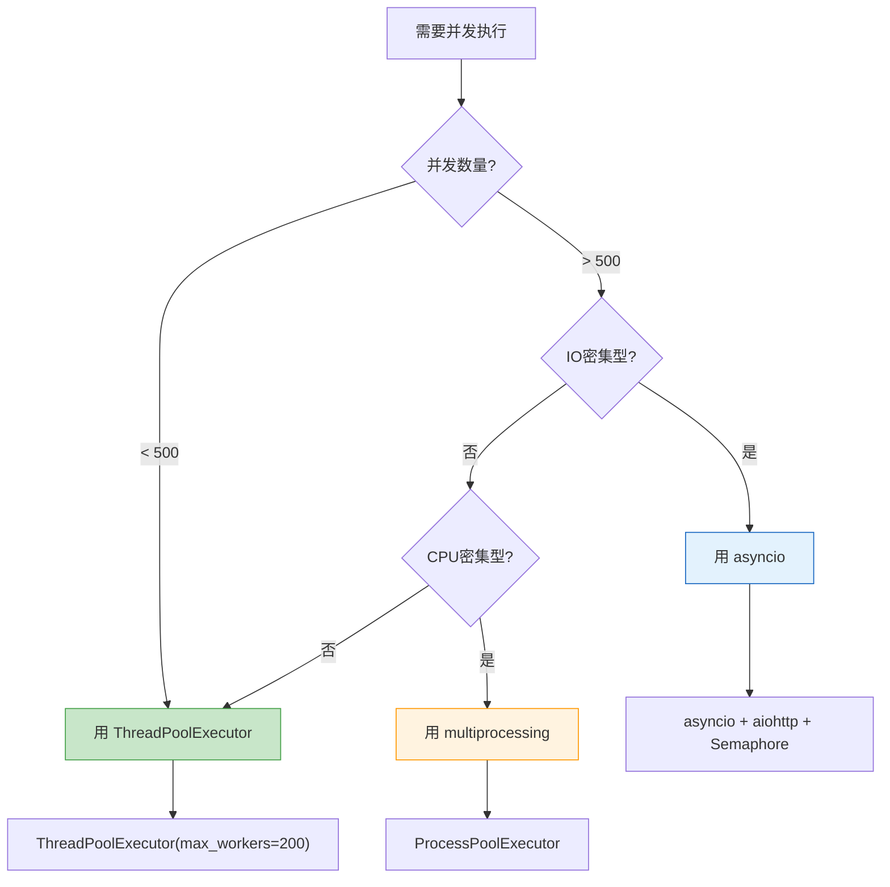
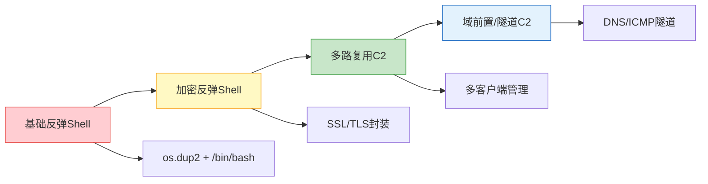
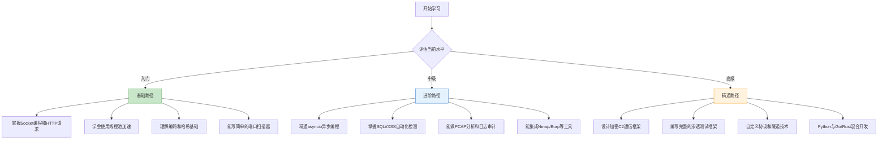

## 8. 关键技巧总结

本节是对前面七个核心技巧模块的系统性回顾与提炼。不是简单重复，而是从更高维度审视每个技术领域的核心逻辑、关键决策点和实战要点，帮助你建立完整的知识框架，在面对真实安全任务时能够快速调用正确的工具和方法。

### 8.1 七大核心技巧全景图

```mermaid
graph TD
    ROOT[Python安全编程核心技巧] --> NET[网络编程]
    ROOT --> CONC[并发编程]
    ROOT --> CRYPTO[加密编码]
    ROOT --> WEB[Web安全]
    ROOT --> DATA[数据处理]
    ROOT --> TOOL[工具集成]
    ROOT --> C2[反弹Shell与C2]

    NET --> NET1[Socket基础]
    NET --> NET2[HTTP请求]
    NET --> NET3[DNS枚举]

    CONC --> CONC1[线程池]
    CONC --> CONC2[异步IO]

    CRYPTO --> CRYPTO1[编码转换]
    CRYPTO --> CRYPTO2[哈希运算]
    CRYPTO --> CRYPTO3[对称/非对称加密]

    WEB --> WEB1[SQL注入检测]
    WEB --> WEB2[XSS检测]
    WEB --> WEB3[目录枚举]

    DATA --> DATA1[日志分析]
    DATA --> DATA2[PCAP解析]
    DATA --> DATA3[正则提取]

    TOOL --> TOOL1[Nmap集成]
    TOOL --> TOOL2[Burp集成]
    TOOL --> TOOL3[脚本封装]

    C2 --> C21[正向/反向Shell]
    C2 --> C22[加密通信]
    C2 --> C23[C2框架设计]

    style ROOT fill:#e3f2fd,stroke:#1565c0
    style NET fill:#fff3e0,stroke:#ff9800
    style CONC fill:#fff3e0,stroke:#ff9800
    style CRYPTO fill:#fff3e0,stroke:#ff9800
    style WEB fill:#fff3e0,stroke:#ff9800
    style DATA fill:#fff3e0,stroke:#ff9800
    style TOOL fill:#fff3e0,stroke:#ff9800
    style C2 fill:#fff3e0,stroke:#ff9800
```



### 8.2 各技巧领域速查总表

| 技巧类别 | 核心知识点 | 关键库/模块 | 典型应用场景 | 难度等级 |
|---------|-----------|------------|-------------|---------|
| 网络编程 | Socket连接、HTTP请求、DNS查询 | `socket`, `requests`, `dnspython` | 端口扫描、Web探测、子域名枚举 | ⭐⭐ |
| 并发编程 | ThreadPoolExecutor、asyncio事件循环 | `threading`, `asyncio`, `aiohttp` | 高速端口扫描、批量Web请求 | ⭐⭐⭐ |
| 加密编码 | Base64/Hex编码、AES/RSA加密、哈希碰撞 | `hashlib`, `base64`, `cryptography` | 密码破解、数据加密传输、Payload编码 | ⭐⭐⭐ |
| Web安全 | SQLi/XSS检测、目录枚举 | `requests`, `BeautifulSoup`, `re` | 漏洞扫描、安全测试、信息收集 | ⭐⭐⭐ |
| 数据处理 | 正则匹配、结构化解析、统计分析 | `re`, `scapy`, `pandas`, `collections` | 日志审计、流量分析、情报提取 | ⭐⭐ |
| 工具集成 | Nmap/Burp API调用、结果解析 | `python-nmap`, `requests` | 自动化扫描流水线、工具链编排 | ⭐⭐ |
| 反弹Shell | Socket重定向、SSL加密、进程管理 | `socket`, `subprocess`, `ssl`, `os` | 远程控制、渗透后维持访问 | ⭐⭐⭐⭐ |

### 8.3 网络编程核心回顾

#### 8.3.1 三种扫描方式的选型决策

网络编程是安全工具开发的基石。核心技巧模块介绍了三种端口扫描实现，每种适用于不同场景：

| 扫描方式 | 原理 | 优势 | 劣势 | 适用场景 |
|---------|------|------|------|---------|
| TCP Connect扫描 | 完整三次握手 | 无需root权限，实现简单 | 容易被IDS检测，速度较慢 | 快速验证、教学演示 |
| 多线程TCP扫描 | Connect+线程池并发 | 速度显著提升，逻辑清晰 | 线程数受限，资源消耗大 | 中等规模扫描（1-65535端口） |
| SYN半开扫描 | 只发SYN，不完成握手 | 隐蔽性强，速度快 | 需要root权限，需要Scapy | 隐蔽渗透测试、红队操作 |

**关键代码模式——Socket扫描的三层封装：**

```python
# 第一层：单端口探测（原子操作）
def probe_port(host, port, timeout=1):
    """返回 (port, is_open, banner) 元组"""
    try:
        sock = socket.socket(socket.AF_INET, socket.SOCK_STREAM)
        sock.settimeout(timeout)
        if sock.connect_ex((host, port)) == 0:
            try:
                banner = sock.recv(1024).decode(errors='ignore').strip()
            except:
                banner = ''
            sock.close()
            return (port, True, banner)
        sock.close()
    except:
        pass
    return (port, False, '')

# 第二层：并发控制（线程池或异步）
from concurrent.futures import ThreadPoolExecutor, as_completed
def scan_ports(host, ports, max_workers=200):
    with ThreadPoolExecutor(max_workers=max_workers) as pool:
        futures = {pool.submit(probe_port, host, p): p for p in ports}
        for f in as_completed(futures):
            port, is_open, banner = f.result()
            if is_open:
                yield {'port': port, 'banner': banner}

# 第三层：结果输出与报告
import json
def scan_report(host, ports):
    results = list(scan_ports(host, ports))
    print(json.dumps(results, indent=2))
    return results
```

#### 8.3.2 HTTP请求的关键配置

渗透测试中的HTTP请求与正常开发不同，需要特别关注：

- **代理支持**：所有请求必须支持代理切换（Burp Suite拦截）
- **SSL证书处理**：目标站点常有自签名证书，需要`verify=False`
- **重试机制**：目标服务器不稳定时，自动重试避免漏报
- **超时控制**：合理设置超时，避免单个请求阻塞整个扫描
- **User-Agent伪装**：避免被WAF识别为自动化工具

```python
# 渗透测试专用Session模板
def pentest_session(proxy=None):
    session = requests.Session()
    session.verify = False  # 忽略SSL证书
    session.headers.update({
        'User-Agent': 'Mozilla/5.0 (Windows NT 10.0; Win64; x64) '
                       'AppleWebKit/537.36 Chrome/120.0.0.0 Safari/537.36'
    })
    if proxy:
        session.proxies = {'http': proxy, 'https': proxy}
    # 自动重试
    adapter = HTTPAdapter(max_retries=Retry(total=3, backoff_factor=0.5))
    session.mount('http://', adapter)
    session.mount('https://', adapter)
    return session
```

#### 8.3.3 DNS枚举的完整信息收集

DNS不仅是解析IP的工具，更是信息收集的重要来源。关键技巧模块介绍的`dnspython`库可以查询A、AAAA、MX、NS、TXT、SOA、CNAME等全部记录类型，配合子域名暴力枚举可以构建完整的攻击面地图。

### 8.4 并发编程核心回顾

#### 8.4.1 线程池 vs 异步IO的选型

这是安全脚本开发中最常遇到的性能决策点：

| 维度 | ThreadPoolExecutor | asyncio |
|------|-------------------|---------|
| 编程模型 | 同步风格，学习成本低 | 异步风格，需要理解事件循环 |
| 并发上限 | 受线程数限制（默认几百） | 可达数千甚至数万并发 |
| 适用任务 | IO密集型（网络请求、端口扫描） | 超大规模并发（万级连接） |
| 调试难度 | 常规调试，堆栈清晰 | 异步堆栈难追踪，调试复杂 |
| 第三方库兼容 | 几乎所有库都支持 | 需要`aiohttp`等异步库 |
| 推荐场景 | 常规渗透测试脚本 | 大规模资产扫描、高并发探测 |

**决策流程：**



#### 8.4.2 并发安全的关键陷阱

```python
# 错误：多线程写入共享列表不加锁
results = []
def scan(port):
    if is_open(port):
        results.append(port)  # 线程不安全！可能导致数据丢失

# 正确：使用锁保护共享数据
import threading
lock = threading.Lock()
results = []
def scan_safe(port):
    if is_open(port):
        with lock:
            results.append(port)  # 线程安全

# 更好：使用队列（生产者-消费者模式）
import queue
q = queue.Queue()
def producer(port):
    if is_open(port):
        q.put(port)
def consumer():
    while True:
        port = q.get()
        if port is None:
            break
        process(port)
        q.task_done()
```

### 8.5 加密编码核心回顾

#### 8.5.1 编码技术在安全中的三大用途

| 用途 | 技术 | 典型场景 |
|------|------|---------|
| 数据混淆 | Base64、URL编码、Hex编码 | 绕过WAF规则、Payload编码、数据传输 |
| 完整性校验 | MD5、SHA256、HMAC | 文件校验、密码存储、API签名 |
| 通信加密 | AES对称加密、RSA非对称加密 | 加密C2通信、安全数据传输、密钥交换 |

#### 8.5.2 哈希破解的核心模式

哈希破解是安全测试中的常见任务。核心技巧模块展示的模式可以扩展为完整的破解工具：

```python
import hashlib
import itertools
import string

def dictionary_attack(hash_value, wordlist_file, hash_type='md5'):
    """字典攻击——从文件逐行读取"""
    target = hash_value.lower()
    with open(wordlist_file) as f:
        for line in f:
            word = line.strip()
            if hashlib.new(hash_type, word.encode()).hexdigest() == target:
                return word
    return None

def brute_force_attack(hash_value, charset=None, max_length=6, hash_type='md5'):
    """暴力枚举——按长度递增尝试"""
    if charset is None:
        charset = string.ascii_lowercase + string.digits
    target = hash_value.lower()
    for length in range(1, max_length + 1):
        for combo in itertools.product(charset, repeat=length):
            word = ''.join(combo)
            if hashlib.new(hash_type, word.encode()).hexdigest() == target:
                return word
    return None

def hash_type_detect(hash_value):
    """根据长度推断哈希类型"""
    length = len(hash_value)
    mapping = {32: 'md5', 40: 'sha1', 64: 'sha256', 128: 'sha512'}
    return mapping.get(length, 'unknown')
```

#### 8.5.3 加密方案选型

| 需求 | 推荐方案 | Python实现 |
|------|---------|-----------|
| 简单数据加密 | Fernet（对称加密） | `cryptography.fernet.Fernet` |
| 高强度加密 | AES-256-GCM | `cryptography.hazmat.primitives.ciphers` |
| 密钥交换 | RSA-2048 + AES混合加密 | `cryptography.hazmat.primitives.asymmetric` |
| 密码哈希 | bcrypt 或 argon2 | `bcrypt` / `argon2-cffi` |
| 消息认证 | HMAC-SHA256 | `hmac` + `hashlib` |

### 8.6 Web安全核心回顾

#### 8.6.1 SQL注入检测的三层策略

SQL注入检测不能只靠一种方法。完整策略包含三层：

| 检测层 | 方法 | 原理 | 可靠性 |
|-------|------|------|-------|
| 第一层：错误检测 | 发送特殊字符（`'`, `"`），观察响应 | 数据库报错信息泄露 | 高（有报错时） |
| 第二层：布尔盲注 | 发送`AND 1=1`和`AND 1=2`，对比响应差异 | 真假条件导致页面不同 | 中等 |
| 第三层：时间盲注 | 发送`SLEEP(5)`，测量响应延迟 | 无回显时通过时间差判断 | 中等 |

```python
def sql_injection_comprehensive(url, param):
    """三层SQL注入检测"""
    session = pentest_session()
    baseline = session.get(url, params={param: '1'}).elapsed.total_seconds()
    results = []

    # 第一层：错误检测
    for payload in ["'", '"', "' OR '1'='1", "' AND 1=1--"]:
        resp = session.get(url, params={param: payload})
        if any(err in resp.text.lower() for err in ['sql', 'mysql', 'syntax', 'error', 'exception']):
            results.append({'layer': 'error', 'payload': payload, 'confidence': 'high'})

    # 第二层：布尔盲注
    true_resp = session.get(url, params={param: "1 AND 1=1"})
    false_resp = session.get(url, params={param: "1 AND 1=2"})
    if len(true_resp.text) != len(false_resp.text):
        results.append({'layer': 'boolean', 'confidence': 'medium'})

    # 第三层：时间盲注
    time_resp = session.get(url, params={param: "1 AND SLEEP(3)"}, timeout=10)
    if time_resp.elapsed.total_seconds() > baseline + 2:
        results.append({'layer': 'time-based', 'confidence': 'medium'})

    return results
```

#### 8.6.2 XSS检测的关键判断

反射型XSS检测的核心不是发送Payload，而是判断Payload是否**原样出现在响应中**且**未被编码**：

```python
def xss_detect_refined(url, param):
    """改进版XSS检测——区分反射与真正可利用"""
    payloads = [
        ('<script>alert(1)</script>', 'basic'),
        ('"><script>alert(1)</script>', 'attribute-escape'),
        ("'-alert(1)-'", 'js-context'),
        ('', 'html-attribute'),
        ('javascript:alert(1)', 'href-context'),
    ]

    session = pentest_session()
    findings = []

    for payload, context in payloads:
        resp = session.get(url, params={param: payload})
        # 关键：检查Payload是否原样出现（未被HTML编码）
        if payload in resp.text:
            # 进一步检查：是否在可执行上下文中
            idx = resp.text.find(payload)
            surrounding = resp.text[max(0,idx-50):idx+len(payload)+50]
            findings.append({
                'payload': payload,
                'context': context,
                'surrounding': surrounding,
                'exploitable': True
            })
        elif payload.replace('<', '&lt;') in resp.text:
            findings.append({
                'payload': payload,
                'context': context,
                'note': 'Payload被HTML编码，不可利用',
                'exploitable': False
            })

    return findings
```

### 8.7 数据处理核心回顾

#### 8.7.1 安全数据分析的常用模式

数据处理能力决定了安全工程师从海量信息中提取情报的效率。核心技巧模块涵盖的三种分析场景：

| 场景 | 数据源 | 核心工具 | 输出 |
|------|--------|---------|------|
| 日志分析 | Web访问日志、系统日志、应用日志 | `re`正则 + `collections.Counter` | 可疑IP、异常请求、攻击特征 |
| 流量分析 | PCAP抓包文件 | `scapy` | 通信关系、DNS查询、协议分布 |
| 文本提取 | 配置文件、源代码、扫描报告 | `re`正则 + 字符串处理 | 凭据、URL、API Key等敏感信息 |

#### 8.7.2 日志分析的进阶模式

基础的IP计数只是起点。真正的安全分析需要时间维度和行为模式：

```python
from collections import defaultdict, Counter
from datetime import datetime, timedelta
import re

def advanced_log_analysis(logfile):
    """进阶日志分析——时间序列 + 行为模式"""
    ip_timeline = defaultdict(list)  # IP -> [timestamp, ...]
    ua_counter = Counter()           # User-Agent统计
    attack_patterns = Counter()      # 攻击特征统计

    attack_signatures = {
        'sql_injection': re.compile(r"(union\s+select|or\s+1=1|'\s*--)", re.I),
        'xss': re.compile(r"(<script|onerror=|onload=|javascript:)", re.I),
        'path_traversal': re.compile(r"(\.\.\/|\.\.\\)", re.I),
        'command_injection': re.compile(r"(;\s*ls|;\s*cat|&&|\|\|)", re.I),
    }

    pattern = re.compile(
        r'(\d+\.\d+\.\d+\.\d+).*?\[(.*?)\].*?"(.*?)"\s+\d+\s+\d+\s+"(.*?)"'
    )

    with open(logfile) as f:
        for line in f:
            m = pattern.match(line)
            if not m:
                continue
            ip, timestamp, request, ua = m.groups()
            ip_timeline[ip].append(timestamp)
            ua_counter[ua] += 1

            # 检测攻击特征
            for attack_name, sig in attack_signatures.items():
                if sig.search(request):
                    attack_patterns[attack_name] += 1

    # 识别短时间高频IP（潜在扫描器）
    suspicious = {}
    for ip, times in ip_timeline.items():
        if len(times) > 50:  # 超过50次请求标记
            suspicious[ip] = len(times)

    return {
        'suspicious_ips': suspicious,
        'attack_patterns': dict(attack_patterns),
        'top_uas': ua_counter.most_common(10)
    }
```

### 8.8 工具集成核心回顾

#### 8.8.1 集成策略的选型

| 集成方式 | 适用场景 | 优势 | 实现方式 |
|---------|---------|------|---------|
| Python库直接调用 | Nmap、Scapy等有Python绑定的工具 | 最紧密，可编程控制 | `import nmap` / `import scapy` |
| REST API交互 | Burp Suite、Nessus等提供API的工具 | 标准化，支持远程调用 | `requests` + JSON解析 |
| 命令行封装 | 任意CLI工具 | 通用性最强，无需额外依赖 | `subprocess.run()` + 参数构造 |
| 进程管道 | 需要实时交互的工具 | 双向通信，实时性好 | `subprocess.Popen()` + stdin/stdout |

```python
# 命令行封装的通用模式
import subprocess
import json

def run_tool(cmd, timeout=300):
    """通用工具调用封装"""
    try:
        result = subprocess.run(
            cmd, capture_output=True, text=True, timeout=timeout
        )
        return {
            'stdout': result.stdout,
            'stderr': result.stderr,
            'returncode': result.returncode,
            'success': result.returncode == 0
        }
    except subprocess.TimeoutExpired:
        return {'error': 'timeout', 'timeout': timeout}
    except FileNotFoundError:
        return {'error': 'tool_not_found', 'cmd': cmd[0]}

# 示例：调用各种安全工具
# nmap_result = run_tool(['nmap', '-sV', '-p', '1-1000', '192.168.1.1'])
# nikto_result = run_tool(['nikto', '-h', 'http://target.com'])
# sqlmap_result = run_tool(['sqlmap', '-u', 'http://target.com/?id=1', '--batch'])
```

### 8.9 反弹Shell与C2核心回顾

#### 8.9.1 反弹Shell技术演进



| 阶段 | 技术 | 隐蔽性 | 复杂度 | 典型用途 |
|------|------|--------|--------|---------|
| 基础Shell | Socket + dup2 | 低 | ⭐ | 快速验证漏洞、CTF |
| 加密Shell | SSL/TLS封装 | 中 | ⭐⭐ | 绕过流量检测、实际渗透 |
| 多路C2 | 多客户端 + 心跳 | 高 | ⭐⭐⭐ | 红队行动、持久化 |
| 隧道C2 | DNS/ICMP/HTTP隧道 | 极高 | ⭐⭐⭐⭐ | 高对抗环境、APT模拟 |

#### 8.9.2 C2通信的安全编码要点

```python
import socket
import ssl
import struct
import json
import os

class EncryptedC2:
    """加密C2通信框架的核心结构"""

    def __init__(self, host, port, shared_key):
        self.host = host
        self.port = port
        self.shared_key = shared_key
        self.sock = None

    def connect(self):
        """建立加密连接"""
        raw = socket.socket(socket.AF_INET, socket.SOCK_STREAM)
        ctx = ssl.create_default_context()
        ctx.check_hostname = False
        ctx.verify_mode = ssl.CERT_NONE
        self.sock = ctx.wrap_socket(raw, server_hostname=self.host)
        self.sock.connect((self.host, self.port))

    def send_msg(self, msg_dict):
        """发送带长度前缀的消息（解决TCP粘包问题）"""
        data = json.dumps(msg_dict).encode()
        header = struct.pack('!I', len(data))
        self.sock.sendall(header + data)

    def recv_msg(self):
        """接收带长度前缀的消息"""
        header = self._recv_exact(4)
        if not header:
            return None
        length = struct.unpack('!I', header)[0]
        data = self._recv_exact(length)
        return json.loads(data.decode()) if data else None

    def _recv_exact(self, n):
        """精确接收n个字节"""
        buf = bytearray()
        while len(buf) < n:
            chunk = self.sock.recv(n - len(buf))
            if not chunk:
                return None
            buf.extend(chunk)
        return bytes(buf)
```

### 8.10 跨领域关键技能矩阵

安全脚本开发不是孤立使用某个模块，而是将多个模块组合成完整的工具链。以下是跨领域的关键组合：

| 工具链 | 组合模块 | 典型场景 |
|-------|---------|---------|
| 自动化扫描器 | 网络编程 + 并发 + 工具集成 | 批量资产扫描、漏洞普查 |
| 密码破解器 | 加密编码 + 并发 + 数据处理 | 字典攻击、哈希碰撞、在线爆破 |
| Web漏洞扫描器 | Web安全 + 网络编程 + 并发 | SQLi/XSS/目录遍历自动检测 |
| 流量分析平台 | 数据处理 + 加密编码 + 网络 | 协议分析、威胁情报提取 |
| 渗透测试框架 | 全部七个模块 | 红队自动化工具、CTF框架 |

### 8.11 核心代码模式速查

以下是贯穿整个核心技巧模块的高频代码模式，可以在任何安全脚本中直接复用：

#### 模式一：安全的异常处理模板

```python
import logging
logging.basicConfig(level=logging.INFO, format='%(asctime)s [%(levelname)s] %(message)s')
logger = logging.getLogger(__name__)

def safe_execute(func, *args, **kwargs):
    """通用异常处理包装器"""
    try:
        return func(*args, **kwargs)
    except KeyboardInterrupt:
        logger.info("用户中断，正在清理...")
        raise
    except ConnectionRefusedError as e:
        logger.warning(f"连接被拒绝: {e}")
    except socket.timeout as e:
        logger.debug(f"连接超时: {e}")
    except Exception as e:
        logger.error(f"未预期的错误: {type(e).__name__}: {e}")
    return None
```

#### 模式二：命令行参数解析模板

```python
import argparse

def build_parser():
    """标准安全工具命令行参数"""
    parser = argparse.ArgumentParser(description='安全工具模板')
    parser.add_argument('-t', '--target', required=True, help='目标地址')
    parser.add_argument('-p', '--ports', default='1-1024', help='端口范围')
    parser.add_argument('-T', '--threads', type=int, default=100, help='并发线程数')
    parser.add_argument('--proxy', help='代理地址 (http://127.0.0.1:8080)')
    parser.add_argument('-o', '--output', help='输出文件路径')
    parser.add_argument('-v', '--verbose', action='store_true', help='详细输出')
    return parser
```

#### 模式三：进度条与实时输出

```python
from concurrent.futures import ThreadPoolExecutor, as_completed
import sys

def scan_with_progress(host, ports, max_workers=200):
    """带进度条的扫描"""
    total = len(ports)
    completed = 0
    found = []

    with ThreadPoolExecutor(max_workers=max_workers) as pool:
        futures = {pool.submit(probe_port, host, p): p for p in ports}
        for f in as_completed(futures):
            completed += 1
            port, is_open, banner = f.result()
            # 进度条
            pct = completed * 100 // total
            bar = '█' * (pct // 2) + '░' * (50 - pct // 2)
            sys.stdout.write(f'\r[{bar}] {pct}% ({completed}/{total})')
            sys.stdout.flush()
            if is_open:
                found.append({'port': port, 'banner': banner})

    print()  # 换行
    return found
```

#### 模式四：输出格式化

```python
import json
import csv

def output_results(results, fmt='json', filename=None):
    """多格式输出"""
    if fmt == 'json':
        output = json.dumps(results, indent=2, ensure_ascii=False)
    elif fmt == 'csv':
        import io
        buf = io.StringIO()
        if results:
            writer = csv.DictWriter(buf, fieldnames=results[0].keys())
            writer.writeheader()
            writer.writerows(results)
        output = buf.getvalue()
    elif fmt == 'table':
        if results:
            headers = results[0].keys()
            widths = {h: max(len(h), max(len(str(r.get(h, ''))) for r in results)) for h in headers}
            header_line = ' | '.join(h.ljust(widths[h]) for h in headers)
            separator = '-+-'.join('-' * widths[h] for h in headers)
            rows = [' | '.join(str(r.get(h, '')).ljust(widths[h]) for h in headers) for r in results]
            output = '\n'.join([header_line, separator] + rows)
        else:
            output = '(无结果)'
    else:
        output = str(results)

    if filename:
        with open(filename, 'w') as f:
            f.write(output)
        print(f"[*] 结果已保存到 {filename}")
    else:
        print(output)
```

### 8.12 常见陷阱与避坑指南

在使用这些核心技巧时，以下是最容易犯的错误：

| 陷阱 | 错误表现 | 正确做法 |
|------|---------|---------|
| 忘记设置超时 | Socket连接永久挂起 | 所有网络操作必须设`timeout` |
| 裸`except`吞掉异常 | 出错无任何提示，调试困难 | 捕获具体异常，记录日志 |
| 线程不安全的共享变量 | 结果丢失、数据不一致 | 使用`Lock`或`Queue` |
| SSL证书验证关闭未恢复 | 生产环境安全风险 | 仅在渗透测试时关闭，标注注释 |
| 硬编码IP和端口 | 每次使用都要改代码 | 使用`argparse`参数化 |
| 未清理临时文件/连接 | 资源泄露 | 使用`with`语句和`try/finally` |
| 输出结果不可读 | 长文本刷屏 | 格式化输出（JSON/CSV/表格） |
| 忽略编码问题 | 中文乱码、Binary读取崩溃 | 统一`encoding='utf-8'`，`errors='ignore'` |
| 异步代码混用同步IO | asyncio事件循环阻塞 | 使用`aiohttp`替代`requests` |
| 密钥硬编码在脚本中 | 密钥泄露到版本控制 | 环境变量或配置文件，加入`.gitignore` |

### 8.13 安全脚本开发检查清单

在发布或使用任何安全脚本前，逐项检查：

```markdown
## 安全脚本发布前检查清单

### 功能完整性
- [ ] 所有输入参数都有默认值和验证
- [ ] 支持代理配置（--proxy）
- [ ] 支持输出文件（--output）
- [ ] 支持详细/安静模式（-v / -q）
- [ ] 有进度显示（大规模任务）

### 健壮性
- [ ] 所有网络操作有超时设置
- [ ] 异常被正确捕获和记录
- [ ] 共享资源有锁保护
- [ ] 使用`with`语句管理资源
- [ ] 支持Ctrl+C优雅退出

### 安全性
- [ ] 不硬编码密钥/凭据
- [ ] 输入经过验证和过滤
- [ ] 不执行未经验证的外部输入
- [ ] 日志不记录敏感信息
- [ ] 临时文件使用后清理

### 可维护性
- [ ] 代码有函数级注释
- [ ] 日志级别合理（DEBUG/INFO/WARNING/ERROR）
- [ ] 输出格式可选（JSON/CSV/文本）
- [ ] 有基本的错误恢复机制
```

### 8.14 学习路径推荐

根据你的当前水平，选择对应的学习路径：



| 路径 | 预计时间 | 核心目标 | 实战项目 |
|------|---------|---------|---------|
| 入门路径 | 2-4周 | 掌握网络编程+基础并发+编码 | TCP端口扫描器、子域名枚举器 |
| 进阶路径 | 1-2月 | 异步编程+Web安全+数据分析 | Web漏洞扫描器、日志分析平台 |
| 精通路径 | 2-3月 | C2框架+工具链+底层协议 | 自定义渗透框架、加密C2系统 |

### 8.15 推荐资源

| 类型 | 资源 | 说明 |
|------|------|------|
| 官方文档 | [Python Socket编程指南](https://docs.python.org/3/howto/sockets.html) | 理解Socket底层原理 |
| 官方文档 | [asyncio开发者文档](https://docs.python.org/3/library/asyncio.html) | 异步编程权威参考 |
| 书籍 | 《Black Hat Python》第2版 | Python安全编程经典 |
| 书籍 | 《Violent Python》 | 渗透测试Python实战 |
| 书籍 | 《Python黑魔法手册》 | Python高级技巧 |
| 库文档 | [cryptography](https://cryptography.io/) | 加密算法库官方文档 |
| 库文档 | [Scapy](https://scapy.readthedocs.io/) | 网络包处理库 |
| 开源项目 | [Pwntools](https://github.com/Gallopsled/pwntools) | CTF/漏洞利用工具集 |
| 开源项目 | [Impacket](https://github.com/fortra/impacket) | Windows协议攻击库 |
| 练习平台 | [Hack The Box](https://www.hackthebox.com/) | 实战渗透测试环境 |
| 练习平台 | [TryHackMe](https://tryhackme.com/) | 引导式安全学习 |
