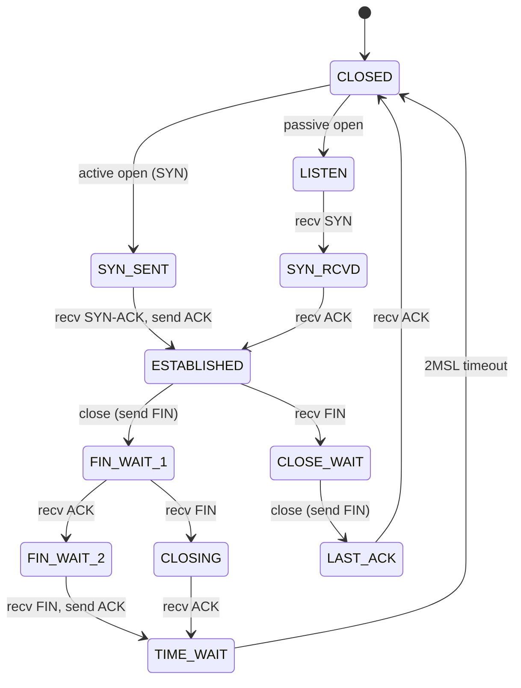

## 三、网络编程基础

网络编程是安全从业者的核心技能。无论是编写扫描器、构建 C2 通信、开发漏洞利用工具，还是进行流量分析，都需要扎实的网络编程功底。本章从协议原理出发，覆盖 Socket、HTTP、DNS 三大核心领域，兼顾攻防两端的实际需求。

### 3.1 网络协议基础

在写代码之前，必须理解底层协议模型。安全工具的编写质量直接取决于对协议细节的掌握程度——多理解一个字段，就多一种攻击面。

#### 3.1.1 OSI 七层模型与 TCP/IP 四层模型

| OSI 层级 | 功能 | TCP/IP 对应 | 典型协议 | 安全关注点 |
|---------|------|------------|---------|-----------|
| 应用层 | 应用数据 | 应用层 | HTTP/DNS/SMTP/SSH | 注入、认证绕过、逻辑漏洞 |
| 表示层 | 数据格式 | 应用层 | SSL/TLS/XDR | 加密弱点、编解码漏洞 |
| 会话层 | 会话管理 | 应用层 | NetBIOS/RPC | 会话劫持、重放攻击 |
| 传输层 | 端到端传输 | 传输层 | TCP/UDP | 端口扫描、SYN Flood |
| 网络层 | 路由寻址 | 网络层 | IP/ICMP/ARP | IP欺骗、ARP投毒 |
| 数据链路层 | 帧传输 | 链路层 | Ethernet/WiFi | MAC欺骗、中间人 |
| 物理层 | 比特传输 | 链路层 | 光纤/铜缆 | 物理窃听 |

对于安全工具编写，最常打交道的是**应用层**（协议解析与构造）和**传输层**（Socket 通信）。

#### 3.1.2 TCP 三次握手与四次挥手

理解 TCP 状态机是编写扫描器和嗅探器的基础：

```text
三次握手（建立连接）：
Client → SYN(seq=x) → Server
Client ← SYN-ACK(seq=y, ack=x+1) ← Server
Client → ACK(ack=y+1) → Server

四次挥手（断开连接）：
Client → FIN(seq=u) → Server
Client ← ACK(ack=u+1) ← Server
Client ← FIN(seq=w) ← Server
Client → ACK(ack=w+1) → Server
```

**状态转换图**（关键状态）：



**安全意义**：不同端口状态（open/closed/filtered）对应不同的 TCP 响应，这是 Nmap 等扫描工具的理论基础。详见 3.2.2 节。

### 3.2 Socket 编程

Socket（套接字）是操作系统提供的网络通信抽象，是所有网络工具的基石。Python 的 `socket` 模块对 BSD Socket API 进行了封装，提供了跨平台的网络编程接口。

#### 3.2.1 Socket 基础

**Socket 类型与协议族**：

```python
import socket

# ===== 协议族 =====
# AF_INET  - IPv4（最常用）
# AF_INET6 - IPv6
# AF_UNIX  - Unix 域套接字（本机进程间通信，不走网络栈）

# ===== Socket 类型 =====
# SOCK_STREAM - TCP（可靠、有序、面向连接）
# SOCK_DGRAM  - UDP（无连接、不保证送达）
# SOCK_RAW    - 原始套接字（直接操作 IP 层，需 root 权限）

# TCP Socket
tcp_sock = socket.socket(socket.AF_INET, socket.SOCK_STREAM)

# UDP Socket
udp_sock = socket.socket(socket.AF_INET, socket.SOCK_DGRAM)

# 原始 Socket —— 可自定义 IP 头，用于构造任意协议包
raw_sock = socket.socket(socket.AF_INET, socket.SOCK_RAW, socket.IPPROTO_TCP)

# IPv6 TCP Socket
tcp6_sock = socket.socket(socket.AF_INET6, socket.SOCK_STREAM)

# Unix 域套接字 —— 本机 IPC，性能远高于 TCP loopback
unix_sock = socket.socket(socket.AF_UNIX, socket.SOCK_STREAM)
```

**Socket 选项**——这些选项直接影响工具的行为和性能：

```python
# SO_REUSEADDR：允许重用 TIME_WAIT 状态的地址
# 场景：扫描器快速重建连接、服务器快速重启
sock.setsockopt(socket.SOL_SOCKET, socket.SO_REUSEADDR, 1)

# SO_REUSEPORT：允许多个进程绑定同一端口（Linux 3.9+）
# 场景：高性能扫描器多进程分发
sock.setsockopt(socket.SOL_SOCKET, socket.SO_REUSEPORT, 1)

# SO_KEEPALIVE：TCP 保活探测
# 场景：长连接 C2 通信检测连接存活
sock.setsockopt(socket.SOL_SOCKET, socket.SO_KEEPALIVE, 1)

# TCP_NODELAY：禁用 Nagle 算法，立即发送小包
# 场景：交互式 Shell、实时流量转发
sock.setsockopt(socket.IPPROTO_TCP, socket.TCP_NODELAY, 1)

# SO_RCVBUF / SO_SNDBUF：调整收发缓冲区大小
# 场景：大流量数据传输、高速扫描
sock.setsockopt(socket.SOL_SOCKET, socket.SO_RCVBUF, 1048576)
sock.setsockopt(socket.SOL_SOCKET, socket.SO_SNDBUF, 1048576)
```

**完整的 TCP Server 模板**：

```python
import socket
import threading

def handle_client(client_sock, addr):
    """处理单个客户端连接"""
    print(f"[+] 新连接: {addr}")
    try:
        client_sock.settimeout(30)
        while True:
            data = client_sock.recv(4096)
            if not data:
                break
            # 处理数据...
            client_sock.send(b"ACK: " + data)
    except socket.timeout:
        print(f"[-] 连接超时: {addr}")
    except ConnectionResetError:
        print(f"[-] 连接被重置: {addr}")
    finally:
        client_sock.close()
        print(f"[*] 连接关闭: {addr}")

def start_server(host='0.0.0.0', port=8080):
    server = socket.socket(socket.AF_INET, socket.SOCK_STREAM)
    server.setsockopt(socket.SOL_SOCKET, socket.SO_REUSEADDR, 1)
    server.bind((host, port))
    server.listen(128)
    print(f"[*] 监听 {host}:{port}")

    try:
        while True:
            client_sock, addr = server.accept()
            t = threading.Thread(target=handle_client, args=(client_sock, addr))
            t.daemon = True
            t.start()
    except KeyboardInterrupt:
        print("\n[*] 服务器关闭")
    finally:
        server.close()
```

**完整的 TCP Client 模板**：

```python
import socket

def tcp_client(host, port, data, timeout=5):
    sock = socket.socket(socket.AF_INET, socket.SOCK_STREAM)
    sock.settimeout(timeout)
    try:
        sock.connect((host, port))
        sock.sendall(data)
        # 接收完整响应
        response = b""
        while True:
            chunk = sock.recv(4096)
            if not chunk:
                break
            response += chunk
        return response
    except socket.timeout:
        print(f"[-] 连接超时: {host}:{port}")
        return None
    except ConnectionRefusedError:
        print(f"[-] 连接被拒绝: {host}:{port}")
        return None
    finally:
        sock.close()
```

#### 3.2.2 非阻塞 I/O 与多路复用

阻塞式 Socket 在高并发场景下效率低下——每个连接需要一个线程，1000 个并发连接就需要 1000 个线程。Python 提供了三种多路复用方案：

**方案一：select（跨平台，性能一般）**：

```python
import select
import socket

def select_server(host='0.0.0.0', port=8080):
    server = socket.socket(socket.AF_INET, socket.SOCK_STREAM)
    server.setsockopt(socket.SOL_SOCKET, socket.SO_REUSEADDR, 1)
    server.setblocking(False)
    server.bind((host, port))
    server.listen(128)

    inputs = [server]   # 监听读事件的 socket 列表
    outputs = []         # 监听写事件的 socket 列表
    message_queues = {}  # 每个连接的待发送数据队列

    while inputs:
        # select 阻塞直到有事件就绪
        readable, writable, exceptional = select.select(inputs, outputs, inputs, 1)

        for s in readable:
            if s is server:
                # 新连接
                client, addr = s.accept()
                client.setblocking(False)
                inputs.append(client)
                message_queues[client] = []
            else:
                # 已有连接有数据可读
                data = s.recv(4096)
                if data:
                    message_queues[s].append(data)
                    if s not in outputs:
                        outputs.append(s)
                else:
                    # 连接关闭
                    if s in outputs:
                        outputs.remove(s)
                    inputs.remove(s)
                    s.close()
                    del message_queues[s]

        for s in writable:
            if message_queues[s]:
                data = message_queues[s].pop(0)
                s.send(data)
            else:
                outputs.remove(s)

        for s in exceptional:
            inputs.remove(s)
            if s in outputs:
                outputs.remove(s)
            s.close()
            del message_queues[s]
```

> **注意**：`select` 在 Linux 上默认最多监听 1024 个文件描述符，高并发场景应使用 `selectors` 模块或 `epoll`。

**方案二：selectors 模块（Python 3.4+ 推荐）**：

```python
import selectors
import socket

sel = selectors.DefaultSelector()  # Linux 自动选择 epoll，macOS 选择 kqueue

def accept(sock, mask):
    client, addr = sock.accept()
    client.setblocking(False)
    sel.register(client, selectors.EVENT_READ, read)

def read(client, mask):
    data = client.recv(4096)
    if data:
        client.send(b"echo: " + data)
    else:
        sel.unregister(client)
        client.close()

server = socket.socket(socket.AF_INET, socket.SOCK_STREAM)
server.setsockopt(socket.SOL_SOCKET, socket.SO_REUSEADDR, 1)
server.setblocking(False)
server.bind(('0.0.0.0', 8080))
server.listen(128)
sel.register(server, selectors.EVENT_READ, accept)

while True:
    events = sel.select(timeout=1)
    for key, mask in events:
        callback = key.data
        callback(key.fileobj, mask)
```

**方案三：asyncio（协程，高并发首选）**：

```python
import asyncio

async def handle_client(reader, writer):
    addr = writer.get_extra_info('peername')
    print(f"[+] 连接来自 {addr}")

    while True:
        data = await reader.read(4096)
        if not data:
            break
        writer.write(b"ACK: " + data)
        await writer.drain()

    writer.close()
    await writer.wait_closed()
    print(f"[-] 连接关闭 {addr}")

async def main():
    server = await asyncio.start_server(handle_client, '0.0.0.0', 8080)
    print("[*] 服务器启动在 0.0.0.0:8080")
    async with server:
        await server.serve_forever()

asyncio.run(main())
```

**三种方案对比**：

| 方案 | 并发模型 | 万级连接 | 代码复杂度 | 适用场景 |
|------|---------|---------|-----------|---------|
| threading | 一连接一线程 | ❌ 内存爆炸 | 低 | 简单工具、少量连接 |
| select/epoll | 事件驱动 | ✅ 可扩展 | 中 | 自定义协议服务器 |
| selectors | 自动选择最优 | ✅ 可扩展 | 中 | 通用高并发服务器 |
| asyncio | 协程 | ✅ 最优 | 高（需 async 生态） | 高并发客户端/服务器 |

#### 3.2.3 网络扫描实现

网络扫描是安全评估的第一步。不同的扫描技术在隐蔽性、速度、信息量之间有不同的取舍。

**TCP Connect 扫描**——最简单，但会在目标日志中留下记录：

```python
import socket
from concurrent.futures import ThreadPoolExecutor, as_completed

def tcp_connect_scan(host, port, timeout=1):
    """
    TCP Connect 扫描：完成完整的三次握手。
    优点：不需要 root 权限，结果可靠。
    缺点：在目标系统留下明显日志记录。
    """
    try:
        sock = socket.socket(socket.AF_INET, socket.SOCK_STREAM)
        sock.settimeout(timeout)
        result = sock.connect_ex((host, port))
        sock.close()
        if result == 0:
            return port, "open"
        elif result == 111:  # ECONNREFUSED
            return port, "closed"
        else:
            return port, "filtered"
    except socket.timeout:
        return port, "filtered"
    except OSError:
        return port, "error"

def parallel_scan(host, ports, max_threads=200, timeout=1):
    """
    并行端口扫描器
    返回: {port: status} 字典
    """
    results = {}
    with ThreadPoolExecutor(max_workers=max_threads) as executor:
        futures = {
            executor.submit(tcp_connect_scan, host, port, timeout): port
            for port in ports
        }
        for future in as_completed(futures):
            port, status = future.result()
            results[port] = status
            if status == "open":
                print(f"  [OPEN] {host}:{port}")
    return results

# 使用示例
if __name__ == "__main__":
    target = "192.168.1.1"
    common_ports = [21, 22, 23, 25, 53, 80, 110, 135, 139, 143,
                    443, 445, 993, 995, 1433, 1521, 3306, 3389,
                    5432, 5900, 6379, 8080, 8443, 9200, 27017]
    results = parallel_scan(target, common_ports)
```

**SYN 半开扫描**——需要 root 权限，但更隐蔽：

```python
from scapy.all import *
import logging

# 抑制 Scapy 的冗余输出
logging.getLogger("scapy.runtime").setLevel(logging.ERROR)

def syn_scan(host, port, timeout=2):
    """
    SYN 半开扫描：只发送 SYN，根据响应判断端口状态。
    优点：不完成三次握手，目标日志中可能不记录。
    缺点：需要 root/管理员权限（原始套接字）。
    
    响应解读：
    - SYN-ACK (0x12) → 端口开放
    - RST (0x04) 或 RST-ACK (0x14) → 端口关闭
    - 无响应 → 端口被过滤（防火墙丢包）
    """
    ip_layer = IP(dst=host)
    tcp_layer = TCP(dport=port, flags='S', sport=RandShort())
    packet = ip_layer / tcp_layer

    response = sr1(packet, timeout=timeout, verbose=0)

    if response is None:
        return port, "filtered"  # 无响应，可能被防火墙丢弃

    if response.haslayer(TCP):
        flags = response[TCP].flags
        if flags == 0x12:  # SYN-ACK：端口开放
            # 发送 RST 关闭半开连接，避免留下连接记录
            rst = IP(dst=host) / TCP(
                dport=port,
                sport=response[TCP].dport,
                flags='R',
                seq=response[TCP].ack
            )
            send(rst, verbose=0)
            return port, "open"
        elif flags == 0x14 or flags == 0x04:  # RST-ACK 或 RST：端口关闭
            return port, "closed"

    if response.haslayer(ICMP):
        # ICMP 不可达 → 端口被过滤
        icmp_type = response[ICMP].type
        icmp_code = response[ICMP].code
        if icmp_type == 3 and icmp_code in [1, 2, 3, 9, 10, 13]:
            return port, "filtered"

    return port, "unknown"

def syn_scan_range(host, ports, delay=0):
    """
    SYN 批量扫描
    delay: 每个包之间的延迟（秒），用于降低发包速率避免触发 IDS
    """
    import time
    results = {}
    for port in ports:
        port_num, status = syn_scan(host, port)
        results[port_num] = status
        if status == "open":
            print(f"  [OPEN] {host}:{port_num}")
        if delay > 0:
            time.sleep(delay)
    return results
```

**UDP 扫描**——UDP 无连接，扫描逻辑完全不同：

```python
from scapy.all import *
import socket

def udp_scan(host, port, timeout=2):
    """
    UDP 端口扫描：
    - 发送 UDP 包到目标端口
    - 如果收到 ICMP Port Unreachable → 端口关闭
    - 如果收到应用层响应 → 端口开放
    - 如果无响应 → 端口开放|被过滤（无法确定）
    
    注意：UDP 扫描速度很慢（受限于 ICMP 速率限制），
    通常只扫描 DNS(53)、SNMP(161)、TFTP(69) 等关键端口。
    """
    # 构造探测包
    probe = IP(dst=host) / UDP(dport=port) / Raw(load=b"\x00" * 8)
    response = sr1(probe, timeout=timeout, verbose=0)

    if response is None:
        return port, "open|filtered"  # 无响应，可能是开放或被过滤

    if response.haslayer(UDP):
        return port, "open"  # 收到 UDP 响应，端口确定开放

    if response.haslayer(ICMP):
        icmp_type = response[ICMP].type
        icmp_code = response[ICMP].code
        if icmp_type == 3:  # Destination Unreachable
            if icmp_code == 3:  # Port Unreachable
                return port, "closed"
            else:
                return port, "filtered"

    return port, "unknown"
```

**服务版本探测**——开放端口后面跑的是什么服务：

```python
import socket

def grab_banner(host, port, timeout=3):
    """
    Banner 抓取：连接开放端口，读取服务主动发送的欢迎信息。
    很多服务（SSH/FTP/SMTP/POP3）会在连接时主动发送版本信息。
    """
    try:
        sock = socket.socket(socket.AF_INET, socket.SOCK_STREAM)
        sock.settimeout(timeout)
        sock.connect((host, port))

        # 部分服务（如 HTTP）需要主动发送请求才有响应
        if port in (80, 8080, 8000, 8443, 443):
            sock.send(b"HEAD / HTTP/1.1\r\nHost: " +
                      host.encode() + b"\r\n\r\n")
        elif port == 25:
            pass  # SMTP 主动发送 banner
        elif port in (21,):
            pass  # FTP 主动发送 banner

        banner = sock.recv(4096)
        sock.close()
        return banner.decode('utf-8', errors='replace').strip()
    except Exception:
        return None

def service_detection(host, ports):
    """批量服务探测"""
    results = {}
    for port in ports:
        banner = grab_banner(host, port)
        if banner:
            results[port] = banner
            print(f"  {host}:{port} -> {banner[:100]}")
    return results
```

### 3.3 异步网络编程

异步 I/O 是现代高并发网络工具的核心。Python 3.4+ 的 `asyncio` 框架提供了事件循环和协程支持，配合 `aiohttp`、`httpx` 等异步库，可以实现远超线程模型的并发能力。

#### 3.3.1 asyncio 基础

**核心概念**：

- **协程（Coroutine）**：用 `async def` 定义的函数，可以在执行过程中暂停，让出控制权
- **事件循环（Event Loop）**：调度协程执行的核心引擎
- **Task**：对协程的封装，可以并发执行多个协程
- **Future**：表示一个尚未完成的异步操作的结果

```python
import asyncio
import socket

async def async_tcp_scan(host, port, timeout=2):
    """异步 TCP 端口扫描"""
    try:
        reader, writer = await asyncio.wait_for(
            asyncio.open_connection(host, port),
            timeout=timeout
        )
        writer.close()
        await writer.wait_closed()
        return port, "open"
    except (ConnectionRefusedError, OSError):
        return port, "closed"
    except asyncio.TimeoutError:
        return port, "filtered"

async def async_port_scan(host, ports, concurrency=500):
    """
    异步端口扫描器
    concurrency=500 表示同时发起 500 个连接尝试
    比 ThreadPoolExecutor 更轻量，单进程可处理数万并发
    """
    semaphore = asyncio.Semaphore(concurrency)  # 限制并发数

    async def scan_with_limit(port):
        async with semaphore:
            return await async_tcp_scan(host, port)

    tasks = [scan_with_limit(port) for port in ports]
    results = await asyncio.gather(*tasks, return_exceptions=True)

    open_ports = []
    for result in results:
        if isinstance(result, tuple) and result[1] == "open":
            open_ports.append(result[0])

    return sorted(open_ports)

# 运行异步扫描
# open_ports = asyncio.run(async_port_scan("192.168.1.1", range(1, 10001)))
# print(f"开放端口: {open_ports}")
```

**Semaphore 并发控制**——防止文件描述符耗尽或触发目标防御：

```python
import asyncio

async def bounded_scan(host, ports, max_concurrent=100, max_per_second=50):
    """
    带速率限制的异步扫描
    - max_concurrent: 最大并发连接数（控制文件描述符）
    - max_per_second: 每秒最大请求数（控制发包速率，避免触发 IDS）
    """
    semaphore = asyncio.Semaphore(max_concurrent)
    rate_limiter = asyncio.Semaphore(max_per_second)

    async def scan_one(port):
        async with semaphore:
            async with rate_limiter:
                try:
                    reader, writer = await asyncio.wait_for(
                        asyncio.open_connection(host, port), timeout=2
                    )
                    writer.close()
                    await writer.wait_closed()
                    return port, True
                except:
                    return port, False

    # 每秒释放速率限制信号量
    async def refill():
        while True:
            await asyncio.sleep(1 / max_per_second)
            try:
                rate_limiter.release()
            except ValueError:
                pass  # 已达上限

    refill_task = asyncio.create_task(refill())
    tasks = [scan_one(port) for port in ports]
    results = await asyncio.gather(*tasks)
    refill_task.cancel()

    return [port for port, is_open in results if is_open]
```

#### 3.3.2 aiohttp 异步 HTTP

`aiohttp` 是 Python 生态中最成熟的异步 HTTP 库，适合编写高并发 Web 扫描器和爬虫：

```python
import aiohttp
import asyncio
import ssl

async def async_http_request(url, method='GET', headers=None, data=None,
                              timeout=10, verify_ssl=False):
    """通用异步 HTTP 请求"""
    ssl_context = None
    if not verify_ssl:
        ssl_context = ssl.create_default_context()
        ssl_context.check_hostname = False
        ssl_context.verify_mode = ssl.CERT_NONE

    timeout_obj = aiohttp.ClientTimeout(total=timeout)
    async with aiohttp.ClientSession(timeout=timeout_obj) as session:
        async with session.request(
            method, url, headers=headers, data=data,
            ssl=ssl_context
        ) as resp:
            return {
                'status': resp.status,
                'headers': dict(resp.headers),
                'body': await resp.text(),
                'url': str(resp.url)
            }

async def batch_http_scan(urls, concurrency=50):
    """
    并发 HTTP 请求扫描
    场景：批量检测 Web 服务状态、抓取页面标题
    """
    semaphore = asyncio.Semaphore(concurrency)
    results = []

    async def fetch_one(url):
        async with semaphore:
            try:
                resp = await async_http_request(url, timeout=5)
                return {'url': url, 'status': resp['status'], 'ok': True}
            except Exception as e:
                return {'url': url, 'error': str(e), 'ok': False}

    tasks = [fetch_one(url) for url in urls]
    results = await asyncio.gather(*tasks)
    return results

# 使用示例
# urls = [f"http://192.168.1.{i}:80" for i in range(1, 255)]
# results = asyncio.run(batch_http_scan(urls))
```

**连接池复用**——避免频繁建连的开销：

```python
import aiohttp
import asyncio

async def scan_with_session(host, ports):
    """使用连接池复用的扫描，减少 TCP 握手开销"""
    connector = aiohttp.TCPConnector(
        limit=200,           # 总连接数上限
        limit_per_host=50,   # 单主机连接数上限
        ttl_dns_cache=300,   # DNS 缓存 TTL
        enable_cleanup_closed=True
    )

    async with aiohttp.ClientSession(connector=connector) as session:
        tasks = []
        for port in ports:
            url = f"http://{host}:{port}/"
            tasks.append(check_port(session, url))

        return await asyncio.gather(*tasks, return_exceptions=True)

async def check_port(session, url):
    try:
        async with session.get(url, timeout=aiohttp.ClientTimeout(total=3)) as resp:
            return {'url': url, 'status': resp.status}
    except Exception as e:
        return {'url': url, 'error': str(e)}
```

### 3.4 HTTP 编程

HTTP 是 Web 安全的基础协议。安全工具需要精准控制 HTTP 请求的每一个细节——自定义 Header、Cookie、认证方式、请求体格式等。

#### 3.4.1 requests 库深度使用

`requests` 是 Python 最流行的同步 HTTP 库，API 简洁直观。

**基本请求**：

```python
import requests

# GET 请求
response = requests.get('http://example.com')
print(f"状态码: {response.status_code}")
print(f"响应头: {dict(response.headers)}")
print(f"响应体: {response.text[:500]}")

# POST 请求（表单）
data = {'username': 'admin', 'password': 'password'}
response = requests.post('http://example.com/login', data=data)

# POST 请求（JSON）
json_data = {'query': 'test', 'limit': 10}
response = requests.post('http://example.com/api', json=json_data)

# 带查询参数
params = {'page': 1, 'limit': 10, 'search': 'admin'}
response = requests.get('http://example.com/api/users', params=params)
# 最终 URL: http://example.com/api/users?page=1&limit=10&search=admin

# 自定义请求头
headers = {
    'User-Agent': 'Mozilla/5.0 (Windows NT 10.0; Win64; x64) AppleWebKit/537.36',
    'X-Forwarded-For': '127.0.0.1',  # 伪造来源 IP
    'Referer': 'http://example.com/',
    'Cookie': 'session=abc123'
}
response = requests.get('http://example.com/admin', headers=headers)
```

**Session 会话管理**——自动维持 Cookie 和连接：

```python
import requests

def authenticated_session(base_url, login_path, credentials):
    """
    创建经过认证的 Session 对象
    自动维持 Cookie，后续请求自动携带认证信息
    """
    session = requests.Session()

    # 设置全局默认头
    session.headers.update({
        'User-Agent': 'Mozilla/5.0 (Windows NT 10.0; Win64; x64) AppleWebKit/537.36',
        'Accept': 'text/html,application/xhtml+xml,application/xml;q=0.9,*/*;q=0.8',
        'Accept-Language': 'zh-CN,zh;q=0.9,en;q=0.8',
    })

    # 登录获取 Cookie
    login_url = base_url + login_path
    resp = session.post(login_url, data=credentials, allow_redirects=True)

    if resp.status_code == 200 and 'logout' in resp.text.lower():
        print(f"[+] 登录成功，Cookie: {dict(session.cookies)}")
    else:
        print(f"[-] 登录可能失败，状态码: {resp.status_code}")

    return session

# 使用
# session = authenticated_session(
#     'http://target.com', '/login',
#     {'username': 'admin', 'password': 'admin123'}
# )
# 后续请求自动携带 Cookie
# resp = session.get('http://target.com/admin/dashboard')
```

**代理设置**——安全测试中的核心需求：

```python
import requests

# HTTP/HTTPS 代理
proxies = {
    'http': 'http://127.0.0.1:8080',
    'https': 'http://127.0.0.8080'   # 注意：即使是 HTTPS 流量，代理地址通常用 http://
}
response = requests.get('https://example.com', proxies=proxies, verify=False)

# SOCKS5 代理（需要安装 PySocks: pip install requests[socks]）
proxies = {
    'http': 'socks5h://127.0.0.1:1080',
    'https': 'socks5h://127.0.0.1:1080'
}
# socks5h 表示 DNS 也通过代理解析，避免 DNS 泄露

# 链式代理（多重代理）
# 需要使用 urllib3 或第三方库实现

# 每个请求使用不同代理（代理池轮询）
proxy_list = [
    'http://proxy1:8080',
    'http://proxy2:8080',
    'http://proxy3:8080'
]
import itertools
proxy_pool = itertools.cycle(proxy_list)

for url in urls:
    proxy = next(proxy_pool)
    response = requests.get(url, proxies={'http': proxy, 'https': proxy})
```

**超时与重试策略**：

```python
import requests
from requests.adapters import HTTPAdapter
from urllib3.util.retry import Retry

def robust_session(max_retries=3, backoff_factor=0.5, timeout=10):
    """
    创建具有自动重试能力的 Session
    - max_retries: 最大重试次数
    - backoff_factor: 退避因子，第n次重试等待 backoff_factor * (2 ** (n-1)) 秒
    - timeout: 请求超时（秒）
    
    自动重试的状态码：429(限流)、500、502、503、504
    """
    session = requests.Session()

    retry_strategy = Retry(
        total=max_retries,
        backoff_factor=backoff_factor,
        status_forcelist=[429, 500, 502, 503, 504],
        allowed_methods=["HEAD", "GET", "OPTIONS", "POST"]
    )

    adapter = HTTPAdapter(max_retries=retry_strategy, pool_connections=100, pool_maxsize=100)
    session.mount("http://", adapter)
    session.mount("https://", adapter)

    return session

# timeout 也可以分别设置连接超时和读取超时
# requests.get(url, timeout=(3.05, 30))  # (connect_timeout, read_timeout)
```

**文件上传与下载**：

```python
import requests

# 文件上传（multipart/form-data）
with open('shell.php', 'rb') as f:
    files = {'file': ('shell.php', f, 'application/x-php')}
    data = {'upload': 'Upload'}
    response = requests.post(
        'http://target.com/upload',
        files=files,
        data=data
    )

# 流式下载大文件
def download_file(url, save_path, chunk_size=8192):
    with requests.get(url, stream=True) as r:
        r.raise_for_status()
        total = int(r.headers.get('content-length', 0))
        downloaded = 0
        with open(save_path, 'wb') as f:
            for chunk in r.iter_content(chunk_size=chunk_size):
                f.write(chunk)
                downloaded += len(chunk)
                if total:
                    percent = downloaded / total * 100
                    print(f"\r下载进度: {percent:.1f}%", end="")
    print(f"\n[+] 已保存到 {save_path}")
```

#### 3.4.2 HTTP 协议深入

**请求方法与安全语义**：

| 方法 | 语义 | 安全测试用途 |
|------|------|-------------|
| GET | 获取资源 | 参数注入、目录遍历 |
| POST | 提交数据 | 表单注入、文件上传 |
| PUT | 上传资源 | 文件上传漏洞 |
| DELETE | 删除资源 | 越权删除 |
| OPTIONS | 查询支持的方法 | 信息泄露、CORS 配置 |
| HEAD | 仅获取头信息 | 快速探测、缓存检测 |
| TRACE | 回显请求 | XST 跨站追踪 |
| PATCH | 部分修改 | 逻辑绕过 |

**关键响应头安全分析**：

```python
import requests

def security_headers_check(url):
    """检查目标站点的安全响应头配置"""
    response = requests.get(url, timeout=10)
    headers = response.headers

    checks = {
        'Strict-Transport-Security': {
            'present': 'HSTS' in headers.get('Strict-Transport-Security', ''),
            'desc': '强制 HTTPS，防止降级攻击'
        },
        'X-Content-Type-Options': {
            'present': headers.get('X-Content-Type-Options') == 'nosniff',
            'desc': '防止 MIME 类型嗅探'
        },
        'X-Frame-Options': {
            'present': headers.get('X-Frame-Options') in ['DENY', 'SAMEORIGIN'],
            'desc': '防止点击劫持'
        },
        'Content-Security-Policy': {
            'present': 'Content-Security-Policy' in headers,
            'desc': '防止 XSS 和数据注入'
        },
        'X-XSS-Protection': {
            'present': 'X-XSS-Protection' in headers,
            'desc': 'XSS 过滤（已废弃但仍有站点使用）'
        },
        'Server': {
            'present': 'Server' in headers,
            'desc': '⚠ 泄露服务器版本信息',
            'negative': True  # 出现反而不好
        },
        'X-Powered-By': {
            'present': 'X-Powered-By' in headers,
            'desc': '⚠ 泄露后端技术栈',
            'negative': True
        }
    }

    for header, info in checks.items():
        status = "✓" if info['present'] else "✗"
        if info.get('negative'):
            status = "⚠ 存在（应移除）" if info['present'] else "✓ 已移除"
        else:
            status = "✓ 已配置" if info['present'] else "✗ 缺失"
        print(f"  {header}: {status} - {info['desc']}")

    return checks
```

#### 3.4.3 Web 漏洞扫描基础

**SQL 注入检测**：

```python
import requests
import re
import time

# SQL 错误特征（常见数据库引擎）
SQL_ERROR_PATTERNS = [
    r"you have an error in your sql syntax",
    r"warning.*mysql",
    r"unclosed quotation mark",
    r"microsoft ole db provider for odbc drivers",
    r"microsoft ole db provider for sql server",
    r"incorrect syntax near",
    r"unexpected end of sql command",
    r"invalid query",
    r"sqlite3\.OperationalError",
    r"ORA-\d{5}",      # Oracle
    r"PostgreSQL.*ERROR",
    r"pg_query\(\)",    # PostgreSQL
]

def test_sqli(url, param, method='GET', cookies=None):
    """
    SQL 注入基础检测
    原理：通过注入特殊字符触发数据库错误，根据错误信息判断注入点
    
    局限性：只能检测基于错误的注入（Error-based），
    盲注（Blind SQLi）需要更复杂的逻辑，见下文。
    """
    error_pattern = re.compile('|'.join(SQL_ERROR_PATTERNS), re.IGNORECASE)

    # 测试 payload 列表
    # 单引号触发语法错误
    # 注释符截断后续语句
    # 逻辑运算改变查询结果
    payloads = [
        {"value": "'", "desc": "单引号语法错误"},
        {"value": "\"", "desc": "双引号语法错误"},
        {"value": "' OR '1'='1", "desc": "永真条件"},
        {"value": "' OR '1'='1' --", "desc": "注释截断"},
        {"value": "1' AND '1'='1", "desc": "永真逻辑"},
        {"value": "1' AND '1'='2", "desc": "永假逻辑"},
        {"value": "' UNION SELECT NULL--", "desc": "UNION 探测列数"},
        {"value": "1; WAITFOR DELAY '0:0:5'--", "desc": "时间盲注探测(MSSQL)"},
        {"value": "' AND SLEEP(5)--", "desc": "时间盲注探测(MySQL)"},
    ]

    for payload in payloads:
        try:
            start_time = time.time()

            if method.upper() == 'GET':
                test_url = f"{url}?{param}={payload['value']}"
                resp = requests.get(test_url, cookies=cookies, timeout=10)
            else:
                resp = requests.post(url, data={param: payload['value']},
                                     cookies=cookies, timeout=10)

            elapsed = time.time() - start_time

            # 检测错误型注入
            if error_pattern.search(resp.text):
                return {
                    'vulnerable': True,
                    'type': 'error-based',
                    'payload': payload['value'],
                    'desc': payload['desc']
                }

            # 检测时间型注入（响应时间异常长）
            if elapsed > 4.5 and ('SLEEP' in payload['value']
                                    or 'WAITFOR' in payload['value']):
                return {
                    'vulnerable': True,
                    'type': 'time-based blind',
                    'payload': payload['value'],
                    'desc': payload['desc'],
                    'delay': f"{elapsed:.2f}s"
                }

        except requests.exceptions.Timeout:
            if 'SLEEP' in payload['value'] or 'WAITFOR' in payload['value']:
                return {
                    'vulnerable': True,
                    'type': 'time-based blind (timeout)',
                    'payload': payload['value'],
                    'desc': payload['desc']
                }
        except Exception:
            continue

    return {'vulnerable': False}
```

**XSS 检测**：

```python
import requests
from urllib.parse import quote

def test_reflected_xss(url, param, method='GET'):
    """
    反射型 XSS 检测
    原理：注入 HTML/JS 代码，检查是否原样出现在响应中（未被编码/过滤）
    """
    # 使用唯一标记避免误报
    marker = "xSsTeSt12345"

    payloads = [
        f'<script>{marker}</script>',
        f'',
        f'"><script>{marker}</script>',
        f"'><script>{marker}</script>",
        f'<svg onload={marker}>',
        f'<body onload={marker}>',
        f'javascript:{marker}',
        f'<iframe src="javascript:{marker}">',
    ]

    results = []
    for payload in payloads:
        try:
            if method.upper() == 'GET':
                test_url = f"{url}?{param}={quote(payload)}"
                resp = requests.get(test_url, timeout=10)
            else:
                resp = requests.post(url, data={param: payload}, timeout=10)

            # 检查 payload 是否原样出现在响应中
            if payload in resp.text:
                results.append({
                    'vulnerable': True,
                    'type': 'reflected',
                    'payload': payload,
                    'context': 'direct reflection'
                })
            elif marker in resp.text:
                # 标记出现了但 payload 被部分编码
                results.append({
                    'vulnerable': True,
                    'type': 'reflected (partial)',
                    'payload': payload,
                    'context': 'marker present, payload partially encoded'
                })
        except Exception:
            continue

    return results if results else [{'vulnerable': False}]
```

**目录遍历与文件包含**：

```python
import requests

def test_path_traversal(url, param, method='GET'):
    """
    路径遍历/本地文件包含检测
    原理：通过 ../ 回退到目标文件，根据响应内容判断是否存在漏洞
    """
    # 不同操作系统的路径遍历 payload
    payloads = [
        # Linux /etc/passwd
        {'value': '../../../etc/passwd', 'marker': 'root:x:0:0'},
        {'value': '....//....//....//etc/passwd', 'marker': 'root:x:0:0'},
        {'value': '/etc/passwd', 'marker': 'root:x:0:0'},
        {'value': '....\/....\/....\/etc/passwd', 'marker': 'root:x:0:0'},
        # URL 编码
        {'value': '%2e%2e%2f%2e%2e%2f%2e%2e%2fetc%2fpasswd', 'marker': 'root:x:0:0'},
        # 双重 URL 编码
        {'value': '%252e%252e%252f%252e%252e%252fetc%252fpasswd', 'marker': 'root:x:0:0'},
        # Windows
        {'value': '..\\..\\..\\windows\\win.ini', 'marker': '[fonts]'},
        {'value': 'c:\\windows\\win.ini', 'marker': '[fonts]'},
    ]

    for payload in payloads:
        try:
            if method.upper() == 'GET':
                test_url = f"{url}?{param}={payload['value']}"
                resp = requests.get(test_url, timeout=10)
            else:
                resp = requests.post(url, data={param: payload['value']}, timeout=10)

            if payload['marker'] in resp.text:
                return {
                    'vulnerable': True,
                    'payload': payload['value'],
                    'evidence': payload['marker']
                }
        except Exception:
            continue

    return {'vulnerable': False}
```

### 3.5 DNS 编程

DNS 是互联网的电话簿，也是信息收集和隐蔽通信的重要渠道。安全工具需要掌握 DNS 查询、枚举、协议分析等技术。

#### 3.5.1 DNS 协议基础

**常见记录类型**：

| 记录类型 | 用途 | 安全测试意义 |
|---------|------|-------------|
| A | 域名 → IPv4 | 获取目标 IP |
| AAAA | 域名 → IPv6 | IPv6 攻击面 |
| CNAME | 别名 | 发现关联域名/云服务 |
| MX | 邮件服务器 | 钓鱼邮件目标 |
| NS | 域名服务器 | DNS 服务器攻击面 |
| TXT | 文本记录 | SPF/DKIM/DMARC 检查、域名验证 |
| SOA | 权威记录 | DNS 区域信息 |
| SRV | 服务发现 | 发现内网服务（AD/LDAP） |
| PTR | IP → 域名 | 反向 DNS 查询 |
| AXFR | 区域传输 | ⚠ 域名枚举（如果允许） |

#### 3.5.2 DNS 查询实现

**使用 dnspython**：

```python
import dns.resolver
import dns.reversename
import dns.zone
import dns.query

def dns_query(domain, record_type='A', nameserver=None):
    """
    通用 DNS 查询
    record_type: A, AAAA, MX, NS, TXT, CNAME, SRV, SOA, PTR
    nameserver: 指定 DNS 服务器（默认使用系统配置）
    """
    resolver = dns.resolver.Resolver()
    if nameserver:
        resolver.nameservers = [nameserver]

    try:
        answers = resolver.resolve(domain, record_type)
        results = []
        for answer in answers:
            if record_type == 'MX':
                results.append({'priority': answer.preference,
                                'exchange': str(answer.exchange).rstrip('.')})
            elif record_type == 'SRV':
                results.append({
                    'priority': answer.priority,
                    'weight': answer.weight,
                    'port': answer.port,
                    'target': str(answer.target).rstrip('.')
                })
            elif record_type == 'SOA':
                results.append({
                    'mname': str(answer.mname).rstrip('.'),
                    'rname': str(answer.rname).rstrip('.'),
                    'serial': answer.serial,
                    'refresh': answer.refresh,
                    'retry': answer.retry,
                    'expire': answer.expire,
                    'minimum': answer.minimum
                })
            else:
                results.append(str(answer))
        return results
    except dns.resolver.NXDOMAIN:
        return []  # 域名不存在
    except dns.resolver.NoAnswer:
        return []  # 没有该类型的记录
    except dns.resolver.NoNameservers:
        return []  # 所有 NS 都无法解析
    except Exception as e:
        return [f"ERROR: {e}"]

def reverse_dns(ip):
    """反向 DNS 查询：IP → 域名"""
    try:
        rev_name = dns.reversename.from_address(ip)
        answers = dns.resolver.resolve(rev_name, 'PTR')
        return [str(answer).rstrip('.') for answer in answers]
    except:
        return []

def full_dns_enum(domain):
    """完整 DNS 枚举"""
    print(f"\n[*] DNS 枚举: {domain}")
    print("=" * 50)

    record_types = ['A', 'AAAA', 'MX', 'NS', 'TXT', 'CNAME', 'SOA', 'SRV']
    for rtype in record_types:
        results = dns_query(domain, rtype)
        if results:
            print(f"\n  [{rtype} 记录]")
            for r in results:
                if isinstance(r, dict):
                    print(f"    {r}")
                else:
                    print(f"    {r}")

# full_dns_enum("example.com")
```

#### 3.5.3 子域名枚举

子域名枚举是攻击面扩大的关键技术。一个组织的主站可能防护严密，但子域名（如 dev.example.com、staging.example.com）往往安全性较弱。

**DNS 暴力枚举**：

```python
import dns.resolver
from concurrent.futures import ThreadPoolExecutor
import time

def check_subdomain(domain, subdomain, timeout=3):
    """
    检查单个子域名是否解析
    返回 (完整域名, 解析IP列表) 或 None
    """
    full_domain = f"{subdomain}.{domain}"
    try:
        resolver = dns.resolver.Resolver()
        resolver.timeout = timeout
        resolver.lifetime = timeout
        answers = resolver.resolve(full_domain, 'A')
        ips = [str(answer) for answer in answers]
        return full_domain, ips
    except (dns.resolver.NXDOMAIN, dns.resolver.NoAnswer,
            dns.resolver.NoNameservers, dns.resolver.LifetimeTimeout):
        return None
    except Exception:
        return None

def subdomain_bruteforce(domain, wordlist_path, max_threads=50, timeout=3):
    """
    子域名暴力枚举
    
    wordlist_path: 字典文件路径（每行一个子域名）
    常用字典：SecLists/Discovery/DNS/subdomains-top1million-5000.txt
    
    优化技巧：
    1. 先用小字典快速扫描，再用大字典深度扫描
    2. 控制并发数，避免触发 DNS 限流
    3. 使用多个 DNS 服务器分散查询
    """
    with open(wordlist_path, 'r') as f:
        wordlist = [line.strip() for line in f if line.strip()]

    print(f"[*] 字典大小: {len(wordlist)}")
    print(f"[*] 目标域名: {domain}")
    print(f"[*] 并发线程: {max_threads}")

    found = []
    start_time = time.time()

    with ThreadPoolExecutor(max_workers=max_threads) as executor:
        futures = {
            executor.submit(check_subdomain, domain, word, timeout): word
            for word in wordlist
        }
        for future in futures:
            result = future.result()
            if result:
                domain_name, ips = result
                found.append(result)
                print(f"  [+] {domain_name} -> {', '.join(ips)}")

    elapsed = time.time() - start_time
    print(f"\n[*] 扫描完成: {elapsed:.1f}s, 发现 {len(found)} 个子域名")
    return found
```

**DNS 区域传输（AXFR）**——如果配置不当，可一次获取所有域名记录：

```python
import dns.zone
import dns.query
import dns.resolver

def try_zone_transfer(domain):
    """
    尝试 DNS 区域传输（AXFR）
    如果成功，可以获取该域下所有 DNS 记录
    
    原理：AXFR 是 DNS 主从同步的协议，正常情况下只允许从服务器发起。
    如果管理员配置错误，任何人都可以执行 AXFR 获取完整区域数据。
    """
    # 先获取 NS 记录
    ns_records = dns_query(domain, 'NS')
    if not ns_records:
        return []

    all_records = []
    for ns in ns_records:
        try:
            # 获取 NS 服务器的 IP
            ns_ip = dns_query(ns, 'A')
            if not ns_ip:
                continue

            print(f"[*] 尝试从 {ns} ({ns_ip[0]}) 进行区域传输...")
            zone = dns.zone.from_xfr(dns.query.xfr(ns_ip[0], domain, timeout=10))

            for name, node in zone.nodes.items():
                for rdataset in node.rdatasets:
                    for rdata in rdataset:
                        record = {
                            'name': str(name),
                            'type': dns.rdatatype.to_text(rdataset.rdtype),
                            'value': str(rdata)
                        }
                        all_records.append(record)
                        print(f"  {record['name']} {record['type']} {record['value']}")

            print(f"[+] 区域传输成功！共 {len(all_records)} 条记录")
            return all_records

        except dns.query.TransferError:
            print(f"[-] {ns}: 区域传输被拒绝")
        except Exception as e:
            print(f"[-] {ns}: {e}")

    print("[-] 所有 NS 服务器均拒绝区域传输")
    return []
```

**通配符检测**——避免误报：

```python
import random
import string

def check_wildcard(domain):
    """
    检测域名是否启用了 DNS 通配符解析
    
    如果 example.com 启用了通配符，那么任何 xxx.example.com 都会解析到同一个 IP。
    这会导致暴力枚举产生大量误报。
    
    方法：用随机字符串作为子域名查询，如果能解析则存在通配符。
    """
    random_subdomains = []
    for _ in range(3):
        rand_str = ''.join(random.choices(string.ascii_lowercase + string.digits, k=16))
        result = check_subdomain(domain, rand_str)
        random_subdomains.append(result)

    # 如果多个随机子域名都解析到同一 IP，则存在通配符
    resolved = [r for r in random_subdomains if r is not None]
    if len(resolved) >= 2:
        ips = set()
        for _, ip_list in resolved:
            ips.update(ip_list)
        print(f"[!] 检测到通配符解析: {domain} -> {ips}")
        print("[!] 子域名枚举结果需要过滤，排除解析到通配符 IP 的记录")
        return True, ips

    return False, set()
```

### 3.6 常见网络协议工具实现

#### 3.6.1 FTP 客户端

```python
import ftplib
import socket

def ftp_anonymous_check(host, port=21, timeout=5):
    """
    检测 FTP 是否允许匿名登录
    匿名 FTP 是常见的信息泄露和文件写入漏洞
    """
    try:
        ftp = ftplib.FTP()
        ftp.connect(host, port, timeout=timeout)
        banner = ftp.getwelcome()

        # 尝试匿名登录
        ftp.login('anonymous', 'anonymous@test.com')

        # 列出文件
        files = []
        ftp.retrlines('LIST', files.append)

        ftp.quit()
        return {
            'vulnerable': True,
            'banner': banner,
            'files': files[:20],  # 最多显示20个
            'total': len(files)
        }
    except ftplib.error_perm:
        return {'vulnerable': False, 'reason': '匿名登录被拒绝'}
    except socket.timeout:
        return {'vulnerable': False, 'reason': '连接超时'}
    except Exception as e:
        return {'vulnerable': False, 'reason': str(e)}
```

#### 3.6.2 SSH 客户端

```python
import paramiko
import socket

def ssh_brute_force(host, port, username, password_list, timeout=5):
    """
    SSH 密码暴力破解（仅供授权测试使用）
    """
    for password in password_list:
        try:
            client = paramiko.SSHClient()
            client.set_missing_host_key_policy(paramiko.AutoAddPolicy())
            client.connect(host, port=port, username=username,
                          password=password, timeout=timeout,
                          allow_agent=False, look_for_keys=False)
            client.close()
            return {'success': True, 'password': password}
        except paramiko.AuthenticationException:
            continue
        except socket.timeout:
            return {'success': False, 'reason': '连接超时'}
        except Exception as e:
            return {'success': False, 'reason': str(e)}
    return {'success': False, 'reason': '字典穷举完毕'}

def ssh_banner_grab(host, port=22, timeout=5):
    """抓取 SSH 服务版本 banner"""
    try:
        sock = socket.socket(socket.AF_INET, socket.SOCK_STREAM)
        sock.settimeout(timeout)
        sock.connect((host, port))
        banner = sock.recv(1024).decode('utf-8', errors='replace').strip()
        sock.close()
        return banner
    except Exception as e:
        return None
```

#### 3.6.3 SMTP 信息收集

```python
import smtplib
import socket

def smtp_vrfy_check(host, port=25, usernames=None):
    """
    SMTP VRFY 用户枚举
    VRFY 命令可以验证邮箱地址是否存在，可用于枚举有效用户名
    """
    if usernames is None:
        usernames = ['admin', 'root', 'test', 'user', 'postmaster',
                     'webmaster', 'info', 'support']

    results = []
    try:
        smtp = smtplib.SMTP(host, port, timeout=10)
        banner = smtp.ehlo()

        for user in usernames:
            try:
                code, msg = smtp.vrfy(user)
                if code == 250:
                    results.append({'user': user, 'valid': True, 'response': msg.decode()})
                elif code == 252:
                    results.append({'user': user, 'valid': 'maybe', 'response': msg.decode()})
            except Exception:
                continue

        smtp.quit()
    except Exception as e:
        return {'error': str(e)}

    return results
```

### 3.7 网络编程常见陷阱与最佳实践

#### 3.7.1 常见错误

| 错误 | 症状 | 根因 | 修复方案 |
|------|------|------|---------|
| 忘记设置超时 | 程序卡死 | recv() 阻塞等待数据 | `sock.settimeout(N)` |
| 未处理 ConnectionResetError | 崩溃 | 远端强制断开 | try/except 包裹 |
| recv 缓冲区过小 | 数据截断 | TCP 是流式协议，不保证边界 | 循环读取直到完整 |
| 裸 except 捕获 | 隐藏错误 | 吞掉所有异常 | 捕获具体异常类型 |
| 未关闭 Socket | 文件描述符泄漏 | 异常路径未清理 | 使用 `with` 或 `finally` |
| 硬编码 IP/端口 | 灵活性差 | 配置写死在代码中 | 使用 argparse/config |
| DNS 缓存未刷新 | 连接到错误地址 | Python 默认缓存 DNS | 设置 TTL 或手动解析 |

#### 3.7.2 健壮的网络请求模板

```python
import socket
import logging

def safe_send_recv(host, port, data, timeout=5, max_retries=3):
    """
    生产级的网络通信模板
    涵盖：超时、重试、异常处理、资源清理、日志记录
    """
    for attempt in range(1, max_retries + 1):
        sock = None
        try:
            sock = socket.socket(socket.AF_INET, socket.SOCK_STREAM)
            sock.settimeout(timeout)
            sock.setsockopt(socket.SOL_SOCKET, socket.SO_REUSEADDR, 1)

            sock.connect((host, port))
            sock.sendall(data)

            # 接收完整响应（TCP 是流式协议）
            response = b""
            while True:
                chunk = sock.recv(4096)
                if not chunk:
                    break
                response += chunk
                # 如果协议有明确的结束标记，在此处判断

            return response

        except socket.timeout:
            logging.warning(f"[{attempt}/{max_retries}] 超时: {host}:{port}")
            if attempt == max_retries:
                raise
        except ConnectionRefusedError:
            logging.error(f"连接被拒绝: {host}:{port}")
            raise  # 拒绝连接通常不值得重试
        except ConnectionResetError:
            logging.warning(f"[{attempt}/{max_retries}] 连接被重置: {host}:{port}")
            if attempt == max_retries:
                raise
        except OSError as e:
            logging.error(f"系统错误: {e}")
            raise
        finally:
            if sock:
                try:
                    sock.close()
                except Exception:
                    pass
```

#### 3.7.3 安全测试的网络编程注意事项

1. **速率控制**：对目标发起请求时必须控制速率，过快会触发 IDS/IPS、导致目标服务宕机、或因网络拥塞丢失数据。建议使用令牌桶或漏桶算法控制发包速率。

2. **日志记录**：所有安全测试的网络活动都应记录完整的请求和响应，便于事后分析和报告生成。注意记录时间戳、源/目标地址、请求内容、响应内容。

3. **错误处理**：网络操作天然不可靠——超时、重置、丢包是常态而非异常。代码必须优雅地处理所有网络异常，不能因为单个连接失败就中断整个扫描。

4. **资源清理**：每个 Socket 都是一个文件描述符，Linux 默认限制 1024 个。高并发扫描必须确保 Socket 被及时关闭。使用 `with` 语句或 `try/finally` 保证清理。

5. **编码处理**：网络数据是字节流，不是字符串。发送前需要 `encode()`，接收后需要 `decode()`。注意处理编码异常（`errors='replace'` 或 `errors='ignore'`）。

6. **授权边界**：所有网络扫描和渗透测试工具**仅限授权测试使用**。未经授权的网络扫描在大多数司法管辖区属于违法行为。在执行任何网络操作前，确保已获得书面授权。

### 3.8 实战案例：综合端口扫描器

将本章所学整合为一个完整的端口扫描工具：

```python
#!/usr/bin/env python3
"""
综合端口扫描器
功能：TCP Connect 扫描 + Banner 抓取 + 服务识别 + 并发控制
用法：python scanner.py -t 192.168.1.1 -p 1-1024 --threads 200
"""

import socket
import argparse
import time
from concurrent.futures import ThreadPoolExecutor, as_completed

# 常见端口→服务名映射
PORT_SERVICE_MAP = {
    21: 'FTP', 22: 'SSH', 23: 'Telnet', 25: 'SMTP',
    53: 'DNS', 80: 'HTTP', 110: 'POP3', 111: 'RPCBind',
    135: 'MSRPC', 139: 'NetBIOS', 143: 'IMAP',
    443: 'HTTPS', 445: 'SMB', 993: 'IMAPS', 995: 'POP3S',
    1433: 'MSSQL', 1521: 'Oracle', 3306: 'MySQL',
    3389: 'RDP', 5432: 'PostgreSQL', 5900: 'VNC',
    6379: 'Redis', 8080: 'HTTP-Alt', 8443: 'HTTPS-Alt',
    9200: 'Elasticsearch', 27017: 'MongoDB'
}

def scan_port(host, port, timeout=1):
    """扫描单个端口"""
    try:
        sock = socket.socket(socket.AF_INET, socket.SOCK_STREAM)
        sock.settimeout(timeout)
        result = sock.connect_ex((host, port))
        if result == 0:
            banner = grab_banner(sock, port)
            sock.close()
            return port, "open", banner
        sock.close()
        return port, "closed", None
    except socket.timeout:
        return port, "filtered", None
    except OSError:
        return port, "error", None

def grab_banner(sock, port):
    """尝试抓取 banner"""
    try:
        sock.settimeout(2)
        if port in (80, 8080, 8000, 8443):
            sock.send(b"HEAD / HTTP/1.0\r\n\r\n")
        banner = sock.recv(1024)
        return banner.decode('utf-8', errors='replace').strip()[:200]
    except:
        return None

def parse_ports(port_str):
    """解析端口范围：'80,443,8080' 或 '1-1024' 或 'top100'"""
    if port_str == 'top100':
        return sorted(PORT_SERVICE_MAP.keys())
    ports = []
    for part in port_str.split(','):
        if '-' in part:
            start, end = part.split('-', 1)
            ports.extend(range(int(start), int(end) + 1))
        else:
            ports.append(int(part))
    return sorted(set(ports))

def main():
    parser = argparse.ArgumentParser(description='综合端口扫描器')
    parser.add_argument('-t', '--target', required=True, help='目标主机')
    parser.add_argument('-p', '--ports', default='top100', help='端口范围')
    parser.add_argument('--threads', type=int, default=200, help='并发线程数')
    parser.add_argument('--timeout', type=float, default=1, help='超时(秒)')
    args = parser.parse_args()

    ports = parse_ports(args.ports)
    print(f"\n{'='*60}")
    print(f"  目标: {args.target}")
    print(f"  端口: {len(ports)} 个")
    print(f"  并发: {args.threads} 线程")
    print(f"  超时: {args.timeout}s")
    print(f"{'='*60}\n")

    start = time.time()
    open_ports = []

    with ThreadPoolExecutor(max_workers=args.threads) as executor:
        futures = {
            executor.submit(scan_port, args.target, port, args.timeout): port
            for port in ports
        }
        for future in as_completed(futures):
            port, status, banner = future.result()
            if status == "open":
                service = PORT_SERVICE_MAP.get(port, '未知')
                banner_str = f" | {banner[:60]}" if banner else ""
                print(f"  [OPEN]  {port:>5}/tcp  {service:<12}{banner_str}")
                open_ports.append((port, service, banner))

    elapsed = time.time() - start
    print(f"\n{'='*60}")
    print(f"  扫描完成: {elapsed:.2f}s, 发现 {len(open_ports)} 个开放端口")
    print(f"{'='*60}\n")

if __name__ == '__main__':
    main()
```

### 3.9 本章小结

本章从协议原理到工具实现，系统覆盖了 Python 网络编程的核心知识：

- **协议基础**：OSI/TCP-IP 模型、TCP 状态机——理解原理才能写出精准的工具
- **Socket 编程**：阻塞/非阻塞/多路复用——底层通信的三种范式
- **异步编程**：asyncio + aiohttp——高并发场景的现代方案
- **HTTP 编程**：requests + 协议细节——Web 安全的基础
- **DNS 编程**：查询/枚举/区域传输——信息收集的关键技能
- **工程实践**：错误处理、资源清理、速率控制——工具质量的保障

下一章将介绍 Python 安全库生态（Scapy、Paramiko、Impacket 等），这些库在网络编程的基础上提供了更高级的协议操作能力。
