## 五、Python 安全编码实践

安全编码是防御者的核心技能，也是攻击者发现漏洞的思维基础。一个真正理解安全编码的工程师，既能写出难以攻破的代码，也能精准识别他人代码中的弱点。本节从攻击者视角出发，系统讲解 Python 安全编码的每一个关键维度。

### 5.1 安全编码全景图

在深入细节之前，先建立全局认知。Python 安全编码涉及以下核心领域：

```mermaid
graph TD
    A[Python 安全编码实践] --> B[输入验证与净化]
    A --> C[注入攻击防御]
    A --> D[认证与授权]
    A --> E[敏感数据保护]
    A --> F[安全的文件操作]
    A --> G[反序列化安全]
    A --> H[错误处理与信息泄露]
    A --> I[依赖安全管理]
    A --> J[代码执行安全]

    B --> B1[类型检查]
    B --> B2[长度限制]
    B --> B3[白名单验证]
    B --> B4[编码处理]

    C --> C1[SQL注入]
    C --> C2[命令注入]
    C --> C3[路径遍历]
    C --> C4[XSS]
    C --> C5[SSRF]
    C --> C6[LDAP/XML注入]

    D --> D1[密码安全存储]
    D --> D2[会话管理]
    D --> D3[权限最小化]

    E --> E1[密钥管理]
    E --> E2[传输加密]
    E --> E3[日志脱敏]

    style A fill:#1a1a2e,stroke:#e94560,color:#fff
    style B fill:#16213e,stroke:#0f3460,color:#fff
    style C fill:#16213e,stroke:#0f3460,color:#fff
    style D fill:#16213e,stroke:#0f3460,color:#fff
    style E fill:#16213e,stroke:#0f3460,color:#fff
    style F fill:#16213e,stroke:#0f3460,color:#fff
    style G fill:#16213e,stroke:#0f3460,color:#fff
    style H fill:#16213e,stroke:#0f3460,color:#fff
    style I fill:#16213e,stroke:#0f3460,color:#fff
    style J fill:#16213e,stroke:#0f3460,color:#fff
```



| 安全领域 | 核心风险 | OWASP 对应 | 严重程度 |
|----------|----------|------------|----------|
| 输入验证 | 注入、越权、DoS | A03:2021 注入 | 🔴 高 |
| SQL 注入 | 数据泄露、数据篡改 | A03:2021 注入 | 🔴 高 |
| 命令注入 | 远程代码执行 | A03:2021 注入 | 🔴 高 |
| 路径遍历 | 任意文件读写 | A01:2021 访问控制 | 🔴 高 |
| 反序列化 | 远程代码执行 | A08:2021 软件和数据完整性 | 🔴 高 |
| 敏感数据泄露 | 凭据被盗、隐私泄露 | A02:2021 加密失败 | 🟠 中高 |
| SSRF | 内网探测、数据窃取 | A10:2021 SSRF | 🟠 中高 |
| 日志注入 | 日志伪造、日志注入 | A09:2021 日志监控不足 | 🟡 中 |

### 5.2 输入验证与净化

输入验证是安全编码的第一道防线。**永远不要信任用户输入**——这是安全编码的黄金法则。

#### 5.2.1 验证策略：白名单 vs 黑名单

**黑名单验证**（不推荐）试图列举所有"坏"输入并拒绝，但攻击者总能找到绕过方式：

```python
# ❌ 黑名单验证 —— 容易被绕过
def bad_validate_username(username):
    # 攻击者可以用 Unicode 变体、大小写变换、编码绕过
    blacklist = ["'", '"', ";", "--", "/*", "*/", "xp_", "exec"]
    for item in blacklist:
        if item in username:
            return False
    return True

# 攻击者绕过示例：
# 1. Unicode: ' → ' (U+2019 替代 U+0027)
# 2. 编码: %27 或 &#39;
# 3. 大小写: EXEC vs exec
# 4. 注释绕过: ex/**/ec
```

**白名单验证**（推荐）明确定义合法输入的模式，拒绝一切不符合规则的输入：

```python
# ✅ 白名单验证 —— 安全可靠
import re
from typing import Optional

def validate_username(username: str) -> Optional[str]:
    """验证用户名：只允许字母、数字、下划线，3-32字符"""
    if not isinstance(username, str):
        return None
    if not re.match(r'^[a-zA-Z0-9_]{3,32}$', username):
        return None
    return username

def validate_email(email: str) -> Optional[str]:
    """验证邮箱格式"""
    if not isinstance(email, str) or len(email) > 254:
        return None
    pattern = r'^[a-zA-Z0-9._%+-]+@[a-zA-Z0-9.-]+\.[a-zA-Z]{2,}$'
    if not re.match(pattern, email):
        return None
    return email.lower().strip()

def validate_integer(value, min_val=None, max_val=None) -> Optional[int]:
    """验证并转换整数，支持范围限制"""
    try:
        num = int(value)
    except (ValueError, TypeError):
        return None
    if min_val is not None and num < min_val:
        return None
    if max_val is not None and num > max_val:
        return None
    return num
```

#### 5.2.2 输入验证框架

对于 Web 应用，推荐使用成熟的验证框架而非手写验证逻辑：

```python
# 使用 pydantic 进行声明式数据验证
from pydantic import BaseModel, Field, validator
from typing import Optional
from datetime import datetime

class UserInput(BaseModel):
    """用户注册输入模型 —— 自动验证所有字段"""
    username: str = Field(..., min_length=3, max_length=32, pattern=r'^[a-zA-Z0-9_]+$')
    email: str = Field(..., max_length=254)
    age: int = Field(..., ge=0, le=150)
    bio: Optional[str] = Field(None, max_length=500)

    @validator('email')
    def validate_email(cls, v):
        allowed_domains = ['gmail.com', 'outlook.com', 'qq.com', '163.com']
        domain = v.split('@')[-1].lower()
        if domain not in allowed_domains:
            raise ValueError(f'不支持的邮箱域名: {domain}')
        return v.lower()

    @validator('bio')
    def sanitize_bio(cls, v):
        if v is None:
            return v
        # 移除 HTML 标签（简单版，生产环境用 bleach 库）
        import re
        return re.sub(r'<[^>]+>', '', v)

# 使用示例
try:
    user = UserInput(
        username="alice_2024",
        email="alice@gmail.com",
        age=25,
        bio="安全工程师，喜欢研究漏洞"
    )
    print(f"验证通过: {user.dict()}")
except Exception as e:
    print(f"验证失败: {e}")
```

#### 5.2.3 编码处理与 Unicode 安全

Python 3 的字符串是 Unicode，但网络数据通常是 bytes。错误的编码处理是安全漏洞的常见来源：

```python
import codecs

def safe_decode(data: bytes, encoding: str = 'utf-8') -> str:
    """安全解码字节数据，防止编码攻击"""
    if not isinstance(data, bytes):
        raise TypeError(f"Expected bytes, got {type(data)}")
    
    # 使用 'replace' 而非默认的 'strict'，防止恶意编码序列导致异常
    try:
        return data.decode(encoding, errors='replace')
    except LookupError:
        # 未知编码时回退到 latin-1（能解码任何字节序列）
        return data.decode('latin-1', errors='replace')

def detect_encoding(data: bytes) -> str:
    """检测数据编码（简化版）"""
    # 检查 BOM 标记
    if data.startswith(b'\xef\xbb\xbf'):
        return 'utf-8-sig'
    if data.startswith(b'\xff\xfe'):
        return 'utf-16-le'
    if data.startswith(b'\xfe\xff'):
        return 'utf-16-be'
    
    # 尝试 UTF-8
    try:
        data.decode('utf-8')
        return 'utf-8'
    except UnicodeDecodeError:
        pass
    
    return 'latin-1'  # 万能回退

# Unicode 混淆攻击防御
import unicodedata

def normalize_unicode(text: str) -> str:
    """Unicode 标准化，防止同形字攻击"""
    # NFKC 标准化：将兼容字符转换为标准形式
    # 例如：𝑎 → a, ① → 1, fi → fi
    normalized = unicodedata.normalize('NFKC', text)
    # 移除不可见字符（零宽空格、方向标记等）
    cleaned = ''.join(
        ch for ch in normalized
        if unicodedata.category(ch) not in ('Cf', 'Cc', 'Co')  # 格式字符、控制字符、私用区
        or ch in ('\n', '\r', '\t')
    )
    return cleaned
```

#### 5.2.4 特定类型输入验证

```python
import ipaddress
from urllib.parse import urlparse
import re

class InputValidator:
    """常用输入验证器集合"""
    
    @staticmethod
    def validate_ip(ip_str: str, allow_private: bool = False) -> bool:
        """验证 IP 地址
        
        Args:
            ip_str: IP 地址字符串
            allow_private: 是否允许私有地址（安全场景下通常应禁止）
        """
        try:
            addr = ipaddress.ip_address(ip_str)
            if not allow_private and addr.is_private:
                return False
            if addr.is_loopback or addr.is_reserved or addr.is_multicast:
                return False
            return True
        except ValueError:
            return False

    @staticmethod
    def validate_url(url: str, allowed_schemes: list = None) -> bool:
        """验证 URL，防止 SSRF
        
        Args:
            url: URL 字符串
            allowed_schemes: 允许的协议列表，默认只允许 http/https
        """
        if allowed_schemes is None:
            allowed_schemes = ['http', 'https']
        
        try:
            result = urlparse(url)
            if result.scheme not in allowed_schemes:
                return False
            if not result.netloc:
                return False
            # 防止 SSRF：拒绝指向内网的 URL
            hostname = result.hostname
            if hostname:
                try:
                    addr = ipaddress.ip_address(hostname)
                    if addr.is_private or addr.is_loopback:
                        return False
                except ValueError:
                    # 域名情况，检查是否指向 localhost
                    if hostname.lower() in ('localhost', '127.0.0.1', '0.0.0.0', '::1'):
                        return False
            return True
        except Exception:
            return False

    @staticmethod
    def validate_filename(filename: str) -> bool:
        """验证文件名，防止路径遍历"""
        if not filename or len(filename) > 255:
            return False
        # 拒绝路径遍历字符
        if '..' in filename or '/' in filename or '\\' in filename:
            return False
        # 拒绝特殊文件名
        forbidden = {'CON', 'PRN', 'AUX', 'NUL', 'COM1', 'LPT1'}
        if filename.upper().split('.')[0] in forbidden:
            return False
        # 只允许安全字符
        return bool(re.match(r'^[a-zA-Z0-9._-]+$', filename))

    @staticmethod
    def validate_port(port) -> bool:
        """验证端口号"""
        try:
            port = int(port)
            return 1 <= port <= 65535
        except (ValueError, TypeError):
            return False
```

### 5.3 注入攻击防御

注入攻击是 Web 应用最常见的安全威胁之一。在 Python 中，注入攻击的形式多样，每种都需要特定的防御策略。

#### 5.3.1 SQL 注入防御

SQL 注入是最经典的注入攻击。在 Python 中，正确的防御方式是使用参数化查询，**永远不要拼接 SQL 字符串**。

```python
import sqlite3
import pymysql
from contextlib import contextmanager

# ============================================================
# SQLite 示例
# ============================================================

# ❌ 错误方式：字符串拼接（SQL 注入）
def unsafe_query(db_path, username):
    conn = sqlite3.connect(db_path)
    cursor = conn.cursor()
    # 攻击者输入: admin' OR '1'='1' --
    query = f"SELECT * FROM users WHERE username = '{username}'"
    cursor.execute(query)  # 等于执行: SELECT * FROM users WHERE username = 'admin' OR '1'='1' --'
    return cursor.fetchall()

# ✅ 正确方式：参数化查询
def safe_query(db_path, username):
    conn = sqlite3.connect(db_path)
    cursor = conn.cursor()
    # 参数化查询：数据库驱动自动处理转义
    cursor.execute("SELECT * FROM users WHERE username = ?", (username,))
    return cursor.fetchall()

# ✅ 使用 ORM（SQLAlchemy）—— 最安全的方式
from sqlalchemy import create_engine, Column, Integer, String, select
from sqlalchemy.orm import declarative_base, Session

Base = declarative_base()

class User(Base):
    __tablename__ = 'users'
    id = Column(Integer, primary_key=True)
    username = Column(String(50), unique=True)
    email = Column(String(120))
    password_hash = Column(String(128))

def query_user_orm(engine, username):
    """使用 ORM 查询 —— 完全避免 SQL 拼接"""
    with Session(engine) as session:
        stmt = select(User).where(User.username == username)
        result = session.execute(stmt).scalars().first()
        return result

# ============================================================
# 动态查询构建的安全方式
# ============================================================

def safe_dynamic_query(db_path, filters: dict):
    """安全的动态查询构建
    
    当需要根据用户输入动态构建 WHERE 条件时，
    使用参数化而非字符串拼接。
    """
    conn = sqlite3.connect(db_path)
    cursor = conn.cursor()
    
    allowed_fields = {'username', 'email', 'role', 'status'}  # 白名单
    conditions = []
    params = []
    
    for field, value in filters.items():
        if field not in allowed_fields:
            continue  # 拒绝不在白名单中的字段
        conditions.append(f"{field} = ?")  # 字段名用白名单控制，值用参数化
        params.append(value)
    
    if not conditions:
        return []
    
    query = f"SELECT * FROM users WHERE {' AND '.join(conditions)}"
    cursor.execute(query, params)
    return cursor.fetchall()

# ============================================================
# LIKE 查询的安全处理
# ============================================================

def safe_like_query(db_path, search_term):
    """LIKE 查询也需要特殊处理通配符"""
    conn = sqlite3.connect(db_path)
    cursor = conn.cursor()
    
    # 转义 LIKE 特殊字符: % 和 _
    escaped = search_term.replace('\\', '\\\\').replace('%', '\\%').replace('_', '\\_')
    cursor.execute(
        "SELECT * FROM users WHERE username LIKE ? ESCAPE '\\'",
        (f'%{escaped}%',)
    )
    return cursor.fetchall()
```

**SQL 注入防御速查表**：

| 场景 | 错误做法 | 正确做法 |
|------|----------|----------|
| 简单查询 | `f"WHERE id = {user_id}"` | `WHERE id = ?` + 参数 |
| 动态字段 | `f"ORDER BY {field}"` | 白名单验证字段名 |
| 动态表名 | `f"FROM {table_name}"` | 白名单验证表名 |
| IN 子句 | `f"IN ({','.join(ids)})"` | 生成 N 个 `?` 占位符 |
| LIKE 查询 | `f"LIKE '%{term}%'"` | 转义 `%` 和 `_` 后参数化 |
| LIMIT/OFFSET | `f"LIMIT {limit}"` | `int()` 转换后参数化 |

#### 5.3.2 命令注入防御

命令注入允许攻击者在服务器上执行任意系统命令，是最高危的漏洞之一。

```python
import subprocess
import shlex
import os

# ❌ 危险：直接拼接命令字符串
def dangerous_ping(host):
    # 攻击者输入: ; cat /etc/passwd
    os.system(f"ping -c 1 {host}")
    # 实际执行: ping -c 1 ; cat /etc/passwd

# ❌ 危险：shell=True + 字符串
def dangerous_ping_v2(host):
    subprocess.run(f"ping -c 1 {host}", shell=True)

# ✅ 安全方式 1：使用列表参数（推荐）
def safe_ping(host):
    """使用列表参数，不经过 shell 解析"""
    # 验证输入
    if not host or len(host) > 253:
        raise ValueError("Invalid host")
    
    result = subprocess.run(
        ['ping', '-c', '1', '-W', '3', host],
        capture_output=True,
        text=True,
        timeout=10
    )
    return result.stdout

# ✅ 安全方式 2：使用 shlex.quote（当必须用 shell 时）
def safe_ping_v2(host):
    """使用 shlex.quote 转义参数"""
    safe_host = shlex.quote(host)
    result = subprocess.run(
        f"ping -c 1 {safe_host}",
        shell=True,
        capture_output=True,
        text=True,
        timeout=10
    )
    return result.stdout

# ✅ 安全方式 3：使用绝对路径 + 环境变量清理
def safe_ping_v3(host):
    """最安全方式：绝对路径 + 清理环境"""
    clean_env = {
        'PATH': '/usr/bin:/bin',
        'LANG': 'C',
    }
    result = subprocess.run(
        ['/usr/bin/ping', '-c', '1', '-W', '3', host],
        capture_output=True,
        text=True,
        timeout=10,
        env=clean_env
    )
    return result.stdout

# ✅ 通用安全执行函数
def safe_execute(command: list, timeout: int = 30, allowed_binaries: set = None) -> dict:
    """安全执行系统命令
    
    Args:
        command: 命令列表（第一个元素为可执行文件路径）
        timeout: 超时秒数
        allowed_binaries: 允许执行的二进制文件白名单
    
    Returns:
        dict: {'stdout': str, 'stderr': str, 'returncode': int}
    """
    if not command:
        raise ValueError("Command list cannot be empty")
    
    binary = command[0]
    
    # 白名单验证
    if allowed_binaries:
        import shutil
        resolved = shutil.which(binary)
        if not resolved or resolved not in allowed_binaries:
            raise PermissionError(f"Binary not in allowed list: {binary}")
    
    # 确保使用列表形式（不经过 shell）
    result = subprocess.run(
        command,
        capture_output=True,
        text=True,
        timeout=timeout,
        shell=False  # 关键：禁止 shell
    )
    
    return {
        'stdout': result.stdout[:10000],  # 限制输出长度，防止 DoS
        'stderr': result.stderr[:5000],
        'returncode': result.returncode
    }
```

**命令注入防御原则**：

| 原则 | 说明 |
|------|------|
| 禁止 `shell=True` | 使用列表参数形式，避免 shell 解析 |
| 使用绝对路径 | `/usr/bin/ping` 而非 `ping`，防止 PATH 劫持 |
| 输入白名单验证 | 验证每个参数的格式和范围 |
| 最小权限运行 | 使用非 root 用户执行命令 |
| 环境变量清理 | 传入干净的 `env` 参数 |
| 超时控制 | 防止命令挂死导致资源耗尽 |
| 输出限制 | 截断过长输出，防止内存耗尽 |

#### 5.3.3 路径遍历防御

路径遍历攻击允许攻击者访问文件系统上的任意文件，常见于文件下载、模板渲染等场景。

```python
import os
from pathlib import Path

# ❌ 危险：直接拼接路径
def dangerous_read_file(base_dir, filename):
    # 攻击者输入: ../../../etc/passwd
    filepath = os.path.join(base_dir, filename)
    with open(filepath, 'r') as f:
        return f.read()

# ✅ 安全方式 1：规范化路径后验证
def safe_read_file(base_dir, filename):
    """安全的文件读取"""
    # 拒绝明显的路径遍历字符
    if '..' in filename or '/' in filename or '\\' in filename:
        raise ValueError("Invalid filename")
    
    base = os.path.realpath(base_dir)
    filepath = os.path.realpath(os.path.join(base_dir, filename))
    
    # 关键检查：解析后的路径必须在基础目录下
    if not filepath.startswith(base + os.sep) and filepath != base:
        raise ValueError("Path traversal detected")
    
    with open(filepath, 'r') as f:
        return f.read()

# ✅ 安全方式 2：使用 pathlib（更 Pythonic）
def safe_read_file_v2(base_dir: str, filename: str) -> str:
    """使用 pathlib 的安全文件读取"""
    base = Path(base_dir).resolve()
    filepath = (base / filename).resolve()
    
    # 验证路径在基础目录内
    try:
        filepath.relative_to(base)
    except ValueError:
        raise ValueError(f"Path traversal detected: {filename}")
    
    if not filepath.is_file():
        raise FileNotFoundError(f"File not found: {filename}")
    
    return filepath.read_text(encoding='utf-8')

# ✅ 安全方式 3：白名单文件（最安全）
class SecureFileServer:
    """基于白名单的安全文件服务"""
    
    def __init__(self, base_dir: str):
        self.base_dir = Path(base_dir).resolve()
        self._allowed_files = set()
        self._scan_files()
    
    def _scan_files(self):
        """扫描允许访问的文件"""
        for f in self.base_dir.rglob('*'):
            if f.is_file() and not f.name.startswith('.'):
                # 存储相对于 base_dir 的路径
                self._allowed_files.add(str(f.relative_to(self.base_dir)))
    
    def read_file(self, filename: str) -> str:
        if filename not in self._allowed_files:
            raise PermissionError(f"File not in allowed list: {filename}")
        filepath = self.base_dir / filename
        return filepath.read_text(encoding='utf-8')
    
    def list_files(self) -> list:
        return sorted(self._allowed_files)
```

#### 5.3.4 XSS（跨站脚本）防御

在 Python Web 应用中，XSS 防御主要涉及输出编码和模板引擎安全配置。

```python
import html
import re

# ❌ 危险：直接输出用户输入
def dangerous_render(user_input):
    return f"<div>{user_input}</div>"
    # 攻击者输入: <script>alert('XSS')</script>

# ✅ 安全方式 1：HTML 转义
def safe_render(user_input):
    """HTML 实体转义"""
    return f"<div>{html.escape(user_input, quote=True)}</div>"
    # 输出: <div>&lt;script&gt;alert(&#x27;XSS&#x27;)&lt;/script&gt;</div>

# ✅ 安全方式 2：使用 bleach 库清理 HTML
import bleach

def safe_render_html(user_html):
    """允许部分安全 HTML 标签"""
    allowed_tags = ['p', 'b', 'i', 'u', 'em', 'strong', 'a', 'br']
    allowed_attrs = {'a': ['href', 'title']}
    allowed_protocols = ['http', 'https', 'mailto']
    
    return bleach.clean(
        user_html,
        tags=allowed_tags,
        attributes=allowed_attrs,
        protocols=allowed_protocols,
        strip=True
    )

# ✅ Jinja2 模板引擎配置（Flask 默认自动转义）
# 关键配置：确保自动转义开启
from jinja2 import Environment, select_autoescape

env = Environment(
    autoescape=select_autoescape(['html', 'xml']),  # 自动转义 HTML/XML
    # 永远不要在生产环境关闭 autoescape
)

# ✅ Content-Security-Policy 响应头（额外防护层）
SECURITY_HEADERS = {
    'Content-Security-Policy': "default-src 'self'; script-src 'self'; style-src 'self' 'unsafe-inline'",
    'X-Content-Type-Options': 'nosniff',
    'X-Frame-Options': 'DENY',
    'X-XSS-Protection': '1; mode=block',
    'Referrer-Policy': 'strict-origin-when-cross-origin',
}
```

#### 5.3.5 SSRF（服务端请求伪造）防御

SSRF 允许攻击者让服务器发起请求访问内网资源，是云环境中高危漏洞。

```python
import ipaddress
import socket
from urllib.parse import urlparse

# ❌ 危险：直接请求用户提供的 URL
def dangerous_fetch(url):
    import requests
    return requests.get(url).text
    # 攻击者输入: http://169.254.169.254/latest/meta-data/ （AWS 元数据）

# ✅ 安全方式：多层 SSRF 防御
def safe_fetch(url: str, timeout: int = 10) -> str:
    """安全的 HTTP 请求，防御 SSRF"""
    import requests
    
    # 第一层：URL 格式验证
    parsed = urlparse(url)
    if parsed.scheme not in ('http', 'https'):
        raise ValueError(f"不允许的协议: {parsed.scheme}")
    
    if not parsed.hostname:
        raise ValueError("URL 缺少主机名")
    
    # 第二层：DNS 解析验证（防止 DNS 重绑定）
    try:
        ip_str = socket.gethostbyname(parsed.hostname)
        ip = ipaddress.ip_address(ip_str)
    except (socket.gaierror, ValueError) as e:
        raise ValueError(f"DNS 解析失败: {e}")
    
    # 第三层：IP 地址验证
    if ip.is_private:
        raise ValueError(f"禁止访问私有地址: {ip}")
    if ip.is_loopback:
        raise ValueError(f"禁止访问回环地址: {ip}")
    if ip.is_reserved:
        raise ValueError(f"禁止访问保留地址: {ip}")
    if ip.is_link_local:
        raise ValueError(f"禁止访问链路本地地址: {ip}")
    if ip.is_multicast:
        raise ValueError(f"禁止访问多播地址: {ip}")
    
    # 第四层：端口限制
    port = parsed.port or (443 if parsed.scheme == 'https' else 80)
    if port in (22, 23, 3389, 6379, 27017, 5432, 3306):
        raise ValueError(f"禁止访问敏感端口: {port}")
    
    # 第五层：域名黑名单
    blocked_domains = {'metadata.google.internal', '169.254.169.254'}
    if parsed.hostname in blocked_domains:
        raise ValueError(f"域名在黑名单中: {parsed.hostname}")
    
    # 第六层：限制响应大小
    response = requests.get(url, timeout=timeout, allow_redirects=False, stream=True)
    content = b''
    for chunk in response.iter_content(chunk_size=8192):
        content += chunk
        if len(content) > 1_000_000:  # 1MB 限制
            raise ValueError("响应体过大")
    
    return content.decode('utf-8', errors='replace')
```

#### 5.3.6 LDAP 注入与 XML 注入

```python
# ============================================================
# LDAP 注入防御
# ============================================================

import ldap3

# ❌ 危险：拼接 LDAP 查询
def dangerous_ldap_search(conn, username):
    search_filter = f"(uid={username})"
    # 攻击者输入: *)(uid=*))(|(uid=*
    conn.search('dc=example,dc=com', search_filter)

# ✅ 安全方式：使用 ldap3 的安全过滤器
def safe_ldap_search(conn, username):
    """使用 ldap3 的安全搜索"""
    # ldap3 会自动转义特殊字符
    from ldap3.utils.conv import escape_filter_chars
    safe_username = escape_filter_chars(username)
    search_filter = f"(uid={safe_username})"
    conn.search('dc=example,dc=com', search_filter)

# ============================================================
# XML 注入 / XXE 防御
# ============================================================

from xml.etree import ElementTree
import defusedxml.ElementTree as SafeET

# ❌ 危险：使用标准库解析不可信 XML
def dangerous_parse_xml(xml_string):
    # 可能触发 XXE（XML 外部实体注入）
    return ElementTree.fromstring(xml_string)

# ✅ 安全方式：使用 defusedxml
def safe_parse_xml(xml_string):
    """安全解析 XML，自动防御 XXE"""
    return SafeET.fromstring(xml_string)

# 或者手动禁用外部实体
import xml.sax
from xml.dom import pulldom

def safe_parse_xml_v2(xml_string):
    """手动安全解析"""
    # defusedxml 提供了所有 XML 解析函数的安全版本
    import defusedxml
    # 禁用外部实体、DTD、网络访问
    parser = defusedxml.defuse_stdlib_parser()
    return ElementTree.fromstring(xml_string)
```

### 5.4 认证与授权安全

#### 5.4.1 密码安全存储

密码存储是安全编码中最常被错误实现的环节。**永远不要以明文或简单哈希存储密码**。

```python
import hashlib
import secrets
import hmac
from typing import Tuple

# ❌ 危险方式
def bad_hash_password(password: str) -> str:
    return hashlib.md5(password.encode()).hexdigest()
    # 问题1: MD5 太快，暴力破解效率极高
    # 问题2: 无盐值，相同密码相同哈希（彩虹表攻击）
    # 问题3: MD5 已被认为不安全

# ❌ 稍好但仍不安全
def slightly_better_hash(password: str) -> str:
    salt = "fixed_salt"  # 固定盐值 = 无盐值
    return hashlib.sha256((salt + password).encode()).hexdigest()
    # 问题: 通用哈希算法设计目标是"快速"，而密码哈希需要"慢速"

# ✅ 推荐方式 1：使用 bcrypt（最广泛使用）
import bcrypt

def hash_password_bcrypt(password: str) -> str:
    """使用 bcrypt 哈希密码"""
    # bcrypt 自动处理盐值生成，work factor 控制计算成本
    password_bytes = password.encode('utf-8')
    salt = bcrypt.gensalt(rounds=12)  # rounds=12 约需 250ms
    hashed = bcrypt.hashpw(password_bytes, salt)
    return hashed.decode('utf-8')

def verify_password_bcrypt(password: str, hashed: str) -> bool:
    """验证 bcrypt 密码"""
    return bcrypt.checkpw(
        password.encode('utf-8'),
        hashed.encode('utf-8')
    )

# ✅ 推荐方式 2：使用 argon2（现代首选，2015 年密码哈希竞赛冠军）
from argon2 import PasswordHasher
from argon2.exceptions import VerifyMismatchError

ph = PasswordHasher(
    time_cost=3,        # 迭代次数
    memory_cost=65536,   # 内存使用 64MB
    parallelism=4,       # 并行线程数
    hash_len=32,         # 哈希长度
    salt_len=16          # 盐值长度
)

def hash_password_argon2(password: str) -> str:
    """使用 argon2id 哈希密码（推荐）"""
    return ph.hash(password)

def verify_password_argon2(password: str, hashed: str) -> bool:
    """验证 argon2 密码"""
    try:
        return ph.verify(hashed, password)
    except VerifyMismatchError:
        return False
    except Exception:
        return False

# ✅ 推荐方式 3：使用 Python 标准库（无需额外依赖）
import hashlib
import os

def hash_password_stdlib(password: str) -> str:
    """使用标准库 pbkdf2_hmac（无需额外安装）"""
    salt = os.urandom(32)  # 32 字节随机盐值
    # PBKDF2 迭代 600000 次（OWASP 2023 推荐值）
    key = hashlib.pbkdf2_hmac(
        'sha256',
        password.encode('utf-8'),
        salt,
        iterations=600000,
        dklen=32
    )
    # 存储格式: algorithm:iterations:salt:hash
    return f"pbkdf2:sha256:600000:{salt.hex()}:{key.hex()}"

def verify_password_stdlib(password: str, stored: str) -> bool:
    """验证标准库密码"""
    try:
        parts = stored.split(':')
        if len(parts) != 5 or parts[0] != 'pbkdf2':
            return False
        
        _, algo, iterations, salt_hex, hash_hex = parts
        salt = bytes.fromhex(salt_hex)
        stored_hash = bytes.fromhex(hash_hex)
        
        key = hashlib.pbkdf2_hmac(
            algo,
            password.encode('utf-8'),
            salt,
            iterations=int(iterations),
            dklen=len(stored_hash)
        )
        return hmac.compare_digest(key, stored_hash)
    except Exception:
        return False

# ✅ 密码强度验证
import re

def validate_password_strength(password: str) -> Tuple[bool, str]:
    """验证密码强度
    
    Returns:
        (是否通过, 失败原因)
    """
    if len(password) < 8:
        return False, "密码长度至少 8 个字符"
    if len(password) > 128:
        return False, "密码长度不能超过 128 个字符"
    if not re.search(r'[a-z]', password):
        return False, "密码必须包含小写字母"
    if not re.search(r'[A-Z]', password):
        return False, "密码必须包含大写字母"
    if not re.search(r'\d', password):
        return False, "密码必须包含数字"
    
    # 检查常见弱密码
    weak_passwords = {
        'password', '12345678', 'qwerty123', 'admin123',
        'letmein', 'welcome1', 'monkey123', 'dragon12'
    }
    if password.lower() in weak_passwords:
        return False, "密码太常见，请选择更复杂的密码"
    
    return True, "密码强度合格"
```

**密码哈希算法对比**：

| 算法 | 速度 | 安全性 | 盐值 | 推荐度 | 适用场景 |
|------|------|--------|------|--------|----------|
| MD5 | 极快 | ❌ 已破解 | 无 | 🚫 禁止 | 仅用于校验和 |
| SHA-256 | 极快 | ❌ 不适合 | 手动 | 🚫 禁止 | 文件校验 |
| bcrypt | 慢 | ✅ 安全 | 自动 | ⭐⭐⭐⭐ | 通用场景 |
| scrypt | 可调 | ✅ 安全 | 自动 | ⭐⭐⭐⭐ | 内存受限场景 |
| argon2id | 可调 | ✅ 最佳 | 自动 | ⭐⭐⭐⭐⭐ | 新项目首选 |
| PBKDF2 | 可调 | ✅ 安全 | 手动 | ⭐⭐⭐ | 标准库无依赖 |

#### 5.4.2 安全的会话管理

```python
import secrets
import time
from typing import Optional

class SecureSessionManager:
    """安全的会话管理器"""
    
    def __init__(self, session_timeout: int = 3600):
        self._sessions: dict = {}  # session_id -> session_data
        self._session_timeout = session_timeout
    
    def create_session(self, user_id: str, ip_address: str) -> str:
        """创建新会话"""
        # 使用 secrets 生成加密安全的随机会话 ID
        session_id = secrets.token_urlsafe(32)  # 256 位熵
        
        self._sessions[session_id] = {
            'user_id': user_id,
            'created_at': time.time(),
            'last_activity': time.time(),
            'ip_address': ip_address,
        }
        return session_id
    
    def validate_session(self, session_id: str, ip_address: str) -> Optional[dict]:
        """验证会话有效性"""
        if not session_id or session_id not in self._sessions:
            return None
        
        session = self._sessions[session_id]
        
        # 检查是否过期
        if time.time() - session['last_activity'] > self._session_timeout:
            self.destroy_session(session_id)
            return None
        
        # 检查 IP 是否一致（防止会话劫持）
        if session['ip_address'] != ip_address:
            self.destroy_session(session_id)
            return None
        
        # 更新最后活动时间
        session['last_activity'] = time.time()
        return session
    
    def destroy_session(self, session_id: str):
        """销毁会话"""
        self._sessions.pop(session_id, None)
    
    def regenerate_session(self, old_session_id: str, ip_address: str) -> Optional[str]:
        """会话固定攻击防御：登录后重新生成会话 ID"""
        if old_session_id in self._sessions:
            session = self._sessions.pop(old_session_id)
            new_id = secrets.token_urlsafe(32)
            session['last_activity'] = time.time()
            self._sessions[new_id] = session
            return new_id
        return None
```

#### 5.4.3 安全的 Token 生成

```python
import secrets
import hmac
import hashlib
import time
import json
import base64

# ✅ 安全的随机 Token 生成
def generate_api_key(length: int = 32) -> str:
    """生成加密安全的 API 密钥"""
    return secrets.token_urlsafe(length)  # 使用 os.urandom

def generate_csrf_token() -> str:
    """生成 CSRF Token"""
    return secrets.token_hex(32)

# ✅ 安全的签名 Token（不依赖 JWT 库）
class SimpleTokenManager:
    """简单的签名 Token 管理器"""
    
    def __init__(self, secret_key: str):
        self.secret_key = secret_key.encode('utf-8')
    
    def create_token(self, payload: dict, expires_in: int = 3600) -> str:
        """创建签名 Token"""
        data = {
            'payload': payload,
            'exp': time.time() + expires_in,
            'nonce': secrets.token_hex(16)
        }
        data_json = json.dumps(data, sort_keys=True)
        data_b64 = base64.urlsafe_b64encode(data_json.encode()).decode()
        
        signature = hmac.new(
            self.secret_key,
            data_b64.encode(),
            hashlib.sha256
        ).hexdigest()
        
        return f"{data_b64}.{signature}"
    
    def verify_token(self, token: str) -> Optional[dict]:
        """验证并解码 Token"""
        try:
            data_b64, signature = token.rsplit('.', 1)
            
            # 验证签名
            expected_sig = hmac.new(
                self.secret_key,
                data_b64.encode(),
                hashlib.sha256
            ).hexdigest()
            
            if not hmac.compare_digest(signature, expected_sig):
                return None  # 签名不匹配
            
            # 解码数据
            data_json = base64.urlsafe_b64decode(data_b64.encode()).decode()
            data = json.loads(data_json)
            
            # 检查过期
            if data['exp'] < time.time():
                return None  # 已过期
            
            return data['payload']
        except Exception:
            return None
```

### 5.5 敏感数据保护

#### 5.5.1 密钥与配置管理

```python
import os
from pathlib import Path

# ❌ 危险：硬编码密钥
API_KEY = "sk-1234567890abcdef"  # 提交到 Git 后泄露
DATABASE_PASSWORD = "admin123"

# ❌ 危险：配置文件明文存储
config = {"api_key": "sk-1234567890abcdef", "db_pass": "admin123"}

# ✅ 安全方式 1：环境变量
def get_config():
    """从环境变量读取配置"""
    config = {
        'api_key': os.environ.get('API_KEY'),
        'db_host': os.environ.get('DB_HOST', 'localhost'),
        'db_port': int(os.environ.get('DB_PORT', '5432')),
        'db_password': os.environ.get('DB_PASSWORD'),
        'debug': os.environ.get('DEBUG', 'false').lower() == 'true',
    }
    
    # 验证必需配置
    required = ['api_key', 'db_password']
    for key in required:
        if not config.get(key):
            raise EnvironmentError(f"Missing required environment variable: {key.upper()}")
    
    return config

# ✅ 安全方式 2：使用 .env 文件（开发环境）
def load_env_file(env_path: str = '.env'):
    """安全加载 .env 文件"""
    path = Path(env_path)
    if not path.exists():
        return
    
    for line in path.read_text().splitlines():
        line = line.strip()
        if not line or line.startswith('#'):
            continue
        if '=' not in line:
            continue
        key, _, value = line.partition('=')
        key = key.strip()
        value = value.strip().strip('"').strip("'")
        os.environ.setdefault(key, value)

# ✅ 安全方式 3：加密配置文件
from cryptography.fernet import Fernet

class EncryptedConfig:
    """加密配置文件管理"""
    
    def __init__(self, key: bytes = None):
        self.key = key or Fernet.generate_key()
        self.fernet = Fernet(self.key)
    
    def encrypt_config(self, config: dict, output_path: str):
        """加密并保存配置"""
        data = json.dumps(config).encode()
        encrypted = self.fernet.encrypt(data)
        Path(output_path).write_bytes(encrypted)
    
    def load_config(self, config_path: str) -> dict:
        """加载并解密配置"""
        encrypted = Path(config_path).read_bytes()
        decrypted = self.fernet.decrypt(encrypted)
        return json.loads(decrypted.decode())

# ✅ .gitignore 模板（防止敏感文件提交）
GITIGNORE_SECURITY = """
# 敏感配置文件
.env
.env.local
.env.production
*.pem
*.key
*.p12
*.pfx
config/secrets.*
credentials.*
*_secret.*
*_password.*

# 数据库文件
*.sqlite3
*.db

# 日志文件（可能包含敏感信息）
*.log
logs/
"""

# ✅ 使用 git-secrets 或 detect-secrets 扫描已提交的密钥
def scan_for_secrets(directory: str) -> list:
    """简单的密钥扫描（生产环境用 trufflehog 或 detect-secrets）"""
    import re
    patterns = [
        (r'["\']?api[_-]?key["\']?\s*[:=]\s*["\'][a-zA-Z0-9]{20,}["\']', 'API Key'),
        (r'["\']?password["\']?\s*[:=]\s*["\'][^"\']{6,}["\']', 'Password'),
        (r'-----BEGIN\s+(RSA\s+)?PRIVATE\s+KEY-----', 'Private Key'),
        (r'ghp_[a-zA-Z0-9]{36}', 'GitHub PAT'),
        (r'sk-[a-zA-Z0-9]{48}', 'OpenAI API Key'),
    ]
    
    findings = []
    for filepath in Path(directory).rglob('*'):
        if filepath.is_file() and filepath.suffix in ('.py', '.json', '.yaml', '.yml', '.env', '.conf', '.ini'):
            try:
                content = filepath.read_text(errors='ignore')
                for pattern, name in patterns:
                    if re.search(pattern, content, re.IGNORECASE):
                        findings.append({'file': str(filepath), 'type': name})
            except Exception:
                continue
    
    return findings
```

#### 5.5.2 日志安全

日志是安全审计的重要数据源，但处理不当会泄露敏感信息或被注入伪造内容。

```python
import logging
import re
from typing import Any

# ✅ 安全日志配置
def setup_secure_logging(log_file: str = 'security.log') -> logging.Logger:
    """配置安全日志系统"""
    logger = logging.getLogger('security')
    logger.setLevel(logging.INFO)
    
    # 文件处理器（带日志轮转，防止磁盘占满）
    from logging.handlers import RotatingFileHandler
    file_handler = RotatingFileHandler(
        log_file,
        maxBytes=10 * 1024 * 1024,  # 10MB
        backupCount=5,
        encoding='utf-8'
    )
    
    # 控制台处理器
    console_handler = logging.StreamHandler()
    
    # 格式：包含时间、模块、级别、消息
    formatter = logging.Formatter(
        '%(asctime)s | %(name)s | %(levelname)s | %(message)s',
        datefmt='%Y-%m-%d %H:%M:%S'
    )
    file_handler.setFormatter(formatter)
    console_handler.setFormatter(formatter)
    
    logger.addHandler(file_handler)
    logger.addHandler(console_handler)
    
    return logger

# ✅ 日志脱敏过滤器
class SanitizeFilter(logging.Filter):
    """日志脱敏过滤器 —— 自动移除敏感信息"""
    
    PATTERNS = [
        (re.compile(r'password["\s:=]+\S+', re.I), 'password=***'),
        (re.compile(r'api[_-]?key["\s:=]+\S+', re.I), 'api_key=***'),
        (re.compile(r'token["\s:=]+\S+', re.I), 'token=***'),
        (re.compile(r'\b\d{4}[-\s]?\d{4}[-\s]?\d{4}[-\s]?\d{4}\b'), '****-****-****-****'),  # 信用卡
        (re.compile(r'\b[A-Za-z0-9._%+-]+@[A-Za-z0-9.-]+\.[A-Z|a-z]{2,}\b'), '***@***.***'),  # 邮箱
    ]
    
    def filter(self, record: logging.LogRecord) -> bool:
        if isinstance(record.msg, str):
            for pattern, replacement in self.PATTERNS:
                record.msg = pattern.sub(replacement, record.msg)
        return True

# ✅ 日志注入防御
def safe_log_message(message: str) -> str:
    """清理日志消息，防止日志注入"""
    # 移除换行符（防止 CRLF 注入）
    message = message.replace('\n', '\\n').replace('\r', '\\r')
    # 移除 ANSI 转义序列
    message = re.sub(r'\x1b\[[0-9;]*m', '', message)
    # 限制长度
    if len(message) > 1000:
        message = message[:1000] + '...[truncated]'
    return message

# ✅ 安全日志记录示例
class SecurityEventLogger:
    """安全事件记录器"""
    
    def __init__(self, logger: logging.Logger):
        self.logger = logger
    
    def log_login_attempt(self, username: str, ip: str, success: bool):
        """记录登录尝试"""
        status = "SUCCESS" if success else "FAILED"
        safe_user = safe_log_message(username)
        self.logger.info(f"LOGIN_{status} user={safe_user} ip={ip}")
    
    def log_access_denied(self, user: str, resource: str, ip: str):
        """记录访问拒绝"""
        self.logger.warning(
            f"ACCESS_DENIED user={safe_log_message(user)} "
            f"resource={safe_log_message(resource)} ip={ip}"
        )
    
    def log_suspicious_activity(self, description: str, ip: str, details: dict = None):
        """记录可疑活动"""
        msg = f"SUSPICIOUS activity={safe_log_message(description)} ip={ip}"
        if details:
            safe_details = {k: safe_log_message(str(v)) for k, v in details.items()}
            msg += f" details={safe_details}"
        self.logger.warning(msg)
```

**日志安全要点**：

| 要点 | 说明 |
|------|------|
| 不记录密码 | 登录失败日志只记录用户名，不记录尝试的密码 |
| 不记录 Token | Session ID、API Key 不应出现在日志中 |
| 脱敏个人信息 | 邮箱、手机号、身份证号等应脱敏处理 |
| 防止日志注入 | 清理换行符和 ANSI 转义序列 |
| 日志轮转 | 防止日志文件过大导致磁盘满 |
| 日志权限 | 日志文件权限设为 640，只有特定用户可读 |
| 时间同步 | 使用统一时区（推荐 UTC），便于跨系统关联 |

### 5.6 反序列化安全

Python 的反序列化漏洞是最高危的安全问题之一，可能导致远程代码执行（RCE）。

#### 5.6.1 pickle 反序列化攻击

```python
import pickle
import os

# ❌ 危险：pickle 反序列化不可信数据
# pickle 反序列化时会执行 __reduce__ 方法，可以执行任意代码

# 攻击者构造恶意 pickle 数据
class MaliciousPayload:
    def __reduce__(self):
        # 这段代码会在反序列化时执行
        return (os.system, ('echo "你被攻击了! 检查你的系统!"',))

# 生成恶意 payload
malicious_data = pickle.dumps(MaliciousPayload())

# 如果服务器反序列化这个数据，就会执行 os.system
# pickle.loads(malicious_data)  # 危险！会执行命令

# ✅ 安全替代方案 1：使用 JSON
import json

def safe_serialize(data: dict) -> str:
    """使用 JSON 序列化（安全，但不支持复杂对象）"""
    return json.dumps(data, ensure_ascii=False, default=str)

def safe_deserialize(data_str: str) -> dict:
    """JSON 反序列化"""
    return json.loads(data_str)

# ✅ 安全替代方案 2：使用 marshmallow（支持复杂数据结构）
from marshmallow import Schema, fields, post_load

class UserSchema(Schema):
    username = fields.Str(required=True)
    email = fields.Email(required=True)
    age = fields.Int(load_default=0)

# ✅ 安全替代方案 3：如果必须用 pickle，使用 RestrictedUnpickler
import io

class RestrictedUnpickler(pickle.Unpickler):
    """限制 pickle 可以实例化的类"""
    ALLOWED_CLASSES = {
        ('builtins', 'set'),
        ('builtins', 'frozenset'),
        ('builtins', 'list'),
        ('builtins', 'dict'),
        ('builtins', 'tuple'),
        ('collections', 'OrderedDict'),
        ('datetime', 'datetime'),
        ('datetime', 'date'),
    }
    
    def find_class(self, module, name):
        if (module, name) not in self.ALLOWED_CLASSES:
            raise pickle.UnpicklingError(
                f"禁止反序列化: {module}.{name}"
            )
        return super().find_class(module, name)

def safe_pickle_loads(data: bytes) -> any:
    """安全的 pickle 反序列化"""
    return RestrictedUnpickler(io.BytesIO(data)).load()
```

#### 5.6.2 YAML 反序列化安全

```python
import yaml

# ❌ 危险：使用 yaml.load（不安全）
def dangerous_yaml_load(yaml_string):
    return yaml.load(yaml_string, Loader=yaml.FullLoader)
    # FullLoader 仍可能执行某些危险构造

# ✅ 安全方式：使用 yaml.safe_load
def safe_yaml_load(yaml_string):
    """安全的 YAML 反序列化"""
    return yaml.safe_load(yaml_string)
    # safe_load 只允许基本数据类型，禁止 Python 对象构造

# ✅ 如需加载自定义类型，使用自定义 Loader
class StrictLoader(yaml.SafeLoader):
    """严格的 YAML 加载器"""
    pass

# 只注册安全的构造器
def construct_date(loader, node):
    value = loader.construct_scalar(node)
    from datetime import datetime
    return datetime.strptime(value, '%Y-%m-%d').date()

StrictLoader.add_constructor(
    'tag:yaml.org,2002:timestamp',
    construct_date
)

def strict_yaml_load(yaml_string):
    return yaml.load(yaml_string, Loader=StrictLoader)
```

**反序列化安全速查**：

| 格式 | 安全性 | 推荐用法 |
|------|--------|----------|
| pickle | ❌ 极度危险 | 永远不要反序列化不可信数据 |
| JSON | ✅ 安全 | 首选序列化格式 |
| YAML | ⚠️ 需注意 | 必须用 `yaml.safe_load` |
| XML | ⚠️ 需注意 | 使用 `defusedxml` 库 |
| MessagePack | ✅ 安全 | 高性能二进制序列化 |
| Protocol Buffers | ✅ 安全 | 结构化数据，强类型 |

### 5.7 文件操作安全

#### 5.7.1 临时文件安全

```python
import tempfile
import os
from pathlib import Path

# ❌ 危险：可预测的临时文件名
def bad_temp_file():
    filepath = '/tmp/upload_temp.dat'
    with open(filepath, 'w') as f:
        f.write('sensitive data')
    return filepath
    # 问题: 文件名可预测，存在竞态条件和符号链接攻击

# ✅ 安全方式 1：使用 tempfile 模块
def safe_temp_file():
    """使用系统安全的临时文件创建"""
    # mkstemp 返回文件描述符和路径，文件已创建且权限为 0600
    fd, filepath = tempfile.mkstemp(suffix='.dat', prefix='upload_')
    try:
        with os.fdopen(fd, 'w') as f:
            f.write('sensitive data')
        return filepath
    except Exception:
        os.unlink(filepath)
        raise

# ✅ 安全方式 2：临时目录
def safe_temp_directory():
    """创建安全的临时目录"""
    temp_dir = tempfile.mkdtemp(prefix='secure_')
    # 权限自动设为 0700
    return temp_dir

# ✅ 安全方式 3：上下文管理器（自动清理）
def safe_temp_context():
    """使用临时目录上下文管理器，退出时自动清理"""
    with tempfile.TemporaryDirectory(prefix='secure_') as temp_dir:
        filepath = os.path.join(temp_dir, 'data.txt')
        with open(filepath, 'w') as f:
            f.write('sensitive data')
        # 处理数据...
        return 'processed'
    # 退出时自动删除整个目录
```

#### 5.7.2 文件上传安全

```python
from pathlib import Path
import hashlib
import magic  # python-magic 库

class SecureFileUploader:
    """安全的文件上传处理器"""
    
    # 允许的 MIME 类型和对应扩展名
    ALLOWED_TYPES = {
        'image/jpeg': '.jpg',
        'image/png': '.png',
        'image/gif': '.gif',
        'application/pdf': '.pdf',
        'text/plain': '.txt',
    }
    
    MAX_FILE_SIZE = 10 * 1024 * 1024  # 10MB
    
    def __init__(self, upload_dir: str):
        self.upload_dir = Path(upload_dir).resolve()
        self.upload_dir.mkdir(parents=True, exist_ok=True)
    
    def upload(self, file_data: bytes, original_filename: str) -> str:
        """安全上传文件
        
        Returns:
            存储的文件路径
        """
        # 1. 检查文件大小
        if len(file_data) > self.MAX_FILE_SIZE:
            raise ValueError(f"文件大小超过限制: {len(file_data)} > {self.MAX_FILE_SIZE}")
        
        # 2. 检测真实 MIME 类型（不信任扩展名）
        mime_type = magic.from_buffer(file_data, mime=True)
        if mime_type not in self.ALLOWED_TYPES:
            raise ValueError(f"不允许的文件类型: {mime_type}")
        
        # 3. 使用安全的文件名（基于内容哈希）
        file_hash = hashlib.sha256(file_data).hexdigest()[:16]
        ext = self.ALLOWED_TYPES[mime_type]
        safe_filename = f"{file_hash}{ext}"
        
        # 4. 写入文件
        filepath = self.upload_dir / safe_filename
        filepath.write_bytes(file_data)
        
        # 5. 设置安全权限
        filepath.chmod(0o644)
        
        return str(filepath)
```

### 5.8 错误处理与信息泄露防御

#### 5.8.1 安全的异常处理

```python
import logging
import traceback
from typing import Optional

logger = logging.getLogger(__name__)

# ❌ 危险：泄露内部信息
def dangerous_error_handler():
    try:
        result = 1 / 0
    except Exception as e:
        # 问题: 向用户暴露内部错误详情
        return {
            'error': str(e),
            'traceback': traceback.format_exc()  # 泄露文件路径、代码结构
        }

# ✅ 安全方式：区分内部日志和用户响应
def safe_error_handler():
    try:
        result = 1 / 0
    except Exception as e:
        # 内部日志：记录完整错误信息
        logger.error(f"Internal error: {e}", exc_info=True)
        
        # 用户响应：只返回通用错误信息
        return {
            'error': '服务器内部错误，请稍后重试',
            'code': 'INTERNAL_ERROR'
            # 不包含任何内部细节
        }

# ✅ 生产级错误处理装饰器
from functools import wraps
from flask import jsonify, request

def handle_errors(f):
    """统一错误处理装饰器"""
    @wraps(f)
    def decorated(*args, **kwargs):
        try:
            return f(*args, **kwargs)
        except ValueError as e:
            logger.warning(f"Validation error in {f.__name__}: {e}")
            return jsonify({'error': '输入数据无效', 'code': 'VALIDATION_ERROR'}), 400
        except PermissionError as e:
            logger.warning(f"Permission denied in {f.__name__}: {e}")
            return jsonify({'error': '权限不足', 'code': 'FORBIDDEN'}), 403
        except FileNotFoundError as e:
            logger.info(f"Not found in {f.__name__}: {e}")
            return jsonify({'error': '资源不存在', 'code': 'NOT_FOUND'}), 404
        except Exception as e:
            # 记录完整错误到日志
            logger.error(f"Unhandled error in {f.__name__}: {e}", exc_info=True)
            # 返回通用错误给用户
            return jsonify({'error': '服务器内部错误', 'code': 'INTERNAL_ERROR'}), 500
    return decorated
```

#### 5.8.2 Socket 编程安全

```python
import socket
import ssl

def safe_tcp_connect(host: str, port: int, timeout: int = 5) -> Optional[socket.socket]:
    """安全的 TCP 连接，带超时和资源清理"""
    sock = None
    try:
        sock = socket.socket(socket.AF_INET, socket.SOCK_STREAM)
        sock.settimeout(timeout)
        # 设置 TCP keepalive
        sock.setsockopt(socket.SOL_SOCKET, socket.SO_KEEPALIVE, 1)
        sock.connect((host, port))
        return sock
    except socket.timeout:
        logger.warning(f"Connection timeout to {host}:{port}")
        if sock:
            sock.close()
        return None
    except ConnectionRefusedError:
        logger.warning(f"Connection refused to {host}:{port}")
        if sock:
            sock.close()
        return None
    except OSError as e:
        logger.error(f"OS error connecting to {host}:{port}: {e}")
        if sock:
            sock.close()
        return None

# ✅ 使用上下文管理器确保资源清理
class SafeSocket:
    """安全的 Socket 上下文管理器"""
    
    def __init__(self, host: str, port: int, timeout: int = 5):
        self.host = host
        self.port = port
        self.timeout = timeout
        self.sock = None
    
    def __enter__(self):
        self.sock = socket.socket(socket.AF_INET, socket.SOCK_STREAM)
        self.sock.settimeout(self.timeout)
        self.sock.connect((self.host, self.port))
        return self.sock
    
    def __exit__(self, exc_type, exc_val, exc_tb):
        if self.sock:
            try:
                self.sock.shutdown(socket.SHUT_RDWR)
            except OSError:
                pass
            self.sock.close()
        return False

# 使用方式
# with SafeSocket('example.com', 80) as sock:
#     sock.send(b'GET / HTTP/1.1\r\nHost: example.com\r\n\r\n')
#     data = sock.recv(4096)
```

### 5.9 依赖安全管理

#### 5.9.1 依赖安全扫描

```bash
# pip-audit：扫描已安装包的已知漏洞
pip install pip-audit
pip-audit

# safety：检查 requirements.txt 中的漏洞
pip install safety
safety check -r requirements.txt

# 带 JSON 输出（便于自动化）
pip-audit --format json --output audit-results.json
```

```python
# ✅ requirements.txt 安全最佳实践
REQUIREMENTS_BEST_PRACTICES = """
# ❌ 危险：不限制版本
requests
flask

# ❌ 危险：版本范围过大
requests>=2.0

# ✅ 推荐：固定主版本和次版本
requests==2.31.0
flask==3.0.0
cryptography==41.0.7

# ✅ 推荐：使用 hash 校验（pip install --require-hashes）
# requests==2.31.0 --hash=sha256:...
"""

# ✅ 安全的依赖安装流程
def secure_pip_install(requirements_file: str):
    """安全的依赖安装流程"""
    import subprocess
    
    # 1. 先扫描漏洞
    result = subprocess.run(
        ['pip-audit', '-r', requirements_file],
        capture_output=True, text=True
    )
    if result.returncode != 0:
        print(f"发现漏洞:\n{result.stdout}")
        raise RuntimeError("依赖存在已知漏洞，请先修复")
    
    # 2. 安装依赖
    subprocess.run(
        ['pip', 'install', '-r', requirements_file, '--no-cache-dir'],
        check=True
    )
```

### 5.10 安全编码 Checklist

以下是 Python 安全编码的完整检查清单，在代码审查时逐项核对：

```mermaid
graph TD
    A[安全编码 Checklist] --> B[输入验证]
    A --> C[注入防御]
    A --> D[认证授权]
    A --> E[数据保护]
    A --> F[错误处理]
    A --> G[依赖安全]
    
    B --> B1[白名单验证]
    B --> B2[类型检查]
    B --> B3[长度限制]
    B --> B4[编码规范化]
    
    C --> C1[参数化SQL]
    C --> C2[禁止shell=True]
    C --> C3[路径规范化]
    C --> C4[HTML转义]
    C --> C5[SSRF防护]
    
    D --> D1[密码哈希]
    D --> D2[会话安全]
    D --> D3[权限最小化]
    
    E --> E1[密钥管理]
    E --> E2[日志脱敏]
    E --> E3[传输加密]
    
    F --> F1[内部日志详细]
    F --> F2[用户响应通用]
    F --> F3[资源清理]
    
    G --> G1[版本锁定]
    G --> G2[漏洞扫描]
    G --> G3[哈希校验]
    
    style A fill:#1a1a2e,stroke:#e94560,color:#fff
    style B fill:#16213e,stroke:#0f3460,color:#fff
    style C fill:#16213e,stroke:#0f3460,color:#fff
    style D fill:#16213e,stroke:#0f3460,color:#fff
    style E fill:#16213e,stroke:#0f3460,color:#fff
    style F fill:#16213e,stroke:#0f3460,color:#fff
    style G fill:#16213e,stroke:#0f3460,color:#fff
```



| 检查项 | 具体要求 | 严重程度 |
|--------|----------|----------|
| **输入验证** | | |
| 所有外部输入都有验证 | 用户输入、API 参数、文件内容、环境变量 | 🔴 必须 |
| 使用白名单而非黑名单 | 定义合法模式，拒绝其他一切 | 🔴 必须 |
| 类型检查 | 使用 type hints 和运行时类型验证 | 🟠 重要 |
| 长度限制 | 所有字符串输入有最大长度限制 | 🟠 重要 |
| **注入防御** | | |
| SQL 使用参数化查询 | 禁止字符串拼接 SQL | 🔴 必须 |
| 命令执行使用列表参数 | `subprocess.run(['cmd', arg])` 而非 `os.system(f'cmd {arg}')` | 🔴 必须 |
| 路径遍历防御 | 规范化路径 + 前缀验证 | 🔴 必须 |
| HTML 输出自动转义 | 模板引擎开启 autoescape | 🔴 必须 |
| SSRF 防御 | 验证目标 IP 非私有/保留地址 | 🟠 重要 |
| **认证授权** | | |
| 密码使用 argon2id/bcrypt | 禁止 MD5/SHA 存储密码 | 🔴 必须 |
| 会话 ID 使用 secrets 生成 | 禁止 random/randint | 🔴 必须 |
| 登录后重新生成会话 | 防止会话固定攻击 | 🟠 重要 |
| **数据保护** | | |
| 密钥不硬编码 | 使用环境变量或加密配置 | 🔴 必须 |
| 日志不记录敏感信息 | 密码、Token、个人信息应脱敏 | 🔴 必须 |
| .gitignore 包含敏感文件 | .env、*.key、*.pem | 🟠 重要 |
| **反序列化** | | |
| 禁止 pickle 反序列化不可信数据 | 使用 JSON 替代 | 🔴 必须 |
| YAML 使用 safe_load | 禁止 yaml.load | 🔴 必须 |
| XML 使用 defusedxml | 防止 XXE 攻击 | 🟠 重要 |
| **依赖安全** | | |
| 固定依赖版本 | requirements.txt 中使用 == | 🟠 重要 |
| 定期扫描漏洞 | pip-audit / safety | 🟠 重要 |
| **错误处理** | | |
| 用户看不到内部错误 | 通用错误消息 + 内部详细日志 | 🔴 必须 |
| 资源正确清理 | 使用 with 语句或 finally | 🟠 重要 |

### 5.11 安全编码常见误区

| 误区 | 真相 | 正确做法 |
|------|------|----------|
| "我只在内部使用，不需要安全编码" | 内网不代表安全，横向移动是常见攻击手法 | 所有代码都应遵循安全编码规范 |
| "用了框架就安全了" | 框架提供工具，但不自动修复逻辑漏洞 | 理解框架的安全机制并正确配置 |
| "加密就是安全" | 加密只是安全的一部分，密钥管理、访问控制同样重要 | 建立完整的安全体系 |
| "安全编码太慢，先上线再说" | 事后修复成本是预防成本的 10-100 倍 | 将安全融入开发流程（Shift Left） |
| "我用了 HTTPS 就够了" | HTTPS 只保护传输层，不防御应用层攻击 | 传输加密 + 应用层安全双重保障 |
| "eval/exec 可以用，我验证了输入" | 黑名单验证总能被绕过 | 永远不要对不可信数据使用 eval/exec |
| "pickle 方便，内部使用没问题" | 供应链攻击可能污染内部数据 | 即使内部数据也使用安全的序列化格式 |

### 5.12 进阶：安全编码自动化工具

```python
# ============================================================
# 静态分析工具集成
# ============================================================

# bandit：Python 安全静态分析器
# 安装: pip install bandit
# 使用: bandit -r your_project/ -f json -o report.json

# 常见检测规则：
# B101: assert 语句（生产代码不应使用）
# B301: pickle 反序列化
# B303: MD5/SHA1 使用
# B601: paramiko shell 注入
# B602: subprocess with shell=True
# B603: subprocess without shell=False
# B608: SQL 注入（硬编码查询）
# B703: Django mark_safe

# ============================================================
# pre-commit hook 配置
# ============================================================

PRE_COMMIT_CONFIG = """
# .pre-commit-config.yaml
repos:
  - repo: https://github.com/PyCQA/bandit
    rev: '1.7.7'
    hooks:
      - id: bandit
        args: ['-c', 'pyproject.toml']
        additional_dependencies: ['bandit[toml]']
  
  - repo: https://github.com/Yelp/detect-secrets
    rev: v1.4.0
    hooks:
      - id: detect-secrets
        args: ['--baseline', '.secrets.baseline']
"""

# ============================================================
# 运行时安全监控
# ============================================================

import sys

class SecurityMonitor:
    """运行时安全监控器"""
    
    def __init__(self):
        self._blocked_imports = {'os.system', 'eval', 'exec', 'compile'}
        self._original_import = __builtins__.__import__
    
    def start(self):
        """启动监控"""
        __builtins__.__import__ = self._monitored_import
    
    def _monitored_import(self, name, *args, **kwargs):
        """监控危险导入"""
        if name in self._blocked_imports:
            logger.warning(f"Blocked import attempt: {name}")
            raise ImportError(f"Import of '{name}' is blocked by security policy")
        return self._original_import(name, *args, **kwargs)
```

> **核心原则回顾**：安全编码不是一次性工作，而是持续的过程。每次编写处理外部输入的代码时，都要问自己三个问题：
> 1. **这个输入能被控制吗？** —— 如果来自用户、网络、文件，就是不可信的
> 2. **最坏情况下会发生什么？** —— 假设攻击者完全控制输入
> 3. **我的防御够深吗？** —— 永远不要只依赖单一防线（纵深防御）
