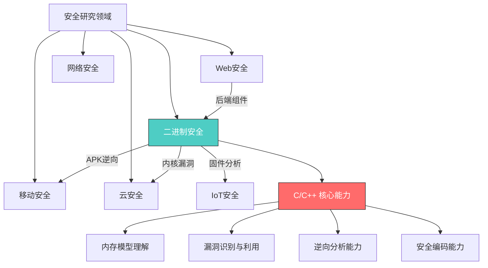
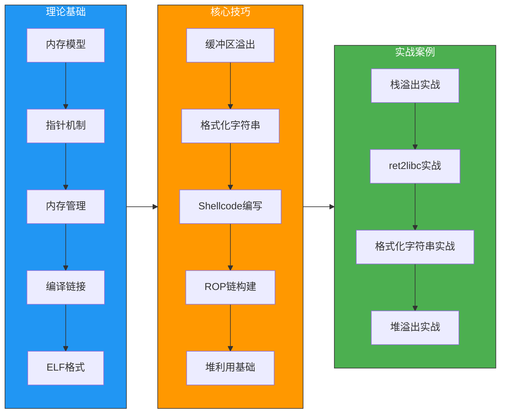
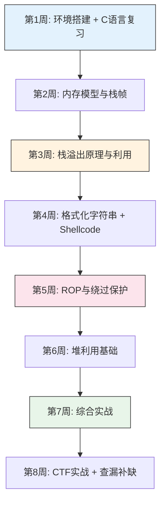

# 第09章 编程语言——C/C++

## 章节概述

C/C++ 是安全研究的基石语言。从 UNIX 内核到 Windows NT，从 OpenSSL 到 nginx，从嵌入式固件到浏览器引擎——互联网基础设施的底层几乎全部由 C/C++ 构建。这意味着：**理解 C/C++ 的内存模型和缺陷模式，就掌握了发现和利用绝大多数底层漏洞的钥匙。**

本章将系统讲解 C/C++ 在安全领域的核心知识，从内存模型到漏洞利用，从基础语法到高级攻击技术。不同于一般的 C/C++ 教程，本章的视角始终聚焦于**安全**——我们关注的不是如何写出优雅的代码，而是如何理解代码在内存中的真实行为，以及这种行为如何被攻击者利用。

### 为什么安全研究者必须掌握 C/C++

| 维度 | 说明 | 具体数据 |
|------|------|----------|
| **漏洞密度** | C/C++ 项目的历史漏洞数量远超其他语言 | CVE 数据库中约 70% 的内存安全漏洞来自 C/C++ 代码 |
| **攻击面覆盖** | 操作系统、浏览器、数据库、网络设备的内核和核心组件 | Linux 内核（纯 C）、Chromium（C++）、Nginx（C）、OpenSSL（C） |
| **漏洞类型** | 缓冲区溢出、UAF、整数溢出、格式化字符串等经典漏洞 | 这些漏洞类型在其他语言中几乎不存在（被运行时保护） |
| **CTF 竞赛** | PWN 方向是 CTF 的核心赛道 | DEF CON CTF、HITCON CTF 等顶级赛事的 PWN 题全部基于 C/C++ 二进制 |
| **职业方向** | 二进制安全、漏洞研究、内核安全、IoT 安全 | 这些高薪岗位的核心技能就是 C/C++ 逆向与利用 |
| **历史影响** | 最具破坏力的安全事件几乎都涉及 C/C++ 漏洞 | Heartbleed（OpenSSL）、WannaCry（EternalBlue）、Log4Shell 虽然是 Java，但其利用链底层仍依赖 C 组件 |



### C 与 C++ 在安全研究中的区别

虽然 C 和 C++ 常被并列提及，但它们在安全研究中的角色有显著差异：

| 特性 | C | C++ |
|------|---|-----|
| **典型目标** | Linux 内核、嵌入式固件、网络服务 | 浏览器引擎、游戏引擎、数据库 |
| **漏洞模式** | 栈溢出、格式化字符串、整数溢出 | UAF、类型混淆、虚表劫持 |
| **复杂度** | 相对简单，内存模型透明 | 对象模型复杂，vtable、RTTI 增加攻击面 |
| **利用技术** | ret2libc、ROP、Shellcode | vtable hijacking、heap spraying、JIT spray |
| **学习曲线** | 先学 C，建立内存直觉 | 再学 C++，理解对象模型的攻击面 |
| **代表漏洞** | Heartbleed、栈溢出类 | 浏览器 UAF、Chrome V8 漏洞 |

> **学习建议**：先扎实掌握 C 语言的内存模型，再进入 C++ 的对象模型。C 是基础，C++ 是扩展。本章以 C 为主线，C++ 的安全特性穿插其中。

## 学习目标

通过本章学习，读者将能够：

### 第一层：理解（Understanding）

1. **掌握内存布局**：能够画出进程的完整内存布局图（栈、堆、BSS、数据段、代码段），理解每个区域的作用和安全意义
2. **理解指针本质**：不仅知道指针是"地址"，还能解释指针的类型如何影响内存访问的宽度和解释方式，理解多级指针、函数指针、void 指针的安全含义
3. **理解编译链接过程**：从源代码到可执行文件的完整流程（预处理→编译→汇编→链接），理解每个阶段如何影响最终二进制的安全属性

### 第二层：识别（Identifying）

4. **识别常见漏洞模式**：看到代码能立即识别出缓冲区溢出、格式化字符串、整数溢出、UAF、双重释放等漏洞
5. **理解漏洞成因**：不仅知道"这里有问题"，还能解释"为什么有问题"以及"攻击者如何利用"
6. **分析二进制文件**：使用 GDB、Ghidra 等工具分析 ELF 文件，识别安全保护机制的状态

### 第三层：利用（Exploiting）

7. **编写基础 Exploit**：使用 pwntools 编写栈溢出 exploit，实现任意代码执行
8. **理解高级利用技术**：掌握 ROP（Return-Oriented Programming）链构建、ret2libc、ret2plt 等绕过保护机制的技术
9. **Shellcode 开发**：理解 Shellcode 的工作原理，能够编写和修改基础 Shellcode

### 第四层：防御（Defending）

10. **安全编码**：编写更安全的 C/C++ 代码，使用安全函数替代危险函数
11. **理解保护机制**：深入理解 Stack Canary、NX（DEP）、ASLR、RELRO、CFI 等保护机制的原理及已知绕过技术
12. **安全审计**：具备对 C/C++ 代码进行基础安全审计的能力

## 内容结构



### 第一部分：理论基础（01-理论基础.md）

> **定位**：知其所以然——理解漏洞存在的底层原因

本部分建立 C/C++ 安全研究的理论根基。不理解内存模型，就无法理解为什么缓冲区溢出会覆盖返回地址；不理解编译链接过程，就无法理解 GOT/PLT 表在利用中的作用。

**核心内容：**

- **进程内存布局**：栈（Stack）向下增长、堆（Heap）向上增长、BSS 段（未初始化全局变量）、数据段（已初始化全局变量）、代码段（.text，只读可执行）的完整布局，以及每个区域的安全含义
- **栈帧结构**：函数调用时栈帧的创建和销毁过程，局部变量、保存的帧指针（EBP）、返回地址（EIP）的排列顺序，理解"覆盖返回地址"为什么能控制执行流
- **堆管理机制**：glibc malloc 的工作原理（bin 机制、fastbin、unsorted bin），理解堆溢出如何破坏堆元数据实现任意写
- **指针的深层机制**：指针的类型决定内存访问宽度（`char*` 读 1 字节，`int*` 读 4 字节），指针算术的安全意义，函数指针与虚表指针的利用
- **编译链接全流程**：预处理（宏展开、头文件包含）→ 编译（生成汇编）→ 汇编（生成目标文件）→ 链接（符号解析、重定位），理解 GOT/PLT 的延迟绑定机制
- **ELF 文件格式**：ELF Header、Program Header、Section Header 的结构，理解 .plt、.got、.got.plt、.bss、.data 段的安全意义

### 第二部分：核心技巧（02-核心技巧.md）

> **定位**：学以致用——掌握漏洞利用的核心技术

本部分将理论转化为实践，系统讲解各类漏洞的利用技术。每种漏洞都遵循"原理→触发→利用→防御"的完整链条。

**核心内容：**

- **缓冲区溢出**：栈溢出的经典模式（覆盖返回地址为跳转地址），溢出偏移量的计算方法（pattern_create/pattern_offset），Shellcode 注入与执行
- **格式化字符串漏洞**：`printf` 系列函数的栈读取机制（`%x` 泄露栈数据、`%n` 写入任意地址），格式化字符串的利用链（泄露 canary、泄露 libc 地址、覆写 GOT 表）
- **Shellcode 编写**：Shellcode 的设计约束（不能包含空字节、需要适配目标架构），Linux x86/x64 系统调用号，常用 Shellcode 模板（execve("/bin/sh")、reverse shell、bind shell）
- **ROP（Return-Oriented Programming）**：NX 保护下不能直接执行栈上的代码，ROP 通过串联已有的代码片段（gadget）实现任意操作，ROPgadget/ropper 工具的使用，ret2libc 和 ret2plt 技术
- **堆利用基础**：堆溢出如何破坏 malloc/free 的元数据，fastbin attack、unsorted bin attack 的基本原理，tcache poisoning（glibc 2.26+）

### 第三部分：实战案例（03-实战案例.md）

> **定位**：真刀真枪——在真实场景中综合运用所学技术

本部分通过精心设计的实战案例，将前两部分的知识串联起来。每个案例都包含完整的问题分析、漏洞定位、exploit 编写和结果验证过程。

**核心内容：**

- **经典栈溢出**：一个简单的有栈溢出漏洞的 C 程序，从源码分析到编写完整 exploit 的全流程
- **ret2libc 实战**：绕过 NX 保护，通过泄露 libc 基地址调用 system("/bin/sh")
- **格式化字符串利用**：利用格式化字符串漏洞泄露 canary 并覆写 GOT 表
- **简单堆溢出**：理解堆溢出的触发条件和利用思路

### 第四部分：常见误区（04-常见误区.md）

> **定位**：避坑指南——纠正错误认知，建立正确的心智模型

安全研究中有许多"想当然"的理解方式会导致严重的错误。本部分系统梳理常见的认知误区和实践陷阱。

**核心内容：**

- **概念误区**：如"栈溢出就是覆盖变量"、"ASLR 无法绕过"、"NX 保护下不能执行任意代码"等
- **实践误区**：如"不检查返回值"、"忽略整数溢出"、"信任用户输入的长度"等
- **学习误区**：如"只看不练"、"跳过基础直接学 ROP"、"只学攻击不学防御"等

### 第五部分：练习方法（05-练习方法.md）

> **定位**：刻意练习——提供系统化的训练路径

**核心内容：**

- **PWN 练习平台**：CTFHub、攻防世界、BUUCTF、pwnable.kr/xyz 的推荐题目和学习路径
- **逆向工程练习**：CrackMes.one、逆向分析挑战
- **安全编码训练**：将漏洞代码重写为安全版本
- **综合项目**：搭建有漏洞的靶场环境，进行完整的漏洞挖掘和利用

### 第六部分：本章小结（06-本章小结.md）

总结本章核心知识点，回顾关键概念和技术要点，构建完整的知识图谱。

## 前置知识

### 必备基础

学习本章前，读者应具备以下知识：

| 知识领域 | 具体要求 | 验证标准 |
|----------|----------|----------|
| **编程基础** | 理解变量、循环、函数、数组等基本概念 | 能用 C 语言写一个简单的文件读写程序 |
| **计算机组成** | 理解 CPU、内存、寄存器的基本概念 | 能解释"CPU 从内存取指令执行"的过程 |
| **操作系统基础** | 理解进程、虚拟内存、文件描述符 | 能解释 fork() 的工作原理 |
| **Linux 基础** | 熟悉命令行操作、文件权限、管道重定向 | 能熟练使用 gcc 编译、gdb 调试 |

### 推荐先修章节

- **第06章《操作系统基础——Linux》**：理解进程内存布局、系统调用机制
- **第07章《操作系统基础——Windows/macOS》**：理解不同平台的内存保护差异
- **第08章《编程语言——Python》**：pwntools 基于 Python，需要基本的 Python 能力

### 自我评估

在开始学习前，尝试回答以下问题（如果大部分答不上来，建议先补充前置知识）：

1. `int *p = malloc(sizeof(int));` 这行代码在内存中做了什么？`p` 本身存储在哪里？`*p` 存储在哪里？
2. 函数调用时，参数是如何传递的？返回地址是如何保存的？
3. `gcc -fno-stack-protector -z execstack` 这个编译命令关闭了哪些保护？
4. 什么是虚拟内存？为什么每个进程都有独立的地址空间？
5. 用 GDB 设置断点、单步执行、查看内存的基本命令是什么？

## 学习路径与时间规划

### 推荐学习路径



### 时间分配建议

| 学习阶段 | 建议时长 | 内容说明 |
|----------|----------|----------|
| 环境搭建与 C 语言复习 | 10-15 小时 | 搭建实验环境，复习 C 语言核心语法 |
| 理论学习 | 30-40 小时 | 内存模型、编译链接、ELF 格式等底层知识 |
| 漏洞原理与利用技术 | 40-50 小时 | 缓冲区溢出、格式化字符串、ROP、堆利用 |
| CTF/PWN 练习 | 30-50 小时 | 在 CTF 平台上做题巩固 |
| 综合实战项目 | 20-30 小时 | 搭建靶场、完成完整的漏洞挖掘与利用 |
| **总计** | **130-185 小时** | **约 6-8 周全日制学习** |

> **弹性建议**：如果已有 C 语言基础，可以压缩第 1 周，将更多时间分配给漏洞利用技术的练习。如果完全零基础，建议先花 2-3 周专门学习 C 语言。

## 核心概念速览

在正式开始前，先了解以下核心概念（后续章节会详细展开）：

### 内存安全类概念

| 概念 | 简要说明 | 安全意义 |
|------|----------|----------|
| **缓冲区溢出（Buffer Overflow）** | 向缓冲区写入超出其大小的数据，覆盖相邻内存 | 最经典的漏洞类型，可覆盖返回地址控制执行流 |
| **栈溢出（Stack Overflow）** | 栈上的缓冲区溢出，覆盖栈帧中的关键数据 | 直接控制函数返回地址，实现任意代码执行 |
| **堆溢出（Heap Overflow）** | 堆上的缓冲区溢出，破坏堆管理元数据 | 可实现任意地址写，利用难度较高但威力巨大 |
| **Use-After-Free（UAF）** | 释放内存后继续使用指针 | 浏览器漏洞的主要类型，可实现类型混淆 |
| **格式化字符串漏洞** | 用户输入被当作 printf 的格式化字符串 | 可读写任意内存，泄露敏感数据或覆写关键指针 |
| **整数溢出** | 整数运算结果超出类型表示范围 | 可导致缓冲区分配不足，间接引发缓冲区溢出 |

### 保护机制类概念

| 概念 | 简要说明 | 绕过思路 |
|------|----------|----------|
| **Stack Canary** | 在返回地址前插入随机值，函数返回时检查是否被修改 | 泄露 canary 值后在溢出时保持其不变 |
| **NX/DEP** | 标记栈/堆为不可执行 | ROP（复用已有代码片段） |
| **ASLR** | 随机化进程的内存布局 | 泄露某个已知地址，计算偏移量 |
| **RELRO** | 保护 GOT 表不被覆写 | partial RELRO 仍有利用空间 |
| **PIE** | 位置无关可执行文件，代码段地址随机化 | 需要先泄露代码段基地址 |

## 工具准备

### 编译与调试工具

```bash
# 基础编译工具链
sudo apt update
sudo apt install -y build-essential gcc g++ gdb make cmake

# 汇编器
sudo apt install -y nasm yasm

# 二进制分析工具
sudo apt install -y binutils file strace ltrace

# 32位支持（很多经典漏洞是32位的）
sudo apt install -y gcc-multilib g++-multilib libc6-dev-i386
```

### GDB 插件（强烈推荐）

GDB 原生界面信息量不足，安全研究几乎必须使用插件：

```bash
# 方案一：pwndbg（推荐，PWN 方向首选）
git clone https://github.com/pwndbg/pwndbg
cd pwndbg && ./setup.sh

# 方案二：GEF（轻量级替代）
bash -c "$(curl -fsSL https://gef.blah.cat/sh)"

# 方案三：peda（较老但仍有用户）
git clone https://github.com/longld/peda.git ~/peda
echo "source ~/peda/peda.py" >> ~/.gdbinit
```

> **选择建议**：pwndbg 的堆分析功能最强，是 PWN 方向的首选。GEF 更轻量，适合资源受限环境。三者不要同时安装，选一个即可。

### Python 工具库

```bash
# pwntools：PWN 方向的核心框架
pip install pwntools

# ROP 工具
pip install ropper
# 或使用 ROPgadget
pip install ROPgadget

# 二进制分析库
pip install capstone keystone unicorn
```

### 反汇编与逆向工具

| 工具 | 类型 | 优势 | 适用场景 |
|------|------|------|----------|
| **Ghidra** | 免费开源 | 强大的反编译能力，支持多种架构 | 逆向分析、漏洞研究 |
| **IDA Pro** | 商业（有免费版） | 行业标准，插件生态丰富 | 专业逆向工程 |
| **Binary Ninja** | 商业 | 现代 UI，API 友好 | 逆向分析、自动化脚本 |
| **Radare2/rizin** | 免费开源 | 命令行工具，脚本能力强 | 快速分析、自动化 |

### 漏洞靶场环境

```bash
# pwntools 自带的练习环境（推荐入门）
# 安装后可以直接使用 process('./vuln_program') 进行本地调试

# Docker 靶场（推荐）
docker pull skysider/pwndocker
docker run -it -p 1234:1234 --cap-add=SYS_PTRACE skysider/pwndocker

# CTF 平台（在线练习）
# - CTFHub: https://www.ctfhub.com
# - BUUCTF: https://buuoj.cn
# - 攻防世界: https://adworld.xctf.org.cn
# - pwnable.kr: http://pwnable.kr
# - pwnable.xyz: https://pwnable.xyz
```

## 经典漏洞案例预览

以下是安全史上与 C/C++ 相关的标志性漏洞事件，本章学习的技术将帮助你理解它们的成因：

### Heartbleed（CVE-2014-0160）

- **目标**：OpenSSL 的 TLS Heartbeat 扩展
- **漏洞类型**：缓冲区越界读取（信息泄露）
- **影响**：全球约 17% 的 HTTPS 服务器受影响，可泄露服务器内存中的私钥、密码等敏感数据
- **根因**：未正确验证 Heartbeat 请求中声明的长度，导致读取超出实际数据的内存
- **本章关联**：01-理论基础（内存布局）、02-核心技巧（缓冲区溢出读取）

### EternalBlue（CVE-2017-0144）

- **目标**：Windows SMBv1 协议
- **漏洞类型**：缓冲区溢出（远程代码执行）
- **影响**：被 WannaCry 勒索病毒利用，感染全球 23 万台计算机，造成数十亿美元损失
- **根因**：SMBv1 处理 Transaction2 请求时未正确验证缓冲区大小
- **本章关联**：02-核心技巧（缓冲区溢出利用）、Shellcode 注入

### Stagefright（CVE-2015-1538 等系列）

- **目标**：Android 的媒体播放库 libstagefright（C++）
- **漏洞类型**：整数溢出 + 堆溢出
- **影响**：影响约 95% 的 Android 设备，仅需发送一条彩信即可触发
- **根因**：解析 MP4 文件时的整数溢出导致堆缓冲区分配不足
- **本章关联**：02-核心技巧（整数溢出、堆溢出）

### Log4Shell（CVE-2021-44228）

- **目标**：Apache Log4j（Java）
- **漏洞类型**：JNDI 注入（虽然不是 C/C++，但其利用链的底层依赖 C 组件）
- **影响**：影响全球数百万 Java 应用，被评为"十年来最严重的漏洞"
- **启示**：即使是非 C/C++ 语言的漏洞，其利用链的底层仍然可能涉及 C/C++ 组件

## 学习建议与方法论

### 学习原则

1. **先 C 后 C++**：C 的内存模型是基础，C++ 的对象模型建立在 C 的基础上。跳过 C 直接学 C++ 的安全问题会导致根基不稳
2. **先攻击后防御**：理解攻击技术有助于更好地理解防御措施的必要性和局限性
3. **先 32 位后 64 位**：32 位程序的利用更简单直观（参数通过栈传递），适合入门。掌握后再转向 64 位
4. **先本地后远程**：先在本地调试和利用，成功后再练习远程利用（增加网络交互的复杂度）
5. **先手动后工具**：先理解原理手动计算偏移量和构造 payload，再使用自动化工具提高效率

### 实践方法

- **源码审计**：阅读有漏洞的 C 代码，尝试在不看答案的情况下找出漏洞
- **动态调试**：用 GDB 单步跟踪程序执行，观察寄存器和内存的变化
- **Exploit 编写**：每学一种漏洞类型，立即编写对应的 exploit 代码
- **CTF 刷题**：通过 CTF 平台的 PWN 题目进行系统化练习
- **漏洞复现**：尝试复现历史上的经典漏洞（如 Heartbleed 的简化版本）

### 推荐学习资源

| 类型 | 资源 | 说明 |
|------|------|------|
| **书籍** | 《深入理解计算机系统》(CSAPP) | 理解计算机底层的圣经级教材 |
| **书籍** | 《Hacking: The Art of Exploitation》 | 漏洞利用的经典入门书 |
| **书籍** | 《程序员的自我修养》 | 深入理解编译链接和 ELF 格式 |
| **在线课程** | CMU 15-213 Introduction to Computer Systems | 配合 CSAPP 的公开课 |
| **在线课程** | 格致拾年 PWN 系列 | 中文 PWN 入门教程 |
| **练习平台** | CTFHub / BUUCTF | 中文 CTF 练习平台 |
| **练习平台** | pwnable.kr / pwnable.xyz | 英文 PWN 专项练习 |
| **工具文档** | pwntools 官方文档 | 安全开发必备参考 |
| **工具文档** | GDB Manual | 调试器完整参考 |

## 安全警告与免责声明

> ⚠️ **安全警告与免责声明**
>
> 本章内容仅供**合法的安全测试与教育目的**使用。所有技术、工具和方法的讨论均旨在帮助安全从业者在**获得明确授权**的前提下进行防御性安全研究。
>
> - 🚫 **未经授权**对任何系统、网络或应用进行安全测试是**违法行为**
> - ✅ 所有实践活动应在**隔离的实验环境**中进行（如虚拟机、Docker 容器、CTF 平台）
> - ✅ 遵守所在国家和地区的**网络安全法律法规**（如《中华人民共和国网络安全法》）
> - ✅ 遵循**负责任的漏洞披露**原则（发现漏洞后报告给厂商，而非公开利用）
> - ✅ 仅在**自己拥有或获得明确授权**的目标上进行测试
>
> 作者不对因滥用本章内容造成的任何后果承担责任。掌握攻击技术的目的是为了更好地防御，请始终坚守道德底线。
