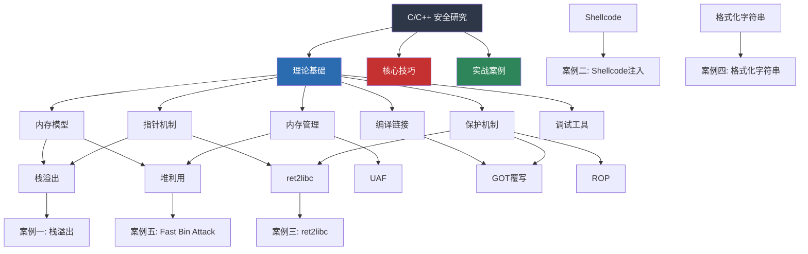
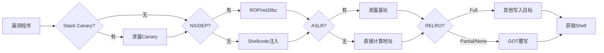
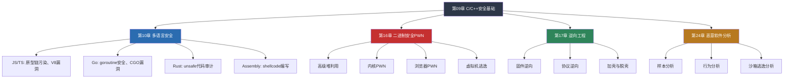

# 第09章 本章小结

本章从C/C++在安全领域的核心地位出发，系统构建了二进制安全的完整知识体系。从理论基础到核心技巧，从单一漏洞到组合利用，从手动分析到自动化工具链，覆盖了安全研究者必须掌握的C/C++底层知识。本小结将回顾全章脉络，梳理知识间的关联，提供能力自检框架，并指明进阶方向。

## 全章知识图谱



这张图展示了本章知识的依赖关系：**理论基础**是地基，**核心技巧**是建筑，**实战案例**是验收。任何一块缺失都会导致后续理解出现断层。

## 核心知识点回顾

### 1. C/C++在安全领域的地位

C/C++不是"可选的"安全知识，而是安全研究的**底层语言**。以下数据说明了它的核心地位：

| 领域 | C/C++的角色 | 具体体现 |
|------|------------|---------|
| 操作系统 | 内核全部用C编写 | Linux内核约2800万行C代码 |
| 漏洞类型 | 绝大多数底层漏洞基于C/C++内存模型 | CVE中约70%是内存安全问题 |
| 恶意软件 | 90%+的恶意软件用C/C++编写 | 因为需要直接操作内存和系统API |
| 逆向工程 | 逆向的目标就是还原C代码 | IDA/Ghidra的反编译输出就是C伪代码 |
| CTF竞赛 | PWN题几乎全部基于C程序 | 栈溢出、堆利用、格式化字符串是核心考点 |
| 嵌入式/IoT | 固件用C编写 | IoT安全研究必须理解C内存模型 |

**关键认知**：即使你主要做Web安全或渗透测试，理解C/C++的安全问题也能帮你理解操作系统安全机制、内核漏洞利用、沙箱逃逸等高级话题。它是安全研究的"通用语言"。

### 2. 理论基础回顾

#### 2.1 进程内存布局

进程内存布局是所有二进制漏洞的"地图"。不理解内存布局，就无法理解任何利用技术。

```text
高地址  ┌─────────────────┐
        │    内核空间       │  用户态不可访问
        ├─────────────────┤
        │    栈 (Stack)    │  局部变量、参数、返回地址
        │       ↓ 增长     │  向低地址增长
        ├─────────────────┤
        │      ...        │  未使用空间
        ├─────────────────┤
        │   mmap 区域      │  共享库、mmap分配
        ├─────────────────┤
        │       ↑ 增长     │  向高地址增长
        │    堆 (Heap)    │  malloc/new分配的动态内存
        ├─────────────────┤
        │    .bss 段       │  未初始化全局变量
        ├─────────────────┤
        │    .data 段      │  已初始化全局变量
        ├─────────────────┤
        │    .text 段      │  程序代码（只读、可执行）
低地址  └─────────────────┘
```

**理解要点**：
- 栈和堆相向增长，中间是未使用的虚拟地址空间
- 栈向低地址增长意味着**栈溢出会覆盖更早的栈帧**，这是栈溢出利用的基础
- .text段的只读属性通过NX位保护，如果设置了NX，就不能在.text段之外执行代码
- mmap区域是libc加载的位置，泄露mmap基址就能计算libc中任何函数的地址

#### 2.2 指针——一切漏洞的根源

指针的本质是**存储内存地址的变量**。C/C++允许对指针进行任意算术运算、类型转换和解引用，这赋予了程序员极大的自由，也带来了巨大的安全风险。

```c
// 指针的危险操作
char buf[16];
char *p = buf;
p[100] = 'A';        // 越界写入——栈溢出
*(int*)0x12345678 = 0; // 任意地址写入——可能的利用原语

// 整数与指针的隐式转换
int offset = user_input;  // 如果offset很大，p+offset可能指向任意位置
p[offset] = 'X';          // 任意地址写入
```

**安全研究视角**：所有内存漏洞（溢出、UAF、格式化字符串）的本质都是**指针的错误使用**。理解指针就是理解漏洞。

#### 2.3 堆管理器机制

glibc的ptmalloc2堆管理器是PWN题中最常遇到的目标。其核心机制：

| 机制 | 作用 | 安全意义 |
|------|------|---------|
| Fast Bin | 管理小块内存(≤0x80字节)，LIFO链表 | Fast Bin Attack：劫持链表实现任意地址分配 |
| Unsorted Bin | 被free的块首先进入此链表 | 泄露libc地址：链表中的fd/bk指向main_arena |
| Small Bin | 管理中等大小内存，FIFO链表 | 与Fast Bin类似的攻击方式 |
| Large Bin | 管理大块内存，按大小排序 | Large Bin Attack：写入任意地址 |
| Tcache | glibc 2.26+引入，每线程缓存 | Tcache poisoning：更简单的任意地址分配 |

**堆利用的核心思路**：
1. 找到堆上的漏洞（溢出、UAF、double free）
2. 利用漏洞破坏堆管理器的数据结构（链表指针）
3. 通过破坏后的数据结构实现任意地址分配或写入
4. 将任意地址分配转化为控制流劫持（覆写__malloc_hook、__free_hook、GOT表等）

#### 2.4 编译链接过程

理解编译链接过程对于安全研究至关重要——它决定了最终二进制文件的结构和保护机制。

```text
源代码 (.c/.cpp)
    │
    ▼ 预处理 (cpp)
    │  展开宏、处理#include、删除注释
    │
    ▼ 编译 (cc1/gcc)
    │  词法分析→语法分析→语义分析→中间代码→目标代码
    │  生成汇编代码 (.s)
    │
    ▼ 汇编 (as)
    │  将汇编代码转换为机器码
    │  生成可重定位目标文件 (.o)
    │
    ▼ 链接 (ld)
       合并多个.o文件，解析符号引用
       生成可执行文件或共享库 (ELF)
```

**ELF文件的安全意义**：
- **ELF Header**：包含程序入口点，修改它可以劫持程序启动
- **Program Headers**：定义段的权限（读/写/执行），NX保护在此体现
- **Section Headers**：包含GOT/PLT表，GOT覆写攻击的目标
- **Symbol Table**：函数名和地址的映射，用于解析外部函数

### 3. 核心技巧回顾

#### 3.1 利用技术全景

本章讲解的利用技术可以按**利用难度**和**防御复杂度**分为三个层级：

| 层级 | 技术 | 难度 | 前置知识 |
|------|------|------|---------|
| 入门 | 栈溢出（覆盖返回地址） | ★☆☆ | 内存布局、栈帧结构 |
| 入门 | Shellcode注入 | ★☆☆ | 栈溢出、汇编基础 |
| 入门 | 格式化字符串 | ★★☆ | printf实现原理、栈布局 |
| 中级 | ROP（返回导向编程） | ★★☆ | 栈溢出、gadget查找 |
| 中级 | ret2libc | ★★☆ | ROP、PLT/GOT机制、libc泄露 |
| 中级 | 整数溢出利用 | ★★☆ | 整数表示、类型转换 |
| 高级 | UAF利用 | ★★★ | 堆管理器、对象布局 |
| 高级 | 堆利用（Fast Bin Attack） | ★★★ | 堆管理器bin机制 |
| 高级 | GOT覆写 | ★★☆ | ELF结构、PLT/GOT、RELRO |

**学习路径建议**：入门技术 → 中级技术 → 高级技术，不要跳级。每个技术都要先理解原理，再做练习题，最后尝试变化和组合。

#### 3.2 关键利用原语

利用原语（Exploit Primitive）是构建完整exploit的基础构件。掌握利用原语比掌握具体漏洞类型更重要，因为同一个原语可以用于多种漏洞场景。

**写原语（Write Primitive）**：

| 原语 | 描述 | 典型来源 |
|------|------|---------|
| 栈溢出写入 | 从某个栈地址开始连续写入 | 缓冲区溢出 |
| 格式化字符串写入 | 向任意地址写入指定值 | printf格式化字符串 |
| 堆溢出写入 | 从某个堆地址开始连续写入 | 堆缓冲区溢出 |
| Fast Bin分配 | 在任意地址"分配"一个chunk | Fast Bin Attack |
| UAF写入 | 通过已释放的指针写入 | Use After Free |

**读原语（Read Primitive）**：

| 原语 | 描述 | 典型来源 |
|------|------|---------|
| 格式化字符串读取 | 读取栈上的任意值 | printf("%x") |
| 堆指针泄露 | 读取堆/栈上的指针值 | 未初始化内存、UAF |
| puts/printf泄露 | 将内存内容输出到stdout | 栈溢出控制参数 |

**执行原语（Execution Primitive）**：

| 原语 | 描述 | 典型方式 |
|------|------|---------|
| 返回地址覆盖 | 控制函数返回后的执行位置 | 栈溢出 |
| 函数指针覆盖 | 覆盖回调函数指针 | 堆溢出、UAF |
| GOT覆写 | 修改已解析的函数地址 | 任意写原语 + 无RELRO |
| vtable劫持 | 修改C++虚函数表指针 | UAF、堆溢出 |

**核心认知**：一个完整的exploit = 信息泄露（绕过ASLR） + 写原语（修改关键数据） + 执行原语（劫持控制流）。大多数漏洞分析的第一步就是识别程序中存在哪些原语。

#### 3.3 安全保护机制与绕过

现代系统有多种保护机制，每种机制阻断了一类攻击路径。理解保护机制的原理才能找到绕过方法。



**各保护机制详解**：

| 保护机制 | 原理 | 绕过思路 | 成本/难度 |
|---------|------|---------|----------|
| Stack Canary | 在返回地址前插入随机值，函数返回时校验 | 泄露Canary值、格式化字符串泄露、爆破(32位fork模式) | 中等 |
| NX/DEP | 标记栈/堆为不可执行 | ROP（复用已有代码）、ret2libc（调用libc函数） | 低-中等 |
| ASLR | 每次运行随机化栈/堆/mmap基址 | 信息泄露、部分覆写(Partial Overwrite)、暴力破解(32位) | 中-高 |
| PIE | 随机化代码段基址 | 信息泄露、部分覆写 | 中-高 |
| Full RELRO | 启动时立即解析所有GOT表项并设为只读 | 不能用GOT覆写，需找其他写入目标（如__malloc_hook） | 低 |
| FORTIFY_SOURCE | 编译时检查缓冲区溢出 | 寻找编译器未检测到的溢出路径 | 低 |

**绕过优先级**（实战中的思考顺序）：
1. 先用`checksec`查看保护机制
2. 根据保护机制组合确定攻击策略
3. 如果有ASLR+NX：需要信息泄露 + ROP/ret2libc
4. 如果有Canary：需要泄露Canary或找到不覆盖Canary的利用路径
5. 如果有Full RELRO：放弃GOT覆写，转向hook函数或其他目标

### 4. 常见误区深度解析

本章"常见误区"部分列出了初学者容易犯的错误。这里对每个误区进行深度解析，帮助读者从根本上避免这些问题。

#### 误区一：只学理论不实践

**错误表现**：阅读大量教程和书籍，但从不做CTF题或实际漏洞分析。

**为什么危险**：二进制安全是高度实践性的领域。理论知识告诉你"栈溢出可以覆盖返回地址"，但只有实际操作时你才会遇到：
- 字节序（小端序）导致的地址写入顺序问题
- 坏字符（`\x00`、`\x0a`）导致exploit失败
- 栈对齐问题导致segfault
- 不同glibc版本的堆行为差异

**正确做法**：
- 每学完一个知识点，立即做1-2道相关练习题
- 从简单的CTF平台开始：CTFHub入门题、BUUCTF基础题、pwnable.kr
- 建立"题解笔记"：记录每道题的思路、踩坑点、关键代码
- 每周至少完整做3-5道PWN题

#### 误区二：忽视GDB调试

**错误表现**：写exploit时只看IDA伪代码，不实际调试程序运行时的状态。

**为什么危险**：IDA展示的是静态信息，而漏洞利用是**动态过程**。你需要知道：
- 溢出发生时栈上的实际布局（可能与静态分析不同）
- Canary的实际值是什么
- 堆chunk的实际状态（free后fd/bk的值）
- 寄存器的当前值

**正确做法**：
```bash
# 标准调试流程
gdb ./vuln_program
b main                    # 在main下断点
r                         # 运行程序
# 到达断点后
vmmap                     # pwndbg: 查看内存映射
telescope $rsp 20         # pwndbg: 查看栈内容
heap bins                 # pwndbg: 查看堆bin状态
```

**调试习惯**：每次做题时，至少在以下三个时刻用GDB检查状态：
1. 溢出发生前：确认缓冲区位置和大小
2. 溢出发生后：确认覆盖了哪些数据
3. exploit执行时：确认控制流是否按预期转移

#### 误区三：不理解ASLR

**错误表现**：写exploit时硬编码libc地址，换一台机器就失败。

**为什么危险**：ASLR是现代系统默认开启的保护。不理解ASLR意味着你的exploit只能在关闭ASLR的环境下工作，这在真实场景中几乎不存在。

**正确做法**：
```python
# pwntools中的ASLR处理
from pwn import *

# 本地调试时关闭ASLR
p = process('./vuln', aslr=False)

# 泄露libc地址的典型方法
# 1. 通过puts/printf泄露GOT表中的已解析函数地址
payload = flat(b'A' * offset, puts_plt, main_addr, got_puts)
p.sendline(payload)
puts_addr = u64(p.recv(6).ljust(8, b'\x00'))
libc_base = puts_addr - libc.symbols['puts']

# 2. 通过泄露栈上的返回地址
# 3. 通过格式化字符串泄露栈上的libc地址
```

#### 误区四：忽略栈对齐

**错误表现**：ROP链执行到一半出现segfault，但逻辑看起来完全正确。

**为什么危险**：x86-64架构要求SSE指令（如`movaps`，libc内部常用）的操作数16字节对齐。如果栈指针RSP不是16字节对齐，调用包含SSE指令的函数就会崩溃。

**为什么需要额外的ret gadget**：当通过栈溢出控制返回地址时，执行`ret`会弹出8字节，使RSP偏移8字节，破坏了16字节对齐。加一个额外的`ret` gadget会再弹出8字节，恢复对齐。

```python
# 栈对齐修复
ret_gadget = 0x401234  # 任意一个ret指令的地址

# 在ROP链最前面加一个ret gadget
rop_chain = flat(
    ret_gadget,      # 栈对齐
    pop_rdi_ret,     # 设置参数
    bin_sh_addr,     # "/bin/sh"字符串地址
    system_addr      # 调用system
)
```

**经验法则**：如果exploit在gdb中正常工作但实际运行时崩溃，首先检查栈对齐。

#### 误区五：不检查编译选项

**错误表现**：拿到题目直接开始分析漏洞，不先看保护机制。

**为什么危险**：保护机制直接决定了你能否使用某种利用技术。如果程序开启了Full RELRO，你花大量时间构造GOT覆写的exploit就是浪费时间。

**正确做法**：
```bash
# 第一步永远是checksec
checksec ./vuln_program

# 输出示例
#     Arch:     amd64-64-little
#     RELRO:    Full RELRO      ← GOT覆写不可用
#     Stack:    Canary found     ← 需要泄露Canary
#     NX:       NX enabled      ← 不能执行栈上的代码
#     PIE:      PIE enabled     ← 代码地址随机化
#     RWX:      Has RWX segments
```

根据checksec结果制定利用策略，不要盲目尝试。

#### 误区六：只学一种方法

**错误表现**：只会栈溢出覆盖返回地址，遇到稍有变化的题目就无法解决。

**为什么危险**：真实漏洞和CTF题目往往需要**组合多种技术**。例如：
- 栈溢出 + 信息泄露（泄露Canary和libc地址） + ROP
- 格式化字符串泄露栈布局 + 栈溢出执行shellcode
- 堆溢出 + Fast Bin Attack + 覆写__malloc_hook

**正确做法**：
- 每种技术至少做3-5道练习题
- 尝试用不同方法解决同一道题
- 整理自己的"利用模板"库

#### 误区七：不总结不复盘

**错误表现**：做完题就扔，下次遇到类似题目又从头分析。

**为什么危险**：二进制安全的知识点高度关联。不建立知识体系，每次都是从零开始，效率极低。

**正确做法**：
- 建立个人知识库（推荐用Obsidian或Markdown文件夹）
- 每道题记录：题目信息、漏洞类型、利用思路、关键代码、踩坑点
- 按漏洞类型分类整理
- 定期回顾和更新

### 5. 关键能力检查清单

学习完本章后，你应该能够完成以下每个任务。建议逐项自评，对薄弱项重点复习。

#### 基础能力（必达）

- [ ] **绘制进程内存布局图**：在纸上画出栈、堆、mmap、.bss、.data、.text的位置和增长方向
- [ ] **解释栈帧结构**：说明函数调用时栈上保存了什么（参数、返回地址、saved RBP、局部变量）
- [ ] **识别危险函数**：看到`gets`、`strcpy`、`strcat`、`sprintf`、`scanf("%s")`立即识别为漏洞点
- [ ] **使用checksec**：正确解读每个保护机制的含义
- [ ] **GDB基本操作**：设置断点、查看内存、单步执行、查看寄存器

#### 核心能力（应达）

- [ ] **编写基础栈溢出exploit**：覆盖返回地址跳转到目标函数
- [ ] **使用pwntools**：编写完整的交互式exploit脚本
- [ ] **构建ROP链**：使用ROPgadget/ropper找到gadget并组装ROP链
- [ ] **ret2libc**：泄露libc地址并调用system("/bin/sh")
- [ ] **格式化字符串**：利用`%n`向任意地址写入数据
- [ ] **整数溢出**：识别并利用整数溢出导致的缓冲区溢出

#### 进阶能力（优秀）

- [ ] **堆基础利用**：理解fast bin/unsorted bin机制，完成Fast Bin Attack
- [ ] **UAF利用**：识别UAF漏洞并构造利用
- [ ] **GOT覆写**：在Partial RELRO下覆写GOT表劫持函数调用
- [ ] **组合利用**：将信息泄露 + 写原语 + 执行原语组合成完整exploit
- [ ] **绕过保护组合**：在ASLR + NX + Canary保护下完成利用

### 6. 推荐学习路径

#### 第一阶段：基础入门（2-4周）

**目标**：理解内存模型，能完成最简单的栈溢出题。


**推荐练习平台**：
| 平台 | 难度 | 特点 | 链接 |
|------|------|------|------|
| CTFHub | 入门-中级 | 分类清晰，有教程 | ctfhub.com |
| BUUCTF | 入门-高级 | 题库丰富，有难度标注 | buuoj.cn |
| pwnable.kr | 中级-高级 | 经典入门平台 | pwnable.kr |
| pwnable.tw | 中级-高级 | 高质量题目 | pwnable.tw |
| Hack The Box | 中级-高级 | 真实场景 | hackthebox.com |

#### 第二阶段：中级进阶（4-8周）

**目标**：掌握ROP、ret2libc、格式化字符串，能独立完成中级题目。

**学习重点**：
1. PLT/GOT机制深入理解
2. ROP技术（ROPgadget、ropper工具使用）
3. ret2libc（泄露libc地址的方法）
4. 格式化字符串漏洞利用
5. 整数溢出利用
6. Stack Canary绕过方法

**每天练习**：
- 上午：学习新知识点，阅读教程和源码
- 下午：做2-3道相关练习题
- 晚上：整理笔记，记录踩坑点

#### 第三阶段：高级提升（8-16周）

**目标**：掌握堆利用、UAF等高级技术，能解决高级题目。

**学习重点**：
1. glibc堆管理器源码阅读（malloc.c）
2. Fast Bin Attack / Unsorted Bin Attack
3. Tcache利用（glibc 2.26+）
4. Use After Free利用
5. C++虚函数表劫持
6. 内核PWN入门

**推荐资源**：
- **How2Heap**：堆利用的入门练习项目（github.com/shellphish/how2heap）
- **CTF-Wiki**：中文CTF知识库（ctf-wiki.org）
- **Angel Boy的博客**：堆利用经典文章
- **《Exploiting Software》**：软件漏洞利用的经典教材

#### 第四阶段：实战应用（持续）

**目标**：能分析真实漏洞，参与CTF竞赛，进行安全研究。

**方向选择**：
| 方向 | 描述 | 前景 |
|------|------|------|
| CTF竞赛 | 参加各类CTF比赛 | 技术提升、团队协作 |
| 漏洞挖掘 | Fuzzing + 手动审计 | CVE获取、漏洞赏金 |
| 内核安全 | Linux内核漏洞利用 | 高薪安全研究岗位 |
| IoT安全 | 嵌入式固件分析 | 物联网安全需求增长 |
| 恶意软件分析 | 逆向分析恶意软件 | 安全厂商核心岗位 |

### 7. 工具速查与进阶配置

#### 核心工具链

| 工具 | 用途 | 安装 | 进阶配置 |
|------|------|------|---------|
| pwntools | PWN/exploit开发框架 | `pip install pwntools` | 配置`context.arch`、`context.log_level` |
| pwndbg | GDB增强插件 | `git clone https://github.com/pwndbg/pwndbg && cd pwndbg && ./setup.sh` | 配置`.gdbinit`自定义命令 |
| ROPgadget | ROP gadget搜索 | `pip install ROPgadget` | `ROPgadget --binary ./vuln --only "pop|ret"` |
| ropper | ROP gadget搜索（更快） | `pip install ropper` | `ropper -f ./vuln --search "pop rdi"` |
| one_gadget | 查找one_gadget | `gem install one_gadget` | `one_gadget libc.so.6` |
| Ghidra | 反汇编/反编译器（免费） | https://ghidra-sre.org/ | 安装Ghidra插件、配置脚本 |
| IDA Pro | 反汇编/反编译器（付费） | https://hex-rays.com/ | IDAPython脚本、FLIRT签名 |
| checksec | 检查ELF保护机制 | `apt install checksec` 或 pwntools自带 | `checksec --file=./vuln` |
| seccomp-tools | 分析seccomp沙箱规则 | `gem install seccomp-tools` | `seccomp-tools dump ./vuln` |
| patchelf | 修改ELF解释器和rpath | `apt install patchelf` | `patchelf --set-interpreter ./ld.so ./vuln` |

#### pwntools模板

```python
#!/usr/bin/env python3
from pwn import *

# ===== 配置 =====
context.arch = 'amd64'
context.log_level = 'debug'
context.terminal = ['tmux', 'splitw', '-h']

# ===== 加载文件 =====
elf = ELF('./vuln')
libc = ELF('./libc.so.6')

# ===== 连接目标 =====
if args.REMOTE:
    p = remote('challenge.example.com', 1337)
elif args.GDB:
    p = gdb.debug('./vuln', '''
        b *main+42
        c
    ''')
else:
    p = process('./vuln')

# ===== 地址计算 =====
pop_rdi = 0x401234  # ROPgadget找到
ret = 0x401235      # 栈对齐用
bin_sh = next(libc.search(b'/bin/sh'))
system = libc.symbols['system']

# ===== 交互函数 =====
def send_payload(payload):
    p.sendlineafter(b'> ', payload)

# ===== 构造exploit =====
# 阶段1：信息泄露
payload1 = flat(b'A' * offset, elf.plt['puts'], pop_rdi, elf.got['puts'], elf.sym['main'])
send_payload(payload1)
p.recvuntil(b'\n')
puts_addr = u64(p.recv(6).ljust(8, b'\x00'))
libc_base = puts_addr - libc.symbols['puts']
info(f'libc base: {hex(libc_base)}')

# 阶段2：获取shell
system = libc_base + libc.symbols['system']
bin_sh = libc_base + next(libc.search(b'/bin/sh'))
payload2 = flat(b'A' * offset, ret, pop_rdi, bin_sh, system)
send_payload(payload2)

# ===== 交互 =====
p.interactive()
```

#### pwndbg常用命令

```bash
# 内存查看
telescope $rsp 30          # 查看栈上30个值
telescope $rbp 10          # 查看rbp附近的值
vis_heap_chunks             # 可视化堆chunk

# 堆分析
heap bins                   # 查看所有bin的状态
heap chunks                 # 查看所有chunk
fastbins                    # 查看fast bin
vmmap                       # 查看内存映射

# 调试辅助
cyclic 200                  # 生成200字节的pattern
cyclic -l 0x6161616a        # 查找pattern偏移
got                         # 查看GOT表
plt                         # 查看PLT表
```

### 8. 真实案例启示

#### CVE案例：CVE-2021-3156 (Sudo Baron Samedit)

**漏洞类型**：堆溢出（Heap-based buffer overflow）

**漏洞原因**：sudo在解析命令行参数时，对反斜杠转义字符的处理存在off-by-one错误，导致堆缓冲区溢出。

**影响范围**：sudo 1.8.2 - 1.9.5p1，几乎所有Linux发行版

**利用技术**：堆溢出 + 利用sudoedit的特殊代码路径实现堆布局控制，最终覆盖服务配置结构体实现提权。

**启示**：
- 一个看似微不足道的off-by-one漏洞可以导致完整的权限提升
- 堆溢出不一定需要覆盖大量数据，精确的单字节溢出同样危险
- 系统核心组件（sudo）也可能存在经典内存漏洞

#### CVE案例：CVE-2023-44487 (HTTP/2 Rapid Reset)

**漏洞类型**：资源耗尽（非内存安全，但值得了解）

**启示**：并非所有高危漏洞都是内存安全问题。理解C/C++安全不仅限于内存漏洞，还包括资源管理、并发安全等方面。

### 9. 学习方法论

#### 费曼学习法在二进制安全中的应用

1. **选择概念**：例如"Fast Bin Attack"
2. **教授他人**：用自己的话解释Fast Bin Attack的原理、步骤、前提条件
3. **发现盲区**：解释不清的地方就是你理解不够的地方
4. **简化类比**：用类比让非专业人士也能理解核心思想

#### 螺旋式学习法

不要试图一次学完所有内容。按照以下循环反复迭代：

```text
第1轮：了解概念 → 做入门题 → 整理笔记
第2轮：深入原理 → 做中级题 → 补充笔记
第3轮：掌握细节 → 做高级题 → 建立知识体系
第4轮：综合应用 → 参加CTF → 输出教程
```

每一轮都会加深理解，不要跳过任何一轮。

#### 代码审计思维

学会用攻击者的视角阅读代码：

```c
void process_input() {
    char buf[64];
    int len;
    
    scanf("%d", &len);      // ← 用户控制的长度
    read(0, buf, len);      // ← len可能大于64，栈溢出
    
    char *msg = malloc(len);
    free(msg);
    printf(msg);            // ← UAF + 格式化字符串双重漏洞
    // msg未置NULL，可能被再次使用
}
```

看到用户输入时，立即问自己：
- 这个输入会影响内存操作吗？
- 有没有边界检查？
- 检查的边界是否正确？
- 使用后是否安全释放？

## 下一步学习方向

完成本章后，你已经建立了C/C++安全研究的坚实基础。以下是推荐的进阶路线：



**各方向详细说明**：

| 方向 | 章节 | 与本章的关联 | 预计学习时间 |
|------|------|-------------|-------------|
| 多语言安全 | 第10章 | 扩展到其他语言的安全问题 | 4-6周 |
| 二进制安全PWN | 第16章 | 本章的直接进阶，深入堆利用和内核PWN | 8-16周 |
| 逆向工程 | 第17章 | C/C++知识是逆向分析的基础 | 4-8周 |
| 恶意软件分析 | 第24章 | 恶意软件用C/C++编写，需要理解其行为 | 4-8周 |

**如果只能选一个方向**：建议选择**第16章 二进制安全PWN**。它是本章的直接延伸，学习路径最顺畅，且PWN能力在安全行业中价值最高。

## 总结

本章构建了C/C++安全研究的完整知识框架。记住三个核心原则：

1. **内存是一切的基础**：所有漏洞都与内存操作有关，深入理解内存模型是成为安全研究者的必经之路
2. **实践是检验真理的唯一标准**：理论学习只占30%，动手做题占70%
3. **建立知识体系比收集零散知识更重要**：用思维导图、笔记、代码模板将知识结构化

> **"不理解内存，就不可能真正理解安全漏洞。"**
>
> 当你能够在脑海中清晰地描绘出栈帧的布局、堆chunk的结构、寄存器的值时，你就真正掌握了二进制安全。调试是学习二进制安全的最佳方式——每天至少花1小时用GDB调试程序，观察内存变化，这是提升最快的方法。

从今天开始，选一道入门PWN题，打开GDB，开始你的二进制安全之旅。
