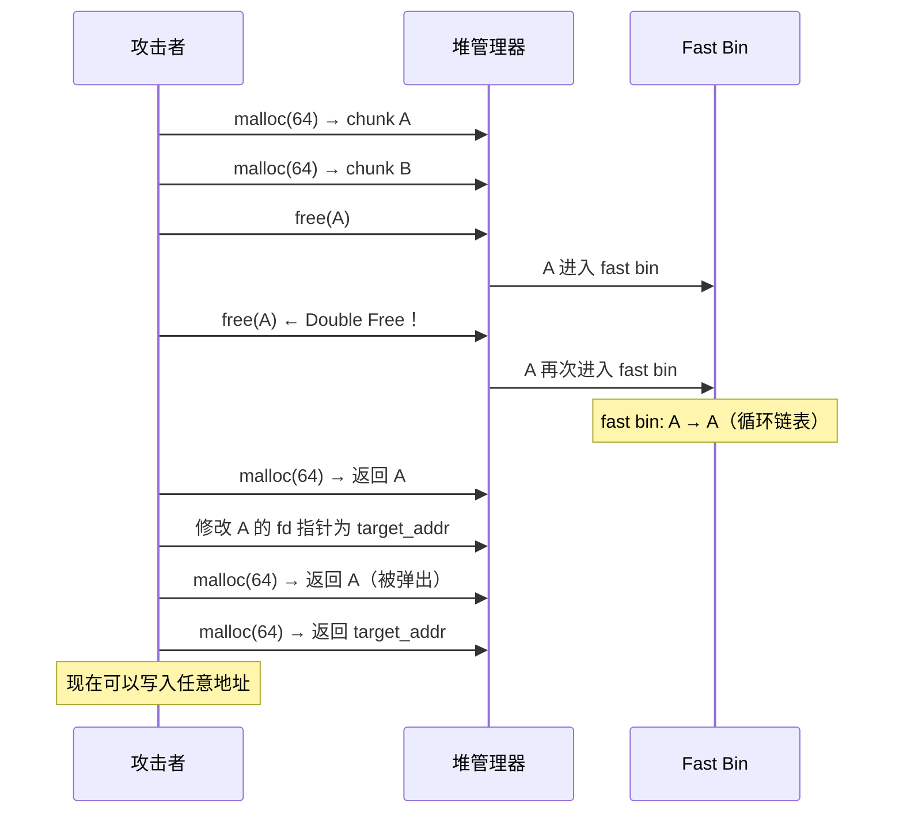
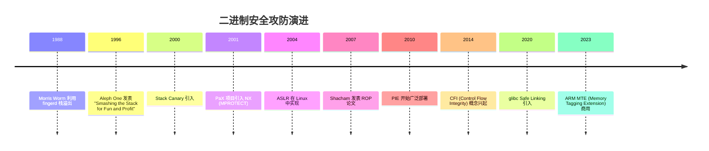
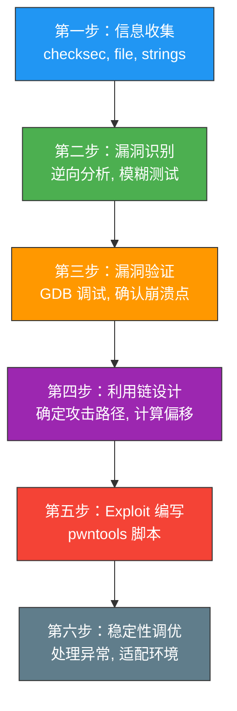
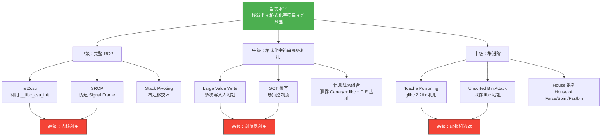

## 案例总结：从入门到实战的知识图谱

本章通过五个精心设计的实战案例，完整覆盖了二进制漏洞利用的核心技术栈。从最基础的栈溢出到堆利用，每一个案例都不是孤立的练习，而是整个知识体系中不可或缺的一环。本节将对全部案例进行系统性总结，帮助你建立完整的认知框架，明确自身水平定位，并规划后续的进阶路径。

---

### 一、五大案例全景回顾

#### 案例难度与技术演进

五个案例按照难度递进排列，形成了清晰的技术阶梯：


注意案例四（格式化字符串）虽然难度标为三星，但它与案例三的技术路线不同——案例一到三是栈溢出技术的逐步升级，案例四开辟了全新的漏洞类型，案例五则进入了堆的世界。这五条技术线在实际 CTF 和真实漏洞利用中会经常交叉使用。

#### 核心对比表

| 维度 | 案例一：栈溢出 | 案例二：Shellcode | 案例三：ret2libc | 案例四：格式化字符串 | 案例五：堆利用 |
|------|---------------|-------------------|-----------------|---------------------|---------------|
| **漏洞类型** | 栈缓冲区溢出 | 栈缓冲区溢出 | 栈缓冲区溢出 | 格式化字符串 | UAF / Double Free |
| **触发函数** | `gets()` | `read()` 越界 | `gets()` | `printf(buf)` | `free()` 后未置 NULL |
| **攻击目标** | 覆盖返回地址 | 覆盖返回地址 | 覆盖返回地址 | 任意内存写 | 堆元数据篡改 |
| **Payload 构造** | padding + addr | padding + jmp_rsp + shellcode | ROP chain | fmtstr_payload | chunk header 篡改 |
| **依赖条件** | 有 `win()` 函数 | NX 关闭 | libc 可泄露 | 格式串可控 | 可分配/释放堆块 |
| **关键工具** | objdump, GDB | pwntools shellcraft | ROPgadget, libc-database | pwntools fmtstr | pwndbg, GDB heap 命令 |
| **保护绕过** | 无（全部关闭） | NX（栈不可执行→用 jmp rsp） | NX + 部分 ASLR | Canary、PIE | ASLR（堆地址随机化） |
| **现实对应** | 遗留系统缓冲区溢出 | 嵌入式设备固件漏洞 | 服务器远程代码执行 | 信息泄露+权限提升 | 浏览器/内核提权 |

#### 漏洞根因分类

从漏洞根因的角度，五个案例可以归为三大类：

**第一类：边界检查缺失（案例一、二、三）**

`gets()` 和 `read()` 不检查输入长度，导致栈缓冲区被越界写入。这是最经典的内存安全问题，根源在于 C 语言不提供数组边界检查。修复方法很简单——用 `fgets()` 替代 `gets()`，用 `read()` 时严格限制长度——但遗留代码中大量存在这类问题。

**第二类：语义误用（案例四）**

`printf(buf)` 将用户输入直接当作格式化字符串处理。这不是缓冲区溢出，而是格式化字符串的语义被错误使用。修复方法是 `printf("%s", buf)`。这类漏洞的隐蔽性更高，因为代码看起来没有明显的"越界"操作。

**第三类：生命周期管理错误（案例五）**

`free()` 后没有将指针置为 NULL，导致悬垂指针（Dangling Pointer）可以被再次使用。这是堆利用中最常见的漏洞模式，修复方法是在 `free()` 后立即执行 `ptr = NULL`。但实际代码中的对象生命周期管理远比这复杂，涉及多线程、引用计数等场景。

---

### 二、技术栈深度解析

#### 2.1 栈溢出技术三部曲

案例一到案例三展示了栈溢出利用从简单到复杂的完整演进路径：

**阶段一：直接跳转（案例一）**

最简单的利用方式。程序中存在一个"方便"的目标函数（`win()`），攻击者只需覆盖返回地址，让 `ret` 指令跳转到该函数即可。

```text
Payload: [64字节填充] + [8字节 saved RBP] + [win() 地址]
```

这种方式的前提条件极为苛刻——目标程序中必须存在攻击者想要执行的代码。在 CTF 题目中，出题者通常会提供一个 `win()` 函数作为"彩蛋"；但在真实场景中，这种情况几乎不存在。

**阶段二：注入执行（案例二）**

当程序中没有"方便"的目标函数时，攻击者可以将自己编写的机器码（Shellcode）注入到栈上，然后跳转执行。这要求栈必须可执行（NX 关闭）。

核心挑战在于：覆盖返回地址后，如何跳转到紧跟其后的 Shellcode？案例二使用了 `jmp rsp` 技巧——在程序的代码段中搜索 `jmp rsp` 指令的地址，将返回地址覆盖为这个地址，CPU 执行 `ret` 后会跳到 `jmp rsp`，而此时 `rsp` 恰好指向返回地址后面的 Shellcode。

```yaml
Payload: [256字节填充] + [8字节 saved RBP] + [jmp_rsp地址] + [Shellcode]
                                                          ↑
                                              ret 弹出此地址，跳到 jmp rsp
                                              jmp rsp 跳到 RSP 指向的位置
                                              即此处 → Shellcode
```

**阶段三：代码复用（案例三）**

当 NX 开启后，栈上的数据不可执行，Shellcode 注入不再可行。此时需要利用程序或 libc 中已有的代码片段（Gadget）来构造攻击链——这就是 ROP（Return-Oriented Programming）。

案例三演示的 ret2libc 是 ROP 的一种特殊形式：通过两次溢出，第一次泄露 libc 中 `puts` 函数的真实地址（绕过 ASLR），第二次计算 `system()` 和 `/bin/sh` 的地址并调用。

```text
第一次溢出: [填充] + [pop rdi; ret] + [puts@GOT] + [puts@PLT] + [main]
                                       ↓
                              输出 puts 的真实地址 → 计算 libc 基址

第二次溢出: [填充] + [ret(对齐)] + [pop rdi; ret] + [/bin/sh] + [system()]
                                       ↓
                              调用 system("/bin/sh") → 拿到 Shell
```

三次递进的核心逻辑：

| 阶段 | 问题 | 解决方案 | 新增约束 |
|------|------|----------|----------|
| 案例一 | 没有 Shell 怎么办 | 程序自带 `win()` | 需要目标函数 |
| 案例二 | 没有目标函数怎么办 | 注入 Shellcode | 需要 NX 关闭 |
| 案例三 | NX 开启怎么办 | 复用已有代码（ROP） | 需要信息泄露 |

#### 2.2 格式化字符串的独特地位

案例四在技术路线上与前三者完全不同。它不依赖缓冲区溢出，而是利用 `printf()` 系列函数的格式化特性实现任意内存读写。

格式化字符串漏洞的核心能力：

| 格式符 | 能力 | 安全影响 |
|--------|------|----------|
| `%p` / `%x` | 读取栈上的值 | 信息泄露（栈数据、地址、Canary） |
| `%n` | 向指定地址写入已输出的字节数 | 任意内存写（修改变量、GOT 表） |
| `%s` | 读取指针指向的字符串 | 泄露堆/栈上的敏感数据 |
| `%<N>$p` | 直接访问栈上第 N 个参数 | 精确泄露指定位置的数据 |

格式化字符串漏洞之所以危险，是因为它可以用一条 `printf()` 调用同时实现信息泄露和任意写入。在案例四中，我们用 `fmtstr_payload()` 一行代码就完成了向 `secret` 变量写入 `0x41414141` 的操作。

在真实攻击中，格式化字符串漏洞常被用于：
- **泄露 Canary 值**：用 `%<偏移>$p` 读取栈上的 Canary，然后在栈溢出时正确填充
- **泄露 libc 地址**：读取 GOT 表中已解析的 libc 函数地址，计算 libc 基址
- **修改 GOT 表**：将某个 GOT 条目改为 `system()` 的地址，下次调用该函数时实际执行 `system()`

#### 2.3 堆利用的复杂世界

案例五是难度最高的一个，因为堆的内部结构比栈复杂得多。栈帧的布局是编译器确定的、可预测的；而堆的分配和释放涉及多个 bin 链表、元数据校验、合并机制等。

案例五演示的 Fast Bin Attack 核心流程：



堆利用的关键概念：

| 概念 | 含义 | 在案例五中的体现 |
|------|------|-----------------|
| Fast Bin | glibc 中用于小块分配的链表，LIFO 顺序 | `malloc(64)` 走 fast bin（≤ 0x80 字节） |
| Double Free | 同一块内存被 `free()` 两次 | `free(0); free(0);` 构造循环链表 |
| fd 指针 | Chunk 的前向指针，指向同一 bin 中的下一个 chunk | 修改 fd 可以劫持分配返回地址 |
| Chunk Header | 每个堆块的元数据（大小、标志位） | `prev_size` 和 `size` 字段 |

---

### 三、防御机制与绕过技术对照

每一个攻击技术的出现，都是为了绕过某个防御机制。理解这种攻防博弈，是安全研究的核心思维方式。

#### 安全保护全景表

| 保护机制 | 编译选项 | 防御原理 | 对应案例 | 绕过方法 | 绕过难度 |
|----------|----------|----------|----------|----------|----------|
| Stack Canary | `-fstack-protector` | 栈帧中插入随机值，函数返回前校验 | 案例一~三 | 格式化字符串泄露 Canary；fork 模式爆破 | ★★★ |
| NX (DEP) | `-z noexecstack` | 标记栈为不可执行 | 案例二 | ROP / ret2libc（案例三演示） | ★★★★ |
| PIE | `-pie` | 代码段基址随机化 | 案例一~三 | 信息泄露获取基址 | ★★★ |
| ASLR | 系统级配置 | 堆、栈、libc 地址随机化 | 案例三、五 | 泄露真实地址后计算偏移 | ★★★★ |
| Full RELRO | `-Wl,-z,relro,-z,now` | GOT 表在启动时解析完毕并设为只读 | 案例三 | 不能直接改 GOT，需其他方法 | ★★★★★ |
| Safe Linking | glibc 2.32+ | 对 fast bin 的 fd 指针做异或混淆 | 案例五 | 需要泄露堆地址来计算正确的 fd 值 | ★★★★ |

#### 攻防演进时间线



每一次防御升级都迫使攻击者发明新的绕过技术，这形成了一个不断升级的军备竞赛。理解这段历史，能帮助你预判未来的技术走向。

---

### 四、Exploit 开发通用方法论

虽然五个案例的漏洞类型各不相同，但 Exploit 的开发流程遵循一套通用方法论。掌握这套方法论，你就能面对任何新的漏洞类型时有章可循。

#### 通用六步法



#### 第一步：信息收集

拿到一个二进制文件后，第一件事不是打开 IDA，而是用命令行工具快速获取全局信息：

```bash
# 检查文件类型和架构
file vuln

# 检查安全保护
checksec --file=vuln

# 查看动态链接库（确定 libc 版本）
ldd vuln

# 搜索字符串（可能泄露 flag 路径、关键函数名等）
strings vuln | grep -i "flag\|secret\|shell\|system"

# 查看符号表（确定有哪些函数）
readelf -s vuln | grep FUNC

# 检查是否有特殊段（.got, .plt, .bss 等）
readelf -S vuln
```

这一步的结果决定了后续的攻击方向：
- **No canary + No PIE**：直接栈溢出，覆盖返回地址
- **NX enabled**：不能放 Shellcode，需要 ROP
- **PIE enabled**：需要先泄露基址
- **Full RELRO**：不能改 GOT，需要其他内存写原语

#### 第二步：漏洞识别

在 CTF 中，漏洞通常已经暗示在题目描述里。但在真实场景中，你需要主动寻找漏洞。常见的方法包括：

| 方法 | 适用场景 | 工具 |
|------|----------|------|
| 静态分析 | 源码可用或逆向二进制 | IDA Pro, Ghidra, radare2 |
| 模糊测试 | 有大量输入接口 | AFL++, libFuzzer |
| 动态分析 | 需要观察运行时行为 | GDB, Valgrind, AddressSanitizer |
| 模式匹配 | 已知危险函数 | grep, Semgrep |

重点关注的危险函数：

```c
gets()          → 无边界检查的行输入
strcpy()        → 无边界检查的字符串复制
strcat()        → 无边界检查的字符串拼接
sprintf()       → 无边界检查的格式化输出
scanf("%s")     → 无边界检查的输入
read(fd,buf,n)  → 如果 n > sizeof(buf)
printf(buf)     → 用户控制的格式化字符串
free(ptr)       → 如果 free 后 ptr 未置 NULL
```

#### 第三步：漏洞验证

确认漏洞存在后，用 GDB 精确定位崩溃点和可控范围：

```bash
# 使用 cyclic 模式确定偏移量
python3 -c "from pwn import *; print(cyclic(200))" > input.txt
gdb -q ./vuln
(gdb) r < input.txt
(gdb) p/x $rip                    # 查看崩溃时的返回地址
# 用 cyclic_find 计算精确偏移
python3 -c "from pwn import *; print(cyclic_find(0x...))"
```

#### 第四步：利用链设计

根据漏洞类型和保护机制，设计攻击路径。这一步需要最多的创造力和经验。常见模式：

- **有方便的目标函数** → 直接跳转（案例一）
- **栈可执行** → Shellcode 注入（案例二）
- **NX 开启** → ROP / ret2libc（案例三）
- **格式化字符串** → 信息泄露 + 任意写（案例四）
- **堆漏洞** → chunk 篡改 + 任意分配（案例五）
- **组合攻击** → 格式化字符串泄露 Canary + 栈溢出

#### 第五步：Exploit 编写

使用 pwntools 框架编写自动化攻击脚本。pwntools 提供了几乎所有你需要的原语：

```python
from pwn import *

# 基本配置
context.arch = 'amd64'
context.os = 'linux'

# 加载目标
elf = ELF('./vuln')
libc = ELF('./libc.so.6')

# 本地 / 远程切换
if args.REMOTE:
    p = remote('challenge.example.com', 1337)
else:
    p = process('./vuln')

# ROP 链构造
rop = ROP(elf)
pop_rdi = rop.find_gadget(['pop rdi', 'ret'])[0]
ret = rop.find_gadget(['ret'])[0]

# 格式化字符串
payload = fmtstr_payload(offset, {target_addr: value})

# 交互
p.interactive()
```

#### 第六步：稳定性调优

Exploit 在本地跑通后，还需要考虑远程环境的差异：

| 问题 | 原因 | 解决方案 |
|------|------|----------|
| 偏移量不同 | 远程环境的栈布局可能不同 | 用远程环境的 libc 重新计算 |
| 地址不固定 | ASLR 导致每次运行地址不同 | 信息泄露 + 动态计算 |
| 连接不稳定 | 网络延迟、超时 | 调整 `timeout`，使用 `p.recvuntil()` 精确同步 |
| 偶尔失败 | 地址中出现坏字符 | 换用其他 Gadget，避免 `\x00`, `\x0a`, `\x20` |

---

### 五、常见错误与排查指南

在学习这五个案例的过程中，初学者最容易犯的错误以及对应的排查方法：

#### 错误一：偏移量计算错误

**症状**：程序崩溃，但没有跳转到目标地址。

**排查**：

```python
# 用 cyclic 精确确定偏移量，不要手动数
from pwn import *
# 发送 cyclic 模式
cyclic(100) → 崩溃地址 → cyclic_find() → 精确偏移

# 检查是否有对齐填充
# x86-64 要求 16 字节栈对齐
# 如果跳转到函数，可能需要额外的 ret gadget 来修正对齐
```

#### 错误二：字节序搞反

**症状**：Payload 被截断或地址不正确。

**排查**：

```python
# x86/x86-64 是小端序！
# 地址 0x401156 的正确编码：
p64(0x401156)  # → b'\x56\x11\x40\x00\x00\x00\x00\x00'

# 常见错误：手写地址时用大端序
# 错误：b'\x00\x00\x00\x00\x40\x11\x56'
# 正确：b'\x56\x11\x40\x00\x00\x00\x00\x00'

# 永远用 p64()/p32()，不要手动写字节
```

#### 错误三：坏字符处理不当

**症状**：Payload 被截断，输入不完整。

**排查**：

| 输入函数 | 终止字符 | 影响 |
|----------|----------|------|
| `gets()` | `\n` (0x0a) | 地址中不能包含 `0x0a` |
| `scanf("%s")` | 空格、`\t`、`\n` | 地址中不能包含空白字符 |
| `read()` | 无（按长度读取） | 地址中可以包含任何字节 |
| `strcpy()` | `\x00` | 地址中不能包含 `0x00` |

解决方案：寻找替代 Gadget，或者使用部分覆写（Partial Overwrite）技术。

#### 错误四：栈对齐问题

**症状**：跳转到 `system()` 等函数后立即崩溃（SIGSEGV）。

**原因**：x86-64 要求在执行 `call` 指令前，RSP 是 16 字节对齐的。ROP 链中的 `pop rdi; ret` 会改变 RSP 的对齐状态。

**解决**：在 ROP 链中多加一个 `ret` gadget：

```python
# 错误（可能崩溃）
payload += p64(pop_rdi)
payload += p64(bin_sh_addr)
payload += p64(system_addr)

# 正确（多一个 ret 来修正对齐）
payload += p64(ret)         # 修正栈对齐
payload += p64(pop_rdi)
payload += p64(bin_sh_addr)
payload += p64(system_addr)
```

#### 错误五：GOT/PLT 混淆

**症状**：调用 `puts@PLT` 后没有输出，或者泄露的地址不对。

**排查**：

```python
# PLT 是过程链接表（跳板），存的是跳转代码
# GOT 是全局偏移表（缓存），存的是真实地址
elf.plt['puts']   # puts 的 PLT 条目地址（代码段，固定）
elf.got['puts']   # puts 的 GOT 条目地址（数据段，存真实地址）

# 第一次调用时，PLT 会触发动态链接器解析 GOT
# 第二次调用时，GOT 中已经是真实地址
# 所以泄露地址应该读 GOT 中的值（用 puts 打印 GOT 条目）
```

---

### 六、从 CTF 到真实世界

#### CTF 与真实漏洞利用的差异

| 维度 | CTF 题目 | 真实漏洞 |
|------|----------|----------|
| **漏洞位置** | 明确告诉你有漏洞 | 需要自己发现 |
| **目标程序** | 简化的小程序 | 复杂的大型软件 |
| **环境** | 已知的 libc 版本、无额外保护 | 未知的系统配置、多层防护 |
| **利用条件** | 理想化的输入接口 | 可能需要绕过 WAF、沙箱等 |
| **稳定性** | 跑通一次即可 | 需要高成功率 |
| **隐蔽性** | 不需要 | 需要避免被检测到 |

#### 真实漏洞利用的额外挑战

**1. 漏洞发现**

CTF 题目会明确告知漏洞位置，但真实场景中你需要在数百万行代码中找到一个可能被触发的漏洞。常用方法：

- 代码审计：人工阅读代码，重点关注危险函数调用
- 模糊测试（Fuzzing）：用 AFL++ 等工具自动生成随机输入，观察崩溃
- 补丁比对（Patch Diffing）：对比补丁前后的二进制，找到被修复的漏洞

**2. 环境适配**

真实环境中，你面对的可能是：
- 不同版本的 libc（glibc 2.31 和 2.35 的堆管理差异巨大）
- 不同的内核版本（内核利用和用户态利用完全不同）
- 容器化环境（Docker、namespace 隔离）
- 硬件差异（ARM vs x86、不同的页大小）

**3. 利用链的稳定性**

CTF 中一个 Exploit 跑通一次就够了，但真实漏洞利用需要高成功率。这要求：
- 避免使用概率性操作（如堆喷射）
- 处理地址随机化（多次尝试、信息泄露）
- 处理网络异常（超时、断连、乱序）

---

### 七、学习路线图

#### 当前水平评估

完成本章五个案例后，你应该能够：

| 能力 | 达标标准 | 自我检验 |
|------|----------|----------|
| 理解栈帧布局 | 能画出任意函数的栈帧图 | 拿到新程序能立刻说出偏移量 |
| 编写 Exploit | 用 pwntools 写出完整的利用脚本 | 独立完成一个栈溢出 + ROP |
| 使用调试工具 | GDB + pwndbg 基本操作 | 设断点、查看内存、单步跟踪 |
| 理解保护机制 | 知道每种保护的作用和绕过方法 | 看到 checksec 输出能制定攻击方案 |
| 堆利用基础 | 理解 fast bin 的分配和释放机制 | 手工画出 Double Free 的链表变化 |

#### 进阶路线图



#### 推荐练习平台

| 平台 | 难度 | 特点 | 地址 |
|------|------|------|------|
| pwn.college | 入门~中级 | 系统化课程，从零开始 | pwn.college |
| BUUCTF | 入门~高级 | 大量真题，中文社区 | buuoj.cn |
| CTFHub | 入门~中级 | 分类清晰，适合专项练习 | ctfhub.com |
| Hack The Box | 中级~高级 | 真实渗透环境 | hackthebox.com |
| ROP Emporium | 中级 | 专注 ROP 技术训练 | ropemporium.com |
| how2heap | 中级~高级 | 堆利用专项，覆盖所有 glibc 版本 | github.com/shellphish/how2heap |
| Nightmare | 入门~中级 | CTF 题解集合，带详细分析 | github.com/guyinatuxedo/nightmare |

#### 推荐阅读

| 资源 | 类型 | 适合阶段 | 说明 |
|------|------|----------|------|
| CTF Wiki | 在线文档 | 入门~中级 | 中文，覆盖所有 PWN 基础知识 |
| "Hacking: The Art of Exploitation" | 书籍 | 入门 | 经典教材，从底层讲起 |
| "The Shellcoder's Handbook" | 书籍 | 中级 | 深入各种利用技术 |
| "A Guide to Kernel Exploitation" | 书籍 | 高级 | 内核漏洞利用 |
| LiveOverflow YouTube | 视频 | 入门~中级 | 最好的二进制安全入门视频 |
| CTFTime Writeup | 文章 | 中级~高级 | 各大比赛的官方题解 |

---

### 八、案例知识速查卡

为了方便日后快速回忆，以下是每个案例的核心要点速查：

#### 案例一：经典栈溢出

```text
漏洞: gets(buffer) 无边界检查
目标: 覆盖返回地址 → 跳转 win()
Payload: 'A' * 72 + p64(win_addr)
编译: gcc -fno-stack-protector -no-pie -z execstack
关键工具: objdump -d, checksec, GDB
```

#### 案例二：Shellcode 注入

```text
漏洞: read(0, buffer, 512) 溢出 256 字节 buffer
目标: jmp rsp → 跳到 Shellcode
Payload: 'A' * 264 + p64(jmp_rsp_addr) + shellcode
编译: gcc -fno-stack-protector -no-pie -z execstack
关键技巧: 在程序代码段中搜索 jmp rsp 指令
```

#### 案例三：ret2libc

```text
漏洞: gets(buffer) 无边界检查
目标: 泄露 libc 地址 → 调用 system("/bin/sh")
第一次溢出: 'A'*72 + pop_rdi + puts@GOT + puts@PLT + main
第二次溢出: 'A'*72 + ret + pop_rdi + bin_sh + system
编译: gcc -fno-stack-protector -no-pie (NX 开启)
关键技巧: 两次溢出，第一次泄露，第二次利用
```

#### 案例四：格式化字符串

```text
漏洞: printf(buf) 用户控制的格式化字符串
目标: 向 secret 变量写入 0x41414141
Payload: fmtstr_payload(6, {secret_addr: 0x41414141})
关键步骤: 先用 %p 确定栈偏移，再用 %n 写入
关键工具: pwntools fmtstr_payload
```

#### 案例五：堆利用 Fast Bin Attack

```text
漏洞: free() 后未置 NULL (UAF/Double Free)
目标: 劫持 fast bin 分配，返回任意地址
核心操作: free(A) → free(A) → 修改 fd → malloc → malloc
关键概念: fast bin LIFO、chunk header、fd 指针
调试工具: pwndbg 的 heap 命令（heap, bins, vis_heap_chunks）
```

---

### 九、本章总结

本章五个案例从最基础的栈溢出开始，逐步引入 Shellcode 注入、ROP、格式化字符串和堆利用，构建了一条从入门到进阶的完整学习路径。每个案例都不是孤立的——它们共享同一个核心思维方式：**找到程序中的内存安全缺陷，构造精确的输入来劫持程序的控制流**。

回顾整个学习过程，最重要的收获不是某个具体的利用技术，而是以下三点思维方式：

**第一，攻击者思维**。安全研究的核心不是记住 Payload 的格式，而是学会从攻击者的角度看程序——每一个用户输入都是潜在的攻击面，每一个不检查边界的函数都是潜在的突破口。

**第二，分层思维**。现代系统的安全保护是多层叠加的——Canary 保护栈、NX 保护内存、PIE 保护地址、ASLR 保护布局。攻击者需要逐层绕过，防御者需要层层设防。理解每一层的作用和局限，才能构建有效的攻防策略。

**第三，工程思维**。Exploit 不是一段 Payload 就完事了，它是一个需要处理各种边界情况的工程——坏字符、栈对齐、环境差异、稳定性、隐蔽性。CTF 题目和真实漏洞利用之间的巨大鸿沟，就在于工程化的复杂度。

掌握这三点思维方式，你就具备了继续深入二进制安全领域的能力基础。接下来的章节将在此基础上，探讨更高级的利用技术和防御机制。
